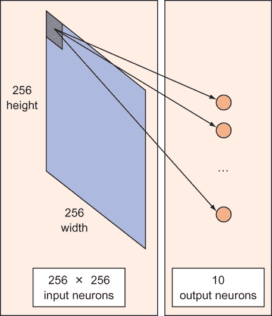
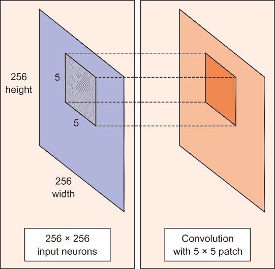
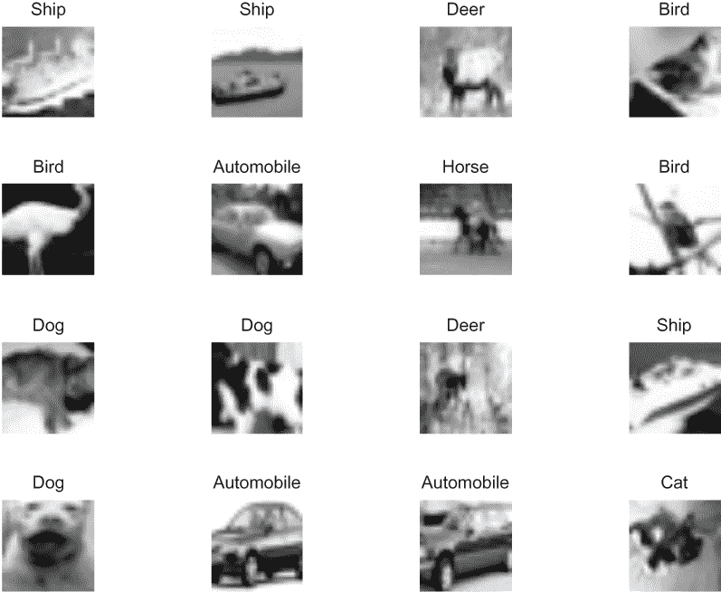
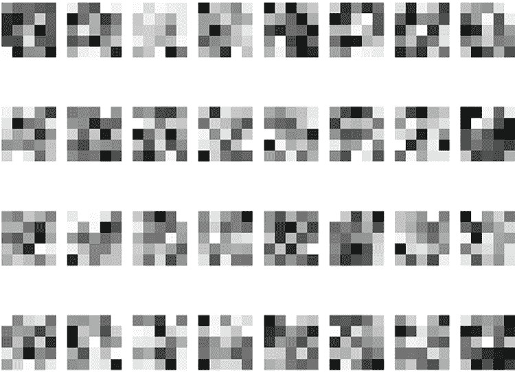
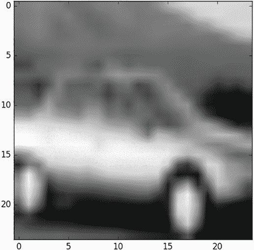
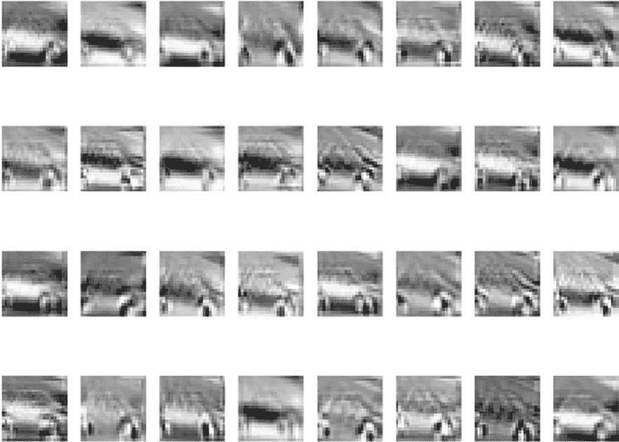
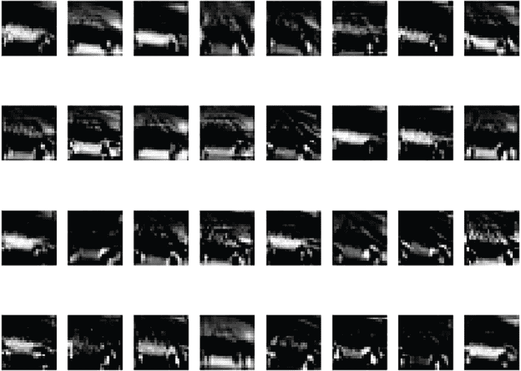
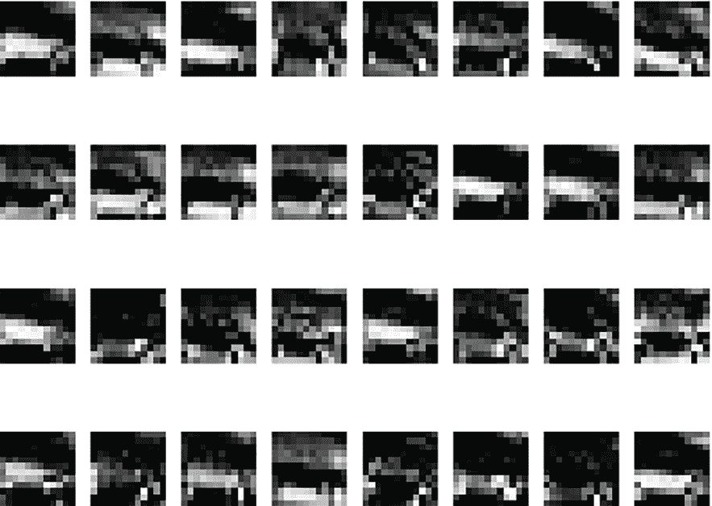
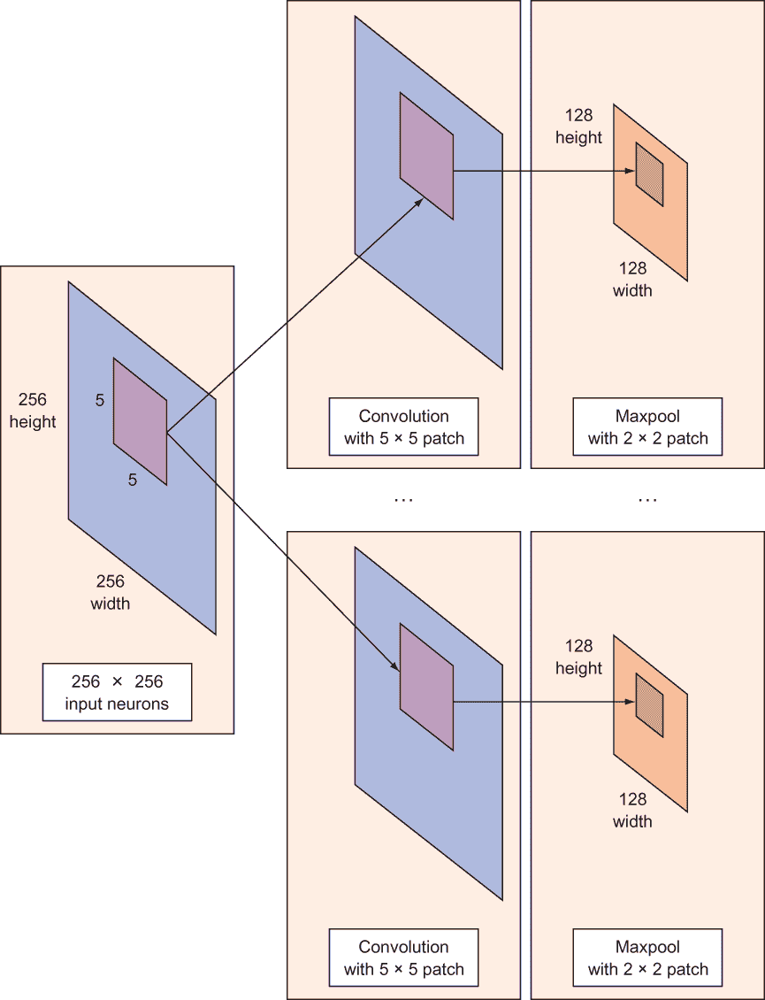

# 14 卷积神经网络

本章涵盖

+   检查卷积神经网络组件

+   使用深度学习对自然图像进行分类

+   提高神经网络性能——技巧和窍门

在疲惫的一天之后去购物是一种负担。我的眼睛被过多的信息轰炸。促销、优惠券、颜色、幼儿、闪烁的灯光和拥挤的通道是所有信号被发送到我的视觉皮层的一些例子，无论我是否试图注意。视觉系统吸收了大量的信息。

你是否听说过“一图胜千言”这句话？这可能对你或我来说是真的，但机器能否在图像中找到意义呢？我们视网膜中的光感受细胞接收光波长度，但这些信息似乎并没有传播到我们的意识中。毕竟，我无法用言语准确描述我接收到的光波长度。同样，相机捕捉像素，但我们希望提取某种形式的高级知识，例如物体的名称或位置。我们如何从像素到人类水平的感知过渡呢？

为了通过机器学习从原始感官输入中获取智能意义，你将设计一个神经网络模型。在前面的章节中，你已经看到了几种类型的神经网络模型，例如全连接的（第十三章）和自编码器（第十一章和第十二章）。在本章中，你将遇到另一种类型的模型：一种*卷积神经网络*（CNN），它在图像和其他感官数据（如音频）上表现非常出色。CNN 模型可以可靠地分类图像中显示的物体，例如。

在本章中，你将实现一个 CNN 模型，该模型将从 CIFAR-10 数据集（第十一章和第十二章）中学习如何将图像分类为十个候选类别之一。实际上，“一图只值十个可能性中的一个词”。这是向人类水平感知迈出的一小步，但你必须从某个地方开始，对吧？

## 14.1 神经网络的缺点

机器学习构成了一场永恒的斗争：设计一个足够表达数据，但又不过于灵活以至于过度拟合和记住模式的模型。神经网络被提出作为一种提高这种表达能力的途径，但正如你可能猜到的，它们经常受到过度拟合的陷阱。

注意：当你的学习模型在训练数据集上表现异常出色，但在测试数据集上表现不佳时，会发生过度拟合。该模型可能对可用数据的灵活性过高，最终几乎只是记住训练数据。

你可以使用的一个快速而简单的启发式方法来比较两个机器学习模型的灵活性，就是计算需要学习的参数数量。如图 14.1 所示，一个完全连接的神经网络，它接受一个 256 × 256 的图像并将其映射到一个包含 10 个神经元的层，将会有 256 × 256 × 10 = 655,360 个参数！与可能只有五个参数的模型相比，完全连接的神经网络可能能够表示比五个参数的模型更复杂的数据。



图 14.1 在一个完全连接的网络中，图像的每个像素都被视为一个输入。对于一个 256 × 256 大小的灰度图像，那就有 256 × 256 个神经元。将每个神经元连接到 10 个输出会产生 256 × 256 × 10 = 655,360 个权重。

第 14.2 节介绍了卷积神经网络（CNNs），这是一种减少参数数量的巧妙方法。而不是处理一个需要学习许多参数的完全连接网络，你可以采用 CNN 方法，多次重用相同的参数来减少学习到的权重数量。

## 14.2 卷积神经网络

CNNs 背后的主要思想是，对图像的局部理解已经足够好。实际的好处是，拥有更少的参数可以大大提高学习所需的时间，以及减少训练模型所需的数据量。然而，这种时间上的改进有时是以准确性为代价的。

与每个像素的权重完全连接的网络不同，CNN 有足够的权重来观察图像的一小部分。想象一下，你正在用放大镜读书；最终，你读完了整个页面，但你每次只看页面的一个小块。

考虑一个 256 × 256 的图像。而不是同时处理整个图像，你的 TensorFlow 代码可以高效地分块扫描它——比如说，一个沿着图像滑动（通常是左到右和上到下）的 5 × 5 窗口，如图 14.2 所示。它滑动的“快慢”被称为其步长。例如，步长为 2 意味着 5 × 5 滑动窗口每次移动 2 个像素，直到覆盖整个图像。在 TensorFlow 中，你可以通过使用内置的库函数轻松调整步长和窗口大小，正如你很快就会看到的。



图 14.2 在图像上卷积一个 5 × 5 的块（左侧）会产生另一个图像（右侧）。在这种情况下，产生的图像与原始图像大小相同。将原始图像转换为卷积图像只需要 5 × 5 = 25 个参数。

这个 5 × 5 的窗口有一个相关的 5 × 5 权重矩阵。

注意：*卷积*是图像像素值的加权求和，当窗口在整个图像上滑动时。这个带有权重矩阵的卷积过程在整个图像上产生另一个大小相同的图像，具体取决于惯例。*卷积*是将卷积应用于图像的过程。

滑动窗口的把戏发生在神经网络的*卷积层*上。一个典型的 CNN 有多个卷积层。每个卷积层通常生成许多交替的卷积，所以权重矩阵是一个 5 × 5 × *n*的张量，其中*n*是卷积的数量。

假设一个图像通过一个 5 × 5 × 64 的权重矩阵的卷积层。这个层通过滑动一个 5 × 5 的窗口生成 64 个卷积。因此，这个模型有 5 × 5 × 64（= 1,600）个参数，这比全连接网络少得多，全连接网络有 256 × 256（= 65,536）个参数。

CNN 的美丽之处在于参数数量与原始图像的大小无关。你可以在一个 300 × 300 的图像上运行相同的 CNN，卷积层的参数数量不会改变！

## 14.3 准备图像

要开始在 TensorFlow 中实现 CNN，你需要获取一些图像来工作。本节中的代码列表帮助你设置本章剩余部分的训练数据集。

首先，从[www.cs.toronto.edu/~kriz/cifar-10-python.tar.gz](http://www.cs.toronto.edu/~kriz/cifar-10-python.tar.gz)下载 CIFAR-10 数据集；如果需要，回顾第十一章和第十二章以获取更多相关信息。这个数据集包含 60,000 张图像，分为 10 个类别，这使得它成为分类任务的极好资源，正如我在那些章节中向你展示的那样。将文件提取到你的工作目录中。图 14.3 显示了数据集的图像示例。



图 14.3 CIFAR-10 数据集的图像。因为它们只有 32 × 32，所以有点难以看清，但你还是可以识别出一些物体。

你在第十二章使用了 CIFAR-10 数据集，所以再次调出那段代码。列表 14.1 直接来自 CIFAR-10 文档[www.cs.toronto.edu/~kriz/cifar.html](http://www.cs.toronto.edu/~kriz/cifar.html)。将代码放入一个名为 cifar_tools.py 的文件中。

列表 14.1 使用 Python 从 CIFAR-10 文件中加载图像

```
import pickle

def unpickle(file):
    fo = open(file, 'rb')
    dict = pickle.load(fo, encoding='latin1')
    fo.close()
    return dict
```

神经网络已经容易过拟合，所以你需要尽可能减少那个错误。因此，始终记得在处理之前清洗数据。到现在为止，你已经看到数据清洗和流程有时是大部分的工作。

清洗数据是机器学习流程中的核心过程。列表 14.2 实现了以下三个步骤来清洗图像数据集：

1.  如果你有一个彩色图像，尝试将其转换为灰度图以降低输入数据的维度，从而降低参数数量。

1.  考虑对图像进行中心裁剪，因为图像的边缘可能不提供任何有用的信息。

1.  通过从每个数据样本中减去均值并除以标准差来归一化你的输入，这样在反向传播过程中梯度不会变化得太剧烈。

列表 14.2 展示了如何使用这些技术清理图像数据集。

列表 14.2 清理数据

```
import numpy as np

def clean(data):
    imgs = data.reshape(data.shape[0], 3, 32, 32)          ❶
    grayscale_imgs = imgs.mean(1)                          ❷
    cropped_imgs = grayscale_imgs[:, 4:28, 4:28]           ❸
    img_data = cropped_imgs.reshape(data.shape[0], -1)
    img_size = np.shape(img_data)[1]
    means = np.mean(img_data, axis=1)
    meansT = means.reshape(len(means), 1)
    stds = np.std(img_data, axis=1)
    stdsT = stds.reshape(len(stds), 1)
    adj_stds = np.maximum(stdsT, 1.0 / np.sqrt(img_size))  
    normalized = (img_data - meansT) / adj_stds            ❹
    return normalized
```

❶ 将数据重新组织成 32 × 32 的矩阵，具有三个通道

❷ 通过平均颜色强度将图像转换为灰度

❸ 将 32 × 32 的图像裁剪成 24 × 24 的图像以减少参数

❹ 通过减去均值并除以标准差来归一化像素值

将 CIFAR-10 中的所有图像收集到内存中，并在它们上运行清理函数。列表 14.3 设置了一个方便的方法来读取、清理和结构化你的数据，以便在 TensorFlow 中使用。请将此代码包含在 cifar_tools.py 中。

列表 14.3 预处理所有 CIFAR-10 文件

```
def read_data(directory):
    names = unpickle('{}/batches.meta'.format(directory))['label_names']
    print('names', names)

    data, labels = [], []
    for i in range(1, 6):
        filename = '{}/data_batch_{}'.format(directory, i)
        batch_data = unpickle(filename)
        if len(data) > 0:
            data = np.vstack((data, batch_data['data']))
            labels = np.hstack((labels, batch_data['labels']))
        else:
            data = batch_data['data']
            labels = batch_data['labels']

    print(np.shape(data), np.shape(labels))

    data = clean(data)
    data = data.astype(np.float32)
    return names, data, labels
```

在另一个名为 using_cifar.py 的文件中，你可以通过导入`cifar_tools`来使用该方法。列表 14.4 和 14.5 展示了如何从数据集中采样一些图像并可视化它们。

列表 14.4 使用`cifar_tools`辅助函数

```
import cifar_tools

names, data, labels = \
    cifar_tools.read_data('your/location/to/cifar-10-batches-py')
```

你可以随机选择一些图像并绘制它们对应的标签。列表 14.5 正是这样做的，这有助于你更好地理解你将处理的数据类型。

列表 14.5 可视化数据集中的图像

```
import numpy as np
import matplotlib.pyplot as plt
import random

def show_some_examples(names, data, labels):
    plt.figure()
    rows, cols = 4, 4                                            ❶
    random_idxs = random.sample(range(len(data)), rows * cols)   ❷
    for i in range(rows * cols):    
        plt.subplot(rows, cols, i + 1)
        j = random_idxs[i]
        plt.title(names[labels[j]])
        img = np.reshape(data[j, :], (24, 24))
        plt.imshow(img, cmap='Greys_r')
        plt.axis('off')
    plt.tight_layout()
    plt.savefig('cifar_examples.png')

show_some_examples(names, data, labels)
```

❶ 改变到你想要的行数和列数。

❷ 从数据集中随机选择图像进行展示

运行此代码后，将生成一个名为 cifar_examples.png 的文件，其外观将与本节中较早的图 14.3 相似。

### 14.3.1 生成过滤器

在本节中，你将使用几个随机的 5 × 5 补丁（也称为*过滤器*）对图像进行卷积。这一步在 CNN 中非常重要，因此你需要仔细检查数据是如何转换的。为了理解图像处理的 CNN 模型，观察图像过滤器如何转换图像是明智的。过滤器提取有用的图像特征，如边缘和形状。你可以在这些特征上训练机器学习模型。

记住，特征向量表示了如何表示数据点。当你对一个图像应用过滤器时，转换后的图像中的对应点是一个特征——这个特征表明，“当你将这个过滤器应用到这个点时，它具有这个新的值。”你在一个图像上使用的过滤器越多，特征向量的维度就越大。整体目标是平衡减少维度的过滤器数量，同时仍然捕捉到原始图像中的重要特征。

打开一个名为 conv_visuals.py 的新文件。让我们随机初始化 32 个滤波器。你将通过定义一个名为 W 的大小为 5 × 5 × 1 × 32 的变量来完成此操作。前两个维度对应于滤波器大小；最后一个维度对应于 32 个卷积。变量大小中的 1 对应于输入维度，因为 `conv2d` 函数能够卷积多通道的图像。 (在这个例子中，你只关心灰度图像，所以输入通道的数量是 1。) 列表 14.6 提供了生成滤波器的代码，这些滤波器如图 14.4 所示。

列表 14.6 生成和可视化随机滤波器

```
W = tf.Variable(tf.random_normal([5, 5, 1, 32]))    ❶

def show_weights(W, filename=None):
    plt.figure()
    rows, cols = 4, 8                               ❷
    for i in range(np.shape(W)[3]):                 ❸
        img = W[:, :, 0, i]
        plt.subplot(rows, cols, i + 1)
        plt.imshow(img, cmap='Greys_r', interpolation='none')
        plt.axis('off')
    if filename:
        plt.savefig(filename)
    else:
        plt.show()
```

❶ 定义表示随机滤波器的张量

❷ 定义足够的行和列以显示图 14.4 中的 32 个图像

❸ 可视化每个滤波器矩阵



图 14.4 这些 32 个随机初始化的矩阵大小为 5 × 5。这些矩阵代表你将用于卷积输入图像的滤波器。

练习 14.1

你需要在列表 14.6 中做哪些更改以生成大小为 3 × 3 的 64 个滤波器？

**答案**

W = tf.Variable(tf.random_normal([3, 3, 1, 64]))

使用列表 14.7 中所示的会话，并使用 `global_variables_initializer` 操作初始化一些权重。调用 `show_weights` 函数来可视化如图 14.4 所示的随机滤波器。

列表 14.7 使用会话初始化权重

```
with tf.Session() as sess:
    sess.run(tf.global_variables_initializer())

    W_val = sess.run(W)
    show_weights(W_val, 'step0_weights.png')
```

### 14.3.2 使用滤波器进行卷积

14.3.1 节向你展示了如何准备用于卷积的滤波器。在本节中，你将使用 TensorFlow 的卷积函数对随机生成的滤波器进行卷积。列表 14.8 设置了可视化卷积输出的代码。你将在之后使用它，就像你使用了 `show_weights`。

列表 14.8 展示卷积结果

```
def show_conv_results(data, filename=None):
    plt.figure()
    rows, cols = 4, 8
    for i in range(np.shape(data)[3]):
        img = data[0, :, :, i]                         ❶
        plt.subplot(rows, cols, i + 1)
        plt.imshow(img, cmap='Greys_r', interpolation='none')
        plt.axis('off')
    if filename:
        plt.savefig(filename)
    else:
        plt.show()
```

❶ 与列表 14.6 不同，张量形状不同；它不是权重，而是结果图像。

假设你有一个示例输入图像，例如图 14.5 中所示。你可以使用 5 × 5 滤波器对 24 × 24 图像进行卷积，从而产生许多卷积图像。所有这些卷积都是对同一图像的独特视角。这些视角共同工作，以理解图像中存在的对象。列表 14.9 展示了如何逐步执行此任务。



图 14.5 来自 CIFAR-10 数据集的一个示例 24 × 24 图像

列表 14.9 可视化卷积

```
raw_data = data[4, :]                                             ❶
raw_img = np.reshape(raw_data, (24, 24))                          ❶
plt.figure()                                                      ❶
plt.imshow(raw_img, cmap='Greys_r')                               ❶
plt.savefig('input_image.png')                                    ❶

x = tf.reshape(raw_data, shape=[-1, 24, 24, 1])                   ❷

b = tf.Variable(tf.random_normal([32]))                           ❸
conv = tf.nn.conv2d(x, W, strides=[1, 1, 1, 1], padding='SAME')   ❸
conv_with_b = tf.nn.bias_add(conv, b)                             ❸
conv_out = tf.nn.relu(conv_with_b)                                ❸

with tf.Session() as sess:                                        ❹
    sess.run(tf.global_variables_initializer())                   ❹

    conv_val = sess.run(conv)                                     ❹
    show_conv_results(conv_val, 'step1_convs.png')                ❹
    print(np.shape(conv_val))                                     ❹

conv_out_val = sess.run(conv_out)                                 ❹
    show_conv_results(conv_out_val, 'step2_conv_outs.png')        ❹
    print(np.shape(conv_out_val)) 
```

❶ 从 CIFAR 数据集中获取一个图像并可视化

❷ 定义 24 × 24 图像的输入张量

❸ 定义滤波器和相应的参数

❹ 在选定的图像上运行卷积

最后，通过在 TensorFlow 中运行 `conv2d` 函数，你得到图 14.6 中的 32 个图像。卷积图像的想法是，每个 32 个卷积捕捉到图像的不同特征。



图 14.6 在汽车图像上应用随机滤波器后的结果图像

通过添加偏置项和激活函数（如 `relu`，见列表 14.12 中的示例），网络的卷积层表现出非线性，这提高了其表达能力。图 14.7 显示了每个 32 个卷积输出变成了什么。



图 14.7 在你添加偏置项和激活函数后，结果卷积可以捕捉到图像中更强大的模式。图 14.7 显示了每个 32 个卷积输出变成了什么。

### 14.3.3 最大池化

在卷积层提取有用特征之后，通常减少卷积输出的尺寸是一个好主意。对卷积输出进行缩放或子采样有助于减少参数数量，这反过来又可以帮助防止数据过拟合。

这个概念是 *最大池化* 的主要思想，它在图像上扫过一个窗口并选择具有最大值的像素。根据步长长度，结果图像是原始图像大小的分数。这项技术很有用，因为它减少了数据的维度，减少了后续步骤中的参数数量。

练习 14.2

假设你想要在一个 32 × 32 的图像上进行最大池化。如果窗口大小是 2 × 2，步长长度是 2，那么结果的最大池化图像有多大？

**答案**

2 × 2 窗口需要在每个方向上移动 16 次，以覆盖 32 × 32 的图像，因此图像将缩小一半：16 × 16。因为它在两个维度上都缩小了一半，所以图像是原始图像的四分之一大小（½ × ½）。

将列表 14.10 放在 `Session` 上下文中。

列表 14.10 运行 `maxpool` 函数进行卷积图像子采样

```
  k = 2
  maxpool = tf.nn.max_pool(conv_out, 
                           ksize=[1, k, k, 1], 
                           strides=[1, k, k, 1], 
                           padding='SAME')

with tf.Session() as sess:
    maxpool_val = sess.run(maxpool)
    show_conv_results(maxpool_val, 'step3_maxpool.png')
    print(np.shape(maxpool_val))
```

运行此代码的结果是，最大池化函数将图像尺寸减半，并产生如图 14.8 所示的低分辨率卷积输出。



图 14.8 在 `maxpool` 运行后，卷积输出的大小减半，这使得算法在计算上更快，同时没有丢失太多信息。

你已经有了实现完整 CNN 所需的工具。在第 14.4 节中，你将最终训练分类器。

## 14.4 在 TensorFlow 中实现 CNN

CNN 有多个卷积和最大池化层。卷积层提供了对图像的不同视角，最大池化层通过减少维度简化了计算，同时没有丢失太多信息。

考虑一个全尺寸 256 × 256 的图像通过一个 5 × 5 滤波器卷积成 64 个卷积。如图 14.9 所示，每个卷积通过最大池化进行子采样，产生 64 个较小的 128 × 128 尺寸的卷积图像。



图 14.9 一个输入图像通过多个 5 × 5 滤波器进行卷积。卷积层包括一个附加的偏置项和激活函数，结果有 5 × 5 + 5 = 30 个参数。接下来，一个最大池化层减少了数据的维度（不需要额外的参数）。

现在你已经知道了如何制作滤波器和使用卷积操作，让我们创建一个新的源文件。你将首先定义所有变量。在列表 14.11 中，导入所有库，加载数据集，并定义所有变量。

列表 14.11 设置 CNN 权重

```
import numpy as np
import matplotlib.pyplot as plt
import cifar_tools
import tensorflow as tf
names, data, labels = \
    cifar_tools.read_data('/home/binroot/res/cifar-10-batches-py')   ❶

x = tf.placeholder(tf.float32, [None, 24 * 24])                      ❷
y = tf.placeholder(tf.float32, [None, len(names)])                   ❷

W1 = tf.Variable(tf.random_normal([5, 5, 1, 64]))                    ❸
b1 = tf.Variable(tf.random_normal([64]))                             ❸

W2 = tf.Variable(tf.random_normal([5, 5, 64, 64]))                   ❹
b2 = tf.Variable(tf.random_normal([64]))                             ❹

W3 = tf.Variable(tf.random_normal([6*6*64, 1024]))                   ❺
b3 = tf.Variable(tf.random_normal([1024]))                           ❺

W_out = tf.Variable(tf.random_normal([1024, len(names)]))            ❻
b_out = tf.Variable(tf.random_normal([len(names)]))                  ❻
```

❶ 加载数据集

❷ 定义输入和输出占位符

❸ 应用 64 个 5 × 5 窗口大小的卷积

❹ 应用 64 个更多 5 × 5 窗口大小的卷积

❺ 引入一个全连接层

❻ 定义全连接线性层的变量

在列表 14.12 中，你定义了一个辅助函数来执行卷积、添加偏置项，然后添加激活函数。这三个步骤共同构成了网络的一个卷积层。

列表 14.12 创建卷积层

```
def conv_layer(x, W, b):
    conv = tf.nn.conv2d(x, W, strides=[1, 1, 1, 1], padding='SAME')
    conv_with_b = tf.nn.bias_add(conv, b)
    conv_out = tf.nn.relu(conv_with_b)
    return conv_out
```

列表 14.13 展示了如何通过指定内核和步长大小来定义最大池化层。

列表 14.13 创建最大池化层

```
def maxpool_layer(conv, k=2):
    return tf.nn.max_pool(conv, ksize=[1, k, k, 1], strides=[1, k, k, 1], 
    ➥ padding='SAME')
```

你可以将卷积层和最大池化层堆叠起来，以定义 CNN 架构。列表 14.14 定义了一个可能的 CNN 模型。最后一层通常是连接到每个 10 个输出神经元的全连接网络。

列表 14.14 完整的 CNN 模型

```
def model():
    x_reshaped = tf.reshape(x, shape=[-1, 24, 24, 1])

    conv_out1 = conv_layer(x_reshaped, W1, b1)                             ❶
    maxpool_out1 = maxpool_layer(conv_out1)                                ❶
    norm1 = tf.nn.lrn(maxpool_out1, 4, bias=1.0, alpha=0.001 / 9.0,        ❶
    ➥ beta=0.75)                                                          ❶

    conv_out2 = conv_layer(norm1, W2, b2)                                  ❷
    norm2 = tf.nn.lrn(conv_out2, 4, bias=1.0, alpha=0.001 / 9.0, beta=0.75)❷
    maxpool_out2 = maxpool_layer(norm2)                                    ❷

    maxpool_reshaped = tf.reshape(maxpool_out2, [-1,                       ❸
    ➥ W3.get_shape().as_list()[0]])                                       ❸
    local = tf.add(tf.matmul(maxpool_reshaped, W3), b3)                    ❸
    local_out = tf.nn.relu(local)                                          ❸

    out = tf.add(tf.matmul(local_out, W_out), b_out)                       ❸
    return out                                                             ❸
```

❶ 构建卷积和最大池化的第一层

❷ 构建第二层

❸ 构建最后的全连接层

### 14.4.1 测量性能

设计好神经网络架构后，下一步是定义一个你想要最小化的损失函数。你将使用 TensorFlow 的`softmax_cross_entropy_with_logits`函数，官方文档中对其有最佳描述，请参阅[`mng.bz/4Blw`](http://mng.bz/4Blw)：

[函数`softmax_cross_entropy_with_logits`]用于测量在类别互斥的离散分类任务中的概率误差（每个条目恰好属于一个类别）。例如，每个 CIFAR-10 图像都标记了一个标签：一个图像可以是狗或卡车，但不能同时是两者。

由于一个图像可能属于十个可能的标签之一，因此你将这个选择表示为一个 10 维向量。这个向量的所有元素值都是`0`，除了与标签对应的元素，其值将是`1`。正如你在前面的章节中看到的，这种表示方法称为*独热编码*。

如列表 14.15 所示，你将通过我在第六章提到的交叉熵损失函数来计算成本。此代码返回你的分类的概率误差。请注意，此代码仅适用于简单的分类——那些你的类别是互斥的。例如，一个卡车不能同时是狗。你可以使用许多类型的优化器，但在这个例子中，你坚持使用 AdamOptimizer，这是一个快速、简单的优化器，在[`mng.bz/QxJG`](http://mng.bz/QxJG)上有详细描述。

在实际应用中，可能需要尝试调整参数，但 AdamOptimizer 现成效果很好。

列表 14.15 定义测量成本和准确性的操作

```
model_op = model()

cost = tf.reduce_mean(                                                  ❶
    tf.nn.softmax_cross_entropy_with_logits(logits=model_op, labels=y)
)

train_op = tf.train.AdamOptimizer(learning_rate=0.001).minimize(cost)   ❷

correct_pred = tf.equal(tf.argmax(model_op, 1), tf.argmax(y, 1))
accuracy = tf.reduce_mean(tf.cast(correct_pred, tf.float32))
```

❶ 定义分类损失函数

❷ 定义训练操作以最小化损失函数

最后，在 14.4.2 节中，你将运行训练操作以最小化神经网络的成本。在数据集上多次执行此操作将教会最优的权重（或参数）。

### 14.4.2 训练分类器

在列表 14.16 中，你将通过小批量遍历图像数据集来训练神经网络。随着时间的推移，权重将逐渐收敛到一个局部最优，以准确预测训练图像。

列表 14.16 使用 CIFAR-10 数据集训练神经网络

```
with tf.Session() as sess:
    sess.run(tf.global_variables_initializer())
    onehot_labels = tf.one_hot(labels, len(names), on_value=1., off_value=0., 
    ➥ axis=-1)
    onehot_vals = sess.run(onehot_labels)
    batch_size = len(data) // 200
    print('batch size', batch_size)
    for j in range(0, 1000):                           ❶
        print('EPOCH', j)
        for i in range(0, len(data), batch_size):      ❷
            batch_data = data[i:i+batch_size, :]
            batch_onehot_vals = onehot_vals[i:i+batch_size, :]
            _, accuracy_val = sess.run([train_op, accuracy], feed_dict={x: 
            ➥ batch_data, y: batch_onehot_vals})
            if i % 1000 == 0:
                print(i, accuracy_val)
        print('DONE WITH EPOCH')
```

❶ 循环遍历 1,000 个 epoch

❷ 批量训练网络

就这样！你已经成功设计了一个用于图像分类的 CNN。请注意：训练 CNN 可能需要超过 10 分钟的时间。如果你在 CPU 上运行此代码，甚至可能需要数小时！你能想象在等待一天后发现代码中存在错误吗？这就是为什么深度学习研究人员使用强大的计算机和 GPU 来加速计算。

## 14.5 提高性能的技巧和窍门

本章中你开发的 CNN 是解决图像分类问题的一种简单方法，但在完成第一个工作原型后，许多技术可以提高性能：

+   数据增强——从一个单独的图像中，你可以轻松地生成新的训练图像。作为开始，你可以水平或垂直翻转图像，这样可以将数据集的大小增加到原来的四倍。你还可以调整图像的亮度或色调，以确保神经网络能够泛化到其他波动。你甚至可能想要向图像中添加随机噪声，使分类器对小的遮挡具有鲁棒性。调整图像的大小也可能很有帮助；在训练图像中保持完全相同大小的项目几乎可以保证过拟合。

+   提前停止——在训练神经网络的同时，跟踪训练和测试错误。最初，这两种类型的错误应该缓慢减少，因为网络正在学习。但有时，测试错误会再次上升，这表明神经网络已经开始在训练数据上过拟合，并且无法泛化到之前未见过的输入。你应该在发现这种现象时立即停止训练。

+   正则化权重——另一种对抗过拟合的方法是在损失函数中添加一个正则化项。你已经在之前的章节中看到了正则化，这里同样适用相同的概念。

+   Dropout——TensorFlow 提供了一个方便的`tf.nn.dropout`函数，可以将它应用于网络的任何一层以减少过拟合。在训练过程中，该函数会关闭随机选择的一定数量的神经元，从而使网络在推断输出时具有冗余性和鲁棒性。

+   深度架构——通过向神经网络添加更多的隐藏层，可以得到更深的架构。如果你有足够的训练数据，添加更多的隐藏层已被证明可以提高性能。然而，网络将需要更多的时间来训练。

练习 14.3

在这个 CNN 架构的第一轮迭代之后，尝试应用本章中提到的几个技巧和窍门。

**答案**

精调是这个过程的一部分，遗憾的是。你应该从调整超参数和重新训练算法开始，直到找到最佳设置。

## 14.6 CNNs 的应用

当输入包含来自音频或图像的传感器数据时，CNNs 会蓬勃发展。特别是图像在工业界中非常重要。例如，当你注册社交网络时，你通常会上传个人照片，而不是你自己的“你好”音频录音。人类似乎天生喜欢照片，因此你可以尝试看看 CNNs 如何用于检测图像中的面部。

整个 CNN 架构可以像你希望的那样简单或复杂。你应该从简单开始，逐渐调整你的模型，直到你满意为止。没有一条正确的路径，因为面部识别尚未完全解决。研究人员仍在发表超越先前最先进解决方案的论文。

你的第一步应该是获取一个图像数据集。最大的任意图像数据集之一是 ImageNet ([`image-net.org`](http://image-net.org/))。在这里，你可以找到你的二元分类器的负面示例。要获取面部正面示例，你可以在以下专注于人类面部的网站上找到许多数据集：

+   VGG -Face 数据集 ([`www.robots.ox.ac.uk/~vgg/data/vgg_face`](http://www.robots.ox.ac.uk/~vgg/data/vgg_face/))

+   面部检测数据集和基准（FDDB）([`vis-www.cs.umass.edu/ fddb`](http://vis-www.cs.umass.edu/fddb/))

+   面部检测和姿态估计数据库 ([`mng.bz/X0Jv`](http://mng.bz/X0Jv))

+   YouTube 面部数据库 ([www.cs.tau.ac.il/~wolf/ytfaces](http://www.cs.tau.ac.il/~wolf/ytfaces/))

## 摘要

+   卷积神经网络（CNNs）假设捕捉信号的局部模式足以表征该信号，从而减少神经网络的参数数量。

+   清洗数据对于大多数机器学习模型的表现至关重要。你用来编写清洗数据代码的小时与神经网络自己学习这个清洗函数所需的时间相比微不足道。
