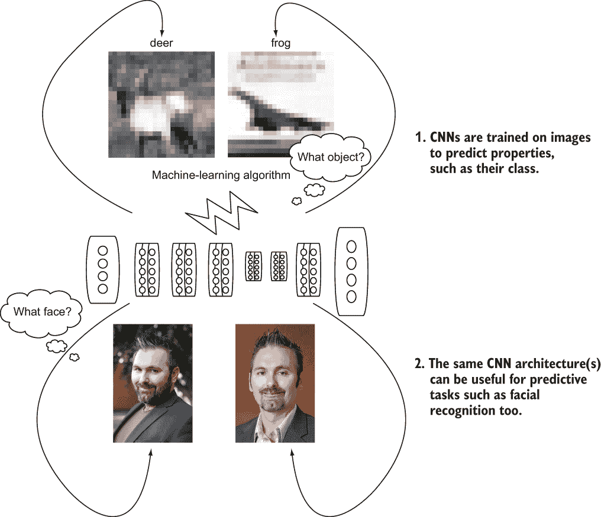
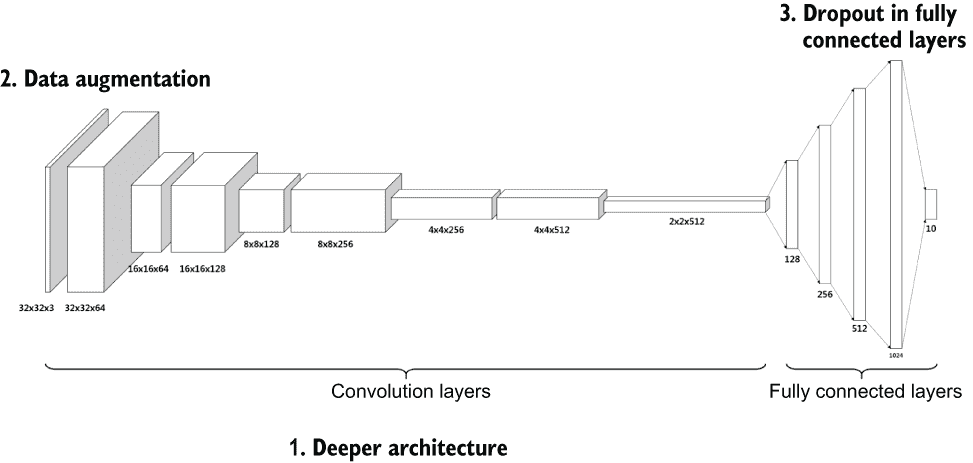
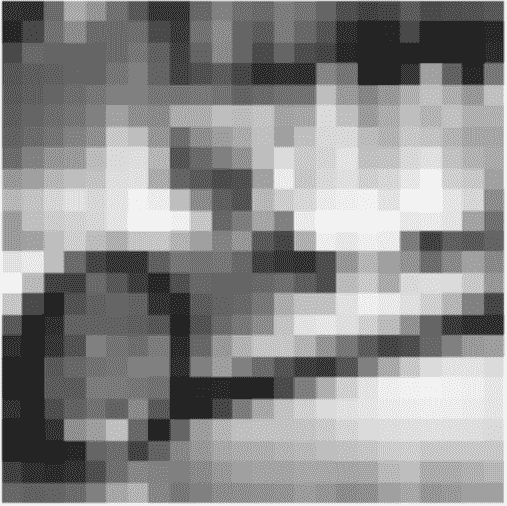
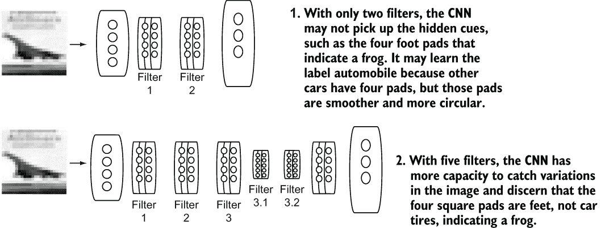
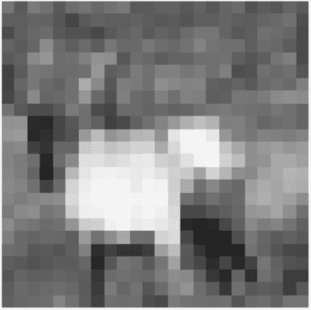
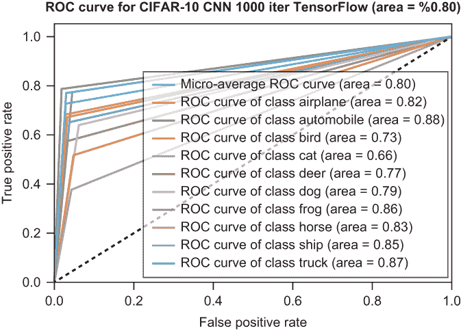
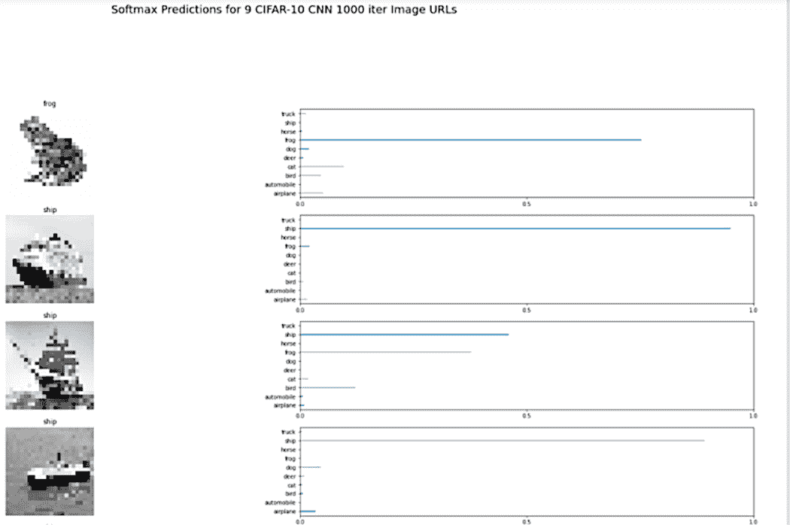
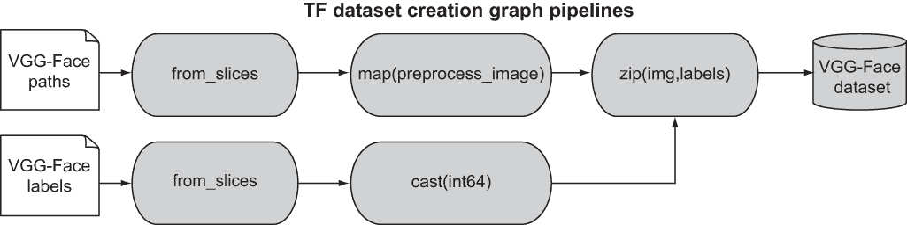
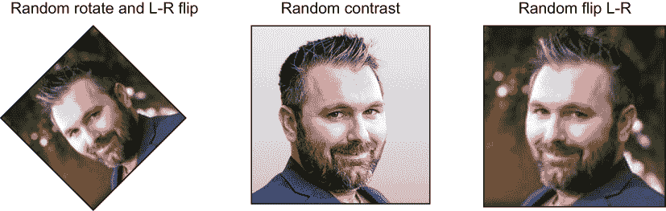
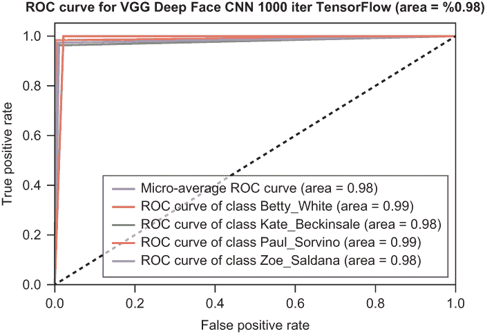

# 15 构建真实世界的 CNN：VGG-Face 和 VGG-Face Lite

本章涵盖

+   为训练卷积神经网络（CNN）增强数据

+   通过使用 dropout 和批量归一化调整 CNN 并评估性能

+   使用 CIFAR-10 和面部识别构建准确的 CNN

卷积神经网络（CNN）架构是分析图像和区分其特征的有用工具。线条或曲线可能表明你最喜欢的汽车，或者指示可能是一个特定的更高阶特征，例如大多数青蛙图片中存在的绿色。更复杂的指示可能是在你左鼻孔附近的一个雀斑或你家族几代人传下来的下巴曲线。

人类在多年中已经熟练地挑选出这些识别特征，并且好奇为什么是如此。人类已经习惯于从出生以来就观察数亿个展示给他们的示例图像，并接收关于他们在那些图像中看到内容的反馈。记得你妈妈在给你展示球的时候重复“球”这个词吗？你很可能记得她说过这个词的某个时刻。那么，当你看到另一个形状或颜色略有不同的球时说“球”又是怎么回事呢？

可能是你小时候，当你被 handed 一个新的带有披风的超级英雄动作人偶时，问这个人物是不是超人。它不是，但它是另一个看起来相似的英雄。你为什么认为它是超人呢？披风、深色的头发，以及胸部附近可能带有某种符号的三角形是看起来熟悉的图像特征。你的生物神经网络在输入图像时被激活，检索出当你的父母口头提供时经过时间强化的标签。当你被 handed 一个新的玩具时，你脱口而出标签，你的父母纠正了你。（“不，宝贝，它是沙赞。它看起来像超人，但我完全理解你为什么那么想！”）砰——基于略有不同的特征添加了一个标签，然后你继续学习。

这个过程类似于你训练 CNN 的方式，它允许计算机程序自动捕捉更高和更低阶的特征，并使用这些特征来区分图像。正如你在第十四章所学，这些特征由卷积滤波器表示，它们是网络的学到的参数。

由于各种因素，训练 CNN 来学习这些参数并非易事：

+   *训练数据的可访问性* ——为了真实和准确，CNN 需要大量的训练数据，具有许多特征变化，以便过滤器可以捕捉它们。同样，需要大量的过滤器来表示这些特征。作为一个人类，你可能在一生中看到了数十亿张图片，其中有很多类、颜色、物体和人的重复。你的标签分配会随着时间的推移而变得更好，CNN 也是如此。

+   *更深的神经网络架构* *和更多特征细化* ——这些架构帮助 CNN 区分具有高度相似性的图像。如果你的 CNN 已经学会了人类与鸟类的区别，那么它是如何区分不同种类的人类，比如那些有波浪卷发或卷发，或者有白皙或棕褐色皮肤的人呢？更深的架构需要你的网络学习更多的参数，但它有更多的能力来表示特征变化，因此训练时间会更长。

+   *防止记忆化* *和学习更具弹性的表示* ——训练一个鲁棒的 CNN 意味着防止网络从训练数据中记住物体或人的特征。这个过程也确保了你的网络对新解释图像中物体和人的开放性，这些图像具有与它在野外可能看到的那些特征略有不同的表示，打破了它简单训练的理解。

所有这些问题都是使卷积神经网络（CNN）成为解决现实世界问题有用工具所必需的，正如你在图 15.1 中看到的。



图 15.1 CNN 架构帮助机器学习算法对图像进行标记。无论你是在尝试标记一个物体还是某人的脸，相同的 CNN 架构都可以完成这项任务。

在本章中，我将向你展示如何使用 TensorFlow 构建鲁棒的 CNN 架构，从你熟悉的内容开始：加拿大高级研究研究所（CIFAR-10）的数据集，包括汽车、飞机、船只、鸟类等。这个数据集足以代表现实世界，为了使它们准确，你需要对我在第十四章中展示的基本 CNN 架构进行优化。

此外，你将使用视觉几何组（VGG）Face 模型构建一个面部检测 CNN 系统。当给定 2,622 个可能的名人面孔之一时，该 CNN 将能够以高精度识别该面孔属于哪位名人。该 CNN 甚至可以处理不同的姿势、光照、化妆（或无化妆）、眼镜（或无眼镜）、帽子（或无帽子）以及图像中的大量其他属性。让我们开始构建现实世界的 CNN 吧！

## 15.1 为 CIFAR-10 构建现实世界的 CNN 架构

CIFAR-10 数据集你应该很熟悉，因为你已经在第十一章和第十二章中使用过它。它包含 50,000 张用于训练的图像，代表 10 个类别中的每个类别有 5,000 张图像——`飞机`、`汽车`、`鸟`、`猫`、`鹿`、`狗`、`青蛙`、`马`、`船`和`卡车`——以及 10,000 张测试图像（每个类别 1,000 张）。在第十四章中，我向你展示了如何构建一个具有几层的浅层网络 CNN，以将 CIFAR-10 图像分类到 10 个类别之一。

CIFAR-10 数据集是由 Alex Krizhevsky、Vinod Nair 和 Geoffrey Hinton 收集的。Krizhevsky 是关于 CNNs 的开创性论文《使用深度卷积神经网络进行 ImageNet 分类》（[`www.cs.toronto.edu/~hinton/absps/imagenet.pdf`](http://www.cs.toronto.edu/~hinton/absps/imagenet.pdf)）的作者。这篇被引用超过 40,000 次的论文提出了后来被称为 AlexNet 的概念，这是 Krizhevsky 以其名字命名的用于图像处理的著名 CNN 架构。除了用于 CIFAR-10 之外，AlexNet 还被用于赢得 2012 年 ImageNet 挑战赛。（ImageNet 是一个包含数百万张图像的语料库，这些图像被 WordNet 分类法标记，有 1,000 个物体类别；CIFAR-10 是其中包含 10 个物体类别的子集。）

AlexNet 在 CNNs 之外采用了几个重要的优化。特别是，它提出了一种更深层的架构，具有更多的卷积滤波器来捕获更高和更低阶的特征（图 15.2）。这些优化包括以下内容：

+   更深的架构和更多具有相关滤波器和容量的卷积层

+   使用数据增强（旋转图像、左右翻转或随机裁剪图像）

+   技术称为 dropout 的应用，该技术随机关闭特定层的神经元，从而使架构学习到对输入的更鲁棒的表达



图 15.2 在 CIFAR 数据上用于物体分类的著名 AlexNet CNN 架构

你可以从第十四章中创建的浅层 CIFAR-10 CNN 开始实现这些优化。首先，回顾处理加载 CIFAR-10 50,000 个训练图像的读取数据函数；然后将它们转换为灰度以减少学习参数的数量。不用担心；你将在本章稍后构建面部识别 CNN 时处理彩色图像。

### 15.1.1 加载和准备 CIFAR-10 图像数据

CIFAR-10 数据是 Python Pickle 格式，因此你需要函数将那种 pickle 格式读回到 Python 字典中——一个用于 32 × 32 × 50000 个图像数据，另一个用于 1 × 50000 个标签。此外，你还需要准备和清理数据，这是一个我想强烈强调的任务。你将执行以下操作：

1.  创建一个函数来清理数据并通过除以平均图像值来归一化图像方差。

1.  将图像裁剪到中心，并减少背景噪声。

1.  将图像转换为灰度以减少网络中的维度并提高学习效率。

你将在列表 15.1 中复制这些函数，并准备好你的图像和标签以进行训练。请注意，这些优化简化了学习和训练过程。你可以省略其中的一些，但你的训练可能需要无限期地收敛，或者可能永远不会快速收敛到最优的学习参数。你进行这种清理是为了帮助学习过程。

列表 15.1 加载和准备 CIFAR-10 训练图像和标签

```
def unpickle(file):
    fo = open(file, 'rb')
    dict = pickle.load(fo, encoding='latin1')              ❶
    fo.close()
    return dict                                            ❶

def clean(data):
    imgs = data.reshape(data.shape[0], 3, 32, 32)
    grayscale_imgs = imgs.mean(1)                          ❷
    cropped_imgs = grayscale_imgs[:, 4:28, 4:28]           ❸
    img_data = cropped_imgs.reshape(imgs.shape[0], -1)     ❸
    img_size = np.shape(img_data)[1]
    means = np.mean(img_data, axis=1)                      ❹
    meansT = means.reshape(len(means), 1)                  ❹
    stds = np.std(img_data, axis=1)                        ❹
    stdsT = stds.reshape(len(stds), 1)                     ❹
    adj_stds = np.maximum(stdsT, 1.0 / np.sqrt(img_size))  ❹
    normalized = (img_data - meansT) / adj_stds            ❹
    return normalized
```

❶ 加载序列化的字典

❷ 灰度图像是 R、G、B 轴的平均值

❸ 裁剪图像

❹ 通过减去图像均值并除以标准差，使得图像对高变异性不敏感，从而简化学习过程

数据读取函数使用 NumPy 的`npy`紧凑二进制格式存储 NumPy 数组，如果你之前已经加载了图像数据和标签，它会保存现有的图像数据和标签。这样，在你处理、清理和加载图像及其标签之后，你不必再等待这些函数完成，因为它们可能需要相当长的时间才能完成。

但我有一个 GPU！

图形处理单元（GPU）在神经网络及其深度学习任务（如预测和分类）的训练方面改变了游戏规则。经过多年的优化，GPU 支持与图形处理相关的指令，这些指令最初用于视频游戏，GPU 支持的运算——矩阵乘法——在矩阵需求量大的机器学习算法中找到了盟友。然而，GPU 并不真正帮助你在传统的以 CPU 为中心的操作中，或者在涉及磁盘输入输出（I/O）的操作中，例如从磁盘加载缓存数据。好消息是，包括 TensorFlow 在内的机器学习框架知道哪些操作需要为 GPU 优化，哪些操作适合 CPU，并且相应地分配这些操作。不过，对于数据准备部分，不要过于兴奋你的 GPU，因为你仍然受限于 I/O。

列表 15.2 加载了 CIFAR-10 的图像数据和标签。请注意，它还包括`augment`函数，我将在第 15.1.2 节中讨论。

列表 15.2 加载 CIFAR-10 图像数据和标签

```
def read_data(directory):
    data_file = 'aug_data.npy'                              ❶
    labels_file = 'aug_labels.npy'                          ❶

    names = unpickle('{}/batches.meta'.format(directory))['label_names']
    print('names', names)
    data, labels = [], []

    if os.path.exists(data_file) and os.path.isfile(data_file) and os.path.exists(labels_file) and os.path.isfile(labels_file):
            print('Loading data from cache files {} and {}'.format(data_file, 
            ➥ labels_file))
            data = np.load(data_file)
            labels = np.load(labels_file)
    else:
        for i in range(1, 6):
            filename = '{}/data_batch_{}'.format(directory, i)
            batch_data = unpickle(filename)
            if len(data) > 0:
                data = np.vstack((data, batch_data['data']))
                labels = np.hstack((labels, batch_data['labels']))
            else:
                data = batch_data['data']
                labels = batch_data['labels']

        data, labels = augment(data, labels)               ❷
        data = clean(data)                                 ❸
        data = data.astype(np.float32)
        np.save('aug_data.npy', data)                      ❹
        np.save('aug_labels.npy', labels)                  ❹

    print(np.shape(data), np.shape(labels))                ❹

    return names, data, labels                             ❹
```

❶ 使用这些文件名缓存图像数据和标签的 NumPy 数组，如果文件不存在则加载它们

❷ 如第 15.2 节所示执行数据增强

❸ 通过归一化图像方差并将其转换为灰度来清理图像数据

❹ 将加载的结果数据保存到 NPY 缓存文件中，这样你就不需要重新计算它们

使用构建的数据加载管道函数，接下来我将解释如何处理 CIFAR-10 卷积神经网络（CNN）的数据增强。

### 15.1.2 执行数据增强

CIFAR-10 是一个静态数据集。该数据集经过极大的努力收集，并被全世界使用。目前没有人收集并向数据集中添加图像；相反，每个人都使用它原样。CIFAR-10 有 10 个物体类别，例如`鸟类`，对于这些物体，它捕捉了你在现实生活中预期到的许多变化，例如一只鸟在飞行中起飞，一只鸟在地上，或者可能是一只鸟啄食或做出一些传统进食动作。然而，数据集并没有包括所有鸟类及其可能做的所有变化。考虑一只鸟在飞行中上升到图像的左上角。你可以想象的一个类似图像是一只鸟在图像的右上角做同样的上升动作。或者图像可以从左到右翻转。你可以想象一只鸟在图像顶部飞行，但在底部不飞，翻转图像从上到下或旋转它。考虑看到一只远处的鸟与近距离的鸟，或者它在晴天或黄昏前有点暗。可能性是无限的！

如你所学，卷积神经网络（CNN）的任务是使用过滤器在网络上表示更高和更低阶的图像特征。这些特征受到前景、背景、物体位置、旋转等因素的严重影响。为了应对现实生活中图像中的可变特征，你使用数据增强。*数据增强*通过在训练过程中随机将这些变换应用于数据集中的图像，以表示图像中的变化，通过添加新的图像来增强你的静态数据。在足够的训练轮次和基于批大小（一个超参数）的情况下，你可以使用数据增强来显著增加数据集的变异性和可学习性。例如，将那只鸟的图像向上左方翻转，在部分训练轮次中将其翻转至右侧。将鸟在黄昏时分着陆的图像，在其他轮次中改变图像对比度使其更亮。这些变化使得网络能够在其学习参数中考虑图像的进一步变化，使其对现实生活中具有这些变化的不见图像更具鲁棒性——而无需收集新的图像，这可能成本高昂或可能不可能。

你将在列表 15.3 和 15.4 中实现这些增强中的一些。特别是，你将实现图像左右翻转；然后你将在图像中添加一些随机噪声，称为对比度。*对比度*也被称为*盐和胡椒*或*黑白*随机掩码像素，如列表 15.3 中的`sp_noise`函数所示。

列表 15.3 简单的盐和胡椒噪声图像

```
def sp_noise(image,prob):                       ❶
    output = np.zeros(image.shape,np.float32)
    thres = 1 - prob                            ❷
    for i in range(image.shape[0]):
        for j in range(image.shape[1]):
            rdn = random.random()
            if rdn < prob:
                output[i][j] = 0.
            elif rdn > thres:
                output[i][j] = 255.
            else:
                output[i][j] = image[i][j]
    return output                               ❸
```

❶ 向图像添加盐（0 值，或白色）和胡椒（255 值，或黑色）噪声。prob 是噪声的概率。

❷ 决定设置像素为黑色（255）或白色（0）的阈值

❸ 返回加盐的图像

您可以使用 NumPy 的`random`函数，然后为翻转图像的概率和盐和胡椒设置超参数，在列表 15.4 中将这两个参数都设置为 5%。您可以玩弄这些值（它们是超参数），因为它们控制您将生成多少额外的训练数据。更多的数据总是更好的，但它可以显著增加您的数据集。

列表 15.4 实现 CIFAR-10 图像的数据增强

```
def augment(img_data, img_labels):
    imgs = img_data.reshape(img_data.shape[0], 3, 32, 32)
    flip_pct = 0.05                                                   ❶
    salt_pct = 0.05                                                   ❷
    noise_pct = 0.15                                                  ❸

    orig_size = len(imgs)
    for i in tqdm(range(0, orig_size)):

        if random.random() < flip_pct:                                ❹
            im_flip = np.expand_dims(np.flipud(imgs[i]), axis=0)
            imgs = np.vstack((imgs, im_flip))                         ❺
            img_labels = np.hstack((img_labels, img_labels[i]))       ❺

        if random.random() < salt_pct:                                ❻
            im_salt = np.expand_dims(sp_noise(imgs[i], noise_pct), axis=0)
            imgs = np.vstack((imgs, im_salt))
            img_labels = np.hstack((img_labels, img_labels[i]))

    return imgs.reshape(imgs.shape[0], -1), img_labels                ❼
```

❶ 每次翻转图像的概率为 5%

❷ 将盐和胡椒应用于图像的概率为 5%

❸ 图像中噪声或盐和胡椒的量（图像中的 15%）

❹ 随机翻转 UD（这将实际上执行左右翻转）

❺ 添加翻转图像和标签

❻ 为图像添加随机盐和胡椒噪声

❼ 返回增强的图像数据

您可以通过绘制训练数据中超过 50,000 张图像的随机图像来双重检查您的图像数据集是否已正确增强。我选择了 52,002，但您也可以检查其他图像。以下代码使用 Matplotlib 打印出 CIFAR-10 的 24 × 24 灰度增强图像，如图 15.3 所示。请注意，图像的计数从索引 0 开始；因此，图像 52,002 的索引是 52,001。



图 15.3 一张翻转（向右）的汽车图像，可能带有盐和胡椒增强的对比度

```
plt.figure()
plt.title("Image of "+str(names[labels[y]]))
img = np.reshape(data[52001, :], (24,24))
plt.imshow(img, cmap='Greys_r')
plt.axis('off')
plt.tight_layout()
```

现在，有了您的增强数据集，您就可以构建一个更深的 CIFAR-10 CNN 模型来捕捉这些图像特征。

## 15.2 为 CIFAR-10 构建更深的 CNN 架构

在第十四章中构建的 CNN 架构是一个浅层架构，仅包含两个卷积层和一个全连接层，最终连接到输出层以进行图像类别预测。CNN 是有效的，但如果您像我在前面的章节中展示的那样，通过生成接收者操作特征（ROC）曲线对其进行评估，它将不足以区分 CIFAR-10 测试图像的类别，并且在使用从互联网随机收集的未见数据评估时表现会更差。浅层架构将如何表现，我将留作您的练习。相反，在本节中，我将重点介绍如何构建更好的架构并评估其性能。

性能不佳的一个主要原因是与机器学习理论家所说的模型容量有关。在浅层架构中，网络缺乏捕获高阶和低阶图像特征之间差异的必要容量，这些特征可以正确区分图像类别。如果没有足够的权重让您的机器学习模型进行学习，模型就无法分离图像中的差异；因此，它无法正确区分不同类别的输入图像中的大小差异。

以青蛙与汽车为例。青蛙和汽车有一个相似的特征：图像底部有四个形状（图 15.4）。青蛙中的这些形状——脚——更平，并且根据坐姿，可以以不同的方式排列。在四轮汽车的四个轮胎上，这些形状是圆形的，并且更固定，不能像青蛙的脚那样重新定位。如果没有学习这些参数的能力，浅层架构的 CNN 无法区分这些特征，输入图像与汽车非常接近，输出神经元可能会在`automobile`类别上触发，而不是在`frog`类别上。通过额外的权重和神经元，网络可能会发现左上角的向外形状比汽车更能表明动物和青蛙，这是一个关键特征，将更新网络的理解，并导致它将图像标记为青蛙而不是汽车。



图 15.4 一个输入的 CIFAR-10 训练图像——青蛙——首先通过浅层网络，然后通过密集网络。浅层网络认为图像是汽车；密集网络学习到图像是青蛙。

如果你的神经网络架构缺乏学习这些变化的能力，即以权重形式根据训练数据和标签进行训练和更新，那么你的模型将无法学习这些简单的差异。你可以将模型过滤器视为可调节的参数，它们区分图像中的重大差异和较小差异。

即使是人类也可能需要一些强化

在撰写本书的过程中，我进行了一个简单的实验，得到了一些有趣的结果。我向我的家庭成员展示图 15.4 中的青蛙图片，并要求他们以无上下文的方式识别图像，没有告诉他们标签。

那是恐龙吗？尼斯湖水怪？回旋镖？

提供两个标签的选择——汽车或青蛙——产生了更好的结果。重点是，即使是拥有密集神经网络的人类，可能也需要标签重新训练或可能更多的数据增强。

AlexNet 模型为你提供了一个路线图，显示了需要多少特征来界定 CIFAR-10 数据集中的所有特征并显著提高其准确性。事实上，AlexNet 远远超出了 CIFAR-10；它具有足够的容量，如果给它足够的输入数据和训练，它可以在更大的 ImageNet 数据集上表现良好，该数据集有 1,000 个输入图像类别和数百万个训练样本。AlexNet 的架构足以作为具有所需容量的密集架构的模型，以改善 CIFAR-10 的模型准确性。

列表 15.5 并非完全等同于 AlexNet；我省略了一些滤波器，这将在不牺牲明显准确性的情况下减少训练时间和计算机内存的需求。在训练机器学习模型时，你将做出这类选择。其中一些选择将取决于你是否有高容量或云计算资源，或者你是否仅在笔记本电脑上工作。

函数 `model()` 以 CIFAR-10 图像、一个名为 `keep_prob` 的超参数以及一个名为 `tf.nn.dropout` 的函数作为输入，这些内容将在第 15.2.1 节中解释。模型构建使用了 TensorFlow 的二维卷积滤波器函数，它以四个卷积滤波器作为输入，如下所示：

```
conv1_filter = tf.Variable(tf.truncated_normal(shape=[3, 3, 1, 64], mean=0, 
➥ stddev=0.08)) 
conv2_filter = tf.Variable(tf.truncated_normal(shape=[3, 3, 64, 128], mean=0, 
➥ stddev=0.08))
conv3_filter = tf.Variable(tf.truncated_normal(shape=[5, 5, 128, 256], 
➥ mean=0, stddev=0.08))
conv4_filter = tf.Variable(tf.truncated_normal(shape=[5, 5, 256, 512], 
➥ mean=0, stddev=0.08))
```

回顾第十四章的内容，滤波器的形状为 `[x, y, c, n]`，其中 `[x, y]` 是卷积块的大小，`c` 是图像通道数（灰度图为 1），`n` 是滤波器的数量。因此，你的密集模型使用了四个滤波器，前两层使用 3 × 3 的窗口块大小，后两层使用 5 × 5，灰度输入使用 1 个通道，第一层卷积使用 64 个滤波器，第二层使用 128 个，第三层使用 256 个，第四层使用 512 个。

注意：这些网络架构属性的选择在 Krizhevsky 的论文中有详细阐述。但我要指出，这是一个活跃的研究领域，并且最好留给最新的机器学习论文来构建神经网络架构。在本章中，我们将遵循规定的模型。

模型构建的后半部分使用了一些高级 TensorFlow 函数来创建神经网络层。函数 `tf.contrib.layers.fully_connected` 创建全连接层来解释学习到的特征参数并输出 CIFAR-10 图像标签。

首先，将输入图像从 CIFAR 的 32 × 32 × 1（1024 像素）重塑为 [24 × 24 × 1] 输入，主要是为了减少参数数量并减轻本地计算资源的负担。如果你有一台比笔记本电脑更强大的机器，你可以尝试调整这个参数，所以请随意调整大小。对每个卷积滤波器，你将应用 1 像素步长和相同的填充，并通过 ReLU 激活函数将输出转换为神经元。每一层都包括最大池化，通过平均进一步减少学习到的参数空间，并且你将使用批量归一化来使每一层的统计信息更容易学习。卷积层被展平成一个代表全连接层的 1D 参数层；然后它们被映射到最终的 10 类 softmax 输出预测，以完善模型。

列表 15.5：基于 AlexNet 的 CIFAR-10 密集 CNN 架构

```
def model(x, keep_prob):
    x_reshaped = tf.reshape(x, shape=[-1, 24, 24, 1])                      ❶

    conv1 = tf.nn.conv2d(x_reshaped, conv1_filter, strides=[1,1,1,1], 
    ➥ padding='SAME')                                                     ❷
    conv1 = tf.nn.relu(conv1)                                              ❸
    conv1_pool = tf.nn.max_pool(conv1, ksize=[1,2,2,1], strides=[1,2,2,1], 
    ➥ padding='SAME')                                                     ❹
    conv1_bn = tf.layers.batch_normalization(conv1_pool                    ❺

    conv2 = tf.nn.conv2d(conv1_bn, conv2_filter, strides=[1,1,1,1], 
    ➥ padding='SAME')
    conv2 = tf.nn.relu(conv2)
    conv2_pool = tf.nn.max_pool(conv2, ksize=[1,2,2,1], strides=[1,2,2,1], 
    ➥ padding='SAME')    
    conv2_bn = tf.layers.batch_normalization(conv2_pool)

    conv3 = tf.nn.conv2d(conv2_bn, conv3_filter, strides=[1,1,1,1], 
    ➥ padding='SAME')
    conv3 = tf.nn.relu(conv3)
    conv3_pool = tf.nn.max_pool(conv3, ksize=[1,2,2,1], strides=[1,2,2,1], 
    ➥ padding='SAME')  
    conv3_bn = tf.layers.batch_normalization(conv3_pool)

    conv4 = tf.nn.conv2d(conv3_bn, conv4_filter, strides=[1,1,1,1], 
    ➥ padding='SAME')
    conv4 = tf.nn.relu(conv4)
    conv4_pool = tf.nn.max_pool(conv4, ksize=[1,2,2,1], strides=[1,2,2,1], 
    ➥ padding='SAME')
    conv4_bn = tf.layers.batch_normalization(conv4_pool)

    flat = tf.contrib.layers.flatten(conv4_bn)                             ❻

    full1 = tf.contrib.layers.fully_connected(inputs=flat, num_outputs=128, 
    ➥ activation_fn=tf.nn.relu)
    full1 = tf.nn.dropout(full1, keep_prob)
    full1 = tf.layers.batch_normalization(full1)

    full2 = tf.contrib.layers.fully_connected(inputs=full1, num_outputs=256, 
    ➥ activation_fn=tf.nn.relu)
    full2 = tf.nn.dropout(full2, keep_prob)
    full2 = tf.layers.batch_normalization(full2)

    full3 = tf.contrib.layers.fully_connected(inputs=full2, num_outputs=512, 
    ➥ activation_fn=tf.nn.relu)
    full3 = tf.nn.dropout(full3, keep_prob)
    full3 = tf.layers.batch_normalization(full3)    

    full4 = tf.contrib.layers.fully_connected(inputs=full3, num_outputs=1024, 
    ➥ activation_fn=tf.nn.relu)
    full4 = tf.nn.dropout(full4, keep_prob)
    full4 = tf.layers.batch_normalization(full4)        

    out = tf.contrib.layers.fully_connected(inputs=full4, num_outputs=10, 
    ➥ activation_fn=None)                                                 ❼
    return out
```

❶ 重塑为 [24 × 24 × 1] 输入

❷ 应用滤波器

❸ 为神经元使用 ReLU 激活函数

❹ 应用最大池化

❺ 使用批量归一化使每层的统计信息更容易学习

❻ 将神经元展平为 1D 层

❼ 将隐藏层神经元映射到最终的 10 类 softmax 输出预测

现在你已经构建了模型，我将向你展示如何使其在训练过程中对输入的变化更具抵抗力。

### 15.2.1 增强学习参数弹性的 CNN 优化

模型函数还使用了两种其他优化：批量归一化和 dropout。关于批量归一化的效用和目的有大量的更详细的数学解释，我将留给你们去研究。简单来说，批量归一化是一个数学函数，确保每个层的所学参数更容易训练，并且不会过度拟合输入图像，这些图像本身已经归一化（转换为灰度，除以图像均值等）。简而言之，批量归一化简化了训练并加速了模型收敛到最佳参数。好消息是，TensorFlow 隐藏了所有的数学复杂性，并为你提供了一个易于使用的实用函数来应用这项技术。

提示：如果你想了解更多关于批量归一化的信息，请考虑这篇信息丰富的文章：[`mng.bz/yrxB`](https://shortener.manning.com/yrxB)。

对于 dropout，关键直觉与数据增强类似，即你希望使 CNN 学习到的参数对输入中的不完美（更不敏感）具有更强的抵抗力，就像在现实生活中一样。即使你眯着眼睛，扭曲你看到的图像，你仍然可以辨认出其中的物体，直到一定程度。这种现象意味着你可以扭曲图像，同时仍然加强学习到的标签。Dropout 通过在训练过程中强制网络随机忘记或掩盖内部神经元的学习值，同时在训练过程中加强输出标签，更进一步。Dropout 在训练过程中以概率(`1-keep_prob`)随机关闭神经元，其中`keep_prob`是列表 15.5 中输入到`model()`函数的第二个参数。

Dropout 会导致网络学习到更加坚固的权重和参数，这些权重和参数对训练过程中的不完美或变化具有抵抗力。因此，类似于在第十二章中看到的对图像进行噪声处理，尽管存在扭曲，但仍然学习到更鲁棒的权重，dropout 操作类似，并掩盖了网络的*内部*世界。换句话说，dropout 在训练过程中随机禁用其自身的隐藏神经元，因此它所学习到的最终结果对输入更加有弹性。这项技术在神经网络构建中已被证明是有效的，因为随着足够多的时代和训练时间的增加，网络学会处理内部故障，并仍然能够回忆正确的标签和调整参数。

你是否曾经忘记了一些后来又记得的事情？Dropout 帮了忙！

这对我来说经常发生。那天，我在和妻子和孩子讨论了我的日常散步中发生的事情后，试图回忆一个输入图像的标签，婴儿车。我不断地把婴儿车称为“推车”。最终我集中了注意力，然后就想起来了：婴儿车。我肯定妻子没有给我任何强化，她肯定在内心狂笑。多年来，我确信我的内部网络层已经设置了 dropout 以允许回忆，即使不是立即的。生物启发的计算机模型不是非常棒吗？

现在是时候训练你的优化后的卷积神经网络（CNN）了，看看你是否能比第十四章训练的初始浅层网络做得更好。

## 15.3 训练和应用更好的 CIFAR-10 CNN

在精心整理的 CIFAR-10 输入数据集、数据增强、清理和归一化完成后，以及有了你具有生物启发性的 CNN 模型，你就可以使用 TensorFlow 进行一些训练了。考虑图 15.5 中突出显示的构建 CNN 的优化步骤。到目前为止，我已经介绍了如何获得最佳的训练数据以及确保训练容量、内存、弹性和收敛的一些模型表示步骤。


图 15.5 展示构建 CNN 的优化步骤以及在每个阶段从数据到学习模型你可以做什么

训练步骤也有你可以在之前章节中找到的优化方法。你可能还记得，正则化是一种在训练中通过惩罚非最优参数值探索来影响更好学习参数的技术。正则化适用于输入图像以及数值和文本输入。这正是机器学习和 TensorFlow 的美丽之处：一切都是输入张量或数字矩阵。

列表 15.6 通过将 CIFAR 32 × 32 RGB 图像重新缩放为 24 × 24 灰度图来设置训练过程。训练设置如下：

+   使用 1000 个周期和 0.001 的学习率

+   以 30%的概率丢弃神经元，使用 L2 正则化

+   应用 AdamOptimizer 技术

选择这些可调训练参数的理由可以成为它们自己的章节，并且已经在其他地方详细介绍了。正如我在书中提到的，你应该通过改变这些值来实验，看看它们如何影响训练过程中的整体体验：

+   训练时间的长度

+   处理时使用的 GPU 和内存量

+   收敛到最优结果的能力

目前，这些参数将允许你在没有 GPU 的笔记本电脑上完成训练。不过，我要提醒你：训练这样一个密集的网络可能需要一天或更长时间。

列表 15.6 为你的 CIFAR-10 密集 CNN 设置训练过程

```
tf.reset_default_graph()                                                      ❶
names, data, labels = read_data('./cifar-10-batches-py')
x = tf.placeholder(tf.float32, [None, 24 * 24], name='input_x')               ❷
y = tf.placeholder(tf.float32, [None, len(names)], name='output_y')           ❸
keep_prob = tf.placeholder(tf.float32, name='keep_prob')                      ❹
epochs = 1000                                                                 ❺
keep_probability = 0.7                                                        ❻
learning_rate = 0.001                                                         ❻
model_op = model(x, keep_probability)                                         ❻
model_ops = tf.identity(model_op, name='logits')                              ❻
beta = 0.1                                                                    ❼
weights = [conv1_filter, conv2_filter, conv3_filter, conv4_filter]            ❼
regularizer = tf.nn.l2_loss(weights[0])                                       ❼
for w in range(1, len(weights)):                                              ❼
    regularizer = regularizer + tf.nn.l2_loss(weights[w])                     ❼

cost = tf.reduce_mean(tf.nn.softmax_cross_entropy_with_logits(logits=model_op,❼
➥ labels=y))                                                                 ❼
cost = tf.reduce_mean(cost + beta * regularizer)                              ❼
train_op = tf.train.AdamOptimizer(learning_rate=learning_rate).minimize(cost) ❽
correct_pred = tf.equal(tf.argmax(model_op, 1), tf.argmax(y, 1))              ❾
accuracy = tf.reduce_mean(tf.cast(correct_pred, tf.float32),                  ❾
➥ name='accuracy')                                                           ❾
```

❶ 移除之前的权重、偏差和输入

❷ 大小为（50000,576）的输入，或 50,000 个 24 × 24 的图像

❸ 大小为（50000,10）的输入，或 10 个类别的 50,000 个类别标签

❹ 定义 dropout 的超参数。应用此操作层的神经元将以 1-keep_prob 的概率被设置为 0。

❷ 使用学习率 0.001 进行 1,000 个 epoch 的训练

❻ 定义模型并允许您在训练后从磁盘通过名称‘logits’查找它

❷ 通过将权重相加，应用超参数 beta，并将其添加到 L2 正则化的成本中来实现正则化

❽ 使用 AdamOptimizer

❾ 测量准确率和正确预测的数量

现在训练过程已经定义，您可以训练您的模型（列表 15.7）。我包括了一些选项，如果您的系统中有 GPU，可以利用 GPU。注意，如果您有 GPU，训练可以在几小时内完成，而不是几天。列表代码还保存了您的训练模型，以便您可以加载它进行预测并生成 ROC 曲线进行评估。

列表 15.7 执行 CIFAR-10 的深度 CNN 训练

```
config = tf.ConfigProto()                                                    ❶
config.gpu_options.allow_growth = True                                       ❶
with tf.Session(config=config) as sess:                                      ❶
    sess.run(tf.global_variables_initializer())
    saver = tf.train.Saver()                                                 ❷
    onehot_labels = tf.one_hot(labels, len(names), on_value=1., off_value=0.,❸
    ➥ axis=-1)                                                              ❸
    onehot_vals = sess.run(onehot_labels)                                    ❸
    batch_size = len(data) // 200                                            ❹
    print('batch size', batch_size)                                          ❹
    for j in tqdm(range(0, epochs)):                                         ❺
        for i in range(0, len(data), batch_size):
            batch_data = data[i:i+batch_size, :]
            batch_onehot_vals = onehot_vals[i:i+batch_size, :]
            _, accuracy_val = sess.run([train_op, accuracy], 
            ➥ feed_dict={x:batch_data, y: batch_onehot_vals})
        print(j, accuracy_val)

    saver.save(sess, 
   ➥ './cifar10-cnn-tf1n-ia-dropout-reg-dense-'+str(epochs)+'epochs.ckpt')  ❻
```

❶ 允许使用 GPU 并允许 GPU 内存增长

❷ 为您的 TensorFlow 模型创建一个保存器以将其存储到磁盘

❸ 将 10 个 CIFAR-10 标签名称转换为 one-hot 标签

❹ 将训练数据分成批次（由于数据增强，批次大小可能超过 200）

❺ 使用 TQDM 库进行训练并可视化进度

❻ 保存模型

按照科学界的说法，去拿一杯咖啡吧。这段代码运行起来会花费一些时间，因为您的网络正在执行以下操作：

+   自动生成输入数据和图像的附加示例

+   通过外部增强和内部随机关闭 30%的神经元，学习更健壮的表示

+   使用其四个卷积滤波器捕捉更多变化，并区分 CIFAR-10 图像类别

+   通过正则化和批量归一化训练更快，并且有更高的概率找到最优权重

## 15.4 测试和评估您的 CNN 对 CIFAR-10

好吧，几个小时或可能几天后，您回来了。我知道，我知道——为什么我要让你受这样的折磨？是的，我为在您的笔记本电脑上运行这段代码导致所有其他程序崩溃而道歉。至少你现在有了训练好的模型，是时候尝试它了。

为了做到这一点，您需要一个预测函数。使用您学习到的模型进行预测涉及一些与训练类似的步骤。首先，您需要确保您的输入是一个 24 × 24 的单通道灰度图像。如果是这样，您可以从磁盘加载您的训练模型，并通过运行输入图像通过它来获取一些关键信息：

+   输出 logits，您将运行`tf.nn.softmax`以从 CIFAR-10 的 10 个图像类别中获得预测。

+   具有最高 softmax 值的维度是预测的输出类别。您可以通过`np.argmax`调用获取此维度，它返回行中最高值列的索引。此预测的关联置信度是 softmax 值的输出。`np.argmax`调用获取并返回所选最高置信度类别（`class_num`）、其名称（`bird`、`automobile`等）、置信度或 softmax 值以及所有类别的完整置信度集合。列表 15.8 创建了`predict`函数，允许您调用分类器。

列表 15.8：从输入图像预测 CIFAR-10 类别

```
def predict(img_data):
    class_num, class_name, confidence = None, None, 0.
    with tf.Session() as sess:
        loaded_graph = tf.Graph()                                          ❶

        with tf.Session(graph=loaded_graph) as sess:
            loader = tf.train.import_meta_graph('./cifar10-cnn-tf1n-ia-    ❷
            ➥ dropout-reg-dense-'+str(epochs)+'epochs.ckpt' + '.meta')    ❷
            loader.restore(sess, './cifar10-cnn-tf1n-ia-dropout-reg-dense- ❷
            ➥ '+str(epochs)+'epochs.ckpt')                                ❷

            loaded_logits = loaded_graph.get_tensor_by_name('logits:0')    ❸
            logits_out = sess.run(tf.nn.softmax(loaded_logits),            ❹
            ➥ feed_dict={'input_x:0': img_data.reshape((1, 24*24))})      ❹
            class_num = np.argmax(logits_out, axis=1)[0]                   ❺
            class_name = names[class_num]                                  ❺
            confidence = logits_out[0,class_num]                           ❺
            all_preds = logits_out                                         ❺
    return (class_num, class_name, confidence, all_preds)                  ❺
```

❶ 获取默认 TensorFlow 图的指针

❷ 将模型加载到图中

❸ 从加载的模型获取张量

❹ 使用其学习到的权重运行模型；获取输出 logits 并在其上运行 softmax 函数

❺ 返回最高置信度类别编号、名称和预测结果

您可以通过将预测函数应用于 CIFAR-10 的第三张训练图像（鹿，图 15.6）来测试您的预测函数。



图 15.6 来自 CIFAR-10 的鹿的图像

以下代码加载模型并获取类别编号、名称、预测置信度和该图像的完整预测集合：

```
class_num, class_name, confidence, all_preds = 
➥ predict(data[3])
print('Class Num', class_num)
print('Class', class_name)
print('Confidence', confidence)
print('All Predictions', str(all_preds))
```

因为是 softmax，所以您会得到模型对 CIFAR-10 所有 10 个类别的预测置信度。所以您的模型有 93%的置信度（`0.9301368`值）认为这张图像是鹿的图片。下一个最高置信度是类别 6（`frog`）置信度约为 3%——类别 2（`bird`）和类别 5（`dog`）在约 1%的置信度上形成虚拟平局。`deer`与后三个类别之间的置信度下降在统计上具有显著性（90%+点）：

```
INFO:tensorflow:Restoring parameters from ./cifar10-cnn-tf1n-ia-dropout-reg-
➥ dense-1000epochs.ckpt
Class Num 4
Class deer
Confidence 0.9301368
All Predictions [[6.24996528e-06 5.14547166e-04 1.39211295e-02 6.32673642e-03
  9.30136800e-01 1.21700075e-02 3.20204385e-02 4.65520751e-03
  2.48217111e-05 2.24148083e-04]]
```

该结果是对训练数据中单个图像的很好的置信度提升，但您的经过优化的深度 CNN 在 CIFAR-10 未见测试数据上的表现如何？您可以构建一个简单的评估函数，该函数将在所有测试数据上运行您的新模型并输出预测准确率。您可以以相同的方式加载模型。这次，给模型提供完整的 10,000 个测试图像和 10,000 个测试标签（每类 1,000 个）；计算模型预测正确的次数；每次正确预测存储`1`，否则存储`0`。因此，整体准确率是所有图像预测数组的平均值。列表 15.9 包含对 CIFAR-10 测试数据深度 CNN 的完整评估。

列表 15.9：在 CIFAR-10 测试数据上运行您的深度 CNN

```
def get_test_accuracy(test_data, test_names, test_labels):
    class_num, class_name, confidence = None, None, 0.
    with tf.Session() as sess:
        loaded_graph = tf.Graph()

        with tf.Session(graph=loaded_graph) as sess:
            loader = tf.train.import_meta_graph('./cifar10-cnn-tf1n-ia-
            ➥ dropout-reg-dense-'+str(epochs)+'epochs.ckpt' + '.meta')
            loader.restore(sess, './cifar10-cnn-tf1n-ia-dropout-reg-dense- ❶
            ➥ '+str(epochs)+'epochs.ckpt')                                ❶

            loaded_x = loaded_graph.get_tensor_by_name('input_x:0')        ❷
            loaded_y = loaded_graph.get_tensor_by_name('output_y:0')       ❷
            loaded_logits = loaded_graph.get_tensor_by_name('logits:0')    ❷
            loaded_acc = loaded_graph.get_tensor_by_name('accuracy:0')     ❷
            onehot_test_labels = tf.one_hot(test_labels, len(test_names),  ❸
            ➥ on_value=1., off_value=0., axis=-1).eval()                  ❸
            test_logits_out = sess.run(tf.nn.softmax(loaded_logits),       ❸
            ➥ feed_dict={'input_x:0': test_data, "output_y:0"             ❸
            ➥ :onehot_test_labels, "keep_prob:0": 1.0})                   ❸
            test_correct_pred = tf.equal(tf.argmax(test_logits_out, 1),    ❹
            ➥ tf.argmax(onehot_test_labels, 1))                           ❹
            test_accuracy = tf.reduce_mean(tf.cast(test_correct_pred,      ❺
            ➥ tf.float32))                                                ❺

            print('Test accuracy %f' % (test_accuracy.eval()))             ❺
            predictions = tf.argmax(test_logits_out, 1).eval()             ❻
            return (predictions, tf.cast(test_correct_pred,                ❻
            ➥ tf.float32).eval(), onehot_test_labels)                     ❻
```

❶ 加载模型

❷ 从加载的模型获取张量

❸ 根据输入测试图像和测试标签应用模型

❹ 计算模型与 one-hot 测试标签一致次数，每次正确预测存储 1，否则存储 0

❺ 通过计算平均值来衡量平均准确率

❻ 返回预测结果、正确预测次数和 one-hot 测试标签

使用以下简单调用运行列表 15.9：

```
predict_vals, test_correct_preds, onehot_test_lbls = 
➥ get_test_accuracy(test_data, test_names, test_labels)
```

命令产生以下输出：

```
Test accuracy 0.647800
```

接下来，我将讨论如何评估你的 CNN 的准确性。一个熟悉的技术将再次出现：ROC 曲线。

### 15.4.1 CIFAR-10 准确率结果和 ROC 曲线

通常，在 10,000 张图像上产生大约 65% 的测试准确率不会感觉很好。你是否通过训练一个具有优化的深度 CNN 来改进了你的模型？实际上，你必须深入挖掘才能找到答案，因为你的模型准确率不仅仅是针对特定图像类别的对或错；每次，你都在预测 10 个类别，因为它是 softmax，得到一个错误的标签可能并不那么错误。

假设标签是 `bird`，而你的模型预测的最高置信度类别标签为 `deer`，置信度为 93%，但其次高置信度，91%，为 `bird`？当然，你的测试答案错了，但你并没有错得太离谱。如果你的模型在所有剩余类别上都表现出较低的不确定性，你可以说它在整体上表现良好，因为前两个预测中有一个是正确的。将这个结果扩展出去，如果它总是发生，你将会有很差的总体准确率。但考虑到 top-k（k 是一个超参数）预测，你的模型表现相当好，并且对正确的图像类别敏感。也许模型缺少区分鹿和鸟的能力，或者也许你没有足够的训练示例或数据增强来让模型区分它们。

你应用 ROC 曲线来评估预测的真阳性率与假阳性率，并查看所有类别的微观平均值以进行评估。ROC 曲线显示了你的模型在区分 CIFAR-10 测试数据中的类别时的表现，这是多类分类问题模型性能的一个更合适的衡量标准。你可以使用我在这本书中展示的友好的 Matplotlib 和 SK-learn 库。

SK-learn 库提供了基于假阳性率（fpr）和真阳性率（tpr）计算 ROC 曲线以及计算曲线下面积（AUC）的功能。然后 Matplotlib 提供了绘图和图形功能来显示结果。注意列表 15.10 中的 `np.ravel()` 函数，它提供 ROC 曲线生成；绘图代码用于返回一个连续的扁平化 NumPy 数组。运行列表 15.10 中 ROC 曲线生成代码的输出如图 15.7 所示。



图 15.7 你的 CIFAR-10 深度 CNN 模型的 ROC 曲线。总体而言，它在所有类别上表现相当好，除了 `cat`、`bird` 和 `deer`。

ROC 曲线显示，该模型在大多数类别上表现优秀，在少数类别上（`cat`、`bird` 和 `deer`）表现优于平均水平。

列表 15.10 CIFAR-10 ROC 曲线

```
from sklearn.preprocessing import label_binarize
from sklearn.metrics import roc_curve, auc
outcome_test = label_binarize(test_labels, classes=[0, 1, 2, 3, 4, 5, 6, 7,  ❶
➥ 8, 9])                                                                    ❶
predictions_test = label_binarize(predict_vals, classes=[0, 1, 2, 3, 4, 5, 6, ❶ 
➥ 7, 8, 9])                                                                  ❶

fpr = dict()                                                                 ❷
tpr = dict()
roc_auc = dict()
for i in range(n_classes):
    fpr[i], tpr[i], _ = roc_curve(outcome_test[:, i], predictions_test[:, i])
    roc_auc[i] = auc(fpr[i], tpr[i])

fpr["micro"], tpr["micro"], _ = roc_curve(outcome_test.ravel(), 
➥ predictions_test.ravel())                                                 ❸
roc_auc["micro"] = auc(fpr["micro"], tpr["micro"])                           ❹

plt.figure()                                                                 ❺
plt.plot(fpr["micro"], tpr["micro"],
         label='micro-average ROC curve (area = {0:0.2f})'
               ''.format(roc_auc["micro"]))
for i in range(n_classes):
    plt.plot(fpr[i], tpr[i], label='ROC curve of class {0} (area = {1:0.2f})'
                                   ''.format(test_names[i], roc_auc[i]))
plt.plot([0, 1], [0, 1], 'k—')
plt.xlim([0.0, 1.0])
plt.ylim([0.0, 1.05])
plt.xlabel('False Positive Rate')
plt.ylabel('True Positive Rate')
roc_mean = np.mean(np.fromiter(roc_auc.values(), dtype=float))
plt.title('ROC curve for CIFAR-10 CNN '+str(epochs)+' iter Tensorflow (area = 
➥ %{0:0.2f})'.format(roc_mean))
plt.legend(loc="lower right")
plt.show()                                                                    ❻
```

❶ 使用 SK-learn 的 label_binarize 函数创建单热预测值和测试标签以进行比较

❷ 计算每个类别的 ROC 曲线和 ROC 面积

❸ 计算微观平均 ROC 曲线和 ROC 面积

❹ 特定类别的 ROC 曲线图

❺ 绘制 ROC 曲线

❻ 显示所有类别的微观平均 ROC 曲线

因此，尽管您的模型测试准确率让您有些失望（约 65%），但该模型在所有类别上的整体微观平均 ROC 达到了 80%。此外，该模型在所有类别上除了`猫`、`鸟`和`鹿`之外都表现出色。该模型在区分不同的图像类别方面做得很好，并且对于前两个或三个预测，即使它并不总是正确地选择第一个，也可能会对某些预测有信心。我将在 15.4.2 节中更深入地探讨这个话题。

### 15.4.2 评估每个类别的 softmax 预测

您可以通过查看每个类别的 softmax 预测来进一步了解模型在尝试决定类别。想象一下，对于每张图像预测，都有一个水平条形图，其中每个可能的预测类别的 softmax 条值在`0`到`1`之间。基于 softmax 的条形图就像观察您的模型试图确定哪个类别最正确。softmax 过程还显示了模型在顶级预测中决定哪些类别，以及它丢弃或对哪些类别不自信的类别。

经过一些努力，您可以创建一个函数来显示此图表。您可能不想在成千上万张图像上运行该函数，但您可以在训练和测试集之外的一些图像上测试模型。为此，我整理了一个包含九个随机图像 URL 的列表，这些图像来自 CIFAR-10 的六个类别。这些图像包括一只青蛙、三艘船、两辆卡车、一只猫、一匹马和一辆车。简单的 URL（列表 15.11）后面跟着对`predict`函数的调用，以在每个图像上运行您的模型。

列表 15.11 来自互联网的未见过 CNN 评估 URL

```
predict_urls = [
    'http://www.torontozoo.com/adoptapond/guide_images/Green%20Frog.jpg',
    'https://cdn.cnn.com/cnnnext/dam/assets/160205192735-01-best-cruise-
     ➥ ships-disney-dream-super-169.jpg', 
    'https://www.sailboston.com/wp-content/uploads/2016/11/amerigo-
     ➥ vespucci.jpg', 
'https://upload.wikimedia.org/wikipedia/commons/d/d9/Motorboat_at_Kankaria_
➥ lake.JPG', 
'https://media.wired.com/photos/5b9c3d5e7d9d332cf364ad66/master/pass/
➥ AV-Trucks-187479297.jpg',
    'https://images.schoolspecialty.com/images/1581176_ecommfullsize.jpg', 
'https://img.purch.com/w/660/aHR0cDovL3d3dy5saXZlc2NpZW5jZS5jb20vaW1hZ2VzL2kv
➥ MDAwLzEwNC84MTkvb3JpZ2luYWwvY3V0ZS1raXR0ZW4uanBn', 
    'https://thehorse.com/wp-content/uploads/2017/01/iStock-510488648.jpg', 
'http://media.wired.com/photos/5d09594a62bcb0c9752779d9/master/w_2560%2Cc_lim
➥ it/Transpo_G70_TA-518126.jpg'
] 
```

注意，列表 15.12 中的`predict`函数已经略有改动，以准备在线图像供您的网络使用（通过 OpenCV 库将其转换为 24 × 24 灰度）以及使用 SK-learn 库及其`imread`函数读取图像。

列表 15.12 用于野外图像的`predict`函数

```
from skimage.io import imread
def predict_img_url(url):
    image = color.rgb2gray(imread(url))                                 ❶
    new_size = 24,24
    image = cv2.resize(image, new_size, interpolation=cv2.INTER_CUBIC)  ❷
    images = np.expand_dims(image, axis=0)
    im_data = images.astype(np.float32)
    prediction = predict(im_data[0])                                    ❸
    return prediction
```

❶ 从指定的 URL 读取图像并将其转换为灰度

❷ 使用双三次插值和 OpenCV 将图像重缩放为 24,24

❸ 将准备好的图像与您的网络运行并返回预测

以下代码片段在所有随机图像上运行该函数：

```
preds=[]
for url in predict_urls:
    pred = predict_img_url(url)
    preds.append(pred)
```

在做出预测并返回 softmax 值后，您可以创建一个`evaluate_model`函数，该函数执行以下操作：

+   从互联网抓取图像数据并重缩放为 24,24 灰度以显示每张图像

+   将输出 softmax 预测直接显示在重缩放后的灰度图像旁边，以显示网络对每个类别的信心程度

列表 15.13 展示了`evaluate_model`函数，图 15.8 显示了几个图像的部分输出截图。模型似乎对它是否在分类动物、物体或车辆方面很敏感，但在第三艘船的情况下，它在每个类别的第二和第三次猜测之间有些难以决定。这项测试可以用来评估您的模型对特定图像特征的敏感性。使用如图 15.8 所示的每个类别的置信度图来评估您的 CNN 模型，可以为通过扩展容量以捕获缺失特征来调整 CNN 提供指导。



图 15.8 展示了`evaluate_model`函数的输出，显示了模型在四个图像 URL 及其相关类别标签之间进行决策

测试也可能表明您需要更改数据增强方法或调整 dropout 或正则化的超参数。像`evaluate_model`这样的函数对于改进您的深度 CNN 以及提供调试和调查它的路线图是必不可少的。

列表 15.13 中的代码生成了图 15.8。首先，它使用 OpenCV 和 SK-learn 库将图像转换为灰度；接下来，将图像调整大小为 24 × 24。然后，`evaluate_model`函数将图像垂直堆叠成一个矩阵。对于每个预测，该函数显示要分类的图像；右侧是模型为它所知的每个类别推导出的 softmax 预测的横向条形图。

列表 15.13 CIFAR-10 的`evaluate_model`函数

```
def evaluate_model(urls, predicted):
    im_data = []
    for url in urls:                                          ❶
        image = color.rgb2gray(imread(url))
        new_size = 24,24
        image = cv2.resize(image, new_size, interpolation=cv2.INTER_CUBIC)
        images = np.expand_dims(image, axis=0)
        if len(im_data) > 0:
            im_data = np.vstack((im_data, images.astype(np.float32)))
        else:
            im_data = images.astype(np.float32)

    n_predictions = len(predicted)
    fig, axies = plt.subplots(nrows=n_predictions, ncols=2, figsize=(24, 24))
    fig.tight_layout()
    fig.suptitle('Softmax Predictions for '+str(len(predicted))+' CIFAR-10 
    ➥ CNN '+str(epochs)+' iter Image URLs', fontsize=20, y=1.1)

    n_predictions = 10
    margin = 0.05
    ind = np.arange(n_predictions)
    width = (1\. - 2\. * margin) / n_predictions

    for i in range(0, len(im_data)):                           ❷
        pred_names = names                                     ❷
        pred_values = predicted[i][3][0]                       ❷
        correct_name = predicted[i][1]                         ❷

        axies[i][0].imshow(im_data[i], cmap='Greys_r')         ❷
        axies[i][0].set_title(correct_name)
        axies[i][0].set_axis_off()

        axies[i][1].barh(ind + margin, pred_values, width)     ❸
        axies[i][1].set_yticks(ind + margin)
        axies[i][1].set_yticklabels(pred_names)
        axies[i][1].set_xticks([0, 0.5, 1.0])
```

❶ 准备图像

❷ 显示图像及其预测的类别名称

❸ 在图像旁边显示条形图

现在您已经创建了一个在 CIFAR-10 上具有 80%微平均 ROC 精度的模型，您在第十四章构建的浅层 CNN 上取得了显著改进。好消息是，这些改进也可以转化为类似的问题：人脸识别，这是一个具有类似结构的另一个图像分类问题。您将提供尺寸为 244 × 244 的图像作为输入，其中包含 2,622 位名人的图像，并尝试将这些标签分类为这 2,622 位名人之一。您在本章中学到的所有内容都可以帮助您创建 VGG-Face 模型。

## 15.5 构建用于人脸识别的 VGG-Face

面部识别问题已经研究了数十年，近年来由于各种原因而成为新闻焦点。2015 年，牛津大学的视觉几何组（VGG），在为 ImageNet 挑战赛创建深度 CNN 网络后，试图将它的 CNN 网络重新应用于名人面部识别问题。VGG 小组成员撰写了一篇开创性的论文，名为“深度面部识别”，并发布了他们通过深度 CNN 识别名人脸部的成果。该论文可在 [`mng.bz/MomW`](https://shortener.manning.com/MomW) 获取。

作者——Omkar M. Parkhi、Andrea Vedaldi 和 Andrew Zisserman——构建了一个包含 2,622 张名人脸部图像的数据集（其中一些如图 15.9 所示），这些图像具有不同的姿态和背景。在初步收集后，数据集进一步筛选，使用人工整理员对每位名人的 1,000 个 URL 进行排序和整理。最终，作者创建了一个包含 2,622,000 张图像的数据集，用于在深度 CNN 中检测名人脸部。该网络使用了 13 个卷积滤波器，由 37 层组成，最后一层是一个全连接层，输出一个 softmax 概率值，对应于输入图像对应于 2,622 位名人中的哪一位。


图 15.9 一些你在 VGG-Face 数据集中会看到的脸部和姿态。

在我尝试为这本书重新创建这个网络的过程中，我发现了一些挑战，我将为您总结：

+   超过 50% 的数据，主要来自 2015 年，已经不再存在。VGG 小组发布了他们使用的数据的 URL，但互联网已经发展，所以这些 URL 指向的图像已经不存在了。

+   收集剩余存在的数据——大约 1,250,000 张图像——需要复杂的爬取技术、URL 验证，并在几周内使用超级计算机，结合试错和人工整理。

+   结果数据每个类别的平均图像样本数量约为 ~477 张图像——远少于原始的每个类别 1,000 张图像，这使得数据增强变得更加必要，但也降低了其有效性。

+   即使我收集的这个更新的 VGG-Face Lite 数据集也有 ~90 GB，这非常庞大，难以在笔记本电脑上运行，而且无法放入内存。此外，数据集的大小严重限制了批处理大小参数，因为笔记本电脑、GPU，甚至超级计算机都没有无限的内存。

+   处理大小为 244 × 244 且包含全彩 RGB 通道的图像需要深度网络及其 13 个滤波器来捕捉区分众多输出类别（2,622 个）所需的高阶和低阶特征。

我可以列出许多其他问题，包括收集此数据集的更新版本、基于 VGG-Face 论文测试和构建深度 CNN 的问题，但我不打算这么做。在这里总结数据收集问题不会增加太多色彩，除了我已经提到的关于数据清洗、增强和准备对机器学习重要性的观点。

为什么机器学习研究人员不提供他们的数据？

简短的回答是，这很复杂。本可以下载原始的 2015 年 VGG-Face 数据集（包含 200 万张图像）并开始训练，而不是不得不重新收集剩余的子集。但可能存在与开放数据收集及其使用相关的法律和其他问题。许多图像数据集只提供图像 URL，或者如果你得到了图像，它们是包含大量法律条款的小子集。这种情况使得难以复制机器学习模型，并且至今仍是困扰社区的难题。唯一的解决方案是准备一个精心整理的数据集，并提供重新收集它的配方。

好消息是，我已经有一个你可以用来执行面部识别和构建你自己的 VGG-Face 版本的数据集，我将称之为 VGG-Face Lite，这是一个包含四位名人的子集，可以在你的电脑上运行并展示架构。然后我会向你展示如何使用完整的模型通过 TensorFlow 的 Estimator API 进行预测。

### 15.5.1 选择 VGG-Face 的子集进行训练 VGG-Face Lite

我根据平均样本数量从更新的 VGG-Face 数据集中随机选择了一组四位名人，试图找到模型特征、背景和学习性的代表性子集。我还可以选择其他四组，但为了训练模型，这一组效果很好。我使用了四位随机名人来训练模型。你可以在[`mng.bz/awy7`](http://mng.bz/awy7)获取包含 244 × 244 图像的小型 VGG-Face 数据集子集。

该子集包含 1,903 张总图像，这些图像被组织在包含名人名字首字母和姓氏首字母连接下划线的目录中：`Firstname_Lastname`。将图像解压缩到名为 vgg_face 的顶级文件夹中。

在本章的早期部分，你开发了用于图像数据集增强的功能，使用较低级别的 NumPy 函数引入盐和胡椒噪声以及左右翻转图像。这次，我将向你展示如何使用 TensorFlow 强大的功能来完成同样的事情。我还会介绍 TensorFlow 的强大 Dataset API，它提供了批处理、在 epoch 中重复数据以及将数据和标签组合成强大的学习结构的原生功能。与 Dataset API 相辅相成的是 TensorFlow 通过其图结构支持数据增强，我将在 15.5.2 节中向你展示。

### 15.5.2 TensorFlow 的 Dataset API 和数据增强

无论您是否使用 TensorFlow 的原生结构来迭代数据集或为机器学习准备它们，或者您是否结合了 SK-learn 和 NumPy 等库的功能，TensorFlow 都能与训练和预测任务的结果很好地协同工作。

探索 TensorFlow 在这个领域的功能是值得的。TensorFlow 提供了一个强大的 Dataset API，它利用其优秀的属性进行懒加载评估和基于图的操作，用于数据集的准备和处理。这些功能在批处理、数据增强、周期管理以及其他准备和训练任务中非常有用，您可以通过对 Dataset API 进行几次调用来完成这些任务。

首先，您需要一个 TensorFlow 数据集。您将开始准备这个数据集，通过收集 1,903 张图像和 4 位名人的初始图像路径（列表 15.14）。这些图像以 index_244x244.png 的形式存在，并存储在 BGR（蓝色、绿色、红色）格式中。

列表 15.14 收集 VGG-Face Lite TensorFlow 数据集的图像路径

```
data_root_orig = './vgg-face'
data_root = pathlib.Path(data_root_orig)
celebs_to_test = [‘CelebA, 'CelebB', 'CelebC', 'CelebD']  ❶
all_image_paths = []
for c in celebs_to_test:
    all_image_paths += list(data_root.glob(c+'/*'))       ❷

all_image_paths_c = []
for p in all_image_paths:
    path_str = os.path.basename(str(p))
    if path_str.startswith('._'):                         ❸
        print('Rejecting '+str(p))
    else:
        all_image_paths_c.append(p)                       ❸

all_image_paths = all_image_paths_c
all_image_paths = [str(path) for path in all_image_paths]
random.shuffle(all_image_paths)                           ❹

image_count = len(all_image_paths)                        ❺
```

❶ 您将要训练的四个名人

❷ 选择每个目录中的所有图像

❸ 忽略隐藏文件并附加图像

❹ 打乱图像路径，以便网络不会记住实际顺序

❺ 计算图像数量（1,903）

在定义了图像路径集合并关联了四位名人的标签后，您可以使用其 Dataset API 开始构建您的 TensorFlow 数据集。在 15.1 节中，您使用低级 NumPy 结构编写了大量的数据增强代码。该数据增强代码在图像矩阵上操作。现在，我将向您展示如何使用 TensorFlow API 创建新的代码以执行相同的功能。

TensorFlow 提供了对数据增强的优雅支持。这些函数由 `tf.image` 包提供。此包包括 `tf.image.random_flip_left_right` 以随机翻转图像；`tf.image_random_brightness` 和 `tf.image_random_contrast` 改变背景色调，并执行类似于您在章节中手动实现的盐和胡椒增强。更重要的是，TensorFlow API 提供的数据增强不是直接修改图像并生成新的训练图像来扩展数据集，而是一个懒加载的图结构，仅在调用时创建增强图像。

您可以使用 TensorFlow 的 Dataset API，它包括对打乱、批处理和周期重复的全面支持，以任意方式在随机位置提供数据增强，而无需创建物理新数据存储在内存或磁盘上。此外，增强仅在训练运行时发生，并在您的 Python 代码运行完成后释放。

要开始使用增强功能，编写一个 `preprocess_image` 函数，该函数接受一个大小为 244 × 244 的 VGG-Face Lite 图像，以 BGR 格式返回，并且仅在执行期间修改图像张量。您可以将张量视为与图像相同，但它要强大得多。结果是表示在训练期间运行时执行的操作图的张量。您还可以将增强技术管道化，并在训练过程中迭代批次和周期时由 TensorFlow 随机运行它们。

另一件事是 TensorFlow 可以做的图像标准化或清理，通过除以平均值来简化训练。TensorFlow 的 `tf.image.per_image_standardization` 函数在调用后返回一个张量。因为张量操作是图，您可以在原始输入图像上组合这些操作。您的 `preprocess_image` 函数将以下操作管道化，如列表 15.15 所示：

+   将图像转换为 RGB 格式而不是 BGR。

+   随机翻转图像从左到右。

+   随机调整图像的亮度。

+   随机创建图像对比度（类似于盐和胡椒）。

+   随机旋转图像 90 度。

+   应用固定的图像标准化并除以像素的平均方差。

列表 15.15 使用 TensorFlow 进行图像数据集增强

```
IMAGE_SIZE=244
def preprocess_image(image, distort=True):
    image = tf.image.decode_png(image, channels=3)
    image = image[..., ::-1]                                       ❶
    image = tf.image.resize(image, [IMAGE_SIZE, IMAGE_SIZE])       ❷

     if distort:                                                   ❸
        image = tf.image.random_flip_left_right(image)
        image = tf.image.random_brightness(image, max_delta=63)
        image = tf.image.random_contrast(image, lower=0.2, upper=1.8)

        rotate_pct = 0.5 # 50% of the time do a rotation between 0 to 90 
        ➥ degrees
        if random.random() < rotate_pct:
            degrees = random.randint(0, 90)
            image = tf.contrib.image.rotate(image, degrees * math.pi / 180, 
            ➥ interpolation='BILINEAR')

        image = (tf.cast(image, tf.float32) - 127.5)/128.0        ❹

tf.image.per_image_standardization(image)

    return image
```

❶ 图像存储在文件中，以 BGR 格式存储，需要转换为 RGB。

❷ 将图像调整大小到 244 × 244

❸ 使用张量图对图像应用随机翻转（左右）、亮度、对比度和旋转。

❹ 对图像进行固定的标准化，减去平均值并除以像素的方差

当您的图像数据增强 `function preprocess_image` 返回一个在训练期间应用的操作张量图时，您几乎准备好创建您的 Tensor-Flow 数据集了。首先，您需要将输入数据分割成训练集和测试集，使用 70/30 的比例：

```
def get_training_and_testing_sets(file_list):
    split = 0.7
    split_index = math.floor(len(file_list) * split)
    training = file_list[:split_index]
    testing = file_list[split_index:]
    return training, testing
```

您可以使用 `get_training_and_testing_sets` 将您的图像路径列表分割成 70/30 的比例，其中 70% 的图像用于训练，其余 30% 用于测试。您还需要准备您的标签和图像路径来构建整个数据集。一个简单的方法是遍历对应名人名称的文件夹，然后为每个名人名称分配一个从 `0` 到 `4` 的索引：

```
label_names = sorted(celebs_to_test)
label_to_index = dict((name, index) for index,name in enumerate(label_names))
all_image_labels = [label_to_index[pathlib.Path(path).parent.name]
                    for path in all_image_paths]
```

最后，您可以通过调用 `get_training_and_testing_sets` 函数来分割它们，从而生成您的图像路径和训练和测试标签：

```
train_paths, test_paths = get_training_and_testing_sets(all_image_paths)
train_labels, test_labels = get_training_and_testing_sets(all_image_labels)
```

现在，您已经准备好创建您的 TensorFlow 数据集了。

### 15.5.3 创建 TensorFlow 数据集

TensorFlow 中的数据集也是可以以各种方式构建的延迟执行的运算图。一种简单的方法是提供一组现有的数据切片，可以操作以生成新的数据集张量。例如，如果你将 `train_paths` 作为输入传递给 TensorFlow 的 `tf.data.Dataset.from_tensor_slices` 函数，该函数将生成一个 TensorFlow `Dataset` 对象：一个在运行时执行的运算图，并提供包装的图像路径。然后，如果你将那个 `Dataset` 对象传递给 `tf.data.Dataset.map` 函数，你可以进一步构建你的 TensorFlow `Dataset` 图如下。

`tf.data.Dataset.map` 函数接受一个函数作为输入，该函数将在数据集的每个可迭代项上并行运行，因此你可以使用列表 15.15 中的 `preprocess_image` 函数。该函数返回另一个 `Dataset` 对象，对应于经过数据增强操作运行过的图像路径。

记得图像翻转、随机亮度、对比度和随机旋转等操作吗？将 `preprocess_image` 函数的副本提供给 `tf.data.Dataset.map` 会创建一个操作图，该图将应用于 `Dataset` 中的每个图像路径。最后，TensorFlow `Dataset` API 提供了一个 `zip` 方法，该方法结合两个数据集，每个条目都是来自两个数据集的每个项目对的枚举。

再次强调，所有这些操作都是延迟执行的，因此你正在构建一个操作图，仅在迭代或在对数据集执行 TensorFlow 会话中的某些其他操作时才会执行。图 15.10 显示了结果数据集管道，该管道结合了来自 VGG-Face 路径的输入图像的数据增强以及它们的标签（包含图像的目录名称）。



图 15.10 TensorFlow `Dataset` API 管道，将 VGG-Face 图像路径与数据增强和图像标签（包含路径中每个图像的目录）结合

列表 15.16 中的代码实现了图 15.10 中所示的过程，创建了名为 `train_image_label_ds` 和 `val_image_label_ds` 的 TensorFlow 训练和测试数据集，用于 VGG-Face 图像和标签。你将在训练过程中使用这些数据集，我将在第 15.5.4 节中解释。数据集 API 在训练过程中也非常有用，因为之前必须手动实现的操作，如批处理、预取和在纪元中的重复，都由 TensorFlow 本地提供。

列表 15.16 创建 VGG-Face 验证和训练数据集

```
train_paths, test_paths = get_training_and_testing_sets(all_image_paths)   ❶
train_labels, test_labels = get_training_and_testing_sets(all_image_labels)❶
train_path_ds = tf.data.Dataset.from_tensor_slices(train_paths)            ❷
val_path_ds = tf.data.Dataset.from_tensor_slices(test_paths)               ❷
train_image_ds = train_path_ds.map(load_and_preprocess_image,              ❸
➥ num_parallel_calls=AUTOTUNE)                                            ❸
val_image_ds = val_path_ds.map(load_image, num_parallel_calls=AUTOTUNE)    ❸
val_label_ds = tf.data.Dataset.from_tensor_slices(tf.cast(test_labels,     ❹
➥ tf.int64))                                                              ❹
train_label_ds = tf.data.Dataset.from_tensor_slices(tf.cast(train_labels,  ❹
➥ tf.int64))                                                              ❹
train_image_label_ds = tf.data.Dataset.zip((train_image_ds, train_label_ds))❺
val_image_label_ds = tf.data.Dataset.zip((val_image_ds, val_label_ds))     ❺
```

❶ 将输入图像路径和输入标签分为 70/30 的训练/测试分割

❷ 从图像路径创建初始数据集用于训练和测试

❸ 执行 `map` 函数以创建一个新的 `Dataset`，该 `Dataset` 将数据增强步骤应用于训练和测试图像

❹ 通过将训练和测试标签转换为 int64 值创建数据集

❺ 将增强后的图像数据和标签压缩成训练和验证/测试数据集

如果您检查数据增强的结果，可能会看到名人 A 的随机翻转图像、名人 B 的高对比度黑白照片，或者名人 C 的轻微旋转图片。其中一些增强在图 15.11 中展示。



图 15.11 使用 TensorFlow Dataset API 进行数据增强的结果

现在您已经准备好了 TensorFlow `Dataset` 图，是时候配置您的数据集，使用典型的训练超参数，例如批量大小和洗牌。关于 `Dataset` API 的酷之处在于，您可以在训练之前通过在 `Dataset` 对象上设置属性来执行这些操作。

### 15.5.4 使用 TensorFlow 数据集进行训练

使用您为 VGG-Face 创建的 TensorFlow 数据集图，您得到了一个表示数据增强操作的组合惰性可执行图，它只会在您使用 TensorFlow 会话迭代并实现数据集中每个条目时执行。数据集 API 的强大之处在于它在训练和设置过程中显现出来。

因为您有一个数据集，您可以对它执行显式操作，例如在执行训练之前定义每个迭代中想要的批量大小。您还可以提前定义您希望洗牌数据集，以确保在每个纪元中都能以不同的顺序获得数据集。这样做是为了确保网络不会记住数据集的顺序，这可能会在它尝试优化权重时发生。在反向传播中，以相同的顺序看到相同的图像可能永远无法使训练操作在反向传播期间达到特定的优化步骤，以及它需要更新的权重以实现最佳结果。因此，您可以在数据集之前打开洗牌（列表 15.17）。您还可以告诉数据集重复一定次数，从而无需使用循环进行纪元。TensorFlow Dataset API 的强大之处在列表 15.17 中得到了充分体现。

列表还设置了数据集 API 使用 128 的批量大小。每个批量中图像越多，您的 CPU 和 GPU（如果您有的话）将使用的内存就越多，所以您需要调整这个数字。此外，每个批量中图像越多，随机性越少，训练操作更新每个纪元中学习参数的权重的机会就越少。您将通过使用缓冲区大小来洗牌数据集，这是输入的长度，确保整个数据集在每个纪元中只洗牌一次。最后，您在数据集上预取数据，这允许它在图最终执行、优化、减少 I/O 等待并利用 TensorFlow 的并行性时收集数据。所有这些功能都是由于 `Dataset` API 的存在。

在为训练和验证创建数据集后，是时候为 VGG-Face Lite 构建模型了。

列表 15.17 准备 VGG-Face TensorFlow 数据集进行训练

```
BATCH_SIZE=128
train_ds= train_image_label_ds.shuffle(buffer_size=len(train_paths))  ❶
val_ds = val_image_label_ds.shuffle(buffer_size=len(test_paths))      ❶

train_ds = train_ds.batch(BATCH_SIZE)                                 ❷
val_ds = val_ds.batch(len(test_paths))                                ❸

train_ds = train_ds.prefetch(buffer_size=AUTOTUNE)                    ❹
val_ds = val_ds.prefetch(buffer_size=AUTOTUNE)                        ❹
```

❶ 在每个 epoch 期间对训练图像和验证图像的整个数据集进行洗牌

❷ 在训练期间使用 128 个图像/标签的批量大小，确保大约 11 个 epoch，因为有 1,903 个图像，其中 70%用于训练

❸ 使用剩余的 30%图像进行验证，并将整个集合分批进行验证

❹ Prefetch 允许数据集在模型训练的同时在后台获取批次。

现在你已经为训练参数化了 TensorFlow `Dataset`图，你将进入实际的训练过程。跟随我到 15.5.5 节！

### 15.5.5 VGG-Face Lite 模型和训练

完整的 VGG-Face 模型包括 37 层，是一个深度网络模型，在训练后需要数 GB 的内存来加载模型图以进行预测。如果我相信你有超级计算和云资源，我们会重新实现这个模型。但我不确定，所以我们将在你的笔记本电脑上大约一天内可以训练的模型中删除一些滤波器和层。即使没有 GPU，该模型在四个名人脸上的表现也将非常准确。

VGG-Face Lite 使用五个卷积滤波器，是一个 10 层的深度网络，它利用了本章讨论的一些优化，例如批量归一化。为了加速训练和学习，你可以将图像大小重新缩放为 64 × 64。这种缩放通过将输入像素减少约 4 倍来减少模型必须学习的数量。你可以确信，如果计算机程序可以在小规模图像中学习微分，你就可以开始将其扩展到更大的图像。CNN 模型的输出是输入图像对应于四个名人脸类的哪一个。

模型架构在列表 15.18 中展示。第一部分在完整的 RGB 三通道空间中定义卷积滤波器，然后使用 64 个卷积滤波器，接着是 64、128、128 和 256 个滤波器用于学习。这些滤波器对应于列表 15.18 中卷积滤波器的 4D 参数`conv1_2`到`conv3_1`。输出全连接层有 128 个神经元，通过最终的 softmax 映射到四个输出类别。在第一个输入滤波器中，第三个参数是 RGB 3 通道，因为你会使用彩色图像。

列表 15.18 VGG-Face Lite 模型

```
conv1_1_filter = tf.Variable(tf.random_normal(shape=[3, 3, 3, 64], mean=0, 
➥ stddev=10e-2))                                                          ❶
conv1_2_filter = tf.Variable(tf.random_normal(shape=[3, 3, 64, 64], mean=0, 
➥ stddev=10e-2)) 
conv2_1_filter = tf.Variable(tf.random_normal(shape=[3, 3, 64, 128], mean=0, 
➥ stddev=10e-2))
conv2_2_filter = tf.Variable(tf.random_normal(shape=[3, 3, 128, 128], mean=0, 
➥ stddev=10e-2))
conv3_1_filter = tf.Variable(tf.random_normal(shape=[3, 3, 128, 256], mean=0, 
➥ stddev=10e-2))

def model(x, keep_prob):                                                   ❷
    conv1_1 = tf.nn.conv2d(x, conv1_1_filter, strides=[1,1,1,1], 
    ➥ padding='SAME')
    conv1_1 = tf.nn.relu(conv1_1)
    conv1_2 = tf.nn.conv2d(conv1_1, conv1_2_filter, strides=[1,1,1,1], 
    ➥ padding='SAME')
    conv1_2 = tf.nn.relu(conv1_2)
    conv1_pool = tf.nn.max_pool(conv1_2, ksize=[1,2,2,1], strides=[1,2,2,1], 
    ➥ padding='SAME')
    conv1_bn = tf.layers.batch_normalization(conv1_pool)

    conv2_1 = tf.nn.conv2d(conv1_bn, conv2_1_filter, strides=[1,1,1,1], 
    ➥ padding='SAME')
    conv2_1 = tf.nn.relu(conv2_1)
    conv2_2 = tf.nn.conv2d(conv2_1, conv2_2_filter, strides=[1,1,1,1], 
    ➥ padding='SAME')
    conv2_2 = tf.nn.relu(conv2_2)
    conv2_pool = tf.nn.max_pool(conv2_2, ksize=[1,2,2,1], strides=[1,2,2,1], 
    ➥ padding='SAME')  
    conv2_bn = tf.layers.batch_normalization(conv2_pool)

    conv3_1 = tf.nn.conv2d(conv2_pool, conv3_1_filter, strides=[1,1,1,1], 
    ➥ padding='SAME')
    conv3_1 = tf.nn.relu(conv3_1)
    conv3_pool = tf.nn.max_pool(conv3_1, ksize=[1,2,2,1], strides=[1,2,2,1], 
    ➥ padding='SAME') 
    conv3_bn = tf.layers.batch_normalization(conv3_pool)

    flat = tf.contrib.layers.flatten(conv3_bn)  
    full1 = tf.contrib.layers.fully_connected(inputs=flat, num_outputs=128, 
    ➥ activation_fn=tf.nn.relu) 
    full1 = tf.nn.dropout(full1, keep_prob)                                ❸
    full1 = tf.layers.batch_normalization(full1)

    out = tf.contrib.layers.fully_connected(inputs=full1, num_outputs=4, 
    ➥ activation_fn=None)
    return out                                                             ❹
```

❶ 定义卷积滤波器（五个）

❷ 定义 VGG-Face Lite 的模型函数

❸ 只在最后一层使用 dropout

❹ 返回模型的 logits

模型定义完成后，你可以继续设置训练的超参数。你可以使用与你的 CIFAR-10 物体识别模型类似的超参数。在实践中，你会对这些超参数进行实验以获得最优值。但为了本例的目的，这些参数应该允许你在大约一天内完成训练。

一个可以尝试的新超参数是指数权重衰减，它使用整体全局训练 epoch 步长作为降低学习权重的因素。随着时间的推移，你的网络将做出更小的学习步长，并试图聚焦于一个最优值。结合`ADAMOptimizer`，权重衰减已被证明有助于 CNN 收敛到最优学习参数。TensorFlow 提供了易于使用的优化器，你可以进行实验。与权重衰减相关的技术，如本例中 15.19 列表所示，在框架中测试起来相当简单。

列表 15.19 设置 VGG-Face Lite 模型训练的超参数

```
IMAGE_SIZE=64
x = tf.placeholder(tf.float32, [None, IMAGE_SIZE, IMAGE_SIZE, 3],         ❶
➥ name='input_x')                                                        ❶
y = tf.placeholder(tf.float32, [None, len(label_names)], name='output_y') ❷
keep_prob = tf.placeholder(tf.float32, name='keep_prob')
global_step = tf.Variable(0, name='global_step', trainable=False)

epochs = 1000
keep_probability = 0.5                                                    ❸
starter_learning_rate = 0.001 
learning_rate = 
➥ tf.compat.v1.train.exponential_decay(starter_learning_rate,global_step, 
➥ 100000, 0.96, staircase=True)
model_op = model(x, keep_probability)
model_ops = tf.identity(model_op, name='logits')                          ❹
beta = 0.01 
weights = [conv1_1_filter, conv1_2_filter, conv2_1_filter, conv2_2_filter, 
➥ conv3_1_filter]
regularizer = tf.nn.l2_loss(weights[0])
for w in range(1, len(weights)):
    regularizer = regularizer + tf.nn.l2_loss(weights[w])

cost = 
➥ tf.reduce_mean(tf.nn.softmax_cross_entropy_with_logits(logits=model_op,
➥ labels=y))
cost = tf.reduce_mean(cost + beta * regularizer)                          ❺
train_op = tf.train.AdamOptimizer(learning_rate=learning_rate, beta1=0.9, ❻
➥ beta2=0.999, epsilon=0.1).minimize(cost, global_step=global_step)      ❻
correct_pred = tf.equal(tf.argmax(model_op, 1), tf.argmax(y, 1))
accuracy = tf.reduce_mean(tf.cast(correct_pred, tf.float32), name='accuracy')
```

❶ 输入 N 张三通道 RGB 图像 N × 64 × 64 × 3

❷ 长度为 N 的图像输出 N × 4 个类别

❸ 根据深度面部识别论文使用 0.5 的 dropout

❹ 将 logits 张量命名为，以便在训练后从磁盘加载

❺ 实现 L2 正则化

❻ 使用指数权重衰减来设置学习率

实现面部识别的模型定义和超参数与用于 CIFAR-10 物体检测的类似。无论你是在尝试构建 CNN 架构来学习面部特征还是物体特征，相同的技巧都适用。你通过添加滤波器和层来创建更深的网络，实验图像的缩放和尺寸。你可以使用 dropout 来启用更健壮的架构，并使用数据增强将静态数据集转换为新的数据。增强是通过 TensorFlow 强大的`Dataset` API 实现的。

在 15.5.6 节中，你将训练网络并学习一些新知识，通过在每几个 epoch 对训练中的未见数据进行验证准确度检查来实现早期停止。这种技术将在网络训练过程中给你带来更好的理解，并帮助你理解验证准确度和损失的影响。

### 15.5.6 训练和评估 VGG-Face Lite

在训练过程中，你可以进行的一种优化是使用验证损失而不是训练准确度来衡量你的模型收敛得有多好。理论很简单。如果你将训练数据和验证数据分开——比如使用 70/30 的分割，就像你在 VGG-Face Lite 中所做的那样——你的验证损失应该下降，而你的训练准确度应该上升。建模训练和验证损失是当你看到人们试图解释深度学习时可能看到的常见凸交曲线。右上角下降的曲线是验证损失，而左下角曲线以多项式或指数路径上升的是训练准确度。

您可以通过在训练周期中测试它并偶尔打印它来测量您的验证损失。列表 15.20 中的代码打印以下内容：

+   每 5 个周期验证损失和准确度

+   每个周期的训练准确度（以了解您的模型性能）

注意，在 CPU 笔记本电脑上训练模型可能需要长达 36 小时，而在具有 GPU 的机器上只需几小时。

列表中另一个重要点是使用 TensorFlow `Dataset` API。您使用`make_one_shot_iterator()`函数创建一个迭代器，该函数使用预设的批次大小和预取缓冲区，在每次迭代中消耗一批数据。要注意的另一件事是，您在训练中使用`while True`循环；在每个周期中，迭代器将消耗整个批次集，然后抛出一个`tf.errors.OutOfRangeError`，您捕获它以跳出`while True`循环并进入下一个周期。

验证批次大小在训练期间为集合的全尺寸。在每次训练周期中，您会得到 128 个图像的批次大小，这是您在列表 15.17 中配置的。代码还会在每五个周期进行验证，并在那时通过获取所有文件路径的列表并遍历该列表来保存模型检查点，在保存新模型检查点之前删除之前的检查点文件。

列表 15.20 训练 VGG-Face Lite

```
with tf.Session(config=config) as sess:
    sess.run(tf.global_variables_initializer())
    saver = tf.train.Saver()                                             ❶
    for j in tqdm(range(0, epochs)):                                     ❷
        iter = train_ds.make_one_shot_iterator()                         ❸
        val_iter = val_ds.make_one_shot_iterator()                       ❸
        batch_num = 0
        iter_op = iter.get_next()
        val_iter_op = val_iter.get_next()

        val_image_batch, val_label_batch = None, None

        try:
            val_image_batch, val_label_batch = sess.run(val_iter_op)     ❹
        except tf.errors.OutOfRangeError:
            pass

        while True:
            try:
                image_batch, label_batch = sess.run(iter_op)             ❹
                onehot_labels = tf.one_hot(label_batch, len(label_names), 
                ➥ on_value=1., off_value=0., axis=-1).eval()            ❺
                onehot_val_labels = tf.one_hot(val_label_batch,          ❺
                ➥ len(label_names), on_value=1., off_value=0.,          ❺
                ➥ axis=-1).eval()                                       ❺
                _, accuracy_val, t_cost = sess.run([train_op, accuracy, 
                ➥ cost], feed_dict={x:image_batch, y: onehot_labels})
                batch_num += 1

            except tf.errors.OutOfRangeError:
                print("Step %d Accuracy %f Loss %f " % (j, accuracy_val, 
                ➥ t_cost))
                break

        if j != 0 and j % 5 == 0:                                        ❻
            v_loss, v_accuracy = sess.run([cost, accuracy], 
            ➥ feed_dict={x:val_image_batch, y:onehot_val_labels, 
            ➥ keep_prob:1.0})
            print("Step %d Validation Accuracy %f Validation Loss %f" % (j, 
            ➥ v_accuracy, v_loss))
            last_v_accuracy = v_accuracy

        if j != 0 and j % 10 == 0:
            print('Saving model progress.')

            fileList = glob.glob('vgg-face-'+str(epochs)+'epochs.ckpt*') ❼

            for filePath in fileList:                                    ❼
                try:                                                     ❼
                    os.remove(filePath)                                  ❼
                except:                                                  ❼
                    print("Error while deleting file : ", filePath)      ❼

            saver.save(sess, './vgg-face-'+str(epochs)+'epochs.ckpt')    ❼
```

❶ 为您的模型创建一个保存器

❷ 循环 1000 个周期

❸ 为验证和训练数据集创建 one_shot_iterators

❹ 训练批次大小为每批次 128 个图像

❻ 获取训练和验证的一热标签

❺ 每 5 步测量验证损失和准确度。

❷ 保存新的模型检查点。

接下来，我将向您展示如何使用模型进行预测以及如何评估它。

### 15.5.7 使用 VGG-Face Lite 进行评估和预测

您可以将训练好的输出模型用于构建一个用于输入面部图像的`predict`函数（列表 15.21），重用列表 15.8 中的代码。您加载图和其 logits，并确保输入图像的大小为`IMAGE_SIZE`（64 × 64 × 3），用于三通道 RGB。函数会输出四个名人中最有信心的人的类别名称和类别编号，以及所有预测的 softmax 置信度和它们的值。

列表 15.21 使用 VGG-Face Lite 进行预测

```
def predict(img_data, noise=False):
    class_num, class_name, confidence = None, None, 0.
    with tf.Session() as sess:
        loaded_graph = tf.Graph()                                       ❶

        image = img_data
        im_data = tf.reshape(image, [1, IMAGE_SIZE, IMAGE_SIZE, 3])     ❷

        with tf.Session() as sess:
            im_data = im_data.eval()

        with tf.Session(graph=loaded_graph) as sess:
            loader = tf.train.import_meta_graph('vgg-face-
            ➥ '+str(epochs)+'epochs.ckpt' + '.meta')
            loader.restore(sess, 'vgg-face-'+str(epochs)+'epochs.ckpt')
               loaded_x = loaded_graph.get_tensor_by_name('input_x:0')
            loaded_logits = loaded_graph.get_tensor_by_name('logits:0')
            logits_out = sess.run(tf.nn.softmax(loaded_logits),         ❸
            ➥ feed_dict={'keep_prob:0': 1.0, 'input_x:0': im_data})    ❸
            class_num = np.argmax(logits_out, axis=1)[0]
            class_name = label_names[class_num]
            confidence = logits_out[0,class_num]
            all_preds = logits_out

    return (class_num, class_name, confidence, all_preds)               ❹
```

❶ 加载图

❷ 将输入图像重塑为 1 × 64 × 64 × 3

❹ 将 logits 应用于输入图像并获取 softmax

❸ 返回最高的预测类别编号、名称、置信度和所有 logits

与 CIFAR-10 一样，您可以在整个验证数据集上运行您的`predict`函数以在训练期间评估损失和准确度。您可以为 VGG-Face 构建一个`get_test_accuracy`函数，它也是列表 15.8 的副本，除了在加载时使用的不同模型名称。使用该函数为 VGG-Face 显示的测试准确度为 97.37%，这在四个名人面部类别中是非常惊人的。

您可以使用`predict`和`get_test_accuracy`生成所有四个名人类别的 ROC 曲线，并使用列表 15.22 中的代码评估您的模型性能。此列表与列表 15.10 类似，但 VGG-Face Lite 有四个输出类别而不是十个。图 15.12 中显示的输出表明，对于您第一个用于面部识别的深度 CNN，微平均 ROC 达到了 98%，表现卓越。



图 15.12 VGG-Face Lite 的 ROC 曲线。

列表 15.22 生成 VGG-Face Lite ROC 曲线

```
outcome_test = label_binarize(test_label_batch)
predictions_test = label_binarize(predict_vals, classes=np.arange(0, 
➥ len(test_names)))
n_classes = outcome_test.shape[1]

fpr = dict()                                                     ❶
tpr = dict()                                                     ❶
roc_auc = dict()
for i in range(n_classes):
    fpr[i], tpr[i], _ = roc_curve(outcome_test[:, i], predictions_test[:, i])
    roc_auc[i] = auc(fpr[i], tpr[i])

fpr["micro"], tpr["micro"], _ = roc_curve(outcome_test.ravel(),  ❷
➥ predictions_test.ravel())                                     ❷
roc_auc["micro"] = auc(fpr["micro"], tpr["micro"])

plt.figure()                                                     ❸
plt.plot(fpr["micro"], tpr["micro"],
         label='micro-average ROC curve (area = {0:0.2f})'
               ''.format(roc_auc["micro"]))
for i in range(n_classes):
    plt.plot(fpr[i], tpr[i], label='ROC curve of class {0} (area = {1:0.2f})'
                                   ''.format(test_names[i], roc_auc[i]))

plt.plot([0, 1], [0, 1], 'k—')
plt.xlim([0.0, 1.0])
plt.ylim([0.0, 1.05])
plt.xlabel('False Positive Rate')
plt.ylabel('True Positive Rate')
roc_mean = np.mean(np.fromiter(roc_auc.values(), dtype=float))
plt.title('ROC curve for VGG Deep Face CNN '+str(epochs)+' iter Tensorflow 
➥ (area = %{0:0.2f})'.format(roc_mean))
plt.legend(loc="lower right")
plt.show()
```

❶ 计算每个类的 ROC 曲线和 ROC 面积

❷ 计算微平均 ROC 曲线和 ROC 面积

❸ 绘制 ROC 曲线

您还可以从本章早期借用的一个最终函数是`evaluate_model()`函数。对于 VGG-Face，该函数略有不同，因为您不会使用互联网上的数据；您可以使用您的验证数据集。但这个函数很有价值，因为它可以显示您的模型在每个类别预测中的信心程度。输出由列表 15.23 中显示的函数生成。

列表 15.23 使用验证图像评估 VGG-Face Lite

```
def evaluate_model(im_data, test_labels, predicted, div=False):
    n_predictions = len(predicted)
    fig, axies = plt.subplots(nrows=n_predictions, ncols=2, figsize=(24,24))
    fig.tight_layout()
    fig.suptitle('Softmax Predictions for '+str(len(predicted))+' VGG Deep 
    ➥ Face CNN '+str(epochs)+' iter Test Data', fontsize=20, y=1.1)

    n_predictions = 4                            ❶
    margin = 0.05
    ind = np.arange(n_predictions)
    width = (1\. - 2\. * margin) / n_predictions

    for i in range(0, len(im_data)):             ❷
        pred_names = label_names
        pred_values = predicted[i]
        correct_name = pred_names[test_labels[i]]

        if div:
            axies[i][0].imshow(im_data[i] / 255.)
        else:
            image = (1/(2*2.25)) * im_data[i] + 0.5 
            axies[i][0].imshow(image)
        axies[i][0].set_title(correct_name)
        axies[i][0].set_axis_off()

        axies[i][1].barh(ind + margin, pred_values, width)
        axies[i][1].set_yticks(ind + margin)
        axies[i][1].set_yticklabels(pred_names)
        axies[i][1].set_xticks([0, 0.5, 1.0])

for i in range(1, 5):
    evaluate_model(test_data[(i-1)*10:i*10], test_labels[(i-1)*10:i*10], 
    ➥ out_logits[(i-1)*10:i*10])
```

❶ 输出类别数量

❷ 遍历预测并显示左侧的图像和右侧的 softmax 预测

呼吁！这一章做了很多工作。现在您已经将 CNN 应用于物体识别、面部识别和面部检测，我相信您可以想到其他类似的问题来尝试。您不需要面孔或物体；还有很多其他东西可以训练和预测。您已经拥有了所有必要的工具！

## 摘要

+   CNN 可以用于通用图像匹配问题和构建面部识别系统，但除非您在现实世界中应用优化，否则它们的表现不会很好。

+   在不应用诸如 dropout、更深层次架构和图像增强等优化措施的情况下训练 CNN 会导致过拟合，并且模型在未见过的数据上表现不佳。

+   TensorFlow 提供了增强图像数据的功能，以及使用 dropout 技术防止 CNN 架构中记忆化的 API，还有用于扫描数据集并准备训练数据的 API，使得创建现实世界的 CNN 变得简单。
