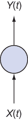
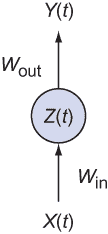
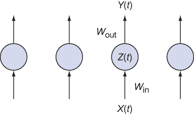
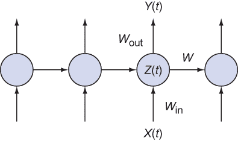
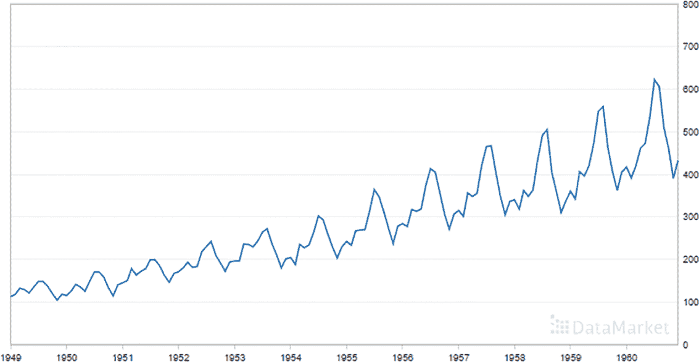
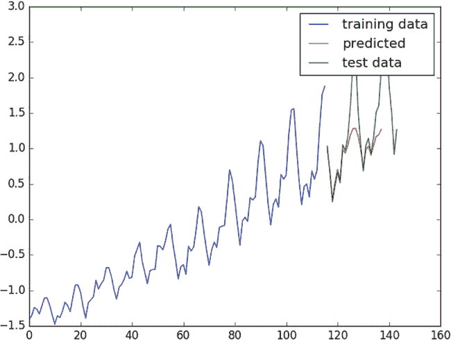
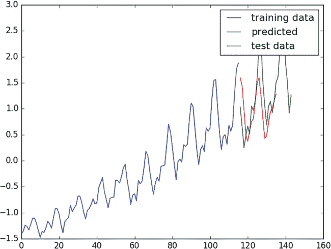

# 16 循环神经网络

本章涵盖

+   理解循环神经网络组件

+   设计时间序列数据的预测模型

+   在实际数据上使用时间序列预测器

回到学校的时候，我记得当我发现一次期中考试只有是非题时，我如释重负。我不可能是唯一一个认为答案中一半是对的，另一半是错的的人。

我找到了大多数问题的答案，其余的留给了猜测。但那种猜测是基于一些聪明的策略，你可能也使用过这种策略。在数出我的正确答案数量后，我意识到有相当一部分错误答案缺乏。所以，我大多数的猜测都是错误的，以平衡分布。

它起作用了。那一刻，我确实感觉到了狡猾。是什么感觉让我们对自己的决定如此自信，我们如何才能赋予神经网络同样的力量？

一个答案是使用上下文来回答问题。上下文线索是重要的信号，可以提高机器学习算法的性能。假设你想检查一个英语句子，并标记每个单词的词性（在第十章之后，你可能对这个问题更熟悉）。

天真的方法是对每个单词单独进行分类，如名词、形容词等，而不承认邻近的单词。考虑一下将这种技术应用于这个句子中的单词。单词*trying*被用作动词，但根据上下文，你也可以将其用作形容词，这使得词性标注成为一个*棘手*的问题。

一个更好的方法考虑上下文。为了向神经网络提供上下文线索，你将学习一种称为**循环神经网络**（RNN）的架构。你将处理的是连续的时间序列数据，例如股票市场价格，而不是自然语言数据。到本章结束时，你将能够对时间序列数据中的模式进行建模，以预测未来的值。

## 16.1 循环神经网络简介

要理解 RNN，请查看图 16.1 中的简单架构。这个架构将向量*X*(*t*)作为输入，并在某个时间(*t*)生成输出向量*Y*(*t*)。中间的圆圈代表网络的隐藏层。



图 16.1 一个神经网络，输入层和输出层分别标记为 X(t)和 Y(t)

有足够的输入/输出示例，你可以在 TensorFlow 中学习网络的参数。让我们将输入权重称为矩阵*W*[in]，将输出权重称为矩阵*W*[out]。假设有一个隐藏层，称为向量*Z*(*t*)。

如图 16.2 所示，神经网络的前半部分由函数 *Z*(*t*) = *X*(*t*) × *W*[in] 描述，而神经网络的第二半部分的形式为 *Y*(*t*) = *Z*(*t*) × *W*[out]。等价地，如果你愿意，整个神经网络是函数 *Y*(*t*) = (*X*(*t*) × *W*[in]) × *W*[out]。



图 16.2 神经网络的隐藏层可以被视为数据的隐藏表示，它由输入权重编码并由输出权重解码。

在花费了无数个夜晚微调网络之后，你可能想开始在现实场景中使用你学习到的模型。通常，这个过程意味着多次调用模型，如图 16.3 所示。



图 16.3 通常，你会在不知道之前运行隐藏状态的情况下多次运行相同的神经网络。

在每个时间 *t*，当调用学习到的模型时，这种架构没有考虑之前运行的知识。这个过程就像只看当天的数据来预测股市趋势。更好的想法是利用一周或一个月的数据中的总体模式。

RNN 与传统的神经网络不同，因为它引入了一个过渡权重 *W* 来在时间上传递信息。图 16.4 显示了在 RNN 中必须学习的三个权重矩阵。引入过渡权重意味着下一个状态不仅依赖于前一个模型，还依赖于前一个状态，因此你的模型有“记忆”它所做的事情。



图 16.4 RNN 架构可以利用网络的先前状态来获得优势。

图表很棒，但你来这里是为了亲自动手。让我们直接进入正题！第 16.2 节展示了如何使用 TensorFlow 内置的 RNN 模型。然后你将使用 RNN 对实际的时间序列数据进行预测。

## 16.2 实现循环神经网络

在实现 RNN 时，你将使用 TensorFlow 来完成大部分繁重的工作。你不需要像图 16.4 所示那样手动构建网络，因为 TensorFlow 库已经支持一些强大的 RNN 模型。

注意：有关 TensorFlow 库中 RNN 的信息，请参阅[`www.svds.com/tensorflow-rnn-tutorial`](https://www.svds.com/tensorflow-rnn-tutorial/)。

一种 RNN 模型是*长短期记忆*（LSTM）——一个有趣的名字，意味着它听起来那样。短期模式在长期不会被遗忘。

LSTM 的确切实现细节超出了本书的范围。相信我，对 LSTM 模型的彻底检查会分散本章的注意力，因为没有明确的行业标准。TensorFlow 通过处理模型的定义来提供帮助，这样你就可以直接使用它。随着 TensorFlow 的更新，你将能够利用 LSTM 模型中的改进，而无需修改你的代码。

小贴士：要了解如何从头开始实现 LSTM，我建议访问网页[`apaszke.github.io/lstm-explained.html`](https://apaszke.github.io/lstm-explained.html)。描述本章列表中使用的正则化实现的论文可在[`arxiv.org/abs/1409.2329`](https://arxiv.org/abs/1409.2329)找到。最后，这个关于 RNN 和 LSTMs 的教程提供了一些真实的笔记本和代码以供尝试：[`www.svds.com/tensorflow-rnn-tutorial`](https://www.svds.com/tensorflow-rnn-tutorial/)。

首先，在一个名为 simple_regression.py 的新文件中编写你的代码。然后，如列表 16.1 所示，导入相关库。

列表 16.1 导入相关库

```
import numpy as np
import tensorflow as tf
from tensorflow.contrib import rnn
```

接下来，定义一个名为`SeriesPredictor`的类。构造函数，如列表 16.2 所示，将设置模型超参数、权重和`成本`函数。

列表 16.2 定义类及其构造函数

```
class SeriesPredictor:
    def __init__(self, input_dim, seq_size, hidden_dim=10):

        self.input_dim = input_dim                                         ❶
        self.seq_size = seq_size                                           ❶
        self.hidden_dim = hidden_dim                                       ❶

        self.W_out = tf.Variable(tf.random_normal([hidden_dim, 1]),        ❷
        ➥ name='W_out')                                                   ❷
        self.b_out = tf.Variable(tf.random_normal([1]), name='b_out')      ❷
        self.x = tf.placeholder(tf.float32, [None, seq_size, input_dim])   ❷
        self.y = tf.placeholder(tf.float32, [None, seq_size])              ❷

        self.cost = tf.reduce_mean(tf.square(self.model() - self.y))       ❸
        self.train_op = tf.train.AdamOptimizer().minimize(self.cost)       ❸

        self.saver = tf.train.Saver()                                      ❹
```

❶ 超参数

❷ 权重变量和输入占位符

❸ 成本优化器

❹ 辅助操作

接下来，使用 TensorFlow 的内置 RNN 模型`BasicLSTMCell`。传递给`BasicLSTMCell`对象的隐藏维度是随时间传递的隐藏状态的维度。你可以通过使用`rnn.dynamic_rnn`函数来运行这个单元，以检索输出结果。列表 16.3 详细说明了如何使用 TensorFlow 实现带有 LSTM 的预测模型。

列表 16.3 定义 RNN 模型

```
    def model(self):
        """
        :param x: inputs of size [T, batch_size, input_size]
        :param W: matrix of fully-connected output layer weights
        :param b: vector of fully-connected output layer biases
        """
        cell = rnn.BasicLSTMCell(self.hidden_dim)                           ❶
        outputs, states = tf.nn.dynamic_rnn(cell, self.x, dtype=tf.float32) ❷
        num_examples = tf.shape(self.x)[0]
        W_repeated = tf.tile(tf.expand_dims(self.W_out, 0),                 ❸
        ➥ [num_examples, 1, 1])                                            ❸
        out = tf.matmul(outputs, W_repeated) + self.b_out
        out = tf.squeeze(out)
        return out
```

❶ 创建一个 LSTM 单元

❷ 在输入上运行单元以获得输出和状态的张量

❸ 将输出层计算为全连接线性函数

定义了模型和`成本`函数后，你可以实现训练函数，该函数将根据示例输入/输出对学习 LSTM 权重。如列表 16.4 所示，你打开一个会话，并在训练数据上反复运行优化器。

注意：你可以使用交叉验证来确定训练模型所需的迭代次数。在这种情况下，你假设一个固定的 epoch 数量。在 ResearchGate（[`mng.bz/lB92`](http://mng.bz/lB92)）等问答网站上可以找到一些有价值的见解和答案。

训练完成后，将模型保存到文件中，以便以后加载。

列表 16.4 在数据集上训练模型

```
    def train(self, train_x, train_y):
        with tf.Session() as sess:
            tf.get_variable_scope().reuse_variables()
            sess.run(tf.global_variables_initializer())
            for i in range(1000):                           
                _, mse = sess.run([self.train_op, self.cost],     ❶
               ➥ feed_dict={self.x: train_x, self.y: train_y})   ❶
                if i % 100 == 0:
                    print(i, mse)
            save_path = self.saver.save(sess, 'model.ckpt')
            print('Model saved to {}'.format(save_path))
```

❶ 运行 train op 1,000 次

假设一切顺利，并且您的模型已经学习到了参数。接下来，您可能希望在其他数据上评估预测模型。列表 16.5 加载了保存的模型，并通过输入测试数据在会话中运行模型。如果学习到的模型在测试数据上表现不佳，您可以尝试调整 LSTM 单元的隐藏维数数量。

列表 16.5 测试学习到的模型

```
    def test(self, test_x):
        with tf.Session() as sess:
            tf.get_variable_scope().reuse_variables()
            self.saver.restore(sess, './model.ckpt')
            output = sess.run(self.model(), feed_dict={self.x: test_x})
            print(output)
```

完成了！但为了确信它工作正常，您可以创建一些数据来尝试训练预测模型。在列表 16.6 中，您将创建输入序列（`train_x`）和相应的输出序列（`train_y`）。

列表 16.6 在虚拟数据上进行训练和测试

```
if __name__ == '__main__':
    predictor = SeriesPredictor(input_dim=1, seq_size=4, hidden_dim=10)
    train_x = [[[1], [2], [5], [6]],
               [[5], [7], [7], [8]],
               [[3], [4], [5], [7]]]
    train_y = [[1, 3, 7, 11],
               [5, 12, 14, 15],
               [3, 7, 9, 12]]
    predictor.train(train_x, train_y)
    test_x = [[[1], [2], [3], [4]],       ❶
              [[4], [5], [6], [7]]]       ❷
    predictor.test(test_x)
```

❶ 预测结果应为 1，3，5，7。

❷ 预测结果应为 4，9，11，13。

您可以将这个预测模型视为一个黑盒，并用真实世界的时间序列数据进行训练以进行预测。在第 16.3 节中，您将获得可以处理的数据。 

## 16.3 使用预测模型处理时间序列数据

时间序列数据在网上大量可用。对于这个例子，您将使用特定时期国际航空公司乘客的数据。您可以从[`mng.bz/ggOV`](http://mng.bz/ggOV)获取这些数据。点击该链接将带您到一个时间序列数据的好图，如图 16.5 所示。



图 16.5 显示了多年来国际航空公司乘客数量的原始数据

您可以通过点击数据选项卡然后选择 CSV 来下载数据。您将需要手动编辑 CSV 文件以删除标题行和额外的页脚行。

在名为`data_loader.py`的文件中，添加列表 16.7 中的代码。

列表 16.7 加载数据

```
import csv
import numpy as np
import matplotlib.pyplot as plt

def load_series(filename, series_idx=1):
    try:
        with open(filename) as csvfile:
            csvreader = csv.reader(csvfile)

            data = [float(row[series_idx]) for row in csvreader 
                                           if len(row) > 0]            ❶
            normalized_data = (data - np.mean(data)) / np.std(data)    ❷
        return normalized_data
    except IOError:
        return None

def split_data(data, percent_train=0.80):
    num_rows = len(data) * percent_train                               ❸
    return data[:num_rows], data[num_rows:]                            ❹
```

❶ 遍历文件中的行并将其转换为浮点数

❷ 通过均值中心化和除以标准差来预处理数据

❸ 计算训练数据样本

❹ 将数据集分为训练集和测试集

在这里，您定义了两个函数：`load_series`和`split_data`。第一个函数加载磁盘上的时间序列文件并对其进行归一化；另一个函数将数据集分为两个部分，用于训练和测试。

由于您将多次评估模型以预测未来的值，让我们修改`SeriesPredictor`中的`test`函数，使其接受一个会话作为参数，而不是在每次调用时初始化会话。请参阅列表 16.8 中的此调整。

列表 16.8 修改`test`函数以传入会话

```
def test(self, sess, test_x):
    tf.get_variable_scope().reuse_variables()
    self.saver.restore(sess, './model.ckpt')
    output = sess.run(self.model(), feed_dict={self.x: test_x})
    return output
```

现在您可以通过加载可接受格式的数据来训练预测器。列表 16.9 展示了如何训练网络，然后使用训练好的模型来预测未来的值。您将生成训练数据（`train_x`和`train_y`），使其看起来像列表 16.6 中早些时候显示的数据。

列表 16.9 生成训练数据

```
if __name__ == '__main__':
    seq_size = 5
    predictor = SeriesPredictor(
        input_dim=1,                                                       ❶
        seq_size=seq_size,                                                 ❷
        hidden_dim=100)                                                    ❸

    data = data_loader.load_series('international-airline-passengers.csv') ❹
    train_data, actual_vals = data_loader.split_data(data)

    train_x, train_y = [], []  
    for i in range(len(train_data) - seq_size - 1):                        ❺
        train_x.append(np.expand_dims(train_data[i:i+seq_size], 
        ➥ axis=1).tolist())
        train_y.append(train_data[i+1:i+seq_size+1])

    test_x, test_y = [], []                                                ❻
    for i in range(len(actual_vals) - seq_size - 1):
        test_x.append(np.expand_dims(actual_vals[i:i+seq_size], 
        ➥ axis=1).tolist())
        test_y.append(actual_vals[i+1:i+seq_size+1])

    predictor.train(train_x, train_y, test_x, test_y)                      ❼

    with tf.Session() as sess:                                             ❽
        predicted_vals = predictor.test(sess, test_x)[:,0]
        print('predicted_vals', np.shape(predicted_vals))
        plot_results(train_data, predicted_vals, actual_vals, 'predictions.png')

        prev_seq = train_x[-1]
        predicted_vals = []
        for i in range(20):
            next_seq = predictor.test(sess, [prev_seq])
            predicted_vals.append(next_seq[-1])
            prev_seq = np.vstack((prev_seq[1:], next_seq[-1]))
        plot_results(train_data, predicted_vals, actual_vals, 'hallucinations.png')
```

❶ 序列中每个元素的维度是一个标量（1D）。

❷ 每个序列的长度

❸ RNN 隐藏维度的尺寸

❹ 加载数据

❺ 在时间序列数据上滑动窗口以构建训练数据集

❻ 使用相同的窗口滑动策略来构建测试数据集

❼ 在训练数据集上训练模型

❽ 可视化模型的性能

预测器生成两个图表。第一个图表是模型的预测结果，给定真实值（图 16.6）。



图 16.6 当与真实数据测试时，预测结果与趋势匹配得相当好。

另一个图表显示了仅提供训练数据时的预测结果（蓝色线）——没有其他任何东西（图 16.7）。这个过程可用的信息较少，但它仍然很好地匹配了数据趋势。



图 16.7 如果算法使用先前预测的结果来做出进一步的预测，总体趋势匹配得很好，但不是具体的峰值。

你可以使用时间序列预测器来重现数据中的真实波动。想象一下，基于你迄今为止学到的工具来预测市场繁荣与萧条周期。你在等什么？抓取一些市场数据，并学习你自己的预测模型！

## 16.4 应用 RNNs

RNNs 旨在用于序列数据。由于音频信号比视频（线性信号与 2D 像素数组）低一个维度，因此开始处理音频时间序列数据要容易得多。考虑一下语音识别在过去几年里取得了多大的进步；它正成为一个可处理的问题。

与你在第七章中进行的音频数据聚类分析中的音频直方图分析类似，大多数语音识别预处理都涉及以某种形式的音程图来表示声音。一种常见的技术是使用 *梅尔频率倒谱系数* (MFCCs)。本博客文章概述了一个很好的介绍：[`mng.bz/411F`](http://mng.bz/411F)。

接下来，你需要一个数据集来训练你的模型。以下是一些流行的数据集：

+   LibriSpeech ([www.openslr.org/12](http://www.openslr.org/12))

+   TED-LIUM ([www.openslr.org/7](http://www.openslr.org/7))

+   VoxForge ([www.voxforge.org](http://www.voxforge.org/))

在 TensorFlow 中使用这些数据集进行简单语音识别实现的详细说明可在[`svds.com/tensorflow-rnn-tutorial`](https://svds.com/tensorflow-rnn-tutorial)找到。

## 摘要

+   一个循环神经网络（RNN）使用过去的信息。这样，它可以通过使用具有高时间依赖性的数据来做出预测。

+   TensorFlow 自带 RNN 模型。

+   由于数据中的时间依赖性，时间序列预测是 RNNs 的一个有用应用。
