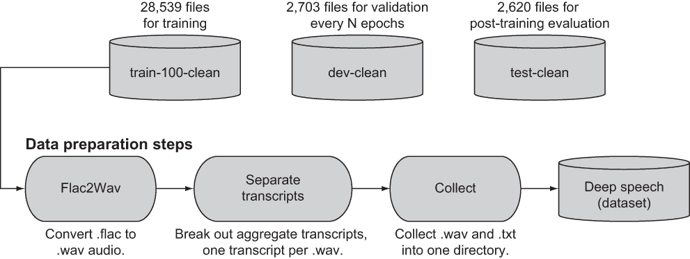
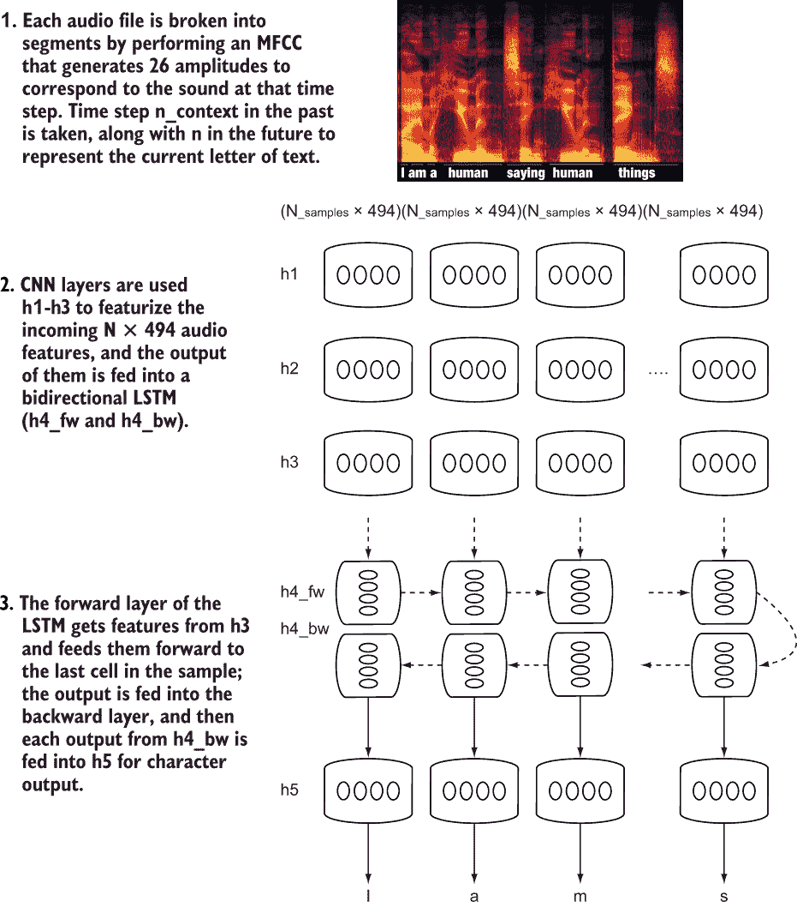
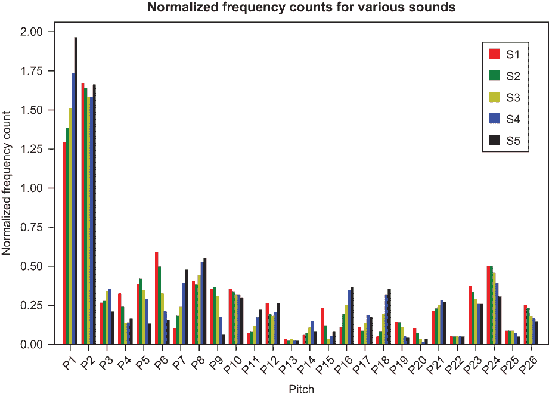
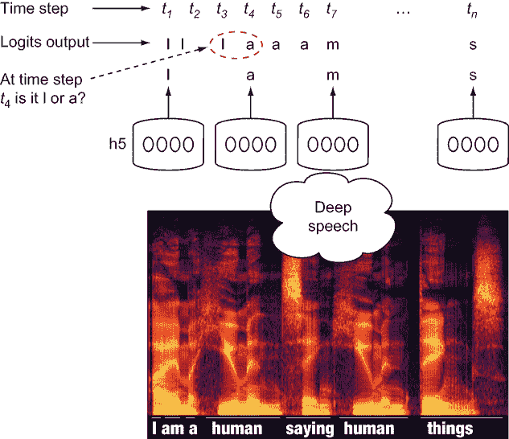

# 17 个 LSTMs 和自动语音识别

本章涵盖

+   使用 LibriSpeech 语料库为自动语音识别准备数据集

+   训练长短期记忆（LSTM）RNN 将语音转换为文本

+   在训练期间和之后评估 LSTM 性能

现在用电子设备说话和交谈已经司空见惯了。几年前，在我智能手机的早期版本上，我点击了麦克风按钮，并使用它的语音输入功能尝试将一封电子邮件说成现实。然而，我老板收到的电子邮件中却有一大堆拼写错误和音标错误，他想知道我是不是把太多的下班活动与我的正式职责混合在一起了！

世界在变化，神经网络在执行自动语音识别（ASR）方面的准确性也在提高，ASR 是将语音音频转换为书面文本的过程。无论你是使用手机的智能数字助手为你安排会议，口述那封可靠的电子邮件，还是要求家里的智能设备订购东西，播放背景音乐，甚至启动你的汽车，这些任务都是由 ASR 功能驱动的。

语音识别（ASR）是如何成为日常生活一部分的？之前的 ASR 系统依赖于脆弱的统计模型，这些模型依赖于特定语言的语法，而今天的 ASR 系统建立在鲁棒的循环神经网络（RNNs）之上，特别是长短期记忆（LSTM）网络，这是一种特定的 RNN。使用 LSTMs，你可以教会计算机分段听音频，并随着时间的推移将这些段转换为语言字符。像书中讨论的卷积神经网络（CNNs）和其他生物启发的神经网络一样，用于语音识别的 LSTMs 学习人类的学习方式。每个小的音频段对应于语言中的一个字符，你使用的细胞数量与语音中的字符数量相同。你试图教会网络以人类的方式理解语言。随着网络通过每次调用进行学习，网络权重被更新并向前和向后传递到 LSTM 细胞中，这些细胞学习每个声音及其对应的字母。映射到声音的字母组合成为语言。

这些方法因百度 Deep Speech 架构而闻名，该架构在 2015 年超越了最先进的语音识别系统，后来由 Mozilla 基金会开源实现，使用你和我最喜欢的工具包 TensorFlow。原始论文在[`arxiv.org/abs/1412.5567`](https://arxiv.org/abs/1412.5567)。我将向你展示如何收集和准备用于深度语音自动语音到文本模型的训练数据，如何使用 TensorFlow 对其进行训练，以及如何使用它来评估现实世界的声音数据。

嘿，TensorFlow！

当你对着手机说“嘿，数字助手”时，你是否好奇手机是如何工作的？起初，助手可能并不总是能正确理解你的话，但硅谷的智能手机和电脑制造商表示，随着时间的推移，它将变得更好。没错，这就是为什么数字助手会询问是否正确理解了你的话。TensorFlow 等框架允许你训练自己的模型，并提供经过数百万来自世界各地用户反馈的预训练 LSTM 模型，这些模型可以细化每个字符和每个单词的 ASR 输出。实际上，识别确实会随着时间的推移而变得更好。

ASR 网络训练的一个常见来源是有声读物。有声读物很有用，因为它们通常既有声音的并行语料库，也有与说话词对应的转录。LibriSpeech 语料库是 Open Speech and Language Resources (OpenSLR) 项目的一部分，可以用来训练深度语音模型。然而，正如你所知，你需要进行一些数据清理，以便为训练准备信息。

## 17.1 准备 LibriSpeech 语料库

有声读物是有用的发明，它允许我们在开车和其他活动时听我们喜欢的书籍。它们通常是大量声音——可能是数百小时——分成更小的片段，并且几乎总是包含相应的转录，以防你想阅读你正在听到的文本。

一套开源的有声读物可以从 Open Speech and Language Resources (OpenSLR) 网页和 LibriSpeech 语料库中获取。LibriSpeech 是一组来自有声读物的短剪辑和相应的转录。LibriSpeech 包括超过 1,000 小时的 16KHz 英语语音录音，包括元数据；原始 MP3 文件；以及 100、360 和 500 小时的语音训练集的分离和校对版本。该数据集包括转录，还有一个用于每个训练周期验证的开发数据集和一个用于训练后测试的测试集。

很不幸，由于深度语音模型期望的是 Windows 音频视频 (.wav) 交错文件音频格式，而不是 LibriSpeech 所使用的 Free Lossless Audio Codec (.flac) 文件格式，因此数据集在深度语音模型中不可用。通常，你的第一步是——没错——数据准备和清理。

### 17.1.1 下载、清理和准备 LibriSpeech OpenSLR 数据

首先，你需要下载一组训练语料库：100、360 或 500 小时的训练数据。根据你的内存大小，你可以选择其中任何一个，但我的建议是选择 100 小时，因为这对于训练一个不错的深度语音模型来说已经足够了。只有一个开发（验证）集和一个测试集，所以你不需要为这些文件选择不同的时间长度。

准备下载的 LibriSpeech 数据的整体过程相当直接：

1.  下载 train-100-clean、dev-clean 和 test 的 tarball，请从 [`www.openslr.org/12`](http://www.openslr.org/12)。

1.  将 tar 文件解压缩到 LibriSpeech/train-clean-100、LibriSpeech/dev-clean 和 LibriSpeech/test-clean 文件夹中。

1.  将.flac 音频文件转换为训练、验证和测试的.wav 音频文件。

1.  将章节中的每个音频文件对应的一行聚合转录文件取来，每个文件包含一行音频文件。每行包含与引用的短声音剪辑对应的提取出的单词。将这些聚合转录重新格式化为每个.wav 音频文件一个.txt 转录文件。

1.  将.wav 和.txt 音频/转录元组的子文件夹收集到一个扁平的文件夹结构中，并通过删除聚合转录和.flac 文件来清理。

该过程在图 17.1 中从左到右展示。



图 17.1 将 LibriSpeech OpenSLR 数据转换为用于深度语音模型的清洗和准备过程

好消息是，您可以使用一些简单的 Python 实用代码构建这个数据清洗和准备流程。您将从列表 17.1 开始，使用`urllib`和`tarfile`库进行文件下载，这些库允许您下载远程 URL 并解压缩存档文件。

警告：下载这些数据可能需要相当长的时间，因为仅训练数据就大约有 7 GB。请准备好等待数小时，具体取决于您的带宽。

列表 17.1 下载并解压缩训练、开发和测试 LibriSpeech 数据

```
import urllib
import tarfile                                                             ❶

def download_and_extract_tar(url):                                         ❷
    print("Downloading and extracting %s " % (url))
    tar_stream = urllib.request.urlopen(url)
    tar_file = tarfile.open(fileobj=tar_stream, mode="r|gz")
    tar_file.extractall()

train_url = "http://www.openslr.org/resources/12/train-clean-100.tar.gz"   ❸
dev_url = "http://www.openslr.org/resources/12/dev-clean.tar.gz"           ❸
test_url = "http://www.openslr.org/resources/12/test-clean.tar.gz"         ❸

download_and_extract_tar(train_url)                                        ❹
download_and_extract_tar(dev_url)                                          ❹
download_and_extract_tar(test_url)                                         ❹
```

❶ 导入 urllib 下载库和 tarfile 库以提取存档

❷ 创建一个函数从 URL 下载 tar 文件并在本地提取

❸ OpenSLR 100 小时训练、开发（验证）和测试集

❹ 下载数据并将流提取到其本地文件夹

在数据准备流程的下一步，您需要将.flac 音频文件转换为.wav 文件。幸运的是，有一个易于使用的 Python 库叫做`pydub`可以执行此任务，以及其他多媒体文件的转换和操作。尽管`pydub`功能强大，但您在这里只使用了其功能的一个子集。尝试使用它来发现更多功能。

### 17.1.2 转换音频

当 tar 文件被提取后，它们将出现在您的 LibriSpeech/<data>目录中，其中<data>是 train-clean-100、dev-clean 和 test-clean 之一。在这些文件夹下面是更多子文件夹，它们对应不同的章节编号，还有更多子文件夹对应章节的部分。因此，您的代码需要遍历这些子文件夹，并为每个.flac 文件使用 pydub 创建.wav 文件。您将按照列表 17.2 中所示处理该过程。如果您在笔记本电脑上运行此代码，不妨去倒杯咖啡；转换可能需要长达一个半小时。

列表 17.2 将.flac 文件转换为.wav 文件并遍历数据集

```
import pydub
import os
import tqdm
import glob

def flac2wav(filepath): 
    base_file_path = os.path.dirname(filepath)                             ❶
    filename = os.path.basename(filepath)                                  ❶
    filename_no_ext = os.path.splitext(filename)[0]                        ❷
    audio = AudioSegment.from_file(filepath, "flac")                       ❸
    wav_file_path = base_file_path + '/' + filename_no_ext +'.wav'         ❹
    audio.export(wav_file_path, format="wav")                              ❺

def convert_flac_to_wav(train_path, dev_path, test_path):
    train_flac = [file for file in glob.glob(train_path + "/*/*/*.flac")]  ❻
    dev_flac = [file for file in glob.glob(dev_path + "/*/*/*.flac")]      ❻
    test_flac = [file for file in glob.glob(test_path + "/*/*/*.flac")]    ❻

    print("Converting %d train %d dev and %d test flac files into wav files" 
          % (len(train_flac), len(dev_flac), len(test_flac)))    

    print("Processing train")
    for f in tqdm(train_flac):                                             ❼
        flac2wav(f)

    print("Processing dev")
    for f in tqdm(dev_flac):                                               ❼
        flac2wav(f)

    print("Processing test")
    for f in tqdm(test_flac):                                              ❼
        flac2wav(f)
```

❶ 给定一个文件路径，例如 LibriSpeech/train-clean-100/307/127535/307-127535-000.flac，获取其目录名（base_file_path）和文件名。

❷ 移除扩展名并获取文件基本名称，例如 307-127535-000

❸ 使用 Pydub 读取 FLAC 文件

❹ 推导出 .wav 文件名，即 basename + .wav

❺ 使用 Pydub 保存新的 .wav 文件

❻ 使用 glob 库获取 train、dev（验证）和 test 中所有 .flac 文件的列表

❼ 将 train、dev 和 test 的 .flac 文件转换为 .wav

当音频文件格式正确时，你必须处理 Libri-Speech 的其他部分：之前提到的步骤 4 中的转录文本，每个音频剪辑一个文本文件转录。由于它们与数据集一起提供，转录文本被聚合到子章节集合中，每个子章节一个转录文本，转录子章节文件中的每一行对应于该子目录中的一个音频文件。对于深度语音，你需要每个音频文件一个文本文件转录。接下来，你将生成每个音频文件的转录文本，每个文件一个。

### 17.1.3 生成每个音频文件的转录文本

要创建每个音频文件的转录文本，你需要读取每个子章节目录的转录聚合文件。将该文件中的每一行分解成单独的文本转录文件，每个音频文件一个，在子章节文件夹中。列表 17.3 中的简单 Python 代码为你处理了这个任务。请注意，与 .flac 文件转换相比，运行此代码相当快。

列表 17.3 将子章节聚合分解成单个 .wav 文件转录文本

```
def create_per_file_transcripts(file):
    file_toks = file.split('.')                                               ❶
    base_file_path = os.path.dirname(file)                                    ❶

    with open(file, 'r') as fd:
        lines = fd.readlines()
        for line in lines:                                                    ❷
            toks = line.split(' ')                                            ❷
            wav_file_name = base_file_path + '/' + toks[0] + '.txt'           ❷

            with open(wav_file_name, 'w') as of:                              ❸
                trans = " ".join([t.lower() for t in toks[1:]])               ❸
                of.write(trans)                                               ❸
                of.write('\n')

def gen_transcripts(train_path, dev_path, test_path):
    train_transcripts = [file for file in glob.glob(train_path +              ❹
    ➥ "/*/*/*.txt")]                                                         ❹
    dev_transcripts = [file for file in glob.glob(dev_path + "/*/*/*.txt")]   ❹
    test_transcripts = [file for file in glob.glob(test_path + "/*/*/*.txt")] ❹

    print("Converting %d train %d dev and %d test aggregate transcripts into 
    ➥ individual transcripts" 
          % (len(train_transcripts), len(dev_transcripts), 
          ➥ len(test_transcripts)))

    print("Processing train")                                                 ❺
    for f in tqdm(train_transcripts):
        create_per_file_transcripts(f)

    print("Processing dev")                                                   ❺
    for f in tqdm(dev_transcripts):
        create_per_file_transcripts(f)

    print("Processing test")                                                  ❺
    for f in tqdm(test_transcripts):
        create_per_file_transcripts(f)
```

❶ 获取子章节前缀文件名

❷ 对于子章节聚合转录文本中的每一行，根据空格分割，并使用第一个标记作为该行转录的音频文件名

❸ 除了第一个标记之外的其他标记是该音频文件的转录单词。

❹ 获取 train、dev 和 test 中所有子章节的转录文件

❺ 将 train、dev 和 test 处理成单独的转录文本

### 17.1.4 聚合音频和转录文本

数据处理的最后一步（如果你在计分的话是步骤 5）是收集所有音频 .wav 文件及其相关的转录文本到一个聚合的顶级目录，并通过删除 .flac 文件和聚合的转录文本进行清理。Python 中的简单移动文件函数和删除函数调用可以为你处理这个任务，如列表 17.4 所示。你可以使用以下简单的路径来表示数据集顶级路径的聚合：

```
speech_data_path = "LibriSpeech"
train_path = speech_data_path + "/train-clean-100"
dev_path = speech_data_path + "/dev-clean"
test_path = speech_data_path + "/test-clean"

all_train_path = train_path + "-all"
all_dev_path = dev_path + "-all"
all_test_path = test_path + "-all"
```

列表 17.4 中的代码应该运行得相当快，因为它只是清理工作。重要的是要注意，你必须运行清理步骤，因为你不希望转录文本或音频文件被重复计数。

列表 17.4 聚合音频和转录文本，并清理

```
def move_files(from_path, to_path):
    if not os.path.exists(to_path):
        print("Creating dir %s" % (to_path))                           ❶
        os.makedirs(to_path)
    for root, _, files in os.walk(from_path):
        for file in files:
            path_to_file = os.path.join(root, file)
            base_file_path = os.path.dirname(file)
            to_path_file = to_path + '/' + file
            print("Moving file from %s to %s " % (path_to_file, 
            ➥ to_path_file))
            shutil.move(path_to_file, to_path_file)                    ❷

def remove_files_with_ext(directory, ext):
    for root, _, files in os.walk(directory):                          ❸
        for file in files:                                             ❸
            if file.endswith(ext):                                     ❸
                path_to_file = os.path.join(root, file)                ❸
                print("Removing file %s " % (path_to_file))            ❸
                os.remove(path_to_file)                                ❸

remove_files_with_ext(train_path, "flac")                              ❹
remove_files_with_ext(dev_path, "flac")                                ❹
remove_files_with_ext(test_path, "flac")                               ❹

move_files(train_path, all_train_path)                                 ❺
move_files(dev_path, all_dev_path)                                     ❺
move_files(test_path, all_test_path)                                   ❺

remove_files_with_ext(all_train_path, "trans.txt")                     ❻
remove_files_with_ext(all_dev_path, "trans.txt")                       ❻
remove_files_with_ext(all_test_path, "trans.txt")                      ❻
```

❶ 如果目标路径不存在，则创建它。

❷ 遍历顶级 train、dev 和 test 目录，并将每个音频和转录文件（假设首先删除了 .flac 文件）移动到目标路径

❸ 遍历目录并删除所有具有提供扩展名的文件

❹ 删除 .flac 文件

❺ 将音频 .wav 文件和相关的转录文本移动到顶级目录

❻ 删除聚合的转录文本

凭借准备好的 LibriSpeech 数据集聚合（train-clean-100-all、dev-clean-all 和 test-clean-all），你就可以开始使用深度语音和 TensorFlow 进行训练了。

## 17.2 使用深度语音模型

深度语音是一个在 2014 年和 2015 年由百度在尝试改进搜索过程中构建的神经网络。百度是一家提供互联网服务和产品的中国公司；它收集和爬取网络，并使用人工智能来增强用户寻找他们所需内容的体验。因此，可以说百度拥有大量的数据，包括语音数据。在 2015 年，允许在移动设备上进行语音输入以辅助搜索的需求不断增加，并且现在被视为默认功能。

百度的论文“深度语音：端到端语音识别的扩展”（可在[`arxiv.org/abs/1412.5567`](https://arxiv.org/abs/1412.5567)找到）描述了一个多层神经网络，该网络将卷积层作为从分割到字符级别语音的输入音频频谱图的特征提取器。每个输入音频文件被分割成与字母表中一个字母相对应的语音。在特征提取之后，输出特征被提供给一个双向 LSTM 网络，该网络将其输出权重向前传递到一个反向层，该反向层反过来将其输出作为其学习的一部分。双向反向层的输出被提供给一个额外的特征提取器，并用于预测与语音相对应的字母表中的特定字符。整体架构如图 17.2 所示。



图 17.2 深度语音模型。音频输入并被分割成与字符级别语音对应的样本。这些语音由双向 LSTM 网络（MFCC = 梅尔频率倒谱系数）猜测。

深度语音架构最著名的实现之一是由 Mozilla 基金会承担的，并使用 TensorFlow 实现；它可在[`github.com/mozilla/DeepSpeech`](https://github.com/mozilla/DeepSpeech)找到。鉴于重实现这个实现的所有功能将需要更多的空间，并覆盖本书的几个章节，我将突出显示重要的部分，以指导你设置和运行简化版本的代码。请注意，从头开始训练深度语音模型需要相当多的时间，即使有 GPU 也是如此。

### 17.2.1 准备深度语音的输入音频数据

在第七章中，我向您展示了如何使用 Bregman Toolkit 将音频文件从频域转换为时域。然而，并非只有这个库可以执行这个过程。一个类似的过程为音频文件生成梅尔频率声谱系数（MFCC）。这个过程对音频文件运行快速傅里叶变换（FFT），并将文件输出为与请求的声谱系数（或频率分箱）数量相对应的样本。与 Bregman Toolkit 一样，这些分箱的幅度对每个音频文件都是唯一的，并且可以用来生成用于机器学习的特征。

Bregman Toolkit 生成了这些分箱的近似值，但现在我将向您展示一种不同的方法，该方法使用 TensorFlow 原生代码，以及使用 SciPy 的代码。TensorFlow 附带了一些处理音频文件的有用功能，称为`audio_ops`。该库包括读取.wav 文件的代码，将它们解码成频谱图（类似于音程图；第七章），然后对它们进行 MFCC 变换，进入时间域。列表 17.5 包含一些简单的代码，使用 TensorFlow 的 audio_ops 从 LibriSpeech 语料库中的随机.wav 文件生成 MFCC 特征。运行代码生成一个特征向量大小为`(1, 2545, 26)`或每个样本 2,545 个 26 个声谱振幅的样本。

列表 17.5 使用 TensorFlow 从 wav 文件生成 MFCC 特征

```
numcep=26                                                                  ❶
with tf.Session() as sess:
    filename =  'LibriSpeech/train-clean-100-all/3486-166424-0004.wav'
    raw_audio = tf.io.read_file(filename)                                  ❷
    audio, fs = decode_wav(raw_audio)                                      ❷
    spectrogram = audio_ops.audio_spectrogram(
            audio, window_size=1024,stride=64)                             ❸
    orig_inputs = audio_ops.mfcc(spectrogram, sample_rate=fs,              ❸
    ➥ dct_coefficient_count=numcep)                                       ❸

    audio_mfcc = orig_inputs.eval()
    print(np.shape(audio_mfcc))                                            ❹
```

❶ 要使用的声谱系数分箱数量（根据 Deep Speech 论文，为 26）

❷ 读取文件并解释.wav 声音

❸ 生成相应的频谱图并生成 MFCC 特征

❹ 打印输出形状

您可以通过重新使用第七章中的某些绘图代码并绘制对应于 26 个分箱的第一个样本来查看音频文件的一些样本，并确信机器学习算法有东西可以学习。列表 17.6 中的代码执行此绘图，其输出如图 17.3 所示。

列表 17.6 绘制音频文件 MFCC 特征的五个样本的图表

```
labels=[]
for i in np.arange(26):                                            ❶
    labels.append("P"+str(i+1))

fig, ax = plt.subplots()
ind = np.arange(len(labels))
width = 0.15
colors = ['r', 'g', 'y', 'b', 'black']
plots = []

for i in range(0, 5):                                              ❷
    Xs = np.asarray(np.abs(audio_mfcc[0][i])).reshape(-1)          ❸
    p = ax.bar(ind + i*width, Xs, width, color=colors[i])
    plots.append(p[0])

xticks = ind + width / (audio_mfcc.shape[0])
print(xticks)
ax.legend(tuple(plots), ('S1', 'S2', 'S3', 'S4', 'S5'))
ax.yaxis.set_units(inch)
ax.autoscale_view()
ax.set_xticks(xticks)
ax.set_xticklabels(labels)

ax.set_ylabel('Normalized freq coumt')
ax.set_xlabel('Pitch')
ax.set_title('Normalized frequency counts for Various Sounds')
plt.show()                                                         ❹
```

❶ 26 个声谱系数（cepstral）分箱

❷ 2,545 个样本中的 5 个

❸ 取绝对值，以确保没有负的分箱大小

❹ 显示图表



图 17.3 LibriSpeech 语料库中音频文件的五个样本的 MFCC 特征

样本之间存在差异。不同的样本对应于声音文件中的不同时间点，最终，您希望您的 ASR 机器学习模型能够预测这些语音的字母。在 Deep Speech 论文中，作者定义了一个上下文，这是一个包含向后查看样本和向前查看样本以及当前样本的集合。样本之间的一些重叠允许更好的区分，因为单词和字符级别的音调在语言中往往重叠。想想说“best”这个词。b 和 e 在声音上重叠。这个相同的概念也适用于训练一个好的机器学习模型，因为您希望它尽可能地反映现实世界。

您可以设置一个时间窗口来查看过去和未来的几个时间步——称这个时间窗口为 numcontext 样本。结合当前样本，您的新特征向量变为 N × (2*number cepstrals *numcontext + numcepstrals)。通过本地测试，9 是 numcontext 的一个合理值，并且因为您使用了 26 个倒谱系数，您有一个新特征向量的大小为 (N × 2*26*9 + 26) 或 (N × 494)，其中 N 是样本数量。您可以使用列表 17.5 中的代码为每个声音文件生成这个新特征向量，然后使用列表 17.7 中的代码完成工作。Deep Speech 论文的作者还使用了一种技术，即只从音频文件中提取一半的样本以进一步减少样本密度，尤其是在向前和向后查看的窗口中。列表 17.7 也为您处理了这个工作。

列表 17.7 生成过去、现在和未来的 MFCC 上下文窗口

```
    orig_inputs = orig_inputs[:,::2]                                       ❶
    audio_mfcc = orig_inputs.eval()
    train_inputs = np.array([], np.float32)
    train_inputs.resize((audio_mfcc.shape[1], numcep + 2 * numcep * 
    ➥ numcontext))                                                        ❷

    empty_mfcc = np.array([])
    empty_mfcc.resize((numcep))
    empty_mfcc = tf.convert_to_tensor(empty_mfcc, dtype=tf.float32)
    empty_mfcc_ev = empty_mfcc.eval()

    time_slices = range(train_inputs.shape[0]) 
    context_past_min = time_slices[0] + numcontext                         ❸
    context_future_max = time_slices[-1] - numcontext                      ❹

    for time_slice in tqdm(time_slices):
        need_empty_past = max(0, (context_past_min - time_slice))          ❺
        empty_source_past = np.asarray([empty_mfcc_ev for empty_slots in 
        ➥ range(need_empty_past)])
        data_source_past = orig_inputs[0][max(0, time_slice - 
        ➥ numcontext):time_slice]

        need_empty_future = max(0, (time_slice - context_future_max))      ❻
        empty_source_future = np.asarray([empty_mfcc_ev for empty_slots in 
        ➥ range(need_empty_future)])
        data_source_future = orig_inputs[0][time_slice + 1:time_slice + 
        ➥ numcontext + 1]

        if need_empty_past:                                                ❼
            past = tf.concat([tf.cast(empty_source_past, tf.float32), 
            ➥ tf.cast(data_source_past, tf.float32)], 0)
        else:
            past = data_source_past

        if need_empty_future:
            future = tf.concat([tf.cast(data_source_future, tf.float32), 
            ➥ tf.cast(empty_source_future, tf.float32)], 0)
        else:
            future = data_source_future

        past = tf.reshape(past, [numcontext*numcep])
        now = orig_inputs[0][time_slice]
        future  = tf.reshape(future, [numcontext*numcep])

        train_inputs[time_slice] = np.concatenate((past.eval(), now.eval(), 
        ➥ future.eval()))        
    train_inputs = (train_inputs - np.mean(train_inputs)) / 
    ➥ np.std(train_inputs)                                                ❽
```

❶ 取每个第二个样本，并按一半的数据子集

❷ 生成 (N × 494 样本) 占位符

❸ 过去内容的起始最小点；至少要有 9 个时间切片

❹ 未来内容的结束最大点；时间切片大小为 9 ts

❺ 在过去提取最多 numcontext 时间切片，并使用空的 MFCC 特征完成

❻ 在未来的 numcontext 时间切片中提取，并使用空的 MFCC 特征完成

❼ 如果需要，对过去或未来进行填充，或取过去和未来

❽ 对标准差取平均值，并对学习输入值进行归一化

现在您的音频已经准备好用于训练，并且可以在 LibriSpeech 音频文件上运行数据准备。请注意：这个数据准备过程可能需要许多小时，具体取决于您使用多少训练数据。文件超过 25,000 个，我的建议是从小规模开始，比如用 100 个进行训练。这个样本将产生一个特征向量 (100 × *N* × 494)，其中 N 是样本数量（每个音频文件两个样本）。

您还需要处理的其他数据准备涉及那些转录文本。字符级数据需要转换为数字，这是一个简单的过程，我将在第 17.2.2 节中向您展示。

### 17.2.2 准备文本转录本为字符级数值数据

通过你为 LibriSpeech 语料库所做的准备工作，对于每个音频数据文件，例如 LibriSpeech/train-clean-100-all/3486-166424-0004.wav，你都有一个相应的 LibriSpeech/train-clean-100-all/3486-166424-0004.txt 文件，内容如下：

```
a hare sat upright in the middle of the ancient roadway the valley itself lay serenely under the ambering light smiling peaceful emptied of horror
```

要将你的输入特征向量大小（1 × N × 494）映射到字符级输出，你必须将文本输出处理成数字。一种简单的方法是使用 Python 的`ord()`函数，因为 Python 中的所有字符都是数字，通过字符集在屏幕上表示为字符。*字符集*是一个将特定整数值映射到表中某个字符的表。流行的字符集包括用于 8 位和 16 位 Unicode 的 ASCII、UTF-8 和 UTF-16。Python 的`ord()`函数返回字符的整数表示，这对于你的网络来说将非常有效。

第一步是打开转录文件，确保它是 ASCII 格式，并移除任何奇特的字符。一般来说，深度语音已经被移植以支持其他字符集（语言编码），但我在本章中会专注于 ASCII 和英语。（你可以在[`github.com/mozilla/DeepSpeech`](https://github.com/mozilla/DeepSpeech)找到其他数据集。）最简单的方法是使用 Python 的`codecs`模块强制文件以 UTF-8 格式读取，然后强制将其转换为 ASCII。列表 17.8 提供了执行此任务的代码片段。该代码还将文本转换为小写。

列表 17.8 打开转录，强制转换为 ASCII，并规范化文本

```
def normalize_txt_file(txt_file, remove_apostrophe=True):
    with codecs.open(txt_file, encoding="utf-8") as open_txt_file:     ❶
        return normalize_text(open_txt_file.rea(),                     ❷
        ➥ remove_apostrophe=remove_apostrophe)                        ❷
                                                                       ❷
def normalize_text(original, remove_apostrophe=True):                  ❷
    result = unicodedata.normalize("NFKD", original).encode("ascii",   ❸
    ➥ "ignore").decode()                                              ❸
    if remove_apostrophe:                                              ❹
        result = result.replace("'", "")
    return re.sub("[^a-zA-Z']+", ' ', result).strip().lower()          ❺
```

❶ 以 UTF-8 格式打开文件

❷ 只支持字母和撇号。

❸ 将任何 Unicode 字符转换为 ASCII 等效字符

❹ 移除撇号以保持缩写词在一起

❺ 返回小写字母字符

当文本被规范化和清理后，你可以使用`ord()`函数将其转换为数值数组。`text_to_char_array()`函数将清理后的文本转换为数值数组。为此，该函数扫描字符串文本，将字符串转换为字母数组——例如，*I am*的`[`'`I`' '`<space>`' '`a`' '`m`'`]`——然后将字母替换为它们的序数表示——*I am*转录的`[9` `0` `1` `13]`——列表 17.9 提供了执行转录到数组转换的函数。

列表 17.9 从干净的转录生成数值数组

```
SPACE_TOKEN = '<space>'
SPACE_INDEX = 0
FIRST_INDEX = ord('a') - 1                                                 ❶
def text_to_char_array(original):
    result = original.replace(' ', '  ')                                   ❷
    result = result.split(' ')                                             ❷

    result = np.hstack([SPACE_TOKEN if xt == '' else list(xt) for xt in    ❸
    ➥ result])                                                            ❸

    return np.asarray([SPACE_INDEX if xt == SPACE_TOKEN else ord(xt) -     ❹
    ➥ FIRST_INDEX for xt in result])                                      ❹
```

❶ 为空格字符保留 0

❷ 创建句子单词列表，将空格替换为''

❸ 将每个单词转换为字母数组

❹ 将字母转换为序数表示

在音频输入准备和数值转录之后，你就有训练 LSTM 深度语音模型所需的一切。第 17.2.3 节简要介绍了其实现。

### 17.2.3 TensorFlow 中的深度语音模型

TensorFlow 实现的深度语音复杂，因此你几乎没有必要深入研究其细节。我更喜欢使用硅谷数据科学教程中流行的简化版本，该教程可在 [`www.svds.com/tensorflow-rnn-tutorial`](https://www.svds.com/tensorflow-rnn-tutorial/) 和相关的 GitHub 代码 [`github.com/mrubash1/RNN-Tutorial`](https://github.com/mrubash1/RNN-Tutorial/) 找到。该教程定义了一个更简单的深度语音架构版本，我将在列表 17.10 和后续列表中介绍。

该模型以形状为 (*M*, *N*, 494) 的训练样本作为输入，其中 *M* 是训练批的大小，*N* 是文件中样本的数量的一半，494 包括 26 个倒谱和过去和未来 9 步的上下文。模型的最初步骤包括设置网络及其初始三个隐藏层，以从输入音频中学习特征。该工作的初始超参数来自深度语音论文，包括在层 1-3 中设置 dropout 为 `0.5`，在 LSTM 双向层中为 `0`，在输出层中为 `0.5`。

学习这些超参数所花费的时间不会是时间的高效利用，因此直接使用论文中的超参数。`relu_clip` 是深度语音作者使用的修改过的 ReLU 激活函数，将任何输入设置为以下值：

+   任何小于 0 到 0 的值

+   任何大于 0 且小于裁剪值（20）的值 X 将变为 X 本身

+   任何大于裁剪值（20）的值将裁剪为裁剪值（20）

使用此激活函数对激活进行缩放和偏移，该激活函数也来自论文。

网络使用 1,024 个隐藏神经元作为其初始三个隐藏层和双向 LSTM 单元层，以及 1,024 个神经元用于对 29 个字符（包括空格、撇号和空格）进行字符级预测。列表 17.10 开始了模型定义。

列表 17.10 深度语音的超参数和设置

```
def BiRNN_model(batch_x, seq_length, n_input, n_context):
    dropout = [0.05, 0.05, 0.05, 0.0, 0.0, 0.05]                      ❶
    relu_clip = 20

    b1_stddev = 0.046875                                              ❷
    h1_stddev = 0.046875
    b2_stddev = 0.046875
    h2_stddev = 0.046875
    b3_stddev = 0.046875
    h3_stddev = 0.046875
    b5_stddev = 0.046875
    h5_stddev = 0.046875
    b6_stddev = 0.046875
    h6_stddev = 0.046875

    n_hidden_1 = 1024                                                 ❸
    n_hidden_2 = 1024
    n_hidden_5 = 1024
    n_cell_dim = 1024

    n_hidden_3 = 2048
    n_hidden_6 = 29    
    n_character = 29                                                  ❹

    batch_x_shape = tf.shape(batch_x)                                 ❺
    batch_x = tf.transpose(batch_x, [1, 0, 2])
    batch_x = tf.reshape(batch_x,
                         [-1, n_input + 2 * n_input * n_context])     ❻
```

❶ 每层要使用的 dropout

❷ 使用论文中定义的 ReLU 裁剪

❸ 每层的隐藏维度数量

❹ 每个单元的 29 个字符的输出概率

❺ 输入形状：[batch_size, n_steps, n_input + 2*26 cepstrals*9 窗口前后]

❻ 对第一层输入进行重塑（n_steps*batch_size, n_input + 2*26 cepstrals*9 窗口）

列表 17.11 中的模型接下来的三个层将输入数据批次传递给学习音频特征，这些特征将被用作双向 LSTM 单元（每个大小为 1,024）的输入。该模型还存储 TensorFlow 摘要变量，您可以使用 TensorBoard 检查这些变量，正如我在前面的章节中向您展示的那样，以防您需要检查变量值进行调试。

列表 17.11 深度语音的音频特征层

```
    with tf.name_scope('fc1'):                                             ❶
        b1 = tf.get_variable(name='b1', shape=[n_hidden_1], initializer=tf.random_normal_initializer(stddev=b1_stddev))
        h1 = tf.get_variable(name='h1', shape=[n_input + 2 * n_input *  
        ➥ n_context, n_hidden_1],

        initializer=tf.random_normal_initializer(stddev=h1_stddev))
        layer_1 = tf.minimum(tf.nn.relu(tf.add(tf.matmul(batch_x, h1), b1)), 
        ➥ relu_clip)                                                      ❷
        layer_1 = tf.nn.dropout(layer_1, (1.0 - dropout[0]))

        tf.summary.histogram("weights", h1)
        tf.summary.histogram("biases", b1)
        tf.summary.histogram("activations", layer_1)

    with tf.name_scope('fc2'):                                             ❸
        b2 = tf.get_variable(name='b2', shape=[n_hidden_2], 
        ➥ initializer=tf.random_normal_initializer(stddev=b2_stddev))
        h2 = tf.get_variable(name='h2', shape=[n_hidden_1, n_hidden_2],  
        ➥ initializer=tf.random_normal_initializer(stddev=h2_stddev))
        layer_2 = tf.minimum(tf.nn.relu(tf.add(tf.matmul(layer_1, h2), b2)), 
        ➥ relu_clip)                                                      ❹
        layer_2 = tf.nn.dropout(layer_2, (1.0 - dropout[1]))

        tf.summary.histogram("weights", h2)
        tf.summary.histogram("biases", b2)
        tf.summary.histogram("activations", layer_2)

    with tf.name_scope('fc3'):                                             ❺
        b3 = tf.get_variable(name='b3', shape=[n_hidden_3], initializer=tf.random_normal_initializer(stddev=b3_stddev))
        h3 = tf.get_variable(name='h3', shape=[n_hidden_2, n_hidden_3], 
        ➥ initializer=tf.random_normal_initializer(stddev=h3_stddev))
        layer_3 = tf.minimum(tf.nn.relu(tf.add(tf.matmul(layer_2, h3), b3)), 
        ➥ relu_clip)                                                      ❻
        layer_3 = tf.nn.dropout(layer_3, (1.0 - dropout[2]))

        tf.summary.histogram("weights", h3)
        tf.summary.histogram("biases", b3)
        tf.summary.histogram("activations", layer_3)
```

❶ 实现第一层

❷ 使用裁剪 ReLU 激活

❸ 实现第二层

❹ 使用裁剪 ReLU 激活

❺ 实现第三层

❻ 使用剪裁 ReLU 激活

深度语音包括列表 17.12 中的双向 LSTM 层来学习音频特征及其映射到单字符级输出。初始权重（`lstm_fw_cell`）传递给每个前向单元进行学习；然后使用反向单元权重（`lstm_bw_cell`）来反向传播字符预测的学习。

列表 17.12 双向 LSTM 层

```
  with tf.name_scope('lstm'):
        lstm_fw_cell = tf.contrib.rnn.BasicLSTMCell(n_cell_dim, 
        ➥ forget_bias=1.0, state_is_tuple=True)                           ❶
        lstm_fw_cell = tf.contrib.rnn.DropoutWrapper(lstm_fw_cell,
           input_keep_prob=1.0 - dropout[3],
           output_keep_prob=1.0 - dropout[3])

        lstm_bw_cell = tf.contrib.rnn.BasicLSTMCell(n_cell_dim,            ❷
        ➥ forget_bias=1.0, state_is_tuple=True)                           ❷
        lstm_bw_cell = tf.contrib.rnn.DropoutWrapper(lstm_bw_cell,
             input_keep_prob=1.0 - dropout[4],
             output_keep_prob=1.0 - dropout[4])

        layer_3 = tf.reshape(layer_3, [-1, batch_x_shape[0], n_hidden_3])  ❸

        outputs, output_states = 
        ➥ tf.nn.bidirectional_dynamic_rnn(cell_fw=lstm_fw_cell,
cell_bw=lstm_bw_cell,
inputs=layer_3,
dtype=tf.float32,
time_major=True,
sequence_length=seq_length)

        tf.summary.histogram("activations", outputs)
        outputs = tf.concat(outputs, 2) 
        outputs = tf.reshape(outputs, [-1, 2 * n_cell_dim])                ❹
```

❶ 前向方向单元

❷ 反向方向单元

❸ 重塑为[n_steps, batch_size, 2*n_cell_dim]

❹ 重塑为[n_steps*batch_size, 2*n_cell_dim]

最终层通过在映射到对应于 29 个字符类 softmax 分布的完全连接层之前使用一个额外的隐藏层来特征化 LSTM 输出（列表 17.13）。

列表 17.13 深度语音的最终层

```
    with tf.name_scope('fc5'):                                             ❶
        b5 = tf.get_variable(name='b5', shape=[n_hidden_5], initializer=tf.random_normal_initializer(stddev=b5_stddev))
        h5 = tf.get_variable(name='h5', shape=[(2 * n_cell_dim), n_hidden_5], 
        ➥ initializer=tf.random_normal_initializer(stddev=h5_stddev))
        layer_5 = tf.minimum(tf.nn.relu(tf.add(tf.matmul(outputs, h5), b5)), 
        ➥ relu_clip)
        layer_5 = tf.nn.dropout(layer_5, (1.0 - dropout[5]))

        tf.summary.histogram("weights", h5)
        tf.summary.histogram("biases", b5)
        tf.summary.histogram("activations", layer_5)

    with tf.name_scope('fc6'):                                             ❷
        b6 = tf.get_variable(name='b6', shape=[n_hidden_6], initializer=tf.random_normal_initializer(stddev=b6_stddev))
        h6 = tf.get_variable(name='h6', shape=[n_hidden_5, n_hidden_6], 
        ➥ initializer=tf.random_normal_initializer(stddev=h6_stddev))
        layer_6 = tf.add(tf.matmul(layer_5, h6), b6)

        tf.summary.histogram("weights", h6)
        tf.summary.histogram("biases", b6)
        tf.summary.histogram("activations", layer_6)

    layer_6 = tf.reshape(layer_6, [-1, batch_x_shape[0], n_hidden_6])      ❸
    summary_op = tf.summary.merge_all()
    return layer_6, summary_op
```

❶ 第五层带有剪裁 ReLU 激活和 dropout

❷ 创建 29 个字符类分布的输出 logits

❸ 重塑为时间优先的 n_steps, batch_size, n_hidden_6 分布

深度语音的输出是每个样本在每个音频文件批次上的 29 个字符类的概率分布。如果批次大小为 50，并且每个文件有 75 个时间步或样本，则输出将在每个步骤*N*，对应于每个批次中 50 个文件在该步骤的声音发音的 50 个输出字符。

在运行深度语音之前要讨论的最后一件事是如何评估预测的字符发音。在 17.2.4 节中，我将讨论如何使用连接主义时序分类（CTC）来区分连续时间步之间的重叠语言。

### 17.2.4 TensorFlow 中的连接主义时序分类

在深度语音 RNN 的理想情况下，每个音频文件输入中的每个发音和每个时间步都应该直接映射到网络预测输出的一个字符。但现实是，当你将输入划分为时间步时，一个发音和最终的字符级输出可能会跨越多个时间步。在我所说的音频文件中的人类事物（图 17.4），完全有可能预测输出在第一个四个时间步（t1-t3）将对应于字母*I*，因为发音在每个步骤发生，但该发音的一部分也渗透到时间步 t4，预测为字母*a*，因为那里*a*的声音开始出现。



图 17.4 CTC 和深度语音旨在在每个时间步（t）生成可能的字符级输出

在这种情况下，考虑到重叠，你如何决定时间步 t4 代表字母*I*还是*a*？

你可以使用 CTC 技术。该技术是一种类似于具有 logits 的交叉熵损失的损失函数（第六章）。损失函数根据输入的大小（时间步的数量）和时间步之间的关系计算输出所有可能的字符级组合。它定义了一个函数来关联每个时间步的输出概率类别。每个时间步的预测本身不是独立考虑的，而是作为一个整体。

TensorFlow 随带一个名为 `ctc_ops` 的 CTC 损失函数，作为 `tensorflow.python.ops` 包的一部分。你向它提供与字符级时间步预测对应的 logits 以及一个占位符（`int32`）用于预测。你将在每个训练步骤中用稀疏转录转换成数值数据填充预测，正如我在第 17.2.2 节中展示的那样，以及期望的输出长度和每个 epoch。然后计算 CTC 损失，并可用于扫描每个时间步的字符预测，并收敛到完整的转录预测，以最小化损失或反过来在预测空间中具有最高的似然。

在前面的例子中，CTC 损失将查看所有可能的字符级预测，寻找最小损失，不仅对于时间步 t4，也对于 t3-t5，这反过来又建议在 *a* 前面和 *I* 后面添加一个空格，正确划分转录中的单词。因为提供了所需的序列长度，并且等于转换后的稀疏转录的长度，CTC 算法可以找出如何权衡空格和其他非字母字符以实现最佳的转录输出。列表 17.14 设置了 CTC 损失函数并准备训练模型。

列表 17.14 设置 CTC 损失并准备训练模型

```
input_tensor  = tf.placeholder(tf.float32, [None, None, numcep + (2 * numcep ❶
➥ * numcontext)], name='input')                                             ❶

seq_length = tf.placeholder(tf.int32, [None], name='seq_length')             ❷
targets = tf.sparse_placeholder(tf.int32, name='targets')                    ❸

logits, summary_op = BiRNN_model(input_tensor, tf.to_int64(seq_length), 
➥ numcep, numcontext)                                                       ❹

total_loss = ctc_ops.ctc_loss(targets, logits, seq_length)
avg_loss = tf.reduce_mean(total_loss)                                        ❺

beta1 = 0.9                                                                  ❻
beta2 = 0.999                                                                ❻
epsilon = 1e-8                                                               ❻
learning_rate = 0.001                                                        ❻
optimizer = tf.train.AdamOptimizer(learning_rate=learning_rate,              ❻
                                   beta1=beta1,                              ❻
                                   beta2=beta2,                              ❻
                                   epsilon=epsilon)                          ❻

train_op = optimizer.minimize(avg_loss)                                      ❻
```

❶ 输入转换后的音频特征

❷ 大小为 [batch_size] 的一维数组

❸ 使用 sparse_placeholder；将生成一个 SparseTensor，这是 ctc_loss 操作所需的

❹ 设置 BiRNN 模型

❺ 使用输入音频特征（logits）、稀疏转录目标和期望的转录长度（序列长度）设置 CTC 损失函数

❻ 使用来自 Deep Speech 论文的超参数创建优化器并进行训练操作

在定义并准备好 CTC 损失函数后，模型就准备好进行训练了，我将在第 17.3 节帮助你设置。

## 17.3 深度语音的训练与评估

使用 TensorFlow 运行 deep-speech 模型与运行迄今为止创建的所有其他模型类似。你需要设置训练大小，这控制了用于训练的音频文件数量。如果可能的话，我建议在笔记本电脑上一次使用数百个，但不要超过千个，并且使用 LibriSpeech 语料库，你有超过 25,000 个文件可用于训练。

给定 50 个批量大小的批次，在 150 个训练文件的情况下，每个 epoch 创建 3 次迭代。在 CPU 上训练 50 个 epoch 可能需要几个小时，在 GPU 上可能只需要几分钟。你可以调整这些超参数以适应你的计算资源。列表 17.15 使用 TensorFlow 数据集 API（第十五章）创建数据集，作为每个 epoch 懒加载的 TensorFlow 操作。

列表 17.15 设置深度语音的训练参数和数据集

```
num_epochs = 50                                                        ❶
BATCH_SIZE=50                                                          ❶
train_size=150                                                         ❶
train_audio_ds = 
➥ tf.data.Dataset.from_tensor_slices(train_audio_wav[0:train_size])   ❷
train_audio_ds = train_audio_ds.batch(BATCH_SIZE)                      ❷
train_audio_ds = train_audio_ds.shuffle(buffer_size=train_size)        ❷
train_audio_ds = train_audio_ds.prefetch(buffer_size=AUTOTUNE)         ❷
```

❶ 超参数设置，50 个 epoch，每个 epoch 有 3 个批次，每个批次 50 个，共 150 个训练文件

❷ 从训练文件构建 TensorFlow 数据集，并设置随机洗牌和预取

列表 17.16 训练模型，并按批次输出 CTC 损失以及通过除以训练文件数得到的平均训练损失。音频输入通过使用前面描述的技术来创建 MFCC 特征，具有过去和未来九步的上下文窗口，并进行了填充。转录数据根据 26 个字母字符的序数值转换为整数，还包括空格、空白和撇号，总共 29 个不同的字符值。

列表 17.16 训练深度语音

```
train_cost = 0.
with tf.Session() as sess:                                                    ❶
    sess.run(tf.global_variables_initializer())

    for epoch in tqdm(range(0, num_epochs)):
        iter = train_audio_ds.make_one_shot_iterator()
        batch_num = 0
        iter_op = iter.get_next()                                             ❷

        while True:
            try:
                train_batch = sess.run(iter_op)
                trans_batch = [fname.decode("utf-8").split('.')[0]+'.txt' for ❸
                ➥ fname in train_batch]                                      ❸
                audio_data = [process_audio(f) for f in train_batch]          ❹
                train, t_length = pad_sequences(audio_data)                   ❹

                trans_txt = [normalize_txt_file(f) for f in trans_batch]      ❺
                trans_txt = [text_to_char_array(f) for f in trans_txt]        ❺
                transcript_sparse = sparse_tuple_from(np.asarray(trans_txt))  ❺

                feed = {input_tensor: train,
                        targets: transcript_sparse,
                        seq_length: t_length}                                 ❻
                batch_cost, _ = sess.run([avg_loss, train_op],                ❻
                ➥ feed_dict=feed)                                            ❻
                train_cost += batch_cost * BATCH_SIZE 
                batch_num += 1
                print('Batch cost: %.2f' % (batch_cost))                      ❼
            except tf.errors.OutOfRangeError:
                train_cost /= train_size
                print('Epoch %d | Train cost: %.2f' % (epoch, train_cost))    ❽
                break
```

❶ 创建一个新的 TF 会话

❷ 创建一个新的数据集迭代操作

❸ 获取训练音频文件名批次，然后获取相应的转录名称

❹ 通过创建具有上下文窗口的 MFCC 并填充序列来准备音频数据

❺ 创建每个字符级别的数值转录

❻ 准备每个训练步骤的输入并运行训练操作

❼ 打印每个批次的损失

❽ 打印每个训练样本的平均损失

运行深度语音最全面工具集和干净的代码库之一是位于[`github.com/mrubash1/RNN-Tutorial`](https://github.com/mrubash1/RNN-Tutorial/)的 RNN-Tutorial GitHub 仓库。它允许以下操作：

+   模型参数的简单调整

+   超参数的使用

+   训练、测试和开发集

+   每个 epoch 的 dev 集验证

+   最终测试集验证

它还打印每个 epoch 和训练结束时的模型解码，以便你得到以下输出：

```
2020-07-04 17:40:02,850 [INFO] tf_train_ctc.py: Batch 0, file 35
2020-07-04 17:40:02,850 [INFO] tf_train_ctc.py: Original: he was impervious 
➥ to reason
2020-07-04 17:40:02,850 [INFO] tf_train_ctc.py: Decoded:  he was om pervius 
➥ trreason____

2020-07-04 17:40:02,850 [INFO] tf_train_ctc.py: Batch 0, file 36
2020-07-04 17:40:02,850 [INFO] tf_train_ctc.py: Original: which clouds seeing 
➥ that there was no roof sometimes wept over the masterpiece of ursus
2020-07-04 17:40:02,850 [INFO] tf_train_ctc.py: Decoded:  whicht clouds saing 
➥ the tere was no re some timns wath ofprh them master peaes eafversus

2020-07-04 19:50:36,602 [INFO] tf_train_ctc.py: Batch 0, file 45
2020-07-04 19:50:36,602 [INFO] tf_train_ctc.py: Original: the family had been 
➥ living on corncakes and sorghum molasses for three days
2020-07-04 19:50:36,602 [INFO] tf_train_ctc.py: Decoded:  the femwigh ha been 
➥ lentang on qarncaes and sord am maolassis fo thre bys
```

另一个巧妙的功能是自动使用 TensorFlow 的 Summary 操作 API 来记录事件，这样你就可以使用 TensorBoard 在模型运行时可视化模型。

在几天内使用 GPU，我成功训练了相当多深语音模型的变体；我观察了验证损失、准确性和训练损失，并用 TensorBoard 进行了绘图。图 17.5 显示了深度语音训练的前 500 个 epoch。


图 17.5 深度语音模型前 500 个 epoch 的 TensorBoard 输出

模型在前 90 个 epoch 内快速收敛，训练损失和验证损失朝正确的方向前进。默认情况下，RNN-Tutorial 代码库每两个 epoch 计算一次验证标签错误率，也朝正确的方向前进，证明了模型的鲁棒性。

恭喜您——您已经学会了如何创建自己的 ASR 系统！大型网络公司并不是唯一能够做到这一点的人。RNNs、数据和一些 TensorFlow 是您完成任务所需的工具。

## 摘要

+   智能数字助手，从家用设备到您的手机再到您的电视，通过使用 RNNs 和被称为 LSTM 模型的特殊实例来识别语音并将其转换为文本。这个过程被称为 ASR。

+   您可以从有声读物等开放数据源中获取数据，例如 OpenSLR 和 LibriSpeech 数据，这些数据包括 100、500 和 1000 小时的录音，以及这些书籍的文本转录本，您可以使用这些数据来训练用于 ASR 的 LSTM 模型。

+   ASR 中最著名的模型之一称为 Deep Speech。您可以使用 TensorFlow 和 LibriSpeech 数据通过构建 deep-speech LSTM 模型来重新创建此模型。

+   TensorFlow 和相关工具包提供了使用 MFCCs 特征化音频的方法，将频率域转换为时间域。

+   文本转录本可以使用 Python 的 `ord()` 函数和转换文本转录本为数字的实用工具进行特征化。

+   CTC 是一种损失函数和算法，它允许语音输入在非均匀时间步长上与统一字符级别的文本转录本对齐，以在 RNNs 中获得最佳的转录结果。
