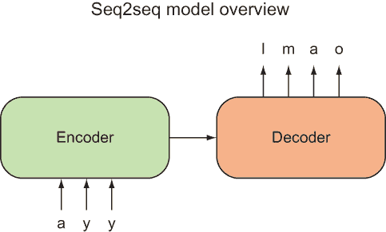
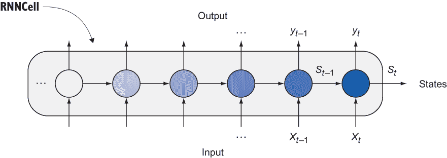
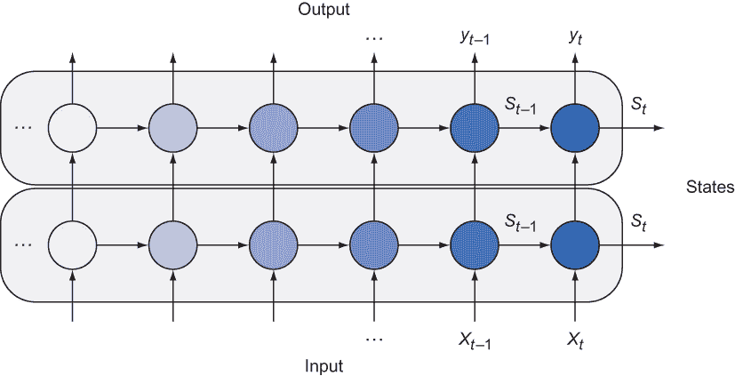
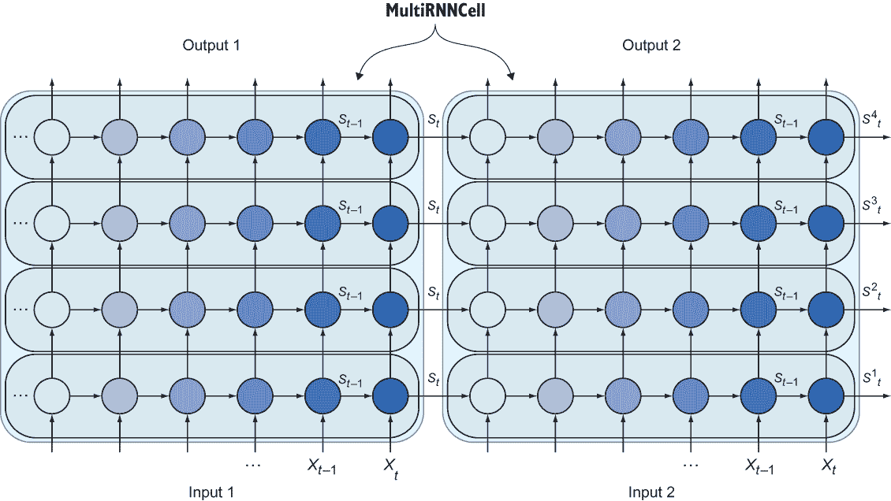
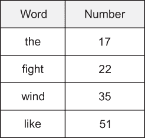
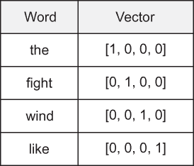
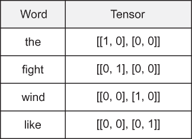
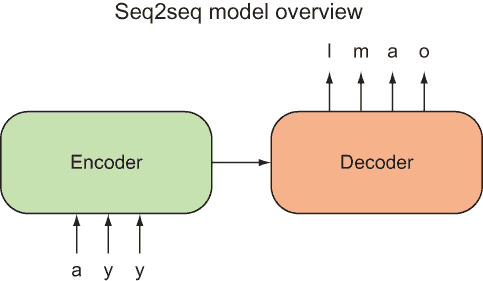
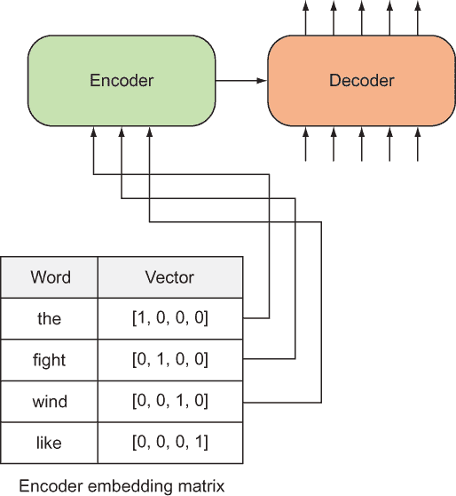
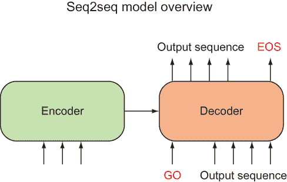

# 18 为聊天机器人构建序列到序列模型

本章涵盖了

+   检查序列到序列架构

+   执行单词的向量嵌入

+   使用真实世界数据实现聊天机器人

通过电话与客户服务交谈对客户和公司来说都是一种负担。服务提供商支付了一大笔钱来雇佣客户服务代表，但如果我们能够自动化大部分这项工作怎么办？我们能否开发出通过自然语言与客户交互的软件？

这个想法并不像你想象的那么遥远。由于深度学习技术在自然语言处理方面的前所未有的发展，聊天机器人受到了很多炒作。也许，给定足够的训练数据，聊天机器人可以学会通过自然对话来导航最常见的客户问题。如果聊天机器人真正高效，它不仅可以通过消除雇佣代表的需求来为公司节省资金，还可以加速客户寻找答案的过程。

在本章中，你将通过向神经网络提供成千上万的输入和输出句子示例来构建一个聊天机器人。你的训练数据集是一对英语话语。例如，如果你问“你好吗？”，聊天机器人应该回答，“很好，谢谢。”

注意：在本章中，我们将*序列*和*句子*视为可互换的概念。在我们的实现中，一个句子将是一系列字母的序列。另一种常见的方法是将句子表示为一系列单词的序列。

实际上，该算法将尝试为每个自然语言查询生成一个智能的自然语言响应。你将实现一个神经网络，它使用了前几章教授的两个主要概念：多类分类和循环神经网络（RNNs）。

## 18.1 建立在分类和 RNNs 之上

*分类*是一种机器学习方法，用于预测输入数据项的类别。此外，多类分类允许超过两个类别。你在第六章中看到了如何在 TensorFlow 中实现这样的算法。具体来说，模型预测（一个数字序列）与真实值（一个 one-hot 向量）之间的成本函数试图通过交叉熵损失来找到两个序列之间的距离。

注意：one-hot 向量就像一个全零向量，除了其中一个维度有一个值为`1`。

在这种情况下，实现一个聊天机器人，你会使用交叉熵损失函数的变体来衡量两个序列之间的差异：模型的响应（这是一个序列）与真实值（也是一个序列）。

练习 18.1

在 TensorFlow 中，你可以使用交叉熵损失函数来衡量一个 one-hot 向量，例如（1，0，0），与神经网络输出，例如（2.34，0.1，0.3）之间的相似度。另一方面，英文句子不是数值向量。你如何使用交叉熵损失来衡量英文句子之间的相似度？

**答案**

一种粗略的方法是将每个句子表示为一个向量，通过计算句子中每个单词的频率来实现。然后比较这些向量以查看它们匹配得有多接近。

你可能还记得，RNNs 是一种神经网络设计，它不仅能够结合当前时间步的输入，还能结合之前输入的状态信息。第十六章和第十七章详细介绍了这些网络，它们将在本章再次被使用。RNNs 将输入和输出表示为时间序列数据，这正是你需要用来表示序列的。

一个天真想法是使用现成的 RNN 来实现聊天机器人。让我们看看为什么这是一个不好的方法。RNN 的输入和输出是自然语言句子，所以输入 (*x*[t]，*x*[t-1]，*x*[t-2]，...) 和输出 (*y*[t]，*y*[t-1]，*y*[t-2]，...) 可以是单词序列。使用 RNN 来模拟对话的问题在于 RNN 会立即产生输出结果。如果你的输入是一个单词序列 (*How*，*are*，*you*)，第一个输出单词将只取决于第一个输入单词。RNN 的输出序列项 *y*[t] 不能向前查看输入句子的未来部分来做出决定；它将仅限于了解之前的输入序列 (*x*[t]，*x*[t-1]，*x*[t-2]，... )。天真的 RNN 模型试图在用户完成提问之前就给出一个响应，这可能导致错误的结果。

相反，你将使用两个 RNN：一个用于输入句子，另一个用于输出序列。当第一个 RNN 完成输入序列的处理后，它将隐藏状态发送到第二个 RNN 以处理输出句子。你可以在图 18.1 中看到这两个 RNN，分别标记为编码器（Encoder）和解码器（Decoder）。



图 18.1 这是您神经网络模型的高级视图。输入 ayy 被传递到编码器 RNN，解码器 RNN 预期会响应 lmao。这些例子是您聊天机器人的玩具例子，但你可以想象更复杂的输入和输出句子对。

我们将从前几章中引入多类分类和 RNN 的概念，来设计一个学习将输入序列映射到输出序列的神经网络。RNNs 提供了一种编码输入句子、将总结的状态向量传递到解码器，然后将其解码为响应句子的方法。为了衡量模型响应与真实值之间的成本，我们借鉴了多类分类中使用的函数——交叉熵损失。

这种架构被称为 *序列到序列（seq2seq）* 神经网络架构。你使用的训练数据将是成千上万对从电影剧本中挖掘出的句子。算法将观察这些对话示例，并最终学会对您可能提出的任意查询形成响应。

练习 18.2

哪些其他行业可以从聊天机器人中受益？

**答案**

一个例子是作为教学工具的对话伙伴，用于教授英语、数学甚至计算机科学等科目。

到本章结束时，你将拥有自己的聊天机器人，它可以对你的查询做出一定程度的智能响应。它不会完美，因为这个模型总是对相同的输入查询以相同的方式做出响应。

假设你正在前往一个外国旅行，而你没有任何说这种语言的能力。一个聪明的销售人员给你一本书，声称这是你需要用来回应外语句子的所有东西。你被要求像字典一样使用这本书。当有人用外语说一个短语时，你可以查找它，书中将为你准备好要大声读出的回答：“如果有人说*你好*，你就说*嗨*。”

当然，这本书可能是一个实用的查找表，用于日常闲聊，但查找表能为你提供任意对话的正确响应吗？当然不能！考虑查找问题“你饿吗？”答案在书中，永远不会改变。

查找表中缺少状态信息，这是对话中的一个关键组件。在你的 seq2seq 模型中，你将面临类似的问题，但这个模型是一个良好的起点。信不信由你，目前，用于智能对话的分层状态表示还不是标准；许多聊天机器人都是从这些 seq2seq 模型开始的。

## 18.2 理解 seq2seq 架构

seq2seq 模型试图学习一个神经网络，从输入序列预测输出序列。序列与传统向量有一点不同，因为序列暗示了事件的顺序。

时间是排序事件的直观方式：我们通常都会提到与时间相关的词汇，如*时间*、*时间序列*、*过去*和*未来*。我们喜欢说 RNN 将信息传播到*未来*时间步，例如，或者 RNN 捕获*时间依赖性*。

note RNNs 在第十六章中有详细讲解。

seq2seq 模型使用多个 RNN 实现。单个 RNN 单元如图 18.2 所示；它是 seq2seq 模型架构其余部分的构建块。



图 18.2 RNN 的输入、输出和状态。你可以忽略 RNN 实现细节的复杂性。重要的是你的输入和输出的格式。

首先，你将学习如何堆叠 RNN 来提高模型复杂性。然后你将学习如何将一个 RNN 的隐藏状态传递给另一个 RNN，以便你可以有一个编码器和解码器网络。正如你将开始看到的那样，开始使用 RNN 相对容易。

之后，你将了解将自然语言句子转换为向量序列的介绍。毕竟，RNN 只能理解数值数据，所以你绝对需要这个转换过程。因为 *序列* 另一种说法是“张量列表”，你需要确保你可以相应地转换你的数据。句子是一系列单词，但单词不是张量。将单词转换为张量或更常见的是向量的过程称为 *嵌入*。

最后，你将把这些概念结合起来，在真实世界数据上实现 seq2seq 模型。数据将来自数千个电影剧本的对话。

你可以直接使用列表 18.1 中的代码开始运行。打开一个新的 Python 文件，并开始复制列表代码以设置常量和占位符。你将定义占位符的形状为 `[None, seq_size, input_dim]`，其中 `None` 表示大小是动态的（批处理大小可能会变化），`seq_size` 是序列的长度，`input_dim` 是每个序列项的维度。

列表 18.11 设置常量和占位符

```
import tensorflow as tf                ❶

input_dim = 1                          ❷
seq_size = 6                           ❸

input_placeholder = tf.placeholder(dtype=tf.float32, 
                                   shape=[None, seq_size, input_dim])
```

❶ 所需的一切就是 TensorFlow。

❷ 每个序列元素的维度

❸ 序列的最大长度

为了生成如图 18.2 所示的 RNN 单元，TensorFlow 提供了一个有用的 `LSTMCell` 类。列表 18.2 展示了如何使用这个类并从单元中提取输出和状态。为了方便，列表定义了一个名为 `make_cell` 的辅助函数来设置 LSTM RNN 单元。然而，定义一个单元还不够；你还需要调用 `tf.nn.dynamic_rnn` 来设置网络；

列表 18.2 创建一个简单的 RNN 单元

```
def make_cell(state_dim):
    return tf.contrib.rnn.LSTMCell(state_dim)                 ❶

with tf.variable_scope("first_cell") as scope:
    cell = make_cell(state_dim=10)
    outputs, states = tf.nn.dynamic_rnn(cell,                 ❷
                                        input_placeholder,    ❸
                                        dtype=tf.float32)
```

❶ 查看 tf.contrib.rnn 文档了解其他类型的单元，例如 GRU。

❷ 将生成两个结果：输出和状态。

❸ 输入到 RNN 的序列

你可能还记得，从前几章中你可以通过添加隐藏层来提高神经网络的复杂性。更多的层意味着更多的参数，这很可能意味着模型可以表示更多的函数，因为它更灵活。

你知道吗？你可以堆叠单元。没有什么可以阻止你这样做。这样做会使模型更复杂，因此这个双层 RNN 模型可能会表现得更好，因为它更具表现力。图 18.3 显示了两个堆叠的单元。



图 18.3 你可以将 RNN 单元堆叠以形成一个更复杂的架构。

警告：模型越灵活，越有可能过拟合训练数据。

在 TensorFlow 中，你可以直观地实现这个双层 RNN 网络。首先，为第二个单元创建一个新的变量作用域。为了堆叠 RNN，你可以将第一个单元的输出管道连接到第二个单元的输入，如列表 18.3 所示。

列表 18.3 堆叠两个 RNN 单元

```
with tf.variable_scope("second_cell") as scope:                   ❶
    cell2 = make_cell(state_dim=10)
    outputs2, states2 = tf.nn.dynamic_rnn(cell2,
                                          outputs,                ❷
                                          dtype=tf.float32)
```

❶ 定义变量作用域有助于防止由于变量重用导致的运行时错误。

❷ 输入到这个单元将是另一个单元的输出。

如果你想有四层的 RNN？图 18.4 显示了堆叠了四个 RNN 单元。


图 18.4 TensorFlow 允许你堆叠任意数量的 RNN 单元。

TensorFlow 库提供了一个有用的快捷方式来堆叠单元，称为`MultiRNNCell`。列表 18.4 展示了如何使用这个辅助函数构建任意大的 RNN 单元。

列表 18.4 使用`MultiRNNCell`堆叠多个单元

```
def make_multi_cell(state_dim, num_layers):
    cells = [make_cell(state_dim) for _ in range(num_layers)]       ❶
    return tf.contrib.rnn.MultiRNNCell(cells)

multi_cell = make_multi_cell(state_dim=10, num_layers=4)
outputs4, states4 = tf.nn.dynamic_rnn(multi_cell, 
                                      input_placeholder, 
                                      dtype=tf.float32)
```

❶ for 循环语法是构建 RNN 单元列表的首选方式。

到目前为止，你已经通过将一个单元的输出管道到另一个单元的输入来垂直增长 RNN。在 seq2seq 模型中，你将想要一个 RNN 单元来处理输入句子，另一个 RNN 单元来处理输出句子。为了在两个单元之间进行通信，你还可以通过连接单元的状态来水平连接 RNN，如图 18.5 所示。

你已经垂直堆叠了 RNN 单元并将它们水平连接，大大增加了网络中的参数数量。你所做的是不是亵渎神灵？是的。你通过以各种方式组合 RNN 来构建了一个单体架构。但这种方法并非毫无道理，因为这个疯狂的人工神经网络架构是 seq2seq 模型的核心。



图 18.5 你可以使用第一个单元的最后状态作为下一个单元的初始状态。这个模型可以学习从输入序列到输出序列的映射。

如图 18.5 所示，seq2seq 模型似乎有两个输入序列和两个输出序列。但只有输入 1 将被用于输入句子，只有输出 2 将被用于输出句子。

你可能会想知道如何处理其他两个序列。奇怪的是，输出 1 序列在 seq2seq 模型中完全未被使用。而且正如你将看到的，输入 2 序列通过一些输出 2 数据在反馈循环中精心制作。

设计聊天机器人的训练数据将是输入和输出句子的配对，因此你需要更好地理解如何在张量中嵌入单词。第 18.3 节介绍了在 TensorFlow 中如何这样做。

练习 18.3

句子可以表示为字符或单词的序列，但你能否想到其他句子的顺序表示？

**答案**

两者短语和语法信息（动词、名词等）都可以使用。更常见的是，实际应用使用自然语言处理（NLP）查找来标准化单词形式、拼写和含义。一个执行此转换的库示例是 Facebook 的 fastText ([`github.com/facebookresearch/ fastText`](https://github.com/facebookresearch/fastText))。

## 18.3 符号的向量表示

单词和字母是符号，在 TensorFlow 中将符号转换为数值很容易。假设你的词汇表中有四个单词：word[0]: *the* ; word[1]: *fight*; word[2]: *wind*; 和 word[3]: *like*。

现在假设你想找到句子“Fight the wind.”的嵌入表示。符号*fight*位于查找表中的索引 1，*the*位于索引 0，而*wind*位于索引 2。如果你想找到单词*fight*的嵌入表示，你必须参考它的索引，即 1，并咨询索引 1 处的查找表以识别嵌入值。在第一个例子中，每个单词都与一个数字相关联，如图 18.6 所示。



图 18.6 从符号到标量的映射

下面的代码片段展示了如何使用 TensorFlow 代码定义符号与数值之间的这种映射：

```
embeddings_0d = tf.constant([17, 22, 35, 51])
```

或者，单词可能与向量相关联，如图 18.7 所示。这种方法通常是表示单词的首选方式。你可以在官方 TensorFlow 文档中找到一个关于单词向量表示的详细教程：[`mng.bz/35M8`](http://mng.bz/35M8)。



图 18.7 从符号到向量的映射

你可以在 TensorFlow 中实现单词与向量之间的映射，如图 18.5 所示。

列表 18.5 定义 4D 向量的查找表

```
embeddings_4d = tf.constant([[1, 0, 0, 0],
                             [0, 1, 0, 0],
                             [0, 0, 1, 0],
                             [0, 0, 0, 1]])
```

这可能听起来有些过分，但你可以用任何你想要的秩的张量来表示一个符号，而不仅仅是数字（秩 0）或向量（秩 1）。在图 18.8 中，你将符号映射到秩为 2 的张量。



图 18.8 从符号到张量的映射

列表 18.6 展示了如何在 TensorFlow 中实现这种将单词映射到张量的方法。

列表 18.6 定义张量查找表

```
embeddings_2x2d = tf.constant([[[1, 0], [0, 0]],
                               [[0, 1], [0, 0]],
                               [[0, 0], [1, 0]],
                               [[0, 0], [0, 1]]])
```

TensorFlow 提供的`embedding_lookup`函数是一种通过索引访问嵌入的优化方式，如列表 18.7 所示。

列表 18.7 查找嵌入

```
ids = tf.constant([1, 0, 2])                                        ❶
lookup_0d = sess.run(tf.nn.embedding_lookup(embeddings_0d, ids))
print(lookup_0d)

lookup_4d = sess.run(tf.nn.embedding_lookup(embeddings_4d, ids))
print(lookup_4d)

lookup_2x2d = sess.run(tf.nn.embedding_lookup(embeddings_2x2d, ids))
print(lookup_2x2d)
```

❶ 对应于单词 fight、the 和 wind 的嵌入查找

在现实中，嵌入矩阵并不是你需要硬编码的东西。这些列表提供是为了让你理解 TensorFlow 中`embedding_lookup`函数的细节，因为你很快就会大量使用它。嵌入查找表将通过训练神经网络自动随时间学习。你首先定义一个随机、正态分布的查找表。然后 TensorFlow 的优化器将调整矩阵值以最小化成本。

练习 18.4

按照官方 TensorFlow word2vec 教程[www.tensorflow.org/tutorials/word2vec](http://www.tensorflow.org/tutorials/word2vec)来熟悉嵌入表示。

**答案**

本教程将教会你如何使用 TensorBoard 和 TensorFlow 来可视化嵌入表示。

## 18.4 整合所有内容

在神经网络中使用自然语言输入的第一步是确定符号与整数索引之间的映射。表示句子的两种常见方式是字母序列和单词序列。为了简单起见，假设你处理的是字母序列，因此你需要构建字符与整数索引之间的映射。

注意：官方代码仓库可在本书网站（[`mng.bz/emeQ`](http://mng.bz/emeQ)）和 GitHub（[`mng.bz/pz8z`](http://mng.bz/pz8z)）上找到。从那里，你可以获取代码运行，无需从书中复制粘贴。

列表 18.8 展示了如何建立整数和字符之间的映射。如果你向这个函数提供一个字符串列表，它将生成两个字典，表示映射。

列表 18.8 提取字符词汇表

```
def extract_character_vocab(data):
    special_symbols = ['<PAD>', '<UNK>', '<GO>',  '<EOS>']
    set_symbols = set([character for line in data for character in line])
    all_symbols = special_symbols + list(set_symbols)
    int_to_symbol = {word_i: word 
                     for word_i, word in enumerate(all_symbols)}
    symbol_to_int = {word: word_i 
                     for word_i, word in int_to_symbol.items()}

    return int_to_symbol, symbol_to_int

input_sentences = ['hello stranger', 'bye bye']    ❶
output_sentences = ['hiya', 'later alligator']     ❷

input_int_to_symbol, input_symbol_to_int = 
    extract_character_vocab(input_sentences)

output_int_to_symbol, output_symbol_to_int =
    extract_character_vocab(output_sentences
```

❶ 训练输入句子列表

❷ 对应的训练输出句子列表

接下来，你将在列表 18.9 中定义所有超参数和常量。这些元素通常是你可以通过试错手动调整的值。通常，维度或层数的更大值会导致更复杂的模型，如果你有大量数据、快速处理能力和大量时间，这将是有益的。

列表 18.9 定义超参数

```
NUM_EPOCS = 300                                        ❶
RNN_STATE_DIM = 512                                    ❷
RNN_NUM_LAYERS = 2                                     ❸
ENCODER_EMBEDDING_DIM = DECODER_EMBEDDING_DIM = 64     ❹

BATCH_SIZE = int(32)
LEARNING_RATE = 0.0003

INPUT_NUM_VOCAB = len(input_symbol_to_int)             ❺
OUTPUT_NUM_VOCAB = len(output_symbol_to_int)           ❻
```

❶ 训练轮数

❷ RNN 的隐藏维度大小

❸ RNN 的堆叠单元数量

❹ 编码器和解码器序列元素的嵌入维度

❺ 批处理大小

❻ 编码器和解码器之间可能具有不同的词汇表。

接下来，列出所有占位符。如列表 18.10 所示，占位符很好地组织了训练网络所需的输入和输出序列。你需要跟踪序列及其长度。对于解码器部分，你还需要计算最大序列长度。这些占位符形状中的 `None` 值表示张量可以在该维度上具有任意大小。例如，批处理大小可能在每次运行中变化。但为了简单起见，你将始终保持批处理大小不变。

列表 18.10 列表占位符

```
# Encoder placeholders
encoder_input_seq = tf.placeholder(     ❶
    tf.int32, 
    [None, None],                       ❷
    name='encoder_input_seq'
)

encoder_seq_len = tf.placeholder(       ❸
    tf.int32,  
    (None,),                            ❹
    name='encoder_seq_len'
)

# Decoder placeholders
decoder_output_seq = tf.placeholder(    ❺
    tf.int32, 
    [None, None],                       ❻
    name='decoder_output_seq'
)

decoder_seq_len = tf.placeholder(       ❼
    tf.int32,
    (None,),                            ❽
    name='decoder_seq_len'
)

max_decoder_seq_len = tf.reduce_max(    ❾
    decoder_seq_len, 
    name='max_decoder_seq_len'
)
```

❶ 编码器输入的整数序列

❷ 形状是批处理大小 × 序列长度。

❸ 批处理中序列的长度

❹ 形状是动态的，因为序列的长度可以改变。

❺ 解码器输出的整数序列

❻ 形状是批处理大小 × 序列长度。

❼ 批处理中序列的长度

❽ 形状是动态的，因为序列的长度可以改变。

❾ 批处理中解码器序列的最大长度

让我们定义辅助函数来构建 RNN 单元。这些函数，如列表 18.11 所示，应该对你来说在 18.3 节中已经熟悉了。

列表 18.11 构建 RNN 单元的辅助函数

```
def make_cell(state_dim):
    lstm_initializer = tf.random_uniform_initializer(-0.1, 0.1)
    return tf.contrib.rnn.LSTMCell(state_dim, initializer=lstm_initializer)

def make_multi_cell(state_dim, num_layers):
    cells = [make_cell(state_dim) for _ in range(num_layers)]
    return tf.contrib.rnn.MultiRNNCell(cells)
```

你将通过使用你定义的辅助函数来构建编码器和解码器 RNN 单元。作为提醒，我已经为你复制了图 18.9 中的 seq2seq 模型，以可视化编码器和解码器 RNN。



图 18.9 seq2seq 模型通过使用编码器 RNN 和解码器 RNN 来学习输入序列到输出序列之间的转换。

让我们先谈谈编码器单元部分，因为在列表 18.12 中，您将构建编码器单元。编码器 RNN 产生的状态将存储在一个名为`encoder_state`的变量中。RNN 还会产生一个输出序列，但在标准的 seq2seq 模型中，您不需要访问它，因此您可以忽略或删除它。

将字母或单词转换为向量表示也是常见的，通常称为*嵌入*。TensorFlow 提供了一个方便的函数`embed_sequence`，可以帮助您将符号的整数表示嵌入。图 18.10 显示了编码器如何从查找表中接受数值。您可以在列表 18.13 的开头看到编码器的实际操作。



图 18.10 RNN 只接受数值序列作为输入或输出，因此您需要将符号转换为向量。在这种情况下，符号是单词，如 the、fight、wind 和 like。它们对应的向量与嵌入矩阵相关联。

列表 18.12 编码器嵌入和单元

```
encoder_input_embedded = tf.contrib.layers.embed_sequence(
    encoder_input_seq,                                                     ❶
    INPUT_NUM_VOCAB,                                                       ❷
    ENCODER_EMBEDDING_DIM                                                  ❸
)

# Encoder output

encoder_multi_cell = make_multi_cell(RNN_STATE_DIM, RNN_NUM_LAYERS)

encoder_output, encoder_state = tf.nn.dynamic_rnn(
    encoder_multi_cell, 
    encoder_input_embedded, 
    sequence_length=encoder_seq_len, 
    dtype=tf.float32
)

del(encoder_output)                                                        ❹
```

❶ 输入数字序列（行索引）

❷ 嵌入矩阵的行

❸ 嵌入矩阵的列

❹ 您不需要坚持这个值。

解码器 RNN 的输出是一个表示自然语言句子和表示序列结束的特殊符号的数值序列。您将这个序列结束符号标记为`<EOS>`。图 18.11 说明了这个过程。

解码器 RNN 的输入序列将类似于解码器的输出序列，但每个句子的末尾没有`<EOS>`（序列结束）特殊符号，而是在开头有一个`<GO>`特殊符号。这样，解码器从左到右读取输入后，开始时没有关于答案的额外信息，这使得它成为一个健壮的模型。



图 18.11 解码器的输入前缀了一个特殊的`<GO>`符号，而输出后缀了一个特殊的`<EOS>`符号。

列表 18.13 展示了如何执行这些切片和连接操作。解码器输入的新序列将被称为`decoder_input_seq`。您将使用 TensorFlow 的`tf.concat`操作将矩阵粘合在一起。在列表中，您定义了一个`go_prefixes`矩阵，它将是一个只包含`<GO>`符号的列向量。

列表 18.13 准备解码器的输入序列

```
decoder_raw_seq = decoder_output_seq[:, :-1]                           ❶
go_prefixes = tf.fill([BATCH_SIZE, 1], output_symbol_to_int['<GO>'])   ❷
decoder_input_seq = tf.concat([go_prefixes, decoder_raw_seq], 1)       ❸
```

❶ 通过忽略最后一列来裁剪矩阵

❷ 创建一个包含<GO>符号的列向量

❸ 将<GO>向量连接到裁剪矩阵的开头

现在我们来构建解码器单元。如列表 18.14 所示，您首先将解码器整数序列嵌入到向量序列中，称为`decoder_input_embedded`。

输入序列的嵌入版本将被馈送到解码器的 RNN 中，因此创建解码器 RNN 单元。还有一件事：你需要一个层将解码器的输出映射到词汇表的一个热编码表示，你称之为`output_layer`。设置解码器的过程开始时与设置编码器的过程相似。

列表 18.14 解码器嵌入和单元

```
decoder_embedding = tf.Variable(tf.random_uniform([OUTPUT_NUM_VOCAB, 
                                                   DECODER_EMBEDDING_DIM]))
decoder_input_embedded = tf.nn.embedding_lookup(decoder_embedding, 
                                                decoder_input_seq)

decoder_multi_cell = make_multi_cell(RNN_STATE_DIM, RNN_NUM_LAYERS)

output_layer_kernel_initializer = 
    tf.truncated_normal_initializer(mean=0.0, stddev=0.1)
output_layer = Dense(
    OUTPUT_NUM_VOCAB,
    kernel_initializer = output_layer_kernel_initializer
)
```

好吧，这里事情变得奇怪了。你有两种方法来检索解码器的输出：在训练期间和推理期间。训练解码器仅在训练期间使用，而推理解码器用于对从未见过的数据进行测试。

存在两种获取输出序列的方法的原因是，在训练过程中，你有可用的事实数据，因此你可以使用有关已知输出的信息来帮助加速学习过程。但在推理过程中，你没有事实输出标签，因此你必须求助于仅使用输入序列进行推理。

列表 18.15 实现了训练解码器。你将`decoder_input_seq`输入到解码器的输入中，使用`TrainingHelper`。这个辅助操作为你管理解码器 RNN 的输入。

列表 18.15 解码器输出（训练）

```
with tf.variable_scope("decode"):

    training_helper = tf.contrib.seq2seq.TrainingHelper(
        inputs=decoder_input_embedded,
        sequence_length=decoder_seq_len,
        time_major=False
    )

    training_decoder = tf.contrib.seq2seq.BasicDecoder(
        decoder_multi_cell,
        training_helper,
        encoder_state,
        output_layer
    ) 

    training_decoder_output_seq, _, _ = tf.contrib.seq2seq.dynamic_decode(
        training_decoder, 
        impute_finished=True, 
        maximum_iterations=max_decoder_seq_len
    )
```

如果你关心从测试数据中获取 seq2seq 模型的输出，你将不再能够访问`decoder_input_seq`。为什么？因为解码器输入序列是从解码器输出序列派生出来的，而输出序列仅在训练数据集中可用。

列表 18.16 实现了推理情况的解码器输出操作。在这里，你将再次使用辅助操作向解码器提供一个输入序列。

列表 18.16 解码器输出（推理）

```
with tf.variable_scope("decode", reuse=True):
    start_tokens = tf.tile(
        tf.constant([output_symbol_to_int['<GO>']], 
                    dtype=tf.int32), 
        [BATCH_SIZE], 
        name='start_tokens')

    inference_helper = tf.contrib.seq2seq.GreedyEmbeddingHelper(            ❶
        embedding=decoder_embedding,                                        ❶
        start_tokens=start_tokens,                                          ❶
        end_token=output_symbol_to_int['<EOS>']                             ❶
    )                                                                       ❶

    inference_decoder = tf.contrib.seq2seq.BasicDecoder(                    ❷
        decoder_multi_cell,                                                 ❷
        inference_helper,                                                   ❷
        encoder_state,                                                      ❷
        output_layer                                                        ❷
    )                                                                       ❷

    inference_decoder_output_seq, _, _ = tf.contrib.seq2seq.dynamic_decode( ❸
        inference_decoder,                                                  ❸
        impute_finished=True,                                               ❸
        maximum_iterations=max_decoder_seq_len                              ❸
    )                                                                       ❸
```

❶ 辅助推理过程

❷ 基本解码器

❸ 通过使用解码器执行动态解码

使用 TensorFlow 的`sequence_loss`方法计算成本。你需要访问推断的解码器输出序列和事实输出序列。列表 18.17 在代码中定义了`cost`函数。

列表 18.17 `cost`函数

```
training_logits =                                                           ❶
    tf.identity(training_decoder_output_seq.rnn_output, name='logits')      ❶
inference_logits =                                                          ❶
    tf.identity(inference_decoder_output_seq.sample_id, name='predictions') ❶

masks = tf.sequence_mask(                                                   ❷
    decoder_seq_len,                                                        ❷
    max_decoder_seq_len,                                                    ❷
    dtype=tf.float32,                                                       ❷
    name='masks'                                                            ❷
)                                                                           ❷

cost = tf.contrib.seq2seq.sequence_loss(                                    ❸
    training_logits,                                                        ❸
    decoder_output_seq,                                                     ❸
    masks                                                                   ❸
)                                                                           ❸
```

❶ 为你的方便重命名张量

❷ 创建序列损失的权重

❸ 使用 TensorFlow 的内置序列损失函数

最后，调用一个优化器来最小化成本。但你会做一个你可能从未见过的技巧。在像这样的深度网络中，你需要限制极端梯度变化，以确保梯度不会发生太大的变化，使用的技术称为*梯度裁剪*。列表 18.18 展示了如何操作。

练习 18.5

尝试不使用梯度裁剪的 seq2seq 模型，体验一下差异。

**答案**

你会注意到，没有梯度裁剪时，网络有时会过度调整梯度，导致数值不稳定性。

列表 18.18 调用一个优化器

```
optimizer = tf.train.AdamOptimizer(LEARNING_RATE)

gradients = optimizer.compute_gradients(cost)
capped_gradients = [(tf.clip_by_value(grad, -5., 5.), var)                 ❶
                        for grad, var in gradients if grad is not None]
train_op = optimizer.apply_gradients(capped_gradients)
```

❶ 梯度裁剪

该列表总结了 seq2seq 模型的实现。一般来说，在设置优化器后，模型就准备好训练了，如列表 18.18 所示。您可以通过运行 `train_op` 并使用训练数据批次来创建会话并学习模型的参数。

哦，对了——你需要从某处获取训练数据！你怎么能获得成千上万对输入和输出句子？别担心；第 18.5 节涵盖了该过程。

## 18.5 收集对话数据

康奈尔电影对话语料库 ([`mng.bz/W28O`](http://mng.bz/W28O)) 是一个包含超过 60 部电影中 22 万多段对话的数据集。您可以从官方网站下载 zip 文件。

警告 由于数据量巨大，您可能预计训练算法需要很长时间。如果您的 TensorFlow 库配置为仅使用 CPU，训练可能需要整整一天。在 GPU 上，训练此网络可能需要 30 分钟到 1 小时。

这里是两个人（A 和 B）之间来回对话的小片段示例：

A: 他们不做！

B: 他们也这样做！

A: 好的。

因为聊天机器人的目标是针对每个可能的输入话语产生智能输出，所以您将根据对话的偶然对来构建您的训练数据。在示例中，对话生成了以下输入和输出句子的对：

+   “他们不做！”®“他们也这样做！”

+   “他们也这样做！”®“好的。”

为了您的方便，我们已处理数据并将其在线提供给您。您可以在 [`mng.bz/OvlE`](http://mng.bz/OvlE) 找到它。完成下载后，您可以运行列表 18.19，它使用了 GitHub 仓库下 `Listing 18-eoc-assign.ipynb` Jupyter 笔记本中的 `load_sentences` 辅助函数。

列表 18.19 训练模型

```
input_sentences = load_sentences('data/words_input.txt')                   ❶
output_sentences = load_sentences('data/words_output.txt')                 ❷

input_seq = [
    [input_symbol_to_int.get(symbol, input_symbol_to_int['<UNK>']) 
        for symbol in line]                                                ❸
    for line in input_sentences                                            ❹
]

output_seq = [
    [output_symbol_to_int.get(symbol, output_symbol_to_int['<UNK>']) 
        for symbol in line] + [output_symbol_to_int['<EOS>']]              ❺
    for line in output_sentences                                           ❻
]

sess = tf.InteractiveSession()
sess.run(tf.global_variables_initializer())
saver = tf.train.Saver()                                                   ❼

for epoch in range(NUM_EPOCS + 1):                                         ❽

    for batch_idx in range(len(input_sentences) // BATCH_SIZE):            ❾

        input_data, output_data = get_batches(input_sentences,             ❿
                                              output_sentences,
                                              batch_idx)  

        input_batch, input_lenghts = input_data[batch_idx]
        output_batch, output_lengths = output_data[batch_idx]

        _, cost_val = sess.run(                                            ⓫
            [train_op, cost],
            feed_dict={
                encoder_input_seq: input_batch,
                encoder_seq_len: input_lengths,
                decoder_output_seq: output_batch,
                decoder_seq_len: output_lengths
            }
        )

saver.save(sess, 'model.ckpt')
sess.close()
```

❶ 将输入句子作为字符串列表加载

❷ 以相同的方式加载相应的输出句子

❸ 遍历字母

❹ 遍历文本行

❺ 将 EOS 符号追加到输出数据的末尾

❻ 遍历行

❼ 保存学习到的参数是个好主意。

❽ 遍历时代

❾ 通过批次数进行遍历

❿ 获取当前批次的输入和输出对

⓫ 在当前批次上运行优化器

因为您已将模型参数保存到文件中，您可以轻松地将模型加载到另一个程序中，并查询网络对新输入的响应。运行 `inference_logits` 操作以获取聊天机器人的响应。

## 摘要

+   TensorFlow 可以根据您到目前为止从书中获得的知识构建 seq2seq 神经网络。

+   您可以在 TensorFlow 中嵌入自然语言。

+   RNN 可以用作构建更复杂模型的基石。

+   在对电影剧本中的对话示例进行模型训练后，您可以像对待聊天机器人一样处理该算法，从自然输入中推断出自然语言响应。
