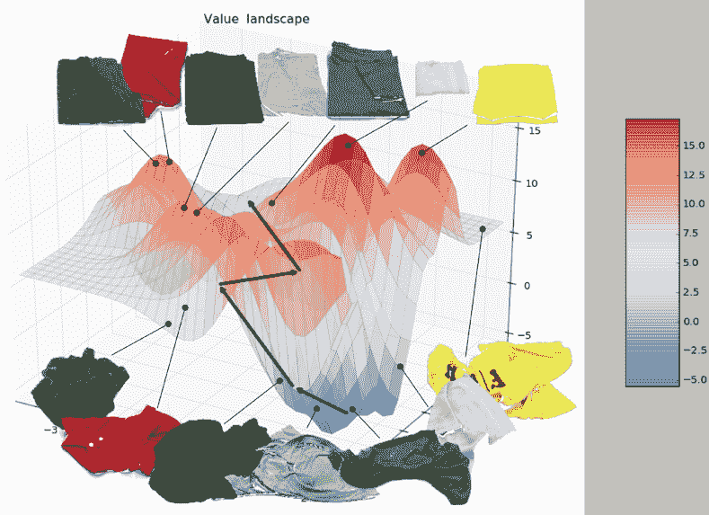
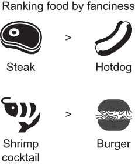
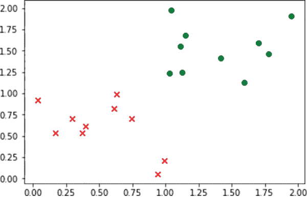
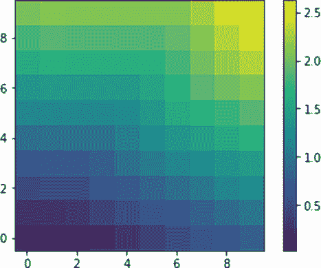
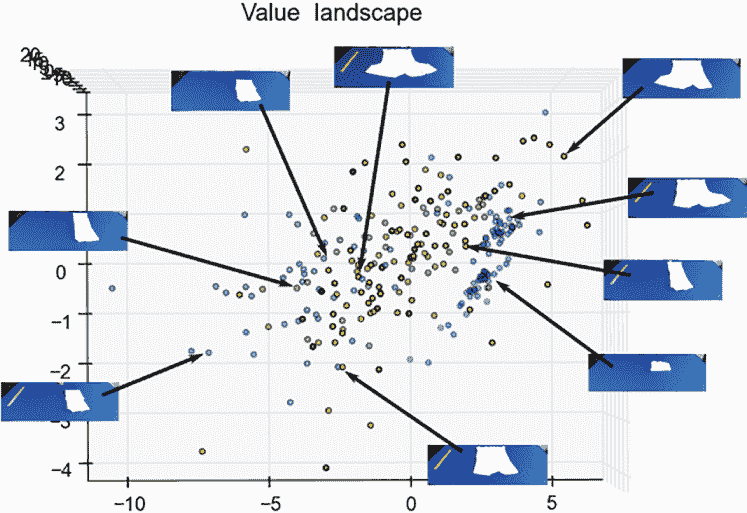
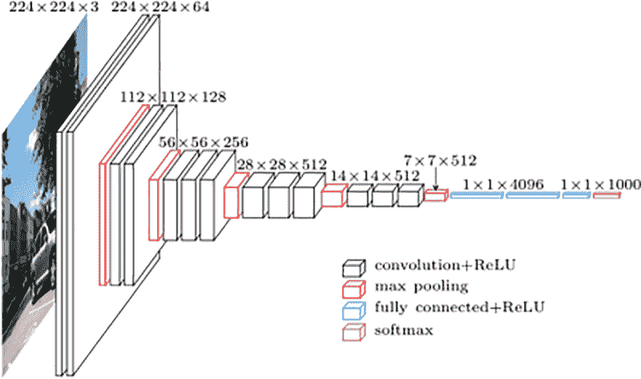
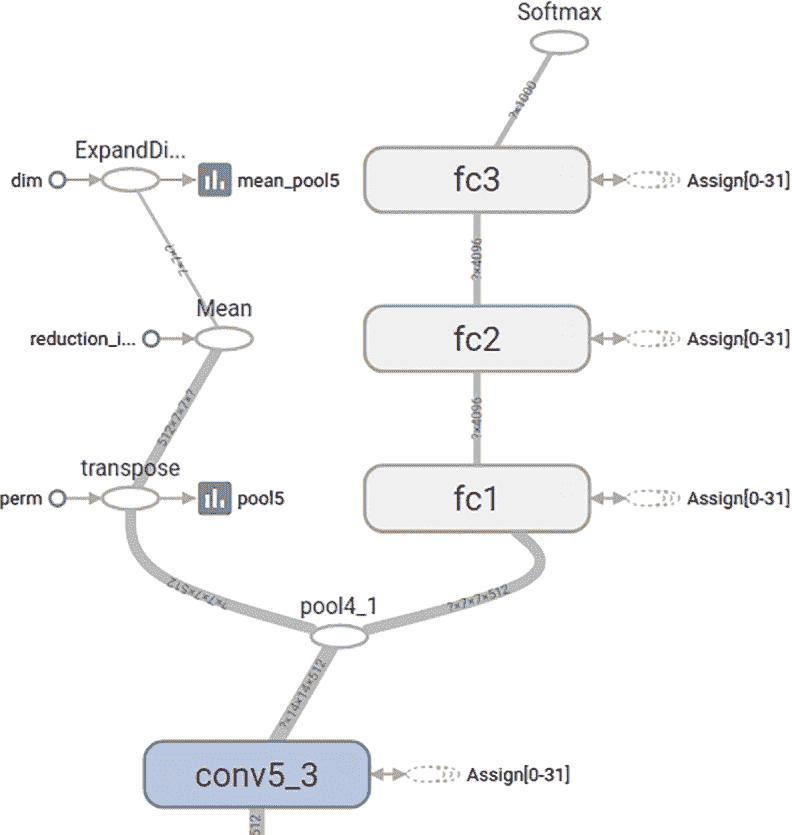
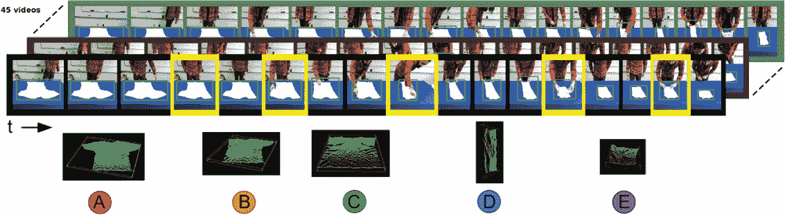
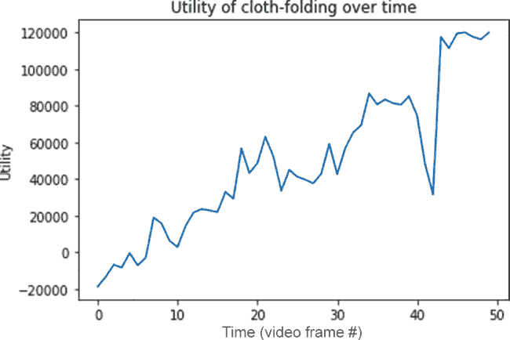

# 19 效用景观

本章涵盖了

+   实现用于排名的神经网络

+   使用 VGG16 进行图像嵌入

+   可视化效用

处理感官输入使机器人能够调整他们对周围世界的模型。在吸尘机器人案例中，房间里的家具可能会每天变化，因此机器人必须能够适应混乱的环境。

假设你拥有一台未来派的家用机器人女仆，它具备一些基本技能，同时也能从人类的演示中学习新技能。也许你想教它如何叠衣服。

教机器人完成一项新任务是棘手的问题。一些直接的问题会浮现在脑海中：

+   机器人是否应该简单地模仿人类的动作序列？这样的过程被称为*模仿学习*。

+   机器人的手臂和关节如何与人类姿势相匹配？这个问题通常被称为*对应问题*。

在本章中，你将模拟一个从人类演示中学习到的任务，同时避免模仿学习和对应问题。真是太幸运了！你将通过研究一种使用*效用函数*对世界状态进行排名的方法来完成这个任务，该函数接受一个状态并返回一个表示其可取性的实数值。你不仅将避免将模仿作为成功衡量标准，还将绕过将机器人的动作集映射到人类动作集的复杂性（对应问题）。

练习 19.1

模仿学习的目标是让机器人重现演示者的动作序列。这个目标在纸上听起来不错，但这种方法有哪些局限性？

**答案**

模仿人类动作是从人类演示中学习的一种天真方法。相反，代理应该识别演示背后的隐藏目标。例如，当有人叠衣服时，目标是使衣物变平并压缩，这些概念与人类的手部动作无关。通过理解人类为何产生他们的动作序列，代理能够更好地概括它所教授的技能。

在第 19.1 节中，你将学习如何通过人类演示任务的视频实现世界状态的效用函数。学习到的效用函数是偏好模型。

你将探索如何教机器人如何折叠衣物。一件皱巴巴的衣物几乎肯定处于一种以前从未见过的配置。如图 19.1 所示，效用框架对状态空间的大小没有限制。偏好模型专门在人们以各种方式折叠 T 恤的视频上训练。



图 19.1 穿着皱巴巴的衣服比叠得好的衣服状态更差。此图展示了如何评估一块布的每种状态；分数越高代表状态越佳。

效用函数可以推广到各种状态（新颖配置的皱巴巴的 T 恤与熟悉配置的折叠 T 恤）并在服装（T 恤折叠与裤子折叠）之间重用知识。

我们可以用以下论点进一步说明良好效用函数的实际应用：在现实世界中，并非所有视觉观察都是针对学习任务进行优化的。演示技能的教师可能执行无关、不完整甚至错误的行为，但人类能够忽略这些错误。

当机器人观看人类演示时，你希望它能理解完成任务所涉及的因果关系。你的工作使得学习阶段可以互动，机器人对人类行为持积极怀疑态度，以完善训练数据。

为了实现这个目标，你首先从少量视频中学习一个效用函数来对各种状态的偏好进行排名。然后，当机器人通过人类演示展示一项新技能的实例时，它会咨询效用函数以验证预期的效用随时间增加。最后，机器人中断人类演示，询问该动作是否对于学习技能是必要的。

## 19.1 偏好模型

我们假设人类的偏好是从一个*功利主义*的角度得出的，这意味着一个数字决定了物品的排名。假设你调查了人们对各种食物的精致程度（如牛排、热狗、虾尾和汉堡）进行排名。

图 19.2 展示了食物成对之间的一些可能排名。正如你所预期的那样，在精致程度上，牛排比热狗排名更高，虾尾比汉堡排名更高。



图 19.2 展示了一组可能的对象成对排名。具体来说，你有四种食物，你想根据精致程度对它们进行排名，因此你采用了两个成对排名决策：牛排比热狗更精致，虾尾比汉堡更精致。

幸运的是，对于被调查的个人来说，并不是每一对物品都需要进行排名。可能并不明显的是，热狗和汉堡或牛排和虾尾之间哪个更精致。存在很多不同的意见空间。

如果状态 *s*[1] 的效用高于另一个状态 *s*[2]，则相应的排名表示为 *s*[1] > *s*[2]，这意味着 *s*[1] 的效用大于 *s*[2] 的效用。每个视频演示包含一个由 *n* 个状态 *s*[0]，*s*[1]，...，*s*[n] 组成的序列，提供了 *n*(*n* - 1)/2 个可能的有序对排名约束。

让我们实现一个能够进行排名的自己的神经网络。打开一个新的源文件，并使用列表 19.1 导入相关库。你即将创建一个神经网络，根据偏好对来学习效用函数。

列表 19.1 导入相关库

```
import tensorflow as tf
import numpy as np
import random
%matplotlib inline
import matplotlib.pyplot as plt
```

要学习基于效用分数对状态进行排名的神经网络，你需要训练数据。让我们先创建一些虚拟数据；你将在稍后用更真实的数据替换它。通过使用列表 19.2 重现图 19.3 中的 2D 数据。



图 19.3 你将工作的示例数据。圆圈代表更受欢迎的状态，而十字代表不太受欢迎的状态。由于数据成对出现，因此圆圈和十字的数量相等；每一对都是一个排名，如图 19.2 所示。

列表 19.2 生成虚拟训练数据

```
n_features = 2                                                      ❶

def get_data():
    data_a = np.random.rand(10, n_features) + 1                     ❷
    data_b = np.random.rand(10, n_features)                         ❸

    plt.scatter(data_a[:, 0], data_a[:, 1], c='r', marker='x')
    plt.scatter(data_b[:, 0], data_b[:, 1], c='g', marker='o')
    plt.show()

    return data_a, data_b

data_a, data_b = get_data()
```

❶ 你将生成 2D 数据，这样你可以轻松地可视化它。

❷ 应该产生更高效用值的点的集合

❸ 不太受欢迎的点的集合

接下来，你需要定义超参数。在这个模型中，让我们保持简单，通过保持架构浅层。你将创建一个包含一个隐藏层的网络。决定隐藏层神经元数量的相应超参数是

```
n_hidden = 10
```

排名神经网络将接收成对输入，因此你需要有两个单独的占位符——每个部分一个。此外，你将创建一个占位符来保存`dropout`参数值。继续通过将列表 19.3 添加到你的脚本中。

列表 19.3 占位符

```
with tf.name_scope("input"):
    x1 = tf.placeholder(tf.float32, [None, n_features], name="x1")         ❶
    x2 = tf.placeholder(tf.float32, [None, n_features], name="x2")         ❷
    dropout_keep_prob = tf.placeholder(tf.float32, name='dropout_prob')
```

❶ 受欢迎点的输入占位符

❷ 不受欢迎点的输入占位符

排名神经网络将只包含一个隐藏层。在列表 19.4 中，你定义了权重和偏差，然后在这些两个输入占位符的每个上重用这些权重和偏差。

列表 19.4 隐藏层

```
with tf.name_scope("hidden_layer"):
    with tf.name_scope("weights"):
        w1 = tf.Variable(tf.random_normal([n_features, n_hidden]), name="w1")
        tf.summary.histogram("w1", w1)
        b1 = tf.Variable(tf.random_normal([n_hidden]), name="b1")
        tf.summary.histogram("b1", b1)

    with tf.name_scope("output"):
        h1 = tf.nn.dropout(tf.nn.relu(tf.matmul(x1,w1) + b1), keep_prob=dropout_keep_prob)
        tf.summary.histogram("h1", h1)
        h2 = tf.nn.dropout(tf.nn.relu(tf.matmul(x2, w1) + b1), keep_prob=dropout_keep_prob)
        tf.summary.histogram("h2", h2)
```

神经网络的目标是计算两个输入的分数。在列表 19.5 中，你定义了网络的输出层的权重、偏差和全连接架构。你将剩下两个输出向量：`s1`和`s2`，代表成对输入的分数。

列表 19.5 输出层

```
with tf.name_scope("output_layer"):
    with tf.name_scope("weights"):
        w2 = tf.Variable(tf.random_normal([n_hidden, 1]), name="w2")
        tf.summary.histogram("w2", w2)
        b2 = tf.Variable(tf.random_normal([1]), name="b2")
        tf.summary.histogram("b2", b2)

    with tf.name_scope("output"):
        s1 = tf.matmul(h1, w2) + b2     ❶
        s2 = tf.matmul(h2, w2) + b2     ❷
```

❶ 输入 x1 的效用分数

❷ 输入 x2 的效用分数

你将假设在训练神经网络时，`x1`应包含不太受欢迎的项目。`s1`应得分低于`s2`，因此`s1`和`s2`之间的差异应该是负数。正如列表 19.6 所示，`loss`函数通过使用 softmax 交叉熵损失来尝试保证负数差异。你将定义一个`train_op`来最小化`loss`函数。

列表 19.6 损失和优化器

```
with tf.name_scope("loss"):
    s12 = s1 - s2
    s12_flat = tf.reshape(s12, [-1])

    cross_entropy = tf.nn.softmax_cross_entropy_with_logits(
                        labels=tf.zeros_like(s12_flat), 
                        logits=s12_flat + 1)

    loss = tf.reduce_mean(cross_entropy)
    tf.summary.scalar("loss", loss)

with tf.name_scope("train_op"):
    train_op = tf.train.AdamOptimizer(0.001).minimize(loss)
```

现在按照列表 19.7 设置 TensorFlow 会话，这涉及到初始化所有变量，并使用摘要编写器准备 TensorBoard 调试。

注意：你在第二章的结尾使用了摘要编写器，当时你被介绍到了 TensorBoard。

列表 19.7 准备会话

```
sess = tf.InteractiveSession()
summary_op = tf.summary.merge_all()
writer = tf.summary.FileWriter("tb_files", sess.graph)
init = tf.global_variables_initializer()
sess.run(init)
```

你已经准备好训练网络了！在生成的虚拟数据上运行`train_op`来学习模型的参数（列表 19.8）。

列表 19.8 训练网络

```
for epoch in range(0, 10000):
    loss_val, _ = sess.run([loss, train_op], feed_dict={x1:data_a, x2:data_b, ❶
    ➥ dropout_keep_prob:0.5})                                                ❶
    if epoch % 100 == 0 :
        summary_result = sess.run(summary_op, 
                                  feed_dict={x1:data_a,                       ❷
                                             x2:data_b,                       ❸
                                             dropout_keep_prob:1})            ❹
        writer.add_summary(summary_result, epoch)
```

❶ 训练 dropout keep_prob 为 0.5。

❷ 受欢迎的点

❸ 不受欢迎的点

❹ 测试 dropout 的 keep_prob 应该始终为 1。

最后，可视化学习到的得分函数。如图 19.9 所示，将二维点添加到列表中。

列表 19.9 准备测试数据

```
grid_size = 10
data_test = []
for y in np.linspace(0., 1., num=grid_size):       ❶
    for x in np.linspace(0., 1., num=grid_size):   ❷
        data_test.append([x, y])
```

❶ 遍历行

❷ 遍历列

你将在测试数据上运行`s1`操作以获得每个状态的效用值，并如图 19.4 所示可视化这些数据。使用列表 19.10 生成可视化。



图 19.4 排名神经网络学习到的得分景观

列表 19.10 可视化结果

```
def visualize_results(data_test):
    plt.figure()
    scores_test = sess.run(s1, feed_dict={x1:data_test, dropout_keep_prob:1})❶
    scores_img = np.reshape(scores_test, [grid_size, grid_size])             ❷
    plt.imshow(scores_img, origin='lower')
    plt.colorbar()

visualize_results(data_test)
```

❶ 计算所有点的效用

❷ 将效用重塑为矩阵，以便您可以使用 Matplotlib 可视化图像

## 19.2 图像嵌入

在第十八章中，你大胆地给神经网络喂了一些自然语言句子。你是通过将句子中的单词或字母转换为数值形式，如向量来做到这一点的。每个符号（无论是单词还是字母）都通过查找表嵌入到向量中。

练习 19.2

为什么将符号转换为向量表示的查找表称为嵌入矩阵？

**答案**

符号正在被嵌入到向量空间中。

幸运的是，图像已经是数值形式，表示为像素矩阵。如果图像是灰度的，像素可能代表亮度值的标量。对于彩色图像，每个像素代表颜色强度（通常是三个：红色、绿色和蓝色）。无论如何，图像都可以通过数值数据结构，如 TensorFlow 中的张量，轻松表示。

练习 19.3

拍摄一个家庭用品的照片，比如一把椅子。将图像缩小，直到你不能再识别物体。你最终缩小了多少倍？原始图像中的像素数与较小图像中的像素数之比是多少？这个比率是数据冗余的粗略度量。

**答案**

一台典型的 500 万像素相机以 2560 × 1920 的分辨率生成图像，但当你将其缩小 40 倍（分辨率 64 × 48）时，图像的内容可能仍然可以辨认。

向神经网络输入一个大图像——比如说，大小为 1280 × 720（近 100 万个像素）——会增加参数的数量，从而增加模型过拟合的风险。图像中的像素高度冗余，因此您可以尝试以更简洁的表示捕捉图像的精髓。图 19.5 显示了折叠衣物图像的 2D 嵌入中形成的簇。



图 19.5 图像可以嵌入到更低的维度，例如 2D（如图所示）。注意，表示衬衫相似状态的点出现在附近的簇中。嵌入图像允许您使用排名神经网络学习布料状态的偏好。

你在 11 章和 12 章中看到了如何使用自编码器来降低图像的维度。另一种常见的实现图像低维嵌入的方法是使用深度卷积神经网络图像分类器的倒数第二层。让我们更详细地探讨后者。

因为设计、实现和学习深度图像分类器不是本章的主要焦点（有关 CNNs，请参阅第十四章和第十五章），所以你将使用现成的预训练模型。许多计算机视觉研究论文中引用的一个常见图像分类器是 VGG16；*你在第十五章中使用它构建了人脸识别系统*。

对于 TensorFlow，VGG16 的许多在线实现都存在。我推荐使用 Davi Frossard 的版本（[`www.cs.toronto.edu/~frossard/post/vgg16`](https://www.cs.toronto.edu/~frossard/post/vgg16/)）。你可以从他的网站下载`vgg16.py` TensorFlow 代码和`vgg16_weights.npz`预训练模型参数。

图 19.6 展示了 Frossard 页面上的 VGG16 神经网络。正如你所见，它是一个深度神经网络，包含许多卷积层。最后几层是常规的完全连接层，输出层是一个 1000D 向量，表示多类分类的概率。



图 19.6 VGG16 架构是一个用于图像分类的深度卷积神经网络。这个特定的图表来自[`www.cs.toronto.edu/~frossard/post/vgg16.`](https://www.cs.toronto.edu/~frossard/post/vgg16/)。

学习如何导航他人的代码是一项不可或缺的技能。首先，确保你已经下载了`vgg16.py`和`vgg16_weights.npz`，并通过使用`python vgg16.py my_image.png`测试你能否运行代码。

注意：你可能需要安装 SciPy 和 Pillow 来确保 VGG16 演示代码无问题地运行。你可以通过 pip 下载这两个库。

首先，让我们添加 TensorBoard 集成来可视化代码中的情况。在主函数中，在创建会话变量`sess`之后，插入以下代码行：

```
my_writer = tf.summary.FileWriter('tb_files', sess.graph)
```

现在再次运行分类器（`python vgg16.py my_image.png`）将生成一个名为`tb_files`的目录，该目录将由 TensorBoard 使用。你可以运行 TensorBoard 来可视化神经网络的计算图。以下命令运行 TensorBoard：

```
$ tensorboard —logdir=tb_files
```

在浏览器中打开 TensorBoard，导航到“图形”选项卡以查看计算图，如图 19.7 所示。一眼望去，你可以了解网络中涉及的层类型；最后三层是标记为 fc1、fc2 和 fc3 的完全连接密集层。



图 19.7 展示了 TensorBoard 中 VGG16 神经网络的计算图的一个小片段。最顶部的节点是用于分类的 softmax 运算符。三个完全连接的层分别标记为 fc1、fc2 和 fc3。

## 19.3 图像排名

你将使用第 19.2 节中的 VGG16 代码来获取图像的向量表示。这样，你可以在第 12.1 节中设计的排名神经网络中有效地对两个图像进行排名。

考虑图 19.8 所示的衬衫折叠视频。你将逐帧处理视频以对图像的状态进行排名。这样，在新的情况下，算法可以理解布折叠的目标是否已经达到。



图 19.8 衬衫折叠的视频展示了布料随时间如何改变形状。你可以将衬衫的第一个状态和最后一个状态作为你的训练数据来学习一个用于排名的状态效用函数。每个视频中的衬衫最终状态应该比视频开头附近的衬衫具有更高的效用。

首先，从[`mng.bz/eZsc`](http://mng.bz/eZsc)下载布折叠数据集。解压 zip 文件。注意你解压文件的位置；在代码列表中，你将称该位置为`DATASET_DIR`。

打开一个新的源文件，并在 Python 中导入相关库（列表 19.11）。

列表 19.11 导入库

```
import tensorflow as tf
import numpy as np
from vgg16 import vgg16
import glob, os
from scipy.misc import imread, imresize
```

对于每个视频，你将记住第一个和最后一个图像。这样，你可以通过假设最后一个图像比第一个图像更受偏好来训练排名算法。换句话说，布折叠的最后一个状态比布折叠的第一个状态带给你更高的价值状态。列表 19.12 显示了如何将数据加载到内存中。

列表 19.12 准备训练数据

```
DATASET_DIR = os.path.join(os.path.expanduser('~'), 'res',             ❶
➥ 'cloth_folding_rgb_vids')                                           ❶
NUM_VIDS = 45                                                          ❷

def get_img_pair(video_id):                                            ❸
    img_files = sorted(glob.glob(os.path.join(DATASET_DIR, video_id, 
    ➥ '*.png')))
    start_img = img_files[0]
    end_img = img_files[-1]
    pair = []
    for image_file in [start_img, end_img]:
        img_original = imread(image_file)
        img_resized = imresize(img_original, (224, 224))
        pair.append(img_resized)
    return tuple(pair)

start_imgs = []
end_imgs= []
for vid_id in range(1, NUM_VIDS + 1):
    start_img, end_img = get_img_pair(str(vid_id))
    start_imgs.append(start_img)
    end_imgs.append(end_img)
print('Images of starting state {}'.format(np.shape(start_imgs)))
print('Images of ending state {}'.format(np.shape(end_imgs)))
```

❶ 下载文件目录

❷ 要加载的视频数量

❸ 获取视频的开始和结束图像

运行列表 19.12 的结果如下：

```
Images of starting state (45, 224, 224, 3)
Images of ending state (45, 224, 224, 3)
```

使用列表 19.13 创建一个用于嵌入的图像输入占位符。

列表 19.13 占位符

```
imgs_plc = tf.placeholder(tf.float32, [None, 224, 224, 3])
```

将列表 19.3-19.7 中的排名神经网络代码复制过来；你将重用它来排名图像。然后准备列表 19.14 中的会话。

列表 19.14 准备会话

```
sess = tf.InteractiveSession()
sess.run(tf.global_variables_initializer())
```

接下来，你将通过调用构造函数来初始化 VGG16 模型。这样做，如列表 19.15 所示，将从磁盘将所有模型参数加载到内存中。

列表 19.15 加载 VGG16 模型

```
print('Loading model...')
vgg = vgg16(imgs_plc, 'vgg16_weights.npz', sess)
print('Done loading!')
```

接下来，为排名神经网络准备训练和测试数据。如列表 19.16 所示，你将向 VGG16 模型提供你的图像；然后你将访问输出附近的一层（在这种情况下，`fc1`）以获取图像嵌入。

最后，你将得到一个 4096D 的图像嵌入。因为你总共有 45 个视频，所以你需要将它们分割，一些用于训练，一些用于测试：

+   训练

+   +   开始帧大小：(33, 4096)

    +   结束帧大小：(33, 4096)

+   测试

+   +   开始帧大小：(12, 4096)

    +   结束帧大小：(12, 4096)

列表 19.16 准备排名数据

```
start_imgs_embedded = sess.run(vgg.fc1, feed_dict={vgg.imgs: start_imgs})
end_imgs_embedded = sess.run(vgg.fc1, feed_dict={vgg.imgs: end_imgs})

idxs = np.random.choice(NUM_VIDS, NUM_VIDS, replace=False)
train_idxs = idxs[0:int(NUM_VIDS * 0.75)]
test_idxs = idxs[int(NUM_VIDS * 0.75):]

train_start_imgs = start_imgs_embedded[train_idxs]
train_end_imgs = end_imgs_embedded[train_idxs]
test_start_imgs = start_imgs_embedded[test_idxs]
test_end_imgs = end_imgs_embedded[test_idxs]

print('Train start imgs {}'.format(np.shape(train_start_imgs)))
print('Train end imgs {}'.format(np.shape(train_end_imgs)))
print('Test start imgs {}'.format(np.shape(test_start_imgs)))
print('Test end imgs {}'.format(np.shape(test_end_imgs)))
```

在你的排名训练数据准备好后，运行`train_op`一个`epoch`次数（列表 19.17）。在训练网络后，在测试数据上运行模型以评估你的结果。

列表 19.17 训练排名网络

```
train_y1 = np.expand_dims(np.zeros(np.shape(train_start_imgs)[0]), axis=1)
train_y2 = np.expand_dims(np.ones(np.shape(train_end_imgs)[0]), axis=1)
for epoch in range(100):
    for i in range(np.shape(train_start_imgs)[0]):
        _, cost_val = sess.run([train_op, loss], 
                               feed_dict={x1: train_start_imgs[i:i+1,:], 
                                          x2: train_end_imgs[i:i+1,:], 
                                          dropout_keep_prob: 0.5})
    print('{}. {}'.format(epoch, cost_val))
    s1_val, s2_val = sess.run([s1, s2], feed_dict={x1: test_start_imgs, 
                                                   x2: test_end_imgs, 
                                                   dropout_keep_prob: 1})
    print('Accuracy: {}%'.format(100 * np.mean(s1_val < s2_val)))
```

注意，随着时间的推移，准确性接近 100%。你的排名模型学习到视频末尾出现的图像比接近视频开头出现的图像更有利。

出于好奇，让我们看看单个视频随时间变化的效用，如图 19.9 所示，逐帧展示。重现图 19.9 的代码需要加载视频中的所有图像，如列表 19.18 所述。



图 19.9 随着时间的推移，效用增加，表明目标正在实现。视频开头附近的布料效用接近 0，但增加到 120,000 单位。

列表 19.18 从视频中准备图像序列

```
def get_img_seq(video_id):
    img_files = sorted(glob.glob(os.path.join(DATASET_DIR, video_id, 
    ➥ '*.png')))
    imgs = []
    for image_file in img_files:
        img_original = imread(image_file)
        img_resized = imresize(img_original, (224, 224))
        imgs.append(img_resized)
    return imgs

imgs = get_img_seq('1')
```

你可以使用你的 VGG16 模型嵌入图像，然后运行排名网络来计算分数，如列表 19.19 所示。

列表 19.19 计算图像的效用

```
imgs_embedded = sess.run(vgg.fc1, feed_dict={vgg.imgs: imgs})
scores = sess.run([s1], feed_dict={x1: imgs_embedded, 
                                   dropout_keep_prob: 1})
```

可视化你的结果以重现图 19.9（列表 19.20）。

列表 19.20 可视化效用分数

```
from matplotlib import pyplot as plt
plt.figure()
plt.title('Utility of cloth-folding over time')
plt.xlabel('time (video frame #)')
plt.ylabel('Utility')
plt.plot(scores[-1])
```

## 摘要

+   你可以通过将对象表示为向量并学习这样的向量上的效用函数来对状态进行排名。

+   由于图像包含冗余数据，你使用了 VGG16 神经网络来降低数据的维度，以便可以使用真实世界图像的排名网络。

+   你学习了如何在视频中可视化图像随时间的变化，以验证视频演示增加了布料的效用。

## 接下来是什么

你已经完成了你的 TensorFlow 之旅！本书的 19 章从不同的角度探讨了机器学习，但它们共同教会了你掌握这些技能所需的概念：

+   将任意真实世界问题表述为机器学习框架

+   理解许多机器学习问题的基本原理

+   使用 TensorFlow 解决这些问题

+   可视化机器学习算法并使用专业术语

+   使用真实世界的数据和问题来展示你所学的知识

由于本书中教授的概念是永恒的，代码列表也应该是。为确保使用最新的库调用和语法，我积极管理一个位于 [`mng.bz/Yx5A`](http://mng.bz/Yx5A) 的 GitHub 仓库。请随时加入那里的社区，报告错误或发送拉取请求。

提示 TensorFlow 正处于快速发展阶段，因此更多功能将不断可用。
