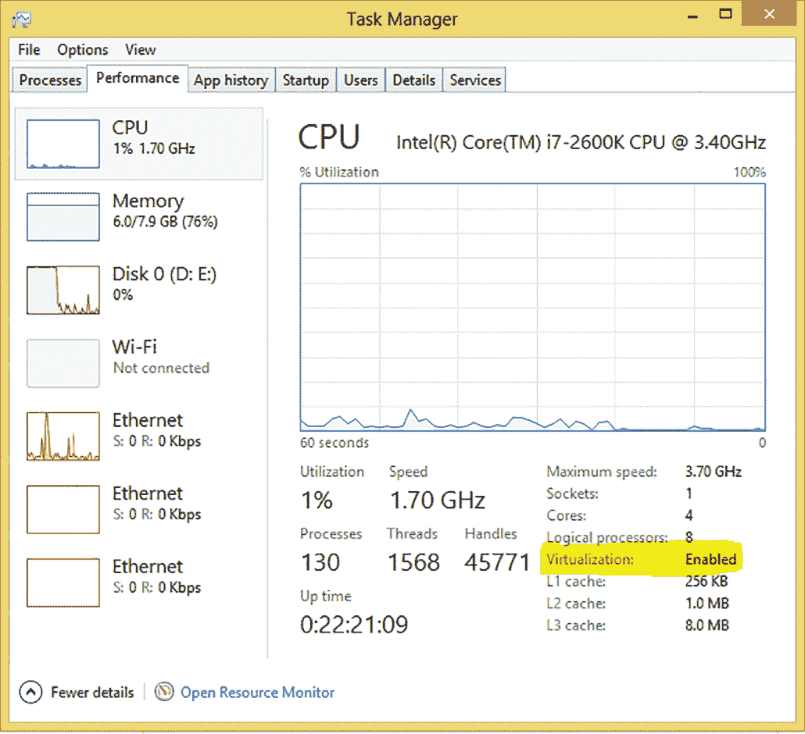

# 附录 安装说明

注意：除非另有说明，否则本书假定您将使用 Python 3，例如在第七章中，相关的依赖项 BregmanToolkit 需要 Python 2.7。同样，在第十九章中，VGG16.py 库需要 Python 2.7。Python 3 的代码列表遵循 TensorFlow v1.15，第七章和第十九章的示例使用 TensorFlow 1.14.0，因为它与 Python 2.7 兼容。GitHub 上的配套源代码将始终与最新版本保持一致（[`mng.bz/GdKO`](http://mng.bz/GdKO)）。此外，**目前正在进行将本书中的示例迁移到 TensorFlow 2.x 的重大努力，这项工作在 GitHub 仓库的 tensorflow2 分支中可见**。您可以在那里找到更新的列表，请经常查看。

您可以通过几种方式安装 TensorFlow。本附录介绍了一种适用于所有平台（包括 Windows）的安装方法。如果您熟悉基于 UNIX 的系统（如 Linux 和 macOS），请随意使用官方文档中提供的安装方法之一，网址为[`mng.bz/zrAQ`](http://mng.bz/zrAQ)，或者如果您正在尝试 TensorFlow2 代码分支，请访问[`www.tensorflow.org/install`](https://www.tensorflow.org/install)。正如本书前言中 Google 应用 AI 和 TensorFlow 负责人 Scott Penberthy 所说，AI 和 ML 领域发展如此迅速，以至于在撰写本书的这一版时，TensorFlow 已经发布了几个版本，包括 2.x 系列的一些版本和 1.x 系列的一些版本。所有章节中模型构建的技术将独立于 TensorFlow API 的任何变化或任何单个模型的改进而持续存在。

我还在本附录中记录了所需的数据库集，以及运行本书中代码示例所需的库。我已经为您收集了数据库集，请注意放置输入数据的位置，代码示例将处理其余部分。

最后，为了让您了解 TensorFlow 2 和 TensorFlow 1 之间的一些细微差异，我将向您介绍一些更改，以便使用 TensorFlow 2 使客户呼叫中心预测示例正常工作。

不再拖延，让我们通过使用 Docker 容器来安装 TensorFlow。

## A.1 使用 Docker 安装本书的代码

*Docker*是一种打包软件依赖项的系统，以确保每个人的安装环境相同。这种标准化有助于限制计算机之间的不一致性。

提示：您可以使用除了使用 Docker 容器之外的其他多种方式安装 TensorFlow。访问官方文档以获取有关安装 TensorFlow 的更多详细信息：[`www.tensorflow.org/install`](https://www.tensorflow.org/install)。同时，查看本书的官方 Dockerfile，它描述了您需要运行本书所需的软件、库和数据（[`mng.bz/0ZA6`](http://mng.bz/0ZA6)）。

### A.1.1 在 Windows 中安装 Docker

Docker 只能在启用虚拟化的 64 位 Windows（7 或更高版本）上运行。幸运的是，大多数消费级笔记本电脑和台式机都满足这一要求。要检查你的电脑是否支持 Docker，请打开控制面板，点击“系统和安全”，然后点击“系统”。你将看到有关你的 Windows 机器的详细信息，包括处理器和系统类型。如果系统是 64 位，你几乎就可以开始了。

下一步是检查你的处理器是否支持虚拟化。在 Windows 8 或更高版本中，打开任务管理器（按 Ctrl-Shift-Esc），然后点击性能选项卡。如果虚拟化显示为启用（图 A.1），则一切准备就绪。对于 Windows 7，你应该使用 Microsoft 硬件辅助虚拟化检测工具([`mng.bz/cBlu`](http://mng.bz/cBlu))。

### A.1.2 在 Linux 中安装 Docker

现在你已经知道你的电脑是否支持 Docker，请安装 Docker Toolbox，位于[`mng.bz/K580`](https://shortener.manning.com/K580)。运行下载的安装可执行文件，并在对话框中点击“下一步”以接受所有默认设置。当工具箱安装完成后，运行 Docker Quickstart Terminal。

### A.1.3 在 macOS 中安装 Docker

Docker 在 macOS 10.8 Mountain Lion 或更高版本上运行。从[`mng.bz/K580`](http://mng.bz/K580)安装 Docker Toolbox。安装后，从应用程序文件夹或启动盘打开 Docker Quickstart Terminal。

### A.1.4 使用 Docker

我创建了一个 Dockerfile，它构建了一个包含 Python 3.7 和 2.7 的镜像，使用 Python 的`pip`安装程序安装 Jupyter 和所需的库，然后创建必要的依赖库和文件夹结构以运行书中的代码示例。如果你想从头开始构建，可以使用`build_environment.sh`和`run_environment.sh`脚本分别构建和运行 Docker 镜像。Docker 构建还包括运行笔记本和训练模型所需的所有必要第三方库和输入数据。



图 A.1 确保你的 64 位电脑已启用虚拟化。

警告：请注意——当构建时，容器大约有 40 GB，因为机器学习是数据密集型和计算密集型的。请准备好你的笔记本电脑和/或构建 Docker 容器所需的时间。

或者，你可以运行以下命令来执行我为你创建并推送到 DockerHub 的镜像：

```
docker pull chrismattmann/mltf2
./run_environment.sh
```

将 DockerHub 想象成一个预构建环境镜像的家园。你可以在[`hub.docker.com`](https://hub.docker.com/)上探索社区发布的各种容器。该环境包含一个 Jupyter Notebooks 中心，你可以在浏览器中输入**http://127.0.0.1:8888**来访问。请记住，根据特定章节的示例，选择正确的内核（Python3 或 Python2）。

## A.2 获取数据和存储模型

在运行笔记本时，你会生成大量数据，尤其是在涉及构建模型的机器学习过程步骤中。但为了训练和构建这些模型，你也需要数据。我已经创建了一个 Dropbox 文件夹，你可以从中下载用于训练模型的数据。通过[`mng.bz/9A41`](http://mng.bz/9A41)访问该文件夹。

以下指针告诉你在哪些章节需要哪些数据以及放置的位置。除非另有说明，否则数据应放置在 data/文件夹中。请注意，当你运行笔记本时，笔记本将生成 TensorFlow 模型，并将它们和检查点文件写入 models/文件夹。GitHub 仓库提供了一个`download-data.sh`脚本，用于自动下载每章的数据并将数据放置在笔记本期望的文件夹中。此外，如果你使用 Docker 构建，容器将自动运行脚本并为你下载数据。

+   第四章

+   +   data/311.csv

+   第六章

+   +   data/word2vec-nlp-tutorial/labeledTrainData.tsv

    +   data/word2vec-nlp-tutorial/testData.tsv

    +   data/aclImdb/test/neg

    +   data/aclImdb/test/pos

+   第七章

+   +   data/audio_dataset

    +   data/TalkingMachinesPodcast.wav

+   第八章

+   +   data/User Identification From Walking Activity

+   第十章

+   +   data/mobypos.txt

+   第十二章

+   +   data/cifar-10-batches-py

    +   data/MNIST_data（如果你尝试 MNIST 附加示例）

+   第十四章

+   +   data/cifar-10-batches-py

+   第十五章

+   +   data/cifar-10-batches-py

    +   data/vgg_face_dataset—VGG -Face 的元数据，包括名人姓名

    +   data/vgg-face—实际的 VGG -Face 数据

    +   data/vgg_face_full_urls.csv—VGG -Face URL 的元数据信息

    +   data/vgg_face_full.csv—所有 VGG -Face 数据的元数据信息

    +   data/vgg-models/checkpoints-1e3x4-2e4-09202019—运行 VGG -Face 估算器附加示例

+   第十六章

+   +   data/international-airline-passengers.csv

+   第十七章

+   +   data/LibriSpeech

    +   libs/basic_units

    +   libs/RNN-Tutorial

+   第十八章

+   +   data/seq2seq

+   第十九章

+   +   libs/vgg16/laska.png

    +   data/cloth_folding_rgb_vids

## A.3 必要的库

尽管这本书的名字中有 TensorFlow，但这本书同样涉及广义机器学习和其理论，以及处理机器学习时非常有用的框架套件。运行笔记本的要求在以下列表中概述；它们也可以通过手动安装或通过 Docker 中的 requirements.txt 和 requirements-py2.txt 文件自动安装。此外，GitHub 仓库中有一个`download-libs.sh`脚本，你可以手动运行或让 Docker 为你运行。此脚本抓取笔记本所需的专用库，这些库不能通过`pip`安装。你应该使用你喜欢的 Python 版本安装其余的库。本书中的示例已在 Python 2.7 和 Python 3.7 中验证过。我没有时间测试所有这些，但我很高兴收到我遗漏的 pull 请求和代码贡献。

+   TensorFlow（本书适用于 1.13.1、1.14.0、1.15.0，并在书的存储库的 tensorflow2 分支上进行 2.2 及以后的版本的开发）

+   Jupyter

+   Pandas（用于数据框和易于表格数据处理）

+   NumPy 和 SciPy

+   Matplotlib

+   NLTK（用于任何文本或自然语言处理，如第六章中的情感分析）

+   TQDM（用于进度条）

+   SK-learn（用于各种辅助函数）

+   BregmanToolkit（用于第七章中的音频示例）

+   Tika

+   Ystockquote

+   Requests

+   OpenCV

+   Horovod（使用 0.18.2 或 0.18.1 与 Maverick2 VGG -Face 模型）

+   VGG16：vgg16.py、vgg16_weights.npz、imagenet_classes.py 和 laska.png（仅与 Python 2.7 兼容；将软件放在 libs/vgg16 中）

+   PyDub（在第十七章与 LSTMs 一起使用）

+   基本单位（第十七章；放置在 libs/basic_units/文件夹中）

+   RNN-Tutorial（在第十七章中使用，以帮助实现和训练深度语音模型）

## A.4 将呼叫中心示例转换为 TensorFlow2

TensorFlow v2（TFv2）引入了许多破坏性变更。其中一些变更影响了工作流程；其他则需要采用新的范式。例如，急切执行需要从声明式编程转换为命令式编程。您不再使用 TensorFlow 的`Placeholder`；相反，您依赖于不同的库来完成在 v2 中已弃用的任务。文本和 GitHub 存储库页面上的示例、练习和列表正在积极地从 TensorFlow 转换为 TensorFlow2，在书的存储库的`tensorflow2`分支中（[`mng.bz/Qmq1`](http://mng.bz/Qmq1)）。我正在使用以下方法：

+   我尽可能使用官方的 TFv1 到 TFv2 迁移指南。

+   当迁移指南不足以解决问题时，我会尝试复制文本和存储库主分支中获得的成果。

如果您对如何将更复杂的项目从 v1 迁移到 v2 感兴趣，我鼓励您查看链接在[`www.tensorflow.org/guide/migrate`](https://www.tensorflow.org/guide/migrate)的迁移指南。您还可以查看官方升级脚本是否适用于您的情况。升级脚本位于[`www .tensorflow.org/guide/upgrade`](https://www.tensorflow.org/guide/upgrade)。请注意，我在这存储库中不尝试使用自动升级脚本，原因如下：

+   转换脚本尽可能地自动化，但某些语法和风格上的更改无法由脚本执行。

+   完全检查从 TF v1 到 TF v2 的变化是有价值的。经历这个过程本身就是一种学习经历，即使是我也（有很多）东西要学习！

最后，有一行代码允许在使用新的 TensorFlow v2 库的同时，与 TensorFlow 1 完全向后兼容。您将此行代码放置在代码顶部，以便它表现得像 TFv1。根据 TensorFlow v1 到 v2 迁移指南，在书中的列表开头插入以下内容，以便在 TFv2 中运行未经修改的 TFv1 代码：

```
import tensorflow.compat.v1 as tf
tf.disable_v2_behavior()
```

就这些！简单，对吧？你也会移除列表中现有的`import tensorflow`声明，并用前面提到的声明替换它，当然。在 A.4.1 节中，我快速回顾了第四章中的呼叫中心预测示例，以向你展示从 TFv1 到 TFv2 转换的核心。

### A.4.1 使用 TF2 的呼叫中心示例

第四章通过使用纽约市 311 服务提供的真实呼叫中心数据，应用机器学习的回归概念，创建一个 TensorFlow 图来学习第 1-52 周的电话量值，并尝试准确预测它们。因为数据是连续的而不是离散的，在机器学习中，这个问题被称为回归而不是分类。图 A.2 显示了 311 呼叫中心数据。


图 A.2 y 轴上电话频率计数与 x 轴上的一年中的周数（0-51）的对比图。活动在 2014 年 5 月时间段内增加，并在 2014 年 8 月底减少。

在原始 TFv1 代码部分，我在本章中讨论了如何读取纽约市 311 的 CSV 数据并将其解析为 Python 字典。然后我向你展示了如何将这个字典转换为代表输入周和电话量数据的`X_train`和`Y_train`变量。数据通过 52 周内的最高电话量进行归一化，以实现`Y_train`的`0`到`1`的 y 轴刻度。为了构建 TensorFlow 模型图，我使用非线性高斯模型（钟形曲线形状）来表示量。你构建了一个训练 1,000 个 epoch 的 TensorFlow 图来学习输入高斯模型中的变量 mu 和 sigma。在模型学习参数后，我向你展示了如何将它们输入到 NumPy 版本的模型中，打印学习到的曲线，并可视化和绘制误差和准确度。原始列表显示在列表 A.1 中供你参考。

列表 A.1 设置和训练 TensorFlow 模型以拟合高斯曲线

```
learning_rate = 1.5                                                        ❶
training_epochs = 5000                                                     ❷

X = tf.placeholder(tf.float32)                                             ❸
Y = tf.placeholder(tf.float32)                                             ❸

def model(X, mu, sig):
    return tf.exp(tf.div(tf.negative(tf.pow(tf.subtract(X, mu), 2.)), 
    ➥ tf.multiply(2., tf.pow(sig, 2.))))

mu = tf.Variable(1., name="mu")                                            ❹
sig = tf.Variable(1., name="sig")                                          ❹
y_model = model(X, mu, sig)                                                ❺

cost = tf.square(Y-y_model)                                                ❻
train_op = tf.train.GradientDescentOptimizer(learning_rate).minimize(cost) ❻

sess = tf.Session()                                                        ❼
init = tf.global_variables_initializer()                                   ❼
sess.run(init)                                                             ❼

for epoch in range(training_epochs):
    for(x, y) in zip(X_train, nY_train):
        sess.run(train_op, feed_dict={X:x, Y:y})                           ❽

mu_val = sess.run(mu)
sig_val = sess.run(sig)
print(mu_val)                                                              ❾
print(sig_val)                                                             ❾
sess.close()                                                               ❿
```

❶ 设置每个 epoch 的学习率

❷ 训练 5,000 个 epoch

❸ 设置输入（X）和预测的值（Y）

❹ 定义模型学习的参数 mu 和 sig

❺ 基于 TensorFlow 图创建模型

❻ 定义成本函数为 L2 范数并设置训练操作

❼ 初始化 TensorFlow 会话

❽ 执行训练并学习 mu 和 sig 的值

❾ 打印 mu 和 sig 的学习值

❿ 关闭会话

如果我告诉你，第四章的 TensorFlow 2 版本重用了所有相同的数据准备、评估和绘图代码，只有对列表 A.1（模型）进行了一点点修改，我希望你会说这是可信的，因为正如我向你展示的那样，机器学习的大部分工作都涉及 TensorFlow 及其辅助库——如 Pandas 或 Tika 这样的数据准备辅助库，或使用 Jupyter 和 Matplotlib 进行数据评估和探索性分析。所有这些代码都保持不变，并且与 TensorFlow 独立。

TensorFlow 代码在整本书中遵循以下模式：

1.  设置模型超参数。有时，我会向你展示如何使用书中使用的数据推导超参数。在其他时候，我会指出其他人已经花费了大量时间和资源来推导它们，所以你应该重用它们。

1.  在你（或其他人）收集并清洗准备好的数据上训练模型。

1.  评估学习模型以及你的表现和它的表现，

第 1 步和第 2 步是对呼叫中心预测模型的轻微修改。首先，TensorFlow2 原生地集成了 Keras 机器学习库。这种集成超出了本书的范围，但一个好处是使用了 Keras 的优化器。你不再使用`tf.train`中的优化器，如`tf.train.GradientDescentOptimizer`，而是使用`tf.keras.optimizers`，例如`tf.keras.optimizers.SGD`。

另一个变化是，在 TFv1 中，不是在每个 epoch 中通过`for`循环运行每个星期，并通过`placeholders`注入该周的个别呼叫量值，在 TFv2 中，我们希望去掉这些，所以你使用声明式编程。换句话说，`train`函数应该逐步或整体地获取数据并在其上训练，而不需要在`feed_dict`参数中进行每步注入。不需要使用数据注入。你可以使用`tf.constant`，用每个 epoch 的 52 周数据初始化常数，并在过程中消除`for`循环。由于 TFv2 鼓励无注入的声明式编程，你可以使用 Python 的 lambda 内联函数来定义你的模型，并使用`cost`和`loss`作为内联函数来声明式地构建模型。

如列表 A.2 所示，这就是所有的变化。

列表 A.2 TensorFlow 2 版本的呼叫中心预测模型

```
learning_rate = 1.5                                                           ❶
training_epochs = 5000                                                        ❶
momentum=0.979                                                                ❷

X = tf.constant(X_train, dtype=tf.float32)                                    ❸
Y = tf.constant(nY_train, dtype=tf.float32)                                   ❸
mu = tf.Variable(1., name="mu")                                               ❹
sig = tf.Variable(1., name="sig")                                             ❹

model = lambda _X, _sig, _mu:                                                 ❺
➥ tf.exp(tf.div(tf.negative(tf.pow(tf.subtract(tf.cast(_X,tf.float32), _mu), ❺
➥ 2.)), tf.multiply(2., tf.pow(_sig, 2.))))                                  ❺
y_model = lambda: model(X, mu, sig)                                           ❺
cost = lambda: tf.square(Y - y_model())                                       ❻

train_op = tf.keras.optimizers.SGD(learning_rate, momentum=momentum)          ❼
for epoch in tqdm(range(training_epochs)):
    train_op.minimize(cost, mu, sig)                                          ❽

mu_val = mu.value()                                                           ❾
sig_val = sig.value()                                                         ❾
                                                                              ❾
print(mu_val.numpy())                                                         ❾
print(sig_val.numpy())                                                        ❾
```

❶ 定义超参数（与 TFv1 列表中的不变）

❷ 为 Keras 优化器定义的新超参数加速了正确方向的梯度。

❸ 占位符已消失，被常数整个布的周/呼叫量数据所取代

❹ 学习到的参数

❺ 使用 lambda 函数定义声明式高斯模型，并使用真实的 X 值而不是占位符

❻ 使用真实的 Y 值定义成本

❼ 使用 Keras 优化器

❽ 以声明式方式训练并移除了列表 A.1 中存在的带有注入的 for 循环

❾ 获取学习到的参数并打印结果

你可以检查 TensorFlow v2 版本的呼叫中心列表[`mng.bz/WqR1`](http://mng.bz/WqR1)。笔记本的其余部分与 TensorFlow v1 版本相同，包括处理数据读取和清洗、准备和探索性分析的步骤。

请回到代码仓库的 tensorflow2 分支，并跟随我以及其他人（可能包括你！）将笔记本转换为 TensorFlow v2。我将使用迁移指南和附录中定义的最佳实践。重要的是要指出，无论这本书的发布还是未来发布的 TensorFlow 的版本，大部分代码和技术都将保持不变。坚持使用我教给你的数据准备、清洗、超参数选择和模型构建技术。无论 TensorFlow 的版本如何，它们都将伴随你一生！
