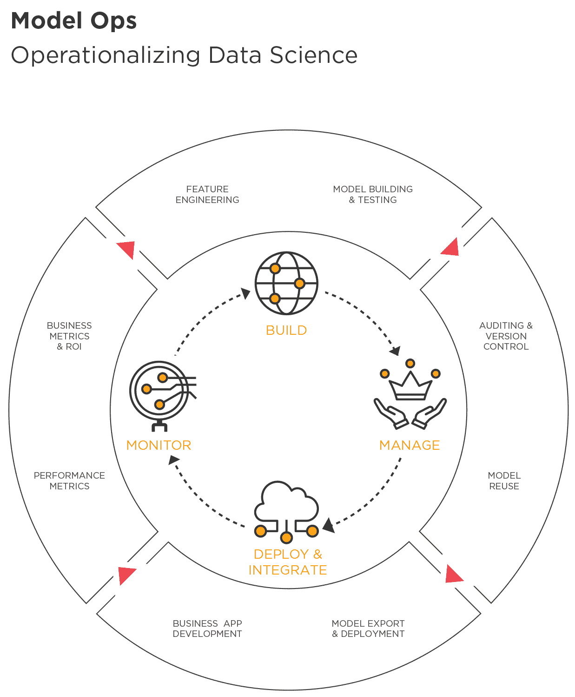
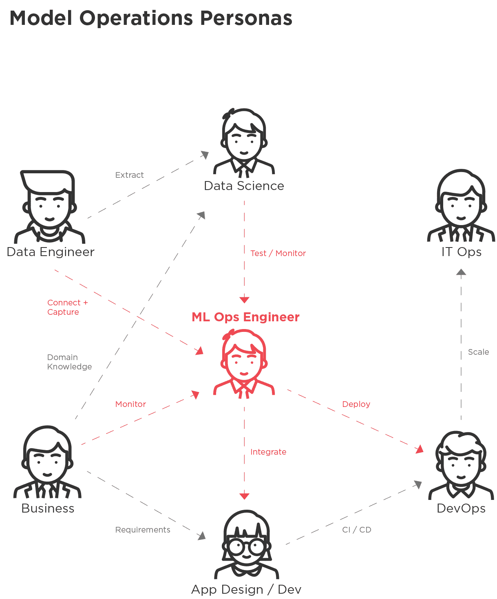
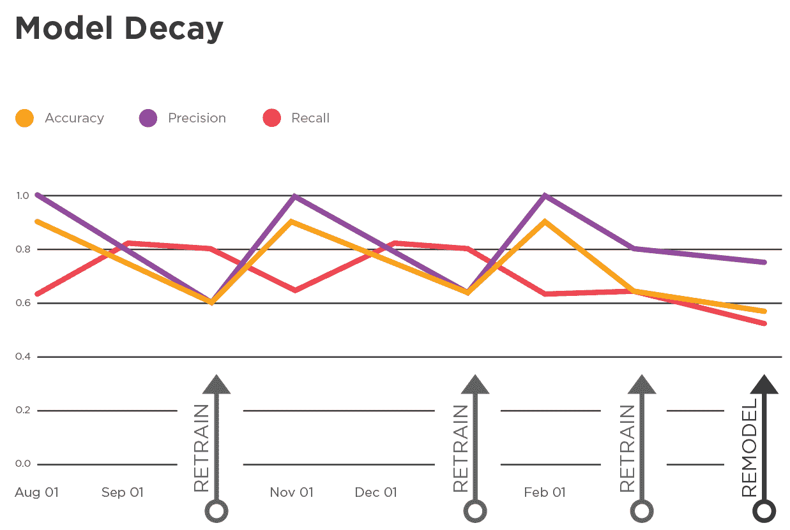

# 第一章：ML Ops：数据科学的运营化

你会花费多年时间和大量资金来训练运动员，然后把他们送去参加奥运会，却只让他们待在酒店不参赛吗？

“当然不会”，你说。“那太荒谬了。没人会这样做。”

你说得对。这太荒谬了。

但是，如果你花费了大量时间和金钱开发和培训你的分析和机器学习（ML）模型，却没有将它们投入生产——无论是因为操作困难还是因为模型与适用法规不一致——难道你不是在犯同样的错误吗？那些仅在幻灯片中提供静态见解的模型并不真正“运营化”，它们不能带来真正的业务变革。

你可能不是故意把你的模型放在架子上。据估计，有超过一半的模型之所以未能投入生产，有很多原因。但如果它们没有投入生产，它们就无法完成你训练它们要做的事情。

ML 运营，或者 ML Ops，是通过将 ML 模型投入生产来实现数据科学运营的过程——能够监控它们的性能，并确保它们在适用法规下是公平和合规的。该过程的四个主要步骤（构建、管理、部署和集成、监控）形成了处理模型作为可重复使用软件构件的循环。ML Ops 确保模型继续为组织提供价值，同时为管理基于模型决策的潜在风险提供关键见解，即使基础业务和技术条件发生变化。

在你的组织中，要实现组成数据科学计划的 ML 模型运营化，需要什么？你可能拥有数据科学和 ML，但你有 ML 运营吗？你是否创建了从最初开发模型的数据科学家到使高级分析可用于业务的应用程序的流程？你的模型公平吗？你了解特定预测为何做出吗？你能有效地管理正在开发的新（“挑战者”）模型以及当前（“冠军”）生产模型吗？你是否实施了支持 ML 运营的版本控制和批准流程？在你公司的 ML Ops 生命周期中，还有谁——业务线（LOB）经理、应用程序开发人员、数据工程师、DevOps、IT——参与其中？你是否将其视为一个生命周期？所有这些都是 ML Ops。

基于全球众多项目的经验，本报告介绍了通过创建 ML 注入应用程序实现操作化数据科学和机器学习价值的概念。它提出了一个实用的四步方法（构建、管理、部署与集成、监控），以便您最终可以使用 AI 和 ML 技术在您的组织内创建业务应用程序。该报告旨在概述操作化数据科学和机器学习管道所需的能力，以便您最终可以使用 AI 和 ML 技术创建业务应用程序。读者将从实际案例研究和数据科学家对如何最佳操作化数据科学的观点中受益。

分析领导者、应用程序开发人员、数据工程师、业务线（LOB）高管、IT 经理和业务分析师经常在 AI 应用程序开发和数据科学管道操作化的各个环节接触到模型。以下是读者从本报告中学到的最重要的事情：

+   在其生命周期中，ML 模型在涉及组织各方利益相关者的分析管道或工作流程中进行开发和改进。实现数据科学和机器学习的价值是通过减少这些管道和工作流程中的摩擦来实现的。

+   ML 模型需要不断完善。它们包括数据转换，并体现与不断变化的数据关系，这些因素影响其预测的准确性。因此，操作化 ML 管道具有与传统软件应用工程不同的管理影响。特别是，长期的准确性取决于定期的调整、重新训练甚至完全重建。

+   面向公众的 ML 模型必须是无偏见、公平和可解释的；这是公众的要求，也是监管机构和机构日益需要的。因此，针对这类应用程序，ML Ops 生命周期必须设计为能够实现透明度和可解释性。

+   模型的运营化意味着不仅要减少其在管道部署中的摩擦，还要将其嵌入业务系统中。模型开发的环境往往与最终部署的环境大不相同。将预测模型集成到外部系统是一个复杂且比 ML 生命周期的其他方面标准化程度低的领域。

+   当前，聪明的组织正考虑并构建他们的数据科学和机器学习管道，分为四个步骤：构建、管理、部署与集成以及监控。

# 介绍 ML Ops 和操作化数据科学模型

ML Ops 是现有充分记录的数据科学和机器学习过程的延伸，例如[CRISP-DM](https://oreil.ly/XhEPd)——它将高级分析与业务需求对齐。然而，这些已建立的过程主要涵盖模型开发过程，并未解决在业务系统内操作这些模型的需求。

## 什么是 ML Ops？

ML Ops 是一个跨职能、协作、持续的过程，专注于通过可重复的部署流程管理统计学、数据科学和机器学习模型作为可重用、高度可用的软件工件来实现数据科学的操作化。它涵盖了跨模型推理、可伸缩性、维护、审计和治理的独特管理方面，以及对生产中模型的持续监控，以确保它们在基础条件变化时仍能为业务创造正面价值。

组织需要考虑整体实现数据科学和机器学习模型的价值，而不仅仅是开发模型的过程。如图 Figure 1 所示，ML Ops 涉及四个概念简单的步骤，但复杂性显然在于细节。

在实践中，许多组织的业务利益相关者和数据科学家有时将大部分注意力和资源集中在建立模型上，而忽视——或者说是以牺牲——操作化整个数据科学过程的所有关键步骤。

###### 图 1. 数据科学操作化过程中的步骤

## ML Ops 的痛点：部署时间

ML 模型需要嵌入并在业务系统中运行，以便它们的预测对业务产生影响。但任何类型的模型——无论是减少客户流失、优化实时定价、创建定向营销活动还是识别欺诈——都受到操作化障碍的影响。

一个常见障碍是启动数据科学项目和部署模型之间的长时间延迟，以至于最终部署的模型可能不再符合现实世界数据的情况，如下例所示。

几年前，作者们曾致力于为一家美国主要移动电话公司开发客户流失（“流失”）模型。最初的模型是使用传统分析软件和来自 MPP 数据库的数据开发的。数据量相当大，需要抽样、提取、转换和加载（ETL）到建模服务器中，这需要与数据库管理员协调。然后，在一段时间的开发和培训之后，模型最终被转换为 SQL，以便对原始数据进行评分。整个过程——从提取到准备、建模、评估到部署——大约需要四个月的时间。这意味着模型预测的变量不是“这个客户会流失吗？”，而是“如果我们在四个月前评估她（通过预测分数），那么这个客户会流失吗？”数据已经过时，模型对业务环境的快速变化不敏感。

那么究竟是什么拖慢了进度？开发模型并不需要花费太多时间。但上下游活动却要耗费大量时间。显然，急需像开发模型本身一样大量投入精力和复杂性来简化 ML Ops 流程。我们能够统计证明，更快地使这些模型运营化将显著提升与当前客户模型准确性，并识别更多潜在风险客户。

这种延迟导致了一种类型的痛点。更广泛地考虑，组织内的痛点听起来像这样：

“我们运行一个依赖于预测模型生成决策点的软件应用程序。我们如何*构建*这样的应用程序和模型来处理所有输入有用预测所需的数据和变量？我们如何应用标准和批准来*管理*各种性能、准确性和安全性水平的多个模型版本？我们如何将个别开发人员用 Python 编写的模型*部署*为可*集成*到各种应用环境中的可执行形式？我们如何*监控*模型，以确保公平，并持续跟上不断变化的市场条件，为我们的应用程序提供准确的预测？最后，我们如何完成所有这些工作，并确保我们投入到数据科学和机器学习模型中的所有工作都有所回报？”

## 究竟什么是模型？

部署模型很少只涉及纯粹的预测模型部署。更常见的是，模型还包括一些转换和业务规则，这些可能妨碍 ML 的运营化。

再次考虑一个模型的例子，该模型旨在预测手机用户的流失情况。数据科学家包括这些核心变量：

+   账户余额

+   最近的手机使用情况

+   如果是家庭账户，其他订户的数量

+   居住地

+   年龄

这些变量已经存在于原始数据中，无需额外计算或轻微清理。它们可能与客户流失的可能性相关（账户余额为负可能是风险因素），但单独来看它们可能不是理想的预测因子。更有用于突显流失倾向的变量可能是过去七天内的电话使用情况，与账户寿命的整体每周平均值相比较。但像这样的数据点可能不会直接从数据库中获得。需要从原始数据开始，然后组合和转换输入，以得到更有用的变量。

或者考虑一个预测模型，用于设定在线市场书籍的价格。其他所有条件相等时，需求与书籍价格成正比。但并非所有其他条件总是相等，这就是为什么将价格翻倍并不总是会减半销量的原因。必须引入转换来解释价格与销量之间的非线性关系，这需要一个必须与定价模型相伴的转换。

因此，模型是它自身加上所有转换的总和。整体必须作为管道中的一个工件进行管理，并在模型的整个生命周期内进行管理。

# 引入四步 ML Ops 方法

企业决心成功将其 ML 模型运作化，将 ML Ops 分为四个主要步骤：

构建

数据科学家使用像 Python 和 R 这样的语言，以及商业应用程序，来创建分析管道。他们使用标准的机器学习算法，构建预测模型，并进行特征工程，以创建最有可能提升 ML 模型预测能力的转换。

管理

模型有一个生命周期，最好从一个中央库管理，其中可以跟踪其来源、版本管理、与监管规则和政策的一致性、生产批准、测试、部署以及最终替换。除了与模型工件相关的元数据外，管理平台和库还应跟踪准确性指标以及模型与数据集之间的链接。

部署和集成

在此步骤中，数据科学管道从原始开发环境中取出，并以可以独立执行并集成到业务应用中的形式表达。例如，一个在 Python Notebook 中开发的模型可能需要转换为 SQL 代码，以便在 Teradata 数据库中执行。在 TIBCO，我们创建了将可视化数据科学工作流程导出为 Java 代码（例如）的机制，然后可以嵌入到应用程序代码中。此外，模型工件可以通过 REST 框架和 API 访问。现代 ML Ops 架构还可能支持将模型工件容器化部署到公共或私有云环境，实现更快的生产时间以及在支持高度可变评分需求方面的灵活扩展性和弹性。最终，你需要能够将管道以适合目标运行时环境的格式/语言部署，符合你的业务要求。

监控

模型部署后，将监测其预测准确性、模型公平性和其他重要业务标准，以提供对一般业务影响的全面可见性。这种监测可以通过连接到预测和模型输入的 BI 工具完成，或者以定期报告所有关键业务绩效指标（KPI）形式存在。准确性和其他 KPI 可以通过人工定期迭代获得人类专家的输入，或者通过持续的再训练和人类批准的冠军-挑战者循环自动提高。

以下部分通过大多数组织会问自己的问题，探讨了管道的每个步骤。

# 构建

在构建步骤中，数据科学家检查数据环境，确保模型在训练时使用的数据与实际部署后使用的数据之间的紧密匹配。他们使用各种开发平台（如 Python、R、商业 IDE，带有拖放工作流程的 IDE 等）创建机器学习和数据管道。通过特征工程，他们分析变量的变换，以使机器学习模型更加强大。然后，他们测试并训练生成的模型，直到准确度达到超出继续调整或添加数据、特征或算法后仍有益的水平。

## 数据考虑：结构和访问

*我们的训练数据与模型在现实生活中将看到的数据有多接近？我们如何确保模型在两个地方都能访问到相似的数据结构？*

模型通常需要在从实时系统中提取并离线存储的数据上进行训练。但是在训练之后，部署到应用程序中的模型可能会在线对抗实时流数据。如果数据结构甚至编程语言在训练和操作模式之间发生变化，这种差异会使得 ML Ops 过程变得复杂，并且可能影响模型的实用性。

当然，模型的实用性在很大程度上取决于其训练所依赖的数据。因此，如果模型旨在在 JavaScript 的网站上通过流数据运行，则在 PySpark 的离线集群中进行训练可能提供对丰富的历史点击流数据的访问，但这将使得部署过程变得更加复杂。开发和生产环境之间的这些基本差异不仅普遍存在，而且通常是不可避免的。在创建业务应用程序时，数据科学家、数据工程师、模型运维工程师和应用程序开发人员需要密切合作，以了解在生产环境中哪些元素将可用。

在现实世界中，访问数据——无论是在设计时还是运行时——都非常重要。例如，财务模型可能会对最近的分析师报告进行文本分析，以预测某只股票的价格是上涨还是下跌。通过精心处理这些文档中的语言得出的度量指标，很可能会使得在“实验室”中测试时结果更加准确。但是对于高频交易模型来说，从最新的新闻源快速分析文本是不可能的，因此数据科学家需要考虑模型是否可以访问最近文本度量的缓存，或者是否合理地包括这些变量。

## 特征工程

*我们如何创建新的变量以获得更准确的模型？这些变量是否可以在操作环境中复制？*

在特征工程中，数据科学家分析数据中的变量，确定可以应用到这些变量的转换，以及可以创建哪些新变量，以增强机器学习模型的预测能力。从部署的角度来看，重要特征经过这种方式进行工程化处理后，能够在操作系统中进行复现，这一点至关重要。

例如，考虑一个用于生成保险单保费报价的广义线性模型（GLM）。模型从用户输入的数据开始，通过转换计算客户的市场细分的保费优惠，并向用户返回报价。输入的原始数据必须转换为模型输入格式。例如，用户年龄的数字输入被划分为年龄段，并且其他输入被转换为模型所需的特征和单位，然后传递到当前活动的模型。在生产过程中，所有这些转换都必须在从网络门户进入的用户数据事件流上进行。

地理位置和司法管辖权也是特征工程中的因素。考虑到诸如年龄或邮政编码之类的变量，它们可能有助于提高准确性，但当地法律和公平公正的接受标准可能会阻止在营销活动的机器学习模型中使用它们。因此，一些不具普遍性的特征应与地理围栏结合使用—即使用无线电和网络来定义边界—在应用层级上确保它们在禁止的时间和地点不活跃。虽然有各种哲学观点来解决这个问题，但更多时候，组织会对他们所有需求使用最严格的政策。（在 TIBCO，我们相信所有软件工具应当为遵守类似欧洲 GDPR 规定、美国 HIPAA 法律或欧盟关于人工智能道德原则的规定提供最大的灵活性。遵守这些广泛接受的标准似乎是确保与本地规则和文化价值一致的隐私和公平性的最佳和最简单的方式，现在和未来当预测建模技术继续以快速步伐进展时。）

复杂度影响特征工程，因为虽然复杂的特征可能会带来更高的准确性，但通常会伴随一些成本。天气数据可能会改进在农业中使用的模型，但并非所有相关输入在运行环境中都是可访问的。同样，文本分析可以用于训练模型以理解语言，但如果内存需求太大，那么一旦应用实施，它将影响性能。有些模型依赖术语之间的互动，其中变量对组合以表达共同作用的业务驱动因素；然而，所有可能组合的激增可能降低性能（导致“过拟合”）。

最后，复杂性与可解释性相关联，技术专业人员应能够利用模型结构获得业务理解，并向决策者和消费者解释模型的准确性或不准确性。可解释性在帮助 ML 管道中的所有人理解模型如何得出预测方面起到了作用。与 ML Ops 相关的可解释性示例包括解释为何模型拒绝给定申请人信用的原因代码。ML Ops 中的可解释性很重要，因为随着进入模型的特征变得更加复杂，解释模型的预测变得更加困难。

## 模型测试

*我们如何测试我们的模型以反映生产环境？*

像在软件应用程序开发环境中的调试一样，模型测试包括在代表性数据上执行模型，并检查其性能和准确性。在测试模型时，数据科学家可以在部署模型之前尝试简单的修复措施，以解决意外后果。目标是在可以安全执行模型的环境中向模型提供生产数据。类似地，真实的生产数据也应该出现在测试流中。实际上，通常存在许多开发、测试和其他预生产环境；例如，为了上线评分软件的新版本，调试预测或评估多个（“挑战者”）模型并行评分数据，以便评估改进模型的价值。现代基于云的技术通常可以在不增加太多成本和工作量的情况下提供这种灵活性。

# 管理

随着模型在组织中开始大量出现，一个新角色——ML Ops 工程师——应运而生。必须有人来管理模型的生命周期，包括来源、版本控制、批准、测试、部署和替换。显然，需要将模型管理在一个中央库中，以便进行批准、电子签名、版本控制、跟踪和重复使用。

## ML Ops 工程师

*我们是否需要一个专门的工程师来更好地实现我们的模型操作化？我们是否已经有人是我们的 ML Ops 工程师，甚至自己都不知道？*

需要组织涉及 ML Ops 的人员和任务。即使在小公司中，也很快形成了划分劳动力的情况，一部分人负责创建模型，另一部分人负责实现操作化。技能集过于分散，很难长时间由一个人或一个团队负责。因此，ML Ops 工程师需要足够了解机器学习模型，以理解如何部署它们，并具有足够了解操作系统的知识，以理解如何集成、扩展和监视模型。

图 2 描述了沿着 ML 管道的人员和功能。

###### 图 2. ML Ops 工程师贯穿整个管道的角色

*数据工程师*负责数据库工作，确保所有数据源都可用，并向其余分析团队提供筛选后的数据集。*数据科学家*探索数据，训练和构建预测模型。然后他们与*ML Ops 工程师*合作，在开发或“沙盒”环境中测试训练好的模型，并将模型部署到生产环境（例如，首先是预生产，然后是最终生产）。数据科学家和 ML Ops 工程师都会考虑*业务用户*（通常还包括风险管理人员）的需求和变更，以理解模型的预测目标及适用的监管约束条件。这些用户提供关于模型应该预测什么、模型如何使用、数据科学家的特征是否合理及是否允许等方面的指导，并提出哪些额外的特征可以添加到模型中。*应用设计师*与数据科学家合作决定使用或构建哪些模型，以及如何最好地将模型集成到对业务用户有用的应用程序中，而*应用程序开发人员*则编写代码将模型嵌入应用程序中。*DevOps 团队*负责从开发到*IT 运营*的顺畅过渡，维护基础架构，确保应用程序及其模型的运行、性能和优化扩展。

*ML Ops 工程师*既涉足数据科学，又涉足 DevOps，在管道中扮演着最新的角色，并且是成功实现机器学习模型运营的重要角色之一。该角色桥接了数据科学家和负责部署、维护和监控使用预测模型的应用程序的人员之间的分工。与数据科学家一起，ML Ops 工程师测试和部署模型，有时还实施监控。这个角色涉及理解 ML 模型和数据转换的结合，以及工程（通常在脚本编写的层面上）。

在机器学习运营的早期阶段，很常见有人在事实上成为了 ML Ops 工程师，即使他们自己都没有意识到。如果没有 ML Ops 工程师，那么应用工程师必须与数据科学家合作。如果应用工程师不理解底层概念，这将使得整个过程变得更加耗时。或者你可能会有一位具备一定计算机科学技能的数据科学家介入处理，但这会带来相反的问题——数据科学家编写生产应用程序代码。一旦问题开始扩展，你确实需要一个 ML Ops 角色的人员。如果没有适当的团队，企业将无法有效地应对不断变化的情况。当然，专门的 ML Ops 软件解决方案使得角色之间的协作以及模型部署生命周期过程变得越来越高效和简单。

## 提前应对模型扩散

*所有这些模型都是从哪里来的?*

就像虚拟机、文档文件和源代码的版本不断增加一样，ML 模型和流水线往往迅速积累，并变得难以跟踪。曾经有几十个模型，很快可能就会有数百个，甚至数千个。此外，模型之间通常存在依赖关系，例如，在多个预测模型中使用的客户细分共用模型。

这种增加的一个因素是沿 ML 流水线增加的人数。更多的人创建和测试更多的模型，然后在某处存储它们，即使这些模型不在生产中。随着时间的推移，事实证明，这些模型中越来越多的百分比解决了相同的问题，但孤立工作的人不知道彼此的努力。自动化技术（例如 Auto ML）使生成新模型和现有模型的变体变得容易。

结果是组织内对模型进行跟踪、治理和管理的需求增加。

## 审计、批准和版本控制

*为什么我们需要跟踪模型?*

ML 运营由于缺乏有关模型版本差异、每个模型的来源和历史、模型与数据之间的关系、它们如何随时间变化以及它们如何从开发转移到生产的清晰度而变得复杂。

因此，有必要使用某种形式的模型管理系统，以结构化方式记录模型元数据，以便更轻松地监控和报告从一个版本到下一个版本的变化，并自动化处理（例如审批、电子签名、重新训练）与元数据相关的流程。

就像多年的归档数据一样，如果管理良好，大量模型可以在治理和报告方面带来优势。考虑一个金融科技公司，该公司使用模型评估和评分信贷申请。即使其模型随时间变化，公司始终负责其批准流程，并必须能够报告为何批准或拒绝某个特定信贷申请。在审计时，公司需要展示如何得出评分以及为何评分低于可接受阈值。

大量模型的优势与变更管理相关，通过该管理，ML 流水线上的任何人都可以准确确定是谁在什么时间做了哪些更改以及出于何种原因。变更管理不仅有助于遵守外部法规（如前述的批准流程），还有助于高效的合作、内部治理以及证明对模型的变更的正当性。

模型版本控制的目的是跟踪用于构建每个版本的数据和参数，以及模型输出（例如系数、准确性）。这样，当审查模型的演变时，就有清晰的来源和追踪模型生成方式的方法。

## 从中央管理的存储库中重用和再利用模型

*我们如何管理来自如此多来源的如此多模型？*

在需要许多业务线或个人用户使用高级分析的组织中，集中化是非常有用的。

集中化的最佳方式是重用和重新配置来自集中管理的存储库的模型，该存储库允许多人为多个应用程序使用单个已批准的模型。该存储库跟踪谁在构建哪个模型，并明确现有版本的数量。它揭示了数据科学团队的进展及其构建模型的数量。它跟踪数据与模型及项目之间的连接，并且是可搜索的——随着不同业务线要求关于场景 A 和 B 的高级分析，存储库使得更容易看到 A 和 B 是同一个问题的两个方面。存储库中已经存在适当的测试模型，因此重用和重新配置可以减少重复努力，并减少 ML 管道的拥堵。

仍在尝试 ML 技术的公司可能能够通过简单的电子邮件消息处理模型管理。但一旦他们退出实验阶段，他们手头的模型数量往往会急剧增加，控制和重复利用就成了问题。

# 部署和集成

在部署和集成步骤中，模型停止查看历史数据的后视镜，转而查看实时的现场数据。但要做到这一点，模型必须与以下之一集成：

+   某个执行端点，如数据库，用于对客户数据进行评分，以帮助推动市场营销活动

+   一个网站，用于改善与用户的互动

+   边缘网络设备，用于对机器状态进行*原地*预测。

+   内联操作系统，要求无停机时间，并且单个模型版本用于多个评分实例，或者 AI/ML 融入的 BI 仪表板、应用程序或报告，允许利益相关者将模型洞察和预测转化为决策；以改善、优化或影响现实世界的运作

*为什么不能单独部署，或者单独集成？*

部署和集成密切相关：“部署”是将模型从其开发环境中提取并转换为可执行形式（例如，代码片段或 API）的过程，可以在应用程序或其他外部系统中使用。而“集成”是将已部署的模型嵌入到这些外部系统中的过程。部署选项取决于集成端点（目标），而这些端点通常又取决于部署方法。

因此，最好的部署方法是将模型集成的功能作为其部署的一部分。而最好的集成方法是将其视为部署的延伸。

考虑一个信用卡申请流程。银行希望使用某种预测分析来评分申请是否为良好或不良的信用风险。银行可能会使用信用机构，其数据科学家在支持导出到预测模型标记语言（PMML）的工具中构建预测模型。信用机构将他们的分析结果导出到 PMML 或代码中，然后通过集成将模型作为信用服务的 REST API 提供给银行。再次强调，现代基于云的 ML Ops 工具和解决方案将使模型的部署和集成到 REST API 变得越来越简单和高效，几乎不需要实际编码。

对于申请者来说，集成是透明的。当然，他们去银行或贷款人那里——也许是自动服务台或网站——输入他们的信息，并申请贷款或信用额度。无论集成端点如何，都通过同样的 API 应用相同的模型进行评估信用价值，始终保持一致的效果和信心。

## 部署与集成的交集

*哪种部署方法和集成端点最匹配？哪些组合不值得尝试？*

每种模型部署和集成方法都有其特殊考虑事项：

代码生成（例如，Java，C++，Python，存储过程）

在这里，执行环境必须支持生成的语言，性能要求至关重要，并且可能需要重新编译模型的更新。

无服务器（例如，作为服务的函数）

FaaS 中的语言支持必须与模型评分所需的代码匹配。此外，由于启动无服务器函数通常需要每次调用的处理时间，因此应考虑评分延迟和计算成本的要求。

容器（例如，在 Docker 容器中进行模型推理）

在这里，容器是用于部署的工件，高度兼容现代 IT 环境中使用的容器编排系统。请注意，“热”重新部署（无需重启更新）模型，以确保在所有容器中保持一致，可能是一个挑战，可能需要额外的专业知识来实现持续部署/持续交付（CI/CD）。

服务器

使用集中式评分服务器的部署方法通常需要一个或多个（通常是虚拟化的）服务器。灵活的可伸缩性和故障转移的健壮性必须特别设计到基于服务器的系统中。

模型交换标准（例如，模型导出格式，PFA，PMML，ONNX，TensorFlow Saved Model）

执行环境必须支持运行交换工件。通常，这种方法需要单独的步骤来转换和准备数据。代表模型的序列化文件对支持无停机“热”重新部署和确保跨多个评分服务器或容器的模型一致更新非常方便。

对于集成端点，通常有以下选项：

批处理

通常在计划中批量对多行数据进行评分，通常在数据库中进行。

交互应用

通过 API 执行模型，通常驱动最终用户应用程序的行为。

实时流

对一连串数据流中的一行进行评分，通常用于高频率预测。

边缘

执行模型以驱动连接设备的行为。

表 1 总结了作者对最常见集成端点和部署方法的考虑建议。

表 1\. 最常见执行端点和部署方法的建议和考虑。

| 集成端点 | 部署方法 |
| --- | --- |
| 代码生成 | 无服务器 | 容器 | 服务器 | 模型互操作标准 |
| --- | --- | --- | --- | --- |
|  |
| 批处理 | 非常高数据量评分作业，通常是每夜或定期作业 | *不适用* | 可利用弹性规模和自动配置，以及高可用性 | 传统的基于服务器的架构，重复评分“作业”的调度 | 当数据库中评分效率不高或不可行时，以及应用程序/服务器可用的交换格式评分时，非常方便。 |
| 交互应用 | 具有适度高性能要求的交易系统和最终用户应用程序 | 可能偶尔使用的少量轻量级模型 | 多种格式的许多模型作为托管/云可扩展服务。 | 多个模型作为企业可扩展服务。 | 期望本地执行评分，但不维护生成的源代码。 |
| 实时流 | 非常高的吞吐处理要求；可以确保模型无停机更新 | *由于初始启动和延迟问题，不常见* | 适用于中低延迟用例，例如最佳下一步行动和电子商务 | *如果响应延迟足够，可以支持模型无停机更新* | 适合“热”无停机重新部署 |
| 边缘 | 可能需要离线运行的轻量级模型 | 多设备调用少量模型 | 多种格式的多个模型和多个设备 | 内部网络设备 | 如果设备操作系统支持交换格式，则可能是最佳选择。 |

在某些情况下，除了部署机器学习模型外，还需要将模型集成和嵌入到多个业务应用程序中。

## 业务应用开发

*我们如何结合 ML Ops 和应用开发人员的努力？*

部署和集成的目标是预测模型对业务进行某种影响。最有效的方法是将其直接嵌入到业务应用程序中。例如，将产品推荐嵌入到电子商务网站或移动应用程序中，建议 CRM 系统中的解决方案，以及在 ERP 系统中智能路由分配。

应用工程师需要考虑如何将 ML Ops 融入软件开发生命周期。这不仅仅是设计、开发和测试过程中需要考虑的另一个特性。它可能会从根本上改变部署的性质。

企业应用开发的理想方法是通过提供服务的方式完全将机器学习模型与应用程序解耦，即一组开发人员可以发现、测试和整合到其代码中的 API。然后，数据科学家必须提供全面的文档：如何使用模型、所需的输入和预期的输出、模型的限制或适用领域、准确度和信心水平以及数据依赖关系。他们还应提供明确定义的机制来记录模型随时间的表现。

即使模型被称为服务，数据科学家也不能简单地“把模型扔过墙”，然后走开。在模型开发和精炼迭代过程中，应用工程师和数据科学家需要密切合作。业务应用开发中的每个参与者将向另一个提供反馈，理想情况下通过共享协作平台。例如，应用工程师可能无法获得与数据相同的访问级别，需要调整模型的需求。随着应用程序处理更多负载，性能考虑可能会发生变化。工程师甚至可能对要包含在模型中的新功能提出建议。

正如前面提到的，模型的结构和数据要求可能需要在短时间内进行变更。随着市场条件的变化，模型可能会变得极不准确甚至过时。因此，开发人员需要建立防护措施，使模型可以在不需要新版本应用的情况下进行更换或禁用。这意味着他们需要随时间监控模型，正如我们在下一节讨论的那样。

# 监控

一旦模型部署完成，监控步骤就开始了。它涵盖了三种类型的指标：统计、性能和业务/ROI。此外，因为模型需要更新以保持新鲜和有用，监控步骤还包括自动重新训练和重建的任务。

## 统计指标

*模型在运行实际数据时的准确度如何？我们如何设置阈值并配置在模型变得不准确时触发警报？我们如何精确地测量新或实时数据的准确度？*

数据科学和机器学习的运作包括持续监控。这延伸到持续审查模型，必要时重新训练模型，并将新的“挑战者”模型与已部署的模型进行比较。统计指标比较了现在的准确度与模型首次部署或最近更新时的准确度。术语“模型漂移”指的是随时间变化的准确度变化（稍后讨论）。

统计指标有三个部分：

*准确性跟踪*涵盖了诸如错误分类率、置信率或数据科学家认为最重要的错误率等指标。当准确性低于给定的阈值时，是时候重新训练模型或完全重建模型了。

*冠军挑战者*是不断寻找比当前生产中的模型（冠军）更好的模型（挑战者）的做法。它包括定期运行当前模型的更新版本或完全不同的模型，然后比较两者的结果，并部署更准确的那个。

*人口稳定性*通过持续检查数据集随时间分布的合理一致性来确保当前模型仍然相关。考虑一个家庭抵押贷款申请模型。即使在 2008 年春季部署的最准确的模型，在后来的事件和现实市场条件中也会被超越。随着人口变化如此之大，使用年底数据运行模型将产生与训练模型时显著不同的结果。

## 绩效指标

*我们的基础设施是否足以支持我们的模型？*

模型只有在资源允许的情况下才能运行良好。性能指标包括输入/输出、执行时间和每秒评分记录数，以及它们依赖的因素，如内存和 CPU 使用率。这些指标在许多专门的 ML Ops 解决方案中日益可用。

## 业务指标和投资回报率

*如果仪表板显示模型的错误率很低，那么为什么我们没有看到我们希望看到的利润增长？*

业务指标确定模型对业务的期望影响，并作为对统计指标的重要检查。当部署新模型时，这些业务指标通常是最重要的监控指标。这些指标如何定义和监测？它们如何与模型准确性的基本衡量标准互动？

考虑一个预测购买特定产品的最有可能的人群的模型。即使最有可能购买的人没有购买，考虑到输入的变量，可以想象该模型可能是正确的。例如，数字媒体和社交网络公司关注点击率和参与度等因素。

当统计和业务指标确实对齐时，这表明在运营化 ML 模型的投资回报率指标。以一个公司为例，其统计指标显示其先进分析模型为销售线索转化率贡献了*x*百分比。通过冠军挑战者，它部署了一个更准确的模型，导致销售线索转化率提高了*2x*百分比。公司可以指出这一改进是其先进分析工作的稳固投资回报率。

随着模型的使用，每次销售提议都会获取接受和拒绝数据，并将其与提议详细信息一起存储在关系数据库中。随着时间的推移，这使得模型可以自动重新训练并提升到生产环境，并获得相应的内部批准。该过程可以按用户定义的间隔（每日、每周等）进行调度。它可以由事件触发，例如转化率下降或日志损失率低于给定阈值，或通过提议数据的累积来激活。

## 模型漂移时

*为什么预测不再准确？模型在漂移吗？*

在传统软件系统中，IT 部门部署组件，然后偶尔检查 API 是否正常工作或系统是否完全运行。而模型则是动态的。它们需要不断监控和更新，以抵消模型漂移，这种现象在部署后会出现，模型的预测变得越来越不准确。漂移是由于模型中的实际变量随时间变化而产生的——它们在分布上发生变化，它们在彼此之间的关系发生变化，或者是因为原始模型中不存在或不显著的新变量而发生变化。

例如，在预测某款软饮的销售模型中，夏季温度可能异常偏低，因此超出了模型中有效的范围；经济衰退期间，顾客可能变得更加价格敏感，而这种情况并不符合模型训练所使用的历史条件；或者可能推出了新的广告活动。如果模型的预测曾经是 80%的准确率，而现在是 75%并且持续下降，那么可能是模型漂移在起作用。

错误率开始逐渐上升，因此数据科学家们会检查基础数据分布，以了解发生了什么变化。当一个模型由于不准确而导致企业损失时，这种活动和模型的原始开发同样重要。

## 重新训练和重新建模

*业务部门抱怨预测不合理。我们如何让模型恢复正轨？*

大多数时候，应对模型漂移的解决方案是根据最新数据重新训练（或“重新校准”）模型。偶尔，需要彻底重新建模。如图 3 所示（参见 Figure 3），模型在 10 月和 1 月重新训练后，准确性和精度显著提高。但在 3 月重新训练后，准确性和精度下降，表明是时候重新建模了。

###### 图 3. 模型漂移

重新训练使用的是模型首次开发时应用的相同变量和模型结构，但使用了更新的数据。例如，模型可能预测销售量是价格的某个倍数，加上温度的某个倍数，再加上上周销售量的某个倍数。这些倍数可能随时间变化，因此通过对当前数据运行模型进行重新训练将产生新的倍数。变量本身不会改变。

重建涉及添加、更改或删除变量，通常比重新训练更加复杂。在前面的例子中，假设业务意识到忽略了竞争对手的定价因素，并且竞争对手快速占据市场份额。为抵消这种影响，数据科学家将通过重建来添加竞争对手的定价作为变量，然后针对当前数据进行测试。

当模型重新训练并投入生产时，会经历几个步骤：

模型准确度评估

此步骤基于一组基尼系数（常见的模型准确度指标）。如果超出允许的限制，模型将使用遗传算法自动重新评估参数空间。候选模型使用弹性网进行正则化以减少方差（但引入一些偏差）。

模型更新和可解释性

这包括评估业务目标、变量重要性、过度拟合、偏差或异常值，以及监管角度。在冠军-挑战者设置中评估总结差异模型属性（当前与之前模型）。评估对客户影响的问题。

模型诊断

根据预测空间中的本地预测能力和准确性进行考虑。可以根据最近的趋势评估预测空间的特定区域，并确定关注的领域。评估统计假设检验结果，以及模型诊断指标，如赤池信息准则（AIC）、贝叶斯信息准则（BIC）、ROC 曲线下面积（AUROC）和可视化（ROC 曲线、提升图）。

模型版本管理、批准和审计

在大多数情况下，模型需要根据市场条件的变化重新训练，因此需要保存并管理多个模型版本（根据监管要求）。这些模型也应可用于审计和合规评估。

团队需要决定何时进行重新训练或重建，并确定触发条件。

## 监控与自动化相结合

*为什么我们需要手动进行此操作？难道重新训练不能自动进行吗？*

尽管最终是人类在监控步骤结束时批准再部署，但自动化模型重新训练是有意义的，而不是等待人类检查仪表板、检测模型漂移并手动启动重新训练。

适当先进的工具应进行频繁的冠军挑战循环，使用最新数据和可能不同的特征进行重新训练。自动化将比较每个重新训练模型与当前部署模型的准确性。一旦找到更好的模型，自动化将触发警报给数据科学家。此外，正如在“特征工程”中早先描述的那样，在事件流更新和历史累积之间迭代可以得到更合适的特征集和模型。

# 案例研究：在制造业中实现数据科学——数字孪生模型

高科技制造业的领导者越来越多地转向数字孪生。这些物理系统的虚拟表征帮助制造商更好地管理资产，以提高性能、效率和运营质量。但只有将数字孪生模型与模型运营（也称为 ML Ops）结合到业务运营中，这些改进才能得以实现。

在半导体制造业中，用于生产集成电路（芯片）的过程变得越来越复杂。在制造过程中可能涉及数千个加工步骤，数千台设备，数百种设备类型，并且可能会进行数百万次测量。

为了管理这种复杂性，数字孪生模型正成为高效运营和高产品产量的关键。开发和操作化这些模型可以帮助现代制造商不仅克服复杂的制造挑战，还可以解决复杂的材料调度和运输问题。

一家半导体制造商正是这样做的，转向数据科学和模型运营来开发和训练数字孪生模型，以处理其制造过程中每天传感器生成的数据量级。该公司的业务需求不再满足传统的、知识驱动的分析，这导致了机会的损失、产品产量的次优和收入的降低。为了保持竞争力，这家制造商需要将数字孪生模型操作化，帮助他们理解、控制和优化所有过程（以及由此产生的质量、效率和产量）。

在以前，公司的工程师不得不逐片比较缺陷和电子图案。采用数字孪生模型后，他们发现可以完全自动化地对具有相似缺陷的晶圆进行聚类，并通过电气测试识别它们之间的关系。利用视觉分析和数据科学的组合，检测和理解缺陷所需的时间从每天 12 小时减少到不到一分钟。数据驱动的洞察力现在也能够快速解决上游过程中检测到的问题，以避免这些问题导致昂贵的质量或产量问题。

现在，每次运行分析和建模的时间不到五分钟。凭借几乎实时的结果，制造商现在能够识别工厂中经过的批次中微妙的设备变化、工具的工艺转变或漂移，并解决批次中的不合格产量问题。没有模型操作的支持，数字孪生模型进入生产并实施真正的业务变革是不可能的。

# 案例研究：在保险业中实施数据科学——动态定价模型

在今天的数字经济中，仍然使用传统动态定价软件的公司正在苦苦挣扎。这些黑箱式的点解决方案几乎没有空间来应对市场趋势和法规的变化，甚至无法跟上日益增长的数据量和复杂性。特别是保险业已开始摒弃这些过时的解决方案。

在保险业中，目标是获取和保留具有最高潜在终身价值的客户，同时覆盖核保成本，处理保障需求，并应对自然灾害等意外外部因素。动态定价策略使企业能够根据市场需求和其他因素为服务设定价格，帮助保险公司根据潜在风险、客户付款意愿、竞争对手定价和其他变量调整价格。通过模型操作投入生产的人工智能驱动的动态定价模型，可以确保保险公司能够快速应对市场变化，保持竞争力。

TIBCO 使用模型操作为一家大型客户的汽车保险部门开发并部署了动态定价系统。该定价模型解决方案包括价格优化和客户获取与保留的配置。它还展示了价格弹性数据以及作为价格函数的接受建模。

在公司实施数据科学之前，多年来一直使用同一市场主导的分析软件。新的数据科学家在学会使用该软件并开始重新训练现有模型并生成新模型之前需要一年左右的时间。

自实施新的模型操作动态定价系统以来，公司可以雇佣没有编程或数学背景的数据科学家，他们在三个月内就能发布模型并因此生成收入。他们拥有计算能力来运行用于欺诈识别和嵌入式客户价值的模型。

现在，公司内部用户能够跨部门联通和赋能。例如，如果销售量突然上升或下降，业务用户通常会向 IT 部门寻求帮助，不知道获取有用答案需要多长时间。现在，这些用户可以简单地点击相关指标并运行模型，阐明销售量变化的原因。如果业务用户想深入数据或进行预测分析，他们都有这个机会。

公司可以在实时环境中更新其动态定价模型，从而实现实时预测和知情决策。数据进入模型后几乎立即可用。公司不再仅生成简单的预测，而是能够回答类似于“如果我们增加或减少折扣，对销量和利润率的影响是什么？”等问题。更重要的是，公司可以询问如何做出不同的决策、如何调整定价以及在组织中哪里进行变更。这只是通过模型运营将数据科学和机器学习模型操作化，为组织带来实际价值的一个示例。

# 结论

通过“构建、管理、部署和集成”以及监控的顺序，引入结构化和逻辑流程围绕分析管道，并使组织通过 ML Ops 实现数据科学的价值。这确保最佳模型被嵌入到业务系统中，部署的模型符合业务需求以及公司政策或监管监督所施加的限制，并且保持模型的当前性。

那些将这种系统化思维融入到他们的数据科学中的公司，比那些一直未能将模型操作化并将行动优先于简单洞察的公司具有更大的竞争优势。这些组织能够超越孤立建模，为所有适用的业务关键流程实现数据科学的操作化，且具备信心和对相关风险、成本和效益的清晰可见性。

# 作者简介

**David Sweenor**，TIBCO 全球分析营销领导者，负责先进分析产品组合的市场推广战略。他拥有超过 20 年的实际业务分析经验，涵盖产品营销、业务战略、产品开发、物联网、先进分析、数据仓库和制造业。在加入 TIBCO 之前，David 曾在多个公司担任解决方案顾问，包括 SAS、IBM、Quest 和 Dell。David 拥有美国伦斯勒理工学院的应用物理学学士学位和佛蒙特大学的工商管理硕士学位。关注 David 的 Twitter 账号 @DavidSweenor 和 [LinkedIn](https://www.linkedin.com/in/davidsweenor)。

**Steven Hillion**，TIBCO 的高级数据科学总监，领导大型工程和分析项目已有 20 年。他创办了 Alpine Data，该公司被 TIBCO 收购，致力于建立一个数据科学的协作平台。他领导了 Pivotal 的全球数据科学团队，并开发了一套开源和企业软件的机器学习工具。在此之前，他曾在一系列初创公司领导工程工作。他在加州大学伯克利分校获得数学博士学位，并在此之前在牛津大学学习数学。在[LinkedIn](https://www.linkedin.com/in/shillion)上找到 Steven。

**Dan Rope**是 TIBCO 的高级数据科学总监。在开发和推出第一个语法图形软件实现两十年后，Dan 成为了各种前瞻性数据科学和可视化产品的实施者、架构师和技术领导者。Dan 是 IBM 最早商业化的自动化机器学习产品的首席架构师和 IBM 语言不可知可视化平台的共同创造者。在 TIBCO，Dan 继续推动关键产品创新，包括面向商业智能的 AI、边缘设备的机器学习、以及 TIBCO 大数据平台的 Auto ML 和 ML Ops。Dan 是多项专利的共同发明人和开源贡献者，曾担任美国统计协会统计图形部门的主席和程序主席。在[LinkedIn](https://www.linkedin.com/in/dan-rope-4951517)上找到 Dan。

**Dev Kannabiran**是 TIBCO 的数据科学家。他拥有俄克拉荷马州立大学管理信息系统硕士学位，并在预测建模和模型运行方面积累了丰富经验。Dev 参与了多个跨行业的数据科学部署项目，包括保险、制造和金融服务领域。他撰写了技术博客，并举办了多场关于人工智能、机器学习和文本分析的网络研讨会。在[LinkedIn](https://www.linkedin.com/in/dev-kannabiran-5613503)上找到 Dev。

**Thomas Hill**是 TIBCO 数据科学产品的高级总监和产品经理。他是 StatSoft Inc.的联合创始人，在该公司被 TIBCO 收购前负责将 Statistica 软件打造成领先的分析平台。Hill 博士广泛发表了关于预测分析创新应用的文章，并共同撰写了许多与人类学习与认知、机器学习、统计学和分析相关的论文、书籍和专利。在 Twitter 上@DrTomHill 和[LinkedIn](https://www.linkedin.com/in/DrThomasHill)上找到 Tom。

**迈克尔·奥康奈尔** 是 TIBCO 的首席分析官，负责在金融服务、能源、生命科学、消费品和零售业、电信、媒体和网络等多个行业开发分析解决方案。他在统计软件应用领域有超过 20 年的工作经验，发表了 50 多篇论文，并开发了多个统计方法软件包。迈克尔在北卡罗来纳州立大学获得统计学博士学位，并担任该校的兼职教授。在 Twitter 上关注迈克尔的账号是@MichOConnell，在[LinkedIn](https://www.linkedin.com/in/michaelo15)上可以找到他。

1.  ML Ops：数据科学的运营化

    1.  ML Ops 和数据科学模型运营化简介

        1.  ML Ops 是什么？

        1.  ML Ops 的痛点：部署时间

        1.  什么才是真正的模型？

    1.  介绍四步骤的 ML Ops 方法

    1.  构建

        1.  数据考虑：结构和访问

        1.  特征工程

        1.  模型测试

    1.  管理

        1.  ML Ops 工程师

        1.  应对模型扩展的挑战

        1.  审核、批准和版本控制

        1.  从集中管理的存储库重用和重新利用模型

    1.  部署与集成

        1.  部署与集成的交汇点

        1.  业务应用开发

    1.  监控

        1.  统计指标

        1.  性能指标

        1.  业务指标和投资回报率

        1.  当模型漂移时

        1.  重新训练和重建

        1.  监控与自动化的结合

    1.  案例研究：在制造业中实现数据科学的运营—数字孪生模型

    1.  案例研究：在保险业中实现数据科学的运营—动态定价模型

    1.  结论
