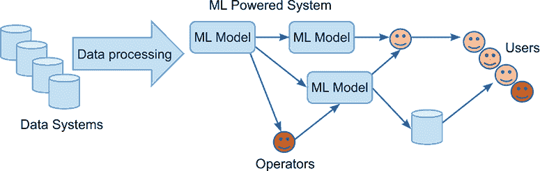
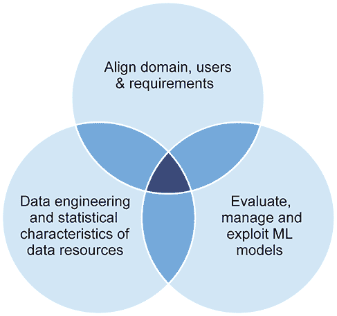
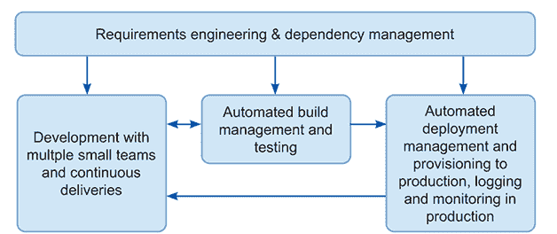
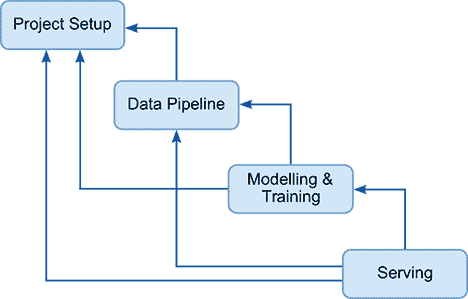
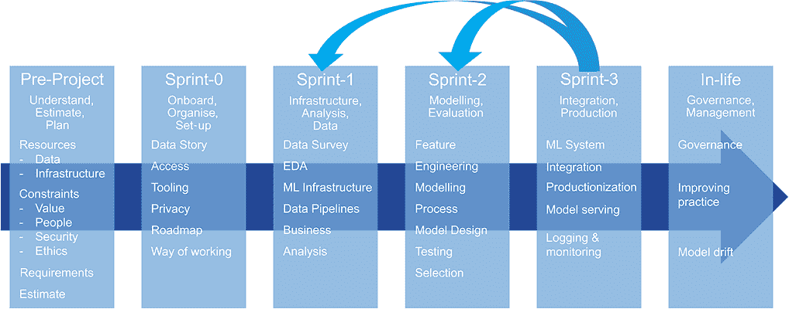

# 1 引言：交付机器学习项目是困难的；让我们做得更好

本章涵盖：

+   描述本书的结构和目标

+   定义什么是机器学习

+   解释为什么机器学习很重要

+   探讨为什么机器学习项目与众不同

+   列出其他机器学习开发方法

本书描述了一个端到端的过程，用于交付一个机器学习（ML）项目来解决一个足够大且足够困难的业务问题，以至于需要团队。随着 ML 兴趣的迅速增长以及 LeCun 等人[1]和其他高级方法（如 Carpenter 等人[2]讨论的 MCMC 算法）的发展，ML 项目的新机会层出不穷。因此，很多人将管理这些项目，这是一本为他们准备的指南。

为什么需要专门为机器学习项目编写指南？据 Gartner 称，85%的机器学习项目失败[3]，尽管追踪这一说法的确切起源和证据比作者愿意投入的工作要多！即便如此，从学术研究中可以看出，在机器学习开发工作流程的这些步骤中存在“挑战”，并且在开发过程的每个阶段，实践者都会面临问题。例如，参见 Paleyes 及其合作者的工作[4]。随着开发和部署 ML 系统困难性的日益明显，越来越多的人担心 ML 正在被不道德和有害地应用[5]。从根本上讲，ML 项目与普通软件项目相比，具有不同的开发过程（从数据构建模型），在组织和基础设施方面有不同的需求，并且提供的结果（ML 模型）需要以与普通程序不同的方式处理。

本书背后的一个主要思想是，进行 ML 项目有点像乘坐过山车。明亮的过山车是每个人关注的焦点，但乘坐它只需要三分钟。要乘坐它，你必须让所有人上车，开车一个小时，停车，走到售票处，购票，然后排队等候。重点是，为了好玩，你必须做好准备。过山车之后呢？好吧，然后你到达过山车的真正目的。你可以和你的孩子坐在一起吃冰淇淋，谈论它有多好，你接下来要做什么，以及为什么。如果这个过程的前后部分不好，那么有趣的部分（ML 项目中的 ML）就不会发生。

这本书主要关注使用机器学习（ML）所需的准备，使用结果所需的工作，以及防止 ML 误入歧途的安全措施。毕竟，如果你从过山车上掉下来，那么那天早上留在床上可能更好。

本书主要面向非技术读者；旨在帮助人们了解需要做什么以及存在的问题，但并不提供太多关于交付的细节。在本书的一些部分，会有技术示例和解释。这些内容是为了在无法避免变得稍微技术性的情况下提供指导。然而，非技术读者可以安全地跳过这些示例，而不会错过文本中的主要主题和概念。

了解 SQL 以及一些基本的数学技能会有所帮助，但即使你不知道或不关心这些事情，本书也应该对你大部分内容都是可访问的。另一方面，预计大多数读者将拥有深厚的机器学习和数据科学知识，他们阅读这本书是因为他们对软技能和项目实践感兴趣，这些技能和实践可以帮助他们应用他们的 AI 魔法。

在下一节中，我们将描述机器学习的基本概念以及它们如何应用于为新进入该领域的人设定场景。对于已经熟悉机器学习概念和技术的人来说，可以自由地跳到 1.4 节，在那里介绍本书的其余部分，或者更远的地方开始阅读本书的核心内容。对于其他读者，1.2 节介绍了一些基本术语，然后在那之后，在 1.3 节中描述了机器学习的重要性以及推动对机器学习项目采取特殊方法的问题和挑战。在 1.4 节中，我们将概述为开发软件和机器学习系统所尝试的其他方法。最后，本书的路线图以及说明如何使用所倡导的工具和方法的案例研究也将被展示。

因此，让我们继续学习机器学习以及针对机器学习项目需要采取的特殊方法，或者直接跳到第二章，开始项目！

## 1.1 什么是机器学习？

机器学习（ML）是一组算法，我们可以使用这些算法从数据中创建（学习）模型。模型可以用多种方式表达，例如，一组 if/then/else 语句、决策树或神经网络的一组参数或权重。机器学习算法从输入的数据中生成一个模型：

机器学习 + 数据 = 模型

模型是近似值。你可以想象一个将有四条腿和有毛发与狗联系起来的模型。当然，这个描述过于笼统，没有实际用途。要创建一个能够捕捉狗和猫之间的差异或大丹犬和吉娃娃之间的共同点的模型，需要更多的信息。在这种情况下，模型结合了关于实体的部分数据（例如，腿的数量、毛发、大小等）以及关于缺失数据（类型或实体）的推断，这些是机器学习算法可以提取的：

模型 + （部分）数据 = 推断

当人类手动构建模型时，他们会选择关联规则或网络参数，因此他们可以进行的实验数量是有限的。机器学习方法的优点是机器可以检查大量的参数或关联。机器可以快速且便宜地搜索数百万或数十亿种不同的设置和链接。人类的优点（例如，统计学家或流行病学家）是他们知道自己在做什么。通常，这种应用常识和更广泛世界知识的才能意味着人类选择和创建的模型优于机器学习的模型。这也意味着人类可以构建模型而无需访问大量数据。然而，最近，机器学习的重要性日益增加，因为使用现在可用的巨大计算能力来处理大量数据比手动设计模型要便宜得多，也容易得多。

图 1.1 展示了机器学习开发者正在构建的系统示意图。在图象的左侧，数据进入系统，经过处理和转换，然后提供给机器学习算法，这些算法创建模型。这些模型被集成到应用程序和人类驱动的流程中。在图象的右侧，从模型中创建的推理影响人类用户。

在数据被模型消耗之前，它需要被处理。这通常意味着它必须被清理并组装成可以传递给模型的示例。一旦完成，模型就可以消耗它。有时我们可以使用单个模型，但如图 1.1 所示，也常见的是生成一系列模型并将它们串联起来以创建我们所需的推理，这些模型需要由操作员的支持团队进行管理和治理。偶尔，模型的输出会由一个监督人类进行审查，并做出关于它们将如何影响最终消费者的决策。在其他情况下，模型的结果由另一个系统进行调解，然后更直接地被用户消费。

图 1.1 机器学习项目试图交付的系统类型

机器学习算法可以从人类难以处理的数据集中学习模型，并且可以集成到极其有用的系统中（例如，为互联网搜索、数据网络和电影推荐等现代生活的许多方面提供动力的系统）。似乎每个人都同意，机器学习可以是一项重要的技术，能够改变我们的经济和社会。然而，机器学习可能很难应用，并且存在许多可能给机器学习团队带来问题的难题。为了更详细地探讨可能导致机器学习团队遇到问题的具体问题，下一节将更深入地探讨机器学习的承诺和陷阱。

## 1.2 为什么机器学习很重要？

机器学习（ML）有什么令人兴奋和有前景的地方？在过去的几年里，机器学习研发领域取得了变革性的成果，这些成果导致了能够做到以下事情的机器的发展：

+   编写难以或无法与人类努力区分的文字，如大型语言模型 GPT-3 [6]的输出。

+   在推导蛋白质形状方面展现出革命性的性能，就像 Alphafold-2 [7]所做的那样。

+   根据 DeepMind 在 AlphaZero [8]上的工作，在所有棋类游戏中超越所有人类。

此外，机器学习还创建了可以基于文本提示创建新颖且相关图像的模型，就像 DALL-E 模型[9]所展示的那样。许多人将这些进步视为路标，表明机器学习技术的潜力，并且普遍预期更多地震级的创新即将到来。同时，许多评论员指出，机器学习的承诺和炒作与现实模型能够做到的事情之间仍然存在差距，Gary Marcus 是突出的例子[10]。重要的是，模型的工作方式和它们犯的错误可能会产生深刻的伦理问题[11][5]。

值得注意的是，机器学习（ML）不仅仅是硅谷的一些技术大师和世界上的顶尖大学的专属。你可以免费下载现成的模型和库，然后轻松使用它们。这使得程序员（越来越多的是非程序员）能够将机器学习组件集成到他们的项目中。现在有机器学习驱动的工具可以识别工厂中的安全风险，选择适合消费者口味的音乐，或检查电子邮件语法。这些都为许多人的生活和幸福做出了微小但实际且宝贵的贡献。每天，机器学习可能每隔几分钟就会以某种方式改变我们的生活。

技术人员发现这一切都令人惊叹，但不出所料，当这项技术应用于现实世界时，出现了一些问题。模型可能被用于做一些它们并不适合的事情，例如根据人们的外貌判断他们是否可能是罪犯，以及确定罪犯应该在监狱中服刑多久。这种应用如此有问题，以至于有整本书专门用来详细解释其所有方面[11]。可以说，使用算法来决定一个人的生活道路不是一个好主意。

当实际应用尝试时，很容易找到机器学习产生令人失望结果的故事。一个很好的例子是看看机器学习社区为治疗 COVID-19 所投入的巨大努力。一项研究[12]调查了 232 个开发出来的模型，但发现只有两个模型的质量足够高，值得进一步测试。关于旨在解释医学图像或诊断癌症的系统，也有类似的故事。据报道，甚至埃隆·马斯克也说过，制造自动驾驶汽车比他想象的要困难得多[13]。

那么，机器学习项目的复杂性和挑战的驱动因素是什么？对于软件项目来说，机器学习项目必须理解和适应在特定领域工作的挑战，无论是销售自行车的企业、肿瘤学还是流行病学。除了这些问题之外，一个应用领域的机器学习项目之所以复杂，是因为它处理和操作复杂的数据资源、复杂的模型以及编排它们的代码。在复杂性和挑战方面，以下这些观点是值得记住的：

+   机器学习系统依赖于数据，特别是它们用于创建最终系统中使用的模型的那些数据资产的结构和质量。现代数据资产庞大且极其复杂。对于即将交付的团队来说，需要理解和处理复杂、嘈杂、大规模且充满个人和敏感数据的数据资产的做法和流程。数据需要在系统层面和统计或价值层面进行理解和处理。我们需要对其进行工程化并理解其含义。

+   机器学习项目创建和使用模型。创建的模型特性需要被团队测量和理解，这种理解必须指导模型嵌入的系统设计过程。我们需要构建模型，同时，我们还需要评估它们（在技术层面和商业环境中），并且需要管理它们的生命周期。

+   机器学习系统应根据 Wixom 及其合著者[14]的建议与科学、利益相关者和社会要求保持一致。在开发机器学习系统的过程中，必须将商业和广泛的伦理考虑因素融入其中。

图 1.2 展示了如何将这些三个关注点表示为维恩图。这个图很有帮助，因为我们可以用它来规划机器学习项目中的工作和责任。

图 1.2 机器学习项目复杂性的驱动因素：领域、数据和模型

机器学习项目带来的挑战是一回事，但除了解决这些问题之外，还有一些任务需要完成，以确保我们能够及时、高效、高质量地交付成果。在这本书中，确定了四个需求：

+   *尽快识别项目中的风险和机遇。* 在机器学习交付中理解项目风险需要工作和时间。

+   *使团队能够快速反应和适应问题。* 团队需要应对意外问题，并且能够在项目进行中随着用户需求的明确而改变方向。能够转向处理意外的模型性能问题是至关重要的。

+   *将客户纳入流程中。* 建立参与和赞助，以及获取反馈和信息，使项目对任何企业都变得有用和有效。

+   *提供运行和维护系统所需的一切。* 构建机器学习系统的团队认为他们是在交付一个系统，但他们还必须提供理解、使用、运行和维护系统所需的一切。特别是，如果系统将影响人类的生活和幸福，那么适当的文档和记录保存是必需的，当然，当你的团队继续前进时，还需要适当的文档来指导将来的团队运行和维护代码和模型。

总结来说，机器学习项目处理起来很困难，机器学习模型是近似的、难以解释的，并且难以开发。它们大多数时候不能给出正确答案，对于某些应用来说是稳健和合适的，但对于其他应用则不是。机器学习项目中的不确定性和风险比正常软件开发要多。此外，机器学习系统高度依赖于大规模数据资源。数据是由有议程的人收集的，无论他们是否意识到这一点，因此它充满了偏见。人类与机器学习系统互动的方式可能会产生原始设计师感到惊讶的行为循环和螺旋。可靠和高效地处理大量数据资源是有问题的，对于习惯于运行软件项目的团队来说可能具有挑战性。

为了解决这些问题，我们需要一种不同且定制的机器学习方法。未能以正确的方式处理机器学习项目可能会失败，甚至更糟，并造成对他人有害的结果。这不仅是一个专业人士难以陷入的境地，而且对于这样做的人，中国[15]和欧盟（EU）[16]有严厉的新法律和处罚。

跟随本书中描述的过程并不能保证你的项目会成功（它也不会阻止你构建一个有害的系统）。希望书中阐述的步骤将有所帮助，以及对如何将这些步骤与其他步骤串联起来并用于交付最终产品的理解。在接下来的两个部分中，将解释我们如何得出书中概述的工作结构，包括对其他人如何构建类似项目的参考。

## 1.3 其他机器学习方法

人们已经创建了超过 50 年的软件系统，其中很大一部分时间他们也在构建机器学习系统。因此，检查其他人做了什么是有价值的。多年来，软件开发是围绕预测交付项目所需的复杂性和工作量来计划和组织的。我们称这种方法为“瀑布”。本质上，这个想法是收集所需的信息，并将其转化为设计。然后，将设计转化为程序员的作业计划，接下来，程序员编写代码并将其提交给测试。最后，系统被用户接受——这就是瀑布。

随着软件系统变得更加复杂，并且不再受其运行硬件基础（因为硬件变得更快）的限制，瀑布方法的价值逐渐枯竭。瀑布开发系统的最终用户发现，软件与其真实需求无关，因为他们与产生该软件的过程脱节。还存在其他问题，包括项目经理由于与实施活动本身距离太远，无法正确估计复杂性和成本。

遵循结构化瀑布方法规定的显著成本，加上缺乏这些实践带来明确价值的证据，导致了人们对“一开始就提出大量需求”方法的广泛幻灭。反过来，这导致了瀑布方法作为更迭式方法的重估，在每个阶段都有“向上反馈”（Royce 1970），以及新方法的发展和探索：螺旋模型（Boehm 1986），它基于计划-执行-研究-行动周期，旨在支持压力下的决策，以及 V 模型。这些方法中最广泛采用和最受欢迎的是敏捷开发（Beck et al 2001）。

敏捷强调早期交付可工作的软件，与客户合作（“个人和互动”而不是“流程”），以及接受变化。项目中的变化和发现被认为可以通过这种方法更好地管理，因为客户迅速获得有用的东西，而不是一长串无法使用的特性和组件。

敏捷思维的进一步发展是 DevOps（Ebert 2016）的概念，它试图在开发者（dev）和运营软件的支持团队（ops）之间架起一座桥梁。驱动 DevOps 的洞察是，运维团队是一群专家，比组织中的任何其他部分都更了解软件。使用这种软件的主要障碍是开发团队对生产环境理解和现实之间的不匹配成本。这种成本由开发团队（试图实现其交付软件的目标）和运维团队（试图实现其无故障业务连续性的目标）共同承担。

图 1.3 说明了 DevOps 项目中的关键活动，它支持快速和适应性强的软件开发。DevOps 团队围绕开发和交付软件的过程开发自动化。这使得他们能够在项目成熟时专注于开发本身。通过降低在开发周期后期更改软件的成本和风险，促进了项目活动中的信息流。通常，这是在项目后期（用户和利益相关者意识到它实际上将要做什么以及它将如何创造价值）时。在这个阶段具有灵活性对交付软件的质量有不成比例的影响。

图 1.3 一个通用的 DevOps 生产和交付流程（基于 Ebert，2016；由作者重新绘制和修改）

过去曾尝试为机器学习和人工智能系统开发提供具体的指导。例如，KADS（诞生于 1990 年）是 20 世纪 80 年代末和 90 年代初在欧洲开展的一项旨在开发共同工程方法的大规模努力。当时我们使用知识工程来创建基于规则的推理系统，以在复杂领域做出决策。这种系统最终证明不如预期实用，而且由于机器学习系统不同，这使得 KADS 变得或多或少过时。

一个更相关的努力是 CRISP-DM，这是一种从 1997 年到大约 2007 年开发的数据挖掘方法论。数据挖掘使用了早期的机器学习技术，从数据中提取模式以获得关于正在发生的事情的见解。在 2007 年的一项调查中，CRISP-DM 被引用为数据挖掘从业者使用最多的方法论（Piatentsk-Shapiro 2007）。

近年来，许多机器学习社区成员在 MLOps 的旗帜下采用了受敏捷和 DevOps 启发的做法。此外，如*Machine Learning as the High Interest Credit Card of Technical Debt*（Sculley 等人，2014）中描述的工作，阐述了一些机器学习系统开发的问题。机器学习社区通过开发借鉴 DevOps 系统开发风格但专门针对机器学习项目的方法来回应。一个例子在在线手册*Machine Learning System Design*（MLSD）（Huyen 2020）中概述，为希望成为机器学习工程师的人提供信息。MLSD 提供了一个结构和创建生产级机器学习系统所需任务的信息。手册通过对比研究实施的需求，解释了我们在开发生产系统时应应用的不同视角和考虑因素。还包括设计考虑因素（性能要求和计算要求）的概述。手册的主体部分描述了四个阶段（图 1.4）：

+   项目设置是确定手头问题尽可能多的细节的过程。完成这一过程的方法被表述为技术面试中的讨论，信息来源被视为面试官。目标、用户体验、性能约束、评估、个性化以及项目约束（人员、计算能力和基础设施）被确定为需要考虑的重要元素。

+   数据管道元素考虑了隐私和偏差、存储、预处理和可用性。

+   模型化考虑了模型选择、训练、调试、超参数调整和扩展（在覆盖大量训练数据的意义上）。

+   服务被界定为对模型的评估以及在我们将模型应用于实际场景时需要理解的一些假设。

图 1.4 如 Huyen 和 Hopper（2020）所述的机器学习项目流程。图由作者重新绘制和改编。箭头表示依赖关系，而不是工作流程。

在书中，还给出了描述这种方法的另一种尝试，即*机器学习工程*（MLE）(Burkov 2020)，它对机器学习工程的最佳实践和设计模式进行了全面回顾。

MLSD 和 MLE 有显著的共同点，两者都将建模过程描述为迭代的，并需要重新进入开发生命周期的其他部分。这两本书[18, 19]都可以被视为 MLOps；它们是敏捷和适应性强的，强调以管道开发的形式进行自动化。此外，这些方法利用了一系列支持自动化目标的各种工具。版本控制用于代码、模型和特征；自动化的管道用于移动和转换数据以及测试和部署模型。

最近，一些研究工作强调了文档的作用，特别是在数据及其模型的来源方面。一个例子是 Google 和 Hugging Face 发布的一些模型的 Model Cards/Model Reports 的发布。这一过程的演变是 TeleManagement Forum (TM Forum)倡导的开发过程，它提供了维护一个保管链以确保模型被理解和控制[20]。这些实践强调了记录生成的模型的需求，使它们能够在未来被适当且容易地选择和使用。

## 1.4 理解本书

如 1.3 节所述，DevOps（由自动化支持的迭代开发）、强大的文档、以及仔细的伦理评估和流程控制对于机器学习开发来说非常重要，并且被广泛采用。因此，它们在这本书中占据了重要地位。除了展示我们如何使用这些工具创建机器学习模型外，本书还涉及：

+   项目启动和运行，包括估算项目成本和持续时间。

+   与团队协作和组织以交付项目。

+   处理支撑项目的数据资产，构建数据管道，处理为不同目的收集的多样化数据，以及设置和运行探索性数据分析。

+   评估机器学习模型并决定使用哪些模型（如果你在考虑“最好的那些”，那么请做好惊喜的准备）。

+   将机器学习模型从开发和测试转移到生产环境。

+   在应用中使用机器学习模型。

本书使用敏捷开发项目的约定[17]来解释工作的结构。每一块工作（图 1.5）被描述为*sprint*，而每章的任务列表被称为*backlog*。backlog 列表之后是详细说明每个子任务的结构和方法的详细信息，以及帮助工程师进行工作的额外解释。

图 1.5 本书中描述的项目结构；从创建和开发项目到管理生产中的最终模型。

在每个冲刺的结束时，提供一份清单，以便团队一起工作，确保所有任务都已完成。清单标记了特定项目阶段中任务的文档要求，确保汇编了一个不断增长的文档集合，详细记录了团队取得的进展。这些文档是宝贵的资产，提供了一种信息共享和再利用的方式。此外，这些文档还支持生产系统中系统的维护和管理。

在本书中穿插着一个案例研究（自行车店），其叙述旨在说明所描述的技术和任务的过程和应用。有些章节（第二章、第五章和第七章）没有提到案例研究，因为它们是冲刺的开始，相关的叙述将在下一章出现。

大多数项目步骤都是旨在被视为迭代和自适应的，如图 1.5 所示，预期项目中的某些步骤可能会产生需要重新工作的发现。特别是，第 5-8 章中描述的 EDA、建模、评估和集成过程在实践中是迭代的。假设由于发现和适应，可能会出现错误的开始和重复。例如，建模过程可能会导致发现数据特征，这些特征在 EDA 过程中没有被暴露出来。这意味着需要更多或不同的数据。

集成可能会暴露出意外的模型属性，这需要重新启动和重复建模。EDA 阶段以及建模和评估阶段中任务的顺序和细节被设计成最小化这种情况，并尽早暴露问题。它还旨在使项目领导者（你）和你的团队能够向利益相关者传达正在发生的情况，让他们放心，你已经尽最大努力避免意外的死胡同和项目重置。

使用这本书的目标是帮助你确定在重要的机器学习项目每个步骤中需要做什么，并在执行过程中提供一些支持。希望它还能为你提供指导，告诉你需要多少时间，如何向项目赞助商证明活动和费用的合理性，以及如何适应必要的调整和迭代的方法。

## 1.5 案例研究：自行车店

为了使这本书生动起来，我们包括了一些基于现实世界数据和项目经验的讨论。匿名化和重新构想，它将在下面描述。

一家自行车连锁店（The Bike Shop）使用不同的系统来管理其销售和库存数据。销售由一个软件即服务（SaaS）系统管理，而库存则由一个现成的库存系统管理，该系统由 The Bike Shop 的 IT 团队管理的服务器集群运行。通过将这两个系统中的数据迁移到单个云数据库中，The Bike Shop 的管理团队希望产生洞察力，并创建一个业务案例来证明这一点，仅仅基于共同托管数据并提供一个仪表板界面，允许业务用户消费它。然而，他们有一个想法，即应用机器学习（ML）到他们的业务将带来巨大的好处，但他们几乎没有确切知道如何实现这一点。

在每一章的结尾，从你的视角讲述了你作为 The Bike Shop 机器学习项目的项目经理，如何管理机器学习系统。这包括：

+   制定提案并估算成本。

+   构建和组建团队。

+   访问系统和数据以了解数据中有什么。

+   确定机器学习（ML）可以利用数据做什么。

+   理解用户将如何使用结果。

+   选择要使用的模型并设置构建模型。

+   构建模型并将它们集成到生产系统中。

在下一章中，这段旅程开始了。

## 摘要

+   过去 10 年中数据和计算爆炸式增长证明机器学习（ML）已成为一项重要技术。

+   在成功交付机器学习项目以及它们交付时可能产生的负面影响方面都存在问题。

+   机器学习项目与其他项目不同，因为它们依赖于复杂的数据，需要团队产生和管理从数据中创建的模型，并且需要仔细与用户和利益相关者的需求保持一致。

+   一个成功的机器学习项目消除了需求和数据的风险，捕捉了非功能性需求和功能性需求，并开发了处理和评估模型的能力。

+   机器学习项目需要在整个生命周期中与社会和利益相关者的需求保持一致，以避免不理想的结果。

+   我们可以借鉴敏捷软件开发和 DevOps 社区的理念来帮助我们开发项目。
