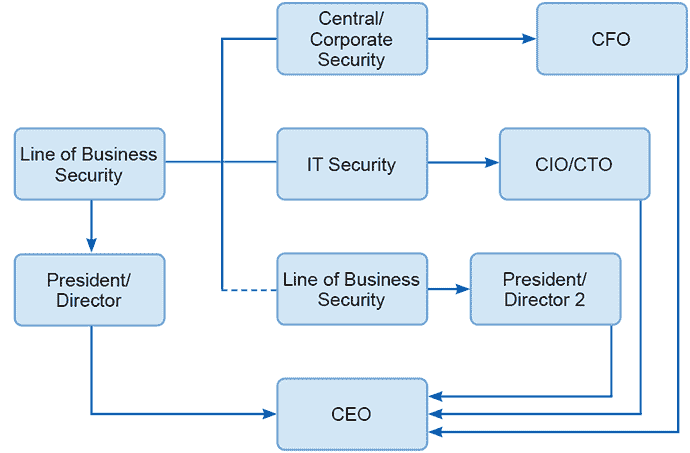
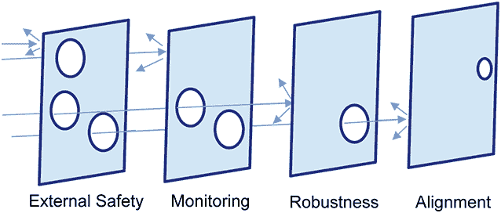
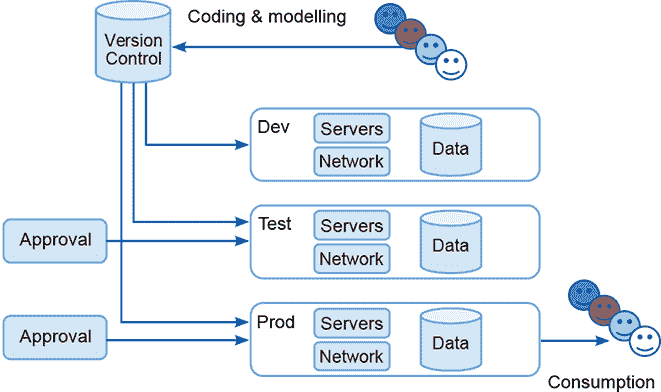

# 2 项目前阶段：从机会到需求

本章涵盖：

+   理解项目类型和利益相关者对规模和结构的期望

+   建立预销售/项目流程

+   理解模型性能需求

+   理解数据资产

+   理解项目的一般需求

+   掌握工具和基础设施以成功交付

项目成功与失败由围绕其的项目前/预销售活动定义。挑战是从知道有一个可以赚取机器学习项目报酬的机会转变为一个可以用来支付按揭的工作。本章的目的是概述需要发生哪些活动和行动，以了解机器学习项目是否可行以及是否有用。然后，我们需要确定完成项目所需的努力以及由谁来完成。

很容易陷入过度精细化的陷阱，因为我们可以在深度细节中完成所有这些活动。不幸的是，我们生活在一个竞争激烈的世界，有时组织在达成一致之前很难在项目上投入时间和金钱。从现实的角度来看，我们需要理解，在合同签署之前，组织对深入分析客户数据或访问高性能服务器的承诺是不存在的。到那时，每个人的职责就是让项目发生。在此之前，一切都只是理论。因此，在资金到位和时间可以分配之前我们所做的工作只是后来发生事情的一小部分。

对此过程给予强烈关注可以降低你和团队承担的风险。未能理解项目的业务需求会使你的团队处于风险之中，误导他们的努力，并且很可能会低估提供交付所需资源的报价。未能理解可用的数据资源意味着无法确定如何使用机器学习来处理项目或判断成功的可能性。此外，未能理解安全、隐私或伦理方面的考虑意味着让你、你的团队和你的组织面临尴尬和责任风险。现在审视项目的所有这些方面，可以让你做出一些及时有效的决策，这可能会使未来的生活变得更好。

在某些方面，这些问题适用于任何项目。然而，机器学习项目的一些特定风险必须得到解决：

+   开发机器学习模型通常很容易，但开发具有解决特定业务问题所需特性的模型则要困难得多。

+   数据质量差或不可访问会引入相当大的摩擦，并且直到获得数据，项目进度通常都会停滞。

+   数据来源和使用限制可能意味着使用项目结果是不道德的或非法的。例如，如果个人数据的来源未知，使用它可能侵犯消费者隐私，数据所有者可能不会同意其使用。

+   在事前预测学习模型中机器学习算法的性能是困难的。尽管团队付出了最大努力，结果可能令人失望。

+   对 IT 架构的误解或未预见，该架构在生产中部署机器学习系统，可能导致项目结果无法使用。

在本章和第三章中描述了缓解这些问题的努力。正如第一章所承诺的，以下项目前期待办事项列表提供了为交付项目前期活动所需的任务清单。之后，我们描述了设置此活动所需的工作，然后讨论理解客户概述的需求所需的内容。随后的章节将处理理解数据资源、安全和隐私、伦理以及 IT 架构。

## 2.1 项目前期待办事项

表 2.1 提供了创建成功项目前期结果所需活动的摘要。我们可以使用此列表作为预销售（PS）待办事项。每个条目都可以是一个系统（如 Jira 或 GitLab）中的票据，这使我们能够跟踪进度，从而防止遗忘任务。使用票据系统跟踪进度很方便，因为它将很容易确定何时应该召开会议，并看到谁负责每个任务以及他们做了什么。

表 2.1 项目前期预销售待办事项

| 票号 | 项目项 |
| --- | --- |
| PS1 | 设置项目待办事项/任务板并使用它。 |
| PS2 | 创建一个文档存储库，并将其提供给项目团队。 |
| PS3 | 建立一个风险登记册，以确定未知勤勉的程度，并估算缓解所需的内容。 |
| PS4 | 创建一个组织模型来支持你对客户及其挑战的了解。通过将项目利益相关者映射到组织结构图，并分析对特定业务单元（如果受影响）和业务优先级（增加收入、降低成本、市场增长等）的影响，进行组织分析。 |
| PS5 | 理解系统架构和非功能性约束。 |
| PS6 | 获取数据样本，并记录关于数据资源的已知信息：统计信息、非功能性（规模、速度、历史等）和系统属性（它在哪，它依赖于什么基础设施，它做什么）。 |
| PS7 | 检查并记录安全和隐私要求，并将其作为项目假设包括在内。 |
| PS8 | 检查并记录企业社会责任和伦理要求，然后挑战、提供反馈，并将其作为项目假设包括在内。创建 PDIA 和 AIA 文档。 |
| PS9 | 制定一个高级交付架构。该架构应涵盖开发、测试和生产组件（有时也包括预生产和预部署），并且能够支持客户的不功能性需求，例如可用性、弹性、安全性和吞吐量。如果可能的话，与适当的利益相关者进行反馈，以对该架构进行资格认证。将其作为项目的假设记录下关键架构方面。 |
| PS10 | 理解业务问题：使用共识来构建项目假设，并由客户和交付团队验证。确保在任何合同协议中明确沟通和记录。 |
| PS11 | 承担项目尽职调查。利益相关者是否可用？数据是否可用且可管理？哪些团队成员可用以及他们有什么技能？ |
| PS12 | 为一个模型项目估算工作，交付所需的项目假设，考虑到可用的团队和工作所需的规模。确保你的估算中考虑了所有项目风险。 |
| PS13 | 制定团队设计和资源配置计划，并与客户分享。 |
| PS14 | 举行审查会议并检查清单以确保预销售流程得到适当完成。 |

在本章中，我们涵盖了 PS1 至 PS9 的票据，该章节涉及识别和记录项目的需求。在第三章中，我们涵盖了 PS10 至 PS14 的票据，这些票据使用那些需求来创建估算和提案。这确保了资金到位，并使项目准备就绪。首先要进行的是 PS1。

项目管理基础设施票据：PS1

+   设置项目待办事项/任务板并使用它。

我们可以使用 Jira、GitLab、GitHub、Microsoft ADO 或许多其他选项来实现此票据。一旦完成，你就可以签署 PS1！恭喜你，你已经开始了预项目工作。PS2 和 PS3 接下来。通过建立项目管理基础设施（基于票据系统），你可以更容易地推进其他所有工作。

## 2.2 项目管理基础设施

PS2 和 PS3 是设置项目管理基础设施的票据，使其投入使用。因此，它们是一个很好的起点。作为提醒，它们在此列出。

项目管理基础设施票据：PS2

+   创建一个项目文档存储库，并将其提供给项目团队。

项目管理基础设施票据：PS3

+   建立一个风险登记册，以确定未知勤勉的情况，并估算缓解这些情况所需的内容。

根据 PS2，完成预销售流程的第一步是创建一个共享的项目文档存储库，我们可以在这里保存涵盖预销售活动的文档。我们可能会使用整个项目的存储库，尽管客户数据保留和管理要求可能意味着我们将它迁移到另一个客户拥有的、标准化的存储库。即便如此，在这一步收集到的信息将一直有用到交付结束，甚至可能更久，从现在开始对文档进行组织是至关重要的。

需要记住的一件事是，您的组织可能有一个文档保留政策；这可能需要在特定时期或项目结束时删除文档。或者，它可能意味着文档被存档，以便以后可以找到。尽管检查保留政策很重要，但收集到的信息很可能是您组织的财产。如果预销售失败，且没有适当的项目，那么如果客户将来带着另一个项目回来，这些文档仍然是有用的。

重要的是，在所有情况下，您现在开发和捕获的文档都支持您团队和您的工作实践的发展。通过这样做，您从第一天开始就捕捉到了价值，并且也在帮助自己。人们常常会想，“哦，我以前遇到过那样的问题，然后我们决定……”如果将来你能记住这一点并取出文档，你会发现你真的有优势。

在第一天要做的另一件事是建立一个**风险登记册**。确定可能出错的事情和未知的事情是创建可管理项目的一个关键步骤。这是一种防止重要问题被遗忘的方法，也是确定项目工作所产生差异的方法。当你将已识别的风险从活跃状态转移到退休状态时，问题得到了解决，这些问题是由你和团队解决的。

我们可以通过将风险项转化为需要探索的问题来处理它们。如果项目的目标在需要回答的问题的术语中得到了充分定义，那么风险就会大大降低。这种方法揭示了在建立业务价值之前我们需要处理的不确定性。以这种方式揭示问题也使客户了解到需要进行探索的价值。

建立项目风险登记册听起来像是一个复杂而花哨的事情，但实际上很简单。风险登记册是在您的存储库中标识和版本化的文档（当然！）。它记录了所有项目的风险和行动。如果行动成功，风险登记册也会记录我们已经缓解了风险并将它们从登记册中移除。

在实际项目中，风险的识别和管理是项目的心跳（很快就会详细介绍）的一部分，并在每周与关键项目利益相关者的会议上进行管理。所有各方都接受新风险进入登记册，并同意它们是否得到处理。

在销售前过程中，风险由销售前团队紧密管理。在这个阶段，风险也是项目团队的关注点，因为评估和控制项目风险定义了团队提供的估计。这也支持了客户是否采用团队提案的决定。

## 2.3 项目需求

在建立带有票据系统、文档存储库和风险登记册的工作项目基础设施后，真正的工作开始了。PS4 和 PS5 要求制定项目需求。

需求票据：PS4

+   创建一个组织模型来支持你对客户及其挑战的了解。

+   通过以下方式进行组织分析：

    +   将项目利益相关者纳入组织结构图。

    +   对特定业务单元（如果受影响）和业务优先级（增加收入、降低成本、市场增长等）的影响。

需求票据：PS5

+   理解系统架构和非功能性约束。

了解你的客户。弄清楚他们需要什么才能在预算用完时使这个项目成功。这种知识使你能够批准项目的精神以及合同的文字，并使谈判和管理变更变得更加容易和轻松。

### 2.3.1 资金模式

第一个挑战是理解项目的资金模式。有三种类型的项目：固定价格、时间和材料、以及任务驱动。固定价格和时间和材料项目交付特定的成果，这通常是在一开始就定义的。任务驱动项目更具探索性，旨在提高业务某个领域的性能或为较小的业务（或较大的项目）转型。我们交付的项目类型影响我们管理它的方式以及我们应采取的方法。

在固定价格、固定时间的项目中，我们应该在特定时间交付定义的结果，因此交付组织承担交付风险。重要的是要注意，当项目出错时，风险以两种方式显现：

+   团队经历“冲刺”并过度工作以交付成果。

+   项目的成本上升，对交付该项目的商业造成损害

通常，这两件事都会发生。Verheyen [12] 讨论了使用敏捷方法处理固定价格合同的挑战。他得出结论，固定价格合同的问题如此严重，以至于简直是道德败坏！

尽管存在缺陷，但固定价格、以结果为导向的合同仍然是许多团队每天都要应对的商业现实。这是因为这些合同为顾客授权支付服务提供了一个被充分理解的机制。事实上，这种安排如此简单，即使在正式合同不存在的情况下，与固定资源、固定时间结构合作也可以提供清晰度和利益相关者的承诺。

与固定价格、固定时间（以及大约固定结果）的结构相比，最大的优点是透明度。团队知道他们将要承担什么，客户也知道（客户能知道多少）他们将得到什么。权衡的是，固定价格项目的风险主要转移到交付团队。团队可能最终会被迫通过加班来弥补估计错误或定价错误的项目。作为团队领导，你需要在项目开始前通过调查和准备来防范这种情况。

基于时间和材料的项目在团队完成项目或客户用完资金时收费。时间和材料项目有其自身的缺陷。例如，很容易设定不切实际的目标，项目团队和其他技术利益相关者可能直到项目后期才意识到项目的真实期望和目标。这反过来又导致了一种情况，即预算持有者的压力转移到团队，团队面临不可能的目标和需求，或者项目失败。然而，普遍认为，时间和材料项目风险更多地转移到客户利益相关者。

与固定价格或时间和材料相比，以使命为导向的项目有时可能像一场梦。团队有一个高级别的使命，以及由他们的利益相关者支持的想法和直觉议程。这些都是团队追求以获得结果的事情。

在最佳情况下，随着团队对项目的深入了解，他们会看到越来越多的机会；在最坏的情况下，他们会看到越来越多的问题。团队成员可能会因为工作的重要性和价值而变得充满活力和参与感。他们可能会开始认为自己通过拯救业务等方式拥有能动性和重要性。另一方面，人们可能会因为不断出现的新尝试和令人失望的结果而感到沮丧。有时团队的成绩会被理解和认可，但有时这些成绩会被纳入其他商业倡议中。

如果你正在调查的项目看起来可能基于时间和材料的基础来资助，或者它是一个更开放和以使命为导向的项目，那么这一章和下一章可能对你和你的团队不太相关。然而，使用结构化的项目前流程对三种类型的项目都有帮助：

+   对于固定价格，它为你组织提供了在特定水平上投标（或不投标）的证据。

+   对于时间和材料，它限制了加班和利益相关者挫败感的危险。

+   对于以使命为导向的，它聚焦团队，帮助团队和组织管理和结构化他们打算如何追求他们想要抓住的战略机会。

### 2.3.2 业务需求

在确定了项目的资金模式并做出进行结构化预项目调查的决定后，下一步是查看客户的企业目标。我们通常将需求分析视为软件开发“前期大设计”方法的一部分。但对于机器学习项目来说，有一些问题必须理解，以确定项目是否可行。例如，无论团队多么敏捷，他们都无法让一个大型的通用模型在旧慢处理器上运行得像许多用户所期望的那样快，优化它的努力也不会便宜。我们需要了解分析中三种一般类型的需求：

+   *功能需求:* 系统将为谁做什么？模型的职能是什么，它将驱动交付的系统？从客户数据构建的模型预期执行哪些分类、推荐或标记任务？模型在准确性、对异常事件和数据的鲁棒性以及面对变化时的可靠性方面必须表现得多好？

+   *非功能需求:* 模型必须多快执行或运行？需要多少吞吐量？模型必须在多长时间内对反应？以金钱和碳足迹来衡量，执行模型将花费多少？

+   *系统需求:* 模型将驻留在何处？它将如何维护？它必须与哪些系统集成？模型的结果将如何被消费？需要哪些工作才能使其可消费？需要哪些弹性和业务连续性措施？

按顺序解决这些需求并不现实。相反，我们需要一个澄清和反思的过程，深化对理解。接下来，我们可以具体确定需求和以特定方式提供它的含义。然后，我们如何开始呢？

显而易见的第一步是倾听客户或赞助者关于他们想要什么的说法。这可能是高层次的表达，或者可能是客户缺乏技术背景来以技术可实现的方式描述他们的需求。或者，你可能会立即得到详细且连贯的规范。在仔细倾听客户的理解后，我们需要进一步深入，询问为什么、谁和什么。

业务需求：为什么？

重要的是要了解客户为什么有这些需求和目标。如果你能理解这一点，那么你就可以做几件事情：

+   将客户需求与技术可实现解决方案相匹配。

+   精炼客户需求，以提供更多价值。

+   开发几条替代的价值实现路径，您可以在项目中进行探索。

想象一个想要创建智能建筑的客户：明确的目标是开发使用在整个建筑中收集的传感器数据来更有效地控制供暖和空调的模型。为什么？可能的答案包括：

+   为了降低成本。

+   为了改善建筑内部用户的环境。

+   为了减少碳消耗。

+   为了减少空调中特定化学物质的使用。

+   为了提升公司的形象。

+   因为有人告诉我们这样做。

所有这些都是实现目标的有效理由；所有都暗示了潜在的替代解决方案。接下来要问的问题是：谁？

业务需求：谁？

做一件简单的事情就是从客户那里获取组织结构图：你交付的是哪个组织，客户在哪里？图 2.1 显示了识别对自行车店客户重要的部门和职责的示例。启动项目的人位于 IT 部门，但最终用户位于零售部门的制造、营销和运营部分。图中的点表示项目的接触点。有趣的是看到项目将如何与客户的组织摩擦，以及它不会在哪里摩擦。

图 2.1 自行车店组织结构图。点代表利益相关者和用户，项目的接触点。

定位并装饰带有联系人用户名称和角色的组织结构图是一个良好的开端，但我们可以使用更正式的策略来建立更深入的理解。建立组织模型的概念来自 CommonKADS 知识方法论[6]。作者建议迭代地开发客户的模型，关注导致您参与合作的问题：

+   *问题和机会:* 客户用来证明与您合作合理性的感知问题和机会的简短列表。

+   *组织背景:* 将问题置于特定视角的组织属性，包括组织的使命或愿景，影响组织的外部因素（竞争、监管、经济），组织的战略，它所处的价值链（它从哪里购买，它向谁销售，组织的商品和服务最终客户和生产者是谁）。

+   *解决方案:* 关于您可能提供的解决方案的想法。

在 KADS 世界中，建议我们可以从组织的利益相关者那里获得这种知识。需要注意的是，KADS 在其利益相关者图中使用了一个过时的层次结构。在现代组织中，利益相关者可能包括：

+   *预算负责人:* 你将为他们带来价值的人。他们可能是你的客户，也可能是来自财务或采购部门的人，他们必须同意分配给客户的资金被合理使用，或者组织采购政策和标准得到遵守。

+   *业务专家:* —那些理解领域以及你的系统如何与他们的业务连接的人。

+   *最终用户:* 将使用你的系统并会受到其影响的人员。

+   *安全确认人:* 评估你的系统以确保其符合组织的安全标准的人员。

+   *系统确认人:* 同意你已经合规地设计和实施了系统的人员。

+   *数据管理员:* 给你提供所需数据资源访问权限的人员。

+   *数据保护确认人:* 确认你已合规处理数据的人员。

+   *质量保证确认人:* 核实你已经实现了一个工作质量系统的人员。

许多这些人可以否决结果：这个项目是会成功还是失败。挑战在于识别他们，并弄清楚他们将从你和你团队那里提出什么要求。确定他们是谁，他们想要什么，以及如何与他们沟通。

这是一个令人畏惧的名单。现实情况下，你必须优先考虑你将接触的人。与组织内的利益相关者（而不是客户）合作，确保你有权与已识别的人进行接触。在咨询公司中负责机会的参与经理和账户发展执行人员不会因为让你接触不允许商业原因交谈的人而感谢你，这可能会破坏投标。

如果这是一个内部项目，在资金竞争的情况下，必须考虑政治因素，因此在这个阶段接触错误的相关方可能会导致项目在开始之前就被否决。一旦你有了合格的联系人名单，你还需要回答以下额外的问题：

+   *组织环境:* 该单位的使命是什么？商业压力的来源（法规、竞争、供应、中断等）是什么？客户如何赚钱并证明他们在组织中的地位？

+   *问题和机会:* 你正在接触的人为什么需要一个解决方案？他们是否可以更有效率？他们是否在重复性任务上浪费时间？他们是否因为缺乏信息而无法做出良好决策？他们是否被选项压得喘不过气来？事情是否进展得太快？

这些问题的答案定义了项目功能部分的需求和机会。当然，如果有一个明显且明确的功能需求（例如，一个执行*x*的系统），那么一切都很顺利，因为那就是功能需求。然而，事情可能更加模糊，你可能会得到一系列需求和想法。这是可以的。通过理解可以做什么的限制，你将能够从你为此任务创建的清单中综合、评估和选择。这引出了下一个澄清问题：什么？

业务需求：什么？

确定系统“是什么”的过程的第一步是掌握客户组织中的系统或 IT 架构。然后，开始了解关于规模和速度的非功能性需求。

不幸的是，不可能得到一张漂亮的图表来表示大型组织的 IT 设置或架构（第一步）。公司通常有成百上千个应用程序（在某些情况下甚至有数万个）。关键任务是理解组织目前实施的一般政策和设施，以及可能影响项目的遗留资产。关键问题是：

+   使用了哪些类型的数据系统：Hadoop？Presto？Oracle？SAP？是否存在单一供应商政策（“我们是微软店”）还是以用户/应用程序为第一的政策（“只要它能工作，任何数据库都行”）？

+   可用的处理系统有哪些：SPARK？Kubernetes？OpenShift？

+   有什么遗漏的吗？有没有你认为应该可用但实际不存在的关键基础设施？这会成为一个问题，对项目以及可行解决方案的可能性会有什么影响？

+   组织是否在云上？哪个云？关于在该云中使用相关组件的政策是什么？（通常，组织出于成本和安全考虑会选择不使用某些组件。）

+   有没有必须与之交互的遗留组件？例如，相关架构的一部分是在本地，而新潮的东西在云上？

然后，你需要了解业务挑战的规模。这样，你可以确定现有的基础设施是否能够完成手头的任务：

+   有多少客户？

+   他们花了多少钱？

+   组织每天运行多少笔交易？

+   一笔典型交易涉及多少方？

+   组织的关键交易时间是什么时候？

在调查过程中，肯定会聚焦更多的问题。为了获得答案，你需要创建一个运营环境和将要创建的系统将运行的景观图。

这种知识和对系统功能需求的了解是构建项目假设的基础。客户和团队希望项目达到的解决方案是什么？这还将极大地帮助在项目演变过程中构建用户故事和确定更具体的需求。但就目前而言，您正在构建的模型告诉您和您的组织这是否与机器学习相关，以及那件事是否可行。

因为您正在从事机器学习项目而不是应用开发，所以您需要更具体的问题。这些问题将在接下来的几节中探讨，从第 2.4 节中的主要问题开始：您正在处理哪种类型的数据？

## 2.4 数据

进行机器学习项目的人需要了解数据。通过尽早获取数据信息，您可以洞察团队将面临的挑战的规模和深度以及他们真正能做什么。这包括从统计角度理解数据的特征，以及为实现实施所需的数据工程，以及它的局限性或潜力。PS6 要求您深入了解本项目将使用的数据。

数据发现工单：PS6

+   获取数据样本并记录关于数据资源的已知信息：

    +   数据的统计属性

    +   非功能属性（规模、速度、历史等）

    +   系统属性（它的位置、它所依赖的基础设施、它的功能）

您的客户可能对可用于训练机器学习模型的数据有一个清晰的想法，但深入了解他们关于可用数据的了解是非常有价值的。这使您能够构思可能存在的机器学习解决方案。这样做有四个好处：

+   通过询问关于客户系统中可用数据的开放式问题，您可以揭示可能对客户来说并不相关的数据来源，并充分利用这些资源。

+   即使在这个阶段只是以狭窄和简单的方式，您也可以探索和验证客户已知并推荐的数据集。

+   您可以了解客户拥有的数据的不足之处，这会告知您需要从开源或商业来源寻找数据以补充所需。

+   您可以了解使用数据所需的工作，包括提高质量和清理数据，以及您是否需要采用从有限数据集中榨取更多价值的方法。

首先是要获取你将要处理的数据样本。获取完整的数据集可能是理想的，但在这个阶段，由于以下几个原因，这可能是不现实的：提取大量数据集的技术难度可能很大，可能需要在这个阶段无法获得的资金。此外，完整的数据集可能包含商业机密和其他知识产权，在建立合同关系之前不能发布。（通常，企业数据存储的访问安全要求在假设项目中是无法协商的。）最后，处理和管理数据所需的工作量可能很大，目前可能负担不起。然而，获取一个代表性的样本应该是可行的，并且极其重要。即使获取样本的过程本身也可能揭示客户对数据和数据基础设施理解的重要问题。

如果完整的数据集可用，并且项目规模和风险提供了商业理由来支付这笔费用（你仍然处于项目前期，所以这一点取决于你），那么你可能希望将本书后面部分的数据调查和 EDA（探索性数据分析）练习提前到项目前期。你现在能获得的深度越深，你以后面临的风险就越少。然而，从现实的角度来看，在这个阶段，可能只能获得样本。

关于统计特性和在数据样本中需要寻找的内容，包括以下问题：

+   它是否真的具有代表性？是否有在数据积累的时间段内跨越的数据点？是否有来自所有源系统的数据点？是否有来自数据范围极端的数据点？

+   样本中实体的值范围是多少？它是稀疏的，只有少量或不相似的项目吗？它是密集的，有很多重复的值吗？

+   数据是如何收集的？它是调查的一部分吗？它是来自实验的吗？它是业务流程的废气吗？是在常规间隔还是事件中收集的？

+   这些数据让你想起了你之前使用过的其他数据吗？这是否是适合由知名机器学习算法处理而无需大量转换的数据？例如，如果它是图像数据，那么它是 256 x 256 像素，8 种颜色，还是 2.4M 颜色的吉像素图像？它与哪个知名数据集相似？

一些需要询问的非功能性问题是：

+   可用数据的规模是多少？如果源数据很大，那么提供的样本可能无法代表大部分数据，即使它是从源中以合理的方式抽取的。（通常，样本数据不是系统性地抽取的。）

+   为了创建样本，汇集了多少不同的数据资产或表？这花了多长时间，查询的成本和时间是多少？这些数据是否可以轻易地从企业信息架构中获取，或者是否是通过英勇、耐心和巧妙的方式获得的？是否有任何来自第三方或异国来源的数据？

+   数据变化有多快？更新频率如何？有多少数据到达以及速度有多快？

+   用于创建样本集的数据资产的架构是什么？有时样本作为大型平坦表提供，这些表是从底层数据库中连接的。了解源架构可以显示存在问题的地方以及在哪里需要 ETL 过程中的努力来使用这个资产。

系统问题包括：

+   哪些平台托管数据？你们团队是否有访问和操作这些平台数据的技能？如果没有，如何预期数据会被提供给团队？

+   在其生命周期中，数据集是否发生了任何重大事件？例如，是否进行了数据迁移或数据质量改进活动？

+   哪个业务单元或利益相关者拥有源表和派生数据？哪个组织拥有实施和管理数据表的系统？这些知识将引导对团队将运营的 IT 系统环境以及所需的安全和隐私制度进行调查。这在项目道德方法的发展中将非常重要。

+   准备样本的过程是什么？虽然可以从对前一个问题的回答中猜测所使用的过程，但总是值得尝试获取有关此过程的文档，特别是为了了解是否存在任何手动步骤，例如“然后我们挑选项目，丢弃那些不合适的。”在项目的第一阶段，团队可能希望重现提供的样本以测试他们对资源的理解。是否有足够的信息来做这件事？

不幸的是，有时客户在项目前期过程中可能无法或不愿意披露真实数据。这可能是因为合同问题，或者仅仅是因为他们的基础设施需要工作才能提取数据。许多客户甚至不知道如何获取所需的数据。

你交谈的人可能不知道你所有问题的答案，而且没有时间让他们回答。解决方案：将这些事项列入风险登记册。如果你正在签订合同，确保它们被写入工作说明书中作为假设。这些都是重大风险事项；本质上，除非你对将使用的数据有很好的了解，否则你在项目的机器学习部分将是在盲飞。

如果是这样的话，那么一个替代的方法是推动一个短期项目来了解组织的机器学习准备情况。这应该提供合同保障来支持数据的提取和检查，包括隐私、数据保留、使用以及关于安全和数据处理的承诺。这项工作使团队能够对数据有深入的了解，从而对在项目建模阶段应得到的结果有一定的信心。

尽管获取数据资源的挑战很大，但努力理解和记录团队将要工作的数据模型，以及理解数据的真实特征是至关重要的。在没有充分了解数据的情况下尝试对机器学习项目进行维度和结构化是危险的。如果这些任务没有打好基础，那么在项目估算中引入重要的应急项目是很重要的，无论是从时间还是资金的角度来看。这确保了你的团队不会在深夜连续几周拼命地围绕巨大的数据问题编码。记住，如果没有人知道“里面有什么”，那么这是一个强烈的迹象，表明有真正的问题等待被发现。

## 2.5 安全性和隐私

机器学习项目与数据资源紧密相连，通常是敏感且重要的数据资源，许多业务流程都依赖于这些资源，或者包含既受法律保护又对个人私密的详细信息。这使我们想到了我们的预售待办事项中的 PS7。

安全性和隐私票据：PS7

+   检查并记录安全性和隐私要求，并将两者都作为项目假设包括在内。

任何不安全的工程项目都可能为组织创造漏洞，因此一个机器学习项目需要满足其合作组织的安全要求是自然的。为了实现这一点，有必要尽快与目标组织的安全基础设施进行接触。在项目的预售阶段，我们希望收集评估和考虑安全约束和要求影响所需的信息。

不同的组织通常负责系统安全方面的签字确认。有时安全组织与 IT 完全分离，CSO 直接向 CEO 汇报。在最佳情况下，有一个单一的安全利益相关者参与客户组织，我们可以识别出来。更常见的是，需要几个安全利益相关者参与项目。

图 2.2 展示了我们可能需要在机器学习项目中参与的安全组织示例。可能需要从多个业务线获取数据集，包括为该项目聘请团队的业务线。可能还需要从集团运营（例如，定价和成本信息）获取额外数据。一个跨领域的关注点是开发基础设施和活动的 IT 安全，以及部署系统所需的必要生产平台访问。

图 2.2 大型公司内部一个安全组织的示例。每个面向市场的单位都拥有与该业务线相关的安全责任。一组营销单位也拥有安全职能，该职能向 CFO 汇报，还有一个 IT 安全单位，该单位向 CIO 或 CTO 汇报。

对于每个核心数据集、相关组织和 IT 平台，有必要建立相关的安全利益相关者。此外，我们需要了解数据隐私问题和需求（最初从高层次开始），以及需要协商的过程和需求。

同样重要的是，确定（最好与安全利益相关者一起）在安全过程中可能暴露出的问题。通常，安全人员会说要求很简单，不太可能成为问题。如果他们不愿意这么说，这可能是一个迹象，表明可能存在重大的障碍。在这个阶段确定处理该问题的方法可能是不可能的，但将其记录在项目风险登记册中是至关重要的。要么解决方案成为合同假设，为团队提供覆盖和灵活性范围，要么它成为一个需要仔细考虑的财务问题，在评估该项目是否可行以及可能花费多少时需要考虑！

## 2.6 企业责任、法规和伦理考量

关于安全方面，许多读者在阅读到这本书的这一部分时会说：“这应该是首先考虑的事情”，他们某种程度上是正确的。在理解项目之前，很难去思考企业社会责任（CSR）和伦理问题。一旦项目假设明确，就需要批判性地、从伦理角度思考你所做的事情。这是 PS8 的任务。

企业责任、法规和伦理考量事项：PS8

+   检查并记录 CSR 和伦理要求。

+   挑战并提供反馈，并将其包括在项目假设中。

+   创建 PDIA（隐私与数据影响评估）和 AIA（算法影响评估）文档。

在机器学习项目中，道德非常重要。法律和合法性，如欧洲通用数据保护条例（GDPR），对您应该考虑做的事情施加了限制。目前，关于机器学习系统的具体立法并不多，而且对算法定义及其监管方式存在混淆。这种状况可能会发生变化。

注意了解相关法律非常重要。请记住，由于无知而导致团队未能理解和遵守法规，与故意违反或规避规则一样糟糕。抓住每一个机会熟悉可能适用于您项目和团队的规定和法律。

同样重要的是要了解您所在领域的任何适用法律，以及相关司法管辖区生效的通用数据和机器学习法律。例如，您需要了解与医疗患者安全和测试相关的相关立法、与金融风险和流程相关的立法，以及与工业健康和安全相关的立法。有必要调查和明确是否有任何特定领域的立法适用于正在考虑的系统。

仅遵守与项目相关的法律，并不能为客户、您的组织以及您的团队创造良好的结果。英国信息专员办公室（ICO）已经为人工智能和机器学习系统的审计制定了一个框架[8]。该指南强调，这些系统必须对数据保护负责，并且这一点必须是可证明的。系统（在 ICO 看来）必须：

+   允许客户负责合规性。

+   允许评估和减轻系统的风险。

+   允许展示系统如何符合规定，并证明所做选择的合理性。

ICO 还指出，“由于人工智能供应链中通常涉及的各种处理方式的复杂性和相互依赖性，您需要仔细理解和识别控制器/处理器关系”，并且“证明您如何解决这些复杂性是问责制的重要要素。”

除了实施方面的考虑，所提议系统的道德影响也必须纳入需求分析。这些影响非常真实且影响深远。许多专著[9]以及更广泛的会议[3]和期刊[11]都讨论了关于人工智能、机器学习和算法决策影响的担忧。这些影响对我们社会中边缘化和无权力的群体尤为重要。

此外，目前正在努力捕捉和管理所谓的 AI 事件数据库[2]。在撰写本文时，该数据库记录了 1,225 起事件。其中一些例子包括那些没有考虑到常识或工作场所外员工需求的细粒度工作调度系统的影响。其他例子包括社交媒体上的内容审核和内容生成问题（例如，由 AI 机器人和多个账户导致的工业机器人致命事故）。

尽管文献中的讨论范围广泛且信息丰富，但它们是从学术和哲学的角度出发的。这意味着，在商业组织中工作的团队面临着一个额外的挑战：既要创建能够提供商业价值并具有道德完整性的系统。

支持计算机系统发展的商业案例通常涉及道德上有争议的权衡。在办公自动化的第一波浪潮中，许多坐在办公桌上的工作失去了，因为可以以成本效益的方式实施和安装能够完成数百或数千名索赔处理员、发票调整员或费用管理员的任务的计算机系统。这些系统犯的错误更少，并且可以更快地重新编程以反映业务政策的变化，比重新培训原有员工更快。（虽然有时会这样声称，但在这个背景下失败的系统升级的漫长历史使一些人对此有些怀疑。）这些系统不道德吗？从数百万失去工作的人的角度来看，它们似乎是如此，而且确实，有关这些项目的罢工和抗议活动已经组织起来[10]。

然而，共识是技术创新是不可避免的，那些未能创新和实施这些系统的组织或经济部门将变得过时，被竞争所摧毁。此外，在开发这些创新的同时，全球经济增长的需求是迫切的。这是普遍存在儿童饥饿和饥荒的时代。回顾过去，似乎经济的变化确实改善了数十亿人的条件，但所有社会中不平等的增长都表明新技术的部分应用作为工具，有利于社会中的统治阶级和社会主导群体。20 世纪后期和改变经济的第三次工业革命改变了创新不是选择而是坏选择的看法。有时，对某些人来说，它确实是一个坏选择。

这些教训以及社交网络应用对社会产生的负面影响提醒了机器学习从业者：看似整体积极的商业案例必须仔细权衡，并与所有受影响者的观点相平衡。我们需要从受影响者的角度审查一个拟议的项目，包括整体假设、用户故事和系统概述，并在可能的情况下，直接获取他们的反馈。我们还需要进行个人数据影响评估，并从应用的责任和治理要求的角度审查系统。关于与人工智能系统相关的伦理考虑，最先进的技术正在出现，在撰写本文时，受到相当大的争议。例如，参见《Wired》杂志上的 Bender 等人[4]的文章。

在评估一个系统的影响和含义时，很难避免个人和主观的偏见。尽管每位工程师都有责任尝试通过他们构建的解决方案避免伤害他人，但在工程师之间存在着经验和能力的分布。可能你和你团队富有同理心、洞察力，并且拥有理解你所推进的解决方案长期后果所需的各种视角。也可能你和你团队有着与某些人类相同的盲点和偏见倾向，因此你可能会忽略这一点。

考虑到人类的易错性，利用引入到评估中的结构化工具是有意义的。一个例子是加拿大政府开发的算法影响评估（AIA）工具[5]。该工具提供了一个问卷，用于确定将算法推理引入商业领域的项目可能造成的伤害或伤害程度。该工具在应用领域有限，例如缺乏关于医学、建筑和制造等领域的专业问题。然而，它提供了关于此类目的的工具形状和未来使用的指示。

算法影响评估工具的应用另一个例子来自 Ada Lovelace 研究所[1]。他们的指导有助于建议我们如何有效地使用这些工具来支持人工智能和机器学习从业者必须做出的选择。一些可用的模型允许采取实用主义的方法来交付一个安全且符合伦理的人工智能系统。例如，Hendrycks 等人[7]关于机器学习系统中安全性的研究提倡一种分层的安全保障模型。图 2.3 展示了构建一系列检查和防护层以捕捉系统可能造成的更多错误的概念。

图 2.3 中的层级包括：

+   *外部安全或部署风险：* 采用系统性的开发方法意味着你可以确定失败的原因。你可以逐步识别问题并将它们分类解决。

    风险登记册提供了一种实现这一目标的机制；其他包括运行明确的评估和与用户审查。然而，最终，系统将发布到野外，因此指定一个开发后的系统很重要，该系统应该安全运行。

+   *监控:* 通过系统检查，其行为被通知给用户和所有者。系统行为应被揭示并记录，并且应该有一个警报和通知的程序，将问题带到用户和利益相关者的注意中。

+   *鲁棒性:* 描述和测试系统在特定情况下的表现或行为，可以用（并应被理解）作为接受服务的流程的一部分。

+   *对齐:* 考虑谁控制着系统以及实施和报告这些机制的机制，以便它可以被适当的人类有意义地引导和控制。

图 2.3 机器学习安全分层模型（改编自 Hendrycks 等人[7]）

关键的是，您必须考虑并记录如果系统按预期运行，谁会受到伤害，如果它没有按预期运行，谁会受到伤害。例如（功能/失败）：

+   *生成艺术*: 可能会使艺术家失业或可能产生有害的图像。

+   *生成文本*: 可能会使记者失业或可能使互联网充满废话。

+   *面部识别*: 可能允许识别和逮捕持不同政见者，或者可能意味着无辜者被误认为是罪犯。

通过考虑这些对，可以开始确定您的系统可能产生的有害影响，这允许做出决定，是否继续开发它是一个好主意，或者相反，您需要开发哪些缓解措施以确保其安全部署。

在本节中我们涵盖了大量的内容。总结如下：

+   审查项目假设、用户故事和系统概述，以确定受实施影响以及由它们或其社区中的数据用于在系统中训练模型的影响的相关利益相关者名单。

+   从利益相关者的角度审查系统，并在可能的情况下，直接获取他们的输入，以确定系统对每个人的影响。

+   使用算法影响评估工具对拟议的系统进行系统评估。

+   将评估结果传达给项目利益相关者。

## 2.7 开发架构和流程

除了为用户生产的系统外，团队还需要生产或上线系统，允许创建和交付模型。PS9 概述了理解完成这项工作所需工作的要求。

开发架构票据：PS9

+   制定高级交付架构。

+   架构应涵盖开发、测试和生产组件（有时还包括预生产/测试阶段），并且能够支持客户非功能性需求，如可用性、弹性、安全性和吞吐量。

+   如果可能，与适当的利益相关者进行反馈，以验证这个架构。

+   将架构的关键方面作为项目的假设进行记录。

在运营领域，我们通常需要设置三到四层环境，然后配置并使用这些环境向真实用户展示内容。这些层包括团队工作的开发环境、测试环境，我们在这里检查系统的有效性和质量，以及实际运行的生产环境。在某些情况下，还可能有预生产环境，这是由于监管或数据保护问题而提供的。在这个环境中，我们可以进一步筛选测试系统在敏感数据面前的行为。这些层通常被称为开发、测试、生产和预生产（或 QA）。图 2.4 说明了这些层的排列、它们之间的流程以及用于管理代码和其他工件版本控制系统的使用。

图 2.4 交付环境；有时还需要一个完全复制生产的预生产或测试阶段层。

图 2.4 显示了这三个环境：

+   *开发（dev）:* 你的团队工作以创建解决方案的地方。开发环境可能包括用于模型训练的编译器、GPU 或 TPU 等专用工具，或者大型并行计算系统或多核机器用于模型搜索和评估。

    继续阅读，了解为什么在开发环境中推动这些机器可能很重要。许多开发环境不包含实时或敏感数据，而机器学习开发环境通常需要包含这类数据。这一需求需要明确并有效管理。

+   *测试:* 我们在这里进行模型评估，并测试生产所需组件。这个环境通常以高保真度复制生产系统，除了通常包含数据快照或模拟的系统数据库，以保护机密性并允许进行测试。

+   *生产（prod）:* 我们向客户交付结果的地方。生产环境应从需求分析期间与组织的互动中理解。

为了确定团队交付模型所需的系统方面，你需要理解开发和测试。同时，了解这些方面与生产环境之间的流程也很重要。此外，了解客户组织中的标准流程，你还需要深入研究特定于机器学习系统的相关问题。

### 2.7.1 开发环境

架构的开发层是团队工作的地方，它提供了他们快速有效地交付所需的支持。因此，你需要确定团队可以使用什么。幸运的是，有一些参考资料概述了 MLOps 团队将用于交付项目的机制（Treviel 2021）。

MLOps 环境包括团队快速迭代和发布新模型和解决方案所需的组件集。这些工具还允许他们控制和管理模型的演变，并以系统化的方式作为团队工作。

团队将使用客户的 MLOps 设置或需要构建的一个。如果已经存在 MLOps 基础设施，那么验证它是否符合你的需求是很重要的。否则，你需要确定（如果可能的话）可以做什么（如果有的话）来将其提升到满足团队需求的水平。当客户没有 MLOps 时，需要询问和回答的问题包括以下内容：

+   所需的源代码控制系统是否可以容纳项目产生的工件？如果不能，是否可能存在例外，并且达成一致？

+   开发环境中是否有可用的数据？

+   是否有适合建模工作的服务器（GPU、多核系统）以及足够的内存？

+   开发系统如何到达测试环境（特别关注非标准环境的路径）？

+   从测试迁移到生产需要哪些测试？

+   订单或获取所有三个交付层基础设施的时间表是什么？

+   谁批准基础设施的订单和支出？

+   是否有任何数据系统需要特殊的访问安排？有时我们只能从客户的场所或从安全列表中的笔记本电脑访问数据库，该笔记本电脑已安全设置以防止共享截图或其他数据导出技巧或解决方案被使用。

为了确定你是否拥有适合 ML 团队的工作环境，请考虑以下问题：

+   是否有地方可以托管模型存储库和特征存储库？

+   我们在哪里可以托管一个工具，用于在环境之间移动文件和工件？例如，我们可以在哪里运行 Jenkins 服务器？

+   我们在哪里可以运行数据管道工具？例如，我们可以在哪里托管一个 Airflow 服务器来运行更新和重新格式化任务？

+   需要多少努力才能建立这些系统，谁将承担这项任务？

如果你确信已经实施了 MLOps 系统，请获取技术描述，并在可能的情况下，由一位经验丰富的数据科学家进行验证。理想情况下，这个人将是项目建模团队的一员。

### 2.7.2 生产架构

开发架构中可用的内容将指导你如何构建模型并将它们开发成系统。生产（prod）架构，即客户日常使用的 IT 设备，决定了你将要构建的系统结构。

当你确定了模型特性和要求后，需要做大量工作来创建一个可以实施的详细系统架构。在这个阶段，需要的是一个高级别的解决方案，它可能作为开发成果交付。为了分解这个要求：

+   我们需要在高级别定义解决方案，这意味着我们识别将负责系统不同功能的组件。这些组件的使用方式和它们如何交互在此阶段没有详细定义。

+   我们有可能交付解决方案，这意味着组件在客户的架构中可用，团队和客户知道如何部署和使用它们。

创建此设计的目的是展示有一种合理的方式来交付系统。如果在创建此类高级设计时出现问题，因为所需的某些组件缺失或团队没有足够的经验来使用它们，那么这项任务已经完成了它的职责。现在需要揭露必须填补的差距，因为如果在项目后期修复它将太迟。

回到智能建筑示例，提供解决方案需要哪些系统组件？建筑中的传感器数据需要流入数据库，并且需要一个执行环境来运行模型以确定建筑的控制信号。这些信号需要从建筑执行器中调用动作，并且系统生命周期中的事件和决策信息需要展示给用户和业主，以便了解正在发生什么。以下是一些高级要求：

+   一个管理从传感器到执行器信息流的消息系统。

+   一个存储传感器信息和执行器指令历史的数据库。

+   执行环境。

+   一个仪表板系统。

+   一个身份验证系统（用于管理用户账户）。

建筑业主的系统架构师知道目前在使用什么。例如，他们可能有一个现有的数据库和一个用于管理所有员工和进入建筑的认证系统。在这个例子中，结果架构将是：

+   数据库使用 MySQL。

+   仪表板使用 Tableau。

+   身份验证使用 Active Directory。

在这个架构中，消息系统是新的。那么需要问的问题是，引入像 Apache Kafka 这样的消息系统是否可以接受？为了使 Apache Kafka 被接受并部署到生产环境需要做什么？这项工作必须有人来做，但预期是谁来做，以及何时完成？

## 摘要

+   如果你想成功管理风险，开发一个项目的结构化流程是必要的。

+   理解如何管理项目以及理解所需的项目管理基础设施是很重要的。

+   机器学习项目具有特定的特征，这些特征需要作为需求来捕捉。

+   需要特别注意将支撑项目的数据资产，以及了解可用的数据情况。

+   了解数据如何被访问以及可用于操作和准备数据以供机器学习使用的功能是很重要的。

+   我们需要了解关于数据资产安全和隐私的具体要求；这可能会给项目带来更高的成本。

+   需要一个理解透彻且适合目的的开发基础设施，并且项目将要交付的 IT 架构需要清晰明确。

+   应从项目开始时就考虑企业的责任和伦理方面。
