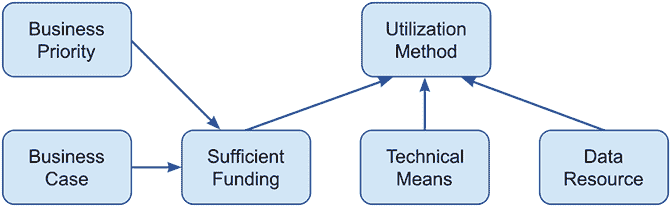
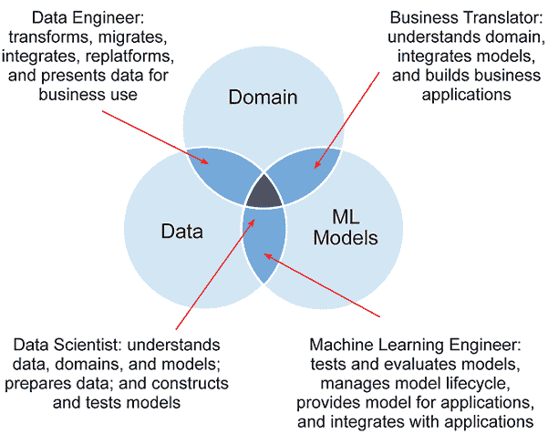
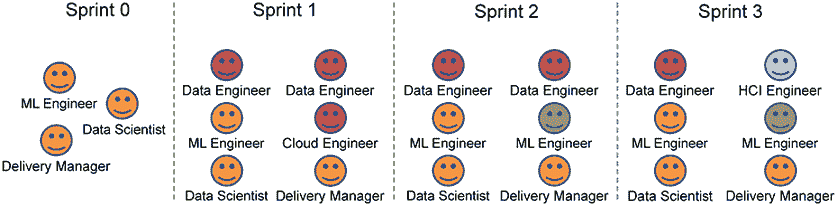
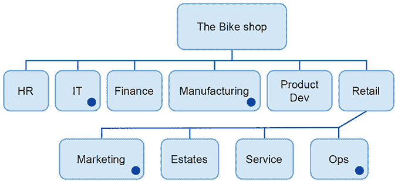

# 3 项目前期：从需求到提案

本章涵盖：

+   创建项目假设

+   生成努力和时间估算

+   完成文件工作以启动项目

+   完成您的销售前清单

在第二章中，我们涵盖了项目前期工作的一半。首先，你设置了完成必要工作所需工具和基础设施。然后，你承担了一些任务来收集项目需求，强调项目关注的机器学习特定问题。特别是，你研究了项目数据集，并发现团队获取数据的难易程度。你还记录了数据特定的安全问题、隐私问题，并了解该项目的关键伦理和社会关注点。

这些需求现在需要综合成一个声明，说明将要发生什么，该意图存在的问题以及这将花费多少。一旦掌握这些，您的组织和客户的业务就可以做出是否继续项目的理性决定。这是我们将在本章中涉及的工作。

## 3.1 构建项目假设

项目假设阐述了项目的目的和需要克服的主要挑战。从第二章的销售前待办事项继续，让我们看看票据 PS10。这是理解项目核心问题的必要工作。

项目假设票据：PS10

+   理解业务问题：通过达成共识来构建项目假设，并经客户和交付团队验证。确保这一点在任何合同协议中得到明确沟通和记录。

机器学习项目的一个特点是，业务很少清楚地阐述机器学习部分，即使阐述得清楚，也往往是现实主义的，或者不太可能创造太多价值。如果你不知道特定的机器学习算法是如何工作的，就很难想象一个机器学习系统是如何解决问题的。目前，在我们的项目中，我们想要：

+   记录股东阐述的挑战和好处。

+   反思数据、系统架构和非功能性约束。

+   根据已知情况记录潜在结果。

+   向利益相关者提供反馈，以达成项目共识。

想象一个能解决任何问题的神奇盒子是有用的。这导致我们在机器学习项目描述背后的思维存在巨大的差距，有时就像一个断言，即机器学习可以修复任何需要修复的东西。这也导致了让利益相关者接受并理解您和您的团队提出的任何现实项目的难题。有时，现实可能不像我们希望的那样性感。也许随着机器学习变得更加主流，这种情况会改变，但机器学习的多样性和复杂性使这种现实变得有些可疑。毕竟，微软 Excel 已经主流了 20 年或更长时间，但统计学家仍然需要设计试验和实验，并对结果进行有意义的分析。

您和您的团队需要识别并（有说服力地）阐述一个概念，该概念利用可用数据为业务创造价值；它还必须具有足够的价值以证明投资的合理性。您可以使用迄今为止所做的工作来向自己、信任的合作伙伴或潜在团队成员简要介绍项目的问题和挑战。

您需要捕捉两类需求：

+   *功能性需求*：系统需要执行的过程。功能性需求描述了一组输入和所需的输出。将输入转换为输出的过程是团队需要构建的内容。例如，输入 = {用户资料，预算，日期} 输出 = {推荐书 _1，推荐书 _2，...，推荐书 _n}。

+   *非功能性需求*：对功能性需求必须如何表现的限制。例如，推荐必须成本低于$0.0001，推荐必须在 200ms 内生成。

需求分析应产生一份挑战和商业机会的清单。这些是可能改善客户业务的事情，但其中一些可能不可行或不切实际。因此，该清单需要根据自捕获以来关于数据、项目设置和安全的所有发现进行验证。

如果您确实得到了一个可行的概念的列表，那么请对这些概念的描述增加一些细节。敏捷项目使用系统故事（概念如何交付）和用户故事（谁将使用并受项目影响）。在这个阶段，这些活动是为了验证：是否有可行的实施路径，以及是否有机制允许解决方案产生影响和商业效果？稍后，如果项目运行，您将拥有资金和资源来深入了解这一点，并详细阐述这些故事。通过现在编写用户故事，您希望：

+   识别并记录关键功能和需求。

+   确定可能成为项目验收标准的项目项。

+   建立必须避免的重要问题和危害。

+   建立会使系统无关或无法工作的边缘情况。

您应该为尽可能多的相关利益相关者（业务赞助商、员工/用户、客户/受影响的人）开发用户故事，并涵盖三种揭示机器学习系统重要需求的情况：系统首次使用或接触利益相关者时，正常使用时，以及系统停止使用时。对于您的项目，重要的是要确定并描述在每个这些故事中用户调用的机器学习模型。这就是必须构建的模型！考虑：

+   它是什么样的模型？

+   需要哪些数据来创建它？

+   运行它需要哪些数据？

此外，每个故事都必须描述模型将在这个特定故事中为特定利益相关者做什么。这应该在较高层次上揭示每个利益相关者需求之间的共性和差异，所需模型的范围以及每个模型的要求。

项目假设票据：PS11

+   承担项目尽职调查。利益相关者是否可用？数据是否可用且可管理？哪些团队成员可用以及他们有什么技能？

一旦完成这些，就用假设（例如，我们将测试我们是否可以使用表 XYZ 中的数据创建一个预测客户流失的模型）和调查（例如，我们将调查该模型如何在企业的运营背景下使用）的术语来构建概念。这种构建将项目从必须构建的概念转变为需要采取的一系列行动：测试、创建、建模、调查、使用。通过检查以下内容来验证产生的概念：

+   *技术可行性*：这个项目对您的团队来说有多大的风险、新颖和困难？显然，如果他们以前做过类似的事情并且熟悉核心技术，那么风险就会降低。

    然而，通常项目的一些方面对团队来说是新颖的。重要的是要确定这一点，了解它代表了多大的差距，并确定如果它很大，可能的缓解措施是什么。此外，考虑客户的基础设施是否能够应对（可能）的非功能性需求。

+   *可行的商业案例*：您可能无法获得足够的访问权和洞察力来构建详细的案例；客户需要开发这个案例以获得资金。然而，了解节省的规模、收入增长、生活质量改善等，以及项目所启用的机制，为您提供了强大的指南，以引导未来的结果。

+   *商业可行性*：是否有资金来支付完成整个项目所需的所有工作？这与商业案例要求是不同的考虑。一个项目可以为金钱提供惊人的价值，但如果支付它的资金不可用，那么项目就不会发生。

在构建概念时，还需要考虑的其他事项包括：

+   该概念解决了客户哪些战略业务优先事项（如有组织模型，请参考）？

+   项目能否使用客户描述的数据资源来完成？

+   客户是否有有效利用成果的方法？

图 3.1 展示了这些元素如何相互作用以创建一个功能性的项目。如图所示，业务优先级和业务案例解锁了充足的资金。通常，组织有长长的业务案例列表，但由于它们只为更好的和更有战略性的项目使用资金，所以没有得到资助。通常，仅仅案例本身并不足以就项目达成一致并启动它。如果有资金，你需要确保执行项目的技术手段到位，数据资源能够支持它。最后，尽管你有一个完全可行且价值高的系统准备就绪，但现在的问题是它是否可以被使用？也就是说，那些应该利用成果的人实际上是否真的会利用它？这个解决方案是否有用且可行？

图 3.1 项目驱动因素（业务优先级和业务案例）、支持组件（充足的资金、技术手段和数据资源）以及促进因素（利用方法）。

如果图 3.1 中的所有元素都已就绪，那么你可以编写并传达一个可行的项目假设。在这个过程中存在一定的迭代性，伴随着理解，因为你探索并阐明项目的价值和客户资助的意愿。希望你所发展的结构能让所有利益相关者验证这个项目是值得做的。

当然，你可能找不到这个项目的可行概念。图 3.1 中的某些部分可能难以捉摸，但你现在看到这一点是好事。无论如何，以这种方式审视项目意味着你已经使用了一个结构化和专业的流程来确定进行项目的风险和项目的潜在收益是否适合所需的资金。

## 3.2 创建估算

明确的项目定义是很好的，但除非这个定义可以转化为估算，否则它就像一个由蜡制成的茶壶一样无用。工单 PS12、PS13 和 PS14 定义了帮助我们从定义到估算的任务。

估算构建工单：PS12

+   为一个模型项目创建一个工作估算，确保满足所需的项目假设，同时考虑到可用的团队和所需工作的规模。

+   确保你的估算中考虑到了所有项目风险。

估算构建工单：PS13

+   创建并推广团队设计和资源配置。

估算构建工单：PS14

+   举行审查会议并检查清单以确保预销售过程得到适当完成。

你现在有了项目概念的大纲，一些关于顶级系统设计外观的数据，你已经系统地审查了它，以确保没有已知的法律或道德限制。你已经记录了这些事情，所以下一个任务是把这个大纲转换成一个项目描述，它将捕捉到需要做什么，由谁来做，以及何时交付。事实上，你的团队将适应项目展开的现实。你在这里创建的是一个可信的资源资金包裹，以便能够得到一个可行的结果。

### 3.2.1 时间和努力估算

到目前为止的所有准备和调查还没有产生一个估算。从你设计的项目结构转移到时间和成本估算，需要采取两个行动：

+   使用本书每一章的后备清单来创建你项目的任务清单作为起点。随着项目的演变，你将发现工作的内容。你可以根据需求自由添加和删除任务，但如果你在寻找一个起点，那么这就是它。

+   如果将要进行工作的人们与你一起制定估算，他们将从一开始就拥有这个计划。将你的团队带到桌前，共同制定估算。挑战他们深入挖掘需要完成的所有必要任务的工作。让他们揭示在机械和行政任务上需要花费的时间，除了高调的技术工作之外。

虽然还有待发现，但我们现在已经掌握了我们面临的挑战的非功能性和系统方面。与估算每个项目任务所需努力的每个人分享并阐明这些内容。构建必须满足广泛和严格非功能要求，同时还要功能正常运行的模型是困难的。将要服务于数千用户的用户界面，比只服务于少数用户的用户界面要困难得多，也昂贵得多。关于你需要参与此过程的任何专家，要明确说明。此外：

+   确保你捕捉到对材料的需求。例如，你对计算消耗有什么需求？你是否需要特殊硬件，如耳机、电话、传感器，或者顶级的笔记本电脑或显示器（由专家开发者所需）？

+   捕获模型训练或数据处理的特殊需求和成本。团队很容易假设访问强大的 GPU 将不会很贵，但发现他们需要在 GPU 上消耗数百小时，而这非常昂贵，这会带来问题。另一个容易被忽视的成本是将数据导入和导出到云基础设施，这些是收费且昂贵的，但在机器学习项目中，这可能需要反复大规模地进行。

除了创建任务列表或项目待办事项列表，这些列表会随着项目的演变而持续优化，你还需要估计待办事项列表中每项工作的规模。这可以通过使用*t-shirt sizing*来实现。这是一种简单的方法，可以对一系列任务的整体规模进行估计。（之所以称为 t-shirting，是因为任务的努力程度仅以小、中、大和 XL 来衡量，没有更多的粒度。）通常，进行这项工作的人可以就这些类别达成一致，而无需太多争论，项目的整体规模很快就会显现出来。

使用 t-shirt sizing 有两种方式。首先，当任务规模达成一致时，你可以将每个尺码类别的任务分组，并亲自向团队询问每个类别中每个任务的估算人天数。例如，团队可能会查看所有被提名的小型任务，并同意这些任务可能需要一个人一天的时间来完成。有时，这会导致一些任务被重新排列，但这是可以的。这允许你将每个类别的所有任务，然后是所有类别加总，以给出一个努力程度的估计。

T 恤尺码的第二种用途是记录需要完成的任务实际所需的时间，然后利用这些信息来确定随着项目的展开，努力估计的可靠性。如果原本认为小任务只需一天就能完成，但开始持续需要更多时间，那么你的估计就是错误的，你需要做一些紧急工作来确定项目是否陷入困境。

在对项目中要完成的任务以及完成每项任务所需的工作规模有了总体了解之后，接下来要考虑的是谁将完成所有这些工作？让我们接下来看看这个问题的答案。

### 3.2.2 机器学习项目的团队设计

对于机器学习项目，所需的团队决定了项目成本的最大部分，虽然有些项目成本较高，但通常，团队的时间将是项目成本的最大部分。如果你要准确估计项目将给你的组织带来多少成本，或者如果适用，应该收取多少费用，那么理解团队设计（谁将交付工作？）是至关重要的。

要从项目路线图中执行实际资源配置工作，你需要有系统性和确保每个任务都有一个分配的资源，该资源覆盖了预期挑战的规模。这很难做到准确，但将项目分解成一系列任务，并逐个估计每个任务，会使问题更容易处理。一个好的做法是在团队中这样做，也许可以邀请在项目前期过程中与你一起工作的人，或者调用高级资源来处理项目本身。本质上，你想要确定哪种类型的人能够完成指定的任务，以及他们完成该任务所需的时间。为了了解谁可以预期完成每个任务，了解可能为项目提供帮助的人的类型是有益的。

在专业角色方面，有四个角色是从机器学习项目中复杂性的三个驱动因素（图 3.2）的交叉中出现的。在第一章中，图 1.2 指出，机器学习项目的复杂性是由专家克服来自数据、建模和领域对齐的挑战的需求驱动的。

图 3.2 机器学习项目中由三个复杂性驱动因素创建的团队角色

图 3.2 还展示了在这些困难领域工作的某些角色。这四个角色是：

+   *商务翻译员:* 这是一种流行的说法，指的是那些对机器学习系统有深入了解，并擅长在领域专家和机器学习专家之间架起桥梁的商业分析师和软件工程师。

    商务翻译员的想法对 IT 领导者来说很有吸引力，因为它解决了一些关于机器学习专家和团队脱离现实的常见抱怨。在某种程度上，到 2022 年，商务翻译员如何有效地为机器学习项目做出贡献仍然不清楚，尤其是当机器学习工程师和数据科学家可能有自己的强烈观点时。然而，一个对与用户和利益相关者紧密合作以收集和发展团队领导者的见解感兴趣的人，在繁忙的项目中可能是一个救星。

    在某些团队中，这个角色主要由充当产品所有者的客户承担（以下是对此要求的描述）。在其他情况下，产品所有者的时间对于详细业务调查来说太宝贵了，你需要为这个角色引入一个专家。

+   *数据工程师:* 他们是获取、移动、调动和操作资源的专家。他们拥有关于平台、工具、编程语言、安全性、成本和效率的知识。

    数据工程师可以帮助你的团队应对尴尬的数据资源。由于在组织中的先前项目工作，他们可能对要操作的数据的结构和属性有一些见解，并且对数据的业务用途有一些了解。然而，在许多情况下，他们将纯粹是技术贡献者，依赖于业务翻译者或产品所有者来了解数据存储中的内容。

+   *机器学习（ML）工程师*：这些人员与项目产生的模型一起工作。他们创建并使用存储、版本控制和管理的模型的基础设施，但他们还承担设置测试系统和运行评估等任务。对于机器学习工程师来说，另一个重要任务是实施有效的模型服务机制，以便在场景中运行模型并产生结果。能够以弹性、低延迟、高吞吐量或低成本完成这项任务可以是一项真正的壮举，因此这是任何团队都应具备的宝贵技能。

    当模型嵌入到有效的服务基础设施中时，机器学习工程师通常致力于将结果子系统与业务应用程序集成，以释放价值。这就是他们与业务翻译者重叠和互动的地方。

+   *数据科学家*：中间人员，专门从事创建模型。他们还了解对数据进行条件化以进行有效建模和测试以及评估模型以确定其有效性的方法。

你也可能有专注于机器学习项目之外的人员作为资源可用。这些人也可以帮助团队：

+   *软件工程师*：拥有在团队中生产可靠和可管理软件所需特定技能的程序员。开发者通常是更注重个人主义的程序员，他们更多地作为单独的问题解决者和故障排除者工作。在征用这些资源时要小心，因为有些人对软件工程师或开发者的理解模糊，因此这些术语通常可以互换使用。

+   *DevOps 工程师*：专门负责设置和管理软件开发基础设施。通常，他们在大型项目中工作，其中开发基础设施是一个很大的开销。有时，机器学习工程师具有 DevOps 工程技能和背景，因此他们可能能够满足这些要求。引入 DevOps 工程师可以填补机器学习工程师的一些工作。

+   *云工程师*：专门负责设置和管理云基础设施，如私有网络和 IAM（身份和访问管理）配置。他们通常也擅长使用云管理服务组件，如数据仓库。如果数据工程资源不可用，你通常可以使用这些人来支持数据科学家。

+   *交付经理：* 能够通过组织和管理会议、与利益相关者交谈、创建报告和管理文档流程来促进和支持项目管理的人。

+   *UX 工程师：* 通过与系统用户交谈并了解他们对系统的影响来开发用户界面和交互设计的专家。

+   *测试和 QA 工程师：* 专注于创建和运行测试系统，使您的系统能够获得批准并投入生产。在机器学习项目中，对模型进行广泛的测试以评估其性能（在第七章和第八章中详细说明）。除了从事模型测试的机器学习工程师和数据科学家外，还可能需要从用户或平台的角度对系统进行测试。

要明确，这些角色通常由多个团队成员或单个团队成员共同承担。也可以说，对于每个确定的角色的技能矩阵和分配，都有其他看法。例如，一些组织认为数据工程师是通才，他们在机器学习项目的生命周期中工作，有时支持数据科学家或机器学习工程师。这个概念并不比之前的分解更错或更差；它只是不同，对于某些组织来说更为合适。

决定团队成员的另一个因素是哪些人可用。项目经理很难找到能够为工作组建完美团队的成员。你必须准备好并能够根据实际情况调整计划。以下是一些应对这一挑战的建议：

+   *先匹配大块部分：* 这是一种陈词滥调，但如果你首先关注项目团队最重要的元素，那么你就可以围绕更外围的活动和角色进行即兴创作。

+   *优先寻找正确的行为而不是成就：* 分享技能和见解并指导同事的团队成员特别有价值。同时，能够批判性和建设性地思考并为团队的创造性问题解决做出贡献的团队成员也非常有价值。

+   *通才往往比专家更有用。* 尤其是在小型团队中，那些既有专业技能又愿意并且能够根据需要担任通才角色的人是宝贵的资源。这些人就是传说中的*T 型*人才，与只有狭窄而深入的专长的*I 型*人形成对比。

    更倾向于通才型的人可以在整个项目中做出贡献，而不是仅仅参与几周然后离开。通常，从项目开始到结束全程参与的人更有动力。另一个优点是，坚持项目的成员了解正在发生的事情；在简报人们等方面需要付出的努力要少得多。

    一个共同努力深入理解特定挑战的团队可以更快地交付更高质量的整体成果。这里的大前提是，如果项目需要专业技能，专家贡献者不仅有用，而且是必需的。通常，这是在更大、更复杂的项目中。幸运的是，这些项目（以及维持它们的组织）可以承担聘请所需专家的费用。

+   *寻找团队的发展机会：* 通过帮助人们获得技能和经验，你正在确保未来的价值。他们希望再次与你合作，并且当使用时，团队中的资深成员也将从指导经验中受益。另一方面，你只能承担这么多，否则团队的生产力会受到影响。

图 3.3 展示了随着技能需求的变化、新团队成员的加入以及做出贡献的人离开，一个团队在项目中的演变过程。例如，在冲刺 1（图 3.3）中为云工程师分配的短期任务可能存在一些问题。工程师可能会对被突然加入到项目中解决几个问题感到不满，或者他们可能喜欢在长期工作之间的快速任务。

图 3.3 项目冲刺期间的团队演变

在图中，仅显示了第 3 个冲刺的 HCI（人机交互）工程师，也可以称为 UX 工程师。在这种情况下，为期两周的分配可能对这个人来说效果很好，因为这是一个真正为展示项目增加价值的机会。另一方面，如果 HCI 工程师缺乏完成适当工作的项目背景，这可能会成为问题。这些问题有时很难避免。实际上，你能做的就是与相关人员保持联系，并尽你所能使分配对每个人都是可行的。

当你对团队结构有一个很好的了解时，设立一些项目前的团队导向会议可能是个好主意。这可以让团队了解对他们个人的期望，并弄清楚他们将和谁一起工作。此外，检查在任务需要时资源是否可用。然后汇总任务和分配，为项目中的每个冲刺创建一个敏捷团队。

项目团队的核心成员在整个项目期间应保持稳定，但如前所述，一些人可能会加入或退出以提供所需的专长和交付能力。总结一下，这个过程是：

1.  使用书中回溯中概述的任务集创建一个任务列表，并在可能的情况下与项目团队补充和详细说明。

1.  确定完成每个任务所需的角色和专长。

1.  估算每个任务的所需工作量。

1.  汇总工作量并确定每个角色所需的承诺程度。

1.  制定一个最接近所需努力的职责资源计划。

1.  确定一个符合职责资源计划的潜在团队设计。

1.  确定团队所需承诺成本的整体成本。

除了所有这些考虑因素之外，重要的是要理解客户也需要支持项目。他们需要提供知识和 IT 支持，你需要知道（来自客户的）谁将担任产品负责人。在这个阶段，通常不可能将客户的人预订到你的项目中并预留他们的时间；还没有达成任何协议，但有一些已确定的候选人会让人感到安心。通常，你需要识别：

+   *产品负责人*：能够提供反馈和输入的客户代表，这使团队能够集中精力，有效地对与客户需求一致的问题和发现做出反应。

+   *技术/行政问题解决者*：能够帮助团队克服他们遇到的任何行政障碍的人。内部代表通常更了解如何处理他们组织内部的问题，并且在与客户的设施和行政沟通方面处于更有利的地位。

关于团队的一个最后要点：你期望加入团队的人可能存在冲突（已预订假期或其他事件），这会阻止他们参与项目。如果你认为某人可能加入你的团队，但他们即将退休或转到另一个组织，那么这个资源选项就根本无法行得通！

一旦确定了团队并掌握了完整的任务清单，你就可以审查你创建的项目路线图，并检查潜在的优化或问题。为了优化，并行运行任务，并确保高价值资源集中在高价值的生产性工作上。在这个阶段可以识别的问题通常是那些需要完成以解锁项目的任务，但它依赖于其他有风险的任务。

这是一个敏捷项目，我们不会知道将要出现的问题和故障的一半。尽管如此，在这个阶段尽可能多地了解未知因素，以尝试避免明显的陷阱是好的。

### 3.2.3 项目风险

在创建了资源估算之后，重要的是要审查风险登记册。你是否已经考虑了缓解和解决项目面临的风险的可能成本？如果没有，那么请确保你在估算中添加适当的工作量和弹性来应对这些问题。例如：

+   确定潜在的缓解措施或替代方案。之前成功使用的缓解措施价值较高；新的缓解措施价值较低。

+   估算缓解成本并将其包含在预算中。将低置信度估算与高风险溢价（通常为 100%）一起添加。例如，如果低置信度缓解的估算为 500 美元，则将其作为项目成本中的 1000 美元输入。将高置信度缓解以 30%的溢价添加。例如，500 美元的缓解将添加为 650 美元。

    注意缓解价格是一项可收费项目；客户预期为此类工作支付的金额，而不是作为您组织的成本。风险溢价是额外的，加上您组织增加的利润率，以允许其作为一家成功的业务运营。

+   进行审查以确保没有高影响（可能导致项目失败和收入损失）和低价值缓解（没有明确的解决方案路径）的风险。

+   让您组织的一名官员（在项目失败的情况下负责的人）签署预算并确认他们接受您提出的风险。您的任务是确保他们了解并理解组织所承担的风险。

记录此过程，并与签署风险的人共享文档。例如，在签署会议后发送一封电子邮件，其中包含您用于向所有人简要介绍的内容。当机器学习项目运行时（本书其余部分详细说明），您可能希望每周与项目利益相关者举行一次审查和更新会议，以讨论和共享风险登记册。

一些风险是无法管理的。事实是，如果数据不存在或由于质量或可用性问题而无法使用，则无法从中开发出有用的模型。如果您无法检查数据或明确建立模型将如何开发或实施到有用的系统中，那么您无法承担估算。如果是这种情况，那么需要进行进一步的研究和付费，这取决于具体情况，可能由您的组织或客户承担。要明确，并确保您将此类项目作为实验或调查来界定。尽管在您组织签订的合同中应该有技术上的法律条款来保护您，但与客户进行清晰沟通非常重要。

## 3.3 预销售/项目前期管理

项目前期管理工单：PS15

+   确保所有适当的文件都已到位：

    +   主服务协议

    +   工作说明书

    +   根据项目要求签订的保密协议和其他正式文件

在某些项目中，需要正式合同。这些包括：

+   *主服务协议（MSA）:* 规定了您组织与客户之间的支付和责任机制，并管理整个关系。许多项目都由一个主服务协议覆盖。

+   *工作说明书：* 定义了交付项目所需的努力和活动，并提供了关于将要交付内容的法律协议。重要的是，它还规定了应支付哪些报销以及何时支付。

+   *保密（NDA）、保密性和知识产权协议：* 取决于 MSA 以及你所在司法管辖区。

总是将这些文档的开发工作交给那些在法律上合格且在组织上负责的人员。永远不要被诱惑自己去完成这些工作，或者只是简单地跟随客户提出的建议。最终，如果你在讨论初期就涉及法律团队，这将节省时间（并提高项目的质量和结果）。他们可能会提出令人不舒服的反对意见，并在互动中提出令人烦恼的要求（例如，禁止进行持续工作，直到达成协议），但将他们引入以撤销由此产生的损害的后果要大得多。

当你创建了一个有充分依据的协议并适当签署（通常，可能需要区域 CTO 和 COO 都签署）并且它已获得客户批准并签署后，项目工作就可以开始了。然而，在你准备好获取签名之前，通过清单进行检查以确保没有遗漏是有帮助的，并且可以提供安慰。

## 3.4 预项目/销售前清单

在处理完之前列出和描述的项目后，你应该能够完成以下预项目/销售前清单。此清单（表 3.1）让你检查每个项目，以验证是否有足够的证据表明任务已适当完成。

表 3.1 预项目/销售前清单

| 票号 | 项目 | 备注 |
| --- | --- | --- |
| PP1.0 | 项目文档存储库 | 在文档存储系统上设置一个特定的工作空间、文件夹或目录，用于此工作，并将所有文档复制到那里以供参考。预项目阶段产生的文档已存储，没有遗漏。每个人都可以检索文档。存储库符合数据保留和信息安全管理政策。 |
| PP1.1 | 风险登记册 | 风险登记册在存储库中可用。所有有权访问它的人员都可以查看当前的风险集合。已退役风险的历史和证据可访问。最终登记册已与项目利益相关者/经理/老板审查，并确保审查有证据记录，显示风险已按文档记录。 |
| PP1.2 | 项目假设 | 项目目的是否已经明确描述并作为假设或调查来界定？交付团队是否理解可行的商业案例？假设是否被团队清楚地理解，并记录在任何项目声明中，所有利益相关者是否都了解并批准了它？ |
| PP1.3 | 谨慎完成 | 确保以下内容已完成并可在存储库中找到：详细说明利益相关者、最终用户、目标和关系的组织图。数据访问信息，包括在哪里、什么以及如何访问。包含提供和已知需求/问题的可能时间表的高级解决方案和客户/预期部署架构。获取的任何数据样本以及对其进行的任何评估或调查。用于证明合法和道德交付路线的数据保护、隐私和道德要求文件。 |
| P1.4 | 高级交付计划 | 完成的高级别任务列表，可能基于本书中的项目结构，但针对实际要执行的项目进行了定制。完成这些任务所需努力量的估计。所需的团队以及他们是否可用。 |
| PP1.5 | 估算 | 对时间和材料进行估算：交付成本加上解决或缓解已知风险所需的努力以及针对这些风险给予的适当溢价。 |
| PP1.6 | 预售管理 | 所有 NDA（保密协议）、主服务协议和任务说明都到位。所有文件都经过法律团队的验证并获得同意。文件已准备好供授权签字（COO 等）。 |

与你的团队一起过一遍这个清单，确保他们和你都认为这些项目是完整的。一个技巧是不要自己主持这个会议，而是让团队中相对较年轻的人来主持。可能不是最年轻的那个人，因为那样有点不公平，但应该是团队尊重并且会从主持一些会议的经验中受益的人。通过让他们来安排会议并主持它，你可以避免每个人都认为他们应该只是同意的情况。从你的角度来看，你现在想要知道是否有什么被忽略了，现在还来得及，在你仍然（希望）能够修复事情之前。

第二章和第三章概述的整个预项目流程在实际中是如何展开的？下一节提供了一个描述现实生活中可能发生的事情的叙述。这是关于自行车店项目的第一个小故事，旨在帮助说明本书中的方法如何在实践中应用。

## 3.5 自行车店预售

（虚构的）咨询销售团队在虚构的制造和零售公司“自行车店”中识别到一个 RFI（信息请求）机会。运行业务运营的 SaaS 和本地部署软件包需要大量的资本投资，这主要是因为许可证续费以及需要新的硬件来替换现有的。

通过转向循环运营支出（OpEx）模式，而不是大爆炸资本支出（CapEx）投资模式，公司可以释放资金来投资新的物流设施，以及更新和升级公司的品牌和商店。为此，自行车商店希望转向基于云的解决方案。

对于自行车商店的管理层来说，一个令人沮丧的地方是，他们无法使用当前系统来创建一个关于业务状况的单一概述，并从该概述中生成商业智能。在非正式讨论之后，你被拉入工作，参与预销售机会。

自行车商店项目的初始 RFI 没有包含任何关于所需应用程序的细节。在客户 RFI 流程的一次会议中，你的团队询问了这个问题，并透露业务的关键优先事项是减少开支，以释放资金来改善他们过时的分销系统。他们希望通过提高客户保留率来实现这一点。逻辑是，通过让客户保持更长时间并让他们花更多钱，他们就不需要开发新市场并吸引新客户到业务中。

这促使你建议可能可以使用自行车商店的数据来识别哪些客户有很高的流失风险。此外，你可能还能提出一些可能阻止客户流失的干预措施。这是一种许多其他公司都使用的标准应用。在自行车商店的情况下，他们分散的 IT 资产阻止了他们能够利用数据进行类似的事情。

在随后的讨论中，潜在客户指出，新物流系统的一个原因是因为公司经常发现很难利用增长并管理来自客户的需求。为了满足增长需求，业务必须持有大量组件的库存。拥有过多的组件成本高昂，但拥有过少的组件意味着损失收入。你建议，可能可以根据自行车商店的历史和开源数据来预测需求，这些数据揭示了经济和社会趋势。客户似乎对可能性感到兴奋，电话结束后，你开始撰写提案和估算，作为对 RFI 的回应。

你使用你组织标准工具（在这种情况下，是 Confluence）设置了一个文档库，并在你组织的 Jira 中创建了一个待办事项列表。你创建的第一个文档是项目风险登记册。表 3.2 显示了完成登记册的一个示例（显然，当它首次创建时，它是空的）。

表 3.2 自行车商店机器学习项目的风险登记册

| 风险 ID | 描述 | 状态 | 负责人 |
| --- | --- | --- | --- |
| TBS1 | 无法获取高质量的天气/经济开源数据 | 开放 | 你 |
| TBS2 | 由于数据清洗，客户行为历史记录不足 | 开放 | 你 |
| TBS3 | 不可用的数据科学资源 | 开放 | 你 |

预售待办事项中的下一项是通过对组织建模来了解更多关于你的客户的信息。首先，你询问 RFI 项目团队是否有一个客户捕获的组织结构图，他们确实有。图 3.4 显示了这张图，你将其捕获并保存在你的存储库中供参考。

你还考虑了另外两个组织问题：首先，谁是这个项目的利益相关者和客户，其次，谁是最终用户？通过与 RFI 团队的成员交谈，你确定 CIO Karima Shar 是商业智能总监，这可能是关键的利益相关者。你联系 RFI 团队的业务经理，要求在下一场与客户的 RFI 更新会议议程中包含一项内容，并请求与 Karima 会面，讨论潜在的项目。

图 3.4 The Bike Shop 的组织结构图

在与 Karima 的会议中，你揭示了工作的概念，并询问这项功能将在业务中的哪个部分被使用。Karima 能够告诉你，The Bike Shop 零售部门的客服团队使用客户流失信息，而制造部门使用你描述的库存预测功能。她对此可能性表现出兴奋，并认为在整体计划中整合工作流以将 The Bike Shop 的数据迁移到云并提升其能力有很大的潜力。

在这个阶段，Karima 无法与你分享任何数据，但她似乎有信心这些数据存储在 SAP 数据仓库（opdis2）中，该仓库由 CIO 负责运营以支持业务。Karima 知道其中一些数据可以个人识别客户，但对此没有任何非同寻常的安全或隐私担忧。此外，她也不知道 The Bike Shop 更倾向于开发哪种类型的系统架构来交付所提出的系统。

这些概念已写入工作说明书的背景部分，以定义你的团队将工作的整体挑战。你以假设的形式来撰写它们：

+   *挑战 1:* 该项目将验证是否可以使用 The Bike Shop 的 opdis2 数据库和其他资产来构建一个客户流失预测系统，并将测量该系统在预测的召回率和精确率方面的性能。

+   *挑战 2:* 该项目将验证是否可以使用 The Bike Shop 的 opdis2 数据库和其他资产来构建一个需求预测系统，并将测量该系统在预测的召回率和精确率方面的性能。

+   *挑战 3:* 你调查了一种实施方法，该方法使用从 opdis2 迁移到新云平台的数据和数据流，为制造和零售服务领域的用户提供及时、可操作的信息。这使得他们能够优化与库存、供应和客户互动相关的业务决策。

+   *挑战 4:* 如果 1-3 号挑战得到客户的满意完成，你将实施并交付一个提供所需功能的系统。

在与客户代表的讨论中，提出并讨论了许多假设。你意识到，如果这些假设没有在工作说明书中记录，那么在项目后期可能会出现重大的争议，因此你创建了一个项目假设文档，将其存档，完成工单，并喝了一杯茶：

+   *假设 1:* 数据库和数据流迁移到云上正在进行中，并通过了其项目里程碑和关卡。

+   *假设 2:* 你和你的团队能够访问 opdis2 和其他所需数据资产，将数据提取到批准的开发环境中，在那里你有账户和适当的授权。

+   *假设 3:* 团队将此数据与开发环境中的开源数据相结合。

+   *假设 4:* 你使用应用程序环境提供测试和生产数据。

+   *假设 5:* 你需要访问自行车商店的商业专家，以帮助阐明和改进你做出的预测的性质。

下一步是审查与“自行车商店”项目相关的伦理和 CSR 问题。现在，时间和金钱都很紧张，所以你们对在这个问题上应该做多少有不同的看法，但你记得在某个数据保护培训手册中读到以下内容：

*在处理类型，特别是使用新技术，并考虑到处理的性质、范围、背景和目的的情况下，可能会对自然人的权利和自由造成高风险，控制者应在处理之前，对预期处理操作对个人数据保护的影响进行评估。单个评估可以针对一组具有相似高风险的类似处理操作。*

机器学习技术可能不会被技术人员视为*新*，但在这个项目进行的时候，它们对绝大多数普通人来说都是新的。那么问题是关于风险的：这是否是一个对受试者来说高风险的项目？再次，你查阅了 ICO 的网站，并注意到了可能表明该项目具有高风险的因素列表：

+   评估或评分 ✓

+   具有法律或类似重大影响的自动化决策

+   系统性监控 ✓

+   敏感数据或高度个人性质的数据

+   大规模处理数据 ✓

+   匹配或合并数据集 ✓

+   与易受伤害的数据主体相关的数据

+   创新使用或应用新的技术或组织解决方案 ✓

+   阻止数据主体行使权利或使用服务或合同

你检查了这些项目；很明显，你将评估和评分客户，以查看他们是否可能停止在自行车店购买。但意图并不是用这个来做出自动化决策，而是将信息传递给那些将在自己的研究中使用它的人。你所做的是系统的。所有客户都可能被检查，但数据不是个人的；毕竟，拥有自行车不像拥有宗教。

你认为这将需要大规模处理，因为客户有数百万。主体可能很脆弱，但你所做的不与他们脆弱性相关。技术是创新的，但你并没有计划阻止人们做任何事情或使用自行车店的设施。

可能值得创建一个数据保护影响评估（DPIA），这是一种了解项目中使用数据可能如何影响个人的方法。英国信息专员办公室建议完成一个 DPIA，以帮助你和团队了解你们使用这些数据所承担的风险 [1]。

首先，你考虑数据的性质、范围、背景和目的，你发现这些数据正在用于内部流程。它仍然在自行车店的掌控之下。数据的保留和安全不会改变。主要问题是这是新颖的处理方式：在范围上，这是购买行为记录与客户人口信息之间的对比。背景是这些客户拥有银行账户或信用卡，所以他们不是儿童，他们的目的是合法的。自行车店的业务是卖自行车，这也是为什么客户与公司有关系的理由。然而，客户是否知道他们的数据可能会被用于这种模型？他们是否同意了这一点？

你调查了可能对个人产生风险的风险清单（例如，无法行使权利、受限访问服务、失去控制等），并确定唯一的潜在挑战可能是可能的经济损失，因为从数据中做出的决策可能会被用来创建包括一些客户但排除其他人的特别优惠。你写下了你的初步评估，并记录了三个结论：

+   存在风险，客户可能没有允许使用迄今为止收集的数据以这种方式。

+   结论不应用于创建独家优惠。

+   当项目更加成熟时，你必须重新审视你最初的 DPIA。

在这个阶段，出现了一段停顿。在获取工作的过程中，必须对 RFI 的反馈进行回应，因此你被要求写几段话用于回应文档，你照做了。在你等待公司对提案进行审核的过程中，你转而去做一些之前积压的工作。但这并没有持续太久。

几周后，你被召集参加一个会议，被告知自行车店希望你的组织正式提出一个迁移和数据价值的提案。（显然，目前没有其他投标者，你的贡献确实激发了自行车店管理层加速他们的计划并推进项目的热情。）现在需要的是更具体地说明可以做什么，以及起草正式工作提案所需的材料。你被分配到投标团队，负责这项工作。

由于现在你和自行车店之间有保密协议和保密协议，你可以做的事情在某种程度上有所变化。他们承诺让这个项目启动并运行。你现在和你的团队面临的问题是，如果承担这个项目，谁会参与其中，以及这项工作在高级别上包括哪些内容？在过去，你曾与组织中的一些有才华的数据科学家和机器学习工程师合作，所以你查阅了内部网络上的任务数据库，发现其中之一，罗布，目前处于待命状态。你前往投标响应经理那里，询问是否可以预订一些罗布的时间来制定资源和项目计划，并且得到了同意。

你向罗布介绍了项目，并回顾了到目前为止获得的信息。使用本书中的模板，你指定了一个涵盖以下内容的计划：

+   第 0 个冲刺阶段，让项目启动并运行。这在规模和范围上都很明确，并且与项目相似，所以你同意这些任务需要三个人工作两周，可能是罗布、一个基础设施工程师和你自己。

+   第 1 个冲刺阶段，构建数据管道并详细探索数据集。

+   第 2 个冲刺阶段，构建模型，评估和选择建模方法，并完成最终模型以供使用。

+   第 3 个冲刺阶段，将模型集成到应用程序中。

罗布明确表示，在更具体地说明建模可以做什么以及数据准备和建模阶段需要多长时间之前，你需要先更好地了解数据。你联系卡拉玛，问她在你准备投标的时候，是否可以从 opdis2 中提取一些数据，这些数据展示了库存水平和客户历史记录的存储方式。结果证明，由于自行车店对项目充满热情，卡拉玛非常乐意安排这项工作。显然，客户信息将被匿名化。

同时，你和 Rob 请求 Karima 安排与制造和零售服务潜在用户的会议，以了解模型结果将如何被消费。Karima 已经确定，模型将为用户提供仪表板信息，在会议上，你提出了一些关于哪种仪表板会有用的概念性想法。制造团队遵循工程典型要求，要求表格数据带有电子表格下载，而零售服务团队希望数据“更容易理解”。

当数据样本到达时，情况比你和 Rob 希望的更为复杂。看起来数据存储在许多表中，记录着不同类型的交易，而要了解特定一天库存或客户的状态，需要大量的数据处理和操作。此外，数据库中大约有 3000 万行数据，代表着五年的商业交易，由两个来源创建。两年前，一个旨在解决交易管理系统数据质量问题的项目已完成，这意味着有一个包含三年噪声数据的遗留数据存储库和一个包含最后两年记录的干净数据源。

在系统架构方面，这似乎将是一个绿色领域的云服务项目。在 Rob 的帮助下，你可以指定开发/测试/生产设置，并将其提交给投标团队的云工程师进行审查。一旦完成，你和 Rob 就拥有了完成估算和顶层计划所需的一切。Rob 建议邀请他之前合作过的一些人，为任务进行 T 恤尺码会议。

通过解决第 4、5、6 和 7 章的待办事项，估算出五人团队加上你自己大约需要 10 周时间来完成项目，如之前商定的，有两个星期的冲刺 0。团队同意，到目前为止你从流程中识别出的风险在资源方面不是实质性的，但指出数据权限问题仍然存在。

你安排与 Karima 会面，讨论项目风险，并简要介绍需要限制系统使用的排他性。你还提到，如果数据权限问题得不到解决，可能会导致系统无法使用。鉴于对数据可能状态的研究发现，你为工作说明书中添加了一个子项目：

挑战 5：我们将验证 2-5 年前的数据在创建收入和流失模型时是否足够高质量，并将量化这些数据质量对从可用数据中提取的模型排名和有用性的影响。

在投标中涵盖此项目的工包中，记录了挑战，以及之前提到的假设和数据使用相关的假设：

假设 6：你需要有适当的权限来使用自行车店提供的数据。

描述的最后一部分是 Rob 和你与团队为估算所创造的工作。在法律协议中，这项工作被注明为在发现过程中可能发生变化。

与销售前期团队进行了审查，并将项目评估为低风险、高灵活性，因此，没有在项目估算中添加明确的应急计划。所有协议文件都由法律顾问准备，并举行会议来审查和完成销售前期清单。会议产生了几个小行动，在所有这些行动都关闭后，文件被发送到自行车店的授权官员以及你所属的咨询/交付组织。文件被签署，销售已经完成。现在项目必须执行。

## 3.6 项目前期后续

这是一个胜利！自行车店的销售已经完成，投标团队正在庆祝。这是一个愉快的故事，但项目前期的活动可能是一个对抗性的过程；你与其他团队和其他人一起使用不同的技术和方法。在商业世界中，你的项目也要与其他众多项目竞争。可能是因为正在缩小行政团队规模的转型计划今年需要更多的资金。可能是因为你提高服务生产力的机器学习项目并不像吸引网站更多关注的机器学习项目那样被视为重要。在咨询领域，也存在明显的商业竞争。其他公司可能比你能提供更低的价格或更快的交付。

有时候，你的组织可能真的需要这个项目，出于财务或组织（政治）原因。你的管理者或销售团队可能已经投入了大量的努力，让你达到可以提出和讨论项目的阶段。这意味着在项目前期阶段有很大的压力要取得成功，甚至可能根本不进行，直接交付结果。

显然，你和你的团队应该力争赢得尽可能多的工作。毕竟，这是支付账单的方式，你的工作是承担和交付项目。事实上，赢得错误类型的工作可能会产生灾难性的影响：耗尽你的团队，损害你的声誉，等等。一个注定要失败的项目所投入的团队成本是巨大的。如果你处于可以拒绝一个你认为将会失败的项目的情况，拒绝并让客户将钱花在其他地方是道德的，这也可能符合你自己的最大利益。海里还有其他鱼；你不会耗尽你的团队或声誉，而且客户将来可能会带着更好的想法回来。

本章概述的过程之一是为了在特定价格和特定时间内进行机器学习项目建立一个坚实和事实性的案例。这可能导致您的组织放弃一个项目，或者您的团队获得一个对客户来说现实且有价值的项目。不幸的是，这也可能导致您的报价被客户拒绝，转而选择竞争对手。这是一种更难以接受的失败，有时会对您和团队带来真正的负面影响。好事是，当您被问及为什么会发生这种情况时，您将会有证据证明您正在做正确的事情，并且还有可以长期学习的材料。然而，退一步想，重新审视并认识到每个故事都有两面性是值得的。也许客户是对的；也许您不是与他们合作的正确团队。如果客户错了，那么他们这次做出了错误的决定。不用担心。在您的竞争对手无法解决问题后，他们会回来的。

## 摘要

+   为了制定一个项目提案，需求需要转化为一个假设，明确预期的结果和关键挑战。

+   然后，可以根据假设以及您在第二章中收集到的交付环境信息进行结构化的估算过程。

+   一个有用的估算需要考虑团队的结构以及满足需求所需的承诺。

+   在向客户提及成本之前，确保您的项目文档得到适当的审查和批准。

+   如果项目前期阶段失败，那么项目肯定也会失败，这要糟糕得多。
