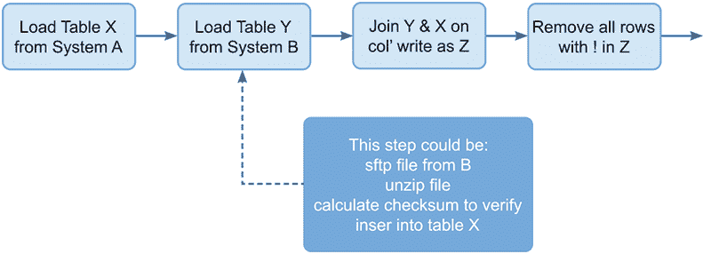
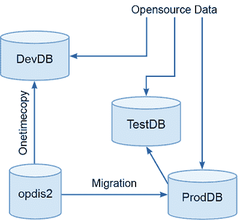
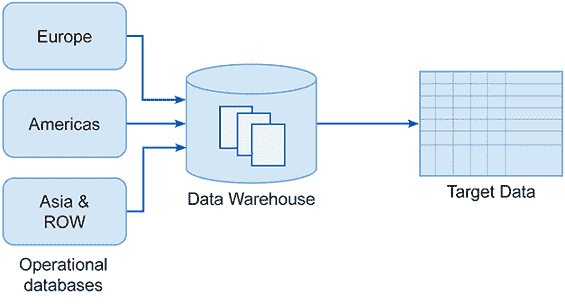

# 4 开始

本章涵盖：

+   在合作开始时关注准备

+   获取所有必需的访问权限和许可

+   降低项目风险

+   验证开发环境并在必要时实施缓解措施

第三章中介绍的第 0 阶段（sprint 0）的目的是将所有事情都设置好并准备好，以便项目团队可以在第一天进入并开始工作。在理想的世界里，这个阶段充当了一个缓冲区，介于尚未开始的项目和正在运行且花费大量资金的项目之间。这是一个在大量现金被浪费之前发现严重问题的机会，也是可以投入精力来提高交付团队生产力的时间。

在第 0 阶段，您将正式为客户的项目工作。这意味着您将“进入帐篷”并允许访问和您在项目前期过程中没有的信息。由于这种差异，第 0 阶段允许您有足够的时间提出访问、信息和账户的请求，并在项目团队无所事事、翻弄手指、等待之前解决这些问题。这也为您作为项目经理提供了时间来同意并传达项目的工作流程，并加深您对前方风险和挑战的理解。最后，第 0 阶段还允许您进一步检查项目是否可行，以及您的估计是否仍然有效。

## 4.1 第 0 阶段待办事项

与项目前期阶段一样，第 0 阶段的待办事项列表列出了需要完成此项目阶段（表 4.1）的任务或票据。同样，与项目前期任务一样，这些任务需要根据您面临的项目现实情况进行分解和进一步发展。

表 4.1 开始阶段的待办事项

| 任务编号 | 项目 |
| --- | --- |
| 设置 1 | 创建、沟通并最终确定团队设计和资源分配。 |
| 设置 2 | 确定并共享一种工作方式：  ▪ 项目脉搏（项目日常运行的方式）  ▪ 工作标准和最佳实践确定并共享一组常用工具。创建、确定并共享沟通计划。创建并共享文档计划。 |
| 设置 3 | 建立并共享基础设施计划。 |
| 设置 4 | 执行项目前期数据调查。 |
| 设置 5 | 审查项目 CSR 和伦理。建立并共享隐私、安全和数据处理计划。 |
| 设置 6 | 建立并共享项目路线图。 |

从销售前期的一个重要变化是，现在您需要使用客户的基础设施来设置流程和交互，以交付您的机器学习项目。您需要将您的工作实践与他们的工作实践相结合。第 0 阶段实现了这三件事：

+   您的团队已经准备就绪，拥有明确的议程和所有完成工作所需的工作系统。

+   您和您的团队现在已成为客户组织的一部分。

+   你已经掌握了项目的数据资源，并已验证你在项目前期对数据的描述是正确的。

## 4.2 最终确定团队设计和资源配置

项目团队是交付的引擎。没有合适的人员，所需的工作就无法完成。因为团队设计和资源配置是其中最重要的活动之一，在冲刺 0 阶段，确保将合适的人员分配到项目中。

团队设计票据：设置 1

+   创建、沟通并最终确定团队设计和资源配置。

在项目前期阶段，你创建了一个团队设计，以便你能对成本进行估算。作为该过程的一部分，你检查了团队所需的人员是否可用。你很可能使用了一些资源预留和分配系统来记录项目所需的人员。如果团队已被预留，那么现在剩下的基本上就是“按按钮”并开始为顾客项目组建团队。

不幸的是，有几件事情可能会出错。潜在的团队成员可能被其他项目吸引，他们可能已经离开公司，或者他们只是生病了。你可能需要找到一个替代者，或者你可能需要重新设计团队，因为你在前期工作和估算中用来构建团队的关键石已经不再存在。

如果你的团队设计和资源配置计划已经脱轨，那么请在风险登记册上记录。一个不充分的团队是一个需要处理的红灯。现在项目已经获得资金，在大多数情况下，快速内部升级将解决问题，要么是确保最初确定的资源，要么是寻找替代方案。

如果没有足够的资源来支持原始工作，那么一种替代的缓解措施是重新规划工作。而不是根据你的口袋裁剪布料，你必须调整你的口袋以获得不同的布料！重新规划有时意味着在项目不同阶段有适当的资源来满足需求。另一种缓解措施是交付组织（你的公司）安排外部承包商填补空缺。这很昂贵，可能会损害或破坏进行项目的商业案例，但这对你的组织来说可能更可取，以保护与客户的合作关系。

## 4.3 一种工作方式

假设项目团队已经确定，下一步是开始与客户一起开发和达成一致的项目工作流程。*工作流程*是大家一致认为完成任务所需的活动的集合。

工作实践票据：设置 2

+   就一种工作方式达成一致并共享：

    +   项目脉搏（项目日常运行的方式）

    +   工作标准和最佳实践

+   就一套共同工具达成一致。

+   创建、达成一致并共享沟通计划。

+   创建并共享文档计划。

### 4.3.1 流程和结构

清晰地说明项目将如何运作，以及活动将如何被组织和达成一致。这不仅对于团队和您了解期望内容至关重要，而且对于将质量融入项目也是基础性的。如果团队采用对他们有效的工作实践，那么他们和您都能得到更好的结果。

关于如何运行（或定义）敏捷项目的文献资料非常丰富[14] [4] [15]。您会发现不同的流派和派别要求特定的实践和行为：敏捷团队在冲刺中工作，看板团队进行持续交付，等等。偏离 Scrum、DevOps、看板或其他任何形式的敏捷实践可能会被视为异端。尽管有很多关于项目应该如何运作的强烈观点，但实际上几乎没有证据支持只有一种方式可以每天和每周运行项目。明确的是，不同的团队发现不同的实践对他们有效，而且这些有效的方法会随着时间和环境的变化而变化。

不幸的是，不同的组织随着管理潮流的起伏而强制实施不同的实践。如果您的组织规定了某种工作方式，如 SAFe [15]，那么您需要找到一种方法来遵守规定的实践。如果您有灵活性，并且已经找到了对您的团队和客户都有效的工作方式，那么请使用它！尽管如此，有四件事情必须明确：

+   将要使用的流程和结构。

+   采用的工具。

+   团队所需遵循的标准和工作实践。

+   一切将如何被记录。

基于冲刺的项目基于敏捷的 Scrum 方法，这种组织项目的方式目前很受欢迎。基于冲刺的结构融入了本书中，这使得叙事得以发展。

敏捷项目的现实意味着任务将从一次冲刺溢出到下一次，项目团队将发现推动项目前进所需的额外工作和活动。例如，在一个具有新颖硬件的项目中，您可能需要进行关于相机或传感器性能的详细实验，以了解它们产生的数据。另一个例子是当团队必须使用特定的开发平台，并需要将大量代码移植到其中以开始工作。通过适应项目演变中的工作计划来承认和适应这些发现是敏捷方法的核心。

基于冲刺的敏捷方法允许设定里程碑并定期进行审查以监控进度。在每个冲刺结束时，需要做出决定，关于接下来需要做什么（或不做什么）。团队现在可以了解并控制未来几周的项目，并可以制定如何管理他们的工作负载和承诺的计划。然而，这种项目结构并不是运行敏捷项目的唯一方式。

�看板项目以一个不断演变的单一计划运行；任务随着出现而添加到项目中，团队不断更新和重新排序任务列表，以尽可能高效和快速地推进项目。一些团队通过使用这种方法来紧密协调他们的工作而蓬勃发展，并且这种方法似乎在团队深刻理解领域和项目的地方效果良好。当需要产品所有者和领域专家的系统输入时，以冲刺为导向的项目节奏会更加结构化。

### 4.3.2 心跳和沟通计划

作为项目负责人，你的角色之一就是充当一个人类信息转换器：收集需要传达给团队的信息，一次性地传达出去，然后收集团队的信息并处理以采取一系列行动。你需要定义如何实现这一点，并从所有相关方获得同意：你的经理、客户和团队。

尽管人们经常抱怨他们从流程中获得的信息没有他们希望的多，但他们发现项目中的信息共享节奏是令人放心的。每个人都应该知道他们应该如何分享和接收信息。有两种沟通方式：

+   举行会议

+   分发文档和报告

在项目中（即使是不合理的）常见的抱怨是我们不知道发生了什么。制定一个计划并承诺执行可以消除抱怨和不满的机会。相反，关于会议太多的抱怨在一定程度上可以通过计划的存在来管理；你可以用这个来解释为什么会有这么多会议，以及为什么一开始大家都认为这是一个好主意。当然，这两种类型的抱怨可能都有实质内容，所以请小心。要开放接受信息共享的数量可能已经变得没有意义或过于详细且不相关。

有时候你会发现你和你的团队被拖入多个“其他”会议和跟进会议。这可能很难管理，但这是你需要意识到的。对于团队工程师来说，一天一次的项目会议是足够的。一些工程师可能会对即使一次会议的负担感到不满，但现实是，他们需要检查进度，长时间消失的工程师往往会被孤立。如果你不了解发生了什么，就很难对工作承担责任。

一天中安排超过一次的项目会议可能会导致生产力下降，因为没有时间来设置和专注于手头的任务。如果团队和你决定使用基于冲刺的结构来运行项目：

+   与产品负责人、客户的代表或故障排除人员以及你的团队一起举行每日站立会议。

+   与产品负责人进行每周回顾会议。利用这次会议提供关于项目的总体更新，并审查风险登记册。记录这次会议的纪要，包括行动，并将这些行动每周滚动更新。

+   在每个冲刺的开始安排与产品负责人的规划会议。这允许就冲刺的工作分配达成一致。记住，作为一个敏捷/适应性项目，随着项目的进展，工作将会有显著的变化。

+   与团队、关键利益相关者和产品负责人一起举行冲刺结束和签字会议。在这个会议中，展示已完成的工作，并让团队展示新的功能；例如，预览从数据中生成的工作模型或运行数据管道、用户界面等。

+   安排与关键利益相关者和产品负责人进行冲刺回顾会议。在这里，你回顾任何挑战或问题，以便它们可以在冲刺规划会议中解决。

在所有会议中记笔记是个好主意，但有些会议和项目的其他方面需要记录并作为报告分享。报告是一种文档，但它们在排名上有特殊性，因为它们旨在确保项目状态被理解。

如前所述，应在每周回顾会议中记录会议纪要，并将其分发给参与者。进行这两项活动可以创建一个关于事情进展状况的报告。对于冲刺结束和规划会议，你的笔记需要转化为一致的行动，并为下一个冲刺的任务板提供信息。一个关键的报告机制是风险登记册。你可以使用它来维护一个协议，即存在未解决的问题，或者对于已经解决的问题有进展。

无论你选择哪种模式，你都需要安排会议。这使参与者意识到有一个定期安排的承诺，并让他们为此做准备。在参与者的日历中安排时间可能很困难，但这样做对于项目的顺利运行至关重要。

你定义的会议和沟通模式是项目的脉搏。迭代运行这些序列推动项目前进，或者在不太乐观的情况下，它们会告诉你和你的赞助者事情并不顺利。在任何情况下，这种常规都能让你收集信息和证据，这些信息和证据表明你和团队正在朝着项目目标努力。然而，为了高效有效地实现这些目标，项目需要建立许多工具和实践。让我们从工具开始。

### 4.3.3 工具

与所有团队成员和客户就首选工具达成明确协议。通常，项目的客户会强制要求这些工具。以下列出了一些这些工具：

+   文档存储库（SharePoint、Confluence、Microsoft Teams 等）

+   工作票系统（Jira、GitLab、Azure DevOps Services）

+   源代码控制（GitHub、Bitbucket、Subversion）

+   文档制作（Microsoft Office 365、Google Docs、Open Office）

+   技术图表制作（Visio、Lucidchart）

+   构建管理系统（Gradle、Jenkins）

+   依赖关系管理系统（Conda、Python 的 pip）

+   测试（Python 的 pytest、JUnit）

有时使用错误的工具可能意味着工作必须重写才能被客户接受，有时使用错误的工具将违反合同。这可能会导致后续更大的问题。提前明确这一点是值得的，因为机器学习项目需要自己的工具。在撰写本文时，这是一个新兴领域，但很明显，通过标准化支持机器学习开发项目中一些痛点的工具可以获得显著的收益。

数据管道

现代数据库反映了它们所支持的复杂和动态组织。数据科学和 AI 项目要求许多这些资源以临时方式统一，以创建覆盖问题区域的有用数据表示。关系数据库在数据科学和 AI 项目中仍然非常有价值且被广泛使用，但越来越多地，需要适应并使用来自传感器或自然语言的无结构数据。

支持 AI 项目可能需要大量数据资源，这些资源可能会（并且通常确实）频繁变化。这种需求没有得到 ETL 工具的良好支持，这些工具旨在支持提供关系型数据仓库的数据集成项目。Beauchemin [3] 识别了这些驱动因素，并阐述了采用数据管道实现更灵活和开放数据基础设施的必要性。

*数据管道*是由工作流引擎和调度器管理的转换序列。工作流引擎通过一个简单的程序将一系列任务链接在一起；具体来说，没有循环。技术上，这被称为 DAG（有向无环图）。

图 4.1 展示了 ELT 任务的示例 DAG。DAG 上的每个步骤都是一个在目标机器上执行的脚本，处理数据存储或虚拟机上的数据。整个 DAG 在工作流引擎中指定，该引擎按顺序调用每个步骤。在这种情况下，表 *X* 从系统 *A* 加载，表 *Y* 从系统 *B* 加载。执行了连接操作，然后运行一个清理步骤以删除空值。这些步骤中的每一个都可能有不同的内部步骤，并且每个都可以独立运行另一个工作流。图中的虚线箭头显示了第一个步骤可能执行的动作。

图 4.1 一个示例 DAG：它是定向的（D），因为信息沿着箭头单向流动。它是无环的（A），因为没有循环，它是一个图（G），因为这就是这类事物被称呼的原因。

许多编程语言被用于此类脚本活动，但管道引擎的理念是抽象管理这些活动以及将它们连接在一起的复杂性。这种技术与 Hadoop 实现一起以 Oozie 调度器[1]的形式出现，它使得管理存储在 Hadoop 集群中的大数据资源变得更加容易。

在 2015 年，Airbnb[1]需要一个支持在多种技术堆栈上集成和管理各种复杂数据管道的解决方案。Airbnb 的项目后来发展成为 Apache Airflow。像 Oozie 和 Airflow 这样的管道工具提供了一种抽象，描述了对数据资产所需进行的操作，而一个引擎允许执行和管理创建来完成这些操作所需的代码。

使用这种技术的庞大且复杂的数据流库正在迅速变得可用，对于 AI 团队来说，实现数十个定义数据导入和准备、模型训练、模型评估和生产的流程是很常见的。没有这些工具，这类工作容易出错、难以管理，并且非常耗时。有了像 Airflow 这样的工具，流程就变得容易检查和良好管理，而且之前困扰数据项目的许多记账和脚本管理现在都外包给了引擎。

版本控制

机器学习项目不仅产生和依赖代码，还产生许多其他资产。它们产生不同的模型，经过调整和优化以提高性能的某个方面。机器学习项目还依赖于特定的训练、验证和测试集。除了训练集之外，机器学习项目还使用复杂的管道来整合不同的数据，并产生学习算法处理的特征。

幸运的是，现在有大量的专用版本控制系统可供存储和管理这些事物。这包括 DVC、MLflow 和 Weights & Biases 等工具。此外，像 Amazon Web Services (AWS)上的 SageMaker 这样的 ML 开发系统已经集成了我们可以使用的版本控制组件，以及像 Apache Iceberg 和 Project Nessie 这样的最新版本文件系统，它们允许有效地识别和版本化数据集。

团队可以在没有专用基础设施和工具的情况下跟踪模型版本和其他工件。但请注意，这迅速变成了一项巨大的管理负担，并可能导致复杂和令人沮丧的配置错误。在最坏的情况下，由于项目推送过程中的某些配方组件丢失，您的团队可能无法重现他们开发的“良好”模型的特性。这至多令人尴尬，在最坏的情况下，会腐蚀客户/用户对您和模型的信任。能够对团队工件进行版本控制，可以支持 ML 项目成功的重要因素。

第一个优点是可重现性。能够精确地定义进入模型的组件，就可以重新创建它。仅仅拥有模型的二进制文件是不够的，因为你可能需要在不同的计算基础设施上重新创建它，或者某些组件可能出现问题。在这种情况下，仅用那个替换部分重新创建模型，可以让你检查之前所做的是否有效，或者你确实遇到了问题。

能够跟踪进入模型的所有工件的第二大优点是，它允许模型从环境到环境进行测试和发布。模型依赖于其他组件，而这个依赖图需要与二进制文件一起移动。

数据测试

我们可以通过使用数据管道技术来改进项目数据基础设施的管理。这是因为使用的过程可以明确且容易地监控。失败的管道会被清楚地识别，并可以采取补救措施。在最基本的概念形式中，*失败*意味着管道中的错误导致某个作业没有运行——发生了程序性故障。然而，拥有数据基础设施，就创造了运行测试以评估管道中是否存在数据故障的机会。通过设置和运行数据测试，团队可以确保流入模型开发和生产环境的数据资产的质量和属性。

数据错误可能源于收集过程中的问题（如传感器故障、调查执行不当、数据录入质量差等），也可能源于中介传感器的数据基础设施。您的系统将这些错误描述为产生“不良数据”的错误和数据管理错误[7]。

布雷克[6]建议了一系列与机器学习模型开发相关的数据测试，包括测试分布是否符合预期以及确定排除的项目是否被排除。此外，布雷克还建议进行测试，以确定所有特征是否由管道代码正确地从源数据构建。还提出了对数据进行系统级测试（例如，测试项目类别之间的不变性或因果关系是否成立）。请注意，始终应该只有一个厨师负责一锅特定的汤。

在开发基础设施方面，几个项目试图展示这一点[10]，但由于在大规模和快速数据源上进行数据测试的计算成本，出现了具体问题。甚至从大量数据源中选择代表性示例都可能带来显著的开销，这会影响数据基础设施的性能和项目的成本。将基于集群的处理器（如 Spark 或 Kubernetes）集成到数据管道中以进行大规模测试可能是有效的，但需要考虑和相当多的工程来实现这一点。从计算成本和碳的角度来看，这也是昂贵的。

在项目中进行这个决定的时候，你需要决定你的政策将如何涉及这些工具。它们是否会涵盖你团队需求的各个方面？它们是否会成为团队表现的拖累而不是刺激？数据基础设施和建模过程的复杂性，以及你所工作的组织和领域的成熟度，在决策中起着重要作用。一个将成为战略商业活动基础的项目值得在基础设施上投入大量资金。如果你正在进行价值证明或快速启动项目，你可能更适合建立一个轻量级的系统。

### 4.3.4 标准和惯例

除了了解团队将如何行动之外，了解他们如何行动也很重要。作为领导者，确保团队的行为得当是你能做的事情中最重要的事情之一。不同的团队以不同的方式工作，因此了解你团队的需求是很重要的。以下实践可以作为创建顺畅和积极团队动态的一般指南：目标是创造一个团队精神，让每个人的见解和想法都得到体现，每个人都感觉像是在作为工程师做出贡献和成长。

+   尊重和礼貌是基本准则。一旦失去这些，人们开始自我审查并停止披露真正发生的事情。评论和建议必须是积极和尊重的。没有人应该打断（如果你这样做，没关系，但请道歉并归还被打断的人的时间）。

    每个人都应该认真倾听他人所说的话。同时，每个人都应该尊重他人的时间，并确保他们说话简洁并紧扣主题。你可以做的最有影响力的事情就是树立榜样。

+   应在项目采用的票务系统中记录和跟踪工作。如果某项工作值得在站立会议中讨论，你应该记录并创建票务。在这种类型的会议中，每个人都应该有一些工作可以讨论。

+   工作或票务应产生可识别的结果。文档、代码或其他工件（模型、功能、数据集、测试结果等）可以存档在文档存储库中。然后可以将其推送到版本控制系统，并由适当的团队成员进行审查。

+   工作应进行同行评审。如果一个团队成员（或几个团队成员）接受了一个任务，那么在另一个团队成员对其进行评审之前，不应将其视为已关闭。这促进了知识在两个方向上的流动：如果资深工程师完成了一个任务，而初级工程师对其进行评审，这为从资深贡献者的工作实践中学习提供了机会。如果情况相反，那么资深工程师就有机会为初级团队成员提供指导和支持。近似同行评审还允许技术知识在项目团队中流动。

标准和惯例也适用于客户。关于客户和交付价值的工作方式设定，重要的是就以下内容达成一致：

+   当某项工作完成时签字意味着什么。良好的做法是在项目会议中宣布可交付成果已审查，并发送给产品负责人（客户可能希望指定是其他人）。如果没有提出问题，例如在五天内，这些可交付成果就被视为已签字。

+   客户支持项目的责任包括什么。例如，这可能意味着产品负责人和联系人参加会议并可供讨论。

所有团队都应该经历同意他们工作方式的过程。显然，如果你看到某个团队设定低标准或创建不良惯例，你会遇到问题。在这种情况下，你必须制定一个基本框架并强制执行。你可以通过以身作则，展示你希望从团队中得到的那些行为来影响结果，但在大多数情况下，提问（而不是强加你的答案）并观察结果对他们来说可能具有强大的塑造作用。

看到经验丰富的专业人士在关于人们应该如何一起工作的问题上展现的推理深度和洞察力，常常给人留下深刻印象。重要的是，做出决定的团队强烈地希望坚持他们的决定，并且很可能会在几乎没有提示的情况下吸纳和指导新成员。无论你得出什么结论和协议，都要记录下来，并在尽可能的情况下坚持它。

### 4.3.5 文档

长期以来，一些软件开发者已经不再重视文档。敏捷宣言指出：“工作软件[比]全面的文档更有价值。”这一格言通常被视为无需文档的许可，尽管敏捷宣言明确指出，其作者也认为全面的文档和可工作软件同样有价值[4]。近年来，一个常见的观点是代码应该是自我文档化的，并且运行中的代码在项目进度中优于其他任何证据。

“代码高于文档”的见解有很多可说的。软件团队应专注于让代码运行的想法是基于人们在软件开发中积累的几年经验的一些学习。例如，让一些代码工作是一个强有力的进度和价值指标。专注于代码和功能的另一个优点是它迫使进行详细思考，这可以揭示设计师思维中的空白。设计不工作通常是因为所需的代码无法编写，或者更常见的是，设计遗漏了大量细节。

最近，一个更全面的观点变得越来越普遍。软件项目（包括机器学习项目）的目的是交付一个运行良好且完全维护的系统。没有文档，没有人会知道如何使用该系统，更不用说如何修复它。

尽管随着时间的推移，技术人员可以理解代码，但业务方面不知道如何开始找到正确的技术人员去查看正确的位置，而且可能没有时间去做。本质上，糟糕或缺失的文档是系统杀手。开发者们也已经意识到，文档在推进日常工作中是一个巨大的资产。对他们来说，能够依赖团队产生的文档是有帮助的。如今，指出六周前需要文档来理解你所做事情的人将是你自己，已经成为一种陈词滥调。总的来说，有两种类型的文档：

+   开发者在执行待办事项时产生的排气轨迹。

+   更新客户进度或本身构成可交付成果的正式文件。

在关于工作轨迹方面，重要的是团队需要记录每个任务并将文件存入仓库，但这些文件并不是正式交付给客户。相反，这份工作记录为团队和未来的团队提供了理解系统和其演变所需的信息。团队工作笔记的另一个功能是，它们是团队活动和进展的证明，可以用来说服利益相关者团队的勤奋和努力。此外，如果要求另一位高级工程师审计项目，那么拥有大量技术笔记和工作文件的仓库是让他们相信团队没有闲着的绝佳方式。每个任务都应该作为常规进行记录，技术笔记应保留并供所有团队成员使用。

在正式文件方面，必须有文档交付成果来总结和向客户和高级管理层呈现信息以供审查。如果你愿意，这些文档的谨慎行为。这些文档就项目的进度达成一致，并作为团队思考和理解特定主题或活动的焦点。计划是开发文档交付成果并与客户沟通。例如，对于一个典型的机器学习项目，以下文档可以交付：

+   文档计划

+   沟通计划

+   数据故事

+   隐私和安全计划

+   基础设施计划

+   技术架构

+   路线图

+   Sprint 0 报告

+   数据调查

+   伦理报告

+   业务问题分析

+   数据测试计划

+   EDA 报告

+   Sprint 1 报告

+   模型设计

+   特征工程报告

+   模型开发报告

+   模型评估报告

+   Sprint 2 报告

+   应用设计

+   用户界面设计

+   记录和监控方法

+   实施报告

+   测试报告

+   最终项目报告

可选，你可能需要单独制作 Sprint 3 报告，并将准备最终项目报告的任务分离出来，这取决于谁将批准项目的不同部分。一些客户有利益相关者，他们可能会同意项目部分或 Sprint 的完成，但希望有更高级别的人来审查并拥有整个项目。无论你具体客户的哪些要求，在 Sprint 0 期间，你可以确保你开发的文档计划得到他们的批准，并明确说明将向谁以及何时交付什么内容。在确立了你的工作方式后，现在是时候专注于你实际上将要与之合作的内容了！

## 4.4 基础设施计划

本节涵盖了你需要设置的系统，以允许你的团队工作。在这里，我们了解了团队将要构建的必要基础设施。

基础设施票据：设置 3

+   构建并共享基础设施计划。

机器学习项目与标准企业数据架构的数据架构要求有很大不同。在企业的数据架构和基础设施上运行机器学习系统有时会对其他应用程序产生不可接受的影响。然而，您可能有限或没有选择，因此需要一种务实的架构设计和开发方法。

### 4.4.1 系统访问

从项目前期的工作中，您对数据的位置有了一定的了解，因此现在有两个步骤要采取：首先，质疑并确认信息，其次，达到您有权访问一组技术接口（API、SQL 查询、文件名等）的程度。可能的情况是，这些信息无法从您交谈的人那里获得，或者您被告知数据位于特定的数据库中。您需要迅速解决关于系统访问的任何不明确之处，因为缺乏对数据资源的适当访问可能会几乎停止项目上的技术活动，直到问题解决。

立即开始讨论，明确获取数据所需访问权限和权限。当您拥有这些信息时，开始授予访问权限的过程。请记住，团队不仅需要申请访问权限，他们可能还需要进行一些培训，以便有资格或获得认证来处理数据。这可能需要每个团队成员 2 到 8 小时来完成，但确定和安排培训以使团队能够加入客户的基础设施是一个优先事项。这是那种真正值得提出所有显而易见或愚蠢的问题的时候，因为其中之一可能揭示出对团队生产力的关键阻碍。

在某些情况下，用于托管数据的环镜访问可能仅限于具有特定构建的特定笔记本电脑，这阻止（或限制）了数据流出。在这种情况下，为团队安排访问笔记本电脑或能够使他们连接到数据服务器的办公空间。

安排这些权限、培训和访问所需系统通常比预期花费的时间更长，因为处理这些问题的流程往往优先级低且资金不足。有时，执行这一过程没有现成的流程，或者这是第一次执行。教训是，这一步骤处理得越快、越有活力，项目团队就会越顺利。

### 4.4.2 技术基础设施评估

在第二章中，我们分享了项目使用的开发/测试/生产环境规范。这应该是在关于客户环境的最佳可用信息的基础上完成的。在大多数情况下，项目前期参与涉及客户的技术和安全架构师，以及对可用资源的准确了解。

不幸的是，当你询问时，可能会发现原本希望使用的资源根本不存在。可能是销售前团队未能从客户那里获得适当的技术专业知识，或者技术环境是工作说明书中的一项风险项目。也可能是假设的基础设施因为错误或误解而根本不可用。比如说，假设项目开始时，会有一个用于生产的 GPU 服务器。通过提问，你可能会很快发现，实际上，GPU 服务器正在订购中，但九个月后才会交付并投入使用！

如果在这个阶段发现了这类问题，那么你必须富有创意地思考，并与团队一起制定解决方案，或者客户需要更改基础设施配置，或者项目应该被取消。这就是你可以重新协商项目范围的地方：是否有其他方法或可行的应用不需要 GPU？尽快获取承诺的基础设施细节和你的风险登记册上可用的基础设施，并开始处理所需的缓解措施和范围变更。确保客户在发现差异后立即予以确认。

在请求访问和提供这些请求的过程的另一边，关于团队将使用的基础设施有确定性。把它写下来并记录下来！

## 4.5 数据故事

再次强调，数据，数据，数据。这是在 Sprint 0 的正常软件项目中你将关注的重点与 ML 项目需要做的事情之间的重要区别。设置 4 个任务要求你进行另一项数据调查。但，为什么现在？

数据故事票据：设置 4

+   执行项目前的数据调查。

在项目前的过程中，我们提到了在项目销售前阶段获取数据样本的重要性，我们也指出了确定数据使用是否道德和合法的重要性。Sprint 0 是进行付费工作的第一次机会（受商业协议保护并授权），旨在了解客户数据。现代统计学的发明者罗纳德·费希尔是一个有点奇怪的人，但显然，他说：

实验完成后咨询统计学家通常只是要求他进行尸检。他或许可以说出实验失败的原因。

—— R.A. Fisher，1938 年向第一届印度统计学会的总统演讲

这在这里有几个相关的原因。您和您的团队被要求构建客户运营领域的图像，这产生了用于建模的数据。可用的资源定义了您可以制作多好的图像。如果您很幸运，所有的一切都将整洁地排列在一个漂亮的数据表中，供团队工作。更有可能的是，您需要从各种不整洁、不干净的部分组装出建模团队需要的表格，因此您需要深入了解团队面临的问题。随着您通过项目工作，您将需要理解这个过程的几个迭代。

在团队加入之前，在数据访问可用之前，是时候构建一个关于数据的叙事故事了，使用您的时间和项目授权作为主要工具。在冲刺 1 中，您需要从系统的角度创建一个数据调查调查。数据调查确定了哪些数据在哪些资源中，以及如何使其可用。然后，在完成数据调查后，团队将能够进行适当的 EDA，以找出数据集中真正包含的内容。

接下来，模型师们加入进来，进行所有有趣的部分。如果遵循定位和挖掘数据的这个迭代过程，您可以有希望他们不会发现巨大的颠覆性问题，这会阻止项目进行。目前，在没有完全建立技术访问的情况下，降低这种情况发生的风险的最佳方式是开发一个数据故事。

数据故事是客户希望您访问和使用的数据集组成部分的历史。在这个阶段，您得到的将是客户对数据构成及其来源的看法。这通常与技术现实不同。然而，这种观点很重要且有用，因为它阐述了关键事件和驱动因素的企业记忆，这些因素使得数据成为现在的样子。

有现成的框架可供使用，您可以用它来构建关于数据的提问结构。例如，为了理解数据资产，使用 5W1H+R 框架[16]。这是基于记者用来深入故事核心的长期理念；他们询问关于为什么、谁、什么、何时、何地以及如何的问题。此外，5W1H+R 框架引入了询问数据与基础设施中其他数据关系的概念。数据的血统和来源至关重要，因此需要理解和揭露。

完整的 5W1H+R 框架提出了 27 个问题，涵盖了数据治理、集成和合规的各个方面。如果所有 27 个问题的元数据都可用，那么就可以用它来理解资产。很可能您会发现没有预先准备好的数据目录或 MDM 系统或目录是不完整的。为了涵盖这个背景，需要询问的主要问题是：

+   数据是如何被创建的，以及它是打算如何被使用的？

+   谁拥有数据，谁可以授予访问权限？

+   与数据相关的隐私和安全问题有哪些？

+   使用哪些源系统来获取数据集？

+   这些系统中的数据是如何存储的？它是否可以轻松查询？

+   存储的数据类型有哪些（非结构化、表格型、关系型）？

+   数据和系统是什么时候创建的？这些系统的生命周期中发生了哪些重大事件（例如，数据丢失的故障、为业务变更而重新利用、将其他系统聚合到该系统中、重新平台化等）？

+   系统上的数据来源是什么（例如，从传感器收集、由操作员输入、网站日志、手机历史记录、从数据经纪人购买、交易日志等）？

+   数据资产规模有多大？这些系统历史上的数据规模特征是什么？（例如，一个系统可能最初交易量很小，但经过几年扩展到大量交易）？

+   每个组件中的数据质量有何意义？客户是否信任它？

5W1H+R 框架对于提取数据信息很有用，但它主要关注支持数据治理任务。建模以及由此扩展到使用数据用于机器学习会引发更多问题。即便如此，你将使用的数据的故事至少有四种方式会影响你的机器学习模型：

+   *动机和背景:* 数据收集的原因。

+   *收集:* 数据收集的机制和所做的测量。

+   *数据来源:* 将数据带入当前形式和存储状态的过程。

+   *事件:* 数据发生了什么。

### 4.5.1 数据收集动机

并不令人惊讶的是，数据收集的目的在决定你可以如何使用它方面起着重要作用。毕竟，当我们还在学校的科学实验室里时，我们被灌输的观念是，我们进行的实验会产生不同的（并且有限的）结果。用火炬照亮地下室楼梯以避免绊倒，与打开灯光看到架子上所有的酒瓶相比，提供的信息大相径庭。拿着火炬的人可能根本没看到任何酒瓶。

对于你将要从事的工作来说，更相关的事实是，作为受控实验研究的一部分收集的数据集与纯粹观察数据集不同，并且从不同动机的数据收集活动中得出有效推论需要不同的方法[2]。根据定义，故意选择变量的分布将与变量的自然分布不同。

考虑收集动机对数据集的影响的一个简单方法是想象蝴蝶收藏的画面。我们通常对任何事物的最罕见案例更感兴趣，并将关于常见案例的数据丢弃（然而，在蝴蝶收藏的情况下，预期稀有物会被过度代表）。此外，蝴蝶收藏者可能没有收集与蝴蝶共生的其他昆虫，也许他们按颜色或大小排列它们。这些参数相当任意。也许所有标本都是在夏季月份收集的，也许记录了收集日期，或者记录了地点——也许没有。

数据收集者的行为与生态学家或昆虫学家不同。企业系统中收集的数据受到类似的偏差影响，这既不是好也不是坏，但它确实影响了可用于模型的信息。这需要被理解和允许。

### 4.5.2 数据收集机制

数据收集方法产生的影响的一个好例子是**总体调查误差**的概念，其中样本数据总是略微或在一定程度上与总体或引入了在提问方式或界面设计方式上的偏差不同[13]。已经收集并反复更新的数据（如人员记录或库存）通常由于输入和更新数据的人员使用的界面而存在系统性错误。例如，当数据输入用户从列表中选择一个特定参数时，通常情况下列表上的第一个项目被不成比例地选择。

另一方面，想象一个要求用户提供敏感信息的网站 UI，而你被要求找出该网站用户的构成，但有一部分用户拒绝提供他们的详细信息。这可能是因为这部分用户是均匀分布的。更有可能的是，具有敏感特征的人不太可能回应，因为遗憾的是，在我们的社会中，他们已经学会了透露他们的身份可能会造成损害。关键是，关于网站用户的数据将存在偏差，尽管它代表了愿意回应敏感特征调查的用户！

从传感器捕获的数据存在一系列不同的问题。工程师和物理科学家在特定情境中会仔细考虑并处理这些问题，确保从传感器收集的数据必须是可靠的 [12]。使用校准和严格的安装标准，例如在 NASA 的组装指南 [11] 中报告的标准，来防止传感器错误。尽管如此，网络传感器可能会停止响应或被安装在不正确的位置。在最坏的情况下，传感器可能被正确安装，看起来功能正常，但仍然会提供错误的结果。为了理解数据集中传感器数据，团队需要结合组织内部和实施所需理解系统的过程和检查来获取一个视角。

### 4.5.3 线索

供分析项目使用的数据集通常与它们报告的问题、日志和传感器读数有几步之遥。数据可能以如此之快和如此之大的规模生成，以至于需要特殊的实时数据库来收集。将这些数据库扩展以长期存储数据或支持分析查询可能既昂贵又复杂。将此类数据镜像到称为数据仓库的更便宜的存储基础设施中是常见的。

在大型组织中，政治、成本限制、法规和一般的不胜任很容易产生许多这些通用数据存储。这会导致一个庞大的拜占庭式数据架构。另一种导致庞大数据架构的力量在于资本主义的行动和机制。大型公司经常被出售、接管或拆分。数据仓库和数据湖作为所有这些金融工程的结果而被收购、继承或镜像。最后，法规可能导致不自然和复杂的数据架构，因为特定数据被分区或镜像以促进和促进竞争。由于这一系列动态，特定表中数据的来源可能不清楚且难以解码。

如果客户实施了数据目录或数据线索系统，如 Alation 或 Collibra，那么查找数据表的线索会容易得多。或者，组织可以利用其数据架构中的元数据管理设施和流程，因此可能有一个主数据模型可供使用，作为理解现有数据来源的路线图。

在撰写本文时，一些关于通过使用*数据发现*技术自动追踪数据来源的研究正在出现。例如，使用实体相关性的度量，如社交网络分析[9]或嵌入向量相似性[8]。支持并自动化这一过程的工具在它们开发成熟时将非常有帮助。但这类复杂的实践可能需要一段时间才能在所有数据架构中得到实施，因此应尽可能多地收集先前收集的线性信息。如果有一个跟踪组织中数据的电子表格，那也比没有好。

在最坏的情况下，如果架构中没有预先建立的全局数据视图作为工作基础，那么至少需要绘制出你和你团队将工作的那部分。从你的角度来看，重要的是要确定数据集的最终来源。这不仅有助于你深入了解动机和收集问题，而且可以避免同一数据被用于向同一模型或模型集生成多个信号。

用于在数据架构中提升和转移数据以及将其映射到不同格式的流程也必须理解。脚本和管道可以生成被解释为领域特征的数据，但实际上是收集和汇总它的引擎的产物。例如，你可能会发现每 10 分钟收集一次的传感器数据具有时间戳，这些时间戳每六小时应用一次，因为数据从运营数据存储中被拉出并放入数据仓库。这些时间戳的目的是用来检查数据提取是否成功（可能通过计数来检查是否到达了正确的数字），但随后它们在实际数据收集时间被使用。令人惊讶的是，人们在下班回家、上床睡觉或起床时会发生多少错误，而系统在其他时间工作得有多好。（尽管在这个场景中，没有人能解释中午发生了什么。）

深入探究所有构成对数据及其用途看法的假设和神话极为困难。在数据集中，关于某个领域起源和意义的后期揭示改变机器学习项目创建的模型解释和价值并不罕见。完全消除这种情况发生的可能性是不可能的，但通过定位或收集可用的信息，然后质疑关于血统的断言为何值得信赖，可以减少和管理这种风险。

### 4.5.4 事件

数据存储在多年中可能会遭遇各种灾难。投资不足可能导致存储空间不足，导致数据被丢弃。有时这是系统性地发生的；有时是随机发生的。事故也会发生。一些数据可能由于查询编写不当而丢失，直到无法恢复或硬件故障导致表格随时间损坏，才有人注意到。诸如不良舍入或类型转换等隐秘事件和错误可能会逐渐将噪声引入数据。

数据存储可能需要进行质量改进练习、重构和重新平台化。这些变化可能对数据及其用于表示建模感兴趣的人群的用途没有影响，但这些都可能出错。引入以支持新用例的变化和功能可能伴随着错误或可能需要更新，这会影响数据。数据字段可以从短整数迁移到长整数，或浮点数。有时这会做得很好，但数据并不重要；有时舍入或对存储类型（例如，从 32 位移动到 64 位）的简单修正可能会引入噪声。

理解客户认为定义数据集演变的连锁事件，可以解释团队在创建模型时得到的奇怪和引人注目的结果。这很具挑战性，但全面了解这一图景可以节省大量时间追踪那些令人兴奋但虚幻的模式。现在谨慎和彻底可以防止你的团队以后浪费时间。

你收集的有关数据的资料对于深化和改变你对项目伦理方面的看法也很重要。数据的获取地点和方式会影响你如何处理它：它可能没有说的事情以及它所说的内容。最近在 AI 和 ML 领域关于语言模型行为及其使用伦理的辩论，强烈受到支撑它们的底层数据的来源的影响[5]。收集和记录这些信息，并尽可能考虑这些信息，如果有人质疑你对模型适当使用及其用户安全性的看法，这将非常重要。

## 4.6 隐私、安全和伦理计划

如前所述，了解数据收集的动机、收集数据的方法、数据源流以及影响存储数据集的事件，有助于形成使用数据的伦理影响图景。话虽如此，对建模团队来说，重要的技术问题虽然必要，但不足以全面了解团队需要处理的伦理、隐私和安全问题。在冲刺 0 的待办事项中，需要执行设置 5，以构建更全面的图景，使你能够就这些关键问题现在以及项目后期做出明智的决策。

隐私、安全和伦理计划：设置 5

+   审查项目的企业社会责任和伦理。

+   构建并共享隐私、安全和数据处理计划。

在项目前期工作中，推动项目进行的思想和假设经过了审查，以确保它们合法且符合伦理。例如，我们对“自行车店”进行了数据保护影响评估（DPIA）。随着信息的不断涌现，以及你获得更多关于客户及其问题的访问权限，Sprint 0 提供了更详细地解决这些问题的机会。这让你可以提出如下问题：

+   项目中所有的数据表是否都是为了同一目的而收集的？项目的目的是否适合所有这些表？

+   收集的所有数据表是否都在同一法律管辖区？来自或受特定管辖区的影响是否排除了某些数据？

+   表中是否有任何应被排除或因安全和隐私目的而不同对待的特殊数据主体？

+   你能否在项目基础设施上实施适当的数据处理流程（匿名化、聚合、加密）？

+   如果你的团队和应用程序可以访问所有数据源，他们应该这样做吗？

使用这些问题的答案验证并记录你对拟议系统企业社会责任（CSR）、隐私、安全和伦理方面的发现。项目前期活动应已确定了客户组织中的相关专家和当局，因此请利用这些接触点来开启讨论。

## 4.7 项目路线图

项目路线图开发工单：设置 6

+   构建并共享项目路线图。

项目路线图是推动项目的高层次计划。本质上，它是你在销售前创建的项目假设和估计的镜像。路线图告诉你（以及团队）何时执行哪些任务，以及需要解决哪些依赖关系来解锁和开启工作的不同阶段。现在制定路线图是有用的，因为：

+   你现在拥有了关于项目交付背景的新信息。这是关于客户组织和数据存储的信息，之前并未可用。

+   你已经知道了团队结构以及团队何时能够开始处理项目的各个元素。

路线图必须遵循本书其余部分展示的一般结构：

+   数据获取和项目基础设施构建：第五章和第六章中描述的 Sprint 1。

+   模型构建、评估和选择：第七章和第八章中描述的 Sprint 2。

+   系统集成和生产化：第九章中描述的 Sprint 3。

然而，根据你的情况，这个一般模式的不同组件可以被提前或推迟。重要的是，你需要与客户利益相关者就路线变更达成一致，这样他们才能理解为什么你（或没有）按照计划使用他们的资金。

例如，在冲刺 1（第五章）中，我们提出了开始工作于系统的用户体验（UX）特性。在所有条件相同的情况下，这是一件明智的事情，因为它更好地确立了模型的非功能性需求。这在评估和选择模型时非常重要，因此，可以通过快速开始 UX 工作来满足这种依赖性。此外，构建 UX 设计使项目变得生动，并吸引客户。

然而，如果你对数据的完整性或对建模团队有效处理数据的可能性有严重怀疑，那么在客户模型上浪费时间是不明智的，这将是一项完全多余的工作。同样，采取“快速且粗糙”的方法来构建数据基础设施可能是一个明智的决定，最初快速原型化一些模型。这可能会将所有技术风险从项目中排除出去，但代价是需要在以后进行大量重工作和可能的延迟。

随着你获得更多经验，这类决策变得更为明显和直接。最重要的提示是，完成这个过程应该与你的客户合作：共同理解为什么需要特定的关注点。就如何处理这些问题并克服它们达成一致。

现在构建项目路线图也为你提供了交叉检查项目估算和假设的机会。根据你对技术基础设施和可用于建模的数据的了解，对你的估算保持现实态度。标记可能在此阶段出现的复杂性和困难，并决定如何减轻它们（可能通过缩减项目范围、增加预算或重新考虑整个项目）可能会很痛苦。然而，这比希望一切顺利而最终导致项目失败要痛苦少得多。

## 4.8 冲刺 0 检查清单

你可以与交付团队一起完成表 4.2 中的检查清单，以确保在项目开始之前将冲刺 0 的元素到位。冲刺 0 的目标是确保团队能够有效且高效地工作。在检查清单会议中参与的每个人都应该投入确保每个项目都得到有用覆盖。

表 4.2 冲刺 0 检查清单

| 项目 | 备注及示例 |
| --- | --- |
| 数据描述 | 是否存在数据资源充足的生命周期描述？这是对数据是什么的描述性描述（领域、来源系统、规模、时间范围等）。概述看起来是否一致且充分？数据描述是否经过任何数据实验或其他方法的验证？ |
| 提供的数据表和其他数据源清单 | 表的名称和内容描述（例如，客户主表，客户类型层次结构）。其他数据源（例如，传感器，聚合传感器平台）的名称和描述以及连接细节。 |
| 局限性或问题 | 描述已知的数据问题。记录数据起源中的任何未解释或不清晰的步骤。 |
| 业务用途 | 到目前为止已知的数据业务用途概述（客户当前如何使用它）。 |
| 文档计划 | 确保为所有强制性的文档定义交付日期，并且这些文档的创建和按时交付是可行的。确保为文档的交付分配了资源。 |
| 项目路线图 | 提供一个高级概述，说明如何实现项目的最终成果。 |
| 沟通计划 | 确保与项目利益相关者（内部和外部）建立足够的接触点。 |
| 基础设施计划 | 资源和时间已到位，以提供所需的工作环境和开发基础设施。 |
| 团队设计 | 已确定交付资源，并可供项目在预算内成功执行。 |
| 项目脉搏 | 列出项目期间计划召开的会议，包括每次会议的目的（冲刺计划，回顾）；包括每日站立会议的日程和出席名单。 |

## 4.9 自行车店：项目设置

自行车店项目已定义并向客户销售，交付五个挑战：

+   *挑战 1:* 项目将验证使用自行车店的 opdis2 数据库和其他资产构建客户流失预测系统是否可行，并将测量该系统的性能，以预测的召回率和精确率来衡量。

+   *挑战 2:* 项目将验证使用自行车店的 opdis2 数据库和其他资产构建需求预测系统是否可行，并将测量该系统的性能，以预测的召回率和精确率来衡量。

+   *挑战 3:* 你将调查一个使用从 opdis2 迁移到新云平台的数据和数据流实现的实施，以向制造和零售服务用户提供及时、可操作的信息。这使他们能够优化与库存、供应和客户互动相关的业务决策。

+   *挑战 4:* 如果 1-3 挑战得到客户满意，你将实施并交付一个提供所需功能的系统。

+   *挑战 5:* 我们将验证 2-5 年前的数据在创建收入和流失模型时是否足够质量，并将量化这些数据质量对从可用数据中提取的模型排名和有用性的影响。

你已经和投标团队一起庆祝了胜利，每个人都期待着你能够使项目启动。你的组织将你分配到这个项目，并分配了一笔资源预算。你被告知要与资源经理合作，组建一个合适的交付团队。

你首先做的事情是打电话给罗布，确认他是否仍然可以参与这个项目。你松了一口气，因为他没有被抢走，并立即将他的名字标记为自行车商店资源系统。罗布推荐了一名数据工程师凯特，她有空闲时间参与设置冲刺。然后你打电话给凯特，邀请她喝咖啡讨论参与项目的事情。在会议中，你向凯特概述了预期的任务：支持罗布，建立基础设施，并开始对自行车商店的数据进行调查。凯特渴望参与主要项目，你决定她非常适合。

你将凯特标记为必需人员，她的经理告诉你她现在开始为你的项目计费。罗布发信息告诉你，他稍后会与凯特见面，让她开始处理系统访问请求。

你需要找到另外三个人来组成团队。你和罗布安排了一次会议，一起审查了工作计划。你们俩决定，在项目的最后四周之前，你们需要两名机器学习工程师和一名数据科学家。在项目的最后四周，你们需要一名用户体验工程师和一名应用开发者，但会保留一名机器学习工程师，当然还有凯特和罗布。你联系了相关的资源经理，询问谁适合你分配的任务。

虽然任务都是短期性的，但资源经理们非常积极，因为他们认为这种项目可以激励他们的报告人。很快，一份名单就来了。你审查了所有的简历，并与你和罗布认为合格的候选人安排了认识彼此的聊天。

应聘者证明非常优秀，你要求丹尼尔（一名数据科学家）、詹妮（一名机器学习工程师）和山姆（也是一名机器学习工程师）加入你的团队，为期四周，以及克拉拉（一名用户体验工程师）和米格尔（一名应用/数据工程师）在最后四周加入。

你知道系统将采取的形式对用户来说将非常重要。在高层达成一致，你需要一套仪表板（用于库存的仪表板包含更多细节，用于客户流失的仪表板），重点是易用性。你决定让克拉拉在项目初期花一周时间确定这一点。碰巧的是，克拉拉和她的资源经理对这个想法持开放态度，因为克拉拉想在第六周和第七周去度假。

这种好运促使你检查团队的休假卡，你发现罗布在第四周预订了一周的休假，而你为第七周和第八周预订了两周的休假。这很不方便，也很打乱计划，但片刻的反思告诉你，包括你在内的人们都需要休息时间。这些新的空缺让你有机会为项目的最后四周预订山姆。表 4.3 显示了迄今为止的资源计划。

你与你的组织运营团队的一名成员一起计算提议的资源计划的成本，你很高兴地发现它远远低于项目的目标成本。事实上，你还有一些备用金，可能用于在第七周和第八周保留丹尼尔，考虑到所需的工作量，这可能是个好事。

表 4.3 识别资源后项目的粗略资源计划

| 资源 | W1 (0) | W2 (0) | W3 (1) | W4 (1) | W5 (2) | W6 (2) | W7 (2) | W8 (2) | W9 (3) | W10 (3) |
| --- | --- | --- | --- | --- | --- | --- | --- | --- | --- | --- |
| 你 |  |  |  |  |  |  |  |  |  |  |
| 罗布 |  |  |  |  |  |  |  |  |  |  |
| 凯特 |  |  |  |  |  |  |  |  |  |  |
| 丹尼尔 |  |  |  |  |  |  |  |  |  |  |
| 山姆 |  |  |  |  |  |  |  |  |  |  |
| 詹妮 |  |  |  |  |  |  |  |  |  |  |
| 克拉拉 |  |  |  |  |  |  |  |  |  |  |
| 米格尔 |  |  |  |  |  |  |  |  |  |  |

你坐在椅子上，思考你、罗布和凯特在接下来的大约八个工作日内需要做什么。你已经尽可能地快了，但时间在流逝，你还有很多事情要做。不过，有两件事你可以迅速解决：文档计划和沟通计划。

你根据标准模板工作，并决定卡拉玛非常适合担任客户的产品负责人，因此你给她发消息询问她是否愿意在项目中承担这个角色。你还问她谁可以在《自行车店》这边作为你的日常问题解决者，以促进交付。

幸运的是，卡拉玛愿意成为项目的产品负责人，她认识一个很棒的人，尼雷什，她是她组织中的交付经理，可以成为日常技术联系人。尼雷什对《自行车店》的系统了如指掌，卡拉玛完全有信心，如果问题可以解决，尼雷什会解决它。你写了两份草案，并将沟通计划和文档计划发送给卡拉玛和尼雷什，并请他们提出意见。

使用项目前的组织结构图，你让 Niresh 介绍你认识 The Bike Shop 的数据保护官（DPO）和负责批准此项目的安全架构师。在与他们见面之前，你、Rob 和 Kate 聚在一起，讨论可能的隐私、安全和伦理问题。这些问题包括项目合同中确定的数据权限问题，以及不要使系统排除特定客户的需求。当你与数据保护官（DPO）和安全架构师（SA）会面时，你向他们简要介绍了项目和计划。会议后，你与 DPO 和 SA 分享了简报幻灯片，以及你获得的行为和笔记（通常，这些是为了获取更多信息，这些信息将在项目后期出现）。

Rob 和 Kate 现在对将要使用的基础设施有了清晰的理解，你对将要获取的数据以及如何处理和利用这些数据有了强烈的想法。下一步是让 Kate 和 Rob 设置项目基础设施。这里有两部分工作要做：

+   Rob 需要设计将要使用的 dev/test/prod 堆栈。Rob 可以利用他在客户基础设施中可以访问的组件来完成设计。然后他和 Kate 可以请求访问权限。

+   Kate 需要设计和设置一个工作基础设施。同样，为了做到这一点，需要必要的权限。

为了完成工作，Rob 和 Kate 获得了必要的权限，并开始设置各自的环境。一个复杂因素是，The Bike Factory 项目作为更广泛迁移的一部分被出售。整体概念是公司的数据资产需要迁移到云端，新的数据资产将能够部署新的应用程序，例如客户流失管理和库存预测（你将负责开发）。数据迁移完成的日期是第 7 周（表 4.3 中的 W7）。在此之前，数据将不会在新生产环境中可用。

这一发现的含义是，在云容器中部署用于 The Bike Shop 的生产数据库可用之前，需要找到一个解决方案来使团队能够有效地工作。Rob 与迁移项目的技术架构师讨论了这个问题，并一致认为制作 opdis2 数据资产的一次性副本是最可行的方法。

这避免了管理数据馈送和依赖关系的所有复杂性，这些是迁移项目工作中核心的部分，并为你的团队提供了所需的资产。Niresh 和安全架构师被联系，并同意了该计划。结果是图 4.2 中的设计。迁移提供了生产（prod）环境，然后使用该环境来提供测试环境，其中包含适当的生产环境子集。同时，一次性副本将支持开发（dev）。

图 4.2 数据注入到 dev/test/prod 环境

一旦 Rob 了解了数据的提供方式，他就能确定每个环境中所需的服务集合。他的下一个任务是弄清楚如何在 dev 环境中产生的资产被纳入 test 和 prod 环境中。需要一个脚本系统来定义 test 和 prod 环境。然后，这些信息将由新 The Bike Shop 云中的解释器读取并部署，无需人工干预。

Rob 将 dev 环境定义为需要两个高性能开发实例，建模团队将使用这些实例，以及一个 ML 工程团队将使用它来创建和验证所选模型的测试实例。

对于 prod 环境的策略是使用云环境的集群管理技术按需实例化和运行模型实例。这些实例将在毫秒内启动，并且可以在需求下降之前用于推理阶段，届时它们将被自动退役。Rob 推崇这种方法，认为它既经济又稳健。实例的需求将由新 prod 数据库中表刷新事件触发的流程创建。然后可以使用仪表板来审查由模型更新的数据表。这听起来相当复杂，但 Rob 向你保证这是现代的做法。

现在 Rob 完成了基础设施设计，Kate 可以查看系统访问权限，所以你用你的资源配置计划 ping 她。这将让她知道在 dev 机器上需要获取访问权限的人。Kate 还负责在客户的基礎设施上设置文档存储区域，并获取客户的工作票务系统访问权限。源代码控制将使用行业标准工具完成，Rob 指定了一个模型/实验管理工具和数据版本控制系统。

你和 Rob 让 Kate 处理她的任务，并开始创建数据故事的过程。这涉及到与数据架构师和系统用户进行几场会议。通过处理理解 opdis2 系统元素的人员名单，一个清晰的画面出现了。

数据仓库本身是由聚合三个操作数据库创建的。这些代表了由 Manufacture 管理的三个操作区域：欧洲、美洲和亚洲，以及 ROW（世界其他地区）。尽管数据没有标记为来自这些资产中的任何一个，但数据被标记为与特定国家相关；每条记录都有一个国家字段。图 4.3 显示了这一流程。

总体而言，团队可以预期大约有 4000 万行数据，这些数据是从数据仓库中的三个表中提取的。在 opdis2 中被识别为可能有用的三个表是：

+   主要 BW 表，其中包含交易列表（已完成的销售）。

+   产品层次结构/SKU 表。

+   货币表。

图 4.3 创建 opdis2 中表所使用的三个操作数据库

数据所有者已确定产品层次结构和货币表是必须的，以便在交易列表中聚合和标准化信息。产品层次结构/SKU 信息很重要，因为它允许对零件、赛车自行车、实用自行车等物品进行合理的分组。这种安排允许对在层次结构中共享共同节点的物品进行预测。物品可能单独出售，但很少，更频繁的是作为一种类型出售，因此理解这些聚合对于向企业提供有用信息至关重要。货币表被确定为重要，因为这允许销售价值的标准化。

主要关注的是弄清楚在项目发现阶段提到的数据质量项目期间发生了什么，在该项目中发现这项工作是在当前项目之前 18 个月完成的。这意味着比这更早的数据可能在特征上有所不同，可能更嘈杂。与尼雷什交谈揭示，在数据质量项目期间，opdis2 中的主 BW 表进行了大量更改和删除，他认为尽管该项目被视为成功，但很难确定对整体数据的实际改进。更有可能的是事情被整理好了，但在练习前后似乎没有应用任何指标来衡量数据的状态。这加强了团队在获得资产访问权限时尝试量化并描述变化前后差异的需求。

这些信息构成了你编写的文档数据故事的基础。你与凯特和罗布进行审查，经过一些评论和改进后，你将其存档在凯特的新仓库中。你注意到她已经在那里为你存档了沟通和文档计划，所以你给她写了一封感谢信。

你与卡拉玛、尼雷什、罗布和凯特安排了一次会议，讨论项目应该如何运行。你描述的路线图很容易得到参与者的同意。需要进行一些前期 UX 工作，同时，还需要大量关注理解数据质量项目中作为一部分完成的数据改进的影响。你走过了预计的下一个三个迭代，参与者点头表示同意。然后你来到工作实践，描述你提出的项目脉搏：

+   每日站立会议

+   每周利益相关者会议

+   迭代评审展示和讲述（每两周一次）

+   迭代评审结束（每两周一次）

+   迭代规划会议（每两周一次）

尼雷什和卡拉玛有些惊讶；他们没有预料到会对项目投入如此多的时间。您指出，这一切都将是持续审查的对象，如果他们认为这是浪费时间，一些会议可以不邀请他们参加。然而，您要求他们在最初的几周内尝试您的日程安排。如果很明显会议日程和节奏是不必要的，那么之后可以进行更改。在项目开始时，确保每个人都清楚地沟通，当团队处于“激荡和形成”阶段时这一点尤为重要。

凯特和罗布非常喜欢对数据故事的审查。他们渴望继续练习，并且他们也想要小心地创建工单并记录他们的工作。凯特写了一份简短的团队宣言并将其存档在文档库中：

+   每个工作项都会创建一个工单。

+   每个工单都会产生一些具体的内容，并由团队保留。

+   只有在经过审查后，工作才会完成。

在冲刺 0 的第 10 天下午，您可以坐下来休息。一切都已经完成，您有时间填写时间表并处理您一直忽略的电子邮件。周一，丹尼尔、山姆、珍妮和克拉拉加入了团队。罗布刚刚演示了开发基础设施，并为团队成员提供了周一早上首先使用的凭证。看起来您和团队都准备好大干一场了！

## 摘要

+   管理流程需要在需要使用系统或进入建筑的人开始向项目计费之前尽早启动。实际上，确定需要请求什么的工作是一个很好的第一步，请求所有这些是一个很好的第二步。

+   您需要确保客户理解将要交付的内容，以及如何以及何时交付。

+   确保沟通渠道畅通，每个人都清楚他们应该如何分享和获取信息。

+   您的团队需要对如何完成工作进行共同理解。

+   确认您需要的开发环境可以设置并对所有团队成员都是可操作的。

+   确保有一个明确的路径通往生产。

+   深入了解您团队将要使用的数据的生平故事。
