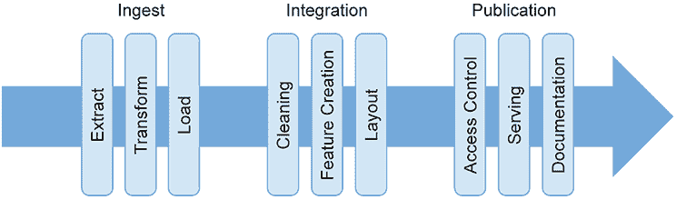

# 5 深入问题

本章涵盖：

+   获取和验证数据访问权限

+   回顾、验证和细化业务理解

+   开发用户体验和模型利用概念

+   建立和运行版本控制和管道系统

+   建立初始管道以向团队交付数据集

+   开始构建数据测试以使你的管道健壮

在第一轮冲刺中，团队建立并开始使用支持交付项目的基础设施，然后他们打开将支撑机器学习项目的数据。为了打开数据，他们将使用他们构建的基础设施（特别是管道和测试系统）。

## 5.1 第一轮冲刺待办事项

第一轮冲刺的待办事项包括本章（S1.1 - S1.4）和第六章（S1.5 - S1.7）中描述的任务。通过第一轮冲刺，你将准备核心机器学习活动，即使用机器学习算法创建和评估有用的模型。这项工作是要深入挖掘数据资源，并发展团队使用这些资源进行建模的专业技能和能力。你还需要建立支持性基础设施，将数据从其静止状态转移到你需要的地方。

表 5.1 第一轮冲刺待办事项

| 任务编号 | 项目 |
| --- | --- |
| S1.1 | 执行数据调查；扫描和检查适当的表以检查完整性、覆盖范围和质量。进行数据测试以解决偏差、中毒、质量、覆盖范围和标签准确性问题。编写并审查数据调查。 |
| S1.2 | 制定业务应用描述。开发应用程序用户故事待办事项（S2.1，S3.1）。与用户验证应用程序描述和用户故事待办事项。识别并验证机器学习模型性能要求。创建用户体验设计。 |
| S1.3 | 将相关数据聚合和融合成一个综合图。实施和管理数据管道。设计和实施数据测试。 |
| S1.4 | 委派并采用模型存储库。识别并记录所有用于机器学习管道的工件。 |
| S1.5 | 规划和设计数据探索分析（EDA）。编写并分享 EDA 报告。 |
| S1.6 | 根据新的理解检查伦理问题。 |
| S1.7 | 定义并实施模型基线。 |

完成这个冲刺的第一步是加深你对数据（以及团队）的理解。我们将在下一节中介绍这一点。

## 5.2 理解数据

你的团队已经准备好，资金到位，可以开始解决客户的问题。在冲刺 0 中，你获得了这项工作所需的数据资源的概述。现在，手头的任务是进行快速但系统的现有数据资源评估。

在本书中，这项任务被称为*数据调查*，但也可以称为检查或概述。这是一项快速、结构化的调查，可以产生你可以记录、讨论和分享的结果，以建立理解和洞察。最重要的是，这为数据中的明显问题创建了一个检查点。

数据调查票据：S1.1

+   执行数据调查；扫描和检查适当的表以检查完整性、覆盖率和质量。

+   进行数据测试以解决偏差、中毒、质量、覆盖率和标签的准确性问题。

+   编写并审查数据调查。

因为你在冲刺 0 阶段构建了关于数据的故事，所以团队有一个可以工作的地图，即使它被标记为“这里可能有龙！”但，正如他们所说，地图不是领土。现在，你需要结合你的数据故事和精心组建的数据忍者团队来寻找更多的龙。

可能你还没有组建团队、获取访问权限或建立基础设施来开始处理核心问题，比如处理数据、阐述对问题的理解或创建支持解决这些问题的基础设施。如果你缺乏必要的权限和访问权限，你将陷入困境；团队无法工作，也无法进步。可能有一些范围可以工作在用户体验（UX）上，但现实中，团队在这些问题解决之前几乎无法做出什么贡献。

### 5.2.1 数据调查

这本书推荐的数据调查有三个步骤。我们已经在第四章中完成了第一步，即数据故事。数据故事会激发并记录关于可用数据资源的建议和信息。现在，我们需要进行数据调查，这验证了数据故事，并提供了更多关于数据资产的非功能性和系统属性的信息。稍后，当我们把数据放在正确的位置时，探索性数据分析（EDA）将研究数据的统计特性。通过 EDA，我们可以找出数据真正能做什么。

数据调查的目的是减少对数据资源内容的疑虑。数据故事将充满关于数据源中包含的内容及其来源的假设和断言。现在，我们需要检查数据故事中做出的假设是否合理。

结构化和系统化调查的驱动因素是什么？首先，从时间和努力的角度来看，它相对便宜。为此需要编写的查询对任何数据工程师来说都足够简单，并且所有查询都应该运行得很快。这可能不适用于后续的 EDA 练习，几乎肯定不适用于建模阶段。那个阶段的工程可能需要很多思考，查询可能需要一段时间才能运行、测试和调试。现在在数据调查上投入的相对较低的努力可以避免以后的昂贵错误。

调查的第二个优点是，因为它简单、快捷且成本低，所以可以全面进行。相比之下，EDA 可以在有趣的数据集中揭示大量调查途径。团队可能无法全部完成；事实上，他们可能只有时间对数据集的相对较小部分进行适当的探索。

狭义的调查意味着潜在的致命问题可能潜伏未被发现，可能在项目结束时突然出现，破坏一切，并让每个人都感到尴尬。广泛的但浅显的调查让您和团队能够就集中精力进行深入且耗时的 EDA 工作做出合理的决定。至于调查本身，以下对数据的检查是一个良好的开始：

+   是否可以在客户的系统中识别和定位数据故事中描述的所有组件元素？如果最坏的情况下无法访问系统，是否可以使用技术支持人员或数据目录来提供确定数据存在的代理？

+   你能否获取今天或上周或上一个时期的记录数，以及能否获取数据资产的字节大小（Tb、Gb、Mb、Kb）？每个识别出的数据资源的尺寸和结构都应与数据生命周期相符的预期值相匹配。有时，在运营基础设施上无法执行表扫描以确定所有必需的记录是否存在。然而，较小的查询通常可以在不破坏数据系统的情况下进行。

+   根据客户的描述，数据中最老和最新的记录是否如预期的那样？

+   关键列中的最大和最小值，基本聚合（平均值、中位数）以及数据的范围是多少？

+   在数据集历史中重大事件（迁移、重新平台化、数据质量计划、联邦和集成事件）之前和之后的记录中，是否存在规模、格式或类型的更改？

要探索数据调查的想法，想象一个管理智能建筑的有说明性的项目。其中一个表可能包含来自大量传感器的温度数据，你和团队希望将其与阳光、建筑使用和气候数据集成，以创建建筑节能控制系统。如果团队可以访问良好的数据管理系统或数据目录，那么他们应该会发现所需的数据库和表已经就位，并且具有预期的记录数和存储大小。即便如此，交叉检查记录显示的内容也是值得的，以防元数据与实际数据存储不同步。

在接下来的几段中，我们将看到一个例子，说明通过简单的即席查询调查数据表中实际内容是多么有用。调查表明，数据与 DBMS 中报告的一致，并且可用于查询。我们将使用一些 SQL 片段来展示，但如果您无法阅读代码，请不要担心，文本解释了正在发生的事情。

这些调查就像一股意识流，当你发现异常并检查你对数据的理解时。重要的是要确保这四个要点被探测到：所有内容都在那里，大小合适，记录看起来像你预期的样子，并且任何重大问题都被揭露。你将需要使用以下三种类型的数据：

+   *数值字段:* 表示测量量，如尺寸、重量、密度、频率、波长、时间、浓度或温度。

+   *分类字段:* 表示应用于颜色、属、种、纹理或产品标识符等事物的标签。

+   *非结构化字段:* 表示图像、文本或声音。非结构化数据的例子包括产品描述、示例图像、序列或时间序列、社交媒体消息、客户支持电子邮件、交易员之间的对话或事件记录。

下一个部分提供了如何在数据调查练习中处理这些字段的示例。开始调查的一种常见方式是获取所有不同客户数据库中存在的所有数据表的列表。不幸的是，不同的数据库使用不同的工具和命令来执行调查。例如，我们可以使用以下命令访问 Oracle 数据库中的表：

```
select table_name from all_tables;
>TABLE_NAME | OWNER |TABLESPACE_NAME
TEMPERATURE_READINGS | SYS | SYSTEM
INCIDENTS | SYS |SYSTEM
```

此命令显示有两个可用的表：temperature_readings 和 incidents。Temperature_readings 包含数值数据，因此我们将使用这个作为调查中第一个提到的表。

### 5.2.2 调查数值数据

对于智能建筑，首先检查 temperature_readings 表中是否有正确数量的记录是有意义的。这是通过使用`select count(*)`语句来完成的。

```
select count(*) from temperature_readings
>262944000
```

结果是否有意义？我们正在查看大约五年的传感器记录，所以其中会有一个闰年。那么计数就是 5 * 365 + 1 = 1,826 天，所以 262,944,000 / 1,826 = 144,000。这是一个很好的整数。如果你想起了 1,440（24 * 60），那么几乎就像 100 个传感器在五年中每分钟都无故障地报告，完美地过了 24 小时！如果你稍微思考一下，这有点奇怪，但正因为如此，表中大约有正确数量的数据。

但还有更多需要检查的。让我们确保记录实际上是有效的。而不是使用`select count (*)`，我们将在下面的代码片段中使用`select *`，这意味着“获取一切”。当然，获取一切会非常繁琐，因为读取数千条记录可能会很痛苦。因此，我们将添加一个`limit 1`子句到语句中，这意味着“开始获取一切，但一旦你有一个就停止”：

```
select * from temperature_readings limit 1
>(21,2021,September,17,00:00:10,04.3,tx,op)
```

至少有一条记录是有用的。通常，与其设置`limit 1`，不如扫描一些记录（可能是 10 或 20 条）来检查数据。我们可以通过更改`limit`数字来实现（但你知道这一点！）。也许使用`where`子句来探测不同年份的记录也是明智的。希望数据模式是可用的并且被理解，如果不是，那么为什么不检查它并记录结果呢？

在温度读数查询结果中，21 是传感器编号，后面是年份、月份、日期和读数时间：`21,2021,September,17,00:00:10`。在示例中，结果末尾的*op*是什么（任何人都不清楚）；这在数据项目中并不罕见。然而，你发现的问题应该作为调查项添加到项目待办事项中。可能*op*代表*超出参数*，表明传感器损坏。或者，*op*可能代表*操作中*，表明传感器正常工作。关键是有人需要尽快检查这一点。

在数据库中已经确认存在有用的记录后，接下来需要检查的是其中是否有有意义的信息。这里的因变量是`温度`。在之前的记录中显示为 04.3。一个合理的检查是查看因变量是否真的记录在数据中。例如：

```
select count(*) from temperature_readings as tr where tr.temperature!="null"
>262583041
```

嗯，这意味着数据集中有 360,959（262944000 – 262583041）个 null 温度读数——大约 0.13%。这并不多，但这是团队需要知道的事情。

此外，有多少温度读数是 0 或者不是 0？记录的温度确实可能是 0.0°C，但在许多数据系统中，（不太）聪明的程序员会用 0 替换“坏”读数，以使他们的数据管道顺利工作。对 0.0 值的计数是值得做的：

```
select count(*) from temperature_readings as tr where tr.temperature==0.0
>1890030
```

再次强调，这个数字并不算不合理，总体来说，360959 + 1890030 = 2250989，所以不到 0.86%的数据可能是垃圾数据（然而，0.0 值可能是真实的！）。即使这些缺失值产生了病态的噪声集中，但它们的总体稀少意味着建模的结果不太可能完全无效。显然，某些场景可能会使这些问题更加紧迫。例如，当温度超过某个特定值时，可能只有 null 值出现（例如，传感器故障）。

根据表格的重要性以及构建调查所需的时间，可能你只需使用这样的简单查询就能达到目标，任务就完成了。也许项目依赖于许多具有许多因变量的表格，但并没有什么复杂的问题跳出来。如果是这种情况，那么从高层次上了解表格和数据库的质量可能是正确的努力分配。

另一方面，如果工作的规模更易于管理，你有足够的时间，或者如果数据质量的故事中有关数据质量的谨慎程度更高，那么深入挖掘会更明智。在这种情况下，你可能考虑以下行动（基于智能建筑场景）：

+   检查跨越 0 的范围是否按预期工作。有多少个负温度读数？是否应该有？

+   检查现实世界属性（如温度）的限制。有多少次读数超过 60°或低于-35°？

+   确定实体计数。例如，有多少条记录来自传感器 21？记录了多少个传感器？有多少条记录有“op”，以及该代码字段中有哪些不同的值？

此外，在你编译数据故事的工作中，你可能已经发现了数据中的一些已知问题。现在是时候关注这些问题并深入挖掘。再次看看智能建筑示例，让我们假设在第一年运营后，传感器设计发生了已知的变化。问题是，这个变化是否对现有的数据有任何影响？我们看到了数据集中有 360,959 个空值。它们按年份的分布如下：

```
select count(*),year from temperature_readings as tr where tr.temperature!="null" group_by year
>(0,0,0,0, 360959)
```

第一年的数据中有大约 0.5%是空的，而第一年是传感器更换的那一年。这是需要进一步调查并考虑建模时的事项。可能那年的数据应该完全忽略。数据调查的工作是找出需要进一步审查的数据问题，并告知团队他们可以期待的数据资源。调查显示他们所期待的是否存在。

之前的例子处理的是数值。当然，数值数据不会是你唯一需要使用的数据，那么在调查分类或非结构化数据时，你应该采取什么行动？

### 5.2.3 调查分类数据

对于分类数据，了解记录在各个类别中的分布通常很重要。在智能建筑示例中，有一个传感器类型代码，我们在运行查询时看到了它：

```
select * from temperature_readings limit 1
>(21,2021,September,17,00:00:10,04.3,tx,op)
```

未知的是 `op`，但 `tx` 是一种传感器类型。有多少种传感器类型？关于传感器类型的数据是分类的（制造商 ID），因此要了解它需要稍微复杂一些的查询，首先从 `temperature_readings` 表中获取所有不同的传感器类型，然后进行计数：

```
SELECT Count(*) FROM (SELECT DISTINCT sensor_type FROM temperature_readings);
>7
```

数字 7 足够低，值得列举它们：

```
select distinct sensor_type from temperature_readings as sensors;
>Sensors
A1
A2
Tp
Tn
Tx
Xr
UNKNOWN
```

UNKNOWN 的出现是我们需要调查的问题，包括不同类型的传感器。然而，此时我们可以停止这条调查线，因为 EDA 练习可能会投入大量资源进行进一步挖掘。记住，数据调查是关于建立需要进一步审查的数据的重要或困难之处，而不一定是现在就进行审查。

如果确定传感器类型很重要，那么在 EDA 练习中，我们应该查看每种类型的数量，每种类型产生多少不同的读数，不同质量的传感器对数据的影响，每个传感器的读数范围，每个类型产生的异常值，每个传感器记录的温度粒度等等。数据调查的目的是确定这些问题是什么，这是我们目前所做的事情。当调查被审查时，问题和问题可以被优先排序，以便 EDA 团队跟进。

### 5.2.4 调查非结构化数据

在调查中处理非结构化数据是不同的。深入研究一组非结构化项目的属性需要深度机器学习技术。我们将在第六章的 EDA 练习部分更详细地介绍调查非结构化数据，但这些方法通常过于复杂且耗时，不适合数据调查。在调查中，我们需要描绘出数据中可能潜伏的问题和问题。其中一些可能与团队开发的模型以及使用它们的应用程序无关。重要的是要知道它们在哪里，以便它们可以被调查和解决，或者被避免。

对于非结构化数据，重要的是要确定哪些有用的非结构化数据资源可用，并评估它们的质量。在智能建筑数据库中，有一个需要包含在调查中的事件表：

```
select count(*) from incidents;
>1781

select * from incidents limit 1;
>23-05-2021, CRITICAL, 360, "HVAC failure…", "affinity engineer..")
```

查询显示文本字段是事件描述和解决方案。让我们评估这些字段的质量：

```
select incident_description from incidents limit 5;
>"HVAC failure meant loss of cold air for floor 12 to 25",
"HVAC intermittent for several hours, users complaining",
"HVAC reported as making rattling sound",
"Loss of cold air on 5th floor, seems isolated",
"Users reporting excessive heat on 5th floor"
```

这些片段中似乎有潜在的有用信息。可能很难将其转换为数据，因为解析出问题发生在哪一层可能具有挑战性。另一方面，将这些事件与奇怪的传感器读数联系起来可能很容易。

通常，你会对更多的记录进行此类检查，因为很容易滚动浏览数十条或数百条记录，以查看它们是否（或没有）包含看起来丰富的信息。对于进行调查的分析师来说，检查有多少条记录为空或包含单词*NULL*也是正常的。快速检查也可能显示其他无用记录的指标（例如“。”或“n/a”），这些指标被用来掩盖其管理应用程序中的必填字段。

类似的方法也可以用于其他类型的非结构化数据。熟练的分析师可以快速从数据库中提取和渲染数百张图片，并扫描它们以查找问题。例如，100 张图片的选择中可能有 90 张只是蓝色的天空。这可能是正常和预期的，并且仍然表明有用的数据，或者它可能是一个问题。

快速在非结构化数据中找出规律性、模式和异常，可以让你提出更多问题，并更深入地挖掘数据。也许 90 张蓝天图像出现在分析师的查询中，因为数据库中存在某种怪癖，使它们随机出现在选择中。EDA 团队可以深入了解这个问题，并提供你需要向赞助商展示的证明，以表明是否存在问题。关键是，你将在投入大量时间和资源进行建模和评估活动之前完成所有这些工作。

### 5.2.5 报告和使用调查

在可以使用之前，数据调查需要被记录和审查。表 5.2 建议在调查报告中记录的项目。通常，会有许多页不感兴趣的结果，报告了具有正确记录数和良好完整性的表格的存在，例如，因此附上带有关键变化的封面页对调查很有用。这会让每个人都注意到在记录中发现的主要缺点。

表 5.2 数据调查报告内容

| 项目 | 备注（示例） |
| --- | --- |
| 数据描述 | 对数据是什么的描述（领域、源系统、规模、时间范围等）。 |
| 提供的列表表格 | 表格名称和属性列表。 |
| 对于每个表格： |
| 已知问题 | 将已知问题的描述与数据相关联。 |
| 实体数 | 如果可以实时计数记录，则从数据目录中获取。 |
| 样本实体 | 从表格中取出的新鲜样本。 |
| 具有 nulls 的记录数 | 可能关注感兴趣的属性。 |
| 具有零值的记录数 | 可能关注感兴趣的属性。 |
| 调查已知或已揭示的数据完整性问题的特定查询 | `查询 1``结果``查询 2``结果` |

调查报告对团队很有用；他们必须自己找到这些信息才能使用数据，因此可以节省重复工作。它还创造了关于数据属性的话题点。此外，随着时间的推移，随着不同的人对数据提出怀疑和好主意，将添加更多查询以调查数据的完整性。逐渐地，数据资源成为项目的一个描述良好的实体。

然而，调查最重要的用途是允许团队确定在 EDA 练习期间在哪里投入精力。调查提供了一张地图，显示了在构建模型之前需要解决哪些基础设施问题。调查文档也成为开始数据测试的便捷方式。（数据测试对于支持建模和随后的生产活动中的数据管道的实施是必要的。）最后，调查可能已经发现了危及项目的数据问题。如果是这样，那么将它们列入风险登记册，并让客户了解这些问题。

## 5.3 商业问题细化、用户体验和应用程序设计

从数据调查过渡到冲刺 1 的下一步是更深入地理解商业问题。记录和理解商业问题提供了信息，使团队在项目和数据基础设施上的工作变得高效、有方向和有目的。

商业问题细化票据：S1.2

+   开发商业应用程序描述。

+   开发应用程序用户故事待办事项（S2.1，S3.1）。

+   与用户验证应用程序描述和用户故事待办事项。

+   确定和验证机器学习模型性能要求。

+   创建用户体验设计。

正确理解业务是一个艰巨的挑战，可能需要数月或数年。技术团队通常只能逐渐发展对业务需求和约束的深刻理解，并且他们需要很长时间才能真正看到最重要问题的核心。然而，确定团队正在解决的商业问题必须完成，并且团队必须对此形成观点，以便取得成功。为了加速收集和记录核心商业问题，有必要采用一些策略和技巧。

在项目前期，你构建了项目假设，在冲刺 0 阶段，你将其转化为项目路线图。这些明确了你团队交付工作的授权，并且客户也进行了审查。此外，在构建项目假设的过程中，你创建了用户和模型故事。这些输出对于开始创建有效的应用程序设计的工作是有帮助的，但还有更多的工作要做！

为了取得进展，团队需要利用他们目前拥有的信息与下一层的专家和用户交谈。敏捷实践者说：“故事卡是进行对话的承诺” [3]。在项目前期阶段编制的用户故事可以进一步发展和正式化为故事卡。*故事卡*概述了应用程序的概念、受其影响的人以及如何影响，以及故事对组织的作用。表 5.3 显示了典型故事卡的内容。

表 5.3 机器学习项目故事卡的内容。注意最后的五行，它们确定了如何创建此内容。

| 项目 | 备注（例如） |
| --- | --- |
| 概念 | 对项目解决的最高级别区域的简单解释；例如，客户服务或库存管理。 |
| 利益相关者列表 | 乔·博客斯（IT），山姆·史密斯（采购），亚瑟·阿斯克（物流） |
| 商业优先事项 | 商业关注的重点领域列表：客户服务提升、收入、成本降低、增长、多元化、资本效率、现金流、竞争、社会责任等。 |
| 商业影响声明 | 解决方案如何创造价值；它为客户解决了什么问题。例如，这项分析为初级产品部门提供了有价值的见解。 |
| 对商业优先级的影响 | 陈述影响声明与公司商业优先级之间的联系。例如，这些见解指导采购和制造如何更好地推动收入和改善资本效率。 |
| 数据资源 | 识别系统将用于训练和生产的数据资源。描述数据如何在生产中到达模型。 |
| 模型概念 | 描述将要使用的模型，它做什么，以及为什么预期它将有效。 |
| 功能/非功能需求 | 说明模型在其工作中必须有多好。模型需要多少吞吐量、延迟和可用性？提供服务需要多少成本？ |
| 如何使用 | 解释效果将如何作为一项商业活动实现。将如何处理模型的信息或系统的决策？还通过可视化仪表板为决策者提供信息。 |
| 问题与挑战 | 记录可能导致系统实施失败或使其无用的因素。 |

记录此类组织方面的内容提供了背景并解释了故事的目的。此外，记录模型的数据以及为什么认为模型将有效或可以工作，表明将要进行的工作是有目的的。团队看到了一种可行的方式来应用机器学习（ML）以实现所期望的商业价值。

故事卡的最后三个组成部分描述了模型的约束。功能和非功能需求明确指出模型需要达到的性能，以便对客户有用：

+   功能需求典型地代表了模型产生有价值分类或预测的能力。

+   非功能需求明确指出模型需要快速、经济和稳健地执行。

卡片的下一部分要求记录有关如何使用模型的信息。这是现在必须明确的事情。如果业务流程中没有点可以创建、获取和使用模型输出，那么即使模型完美，也将毫无用处。最后，应考虑并记录问题与挑战。是否存在任何否定模型在业务流程中价值的因素？例如，如果模型为用户提供了一些建议，但当用户最需要这些信息时，他们通常很忙，那么就需要工作来使模型输出有效可消费。

收集填充故事卡所需信息的流程可能既耗时又具有挑战性，因此优先排序很重要。因为你正在从事一个机器学习项目，你需要特别强调故事卡的一些元素。例如，卡片的数据资源部分是关键，因此将讨论中提到的内容与数据故事和调查中已知的内容联系起来是有用的。在开发这些卡片时确定的问题可以有效地输入到调查文档中，并进一步用于澄清的 EDA。

除了强调故事中的数据方面，模型的功能性和非功能性性能要求对我们将在第七章中开发的设计有重要影响。这包括：

+   *所需的延迟和响应性:* 模型需要多快才能从数据中产生预测，以便它是有用的？

+   *模型预期的吞吐量:* 每秒或每天可以处理多少案例？

+   *预期的使用模式:* 它将以批量模式运行（例如，在夜间更新数据库中的数百万条记录）还是在线运行（例如，响应网站上的用户）？

+   *所需的鲁棒性:* 模型的失败可以容忍多频繁？

+   *模型的准确性:* 不同利益相关者认为一个有用的模型应该有多准确？

    模型准确性是一个复杂的概念，为了正确评估和衡量它有很多工作要做（参见第八章，其中对这一问题的长篇讨论）。现在，了解团队面临的挑战的深度很重要。

+   *错误数量:* 不同用户可以容忍哪些类型的错误？哪些错误会侵蚀对模型的信心？错误分类的误判成本与误报成本相比如何？（例如，如果模型在样本中错过了一种疾病的病例，那么与模型错误检测疾病相比，成本是多少？这些错误将产生什么后果？

+   *性能标准:* 系统的性能与业务价值有何关联？在什么情况下，系统的性能（或缺乏性能）会破坏价值？是否存在任何阈值，当边际效益递减时开始发挥作用？何时性能改进不再重要？

对于每个创建和收集的故事，你需要考虑两件事：验证和交互。首先，故事卡需要经过验证。你需要与受影响的人一起运行它，并确保它反映了他们的现实概念。此外，问问自己，这些是应该花钱的故事吗？严格优先排序和修剪故事，以了解创造价值的最低集合。

对开发出的模型的需求也很重要。对模型提出挑战性要求的故事可能会很昂贵。如果可能的话，消除它们可以使项目更具可行性。问题是，“这是否重要且有价值，足以证明将项目集中在特定故事的要求数据上？”

其次，你们团队的用户体验专家需要提出关于用户如何与系统交互的想法，以及最终将如何与支撑它的模型交互的想法。在项目这个阶段，团队应该有一个良好、尽管仍然必要模糊的想法，即最终产品应该是什么样子。现在开发用户体验概念的好处是，通过制作线框图和模拟屏幕，你开始将概念为消费者以及团队带来生命力。这创造了参与感，并建立了一个共同的理解，即可能实现什么，它将做什么，以及它将看起来如何。（第九章对可以使用机器学习的应用程序的风格和结构进行了广泛的讨论。）

这些发现可以写成应用程序描述，并与项目利益相关者进行审查。这创建并记录了关于应用程序可能看起来如何以及可能如何表现的一致意见。你在报告中提取的要求也需要与建模团队、数据科学家和数据工程师进行验证。可能地，这为风险登记册创建了红旗和风险，或者在同意团队可以交付的要求时，与用户达成绿灯和谈判点。它解释了哪些故事是包含在内的，哪些故事是排除在外的，以及模型需要做什么来交付它们。

在这一点上，适当地对敏捷性发表评论是合适的，比如“这是一个敏捷项目。”所选的故事集和预期的应用程序仍然是讨论点。由于模型尚不存在且可能永远不存在，因此它们还不能具体达成一致。相反，这是一个协议，即这是团队将构建的第一套东西；如果一切顺利，那么这些就是花费客户资金的最佳选择。如果无法从数据中提取出性能模型，那么故事卡需要重新洗牌，你需要另辟蹊径来解决客户的问题并创造商业价值。

一套清晰的描述建模价值和方法的故亊，为从项目中开发有用的输出设定了场景。为了支持这一点，还需要做更多的工作。下一个必须解决的问题是要开发第一套数据管道。该管道将原始数据转换并移动到团队将用于探索和操作以进行建模的环境。

## 5.4 构建数据管道

数据管道基础设施是机器学习项目的生命线。有用、干净数据的可用性以及能够快速响应变化或新结果进行数据转换和丰富的能力，具有巨大的促进作用。拥有灵活且易于管理的管道基础设施可以使团队更高效，并能更好地响应项目需求。重要的是，它有助于他们在事情出错时应对，如果方法和算法没有达到预期效果。任务 S1.3 定义了这一阶段需要完成的工作。因为这项任务将数据管道交付给团队的开发环境，所以在冲刺 1.3 中需要复制此管道或将其用于测试和生产数据流的重用。

数据管道工单：S1.3

+   将相关数据聚合和融合成一个综合的图景。

+   实施和管理数据管道。

+   设计和实施数据测试。

数据通常分布在复杂的容器、数据库、数据集市和数据仓库生态系统中，这些系统跨越内部网络、云和各个组织。管理和操作这些数据资产集合可能会迅速变得极其复杂。

在第六章中的 EDA 练习之前，团队需要建立一个基础设施，使他们能够快速方便地检查和处理数据，并且他们希望调查结果可靠且可重复。然后，这项工作可以在此基础上构建，以创建一个系统，将可用数据提炼成可以用于训练和测试模型的格式。通常，这意味着使用一系列聚合和转换来将许多（可能是数百个）数据资产减少到一个单一的表格或相对简单的记录流，以便供少数算法消费。数据需要重新平衡，以应对现有项目类型的不均匀分布，从而通过机器学习算法提取出稳健的模型。

对于非结构化数据，这通常需要将其转换为标准格式或大小，对于损坏的项目，需要过滤和扭曲。数据增强是一个使用转换和修改来创建训练示例的过程[5]。

在开发过程的后期，团队扩展管道以服务于数据科学家想要使用和评估的算法。随着模型的测试和比较，可以尝试新的操作来改进和调整结果。构建数据基础设施以适应这些新增和更改对于提高敏捷性至关重要。然而，在团队达到这一目标之前，他们需要汇集包含原始信息的表格，并以可消费的方式提供。任务是：

+   创建一个实时且可维护的资源。可以使用此资源来处理最新数据，并从特定的检查点重新生成过去的结果。

+   识别并处理源数据中的任何问题。这为项目的下一阶段奠定了坚实的基础。

+   创建一个反映其所代表领域现实情况的资产。

管道必须支持所有必要的处理阶段，以实现这三个目标并创建一个可用的训练数据资源。图 5.1 展示了支持 ML 项目数据工程所需的过程概览。图 5.1 中的过程有不同的名称，并且通常以不同的细微差别和阶段划分来呈现。最熟悉的一种框架是在数据工程背景下 ETL（提取、转换、加载）。这里呈现的过程强调了 ML 项目的特定要求。从图 5.1 中，你可以看到数据必须：

+   从其来源摄取。这些可以是来自 RabbitMQ 或 Kafka 等来源的数据流，也可以是存储为 XLXS、CSV 或 Parquet 格式的数据文件。

    一个常见的摄取要求是使用 SQL 查询从多个表和数据库中提取数据。另一个摄取要求是将来自不同基础设施的数据带入目标基础设施。通常，数据是从不同的云环境、SAS 应用程序或本地数据存储带入云基础设施的。一旦到达那里，它就可以方便地由云环境中通常按需提供的 ML 处理设施进行处理。然而，需要注意的是，与特定数据集相关的限制性安全要求可能会将数据从不同的环境驱回敏感数据所在的本地基础设施。

+   一旦数据被摄取到目标基础设施和用于处理它的数据引擎中，就必须对这些数据进行操作和布局，以便用于创建模型。有时这一步被称为*集成*，因为通常的要求是创建一个可以传递给 ML 算法以创建模型的单一表。然而，通常更好的做法是创建中间表和数据存储，将获取的数据以方便和可访问的形式呈现给建模团队。这种数据的操作包括清洗它并从数据的不同方面创建特征。

+   在为建模团队布局数据后，确保数据可以被团队的正确成员适当且容易地访问是很重要的。许多基础设施的 IAM 框架可以用来提供这种类型的框架，确保只有拥有正确凭证的成员才能访问资源。

    除了访问控制之外，另一个要求是设置一个服务系统来适当读取数据。这可能是一个 SQL 查询、对大型数据文件的访问，或者是一个团队用来请求训练数据、测试数据或数据流的 API。一个很好的做法是提供文档，让建模团队能够从管道创建的资源中自助服务。



图 5.1 使用开发环境数据管道基础设施提供的数据处理需求。这为第 2 个冲刺及以后的机器学习建模团队提供了数据资源。

在这个阶段如果没有避免，有两个陷阱可能会导致机器学习项目出现严重问题。首先，从各种来源构建数据集可能会造成统计问题，其次，未能以工程问题的严谨方式处理这项任务可能会造成技术债务，并在后期使团队陷入细节和困难的泥潭。下一节将讨论当将来自多个来源的数据整合以创建机器学习系统的训练集时可能出现的统计问题。

### 5.4.1 数据融合挑战

一种相对较新的实践是从多个数据源构建建模数据集，以构建数据图。传统上，统计学家为了特定目的使用单一过程（调查或抽样方案）收集数据。为了复制或验证先前的研究，进行了独立实验以创建和收集数据。元分析被用来结合多个现象的研究结果，以获得对结果的更大信心。尽管检索和使用他人的数据困难且昂贵，但普遍认为，在获取新的原始数据时，这种方法证明更容易且更富有成效。

数据存储和可重复使用以及重新定制的背景是新的。从 20 世纪 70 年代开始，数据集被系统地准备并存储在数字档案中，以供复制和重用，但当时没有处理它们的计算资源。尽管如此，统计学家在*数据融合*的名称下研究了重新组合数据的过程[1]。如今，数据被获取和重新组合以产生新的见解是常见的，但这个过程存在一些问题。

将特定人群的一部分数据与一般观察数据相结合可能会引入偏差。你可以收集数据作为实验的一部分，你使用这个实验来研究人群的某些部分以检测特定效果。例如，你可能使用测试阴性方案来确保对照组和目标组来自人群的同一部分。这些研究产生了受控、高质量的数据集，将它们与观察数据相结合来模拟某些人口层面的行为是有吸引力的。不幸的是，控制一个变量相对于一组混杂因素的偏差（干扰结果的噪声）的筛选方案可能会引入其他变量的偏差。

引入偏差的最显著方式之一是我们从不同的时间段收集数据，并将其视为单一资产的一部分。数据收集的时间通常是隐藏的特征；也许数据集是从操作快照中创建的，而这些快照本身包含来自不同时间范围的数据记录。例如，你可能会收集多年的零售数据快照，并将其存储在每年的同一日期。在初次检查时，这看起来可能是一致的，但由于快照的日期（例如，一年的 4 月 1 日可能是星期二，而下一年的星期五）会变化，主要交易日可能会从一个时期转移到另一个时期。在消耗这些数据的建模过程中的不良实践可能导致模型存在重大扭曲，并在生产中无法正常工作。

数据集中的稀有实体可能由于随机机会在样本中不成比例地出现而造成扭曲，或者由于它们缺失于数据资产中而给建模造成盲点。此外，你可以过度代表稀有实体，因为它们在数据中比普通实体更引人注目，并且对客户组织来说更重要。例如，在犯罪数据库中，重复和严重的违法者不成比例地出现，因为小违法者对警方没有兴趣。警方不太可能记录小犯罪，但这并不意味着它不常见。从警方记录中构建违法者档案并不能创建所有违法者的代表性档案，而只是警方感兴趣的违法者的档案。这可能导致使用这些数据预防犯罪的效果不佳，因为预测为成功的干预措施可能不适合大多数犯罪分子。

传感器数据集可能包含不同质量的数据。事实上，*相同*的数据集可能包含不同质量的数据。例如，你可能希望每分钟采样一些传感器，而每小时采样一些传感器。一些调查数据可能有 1-5 范围内的协议值，而另一些可能有 1-10 范围内的值；一些表格可能包含一个区域的平均温度，而另一些可能包含该区域内的温度样本。

在这个层面上理解数据源的语义对于决定是否将它们组合起来有意义和有用至关重要。规范化错误会对从后续融合数据集中得出的模型产生重大影响。盲目地将数据拼凑在一起可能不是一个好主意。对领域有深入的理解并思考可能导致数据集分布扭曲的问题是没有替代品的。幸运的是，你的团队已经到位，你所做的工作提供了关于这些潜在扭曲的信息和意识：你需要证明这些过程是建立在坚实的基础上并反映现实的。至少，检查以下内容是值得的：

+   数据实体是在相同的基础上收集的，无论是基于原则的选择还是一般观察。

+   没有隐藏的变量（如罪犯身份或收集时间）隐藏扭曲。

+   捕获实体行为的传感器在时间上没有数量上或质量上的变化。

有时会遇到违反这些严格规定的数据是有用的，你将能够使用这些数据开发出有价值的模型。如果是这样，那么你故意运用你的判断力并决定这是正确的，而不是依赖盲目运气是非常重要的！

### 5.4.2 管道丛林

现在，让我们回到在构建项目数据基础设施时可能出现的第二个挑战：没有以纪律的方式将任务 S1.3 作为一个工程问题来处理。

机器学习项目中常见的疾病是管道丛林的出现[4]。这导致了显著的技术债务，使得项目难以管理，在技术和功能上都不可靠。管道丛林出现在那些数据转换和聚合的粘合代码以临时方式构建的项目中，没有考虑到管理和维护。没有团队愿意创建管道丛林，但它们随着时间的推移逐渐出现，悄无声息地逼近团队，直到他们突然发现自己陷入复杂之中。这个过程让我想起了关于破产的著名引言：

你是如何破产的？两种方式。逐渐地，然后突然地。

——欧内斯特·海明威，《太阳照常升起》

一些常见问题可能导致管道丛林的出现。在某些情况下，团队需要处理专门的数据基础设施来应对项目中使用的数据的规模、速度或特殊属性。例如，旧有的专有数据仓库有时以晦涩的二元格式存储数据，没有其他专有导出工具的情况下，可能很难导出数据。处理这些工具的技能可能超出了你的项目团队的能力，你可能需要与客户组织的专家合作。

专业的工具可能是必要的恶行，但它们可能是唯一能够以可接受的性能特征使数据可用于建模或满足软件许可条款的方式。当使用专业或专有工具和适配器时，将它们包裹在标准管道工具中是一个好主意，确保管道被集成到通用基础设施中。因为包装和集成工作可能对团队来说是一个额外的开销，所以可能会诱使你通过一次性的过程来获取所需的数据，但请警告：那样会导致混乱。正确地做意味着你能够控制数据流动，并能够根据需要发现和解决问题。

另一个驱动因素是未能像其他代码一样记录和版本控制管道。数据管道可能成为团队将做出的最重要的代码投资之一，因此要像对待它一样。管道需要根据其工作方式来记录，但它们也需要可被发现且广为人知。如果你使用 Apache Airflow 等管道管理和调度工具，那么管道的发现和识别将为你处理。要警惕那些意外被忽略的异常或特殊情况。确保它们被控制住；例如，通过将它们包裹在一个单步管道和标准工具中。单步管道调用用于该基础设施组件的工具。然而，它将从管道基础设施中进行调用。

最后，就像其他代码管道一样，管道步骤必须被监控和测试。每个步骤和管道都应该报告其何时被调用以及是否成功。可以通过创建计时器或超时来断言失败条件，当操作或管道运行时间过长或完成速度可疑地快时，这些计时器或超时会被触发。设置这些限制可以捕捉到数据测试无法捕捉到的问题，因为有时数据测试并不像应该的那样好。然而，通常数据测试不会在过程的技术执行中捕捉到问题。例如，当满足某些条件时应该附加的数据集可能看起来通过了分布或完整性的测试，即使调用数据库检索附加数据时失败。然而，因为失败发生得非常快（因为连接很小）或经过几次超时（因为无法建立连接），这应该让团队意识到一个问题。

### 5.4.3 数据测试

除了构建管道测试，团队还应该在数据测试上投入。然而，数据测试也存在一个需要跨越的陷阱。数据测试可能成本高昂且运行缓慢。这并不令人惊讶，因为通常数据量很大，测试可能涉及大量的交叉比较，这些比较在计算上很昂贵。如果你负担不起过于昂贵或会导致管道停止运行的数据测试，那么它必须被战略性地部署。

数据测试的级别和目标是判断问题，但显然，对于正常软件中的测试，实施的高质量测试越多，团队对其工作和结果就越有信心。常见的数据测试类型包括：

+   *重复测试:* 数据管道的一个常见问题是来自遇到数据泄露问题的源的数据重放，然后被编程从头开始。重复也可能来自复制数据的代码中循环条件中的错误（例如，循环变量在循环的最后一次迭代或某些条件之后没有更新）或手动剪切和粘贴错误。请注意，你可能甚至没有意识到在数据的故事中，有人在数据库中剪切和粘贴，但这经常发生！

+   *体积测试:* 随着时间的推移，数据量应该是可预测的。利用这一事实来检查到达的数据和预期实现的数据。尝试确定合理范围内的界限和下限。

+   *输入数据中的先决条件测试:* 这种测试确定任务输入是否符合预期。此类测试的部分和不完整的列表包括测试所有预期的列都存在，测试列包含相同数量的非空数据点（例如，如果传感器 x 关闭，则读取 x 为 null），以及统计测试表明数据的分布接近预期（例如，数据的标准差在某个界限内）。

+   *后置条件测试:* 此测试确定产生的结果是否符合预期。至于先前的先决条件测试，你可以对数据管道的输出建立一些认识。

+   *从先决条件到后置条件的约束测试:* 检查这些条件之间预期的关系是否成立。例如，所有非空先决条件都有一个非空的后置条件，或者预处理和后处理数据中 0 的数量相同（如果这是预期的）。

+   *性能测试:* 如前所述，数据管道步骤可能具有非功能性指标：例如时间、内存、成本和调用次数。这些参数对于监控开发基础设施很有用，对于监控部署的机器学习系统中的生产基础设施也非常重要，但它们也可以用于测试。这些测试可以是绝对的（例如，任务应在少于三秒内完成），也可以是相对的（任务应在正常完成任务时间的两个标准差内完成）。在最坏的情况下，由于非功能性压力或顺序错误，管道中的步骤可能无法完成，从而造成重大损坏。

+   *对极端值、空值、NaN、大数、小数和 0 行为的反应测试*。

理想情况下，测试基础设施应集成到监控系统。系统级故障（如数据库不可达）的记录以及通知和警报的分发至关重要。自动警报意味着基础设施团队能够迅速响应并解决问题，以免机器学习团队不得不放下工具去打乒乓球。

## 5.5 模型存储库和模型版本控制

任务 S1.4 要求团队构建模型管理和版本控制基础设施。这允许敏捷且受控地开发和部署在冲刺 2 中开发的机器学习模型。

模型版本控制工单：S1.4

+   授权并采用模型存储库。

+   识别并记录所有工件以用于机器学习管道。

在系统开发过程中，预计每个模型都需要进行大量迭代以找到适当的训练过程、超参数、算法、架构等组合。为了管理典型迭代建模过程产生的实验，您需要实现模型存储库。存储库记录了特定迭代或实验期间创建的特定模型，参数（数据、特征）、超参数、算法、架构以及其他模型组件，以及此迭代的评估指标。

模型选择及其决策背后的信息演变是决定模型未来行为以及开发系统可管理性的重要因素。记录模型的演变可以告知对系统未来稳定性、故障和盲点的调查。通过维护这些信息，系统变得可问责，您可以使用事实证据记录您的选择。您将使用模型存储库来记录以下内容：

+   每个模型的身份，即链接到用于测试和生产（但理想情况下，两者都使用）的二进制或声明性规范的名称。

+   在开发过程中为模型创建的评估结果。

+   在资格认证和选择模型期间为该模型创建的测试结果（如果有）。

+   模型使用的所有技术工件及其开发中使用的工件列表（例如，基础模型或特征）。

+   数据管道的状态（运行或不运行）以及用于提供训练、验证和测试集的数据管道标识符。

+   在使用管道构建训练、验证和测试集时创建的测试结果和监控信息。

除了实现模型存储库之外，团队必须承诺使用它。建模的核心任务尚未开始，但早期实验、非正式测试和基线开发都是应该捕获的信息，因为这为项目的其余部分设定了背景。

### 5.5.1 特征、基础模型和训练方案

提供一个模型版本控制系统非常重要，因为它为团队在生产中构建、评估和集成模型时提供了控制和自动化。如前所述，团队在项目中可能会使用其他工件。处理这些工件的基础设施对于项目的顺利交付也同样重要。

你应该明确记录和跟踪团队使用的所有工具和组件。编辑器、解释器、编译器、库和虚拟机都需要被记录并经客户批准。许多客户都有针对软件项目库和工具的验证和选择架构合规政策；这些政策几乎总是有例外流程，以便在必要时采用新工具。你不能规避这些流程，所以利用它们来确保你的工具集符合规范，或者正式将其注册为例外。

可重用基础模型的开发创造了一种新的工件类别，这对于机器学习项目至关重要。检查许可条件并确保客户知道所使用的模型是好的，而且它必须在他们的存储库和目录中注册。同样重要的是确保你在所有流程和管道中使用正确的基础模型版本。使用一个模型生成嵌入，然后尝试使用不同的模型进行匹配通常会产生较差的结果。使用 MD5 [2]之类的哈希函数为模型创建一个唯一的标识符，并将其嵌入到模型服务代码中的加载检查，可以保证在生产、开发和测试环境中都使用正确的模型。

当然，团队将使用特定的库和工具来提供从数据中提取模型的算法。版本控制再次显得非常重要。注意团队是否采用夜间构建或无视（或无知）公司政策下载构建版本等异常情况。预期构建版本在生产前会被安全团队明确检查，并理解一个恶意构建不仅可能导致公司对你进行处罚（或你的总结性解雇），还可能导致依赖性问题，从而阻止部署。

另一个可能出现的陷阱是测试构建以避免与许可成本相关的问题或弥补测试中特定硬件的缺乏。例如，用于测试的虚拟机可能省略浮点计算，以便快速完成集成或系统测试。这对于部署和平台团队来说是一个正常的事情，但如果有测试虚拟机或库意外地进入生产构建，那么生产系统将无法工作。

### 5.5.2 版本控制概述

机器学习是一个快速发展的领域，支持机器学习系统的新组件正在迅速出现，因此不可能列出所有需要版本化的项目来构建一个坚实的生产系统。然而，在项目中实施一些系统性的测试和流程来控制版本化是有帮助的。您可以使用以下测试来建立对系统版本化的信心：

+   使用校验和来确认工件中存在正确的信息。

+   使用签名二进制文件来确认正在使用正确的所有者和来源的工件，并且它可以被信任。

+   从二进制中采样已知值，然后检查它们是否正确。

在许多项目和环境中，采取这些步骤来识别、注册、保护和验证项目的依赖项可能看起来有些过度。但请放心，这确实是值得的！这使问题能够被追踪、及早发现并迅速解决。它还将允许顺利实施快速有效的生产所需的 CI/CD 流程。像 Jenkins、GCP Cloud Build 和 AWS Code Build 这样的构建管理系统需要用所有组件的正确版本进行填充，以便将正确的系统配置部署到生产中。对组件版本的良好的控制允许快速更新和交付配置。如果您手动完成这项工作，那么请预期进度会非常缓慢。

在数据管道、数据测试、模型和特征存储被团队采用并启动后，团队现在可以深入挖掘数据。一旦团队可以轻松地操作现有数据，他们就可以真正地感受到他们为建模所拥有的数据。现在，一切准备就绪，可以开始进行 EDA 工作，然后是模型开发。

本章涵盖了团队在交付项目之前需要做的工作，以应对他们将要面临的真实技术问题。我们讨论了绘制数据资源图、理解需要进一步探索和检查的问题、建立对可解决业务问题的洞察、建立支持数据资产探索及其在建模中使用的数据管道，以及启动模型版本化基础设施。在第六章中，我们将回顾 1 号冲刺的其余部分，包括深化团队对数据集统计特性的洞察的 EDA 过程以及第一个基线机器学习模型的开发。在第六章的结尾，您将找到涵盖 1 号冲刺所有工作的《自行车店》叙述。

## 摘要

+   数据调查确定预期的数据资源存在，并且具有允许团队有意义地工作的完整性水平。

+   通过开发故事卡和 UX 原型，您将更深入地理解并就项目的方向以及项目假设核心的机器学习建模活动的需求达成一致。

+   需要建立、委托和采用（开启并使用）项目开发所需的所有工件（模型）的存储库和版本控制基础设施。

+   系统性地构建数据管道基础设施，以支持项目后期建模的敏捷开发。该管道必须提供支持数据摄取、转换以供使用以及为建模团队提供访问的功能。

+   仔细记录项目使用的数据资源的数据收集动机和方法。

+   建立数据测试和数据管道测试的基础设施，以确保在模型开发和生产过程中，团队使用的是正确的数据。
