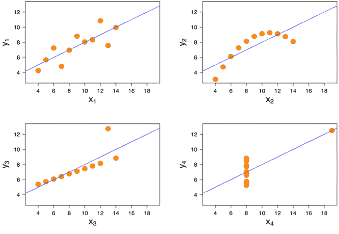
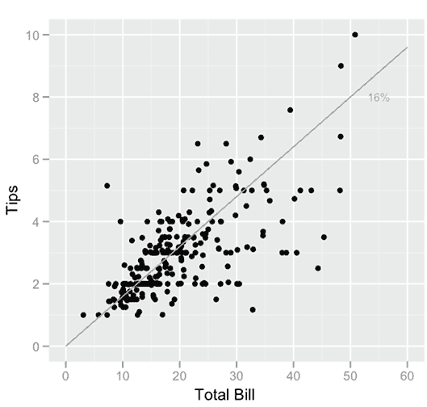
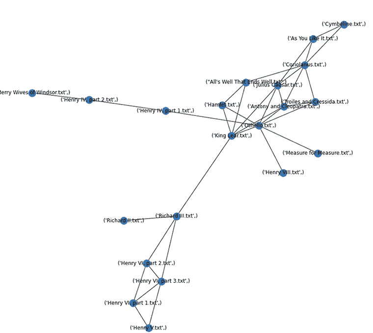
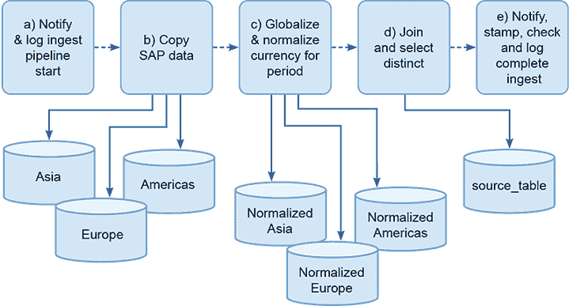
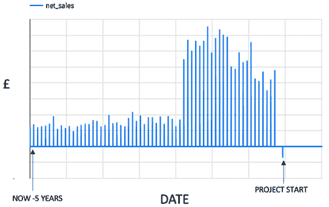
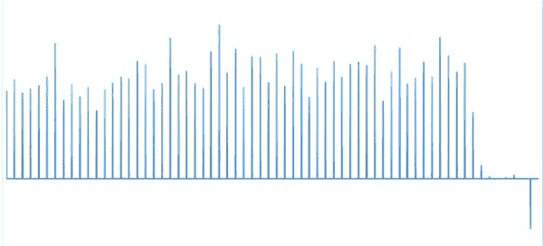
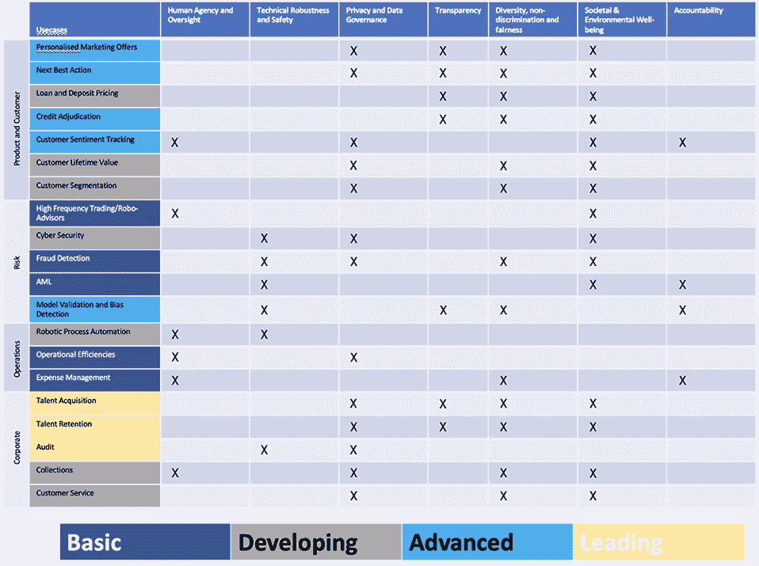

# 6 EDA、伦理和基线评估

本章涵盖：

+   执行 EDA 以发现数据的统计特性

+   使用基础模型探索非结构化数据属性

+   检查项目的伦理、隐私和安全方面

+   构建基线模型以获取关于成功潜力的反馈

+   为估计更复杂模型的性能提供支持

在第五章中，我们学习了获取团队可以用于建模的数据资源所需的工作。现在，团队可以深入数据，了解其特征，并判断可以用它做什么，不能做什么。为此，团队需要以结构化的方式工作，探索数据，使用各种工具进行调查，并记录和分享学到的见解。

这项工作的重要部分是让团队重新审视项目周围的伦理问题。这是至关重要的，因为伦理问题可能会关闭调查和开发路线。在浪费客户在永远不会被使用或开发的开发上的钱之前，确定这是否会发生是很重要的。

最后，团队和你将开发基线模型，这些模型展示了性能底线，你可以通过现成和快速实施的方法来创建这些模型。这样做是为了评估更多耗时和复杂的方法的可能性，并确保这些方法能够提供证明其使用的价值。

## 6.1 探索性数据分析 (EDA)

一切都准备就绪，你可以开始处理你的待办事项中的 S1.5 票据。

EDA 票据：S1.5

+   规划和设计 EDA。

+   编写并分享 EDA 报告。

到目前为止，我们已经构建了一个关于团队将使用的数据的叙述，并且团队已经确认了它的存在，并且看起来符合预期。我们已经获得了系统访问权限并设置了数据管道基础设施。现在可以使用有关数据集和访问它们的凭证，将数据带入可以进行分析的地方（或者如果事情很困难，多个地方）。如果数据处于适合分析的状态，下一步就是使用分析方法系统地了解我们所拥有的以及我们可以用它做什么。

这个过程通常被称为探索性数据分析 (EDA)。这种实践是在 20 世纪 70 年代（数据时代的黎明）发展起来的，由约翰·图基 [12] 推广。最初，EDA 的重点是使从业者能够从全面端到端的研究工作转变为使用“发现”的数据。如今，我们以各种方式使用 EDA，这里作为机器学习建模练习的前奏。

### 6.1.1 EDA 目标

随着团队准备查看数据的统计特性，可能会出现关于可能被机器学习算法消费的信息的理解。EDA 的核心是一些简单的问题：

+   单个数据示例是否有意义？是否真的存在与客户数据集中最极端示例相似的客户？客户可能每周有数百笔交易，或者可能大多数客户交易次数很少，甚至连续几周没有交易。如果你找到了典型客户，那么这位客户的收入和交易数量看起来是否合适？

+   实体的分布情况如何？这个问题建立在理解数据中的典型实体和最极端示例的基础上，然后使用这些信息来决定数据整体是否合理。数据范围内是否存在无法解释的空白或死点？是否存在应该存在但具有令人惊讶值的空白？典型的例子是假日季节和周末出现在数据集中。如果零售商报告圣诞节当天的客流量很高，那么需要解释为什么；至少，值得检查业务利益相关者是否认为这合理。

+   数据项的汇总统计数据是否有意义，并且与数据背景相关吗？例如，交易表中的总交易额是否等于公司的总收入？每个日历期间的总交易数量看起来是否合适？

+   数据内部的关系是否符合预期？例如，在人口统计数据集中，是否存在比父母年龄还要大的孩子？在一家增长中的公司中，过去是否有某个时期的收入比当前交易期还要多？

EDA（探索性数据分析）的哲学是让数据自己说话，但不幸的是，时间正在流逝。如果你有时间，对数据进行开放式探索是一个强有力的方法，但在紧张的时间表上很难做到。相反，利用从数据故事和数据调查中提出的大量问题，你和你的团队可以规划一个结构化的练习，以发展你们所需的理解。

将你想要进行的特定 EDA 活动列出，包括活动、方法和你这样查看数据的原因，这是一个好主意。然后，记下你期望找到的内容。通过这样做，你创建了一个记录，显示了所采取的专业方法。与团队一起工作，你还将能够有效地优先排序和控制需要完成的工作，确保你将资源和时间集中在高优先级的调查上。

除了发展对数据的总体理解外，EDA 练习还能使团队能够有效地回顾数据管道的设计。你们在第五章中构建了这些管道，为团队提供工作数据。首次使用这些管道，团队将获得一些关于他们表现如何的反馈。随后，团队将使用这些管道来创建用于建模的测试、训练和验证数据集，正如第五章所述，它们对于建模练习的成功至关重要。

根据团队在生成数据的第一印象后提供的反馈，可能需要调整管道的性能和行为。EDA 练习本身也会对管道的结构产生影响。例如，如果用于确定模型训练性能的验证集不能代表目标领域，那么很可能训练过程没有明确模型应该表示的内容 [4]。

数据集关键属性的方差决定了验证集需要有多大。关键变量或数据集属性的方差分布，在确定训练过程中数据的顺序时也有帮助 [9]。团队可以采用以下三种类型的工具来处理数据：

+   *总结统计量：* 将数据减少到几个易于比较的属性的计算，如平均值或中位数值（尽管可以计算很多值！）。

+   *可视化：* 以视觉地图的形式表示数据，目的是展示其整体特征。

+   *基于模型：* 使用基础模型将数据映射到总结或可视化领域，以了解其属性。当你和团队处理非结构化数据，如图像或文本时，则需要一个模型将现实世界中的特征，如图像，减少到人类可以解释的格式。

### 6.1.2 数据的总结和描述

总结统计量是一个单一的数字，可以描绘一组数字的概貌。例如，一系列数字如 {1,2,3,4,5} 可以描述为具有平均值为 3 和中位数为 3。尽管描述这个集合的平均值为 3 会丢失大量信息，但在某些情况下，这是关于序列中所有数字的重要信息。作为另一个例子，仓库货架上的一袋袋面粉可能有各种精确的重量，但它们的平均重量为 1.5 KG 提供了买家确定托盘价格所需的所有几乎信息。

在现代计算环境中，我们可以通过使用基于数据框的处理（适用于可以存储和处理在单个机器上的相对较小数据集）或使用 SQL 或其他结构化查询语言来总结数值数据。数据框工具的例子包括 Python 的 pandas、R 中的 dplyr 或 Julia 中的 DataFrames.jl。这些工具提供了强大的数据操作和汇总机制，可以快速提供关于数据实例和聚合的统计洞察。这些工具通常被数据科学家和工程师所青睐，因为它们提供了比原始 SQL 更方便和强大的编程约定和结构。这些工具通常提供了一个`describe()`函数，您可以使用它来创建数值数据特征的标准化初始报告。要了解更多信息，请查看以下资源：

+   要了解 Python 的 pandas 的使用信息，请尝试 Reuven Lerner 的书籍《Pandas Workout》[6]或 Boris Paskhave 的书籍《Pandas in Action》[7]。

+   要详细了解使用 dplyr 进行 EDA 的方法，请参阅 Ryu 的《Cran-R EDA》小节[8]或 Hadley Wickham 在其书籍[13]中提供的更广泛的概述。

+   SQL 提供了一些数据框类型系统的功能，但它是数据库引擎的上下文中。在某些情况下，将数据移动到使用 pandas 或其他数据框系统的机器内存中是不方便的，有时，数据的规模使得这样做不切实际。现代数据库引擎通常可以在存储在其中的数据上运行高度优化和并行化的 SQL 查询。这意味着，即使是大型数据集，对数据执行聚合和汇总操作也是实用的。SQL 通常被认为比数据框语言更底层或更复杂。相反，有许多工程师在 SQL 方面拥有深厚的技能，他们可能更愿意使用它而不是数据框。

选择最能描述特定数据集的统计量可能会令人望而却步。在开始调查之前，不清楚什么将变得重要，而且有众多不同的方式来计算不同类型数据的特性。幸运的是，有自动化的方法来覆盖所有这些领域。《Cran-R EDA》小节[8]描述了`eda_report`函数，该函数可以自动生成涵盖单变量、分布和基于目标（特性）分析的报告。

虽然创建总结报告是获取数据集方向和概览的好方法，但基于团队对数据的知识和他们对数据的需求提出的问题可能更加启发人心。让我们回顾一下智能建筑示例。查看 temperature_readings 表的团队成员可能会编写以下查询：

```
select count(*), year from temperature_readings group_by year 

>(52560000, 52560000, 52560000, 525704000, 52560000)
```

传感器读数在年份间均匀分布，尽管有一个`(**525704000**)`的读数比其他年份多 14 万个。这并不可疑，因为所讨论的年份是闰年，所以有额外的一天。然而：

```
Select count (*), month from temperature_readings group_by month 

>(0,0,0,0,0,0,0,0,0,0,0,26944000)
```

哎呀！所有的读数都被标记为在十二月进行的，这并不好。这时，你意识到数据存在一个全局问题。也许可视化正在发生的事情将澄清它真正的情况？

### 6.1.3 图表和可视化

虽然使用查询创建汇总统计可以回答特定问题并给出关于数据集的一般信息，但使用例如散点图或脊线图（在时间序列或其他序列的情况下）可视化其元素是非常强大的。无论汇总统计构建得多么好，都可能具有欺骗性，因此构建数据集的视觉描述是获得对其属性清晰理解的有用方式。

使用可视化和图表的一种方式是分解汇总统计。作为一个说明为什么这可能是 EDA 过程中的一个重要步骤的例子，了解安斯康姆四重奏（见图 6.1）是值得的。虽然四个图表中的每个数据集都有不同的联合属性，但它们共享一些相同的汇总值：*x[n]*的均值为 9，*y[n]*的均值为 7.5，*x[n]*和*y[n]*的皮尔逊相关系数为 0.816。其他汇总统计也相同。虽然对数据集的每个属性进行详细统计调查可能会发现现实与信念之间的差距，就像安斯康姆四重奏可以创造的那样，但通常通过绘制所有内容并查看数据点如何相互关联来发现这一点更容易。



图 6.1 安斯康姆四重奏。Anscombe.svg：Schutz（使用下标标记）：大道，CC BY-SA 3.0 ([`creativecommons.org/licenses/by-sa/3.0`](https://creativecommons.org/licenses/by-sa/3.0))，via Wikimedia Commons

另一种方法是查看包含欺骗性协变行为的数据。图 6.2 显示了餐厅小费金额与账单金额之间的关系（图片来自维基百科，原始作品[3]）。人们可能会预期账单会围绕对角线拟合聚集，表示线性关系。随着账单的增加，小费比例也应相应增加。然而，中等账单和较差的小费以及较大账单的小费存在显著的扩散。

在 EDA 练习的背景下，如图 6.2 所示的图表向团队展示了在设计用于建模的数据集时，他们需要仔细考虑范围两端之间的扩散差异。仅仅随机采样可能无法提供算法创建有效模型所需的信息。



图 6.2 来自维基百科 EDA 页面的餐厅小费与账单（支票）对比图。由 Visnut 创作，CC BY-SA 3.0，[`commons.wikimedia.org/w/index.php?curid=25703576`](https://commons.wikimedia.org/w/index.php?curid=25703576)

在智能建筑示例中，我们注意到温度数据的月份字段没有意义。让我们绘制一天中温度读数的数量。我们可以通过以下查询从数据中获取这些信息：

```
select count(*), day from temperature_readings group_by day 

>1.00000000e+00 7.21986000e+06 7.21985800e+06 7.21984900e+06
 7.21985200e+06 7.21985300e+06 7.21985200e+06 7.21984600e+06
 7.21986200e+06 7.21985500e+06 7.21986300e+06 7.21984800e+06
 7.21986100e+06 7.21986300e+06 7.21985600e+06 7.21986400e+06
 7.21985300e+06 7.21985600e+06 7.21984600e+06 7.21985200e+06
 7.21986200e+06 7.21985200e+06 7.21986000e+06 7.21985900e+06
 7.21986400e+06 7.21985400e+06 7.21986200e+06 7.21985900e+06
 7.21986200e+06 7.21986200e+06….
```

结果是一个大数组，包含大量整数，所以要做的事情是用 Python 函数重写调用，并将其传递给您最喜欢的绘图库（在这种情况下，matplotlib）。图 6.3 显示了从 0 到 7 的范围，但一开始看起来有点奇怪。你很快就会看到 Python 绘图工具决定将 y 轴缩放为 10⁶，因此它显示有 350 多个日值，有超过 700 万的读数，最右边的一个看起来大约有 180 万读数。几秒钟的思考会带来一些好消息。日属性是年日，第 366 天是 2 月 29 日，因为它是传感器网络生命周期中只发生一次的，所以它只占其他值的四分之一左右。

![图片

图 6.3 一年内传感器读数的分布

很明显，每年的每一天都有（大约）与传感器数据按天记录且忽略月份字段时预期的温度数据量。我们还可以看到，数据在年份间的分布是正确的，所以看起来我们收集数据集期间每天都有数据。

另一个明显的探索途径是查看已记录温度的统计数据。尽管我们有大量的读数，但通过从整个总体中随机抽取相对较小的样本，你可以得到代表性的统计数据。

SQL、pandas 和 dplyr 都与强大的绘图和可视化引擎（如 matplotlib 和 ggplot）很好地集成。在实际操作中，尤其是在 EDA 和大型数据集的情况下，应该使用数据的小子集进行可视化探索。绘制数百万个点将会在任何高分辨率屏幕上造成混乱，但它也可能挑战更强大的现代处理器和 GPU。

高效的处理和分箱技术可以帮助，同时通过绘制概率密度而不是单个点。虽然采样可能会误导和有问题，但它也很简单，在用于可视化绘制样本和绘制数据集的一部分的上下文中，它可能是一种有用的方法。尽管如此，一些调查确实需要整个数据。例如，寻找异常或寻找完整性问题可能会失败，因为一个小子集没有捕获任何候选的“坏家伙”。

### 6.1.4 非结构化数据

如果你的项目消耗非结构化数据，如照片、视频或文本，会怎样？机器学习算法在这里也很有用，因为它们可以将非结构化数据独特地处理成有用的抽象模型。将统计思维应用于非结构化数据是没有意义的。一组照片中的中位数照片不容易定义，而且如果你定义了它并挑选出来，它可能不会像人口中的中位数实体（例如客户记录）那样告诉你其他照片的特性。尽管如此，探索非结构化数据资源中的信息质量是有用且可能的。

使用预先准备或快速构建的机器学习（ML）来探索新的非结构化数据资源可能会有所帮助，但也可以以系统化的方式利用人类感知。考虑一个预先标记的图像数据集的例子。可能感兴趣的特性包括：

+   *对应每个标签的图像数量*：类别是否平衡？是否有任何标签严重代表性不足？

+   *标记项的方向*：在 Torralba 和 Efros [11]的研究中，图像被采样并显示，特定侧面和展示厅的展示占主导地位。此外，咖啡杯通常以把手朝右的方向展示（你自己尝试在网上搜索一下）。

+   *图像定位*：在[11]中，这被称为捕获偏差。标记项在图像的哪些部分出现频率较高？

+   *环境*：是否有某些背景被重复使用，并与某些图像相关联？关于模型的故事很多，这些模型被构建来搜索坦克，用显示坦克在雪中和拖拉机在阳光下的图像进行训练。结果，声称该模型将雪中的所有事物都标记为坦克，阳光下的所有事物都标记为拖拉机。

+   *覆盖范围*：标签集是否完整地涵盖了数据集中的图像？是否有未标记的图像？是否有在多个图像中显示但未标记的项目？是否有（令人惊讶的）缺失的标签？比如说，图像是家用工具；你可能会有螺丝刀、锤子和扳手，但有没有锯子或桩？

这些调查是通过将人类眼睛应用于对想象数据集中标签的查询结果来进行的。然而，如果没有标签，更重要的是，在我们使用机器学习（ML）来解决业务问题之前，是否有使用机器学习（ML）来帮助进行探索数据（EDA）的方法？好消息是，你可以使用预构建的基础模型来将数据转换成可以探索的形式。

Facebook、Google 和其他公司使用机器学习来创建通用领域的模型，如英语文本和日常图像（来自日常生活而非望远镜、显微镜和卫星的场景）。这些模型可能存在问题，在使用时需要谨慎，但对于 EDA 练习来说，明智地使用它们风险较低，并且在非结构化数据上，这些模型可以提供其他来源无法获得的见解。

使用适当的基础模型来获取有关数据集的一些概述信息是直接的。我们可以使用许多基础模型来生成浮点数向量（大型、有序数组），社区称之为“嵌入”。这些表示模型确定非结构化数据项在概念空间中的位置。

如果你正在处理一个照片数据集，那么选择一个基础模型，如 EfficientNet [10]，或者对于文本，使用 BERT 衍生模型之一，如 all-MiniLM-L12-v2。从存储和分发这些模型的许多开源存储库之一下载这些模型，并使用它们为所有或合理的数据子集生成嵌入。嵌入通常是 768 或甚至 1,024 个浮点数。它们代表高维空间。直接理解或消费嵌入没有用，但团队可以通过间接方式从它们中获得一些信息。

一种直接的方法是使用降维机制，如 T 分布式随机邻近嵌入（t-SNE）或主成分分析（PCA），来可视化嵌入空间中数据项的分布。这有时可能很有信息量，但降维程度和信息损失可能很大。或者，可以使用 FAISS（Facebook AI 相似性搜索）[5]或 Annoy [2]这样的系统对嵌入进行索引，然后你可以使用最近邻查询功能从语料库中提取一些结构。

莎士比亚戏剧的文本是公开可获取的，因此使用这些文本来展示我们如何使用这种基础模型/索引系统来支持非结构化数据的探索很简单。如果将戏剧提供给解析器并分割成句子，这些句子可以被输入到 all-MiniLM-L12-v2 这样的模型中，你为每个句子提供一个嵌入：

```
array( 8.19933936e-02,  9.97491628e-02,  6.05560839e-02,  6.95289299e-02,
        4.54569124e-02, -5.78593016e-02,  2.58211885e-02, -5.37960902e-02,
        1.54499486e-02,  1.98997390e-02,  3.31314690e-02,  4.48754244e-02,
       -1.08558014e-02,  2.36593257e-03, -1.36038102e-03,  5.81134520e-02,
        4.76119894e-04,....

= Indeed, there is Fortune too hard for Nature, when
     Fortune makes Nature’s natural the cutter-off of
     Nature’s wit. 
```

当这些被索引时，我们使用 FAISS 在另一部戏剧中找到最近邻：

```
Nature and Fortune join’d to make thee great:
     Of Nature’s gifts thou mayst with lilies boast,
     And with the half-blown rose
                       (King John) 
```

通过遍历索引中的所有项目，我们可以创建一个矩阵，显示所有戏剧之间链接的强度（邻近性）。这可以像图 6.4 中那样以热图的形式可视化。

![图片图 6.4 使用 all-MiniLM-L12-v2 对所有莎士比亚戏剧中的最近邻连接的热图热图可能或可能不会为非结构化数据提供一些洞察。当然，*《错误的喜剧》*看起来与其他戏剧相距甚远，而*《李尔王》*和*《奥赛罗》*似乎联系紧密。尽管如此，我们还可以应用其他过滤器来处理邻里关系数据。例如，我们可以运行一个过滤器，仅提取那些与平均链接值相差 2 或 3 个标准差的连接。在这种情况下，可以渲染出如图 6.5 所示的图形，它显示了*《空冠》*戏剧在左侧的聚类和*《温莎的风流寡妇》*在右侧的奇特之处。

图 6.5 在戏剧之间找到显著的（0.05%）链接

## 6.2 伦理检查点

EDA 工单：S1.6

+   根据新兴的理解检查伦理问题。

到目前为止，适当地部署近年来开发的某些伦理评估工具，以系统地检查可能出现的各种问题是很合适的。目前，IEEE、Ada Lovelace 研究所和微软都有工具和系统来评估和跟踪 AI 和 ML 系统中的伦理问题。

我们在第二章讨论了这类工具，当时建议使用影响评估来理解考虑部署的系统可能带来的伦理影响。当时，你和团队对所提出的系统只有最基本的理解。从那时起，你已经检查了数据，并对业务需求有了更深入的了解。现在，你在审查项目周围的伦理、隐私和安全问题方面处于更有力的位置。

在最近的一项关于伦理影响分析工具的调查中，Ayling 和 Chapman [1] 指出，这些工具在项目应用阶段和它们解决的 ML 伦理方面存在广泛的差异。Ayling 和 Chapman 还发现了缺陷和差距，这以及可用的工具众多，使得进一步发展和在这一领域的方法统一变得不可避免。当一种明确且相对完整的方法被用于理解和记录 ML 系统的伦理影响时，你应该采用它。然而，在撰写本文时，对影响评估有一些明确的要求：

+   涉及所有项目利益相关者，包括用户和受影响的人。

+   理解对受影响者的影响成本与收益。

+   关注项目和要开发系统的生命周期。

+   了解系统的影响如何随着其演变而被衡量和理解。

+   检查将用于治理系统的机制是否充分。

在一定程度上，这些要求（以及来自未来发达的伦理评估系统的其他要求）目前掌握在项目中的你和团队手中。你仍然控制着系统将变成什么样子，因此你仍然可以影响和开发那些定义系统结果的因素。

对于那些接触到系统的人来说，系统的成本可能会超过其好处。如果是这种情况，那么需要在项目的风险登记册中提出，并在可能的情况下进行缓解。同样，系统的治理方面可能不足（考虑到你对客户组织和系统商业方面的了解）。再次，你可以使用风险登记册和项目待办事项来解决这个问题。

开发系统的最终成功和价值由其伦理影响定义。不道德的系统不仅可能毫无价值，还可能成为完全的负担。没有人应该故意开发不道德的系统！利用这个机会，采取深思熟虑的步骤，防止你和你的团队卷入意外。

## 6.3 基线模型和性能

在孤立于其应用和领域的情况下展示性能评估是很常见的。例如，一个团队可能开发出一个准确率达到 99%的分类器，这很好，但如果没有上下文，谁知道它是否有用或有趣呢？测试集中的大多数类可能占 99%，因此分类器可能总是预测这个类别。

在估计性能时，有许多方法可以绕过这类陷阱（将在未来的章节中详细讨论）。重要的是要迅速确定模型性能相对于其需要为业务完成的工作所处的位置。了解性能与预测多数类的简单模型相比也很重要。如果你的模型没有做得更好，那么你就是在浪费时间。

EDA 工单：S1.7

+   定义并实现模型基线。

可以在相对较小的数据样本上快速开发基线模型（实现快速迭代），使用简单的建模技术，如决策树学习或低维感知器。简单模型往往可能过度拟合（记住数据）或可能严重欠指定（没有模拟数据的复杂性），但在这一阶段，这是可以接受的！我们正在寻找挑战的迹象，并希望为系统的性能设定底线。

从业务分析中来的非技术路线是基线：一个昂贵的复杂模型需要比一个手工制作的分类器表现更好，该分类器查看客户合同到期月份、估计的家庭收入或月支出。好多少？我们可以用另一个问题来回答，模型需要提高多少才能提供支付项目所需的回报率？

采取比无智能、简单系统略好一点的位置的项目在开发中可能看起来很棒。然而，在通往生产的路上，它们几乎肯定会落空。

## 6.4 如果有问题怎么办？

第 6.1 节中描述的 EDA 练习通常被称为“晴天故事”。然而，结论却忽略了我们在项目中通常会遇到的问题、偏离和死胡同。如果在获取和探索客户数据的过程中，复杂性和问题不止一次地让团队陷入困境，那将令人惊讶。例如，尝试 SQL 端点是很常见的，结果却发现它们根本不存在。有时它们位于无法重新配置的防火墙后面。或者，团队可能会惊讶地发现他们所获得的凭证无效，而管理员因生病或年假而无法联系。这是可以预料的，如果团队和项目有适当的客户赞助和支持，这个问题可以很容易地克服。

一个更严重的问题是，在项目开始时，数据资源在性质和内容上与客户所描述的截然不同。在这种情况下，有三种“雨天路径”可以选择：

1.  选择通往灾难的道路。

1.  重新协商项目的目标。

1.  停止项目。

第一条路径是通往灾难的道路。你继续按照预期数据的方式推进项目，并使用它来构建模型和回答支撑项目的相关问题。也许会有所发现，数据资源得以恢复和恢复，一切都会好起来。经验表明，这种情况不会发生，项目将直接失败。

第二条路径是与客户重新协商项目的目标，基于你现在认为可以（或不能）完成的事情。关键在于你和你的团队能够就迄今为止的参与中理解到的真实担忧和价值进行沟通。这样做可以使你根据可用的数据规划出一条新的成功路线。这个新项目可能成本更高，雄心更小，或者它可能同样紧凑和雄心勃勃，但有所不同。在两种情况下，客户都必须加入并接受方向和结果的变化。关于数据和系统的任务说明中包含的假设在此时至关重要，因为它提供了重新协商的机会。这为第三条路径打开了大门。

从对数据资源的不愉快发现中，第三条路径就是简单地停止项目。同样，工作说明中的假设是使这一机制得以实现的因素。尽管你在合同上能够选择这条路径，但做出这样的商业和专业上的痛苦决定仍然可能。尽管在这个超紧凑、超压缩的项目结构中，你已经完成了三个冲刺中的 1.5 个，这些将得到支付，但如此拼命和快速推进的目的就是为了以更有利可图和更有趣的方式开发这个项目，并在成功后赢得更多业务。现在这不可能发生，而为了找到这一点所付出的努力本可以用于其他更好的机会。

假设你进行的道德评估揭示了无法克服的问题。在没有对之前未识别的利益相关者造成不可接受伤害的情况下，可能无法构建所需类型的系统。在这种情况下，项目继续进行是不可能的。你的工作是识别这些问题。你已经尽可能快地排除了风险，事情并不理想，但就是这样。现在退出可能是对你、团队和客户唯一明智的选择。

该方法论和本书的其余部分专注于更令人愉快的预期：你在没有重大问题的前提下完成了 EDA。你希望得到的数据是可用的，团队理解并能够使用它。你已经建立了并记录了数据约束，理解了业务约束和机会，除了客户系统施加的约束之外。

收集了这些约束之后，现在我们必须解决它们，以找到适合客户的正确解决方案。正是在这一点上，系统核心的模型需要被设计和开发。团队有工具可以工作，对模型的约束和要求有理解，以及能够开发数据和基础模型资产。将这些事情整合在一起并加以利用是项目的下一步，也是第二个冲刺的任务，建模团队开始工作。

## 6.5 建模前的检查清单

在解决了第一个冲刺的工作项之后，团队应该暂停并运行这个预开发检查清单。这样做是为了确保在开始建模工作之前做好了充分的准备，必要的资源已经到位，每个人都已经消费并理解了在本冲刺中创建的相关信息，并且解决了任何悬而未决的问题。

表 6.1 第一个冲刺的预建模（PM）检查清单

| 任务编号 | 项目 |
| --- | --- |
| PM 1 | 获得了训练和验证数据的访问权限。 |
| PM 2 | 已进行数据调查，并检查数据是否符合预期且可使用。 |
| PM 3 | 数据管道已实施并版本化。 |
| PM 4 | 已实施适当的数据测试。 |
| PM 5 | 已创建适当的存储库和版本控制基础设施，以支持记录和管理所有工件。 |
| PM 6 | 已进行 EDA 并记录结果。 |
| PM 7 | 基线模型已创建。 |
| PM 8 | 已进行道德评估。 |

## 6.6 The Bike Shop：预建模

The Bike Shop 项目的数据资源位于传统的 SAP 实例中，这些实例在 The Bike Shop 的防火墙后由公司内部网络管理。团队需要一个使用专有数据服务桥接的 SAP 接口，以便在迁移项目之前提前将数据传输到云数据仓库。The Bike Shop 拥有并管理其云着陆区上的云数据仓库。为了使用云着陆区，团队需要获得作为 The Bike Shop 承包商的凭证。访问 The Bike Shop 数据的步骤如下：

1.  为数据服务桥接获取许可证。

1.  获取团队成员的承包商 ID。

1.  使用他们的 ID，团队成员必须参加公司入职培训，并确认他们接受 The Bike Shop 的所有数据政策。

1.  获取并安装双因素认证和 VPN 客户端。

1.  在云着陆区实现数据服务桥接。

1.  配置云着陆区防火墙以允许流量流向 SAP 服务器。

1.  配置公司防火墙以允许来自云着陆区的流量。

1.  配置 SAP 服务器以接受来自云着陆区的连接。

1.  执行商定的单次复制操作。

1.  将数据仓库中的数据导入适当的模式并进行格式化。

虽然这是一项相当多的工作，但这些任务的完成时间更长。它们依赖于服务的配置、交付组件的物理过程以及团队成员在培训课程和安全合规性简报中花费的时间。此外，由于公司内部互联的成本，数据传输可能需要时间。（通常，由于流量管理和企业对其网络提供商提出的服务质量责任和要求，这些连接的速度比消费者连接慢一个数量级。）尽管存在这些瓶颈，团队仍会与在您的组织中负责 The Bike Shop 合同的迁移经理确认，确保此过程在冲刺开始时前置，并且数据在第 2 天到达云数据仓库。

### 6.6.1 调查之后

The Bike Shop 的数据调查对源数据提出了重大问题。尽管数据涵盖了适当的时间跨度（五年），并且每年和每月的适当记录数量如预期分布，但团队发现了一个问题。数据仓库表中存在大量重复记录，并且三个原始数据表中的记录数与汇总表之间存在重大不匹配。他们记录了这些问题以供进一步调查和解决。

在调查过程中，还注意到几乎所有记录都来自每个月的第 4 周。你要求产品经理检查这是为什么。结果发现，这并不是一个未使用属性的问题（就像传感器数据那样）。实际上，这是一项商业活动。财务团队处理记录以满足每月的截止日期，并在每月结束时完成他们的工作。进行交叉检查以计算记录的分布与来源国家之间的分布。这验证了每个国家的销售记录分布与每个国家在业务中的相对重要性相一致。你准备了数据仓库中的数据报告，并通过文档库（按照项目的沟通计划）发送通知给客户和团队。

同时，团队在 Bike Shop 的着陆区启动了开发、测试和生产环境（按照基础设施计划）。使用基础设施即代码（IaC）快速实例化骨干团队为项目交付所需的所有组件和服务。在这种情况下，没有定制的基础设施，也没有会延迟构建的规模问题。通过简单的检查验证构建，并准备、归档和传达基础设施报告（按照政策协议）。举行了一次与业务利益相关者的研讨会，以确定他们将如何消费和使用该系统。研讨会的议程如下：

+   提出解决方案的概述（包括模拟用户界面），以了解将要构建的内容。

+   审查销售前阶段开发的故事。

+   审查工作说明（SOW）中的项目挑战。

+   推动项目前进的问题：

    +   应为哪些实体做出预测？国家？地区？产品线？单个产品？

    +   需要哪些配置选项？

    +   应为用户提供哪些控制，以便他们可以操作和实验模型？

证明这次研讨会具有挑战性；有几个必要的利益相关者未能出席，现在很明显，项目的赞助权在 CIO 和团队手中。这意味着在项目方向上可能会缺乏业务输入，这最终会降低其对组织的价值。

这种共同经历是由运营经理在评估和掌握其业务创新举措方面的困难所驱动的。拥有利润和损失（P&L）线并对其成功负责的运营经理通常会被激励去实现渐进的性能改进，并将战略变化或组织重点的变化（如投资不同的产品线或投资不同的市场）视为对其业务的威胁。因此，他们不太可能投资这类举措。

在《自行车店》的案例中，创新通常是由制造总监控制下的机械工程开发团队发现的。这个团队拥有一个由公司管理层划定的创新预算，以使业务保持其产品线的竞争力。不幸的是，这个团队对支持 IT 创新不感兴趣。随着公司和经济的数字化，新的结构激励业务利益相关者参与 IT，创新项目变得越来越重要。但是，对于《自行车店》项目来说，那个时间还在未来，团队必须应对业务脱节的现实。

为了克服这个问题，团队与产品负责人合作，接触组织的基层，并与能够提供关于系统见解和验证的人安排会议。这些中层管理者可以通过 CIO 团队进行动员，因为他们参与了日常业务实施和升级计划，因此有动力与 CIO 团队保持良好关系。他们拥有操作专业知识，而且比最初确定的高级利益相关者年轻，对技术的兴趣更大，因此他们是信息的好来源。另一方面，这些专家无法对支持的特性和概念进行签字确认。一系列会议产生了一套稳定的用户故事，并就最终实施应提供的机制和输出达成一致。

在就用户故事、挑战和特性达成一致后，团队开发和验证了待办任务 S2.1 和 S3.1。同时，现在有信息可以做出关于可以使用哪些开源数据来补充来自 SAP 的销售和库存数据的决定。从 Reddit 获取的经济指标和国家特定新闻故事被选中。与主题专家的讨论验证了团队关于 SAP 数据仓库中聚合数据表的发现。

此外，数据仓库中使用的聚合过程似乎存在问题，这意味着原始表中的大量记录可能不在聚合表中。在与 CIO 团队讨论后，决定导入三个区域表并从这些表中创建模型是唯一能够以任何程度的完整性创建结果的方法。这些决策使团队能够设计和开发管道，将源数据移动和转换成连贯的数据，适合进行 EDA 和建模。

图 6.6 显示了团队开发的数据摄取管道。管道中有五个步骤，这些步骤被分解为工作流程元素。首先，启动管道（a），所以首先要做的是通知那些负责管道的团队成员，并记录管道正在运行。步骤（b）从三个 SAP 实例中提取数据到云端的临时存储中。

下一步（c）运行 SQL 查询，为 The Bike Shop 选择的全球货币中的每一笔交易生成一个标准化值。（它可能是美元$、英镑£或欧元€，但在 1991 年使用了英镑，并作为相对值以及与现代货币篮子的即时值进行了调整。）这一步创建了一个包含所有原始记录以及额外列的三个新表。

步骤（d）将这些标准化表连接起来，并从中选择唯一的行。这是因为，在与 The Bike Shop 的主题专家初步讨论中提到，不同地区经常重复记录特定的销售。由于正在开发的应用程序不是旨在确定本地补偿，这是重复发生的原因，而是旨在衡量潜在的业务绩效，因此这些重复必须被移除。

步骤（e）对生成的源表进行一些简单的检查。记录了创建的行数与标准化和源表中的行数之间的差异，以及步骤（b）和（c）中日志中出现的任何异常。根据这些检查确定摄取是成功还是失败，并通知处理订阅者，同时更新项目元数据存储。



图 6.6 The Bike Shop 数据摄取管道包含四个原子步骤

丹尼尔和罗布就建模需求进行了讨论，并重新审视了将开源数据引入 The Bike Shop 数据库以补充信息的想法。决定使用天气预报数据来开发需求模型，其想法是在预测之前某个时间点的预报可以产生关于客户是否想要骑自行车或是否打算在公交车上避雨的见解。

在另一个方向上，团队希望将新闻源数据作为一般客户情绪的来源，然后利用这些数据来预测销售。他们在版本控制系统中确定了这些数据源，并确定需要一个语言模型来支持情绪提取。团队设计了一个选择练习并将其添加到待办事项中。然后，一位数据科学家运行了这个练习。选择了一个模型，数据科学家记录并报告了选择及其原因给团队。这也在版本控制系统中被识别。

### 6.6.2 EDA 实现

团队准备进行 EDA（探索性数据分析）以了解实际可用的数据。如 4.7.1 节所述，EDA 活动侧重于确保 source_table 具有高完整性，并且 source_table 中的数据有足够的信息来使建模可行且有价值。他们还希望对数据及其特征有一个良好的理解，以便可以与团队共享。确定了两个具体的完整性检查：

+   数据集中的销售数据是否合理，并且与客户向市场报告的收入一致？

+   货币转换和归一化是否合理？

在建模方面，问题变成了是否在相关市场和产品中存在全面覆盖？如果数据从市场到市场或产品线与业务部门之间存在某些偏差，那么这些效应在派生模型中可能比在基础驱动因素以及业务绩效与实践中存在的差异中更重要。此外，团队还需要了解区域之间和产品组之间的活动分布

确定这些目标后，团队将 EDA 活动放入待办事项列表。两位数据科学家承担了涵盖每个活动的几个子任务，并开始单独工作以关闭这些任务。团队还包括一个子任务，将结果汇总成报告。EDA 完整性检查显示，尽管源数据表中的数据显示了预测的问题，但去重和新连接过程似乎很有效。图 6.7 显示了未去重提取的数据中的总销售额，其中使用了简单的归一化。



图 6.7 简单归一化和去重销售数据

在去重和适当的归一化之后，情况变得更加合理（图 6.8）。与已发布的收入数字进行交叉检查显示最小差异（大约 0.1%）。



图 6.8 使用精心设计的货币归一化过程处理重复数据的相同数据

团队调查了最新期间观察到的负收入以及项目开始前最近期间的微不足道的收入，并确定这是由于取消订单（销售团队以负收入的形式输入）造成的。订单被确认为已确认销售的提前期很长，这导致了系统性的扭曲。自行车店采用这些做法以防止企业收入被高估，因此它们是数据的一个必要特征。团队引入了调整因素来补偿管道滞后并处理当前期间的负收入。

简单的数据投影被用于回答关于在待办事项中创建的数据的其他问题。然后，团队成员基于所有团队成员进行的子调查结果创建一个 EDA 报告。该报告将根据沟通计划进行审查、归档和分发。

安排了一次审查会议，以进一步解决项目周围的数据隐私和伦理问题。在这个阶段，团队没有识别出任何数据隐私问题，因为在使用的任何数据源中都没有识别出个人数据。现在，团队熟悉了项目以及《自行车店》的目标，他们可以使用 IEEE 用例矩阵来了解可能与此应用相关的关键伦理关注点（见图 6.9）



图 6.9 基于 IEEE 用例矩阵的《自行车店》伦理评估矩阵

团队将提议的应用视为与运营效率相关。尽管应用中没有个人数据，但团队认为数据治理问题非常重要。如果应用中的数据管理不善，结果可能会误导。矩阵还确定了人类代理和监督为关键关注点。团队注意到这一点，并决定在冲刺 2 中解决这些关注点，确保建模技术能够适应洞察力和与预测分析的交互工具。此外，他们计划使用允许在系统中禁用预测分析并使用仅趋势或稳态预测的控制措施。准备了一份伦理报告，归档并传达给团队。

现在数据集已经到手，团队可以进行一些简单的建模工作，以创建支持对将要生成的模型进行评估的基线信息，并为团队提供关于前方挑战的反馈。Danish 迅速为库存需求和客户流失率实施了一个回归模型。这提供了一个基线性能指标。该模型的结果显示，即使在有限的丹麦使用的数据集和样本中，也有一些强烈的信号。在快速测试中，模型的预测与观察到的波动相关性良好。Danish 之所以能快速产生这个模型，是因为他正在使用团队构建的第一个版本的模型 CI/CD 管道。他还对数据做出了许多假设，因此每个人都清楚问题远未解决。

准备了一份关于数据调查、应用定义、EDA 和伦理报告结果的显著要素的笔记，并在冲刺回顾会议上进行展示。它被用作请求客户对冲刺 1 进行签字的基础。开发并达成共识的冲刺 2 待办事项因此启动，我们将在下一章中讨论。

## 摘要

+   通过进行数据探索性分析（EDA），可以深入了解开发满足项目要求的模型的可能性。

+   我们可以在数据集可用于分析时，系统地探索非结构化数据。

+   使用图形（图表和图表）来探索和展示数据特征。视觉方法具有揭示性，对于未来参与项目的人来说，传达所发现的内容非常重要。

+   简单的方法（计数、大小、标签等）为非结构化数据提供了一些见解。现代方法（嵌入、映射等）进一步描述了这些数据集。探索当前最先进技术所能实现的可能性。

+   当数据来源和类型变得清晰时，明确地处理伦理考量。记住，未能考虑这个项目方面可能会浪费大量资金，同时也可能在伦理上损害团队。

+   构建简单的基线模型可以验证建模的潜力，并作为一种衡量进展的方式。
