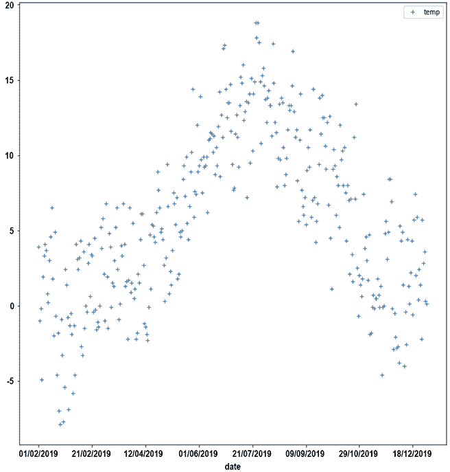
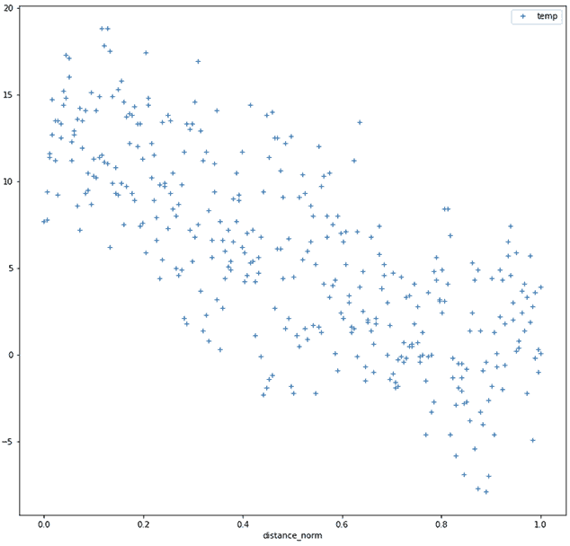
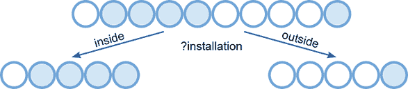
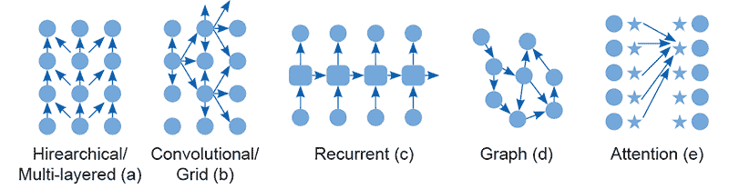
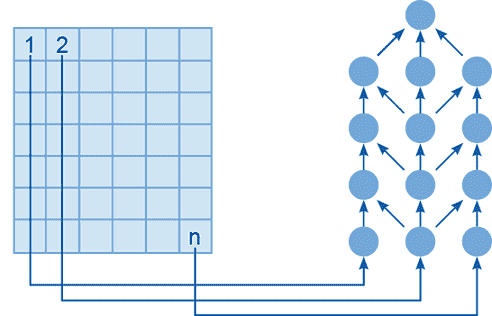
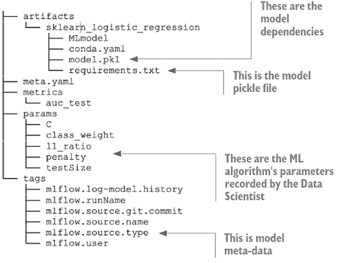

# 7 使用机器学习创建有用模型

本章节涵盖：

+   对数据进行转换以进行处理

+   通过特征工程注入信息

+   设计模型的架构

+   运行模型开发过程

+   决定保留哪些模型和拒绝哪些模型

第二轮冲刺是我们一直努力的方向；终于，我们将要进行一些机器学习！这个阶段项目的成功或失败是其他一切的关键点。尽管我们在预售、冲刺 0 和冲刺 1 的工作中创造了成功的条件，但如果我们不能实施有用的模型，所有这些工作都将付诸东流。如果你已经完成了获取和准备数据的艰难部分，创建一个模型是很容易的。一个简单的模型可能只需要写一行代码或在用户界面上按一个按钮。然而，创建一个有用的模型要困难得多。

什么使得使用机器学习创建的模型有用或无用？机器学习的传统观点认为，一个有用的模型是能够很好地泛化的模型：该模型可以有效地处理它未训练过的数据，并应对未见过的情况。但实际上，还有许多其他特性使得模型有用，或者如果没有这些特性，模型就无用。

表 7.1 列出了有用模型与无用模型的特性对比。为了交付一个有用的模型，团队需要从数据中生成许多特征，创建大量候选模型，正确评估它们，选择最有效的模型，并向受模型影响的人、监管者或审计员解释所有这些。这个过程必须得到专业执行和管理。此外，如果没有严格的评估过程，你的模型可能在生产中证明是脆弱的，或者你可能面临困难，无法说服你的利益相关者你对模型的选择是负责任和适当的。

表 7.1 条目背后的三个驱动因素是：进行与系统内所有利益相关者需求一致的建模工作，建立在坚实的基础之上，并确保结果是稳固的。一个稳固的结果不仅仅是一个优秀的模型，而且是一个其他人可以验证为优秀的模型。现在，团队需要生成允许这种验证发生的资产。

表 7.1 什么使得模型有用或无用？

| 有用 | 无用 | 评论 |
| --- | --- | --- |
| 从一个理解透彻且准备充分的数据库基础设施中创建。 | 从缺乏控制或对质量考虑不周的临时数据资源中开发。 | 如果你没有确保质量的过程，你将不知道你正在处理的数据是否良好。 |
| 响应已充分理解的需求而创建并满足该需求。 | 因为可以创建而创建；不清楚是否满足任何需求。 | 如果你没有为模型支持的情况建立明确的赞助，那么获得赞助所需的工作可能是难以承受的。你可能没有足够的洞察力来质疑利益相关者对商业价值的看法，并证明你是正确的。 |
| 考虑到伦理因素而创建。 | 没有考虑伦理影响或对受影响的人的尊重而创建。 | 存在伦理问题的模型最终会被业务所淘汰。越接近生产阶段，它们造成的损害就越大。 |
| 高质量的特征工程创造强大的性能。 | 低质量或没有特征工程。 | 低质量或没有特征工程意味着模型在测试中的性能可能与用户或现实世界的期望和要求脱节。 |
| 有意设计。 | 任意设计。 | 如果设计是任意的，那么模型很可能是脆弱的。 |
| 严格评估。 | 评估不佳。 | 当模型评估不佳时，没有人知道它是否有效。 |
| 模型选择过程是有目的和透明的。 | 模型选择是任意的。 | 随意的选择，谁知道你是否得到了正确的结果，以及你为什么选择它呢？ |
| 定义了使用的建模过程。 | 建模过程是任意的。 | 一个明确的建模过程允许对模型选择进行问责。 |
| 文档齐全。 | 没有文档。 | 因为文档促进了透明度，它还使得问题能够被识别和修复。 |

## 7.1 Sprint 2 待办事项

在 Sprint 2 中，团队实施系统和专业的建模和评估流程。通过使用有组织和记录的方法，团队避免了产生低质量模型的一些陷阱和常见问题。至少，这是我们所希望的！在我们深入了解细节之前，让我们先看看 Sprint 2 的那些任务。

表 7.2 Sprint 2 待办事项：建模和评估

| 任务编号 | 项目 |
| --- | --- |
| S2.1 | 创建特征工程计划，然后与团队分享并审查它。实现特征工程管道。设计和添加数据增强。 |
| S2.2 | 创建模型的设计并对其进行文档记录。考虑作用于模型设计的力量。决定任务的分解以创建整体设计。根据数据中给出的所需归纳偏差选择组件部分。开发融合模型输出的组合方案。 |
| S2.3 | 就建模过程达成一致并建立：  ▪ 委派并使用实验跟踪器。  ▪ 委派并使用模型存储库。  ▪ 识别并拒绝明显较差的模型。 |
| S2.4 | 实施并委派测试环境。 |
| S2.5 | 开发一套测试来确定模型的性能功能。确定在测试场景中要使用的度量标准。 |
| S2.6 | 测试非功能性特征。 |
| S2.7 | 使用评估数据来确定要使用的模型。采用显式机制使用模型测试/评估数据来选择生产中使用的模型。考虑如何在设计中组合组件模型。考虑非功能性需求。考虑模型的定性方面。 |
| S2.8 | 编写模型交付报告。 |
| S2.9 | 确定并记录模型选择。 |
| S2.10 | 审查并获得客户对模型选择的批准。 |

## 7.2 特征工程和数据增强

特征工程工单：S2.1

+   制定一个特征工程计划，然后与团队分享并审查。

+   实施一个特征工程流程。

+   设计并添加数据增强。

特征工程和选择是机器学习流程的核心部分。未经某些预处理以创建一致、有用和有信息量的特征，原始数据可能对机器学习算法来说意义不大。在建模开始之前，数据集需要得到丰富和转换，以便为算法提供适当的特征。

可用系统化的特征选择和工程方法。例如，在他们的书籍《特征工程与选择：预测模型的实用方法》中，Kuhn 和 Johnson [7] 提供了识别、创建和选择特征的解析视角。在这个框架中，他们使用数学和技术考虑因素来重构数据，使其更适合机器学习算法的消耗。系统化的特征工程方法有助于识别和解决数据的技术问题。特别是：

+   识别和消除数据集中多个字段相同信息产生的偏差。

+   解决由分布偏差和尺度差异产生的偏差。

+   处理层次数据及其在层次结构中的信息分布。

除了解决数据呈现给算法的方式中的技术问题外，我们还可以使用特征工程来编码机器的洞察力和常识。例如，对于在格里高利历中成长的人来说，常识是 12 月之后是 1 月，似乎有理由假设 12 月由数字 12 表示，1 月由数字 1 表示。但考虑到有三天，12/30、12/31 和 1/1 的信息，机器如何能够推断出 1 月的第一天紧随 12 月的最后一天？

另一个例子处理包含方向或方向的数据，通常表示为 0°到 360°之间的标量值，有时表示为罗盘方向或不同点之间的关系。如果我们将这些数据视为线性量，那么方位为 359°和 1°的项目将出现在刻度尺的两端。实际上，它们很接近，两者几乎正好在正北（0°±1°）。如果我们重新构架数据以考虑这种循环性，我们会得到更好的结果。

特征工程是将数据转换成对机器学习算法（例如，1/1 在 12/31 之前，359°在 0°旁边的信息作为机器的知识）有意义的过程。特征工程师不是将知识作为某种额外的推理规则嵌入，而是重新编写数据，使其成为机器学习系统处理的信息的一部分。

给定三天，12/30，12/31 和 1/1，我们可以通过将日期表示为从某一点的距离来解决这个问题的不规则性。如果我们以仲夏日和新年（1/1）为基准，新年（1/1）代表值为 182（通常是），年底的最后一天（12/31）是 181，1 月 2 日（1/2）也是 181。这里的要点是，所有这些例子在数值上都很相似，因此这种转换对于相似的事物更有意义。

我们可以用智能建筑示例来展示如何通过重新编写方向来提高其有用性。正如我们在第四章中看到的，建筑传感器记录了 1-366 天的温度，其中第 366 天考虑了闰年。图 7.1 显示了每年每一天的平均温度。



图 7.1 展示了按一年中的某一天绘制的温度（数据来源于 2019 年萨福克郡沃特什姆气象站，英国政府）。

图 7.2 展示了两个新特性：一个提供候选日与仲夏日的天数距离，另一个提供该日的平均温度，并将其除以从仲夏日的距离，如果存在闰年，则从 0.0（仲夏日）归一化到 1.0（冬至日）。这是 183 天，所以仲夏后的那天值为 0.0054。



图 7.2 按仲夏距离绘制的温度（缩放 0.0 – 1.0）

我们还可以通过使用预训练的基础模型来为一些非结构化数据源创建特征。在第四章中，我们使用基础模型来探索莎士比亚剧本中的非结构化数据。我们可以使用相同的方法从非结构化数据中创建特征，然后我们可以将这些特征输入到机器学习中。这与直接在某个非结构化信号上执行机器学习的方法不同，在基础模型的训练中，基础模型中创建了规律和模式。然后我们使用这些结果以更易于消费的形式表示数据，以便于建模过程。在莎士比亚的剧本中，我们使用了 all-MiniLM-L12-v2 句子转换器来创建新颖性和差异的概念。然后我们提取了一个概念图来关联相似的主题。

我们可以使用类似的方法（以及其他更直接的基础模型应用）来创建有用的特征，并融合来自非结构化和结构化数据源的信息。例如，莎士比亚的例子展示了如何在非结构化文档的空间（即剧本）中找到相似性。让我们考虑一个新的涉及文本数据的问题。

在这种情况下，一封接受新客户的电子邮件被传递到审批流程中。在后来的阶段发现，这封电子邮件被发送给了错误的人，应该以不同的方式处理，浪费了大量的时间和精力。你的团队告诉你，他们认为文本分类器在处理新或奇怪框架的电子邮件时可能表现不佳。

这种类型的边缘情况最终可能会消耗最终过程中不成比例的成本，并且可能会糟糕到破坏用户对分级系统的信心。在 EDA 过程之后，团队认为确定训练集中异常值的功能在清理方面很有用，并希望构建一个高质量的分类器，以确定适当的话题。他们构建了一个简单的特征，为系统提供一个新的奇怪/不新的正常信号。与之前一样，数据使用基础模型的嵌入进行索引。通过获取索引中第二接近的电子邮件（忽略身份匹配）并使用相似度距离来评估这封电子邮件与它的接近程度，来对电子邮件的新颖性进行评级，如下面的伪代码所示：

```
results_array = array [length(emails)]
for email in emails : 
    match = index.search (email) 
    results_array[email.id]=match.D ❶❷
```

❶ email.id 是这封电子邮件的索引。

❷ match.D 是索引返回的距离。

结果数组包含每个电子邮件在索引中最近匹配的距离。如果你找到这个数组的标准差，并将阈值设置为两倍标准差加上平均值，那么你可以过滤掉训练中最奇怪的 5% 的电子邮件。如果你将这个特征用于主题分类器本身，那么你可以创建一个“其他”标签，剩余主题的分类将更加强烈。

为一个领域开发高质量的特征可能既耗时又困难。要获得良好的结果，需要大量的经验和领域洞察，这也是为什么特征存储库是有价值的资产。如果之前的某个项目开发了一种表达建筑物中传感器位置的方法，这提供了洞察和信息，那么这将是一个巨大的成功。此外，在组织中创建一致的数据使用方式，有助于确保机器学习算法的行为一致且易于理解。如果你的项目是开拓性的，那么你开发并留下的特征存储库可能将成为客户的一个持久资产。

### 7.2.1 数据增强

有一个关于早期机器学习系统的传说经常被讲述，据说这个系统是为了在照片中识别坦克而开发的（它被开发的确切应用总是模糊不清）。故事的笑点是，机器学习系统不是学会识别坦克，而是学会识别雪地，因为坦克的照片都是在雪中拍摄的。这个故事几乎肯定是一个虚构的故事，但有一个要点：如果一个机器学习算法只有有限的数据集来学习，那么它能学到的内容是有限的。尽管它可能能够从接收到的信息中学习到一个鲁棒的分类器，但它也很可能陷入陷阱，学会利用数据中的巧合来做出分类。然而，如果有不同的示例，那么误导性的巧合可能会变得非常罕见。

为了解决这个问题，Shorten 和 Khoshgoftaar [13] 开发了**数据增强**技术。数据增强是一个通过变换和修改来创建额外训练示例的过程。我们可以使用这种技术来使机器学习模型在原始训练集中只有少量示例可用时更加鲁棒。

图 7.3 展示了一系列图像增强。原始图像示例（a）按照（b）、（c）和（d）进行了旋转，尽管我们可以生成更多的旋转。此外，还可以根据（e）和（f）向图像中添加额外的对象，以及其他类型的噪声（g）、反转（h）、缩放（i）和框架或场景内的重新定位（j）。在（k）中，图像被镜像，为机器学习算法提供了另一个猫的示例。


图 7.3 通过简单操作增强猫的图像（维基百科公共领域，[`commons.wikimedia.org/wiki/File:Black_and_White_Cat_Sketch.svg`](https://commons.wikimedia.org/wiki/File:Black_and_White_Cat_Sketch.svg))。

我们使用如图 7.3 所示的增加过程来构建更稳健和通用的模型。其理念是，如果一个模型专注于偶然的特征，那么在训练数据中存在更广泛的信号时，它被机器学习过程选中的可能性会更小。我们还可以将类似的增加过程应用于其他形式的无结构数据。例如，我们可能想要向文本样本中添加拼写错误，用同义词替换非停用词（不被视为停用词/可由 NLP 解析器丢弃的词），或者通过自动翻译系统传递句子以改变其措辞。对于图像识别系统，我们可能想要使用对比度和亮度的交替，以及许多引入噪声和失真的方案。

无论需要什么，我们都可以在建模过程中迭代地应用新特性和数据增强方法，随着团队的调查进行和新信息关于算法行为的出现。关于迭代建模过程如何管理将在第 7.4 节中讨论。一旦实现了第一组特征，团队的下一步就是创建模型的设计。

## 7.3 模型设计

模型设计票据：S2.2

+   创建模型的设计并对其进行文档化

+   考虑作用于模型设计的力量。

+   决定任务的分解以创建你的整体设计。

+   根据你的数据所要求的归纳偏差选择组件部分。

+   开发融合模型输出的组合方案。

在机器学习算法构建模型之前，它们必须由团队中的数据科学家和机器学习工程师设计。作为一个类比，值得记住的是，火箭发动机的设计是为了利用可用的技术和燃料来产生所需的结果。如果你的火箭工程团队能够访问到稀有金属和高品质燃料，他们的方法将比拥有大量钛和合成化学品的方法更加务实和受限。同样，机器学习模型的设计是为了在给定可用的数据和它们将运行的生成环境中，实现功能性和非功能性。

### 7.3.1 设计力量

在冲刺 0 和冲刺 1 中，你明确并阐明了你正在开发的商业应用中机器学习建模的需求和约束。在你的用户故事中应该已经明确了一系列力量，这些力量将作用于支撑你团队提供解决方案的方法的模型设计。以下是一些这些力量的例子：

+   *定量性能:* 一些定性性能指标包括良好的 F1 分数、精确率和召回率，或者敏感性和特异性。（如果这是你第一次遇到这些指标，第八章对这些不同的性能测量有详细的讨论。）在特定指标上需要谨慎，但本质上，你可以通过分类器完成其工作的有效性来衡量其定量性能。

+   *解释/透明度:* 给出最佳数值评估的分类器可能无法提供足够的解释来支持其决策，或者在其工作方式上不够透明，无法在特定上下文或应用中使用。

+   *延迟:* 分类器的延迟应适合应用。例如，对于交互式应用，你可能需要在数据可用后的一瞬间执行分类器。另一方面，你可以在夜间批量作业中转录电影的对白以创建字幕。

+   *成本:* 如果你需要执行数百万次分类器，你用来运行它的基础设施的成本可能会变得难以承受。

+   *数据隐私/安全性:* 从分类器行为中得出的推论可能会泄露秘密或机密数据。

+   *重用和数据稀疏性:* 可能没有足够的数据来训练某些类型的分类器，因此可能存在可以下载并使用而不需要训练的预建分类器，以执行项目中数据不足的部分。

+   *项目风险/开发时间:* 从头开始训练分类器可能很困难且风险很高，意外的行为可能意味着它们无法使用。下载预训练组件或使用简单模型可以在一定程度上降低项目风险，但会牺牲整体性能。

+   *生产中的鲁棒性:* 高度优化的解决方案在现实世界中可能很脆弱。

今天的机器学习从业者有一系列算法可供处理现代应用的复杂功能和非功能需求。鉴于这些丰富的资源，你能否从工具箱中挑选出一个解决方案来解决项目中特定的力量？遗憾的是，世界并不总是这样运作，事情要复杂得多。

### 7.3.2 总体设计

选择适合数据和当前问题的正确算法非常重要，并且有大量的文献可供参考以支持你的选择。例如，凯文·墨菲在他的著作《概率机器学习：导论》*概率机器学习：导论* [10] 中提供了大量算法的详细深入解释。然而，通常并不是简单地从所有候选算法中挑选最佳选项，因为：

+   没有最佳选项。相反，你面临的是权衡。

+   没有任何东西完全适合应用，你至少必须选择一个糟糕的选项。

+   最好的选择可能不适合你的模型环境。你的团队不理解它，你没有时间去实施它，硬件平台不支持它，或者（常见的是）在生产中需要太多的关注和干预，而你的用户不会提供这种关注。

我们能做些什么来克服这些日常挑战呢？对这些挑战的一个实用回应是实施一个复合模型，将几种技术结合起来，以处理数据的不同部分，这是单个模型无法做到的（在时间限制的项目中快速且可靠地）。例如，你可能需要一个自动翻译机器人将几种潜在语言中的一种语言说出的句子翻译成英语。在技术上，可以将这个模型实现为一个单一的深度网络，单个网络的性能可能优于专门的单语言网络。将问题分解成部分并使用更成熟和经过测试的解决方案可能风险更低、更容易、更快。

当需要开发几个不相连的模型，这些模型在不同的业务流程部分独立工作时，就会产生不同的问题。例如，在客户服务流程中，可能你的系统需要识别客户所说的语言，然后根据他们面临的挑战提供正确的支持信息。面对这些挑战，你可以做出一些架构选择，将问题分解成各个部分，并使用算法来解决每一部分。然而，这些选择是如何做出的呢？

### 7.3.3 选择组件模型

数据科学家利用他们的专业知识和经验来选择合适的机器学习算法，以产生针对当前问题的正确模型。经验和对洞察力的理解是无法替代的，但在这一过程中有一些有用的启发式方法，值得考虑。尽管这些经验法则和一般原则可能不对应于最佳技术方法，但在管理建模过程中的项目风险方面可能是有用的。

模型的两个最基本的决定因素是算法消耗和使用的类型数据以及模型产生的输出类型。如果模型需要从 0.0 到 1.0 产生一个渐变的控制信号，而它只能产生开或关的二进制信号，那么这个模型就是无用的。如果机器学习算法不能“看到”颜色，那么它产生的模型将是黑白色的。从根本上讲，问题是，算法能否有效地模拟输出分布？这是一种花哨的说法，即模型是否有什么输出它在技术上无法产生？它原则上能否产生正确的输出比例？如果不能，那么你需要停止团队的工作，并让他们使用能够做到这一点的方案。

既然你选择的算法（原则上）能够创建出你想要的分布模型，那么在可能的情况下，应优先选择已知的算法，而不是新颖的算法。一个新算法可能是最先进的，可能比大家一直用来解决这类问题的旧方法表现得更好。此外，一个新算法可能还没有经过充分的测试，也不被充分理解。至少，一个已知的算法应该与建模团队倡导的最新和最闪亮的方案进行基准测试。如果他们的新“哇塞”机器学习魔法比老的和更知名的架构和方案表现更好，那么太好了！如果它没有，那么老的方法将给你带来极大的安慰。

通常情况下，如果你可以用它有效地解决建模问题，最好使用一个简单的算法。然而，复杂的深度网络架构可以做其他算法做不到的事情。尽管有这个禁令，你可能会发现团队别无选择，只能跳入新的水域，尤其是在处理图像、声音和自然语言等领域时。

深度网络可以为复杂的不规则数据创建模型，但这些通常被认为是不透明或不可解释的。有一些机制使用深度网络，因为它们的性能功能很好。这些机制可以有效地向人类解释，但这些机制总是比更直接、透明的模型（如关联规则或决策树）低效。如果透明性是设计力量，你可能必须仔细权衡它与系统的功能性能。

深度网络在训练和在生产系统中使用时可能会很昂贵。记住，当团队运行一个数据中心价值的一周 GPU 来创建一个可以用来提高建筑能源效率的模型时，他们会燃烧大量的二氧化碳。这可能不是你告诉赞助商的好事情。

这些一般原则只是良好的常识性设计启发式方法。我们选择模型是因为它们可以从输入产生所需输出。这种可能性被称为*归纳偏差*。

### 7.3.4 归纳偏差

我们可以使用不同的算法和方法来创建机器学习模型，但每种方法都会在过程中引入一些偏差。以智能建筑示例中的传感器为例。传感器具有以下属性来描述每个传感器：年龄、制造商和安装。安装有两个值，内部/外部；年龄是从 0（新）到传感器安装的天数的标量。有五种不同的制造商，我们数据中有一半的传感器失败了。因此，我们希望创建一个决策树，预测哪些传感器可能会失败。

我们需要在如何构建树方面做出一些选择。我们应该首先测试哪个属性？我们应该对哪个属性应用哪些测试？在这种情况下，一个合理的起点可能是安装属性。这个传感器是内部还是外部的？在某些情况下，我们可能会看到 80%的外部传感器失败，而内部传感器的失败率不到 20%。图 7.4 说明了分割对某些具有安装属性的数据的影响。



图 7.4 使用安装属性分割训练数据。外部传感器（右侧）比内部传感器更频繁地失败。

尽管我们的选择符合常识，但在某些方面是任意的。图 7.5 显示了使用年龄属性进行的替代分割，它创建了数据的一个干净分割。现在我们看到，所有安装时间超过 100 天的传感器总是失败的。使用*测试年龄* > 100 的分割创建了一个只包含失败传感器的左节点。


图 7.5 使用年龄属性分割数据，在左分支上产生一个纯节点。在这个树上不需要进行进一步测试。

已经开发出更复杂的选择，这些选择背后有经过深思熟虑的理由，说明为什么它们是合适的或不合适的。这些论点几乎总是归结为奥卡姆剃刀的变体，它告诉我们应该选择那些倾向于产生最简单决策树的分割集，而不是其他无限多的确定类别成员的方式。一个在决策树的节点处使用一个标准来分割目标集的算法，例如使用信息论度量如 J 度量[9]，可能更有可能发现数据中的特定规律，而不是使用另一个标准，如统计显著性或简单计数[2]。

通常，我们使用 XGBoost [1]、其他提升算法和随机森林在表格数据上创建有效且鲁棒的模式。不幸的是，它们创建了复杂且难以理解的分类器。这可能会使得在基于模型的应用中使用它们变得困难，在这些应用中，基于模型的决策应该是透明的并且可以轻松解释。

如果一个 XGBoost 模型过于详细和复杂，无法直接使用，它可以作为一个降噪器，筛选出混淆简单模型的噪声。为此，我们需要训练一个 XGBoost 模型，然后将输出作为使用简单决策树或关联规则发现算法建模的目标变量。或者，您可以将 XGBoost 作为基线来衡量选择简单可解释模型在模型有效性方面所付出的代价。

对于如图像和文本这样的非结构化数据，XGBoost 不太成功且不太适用。为深度网络开发各种层次架构意味着在选择特定架构时可以创建一系列偏差。选择正确的偏差意味着我们有时可以从更少的数据中获得更低的损失，同时以更低的训练和推理计算负担为代价。

图 7.6 显示了五种不同的深度网络。这些是如多层感知器这样的层次排列，为计算机视觉任务设计的网格网络，为语音和基于文本的任务设计的循环网络[5]，图网络[4]，以及基于注意力的网络，如变换器[11]。



图 7.6 机器学习算法中的归纳偏差（改编自 Jumper, Evans 等[6]。序列（a）至（e）是根据这些偏差在机器学习社区中获得流行程度的顺序确定的。箭头表示信号在网络或图中的传播。

图 7.6 中的网络结构是为了响应处理不同类型数据的需求而开发的。例如，图 7.7 显示了一个使用层次结构的感知器型网络。它一次处理一个图像像素的数据，但由于像素的上下文与其内容一样重要，感知器表现不佳。图像中的信息主要存储在像素之间的关系中，而感知器无法捕捉到这一点。



图 7.7 对于一个层次排列的网络（右侧），左侧像素化的图像看起来是什么样子。图像的顺序丢失，并且通过将像素*n*输入到网络的右侧最输入端，远离上面的像素或与其对角相邻，这使系统识别对象的任务变得困难。

另一方面，我们可以构建卷积网络[8]。如图 7.6 中的（b）所示）来考虑局部性。*卷积*是在网络中局部传播信息的过程，在局部级别提供激活的正常化和过滤。一个学习到的过滤器在网络的滑动窗口中传递，确定信号应如何从像素传播到像素，并在层之间汇总信息。在有了足够强大的计算引擎来处理这些训练挑战上的图像，并且有大规模的训练集之后，卷积网络成为了图像识别问题的首选架构。

### 7.3.5 多个不连续模型

许多项目需要构建多个模型来支持人工智能应用的各个部分。这些模型的结果不会相互输入，而是由人类或作为决策系统的单独输入来消费。例如，一个信用风险模型可能由几个不连续的模型组成，代表不同类型或风险驱动因素。一个模型可能模拟欺诈，另一个模型模拟使申请人有风险的依赖关系，而第三个模型可能模拟经济趋势。这些模型的输出可以组合在一起创建一个单一分数，或者可以单独显示给信用控制器。

如果你的团队正在开发一个集成系统，不同模型的分歧需求将对所需系统的复杂性（在推理和数据层方面）和系统的性能（在定量和非功能性性能方面）产生重大影响。我们需要平衡对每个模型的资源分配，以确保系统的整体价值最大化。

记住，资源包括分配给生产模型的时问和处理器功率，以及开发期间团队的努力。一个团队容易陷入的陷阱是花费数周时间打磨一个模型，而忽略了其他模型，这些模型只需稍作努力就能带来更大的收益。

### 7.3.6 模型组合

另一种设置是使用模型按顺序执行整体推理过程。有时，我们将模型串联起来，因为我们需要捕捉进一步的干预或结果。例如，必须就某个过程中某些试剂的流量控制做出决定，在做出关于加热溶液的另一个决定之前，必须观察混合的结果。这种情况被称为*模型组合*，其设计过程比两个独立的模型更复杂。

或者，我们可能可以将单个任务合理地分解成一系列依赖模型，尽管在某些情况下，单个模型可能是最佳选择。通常，通过将问题分解成多个步骤并分别学习每个步骤来创建模型的推理链，可以快速且可靠地解决问题。

例如，考虑将句子翻译成英语的挑战。第一步是识别源语言。下一步是确定句子的含义或意图，然后最后一步是以最优雅的方式将那种含义或意图表达成英语。可以想象一个包含所有三个任务的单个网络，这些任务在元任务中被称为翻译（实际上，这些确实存在，并且具有明显的优势）。然而，可能更容易构建三个不同的网络，每个网络执行这些步骤之一，并用适当的粘合剂和管理逻辑将它们连接起来。这种方法有以下优点：

+   我们可以更密切地管理每个子项目在构建组件模型时的技术风险，而不是管理大型且具有挑战性的端到端（End 2 End）网络的风险。

+   可重复使用的元素，如预训练的现成网络或数据集，可能适用于子组件，因为这些可能代表比端到端解决方案更通用的任务。

+   我们可以在隔离状态下测试单个组件，这有助于更容易地进行故障排除和调试。

+   我们可以并行构建单个组件，这可能会缩短开发时间（尽管这假设构建更好的单个网络的成本高于集成成本）。

+   我们可以将部分解决方案工程化到提供商业价值的整体系统中。

如果在开发这些组件中取得了一些成功，并且如果这些组件可以集成到业务流程中并用于支持其决策者，我们可以交付一个成功的项目。然而，权衡的是也存在一些不利因素：

+   组合模型可能不如单个定制模型表现得好。

+   管理大量模型的量产可能很困难且成本高昂，尤其是在文档和流程方面。

+   模型链可能会引入延迟和吞吐量问题以及瓶颈（舰队以最慢船只的速度航行）。

+   理解和维护复杂设计是困难的。

当你已经开发了一个模型设计，并且集成策略已达成一致并传达给团队后，下一步就是团队实现它。

## 7.4 使用机器学习构建模型

模型流程支持工单：S2.3

+   就建模过程达成一致，并设置它。

+   启用并使用实验跟踪器。

+   启用并使用模型存储库。

+   识别并拒绝明显较差的模型。

实际创建机器学习模型可能像设计一个复杂的深度学习网络（具有专业层和反馈回路）一样复杂，或者像在用户界面上按下“Go”按钮一样简单。当模型创建复杂且涉及多个方面时，创建模型所需的专长是显而易见的，而需要使用专家团队来完成工作的需求是由非专家无法创建支持应用的模型这一事实驱动的。如果你使用低代码或工具驱动的方法来生成模型，有时可能会觉得不需要专业知识，因为即使没有专家参与，似乎也能得到有价值的结果。

事实上，即使模型可以通过一键创建，也需要洞察力和纪律。模型制作者从按下按钮的那一刻起，以及按钮按下后模型所发生的一切，都会创造价值，或者造成损害。正因为如此，定义和管理你用于模型化的过程非常重要。

### 7.4.1 模型化过程

开发模型的实际过程是好奇心驱动的和实验性的；它既是艺术也是科学。对数据和领域有深入理解，并为模型创造有意的结构是必要的，但不足以成功。为了得到好的模型，团队需要通过实验、内省和调查找到可行的方法。

这听起来像是一种临时和非结构化的活动，从某种意义上说，确实如此。尽管科学家可能会有灵光一闪，尝试一些疯狂的事情，但所有这些都是在管理框架内完成的。对于科学家来说，实验细节会提前在实验记录簿中写出来。

数据科学家需要使用相同的管理框架来实现类似的目标，即严谨性和可重复性。很容易出错，丢失模型设计的一些细节，这意味着模型无法重建或存在未记录的元素。此外，调查需要组织，并保留记录，以便不重复工作，不重复进行本应第一次就完成的工作。不仅反复重做做得不好或记录不充分的工 作会浪费时间和金钱，还会浪费宝贵的资源。实际使用的过程可以防止浪费时间，并且它还旨在防止团队对自己所构建的模型质量产生错误的认识。

在建模活动中，一个常见的问题通常被称为*数据泄露*，这是指在模型评估过程中，由于意外地将测试信息泄露到训练过程中，导致评估过程的腐败。本质上，数据泄露意味着算法在应该之前偷看测试数据。一个典型的数据泄露场景是这样的：由于某个模型恰好对验证数据表现良好，建模团队往往会专注于类似的模型，并为验证问题找出更多的性能优化。遗憾的是，这并没有转化为现实世界的性能，模型令人大失所望。这可能是因为团队的行为导致了对验证数据中的怪癖和伪影的无意识优化。

作为旁注，另一个常见的错误是训练和验证数据的选取。这在时间序列预测问题中尤为常见，其中来自未来的案例为模型提供了信号，模型随后将其复制到测试数据中。例如，我们使用验证集中的炎热夏季数据来为我们的智能建筑建模。因为测试数据集也是从同一个炎热夏季抽取的，模型在测试性能上作弊，而这种作弊方式在生产环境中是不会复制的。

这些问题阻碍了模型得到适当的探索。此外，本可以用来检查其他有希望的设计选项的时间，都花在了追逐一个有希望的一次性性能的幽灵上。怎么办？

1.  规划如何分配可用时间来实现和探索模型设计性能。

1.  对于设计的每个部分，确定一组实验来创建和验证该组件的行为。每个实验都是建模和测试的一个阶段。写下从这个过程中期望得到的内容。

1.  按计划进行建模和测试，并记录结果。

1.  要理解结果，请使用适当的工具检查结果。

1.  在每个阶段结束后，回顾并决定对计划进行哪些更改，以及是否需要新的功能或数据管道的更改。

1.  从待办事项中选取另一个阶段，并对其执行相同的操作。

这样做的目的是通过规范流程、记录和审查所做的工作，可以识别并停止任何过度优化的过程（可能存在信息泄露）。如果事情出错，至少可以确定需要获取更多的验证数据，并检查模型是否足够好，足以支持进一步的开发。不这样做会导致数据科学家在黑暗中摸索，试图看看他们是否真的有效。通过质询结果、理解它们，并在每次迭代中回顾所学到的知识，开发过程获得了方向和动力。当然，这只是理论上的；正如实验室实验是一条艰难的道路，数据科学实验也同样难以进行。

在决定在模型开发过程中以计划化和系统化的方式进行工作时，你们和团队应该考虑另一组驱动因素。在传统科学中，精心维护的实验记录本允许实验可以被复制，并且实践可以检查其安全性和专业性。同样，仔细记录 ML 过程允许有潜力的模型可以被复制和审计。随着 ML 系统在我们的社会中越来越普遍地被使用和频繁地受到质疑，这一点将变得越来越重要。以专业的方式并保持良好的记录使得你的模型可审计和可检查，这使它们更有用和更有价值。接下来，我们将讨论如何记录建模活动以及如何管理和跟踪结果。

### 7.4.2 实验跟踪和模型存储库

你所选定的并作为项目基础设施一部分实施的模式存储库存储了团队构建的模型实例。关于这些模型的某些元数据也应该存储在那里。例如，它应该包含创建模型所使用的算法版本，用于算法的超参数，以及链接到为算法提供数据的训练集或训练管道版本。

表 7.3 展示了在多次运行中记录的一些统计数据的样本。在这个图中，我们使用了一个简单的线性模型来进行预测。性能的变化是由于测试集大小的不同，实验的性能是通过 AUC（曲线下面积指标）来估计的。请注意，当数据科学家在上午 10:38 注意到性能存在一些差异，并且测试集的大小没有被记录下来以解释这些差异时，添加了`testSize`参数。同时请注意，当尝试大测试时，ML 包（Elastic_net）选择的惩罚函数发生了变化。

表 7.3 实验跟踪系统可能记录的统计数据示例

| 开始时间 | 持续时间 | l1_ratio | 惩罚 | testSize | auc_test |
| --- | --- | --- | --- | --- | --- |
| 2022 年 2 月 15 日 10:43 | 1.9 秒 | 0.5 | Elastic net | 0.5 | 0.93916314 |
| 2022 年 2 月 15 日 10:42 | 2.1 秒 | 0.5 | l2 | 0.1 | 0.94286043 |
| 2022 年 2 月 15 日 10:38 | 2.1 秒 | 0.5 | l2 | 0.1 | 0.94286043 |
| 2022 年 2 月 15 日 10:34 | 2.4 秒 | 0.5 | l2 |  | 0.94286043 |
| 2022 年 2 月 15 日 10:00 | 2.0 秒 | 0.1 | l2 |  | 0.94286043 |
| 2022 年 2 月 15 日 09:59 | 1.9 秒 | 0.5 | Elastic net |  | 0.93916314 |
| 2022 年 2 月 15 日 09:58 | 2.3 秒 | 0.1 | l2 |  | 0.94505654 |

记录这些信息既繁琐又容易出错，尽管如此，我们还是使用一个名为 MLflow（但还有许多其他类似工具可供选择）的包（工具）在表中记录了数据。我们从与 ML 算法（在这种情况下，是一个简单的回归）相同的 Python 运行时运行了这个工具。MLflow 有一个 API，我们用它来记录实验的详细信息。我们从建模代码的调用中输入统计数据和参数到 MLflow 数据库中。每次我们运行实验时，都会推送有关参数和性能的数据，我们可以从 GUI 或简单的命令行调用中检索它。

表 7.2 中没有显示的是将二进制文件、资产（如迁移模型、测试、训练和验证数据集）以及构建它们所使用的公式与我们在开发过程中看到的成果和结果联系起来的唯一标识符。这种联系就是模型仓库介入的地方。

由 ML 算法发现的模型被存储为二进制文件，编码了所有发现的参数设置和权重，这些参数和权重指定了从数据中提取的特定模型。这些文件保存在文件系统或数据库中。在 MLflow 的情况下，我们可以使用存储实验详细信息的 API 在文件系统中存储文件。

图 7.8 显示了存储在创建表 7.2 条目中的运行模型的文件。你可以看到，这些工件包括创建模型所使用的所有 Python 包的 Conda 代码以及编码实际模型的 pickle (.pkl)文件。这些工件足以按需重新构建和运行模型，因为所有使它工作的依赖项和需求都存储在仓库中。其他目录包含定义模型及其在实验中表现如何的元数据。



图 7.8 存储在模型仓库中的文件，我们可以用它来了解哪个模型被存储，它是如何制作的，它与实验跟踪信息有何关联，以及如何再次启动并运行它。

在冲刺 1 中开发的数据管道和在本冲刺开始时构建的特征也支持数据科学家的工作。这就是为什么开发这些管道和特征的原因！此外，这项工作是在团队对数据的理解、业务问题和项目的伦理挑战的背景下进行的。我们可以更进一步，使项目的 ML 部分变得更加容易。你和团队可以通过将模型的设计和创建过程外包给机器来节省大量的麻烦。

### 7.4.3 自动机器学习和模型搜索

一种流行的现代做法是使用自动搜索系统迭代创建模型。搜索通过选择算法参数的变体，并创建和测试具有不同结构和偏差的模型来实现。这种做法的出现是因为深度学习系统可以表达的可能模型空间非常庞大，无法检查所有可以手工构建的结构。尽管，可以说这种过程是由于深度学习系统的发展而产生的，但自那时起，这种做法通常也应用于调整受统计启发的机器学习算法的性能。由于其遗产，这种技术也被称为神经架构搜索（NAS）和有时称为元学习。

AutoML 的伟大之处在于，你可以通过一行代码或轻触按钮来复制勤奋数据科学家的工作。否认通过使用 AutoML 快速提高模型性能所带来的收益是不切实际且愚蠢的。通过这些过程已经获得了稳健的先进结果[3]，这种方法自动化了可能繁琐且易出错的劳动。然而，也有一些问题需要注意。

模型搜索系统是优化系统，因此可以产生在保留数据上表现极好但在测试数据（或生产中）失败的脆弱模型。模型搜索最终会发现一些模型在特定测试上表现良好，这纯粹是运气，某种东西恰好适合。我们将在第八章讨论维护用于评估模型测试系统完整性的问题，但在此阶段，只需指出这可能会成为一个问题。

同样难以证明或解释模型搜索系统发现的架构或参数设置。如果最优（在验证意义上）架构被丢弃（可能是因为脆弱性）而选择替代方案，则尤其如此。现在，到达这个目标的过程已经受到一个差距的损害。第二好的结果是从哪里来的？为什么选择了这条路线或树？团队决定使用自动搜索，然后又忽略了它；这是合理的，但对外部的人来说可能看起来很奇怪。

另一个显著问题是，AutoML 在计算资源方面可能成本高昂。尽管这可能是一项值得的投资，但平衡学习过程成本与通过模型优化获得的收益非常重要，尤其是如果模型是通过人为驱动的故意过程快速发现的。

对于这个应用来说，百分比改善的微小部分在所有所需金钱和资源中值多少钱？更严谨的计算是在花费昂贵的数据科学家推动过程的时间和 AutoML 过程在金钱和能源消耗上的成本之间进行平衡。

尽管如此，AutoML 在某些情况下是有用的。在建模初期使用 AutoML 或模型搜索过程来确定数据集可能达到的性能，可以是一种为更系统化和有目的的建模过程生成基准的有用方法。如果一个系统导出的模型接近 AutoML 模型的最终性能，那么你可以知道停止；它已经足够好了。

相反，如果 AutoML 失败了，那么这通常是一个很好的迹象，表明从数据中无法导出好的模型。可能需要更多数据或更好的特征工程。在这种情况下，你与客户有一个有用的讨论点。这并不一定意味着团队缺乏完成项目所需的 ML 技能，或者你运气不佳。可能是因为 AutoML 的失败表明，项目本身在当前状态下并不适合 ML 技术。

AutoML 的另一个用途是尝试优化一个已经开发的模型，以评估还有多少机会可以进一步改进它。同时，观察优化后的模型在哪里比手头的开发模型表现更好。

## 7.5 有味道、脏、不好、有味道的模型

模型“味道”——这就像软件工程师在源代码中谈论的“坏味道”。在第六章中，我们详细讨论了建模过程的另一半。在我们深入探讨为什么你应该选择一个模型而不是另一个模型的硬核统计数据和直截了当的解释之前，讨论模型“味道”是很有益的。

表现可疑好或可疑差的模型会变得意外地大或小，它们有味道，很脏。正确的方法是深入调查原因。然后，弄清楚原因后，你需要把模型拖出来，用棍子打它，直到它停止抽搐。然后将其丢弃（通常把模型扔进当地的池塘是个好主意，但这里没有提到这一点）。

问题在于一个糟糕的模型可能伴随着一些令人满意的表现统计数据，这就是为什么保持警惕如此重要的原因。一个模型为什么会“有味道”？

+   在验证数据上的评估过程中，有“味道”的模型表现不稳定和不可靠。对它们参数的微小改变会导致它们性能的巨大变化。这并不是我们希望看到的好行为，这表明有问题。

+   模型有“味道”，可能是因为它们比预期的表现更好，或者尽管你知道它们有问题，但它们仍然可以工作。

+   当模型在表现上与其他类似模型明显不同，或者对某些超参数的微小调整在性能上产生巨大差异时，模型就有“味道”。

有时，生成具有前述列表中一些特性的可疑模型可能指向领域中的某些意外规律。这可能是推动新的系统建模调查的刺激。这是可以的；它遵循了事先记录实验并记录结果的原则，如果最终发现模型确实异常，它可以安全地被丢弃。更有可能的是，模型气味是由管道中的错误引起的，因为库或工具包的实现有问题，或者因为你犯了配置错误。 

最常见的情况是，你使用训练集的验证数据进行的所有评估根本不是你所想的。存在数据泄露，或者在训练集或验证集中时间旅行了。或者，模型过度拟合，只是简单地记忆了数据。一旦模型被用于未见过的数据集，它就会失败，因为没有泛化。

这就是为什么保持对模型气味的警觉如此重要的原因。因为这种模型看起来工作得很好，它的外观似乎可以让你和团队从失败的机器学习项目的黑洞中解脱出来。抓住这个臭气熏天的模型产生的美妙结果并转向生产化是非常容易的。这种完全可以理解的行为是灾难性的。如果你能及早发现模型的问题，那么你可以用它来找到需要修复的管道中的错误。由于你和团队在项目的基础设施和流程上投入了精力和努力，一旦这些问题得到解决，重新运行你的实验和调查应该简单快捷。有很大可能性，经过几次迭代后，你的模型将开始变得稳健。臭味将消失！

在本章中，我们解释了建模活动的设置，概述了模型设计的力量和过程。然后我们介绍了建模活动的实际过程以及完成这些所需的架构。在第八章中，我们将覆盖建模故事的另一半：评估和选择我们认为将为我们工作的模型。你还将了解到 The Bike Shop 团队在建模挑战中的表现。

## 摘要

+   在建模阶段为机器学习算法创建信息性特征。

+   通过数据增强创建额外的训练数据以支持更稳健的模型。

+   理解模型设计中的设计力。

+   对你想要开发的模型组件做出有目的和有效的选择。

+   理解并使用归纳偏差来指导你的建模方法。考虑使用分层、基于网格、循环、基于图或基于注意力的结构。

+   确定何时使用复合模型以及如何有效地构建它们以解决当前问题。

+   结构化和管理一个受控且目的明确的建模过程。

+   使用自动化工具跟踪和管理模型的演变。

+   根据其行为或结构检测和确定应立即拒绝的模型。
