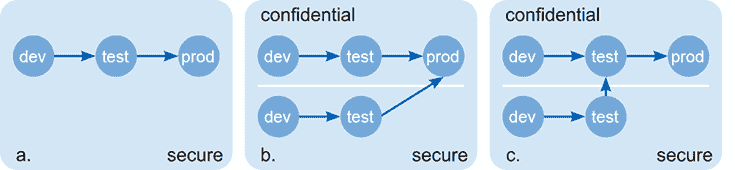
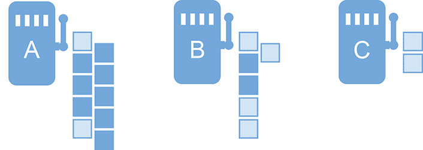
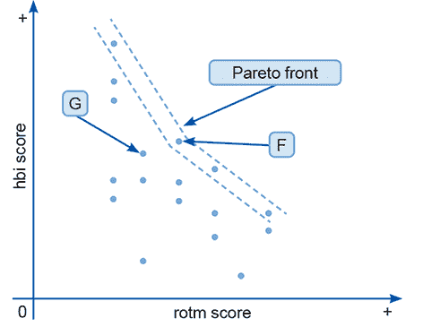
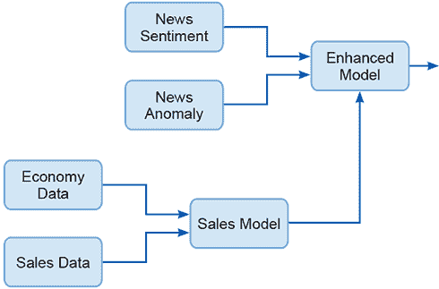
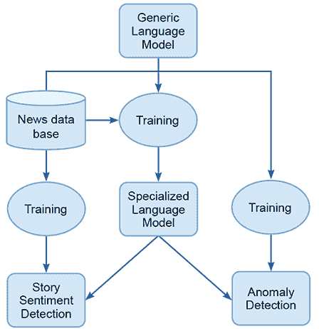
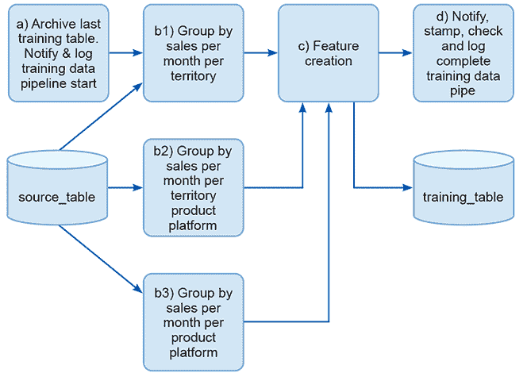
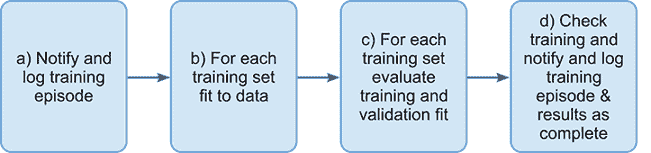

# 8 测试和选择

本章涵盖：

+   结构化测试环境，然后将代码和工件迁移到其中

+   测量模型的属性

+   理解如何离线和在线测试机器学习发现的模型

+   理解如何使用测试结果来选择模型

+   使用定性评估和选择以及定量措施

+   避免在评估模型时陷入欺骗陷阱

到目前为止，在第二阶段冲刺中，团队根据他们对数据的理解、客户的挑战和背景以及他们期望构建的应用，设计了要开发的模型。他们使用了一个结构化的流程来开发模型，并使用实验跟踪器和模型存储库跟踪他们的进度。他们还运用了他们的常识和经验来寻找和拒绝可疑或存在问题的模型。现在，理解模型的成果并正确评估竞争对手的模型，以做出关于将投入生产和应用开发的模型的良好选择，是非常重要的。

测试是一个系统化和离散的模型评估过程。这个过程提供了可理解的数据和证据，团队可以使用这些数据来在下一步的选择中做出更好的决策，即选择。*选择*是消耗数据和证据并利用它们来做出明确和清晰的决策的过程，这些决策可以向最终用户证明，向利益相关者解释，并接受监管机构的审计。你需要了解测试和选择的适当流程，以及为什么团队需要使用它们。有了这些知识，你就可以与团队一起做出一些关于项目这一阶段应该做什么的良好选择。让我们深入探讨吧！

## 8.1 为什么需要测试和选择？

你可能会问，既然开发团队的数据科学家已经确定了他们认为最适合实施的模型，为什么还需要一个单独的测试和选择流程？本章中阐述的过程的目的是什么？

对即将部署的模型进行严格的评估对于建立对其性能的信心至关重要，但真正评估一个模型并与其他模型有意义地比较是耗时且昂贵的。这意味着，当可能需要 30 代模型在完成一次全面评估的时间内构思和开发时，将评估嵌入到数据科学家的工作流程中往往是不 productive 的。提出好的候选模型在时间和精力上通常是经济的，但正确评估模型是缓慢且昂贵的。

一个好的评估需要新鲜、未见过的数据，或者在某些情况下，评估必须使用模型应用的实时部分进行。有时，你可能会用完这类数据。其他时候，你可能会在可能伤害他们或使公司因失去或不满的客户而蒙受经济损失的方式上对人类进行实验。没有比这更昂贵的事情了！重点是，如果你正在进行实时测试，不能在团队产生的第一个模型或所有后续模型上运行它。你对于失败的容忍度是有限的，因此评估必须选择性地、明智地进行。

请记住，为了对更广泛的数据集进行评估（该环境具有适当的安保和访问控制），可能需要在测试环境中发布。管理这一发布过程既缓慢又昂贵，即使是速度最快的 DevOps 团队也是如此。通常，一个表现优异的 DevOps 项目每天运行一到两个发布，而一个拥有快速算法甚至更快机器的数据科学家可能在一小时内就能迭代四到五个模型。如果模型需要计算量大的训练，这个等式可能会有所不同。在这种情况下，团队可能进行的实验范围会更加有限，需要处理的模型也会更少。

本章展示了完成一个 ML 项目适当评估所需付出的努力。为了做到这一点，有必要描述你的团队通常需要应用的不同测试实践和流程。重要的是强调，你不需要在每个项目中应用所有这些测试。你将完全使用离线流程（第 8.2 节）测试一些项目，而其他项目将严重依赖在线测试（第 8.2.3 节）。对于某些项目，模型选择过程（第 8.3 节）可能非常简单。定性选择（8.3.3）和校准（8.3.4）可能根本不会在许多你团队必须交付的项目中发挥作用。

重要的是，你对可能进行的测试类型以及哪些人可以与团队中专注于将其视为技术问题的成员一起工作有一个概念。同样重要的是，测试和流程要有良好的文档记录，并且可以重现。这可以确定需要投入多少努力，并有助于做出选择测试流程的决定。第一步是了解对项目有用的测试流程，这正是下一节要介绍的内容。

## 8.2 测试流程

本节描述了测试机器学习模型的不同方法。总的来说，这些方法的要点是测试自动化和结构化流程将为您的模型带来信心和责任。您以系统化方式生成的证据，如果模型在下游出现问题时，将保护您和团队，并能够创建满足生产工程团队、运营团队、最终用户和监管机构等利益相关者的文档。

让我们重新熟悉一下测试我们模型的三个第二阶段任务。

测试设计票据：S2.4

+   实施并启用测试环境。

+   确定测试模型功能的过程，包括您将如何创建测试数据以及您将如何管理避免数据泄露。

测试设计票据：S2.5

+   制定一套测试来评估模型的性能。

+   确定在测试场景中要使用的度量标准。

+   设计和构建一个合适的测试环境以支持敏捷和可重复的测试。

测试设计票据：S2.6

+   测试非功能性特性。

### 8.2.1 离线测试

离线测试使用专门收集并保留用于此过程的模型和数据运行。项目可用的数据分为训练集和测试集。这些分割取决于团队可用的数据量及其质量。例如，您可能能够使用 70%的数据进行训练，30%的数据进行测试。训练数据进一步分为训练集（用于向算法展示并用于学习模型）和验证集或保留集。

到目前为止，建模团队的数据科学家已经使用训练集或训练流中的保留数据来估计性能，这些数据是为开发环境创建的。在项目的测试阶段，使用在建模过程中团队无法获得的数据来测试模型非常重要。这可以避免该数据的信息泄露到建模过程中。团队在模型开发迭代过程中的决策可能导致他们从新数据中优化模型的性能。因为他们想要获得最佳测试性能，所以他们应该选择最适合该测试数据的算法和流程。然而，这并不能排除在最终测试时出现误导性结果，这意味着当模型投入生产时，其表现不佳。通过确保测试过程中的数据完全未见过，您可以避免这种无意识的优化问题。

交叉验证是简单测试/训练分割的替代方法。在这个过程中，整个数据集被分成几个不相交的测试/训练集。对于 10 折交叉验证，数据集被分成 10 个集合，其中 9 个用于训练，1 个用于测试。例如，表 8.1 使用的数据集被分成 8 个集合。集合 1 有测试集 P1 和训练集 P2 到 P8。集合 2 使用 P2 作为测试集，其他分区（包括 P1 但不包括 P2）作为训练集。

表 8.1 生成交叉验证集

|  | P1 | P2 | P3 | P4 | P5 | P6 | P7 | P8 |
| --- | --- | --- | --- | --- | --- | --- | --- | --- |
| 集合 1 | **测试** | 训练 | 训练 | 训练 | 训练 | 训练 | 训练 | 训练 |
| 集合 2 | 训练 | **测试** | 训练 | 训练 | 训练 | 训练 | 训练 | 训练 |
| 集合 3 | 训练 | 训练 | **测试** | 训练 | 训练 | 训练 | 训练 | 训练 |
| 集合 4 | 训练 | 训练 | 训练 | **测试** | 训练 | 训练 | 训练 | 训练 |
| 集合 5 | 训练 | 训练 | 训练 | 训练 | **测试** | 训练 | 训练 | 训练 |
| 集合 6 | 训练 | 训练 | 训练 | 训练 | 训练 | **测试** | 训练 | 训练 |
| 集合 7 | 训练 | 训练 | 训练 | 训练 | 训练 | 训练 | **测试** | 训练 |
| 集合 8 | 训练 | 训练 | 训练 | 训练 | 训练 | 训练 | 训练 | **测试** |

对于每个分区，您将使用训练管道使用训练集（这意味着集合 1 的 P2、P3、...、P8）创建一个模型，并使用相关的测试集（集合 1 的 P1，集合 2 的 P2，依此类推）进行测试。每个生成的模型的性能被汇总并用于创建交叉验证分数。

在极端情况下，测试集可以是整体集中的一个示例，其余示例用于训练模型。对于一个有 1,000 个示例的数据集，您将训练和评估 1,000 个模型。这被称为留一法交叉验证或*n*-折交叉验证。

交叉验证是在处理简单模型和小数据集时的一种合适方法。当训练数据稀疏时，它可以估计使用所有可用资源创建的模型性能。然而，当处理复杂模型和大数据集（或两者兼具）时，计算成本很高。

来自机器学习社区之外的一些人反对使用交叉验证，有时他们认为这是没有根据和不合原则的。这是一个公正的批评，但就像统计学中相当一部分实践（例如，将值*p*为 0.05 宣布为具有显著性）也是没有根据和不合原则的。如果您使用交叉验证来提供评估指标，并且清楚地了解您正在做什么，那么您只是在展示选择过程中的一个特定结果的事实。这样做并没有什么不妥。

将可用于测试的数据分区只是生成可重复和可靠的离线环境测试结果所需的过程之一。然而，手动实施这些过程会变得繁琐且容易出错。今天的机器学习项目可能需要评估大量模型，而糟糕的环境可能会迅速变得难以承受。如果是这种情况，投资于自动化和健壮的测试系统是值得的。

### 8.2.2 离线测试环境

在前面的章节中，我们完成了对测试环境设施的规划工作，确定了创建它所需的工作范围，并决定了需要使用的方案。现在，确保这些元素处于服务状态并利用它们推进项目是关键。所需采取的行动包括：

1.  获取对测试环境的访问权限；获取所需的凭证和权限。

1.  将测试基础设施部署到测试环境中。这包括：

    +   数据管道。

    +   测试工具/模拟应用程序。

    +   用于测试的选定模型和相关工件。

    +   数据收集和反馈收集。

1.  确保所有必需的组件都处于功能状态（例如，校准/烟雾测试）。

1.  运行管道以使用数据和其它所需组件（例如，初始化权重/迁移模型）来激活环境。

1.  执行测试并收集结果。

这是一个相当复杂的过程，在执行这些步骤时可能会出现很多问题。很容易犯愚蠢的错误，无法正确运行烟雾测试，或者管道元素运行顺序错误。如果发生这种情况，测试的完整性就会受损，并会产生怀疑。正因为如此，现在通常会将整个过程脚本化或自动化。让我们看看实现这一目标的一些方法。

你可以使用简单的 shell 脚本来复制文件并在将要运行进程的机器上调用命令。然而，由于现代测试和生产环境的复杂性以及管理复杂脚本过程所带来的挑战，这意味着使用共享的脚本引擎是更可取的。你通常可以在与客户的不同项目中共享这个引擎，并成为客户架构团队管理部署到测试和生产环境的单一已知点。

你选择的引擎可以是 Airflow 或用于实现数据管道 DAGs（有向无环图）的系统之一。通常，这些系统运行任意脚本命令以调用基础设施即代码（IaC）或函数执行来复制文件和启动可执行文件。由于 CI/CD（持续集成/持续交付）实践已经独立发展，因此有几个有效且流行的工具可以作为替代方案。这个领域正在迅速发展，但目前，GitHub Actions 和 Jenkins 都是潜在的选择。实际上，客户的组织可能强制要求使用其中之一作为将构建推送到测试环境，然后推送到生产环境的机制。

在大多数软件工程环境中，测试和 QA 环境与开发和生产环境是隔离的。这是因为软件构建的更改可以由 QA 团队控制，以正确记录和管理软件元素。在机器学习项目中，考虑对个人保密或商业敏感的数据和模型的可访问性也很重要。扩展团队可能不需要访问医疗记录或图像来测试他们的代码，或者至少他们可能只需要有限的部分。在最坏的情况下，扩展团队可能会将真实的医疗图像发布到社交媒体上，导致你们所有人都会入狱。这些限制意味着使用分区测试环境可能很方便，或者可能有必要使用该测试环境，因为这是唯一可以获取敏感数据的地方。

基于此，测试管道实现有三种场景。图 8.1 说明了这些场景。首先，在场景（a）中，我们在整个团队之间共享测试管道，并使用模型的最新版本作为标准集成测试的一部分（就像 CI/CD 管道中的任何组件一样）。

第二，在场景（b）中，我们维护一个独立的测试管道，以便系统工程团队能够测试和发布模型的版本进行集成测试。这个管道需要人工数据和模拟生产模型行为的虚拟模型。在这种情况下，我们在适当的网络安全区域内部维护一个包含保密数据和敏感模型的集成测试管道。UI 和其他支持代码与模型交互，向其提供参数，并从其输出中恢复结果以向用户展示。

第三，场景（c）将系统测试和集成测试从非保密环境推进到保密测试环境。这比我们的第二个场景，选项（b）要好得多，因为它允许在发布到生产之前进行更多的集成测试。

图 8.1 三种不同的生产流程。选项(a)提供了一个单一的安全环境，其中工件从开发到测试，然后到生产。在(b)中，有一个独立的机密流程，无法从某些其他环境中访问，并且组件从受保护的环境和机密环境中提升到生产。更理想的情况是(c)，其中我们在组件提升到机密环境后进行集成测试。

### 8.2.3 在线测试

在线测试是在真实世界事件上对系统进行的一次实际运行。在医学领域，这是评估药物或程序性能的黄金标准方法。在临床试验中，患者接受治疗以观察其是否有效。在某些应用中，这种测试是可取的，因为应用领域可以发展得非常快，以至于离线测试活动会在过程中引入过多的延迟，导致有效的模型无法收集和部署。此外，正如在医学领域一样，有些领域不适合进行离线测试，社区不会接受任何在野外未收集到的结果。让我们来看看你和你团队可能想要考虑的三个常用的在线测试流程。

### 8.2.4 现场试验

对于模型来说，最简单但也是最难的在线测试是在现场试验中使用。*现场试验*是对一小群用户进行模型的有管理部署。例如，模型可能被试验用于一个办公室或部门，可能是一个小部门，或者是一个友好且技术熟练的团队。通常，考虑在模型成功可能性最高且灾难发生可能性最低的地方进行试验。

预计团队将密切监控模型及其轨迹的行为。在某些情况下，他们需要检查和验证所使用的模型每一个示例，以确保不会发生任何危险的事情。显然，这个版本的模型需要扩大到生产部署，但现场试验的目的有两个：

+   为了建立对模型行为的信心

+   为了收集关于其行为和性能的详细信息

对于团队来说，审查模型的行为并与用户一起讨论，以及采访用户群体以收集他们对模型性能的反馈，也是非常重要的。现场试验的优势在于它提供了关于模型效用信息，但也有一些缺点。

设计和实施产生令人信服结果的现场试验很困难。选择试验中一小部分受控受试者的必要性意味着结果可能无法推广到生产中需要的其他应用领域。然而，现场试验最重要的缺点是它们开发成本高且实施缓慢。现场试验可能为项目的时间表增加数月。对于高价值项目来说，这很好，成功现场试验提供的保证和信心正是你所需要的。幸运的是，即使你负担不起进行全面现场试验的费用和时间，你还可以使用其他在线测试来衡量模型的表现。

### 8.2.5 A/B 测试

A/B 测试将模型置于比我们看到的现场试验更为受限的生产场景中。一小部分受控的真实案例被呈现给模型，模型产生的决策实际上被用于这些案例；这是 A 组。然后，将 A 组中看到的成果和进展与 B 组进行比较。B 组是所有尚未使用此模型处理的案例。这就像验证临床试验所使用的流程，其中盲组不接受任何治疗，或接受旧的治疗，而新治疗的结果被用来评估它是否有效。

A/B 测试的一个巨大优势是它是一个现实世界的实验。数据是在领域内的新抽取，评估标准是控制。这样的实验提供了强大的因果信息，因为由于巧合、优化或数据泄露导致的性能提升被排除在外。结果与模型的实际特征紧密相关。

然而，A/B 测试在多个方面存在问题。最明显的问题，可能难以克服，是业务流程中通常没有基础设施来允许进行干预和实施所需的测试设置和运行。创建第 8.2 节中概述的测试环境在技术上或商业上是不可能的。这可能是因为技术限制或政策限制，例如安全要求，或者可能是因为某些物理、法律或伦理障碍阻止根据测试协议选择受试者。

即使假设可以实施 A/B 测试，它也会将商业机会或交易暴露于不良待遇之下（例如，如果新模型是最好的，而对照组却受到了不公平的对待，或者如果新模型很糟糕，那么暴露组也受到了不公平的对待）。在医学领域，通过考虑在可能无限的未来中未能收集到关于治疗性能的适当知识这一伦理考量，来克服这一挑战。基本上，实验中一半的人为了其他人的利益而牺牲，没有这种牺牲，就不会有任何进步。这可能是有理有据且符合伦理的，但说服一个企业主允许 AI 团队对其客户进行实验可能会很具挑战性。

考虑到 A/B 测试是可行的，并且企业主已经相信其价值，这种策略仍然面临着挑战，即它可能是一个缓慢收集模型信息的方式。使用 A/B 测试创建的模型评估数据非常有说服力。它具有高度的统计完整性，并且通常很容易向利益相关者传达 A/B 测试的结果。然而，设置 A/B 测试既昂贵又具有挑战性，并且需要时间在业务流程中的流量上运行测试。有时，A/B 测试可能需要在商业周期内持续进行，例如交易日或运营季度，以便模型能够接触到代表性的示例和条件。多臂老虎机是一种替代方法，旨在克服这些挑战之一。

### 8.2.6 多臂老虎机（MABs）

多臂老虎机（MAB）[5]旨在比 A/B 测试更高效和成本效益。其基本思想是只有在测试可能从中学习到有用信息的情况下才进行测试。这意味着你可以利用这个机会与你的用户互动，构建比进行表现不佳的 A/B 测试时可能构建的更有效的模型。一个 MAB 应该能够快速检测到模型毫无希望，并限制其在实际过程中的有用性。

想象一个场景，你拥有三个流程，并想知道它们是否会返回奖励。其中一个是经常给予奖励，另一个有时给予奖励，而另一个则从不给予奖励。图 8.2 展示了三个机器以及当你尝试它们时它们给出的支付。

图 8.2 展示了三个单臂老虎机及其支付记录，其中每个方块代表一次拉动。浅色记录表示零奖励，深色记录表示正奖励。机器 A 经常支付，机器 B 偶尔支付，机器 C 从不支付。

注意，机器 C 只有两条支付记录。这是因为 A 和 B 在第二次拉动时都产生了奖励。我们知道只有一台机器是坏的，而且我们知道 A 和 B 是支付奖励的，那么我们为什么还想往 C 里投入更多钱呢？

第二次拉动之后的问题是，哪台机器，A 还是 B，支付得最好？在图中，第四次拉动时，机器 B 未能支付，第五次拉动时，机器 A 也未能支付。到第六次拉动时，我们从机器 B 那里有 4/6 次失败，从机器 A 那里有 2/6 次失败，因此我们决定停止向机器 B 投入资金。我们的决定得到了证实，因为机器 A 一直在支付。

很容易看出，如果你正在向不同的单臂老虎机投入资金，总会有一个点，投入资金到一台机器去查看支付结果就不再合理。这是一个平衡探索与利用的问题：哪台机器支付，我们能从中获得多少？

我们可以利用这个理论来评估在生产环境中或在受控测试中使用的机器学习模型。关于模型性能的信息可以通过两种方式收集：显式和隐式。

显式反馈的一个例子是客户购买推荐商品的频率。如果客户更频繁地选择一个模型推荐的商品，那么这是一个很好的信号，表明这个模型更有效。推荐系统的明确目标是创造销售，我们可以或多或少直接地衡量结果。

相比之下，隐式机制（有时称为代理测量）类似于用户在网站上花费的时间量。关于在网站上花费时间的阅读是，用户正在享受他们所参与的内容的消费。或者，也可能用户感到沮丧，找不到他们需要的内容。在这种情况下，可用的反馈提供了关于模型成功与否的指示，但并不直接测量它。

一旦性能测量的机制变得清晰，那么你需要一种方法来利用它。大量的系统文献提供了算法，这些算法关于何时放弃特定模型（或老虎机）做出最优选择[3]。ε家族的简单近似方法是一种简单而有效的方法来实现老虎机风格的在线评估系统[4]。

最简单的ε基本算法跟踪所有机器的性能，90%的时间选择表现最好的机器（90% / 0.9 是ε，ε），然后 10%的时间选择一个不同的机器作为探索性测试（1 − ε）。这可以通过在ε设置为 1 之前指定几个试验来细化，或者通过指定一个衰减因子来调整每次试验中的ε（例如，ε^(‘)= 0.99 * ε）。这种策略和更复杂的ε策略的优势在于它们直观、易于计算，并且以相对较低的成本（不是很多与不良模型进行的实验）产生低错误概率（选择错误模型）的结果。

作为模型评估者，使用多臂老虎机（MABs）进行的测试与在新鲜测试集或 A/B 测试上进行的老式评估之间存在很大差异。为测试机器学习（ML）算法设置 MAB 系统提供了强有力的证据，表明正在测试的算法之一比其他算法更成功，但它不会提供关于这种优势多少的有用量化。

多臂老虎机（MABs）可以被视为机器学习算法，因为它们学习哪个机器（或预言者）最好，并且可以以这种方式制定，以便随着领域的变化动态选择模型。尽管 MABs 不会为模型选择团队提供统计数据，但它们确实具有很高的完整性。基于 MAB 的测试不易受到信息泄露的影响，并且团队很难在面对模型性能、默认或经过充分测试的现有解决方案时欺骗自己关于模型的力量。要么创新模型获胜并在系统中占据主导地位，要么它将被令人失望但有效的传统替代方案所取代。

### 8.2.7 非功能性测试

模型的非功能性特性是明显的测试目标，这些测试的结果可以极大地影响模型选择。那些在功能测试中表现良好的高度功能性模型（即表现良好的模型）如果未能满足客户非功能性需求，可能会被废弃。在机器学习系统中，非功能性需求值得关注，因为机器学习模型通常运行数百万或数千万次，并且经常与用户界面中时间敏感的过程一起调用。昂贵的机器学习模型可能会迅速消耗你的资源，而缓慢的机器学习模型可能会让所有用户感到烦恼。

研究这一主题的一个例子突出了一些有用的非功能性特性进行测试[2]。测试性、数据访问、灵活性和完整性是论文中发现的几个要求。Habibullah 和 Horkoff 指出[2]：

...表明工程师和客户在机器学习非功能性需求（NFRs）方面缺乏知识和专业知识。缺乏文档、方法和基准来定义和衡量机器学习软件的非功能性需求。

在项目/预售阶段，你和团队收集了非功能性需求。非功能性需求包括：

+   *延迟*：模型实例运行并返回结果所需的时间。

+   *吞吐量*：在特定时间段内在可用硬件上可以运行多少个模型执行场景。这不同于延迟期，原因有几个：

+   +   可能是模型在第一次执行时启动较慢。

    +   可能存在高度并行的硬件来运行模型，因此即使单个模型每秒只能执行一个场景，十个并行运行的模型也能达到大约九个的吞吐量。

+   *内存足迹:* 现代机器学习模型可能很大，并且可能需要昂贵的快速内存来运行。确定模型的大小对于确定它们是否可以实际部署很重要。

+   *成本:* 需要使用许可子组件的模型可能很昂贵。

+   *碳足迹:* 运行某些模型会产生很大的碳足迹。

在列出的非功能性度量中，内存足迹和成本最容易评估。创建组件及其规模的清单应该没有困难。延迟和吞吐量度量仅在反映生产条件的测试工具中才是准确的。

您的模型的相对性能可能足以影响您的决策。然而，您和客户必须意识到，这种方法存在重大风险。模型在新硬件上可能会以意想不到的方式表现，因此请警惕不要依赖于线性扩展并行性。在模型服务系统中，下游瓶颈很常见，这可能导致扩展系统停滞。即使是像电源限制或服务器机架过热等平凡问题也可能导致高性能受限。因此，在现实硬件上进行持续测试是确保您的系统按您所需的方式运行的唯一方法。

碳足迹的测试和测量甚至更困难。您可以使用代码和系统的仪器机制来达到这个目的 ([`codecarbon.io/`](https://codecarbon.io/))。不幸的是，生产中的机器学习模型通常有很多组件，如数据库、网络接口和加速器，这些可能不会被特定类型的仪器覆盖。这可能导致病态情况，团队通过将处理卸载到效率更低但不在仪器内部的子系统来优化代码以降低碳强度。

在模型离线或在线测试中创建和获得的功能性度量以及本节讨论的非功能性度量提供了关于您应该选择和使用哪些模型的信息。尽管如此，仍需使用这些信息做出决定，而做出这个决定是下一节的主题。

## 8.3 模型选择

模型选择票：S2.10

+   使用模型评估数据来确定要使用的模型。

+   使用显式机制来使用模型测试/评估数据来选择要在生产中使用的模型。

+   考虑模型在您的决策中将如何结合。

+   考虑非功能性需求。

+   考虑模型的质量方面。

模型选择票：S2.11

+   确定并记录模型选择。

模型选择票：S2.12

+   审查并获得客户对模型选择的批准。

测试和评估为模型性能提供了信息；然而，这些信息需要用来确定要使用哪个模型。在过去的美好时光里，选择一个单一模型，在理解良好的环境中使用，是直截了当的；结果最好的模型就赢了！现在，机器学习模型通常被应用于复杂的系统和配置中，仅基于单一测试的结果来选择模型很少是合适的。相反，必须生成、收集关于模型性能的所有信息，并将其综合成一个决策。部署系统的利益相关者需要了解你为什么选择这些组件，因此你需要记录为什么做出的选择是合适的以及如何做出这些选择。而本章的前几部分讨论了如何生成和收集测试结果，本节将探讨如何将这些信息综合成一个决策。

现在我们有三种类型的信息。首先，我们从测试事件中积累了一系列结果，其次，我们有关于测试机制和实践的信息。最后，我们有关于我们系统需求的信息。有了这些信息，我们可以根据测试结果确定模型的质量，决定这些结果的质量和信息量，然后判断每个结果的重要性。将这些信息综合成一个关于使用（或不使用）哪个模型的决策或建议可以通过多种不同的工具来实现。有两种基本方法：

+   我们可以定量地汇总信息，以满足某种关于哪个模型最优的观念。

+   我们可以使用行政/定性过程来从一组模型中筛选出适合使用的模型。

非常可能你需要同时使用这两种过程。定量数据可以被用来产生适合定性选择的候选者。重要的是，用于选择的资料和过程必须仔细汇编并记录——你和团队决定的项目中适当的方案必须明确文档化并用于做出决策。这样，你将能够透明地解释模型在生产中的行为，因为你将有一个高完整性的答案来回答为什么你放置那个模型去执行那个任务？

### 8.3.1 定量选择

定量选择是将不同测试事件中的测量结果结合起来创建一个单一、汇总的度量，然后根据该度量选择要使用的模型的过程。在本节中，我们将探讨基于已开发的评估模型测试的三种不同场景来做出选择。

### 8.3.2 基于可比测试的选择

当使用几个可比较的测试来评估模型时，你可以使用简单的聚合来组合测试结果并做出选择。让我们以一个要向许多国家的人提供报价或推荐的建议模型为例。在这种情况下，感兴趣的消费者是 18-25 岁的年轻人。你可以查询 40 个国家来创建一个包含数百个测试案例的样本组，构建两个包含 40 个数据点的数据集。每个数据点是模型在特定国家的成功情况。每个国家对客户来说都同等重要。这里有一个困境：模型 A 在部分数据点上表现良好，模型 B 也是如此。哪个应该被选为全球使用？

如果，像在这个例子中，选择是在由仅两个模型生成的两个结果群体之间进行，那么决定使用哪个模型可能很简单。找到平均性能和标准偏差，然后根据期望计算模型在测试中的性能差异。

如果对模型能够以相同水平表现有低期望，那么这是一个明确的指标，表明存在真正的性能差异，并且为选择一个而不是另一个建立了良好的基础，特别是如果期望是双向的。如果模型 A 的平均性能与模型 B 的平均性能相差几个标准偏差，并且 B 的结果也远离 B 的平均性能，那么 A 和 B 都在产生明显区分的结果。整体表现最好的模型是合理的选择。另一方面，如果模型 A 的平均得分更高，但模型 B 的结果的标准偏差包括模型 A 的平均值，那么显然可能不存在 A 和 B 之间的真正差异。

这些决策也可以用贝叶斯术语来表述：看看模型 A 的性能样本和模型 B 的性能样本是否来自同一分布。如果期望是模型 B 的平均性能很少由模型 A 的结果子集实现，那么模型 B 可能优于模型 A。相反，如果模型 A 的结果有共同排列，可以达到与模型 B 相同的性能，那么测试可能没有结论。

你需要多少惊喜程度才能确信模型 A 和模型 B 确实不同，这是一个由你决定的问题。一般来说，人们会选择相信，如果 95%的时间里从模型 A 和模型 B 的分布中抽取的样本是不同的，那么这意味着我们应该相信模型 A 和模型 B 有不同的分布，因此，模型有不同的行为。

然而，使用这个用例时，也存在问题。每个国家的群体可能不同，以及每个国家的经济和人口分布。有时，可以使用归一化来处理这个问题。在多国比较的情况下，这可能对于像电子商务这样的东西是可接受的。然而，在比较像流行病流行率或不同疫苗的性能时，可能很难自信地说归一化和直接比较是处理这些数据并做出推论的安全方式。如果是这样，或者如果测试更明显地不同且不可比较，那么我们需要不同的方法来将测试信息汇总到决策中。

### 8.3.3 使用多个测试进行选择

多次测量的汇总方式可能会影响所做的选择。你提出的测试计划产生不同的性能指标是自然而然的（也可能是必然的）。例如，如果你为硬而重要的例子创建一个单独的测试集，然后简单地汇总模型的性能，那么在普通数据上的性能就会使最初做这件事的意义化为乌有。

这个问题在许多领域都得到了广泛研究，被称为*多标准决策制定* [6]。你可以使用许多方法来汇总不同且不可比较的测试结果。没有哪一种方法可以肯定是“正确”的选择，但每种方法都有不同的优势，可能在每种情况下都是最佳选择。一种方法是用加权函数来优先考虑并偏袒测试结果向量中的特定成员。简单来说，决定一个模型的总体分数中，一定比例来自一个测试，另一部分来自第二个测试，依此类推，直到 100%的指标被分配。

在硬而重要（hbi）项目与普通数据（rotm）的例子中，选择可能是 50/50。假设测试集中使用了 200 个精心挑选的 hbi 和 200,000 个 rotm，但我们把每个 hbi 的重要性视为 rotm 的 1,000 倍，对于模型选择来说。然而，这种方法存在一些问题。选定的权重是任意的，事后难以解释。hbi 性能的微小变化会超过 rotm 的较大变化，这是有意为之。另一方面，一旦超过两三个指标，就很难辨别模型性能比较中的来源。

更复杂的分配权重方法可以帮助。例如，我们可以定义一个函数，根据某些最优分配在更严格的基础上分配权重，或者根据对平衡如何工作的语言描述提供权重。有时这些方法可以提供良好的结果或清晰的解释，但通常它们会在过程中增加另一层神秘感。

一种流行的替代方案是将性能排名而不是原始结果结合起来。回到简单的 hbi 和 rotm 场景，让我们用这个视角比较五个模型。表 8.2 显示了这次比较的结果。

表 8.2 比较五个模型的综合排名

| 模型 | hbi（原始） | hbi（排名） | rotm（原始） | rotm（排名） | 综合得分 | 排名 |
| --- | --- | --- | --- | --- | --- | --- |
| A | 171/200 | 3 | 175342/200000 | 2 | 5 | 3 |
| B | 167/200 | 4 | 172811/200000 | 4 | 8 | 4 |
| C | 132/200 | 5 | 135241/200000 | 5 | 10 | 5 |
| D | 173/200 | 2 | 181122/200000 | 1 | 3 | 1 |
| E | 190/200 | 1 | 175301/200000 | 3 | 4 | 2 |

观察结果，模型 D 是赢家！它在 hbi 测试中排名第二，在 rotm 测试中排名第一，而模型 E 在 hbi 测试中排名第一，但在 rotm 测试中排名第三。对模型 E 使用 50/50 的权重，得到 365,301 与模型 D 的 354,122 相比，所以我们会选择方法 E。排名综合并不是本质上更好，但它产生的结果是利益相关者可以直观理解的，并且当你必须组合更多独立测试时，它通常更有用。

作为表 8.2 中综合排名的替代方案，有时可以使用帕累托最优性的概念来做出模型选择的决策。一组帕累托有效的模型是包含所有在一个度量下具有最佳结果的模型的集合。在有平局（在某个测试下几个模型具有相同或广泛相似的性能）的情况下，选择在其他维度上表现最好的模型。

在图 8.3 中，我们可以看到使用 hbi 和 rotm 测试集评估的想象模型的一些结果。虚线内部包含模型的帕累托前沿。这个区域内的所有模型在 hbi 和 rotm 之间的权衡都是我们找到的最佳权衡之一。请注意，模型 F 在帕累托集中，但模型 G 不在，因为它在 hbi 或 rotm 方面都不如模型 F 好。这种双重打击使其无法被考虑。

图 8.3 从硬而重要（hbi）和普通（rotm）数据集评估的模型的帕累托前沿

我们可以使用帕累托集和帕累托前沿来创建与许多不同测试的帕累托最优候选集，而不仅仅是两个，但帕累托集仍然为更多的决策留下了空间。创建帕累托集缩小了候选范围，但它仍然经常需要在集合成员之间做出选择。

### 8.3.4 定性选择措施

在本章的引言中，确定了一些来自文献的定性指标。这些包括：

+   *模型安全性:* 模型是否可以被欺骗或智能攻击？对其工作方式的知识是否会被滥用？一个很好的例子是，图像中微小的变化，人类肉眼无法察觉，却可以使模型自信地错误地标记它。这会对滥用交通标志来欺骗自动驾驶汽车或更改护照照片以允许图像在检查员看来与持证人匹配，而在机器中输入时与另一个人匹配造成影响。

+   *隐私:* 模型是否会泄露信息？如果给它提供提示，是否可以从模型中提取个人信息？例如，让我们想象一个语言模型是在医疗案例上训练的，以提供有用的聊天机器人（这是一个坏主意，但也是一个例子，所以请耐心）。在这种情况下，如果我提供一个提示，比如西蒙·G·汤普森医生的病历，出生日期 xxx...，会发生什么？模型是否会通过重复一些私人信息来完成提示？尽管这在我的情况下可能很无聊，但在其他情况下可能会造成伤害，甚至可能造成重大伤害。这也会在许多地方严重违反数据保护法。

+   *公平性:* 模型是否包含来自数据的有害或被常识或更广泛领域知识驳斥的偏见？著名的是，一些语言模型假设所有医生都是男性，而护士是女性。这种刻板印象可能会对求职者造成重大伤害。

+   *可解释性:* 模型是否可以被人类检查或解释？解释是否与模型的实际工作原理相符？是否可以用它来确定模型的操作是建立在坚实基础上的，而不是仅仅由于任意数据规律？

我们在用户故事和与利益相关者的开发活动中明确提到了一些这些要求。其中一些要求，如安全性、隐私性和公平性是底线；如果你的模型不符合这些要求，那么它们就不能被使用。模型的可解释性并不是那么明确，不同的模型可能以不同的方式高效且可解释。可能的情况是，你在项目早期阶段组装的要求不能一次性全部满足。再次强调，在某些情况下，这可能是项目的硬性停止点，但可能有一个不那么可解释的模型可以满足非功能性性能要求。有时，为了非功能性性能而牺牲可解释性可能是合适的。

在本章关于多标准决策制定的讨论以及关于适当使用排名方法和加权数据集等的纠结之后，这种讨论令人沮丧地不精确。基于纯粹美学考虑选择模型的原因甚至更加模糊。

有些人可能认为这种立场相当不合理；当然应该优先选择在数量上获胜的模型？但是，自大约 1200 年以来，西方科学一直使用奥卡姆剃刀的理念来偏好更简单的模型，在所有事物大致相等的情况下。在寻求好的理论时，美丽和优雅是数学家的驱动力。在机器学习模型方面，这转化为对低尺寸和高压缩率的偏好，相对于训练集而言，或者简单地说，是优化了等效或近似等效性能的参数数量更少。当有疑问时，简单和甜美总是胜出。

## 8.4 模型后检查清单

Sprint 2 几乎完成。最后的任务是运行表 8.3 中的检查清单，确保每个人都同意一切已适当完成。如果是这样，那么你可以有信心，你的团队已经创建了一套坚实的模型，并且有一套良好的文档记录的候选集用于应用集成。

表 8.3 Sprint 2 检查清单

| Ticket # | 项目 | 备注 |
| --- | --- | --- |
| S2.1 | 实现了特征工程。 | 记录了特征和设计信息。 |
| S2.2 | 明确要使用的模型已设计。 | 模型设计已记录。 |
| S2.3 | 执行了建模过程并开发了模型。 | 使用了模型存储库；识别并捕获了模型以及所有用于复制的详细信息。 |
| S2.4 | 团队对开发中的模型性能进行了适当的评估，并记录了实验结果。 | 实验结果可供检查。 |
| S2.5 | 在开发中发现的模型问题已记录。 | 缺陷通常会在开发过程中被发现；请检查这些是否已记录，并且文档是可用的。 |
| S2.6 | 测试环境已投入使用。 | 测试环境已搭建，并提供了测试所需的数据源。 |
| S2.7 | 设计了适当的测试。 | 确定模型是否适合目的的测试已达成一致并记录在案。 |
| S2.8 | 已收集测试数据。 | 在测试环境中运行测试，收集结果并可供评估。 |
| S2.9 | 模型选择已记录。 | 模型选择方法已记录，使用它们时所做的决策以及测试数据已记录。决策中的定性因素应记录并达成一致。 |

再次强调，如果在应用程序集成过程中发现新的问题或限制，可能需要重新审视测试过程。有可能，甚至很可能，团队需要回到冲刺 1 的活动中进行重新调查数据。可能，他们需要引入新的数据来源，或者他们需要纠正和清理新的数据来源的错误。冲刺 1 和冲刺 2 中使用的流程和基础设施为团队提供了良好的框架来完成这项工作。你已经做出了投资，使你的团队能够灵活应对问题，不要害怕利用它！

然而，跳过记录正在发生的事情并不是一个好的想法或可接受的做法。迭代和适应是不可避免的，但请确保团队对此保持透明，并且他们在重建管道和流程、重新运行测试以及保持文档更新方面是专业的。

## 8.5 Bike Shop：冲刺 2

模型团队面临两个核心挑战：构建客户流失预测系统和构建需求预测系统。冲刺 1 的工作表明，这些模型应该具有地理和产品类型粒度。模型应该构建成能够在不同的地区和不同的产品类型和平台上工作。此外，还有一个挑战是验证可用数据是否足够用于建模。团队知道他们必须通过非功能信息来深化这些要求，以便能够选择合适的建模技术。团队确定了以下：

+   在 Bike Shop 应用程序中，效率和吞吐量不太可能成为问题。只有少数用户会期望正常的 Web 应用程序延迟（大约 2 秒）。

+   推理成本不太可能成为问题。Bike Shop 应用程序将由成百上千的用户使用，而不是可能引起担忧的数万人。用户将以业务分析的速度操作，因此每分钟可以期望有二到三次模型更新。

+   安全性将遵循正常的公司标准。因为只有有权访问原始数据（来自销售记录的财务和业务绩效）的用户才能访问模型和模型输出，因此无需担心可以得出的推断。

+   模型需要提供置信区间，系统需要参数化模型，以便用户可以反事实地使用它们。这使用户能够尝试“如果”场景，并允许系统向用户展示一系列预构建的场景，以帮助他们做出决策。

+   系统应提供性能监控。这允许自行车商店跟踪其表现如何，并让用户对系统的性能提供反馈。用户可以表明他们认为模型正在做出严重的预测。如果这成为一个问题，可以引入一个专业团队进行维护。

在审查了由 EDA 练习创建的商业领域专家收集的信息后，团队现在认为他们已经理解了建模的期望。现在可以将这种理解结合起来，以创建整体模型的设计。

在预售过程中，确定了将开源新闻和经济数据与自行车商店数据相结合的机会。此外，团队在冲刺 1 中识别并选择了一个语言模型，并将其作为项目资产锁定。鉴于这一点，团队决定创建模型，以提取新闻的当前情绪、其异常性（作为风险的代理），以及相关销售区域经济数据的销售历史模式。决定在每个地区使用相同的模型设计进行需求预测。将每个地区的数据与新闻源和经济数据相结合，团队创建了一个个体实例化的模型。团队决定他们将使用标准技术来预测不确定性范围，本质上是在每个步骤上乘以不确定性。图 8.4 展示了这种设计。

图 8.4 预测自行车商店需求的顶级模型设计

由于新闻数据集的限制，决定创建将独立输入到应用所需推理中的信号。实际上，每个区域预测系统都需要以下三个组件模型。图 8.5 说明了训练模型的设计：

+   一个新闻情绪指标，用于从可用的新闻源中提取当前的情绪。

+   一个新闻异常检测器，用于确定新闻源中是否检测到令人震惊或非常不寻常的事件。

+   一个销售给定经济模型，该模型学习经济状态下的销售模式。

图 8.5 自行车商店需求预测系统的模型训练设计

团队进行原型设计活动，以开发每个模型中使用的特征集（图 8.4 和 8.5）。由于美国拥有丰富的数据并且对 The Bike Shop 的业务具有重要意义，因此将其选为代表性区域。团队认为，如果无法为该区域创建良好的模型，那么在其他区域的工作可能不会成功。相反，如果他们为美国区域创建了一个良好的模型，那么即使其他区域无法建模，系统仍然具有一定的实用性。表 8.4 显示了在原型设计和迭代实验中使用可用训练数据子集以及几种模型类型后开发的特征列表。情感强度是通过使用新闻文章情感强度数据集[1]对 BERT 模型进行微调来确定的。异常检测是通过测量每篇文章相对于自动编码器（该自动编码器是在该区域的历史新闻文章上学习得到的）的重构误差来完成的。

表 8.4 从销售数据生成的特征

| Feature | 描述 |
| --- | --- |
| Aggregation | 聚合到每月；按客户和产品二级分组。 |
| 频率 | 销售频率。 |
| 月和年 | 月度和年度特征。 |
| 公共数据丰富化 | 例如，“national_income”（国家收入），“agriculture_value”（农业价值），“unemployment”（失业率），“GDP”（国内生产总值）。 |
| 标准差指标 | 每个客户、每月以及收入、体积和销售频率变化的标准差是多少？ |
| Look_back | 将过去 n 笔交易的数据作为特征。 |
| last_trade | 每个客户的最后交易。 |
| ema | 指数移动平均。 |
| sma | 简单移动平均。 |
| Bollinger Band | 标记案例，向上或向下超过两个标准差点。 |
| rci | 变化率指标。 |
| rsi | 相对强弱指标 . |
| diff | 当前值与最后 n 个值的差异。 |

现在团队已经确定了特征集，并选择了模型类型和设计，他们可以构建一个训练流程来为每个区域创建模型。为此，他们从源表（source_table）中提取每个区域、产品平台和产品类型的数据，计算特征，并将生成的训练集传递给机器学习算法（图 8.6）。

图 8.6 The Bike Shop 的训练数据流程。

图 8.6 展示了数据准备流程。请注意，步骤 a 和 d 确保相关团队成员被通知训练数据的变更，并且新的训练数据版本被记录。在这个流程中，在发生任何其他事情之前，最后一批训练集会被存档。这支持了可重复性，并在流程中出现问题或错误引入特征噪声时，为团队提供了回滚的选项。步骤 b 生成从单个国家单个产品的销售到该地区所有销售的分组聚合，该地区特定产品平台的物品销售，以及特定产品平台在全球范围内的所有销售。

在步骤 c 中，使用 Python 代码在数据仓库中运行各种过程，以创建表 8.4 中指定的聚合特征。在某些情况下，在分组步骤之前计算这些项对于每一行来说更容易。这也可能有些尴尬，因为数据仓库可能不支持向旧表添加新列。团队进行了大量工作，以了解数据仓库和脚本系统之间最佳劳动分工。现在，训练数据已准备好供团队用于创建模型。

图 8.7 自行车店模型训练流程

图 8.7 展示了模型训练的流程。与其他流程一样，一个关键特性是流程不是静默运行的；所有步骤都在执行时被记录。步骤 c 指定执行训练集的训练和验证拟合，而在步骤 d 中，这些数据被记录在管理系统。团队创建了一个仪表板，显示模型集的训练和验证性能，以了解他们解决问题的整体方法。他们还创建了一个模型 delta 和改进列表，并开始处理这些问题。

丹麦人作为团队中的专家数据科学家带头，但 Sam 对建模工作感兴趣，所以他和 Rob 组队来处理团队生成的一些票据。他们追踪建模假设，努力获得更好的结果。Danish 和 Jenn 合作处理另一组票据，而 Kate 则处理训练管道和监控基础设施中出现的问题。在组织好自己之后，团队逐渐形成了稳定的模式。一开始有很多挫折。团队乐观地认为，更复杂的方法会迅速超越 Danish 在冲刺 1 结束时通过快速简单的基准测试获得的结果，但事情并没有像他们希望的那样顺利。

经济数据似乎对时间序列预测的质量没有贡献，新闻情感或新闻异常流也是如此。团队部分调查了模型，发现经济数据中有确切的信号，应该提供预测信息。Danish 创建了一些可视化，展示了经济影响模型输出与销售变化的相关性。

情感模型和异常模型表现出类似的行为。当 Kate 审计模型训练和执行管道时，她解决了这个谜题。她发现团队认为将为增强模型创建训练输入的模型并没有生成正在使用的特征。由于有人未能更新代码，旧的占位符代码仍然被调用。

犯罪者感到非常糟糕，但团队的其他成员也承担责任，因为代码通过了他们的审查；他们都盯着它看了三天，没有注意到错误。当代码被修复并且与基准模型相比性能显著提升时，每个人都感到无比兴奋。在这个时候，团队决定他们应该正确评估模型组合。

自行车店 IT 团队维护一个测试环境，用于在将新系统发布到生产环境之前对其进行评估。该团队在这个环境中进行测试需要少量这些设施，因此 Rob 采用了在冲刺 1 中开发的测试环境设计，并与 IT 团队合作确保其得到实施。为了确保测试得到正确执行，Rob 编写了脚本将数据管道部署到测试环境。每个被选用于评估的模型都有元数据定义了创建它们的训练管道的结构和参数化。这被用来配置测试数据管道。然而，有一些重要的变化。

团队举行会议讨论模型的性能，根据之前的讨论，他们得出结论，销售模型并没有过度预测需求。Karima 明确表示，过多的库存是利润和亏损边缘对企业真正的杀手。在库存上的过度支出意味着没有现金来支持其他活动，这意味着与此相关的成本很高。订购不足也会带来惩罚。企业无法销售它没有的东西，但如果现金未使用且可用，那么它可以采取缓解措施。Danish 和 Rob 通过数据确定哪些特征定义了订购过多的案例。他们与 Sam 合作构建了一些查询，生成由 Danish 在 EDA 中创建的基准分类器创建的测试集。

同时，Jenn 建立了一个测试集，其中包含她所说的代表性分布的干净数据。你进一步探究她所说的含义，结果发现她创建了一个包含来自三个最大国家（欧洲、亚洲和世界其他地区）的数据的测试。她选择这一选择的理由是这些是重要的市场。经过一番讨论，Jenn 同意建立一个涵盖所有领土的测试集，包括最小的国家。总的来说，这意味着模型将在以下方面进行测试：

+   *数据集 1:* 基准模型在预测销售期间的销售额表现

+   *数据集 2:* 大国的性能

+   *数据集 3:* 所有国家的性能

+   *数据集 4:* 小国的性能

Kate 构建了在测试环境中提供有效测试工具所需的剩余代码，然后 Jenn 和 Kate 在团队标记为选择候选人的模型设计上运行测试。结果很有趣。团队认为可用的所有模型在数据集 3 上的表现都大致相同。没有人感到惊讶。模型之间的相对性能与它们在开发中的相对性能相似，尽管有所降低。

在数据集 4 中，性能差异很大。结果证明，新闻成分在大国比在小国更具预测性。经过一番思考和白盒测试，原因变得清晰：大国是资金充足和资源丰富的媒体的焦点。更多的调查表明，媒体自由与新闻来源的预测能力之间也存在关系。这些见解使团队能够根据每个国家的适当性选择两个不同的模型。他们建立了一个模型到国家的映射表，并通过在 Jenn 的数据集上重新测试来展示其有效性。

在这个时候，Rob 在事情上扔了一个飞轮，指出他们在测试过程中泄露了相当多的信息。但有好消息。Jenn 可以选择三个新的小国和三个新的大国。基于这个选择，她建立了数据集 5 和数据集 6，并在这两个数据集上测试了新的复合模型。令人高兴的是，对于每个人来说，新数据集上的结果与数据集 2 和数据集 4 上的结果相匹配。然而，这一次结果有所改善。Jenn 解释说，她选择了三个强势媒体和三个弱势媒体来构建数据集 2 和数据集 4。团队继续进行第三轮冲刺。

## 摘要

+   你的测试环境需要满足你处理的数据的安全性和隐私要求，允许团队中合适的人访问测试机制。

+   您必须故意决定关于您模型性能的重要衡量标准。就像有时汽车的燃油经济性比其加速度更重要一样，对于不同情境下的模型，可能需要评估不同的性能测试。

+   模型准确性是理解模型性能的一个较差的方法。从模型的精确度和召回率性能或其 F1 分数来考虑模型。更好的是，考虑一系列性能指标，以获得对模型在特定测试中性能的整体看法。

+   非功能性也需要被测试和考虑，这样您就可以将这些结果与功能性性能进行比较。

+   当数据难以获取时，您可以使用交叉验证来衡量模型性能。模型可以通过 A/B 测试或多臂老虎机在实时案例上进行测试。您必须意识到测试的成本和权衡，这涉及到您在收集数据或让人们接触到实验模型的行为时所面临的限制。

+   模型选择既包括定量（使用您的测试结果）也包括定性（基于更广泛的考虑和模型美学）。

+   定量选择可能需要您比较和权衡在不同基础上进行的测试。不同的方法包括排名、多标准决策制定（MCDM）和帕累托前沿。您使用哪种方法取决于您的项目。

+   您可以通过测试模型的各个部分来揭示它们是如何失败的。您可以将模型的行为的因果理论作为您决策的一部分。

+   在选择模型和模型组件时，您通常会做出判断。重要的是您的决策基础是透明的，决策过程被记录和文档化。如果决策归结为选择 *A* 或 *B*，并且没有明确的方法让您确定哪个，请记录这一点并选择您认为最好的一个。
