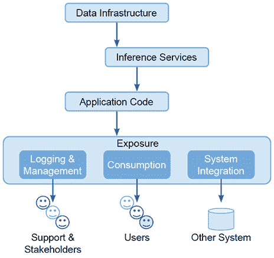
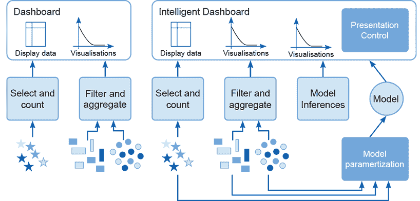
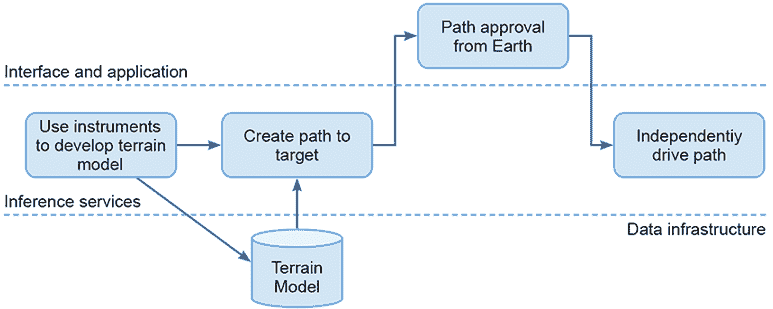
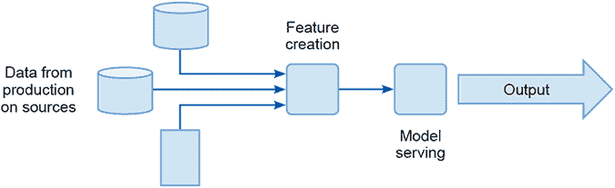

# 9 Sprint 3：系统构建和生产

本章涵盖了：

+   将你的模型嵌入到你将要构建的系统

+   处理非功能性影响

+   为生产构建数据和模型服务基础设施

+   确保用户界面是适当的

+   确保日志记录、监控和警报元素在生产中得到适当的治理和管理

在 Sprint 2 中，团队构建、测试并选择了支持 Sprint 1 中开发的故事的模型。没有更多的努力，这些模型无法用来产生价值；本质上，它们只是静止在仓库中的代码行。*为了成为有用的 AI，模型需要被实施在支持客户业务流程和客户交付的 IT 架构中。*

机器学习系统有两个特点，这是 Sprint 3 工作的重点，也是本章的主题。我们必须实施支持生产平台的数据基础设施，以确保模型在它们被训练的数据环境中运行。此外，我们需要检索和运行从 Sprint 2 创建的 ML 模型，以便系统可以工作。

在本章中，我们将讨论决定生产系统中需要哪些组件以及它们如何协同工作的过程。在后续章节中，我们将处理驱动数据层、模型服务基础设施和界面元素选择和交付的权衡和决策。首先，你和团队需要确定你们将要构建的机器学习系统的类型，这正是下一节要涵盖的内容。

## 9.1 Sprint 3 待办事项列表

表 9.1 总结了本章我们将探讨的任务。这些任务必须在项目进入生产并开始为用户创造价值之前完成。

表 9.1 Sprint 3 待办事项列表

| 任务编号 | 项目 |
| --- | --- |
| S3.1 | 确定用于嵌入模型的系统类型。 |
| S3.2 | 确定你正在构建的系统的功能和非功能影响。 |
| S3.3 | 构建生产数据流，使模型能够进行推理。 |
| S3.4 | 构建模型服务器和推理系统。 |
| S3.5 | 确定系统所需的适当接口组件。 |
| S3.6 | 选择一个符合接口开发方法，以便交付接口需求。 |
| S3.7 | 为系统构建日志记录、监控和警报组件。 |
| S3.8 | 确保模型治理和交接安排达成一致。 |
| S3.9 | 制作维护和支持文档。 |
| S3.10 | 制定预发布测试计划。 |
| S3.11 | 推送到生产。创建发布后测试计划。 |
| S3.12 | 提供发布后的认可和感谢。 |

图 9.1 展示了从使系统在生产中功能化的需求角度出发的机器学习系统。在顶部，有一个数据基础设施为系统提供输入。这可能包括来自用户界面的点击流或其他交互，但本质上，这些是模型进行推断所消费的信号。

图 9.1 中展示的架构使用推断服务根据数据流中的事件调用模型。此服务可能以批量模式运行，处理数据文件并为数据集中的每个实体生成注释。它也可能基于应用程序中的事件进行响应式运行。模型的输出被某些应用程序代码用于决定应该调用哪个服务。这可能只是向用户展示某些内容并据此做出另一个决定，或者将输出输入到机器的控制系统中。

图 9.1 展示了本章讨论的机器学习系统的抽象层和关注点

在图 9.1 的堆栈底层是曝光接口。除了通过发布模型推断与用户交互外，该系统还必须在这一层提供日志和管理数据（例如，在意外行为的情况下发出警报）以及为其他系统（例如编排信号）的集成信息。为了实现这一层的功能，以下是一些建议：

+   您可以使用 Big Table、Redshift、SQL Server、Oracle、Kafka 或 SPARK（以及其他许多）作为支持数据基础设施组件不同需求的数据引擎。

+   您可以使用 Kubeflow、Kubernetes、OpenShift、Flask、Tomcat 或其他引擎部署应用程序代码。无服务器组件，如 AWS Lambda、Azure 无服务器和 GCP 的云函数，提供了一种替代的托管和运行模型的方法。

+   您可以使用 Splunk 和 Grafana 等系统，以及 Angular.js 等用户界面开发框架作为曝光层。

## 9.2 机器学习实现类型

生产系统分析票据：S3.1

+   确定将用于嵌入模型的系统类型（辅助型、委托型、自主型）。

生产系统分析票据：S3.2

+   确定您正在构建的系统的功能和非功能影响。

为了使系统有用，您需要决定如何使用您创建的模型。在开发过程的早期，这已被考虑并进行了工作，但现在模型已经构建并选择了最佳模型用于使用。广泛地说，我们可以识别您开发的模型的三种设置类型：

+   *辅助型模型*：创建直接由人类消费的输出。在仪表板上总结的大量数据是一个辅助型模型。例如，如果您使用一组复杂的传感器读数来创建推荐，那么这是一个辅助型模型。

+   *委托模型*：创建一个独立于人类输入的控制信号，但在直接的人类监督和管理下。无论它们是否智能，由人类控制器监控的化学工厂运行系统、飞机制导系统和自动驾驶仪都是这类系统的例子。

+   *自主模型*：嵌入到没有人类控制或监控的系统，无论是长时间还是通过系统演化的转型。许多机器人系统和无人机是自主的，同样，在人类管理之外运行的自动高频交易系统也是自主的。

这些不同类型的系统位于自主性和人类控制的一个连续谱上。一个由机器学习驱动的系统越自主，人类控制和干预的机会就越少，但这也有其后果。用于驱动该系统的模型可靠性必须得到更高的保证，并且嵌入模型的系统工程必须更加鲁棒，并提供更高的保证。随着自主性的增加，三种设计力量作用得更强。

首先，随着系统变得更加自主，它们解释其决策的需求就越大。人类直接控制且人类对决策有代理和责任感的系统中的机器学习组件不需要像自主系统那样透明。我们可能能够理解人类控制系统中机器学习组件，但人类因素始终是模糊的。

其次，用于记录和记录系统开发过程的机制必须随着系统的自主性增加而变得更加鲁棒。部署自主系统的组织必须对其决策负责，而它只能通过有方法解释其开发过程才能做到这一点。

第三，自主系统需要更好的非功能性性能和更强的鲁棒性。如果系统突然停止或开始出现异常行为，没有人类可以介入接管。通常情况下，自主系统的用户在非功能性故障发生时，身体上无法介入或自救。

在查看第 3 个冲刺的生产系统分析票据后，你现在应该能够进行下一项任务。在本节下一部分，我们将更深入地探讨在构建使用机器学习的辅助、委托和自主系统时，你和团队必须处理的含义。

### 9.2.1 辅助系统：推荐器和仪表板

辅助系统旨在直接由人类使用。它们的价值由它们提供的人类检查的透明度驱动。辅助系统向人类提供建议，但它们不控制基于该信息和指导所做的决策。

辅助系统总结信息，提供预测，并使人类能够高效地消费这些信息以进行决策和创造洞察。通过使原本难以理解的信息用于创造价值，辅助人工智能系统在创造经济和科学价值方面发挥了作用，这些价值在其他情况下可能无法获得。

大型强子对撞机，一种高能粒子对撞机，是这种类型系统的良好例子。那里的实验利用了由挑战竞赛产生的机器学习技术，在庞大的数据集中寻找突破性的物理结果[2]。如果没有机器学习的这种辅助，物理界可能无法利用他们最强大的实验工具。

典型的辅助界面是仪表板。仪表板是一组可视化图表，总结了与特定业务问题相关的信息，使得快速检查成为可能。现在有各种各样的工具，包括专有工具（如 Looker、Power BI、Qlik 和 Tableau）和开源工具（如 Shiny 和 Dash），您可以使用它们来创建仪表板。

图 9.2 展示了左侧的标准仪表板与右侧的智能仪表板的对比，后者集成了由机器学习模型得出的输出。在标准仪表板中，数据通过聚合函数和选择过滤器进行转换和显示。在智能仪表板中，由于模型在信息上创建了过滤器（例如，用于去除异常值或噪声），因此会显示额外的信息，以便使用这些信息进行预测。例如，我们可以部署一个客户流失模型，该模型根据用户选择的值生成输出，以确定竞争对手的活动和销售投资。

这种预测为决策者提供了潜在或可能结果的指示。如果分布或预测中出现不希望的结果，那么客户可以通过找到使积极结果可能而消极结果不可能的参数设置来采取行动，改变方向。在客户流失的例子中，仪表板用户可能会发现，即使竞争对手的活动水平如何，增加销售投资也能创造出低客户流失率的结果。

图 9.2 左侧是一个简单的仪表板，右侧是一个智能模型驱动的仪表板

尽管图 9.2 中展示的智能仪表板集成了由机器学习模型得出的输出，但这并不是唯一可用的辅助系统类型。许多互联网服务使用辅助智能来增强他们提供的用户体验。服务和可用优惠的多样性和规模常常让消费者感到困惑，有时在没有支持的情况下几乎无法导航。我们可以使用机器学习来提供推荐和选择，从用户界面中过滤掉不相关的结果，并将用户的注意力引导到更具吸引力的选择上。

例如，你可以通过使用共现矩阵来实现一个推荐系统。你会将项目分类成组以控制矩阵的大小，然后在用户做出选择时增加共现的值。当用户在未来选择一个类似的项目时，你可以使用最高值的共现来生成一个能够激发用户兴趣的推荐。

假设西蒙观看了*星球大战*，然后是较新的*星际迷航*电影。较新的*星际迷航*电影被归类为科幻重启。当其他人观看*异形*等电影时，你可以向他们展示包含*星际迷航*、*沙丘*、*猿人星球黎明*、*疯狂的麦克斯：狂暴之路*等电影的科幻重启列表。表 9.2 展示了这种表示方式以及经过一次更新后，在众多设计假设下的样子。类别是预先选择的（任意选择），不允许自我相似。因为表格不记录同一类别的选择，所以算法总是推荐一个不同的列表。此外，没有提及如果处理的是自然类别的选择时应该怎么做。你是提供随机列表供选择，还是不提供列表？

表 9.2：观看*星球大战*后对电影的共现表更新，并偏好科幻重启电影。

| 类别 | 旧科幻 | 自然 | … | 科幻重启 |
| --- | --- | --- | --- | --- |
| 旧科幻 | X | 0 | 0 | 1 |
| 自然 | 0 | X | 0 | 0 |
| … | 0 | 0 | X | 0 |
| 科幻重启 | 1 | 0 | 0 | X |

现在，让我们进一步探讨这个系统。如果我们随机从推荐列表中选择一个项目，然后展示给用户作为他们下一部电影，那么我们可以说用户已经将选择权委托给了系统。系统变成了委托系统，这在下一节中会讨论。

### 9.2.2 委托系统

我们使用委托系统代表用户在无法直接逐个案例进行控制时做出决策。这可能是因为决策需要使用大量的数据，或者因为决策必须比人类能做出的决策更快。重要的是，委托系统提供了人类审查和纠正决策的机制，或者在自动化决策者失败时，可以介入并纠正系统的行为。

坚持不懈号漫游车 [1] 是一个典型的委托式人工智能系统的华丽例子。坚持不懈号是一个半自主机器人，它在 2021 年初登陆火星。它的任务是调查数十亿年前在一个大型撞击坑的洪水区域形成的岩石。它从一个岩石形成地移动到另一个岩石形成地，以发现和采样不同类型的岩石，从而有助于对该地区地质的了解。地球上的科学家和地质学家确定了漫游车的目标，操作采样和测试仪器和工具，并对它的系统和功能进行高级控制。图 9.3 展示了坚持不懈号如何独立行动，使用其传感器在其前方地形的一部分构建一个前进的预定路径。在将路径发送到任务控制中心进行批准后，漫游车将准备命令过程以驱动路径。一旦获得批准，漫游车将自行执行计划。

图 9.3 委托式遥控漫游车的控制流程 [1]

选择委托式系统模型用于坚持不懈号，因为它平衡了由与火星通信延迟带来的物理约束和最先进的人工智能方法创造的价值与风险。手动控制系统意味着漫游车的移动速度太慢，无法实现其科学目标。这是因为每次行驶迭代至少需要八分钟来完成（由于信号往返火星所需的时间）。一个完全自主的系统会将数十亿美元的投资暴露在太多的风险中，这是 NASA 无法接受的。这里描述的周期性控制是许多可用于管理委托式人工智能实现中系统自主性的机制之一。

另一种策略是将系统划分为独立的子系统，每个子系统在出现故障时不会造成系统性的或不可接受的损害。在子系统故障可以容忍的时间内或所需的资金内，您可以单独管理每个分区。

移动电话网络是这类系统的例子，我们可以使用分区策略来提供委托控制。网络中的每个小区都独立工作，为其分配区域内所有用户提供服务。例如，一个小区可能会因为其用户数据库失败或天线转向策略没有分配足够的功率来启用用户使用服务而出现故障。这种局部且有限的故障随后会被国家运营中心报告或检测到。他们根据通信监管机构对运营商施加的服务级别协议采取补救措施。如果网络提供紧急服务（例如警察、消防、救护车或海岸警卫队），那么可能已经实施了故障转移和复制措施来提供所需的覆盖范围。或者，系统可能设计了一个 24/7/365 的服务和维修团队，以便快速解决问题。

这种分区和快速恢复策略适用于许多应用。因为故障是系统固有的，它变成了一个负担，我们不能设计需要持续普遍可用性和服务的应用程序来依赖这种机制。生命维持系统可能有一种分区策略，其中一些元素在面临其他故障的情况下继续工作，但系统还必须包括一个合格的人员（比如护士）来操作故障元件，在它们损坏时。总的来说，系统（机器+护士）足够稳健，可以接受。

在设计委托系统时，团队可能会犯的一个错误是实施针对人工操作员的虚假控制。如果系统在修复错误为时已晚时将控制权交还给人工操作员，那不是委托，那只是简单的失败。在生命维持系统的例子中，想象一下如果护士只有在病人出现心脏骤停时才意识到机器的故障，那就太晚了；损害已经造成了。在现实生活中的例子中，飞机被控制系统置于失速状态，但在无法避免坠机的情况下才让人类飞行员介入[5]。悲剧的是，数百人因此丧生。显然，真正的飞行员（或护士）必须足够早地介入并拥有足够的权力来处理正在展开的情况，并且这个人必须有权做出避免灾难的决定。

由于人类和组织错误，可能会构建出这种类型的虚假委托系统。它们也作为避免实施真正自主系统约束和挑战的一种方式而被构建。不幸的是，通过假装存在一种可以介入并防止系统杀人或使人们破产的安全措施，可以规避创建足够信心部署真正自主系统并满足“我将把我的生命托付给它”或“我将把我的事业托付给它”的标准的证据。最终，这种方法会导致那些被欺骗而信任这种系统的人被杀害或破产。我们将在下一节讨论自主系统的额外要求以及强加在道德上和功能上成功的自主系统开发上的严格标准。

### 9.2.3 自主系统

自主系统被允许在没有人类干预的情况下独立运行和运行很长时间。我们将 Perseverance 漫游车描述为一种委托系统，因为控制过程被划分为元素，这些元素可以由人类审查和批准。如果 Perseverance 驶入沙坑（就像一些以前的漫游车所做的那样），那将不是因为机器学习和人工智能规划者失败了，而是因为操作不当。更准确地说，那是因为尽管团队尽了最大努力，但仍然出现了故障。机器学习团队在系统中构建了适当的控制措施，这些措施是适当的，因为团队平衡了系统的局限性和要求。

另一方面，自动驾驶汽车是一个完全自主的系统。如果你乘坐自动驾驶汽车并要求它带你去一个特定的目的地，你不需要对汽车在途中发生的任何事故负责。开发汽车并将其作为自动驾驶汽车卖给你的团队（在道德和伦理上，如果不是法律上）负责。自动驾驶汽车（至少就这次讨论而言）是一个操作上自主的设备。车辆执行从家到目的地的整个旅程管理过程；用户控制去哪里的战略选择，并且可能通过改变一些操作指令（例如，“走后路”或“慢点，我感觉不舒服”）来施加战术控制。

提供一个完全自主的系统对团队的要求远比提供一个辅助系统要严格。自动驾驶系统的开发证明了这一点。自 2007 年以来，自动驾驶技术已在城市环境中部署，如 Xei 等人所述[12]，但 15 年后，它仍未得到广泛应用。这是由于在现实世界中部署和运营自动驾驶车辆的复杂性和失败尝试。相反，自主机器学习系统被部署来管理和创建互联网上最受欢迎的社会网络和内容推荐系统的用户体验。

大型社交网络使用推荐系统算法来选择在订阅者时间轴上显示的帖子和信息。对于单个用户来说，这看起来可能是一个辅助系统的例子；他们能够在信息海洋中看到一条连贯的内容线索。然而，用户对于他们看到的内容或更重要的是，他们看不到的内容，没有选择权。社交网络是一个自主系统，智能地将其服务器上的内容定向发送给其订阅者。

自动驾驶汽车揭示了自主系统的一面；社交网络揭示了另一面。自动驾驶应用管理汽车的动能。社交网络没有局部化的动能，但它们具有全球和社会规模。没有人工智能，大型社交网络平台这样的应用是不可能的。自从这些系统开发以来，它们已经为它们的创造者创造了数千亿美元的收益。由于自主系统具有如此高的价值，创建人类无法处理的应用，管理超出人类能力范围的系统，而这些系统显然是危险的，它们本身是否本质上就是危险的。这并不是说它们不应该被构建和使用！

自主系统的力量和承诺使它们成为解决我们今天面临问题的理想候选者。你的任务是找到限制和管理它们开发和部署至今所揭示的基本危险和陷阱的机制。

目前，系统的意图和结构，以及应用的力量和重要性，驱动着这类项目中许多设计决策。随着实施阶段的进行，团队必须考虑所有这些决策与所有需要执行以交付最终系统步骤和活动之间的关系。

其中之一是建立一个生产数据基础设施，为应用提供其运行所需的数据。

## 9.3 非功能性审查

团队现在已经花费了几周时间与数据、基础设施和用户一起工作，他们应该对成功交付所需的内容有一个更为详细的了解。此外，你手中还有机器学习生成的模型，以及创建模型所需特征和输入所需的数据移动和转换模式现在已经定义良好。将这些事情结合起来，可以在处理时间、不同生产系统组件以及客户为每个元素提供动力所需资金和环境资源方面形成一个有意义的系统需求集。

处理时间需要从延迟（响应服务请求的时间）和吞吐量（在给定时间内可以完成多少个服务请求）两个方面来考虑。表 9.3 显示了在审查重新实现和迁移的训练管道时，你和团队必须考虑的一些要求的长列表。

表 9.3 机器学习系统中的非功能性需求

| Requirement | Description | Notes |
| --- | --- | --- |
| $Cost | 执行系统的成本。 | 需要考虑长期使用但成本较低的基础设施与短期使用但成本较高的基础设施之间的权衡。 |
| Environmental cost | 每次使用服务所能接受的环保损害量。 | 应当考虑环境影响，包括温室气体排放以及空调和冷却系统中使用的有害化学物质。应意识到金属（如稀土和金）的消耗，这些金属可能在某些领域部署你的服务时涉及。 |
| Latency/wall clock | 从服务请求到结果交付所经过的时间。 | 在某些应用中，这被视为一个平直的要求，例如小于 0.5 秒；或者，可以作为一个关于分布或结果范围的期望来呈现。 |
| Throughput | 在给定时间内可以处理的服务请求数量。 | 这定义了系统可以同时支持多少客户使用服务。 |
| Queue policy | 对处理超额请求的优先级。 | 如果请求数量超过了系统吞吐量所能支持的数量，或者请求无法在所需的时钟时间内得到处理，系统应该采取什么行为？是否应该强制执行严格的先进先出/后进先出行为？是否有其他要求来优先处理某些请求？ |
| Failure policy | 当请求无法在不违反非功能性需求的情况下得到处理时，应该发生什么？ | 一些系统应该静默失败，一些系统应该提供异常/失败响应和消息，而一些系统应该在非功能性要求之外处理请求。在某些情况下，在失败后关闭系统甚至可能是适当的。 |
| Durability | 服务在无故障状态下运行的时间长度。 | 一些系统随着时间的推移会变得不可靠。确定模型必须在服务中工作多长时间，这决定了需要采取哪些措施来减轻这种情况。 |
| Reliability | 系统可以容忍多少次故障（非功能性需求违反）。 | 应当考虑所有故障来源，同时也要逐一审视它们。 |

模型和管道，以及系统的设置，现在都已掌握。这些是您的团队将集成到系统中的组件部分（无论系统如何构建）。现在您可以确定 E2E（端到端）的性能预期。然后您可以确定是否能够达到您所追求的目标。

## 9.4 实施生产系统

本节旨在帮助您实施生产系统。作为提醒，让我们看看与该任务相关的冲刺 3 票据。

系统实施票据：S3.3

+   构建生产数据流，以使模型能够进行推理。

系统实施票据：S3.4

+   构建模型服务器和推理系统。

系统实施票据：S3.5

+   确定系统所需的适当接口组件。

系统实施票据：S3.6

+   选择符合接口开发方法，以便交付接口要求。

### 9.4.1 生产数据基础设施

您的模型将进入生产环境，将集成到应用程序中，并且它们必须有效运行。生产基础设施有两个关键组件：将应用程序数据导入模型的管道，包括创建特征的过程，以及将调用并执行模型以产生结果的模型服务基础设施。数据来自许多不同的来源。例如，如果用户点击购物车，有来自点击的数据（哪个按钮，自上次点击以来有多久等），来自购物车（存储先前选择的数据存储），以及来自用户数据存储和商业环境。

图 9.4 展示了这一实现模式的高级视图。数据从存储和操作活动（如用户界面点击或传感器数据）流入。处理这些数据将其转换为模型期望的特征和格式。（此步骤复制了训练和测试管道中使用的流程。）然后，一种机制将这个数据实体传递给模型的运行实例。

图 9.4 生产机器学习实现的抽象视图。数据被拉入并收集在特征创建过程中，然后提交给运行实例的模型（用于生成推理和输出）。

在冲刺 1 中，您创建了训练数据管道，并使用这些管道管理训练数据。在冲刺 2 中，您实现了测试环境的管道，复制了训练环境中的数据交付管道到测试环境。现在您和团队需要构建生产管道，将数据输入选定的模型。在生产环境中执行此操作的可用的硬件和系统通常与开发中提供的不同。

表 9.4 描述了您和团队可能现在面临的一些选项。您构建的数据管道原本是为了从预定义资源中为模型提供示例，现在必须在生产基础设施上运行。不幸的是（对所有人来说都是如此，尤其是对机器学习工程师来说），数据技术已经经历了许多代的发展。您和团队可能会遇到其中任何一代。在最坏的情况下，您可能会同时遇到所有这些。表 9.4 提供了生产环境中可以预期的数据源和数据引擎类型的概述。感谢您的幸运之星，您不需要用 COBOL 来拉取管道的数据。

表 9.4 数据引擎及其在生产服务中的应用

| 数据引擎类型 | 特点 | 用例/备注 |
| --- | --- | --- |
| 内存存储（Redis, Memcached） | 极高的速度，但不持久或数据安全。可能成本高昂。 | 需要高速/低延迟的推理结果，且数据转换和处理相对简单。 |
| 数据湖（HDFS, S3）加处理器（Hadoop, EMR, Dataproc, Databricks） | 使用灵活的文件系统和大规模处理进行存储。 | 需要大型的离线且成本较低的数据转换；通常与更快的存储配合使用以支持推理服务。 |
| 数据仓库（BigQuery, Redshift, Oracle Exadata 等） | 用于训练数据的托管数据存储（通常是默认选项）。 | 提供通用引擎的灵活分析数据基础设施，用于服务于模型。 |
| RDBMS 事务服务器（Oracle, MySQL, Postgres, Spanner） | 如果设计得当并优化良好，具有良好的应用性能。在极限情况下可能会遇到困难或变得昂贵。 | 提供直接重实现层，以最小的技术更改加速管道。 |
| 文档存储/NSQL (Mongo, CouchDB, Cassandra, Big Table) | 高速；擅长处理大型对象。 | 需要检索大型非结构化对象并服务于推理服务。 |
| --- | --- | --- |

现代的方法是在生产环境中通过一个访问层抽象数据源。在这种情况下，团队无法访问或查询他们将从其中获取数据的实际数据库。相反，他们将被提供一个 API 地址，该地址会自动调用查询。这种模式有很多优点。主要优点是通过引入抽象层，系统与其依赖的源的实施细节解耦。

如果在生产架构中您没有采用这种方法，那么自己实现它可能是个好主意，这样您就可以应对未来的架构演变。如果系统中的所有调用和交互都通过一个控制良好且文档齐全的 API 进行管理，那么处理数据库升级会容易得多。

无论使用哪种基础设施，关键挑战都是复制在冲刺 2 中开发的实际数据管道，该管道支持向模型展示的示例构建。您将能够重用大部分已开发的代码，但这一转变通常需要您进行更改。这可能导致一种情况，即尽管生产中使用的模型是团队开发并测试的模型（所有创建和使用的工件都经过仔细保存），但由于数据管道将新的偏差引入其中，其行为可能不同。控制这种行为的办法是回退到在冲刺 1 中开发的测试数据系统，以确保为模型构建生成了正确的数据。

测试和验证数据管道的实际和预期行为是保证模型精确性的关键保证。下一节将探讨另一个方面。生产系统需要考虑的第二个方面是模型服务机制。

### 9.4.2 模型服务器和推理服务

**推理服务**是一种提供优化和高效计算和存储以执行您的模型的机制。它是一种满足本项目对延迟、规模（请求数量）和成本（总体而言，考虑到预期的请求数量）要求的执行机制。推理服务是您用来应对在生产环境中运行大型和复杂模型挑战的设计和实现模式以及包。

一个大规模或普遍的机器学习系统在其生命周期中可能会调用数十亿次支持其运行的模型。如果仅对优化进行 1%的改进，那么这相当于数千万次的模型调用。像 Google Translate 或 Facebook 推荐系统这样的系统支持一个庞大且持续的收益流，因此一个专业团队负责实施和支持机器学习计算组件的生产服务。这个团队能够磨练和优化执行框架，以支持这些系统的所需规模和性能。

在许多其他场景中，尽管可以提出一个业务案例，表明它们是一个具有成本效益的投资，但一个专门的团队（或多个团队）在组织上可能不可行。组织常常在现金流或战略需求上挣扎，这些需求将投资从具有成本效益的活动中撤出，以减轻竞争或监管的生存风险。尽管一些地方有运行良好的机器学习机器在生产中嗡嗡作响，但世界上的其他地方必须尽力而为。

除了使用定制实现的昂贵（且风险高）方法之外，还有两种方法。第一种是使用主流执行引擎，并对其进行最小化定制以支持您的机器学习函数。表 9.5 列出了各种执行引擎。

表 9.5 使用通用执行引擎为机器学习模型

| 引擎 | 备注 |
| --- | --- |
| 在数据库中：BigQuery ML, Redshift ML, Oracle OCI, Vertica PMML | 在数据库函数中执行意味着接受对应用程序运行方式的限制，但这是一种模块化和解耦的方法。 |
| 应用服务器：NGINX, Apache Tomcat, Flask, Appserver | 用于通用低规模和宽容的延迟/成本用例。考虑到技能和设置要求的低门槛，可以考虑使用。 |
| 类似 SPARK 的解决方案：Apache SPARK, Databricks, Dataproc | 在宽容的成本和延迟要求下，提供良好的批处理和流处理支持。 |
| Kubernetes, Kubeflow | 提供对交互式应用的支持，具有灵活可扩展性和宽容的成本要求。 |
| 无服务器：Lambda, Cloud Functions, Azure Functions, Cloud Run | 一种灵活、模块化和解耦的方法，在某些应用中成本效益高且性能出色，但可能以不可预测的方式变得昂贵。 |

所有这些选项都有其权衡和好处。在许多应用中，在数据库中运行机器学习是合理的，但这样做会影响数据库的行为，并且可能成本高昂。此外，数据库执行必然缺乏灵活性；数据库引擎的更新和维护是基于其作为数据库引擎的性能，而不是作为机器学习引擎的能力。最新的机器学习技术不会出现在你使用的数据库中，至少不会出现在与软件堆栈的其他核心关注点联系不那么紧密的引擎中。

我们使用应用服务器从网页和应用程序中调用执行。手机或浏览器的前端调用应用服务器进行一些离设备的服务器端处理，应用服务器提供响应。这些系统通常是大规模并行和可扩展的，并提供了最先进的负载均衡和错误管理。毕竟，它们是处理数十亿用户请求的系统，这些请求是我们每天使用的许多互联网服务的一部分。

类似 SPARK 的解决方案提供了多种管理内存中并行性的方法，并支持访问包含运行模型所需数据的文件系统。SPARK 是一种主流编程方法，因此许多开发者都具备这项技能。SPARK 与 Python 和 R 的模型实现交互良好，因此其成本通常较低。SPARK 对于按需应用来说可能成本高昂，而且不适合极低延迟的应用。

Kubernetes (K8s) 提供了一个可扩展的持久处理系统。在云环境中，你可以将其用作托管服务，这特别吸引人。然而，对于突发工作负载，Kubernetes 可能成本高昂。

最后，无服务器系统在提供对突发工作负载的极大规模按需处理方面表现出色，但与像 K8s 这样的持久、始终在线的方法相比，它们的启动延迟相对较高。在无服务器方法背后的定价模型方面，我们必须谨慎。如果云服务提供商决定改变无服务器引擎的定价方法在商业上是合适的，那么这可能会对使用它的任何机器学习系统造成破坏。确保您有一个退出策略。

第二种方法是使用从底层设计来支持机器学习调用的引擎。然而，这种方法的兴趣在机器学习社区中起伏不定。在人工智能的古老历史中，像 Withington [11] 描述的 Lisp 机器这样的专用计算平台被开发出来，但被像 Intel 8086、Dec Alpha、Sun Spark 和 Motorola 68000 这样的主流处理器所取代。也许机器学习服务器引擎也会发生这种情况，但也许不会。像 OpenVINO [7] 和 TensorFlow Serving [4]（Google 2021）这样的引擎被优化来管理模型的执行，这些模型实际上是由浮点数操作创建的数百万或数十亿的正则化激活。此外，预构建的引擎还提供了针对处理器指令集的优化优势，例如 Google TPU 或 Intel 处理器指令。

确定您数据流的生产实现、用于使模型活化的处理以及执行它们的处理表面非常重要。然而，如果用户看不到正在发生的事情，或者他们没有足够的控制来以他们需要的方式操作它，那么这一切都是徒劳的。鉴于良好用户体验的重要性，我们将在下一节中讨论这个问题。

### 9.4.3 用户界面设计

许多人会认为，任何系统的起点都应该是它对其支持的人产生的影响。 “设计思维”的倡导者可能会支持需要结构化流程来揭示可用性约束和需求。Liedtka 的 HBR 文章 [6] 中的一个好例子是不合适的医院预约系统。它的用户是老年人，不擅长使用电脑，以及由于导致他们使用系统的疾病而感到不适和迷失方向。从这个角度来看，在了解它将如何被使用之前构建一个聪明的自动化预约系统是金钱和时间的浪费。

另一个由于不适当的界面导致的失败例子是波音 737 MAX 飞机及其 MCAS 系统。该系统旨在使飞行员飞行变得容易，提供在飞机失速时支持飞行员的控制。理论上，这将避免可能导致飞机坠毁的危险事件。该系统的激活灯是驾驶舱配置中的一个昂贵的可选额外设备，因此一些航空公司选择不在他们购买的系统中包含它。不幸的是，这意味着飞行员在系统激活时并不知情，如果它只在失速条件下打开，这可能没问题。然而，在某些情况下，损坏的传感器意味着系统在飞机正常飞行时激活，导致飞机向地面俯冲，并以飞行员不理解甚至不知道如何应对的方式行事[8]。显然，隐藏模型的工作原理导致了数百人的死亡，因此，737 MAX 被停用并进行了返修，造成了数十亿美元的商誉损失。

Saleema Amershi [3]于 2019 年发布了一套开发 AI 系统的指南，总结在表 9.6 中。尽管 Amershi 谈论的是 AI，但很明显，这些指南（编号为 G1 至 G18）主要关注包含 ML 模型的系统，因此与你的项目相关。你会注意到表 9.6 中标注了一些星号。这些星号表示对 ML 项目中的 UI 设计师特别重要的指南。虽然本章中提出的所有指南对系统价值和成功都具有重要意义，但 G1、G2、G4、G5、G6、G8、G10、G14、G15、G17 和 G18 这些指南尤为重要，因为这些可以防止灾难性失败。这些指南侧重于防止 ML 系统犯下*越权之罪*，即一个表现不佳的系统比让用户自行决定更糟糕。

表 9.6 AI 设计指南（改编自 Amershi [3]）

| 何时使用 | 数字 | 设计指南 |
| --- | --- | --- |
| 初始时 | G1* | 清楚地说明系统能做什么和不能做什么。 |
| G2* | 除了描述系统的功能外，还要阐明系统工作得有多好。 |
| 在交互过程中 | G3 | 考虑到用户的当前任务和环境进行主动交互的时间。 |
| G4* | 显示与用户当前上下文相关的信息。 |
| G5* | 以用户能够反思其社会和文化背景的方式提供信息。 |
| G6 | 确保信息和说明不反映不公平的社会、性别或种族偏见。 |
| 当出错时 | G7 | 支持高效的调用，使系统工作变得容易。 |
| G8* | 即使在失败后也要使系统易于关闭。 |
| G9 | 通过使系统输出和动作的更正和编辑变得容易来支持高效的更正。 |
| G10* | 在不确定的情况下确定服务范围。如果系统不确定，则从用户那里获取更多信息，或者在不确定用户目标时优雅地降低服务。 |
| G11 | 使用户能够访问有关系统行为的解释。 |
| Over time | G12 | 记住最近的交互，并在内存中保持这些交互，以便用户可以使用这些记忆来获得服务。 |
| G13 | 从用户行为中学习；根据用户个性化系统。 |
| G14* | 谨慎适应。限制对系统行为的破坏性和意外变化，特别是在用户基于其期望有需求的地方。 |
| G15* | 鼓励细致的反馈。使用户能够提供有关性能的有意义的信息，并确保有机制可以实现这一点。 |
| G16 | 当用户的输入改变系统的行为时，通知用户。 |
| G17* | 允许用户监控和控制系统的行为。 |
| G18* | 通知用户关于变更的信息。当 AI 的能力更新或增强时，通知用户以便他们可以修改他们的期望。 |

这些指南可以帮助创建一个特定系统所需的仪器和控制列表。书中之前讨论的智能建筑示例可以作为我们深入了解指南细节的例子：

+   *G1:* 建筑中的每个人都应该意识到环境是由 AI 系统管理的。我们可以创建标牌让人们知道，建筑网站也可以在页面上添加关于系统的说明。|

+   *G2:* 应共享现场测试和验证期间的性能信息，并解释结果。关注碳减排，解释这可能意味着在非工作时间，建筑的一些部分比正常情况下更凉爽。|

+   *G3:* 确保系统在核心业务时间不进行温度和照明的激进调整。|

+   *G4:* 确保特定建筑区域的环保和能耗信息可用。|

+   *G5:* 在展示环境和能源信息时，考虑原始数字对用户的相关性。将信息与先前数据相比较，并解释差异。将好处与用户可以理解和同情的项目相关联；例如，对于碳减排，“砍伐的树木数量”或“抵消所需的森林公顷数”。|

+   *G6:* 在系统的性能中考虑诸如生物学等因素。例如，人们常说女性比男性更容易感到寒冷。确保这一点在系统的行为中得到考虑。同时，确保任何用户测试小组中男女比例均衡，并询问他们各自对系统性能的看法。|

+   *G7:* 提供投诉和管理流程。建筑的用户应该联系谁，以及如何联系？|

+   *G8:* 考虑系统可能会失败，可能需要关闭。确保建筑管理者知道如何这样做，并且用户知道如何联系建筑管理者。

+   *G9:* 提供控制选项，让建筑管理者能够以有意义的方式控制系统。如果用户抱怨建筑太热或太冷，提供修改系统行为的方法，使其保持使用状态，即使不是最优的。

+   *G10:* 确保建筑有一个安全选项，在传感器网络和控制器产生模型没有强烈响应的输入时，将其恢复到稳定温度。

+   *G11:* 记录系统正在做什么，并以友好的方式提供对该日志的访问，以便用户可以检查决策过程，以在长时间内调节或增加能源使用。

随着时间的推移，根据 G1-G11 指南开发的界面为用户提供了一种反馈机制，并确保公司管理者能够收到反馈。因此，提供一个反馈页面，您可以在此记录管理者采取的行动，然后将其发布，让用户可以看到他们的反馈是如何被处理的。为 G11 提供的便利避免了困难的一点：解释模型所做的事情可能具有挑战性。Rudin 将其详细描述为在重要应用中采用和使用 AI 系统的障碍[10]。

在选择模型时，应该考虑预期应用中的透明度要求。这是一个强烈的需求，也是第八章决策的一部分。然而，有时根据项目中的所有需求和挑战选择的最佳模型可能是不透明的。例如，支撑蛋白质结构预测的 AI，AlphaFold 2，是一组极其庞大且晦涩的深度网络。这些网络是不可解释的，但如果它们是可解释的，那就太好了，这样生物学家就可以了解 AlphaFold 2 是如何以及为什么这样做。AlphaFold 通过渲染它创建的结构，显示它们与先前假设的结构有何不同，以及它们是如何工作的，提供了一些折衷的能力。这允许科学家评估和直观 AlphaFold 做出的黑盒预测的有效性和价值。

对于用户和您的团队来说，最好的做法可能是使用事后解释机制。为深度网络如 AlphaFold 2 提供推理解释的一种流行方法是提供激活图，显示哪些处理过的图像的部分在网络上引起了最高级别的活动。支持这种解释风格的流行软件包是 LIME [9]。

提供事后解释的艺术一直在提高，但在鲁丁[10]中对此有强烈的批评。你必须做出的判断是，提供关于系统行为的误导性解释可能造成的伤害是否超过了忽视不透明系统可能为用户提供的价值所造成的伤害。明确说明解释是指示性的，可能不准确，这可以稍微减轻这种潜在伤害，但用户实际上是在你的手中。这是你的责任；请谨慎行事。

## 9.5 日志记录、监控、管理、反馈和文档

支持和管理组件：S3.7

+   为系统构建日志记录、监控和警报组件。

支持和管理组件：S3.8

+   确保模型治理和交接安排已达成一致。

支持和管理组件：S3.9

+   制作维护和支持文档。

如果你正在将系统交付到生产环境中，那么实施一套允许技术支持团队操作的管理和行政接口是必要的。ML 系统也不例外。系统需要生成有信息量的日志信息，以便你可以了解它是否按预期运行，并在出现问题的情况下追踪发生了什么。它还需要在失败之前生成警报，最好是失败之前。

对于正常的软件系统，性能监控是非功能性的。从功能的角度来看，我们可以期望软件在没有错误的情况下正常工作。ML 系统在生产中也可能出现功能故障，因为世界在变化，在冲刺 2 中用 ML 算法提取的模式和行为可能不再相关。这可能是因为产生 ML 预测需求和行动的实体发生了变化。也许其中一些已经变老并死亡；也许其他压力，如经济变化或新技术的引入，已经从根本上改变了该领域的动态。例如，一个基于流媒体普及之前的数据提供良好音乐销售预测的模型可能会在今天失败。因此，这意味着我们必须记录和警报功能系统行为以及非功能行为，以解码这种功能故障可能发生的时间、地点和原因。

我们需要在系统日志中记录和捕获与其操作相关的所有事件，例如数据库连接、用户登录、数据更新和模型决策。日志记录的频率和密度由应用程序决定，日志本身的保留期也是如此。显然，计算性能指标对系统造成的负载以及存储日志数据都有成本。这通过你在开发系统时建立的应用程序需求来平衡。

日志的密度是由需求和性能考虑驱动的。警报系统的性能受限于人类如何有效地与之互动。支持小组经常抱怨警报风暴，每 10 分钟就会让他们的板上所有灯都变红，并向所有设备发送消息。这些警报通常被忽视，几乎可以忽略不计。这种警报行为的糟糕副作用是，有意义的警报在垃圾信息中丢失，也被忽视了。

除了日志记录和警报之外，系统还必须具备您可以使用来控制和管理的执行器。管理功能可以简单到请求重启以清除队列满或内存分配失败等问题。尽管希望交付的系统无错误且完美，但基于这种假设的计划是不明智的。提供重启按钮可能是一种既经济又有效的解决方案，以应对意外问题。这也可能足以让一个宝贵的系统在现场运行数年，而不会出现其他情况。

在生产环境中使系统可支持的一种强大方法是让用户能够提供反馈。这在部署的早期阶段尤其有用，因为开发组仍然可以实施任何所需的修复。提供反馈机制是基本要求；你必须这样做。然而，更重要的是要让用户使用它。一种好的方法是直接询问他们对系统的看法。

例如，考虑实施一个支持在互联网上监控客户投诉的系统（例如，在 Twitter 或 Facebook 上）。系统的用户可以被视为在客户组织中无权力的呼叫中心操作员，由于社会和文化原因，他们无法反对公司的系统。假设当提供了一种关于系统性能的反馈机制时，他们会发布许多投诉。一个投诉是系统响应时间过长，他们有时会超时。起初，这似乎很荒谬，但当调查后端数据库的查询时间时，团队发现一些查询运行了数分钟。这使得系统既慢又令人沮丧，也破坏了 ML 系统旨在创造的所有好处。

在我们的例子中，生产中系统的问题出现是因为生产数据库没有按照预期的方式进行配置和索引。团队不知道这一点，因为没有任何测试显示这一点。通过给数据库团队打一个电话，问题就得到了解决。这个轶事的要点是，尽管进行了测试、日志记录和监控，但开发团队可能对生产中的问题视而不见。向用户询问很少会伤害到他们，并且（正如这个案例所示）可能非常有价值。

机器学习系统的一个特定特征是，随着时间的推移，系统的输入价值可以随着世界的发展和前进而改变。监控系统输入以检测这些变化是日志和监控支持机器学习系统治理的一种方式。这一点将在下一节中更深入地讨论。

### 9.5.1 模型治理

在某些应用中，第一天运营中实施到系统中的模型被成功使用，直到技术状态或应用需求的变化使它们过时，然后它们被从服务中撤回。在其他应用中，领域的变化，可能是由时尚的波动、通货膨胀、社会结构或人口统计引起的，意味着模型变得过时，其性能开始下降。使用机器学习的组织可以部署数百或数千个模型和系统，但除非这些模型在系统性的管理和治理框架内交付，否则将陷入混乱。

一个基本的治理结构要求支撑系统和模型的负责人在客户组织内部进行注册。模型必须由某人拥有。我们还必须提供访问和理解模型所需的所有材料和信息，以便所有者可以随着其发展来处理它。治理系统至少应允许识别系统所有者（负责并有权就系统做出决策的人），并将所有使系统能够被审计、管理、维护和支持的工件链接起来，以便于发现和访问。此外，治理系统要求记录和读取生产系统的历史：

+   系统是在何时实施、更改和审查的？

+   系统问题何时被检测和记录，以及采取了哪些措施来处理这些问题？

+   如果系统被停用，它是在何时被撤回的，以及它和其授权及操作的相关记录将在何时被删除？

在官僚主义的繁琐中消失的一个核心要求是，模型所有者必须能够判断模型何时出错，并且必须能够将其关闭、修复或替换为其他东西。一个关键步骤是知道模型已经出错。在生产环境中进行一些简单的检查可以揭示这一点；例如，计算模型做出的分类类型，并在发现太多某一类型时发出警报。然而，一个更复杂的方法是将断言构建到模型服务器中，并在这些断言被违反时进行记录和警报（Kang 等人，2020 年）。

你还必须为意外情况做好准备。这就像任何业务连续性计划一样；基本的前提是，如果总部因地震、恶劣风暴或其他不可预见的事故关闭一周或一个月，企业不会破产。每个企业都应该有应急计划来应对这种可能性。对于模型也是如此！如果模型停止工作，无论是什么奇怪的原因，使用这些模型的企业不应该被遗弃。例如：

+   聚合行为或多数类预测（附带适当的警告）能否为模型提供一个更低价值的替代品？

+   你能提供一些工作效果不那么好但可能更稳健的旧模型吗？

+   你能关闭模型，让用户在没有它的情况下管理一段时间吗？这个时间是多长？在这么短的时间内调试、重新测试和修复模型是现实的吗？

在下一章中，这些问题将变得非常重要，因为它们将影响你未来的工作。在转向生产之前，通过制定实际的发布后安排，你可以避免很多痛苦和麻烦。

### 9.5.2 文档

在项目期间，你应该已经产生并归档了大量文档。所有这些都是极其有用和宝贵的，但为了交付一个可维护的系统，团队需要准备一些额外的文档来支持系统的运行。这些文档包括：

+   一个生产团队组织结构图

+   运行手册

+   技术概述

+   故障排除指南

你可以使用生产团队组织结构图来回答谁负责系统，如何联系他们，以及他们需要哪些凭证、知识和培训来完成工作？同时，确保生产团队的设置和结构考虑到了假期、疾病和继任问题。人们积极地说，人们最好覆盖他们被叫去处理的事情，这是可以的。但万一有人辞职，或者更糟，他们去世了？那么，你就陷入了困境，所有的姿态和吹嘘都只是个笑话。

运行手册允许一线和二线支持在系统因其他系统或其支持硬件中的故障或问题产生错误时进行故障排除。其他支持团队可能会修复这些错误的根本原因，但相关的“请修复此问题”的工单需要提出，并且你需要告诉用户发生了什么以及正在采取什么措施。运行手册应提供日志和监控系统可能产生的每个错误状态的信息。其中一些可能只是简单地说“数据错误：升级至技术团队”，但许多也会提供简单的修复方法，例如“使用 app_server_restart.exe 脚本重启应用程序服务器。”

技术概述为新工程师提供简报，使他们能够快速了解核心组件和概念。这个概述通常链接到团队生成的文档存档，因此应被视为系统的高级地图，而不是详细的深入研究。本质上，团队应该想象他们被提供了代码库和开发文档。他们需要什么才能快速开始？至少，文档应包括一个显示系统主要组件及其处理分配的图表，还应显示系统中的数据流视图：数据来自哪里，在哪里被访问、存储和处理。

为了设置故障排除指南，要求团队发挥想象力。系统可能存在哪些错误？他们会如何修复它？

确保团队特别注意系统中 ML 组件和模型的文档。开发文档涵盖了建模的技术架构和方法，但文档必须详细说明：

+   如何独立调用模型（要运行的文件，如何向其中传递数据等）。

+   如何保留模型（再次，要运行什么，如何运行，以及环境先决条件）。

+   如何评估模型的行为（参考项目文档，但明确说明模型如何向用户交付价值的重要性）。

开发这些文档所需的努力相当大，并且显然与您正在开发的系统的复杂性成正比。这样做的好处是巨大的；一套良好的生产文档与一个丰富的开发档案相结合，为系统的后续开发和维护提供了一个极好的资源。

## 9.6 预发布测试

测试票据：S3.10

+   制定预发布测试计划。

团队可能认为在冲刺 2 中已经做了足够的测试，但残酷的现实是，部署生产系统还有更多工作要做。大多数组织都有测试标准（有时称为 VV&T，即验证、验证和测试）。你和团队将需要制定并完成一个测试计划，然后由客户的 IT 部门签署为完成。通常，测试计划要求你进行单元测试、系统测试、集成测试和验收测试：

+   *单元测试:* 开发者用来证明其代码工作的本地化测试。

+   *系统测试:* 展示代码按预期执行；例如，测试模型和测试非功能性元素都是系统测试。

+   *集成测试:* 展示不同的系统模型按预期协同工作；例如，生产数据库与执行特征提取的代码一起工作。

+   *验收测试:* 展示系统满足使其对业务目的或用户目的有用的标准。

在系统开发过程中，团队进行了大量的单元测试（例如，在冲刺 1 中描述的数据测试）和系统测试（如冲刺 2 末期的广泛工作）。验收测试应由在冲刺 2 开始的 UX 工作来促进。然而，现在需要创建单元和系统测试的某些方面，并且需要通过集成测试来测试数据基础设施、UX 和模型服务基础设施。任何与 ML 系统集成的其他应用程序元素也需要集成测试。现在要完成的工作是：

+   收集和整理到目前为止进行的单元和系统测试。

+   将 UX 工作中的验收测试正式化和组织化。

+   确保生产组件有适当的单元和系统测试。

+   设计并执行集成测试，以确保实施的整体系统运行正确。

+   确保测试计划得到认可，是一个合适的计划。

+   将你的预生产测试集成到自动化测试系统中，并成功运行测试。

最后，获得必要的批准，表明团队成功执行了接受的测试计划，并且 VV&T 小组同意该系统可以投入生产。将一个有用的 ML 系统交付所需的测试与更标准化的软件所需的测试之间存在显著差异。其核心是从数据中提取的模型的表现和行为。

在撰写本文时，大多数组织对测试其模型所要求的标准远低于我们在第八章中详细说明的标准。希望这会改变。在此之前，你和团队是专业人士和专家。测试标准和质量要求是后盾和提醒，表明你需要证明你为什么被支付来做你所做的事情。你的测试计划表明，你已经完成了你所期望的一切，以创建一个健壮且可靠的工件，交付给你的客户和用户。

## 9.7 伦理审查

检查伦理方面的所有事项是否按计划进行是否太晚了？当然不是！在这个阶段，团队需要确保没有出现他们在之前的练习中没有考虑到的新问题，并且他们需要整理好为所有伦理评估准备的文档。这项工作是在项目开始前、EDA 之后以及模型选择决策过程中完成的。

现在系统整体已了解，你和团队需要审查其部署的伦理后果。如前所述，有许多持续的努力去理解 ML 系统的伦理影响和许可；系统的上下文决定了团队将采用哪些，如果有的话。此外，预计这个领域将迅速发展，你和团队有责任采用最佳实践来确保你构建的系统是符合伦理的。为此，检查以下内容：

+   负责该系统的人是否清楚地理解了系统的管理方式？

+   是否有一个适当的治理流程在位，可以随着时间的推移管理系统的行为和影响，即使现在执行它的人已经离开？

+   系统的性能是否通过它对其用户和其他在其操作环境中的影响来理解和衡量？团队能够证明这一点吗？

+   系统的界面是否提供了足够的信息，使用户能够理解它在做什么？

    +   管理系统行为的现有控制措施是否有效且适当？

    +   用户能否有效地利用控制措施，以便他们可以合理地对其系统的行为负责？

+   你已经咨询过系统用户和受其使用影响的人了吗？

    +   团队评估了系统对那些人的影响了吗？

    +   你的团队能否完全理解系统可能造成的任何伤害，并且这种伤害是否明显被系统的效用所抵消？

关于最后一点，在伤害的情况下，确保有一个负责任的人或者有权威和能力的某人可以就系统的效用做出判断。

## 9.8 提升至生产

将你的系统投入生产的工单：S3.11

+   提升至生产。

+   创建发布后测试计划。

那个伟大的日子到来了！一切都已经签字批准，系统既不危险也不恶意，它运行正常，并且具有价值。每个人都喜欢它，那么接下来会发生什么？你安排发布的时间/日期。在 DevOps 环境中，这可能就是系统达到首次发布标准的那一天。在更加僵化的企业环境中，可能会有每周发布日或者（更可能的是）每季度发布日，并且确实预期在圣诞节、新年和财务报告季节这样的里程碑日期会有冻结。一些企业在对交易或安全至关重要的时期也会有较长时间的发布冻结。

一旦所有人都同意了日期和时间，在现代项目中，你将运行一个批处理文件（可能通过点击按钮或通过执行命令行指令），将所有必需的系统工件转移到生产环境中，并使其可供调用。通常，我们会运行发布后测试来证明系统已经完全且正确地转移，并且它确实正在运行。这意味着团队有四项工作要做：

1.  开发将所有文件提升到生产环境的 CI/CD 流程。

    希望这是通过标准开发管道工具（例如，Jenkins）完成的。有时，尤其是在前沿项目中，可能会有一些部署的边缘情况需要另一个解决方案。重要的是不要最终得到一堆便利贴，或者更糟糕的是，像民间传说风格的口头指示来定义部署过程。尽可能坚持自动化（以及易于使用的自动化）。为什么？因为推向生产既令人兴奋又令人紧张，而且经常出错。你可能不得不重新调整和重新设计系统。自动化是你的朋友。

1.  创建发布后的测试计划。再次自动化（就像所有你的测试一样），并确保你知道它将如何运行以及如何在生产中部署。这通常是常规推广活动的一部分。

1.  执行推广/发布任务，包括测试。

1.  运行发布后的测试并验证结果。

正如提到的，生产部署出现问题的并不少见。重要的是你要为这种意外情况做好准备。确保有关键人员可用以介入，并且他们拥有凭证和权限来完成任何最后的障碍。

## 9.9 你还没有完成

当你认为你已经完成时需要完成的任务：S3.12

+   提供发布后的认可和感谢。

项目已经上线并运行。这是庆祝的时刻。带团队出去吃午餐，举办派对，喝一杯。至少，在团队通话或通过电子邮件向他们发送感谢信。团队已经成功交付，他们应得到一些认可。至于你，给自己鼓掌；你做得非常出色。然后，关注自己的利益，放松一下，思考发生了什么。你所经历的经验是宝贵的，你需要认可并保留它。

就在这个时候，你可能会意识到项目之外还有生活。有时当你回来时，你可以休息一下，转而做一些新的事情，但现实是，这是你的项目，你和所有与之相关的人可能会被召集来跟进出现的任何机会和发展。在下一章中，我们将回顾项目后的工作。为了支持和维护一个在生产中的系统，有很多事情要做，而且还有很多事情要做，从发生的事情中学习，以改进你为下一个项目以及之后的项目的实践。

## 9.10 自行车店冲刺 3

第二个冲刺的结束与你的假期巧合，你充分利用了假期。你相信罗布在你外出时能完成任务，当你回到工作时，你首先审查他的冲刺报告，并感到自己得到了证明。当卡里玛在你回到工作的第一天早上给你打电话时，你心情很好。但这并没有持续太久。

卡里玛觉得到目前为止项目活动很多，但她看不到任何具体成果。她用“全是烟雾，没有光亮”这个短语来形容。这可不是什么好事。卡里玛显然对项目的进展和价值有了改变看法；问题是为什么？你可以猜到，有人问她投资成果在哪里？凭借所有高级商业利益相关者都有的生存本能，卡里玛无疑通过概述她对这个项目怀疑未被考虑的原因来回应。然后她解释了到目前为止她如何尽力而为，但不应为发生的事情承担责任。不难想象，如果项目确实证明不了，卡里玛认为应该受到责备的人是谁。

你迅速思考。也许，你提出，正确的做法是召开一个审查会议，将到目前为止的进展和结果展示给卡里玛以及她希望邀请的其他人，讨论项目的方向，但你在这里有一个很好的备用计划。虽然建模团队一直在进行高调的工作，但克拉拉一直在幕后努力，研究系统的前端。她正在构建用户体验组件，并测试它们。你上周晚些时候与她简短地聊过，你确信，考虑到人们进行审查所需的时间，团队将能够联合起来进行一个概念演示，说服那些在卡里玛耳边嗡嗡作响的人，一切都很顺利。

你靠在椅背上，心理上对自己进行了一番责备。你应该早就看到这一点了，但你之前在项目早期更关注的是目标应用。然而，你知道，如果你把重点放在展示应用可能带来的价值上，而不是确保它能够工作，那么你可能会因为浪费客户的金钱在一个只是幻想的系统上而陷入麻烦。项目后置风险太大。然而，在阅读了罗布的报告后，你确信项目会成功，但危险在于在你证明它之前，项目可能会被取消。你看着你的咖啡，想知道是否可以喝得更浓一些，然后疲惫地摇了摇头。周末似乎还很遥远，而现在才上午 10:30。

尽管如此，现在处理这类问题正是时候。你首先做的事情是安排明天一早召开团队会议。接下来，你给克拉拉和罗布发信息。谢天谢地，他们今天都在工作，所以你安排了午饭后进行三方通话。你利用午餐前的这段时间来回顾 1 和 2 个冲刺阶段产生的材料。

在聊天中，你让罗布和克拉拉知道，是时候让团队概述模型可能的适用性如何最好地满足客户的需求了。令人高兴的是，你们三个人都认为，模型的最佳实现方式是将它们放在智能仪表盘后面。这是与客户讨论的初始概念。你考虑了项目偏离轨道的地方。如果在冲刺 2 中，克拉拉曾指出模型从用户体验的角度无法工作，或者建模团队发现了可能阻碍实施的问题，那么你就可以和卡拉玛和 Niresh 讨论改变方向的问题。具有讽刺意味的是，这可能会让他们对团队与客户需求的参与有更强烈的认识。不过，好消息是，项目正在顺利进行，以满足客户的需求和克拉拉认为用户需要的。

Niresh 随后给你发消息说，三天后有一个项目检查点的空位，但他没有提供任何进一步的细节。在这个项目里，三天的时间相当长，看到克拉拉和罗布与你讨论的情况，你对这个灵活性感到很欣慰。罗布的看法也很让人安心。他认为，到检查点的时候，团队将有一些相当令人印象深刻的计划可以展示。

早上，你和罗布向团队介绍了情况，并为接下来的三天制定了目标。第一个目标是处理分析任务 3.1 和 3.2。（如果你需要提醒这些任务的目的，请参阅第 9.1 节。）鉴于团队目前的位置和项目的成熟度，你决定 3.1 可以在团队会议上处理。团队也同意了。显然，合适的做法是开发智能仪表盘作为辅助应用程序。确定这一举措的非功能性影响稍微复杂一些，但丹尼尔和凯特愿意接手 3.2，并将在明天早上提供反馈。

罗布建议最好的做法是，对任务 3.3 和 3.4 进行一些说明，并组装一个应用程序的开发环境原型。在三天内完成这个目标是一个雄心勃勃的目标，但团队似乎出奇地自信。他们之前的调查和罗布在冲刺 1 中的工作发现了一个克拉拉和米格尔都熟悉的仪表盘工具。所需的数据流可以轻松地从新的生产数据库中绘制出来，云环境中的外部数据源可以将转换和特征创建步骤部署到无服务器处理器。克拉拉和米格尔开始实施用户界面，凯特和罗布专注于模型服务器的实现设计，詹妮和山姆查看数据管道。所有人都同意在明天的审查会议上进行展示。

在随后的几天里，你忙于回答团队关于可用组件的架构问题。其中一些你可以自己回答，但你发现自己经常和 Niresh 聊天以获取额外的答案。当那个星期四的检查点会议来临时，Karima 带着一个自称是 Alan 的人出现，他是财务人员。你认出他是 Alan Williams，The Bike Shop 的首席财务官。显然，他对他的钱花在哪里很感兴趣。Karima 似乎有些分心，不确定自己，而 Niresh 像老鼠一样安静。Alan 在 The Bike Shop 有很强的声誉——他不会轻易或根本不忍受傻瓜。

你已经仔细地向团队介绍了计划。你将首先介绍项目和工作价值，然后 Rob 将展示原型。他转向 Clara，Clara 将谈论用户体验工作和她接触到的用户的反馈。Miguel 将接着介绍 UI 的功能，重点是让机器学习系统为用户工作。剩下的时间里，Jenn 和 Kate 将回顾生产设计。

这种安排证明是一个非常好的选择。Alan 听了你关于好处的概述，直视 Karima。他说，“这正是我所说的。”Karima 脸色一变，你感到一阵冷意从脊背传下来，但他接着说，“但这不是空谈，对吧？你有什么可以给我看的？”

Rob 开始了演示，Karima 立刻放松下来。30 秒后，Niresh 对着你微笑（当然是在 Alan 的视线之外）。当 Clara 谈论用户反馈时，Alan 点头，当 Jenn 描述数据设计时，他转向 Niresh 问道，“你有什么看法？”Niresh 说，“我和用户讨论过了。我们可以在明天将这个方案提交给合规委员会，并尽快投入使用。”

Alan 站起来，没有注意到你，他转向 Karima 说，“去做吧。我会和 Pete 谈谈。”Alan 转向团队说，“很高兴见到你们所有人”然后走了出去。你感到有点被忽视，但毕竟，你是一个咨询公司的西装革履的人。Karima 明确表示她对演示和演示很满意。她问团队是否自信能够在你概述的时间表内准备好实施测试。

然而，在完成 S3.3 和 S3.4 任务之前，待办事项中有很多审查和响应子任务。看起来还需要额外几天时间来完成这些任务。团队继续处理冲刺待办事项中的票据；站立会议简短而直接。团队所有人都知道自己在做什么，并且正在努力完成。Clara 已经开始查看 S3.5，并在本周末之前开始处理 3.6。

凯特知道 The Bike Shop 的日志环境是 Splunk，她迅速提供了适当的日志和监控设置，与模型服务器和数据子系统的日志进行接口。你和罗布完全忙于与 The Bike Shop 的支持团队合作，安排他们接手系统。卡拉玛走过了治理流程。山姆和詹妮负责测试。计划得到了签署，测试工具链被构建，很快所有方面都一切顺利。

米格尔构建了发布逻辑，将系统提升到生产环境，双方商定了时间和日期，在你还没反应过来的时候，你正盯着 The Bike Shop 内部网络上的仪表板。卡拉玛拥抱了你。尼雷什高兴地微笑着。第二天你草拟了一封感谢团队的电子邮件。就在你准备发送时，一个警报弹了出来。是你的老板。你和团队被 The Bike Shop 留下了。他们想要更多，而且愿意为此付费！

## 摘要

+   在你和你团队构建的机器学习系统类型上做出深思熟虑的选择。它是辅助性的、委托性的还是自主性的？

+   承担这一选择带来的影响！不同类型的机器学习驱动系统的非功能性需求和功能性需求是不同的。

+   你需要构建生产数据流和合适的模型服务基础设施，以支持你已确定的需求。

+   机器学习系统的用户界面需求与普通系统不同。你需要确保系统得到适当的配置，并且用户可以访问相关控制功能。

+   确保提供正确的日志记录、监控和警报基础设施，否则生产支持团队无法将其投入使用。

+   确保你的系统经过测试并获得生产就绪的批准。

+   为预发布用户和集成测试预留时间和精力。

+   在开发系统发布候选版本时进行道德审查是必不可少的。这通常是利益相关者意识到已经实施的内容及其影响的时候。这可能很痛苦，但在这个最后的障碍中捕捉到问题，远比将问题发布到野外要好得多。

+   准备好将系统投入生产所带来的持续工作。当用户接触到你的工作时，你的工作还没有结束。事实上，可能才刚刚开始。
