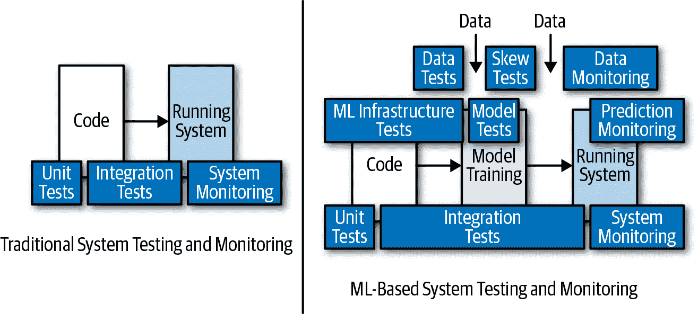

# 第一章：机器学习：概述与最佳实践

人类与机器有哪些不同？有很多差异，但这里有一个重要的区别：人类通过经验学习，而机器遵循给定的指令。如果机器也能从经验中学习呢？这就是机器学习的要点。对于机器来说，“过去的数据”在逻辑上相当于“经验”。机器学习结合了统计学和计算机科学，使机器能够学习如何执行给定任务，而无需通过指令显式编程。

今天机器学习被广泛应用，并且我们每天都与之交互。以下是一些例子来说明：

+   像必应或谷歌这样的搜索引擎

+   像亚马逊或 eBay 这样的在线商店的产品推荐

+   Netflix 或 YouTube 的个性化视频推荐

+   像 Alexa 或 Cortana 这样的基于语音的数字助理

+   我们邮箱收件箱的垃圾邮件过滤器

+   信用卡欺诈检测

为什么机器学习作为一个趋势发展得如此之快？为什么每个人现在都对它如此感兴趣？如图 1-1 所示，其流行性源自三大关键趋势：大数据、更好/更便宜的计算能力和更智能的算法。

###### 图 1-1\. 机器学习的增长

在本章中，我们通过一个现实世界的例子快速回顾机器学习，讨论一些区分成功的机器学习项目与其他项目的最佳实践，并以生产力和规模方面的挑战结束。

# 机器学习：简明回顾

构建机器学习模型的过程是怎样的？让我们通过一个真实的场景深入探讨：房价预测。我们有过去的房屋销售数据，任务是预测刚刚进入市场且当前不在我们数据集中的某个房屋的销售价格。

为简单起见，假设房屋的大小（平方英尺）是确定房屋价值最重要的输入属性（或 *特征*）。如表 1-1 所示，我们有来自四个房屋 A、B、C、D 的数据，需要预测房屋 X 的价格。

表 1-1\. 基于大小的房价

| House | Size (sq. ft) | Price ($) |
| --- | --- | --- |
| A | 1300 | 500,000 |
| B | 2000 | 800,000 |
| C | 2500 | 950,000 |
| D | 3200 | 1,200,000 |
| X | 1800 | ? |

我们从图 1-2 中可以看出，将 *尺寸* 放在 x 轴上，*价格* 放在 y 轴上进行绘制。

###### 图 1-2\. 绘制价格与尺寸的关系

房屋 X 的最佳价格估计是多少？

+   $550,000

+   $700,000

+   $1,000,000

让我们来弄清楚。如图 Figure 1-3 所示，基于数据绘制的四个点形成了几乎直线。如果我们画出最能匹配我们数据的直线，我们就可以找到与房屋 X 相关联的直线上的正确点，即 x 轴上的点和对应的 y 轴上的点，这将给我们一个价格估计。

###### 图 1-3\. 创建直线以找到价格估计

在这种情况下，这条直线代表我们的模型，并展示了线性关系。*线性回归* 是一种用于建模*输入变量*（也称为*特征*或*独立变量*）与*输出变量*（也称为*目标*或*依赖变量*）之间线性关系的统计方法。数学上，这种线性关系可以表示为：

<math display="block"><mrow><mi>y</mi> <mo>=</mo> <mi mathvariant="italic">β0</mi> <mo>+</mo> <mi mathvariant="italic">β1x</mi></mrow></math>

其中：

+   *y* 是输出变量；例如，房价。

+   *x* 是输入变量；例如，平方英尺的大小。

+   *β0* 是截距（当 *x* = 0 时 *y* 的值）。

+   *β1* 是 *x* 的系数，是回归线的斜率（“与 *x* 单位增加相关的 *y* 的平均增加量”）。

## 模型参数

*β0* 和 *β1* 被称为这个线性回归模型的*模型参数*。在实现线性回归时，算法通过使用模型参数 *β0* 和 *β1* 来找到最佳拟合直线，使其尽可能接近实际数据点（最小化每个实际数据点与表示模型预测的直线之间的平方距离）。

图 Figure 1-4 在概念上展示了这一点。圆点代表实际数据点，直线代表模型预测。*d1* 到 *d9* 表示数据点与相应模型预测之间的距离，*D* 是它们平方的和。图中显示的线是最佳拟合回归线，最小化了 *D*。

###### 图 1-4\. 回归

正如您所见，*模型参数* 是模型的一个重要部分，并决定了结果。它们的值通过模型训练过程从数据中学习而来。

## 超参数

还有另一组被称为*超参数*的参数。模型超参数在*模型训练过程*中用于确定模型参数的正确值。它们是模型外部的，其值不能从数据中估计得出。超参数的选择将影响训练的持续时间和预测的准确性。作为模型训练过程的一部分，数据科学家通常根据启发式方法或知识指定超参数，并经常手动调整超参数。超参数调整更多地依赖于实验结果而不是理论，因此确定最佳设置的最佳方法是尝试多种组合并评估每个模型的性能。

简单线性回归没有任何超参数。但是线性回归的变种，如岭回归和[Lasso](http://bit.ly/lasso-proj)，则有。以下是各种机器学习算法的模型超参数示例：

+   *k*-最近邻中的*k*

+   决策树中所需的深度和叶子节点数

+   支持向量机（SVM）中的 C 和 sigma

+   神经网络训练的学习率

# 机器学习项目的最佳实践

在这一部分，我们探讨使机器学习项目成功的最佳实践。这些是大多数公司和团队通过经验学习到的实用建议。

## 理解决策过程

基于机器学习的系统或过程使用数据驱动业务决策。因此，理解需要解决的业务问题至关重要，而不受技术解决方案的影响——换句话说，需要通过数据来进行决策或采取行动。清楚地了解决策过程至关重要。有时，这一步骤也被称为*将业务场景/问题映射到数据科学问题*。

对于我们的房价预测场景，对于一个购房者来说，关键的业务决策是“我是否应该以标价购买某个房屋？”或者“对于这栋房屋，什么是一个好的竞标价格以最大化我赢得竞标的机会？”这可以映射到数据科学问题：“基于其他房屋过去销售数据，房屋价格的最佳估计是什么？”

表格 1-2 展示了其他真实业务场景以及该决策过程的外观。

表格 1-2\. 理解决策过程：真实场景

| 业务场景 | 关键决策 | 数据科学问题 |
| --- | --- | --- |
| 预测性维护 | 我应该为这台设备提供服务吗？ | 这台设备在接下来的*x*天内会出现故障的概率是多少？ |
| 能源预测 | 我应该买还是卖能源合同？ | 区域内能源的长期/短期需求会是多少？ |
| 客户流失 | 我应该优先考虑哪些客户以减少流失？ | 每位客户在*x*天内流失的概率是多少？ |
| 个性化营销 | 我应该首先提供哪种产品？ | 客户购买每种产品的概率是多少？ |
| 产品反馈 | 哪个服务/产品需要关注？ | 每种服务/产品的社交媒体情感是什么？ |

## 确立性能指标

与任何项目一样，性能指标对于引导任何机器学习项目朝着正确的目标前进并确保取得进展至关重要。在我们理解决策过程之后，下一步是回答这两个关键问题：

+   我们如何衡量朝着目标或期望结果的进展？换句话说，我们如何定义评估进展的指标？

+   什么被认为是成功？也就是说，我们如何定义指标的目标？

对于我们的房价预测示例，我们需要一个度量标准来衡量我们的预测与实际价格的接近程度。有很多度量标准可供选择。对于回归任务中最常用的度量标准之一是*均方根误差*（RMSE）。其定义为实际分数与预测分数之间的平方距离的平方根，如下所示：

<math display="block"><mrow><mtext>RMSE</mtext> <mo>=</mo> <msqrt><mrow><mfrac><mn>1</mn> <mi>n</mi></mfrac> <msubsup><mo>∑</mo> <mrow><mi>j</mi><mo>=</mo><mn>1</mn></mrow> <mi>n</mi></msubsup> <msup><mrow><mo>(</mo><msub><mi>y</mi> <mi>j</mi></msub> <mo>-</mo><msub><mover accent="true"><mi>y</mi> <mo>^</mo></mover> <mi>j</mi></msub> <mo>)</mo></mrow> <mn>2</mn></msup></mrow></msqrt></mrow></math>

这里，*y[j]* 表示第 i 个数据点的真实值，*ŷ[j]* 表示预测值。理解这个公式的一种直观方法是它是真实值向量与预测值向量之间的欧几里得距离，再除以*n*，其中*n*是数据点的数量的平均值。

## 注重透明度以赢得信任

有一种普遍的看法认为机器学习是一个神奇的黑匣子，它只是神奇地工作。重要的是要理解，虽然以指标衡量的模型性能很重要，但更重要的是要理解模型的工作原理。没有这种理解，很难信任模型，因此也很难说服关键利益相关者和客户相信机器学习和基于机器学习的系统的商业价值。

在像医疗保健和银行业这样严格监管的行业中，需要遵守法规，模型的可解释性至关重要。*模型可解释性* 通常由特征重要性表示，它告诉您每个输入列（或特征）如何影响模型的预测。这使数据科学家能够解释结果预测，以便利益相关者可以看到模型中哪些数据点最重要。

在我们的房价预测场景中，如果模型除了价格预测外还指示了对输出有贡献的关键输入特征，比如房屋大小和年龄，我们对模型的信任会增加。图 1-5 显示了我们房价预测场景中的特征重要性。请注意，年龄和学校评级是最重要的特征。

###### 图 1-5\. 特征重要性

## 拥抱实验

建立一个好的机器学习模型需要时间。与其他软件项目一样，成功在机器学习项目中的关键在于我们试验新假设的速度、从中学习，并不断进化。正如在图 1-6 中所示，成功的道路通常并不容易，并且在这个过程中需要大量的坚持、尽职和失败。

###### 图 1-6\. 成功并不容易。

这里是重视实验的文化的关键方面：

+   愿意从实验中学习（无论成功或失败）。

+   与同事分享学习。

+   将成功的实验推广到生产环境。

+   理解失败是实验的一个有效结果。

+   快速转移到下一个假设。

+   优化下一个实验。

## 不要孤立操作

客户通常通过应用程序体验机器学习模型。图 1-7 展示了机器学习系统与传统软件系统的不同之处。关键区别在于，机器学习系统除了代码工作流程外，还必须考虑数据工作流程。

###### 图 1-7\. 机器学习系统与传统系统的比较

在数据科学家构建了他们满意的机器学习模型后，他们将其交给应用程序开发人员集成到更大的应用程序中并部署。通常情况下，任何错误或性能问题直到应用程序部署后才会被发现。由于这些问题，应用程序开发人员和数据科学家之间的摩擦可能导致根本原因的识别和修复变得缓慢、令人沮丧和昂贵。

随着机器学习进入更多业务关键应用，越来越清楚的是，数据科学家需要与应用程序开发人员密切合作，以更高效地构建和部署以机器学习为驱动的应用程序。数据科学家专注于数据科学生命周期，即数据采集和准备、模型构建以及部署。他们还关注定期重新训练和重新部署模型，以调整最新标记的数据、数据漂移、用户反馈或模型输入的变化。应用程序开发人员专注于应用程序生命周期——构建、维护和持续更新大型业务应用程序，其中模型是其一部分。双方都有动力使业务应用程序和模型良好协同工作，以满足端到端性能、质量和可靠性目标。

所需的是一种更有效地桥接数据科学和应用生命周期的方法。图 1-8 展示了如何实现这种协作。我们将在本书的后面章节更深入地讨论这个问题。

###### 图 1-8\. 应用程序开发人员和数据科学家共同合作

# 一个迭代且耗时的过程

在本节中，我们通过使用我们的房价预测示例更深入地探讨机器学习过程。我们从房屋尺寸作为唯一输入开始，发现房屋尺寸与房价之间的关系是线性的。为了创建一个能够更准确预测价格的好模型，我们需要探索良好的输入特征，选择最佳算法，并调整超参数值。但是，您如何知道哪些特征是好的，哪种算法和超参数值会表现最好呢？这里没有银弹；我们需要尝试不同的特征组合、算法和超参数值。让我们来看看这三个步骤，然后看看它们如何应用于我们的房价预测问题。

## 特征工程

*特征工程*是利用我们对数据的了解来创建使机器学习算法工作的特征的过程。如图 1-9 所示，这涉及四个步骤。

###### 图 1-9\. 特征工程

首先，我们*获取数据* —— 收集具有所有可能的输入变量/特征的数据，并将其处理到可用状态。大多数实际数据集都不干净，需要在使用之前进行处理，可能涉及修复缺失值、删除异常和可能不正确的数据，并确保数据分布是代表性的。

接下来，您需要*生成特征*：探索从可用数据中生成更多特征。在处理文本数据或时间序列数据时，这通常是有用的。与文本相关的特征可以简单到*n*-gram 和计数向量化，也可以复杂到从评论文本提取情感。类似地，与时间相关的特征可以简单到月份和周索引，也可以复杂到基于时间的聚合。生成的这些附加特征有助于提高模型的准确性。

完成这一步后，您需要*转换数据*，以使其适合机器学习。通常情况下，机器学习算法要求在拟合机器学习模型之前以特定方式准备数据。例如，许多算法不能直接处理分类数据，需要将所有输入变量和输出变量转换为数值形式。*分类变量*是一个[变量](https://oreil.ly/4YTwv)，它可以取有限数量且通常固定的可能值之一。这些变量的示例包括颜色（红色、蓝色、绿色等）、国家（美国、印度、中国等）和血型（A、B、O、AB）。分类变量必须转换为数值形式，通常通过整数编码或独热编码技术实现。

最后一步是*特征选择*：选择模型训练的特征子集。为什么需要这样做？为什么不用所有的特征来训练模型？特征选择识别并移除不必要、无关或冗余的属性，这些属性不会有贡献，甚至可能降低模型的准确性。特征选择的目标有三个：

+   提高模型准确性

+   提高模型训练时间/成本

+   提供对特征生成底层过程的更好理解

###### 注意

特征工程步骤对传统机器学习至关重要，但对深度学习影响不大，因为特征是通过深度学习网络自动生成/推断的。

我们从一个特征开始：房屋大小。但我们知道房价不仅依赖于大小，还依赖于其他特征。还有哪些输入特征可能影响*房价*？尽管大小可能是最重要的输入之一，但这里还有几个值得考虑的：

+   邮政编码

+   建造年份

+   地块大小

+   学校

+   卧室数量

+   浴室数量

+   车库车位数

+   设施

## 算法选择

一旦我们选择了一组好的特征，下一步就是确定模型的正确算法。对于我们拥有的数据，简单的线性回归模型似乎可以工作。但请记住，我们只有少量数据点（四个房价），足以代表机器学习的规模，也足够小。此外，线性回归假设输入特征与目标变量之间存在线性关系。随着我们收集更多数据点，线性回归可能不再是最相关的，我们将受到数据中趋势和模式的影响，被激励探索其他技术（算法）。

## 超参数调整

正如本章前面讨论的，超参数在模型准确性和训练性能中起着关键作用。因此，调整它们是达到良好模型的关键步骤。由于不同的算法有不同的超参数集，调整超参数的这一步骤增加了全程流程的复杂性。

## **全程流程**

有了对特征工程、算法选择和超参数调整的基本理解，让我们逐步解决我们的房价预测问题。

让我们从*大小*、*地块大小*和*建造年份*特征开始，使用*梯度提升*树和特定的超参数值，如图 1-10 所示。生成的模型准确率为 30%。但我们希望做得更好。

###### 图 1-10\. 机器学习过程：步骤 1

为了开始工作，我们尝试相同特征和算法的不同超参数值。如果这不能提高模型的准确性到满意的水平，我们尝试不同的算法，如果这也不起作用，我们增加更多特征。图 1-11 显示了一个这样的中间状态，增加了学校作为一个特征，并使用*k*最近邻（KNN）算法。生成的模型准确率为 50%，但仍不够好，因此我们继续这个过程并尝试不同的组合。

###### 图 1-11\. 机器学习过程：中间状态

经过多次尝试不同特征、算法和超参数值的组合迭代，我们最终得到了一个符合我们标准的模型，如图 1-12 所示。

###### 图 1-12\. 机器学习过程：最佳模型

正如您所见，这是一个迭代且耗时的过程。举个例子：如果有 10 个特征，那么选择特征的方法有 2¹⁰（1,024）种。如果我们尝试五种算法，并假设每种算法平均有五个超参数，那么总共会有 1,024 × 5 × 5 = 25,600 次迭代！

图表 1-13 展示了 `scikit-learn` 的速查表，显示选择合适算法本身可能是一个复杂的问题。现在想象一下在此基础上加入特征工程和超参数调整。结果，数据科学家需要几周甚至几个月的时间才能得到一个好的模型。

###### 图表 1-13. Scikit-learn 算法速查表（来源：[*https://oreil.ly/xUZbU*](https://oreil.ly/xUZbU)）

# 不断增长的需求

尽管模型构建过程复杂，但对机器学习的需求激增。几乎所有行业的组织都在尝试利用数据和机器学习来获得竞争优势——将智能融入其产品和流程中，以取悦客户并放大业务影响。图表 1-14 展示了使用机器学习解决的各种实际业务问题的多样性。

###### 图表 1-14. 使用机器学习解决实际业务问题

因此，机器学习相关工作的需求非常巨大。图表 1-15 展示了从 2015 年到 2018 年各种工作职位的百分比增长。

###### 图表 1-15. 机器学习相关工作的增长

图表 1-16 展示了使用机器学习和人工智能的企业应用预期的收入将会呈现天文数字的增长。

###### 图表 1-16. 机器学习/人工智能收入预测

# 结论

在本章中，您学到了成功的机器学习项目所共有的一些最佳实践。我们讨论了构建一个良好的机器学习模型的过程是迭代且耗时的，导致数据科学家需要几周到几个月的时间来构建一个好的模型。与此同时，对机器学习的需求正在迅速增长，预计将会飙升。

要解决这个供需失衡问题，需要找到一种更有效的方法来缩短构建机器学习模型的时间。那么，工作流程中的某些步骤能够自动化吗？当然可以！自动化机器学习是成功的数据科学家必备的最重要技能之一，能够显著提高生产力。

在接下来的章节中，我们将深入探讨自动化机器学习。我们将探讨它是什么，如何入门，以及如何在当今的实际应用中使用它。
