# 第二章：自动化机器学习的工作原理

在前一章中，我们确认了自动构建机器学习模型的需求。本章将解释什么是*自动化机器学习*，涉及到此过程中的不同技术，以及它们如何相互结合。我们还将简要介绍 Microsoft Azure 机器学习中的自动化 ML。

# 什么是自动化机器学习？

在第一章中，我们讨论了如何通过探索所有可能的组合来创建一个好的机器学习模型可能会耗费大量时间和精力。自动化机器学习是机器学习的一个新发展方向，旨在简化整个过程，从而提高数据科学家的效率，同时使非数据科学家也能构建模型。

让我们详细了解机器学习过程的各个阶段，并看看自动化机器学习如何在每个阶段提供帮助。

## 理解数据

如前一章简要讨论的，现实世界的数据并不干净，需要大量工作才能使其达到可用状态。理解输入数据是制定机器学习问题的关键步骤。

自动化机器学习可以通过分析数据并自动检测每列的数据类型来帮助这一过程。列的类型可能是布尔型、数值型（离散或连续）、或文本型。自动检测这些列类型有助于后续的特征工程阶段。

在许多情况下，自动化机器学习还可以提供关于每列语义或意图的见解。它可以检测到广泛的情况，包括以下内容：

+   检测目标/标签列

+   检测文本列是分类文本特征还是自由文本特征

+   检测列是否是邮政编码、温度、地理坐标等

在继续之前，让我们讨论模型训练过程如何与输入数据的关系。我们应该使用所有可用数据进行训练吗？答案是否定的。

在全数据集上训练模型可能会导致*过拟合*。过拟合意味着我们训练的模型过于贴近输入数据集并模仿输入数据集。这通常发生在模型过于复杂（即特征/变量数量远大于观测数量）的情况下。这种模型在输入数据上可能非常准确，但在未训练或新数据上可能表现不佳。

相反，当模型*欠拟合*时，意味着模型不适合输入数据，因此错过了数据中的趋势。这也意味着该模型无法推广到新数据。这通常是因为模型过于简单（输入变量/特征不足）。增加更多的输入变量/特征有助于克服欠拟合问题。

图 2-1 展示了二元分类问题中的过拟合和欠拟合情况。

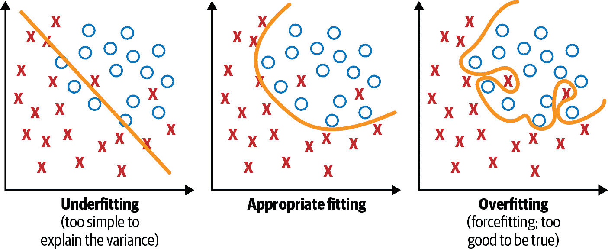

###### 图 2-1\. 过拟合和欠拟合

为了克服过拟合问题，我们通常将输入数据分成两个子集：训练数据和测试数据（有时还会进一步分成三个子集：训练、验证和测试）。然后，模型在训练数据上进行拟合，以便在测试数据上进行预测。训练集包含已知输出，模型在此基础上学习，以便稍后可以泛化到其他数据。我们使用测试集来测试模型预测的准确性。

但是，我们如何知道训练/测试拆分是否有效？如果我们的数据子集相比其他子集存在偏差怎么办？即使我们试图避免，这也会导致过拟合。这就是交叉验证发挥作用的地方。

交叉验证类似于训练/测试拆分，但应用于更多子集。数据被分成*k*个子集，模型在其中的*k*-1 个子集上进行训练，最后一个子集用于测试。这对每个子集都执行。这称为*k*-折交叉验证。最后，所有*k*折的分数平均后产生最终分数。图 2-2 展示了这一过程。

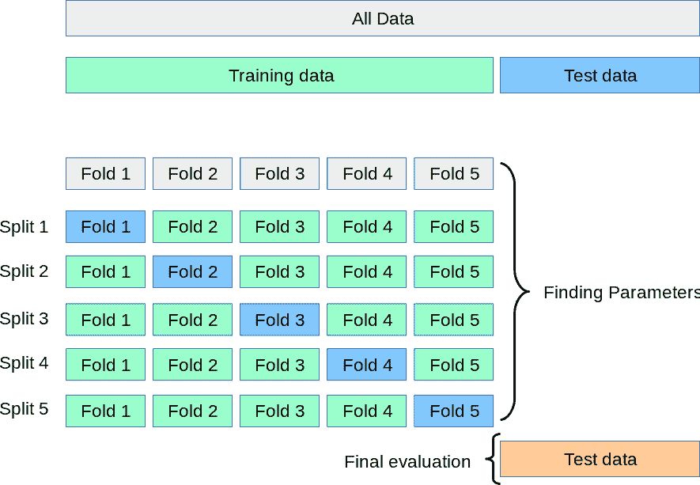

###### 图 2-2\. *k*-折交叉验证（来源：*ttps://oreil.ly/k-ixI*)

## 任务检测

数据科学家将现实世界的场景映射到机器学习任务中。图 2-3 展示了一些机器学习任务的类型示例。

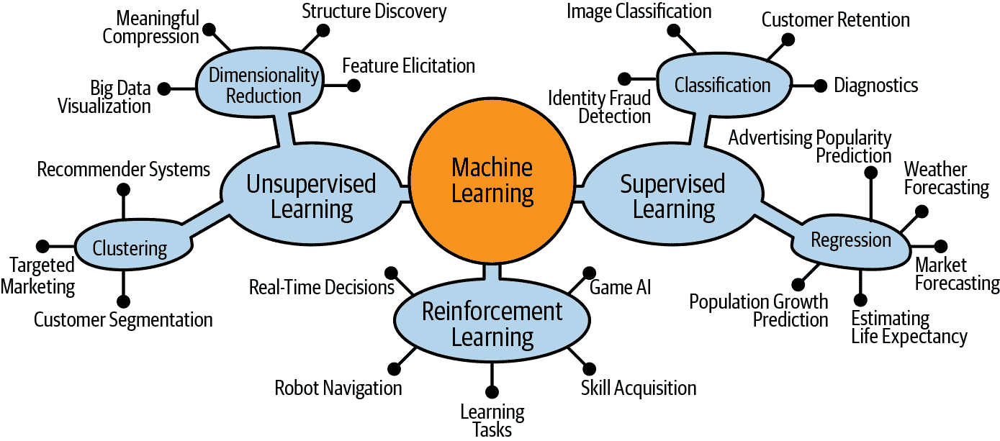

###### 图 2-3\. 机器学习任务

自动化机器学习可以自动确定机器学习任务，给定输入数据。这在*监督学习*中更为相关，其中目标/标签列可用于预测机器学习任务。表 2-1 列出了通用的机器学习任务。

表 2-1\. 机器学习任务检测

| 目标/标签列 | 机器学习任务 | 示例场景 |
| --- | --- | --- |
| 布尔 | 二分类 | *[分类推特评论的情感](https://oreil.ly/baZaJ)，正面或负面* 表明电子邮件是垃圾邮件还是非垃圾邮件 |
| 离散数值/分类 | 多类别分类 | *确定狗的品种，如哈瓦那犬、金毛寻回犬、比格犬等* 按位置、价格、清洁度等对酒店评论进行分类 |
| 连续数值 | 回归 | *基于房屋属性（如卧室数量、位置或大小）预测房价* 基于历史数据和当前市场趋势预测未来股票价格 |

除了这些通用任务外，还有基于输入数据的特定变体。其中一种受欢迎的任务类型是预测，因为它与诸如收入预测、库存管理、预测性维护等许多业务问题相关。如果输入数据是时间序列，根据日期时间列的可用性来确定，那么很可能是一个预测任务。

## 选择评估指标

选择评估机器学习算法的指标基本上是由业务结果驱动的。这是一个重要的步骤，因为它告诉您如何衡量和比较算法的性能。不同的任务有不同的评估指标可供选择，并且选择取决于多个因素。图 2-4 显示了用于评估各种机器学习任务中使用的算法的可能选项。

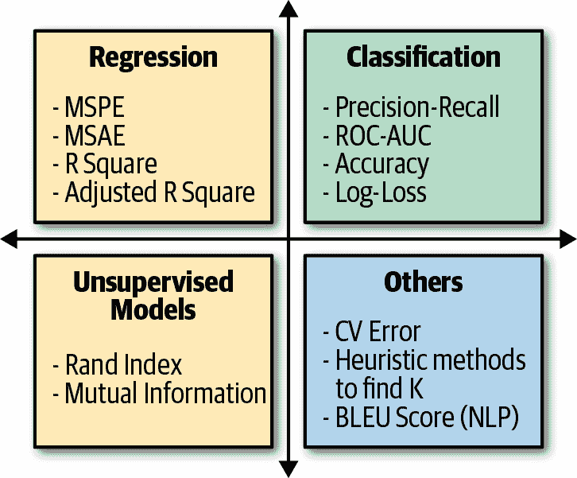

###### 图 2-4\. 机器学习评估指标

自动化机器学习可以自动选择适合给定输入数据集和机器学习任务的正确评估指标的过程。例如，像欺诈检测（这是一个分类任务）这样的情景中数据通常是不平衡的，只有很小一部分数据是欺诈性的。在这种情况下，曲线下面积（AUC）比准确率更好地评估了性能。自动检测数据中的类别不平衡可以帮助自动选择 AUC 作为此分类任务的评估指标。

## 特征工程

如 第一章 讨论的，特征工程是从输入数据中获取适当特征集的过程，其目标是生成一个良好的机器学习模型。自动特征工程包括四个关键步骤，在接下来的小节中我们会讨论这些步骤。

### 检测输入数据问题并自动标记它们

其中的例子包括：

+   检测缺失值并自动使用最相关的技术填补它们；例如，数值列使用均值，分类列使用众数（最频繁出现的值），等等。

+   检测类别不平衡，并通过应用诸如合成少数类过采样技术（SMOTE）等技术自动修复它。

### 放弃作为特征无用的列

下面是一些例子：

无变异列

这些是跨所有行具有相同值的列，可以通过自动化轻松检测到。

高基数列

这些是跨行具有不同值的列；例如，哈希值、ID 或全局唯一标识符（GUID）。基数由列中唯一值的百分比确定。

### 生成特征

有多种技术可以从现有特征生成新特征。以下是一些例子：

编码和转换

大多数机器学习算法需要数值输入和输出变量。现实世界的数据集充满了文本和分类数据。数据科学家通过使用编码和转换将它们转换为数值数据。

*独热编码* 是一种将分类数据转换为整数数据的流行技术。您可以轻松自动化此过程。图 2-5 显示了独热编码的一个示例。

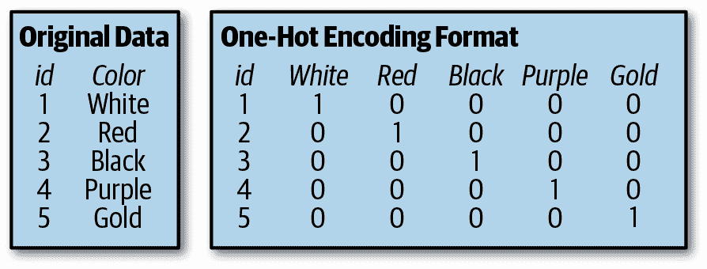

###### 图 2-5\. 独热编码

对输入列应用转换以生成有趣的特征。一些示例包括生成“年份”、“月份”、“日期”、“星期几”、“年的天数”、“季度”、“年的周数”、“小时”、“分钟”和“秒”等给定日期时间列的特征。这对于与时间序列相关的问题非常有效。

其他示例可能根据单字、双字和三字符组生成词频，并为文本列生成词嵌入。

聚合

特征生成中的另一种流行技术涉及对多个数据记录进行聚合生成。聚合可以基于数据集中的特定实体（例如，每个商店的平均产品销售/收入）或基于时间（例如，过去 7 天、30 天、180 天内的网站页面访问量）。通过时间聚合生成的特征对于时间序列预测问题非常有用。

### 选择最有影响力的特征

特征选择是过程中的重要步骤，因为它有助于优先考虑适当的输入特征集。当输入特征数量非常大时，这变得尤为重要。

为什么我们需要优先考虑适当的输入特征集？为什么不使用所有特征？以下是特征选择的顶级好处：

+   更快的训练

+   更简单的模型，更容易解释

+   减少过拟合

+   提高模型准确性

让我们来看看一些不同的特征选择技术。请记住，您可以自动化所有这些技术：

过滤器

根据这种技术，特征的选择与任何机器学习算法无关。特征的选择基于它们与结果变量的相关性，由统计测试来衡量。因为选择过程与模型无关，这种方法可能不会选择最有用的特征，但能有效防止过拟合。如图 2-6 所示，选择最佳特征子集发生在模型训练之前。

包装器

根据这种技术，使用特征子集来训练模型。基于模型的性能，我们决定从子集中添加或删除特征，并使用更新的子集再次训练模型。这个过程持续进行，直到模型的性能令人满意。然而，由于多次来回迭代，这种技术可能计算开销很大。由于选择过程与模型绑定，它倾向于产生比过滤方法更准确的结果，但更容易过拟合。如图 2-6 所示，展示了包装器方法。

嵌入方法

嵌入方法结合了过滤器和包装器方法的优点。由具有其自身内置特征选择方法的算法实现，嵌入方法类似于包装器，但计算开销较小，因为没有来回迭代。这种技术也较少容易过拟合。如图 2-6 所示，展示了嵌入方法。

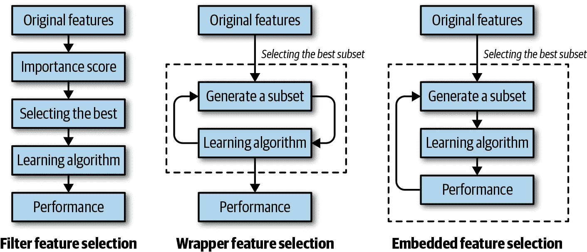

###### 图 2-6\. 特征选择

## 选择模型

如前一章所讨论的，机器学习模型由算法及其关联的超参数值组合表示。自动化机器学习系统采用不同的方法进行模型选择。在本节中，我们讨论了两类方法：暴力方法和更智能的方法。

### 暴力方法

这是尝试所有可能的算法和超参数值组合的天真方法，以找到根据评估度量得出的最佳模型。通常是随机选择算法，并应用*网格搜索*来找出正确的超参数集。网格搜索的一个主要缺点是，当超参数数量呈指数增长时，维度灾难会显现出来。仅有四个参数，这个问题就变得不切实际，因为这种方法所需的评估次数随每个额外参数的增加而指数增加。

*随机搜索*是一种技术，通过随机组合超参数来寻找最佳解决方案。在这种搜索模式下，每次迭代都考虑随机组合的参数。由于每次迭代都选择随机值，很有可能整个空间都被覆盖，因此找到最佳模型的机会比网格搜索要高得多。在网格搜索期间，覆盖每个组合的每个方面需要大量时间。如果所有超参数不是同等重要，随机搜索效果最好。

图 2-7 展示了网格搜索和随机搜索的工作原理。在这个例子中，正在尝试九组参数组合。请注意，随机搜索成功达到了更好的模型性能，如顶部的“山丘”上的点所示。在“山丘”的最高点表示了最佳参数组合。

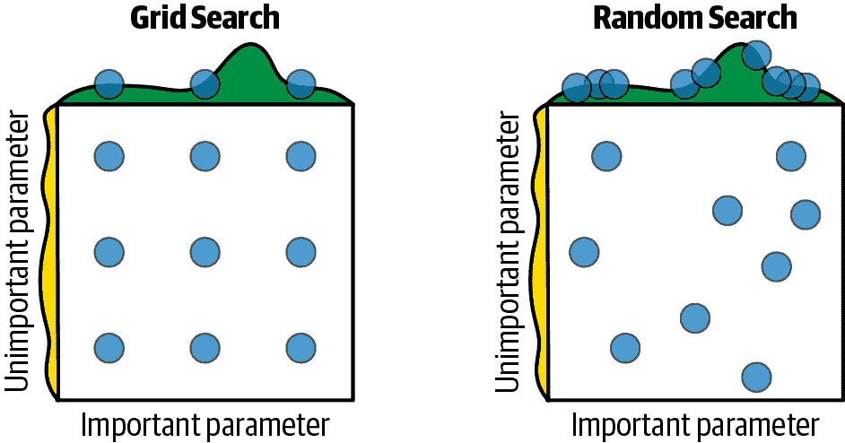

###### 图 2-7\. 网格搜索与随机搜索比较

### 更智能的方法

对于现实世界的问题，搜索空间非常大，暴力方法将不会有效。这导致了更智能的选择和优化方法的出现，主要由先进的统计学和机器学习技术驱动。其中一些方法包括贝叶斯优化、多臂赌博机和元学习。在这里，我们以较高层次介绍其中一些方法（详细内容需要更深入挖掘，超出本书的范围）：

贝叶斯优化

这种方法使用近似来猜测一个未知函数，并带有一些先验知识。这里的目标是基于可用的观察结果训练模型。训练好的模型将映射到一个我们不知道的函数上。我们的任务是找到最大化学习函数的超参数。

贝叶斯优化能帮助您在众多模型中找到最佳模型，通过减少计算任务并不需要人类帮助来猜测数值来加快模型选择过程。这种优化技术基于随机性和概率分布。图 2-8 展示了其工作原理的视觉描述。

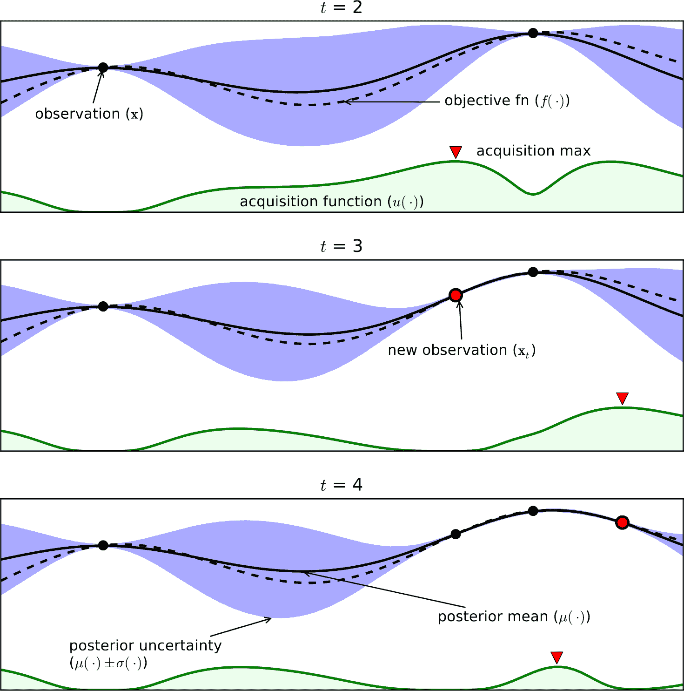

###### 图 2-8\. 贝叶斯优化

虚线是我们真实目标函数曲线。不幸的是，我们不知道这个函数及其方程式。我们试图通过使用高斯过程来近似它。在我们的样本空间中，我们绘制一个符合观察到的样本（实心点）的直观曲线（实线）。*t*代表我们有新观察样本时的不同时间点。阴影区域是置信区域，点可能存在的区域。通过前述的先验知识，我们可以确定第二个点为最大观察值。下一个最大点应在其上方或相等。如果我们通过第二个点绘制一条水平线，那么下一个最大点应落在这条线上方。从这条线与置信区域的交点，我们可以舍弃曲线样本低于该线以找到最大值。这样做，我们已经缩小了我们的调查范围。这个相同的过程随后的采样点继续进行。

多臂赌博机

多臂赌博机是一个问题，其中必须在有限的资源集之间分配，以最大化预期收益，当每个选择的特性在分配时仅部分知道，并且随着时间的推移或通过将资源分配给选择可以更好地理解。

这是一个经典的[强化学习](https://oreil.ly/anwMJ)问题，涵盖了*探索*与*利用*的权衡困境，建模一个同时试图获取新知识（称为*探索*）并基于现有知识优化其决策的代理。正如图 2-9 所示，代理试图平衡这些竞争任务，以在考虑期内最大化其总价值。

###### 图 2-9\. 探索与利用

元学习

这是“学习如何学习”。将其视为应用机器学习来构建机器学习模型；因此，“元”在名称中。元学习的目标是在各种学习任务上训练模型，使其能够仅通过少量训练样本解决新的学习任务。这不仅极大地加快和改进了机器学习流水线的设计，还允许我们用数据驱动的方式替换固定的手动选择模型。

随着神经网络的普及，元学习方法已被应用于自动设计最优神经网络架构。这被称为神经架构搜索（NAS），是一个研究热点领域。NAS 已被用来设计与手动设计架构相媲美或优于其的网络。NAS 的方法可以根据使用的*搜索空间*、*搜索策略*和*性能估计策略*进行分类。

搜索空间定义了可以设计和优化的神经网络类型。搜索策略定义了探索搜索空间的方法。性能估计策略从设计角度评估可能的神经网络的性能（无需构建和训练它）。

## 监控和重新训练

到目前为止，我们已经介绍了建立良好模型的阶段以及自动化机器学习如何在每个阶段帮助。机器学习工作流的最后一个阶段是监控和重新训练您的模型。

模型在训练期间的表现可能与在实际数据部署后的表现有很大不同。因此，即使在部署后也要持续测量模型性能非常重要。模型性能不佳通常是由于时间内输入数据特征的变化引起的，这被称为*数据漂移*。存在技术可以自动监控数据漂移和模型性能随时间的变化。

一旦检测到模型性能下降，可以立即采取纠正措施以最小化损害。纠正措施可能包括以下内容：

+   立即将模型下线（并禁用相应的用户体验）

+   使用最新数据重新训练模型并部署更新后的模型

对于依赖于生产环境的机器学习模型的公司来说，这个阶段尤为关键。因此，一个好的自动化机器学习解决方案应该支持监控和训练。

## 全面总结

自动化机器学习使用户（无论是否具有机器学习专业知识）能够为任何问题识别一个端到端的机器学习管道，实现更高的准确性，同时花费更少的时间。它能够运行更多实验，加速向生产就绪的智能体验迭代。根据输入数据，它可以自动化特征工程、模型选择和超参数调优的过程，如图 2-10 所示。

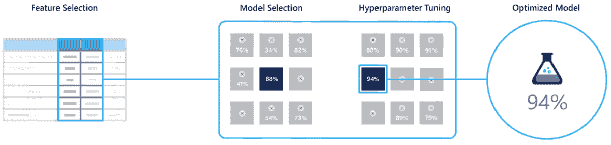

###### 图 2-10\. 自动化机器学习

# 自动化 ML

*自动化 ML* 是 Microsoft Azure 机器学习服务中提供的一种能力。本节概述了自动化 ML 的工作原理，后续章节将详细介绍如何在您的场景中使用自动化 ML。

## 自动化 ML 的工作原理

自动化 ML 基于微软研究部门的[突破性成果](https://arxiv.org/abs/1705.05355)。该方法将协同过滤和贝叶斯优化的思想结合起来，智能高效地搜索大量可能的机器学习流水线。本质上，它是机器学习流水线的推荐系统。与流媒体服务为用户推荐电影类似，自动化 ML 为数据集推荐机器学习流水线。图 2-11 和 2-12 展示了这个类比。

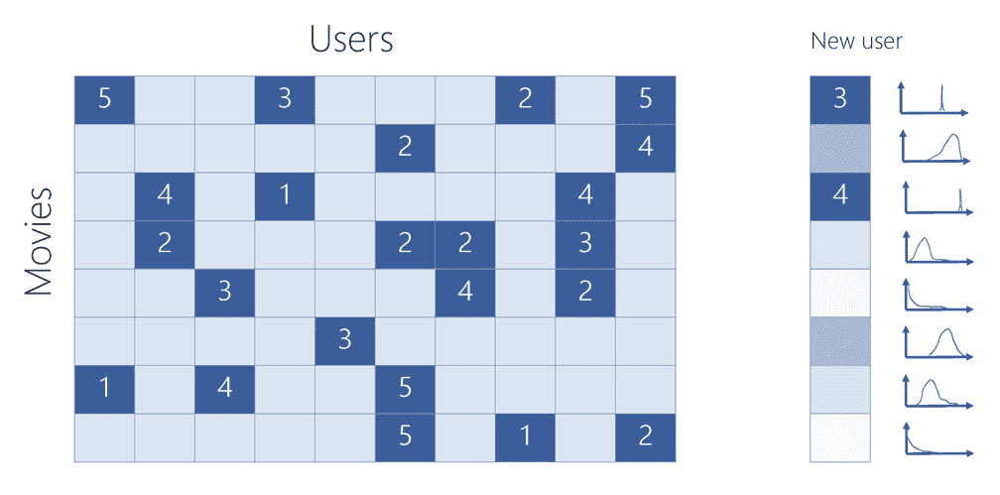

###### 图 2-11\. 流媒体服务：电影推荐

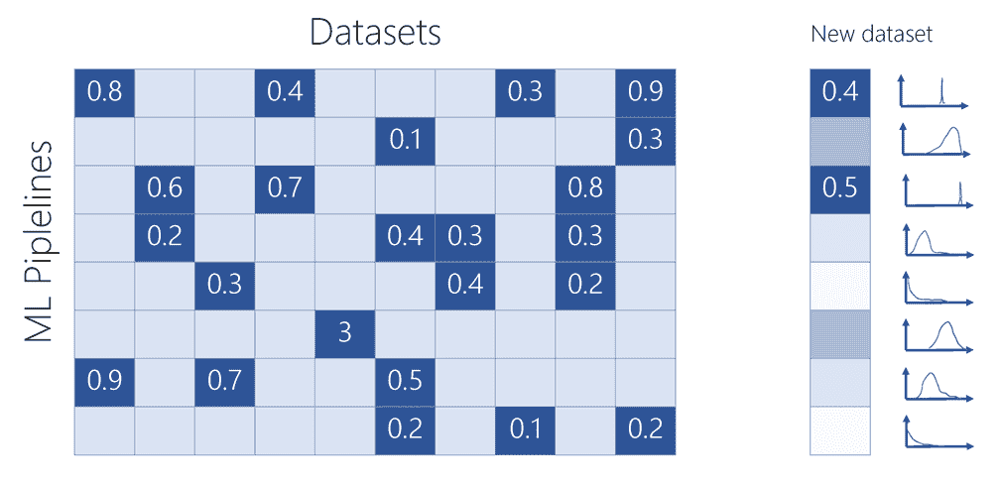

###### 图 2-12\. 自动化 ML：机器学习流水线推荐

如图 2-11 和 2-12 右侧所示的分布所示，自动化 ML 还考虑了不确定性，采用概率模型确定下一步尝试的最佳流水线。这种方法允许自动化 ML 在不进行穷举搜索的情况下探索最有前途的可能性，并更快地收敛于用户数据的最佳流水线，胜过竞争对手的蛮力方法。

## 保护隐私

自动化 ML 实现了所有这些，而无需查看用户的数据，从而保护隐私。如 图 2-13 所示，用户的数据和机器学习流水线的执行都驻留在用户的云订阅中（或其本地计算机），用户完全控制。只有每个流水线运行的模型性能指标被发送回自动化 ML 服务，然后做出智能的、概率性的选择，确定下一步应该尝试哪些流水线。

自动化 ML 的概率模型经过数亿次实验训练，每次实验都涉及在特定数据集上评估特定流水线。现在，这种训练使得自动化 ML 服务能够快速为新问题找到良好的解决方案。并且模型在运行新的机器学习任务时继续学习和改进，尽管如前所述，它不会看到用户的数据。

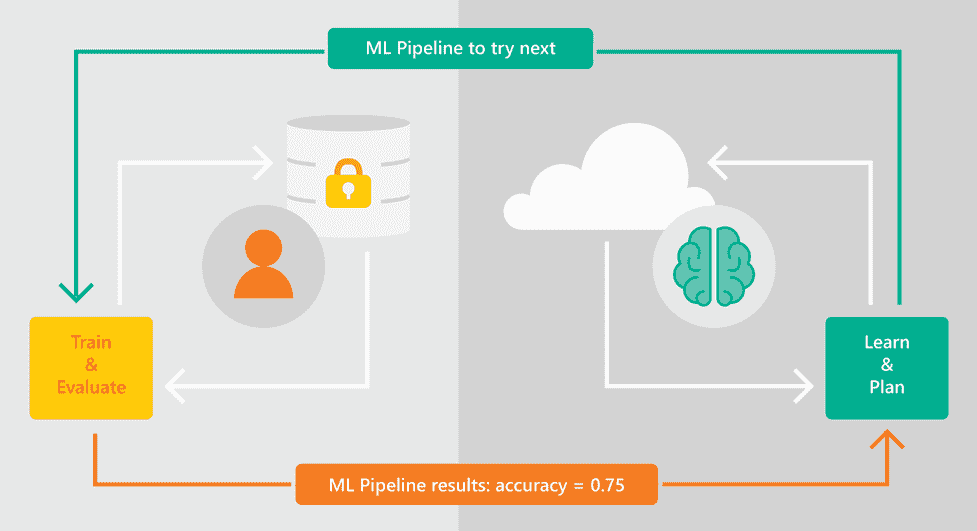

###### 图 2-13\. 保护隐私

## 实现透明度

数据科学家以及其他用户都认为透明度非常重要，这样他们才能理解发生的情况并信任输出结果。这对企业在生产中使用关键业务场景尤为关键。

自动化机器学习（Automated ML）强调透明度，使得理解生成的机器学习流水线变得轻松，包括前一节中讨论的所有阶段（例如数据理解、特征工程、模型选择/优化）。用户可以直接使用生成的机器学习流水线，或者进一步进行定制。

透明度的另一个方面是理解输入特征如何影响模型的结果，也称为*模型可解释性*或*解释性*。自动化 ML 通过提供特征重要性功能使这一过程变得简单。图 2-14 展示了一个客户流失模型的示例，其中`SupportIncidents`计数是最重要的特征贡献因素。这是有道理的，因为如果客户遇到了很多支持问题，他们流失的可能性就更高。

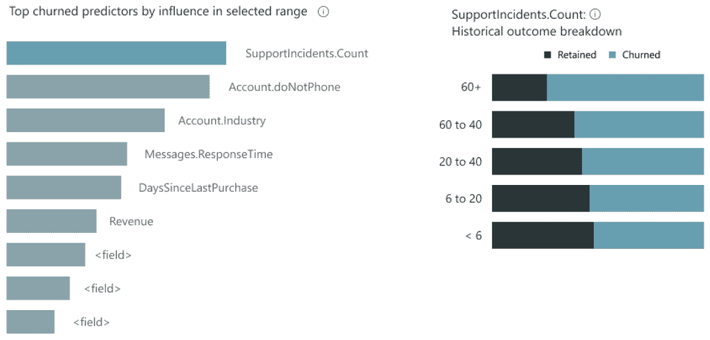

###### 图 2-14\. 特征重要性

## 守护栏

除了提供透明度外，Azure 上的自动化 ML 还提供守护栏，帮助用户了解数据（例如缺失值、类别不平衡）或模型可能存在的问题，并帮助采取改进结果的纠正措施。我们将在第七章中详细介绍这一点。

## 端到端模型生命周期管理

自动化 ML 作为 Azure 机器学习的一个能力，提供端到端（E2E）模型生命周期管理，包括通过与 Azure 机器学习的 ML 运营能力集成，简单部署、监控、漂移分析和重新训练。图 2-15 展示了这一端到端的流程。

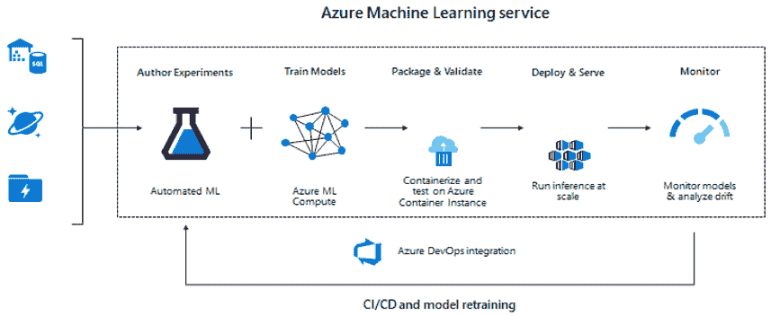

###### 图 2-15\. E2E 模型生命周期管理

# 结论

在本章中，您了解了什么是自动化机器学习，以及它如何帮助解决实际问题中建立良好机器学习模型的每个阶段。我们还简要介绍了 Azure 机器学习能力自动化 ML 在幕后如何构建良好的机器学习模型，并通过允许透明度和保护数据隐私来建立信任的简要概述。

在后续章节中，我们将涵盖我们在这里提到的不同方面，并提供实践和示例场景，帮助您在工作中使用自动化机器学习。
