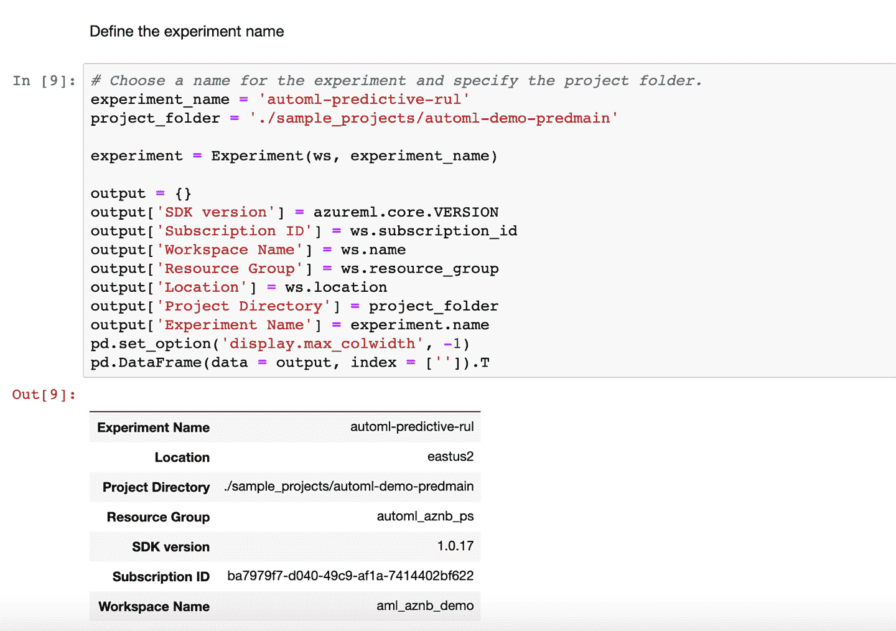

# 第三章：开始使用 Microsoft Azure 机器学习和自动化 ML

在第二章中，我们解释了自动化机器学习的概念，并简要概述了 Microsoft Azure 机器学习上的自动化 ML 工具。在本章中，我们将讨论如何开始使用 Azure 机器学习以及随后的自动化 ML。在深入讨论自动化 ML 的细节之前，我们将首先讨论企业在其机器学习项目中面临的一些常见挑战，以更好地理解这些问题。

# 机器学习流程

在使用机器学习解决问题时，我们首先从问题陈述开始，明确我们要优化的内容。接下来，我们寻找能帮助解决问题的数据集。我们开始查看数据，并使用像 Pandas 这样的数据操作库。我们检查缺失值、数据分布以及数据中的错误。我们尝试合并多个数据集。当我们认为已经有足够好的数据集可以开始时，我们将其分割为训练集、测试集和验证集，通常的比例是 70:20:10。这有助于避免过拟合，基本上意味着我们不在训练和测试时使用相同的数据集。我们使用训练集来训练机器学习算法。测试集用于在训练完成后测试机器学习模型，以确定算法的表现如何。

我们建立了一个度量标准来确定算法的性能，并不断迭代，直到得到一个优秀的算法。然后，我们使用验证数据集来检查算法的性能。有时，验证数据集可能不在主数据集中，在这种情况下，我们可以将原始数据集按 80:20 的比例分割为训练集和测试集。所有这些数据集都应该是主数据集的代表性样本，以避免*数据偏斜*（也称为*偏差*）。正如你所看到的，这个过程是迭代的，可能会耗费时间。图 3-1 显示了手动流程的摘要。

###### 图 3-1\. 自定义人工智能的手动流程

让我们来看看数据科学家在开始机器学习项目时可能面临的一些其他挑战。

## 合作与监控

企业中的数据科学家可以独立工作，也可以组成团队。如今，机器学习项目更加复杂，数据科学家经常进行合作。然而，对于数据科学家来说，分享结果和审查代码可能并不容易。

数据科学家在协作时面临的其他挑战包括如何跟踪机器学习实验，以及如何跟踪每个实验中多次迭代（运行）的历史记录。在具有可以水平和垂直扩展的训练环境方面也存在额外的挑战。当我们需要集群中的更多节点时，我们希望进行水平扩展；当我们需要更多 CPU 或内存时，我们则对每个节点进行垂直扩展。

## 部署

在训练模型满足业务标准之后，下一步是将其部署到运营环境中，以便我们可以用它进行预测。这也被称为*模型的部署*。模型可以部署为实时评分的 Web 服务，也可以作为批量评分模型用于大规模评分。图 3-2 总结了数据科学家可能执行的步骤，从训练到部署。现在，让我们了解一下 Azure 机器学习和自动化 ML 如何帮助解决其中的一些挑战。

###### 图 3-2\. 机器学习步骤

# 为自动化 ML 设置 Azure 机器学习工作区

Azure 机器学习服务帮助数据科学家在云工作空间中跟踪实验和迭代（运行）。它是一个旨在支持端到端（E2E）机器学习的机器学习平台。

要使用 Azure 机器学习服务（包括 Azure 机器学习 SDK 和自动化 ML），您必须拥有 Azure 机器学习工作区。此工作区驻留在您的 Azure 订阅中，您可以将其用作跟踪实验和执行其他操作的单一协作场所。任何具有资源组所有者或贡献者访问权限的人都可以在 Azure 资源组中创建工作区。您可以使用 Microsoft Azure 门户或 Python SDK 创建它。在本章后面，我们将详细讨论安装 SDK 的步骤。

首次创建工作区时，您需要在 Azure 订阅中注册几个资源提供程序（RP）。让我们注册用于使用 Azure 机器学习工作区所需的 RP。您可以在 Azure 门户中搜索此 RP，位于您的订阅下。以下是执行此操作的步骤：

1.  打开 Azure 门户，然后转到您的订阅，如图 3-3 所示。

    

    ###### 图 3-3\. 订阅概述

1.  在窗格的左侧，浏览到“资源提供程序”，如图 3-4 所示。

    

    ###### 图 3-4\. 资源提供程序列表

1.  在筛选器中，在搜索框中键入“machinelearning”，然后注册 Machine Learning RP，如图 3-5 所示。

    

    ###### 图 3-5\. 与机器学习相关的资源提供程序

1.  注册 KeyVault、ContainerRegistry 和 ContainerInstance RP，如图 3-6 和 3-7 所示。

    

    ###### Figure 3-6\. KeyVault-related RPs

    

    ###### Figure 3-7\. 与容器相关的 RPs

现在我们准备创建 Azure ML 工作区。为此，我们需要在 Azure 资源组中具有贡献者或所有者访问权限。确认适当的访问权限后，让我们创建 Azure Machine Learning 工作区：

1.  转到 Azure 门户并搜索“机器学习服务工作区”，如 图 3-8 所示。

    

    ###### Figure 3-8\. 转到 Azure 门户上的机器学习工作区

1.  按照 图 3-9 到 图 3-11 所示，在窗格中填写必要的详细信息。

    

    ###### Figure 3-9\. Azure Machine Learning 服务创建窗格

    您可以选择现有资源组或创建新的资源组。

    

    ###### Figure 3-10\. Azure 资源组创建窗格

    当您完成所有选择时，请单击“创建”。

    

    ###### Figure 3-11\. Azure Machine Learning 工作区创建窗格

1.  在随后打开的通知窗格的上部，点击铃铛图标（图 3-12）前往新创建的 Azure Machine Learning 工作区。

    

    ###### Figure 3-12\. Azure Machine Learning 工作区通知窗格

1.  如 图 3-13 所示，Azure Machine Learning 工作区的主页显示了如何开始以及工作区的所有资产。当我们运行自动化 ML 实验时，详细信息将显示在“实验”部分。

创建此工作区后，您可以将其用于培训、部署和更多与机器学习相关的活动。本章剩余部分我们将专注于使用自动化 ML。

###### Figure 3-13\. Azure Machine Learning 工作区概览页面

## Azure Notebooks

数据科学家或人工智能（AI）开发者可以通过多种方式使用自动化机器学习。它作为 Azure Machine Learning SDK 的一部分打包提供。可以在任何 Python 环境中安装为 PyPi 包。

我们在 Azure Notebooks 中（云中的 Jupyter 环境）运行一个自动化机器学习的 E2E 实验。与 Azure Notebooks 结合使用时，SDK 已预先安装在环境中。让我们创建一个项目：

1.  通过访问 [*https://notebooks.azure.com*](https://notebooks.azure.com)，如 图 3-14 所示，开始使用 Azure Notebooks。点击“现在试用”按钮并登录。

    

    ###### Figure 3-14\. Azure Notebooks 主页

1.  从您的个人资料页面，您可以查看 Azure Notebooks 项目（图 3-15）。

    

    ###### Figure 3-15\. Azure Notebooks 个人资料页面示例

1.  将计算设置为您的笔记本服务器，如图 3-16 所示。

    

    ###### 图 3-16\. 将 Jupyter 服务器关联到计算类型

1.  打开笔记本后（参见图 3-17），它会启动 Jupyter 内核。您可以通过按 Shift + Enter 键来执行单元格中的代码。

    

    ###### 图 3-17\. 一个 Jupyter 笔记本

1.  如图 3-18 和 3-19 所示，首先授权环境以访问 Azure 订阅，从而访问您之前创建的 Azure 机器学习工作区。

    

    ###### 图 3-18\. 连接到 Azure

    

    ###### 图 3-19\. 授权 Azure 机器学习工作区

1.  现在，按照图 3-20 和 3-21 中显示的方法实例化 Azure 机器学习工作区。首先导入库，然后使用 `get` 方法实例化工作区对象，该对象可以被自动 ML 和其他相关活动使用。

    

    ###### 图 3-20\. 导入 Azure 机器学习库

    

    ###### 图 3-21\. 实例化 Azure 机器学习工作区

1.  在 Azure 机器学习工作区内定义一个实验，以开始使用自动 ML，如图 3-22 所示。

    

    ###### 图 3-22\. 在 Azure 机器学习工作区定义一个实验

1.  从将用于自动 ML 训练的数据集中，我们创建了用于特征列和预测标签的 DataFrame。这些 DataFrame 在自动 ML 配置中表示为 X 和 y。配置还接受各种其他参数，如图 3-23 和 3-24 所示。

    

    ###### 图 3-23\. Azure 机器学习工作区中自动 ML 实验的配置参数

    除了实验类型外，这些参数还定义了帮助控制训练时间和花费的约束条件。这些参数的详细信息请参阅[官方 Azure 文档](http://bit.ly/2lCRoUy)。

    

    ###### 图 3-24\. 配置自动 ML 实验

    提交此训练，并通过小部件在笔记本中监视实验进度，或通过 Azure 门户在您的 Azure 机器学习工作区中进行监视，如图 3-25 到 3-27 所示。这些显示实验运行的指标分数、状态和持续时间。这些指标可以帮助找出自动 ML 尝试的内容及每次迭代的结果。

    

    ###### 图 3-25\. 在 Azure 机器学习工作区中监视实验进度

    

    ###### 图 3-26\. Azure 机器学习工作区中自动 ML 运行的指标

    

    ###### 图 3-27\. Azure 机器学习工作区中的摘要和迭代图表

1.  通过查看真实值和预测值的图表，我们可以探索子运行（迭代）的详细信息，如图 3-28 和 3-29 所示。

    

    ###### 图 3-28\. 预测与真实值比较

    

    ###### 图 3-29\. 评估模型性能的指标

1.  您可以从任何子运行中导出训练过的模型，如 图 3-30 所示。使用 Azure 机器学习，您可以将此模型部署到云端或边缘以进行预测。您还可以将其部署到其他您选择的环境中。您可以利用容器化模型的优势，然后使用 Azure 机器学习将其部署为实时 Web 服务或批处理服务。（我们在第五章中讨论部署。）

    

    ###### 图 3-30\. 下载和部署模型文件

1.  或者，在训练完成后，您可以编写 Python 代码选择最佳模型，如 图 3-31 所示。

    

    ###### 图 3-31\. 从最佳运行中选择模型

1.  当您转到 Azure 机器学习工作区的主要实验页面时，您可以查看所有运行的实验及其子运行。门户会根据您正在优化的指标自动对子运行进行排序。在图 3-32 中，您可以看到实验运行的摘要。它有各种窗格显示运行配置和运行结果。最佳管道显示在图 3-33 的顶部。

    

    ###### 图 3-32\. 自动 ML 实验运行摘要

    

    ###### 图 3-33\. 基于指标排序的运行结果

## 笔记本 VM

截至本文撰写时，一个新的基于云的笔记本服务器正在预览中。这个安全的、基于云的 Azure 工作站提供了一个 Jupyter 笔记本服务器、JupyterLab 和一个完全准备好的机器学习环境。您可以在[Azure 机器学习笔记本文档](https://oreil.ly/e-56d)中了解更多信息。

# 结论

在本章中，您了解了 Azure 机器学习工作区，并学习了如何使用 Azure Notebooks 开始使用自动化机器学习。在第八章中，您将使用更多编码环境来运行自动化机器学习实验。
