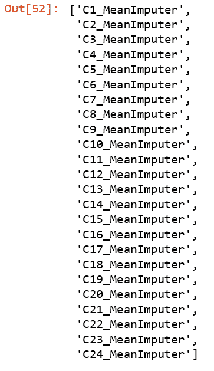

# 第四章：特征工程与自动化机器学习

特征工程是数据科学过程中最重要的部分之一。如果你让数据科学家分析数据科学过程中每个阶段花费的时间，你通常会听到他们花大量时间理解和探索数据，并进行*特征工程*。大多数经验丰富的数据科学家不会直接开始建模，而是先花时间进行特征工程。

但是什么是特征工程？通过特征工程，你可以将原始数据转换为机器学习算法更容易理解的形式。例如，你可以进行数据处理、添加新特征（例如，将现有列的值组合为新的数据列）或者将特征从其原始领域转换到不同的领域。你还可以移除对模型无用或无关的特征。在进行特征工程时，你将生成新特征、转换现有特征或选择特征子集。

为了说明如何转换特征，让我们考虑一个简单的例子，即处理*分类特征*（又称*分类变量*）。假设你有一个航空公司客户计划的数据集，其中有一个名为 Status 的特征，该特征确定客户的状态（例如，根据客户飞行频率、总里程等）。Status 包含以下五个唯一值：New、Silver、Gold、Platinum 和 Diamond。因为一些机器学习算法只能处理数值变量，所以你需要对这个特征进行转换。常见的方法是使用*独热编码*，如表格 4-1 所示。

表格 4-1\. 独热编码

| Status |  | New | Silver | Gold | Platinum | Diamond |
| --- | --- | --- | --- | --- | --- | --- |
| Gold |  | 0 | 0 | 1 | 0 | 0 |
| Silver |  | 0 | 1 | 0 | 0 | 0 |
| New | ➪ | 1 | 0 | 0 | 0 | 0 |
| Platinum |  | 0 | 0 | 0 | 1 | 0 |
| Silver |  | 0 | 1 | 0 | 0 | 0 |
| Gold |  | 0 | 0 | 1 | 0 | 0 |

特征工程的另一个重要方面是利用领域专业知识。在进行特征工程时，你可能考虑与具有相关领域专业知识的人合作——领域专家的输入在努力实现高质量模型的目标时将是非常宝贵的。

在训练机器学习模型时，*透明性*和*可解释性*是重要考虑因素。因此，正确进行特征工程将有助于生成性能优越且能够解释的模型。

###### 注意

第七章详细讨论了 Azure 机器学习如何提供工具来理解生成的模型、特征的相对重要性等。

在进行特征工程时，数据科学家经常问自己以下问题：

+   数据集中哪些特征对模型是不相关的？例如，您的数据可能包含一个标识符（ID）列。尽管此列在合并来自多个数据集的数据时很有用（例如，根据`employee_id`连接两个数据集），但在训练模型时不会以任何方式使用 ID 列。

+   我们能否组合一个或多个特征以创建更加有用的新特征？

+   对于一些稀疏的类别（即包含显著较少观察结果的类别），我们能否将它们分组以创建更有意义的类别？

本章我们关注如何使用 Microsoft Azure 机器学习中的自动化 ML 工具提供的自动特征化功能。您将学习自动特征化在分类、回归和预测任务中的工作原理。此外，我们还分享了指导和资源，帮助您更深入地进行特征工程。在深入探讨自动化 ML 执行的自动特征化之前，让我们先看看可用的数据预处理方法。

# 自动化 ML 中可用的数据预处理方法

根据机器学习任务的类型（例如分类、回归、预测），执行不同类型的数据预处理。当您使用自动化 ML 并提交实验时，您会注意到每次迭代执行不同类型的数据预处理。

例如，当数据相关时，您会注意到数据被缩放或标准化。当特征具有不同的范围时，缩放和标准化是有帮助的。表 4-2 展示了自动化 ML 执行的缩放和标准化步骤。

表 4-2\. 自动化 ML 执行的数据预处理

| 缩放和标准化 | 描述 |
| --- | --- |
| [MinMaxScalar](https://oreil.ly/FBzE4) | 对每列进行缩放，使得特征在最小和最大值之间。 |
| [MaxAbsScaler](https://oreil.ly/pGvd2) | 使用最大绝对值对每个特征进行缩放。 |
| [RobustScalar](https://oreil.ly/AUlqU) | 使用分位数范围的值对每个特征进行缩放。 |
| [PCA](https://oreil.ly/6wb1B) | 使用数据的奇异值分解（SVD）进行线性降维，将其投影到更低维度空间。 |
| [TruncatedSVDWrapper](https://oreil.ly/mNQ86) | 使用截断的 SVD 进行线性降维。与主成分分析（PCA）不同，数据在计算 SVD 前不会居中。注意：这使得它能够有效地处理`scipy.sparse`矩阵。 |
| [SparseNormalizer](https://oreil.ly/qmKyn) | 对包含一个或多个非零分量的每个样本进行独立重新缩放，使得范数（L1 或 L2）等于一。 |

###### 提示

若要详细了解 Azure 机器学习中数据预处理的更多细节，请参阅[此部分](https://oreil.ly/vEGJu) Microsoft Azure 文档。

# 自动化 ML 的自动特征化

现在让我们开始使用自动特征生成。到目前为止，您应该熟悉如何设置自动化 ML 配置对象。让我们回顾一下如何设置自动化 ML 实验。在接下来的代码示例中，首先定义 `AutoMLConfig` 对象。接下来，指定实验的名称、运行的迭代次数、日志记录的粒度等。在定义了 `AutoMLConfig` 对象之后，通过使用 `experiment.submit(…)` 提交实验：

```
import time

automl_settings = {
    "name": "AutoML_Book_CH07_FeatureEngineering_{0}".format(time.time()),
    "task": "regression",
    "iteration_timeout_minutes": 10,
    "iterations": 10,
    "max_cores_per_iteration": 1,
    "primary_metric": 'r2_score',
    "max_concurrent_iterations": 10,
    "experiment_exit_score": 0.985,
    "debug_log": "automl_ch07_errors{0}.log".format(time.time()),
    "verbosity": logging.ERROR
}
# Local compute
Automl_config = AutoMLConfig(
                   preprocess = False,
                   X = X_train,
                   y = y_train,
                   X_valid = X_valid,
                   y_valid = y_valid,
                   path=project_folder,
                   **automl_settings)

# Training the model
experiment=Experiment(ws, experiment_name)
local_run = experiment.submit(Automl_config, show_output=True)
```

在提交实验后，请注意每次迭代中执行的数据处理（请参见 Figure 4-1 中的输出）。从迭代 0 到 7，您可以看到每次迭代显示的数据预处理类型。例如，在迭代 0 中，我们可以看到使用了 `StandardScalerWrapper`。在迭代 3 中，使用了 `RobustScaler`。

在前面展示的代码中，您定义了 `AutoMLConfig` 对象，在其中注意到其中一个属性 `preprocess` 被设置为 `False`。您还可以设置 `preprocess = True` 来启用高级数据预处理。这使您可以同时使用数据预处理和自动特征生成。

###### 注意

执行的自动特征生成类型取决于您计划的机器学习任务。例如，如果您使用自动化 ML 进行分类和回归，自动特征生成可能包括删除高基数或低方差的特征。如果您用于预测，可能会生成与日期时间相关的额外特征，或日期时间与各国节假日的关系。


###### Figure 4-1\. 使用自动化 ML 进行数据预处理

Table 4-3 展示了自动化 ML 使用的自动特征生成功能。

Table 4-3\. 由自动化 ML 执行的自动特征生成

| 预处理和自动特征生成 | 描述 |
| --- | --- |
| 删除高基数或无方差特征 | 从训练和验证集中删除这些特征，包括所有值缺失、所有行中具有相同值或极高基数（例如哈希值、ID 或 GUID）的特征。 |
| 补充缺失值 | 对于数值特征，用该列值的平均值进行填补。对于分类特征，用最频繁出现的值进行填补。 |
| 生成额外特征 | 对于日期时间特征：年、月、日、星期几、年的天数、季度、年的第几周、小时、分钟、秒。对于文本特征：基于单个词、双字母和三字符组的词频。 |
| 转换和编码 | 具有少量唯一值的数值特征被转换为分类特征。低基数分类特征执行独热编码；高基数分类特征执行独热哈希编码。 |
| 词嵌入 | 文本特征化器，使用预训练模型将文本标记的向量转换为句向量。在给定文档中，聚合每个词的嵌入向量以生成一个文档特征向量。 |
| 目标编码 | 对于分类特征，将每个类别映射到回归问题的平均目标值。对于分类问题，将每个类别映射到每个类的类概率。应用基于频率的加权和 *k* 折交叉验证以减少映射过拟合和稀疏数据类别引起的噪声。 |
| 文本目标编码 | 对于文本输入，使用带有词袋的堆叠线性模型生成每个类的概率。 |
| 权重证据（WoE） | 计算 WoE 作为衡量分类列与目标列相关性的指标。它被计算为类内与类外概率比值的对数。此步骤为每个类输出一个数值特征列，并且无需显式填补缺失值和处理异常值。 |
| 聚类距离 | 在所有数值列上训练 *k*-均值聚类模型。输出 *k* 个新特征，每个聚类的样本到聚类中心的距离。 |

## 分类和回归的自动特征化

为了展示自动特征化的实际应用，让我们通过使用 NASA 涡轮风扇发动机退化模拟数据集来处理预测维护模型。在此示例中，尽管我们展示了如何使用回归来预测涡轮风扇发动机的剩余使用寿命（RUL）值，但我们也可以将相同的方法应用于分类问题。

为了做到这一点，让我们首先使用接下来的代码块下载数据集。在下载数据集之后，将文件解压缩到数据文件夹，并读取训练数据文件 *data/train_FD004.txt*。然后，为这 26 个特征添加列名。使用以下代码执行此操作：

```
# Download the NASA Turbofan Engine Degradation Simulation Dataset
import requests, zipfile, io
import pandas as pd
nasa_dataset_url = https://ti.arc.nasa.gov/c/6/
r = requests.get(nasa_dataset_url)

z = zipfile.ZipFile(io.BytesIO(r.content))
z.extractall("data/")
train = pd.read_csv("data/train_FD004.txt", delimiter="\s|\s\s",
          index_col=False, engine='python',
          names=['unit','cycle','os1','os2','os3',
                 'sm1','sm2','sm3','sm4','sm5','sm6','sm7','sm8',
                 'sm9','sm10', 'sm11','sm12','sm13','sm14','sm15','sm16',
                 'sm17','sm18','sm19','sm20','sm21'])
```

数据科学流程的一个重要部分是探索数据集。由于我们在其他章节中使用了此数据集，因此我们在这里不会探索它。此外，我们将省略创建 Azure 机器学习实验和设置 `AutoMLConfig` 对象（如前所示）所需的步骤，并直接进行探索当 `preprocess` 设置为不同值（即 `True` 或 `False`）时的差异和结果质量。

在我们执行此操作之前，让我们定义将在探索中有用的实用函数。我们将创建两个实用函数：`print_model()`（示例 4-1）和 `print_engineered_features()`（示例 4-2）。这两个实用函数用于打印模型的管道和自动特征化期间生成的特征，如以下示例所示。

##### 示例 4-1\. *print_model*

```
from pprint import pprint

def print_model(run, model, prefix=""):
    print(run)
    print("---------")

for step in model.steps:
    print(prefix + step[0])
    if hasattr(step[1], 'estimators') and hasattr(step[1], 'weights'):
         pprint({'estimators': list(e[0] for e in step[1].estimators),
             'weights': step[1].weights})

         print()
         for estimator in step[1].estimators:
            print_model(estimator[1], estimator[0]+ ' - ')
    elif hasattr(step[1], '_base_learners') and
         hasattr(step[1], '_meta_learner'):

         print("\nMeta Learner")
         pprint(step[1]._meta_learner)
         print()

         for estimator in step[1]._base_learners:
            print_model(estimator[1], estimator[0]+ ' - ')
    else:
        pprint(step[1].get_params())
        print()
```

##### 示例 4-2\. *print_engineered_features*

```
from pprint import pprint
import pandas as pd
# Function to pretty print the engineered features
def print_engineered_features(features_summary):
    print(pd.DataFrame(features_summary,
          columns=["RawFeatureName",
                   "TypeDetected",
                   "Dropped",
                   "EngineeredFeatureCount",
                   "Tranformations"]))
```

现在我们已经定义了这两个实用函数，让我们探索一个实验的两次迭代，其中 `preprocess` 被设置为 `False`，并且输出中显示的数据预处理类似。 （图 4-1 显示了实验提交后的输出。）实验的第 4 和第 5 次迭代使用了相同的数据处理技术（`StandardScalerWrapper`）和相同的机器学习算法（`LightGBM`）。两次迭代之间有什么区别，以及它们为什么显示出两个不同的 R2 分数值？第 5 次迭代（R2 分数为 0.6220）似乎比第 4 次迭代（R2 分数为 0.4834）表现更好。

使用 `local_run.get_output()`，我们提取了经过训练的第 4 和第 5 次迭代的运行和模型。运行信息存储在 *explore_run1* 和 *explore_run2* 中，而模型细节则存储在 *explore_model1* 和 *explore_model2* 中：

```
explore_run1, explore_model1 = local_run.get_output(iteration = 4)
explore_run2, explore_model2 = local_run.get_output(iteration = 5)
```

在提取了运行信息和模型细节后，让我们仔细查看它们。从所示的第 4 和第 5 次迭代的输出中，您会注意到超参数值不同（例如，`max_bin`、`max_depth`、`learning_rate`、`reg_alpha`、`reg_lambda` 等）。这些超参数值由经过训练的自动 ML 元模型确定，该模型用于决定哪个机器学习流水线对数据集最相关（参见示例 4-3 和 4-4）。

###### 注意

查看更多有关自动化机器学习工作原理的信息，请参阅 第二章。

##### 示例 4-3\. *迭代 4 的运行和模型信息*

```
Run(Experiment: automl-predictive-rul-ch07,
Id: AutoML_0dc694bd-da06-47aa-b4f4-077d1696d553_4,
Type: None,
Status: Completed)
---
StandardScalerWrapper
{'class_name': 'StandardScaler',
 'copy': True,
 'module_name': 'sklearn.preprocessing.data',
 'with_mean': False,
 'with_std': True}

LightGBMRegressor
{'boosting_type': 'gbdt',
 'class_weight': None,
 'colsample_bytree': 0.7000000000000001,
 'importance_type': 'split',
 'learning_rate': 0.1894742105263158,
 'max_bin': 7,
 'max_depth': 3,
 'min_child_samples': 139,
 'min_child_weight': 0.001,
 'min_split_gain': 0.9473684210526315,
 'n_estimators': 800,
 'n_jobs': 1,
 'num_leaves': 7,
 'objective': None,
 'random_state': None,
 'reg_alpha': 0.075,
 'reg_lambda': 0.6,
 'silent': True,
 'subsample': 0.7999999999999999,
 'subsample_for_bin': 200000,
 'subsample_freq': 0,
 'verbose': −1}
```

##### 示例 4-4\. *迭代 5 的运行和模型信息*

```
Run(Experiment: automl-predictive-rul-ch07,
Id: AutoML_0dc694bd-da06-47aa-b4f4-077d1696d553_5,
Type: None,
Status: Completed)
---
StandardScalerWrapper
{'class_name': 'StandardScaler',
 'copy': True,
 'module_name': 'sklearn.preprocessing.data',
 'with_mean': True,
 'with_std': True}

LightGBMRegressor
{'boosting_type': 'gbdt',
 'class_weight': None,
 'colsample_bytree': 0.5,
 'importance_type': 'split',
 'learning_rate': 0.1789484210526316,
 'max_bin': 255,
 'max_depth': 9,
 'min_child_samples': 194,
 'min_child_weight': 0.001,
 'min_split_gain': 0.9473684210526315,
 'n_estimators': 100,
 'n_jobs': 1,
 'num_leaves': 127,
 'objective': None,
 'random_state': None,
 'reg_alpha': 1.125,
 'reg_lambda': 0.75,
 'silent': True,
 'subsample': 0.7,
 'subsample_for_bin': 200000,
 'subsample_freq': 0,
 'verbose': −1}
```

接下来，让我们看看工程特征的名称。为此，您可以使用函数 `get_engineered_feature_names()`。代码显示了如何通过使用 `local_run.get_output()` 检索最佳运行和模型，然后提取工程特征的名称：

```
best_run, fitted_model = local_run.get_output()
fitted_model.named_steps['datatransformer']. get_engineered_feature_names ()
```

图 4-2 显示了输出。在这个例子中，您将看到工程特征是通过在现有特征上使用 `MeanImputer` 转换来导出的。没有添加额外的特征。



###### 图 4-2\. 工程特征的名称

让我们深入了解更多关于工程特征的细节。为此，使用 `get_featurization_summary()` 函数。我们之前定义的 `print_engineered_features()` 实用函数将帮助我们漂亮地打印输出并使其更易于阅读。

图 4-3 显示了工程特征的摘要。对于每个原始特征，您会看到应用了 `MeanImputer` 转换，并且新工程特征的计数为 `1`。您还会观察到在数据预处理和自动特征化时未丢弃任何特征：

```
# Get the summary of the engineered features
features_summary =
   fitted_model.named_steps['datatransformer'].get_featurization_summary()
print_engineered_features(features_summary)
```


###### 图 4-3\. 工程特征总结

## 用于时间序列预测的自动特征化

在下一个示例中，我们展示了如何为时间序列数据集执行数据预处理和自动特征工程，其中某些特征的数据类型为 `DateTime`。

让我们开始下载样本能源需求数据集（图 4-4 显示了运行代码的输出）：

```
import requests, zipfile, io

# Download the data for energy demand forecasting

nyc_energy_data_url =
"https://raw.githubusercontent.com/Azure/MachineLearningNotebooks/master/
          how-to-use-azureml/automated-machine-learning/
          forecasting-energy-demand/nyc_energy.csv"

r = requests.get(nyc_energy_data_url)
open('data/nyc_energy.csv', 'wb').write(r.content)

data = pd.read_csv('data/nyc_energy.csv', parse_dates=['timeStamp'])
data.head()
```

在 图 4-4 中，您可以看到能源需求时间序列数据集由以下五列组成：`ID`（最左列）、`timestamp`、`demand`、`precip` 和 `temp`。


###### 图 4-4\. 探索能源需求时间序列数据集

让我们使用以下代码对数据进行简单的绘图（图 4-5 显示输出结果）：

```
import matplotlib.pyplot as plt

time_column_name = 'timeStamp'
target_column_name = 'demand'

ax = plt.gca()
data.plot(kind='line',x=time_column_name,y=target_column_name,ax=ax)
plt.show()
```


###### 图 4-5\. 能源需求时间序列数据集的可视化

接下来，让我们将数据拆分为训练集和测试集，将 2017-02-01 之前的观察（训练集）和 2017-02-01 之后的观察（测试集）分开。我们将目标列（需求值列）提取为 `y_train` 和 `y_test`：

```
X_train = data[data[time_column_name] < '2017-02-01']
X_test = data[data[time_column_name] >= '2017-02-01']
y_train = X_train.pop(target_column_name).values
y_test = X_test.pop(target_column_name).values
```

让我们指定用于预测的自动化 ML 配置。在随后的代码中，请注意，我们将评估指标指定为 `AutoMLConfig` 对象的标准化均方根误差（RMSE）。我们还使用 `time_column_name` 指定了 `DateTime` 列。

由于数据的每行表示每小时的观测值，因此通过使用 `max_horizon` 属性指定预测的时间范围非常重要。假设您想预测未来一天（即 24 小时），则 `max_horizon` 的值设置为 `24`。在本示例中，我们不需要考虑 `country_or_region` 属性；因此，我们对其进行了注释。

```
time_series_settings = {
    "time_column_name": time_column_name,
    "max_horizon": 24
    #"country_or_region" : 'US',
}

automl_config = AutoMLConfig(task = 'forecasting',
                   primary_metric='normalized_root_mean_squared_error',
                   iterations = 10,
                   iteration_timeout_minutes = 5,
                   X = X_train,
                   y = y_train,
                   n_cross_validations = 3,
                   path=project_folder,
                   verbosity = logging.INFO,
                   **time_series_settings)
```

现在您已经定义了 `AutoMLConfig` 对象，可以准备提交实验。图 4-6 展示了运行实验的输出。运行自动化 ML 实验时，您会看到实验从对时间序列数据集执行自动特征工程开始。这些步骤包括“当前状态：DatasetFeaturization. 开始对数据集进行特征工程。”和“当前状态：DatasetFeaturizationCompleted. 完成对数据集的特征工程。”特征工程完成后，将开始使用自动化 ML 进行模型选择。


###### 图 4-6\. 运行自动化 ML 实验

在模型选择过程中，自动化 ML 运行了多个迭代。每个迭代使用不同的数据预处理方法（例如`RobustScaler`、`StandardScalerWrapper`、`MinMaxScaler`、`MaxAbsScaler`）和预测算法（`ElasticNet`、`LightGB`、`LassoLars`、`DecisionTree`和`RandomForest`）。最后两个迭代使用了不同的集成方法（例如`VotingEnsemble`和`StackEnsemble`）。在此特定示例中，第 9 次迭代达到了最佳结果，使用了`StackEnsemble`：

```
local_run = experiment.submit(automl_config, show_output=True)
```

现在，让我们检索有关最佳运行和模型的详细信息。图 4-7 显示了工程特征的摘要。由于这是一个时间序列数据集，你会注意到针对时间戳的 11 个额外特征是自动生成的（即`EngineeredFeatureCount`显示为 11），全部为`DateTime`数据类型。

```
best_run, fitted_model = local_run.get_output()

# Get the summary of the engineered features
fitted_model.named_steps['timeseriestransformer'].get_featurization_summary()
```


###### 图 4-7\. 检索最佳运行的信息

现在让我们检查为`DateTime`列自动生成的特征。为此，我们将使用`fitted_model`执行预测，使用我们之前定义的测试数据。从以下代码中，我们调用`forecast`函数，并将结果存储在变量`y_fcst`和`X_trans`中：

```
best_run, fitted_model = local_run.get_output()

y_query = y_test.copy().astype(np.float)
y_query.fill(np.NaN)
y_fcst, X_trans = fitted_model.forecast(X_test, y_query)
```

接下来我们转向`X_trans`。在图 4-8 中，您可以看到这 11 个工程特征，它们将`DateTime`列分成了时间部分（例如年、半年、季度、月份、日、小时、上午/下午、12 小时制、周日和周数）。将其从`DateTime`转换为数值使其更有意义，并且在训练和评分过程中更容易被机器学习算法使用。


###### 图 4-8\. 用于时间序列预测的工程特征

# 结论

在本章中，您了解了特征工程的重要性，以及它如何影响生成的机器学习模型的质量。特征工程是一门艺术：要做好特征工程，重要的是理解其基础知识，接受在职培训，并在通过各种机器学习项目时建立特征工程工具箱。近年来，机器学习社区一直在创新 Python 库，以实现自动特征工程。例如，您可以使用 Python 包`featuretools`利用实体之间的关系执行深度特征合成等操作。

本章重点讨论了如何在 Azure 机器学习服务中利用自动化 ML 提供的自动特征工程能力。通过回归和预测的示例，我们探讨了如何在自动化 ML 中启用自动特征工程，以及如何理解工程特征。

虽然自动化机器学习提供了自动特征工程的能力（这些能力不断改进和演变），但请注意它并不详尽涵盖所有特征工程的方面。在使用数据集作为自动化机器学习的输入之前，数据科学家有必要进行特征工程，利用领域专业知识。
