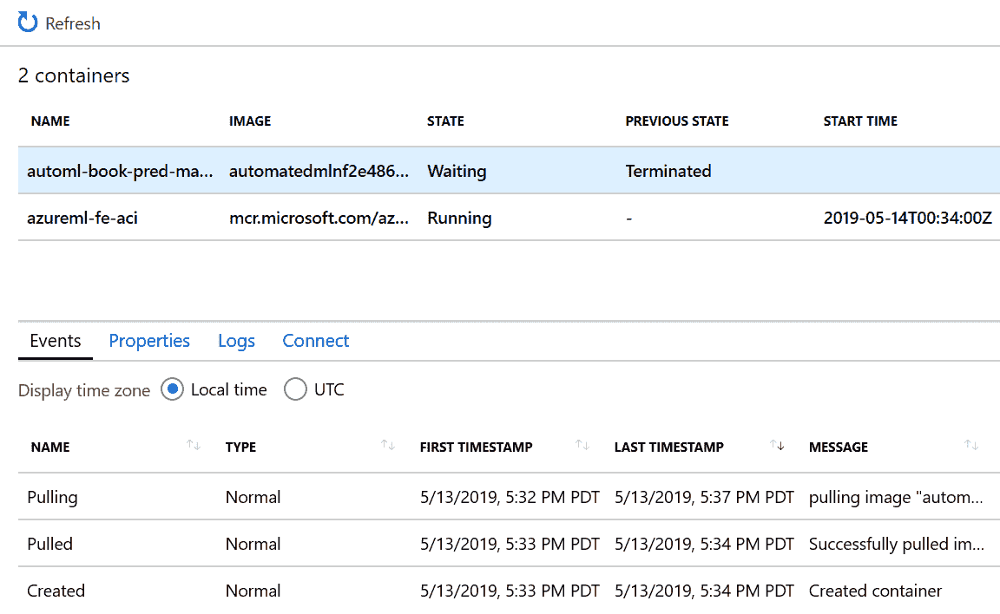

# 第五章：部署自动化机器学习模型

Microsoft Azure Machine Learning 可以帮助您管理机器学习模型的生命周期。使用 Azure Machine Learning 的自动化 ML 工具训练模型后，您可以检索识别出的最佳模型，并将其注册到 Azure Machine Learning 中。模型注册使您能够在机器学习工作区中存储不同版本的模型，并且可以轻松部署模型到不同的目标环境。

在本章中，我们将探讨如何使用 Azure Machine Learning 执行以下操作：

+   注册由自动化 ML 生成的最佳模型。

+   指定和开发评分文件。评分文件将作为生成的容器映像的一部分包含在内。

+   将模型部署到 Microsoft Azure 容器实例（ACI）和 Azure Kubernetes 服务（AKS）。

+   在模型和 Web 服务部署期间进行故障排除。

# 模型部署

在 第三章 中，您学习了如何使用自动化 ML 构建机器学习模型。在本节中，您将学习如何注册和部署由自动化 ML 识别出的最佳模型。Azure Machine Learning 支持一系列丰富的部署环境，包括托管在 Azure 中的 REST API，以及部署到不同边缘设备和硬件的模型。这些环境包括以下内容：

+   Azure Machine Learning 计算

+   ACI

+   AKS

+   Azure IoT Edge

###### 提示

要了解 Azure Machine Learning 支持的最新部署选项列表，请访问有关部署模型的 [Microsoft 页面](http://bit.ly/2Haqkmv)。

现在，让我们详细介绍您将用于注册、部署和测试由自动化 ML 生成的最佳模型的步骤：

1.  检索最佳模型。

1.  注册模型。

1.  创建容器映像。

1.  将模型部署到测试环境，然后进行测试。

1.  将模型部署到生产环境。

因为部署模型到不同环境的步骤相似，我们专注于部署到 ACI。

要开始模型部署，您需要一个或多个训练好的机器学习模型。如果您尚未拥有训练好的模型，您可以按照本书的 [GitHub 存储库](https://oreil.ly/Practical_Automated_ML_on_Azure) 中描述的步骤，训练一个简单的预测维护回归模型。使用 `AutoMLConfig` 对象创建自动化 ML 运行并提交实验的代码如下：

```
Automl_config = AutoMLConfig(task = 'regression',
                   primary_metric = 'r2_score',
                   iteration_timeout_minutes = 15,
                   iterations = 10,
                   max_cores_per_iteration = 1,
                   preprocess = False,
                   experiment_exit_score = 0.985,
                   X = X_train,
                   y = y_train,
                   X_valid = X_valid,
                   y_valid = y_valid,
                   debug_log = 'automl_errors.log',
                   verbosity=logging.ERROR,
                   path=project_folder)

# Training the predictive maintenance model using AutoML
experiment=Experiment(ws, experiment_name)
local_run = experiment.submit(Automl_config, show_output=True)
```

在实验成功完成后（参见 图 5-1），您将可以访问 `local_run` 对象，用于注册模型。


###### 图 5-1\. 自动化 ML 实验的输出

###### 注意

本章讨论的使用自动化 ML 构建和部署预测性维护模型的示例笔记本可在[*https://bit.ly/2k2e6VC*](https://bit.ly/2k2e6VC)获取。

预测性维护模型使用了 NASA 涡轮风扇故障数据集。有关数据集的更多详细信息，请访问[*https://go.nasa.gov/2J6N1eK*](https://go.nasa.gov/2J6N1eK)。

## 注册模型

在注册训练好的模型之前，您可以使用`get_output()`函数了解与表现最佳模型对应的运行更多信息。`get_output()`函数同时返回最佳运行和相应的拟合模型。

###### 注意

您可以注册哪些类型的机器学习模型？您可以使用 Azure 机器学习注册 Python 或 R 模型，以及使用 Azure 机器学习训练的模型或外部可用的预训练模型。

图 5-2 显示了运行下面代码块的输出。您会注意到在幕后创建了一个*回归管道*。回归管道包括几个步骤：`StackEnsembleRegressor`、`StandardScalerWrapper` 和 `LightGBMRegressor`）。请注意，交叉验证的折数设置为`5`：

```
best_run, fitted_model = local_run.get_output()
print(best_run)
print(fitted_model)
```


###### 图 5-2\. 检索最佳运行和相应拟合模型的详细信息

您现在可以准备注册模型了。首先，您指定模型的描述和标签，然后使用`register_model()`函数将模型注册到 Azure 机器学习中。通过注册模型，您将模型存储和版本化在云中。

每个注册的模型由其名称和版本标识。当您多次注册模型（使用相同名称）时，注册表将逐步更新注册表中存储的模型版本。元数据标签使您能够为注册到模型注册表中的模型提供更多信息。您可以使用在注册模型时提供的元数据标签搜索模型。

注册模型后，您可以获取模型的标识符。在以下代码中，您使用`local_run.model_id`检索标识符（图 5-3 显示了运行代码的输出）：

```
# Register best model in workspace
description = 'AutoML-RUL-Regression-20190510'
tags = None
model = local_run.register_model(description = description, tags = tags)

print(local_run.model_id)
```


###### 图 5-3\. 获取注册到 Azure 机器学习的模型标识符

到目前为止，您已经学会如何使用 `register_model()` 函数注册使用 Azure Machine Learning 训练的模型。您可能已经在没有使用 Azure Machine Learning 的情况下训练了一个模型，或者从外部模型仓库（或模型库）获取了一个模型。例如，要注册在[此 repo](https://oreil.ly/18z5e)中提供的 MNIST 手写数字识别 ONNX 模型，可以使用 `Model.register()`，通过提供模型的本地路径来注册它。以下代码展示了如何操作：

```
onnx_model_url = https://onnxzoo.blob.core.windows.net/models/opset_1/
                         mnist/mnist.tar.gz

urllib.request.urlretrieve(onnx_model_url, filename="mnist.tar.gz")
!tar xvzf mnist.tar.gz
model = Model.register(workspace = ws,
                       model_path ="mnist/model.onnx",
                       model_name = "onnx_mnist",
                       tags = {"onnx": "automl-book"},
                       description = "MNIST ONNX model",)
```

###### 提示

您可以在 Microsoft 的[模型文档页面](http://bit.ly/2E2YqrW)上找到更多关于 `Model` 类的信息。

## 创建容器映像

接下来，我们将努力将模型部署为 REST API。Azure Machine Learning 帮助您创建容器映像。容器映像可以部署到任何支持 Docker 的环境中（包括在本地运行的 Docker）。在本章中，您将学习如何使用 ACI 或 AKS 部署和提供模型。

要完成这一步骤，您需要创建一个评分文件（*score.py*）和一个 YAML 文件（*myenv.yml*）。评分文件用于加载模型、进行预测，并在调用 REST API 时返回结果。在评分文件中，您会注意到需要定义两个函数：`init()` 和 `run(rawdata)`。

函数 `init()` 用于将模型加载到全局模型对象中。当启动 Docker 容器时，该函数仅运行一次。函数 `run()` 用于基于传递给它的输入数据预测值。因为此代码主要用于 web 服务，所以通过 `rawdata` 传递的输入是一个 JSON 对象。在将其传递给模型进行预测之前，需要对 JSON 对象进行反序列化，如以下代码所示：

```
%%writefile score.py

import pickle
import json
import numpy
import azureml.train.automl
from sklearn.externals import joblib
from azureml.core.model import Model

def init():
    global model

    # This name is model.id of model that we want to deploy
    model_path = Model.get_model_path(model_name = '<<modelid>>')

    # Deserialize the model file back into a sklearn model
    model = joblib.load(model_path)

 def run(input_data):
     try:
         data = json.loads(input_data)['input_data']
         data = np.array(data)
         result = model.predict(data)
         return result.tolist()
     except Exception as e:
         result = str(e)
         return json.dumps({"error": result})
```

代码运行后，内容将写入名为 *score.py* 的文件中。图 5-4 显示了运行代码的输出。稍后，我们将使用 `local_run.model_id` 的实际模型标识符值替换 `<<modelid>>` 的值。


###### 图 5-4\. 创建评分文件—*score.py*

创建评分文件后，从运行中识别出依赖项，并创建 YAML 文件，如以下代码所示（图 5-5 显示了运行代码的输出）：

```
experiment = Experiment(ws, experiment_name)
ml_run = AutoMLRun(experiment = experiment, run_id = local_run.id)

dependencies = ml_run.get_run_sdk_dependencies(iteration = 0)

for p in ['azureml-train-automl', 'azureml-sdk', 'azureml-core']:
    print('{}\t{}'.format(p, dependencies[p]))
```


###### 图 5-5\. 检索 Azure Machine Learning SDK 的版本

识别出依赖项后，您可以使用函数 `CondaDependencies.create()` 指定所有依赖项来创建 YAML 文件。该函数创建环境对象，并通过函数 `save_to_file()` 将其序列化到 *myenv.yml* 文件中。图 5-6 显示了运行以下代码的输出：

```
from azureml.core.conda_dependencies import CondaDependencies
myenv = CondaDependencies.create(conda_packages=[
                  'numpy','scikit-learn','lightgbm'],
                  pip_packages=['azureml-sdk[automl]'])
conda_env_file_name = 'myenv.yml'
myenv.save_to_file('.', conda_env_file_name)
```


###### 图 5-6\. 创建环境 YAML 文件—*myenv.yml*

现在我们已经创建了得分和环境的 YAML 文件，我们可以更新文件的内容，用之前获取的 Azure 机器学习 SDK 的版本和模型标识符。以下代码读取文件，替换受影响的值，并将其写回磁盘：

```
with open(conda_env_file_name, 'r') as cefr:
   content = cefr.read()
with open(conda_env_file_name, 'w') as cefw:
   cefw.write(content.replace(azureml.core.VERSION, dependencies['azureml-sdk']))

# Substitute the actual model id in the script file.
script_file_name = 'score.py'

with open(script_file_name, 'r') as cefr:
   content = cefr.read()
with open(script_file_name, 'w') as cefw:
   cefw.write(content.replace('<<modelid>>', local_run.model_id))
```

现在值已替换，您可以配置并创建容器镜像，并将其注册到 ACI。在容器镜像的配置中，使用函数`ContainerImage.image_configuration()`指定所使用的运行时，提供 Conda 依赖项的环境文件，元数据标签以及容器镜像的描述。

当您调用`Image.create()`时，Azure 机器学习会构建容器镜像，并将容器镜像注册到 ACI。运行容器创建代码（从“Creating image”到“Running”）通常需要几分钟时间。通过使用`image.creation.status`，您可以了解镜像创建是否成功。图 5-7 显示了运行以下代码并验证容器创建成功的输出：

```
from azureml.core.image import Image, ContainerImage

image_config = ContainerImage.image_configuration(
                    runtime= "python",
                    execution_script = script_file_name,
                    conda_file = conda_env_file_name,
                    tags = {'area': "pred maint",
                            'type': "automl_regression"},
                    description = "Image for AutoML Predictive maintenance")
image = Image.create(name = "automlpredmaintimage",
                    models = [model],
                    image_config = image_config,
                    workspace = ws)
image.wait_for_creation(show_output = True)
if image.creation_state == 'Failed':
   print("Image build log at: " + image.image_build_log_uri)
```


###### 图 5-7\. 为预测维护模型创建 Docker 容器

## 部署模型进行测试

成功创建 Docker 容器镜像后，您可以准备部署模型。您可以将容器部署到任何支持 Docker 的环境中（包括本地运行的 Docker）。这些环境包括 Azure 机器学习计算、ACI、AKS、IoT Edge 等。首先，将 Docker 容器部署到 ACI 进行测试。为此部署，执行以下操作：

1.  指定部署配置。

1.  将 Docker 镜像部署到 ACI。

1.  检索评分 URI。

`AciWebservice`类用于指定部署配置。首先，我们为 ACI Web 服务指定配置。在以下代码中，我们指定使用一个 CPU 核心和 2GB 内存的配置。此外，我们还添加了元数据标签和描述：

```
from azureml.core.webservice import AciWebservice
aciconfig = AciWebservice.deploy_configuration(cpu_cores=1,
                     memory_gb=2,
                     tags={"data": "RUL",  "method" : "sklearn"},
                     description='Predict RUL with Azure AutoML')
```

接下来，我们使用`Webservice`类将 Docker 镜像部署到 ACI。在调用`deploy_from_image()`后，我们使用`wait_for_deployment(True)`等待 Web 服务部署到 ACI 的完成。完成后，我们打印 ACI Web 服务的状态。图 5-8 显示了运行以下代码的输出：

```
from azureml.core.webservice import Webservice

aci_service_name = 'automl-book-pred-maint'
print(aci_service_name)

aci_service = Webservice.deploy_from_image(
                         deployment_config = aciconfig,
                         image = image,
                         name = aci_service_name,
                         workspace = ws)
aci_service.wait_for_deployment(True)
print(aci_service.state)
```

###### 注意

`Webservice`类提供了各种部署功能，包括从图像（我们这里使用的）和从`Model`对象部署模型到本地进行测试，以及更多功能。要了解如何使用`WebService`类的各种功能，请参阅[微软文档页面](http://bit.ly/2VzN6i5)。


###### 图 5-8\. 将 Web 服务部署到 ACI 并检查操作是否完成

###### 提示

在这里，您正在学习如何使用 Azure 机器学习 SDK 部署由自动化 ML 创建的模型。Azure 机器学习支持使用 Azure CLI 部署模型，通过命令 `az ml model deploy`。要了解如何操作，请参阅 [此 Microsoft Azure 文档页面](http://bit.ly/2vYOGdP)。

ACI 服务部署完成后，您可以使用 Azure 门户查看部署情况。创建基于 ACI 的 Web 服务后，您会注意到以下情况：

+   在 Azure 机器学习工作区中创建了一个部署（见 图 5-9）。

+   创建 ACI 实例进行部署时，会部署两个容器：`azureml-fe-aci`（包括 AppInsights 日志记录的 Azure 机器学习 ACI 前端）和一个包含评分代码的容器（在部署期间提供的名称）。


###### 图 5-9\. Azure 门户—验证部署到 ACI 的完成情况

使用 Azure 门户，您可以导航到创建的 ACI，并单击容器。您将看到上述两个容器。单击评分容器，然后单击日志。您可以观察接收到的输入及其处理方式。您还可以单击连接选项卡连接到容器。对于启动命令，请选择 /bin/bash，然后单击连接。

如果导航到 */var/azureml-app*，您将找到在部署期间指定的文件（例如 *score.py*）以及用于启用 Web 服务实例化所需的其他支持文件。

一旦从镜像部署成功，您将获得一个评分 URI，可用于测试已部署的模型：

```
print(aci_service.scoring_uri)
```

图 5-10 显示了创建的 Web 服务的评分 URI。


###### 图 5-10\. 新 Web 服务的评分 URI

使用 Azure 门户，您还可以深入了解部署日志，或使用门户连接到正在运行的容器。图 5-11 显示了在 ACI 中部署的容器。


###### 图 5-11\. Azure 门户显示已部署的容器实例

图 5-12 显示了在部署容器中运行的进程。


###### 图 5-12\. 连接到运行中的容器

## 测试已部署的模型

通过将 Web 服务部署到 ACI，现在可以准备测试 Web 服务。为此，从 `X_test` 中随机选择一行。`X_test` 包含 NASA 数据的测试行。然后构造 JSON 负载，并执行 POST 到评分 URI，返回结果。图 5-13 显示了运行以下代码的输出：

```
import requests
import json

# Send a random row from the test set to score
random_index = np.random.randint(0, len(X_test)-1)
X_test_row = X_test[random_index : (random_index+1)]
Y_test_row = y_test[random_index : (random_index+1)]

input_data = "{\"input_data\": " + str(X_test_row.values.tolist()) + "}"

headers = {'Content-Type':'application/json'}
resp = requests.post(aci_service.scoring_uri, input_data, headers=headers)

print("POST to url", aci_service.scoring_uri)
print("input data:", input_data)
print("label:", Y_test_row)
print("prediction:", resp.text)
print(resp.status_code)
print(requests.status_codes._codes[resp.status_code])
```


###### 图 5-13\. 使用 NASA 数据集测试 ACI Web 服务

请注意，在此示例中，我们直接向评分 URI 发送 POST 请求。因为 Web 服务由 ACI 实例支持，因此未启用身份验证。将模型部署到 ACI 对于快速部署和验证模型以及测试正在开发中的模型非常有利。

## 部署到 AKS

对于生产部署，请考虑将模型部署到 AKS。要做到这一点，您需要创建一个 AKS 集群。您可以使用 Azure CLI 或 Azure Machine Learning SDK 创建集群。创建 AKS 集群后，您可以使用它来部署多个映像。

让我们从使用以下代码创建 AKS 集群开始：

```
from azureml.core.compute import AksCompute, ComputeTarget

# Use the default configuration
# You can also customize the AKS cluster based on what you need
prov_config = AksCompute.provisioning_configuration()

aks_name = 'myaks'

# Create the cluster
aks_target = ComputeTarget.create(workspace = ws,
                     name = aks_name,
                     provisioning_configuration = prov_config)
# Wait for the AKS cluster to complete creation
aks_target.wait_for_completion(show_output = True)
```

创建了 AKS 集群之后，您可以将模型部署到服务中。在以下代码中，请注意我们将创建的 AKS 集群指定为`deployment_target`：

```
from azureml.core.webservice import AksWebservice

aks_service_name = 'aks-automl-book-pred-maint'
print(aks_service_name)

aks_target = AksCompute(ws,"myaks")

aks_service = AksWebservice.deploy_from_image(image = image,
                           name = aks_service_name,
                           deployment_target = aks_target,
                           workspace = ws)

aks_service.wait_for_deployment(True)
print(aks_service.state)
```

将模型部署到 AKS 后，您需要在请求的头部指定服务密钥，然后才能调用评分 URI。为此，请修改您之前开发的测试评分代码：

```
import requests
import json

# Send a random row from the test set to score
random_index = np.random.randint(0, len(X_test)-1)
X_test_row = X_test[random_index : (random_index+1)]
Y_test_row = y_test[random_index : (random_index+1)]

input_data = "{\"input_data\": " + str(X_test_row.values.tolist()) + "}"

# For AKS deployment you need the service key in the header as well
headers = {'Content-Type':'application/json'}
api_key = aks_service.get_keys()[0]
headers = {'Content-Type':'application/json',
                          'Authorization':('Bearer '+ api_key)}

resp = requests.post(aks_service.scoring_uri, input_data, headers=headers)

print("POST to url", aks_service.scoring_uri)
print("input data:", input_data)
print("label:", Y_test_row)
print("prediction:", resp.text)
print(resp.status_code)
```

# Web 服务的 Swagger 文档

将机器学习 Web 服务部署到各种计算环境后，提供良好的文档描述如何使用 API 非常重要。这有助于加速依赖 API 进行预测的应用程序的开发。由于您需要管理的机器学习 API 在时间上会发生变化（特别是在开发过程中），因此保持文档的及时更新至关重要。

*Swagger*是一个开源软件框架，许多开发人员在设计、开发和文档化 RESTful Web 服务时使用它。Swagger 文档使开发人员能够快速描述和记录 Web 服务的输入和输出。Swagger 文档已经逐步发展成为描述 RESTful API 的常见方式。自动生成的 Swagger 文档有助于确保在部署机器学习模型并将其作为 Web 服务提供时始终可用最新信息。

在使用 Azure Machine Learning 部署模型时，您可以在创建评分文件时使用 Python 的`inference-schema`包。`inference-schema`包允许您添加函数装饰器，以便生成 Swagger 文档并强制执行模式类型。

首先，从`inference-schema`包中导入相关类，如下所示：

```
from inference_schema.schema_decorators import input_schema, output_schema
from inference_schema.parameter_types.numpy_parameter_type import
                                      NumpyParameterType
```

导入各种类之后，您可以通过为`run()`函数提供`input_schema`和`output_schema`装饰器来指定输入和输出模式。示例输入和输出数据作为`input_sample`和`output_sample`变量的一部分提供：

```
@input_schema('input_data', NumpyParameterType(input_sample))
@output_schema(NumpyParameterType(output_sample))
```

下面的代码展示了*score.py*文件，指定了装饰器：

```
%%writefile score.py
import pickle
import json
import numpy as np
from sklearn.externals import joblib

import azureml.train.automl
from azureml.core.model import Model

from inference_schema.schema_decorators import input_schema, output_schema
from inference_schema.parameter_types.numpy_parameter_type
                                            import NumpyParameterType

def init():
    global model

    # Identifier for the model (model.id) to be deployed
    model_path = Model.get_model_path(model_name = '<<modelid>>')

    # Deserialize the model file back into a sklearn model
    model = joblib.load(model_path)
X_test_row = np.array([[-0.0006, −0.0004, 100.0, 518.67,
               642.25, 1589.25, 1412.42, 14.62, 21.61, 553.88,
               2388.15, 9043.21, 1.3, 47.45, 521.88, 2388.18,
               8131.61, 8.4807, 0.03, 392.0, 2388.0,
               100.0, 38.6, 23.2946]])

input_sample = X_test_row
output_sample = np.array([120.0])

@input_schema('input_data', NumpyParameterType(input_sample))
@output_schema(NumpyParameterType(output_sample))
def run(input_data):

   try:
        result = model.predict(input_data)
        return result.tolist()

   except Exception as e:
        result = str(e)
        return json.dumps({"error": result})
```

当你定义了 *score.py* 文件并且模型已部署后，你可以使用 Swagger URI 获取 Swagger，使用 `print(aci_service.swagger_uri)`。

这使你能够下载包含 API 的 Swagger 文档的 *swagger.json* 文件。想查看生成的 *swagger.json* 示例，请访问本书的[GitHub 仓库](http://bit.ly/30gu2nz)。你还可以通过导入 API 使用 [SwaggerHub](https://oreil.ly/M818e) 生成文档。

# 调试部署

在部署机器学习模型到各种计算环境（如 ACI、AKS）的过程中，你可能会遇到部署失败（如容器终止）或评分 API 未返回预期结果的情况。在本节中，我们将介绍一些常见的部署失败情况，并向你展示如何解决它们。

## Web 服务部署失败

创建容器映像并使用 `Webservice.deploy_from_image()` 部署映像后，ACI 部署可能会失败，Web 服务将不可用。因此，你可能会看到以下错误消息：

```
[test]

FailedACI service creation operation finished, operation "Failed"
Service creation polling reached terminal state, current service state: Failed
{
  "code": "AciDeploymentFailed",
   "message": "Aci Deployment failed with exception: Your container application
   crashed. This may be caused by errors in your scoring file's init() function.
   Please check the logs for your container instance automl-book-pred-maint2.
   You can also try to run image
   automatedmlnf2e4863f.azurecr.io/automlpredmaintimage-bug:1 locally.
   Please refer to http://aka.ms/debugimage for more information.",
   "details": [
   {
      "code": "CrashLoopBackOff",
      "message": "Your container application crashed. This may be caused by
      errors in your scoring file's init() function.
      \nPlease check the logs for your container instance
                                                automl-book-pred-maint2.
      \nYou can also try to run image
      automatedmlnf2e4863f.azurecr.io/automlpredmaintimage-bug:1 locally.
      Please refer to http://aka.ms/debugimage for more information."
   }
 ]
}
Failed
```

若要调试导致服务创建失败的原因，请使用错误消息中提供的 URI 下载容器映像。同时，你可以使用 Azure 门户进行调查。导航至创建了 Azure 机器学习工作区的资源组，并找到对应于正在创建的服务的 ACI。图 5-14 显示了 ACI 的示例。进行调查时，请执行以下操作：

1.  在左侧窗格中，点击 Containers。

    

    ###### 图 5-14\. 部署容器映像的容器实例 (automl-book-pred-maint2)

1.  点击显示状态为 Waiting 的容器，以及上一个状态为 Terminated 的容器，如 图 5-15 所示。

    

    ###### 图 5-15\. 调查 ACI 中终止的容器

1.  点击 Logs 标签，你将看到日志和导致容器启动失败的错误，如 图 5-16 所示。

    

    ###### 图 5-16\. 导致容器启动失败的错误

###### 提示

欲了解如何排查 Azure 机器学习 AKS 和 ACI 部署问题，请参阅此[Microsoft 文档页面](http://bit.ly/2VyQtFZ)。

# 结论

在本章中，你学习了如何注册、部署和测试由自动 ML 生成的模型到 ACI。你还学会了如何指定 Web 服务的输入和输出模式，以便生成 Swagger 文档。有时你可能会遇到有错误的评分脚本导致部署失败，容器可能无法启动。针对这些情况，你学会了如何使用 Azure 门户以及 Azure 机器学习 Python SDK 来调试失败的部署。
