# 第六章：分类和回归

成功实施机器学习的关键因素之一（基于与许多数据科学家、机器学习工程师和产品经理的讨论）是能够将业务问题和期望的结果映射到适当的机器学习问题上（或者进行坦率的对话，说明机器学习无法解决问题！）。*分类*和*回归*是常用的两种机器学习技术。

在本章中，我们涵盖了分类和回归的基础知识，并展示了如何将业务用例映射到分类或回归问题。您将学习如何使用 Microsoft Azure 机器学习——特别是自动化 ML——自动选择适合您特定用例的最佳分类或回归模型。

###### 提示

**需要开始使用 Azure 机器学习？**

如果您刚开始使用 Azure 机器学习，请参考第三章了解基本概念，然后再深入本章内容。

# 什么是分类和回归？

在监督学习中，您有一组独立特征 X 和一个目标特征 Y。机器学习的任务是从 X → Y 进行映射。分类和回归都是监督学习，要求有标记数据的可用性。

要训练一个在测试数据和泛化到新的未见数据时表现良好的高质量模型，示例需要充分代表测试数据。许多监督学习算法的一个基本假设是，训练示例的数据分布与测试示例的数据分布相同（包括未见示例）。

在许多实际问题中，这通常是不正确的。你的数据可能要么具有你想要预测的目标特征的极少数对象（称为*类不平衡*或*少数类问题*），要么质量不佳。在某些情况下，你甚至可能没有标记数据！多年来，机器学习社区发明了处理这些问题的聪明方法（例如使用合成少数过采样技术，或 SMOTE，来处理类不平衡），但详细讨论这些方法超出了本书的范围。

当 Y 是一个离散特征，并且您试图预测类别/标签时，您正在处理一个*分类*问题。分类有助于预测对象属于哪个类别（或类）。当分类用于具有两个不同类别的数据时，我们通常称之为*二元分类*。如果有超过两个不同类别，则是*多类分类*问题。例如，预测一个人是好还是坏的信用风险是一个二元分类问题（因为有两个不同的类别：好或坏）。预测书籍类别（例如童话、烹饪书、传记、旅行等）是一个多类分类问题。

当 Y 是您试图预测的连续特征时，您正在处理一个*回归*问题。回归有助于预测连续值。例如，在制造业的预测性维护场景中，回归模型用于预测系统和设备的寿命。在医疗保健中，回归用于预测医疗保健成本、患者住院时间等。图 6-1 展示了训练和评估机器学习模型的典型数据科学流程。该工作流程适用于分类和回归问题。

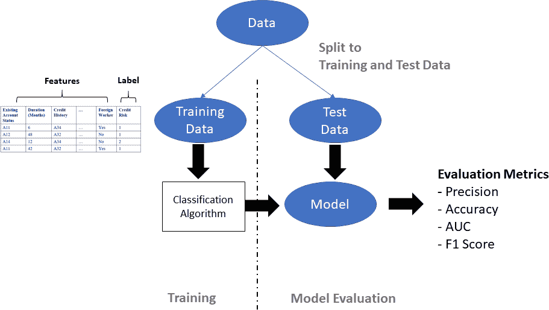

###### 图 6-1\. 训练分类/回归模型

首先将数据分为训练数据和测试数据。训练数据作为分类/回归算法的输入。一旦完成训练，将生成一个机器学习模型，随后使用测试数据进行评估。作为模型评估的一部分，您将计算不同类型的指标（例如，精确度，准确度，AUC，F1-score 等），这有助于确定其质量。

让我们通过信用风险评分的示例来说明这一点。在金融服务中，信用风险评分使银行能够为客户做出信贷决策。德国信用风险数据集包含 1,000 行（表 6-1 显示了数据集的一个子集）。每行使用一组特征（或属性）来描述一个人。最后一列是类/标签（即信用风险），提供有关该人是否存在信用风险的信息。

###### 注

德国信用风险数据集可以在[UCI 机器学习库](http://bit.ly/2CxvDet)中找到。该数据集由汉斯·霍夫曼教授于 1994 年贡献给机器学习社区，包含 20 个特征（7 个数值特征，13 个分类特征）和一个信用风险标签。

从 UCI 机器学习库下载文件*german.data*：

```
import pandas as pd
columns = ['status_checking_acc', 'duration_months', 'credit_history',
     'purpose', 'credit_amount', 'saving_acc_bonds',
     'present_emp_since','installment_rate', 'personal_status',
     'other_debtors', 'residing_since', 'property', 'age_years',
     'inst_plans', 'housing', 'num_existing_credits', 'job',
     'dependents', 'telephone', 'foreign_worker', 'status']

creditg_df = pd.read_csv(
     'https://archive.ics.uci.edu/ml/machine-learning-databases/statlog
                                    /german/german.data',
delim_whitespace = True, header = None )
# Assign the header row to
creditg_df.columns = columns

# Get the initial rows of data
creditg_df.head()
```

当您下载数据后，请注意每行中的前几列（例如，现有账户状态、持续时间、信用历史、外籍工人）描述了不同的个人属性。在表 6-1 中，您可以看到第一列显示了个人支票账户的账户状态。A11 到 A13 表示支票账户中的可用金额（金额以德国马克（DM）计算，即 2002 年前的德国货币）。A14 表示该人没有支票账户。出于说明目的，我们省略了许多特征。最后一列显示了信用风险：值为 1 表示没有信用风险，2 表示有信用风险。

表 6-1\. 德国信用风险数据集

| 现有账户状态 | 持续时间（月） | 信用历史 | … | 外籍工人 | 信用风险 |
| --- | --- | --- | --- | --- | --- |
| A11 | 6 | A34 | … | Yes | 1 |
| A12 | 48 | A32 | … | No | 1 |
| A14 | 12 | A34 | … | No | 2 |
| A11 | 42 | A32 | … | Yes | 1 |

在我们深入研究德国信用风险数据集之前，让我们回顾一下分类和回归算法。

## 分类和回归算法

机器学习社区多年来已经开发了丰富的分类和回归算法。常用的分类算法包括朴素贝叶斯分类器、支持向量机（SVM）、*k*-最近邻、决策树和随机森林。对于回归，常用的有决策树、弹性网络、LARS Lasso、随机梯度下降（SGD）和支持向量机（SVM）。

如果您问我应该使用哪种分类/回归算法？答案是：这取决于。通常，数据科学家会尝试不同的算法（取决于问题、数据集大小、可解释模型的要求、算法速度等）。往往需要在速度、模型评估指标（例如准确性）和可解释结果之间权衡。

例如，如果您关注初始解决方案到达的计算速度，您可能会考虑决策树（或任何基于树的变体）或简单的线性回归方法。然而，如果您优化精度（和其他指标），您可能会使用随机森林、支持向量机（SVM）或梯度提升树。通常，最佳结果是不同分类/回归模型的集成。

###### Tip

欲深入了解每种分类算法的工作原理，请参考[Tom Mitchell 教授的机器学习课程](http://bit.ly/2Tqiqtx)，该课程详细讨论了不同的机器学习算法。

机器学习新手？请参考[这张微软备忘单](http://bit.ly/2YhnjJ2)，了解不同分类算法及其适用场景。

图 6-2 展示了使用德国信用风险数据集训练的可能决策树示例。您会注意到树从一个分割属性开始——账户状态。如果账户状态的值为 A13、A14，则该人不具有信用风险。树进一步选择其他分割属性（持续时间和信用历史），并使用这些属性进一步确定一个人是否具有信用风险。

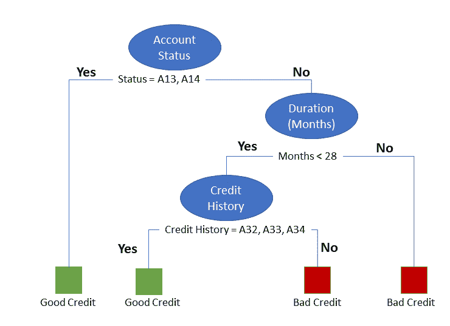

###### 图 6-2\. 德国信用风险数据集的决策树

每个这些分类算法都有需要调整的超参数。此外，数据分布、数据的维度、数据的稀疏性以及数据是否线性可分都很重要。随着数据科学家在实践中的成熟，他们会建立自己的工具箱，并掌握使用的算法（基于对算法工作原理的熟悉程度和如何调整超参数）。

如果您有兴趣尝试不同的分类算法和数据集，`scikit-learn`提供了丰富的各种分类算法库，是一个很好的 Python 机器学习库入门选择。

## 使用自动 ML 进行分类和回归

让我们开始处理一个分类问题。为了加速您学习如何使用自动 ML 对德国信用风险数据集进行信用风险分类，您可以使用 GitHub 上提供的笔记本，并在 [Microsoft Azure 笔记本](https://notebooks.azure.com/) 上运行它们。

尽管自动 ML 看起来几乎像是魔法（即给定数据集，执行一些自动特征工程，枚举不同类型的模型，并选择最佳模型），但拥有正确的输入数据将显著提高模型的质量。

###### 提示

使用 Azure 机器学习进行训练信用风险模型的自动 ML 示例笔记本可在 [*https://bit.ly/2m3xlyP*](https://bit.ly/2m3xlyP) 获取。

在使用自动 ML 时支持丰富的分类和回归算法，如 表 6-2 所示。

表 6-2\. Azure 机器学习中自动 ML 支持的分类和回归算法

| 算法类型 | 分类 | 回归 |
| --- | --- | --- |
| C-SVC | ✓ |  |
| 决策树 | ✓ | ✓ |
| 弹性网络 |  | ✓ |
| 极端随机森林 | ✓ | ✓ |
| 梯度提升 | ✓ | ✓ |
| *k*-最近邻 | ✓ | ✓ |
| LARS Lasso |  | ✓ |
| Light GBM | ✓ | ✓ |
| 线性 SVC | ✓ |  |
| 逻辑回归 | ✓ |  |
| 朴素贝叶斯 | ✓ |  |
| 随机森林 | ✓ | ✓ |
| SGD | ✓ | ✓ |

###### 注意

要获取自动 ML 支持的分类算法的更新列表，并了解每种算法的详细信息，请参阅此 [Microsoft 文档](http://bit.ly/2TXdUYN)。

### 设置 Azure 机器学习工作区

在此之前，您已经学会了如何设置 Azure 机器学习工作区，并准备了配置文件，其中包括订阅 ID、资源组和工作区名称。使用以下代码来设置配置文件：

```
config.json
{
    "subscription_id": "<Replace with Azure Subscription ID>",
    "resource_group": "oreillybook",
    "workspace_name": "automl-tutorials"
}
```

在使用 Azure 笔记本时，*config.json* 文件应存储在相同的文件夹或 *aml_config* 文件夹中，如 图 6-3 所示。

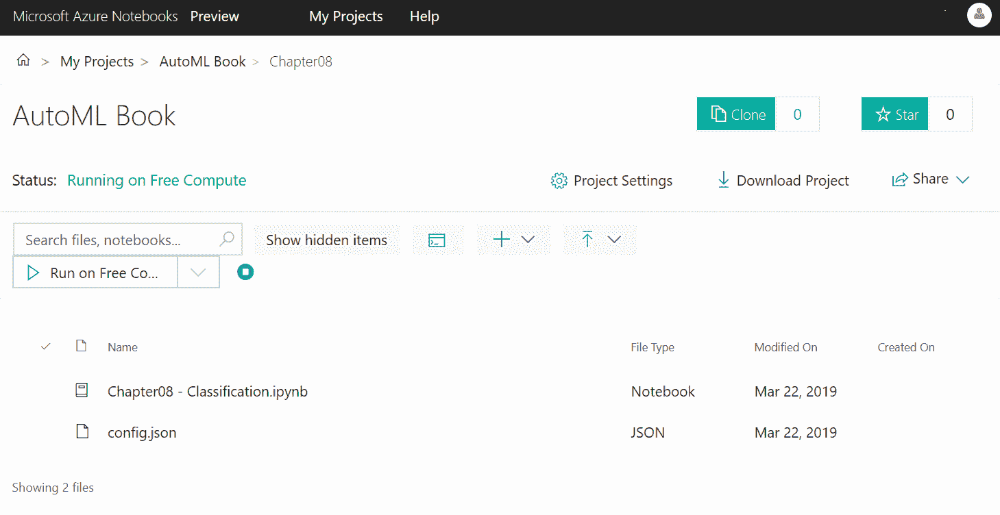

###### 图 6-3\. 开始运行 Azure 笔记本

将这些文件上传到 Azure 笔记本或您自己的本地 Jupyter Notebook 环境后，您就可以开始了。让我们首先导入您在此练习中将要使用的相关 Python 包：

```
import numpy as np
import pandas as pd
from sklearn.model_selection import train_test_split
import logging
```

接下来，导入 Azure 机器学习 SDK (`azureml-sdk`)：

```
import azureml.core
from azureml.core.experiment import Experiment
from azureml.core.workspace import Workspace
from azureml.train.automl import AutoMLConfig
```

导入相关的 Python 包后，使用 *config.json* 中的值创建 Azure 机器学习工作区。

`Workspace.from_config()` 读取 *config.json* 文件，该文件存储在笔记本所在文件夹或 *aml_config/config.json* 中。正如前面章节中讨论的那样，工作区对象存储有关 Azure 订阅的信息，以及使用的各种资源信息。创建后，它还会创建一个监视和跟踪模型运行的云资源：

```
ws = Workspace.from_config()

# Populate a workspace info object
workspace_info = {}
workspace_info['SDK version'] = azureml.core.VERSION
workspace_info['Subscription ID'] = ws.subscription_id
workspace_info['Workspace Name'] = ws.name
workspace_info['Resource Group'] = ws.resource_group
workspace_info['Location'] = ws.location
pd.set_option('display.max_colwidth', −1)
workspace_info = pd.DataFrame(data = workspace_info, index = [''])
workspace_info.T
```

在运行 Python 代码后，您将看到 图 6-4 中显示的输出，该输出提供了 Azure 机器学习 SDK 的版本信息、Azure 订阅 ID、以及创建的 Azure 机器学习工作区的名称和位置信息。

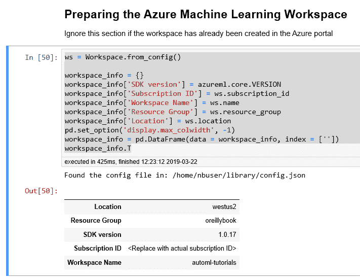

###### 图 6-4\. 准备 Azure 机器学习工作区

如果这是您在 Azure 笔记本中第一次运行代码，您可能会看到以下警告消息：

```
Warning: Falling back to use azure cli login credentials. If you run your
code in unattended mode, i.e., where you can't give a user input, then
we recommend to use ServicePrincipalAuthentication or MsiAuthentication.

Found the config file in: /home/nbuser/library/config.json Performing
interactive authentication. Please follow the instructions on the terminal.

To sign in, use a web browser to open the page https://microsoft.com/devicelogin
and enter the code &lt;9-digit code&gt; to authenticate.
```

要使用 Azure 进行身份验证，请点击 [*https://microsoft.com/devicelogin*](https://microsoft.com/devicelogin) 并输入提供的身份验证代码。使用有效凭据登录后，您可以重新运行单元格，您将得到身份验证。

要作为无人操作的一部分运行代码，您需要设置 Azure 服务主体，并使用该服务主体进行程序化登录。要了解如何与 Azure 机器学习进行身份验证的更多信息，请访问这个 [GitHub 仓库](http://bit.ly/2CEBxdM)。

接下来，在创建 Azure 机器学习工作区之后，您需要创建用于此练习的实验对象。在随后的代码中，请注意我们在创建实验时传递了之前创建的工作区对象的引用。我们还指定了一个项目文件夹来包含将要创建的文件列表，如 图 6-5 所示。

```
# Choose the experiment name and specify the project folder.

experiment_name = 'automl-classification'
project_folder = './book/automl-classification'

experiment = Experiment(ws, experiment_name)
```

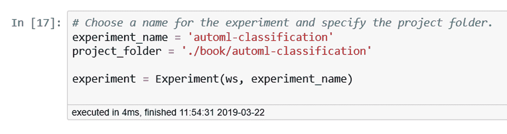

###### 图 6-5\. 创建实验并指定项目文件夹

### 数据准备

对于此练习，我们使用来自 [UCI 机器学习库](http://bit.ly/2Opc38V) 的数据，该库包含用于分类和回归问题的丰富数据集集合。另一个开放机器学习数据集的良好资源是 [OpenML.org](http://bit.ly/2HGjHLE)。德国信用风险数据集在这两个数据集仓库中都可以找到。

因为 UCI 机器学习库中的 *german.data* 文件不包含标题行，我们首先定义每个列的名称。这帮助我们在处理数据集时引用列名。执行以下代码后，您将在 图 6-6 中看到数据集的前五行，每行包含 21 列，最后一列是名为 Status 的标签列：

```
# Define the column
columns = ['status_checking_acc', 'duration_months', 'credit_history',
           'purpose', 'credit_amount','saving_acc_bonds',
           'present_emp_since', 'installment_rate','personal_status',
           'other_debtors', 'residing_since', 'property',
           'age_years','inst_plans', 'housing', 'num_existing_credits',
           'job', 'dependents', 'telephone', 'foreign_worker', 'status']

creditg_df = pd.read_csv(
            'https://archive.ics.uci.edu/ml/
    machine-learning-databases/statlog/german/german.data',
    delim_whitespace = True, header = None )
creditg_df.columns = columns
creditg_df.head()
```

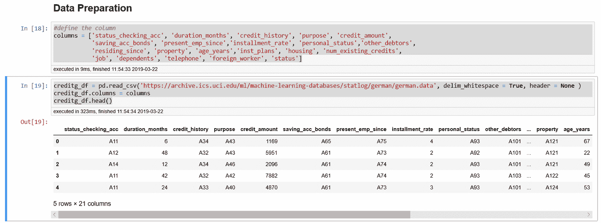

###### 图 6-6\. 指定列名并加载数据

Status 列是我们试图建立模型来预测的类。让我们看看 Status 列的唯一值数量。状态列中的值为 1 和 2；1 表示良好的信用，2 表示不良的信用。为了方便阅读，我们从这些值中减去 1，这样我们就使用值 0 来表示良好的信用，使用值 1 来表示此人有不良信用：

```
# Get the unique values in the Status Column
creditg_df.status = creditg_df.status − 1
creditg_df['status'].unique()
```

此外，我们还将带有目标特征的列分离出来：

```
# Get the label column, and remove the label column from the dataframe
# When axis is 1, columns specified are dropped

target = creditg_df["status"]
creditg_df =  creditg_df.drop(labels='status',axis=1)
```

现在我们准备将数据拆分为训练数据和测试数据。在这个练习中，我们进行 70/30 的拆分（即 70% 的数据用于训练，剩余的用于测试）。在下面的代码中，您可以看到当我们调用 `train_test_split` 时，我们还传入了目标列的引用 `target column`：

```
# Split into train and test data
X_train, X_test, y_train, y_test =
    train_test_split(creditg_df, target, test_size=0.3)

# Convert y_train and y_test from Pandas Series to ndArray
y_train = y_train.values
y_test = y_test.values
```

将数据分割为训练数据和测试数据之后，请仔细检查两个 DataFrame — `X_train` 和 `X_test`。

如 图 6-7 所示，两个 DataFrame 应该有 20 列。因为 `train_test_split` 返回 Pandas Series 作为训练和测试标签列（由 `y_train` 和 `y_test` 表示），我们可以将这两个对象转换为 ndArray 或 DataFrame 之一。这将作为将要创建的 `AutoMLConfig` 对象的输入之一。

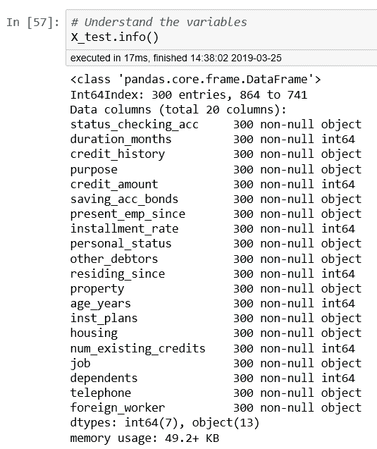

###### 图 6-7\. 有关 DataFrame X_test 的信息

### 使用自动 ML 训练模型

我们已准备好使用自动 ML 来训练德国信用风险问题的分类模型。

但在此之前，让我们看看在使用自动 ML 时用于调整的可用指标，通过使用函数 `get_primary_metrics()`。图 6-8 显示了输出结果。您将看到支持的常见分类指标，包括准确率、精确度、AUC 和加权精确度分数：

```
# Explore the metrics that are available for classification
azureml.train.automl.utilities.get_primary_metrics('classification')
```

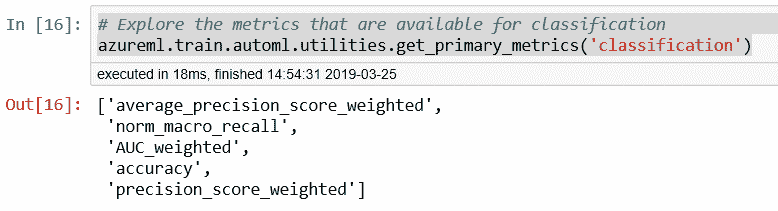

###### 图 6-8\. 用于分类模型的指标

让我们定义在多个实验中使用的常见自动 ML 设置：

```
import time
automl_settings = {
    "name": "AutoML_Book_CH08_Classification_{0}".format(time.time()),
    "iteration_timeout_minutes": 10,
    "iterations": 30,
    "primary_metric": 'AUC_weighted',
    "preprocess": True,
    "max_concurrent_iterations": 10,
    "verbosity": logging.INFO
}
```

接下来，我们创建 `AutoMLConfig` 对象，指定自动 ML 设置和训练数据（包括标签列 `y_train`）。我们指定要执行的交叉验证次数为 `5`：

```
automl_config = AutoMLConfig(
                   task = 'classification',
                   debug_log = 'automl_errors.log',
                   X = X_train,
                   y = y_train,
                   n_cross_validations = 5,
                   path = project_folder,
                   **automl_settings
                 )
```

###### 提示

在创建 `AutoMLConfig` 对象时，您会注意到在本例中，我们将任务指定为 `classification`。如果您正在使用自动 ML 自动选择最佳回归模型，则应将任务指定为 `regression`。

要了解在创建 `AutoMLConfig` 对象时可以使用的各种设置，请参阅 [*https://bit.ly/2lZWXwo*](https://bit.ly/2lZWXwo)。您可以使用 `whitelist_models` 指定在自动 ML 中搜索最佳模型时要使用的算法列表。您还可以使用 `blacklist_models` 指定在实验迭代中忽略的模型列表。

创建了 `AutoMLConfig` 对象之后，您就可以提交实验了，如下所示：

```
local_run = experiment.submit(automl_config, show_output = True)
```

当实验提交后，自动化 ML 将运行并评估多个迭代。每个迭代将使用不同的分类算法以及自动特征化技术，并向您显示评估指标。最佳迭代分数也将显示出来。 图 6-9 显示了评估的 30 次迭代的输出。

注意到第 14 次迭代使用逻辑回归，最初达到了 0.7727 的最佳模型得分。而在第 30 次迭代（最后一次），使用了集成学习，将最佳模型得分从 0.7727 提升到了 0.7916\. 您还将看到实验输出中每列的解释（例如，抽样百分比，持续时间，指标，最佳值）。

当实验成功完成时，您可以在 Azure 门户中查看运行的详细信息：

```
local_run
```

或者通过使用自动化 ML Jupyter Notebook 小部件：

```
import azureml.widgets
from azureml.widgets import RunDetails
RunDetails(local_run).show()
```

###### 提示

如果尚未安装用于小部件的 Python 包，您也可以使用 `pip install azureml-widgets` 进行安装。

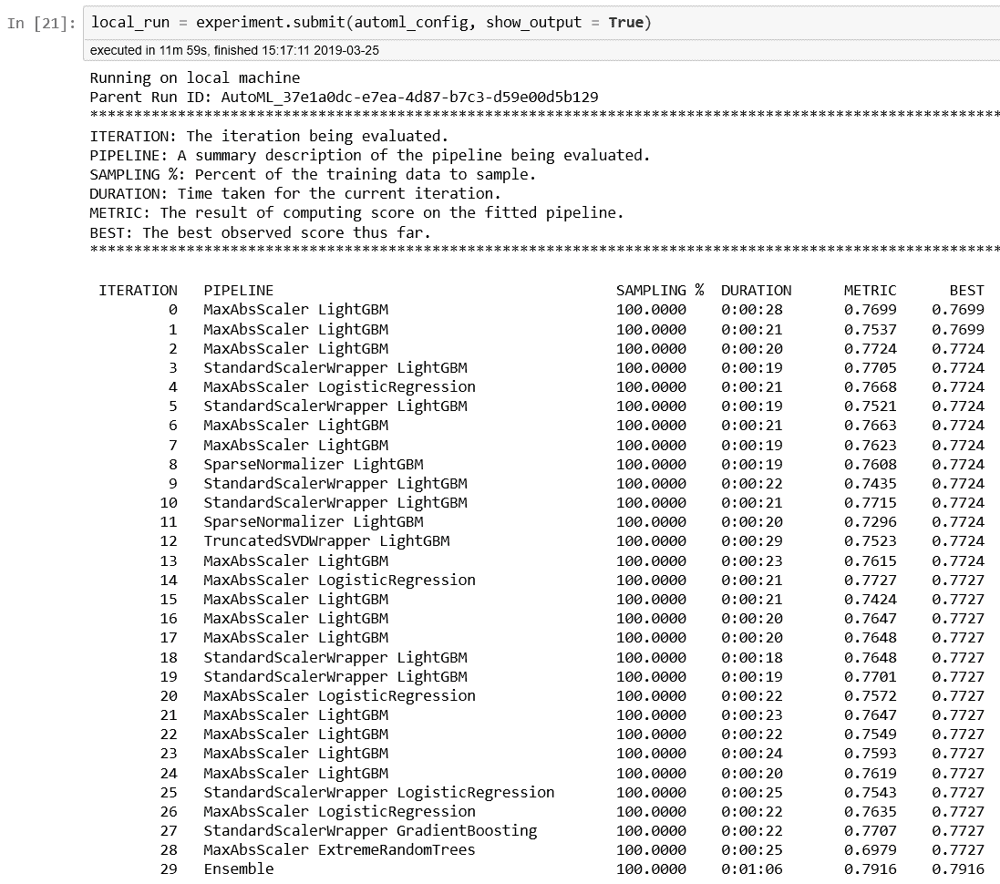

###### 图 6-9\. 从提交的自动化 ML 分类实验中输出

如 图 6-10 所示，如果单击“链接到 Azure 门户”，您将看到您完成的最新运行的详细信息。您还可以深入了解运行实验时生成的日志。

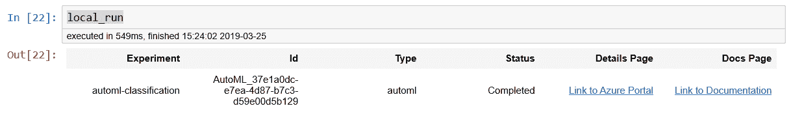

###### 图 6-10\. 获取有关 local_run 的信息

图 6-11 显示了运行的详细信息，运行编号为 347\. 从图表中可以看出模型在每次迭代中的性能。

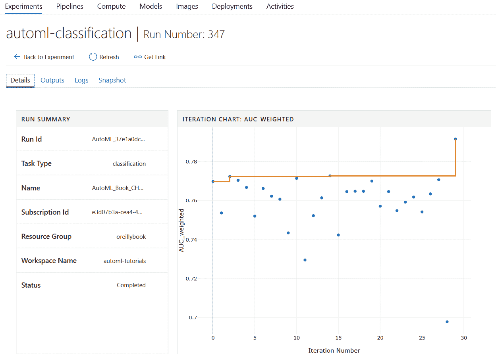

###### 图 6-11\. Azure 门户 - 实验运行的详细信息

安装完小部件后，您可以直接在 Azure Notebooks 中查看运行详细信息。

图 6-12 显示了从 `RunDetails(local_run).show()` 输出的结果。您还可以单击每个迭代以查看更多详细信息。例如，如果单击集成学习的最后一次迭代（显示为第一行），您将看到详细的图表，捕获了该迭代的精确-召回率，多类 ROC 曲线，提升曲线，增益曲线和校准曲线。还显示了混淆矩阵。

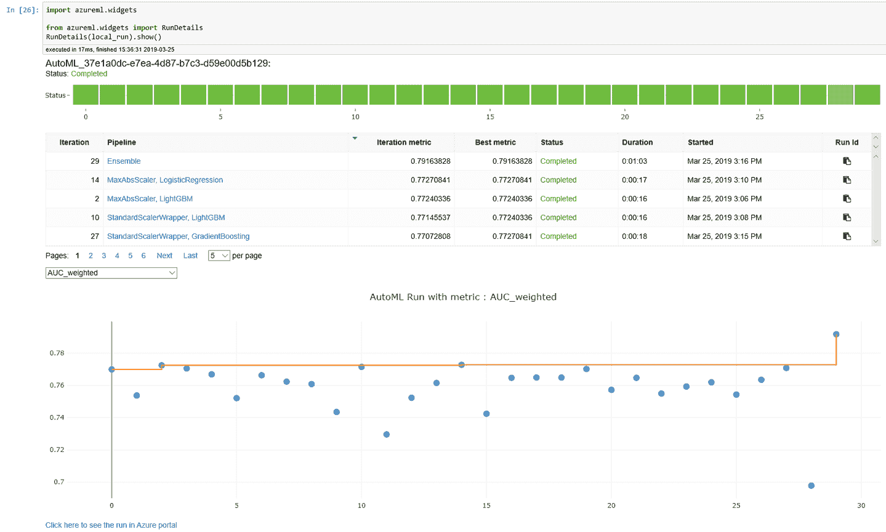

###### 图 6-12\. 使用自动化 ML Jupyter Notebook 小部件

此视图的子集显示在 图 6-13 中。

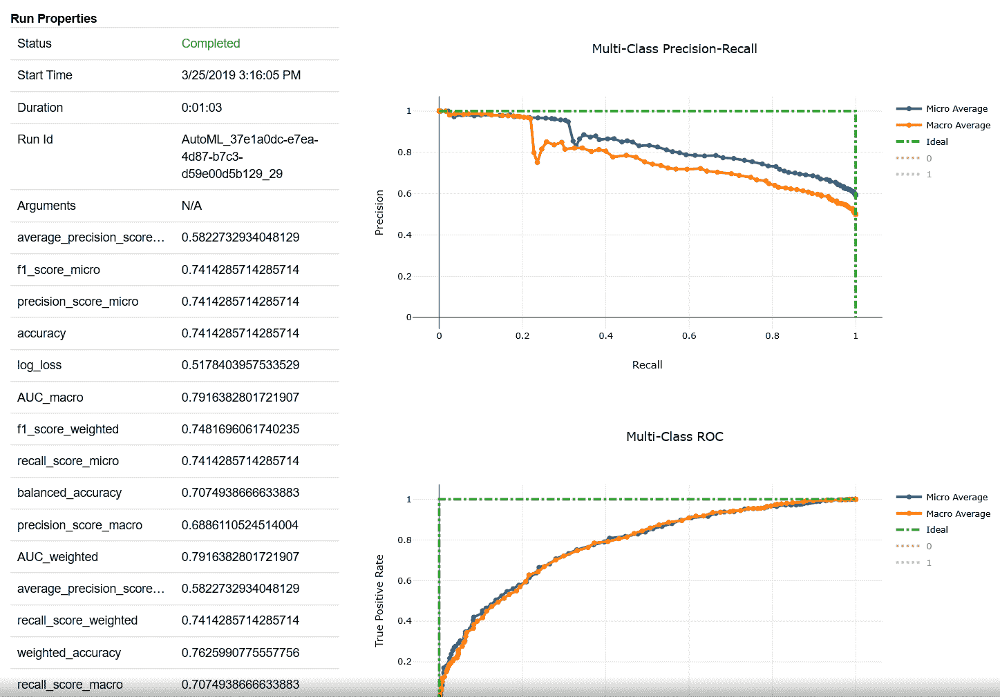

###### 图 6-13\. 使用自动化 ML Jupyter Notebook 小部件了解运行的详细信息

而不是交互式地点击每个迭代，您可以通过使用 `get_children()` 来制表每次运行中的指标（输出显示在 图 6-14 中）：

```
# Get all child runs
children = list(local_run.get_children())
metricslist = {}
for run in children:
    properties = run.get_properties()
    metrics = {k: v for k,
      v in run.get_metrics().items() if isinstance(v, float)}
    metricslist[int(properties['iteration'])] = metrics
rundata = pd.DataFrame(metricslist).sort_index(1)
rundata
```

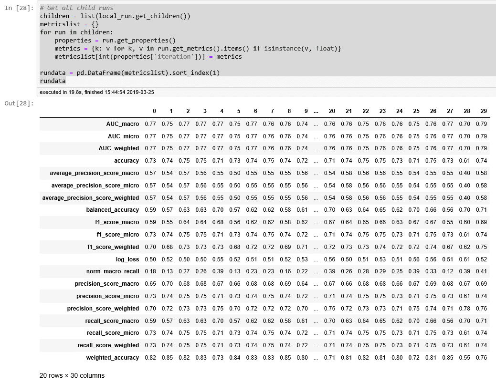

###### 图 6-14\. 每次运行中的指标

### 选择并测试实验运行中的最佳模型

要使用最佳模型，您可以使用`get_output()`函数（输出显示在图 6-15 中）：

```
best_run, fitted_model = local_run.get_output(metric = "AUC_weighted")

print(best_run)
```

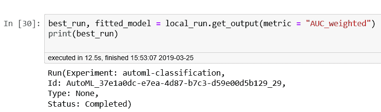

###### 图 6-15\. 最佳运行的信息

让我们使用测试数据对模型进行测试，并理解评估中的分类指标，以及接收者操作特征曲线下面积（ROC AUC）：

```
from sklearn.metrics import classification_report
from sklearn.metrics import roc_auc_score

y_pred = fitted_model.predict(X_test)

target_names = ['0','1']
print (classification_report(
          y_test,y_pred, target_names=target_names))
print("AUC: " + str(roc_auc_score(y_test,y_pred)))
```

图 6-16 显示了使用测试数据对模型进行测试的输出结果，以及相关的指标：精确率、召回率、F1 分数和模型的支持度。

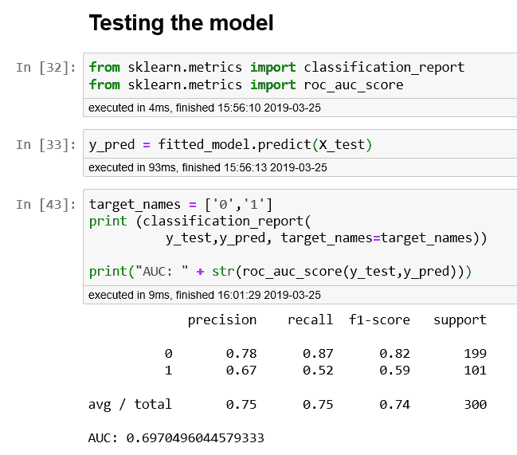

###### 图 6-16\. 所选最佳模型的分类指标和 AUC

# 结论

在本章中，您学习了如何使用 Azure 机器学习的自动化 ML 来查找最佳的分类模型，以预测个人的信用风险。您也可以使用同样的方法来识别最佳的回归模型。一旦您确定了用于任务的最佳分类/回归模型，请参考第五章了解如何将机器学习模型部署到各种环境中。
