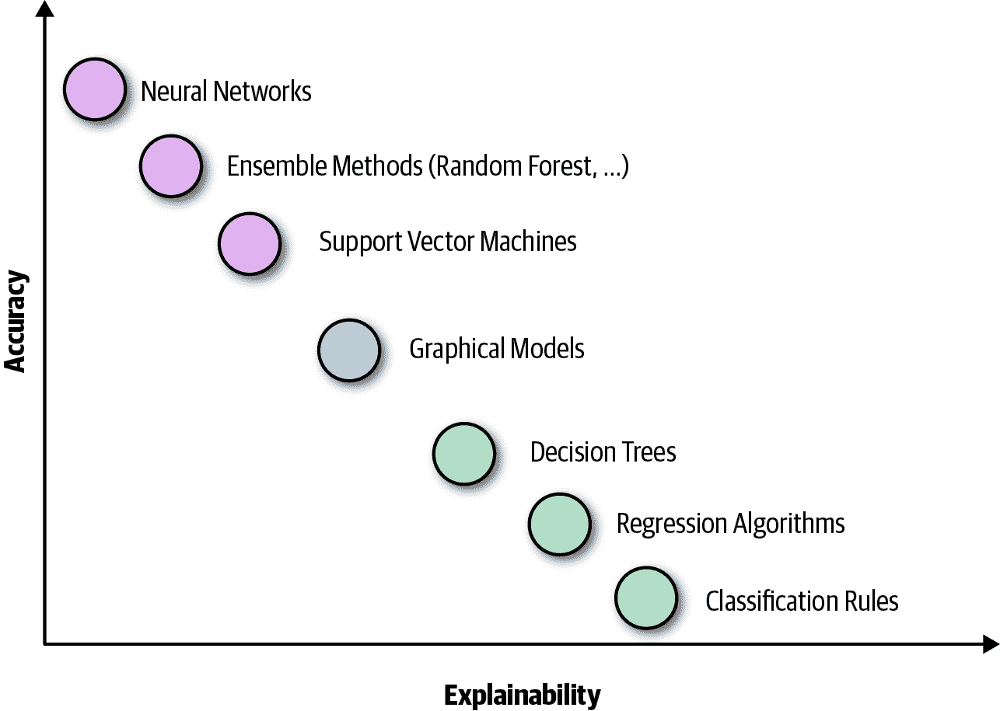
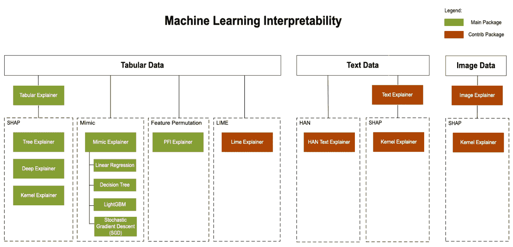
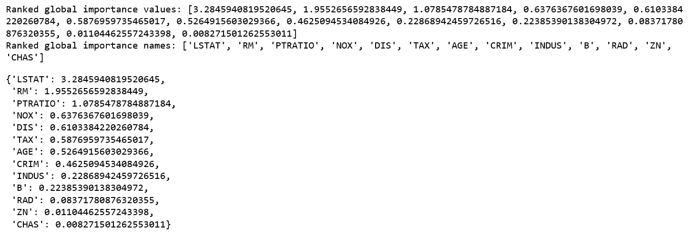
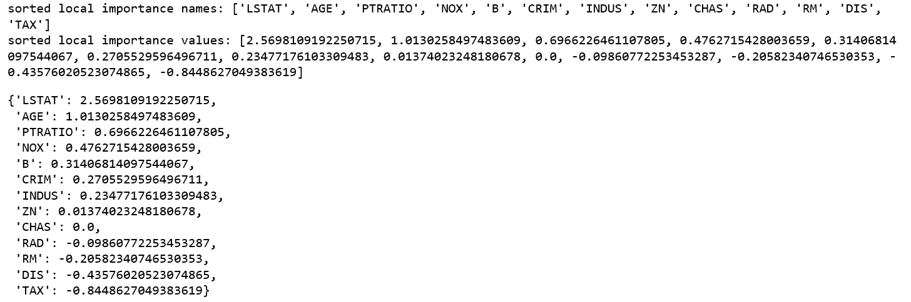
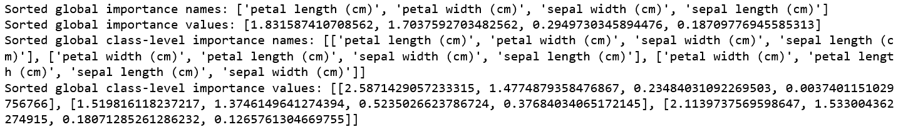
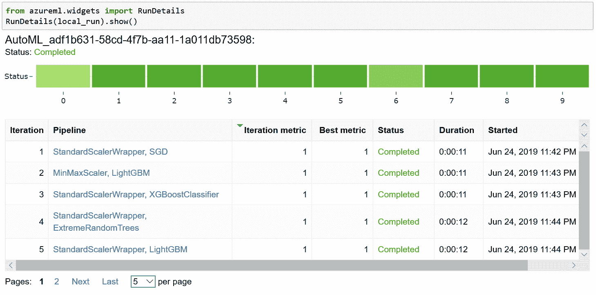
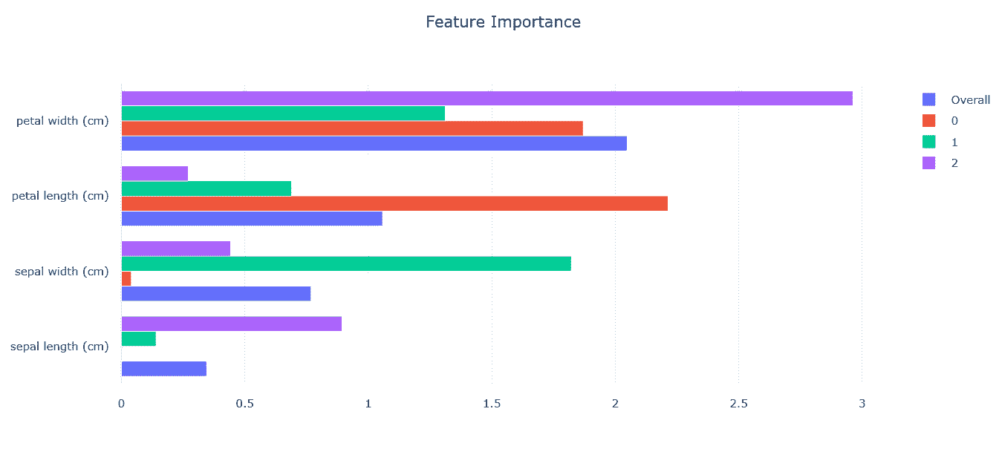

# 第七章：自动化机器学习中的模型可解释性和透明性

我们早些时候讨论了如何构建良好的机器学习模型是一个相当耗时的过程。什么是“好”的机器学习模型？我们看到，通常情况下这是由模型的性能来定义的，通过准确性或类似的指标来衡量。随着公司准备采用面向业务关键场景的机器学习，模型的可解释性和透明性变得至关重要。

在本章中，我们涵盖了关于机器学习可解释性和透明性的关键方面，这些方面有助于建立客户信任。当你尝试使用或定制他人开发的机器学习管道时，包括由自动化机器学习系统生成的管道时，解释性和透明性变得更加重要。让我们深入了解微软 Azure 机器学习上的自动化 ML 如何实现模型的可解释性和透明性。

# 模型解释性

大多数机器学习模型被认为是黑匣子，因为通常很难理解或解释它们的工作原理。没有这种理解，很难信任模型，因此很难说服高管利益相关者和客户相信机器学习和基于机器学习的系统的商业价值。

有些模型，如线性回归，被认为相对直观，因此易于理解，但随着我们添加更多特征或使用更复杂的机器学习模型如神经网络，理解它们变得越来越困难。通常，更复杂（不那么易于理解）的模型比简单且易于理解的模型表现得更好，即它们实现了更高的准确性。图 7-1 展示了这种关系。



###### 图 7-1。可解释性/解释性与模型性能

企业运营在透明度和信任的基础上，打开机器学习的黑匣子以解释模型有助于建立透明度和信任。在像医疗保健和银行业这样严格监管的行业中，可解释性和透明性至关重要。以下是一些现实场景，用以说明机器学习中可解释性和透明性的价值：

+   制造公司利用机器学习预测未来设备故障，以便能够主动进行维护活动。

    +   当你知道一个设备即将故障时，最可能的原因是什么，以便你可以快速进行预防性维护？

+   金融机构利用机器学习处理贷款或信用卡申请。

    +   你如何知道模型是否在做正确的事情？

    +   如果客户要求更多关于为什么他们的申请被拒绝的详细信息，你将如何回应？

+   在线零售商或独立软件供应商（ISV）使用机器学习预测客户流失——换句话说，客户是否会很快停止使用其产品/服务。

    +   什么是客户流失的主要因素？

    +   如何防止客户流失？

*特征重要性* 是一种用于模型解释的流行方法。特征重要性指示每个输入列（或特征）如何影响模型的预测。这使得数据科学家能够解释生成的模型和预测，从而让利益相关者看到哪些数据点在模型中最重要。

## 使用 Azure 机器学习进行模型解释性分析

Azure 机器学习 Python SDK 提供各种可解释性包，帮助您理解特征重要性。使用这些包，您可以全局解释所有数据上的机器学习模型，或者在特定数据点上进行局部解释。

### 解释器

在 Azure 机器学习 SDK 中有两组解释器，特别是`azureml.explain.model`包：直接解释器和元解释器。

*直接解释器* 来自集成库。解释机器学习模型输出的一种流行方法是 SHAP（SHapley Additive exPlanations 的简称）。以下是 SDK 中可用的直接解释器列表：

SHAP 树解释器

SHAP 的树解释器专注于树和树的集成。

SHAP 深度解释器

基于 SHAP 的解释，Deep Explainer 专注于深度学习模型。支持 TensorFlow 模型和使用 TensorFlow 后端的 Keras 模型（还有对 PyTorch 的初步支持）。

SHAP 核解释器

SHAP 的核解释器使用特殊加权的局部线性回归来估计任何模型的 SHAP 值。

模仿解释器

模仿解释器基于全局替代模型的理念。全局替代模型是一种内在可解释的模型，它被训练来尽可能精确地近似黑盒模型的预测。您可以解释一个替代模型来得出关于黑盒模型的结论。

PFI 解释器

排列特征重要性（PFI）解释器是一种用于解释分类和回归模型的技术。在高层次上，它的工作方式是逐个特征地对整个数据集随机重新排列数据，并计算感兴趣的性能度量减少的程度。变化越大，该特征越重要。

LIME 解释器

本地可解释的模型无关解释（LIME）解释器使用最先进的 LIME 算法创建本地替代模型。与全局替代模型不同，LIME 专注于训练本地替代模型来解释单个预测。目前仅在`azureml.contrib.explain.model`的 contrib/preview 包中提供。

HAN 文本解释器

HAN 文本解释器使用层次注意力网络，用于从文本数据中获取黑盒文本模型的模型解释。目前仅在`azureml.contrib.explain.model`的`contrib/preview`包中可用。

*元解释器*会自动选择适合的直接解释器，并基于给定的模型和数据集生成最佳解释信息。目前在 Azure 机器学习 SDK 中提供以下元解释器：

表格解释器

用于表格数据集

文本解释器

用于文本数据集

图像解释器

用于图像数据集

目前，`Text Explainer`和`Image Explainer`仅在`azureml.contrib.explain.model`的`contrib/preview`包中可用。

除了自动选择直接解释器外，元解释器在底层库的基础上开发了额外的功能，并提高了速度和可扩展性。目前，`TabularExplainer`使用以下逻辑来调用直接解释器：

1.  如果是基于树的模型，请应用`TreeExplainer`，否则

1.  如果是 DNN 模型，请应用`DeepExplainer`，否则

1.  将其视为黑盒模型并应用`KernelExplainer`。

集成到 SDK 中的更多库后，`TabularExplainer`内置的智能将变得更加复杂。

图 7-2 展示了直接解释器和元解释器之间的关系，以及适用于不同类型数据的解释器。SDK 封装了所有解释器，以便它们公开一个通用的 API 和输出格式。



###### 图 7-2\. 直接解释器和元解释器

您现在将看到如何使用这些解释器为以下两种场景生成特征重要性：使用 sklearn 训练的回归模型和使用自动化 ML 训练的分类模型。

### 使用 sklearn 训练的回归模型

我们将建立一个回归模型，使用[来自 sklearn 的波士顿房价数据集](https://oreil.ly/xUiJb)来预测房价。该数据集有 506 行，13 个输入列（特征），和 1 个目标列。以下是输入列：

+   CRIM: 每人均犯罪率

+   ZN: 25,000 平方英尺以上住宅用地的比例

+   INDUS: 每个城镇非零售营业英亩的比例

+   CHAS: 查尔斯河虚拟变量（如果地块靠近河流为 1；否则为 0）

+   NOX: 一氧化氮浓度（每千万分之一）

+   RM: 每个住宅的平均房间数

+   AGE: 1940 年前建成的自住单位的比例

+   DIS: 到波士顿五个就业中心的加权距离

+   RAD: 径向公路的可达性指数

+   TAX: 每$10,000 全额财产税率

+   PTRATIO: 按城镇计算的学生-教师比例

+   B: 1,000 * (Bk–0.63)²，其中 Bk 是城镇中非洲裔美国人的比例（此数据集来源于 1978 年）

+   LSTAT: 人口的低收入阶层百分比

这是一个目标列：

+   MEDV: 以千美元为单位的自住房屋的中位数价值

在加载数据集并将其分割为训练集和测试集后，我们使用 sklearn 的 `GradientBoostingRegressor` 训练了一个简单的回归模型。接下来，我们将使用 `azureml.explain.model` 包中的 `TabularExplainer` 生成训练模型的 *全局特征重要性*。生成全局解释后，我们使用方法 `get_ranked_global_values()` 和 `get_ranked_global_names()` 来获取排名的特征重要性值和相应的特征名称：

```
from sklearn.ensemble import GradientBoostingRegressor

reg = GradientBoostingRegressor(n_estimators=100, max_depth=4,
                                learning_rate=0.1, loss='huber',
                                random_state=1)

model = reg.fit(x_train, y_train)

from azureml.explain.model.tabular_explainer import TabularExplainer

tabular_explainer = TabularExplainer(model, x_train, features =
                                     boston_data.feature_names)

global_explanation = tabular_explainer.explain_global(x_train)

# Sorted SHAP values
print('Ranked global importance values:
       {}'.format(global_explanation.get_ranked_global_values()))

# Corresponding feature names
print('Ranked global importance names:
       {}'.format(global_explanation.get_ranked_global_names()))

# Display in an easy to understand format
dict(zip(global_explanation.get_ranked_global_names(),
         global_explanation.get_ranked_global_values()))
```

图 7-3 显示了排名靠前的全局特征重要性输出。这表明人口的 LSTAT（%低社会地位）特征对模型输出影响最大。



###### 图 7-3\. 全局特征重要性

接下来，我们将看看如何计算特定数据行的 *局部特征重要性*。这在预测时尤为重要。我们将一行从测试集传递给 `explain_local()` 方法并打印局部特征重要性：

```
local_explanation = tabular_explainer.explain_local(x_test[0,:])

# Sorted local feature importance information; reflects original feature order
print('sorted local importance names:
       {}'.format(local_explanation.get_ranked_local_names()))

print('sorted local importance values:
       {}'.format(local_explanation.get_ranked_local_values()))

# Display in an easy to understand format
dict(zip(local_explanation.get_ranked_local_names(),
         local_explanation.get_ranked_local_values()))
```

如在 图 7-4 中所见，尽管在这个特定测试记录中，LSTAT 仍然是最重要的特征，但 AGE 是第二重要的特征。



###### 图 7-4\. 局部特征重要性

如在 第 4 章 中讨论的，原始数据通常在训练过程之前经过多次转换。通过这个过程产生的特征称为 *工程化特征*，而原始输入列称为 *原始特征*。默认情况下，解释器使用用于训练的特征来解释模型（即工程化特征），而不是原始特征。

然而，在大多数真实世界的情况下，您希望理解 *原始特征重要性*。原始特征重要性告诉您每个原始输入列如何影响模型预测，而 *工程化特征重要性* 不直接基于您的输入列，而是基于输入列转换生成的列。因此，原始特征重要性比工程化特征重要性更易于理解和操作。

使用 SDK，您可以将特征转换管道传递给解释器以接收原始特征重要性。如果您跳过此步骤，解释器将提供工程化的特征重要性。通常，将在单列上的任何转换都将受到支持：

```
from sklearn.pipeline import Pipeline
from sklearn.impute import SimpleImputer
from sklearn.preprocessing import StandardScaler, OneHotEncoder
from sklearn.linear_model import LogisticRegression
from sklearn_pandas import DataFrameMapper

# Assume that we have created two arrays, numerical and categorical,
that hold the numerical and categorical feature names.

numeric_transformations = [([f], Pipeline(steps=[('imputer',
      SimpleImputer(strategy='median')), ('scaler',
      StandardScaler())])) for f in numerical]

categorical_transformations = [([f], OneHotEncoder(handle_unknown='ignore',
     sparse=False)) for f in categorical]

transformations = numeric_transformations + categorical_transformations

# Append model to preprocessing pipeline.
# Now we have a full prediction pipeline.
clf = Pipeline(steps=[('preprocessor', DataFrameMapper(transformations)),
                    ('classifier', LogisticRegression(solver='lbfgs'))])

# clf.steps[-1][1] returns the trained classification model
# Pass transformation as an input to create the explanation object
# "features" and "classes" fields are optional
tabular_explainer = TabularExplainer(clf.steps[-1][1],
     initialization_examples=x_train, features=dataset_feature_names,
     classes=dataset_classes, transformations=transformations)
```

到目前为止，您已经看到如何在模型训练时生成特征重要性。同样重要的是，在推断时间理解特定数据行的特征重要性。让我们考虑这种情况：假设您拥有一个机器学习驱动的应用程序来处理信用卡申请。如果您的应用程序拒绝了一张信用卡申请，您需要解释为什么模型拒绝了该特定申请人。

为了启用*推理时特征重要性*，解释器可以与原始模型一起部署，并在评分时提供本地解释信息。接下来，我们将探讨如何在 Azure 机器学习中使用自动化机器学习工具启用特征重要性。

### 使用自动化机器学习训练的分类模型

我们将使用 [sklearn 鸢尾花数据集](https://oreil.ly/1aaIj)。这是一个著名的花卉分类场景。有三类花和四个输入特征：花瓣长度、花瓣宽度、萼片长度和萼片宽度。数据集有 150 行（每类花 50 行）。

加载数据集并将其分割为训练集和测试集后，我们使用自动化机器学习训练分类模型。为了使每个由自动化机器学习训练的模型都能获得特征重要性，我们在`AutoMLConfig`中设置了`model_explainability=True`：

```

automl_config = AutoMLConfig(task = 'classification',
                             debug_log = 'automl_errors.log',
                             primary_metric = 'AUC_weighted',
                             iteration_timeout_minutes = 200,
                             iterations = 10,
                             verbosity = logging.INFO,
                             X = X_train,
                             y = y_train,
                             X_valid = X_test,
                             y_valid = y_test,
                             `model_explainability=True`,
                             path=project_folder)

local_run = experiment.submit(automl_config, show_output=True)

best_run, fitted_model = local_run.get_output()
```

因为这是一个分类问题，您不仅可以获取整体模型级别的特征重要性，还可以获取每个类别的特征重要性。

让我们回顾如何使用`azureml.train.automl.automlexplainer`包从自动化机器学习生成的模型中提取特征重要性值。这里以最佳运行示例为例，但您可以从自动化机器学习训练中检索任何运行：

```
from azureml.train.automl.automlexplainer import retrieve_model_explanation

shap_values, expected_values, overall_summary, overall_imp,
              per_class_summary, per_class_imp = \
              retrieve_model_explanation(best_run)

# Global model level feature importance
print('Sorted global importance names: {}'.format(overall_imp))
print('Sorted global importance values: {}'.format(overall_summary))

# Global class level feature importance
print('Sorted global class-level importance names: {}'.format(per_class_imp))
print('Sorted global class-level importance values:
       {}'.format(per_class_summary))
```

图 7-5 显示了输出：模型的全局特征重要性和类别级别的特征重要性。



###### 图 7-5\. 自动化机器学习模型的特征重要性

除了使用 SDK 获取特征重要性值外，您还可以通过笔记本或 Azure 门户中的小部件用户体验获取它。让我们从小部件用户体验中看看如何做到这一点。在自动化机器学习训练完成后，您可以使用来自`azureml.widgets`包的`RunDetails`来可视化自动化机器学习训练，包括所有尝试的机器学习流水线，这些可以在 图 7-6 中查看。



###### 图 7-6\. 自动化机器学习小部件用户体验

您可以单击任何机器学习流水线以进行更多探索。除了一堆图表外，您还将看到一个特征重要性图表。使用图例查看整体模型级别以及类级别的特征重要性。在 图 7-7 中，您可以看到“花瓣宽度（cm）”是从整体模型视角最重要的特征，但对于类别 1，“萼片宽度（cm）”是最重要的特征。



###### 图 7-7\. 自动化机器学习小部件用户体验中的特征重要性

# 模型透明化

在前一节中，您学习了特征重要性是理解机器学习模型强大的一种方式。理解从输入数据到机器学习模型的训练过程也同样重要。在本节中，我们将讨论自动化机器学习如何使端到端的训练过程变得透明。

## 理解自动化机器学习模型流水线

如前几章所讨论的，自动化 ML 推荐基于用户输入以产生高质量 ML 模型的模型管道。每个模型管道包括以下步骤：

1.  数据预处理和特征工程

1.  基于选择的算法和超参数值进行模型训练

使用自动化机器学习，您可以在将其用于应用程序或场景之前分析每个推荐管道的步骤。这种透明度不仅让您更加信任模型，还能进一步定制它。有关如何获得端到端过程可见性的详细信息，请参阅第四章，该章节涵盖了自动化 ML 推荐的机器学习管道中的所有步骤。

## 保护栏

在前几章中，您看到自动化机器学习通过自动化大部分迭代和耗时步骤，使得开始机器学习变得更加容易。此外，还有许多最佳实践需要应用以实现可靠的结果。*保护栏*帮助用户理解数据和训练模型的潜在问题，因此他们知道可以期望什么并能够纠正问题以获得改进的结果。

以下是一些要注意的常见问题：

缺失值

正如我们在早些章节中讨论的那样，现实世界的数据并不干净，可能缺少很多值。在将其用于机器学习之前，需要“修复”具有缺失值的数据。可以使用各种技术来修复缺失值，从删除整行数据到使用其他数据的智能填充方法来填充缺失值；这称为*插补*。

类别不平衡

类别不平衡是机器学习中的一个主要问题，因为大多数机器学习算法假设数据是均匀分布的。在不平衡数据的情况下，多数类别会主导少数类别，导致机器学习模型更倾向于多数类别，从而导致少数类别的分类效果较差。一些实际例子涉及异常检测、欺诈检测和疾病检测。

采样是克服类别不平衡的常用策略。有两种采样方式：

欠采样

通过删除大多数类别的一些实例来平衡数据集。

过采样

添加类似的少数类别实例以达到平衡。

数据泄露

数据泄露是构建机器学习模型时的另一个关键问题。这种情况发生在训练数据集包含预测时不可用的信息时。由于实际结果已知（由于泄露），模型在训练数据上的性能几乎完美，但在预测时性能会非常差。您可以使用一些技巧来克服数据泄露：

删除泄露特征

使用简单的基于规则的模型来识别泄露特征并将其删除。

留出数据集

在使用模型之前，保留一个未见的测试集作为最终的模型健全性检查。

添加噪声

向输入数据添加噪声，以平滑可能泄漏特征的影响。

正如您所见，理解和防范这类常见问题对模型的性能以及对用户透明度至关重要。自动化 ML 提供了防护栏，显示并防范常见问题，并将随时间推移继续增加更复杂的防护栏。

# 结论

在本章中，我们讨论了建立对训练好的机器学习模型信任时变得非常重要的两个关键方面：可解释性和透明度。几乎每家使用机器学习模型的公司或团队都要求模型在一定程度上是可解释的和透明的，以获得信心。

通过使用 Azure 机器学习 Python SDK，以及自动化 ML Python SDK 和小部件 UX，您学会了如何利用解释性/可解释性功能。我们还触及了了解端到端模型训练管道以及避免陷阱的重要性，以及为什么建立防护栏来防范这些陷阱对于确保模型透明度至关重要。
