# 第八章：开发者的自动化 ML

在早些时候，您学习了如何在 Azure 机器学习中使用 Jupyter Notebook 的自动化 ML 工具。在本章中，您将学习如何在其他环境中使用自动化 ML：Azure Databricks、ML.NET 和 SQL Server。

# Azure Databricks 和 Apache Spark

*Azure Databricks* 是一个快速、易于使用且协作的基于 Apache Spark 的分析平台。它是 Azure 中的托管 Spark 服务，并与各种 Azure 服务集成。这意味着 Azure 不仅管理 Spark 集群节点，还管理运行在其上的 Spark 应用程序。它还具有其他有用的功能，如下：

+   Azure Databricks 旨在提高用户的生产力，设计为可扩展、安全且易于管理。它具有协作工作区，共享给有适当权限的用户。用户可以从工作区内共享多个笔记本、集群和库。

+   Azure Databricks 工作区是数据工程师、数据科学家和业务分析师可以使用所有必需库的单一位置。数据源也可以在同一个工作区中可用。

+   在 Azure Databricks 工作区中，身份验证和授权基于用户的 Azure Active Directory（Azure AD）登录。从治理的角度来看，可以轻松地向 Azure Databricks 工作区添加或删除用户，并可以授予不同的权限，如阅读者、贡献者或所有者。从安全的角度来看，Azure Databricks 集群默认部署在 Azure 虚拟网络中，可以更改为客户的虚拟网络。

[*Apache Spark*](https://spark.apache.org/) 目前是最流行的开源大数据分析引擎。您可以使用 Scala、Python、R 或 SQL 编写基于 Spark 的应用程序。它非常快速：使用 Spark，您可以比传统的大数据技术提升 10 到 100 倍的性能，因为它会在内存中进行一些计算，而不是从磁盘读取数据。如 图 8-1 所示，Spark 提供了像 `MLlib`（分布式机器学习库）和 Spark SQL（分布式 SQL）等强大的库，这些库建立在核心 Spark 应用程序之上。

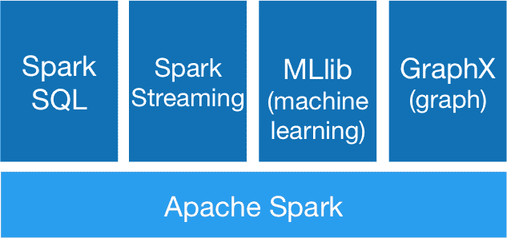

###### 图 8-1\. Apache Spark 栈 (来源：[*https://spark.apache.org/*](https://spark.apache.org/))

我们将从 Azure 门户 (图 8-2) 开始创建工作区。

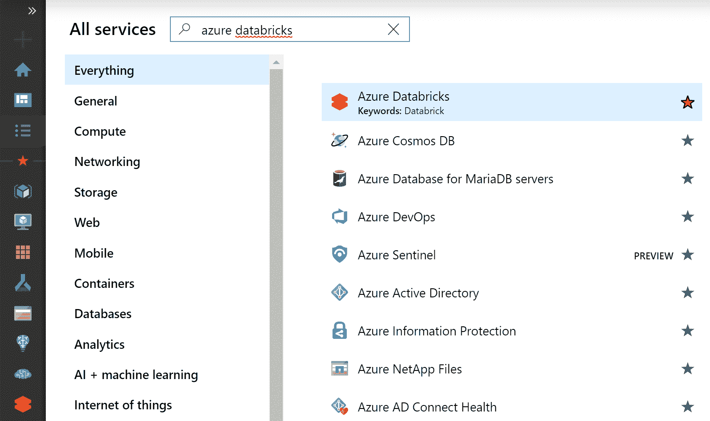

###### 图 8-2\. Azure 门户

您可以搜索 Azure Databricks 或使用 Analytics 菜单选项 (图 8-3)。

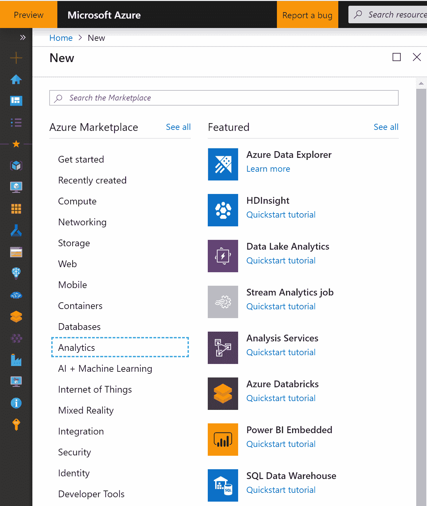

###### 图 8-3\. 在 Azure 门户中搜索 Azure Databricks

图 8-4 显示了创建工作区的选项。

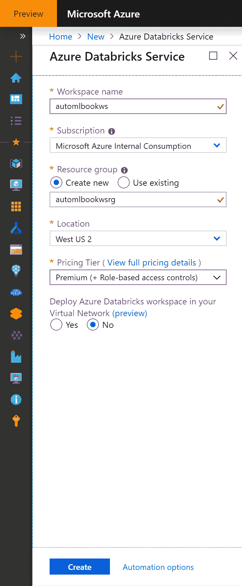

###### 图 8-4\. 在 Azure Databricks 面板中提供详细信息

工作区设置过程仅需约一分钟：

1.  给工作区命名并选择适当的 Azure 订阅。

1.  创建新资源组或现有资源组。

1.  选择一个能够承载该工作区的区域。它应该为您的订阅分配足够的配额。

1.  选择定价层。对于此练习，请选择高级。

1.  将自定义 VNET 设置为 No。

一旦完成，概述页面将打开，如图 8-5 所示。

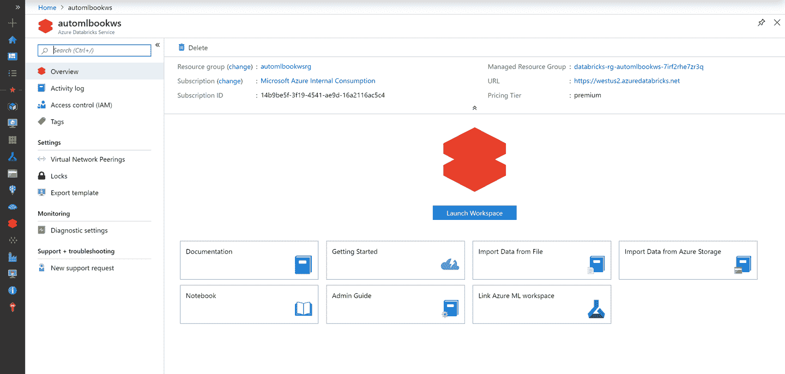

###### 图 8-5\. Azure Databricks 资源概述

从概述页面，点击“启动工作区”以打开 Azure Databricks 工作区页面，如图 8-6 所示。该工作区将包含我们的集群、笔记本和相关资源。对于希望通过笔记本运行高级分析的人来说，该工作区可以是一个中心化的地方。正如我们之前提到的，您可以使用 Azure AD 凭据登录。工作区的左侧是获取数据、创建集群等选项。

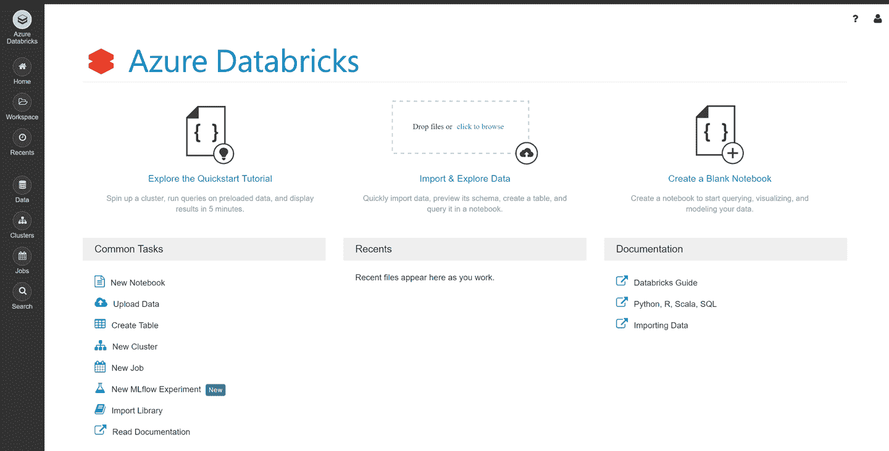

###### 图 8-6\. Azure Databricks 工作区

让我们开始创建一个集群，如图 8-7 所示。Databricks 集群有*驱动*和*工作*节点。创建集群时，您需要提供集群名称、Databricks 运行时、工作节点类型和驱动节点类型。您可以根据计划运行的实验类型选择这些值。例如，对于大型数据集，VM 类型应具有更多内存。

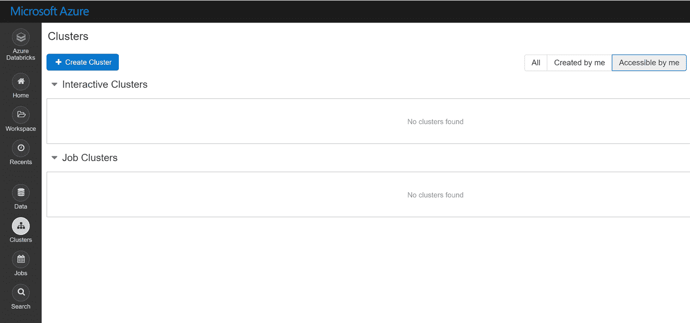

###### 图 8-7\. 集群创建页面

集群使用底层的 Azure 虚拟机（VM）。如图 8-8 所示，您可以根据工作节点和驱动节点的内存和 CPU 选择 VM 类型。

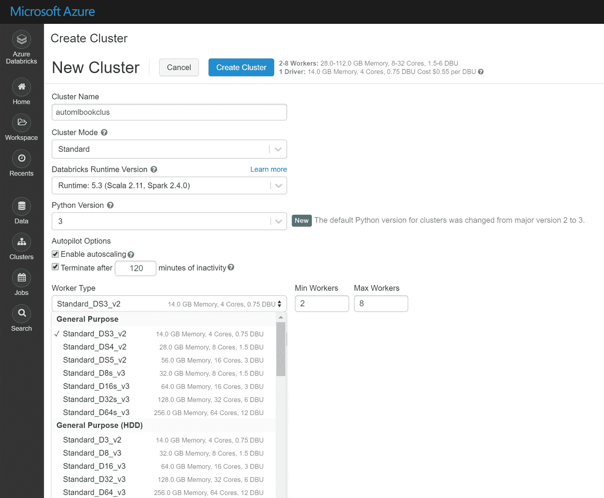

###### 图 8-8\. 选择工作节点 VM 类型

现在您需要考虑两个自动驾驶选项：自动缩放和自动终止（见图 8-9）。设置集群终止时间限制有助于避免在不使用集群时支付费用。启用自动缩放允许根据所需资源随需增减计算能力。

首次配置集群可能需要 10 到 15 分钟。这包括安装您希望为集群设置的库。对于自动化机器学习，请在 Databricks 运行时 5.4 及更高版本上安装 `azureml-sdk[automl]`。

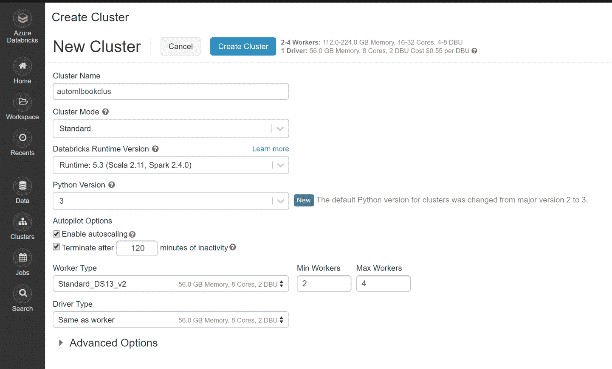

###### 图 8-9\. Azure Databricks 工作区中的集群配置

对于旧版本运行时，您可以安装 `azureml-sdk[autom_databricks]`，如图 8-10 所示。这是一个单一的包，包含在 Azure Databricks 上运行自动化 ML 所需的所有内容。您可以从库页面安装它。

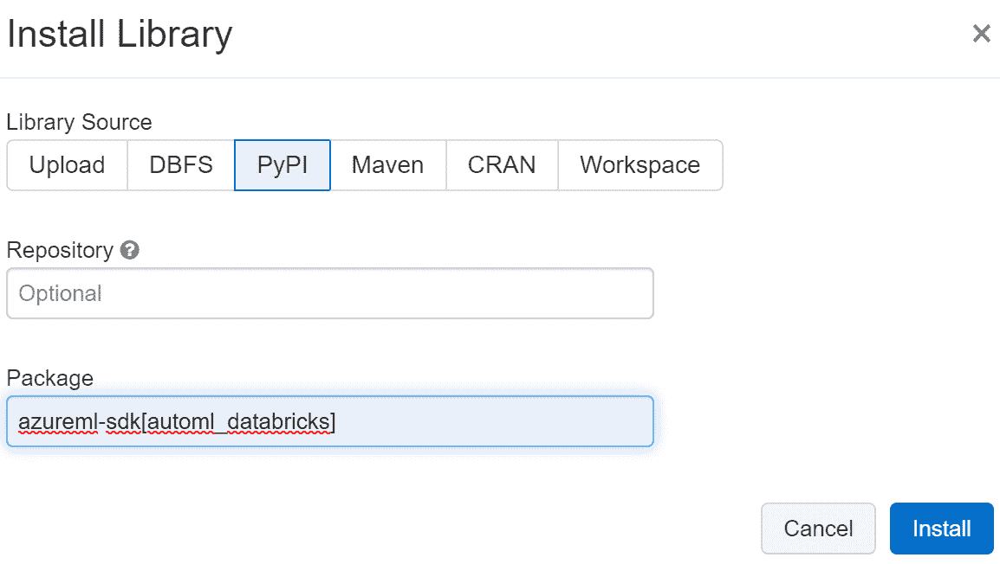

###### 图 8-10\. 指定自动化 ML PyPi 包

如果一切顺利，在群集运行并且库已安装后，您的页面应如 Figure 8-11 所示。

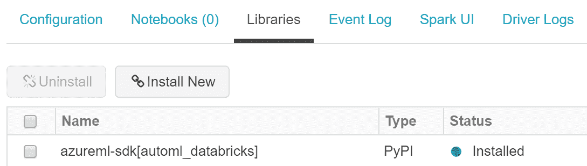

###### Figure 8-11\. 库状态

现在让我们看看数据选项。从左侧窗格中选择“数据”选项，如 Figure 8-12 所示。

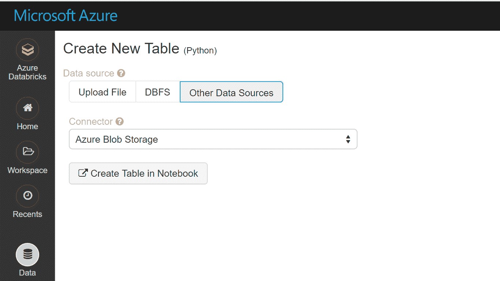

###### Figure 8-12\. 数据源选项

您可以以多种方式将数据带入 Azure Databricks 工作区。提供不同的模板以轻松开始连接到各种数据源。让我们探索连接到 Azure Blob 存储的最简单选项，如图 8-13 和 8-14 Figure 8-13 所示。我们提供连接到存储的凭据。结果是一个数据框。

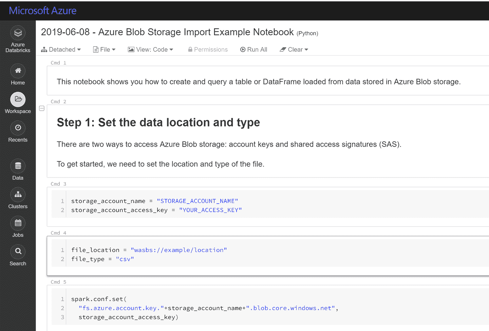

###### Figure 8-13\. 数据样本笔记本，第一部分

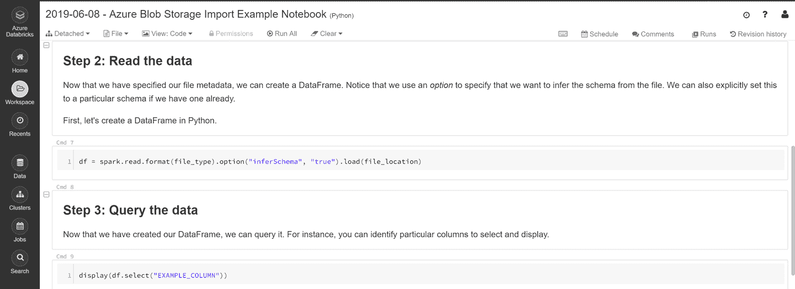

###### Figure 8-14\. 数据样本笔记本，第二部分

您可以使用此数据框进行进一步的数据准备。现在让我们将一个笔记本导入到 Azure Databricks 工作区，以便您可以编写机器学习代码。您可以通过导入文件或从 URL 导入笔记本，如 Figure 8-15 所示。

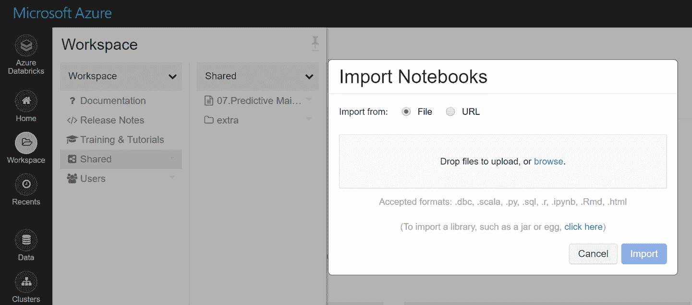

###### Figure 8-15\. 导入工作区中的笔记本

导入笔记本后，您可以将群集附加到它，如 Figure 8-16 所示。只需阅读笔记本，无需将群集附加到它，但执行代码时需要群集。

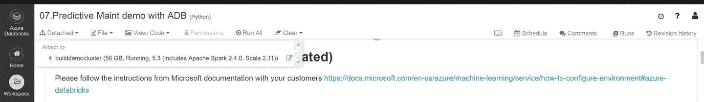

###### Figure 8-16\. 将群集附加到笔记本

将此笔记本附加到您的群集后，它可以执行代码。要使用自动化机器学习，您的数据框必须转换为数据流对象，如 Figure 8-17 所示。这是转换它的示例代码。

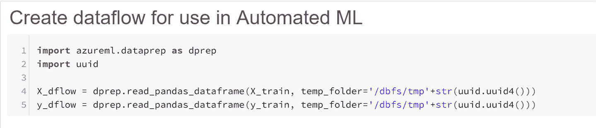

###### Figure 8-17\. 将 Pandas 数据框转换为数据流

一旦您有了数据流对象，运行自动化机器学习的步骤与在 Jupyter 上运行笔记本的步骤相同，除了一些配置参数；Figure 8-18 展示了一个示例。您可以在 [此 Microsoft 文档页面](http://bit.ly/2k9J7qS) 上找到更多详细信息。

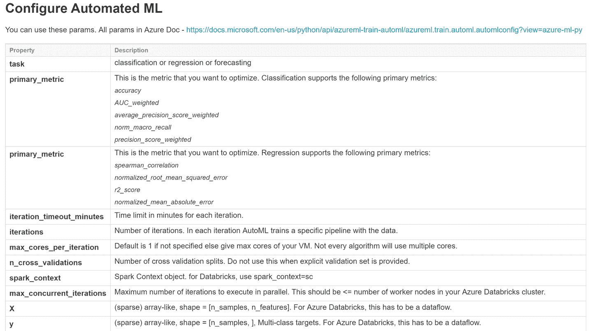

###### Figure 8-18\. 自动化机器学习的示例配置设置

提交实验进行训练后，您将获得一个结果，可以在 Azure 门户中查看，如 Figure 8-19 所示。这里我们展示了每次运行的摘要和主要指标。您可以在单个 Azure 机器学习服务工作区中跟踪结果，无论您使用哪种环境来运行它。

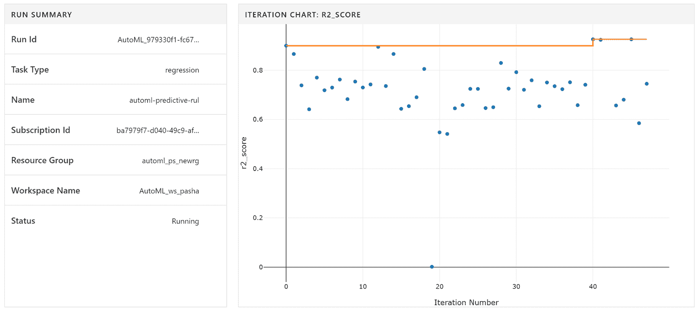

###### Figure 8-19\. 自动化机器学习的输出

在培训完成后，查看运行中使用的超参数。Figure 8-20 显示了打印参数的代码。您可以在任何环境中运行此代码；它不特定于 Azure Databricks。

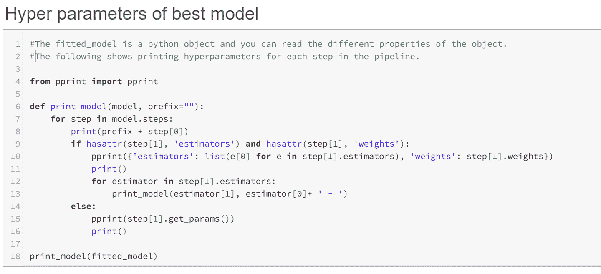

###### Figure 8-20\. 获取超参数的示例代码

输出将类似于 Figure 8-21（这是针对您示例笔记本中训练模型的参数）。这显示了培训模型中使用的一些参数。

本书的完整实验笔记本可以在该书的[GitHub 仓库](https://github.com/PracticalAutomatedMachineLearning/Azure)找到。

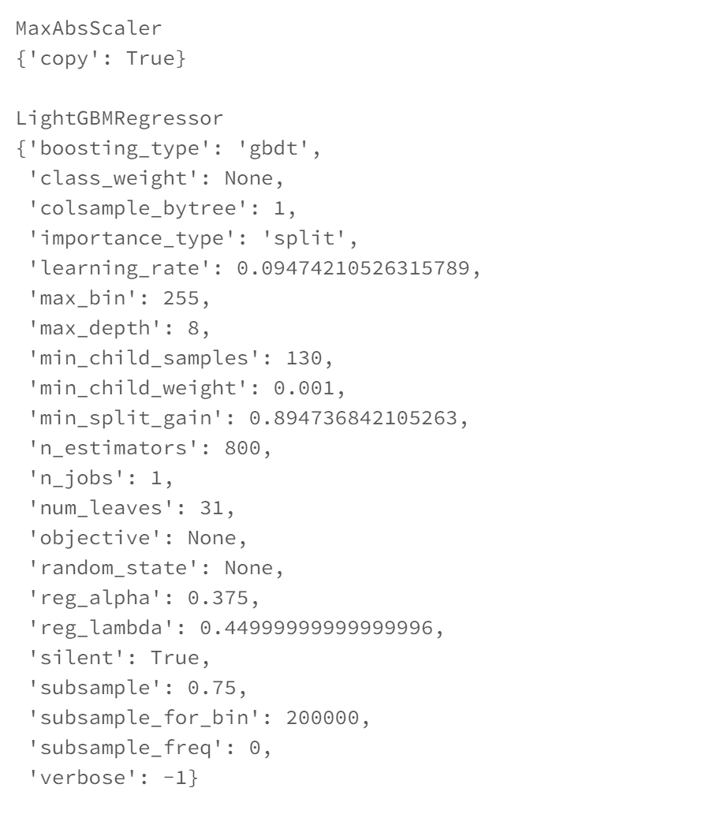

###### Figure 8-21\. 示例超参数

现在您已经将 Azure Databricks 集群用作自动化 ML 培训的计算资源，让我们看看如何在 Azure Databricks 笔记本中使用远程计算。这是另一种您可以用于自动化 ML 培训的选择。您可能希望使用 Azure Databricks 集群进行使用 Spark 进行数据准备，然后不使用同一集群的工作节点，而是选择远程计算选项。这种方法在您的 Azure Databricks 集群用于其他任务或没有足够的工作节点容量时可能更经济。这取决于实验。

您可以在[*http://bit.ly/2lJzVtq*](http://bit.ly/2lJzVtq)找到使用远程计算的示例笔记本。

# ML.NET

现在让我们学习另一种使用自动化 ML 的方法。如果您熟悉 Visual Studio 和 C#.NET，并有兴趣构建机器学习模型但可能不熟悉 Python，您可以在 ML.NET 上使用自动化 ML。要安装 ML.NET：

1.  首先在您的笔记本电脑上安装一个终端，或者使用 Visual Studio Code 中的终端（安装程序可在[Visual Studio 网站](https://code.visualstudio.com/)找到；下载适当的设置）。这适用于 Linux、Windows 或 Mac。

1.  接下来安装.NET Core SDK（*不是* Runtime）。要安装 SDK，请[下载安装程序](https://oreil.ly/mUIJu)。

1.  如果需要的话，重新启动终端使这些更改生效。

1.  完成此设置后，在您的终端中运行`dotnet tool install -g mlnet`命令。

1.  安装完成后，在您的终端中运行`mlnet`命令，以测试`mlnet`是否已成功安装。

1.  接下来，要开始使用 ML.NET，请将数据集下载到安装了`mlnet`的笔记本电脑上。在这种情况下，您将使用我们在先前实验中使用的 NASA 数据集。您可以通过在终端上输入简单的命令开始训练：

    ```
    mlnet auto-train --task regression --dataset "df_new.csv"
          --label-column-name rul
    ```

此培训采用自动化 ML 的默认配置。培训完成后，您将在与 Figure 8-22 相同的终端中看到结果。

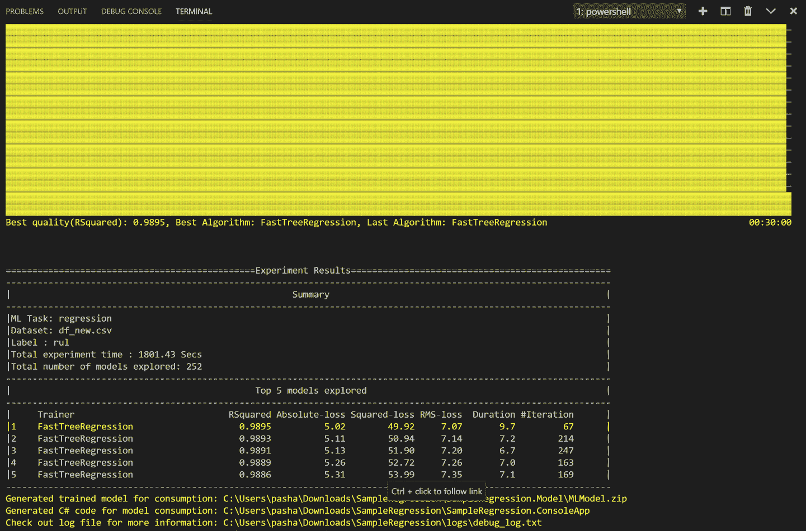

###### Figure 8-22\. 自动化 ML 结果

目前，ML.NET 的 CLI 支持以下自动化 ML：

+   二元分类

+   多类别分类

+   回归

您还可以通过在终端上使用以下命令来更改默认配置：

```
mlnet auto-train
```

它将提供各种可用于自定义的参数列表。例如，默认的训练时间为 30 分钟，但您可以根据需要进行更改。

实验在输出文件夹中生成以下资产：

+   用于进行预测的序列化模型 ZIP（“最佳模型”）

+   包含以下内容的 C# 解决方案：

    +   用于预测的 C# 代码，可以集成到您的应用程序中

    +   用于生成模型的训练代码的 C# 代码作为参考

    +   包含跨多个算法评估的所有迭代的信息的日志文件

您还可以在 Visual Studio 中直接调用 API，而不使用 CLI。它将使用与 CLI 相同的核心自动化 ML 技术。接下来，让我们看看如何使用 SQL Server 来训练自动化 ML 模型。

# SQL Server

自动化机器学习也适用于 SQL 用户，完全体现了真正的民主化风格。对此，我们不需要了解 Python。要开始使用，我们将利用在 SQL Server 2017 中运行 Python 代码的能力。我们可以使用*sp_execute_external_script*存储过程来调用 AutoML。

您可以使用 SQL Server Management Studio 或 Azure Data Studio 运行自动化 ML 实验。要尝试一下，请按照[Microsoft SQL Server 博客上的这篇文章](https://oreil.ly/H7Wyh)中列出的步骤操作。

# 结论

在本章中，您学习了如何在 Azure Databricks、ML.NET 和 SQL Server 中使用自动化 ML。在第九章中，您将学习如何使用 Azure UI 和 Power BI 进行自动化 ML。
