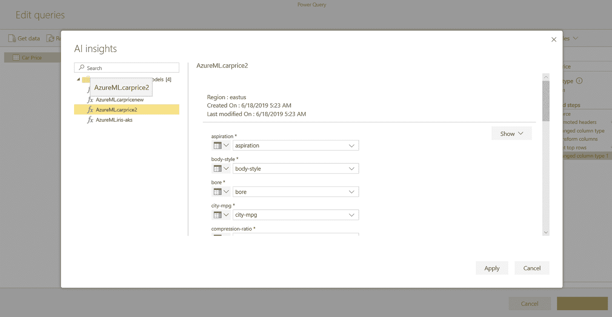

# 第九章：每个人的自动化 ML

到目前为止，您已经看到数据科学家如何利用 Microsoft Azure Machine Learning 中的自动化 ML 功能，使用 Azure Machine Learning Python SDK 构建机器学习模型。并非每个人都具备数据科学专业知识或熟悉 Python。最近的 Gartner 研究数据（参见图 9-1）显示，缺乏技能是采用人工智能（AI）和机器学习的主要挑战或障碍。

###### 图 9-1\. 人工智能和机器学习采用的主要挑战

如果我们能够消除这一障碍呢？鉴于人工智能和机器学习的需求不断增加，各个部门和角色的人们也开始对此感兴趣并参与其中。以下是一些例子，展示了希望构建机器学习模型但缺乏 Python（或其他编程语言如 R）专业知识或熟悉的角色：

+   领域专家或主题专家（SME）

+   公民数据科学家

+   数据分析师

+   数据工程师

+   开发人员

需要一种更简单的方式来使用自动化 ML——理想情况下，在熟悉的界面中进行无代码体验，而不是必须学习新的工具和技术。在本章中，我们关注的是如何使自动化 ML 可供不是机器学习专家的用户使用，以实现民主化。

# Azure 门户 UI

尽管企业开始充分意识到机器学习的潜力，但也意识到这需要难以找到的高级数据科学技能。许多业务领域专家对机器学习和预测分析有一般的了解；然而，他们更倾向于不深入涉足统计学或编码的深度，而传统的机器学习工具要求这些技能。这正是我们认为 Azure 门户 UI 或 Azure UI 将会有所帮助的地方。

要开始在 Azure UI 中使用自动化 ML，首先创建一个 Azure 机器学习工作区，然后创建一个自动化 ML 实验。我们在早期章节中已经介绍过这些步骤，所以让我们使用同一个工作区并创建一个新的实验，如图 9-2 所示。

###### 图 9-2\. 创建一个新的自动化 ML 实验

为您的实验提供一个名称。您必须提供一个训练计算名称。这是一个 Azure Machine Learning 管理的计算，将运行该实验。您还可以使用现有的实验和计算，如图 9-3 所示。

###### 图 9-3\. 提供实验名称和计算选择

接下来，选择包含我们训练数据的存储账户。如图 9-4 所示，您需要从 Blob 存储容器中选择一个逗号分隔值（CSV）文件，该文件包含完整的数据集，包括预测标签列。该数据集可在[此书](https://github.com/PracticalAutomatedMachineLearning/Azure)的 GitHub 仓库中找到。

###### Figure 9-4\. 数据集选择

选择 NASA 涡轮风扇引擎数据集中的传感器数据。一旦选择了数据集，您可以预览数据并选择您认为对实验有关联的列，如图 9-5 所示。

###### Figure 9-5\. 探索数据集

您还可以查看数据集的概要以了解其中每一列的关键特征，如图 9-6 所示。您可以在数据集中看到最小值、最大值和其他类型的概要信息。

###### Figure 9-6\. 数据集概述

在这个实验中，我们不会包含索引列，因为它对预测没有增加价值。如图 9-7 所示，选择回归作为实验类型。

###### Figure 9-7\. 排除用于训练的列

每个自动化 ML 实验都需要一个标签列。在这种情况下，选择“rul”作为标签列，如图 9-8 所示。这代表涡轮风扇引擎的*剩余有用寿命*。

###### Figure 9-8\. 选择任务和目标列

对于这个实验，您需要更改一些高级设置。使用“r2_score”作为度量标准，这是回归类型问题的常见度量标准。接下来，将“培训作业时间”更改为 30 分钟，并将“最大迭代次数”更改为 50。在实际应用中，您可能希望将培训作业时间设置为 120 分钟，并将最大迭代次数设置为至少 100，以获得良好的结果。

将剩余参数保持不变。图 9-9 显示了这些设置。

###### Figure 9-9\. 自动化 ML 设置

单击“开始”以开始训练。图 9-10 显示了一个包含新运行 ID 的弹出窗口。

###### Figure 9-10\. 自动化 ML 运行入门

最初，当运行开始时，它将开始为实验准备计算资源，如图 9-11 所示。这可能需要几分钟的时间。

###### Figure 9-11\. 准备运行

当训练正在运行时，您将看到根据指标排名的模型列表。您还可以看到已完成的迭代次数。用户界面会自动刷新，如图 9-12 所示。

###### Figure 9-12\. 训练进行中

几分钟后，您会看到实验已经完成，并且可以看到一个包含所有迭代的漂亮图表，如 Figure 9-13 所示。

###### Figure 9-13\. 完成训练的视图

您还将看到一个基于最高到最低 *r2_score* 指标排序的迭代列表表格，如 Figure 9-14 所示。

###### Figure 9-14\. 所有迭代的视图

您可以通过点击运行名称查看每次运行的详细信息。您可以查看帮助您更好理解模型的图表和指标。例如，在第 49 次迭代中，如 Figure 9-15 和 Figure 9-16 所示，您可以查看预测值与真实值以及与模型评估相关的指标。

###### Figure 9-15\. 选定迭代的摘要

###### Figure 9-16\. 选定迭代的指标

如 Figure 9-17 所示，您可以下载与实验相关的最佳训练模型，或者从任何这些迭代中部署它。您可以在 Azure 或任何合适的环境中执行此操作。下载后，该模型将以 *.pkl* 文件的形式存在。您也可以点击“部署最佳模型”按钮，而不是手动查看表格。

###### Figure 9-17\. 下载或部署最佳模型

当实验完成运行后，点击“部署最佳模型”按钮，即可看到部署模型的步骤，如 Figure 9-18 所示。

在 Azure 机器学习服务中，无论使用何种方法训练机器学习模型，模型部署的步骤都是相同的。Chapter 5 讲述了部署过程，所以我们在这里不详细介绍。

###### Figure 9-18\. 部署最佳模型

接下来，让我们看看如何使用 Power BI 训练自动 ML 模型。

# Power BI

许多数据分析师和 BI 专业人士使用 Power BI 进行指标、仪表板和分析，但他们希望利用机器学习创建智能体验和流程。

我们将使用相同的 NASA 数据集，并学习如何在 Power BI 中使用自动 ML 构建机器学习模型。

## 准备数据

首先，您需要在 Power BI 中创建新的数据流。使用文件 *Chap_9_PBI_Democratizing_machine_learning_with_AutomatedML.csv* 从 [*http://bit.ly/2meKHs8*](http://bit.ly/2meKHs8) 加载 NASA 数据集。

创建新数据流并创建新实体。Power BI 数据流支持导入多种格式和来源的数据，如 Figure 9-19 所示。对于这个实验，请选择文本/CSV 选项。

###### Figure 9-19\. 数据源选择

如 图 9-20 所示，选择数据集路径。

###### 图 9-20\. 选择 CSV 文件路径

在新创建的实体中审查数据，然后单击“保存并关闭”，如 图 9-21 所示。

###### 图 9-21\. 审查数据

## 自动化 ML 训练

现在，您已经准备好使用一个数据实体。您会注意到新创建实体选项中有一个大脑图标。您可以通过单击此选项来创建一个新的机器学习模型，如 图 9-22 所示。

###### 图 9-22\. 添加机器学习模型

接下来，您将进行自动化 ML 作者步骤。考虑到数据分析师和 BI 专业人士可能没有复杂的数据科学专业知识，此过程非常简单。第一步是选择数据实体（这里是自动选择的，因为我们从该数据实体开始）和要进行训练的标签列。如 图 9-23 所示。

###### 图 9-23\. 选择数据实体和标签列

系统将尝试分析标签列并推荐适当的模型类型。在这种情况下，它是一个回归模型，如 图 9-24 所示。

###### 图 9-24\. 模型类型推荐

如果需要，您还可以灵活选择不同的模型类型，如 图 9-25 所示。

###### 图 9-25\. 模型类型选择

在将其建模为回归问题的情况下，下一步是选择输入特征。系统会建议一些特征，但您可以选择自己喜欢的特征，如 图 9-26 所示。您可以手动取消选择像“单位”这样对预测无帮助的列。

###### 图 9-26\. 特征选择

在最后一步中，如 图 9-27 所示，您提供模型名称并提交进行训练。

###### 图 9-27\. 开始训练

这是调用自动化 ML 来训练多个模型，以期为此场景产生一个良好模型的时机。

## 理解最佳模型

当训练完成时，您将收到一个通知，其中包含指向报告的链接，该报告可以帮助您更清楚地了解最佳模型以及训练过程。

对于最佳模型，图 9-28 显示了模型性能的指标和详细信息。与之前看到的 Azure UI 不同，Power BI 直接提供最佳模型以简化决策过程。

###### 图 9-28\. 模型性能

图 9-29 演示了此报告还提供了关于最佳模型的特征化以及算法和超参数值的详细信息。

###### 图 9-29\. 特征化和算法/超参数

在此示例中，最佳模型是一个集成模型，因此我们可以看到关于该模型组成的更多详细信息，如图 9-30 所示。

###### 图 9-30\. 集成模型细节

此报告还提供了获取模型特征重要性或影响模型质量的关键特征的选项。图 9-31 说明了循环次数和 sm4 是影响模型质量的顶级特征。

###### 图 9-31\. 特征重要性

## 理解自动化 ML 训练流程

报告的下一部分详细介绍了训练过程，如图 9-32 所示。在这里，您可以看到不同迭代中的模型质量。

###### 图 9-32\. 自动化 ML 训练细节

模型性能报告还提供了更新模型训练使用新参数并重复该过程的选项。图 9-33 显示屏幕右上角的“编辑模型”选项。

###### 图 9-33\. “应用模型”和“编辑模型”选项

## 模型部署与推断

当您对模型满意时，请从模型性能报告中点击“应用模型”选项（如图 9-33 所示）。这将带您通过一个简单直观的流程选择一个测试数据集/实体，并在其上添加列，这些列将根据该训练模型进行填充。当新数据记录进入此数据流实体时，新添加的列将自动填充，推断我们刚刚构建和部署的模型。

# 促进协作

到目前为止，您已经看到自动化 ML 在多个产品和工具中变得可用，以帮助不同水平的用户训练机器学习模型。随着企业在机器学习和人工智能上的投资越来越多，一种趋势正在形成，即不同角色的人们希望合作实现端到端的机器学习工作流程。在本节中，我们讨论了展示这一趋势的两种情景。

## Azure 机器学习到 Power BI

尽管 Power BI 中的自动化 ML 使数据分析师能够轻松构建机器学习模型，但他们也希望利用其组织中专业数据科学家构建的模型。借助 Power BI 的 AI 洞察功能，可以非常轻松地消费使用 Azure 机器学习训练的任何机器学习模型，包括使用 Azure UI 构建的模型。

此章中，您了解到如何在 Azure 中使用自动化 ML UI 来训练模型，并将训练后的模型部署为 Web 服务。借助 Power BI AI 见解功能，分析师可以发现并在其 Power BI 工作负载中使用所有这些已部署的 Web 服务。让我们来看看这个流程。

第一步是编辑已创建的 Power BI 数据流实体，如图 9-34 所示。

###### 图 9-34\. 编辑数据流实体

接下来，点击“AI 见解”，如图 9-35 所示。

###### 图 9-35\. 选择“AI 见解”

这会查询所有可用的 Azure 机器学习部署模型。如图 9-36 所示，选择与正在使用的数据流实体相关的模型，然后点击应用。

###### 图 9-36\. AI 见解；选择相关模型

这将基于模型为实体添加一个新列，如图 9-37 所示。

###### 图 9-37\. 预测

您现在了解了分析师如何在 Power BI 中使用 Azure 机器学习训练的模型。在图 9-38 中从右到左的流程展示了这一协作场景。

###### 图 9-38\. 促进协作

## Power BI 自动化 ML 到 Azure 机器学习

本章早些时候，您看到分析师如何在 Power BI 中使用自动化 ML 构建机器学习模型。也许这些分析师希望与其组织中的专业数据科学家分享他们的模型及培训流程，以便审查、批准或改进。如果有一种方法可以生成覆盖 Power BI 中发生的自动化 ML 培训过程的 Python 代码，这种情况可能会出现。事实上，确实有这样的方法，图 9-38 中从左到右的流程展示了这一协作场景。

我们预计未来会有更多类似的场景出现，以便促进不同角色之间的协作，从而更轻松地构建和管理规模化的机器学习模型。

# 结论

恭喜您已经到达本书的最后一章！

在本章中，您看到任何人都可以使用自动化 ML，而不论他们是否具备数据科学和 Python 专业知识。预计这一趋势将继续下去，因为自动化 ML 将继续与用户已知和喜爱的各种产品和工具集成。这展示了机器学习和人工智能的真正简化和民主化。

你开始学习本书中介绍的机器学习社区和 Azure 上正在发生的创新。这些创新正在推动自动化机器学习的发展。你了解到 Azure 机器学习如何使数据科学家能够管理整个机器学习生命周期，训练各种类型的模型（例如分类、回归和预测），使用自动化机器学习。我们还研究了模型可解释性以及 Azure 机器学习如何为数据科学家提供特征重要性的洞见，等等。你学会了如何构建容器映像，测试部署的模型，并将其部署到各种计算环境——从 Azure 上的 REST API 到容器或边缘设备等等。

我们对自动化机器学习将让你能够实现的内容感到兴奋，迫不及待想听听你构建的 AI 解决方案！
