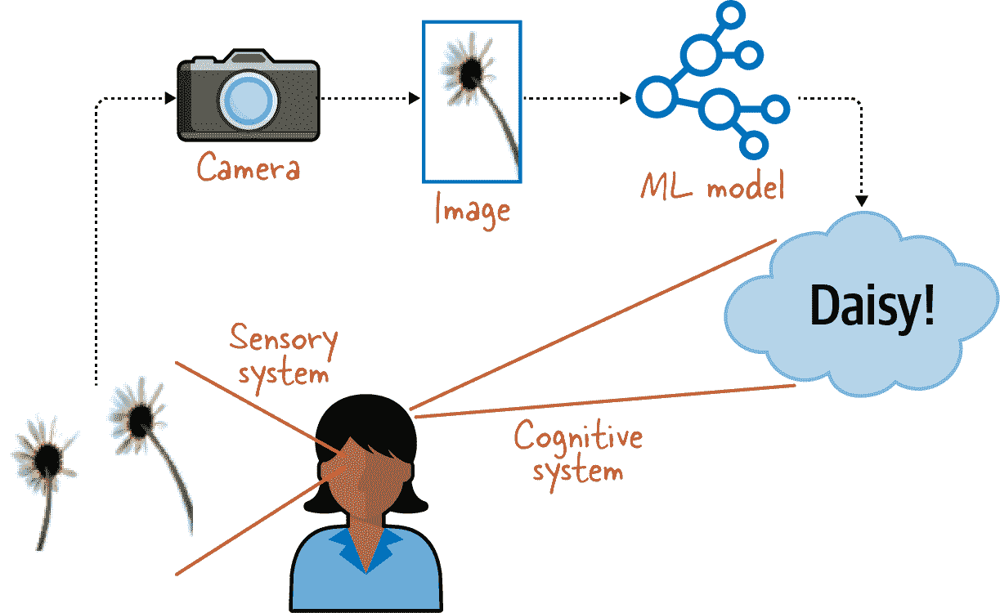

# 第一章：计算机视觉的机器学习

想象一下，你坐在花园里，观察周围的一切。你身体里有两个系统在工作：你的眼睛作为传感器创建场景的表示，而你的认知系统正在理解你的眼睛所看到的东西。因此，你可能看到一只鸟，一只虫子和一些动静，并意识到鸟已经走下小路，正在吃虫子（见 图 1-1）。

###### 图 1-1\. 人类视觉涉及我们的感知和认知系统。

计算机视觉试图通过提供图像形成的方法（模拟人类的*感知*系统）和机器感知（模拟人类的*认知*系统）来模仿人类视觉能力。模仿人类感知系统侧重于硬件以及设计和摆放诸如摄像机之类的传感器。而现代模仿人类认知系统的方法包括从图像中提取信息的机器学习（ML）方法。本书将涵盖这些方法。

例如，当我们看到一朵雏菊的照片时，我们的人类认知系统能够识别它为雏菊（见 图 1-2）。本书中构建的图像分类机器学习模型通过从雏菊的照片开始，模仿这种人类能力。

###### 图 1-2\. 一个图像分类的机器学习模型模仿了人类认知系统。

# 机器学习

如果你在 2010 年代初读关于计算机视觉的书，从照片中提取信息的方法不会涉及机器学习。相反，你会学习去噪、边缘检测、纹理检测和形态学（基于形状）操作。随着人工智能的进步（更具体地说，是机器学习的进步），这种情况已经改变。

人工智能（AI）探索计算机如何模仿人类的能力。*机器学习* 是 AI 的一个子领域，通过展示大量数据并指导计算机从中学习来教导计算机如何实现这一点。*专家系统* 是 AI 的另一个子领域，专家系统通过编程让计算机遵循人类逻辑来模仿人类的能力。在 2010 年代之前，像图像分类这样的计算机视觉任务通常是通过构建定制的图像滤波器来实现专家制定的逻辑。如今，图像分类通过卷积网络实现，这是一种深度学习的形式（见 图 1-3）。

###### 图 1-3\. 计算机视觉是人工智能的一个子领域，试图模仿人类视觉系统；尽管过去依赖专家系统方法，但今天已经转向机器学习。

以图 1-2 中雏菊的图像为例。机器学习方法通过向计算机展示大量图像及其*标签*（或正确答案）来教会计算机识别图像中的花卉类型。因此，我们会向计算机展示大量雏菊的图像，大量郁金香的图像等等。基于这样的*带标签的训练数据集*，计算机学习如何对它以前没有遇到过的图像进行分类。这个过程在第二章和第三章中有详细讨论。

另一方面，在专家系统的方法中，我们会首先采访人类植物学家，了解他们如何分类花朵。如果植物学家解释说*bellis perennis*（雏菊的学名）由白色的细长花瓣围绕着黄色中心和绿色圆形叶子组成，我们会尝试设计图像处理滤波器以匹配这些标准。例如，我们会寻找图像中白色、黄色和绿色的普遍性。然后，我们会设计边缘滤波器来识别叶子的边界，并匹配形态学滤波器来查看它们是否符合预期的圆形形状。我们可能会在 HSV（色调、饱和度、亮度）空间中平滑图像，以确定花朵中心的颜色与花瓣颜色的比较情况。基于这些标准，我们可能会为图像评分，评估其为雏菊的可能性。同样地，我们会为玫瑰、郁金香、向日葵等设计并应用不同的规则集。要对新图像进行分类，我们会选择得分最高的类别。

这个描述说明了创造图像分类模型所需的大量定制工作。这就是为什么图像分类曾经的适用性有限。

2012 年，随着[AlexNet 论文](https://dl.acm.org/doi/10.1145/3065386)的发表，一切都改变了。作者——Alex Krizhevsky、Ilya Sutskever 和 Geoffrey E. Hinton——通过将卷积网络（在第三章介绍）应用于 ImageNet 大规模视觉识别挑战(ILSVRC)中使用的基准数据集，大大超越了任何现有的图像分类方法。他们的前五错误率为 15.3%¹，而亚军的错误率超过 26%。像这样的比赛通常的改进幅度大约为 0.1%，所以 AlexNet 展示的进步是大多数人意料之外的一百倍！这是引人注目的表现。

自 20 世纪 70 年代起，神经网络已经存在，而卷积神经网络（CNN）自那时起已经存在了二十多年——Yann LeCun 在[1989 年](https://oreil.ly/EqY3a)提出了这个想法。那么，AlexNet 有何新意呢？有四点：

图形处理单元（GPU）

卷积神经网络是一个很好的想法，但计算上非常昂贵。AlexNet 的作者们在专用芯片称为 GPU 提供的图形渲染库上实现了一个卷积网络。当时，GPU 主要用于高端可视化和游戏。该论文将卷积分组以适应模型跨两个 GPU。GPU 使得卷积网络的训练变得可行（我们将在第七章讨论在多 GPU 上分布模型训练）。

矫正线性单元（ReLU）激活

AlexNet 的创作者在他们的神经网络中使用了一种非饱和激活函数称为 ReLU。我们稍后会在第二章详细讨论神经网络和激活函数；现在，知道使用分段线性非饱和激活函数使他们的模型收敛速度大大加快就足够了。

正则化

ReLU 存在的问题——以及它们直到 2012 年之前为什么没有被广泛使用的原因——是因为它们不会饱和，神经网络的权重会变得数值不稳定。AlexNet 的作者们使用了一种正则化技术来防止权重变得过大。我们在第二章也会讨论正则化技术。

深度

有了更快的训练能力，他们能够训练一个更复杂的模型，拥有更多的神经网络层。我们称具有更多层次的模型为*深层*；深度的重要性将在第三章中讨论。

值得注意的是，正是神经网络的增加深度（由前三个想法的组合允许）使得 AlexNet 具有世界领先的性能。证明了可以使用 GPU 加速 CNN 的技术在[2006 年](https://oreil.ly/9p3Ba)已经成为事实。ReLU 激活函数本身并不新鲜，正则化是一种众所周知的统计技术。最终，模型的异常性能归功于作者们的洞察力，他们能够结合所有这些因素训练比以往任何时候都更深的卷积神经网络。

深度对神经网络再次引起兴趣如此重要，以至于整个领域被称为*深度学习*。

# 深度学习的应用案例

深度学习是机器学习的一个分支，它使用具有多层的神经网络。深度学习在计算机视觉方面超过了先前存在的方法，并且现在已成功应用于许多其他形式的非结构化数据：视频、音频、自然语言文本等。

深度学习使我们能够从图像中提取信息，而无需创建定制的图像处理滤波器或编写人类逻辑代码。在使用深度学习进行图像分类时，我们需要成百上千甚至数百万张图片（越多越好），其中我们知道正确的标签（如“郁金香”或“雏菊”）。这些带标签的图像可用于训练图像分类深度学习模型。

只要能够用数据学习任务，就可以使用计算机视觉机器学习方法来解决问题。例如，考虑光学字符识别（OCR）的问题——从扫描图像中提取文本。最早的 OCR 方法涉及教导计算机进行模式匹配，匹配各个字母的外观。出于各种原因，这被证明是一种具有挑战性的方法。例如：

+   有很多字体，所以一个字母可以用多种方式写成。

+   字母有不同的大小，因此模式匹配必须是尺度不变的。

+   装订的书无法平放，因此扫描的字母会失真。

+   认识到单个字母是不够的；我们需要提取整段文字。构成单词、行或段落的规则是复杂的（见图 1-4）。

###### 图 1-4\. 基于规则的光学字符识别需要识别行，将其分成单词，然后识别每个单词的组成字母。

另一方面，利用深度学习，OCR 可以很容易地被制定为图像分类系统。已经有许多书籍被数字化，可以通过向模型展示来自书籍的扫描图像并使用数字化的文本作为标签来训练模型。

计算机视觉方法为各种实际问题提供了解决方案。除了 OCR，计算机视觉方法还成功应用于医学诊断（使用图像如 X 光和 MRI）、自动化零售运营（如读取 QR 码、识别空货架、检查蔬菜质量等）、监视（从卫星图像监测农作物产量、监控野生动物摄像头、入侵者检测等）、指纹识别和汽车安全（保持安全距离跟随车辆、识别道路标志速限变化、自动停车车辆、自动驾驶车辆等）。

计算机视觉已经在许多行业中找到了用途。在政府部门中，它已被用于监控卫星图像，建设智能城市，以及海关和安全检查。在医疗领域，它被用来识别眼部疾病，并从乳房 X 光中发现癌症的早期迹象。在农业中，它被用来检测故障的灌溉泵，评估作物产量，并识别叶片病害。在制造业中，它在工厂生产线上用于质量控制和视觉检查。在保险业中，它被用于事故后自动评估车辆损伤。

# 摘要

计算机视觉帮助计算机理解数字图像（如照片）的内容。从 2012 年的一篇开创性论文开始，深度学习方法在计算机视觉领域取得了巨大成功。如今，我们在许多行业中发现了计算机视觉的成功应用。

我们将在第二章开始我们的旅程，创建我们的第一个机器学习模型。

¹ *Top-5 accuracy* 意味着，如果模型在其前五个结果中返回了正确的图像标签，我们认为该模型是正确的。
