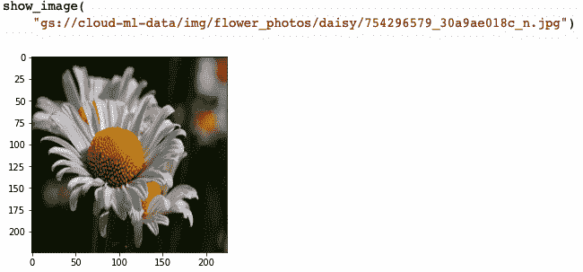

# 第二章：视觉的 ML 模型

在本章中，您将学习如何表示图像并训练基本的机器学习模型来分类图像。您将发现线性和全连接神经网络在图像上的表现很差。然而，在此过程中，您将学习如何使用 Keras API 来实现 ML 基元并训练 ML 模型。

###### 提示

本章的代码位于该书的 [GitHub 代码库](https://github.com/GoogleCloudPlatform/practical-ml-vision-book)的 *02_ml_models* 文件夹中。在适用的情况下，我们将提供代码示例和笔记本文件名。

# 用于机器感知的数据集

为了本书的目的，如果我们选择一个实际问题，并构建多种机器学习模型来解决它将会很有帮助。假设我们已经收集并标记了近四千张花卉的照片数据集。*5-flowers* 数据集中有五种类型的花（见 图 2-1），数据集中的每张图像都已经标记了它所描述的花的类型。


###### 图 2-1。5-Flowers 数据集中的照片包括五种花的照片：雏菊、蒲公英、玫瑰、向日葵和郁金香。

假设我们想要创建一个计算机程序，当提供一张图像时，能告诉我们图像中是什么类型的花。我们要求机器学习模型学会感知图像中的内容，因此您可能会看到这种类型的任务称为*机器感知*。具体而言，这种感知类型类似于人类视觉，所以这个问题被称为*计算机视觉*，在这种情况下，我们将通过图像分类来解决它。

## 5-Flowers 数据集

5-Flowers 数据集由 Google 创建，并在公共领域中以创作共用许可证发布。它作为[TensorFlow 数据集](https://oreil.ly/tqwFi)发布，并以 JPEG 文件的形式存储在公共 Google Cloud Storage 存储桶 (`gs://cloud-ml-data/`) 中。这使得数据集既逼真（它由即插即用相机收集的 JPEG 照片组成），又易于访问。因此，在本书中，我们将以此数据集作为持续的示例。

在 图 2-2 中，您可以看到几张郁金香的照片。请注意，这些照片从近距离拍摄的照片到郁金香花田的照片不等。所有这些照片对于人类来说都很容易标记为郁金香，但对我们来说，这是一个使用简单规则难以捕捉的问题——例如，如果我们说郁金香是一个细长的花朵，那么只有第一张和第四张照片符合条件。


###### 图 2-2。这五张郁金香的照片在变焦、郁金香的颜色以及画面内容方面有很大的差异。

## 读取图像数据

要训练图像模型，我们需要将图像数据读入我们的程序中。在标准格式（如 JPEG 或 PNG）中读取图像并准备好训练机器学习模型有四个步骤（完整代码在[*02a_machine_perception.ipynb*的 GitHub 存储库中可用](https://github.com/GoogleCloudPlatform/practical-ml-vision-book/blob/master/02_ml_models/02a_machine_perception.ipynb)）：

```
import tensorflow as tf
def read_and_decode(filename, reshape_dims):
    # 1\. Read the file.
    img = tf.io.read_file(filename)
    # 2\. Convert the compressed string to a 3D uint8 tensor.
    img = tf.image.decode_jpeg(img, channels=3)
    # 3\. Convert 3D uint8 to floats in the [0,1] range.
    img = tf.image.convert_image_dtype(img, tf.float32)
    # 4\. Resize the image to the desired size.
    return tf.image.resize(img, reshape_dims)
```

我们首先从持久存储中读取图像数据到内存中，作为一系列字节的序列：

```
    img = tf.io.read_file(filename)
```

此处的变量`img`是一个张量（见“什么是张量？”），其中包含一个字节数组。我们解析这些字节以将它们转换为像素数据——这也称为*解码*数据，因为像 JPEG 这样的图像格式需要你从查找表中解码像素值：

```
    img = tf.image.decode_jpeg(img, channels=3)
```

在这里，我们指定我们只想从 JPEG 图像中获取三个颜色通道（红色、绿色和蓝色），而不是不透明度，这是第四个通道。你可以根据文件本身拥有的通道来选择使用哪些通道。灰度图像可能只有一个通道。

像素将由类型为`uint8`的 RGB 值组成，范围在[0,255]之间。因此，在第三步中，我们将它们转换为浮点数并将值缩放到[0,1]的范围内。这是因为机器学习优化器通常表现良好与小数字一起工作：

```
    img = tf.image.convert_image_dtype(img, tf.float32)
```

最后，我们将图像调整为所需大小。机器学习模型是建立在已知输入大小的基础上工作的。因此，由于现实世界中的图像可能是任意大小的，你可能需要缩小、裁剪或扩展它们以适应所需的大小。例如，要将图像调整为 256 像素宽和 128 像素高，我们可以指定：

```
    tf.image.resize(img,[256, 128])
```

在第六章中，我们会看到这种方法不保留纵横比，并探讨其他调整图像大小的选项。

这些步骤并非一成不变。如果你的输入数据包括来自卫星的遥感图像，这些图像以波段交织格式提供，或者提供的是数字影像和医学通信（DICOM）格式的脑部扫描图像，显然不能使用`decode_jpeg()`来解码它们。同样地，你可能不总是调整数据大小。在某些情况下，你可能选择将数据裁剪到所需大小或用零填充。在其他情况下，你可能会保持纵横比进行调整大小，然后填充剩余的像素。这些预处理操作在第六章中有详细讨论。

## 可视化图像数据

始终要想象几幅图像，以确保你正确阅读数据——一个常见的错误是以一种使图像旋转或镜像的方式读取数据。想象这些图像也有助于感受机器感知问题的挑战性。

我们可以使用 Matplotlib 的`imshow()`函数来可视化图像，但是为了做到这一点，我们必须先将图像（一个 TensorFlow 张量）转换为`numpy`数组，使用`numpy()`函数。

```
def show_image(filename):
    img = read_and_decode(filename, [IMG_HEIGHT, IMG_WIDTH])
    plt.`imshow`(img`.``numpy``(``)`);
```

在我们的一张雏菊图像上试验，我们得到了图 2-3 中显示的结果。



###### 图 2-3\. 确保可视化数据以确保正确读取。

注意来自图 2-3，文件名包含花的类型（雏菊）。这意味着我们可以使用 TensorFlow 的`glob()`函数进行通配符匹配，例如，获取所有郁金香图像：

```
tulips = tf.io.gfile.`glob`(
    "gs://cloud-ml-data/img/flower_photos/`tulips`/*.jpg")
```

运行此代码并可视化五张郁金香照片面板的结果显示在图 2-2 中。

## 读取数据集文件

现在我们知道如何读取图像了。但是，为了训练机器模型，我们需要读取许多图像。我们还必须获取每个图像的标签。我们可以使用`glob()`进行通配符匹配来获取所有图像的列表：

```
tf.io.gfile.glob("gs://cloud-ml-data/img/flower_photos/*/*.jpg")
```

然后，知道我们数据集中的图像有一个命名约定，我们可以使用字符串操作获取文件名并提取标签。例如，我们可以使用以下操作去除前缀：

```
basename = tf.strings.regex_replace(
    filename,
    "gs://cloud-ml-data/img/flower_photos/", "")
```

并获取类别名称使用：

```
label = tf.strings.split(basename, '/')[0]
```

如往常一样，请参阅此书的 GitHub 代码库获取完整代码。

然而，出于泛化和可重复性的原因（在第 5 章中进一步解释），最好提前设置保留用于评估的图像。在 5-花卉数据集中已经完成了这一点，用于训练和评估的图像在与图像相同的 Cloud Storage 存储桶中的两个文件中列出：

```
gs://cloud-ml-data/img/flower_photos/train_set.csv
gs://cloud-ml-data/img/flower_photos/eval_set.csv
```

这些是逗号分隔值（CSV）文件，每行包含文件名及其标签。

读取 CSV 文件的一种方法是使用`TextLineDataset`读取文本行，并通过`map()`函数传递处理每一行的函数：

```
dataset = (tf.data.`TextLineDataset`(
    "gs://cloud-ml-data/img/flower_photos/train_set.csv").
    map(parse_csvline))
```

###### 注意

我们正在使用`tf.data`API，通过仅读取少量数据元素并在读取数据时执行转换，使其能够处理大量数据（即使不全部装入内存）。它通过使用名为`tf.data.Dataset`的抽象来表示一系列元素。在我们的流水线中，每个元素是一个包含两个张量的训练示例。第一个张量是图像，第二个是标签。许多类型的`Dataset`对应于许多不同的文件格式。我们正在使用`TextLineDataset`，它读取文本文件，并假设每行是一个不同的元素。

`parse_csvline()`是我们提供的函数，用于解析行，提取图像的文件名，读取图像并返回图像及其标签：

```
def parse_csvline(csv_row):
    record_defaults = ["path", "flower"]
    filename, label = tf.io.decode_csv(csv_row, record_defaults)
    img = read_and_decode(filename, [IMG_HEIGHT, IMG_WIDTH])
    return img, label
```

传递给 `parse_csvline()` 函数的 `record_defaults` 指定了 TensorFlow 需要替换以处理遗漏一个或多个值的行。

为了验证这段代码是否工作，我们可以打印出训练数据集中前三幅图像每个通道的平均像素值：

```
for img, label in dataset.`take``(``3``)`:
    avg = tf.math.reduce_mean(img, axis=[0, 1])
    print(label, avg)
```

在这段代码片段中，`take()` 方法截断数据集到三个项。注意因为 `decode_csv()` 返回一个元组 `(img, label)`，所以当我们迭代数据集时得到的就是这些值。打印整个图像是一个糟糕的主意，因此我们使用 `tf.reduce_mean()` 打印图像中像素值的平均值。

结果的第一行是（为了易读性添加换行符）：

```
tf.Tensor(b'daisy', shape=(), `dtype``=``string`)
tf.Tensor([0.3588961  0.36257887 0.26933077],
          `shape``=``(``3``,``)`, dtype=float32)
```

注意标签是一个字符串张量，平均值是一个长度为 3 的 1D 张量。为什么我们得到一个 1D 张量？因为我们向 `reduce_mean()` 传递了一个 `axis` 参数：

```
avg = tf.math.reduce_mean(img, `axis``=``[``0``,` `1``]`)
```

如果没有提供轴，那么 TensorFlow 会沿着所有维度计算平均值并返回一个标量值。请记住图像的形状是 `[IMG_HEIGHT, IMG_WIDTH, NUM_CHANNELS]`。因此，通过提供 `axis=[0, 1]`，我们要求 TensorFlow 计算所有列的平均值（`axis=0`）和所有行的平均值（`axis=1`），但不要计算 RGB 值的平均值（见图 2-4）。

###### 提示

类似这样打印图像的统计信息对另一个原因也是有帮助的。如果你的输入数据损坏并且图像中有不可表示的浮点数据（技术上称为[`NaN`](https://oreil.ly/E0xc2)），那么平均值本身将是`NaN`。这是一个方便的方式来确保在读取数据时没有出错。


###### 图 2-4. 我们在图像的行和列轴上计算 `reduce_mean()`。

# 使用 Keras 的线性模型

如图 2-4 所示，`reduce_mean()` 函数对图像中的每个像素值都进行了相同的加权。如果我们在图像的每个宽度 * 高度 * 3 像素通道点上应用不同的权重会怎样？

给定一幅新图像，我们可以计算其所有像素值的加权平均值。然后，我们可以使用这个值来在五种花之间进行选择。因此，我们将计算五个这样的加权平均值（实际上是学习宽度 * 高度 * 3 * 5 个权重值；见图 2-5），并根据输出最大的选择花的类型。


###### 图 2-5. 在线性模型中，有五个输出，每个输出值都是输入像素值的加权和。

在实践中，还会添加一个称为*偏差*的常数项，以便我们可以将每个输出值表示为：

<math><mrow><mrow><mtable><mtr><mtd><mrow><msub><mrow><mi>Y</mi></mrow><mrow><mi>j</mi></mrow></msub><mo>=</mo><msub><mrow><mi>b</mi></mrow><mrow><mi>j</mi></mrow></msub><mo>+</mo><munder><mrow><mi mathvariant="normal">Σ</mi></mrow><mrow><mi>r</mi><mi>o</mi><mi>w</mi><mi>s</mi></mrow></munder></mrow></mtd><mtd><munder><mrow><mi mathvariant="normal">Σ</mi></mrow><mrow><mi>c</mi><mi>o</mi><mi>l</mi><mi>u</mi><mi>m</mi><mi>n</mi><mi>s</mi></mrow></munder></mtd><mtd><munder><mrow><mi mathvariant="normal">Σ</mi></mrow><mrow><mi>c</mi><mi>h</mi><mi>a</mi><mi>n</mi><mi>n</mi><mi>e</mi><mi>l</mi><mi>s</mi></mrow></munder><mrow><mo>(</mo><msub><mrow><mi>w</mi></mrow><mrow><mi>i</mi></mrow></msub><mo>*</mo><msub><mrow><mi>x</mi></mrow><mrow><mi>i</mi></mrow></msub><mo>)</mo></mrow></mtd></mtr></mtable></mrow></mrow></math>

如果没有偏差，当所有像素都是黑色时，我们会强制输出为零。

## Keras 模型

而不是使用低级别的 TensorFlow 函数编写前述方程，使用更高级别的抽象会更方便。 TensorFlow 1.1 附带了一个这样的抽象，即 Estimator API，并且 Estimators 仍然支持向后兼容性。 但是，自 TensorFlow 2.0 以来，Keras API 一直是 TensorFlow 的一部分，这是我们建议您使用的。

在 Keras 中，线性模型可以表示如下：

```
model = `tf``.``keras`.Sequential([
    tf.keras.layers.Flatten(input_shape=(IMG_HEIGHT, IMG_WIDTH, 3)),
    tf.keras.layers.Dense(len(CLASS_NAMES))
])
```

*Sequential 模型*由*层*连接而成，一个层的输出是下一个层的输入。 层是一个 Keras 组件，接受张量作为输入，对该输入应用一些 TensorFlow 操作，并输出一个张量。

第一层，隐含的输入层，要求一个 3D 图像张量。 第二层（`Flatten`层）接受一个 3D 图像张量作为输入，并将其重新整形为具有相同数值的 1D 张量。 `Flatten`层连接到一个`Dense`层，每个花类别都有一个输出节点。 `Dense`的名称意味着每个输出都是每个输入的加权和，没有权重共享。 在本章后面，我们将遇到其他常见类型的层。

要使用此处定义的 Keras 模型，我们需要用训练数据集调用 `model.fit()`，并用要分类的每个图像调用 `model.predict()`。 要训练模型，我们需要告诉 Keras 如何基于训练数据集优化权重。 方法是*编译*模型，指定要使用的*优化器*，要*最小化*的*损失*，以及要报告的*指标*。 例如：

```
model.compile(
    optimizer='adam',
    loss=tf.keras.losses.SparseCategoricalCrossentropy(from_logits=True),
    metrics=['accuracy'])
```

Keras 的 `predict()` 函数将在图像上进行模型计算。 如果我们先看预测代码，那么 `compile()` 函数的参数将更加有意义，所以我们从那里开始。

### 预测函数

因为模型在其内部状态中具有经过训练的权重集，所以我们可以通过调用 `model.predict()` 并传入图像来计算图像的预测值：

```
pred = model.predict(tf.reshape(img,
        [1, IMG_HEIGHT, IMG_WIDTH, NUM_CHANNELS]))
```

`reshape()` 的原因是 `predict()` 需要一个批量的图片，所以我们将 `img` 张量重塑为一个包含一张图片的批量。

`model.predict()` 输出的 `pred` 张量是什么样子？回想一下，模型的最后一层是一个 `Dense` 层，有五个输出，因此 `pred` 的形状是 (5) — 即，它由五个数字组成，分别对应五种花的类型。第一个输出是模型对所讨论图片为雏菊的置信度，第二个输出是模型对图片为蒲公英的置信度，以此类推。预测的置信值称为*logits*，其范围为负无穷到正无穷。

模型的预测是它最有信心的标签：

```
pred_label_index = tf.math.`argmax`(pred)
pred_label = CLASS_NAMES[pred_label_index]
```

我们可以通过应用一个称为*softmax*函数的函数将 logits 转换为概率。因此，对应于预测标签的概率是：

```
prob = tf.math.`softmax`(pred)[pred_label_index]
```

### 激活函数

简单调用 `model.predict()` 是不够的，因为 `model.predict()` 返回一个未经限制的加权和。我们可以将这个加权和视为 logits，并应用 sigmoid 或 softmax 函数（取决于我们是否有二元分类问题或多类分类问题）来获得概率：

```
pred = model.`predict`(tf.reshape(img,
                     [1, IMG_HEIGHT, IMG_WIDTH, NUM_CHANNELS]))
prob = `tf``.``math``.``softmax`(pred)[pred_label_index]
```

如果我们在模型的最后一层添加一个*激活函数*，可以为最终用户提供更方便的操作：

```
model = `tf``.``keras`.Sequential([
    tf.keras.layers.Flatten(input_shape=(IMG_HEIGHT, IMG_WIDTH, 3)),
    tf.keras.layers.Dense(len(CLASS_NAMES), `activation``=``'``softmax``'`)
])
```

如果我们这样做，`model.predict()` 将返回五个概率值（而不是 logits），每个类别一个。客户端代码无需调用 `softmax()`。

Keras 中的任何层都可以对其输出应用激活函数。支持的激活函数包括 `linear`、`sigmoid` 和 `softmax`。我们将在本章后面探讨其他激活函数。

### 优化器

Keras 允许我们选择优化器来根据训练数据集调整权重。可用的优化器包括：

随机梯度下降（SGD）

最基本的优化器。

Adagrad（自适应梯度）和 Adam

通过添加允许更快收敛的特性来改进基本优化器。

Ftrl

一个倾向于在具有许多分类特征的极度稀疏数据集上表现良好的优化器。

Adam 是深度学习模型的经过验证的选择。我们建议在计算机视觉问题中使用 Adam 作为优化器，除非你有充分的理由不这样做。

SGD 及其所有变体，包括 Adam，依赖于接收数据的小批量（通常简称为*批次*）。对于每个数据批次，我们通过模型进行前向传播，计算误差和*梯度*，即每个权重对误差的贡献；然后优化器使用这些信息更新权重，准备好处理下一个数据批次。因此，当我们读取训练数据集时，我们也需要对其进行分批处理：

```
train_dataset = (tf.data.TextLineDataset(
    "gs://cloud-ml-data/img/flower_photos/train_set.csv").
    map(decode_csv))`.``batch``(``10``)`
```

### 训练损失

优化器试图选择能够最小化训练数据集上模型误差的权重。对于分类问题，选择交叉熵作为要最小化的错误具有强大的数学原因。为了计算交叉熵，我们使用以下公式比较模型对于第 *j* 类的输出概率 (*p[j]*) 与该类的真实标签 (*L[j]*)，并将其总和计算所有类别：

<math><mrow><mrow><munder><mrow><mi mathvariant="normal">Σ</mi></mrow><mrow><mi>j</mi></mrow></munder><mo>−</mo><msub><mrow><mi>L</mi></mrow><mrow><mi>j</mi></mrow></msub><mi>log</mi><mo>⁡</mo><mrow><mo>(</mo><msub><mrow><mi>p</mi></mrow><mrow><mi>j</mi></mrow></msub><mo>)</mo></mrow></mrow></mrow></math>

换句话说，我们取预测正确标签的概率的对数。如果模型完全正确，这个概率将为 1；log(1) 等于 0，因此损失为 0。如果模型完全错误，这个概率将为 0；log(0) 是负无穷，因此损失是正无穷，即最差的损失。使用交叉熵作为我们的错误度量允许我们根据正确标签的概率小幅调整权重。

为了计算损失，优化器将需要将 `parse_csvline()` 函数返回的标签与 `model.predict()` 的输出进行比较。您使用的具体损失将取决于您如何表示标签以及您的模型的最后一层返回什么。

如果您的标签是独热编码的（例如，如果标签编码为 [1 0 0 0 0] 用于雏菊图像），那么您应该使用*categorical cross-entropy*作为损失函数。这将在您的 `decode_csv()` 中显示如下：

```
def parse_csvline(csv_row):
    record_defaults = ["path", "flower"]
    filename, label_string = tf.io.decode_csv(csv_row, record_defaults)
    img = read_and_decode(filename, [IMG_HEIGHT, IMG_WIDTH])
    `label` `=` `tf``.``math``.``equal``(``CLASS_NAMES``,` `label_string``)`
    return img, label
```

因为 `CLASS_NAMES` 是一个字符串数组，与单个标签进行比较将返回一个独热编码数组，其中布尔值在相应位置为 1。您将如下指定损失：

```
tf.keras.losses.`CategoricalCrossentropy`(from_logits=False)
```

注意构造函数需要一个参数，指定模型的最后一层是返回对数几率还是已经进行了 softmax。

另一方面，如果您的标签将表示为整数索引（例如，4 表示郁金香），则您的 `decode_csv()` 将通过正确类的位置来表示标签：

```
label = tf.argmax(tf.math.equal(CLASS_NAMES, label_string))
```

并且损失将被指定为：

```
tf.keras.losses.`SparseCategoricalCrossentropy`(from_logits=False)
```

再次注意要适当地指定 `from_logits` 的值。

### 错误度量

虽然我们可以使用交叉熵损失来最小化训练数据集上的误差，但业务用户通常希望有一个更易理解的错误度量。用于此目的最常见的错误度量是*准确度*，它简单地是正确分类的实例的比例。

然而，当一个类别非常罕见时，精度度量会失败。假设您试图识别假身份证，您的模型具有以下性能特征：

|   | 被识别为假身份证 | 被识别为真实身份证 |
| --- | --- | --- |
| 实际假身份证 | 8 (TP) | 2 (FN) |
| 实际真实身份证 | 140（FP） | 850（TN） |

数据集包含 990 张真实身份证和 10 张假身份证——存在*类别不平衡*。其中，有 8 张假身份证被正确识别。这些是真正例（TP）。因此，该数据集的准确率为 (850 + 8) / 1,000，即 0.858。可以立即看出，由于假身份证非常罕见，模型在这一类别上的表现对其整体准确率几乎没有影响——即使模型仅正确识别了 10 张假身份证中的 2 张，准确率仍几乎不变：0.852。实际上，模型可以通过将所有卡片识别为有效卡片而达到 0.99 的准确率！在这种情况下，通常会报告另外两个指标：

精度

在已识别正例集合中的真正例的比例：TP / (TP + FP)。这里，模型识别了 8 个真正例和 140 个假正例，因此精度仅为 8/148。该模型非常不精确。

召回

在数据集中所有正例中已识别出的真正例的比例：TP / (TP + FN)。这里，全数据集中有 10 个正例，模型已识别了其中的 8 个，因此召回率为 0.8。

除了精度和召回率外，通常还会报告 F1 分数，即两个数字的调和平均数：

<math><mrow><mrow><mi>F</mi><mn>1</mn><mo>=</mo><mn>2</mn><mo>/</mo><mrow><mrow><mo>[</mo><mfrac><mstyle displaystyle="true" scriptlevel="0"><mrow><mn>1</mn></mrow></mstyle><mstyle displaystyle="true" scriptlevel="0"><mrow><mi>p</mi><mi>r</mi><mi>e</mi><mi>c</mi><mi>i</mi><mi>s</mi><mi>i</mi><mi>o</mi><mi>n</mi></mrow></mstyle></mfrac><mo>+</mo><mfrac><mstyle displaystyle="true" scriptlevel="0"><mrow><mn>1</mn></mrow></mstyle><mstyle displaystyle="true" scriptlevel="0"><mrow><mi>r</mi><mi>e</mi><mi>c</mi><mi>a</mi><mi>l</mi><mi>l</mi></mrow></mstyle></mfrac><mo>]</mo></mrow></mrow></mrow></mrow></math>

在二元分类问题中，例如我们正在考虑的问题（识别假身份证），准确率、精度和召回率都依赖于我们选择的概率阈值，以确定是否将实例分类为一类或另一类。通过调整概率阈值，我们可以在精度和召回率之间获得不同的权衡。结果曲线称为*精度-召回率曲线*（见图 2-9）。这条曲线的另一个变体，其中真正例率绘制为假正例率，称为*接收者操作特征曲线*（ROC 曲线）。ROC 曲线下的面积（通常缩写为*AUC*）也经常用作性能的综合衡量指标。


###### 图 2-9。通过调整阈值，可以获得不同的精度和召回率度量。

我们通常不希望在训练数据集上报告这些指标，而是希望在独立的评估数据集上报告。这是为了验证模型是否仅仅记住了训练数据集的答案。

## 训练模型

现在让我们把前面章节涵盖的所有概念综合起来，创建并训练一个 Keras 模型。

### 创建数据集

要训练一个线性模型，我们需要一个训练数据集。实际上，我们希望有两个数据集——一个训练数据集和一个评估数据集——以验证训练出的模型*泛化*能力，即是否能在未在训练中见过的数据上运行。

因此，我们首先获取训练和评估数据集：

```
train_dataset = (tf.data.TextLineDataset(
    "gs://cloud-ml-data/img/flower_photos/train_set.csv").
    map(decode_csv)).batch(10)

eval_dataset = (tf.data.TextLineDataset(
    "gs://cloud-ml-data/img/flower_photos/eval_set.csv").
    map(decode_csv)).batch(10)
```

其中`decode_csv()`读取并解码 JPEG 图像：

```
def decode_csv(csv_row):
    record_defaults = ["path", "flower"]
    filename, label_string = tf.io.decode_csv(csv_row, record_defaults)
    img = read_and_decode(filename, [IMG_HEIGHT, IMG_WIDTH])
    label = tf.argmax(tf.math.equal(CLASS_NAMES, label_string))
    return img, label
```

此代码返回的`label`是稀疏表示——即郁金香的编号 4，该类的索引——而不是独热编码。我们对训练数据集进行分批处理，因为优化器类期望批次处理。我们还对评估数据集进行批处理，以避免创建所有方法的两个版本（一个批次操作，另一个需要逐个图像处理）。

### 创建和查看模型

现在数据集已创建，我们需要创建要使用这些数据集进行训练的 Keras 模型：

```
model = tf.keras.Sequential([
    tf.keras.layers.Flatten(input_shape=(IMG_HEIGHT, IMG_WIDTH, 3)),
    tf.keras.layers.Dense(len(CLASS_NAMES), activation='softmax')
])
model.compile(optimizer='adam',
    loss=tf.keras.losses.SparseCategoricalCrossentropy(from_logits=False),
    metrics=['accuracy'])
```

我们可以使用以下方法查看模型：

```
tf.keras.utils.plot_model(model, show_shapes=True, show_layer_names=False)
```

这将产生图 2-10 中的图表。请注意，输入层接受一个批次（这是？）的[224, 224, 3]图像。问号表示此维度的大小在运行时未定义；这样，模型可以动态适应任何批次大小。`Flatten`层接受此输入并返回一批 224 * 224 * 3 = 150,528 个数字，然后连接到`Dense`层的五个输出。


###### 图 2-10\. 用于分类花卉的 Keras 线性模型。

我们可以验证`Flatten`操作不需要任何可训练的权重，但`Dense`层有 150,528 * 5 = 752,645 个需要通过`model.summary()`训练的权重，如下所示：

```
Model: "sequential_1"
_________________________________________________________________
Layer (type)                 Output Shape              Param #
=================================================================
flatten_1 (Flatten)          (None, 150528)            0
_________________________________________________________________
dense_1 (Dense)              (None, 5)                 752645
=================================================================
Total params: 752,645
Trainable params: 752,645
Non-trainable params: 0
```

### 拟合模型

接下来，我们使用`model.fit()`训练模型，并传入训练和验证数据集：

```
history = model.fit(train_dataset,
                    validation_data=eval_dataset, epochs=10)
```

注意，我们将训练数据集传入以进行训练，并将验证数据集传入以报告准确度指标。我们要求优化器通过训练数据 10 次（一个*epoch*是对整个数据集的完整遍历）。我们希望 10 个 epochs 足够使损失收敛，但我们应通过绘制损失和错误指标的历史记录来验证这一点。我们可以通过查看历史记录来进行：

```
history.history.keys()
```

我们获得以下列表：

```
['loss', 'accuracy', 'val_loss', 'val_accuracy']
```

然后，我们可以绘制损失和验证损失：

```
plt.plot(history.history['val_loss'], ls='dashed');
```

这产生了图 2-11 左侧面板上显示的图表。请注意，损失值不会平稳下降；相反，它非常波动。这表明我们的批次大小和优化器设置的选择可以改进——不幸的是，这部分 ML 过程是试错的。验证损失下降，然后开始增加。这表明开始发生*过拟合*：网络已经开始记忆训练数据集中不发生的细节（这些细节称为*噪声*）。10 个时期要么太长，要么我们需要添加正则化。过拟合和正则化是我们将在下一节详细讨论的主题。


###### 图 2-11\. 训练（实线）和验证（虚线）集上的损失和准确率曲线。

还可以使用以下方法绘制训练数据集和验证数据集上的准确率：

```
training_plot('accuracy', history)
```

结果图显示在图 2-11 的右侧面板上。请注意，在训练数据集上的准确率随着训练时间的增加而增加，而在验证数据集上的准确率则趋于平稳。

这些曲线也是波动的，为我们提供了与损失曲线相同的见解。然而，我们在评估数据集上获得的准确率（0.4）比随机选择（0.2）要好。这表明模型已经能够学习，并在任务上变得有些熟练。

### 绘制预测

我们可以通过绘制模型在训练数据集中的几个图像的预测来查看模型学到了什么：

```
batch_image = tf.reshape(img, [1, IMG_HEIGHT, IMG_WIDTH, IMG_CHANNELS])
batch_pred = model.predict(batch_image)
pred = batch_pred[0]
```

请注意，我们需要将我们有的单个图像变成一个批次，因为这是模型训练和预期的内容。幸运的是，我们不需要精确地传递 10 个图像（我们的批次大小在训练期间是 10），因为模型被设计为接受任何批次大小（回想一下图 2-10 中的第一个维度是一个？）。

从训练和评估数据集中显示的前几个预测如图 2-12 所示。


###### 图 2-12\. 训练（顶行）和评估（底行）数据集中的前几个图像——第一个图像实际上是一朵雏菊，但被错误地分类为蒲公英，概率为 0.74。

# 使用 Keras 的神经网络

在前一节中我们介绍的线性模型中，我们将 Keras 模型写成了：

```
model = tf.keras.Sequential([
    tf.keras.layers.Flatten(input_shape=(IMG_HEIGHT, IMG_WIDTH, 3)),
    tf.keras.layers.Dense(len(CLASS_NAMES), activation='softmax')
])
```

输出是输入像素值的加权平均值的 softmax：

<math><mrow><mrow><mi>Y</mi><mo>=</mo><mo>softmax</mo><mo>⁡</mo><mrow><mrow><mo>(</mo></mrow><mi>B</mi><mo>+</mo><munder><mrow><mi mathvariant="normal">Σ</mi></mrow><mrow><mi>p</mi><mi>i</mi><mi>x</mi><mi>e</mi><mi>l</mi><mi>s</mi></mrow></munder><msub><mrow><mi>W</mi></mrow><mrow><mi>i</mi></mrow></msub><msub><mrow><mi>X</mi></mrow><mrow><mi>i</mi></mrow></msub><mrow><mo>)</mo></mrow></mrow></mrow></mrow></math>

*B* 是偏置张量，*W* 是权重张量，*X* 是输入张量，*Y* 是输出张量。通常这被写成矩阵形式（使用 § 代表 softmax）：

<math><mrow><mrow><mi>Y</mi><mo>=</mo><mi>§</mi><mrow><mo>(</mo><mi>B</mi><mo>+</mo><mi>W</mi><mi>X</mi><mo>)</mo></mrow></mrow></mrow></math>

如图 2-10 所示，并且在以下模型摘要中，只有一个可训练层，即 `Dense` 层。`Flatten` 操作是一种重塑操作，并不包含任何可训练权重：

```
________________________________________________________________
Layer (type)                 Output Shape              Param #
=================================================================
flatten_1 (Flatten)          (None, 150528)            0
_________________________________________________________________
dense_1 (Dense)              (None, 5)                 752645
=================================================================
```

线性模型很好，但它们在建模能力上有所限制。我们如何获得更复杂的模型？

## 神经网络

获得更复杂模型的一种方式是在输入和输出层之间插入一个或多个 `Dense` 层。这导致了一种被称为 *神经网络* 的机器学习模型，我们稍后会解释原因。

### 隐藏层

假设我们插入一个额外的 `Dense` 层：

```
model = tf.keras.Sequential([
    tf.keras.layers.Flatten(input_shape=(IMG_HEIGHT, IMG_WIDTH, 3)),
    `tf``.``keras``.``layers``.``Dense``(``128``)``,`
    tf.keras.layers.Dense(len(CLASS_NAMES), activation='softmax')
])
```

现在模型有三层（见 Figure 2-14）。具有可训练权重的层，例如我们添加的那一层，既不是输入也不是输出层，称为 *隐藏* 层。


###### 图 2-14\. 具有一个隐藏层的神经网络。

数学上，输出现在是：

<math><mrow><mrow><mi>Y</mi><mo>=</mo><mi>§</mi><mrow><mo>(</mo><msub><mrow><mi>B</mi></mrow><mrow><mn>2</mn></mrow></msub><mo>+</mo><msub><mrow><mi>W</mi></mrow><mrow><mn>2</mn></mrow></msub><mrow><mo>(</mo><msub><mrow><mi>B</mi></mrow><mrow><mn>1</mn></mrow></msub><mo>+</mo><msub><mrow><mi>W</mi></mrow><mrow><mn>1</mn></mrow></msub><mi>X</mi><mo>)</mo></mrow><mo>)</mo></mrow></mrow></mrow></math>

简单地包装多个层如此是没有意义的，因为我们可以直接将第二层的权重 (*W*[2]) 乘到方程中——模型仍然是线性模型。然而，如果我们在隐藏层的输出上添加非线性 *激活* 函数 *A*(*x*) 来变换输出：

<math><mrow><mrow><mi>Y</mi><mo>=</mo><mi>§</mi><mrow><mo>(</mo><msub><mrow><mi>B</mi></mrow><mrow><mn>2</mn></mrow></msub><mo>+</mo><msub><mrow><mi>W</mi></mrow><mrow><mn>2</mn></mrow></msub><mi>A</mi><mrow><mo>(</mo><msub><mrow><mi>B</mi></mrow><mrow><mn>1</mn></mrow></msub><mo>+</mo><msub><mrow><mi>W</mi></mrow><mrow><mn>1</mn></mrow></msub><mi>X</mi><mo>)</mo></mrow><mo>)</mo></mrow></mrow></mrow></math>

那么输出就能表示比简单线性函数更复杂的关系。

在 Keras 中，我们如下引入激活函数：

```
model = tf.keras.Sequential([
    tf.keras.layers.Flatten(input_shape=(IMG_HEIGHT, IMG_WIDTH, 3)),
    tf.keras.layers.Dense(128, `activation``=``'``relu``'`),
    tf.keras.layers.Dense(len(CLASS_NAMES), activation='softmax')
])
```

整流线性单元（ReLU）是隐藏层中最常用的激活函数（见图 2-15）。其他常用的激活函数包括*sigmoid*、*tanh*和*elu*。


###### 图 2-15\. 一些非线性激活函数。

在图 2-15 中展示的所有三个激活函数都与人脑中神经元的工作方式 loosly 相关，如果来自树突的输入共同超过一些最小阈值，则模型具有具有非线性激活函数的隐藏层，称为“神经网络”。


###### 图 2-16\. 当输入总和超过一些最小阈值时，人脑中的神经元会发出。 图片来源：艾伦大脑科学研究所，艾伦人类大脑图谱，可从[human.brain-map.org](http://human.brain-map.org)获取。

Sigmoid 是一个连续函数，其行为最类似于脑神经元的工作方式——输出在两个极端处饱和。然而，Sigmoid 函数收敛速度较慢，因为每一步的权重更新与梯度成正比，并且在极端值附近的梯度非常小。ReLU 更常用，因为在函数的活跃部分权重更新保持相同大小。在具有 ReLU 激活函数的 `Dense` 层中，如果输入的加权和大于-*b*，其中 *b* 是偏差，激活函数就会“触发”。触发的强度与输入的加权和成正比。ReLU 的问题在于其域的一半为零。这导致了一个称为*死亡 ReLU*的问题，即从不进行权重更新。elu 激活函数（见图 2-15）通过在零的地方使用一个小的指数负值来解决这个问题。然而，由于指数函数的存在，elu 的计算成本较高。因此，一些机器学习从业者选择使用带有小负斜率的 Leaky ReLU。

### 训练神经网络

训练神经网络类似于训练线性模型。我们编译模型，传入优化器、损失函数和度量标准。然后调用`model.fit()`，传入数据集：

```
model.compile(optimizer='adam',
              loss=tf.keras.losses.SparseCategoricalCrossentropy(
                  from_logits=False),
              metrics=['accuracy'])
history = model.fit(train_dataset,
                    validation_data=eval_dataset,
                    epochs=10)
```

结果显示在图 2-17 中，我们获得的最佳验证准确率（0.45）与线性模型的结果相似。曲线也不够平滑。


###### 图 2-17\. 在训练神经网络时的训练和验证数据集上的损失和准确率。

我们通常期望向模型添加层次将提高模型拟合训练数据的能力，从而降低损失。实际上，这种情况确实如此——线性模型的交叉熵损失约为 10，而神经网络的交叉熵损失约为 2。然而，准确率相似，表明模型的改进很大程度上是通过使概率接近 1.0 来获得，而不是通过纠正线性模型错误分类的项目。

尽管如此，还有一些改进方法可以尝试。例如，我们可以调整学习率和损失函数，并更好地利用验证数据集。我们将在接下来进行探讨。

### 学习率

梯度下降优化器通过在每个点查看所有方向并选择错误函数下降最快的方向来工作。然后，它沿着该方向迈出一步，并再次尝试。例如，在图 2-18 中，从第一个点（标记为圆圈 1）开始，优化器查看两个方向（实际上是 2*^N*个方向，其中*N*是要优化的权重张量的维度），选择方向 2，因为损失函数在该方向上下降最快。然后，优化器通过制定的虚线曲线更新权重值。每个权重值的步长大小与称为“学习率”的模型超参数成比例。


###### 图 2-18. 梯度下降优化器的工作原理。

如您所见，如果学习速率过高，优化器可能会完全跳过最小值。在此步骤之后（在图中标记为圆圈 2），优化器再次朝两个方向查找，然后继续到第三点，因为损失曲线在那个方向下降得更快。在这一步之后，再次评估梯度。现在方向指向后方，优化器成功地在第二和第三点之间找到了局部最小值。然而，原本位于第一和第二步之间的全局最小值被错过了。

为了不跳过最小值，我们应该使用较小的学习率。但如果学习率太小，模型会陷入局部最小值。此外，学习率值越小，模型收敛速度就越慢。因此，在不错过最小值和使模型快速收敛之间存在权衡。

Adam 优化器的默认学习率为 0.001。我们可以通过更改传递给 `compile()` 函数的优化器来更改它：

```
model.compile(optimizer=tf.keras.optimizers.Adam(learning_rate=0.0001),
              loss=..., metrics=...)
```

使用较低的训练率重复训练后，我们在准确性方面获得了相同的最终结果，但曲线明显更为平稳（参见图 2-19）。


###### 图 2-19。当学习率降低到 0.0001 时的损失和准确率曲线。

### 正则化

值得注意的是，神经网络中可训练参数的数量是线性模型的 128 倍（1900 万对比 75 万）。然而，我们只有大约 3700 张图像。更复杂的模型可能表现更好，但我们可能需要更多的数据——数十万张图像。本书后面，我们将介绍数据增强技术，以充分利用我们所拥有的数据。

考虑到我们使用的模型相对复杂，数据集相对较小，模型可能开始使用单独的可训练权重来“记住”训练数据集中每个图像的分类答案——这就是我们可以在图 2-19 中观察到的过拟合现象（尽管训练准确率仍在降低，验证集上的损失开始增加）。当发生这种情况时，权重值开始高度调整到非常特定的像素值，并获得非常高的值。¹ 因此，我们可以通过改变损失函数应用在权重值本身上的惩罚来减少过拟合的发生。这种在损失函数上应用的惩罚称为*正则化*。

两种常见形式是：

<math><mrow><mrow><mi>l</mi><mi>o</mi><mi>s</mi><mi>s</mi><mo>=</mo><mi>c</mi><mi>r</mi><mi>o</mi><mi>s</mi><mi>s</mi><mi>-</mi><mi>e</mi><mi>n</mi><mi>t</mi><mi>r</mi><mi>o</mi><mi>p</mi><mi>y</mi><mo>+</mo><munder><mrow><mi mathvariant="normal">Σ</mi></mrow><mrow><mi>i</mi></mrow></munder><mrow><mo>|</mo><msub><mrow><mi>w</mi></mrow><mrow><mi>i</mi></mrow></msub><mo>|</mo></mrow></mrow></mrow></math>

和：

<math><mrow><mrow><mi>l</mi><mi>o</mi><mi>s</mi><mi>s</mi><mo>=</mo><mi>c</mi><mi>r</mi><mi>o</mi><mi>s</mi><mi>s</mi><mi>-</mi><mi>e</mi><mi>n</mi><mi>t</mi><mi>r</mi><mi>o</mi><mi>p</mi><mi>y</mi><mo>+</mo><munder><mrow><mi mathvariant="normal">Σ</mi></mrow><mrow><mi>i</mi></mrow></munder><mrow><msubsup><mrow><mi>w</mi></mrow><mrow><mi>i</mi></mrow><mrow><mn>2</mn></mrow></msubsup></mrow></mrow></mrow></math>

第一种惩罚类型称为*L1 正则化项*，第二种称为*L2 正则化项*。任何一种惩罚都会使优化器倾向于更小的权重值。L1 正则化驱使许多权重值为零，但对于个别大权重值更具有宽容性，而 L2 正则化则倾向于驱使所有权重值为小但非零值。为什么会出现这种情况的数学原因超出了本书的范围，但了解 L1 用于紧凑模型（因为我们可以修剪零权重），而 L2 用于尽可能限制过拟合很有用。

这是如何在`Dense`层应用正则化项的方法：

```
regularizer = tf.keras.regularizers.l1_l2(0, 0.001)
model = tf.keras.Sequential([
    tf.keras.layers.Flatten(input_shape=(
                          IMG_HEIGHT, IMG_WIDTH, IMG_CHANNELS)),
    tf.keras.layers.Dense(num_hidden,
                          kernel_regularizer=regularizer,
                          activation=tf.keras.activations.relu),
    tf.keras.layers.Dense(len(CLASS_NAMES),
                          kernel_regularizer=regularizer,
                          activation='softmax')
])
```

开启 L2 正则化后，从图 2-20 可以看出，损失值较高（因为包含了惩罚项）。然而，明显看出，在第 6 个 epoch 后仍然存在过拟合现象。这表明我们需要增加正则化的量。再次强调，这是一个试验和错误的过程。


###### 图 2-20. 当添加 L2 正则化时的损失和准确率曲线。

### 提前停止

仔细观察图 2-20 右侧面板。训练集和验证集的准确率都平稳增加直到第六个 epoch。之后，尽管训练集准确率继续增加，验证集准确率开始下降。这是模型停止泛化到未见数据，开始拟合训练数据中的噪声的典型迹象。

如果我们能在验证准确率停止增加时停止训练，那将是很好的。为了做到这一点，我们将一个回调函数传递给`model.fit()`函数：

```
history = model.fit(train_dataset,
    validation_data=eval_dataset,
    epochs=10,
    `callbacks``=``[``tf``.``keras``.``callbacks``.``EarlyStopping``(``patience``=``1``)``]`
)
```

由于收敛可能会有些波动，`patience`参数允许我们配置在停止训练之前希望验证准确率不下降的 epoch 数。

###### 注意

只有在调整了学习率和正则化以获得平滑且良好的训练曲线后，才添加`EarlyStopping()`回调函数。如果你的训练曲线波动较大，可能会错过通过提前停止获得更好性能的机会。

### 超参数调整

我们为模型选择了一些参数：隐藏节点数、学习率、L2 正则化等等。我们怎么知道这些是最优的呢？我们不知道。我们需要*调整*这些超参数。

一个使用 Keras Tuner 的方法是实现模型构建函数来使用超参数（完整代码在[*02_ml_models/02b_neural_network.ipynb* on GitHub)](https://github.com/GoogleCloudPlatform/practical-ml-vision-book/blob/master/02_ml_models/02b_neural_network.ipynb)。

```
import kerastuner as kt

# parameterize to the values in the previous cell
def build_model(hp):
    `lrate` `=` `hp``.``Float`('lrate', 1e-4, 1e-1, sampling='log')
    l1 = 0
    `l2` `=` `hp``.``Choice`('l2', values=[0.0, 1e-1, 1e-2, 1e-3, 1e-4])
    `num_hidden` `=` `hp``.``Int`('num_hidden', 32, 256, 32)

    regularizer = tf.keras.regularizers.l1_l2(l1, `l2`)

    # NN with one hidden layer
    model = tf.keras.Sequential([
        tf.keras.layers.Flatten(
            input_shape=(IMG_HEIGHT, IMG_WIDTH, IMG_CHANNELS)),
        tf.keras.layers.Dense(`num_hidden`,
                              kernel_regularizer=regularizer,
                              activation=tf.keras.activations.relu),
        tf.keras.layers.Dense(len(CLASS_NAMES),
                              kernel_regularizer=regularizer,
                              activation='softmax')
    ])
    model.compile(optimizer=tf.keras.optimizers.Adam(learning_rate=`lrate`),
                  loss=tf.keras.losses.SparseCategoricalCrossentropy(
                              from_logits=False),
                  metrics=['accuracy'])
  return model
```

如您所见，我们定义了超参数的取值空间。学习率（`lrate`）是一个浮点值，选择对数范围内的数值（而非线性范围）。L2 正则化值是从五个预定义值中选择的一个（0.0, 1e-1, 1e-2, 1e-3, 和 1e-4）。隐藏节点数（`num_hidden`）是一个整数，从 32 到 256，以 32 为增量选择。然后，这些值像平常一样在模型构建代码中使用。

我们将`build_model()`函数传递给 Keras Tuner 优化算法。支持多种算法，但贝叶斯优化是一个适用于计算机视觉问题的老牌算法，效果良好：

```
tuner = kt.BayesianOptimization(
    build_model,
    objective=kt.Objective('val_accuracy', 'max'),
    max_trials=10,
    num_initial_points=2,
    overwrite=False) # True to start afresh
```

在这里，我们明确指出我们的目标是最大化验证准确率，并且我们希望贝叶斯优化器从 2 个随机选择的种子点开始运行 10 次试验。调参器可以从上次停下的地方继续，我们要求 Keras 这样做，告诉它重复使用在现有试验中学到的信息，而不是从头开始。

创建了调参器后，我们可以运行搜索：

```
tuner.search(
    train_dataset, validation_data=eval_dataset,
    epochs=5,
    callbacks=[tf.keras.callbacks.EarlyStopping(patience=1)]
)
```

在运行结束时，我们可以使用以下方法获取前*N*个试验（以最高验证准确率结束的试验）：

```
topN = 2
for x in range(topN):
    print(tuner.get_best_hyperparameters(topN)[x].values)
    print(tuner.get_best_models(topN)[x].summary())
```

当我们为 5-花问题进行超参数调优时，我们确定最佳参数集如下：

```
{'lrate': 0.00017013245197465996, 'l2': 0.0, 'num_hidden': 64}
```

获得的最佳验证准确率为 0.46。

## 深度神经网络

线性模型给了我们 0.4 的准确率。具有一个隐藏层的神经网络给了我们 0.46 的准确率。如果我们增加更多隐藏层呢？

一个*深度神经网络*（DNN）是一个具有超过一个隐藏层的神经网络。每次增加一层，可训练参数的数量就会增加。因此，我们将需要一个更大的数据集。尽管如此，正如你将看到的，有几个技巧（即 dropout 和 batch normalization）可以用来限制过拟合的发生。

### 构建一个 DNN

我们可以将创建 DNN 的参数化如下：

```
def train_and_evaluate(batch_size = 32,
                       lrate = 0.0001,
                       l1 = 0,
                       l2 = 0.001,
                       num_hidden = [64, 16]):
    ...

    # NN with multiple hidden layers
    layers = [
              tf.keras.layers.Flatten(
                  input_shape=(IMG_HEIGHT, IMG_WIDTH, IMG_CHANNELS),
                  name='input_pixels')
    ]
    `layers` `=` `layers` `+` `[`
              `tf``.``keras``.``layers``.``Dense``(``nodes``,`
                      `kernel_regularizer``=``regularizer``,`
                      `activation``=``tf``.``keras``.``activations``.``relu``,`
                      `name``=``'``hidden_dense_{}``'``.``format``(``hno``)``)`
              `for` `hno``,` `nodes` `in` `enumerate``(``num_hidden``)`
    `]`
    layers = layers + [
              tf.keras.layers.Dense(len(CLASS_NAMES),
                      kernel_regularizer=regularizer,
                      activation='softmax',
                      name='flower_prob')
    ]

    model = tf.keras.Sequential(`layers`, name='flower_classification')
```

注意，我们为各层提供了可读的名称。这在打印模型摘要时会显示出来，同时也有助于通过名称获取层。例如，这是一个`num_hidden`为[64, 16]的模型：

```
Model: "sequential_4"
_________________________________________________________________
Layer (type)                 Output Shape              Param #
=================================================================
input_pixels (Flatten)       (None, 150528)            0
_________________________________________________________________
hidden_dense_0 (Dense)       (None, 64)                9633856
_________________________________________________________________
hidden_dense_1 (Dense)       (None, 16)                1040
_________________________________________________________________
flower_prob (Dense)          (None, 5)                 85
=================================================================
Total params: 9,634,981
Trainable params: 9,634,981
Non-trainable params: 0
```

一旦创建了模型，就像以前一样进行训练。不幸的是，如图 2-21 所示，得到的验证准确率比线性模型或神经网络获得的要差。


###### 图 2-21. 具有两个隐藏层的深度神经网络的损失和准确率曲线。

对于 5-花问题来说，数据集太小，我们无法利用 DNN 额外层提供的额外建模能力。回顾一下，当我们从神经网络开始时，情况类似。最初，我们并没有比线性模型做得更好，但通过添加正则化并降低学习率，我们能够获得更好的性能。

有没有一些技巧我们可以应用来提高 DNN 的性能？很高兴你问！有两个想法——*dropout 层* 和 *batch normalization*——值得一试。

### Dropout

Dropout 是深度学习中最古老的正则化技术之一。在每次训练迭代中，dropout 层以概率*p*（通常为 25%到 50%）随机丢弃网络中的神经元。实际上，被丢弃的神经元的输出被设置为零。其结果是，这些神经元在本次训练迭代中不会参与损失计算，并且它们不会得到权重更新（见图 2-22）。不同的神经元会在每次训练迭代中被丢弃。


###### 图 2-22。训练期间应用的辍学层——这里使用 0.4 的辍学率，在每一步训练中随机丢弃层中的 40%节点。

在测试网络性能时，需要考虑所有神经元（辍学率=0）。Keras 会自动执行此操作，因此您只需添加一个`tf.keras.layers.Dropout`层。它在训练和评估时会自动具有正确的行为：在训练期间，层会随机丢弃节点；但在评估和预测期间，不会丢弃任何节点。

###### 小贴士

神经网络中辍学的理论是，神经网络在其众多层之间有很大的自由度，因此一个层可能会演变出不良行为，而下一个层则会对其进行补偿。这不是神经元理想的使用方式。通过辍学，有很高的概率在给定的训练轮次中，修复问题的神经元将不存在。因此，问题层的不良行为变得显而易见，权重逐渐朝向更好的行为演变。辍学还有助于在整个网络中传播信息流，使所有权重都能够获得相对均等的训练量，这有助于保持模型的平衡。

### 批量归一化

我们的输入像素值范围为[0, 1]，这与典型激活函数和优化器的动态范围兼容。然而，一旦我们添加了隐藏层，生成的输出值将不再位于激活函数的动态范围内，用于后续层的（见图 2-23）输出值。当这种情况发生时，神经元的输出为零，因为向任何方向移动一小步都不会有差别，梯度为零。网络无法从死区中逃脱。


###### 图 2-23。隐藏层神经元的输出值可能不在激活函数的动态范围内。它们可能（A）偏向左侧过多（经 sigmoid 激活后，该神经元几乎总是输出零），（B）过窄（经 sigmoid 激活后，该神经元从不清楚地输出 0 或 1），或者（C）还不错（经 sigmoid 激活后，该神经元会在小批量中输出 0 到 1 之间的合理范围）。

要解决这个问题，批量归一化通过减去平均值并除以标准差来标准化训练数据批次中的神经元输出。然而，仅仅这样做可能会在某个方向上过于偏斜——通过引入每个神经元的两个额外可学习参数，称为*缩放*和*中心*，并使用这些值来对神经元的输入数据进行归一化：

<math><mrow><mrow><mi>n</mi><mi>o</mi><mi>r</mi><mi>m</mi><mi>a</mi><mi>l</mi><mi>i</mi><mi>z</mi><mi>e</mi><mi>d</mi><mo>=</mo><mfrac><mstyle displaystyle="true" scriptlevel="0"><mrow><mrow><mo>(</mo><mi>i</mi><mi>n</mi><mi>p</mi><mi>u</mi><mi>t</mi><mo>−</mo><mi>c</mi><mi>e</mi><mi>n</mi><mi>t</mi><mi>e</mi><mi>r</mi><mo>)</mo></mrow></mrow></mstyle><mstyle displaystyle="true" scriptlevel="0"><mrow><mi>s</mi><mi>c</mi><mi>a</mi><mi>l</mi><mi>e</mi></mrow></mstyle></mfrac></mrow></mrow></math>

这样，网络通过机器学习决定在每个神经元上应用多少中心化和重新缩放。在 Keras 中，你可以选择性地使用其中一个。例如：

```
tf.keras.layers.BatchNormalization(scale=False, center=True)
```

批归一化的问题在于，在预测时，你没有训练批次来计算神经元输出的统计数据，但你仍然需要这些值。因此，在训练期间，神经元输出的统计数据通过运行指数加权平均值在“足够数量”的批次上计算。这些统计数据随后在推断时使用。

好消息是，在 Keras 中，你可以使用`tf.keras.layers.BatchNormalization`层，所有这些计算都会自动完成。在使用批归一化时，请记住：

+   在应用激活函数之前，批归一化在层的输出上执行。因此，不要在`Dense`层的构造函数中设置`activation='relu'`，而是在那里省略激活函数，然后添加一个单独的`Activation`层。

+   如果在批归一化中使用`center=True`，则你的层不需要偏置。批归一化的偏移量起到了偏置的作用。

+   如果使用的激活函数是尺度不变的（即，如果你对其进行放大，形状不会改变），那么你可以设置`scale=False`。ReLU 是尺度不变的，而 Sigmoid 不是。

使用了 dropout 和批归一化后，隐藏层现在变成了：

```
for hno, nodes in enumerate(num_hidden):
    layers.extend([
        tf.keras.layers.`Dense`(nodes,
                              kernel_regularizer=regularizer,
                              name='hidden_dense_{}'.format(hno)),
        tf.keras.layers.`BatchNormalization`(scale=False, # ReLU
                              center=False, # have bias in Dense
                              name='batchnorm_dense_{}'.format(hno)),
        # move activation to come after batch norm
        tf.keras.layers.`Activation`('relu',
                                   name='relu_dense_{}'.format(hno)),
        tf.keras.layers.`Dropout`(rate=0.4,
                                name='dropout_dense_{}'.format(hno)),

    ])

    layers.append(
        tf.keras.layers.Dense(len(CLASS_NAMES),
                              kernel_regularizer=regularizer,
                              activation='softmax',
                              name='flower_prob')
    )
```

注意，我们已经将激活函数移出了`Dense`层，并放入了一个在批归一化之后的单独层中。

```
_________________________________________________________________
hidden_dense_0 (Dense)       (None, 64)                9633856
_________________________________________________________________
`batchnorm_dense_0` `(``BatchNorm` `(``None``,` `64``)`                `128`
_________________________________________________________________
relu_dense_0 (`Activation`)    (None, 64)                0
_________________________________________________________________
dropout_dense_0 (Dropout)    (None, 64)                0
_________________________________________________________________
```

结果表明，这些技巧已经提高了模型泛化能力并使其收敛速度更快，如图 2-24 所示。我们现在的准确率为 0.48，而没有批归一化和 dropout 时为 0.40。然而，从根本上讲，这个 DNN 并没有比线性模型更好（0.48 对比 0.46），因为密集网络不是更深入的正确方式。


###### 图 2-24。具有两个隐藏层、使用了 dropout 和批归一化的深度神经网络的损失和准确率曲线。

曲线尚未表现良好（请注意验证曲线的不稳定性）。为了平滑它们，我们将不得不尝试不同的正则化值，然后像以前一样进行超参数调整。总的来说，你将不得不为你选择的任何模型尝试所有这些想法（正则化、早停、dropout、批归一化）。在本书的其余部分，我们将仅展示代码，但在实践中，模型的创建总是紧随一段实验和超参数调整的时期。

# 摘要

在本章中，我们探讨了如何构建一个简单的数据流水线，读取图像文件并创建 2D 浮点数组。这些数组被用作全连接的机器学习模型的输入。我们从一个线性模型开始，然后添加了更多的`Dense`层。我们发现正则化对限制过拟合很重要，改变学习率对可学性有影响。

在本章中建立的模型并没有利用图像的特殊结构，即相邻像素高度相关。这是我们将在第三章中做的事情。尽管如此，本章介绍的用于读取图像、可视化、创建机器学习模型和使用机器学习模型进行预测的工具，即使模型本身变得更复杂，仍然适用。你在这里学到的技术——隐藏层、调整学习率、正则化、早停、超参数调整、dropout 和批归一化——在本书讨论的所有模型中都有应用。

本章介绍了许多重要的术语。以下是一个术语简短词汇表供快速参考。

# 术语表

准确度

一个错误度量，用于衡量分类模型中正确预测的分数：（TP + TN）/（TP + FP + TN + FN），例如，TP 是真正例。

激活函数

应用于神经网络节点输入加权和的函数。这是向神经网络添加非线性的方法。常见的激活函数包括 ReLU 和 sigmoid。

AUC

ROC 曲线下的面积。AUC 是一个与阈值无关的错误度量。

批处理或小批量

训练总是在训练数据和标签的批次上执行。这有助于算法收敛。数据张量的批次维度通常是数据张量的第一维。例如，形状为[100, 192, 192, 3]的张量包含 100 张 192x192 像素的图像，每个像素有三个值（RGB）。

批归一化

添加每个神经元两个额外可学习参数来规范输入数据到神经元在训练期间。

交叉熵损失

一种在分类器中经常使用的特殊损失函数。

Dense 层

一个神经元层，其中每个神经元连接到前一层的所有神经元。

Dropout

在深度学习中的一种正则化技术，每次训练迭代中，从网络中随机丢弃选择的神经元。

提前停止

当验证集错误开始恶化时停止训练运行。

纪元

训练期间对整个训练数据集的完整遍历。

错误度量

将神经网络输出与正确答案进行比较的错误函数。在评估数据集上报告的是错误。常见的错误度量包括精度、召回率、准确度和 AUC。

特征

用于指代神经网络输入的术语。在现代图像模型中，像素值形成了特征。

特征工程

确定将数据集（或其组合）的哪些部分馈送到神经网络以获得良好预测的技艺。在现代图像模型中，不需要进行特征工程。

展平

将多维张量转换为包含所有值的一维张量。

超参数调优

一个“外部”优化循环，在此循环中，使用不同的模型超参数值（如学习率和节点数量）训练多个模型，并选择最佳模型。在我们称之为“内部”优化循环或*训练循环*中，优化模型的参数（权重和偏差）。

标签

“类别”或监督分类问题中的正确答案的另一个名称。

学习率

在训练循环的每次迭代中，权重和偏差更新的梯度分数。

Logits（逻辑值）

应用激活函数之前神经元层的输出。该术语来自于*逻辑函数*，又名*Sigmoid 函数*，它曾是最流行的激活函数。“逻辑函数之前的神经元输出”被简化为“logits”。

损失

将神经网络输出与正确答案进行比较的错误函数。

神经元

神经网络的最基本单元，计算其输入的加权和，加上偏差，并通过激活函数输出结果。在训练过程中，会最小化训练数据集上的损失。

独热编码

将分类值表示为二进制向量的方法。例如，5 个类别中的第 3 类被编码为包含五个元素的向量，其中除了第三个元素为 1 外，其他元素均为 0：[0 0 1 0 0]。

精度

一个衡量真正例在被识别的正例集中所占比例的错误度量：TP / (TP + FP)。

召回率

一个衡量在数据集中所有正例中真正例所占比例的错误度量：TP / (TP + FN)。

正则化

在训练过程中对权重或模型函数施加的惩罚，以限制过拟合的数量。*L1 正则化*会将许多权重值推向零，但对个别大权重值更宽容，而*L2 正则化*倾向于将所有权重推向小但非零的值。

ReLU（整流线性单元）

整流线性单元。神经元的流行激活函数之一。

Sigmoid（S 形函数）

一种作用于无界标量并将其转换为位于 [0,1] 区间内值的激活函数。用作二元分类器的最后一步。

Softmax

一种特殊的激活函数，作用于向量上。它增加了最大分量与所有其他分量之间的差异，并且将向量归一化为和为 1，以便可以解释为概率向量。用作多类分类器中的最后一步。

Tensor

张量类似于矩阵，但具有任意数量的维度。1D 张量是向量，2D 张量是矩阵，您可以有三、四、五或更多维的张量。在本书中，我们将使用张量一词来指代支持 GPU 加速 TensorFlow 操作的数值类型。

训练

优化机器学习模型的参数以在训练数据集上实现更低的损失。

¹ 这种现象的良好非数学解释可以在[DataCamp.com](https://oreil.ly/N2qH5)找到。
