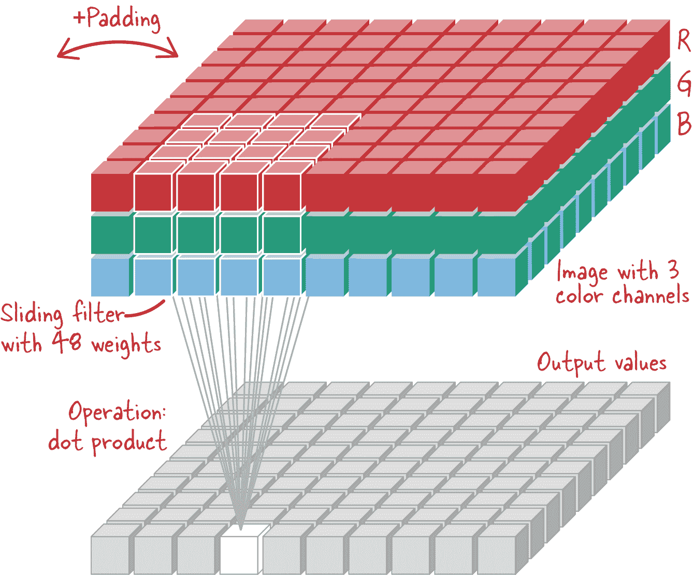
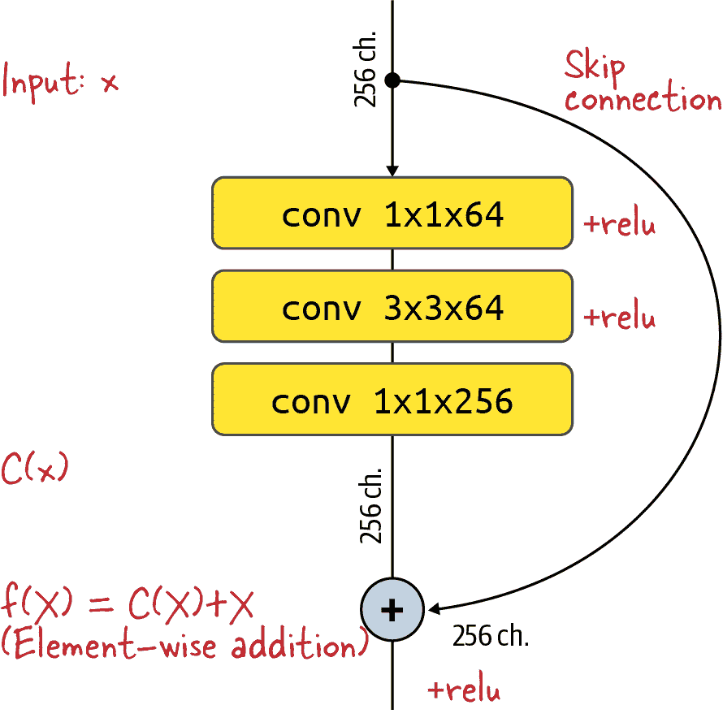

# 第三章：图像视觉

在第二章中，我们研究了将像素视为独立输入的机器学习模型。传统的全连接神经网络层在图像上表现不佳，因为它们未利用相邻像素高度相关的事实（参见图 3-1）。此外，完全连接多层也没有为图像的 2D 分层性质提供任何特殊规定。靠近的像素共同工作以创建形状（如线条和弧线），这些形状本身又共同工作以创建对象的可识别部分（如花朵的茎和花瓣）。

本章中，我们将通过研究利用图像的特殊属性的技术和模型架构来纠正这一点。

###### 提示

本章的代码位于该书的[GitHub 代码库](https://github.com/GoogleCloudPlatform/practical-ml-vision-book)的 *03_image_models* 文件夹中。我们将在适当的情况下提供代码示例和笔记本文件的文件名。


###### 图 3-1\. 将全连接层应用于图像的所有像素，将像素视为独立输入，并忽略了图像中相邻像素共同工作以创建形状的事实。

# 预训练嵌入

在第二章中我们开发的深度神经网络有两个隐藏层，一个有 64 个节点，另一个有 16 个节点。可以通过以下方式思考这种网络架构，如图 3-2 所示。在某种意义上，输入图像中包含的所有信息都由倒数第二层代表，其输出由 16 个数字组成。这 16 个提供图像表示的数字被称为 *嵌入*。当然，较早的层也会捕获输入图像的信息，但由于缺少某些层次信息，通常不会将它们用作嵌入。

在本节中，我们将讨论如何创建嵌入（与分类模型不同），以及如何使用嵌入在不同数据集上训练模型，使用两种不同的方法，即迁移学习和微调。


###### 图 3-2\. 这 16 个数字形成的嵌入提供了整个图像中所有信息的表示。

## 预训练模型

通过对输入图像应用一系列数学操作来创建嵌入向量。回顾一下，我们在第二章中多次强调，我们得到的模型精度大约为 0.45，因为我们的数据集不足以支持我们完全连接的深度学习模型中的数百万可训练权重。如果我们能重新利用从训练在更大数据集上的模型中提取的嵌入向量创建部分，会怎样呢？我们不能重新利用整个模型，因为那个模型将没有经过训练来分类花卉。然而，我们可以丢弃那个模型的最后一层或者称为*预测头*的层，并将其替换为我们自己的层。模型的重新利用部分可以从一个非常大、通用的数据集中*预训练*，然后将这些知识*转移*到我们要分类的实际数据集中。回顾图 3-2，我们可以用在“预训练模型”框中的 64 节点层替换成一个在更大数据集上训练过的模型的第一组层。

预训练模型是在大型数据集上训练并提供的模型，用作创建嵌入向量的一种方式。例如，[MobileNet 模型](https://oreil.ly/JNk0O)是一个具有 1 到 4 百万参数的模型，它是在[ImageNet（ILSVRC）数据集](https://oreil.ly/B9Q85)上训练的，该数据集包含数百万张从网络上爬取的图像，对应数百个类别。因此，生成的嵌入向量能够高效地压缩各种图像中的信息。只要我们想要分类的图像与 MobileNet 训练时使用的图像性质相似，MobileNet 生成的嵌入向量应该会为我们提供一个很好的预训练嵌入向量，可以作为在我们自己的较小数据集上训练模型的起点。

在 TensorFlow Hub 上可以找到一个预训练的 MobileNet 模型，我们可以通过传入训练模型的 URL 轻松将其加载为一个 Keras 层：

```
import tensorflow_hub as hub
huburl= "https://tfhub.dev/google/imagenet/\
 mobilenet_v2_100_224/feature_vector/4"
hub.KerasLayer(
    handle=huburl,
    input_shape=(IMG_HEIGHT, IMG_WIDTH, IMG_CHANNELS),
    `trainable``=``False``,`
    name='mobilenet_embedding')
```

在这段代码片段中，我们导入了`tensorflow_hub`包，并创建了一个`hub.KerasLayer`，传入了图像的 URL 和输入形状。关键是，我们指定这一层不可训练，并假定它是预训练的。通过这样做，我们确保其权重不会基于花卉数据进行修改；它将是只读的。

## 迁移学习

模型的其余部分与我们先前创建的 DNN 模型类似。以下是一个使用从 TensorFlow Hub 加载的预训练模型作为其第一层的模型示例（完整代码位于[*03a_transfer_learning.ipynb*](https://github.com/GoogleCloudPlatform/practical-ml-vision-book/blob/master/03_image_models/03a_transfer_learning.ipynb)）：

```
layers = [
    hub.KerasLayer(..., name='mobilenet_embedding'),
    tf.keras.layers.Dense(units=16,
                          activation='relu',
                          name='dense_hidden'),
    tf.keras.layers.Dense(units=len(CLASS_NAMES),
                          activation='softmax',
                          name='flower_prob')
]
model = tf.keras.Sequential(layers, name='flower_classification')
...
```

结果模型摘要如下：

```
Model: "flower_classification"
_________________________________________________________________
Layer (type)                 Output Shape              Param #
=================================================================
mobilenet_embedding (KerasLa (None, 1280)              `2257984`
_________________________________________________________________
dense_hidden (Dense)         (None, 16)                20496
_________________________________________________________________
flower_prob (Dense)          (None, 5)                 85
=================================================================
Total params: 2,278,565
`Trainable` `params``:` `20``,``581`
Non-trainable params: 2,257,984
```

注意，我们称之为`mobilenet_embedding`的第一层有 2.26 百万个参数，但这些参数不可训练。只有 20,581 个参数是可训练的：1,280 * 16 个权重 + 16 个偏置 = 来自隐藏密集层的 20,496 个，以及 16 * 5 个权重 + 5 个偏置 = 来自与五个输出节点的密集层的 85 个。因此，尽管 5 种花的数据集不足以训练数百万个参数，但足以训练仅 20K 个参数。

通过用图像嵌入替换其输入层来训练模型的过程称为*迁移学习*，因为我们已将 MobileNet 创作者从一个更大数据集中学到的知识迁移到了我们的问题上。

由于我们正在用 Hub 层替换模型的输入层，因此确保我们的数据管道提供 Hub 层所期望的格式的数据非常重要。TensorFlow Hub 中的所有图像模型使用共同的图像格式，并期望像素值为浮点数，范围在 0,1)内。我们在[第二章中使用的图像读取代码将 JPEG 图像缩放到这个范围内，所以一切都没问题。

训练此模型与训练上一节中的 DNN 相同（有关详细信息，请参见 GitHub 存储库中的[*03a_transfer_learning.ipynb*](https://github.com/GoogleCloudPlatform/practical-ml-vision-book/blob/master/03_image_models/03a_transfer_learning.ipynb)）。结果的损失和准确率曲线如图 3-3 所示。


###### 图 3-3。具有两个隐藏层的深度神经网络的损失和准确率曲线。

令人印象深刻的是，使用迁移学习可以获得 0.9 的准确率（请参见图 3-4），而在我们的数据上从头开始训练完全连接的深度神经网络时，我们只能达到 0.48 的准确率。每当您的数据集相对较小时，我们建议使用迁移学习。只有当数据集开始超过每个标签大约五千张图像时，您才应该考虑从头开始训练。在本章的后面部分，我们将看到技术和架构，允许我们在有大型数据集并且可以从头开始训练时获得更高的准确性。

###### 注意

对于第二行第一张图像的雏菊预测所关联的概率可能会让人吃惊。概率为 0.41？不应该大于 0.5 吗？请记住，这不是一个二元预测问题。有五个可能的类别，如果输出概率为[0.41, 0.39, 0.1, 0.1, 0.1]，`argmax`将对应于雏菊，并且概率将为 0.41。


###### 图 3-4。MobileNet 迁移学习模型对评估数据集中一些图像的预测。

## 微调

在迁移学习期间，我们采用了构成 MobileNet 的所有层，并直接使用它们。我们通过使层变为不可训练来实现。仅最后两个密集层在 5 花数据集上进行了调整。

在许多情况下，如果允许训练循环适应预训练层，我们可能会获得更好的结果。这种技术称为*微调*。预训练权重用作神经网络权重的初始值（通常情况下，神经网络训练从随机初始化权重开始）。

理论上，从迁移学习切换到微调，只需在加载预训练模型时将`trainable`标志从`False`翻转为`True`，然后在您的数据上进行训练。然而，在实践中，当微调预训练模型时，通常会注意到如 图 3-5 中的训练曲线。


###### 图 3-5\. 当使用错误的学习率调度微调时，训练和验证损失曲线。

此处的训练曲线显示，模型在数学上收敛。然而，其在验证数据上的表现较差，并且在开始时变得更糟，然后稍有恢复。如果设置的学习率过高，则预训练权重将以大步骤进行更改，丢失了预训练期间学到的所有信息。找到有效的学习率可能会有些棘手——将学习率设置得太低会导致收敛非常缓慢，设置得太高会导致预训练权重丢失。

解决此问题的两种技术是：学习率调度和逐层学习率。展示这两种技术的代码可在 [*03b_finetune_MOBILENETV2_flowers5.ipynb*](https://github.com/GoogleCloudPlatform/practical-ml-vision-book/blob/master/03_image_models/03b_finetune_MOBILENETV2_flowers5.ipynb) 中找到。

### 学习率调度

训练神经网络时最传统的学习率调度是从高开始然后在整个训练过程中指数衰减。在微调预训练模型时，可以添加热身阶段（参见 图 3-6）。


###### 图 3-6\. 左侧是传统的指数衰减学习率调度；右侧是包含热身阶段的学习率调度，这对微调更为合适。

图 3-7 展示了使用这种新学习率调度的损失曲线。


###### 图 3-7\. 使用适应的学习率调度进行微调。

注意，验证损失曲线仍然有一个小波动，但与之前相比要好得多（与 图 3-5 对比）。这引导我们选择微调的第二种学习率方式。

### 差分学习率

另一个很好的折中方案是应用*差分学习率*，其中我们对预训练层使用较低的学习率，对自定义分类头的层使用正常学习率。

实际上，我们可以在预训练层内部扩展差分学习率的思想——我们可以根据层深度乘以一个因子来逐渐增加每层的学习率，并为分类头部分配完整的学习率。

要在 Keras 中应用类似这样的复杂差分学习率，我们需要编写一个自定义优化器。但幸运的是，存在一个名为[AdamW](https://oreil.ly/z1IfS)的开源 Python 包，我们可以通过为不同层指定学习率倍增器来使用（有关完整代码，请参见 GitHub 存储库中的[*03_image_models/03b_finetune_MOBILENETV2_flowers5.ipynb*](https://github.com/GoogleCloudPlatform/practical-ml-vision-book/blob/master/03_image_models/03b_finetune_MOBILENETV2_flowers5.ipynb)）：

```
mult_by_layer={
    'block1_': 0.1,
    'block2_': 0.15,
    'block3_': 0.2,
    ... # blocks 4 to 11 here
    'block12_': 0.8,
    'block13_': 0.9,
    'block14_': 0.95,
    'flower_prob': 1.0, # for the classification head
}

optimizer = AdamW(lr=LR_MAX, model=model,
                   lr_multipliers=mult_by_layer)
```

###### 提示

我们如何知道加载的预训练模型中的层名称？我们首先在没有任何名称的情况下运行代码，使用`lr_multipliers={}`。自定义优化器在运行时打印所有层的名称。然后，我们找到了标识网络中层深度的层名称子字符串。自定义优化器通过其`lr_multipliers`参数传递的子字符串匹配层名称。

使用每层学习率和学习率逐步增加的组合，我们可以将对`tf_flowers`（5 种花卉）数据集进行微调的 MobileNetV2 的准确率推高至 0.92，而仅使用逐步增加仅为 0.91，仅进行迁移学习为 0.9（有关代码，请参见[*03b_finetune_MOBILENETV2_flowers5.ipynb*](https://github.com/GoogleCloudPlatform/practical-ml-vision-book/blob/master/03_image_models/03b_finetune_MOBILENETV2_flowers5.ipynb)）。

在这里微调的收益很小，因为`tf_flowers`数据集很小。我们需要一个更具挑战性的基准来探索即将探索的先进架构。在本章的其余部分，我们将使用*104 flowers*数据集。

GitHub 存储库包含三个笔记本，用于在更大的 104 flowers 数据集上尝试这些微调技术。结果显示在 Table 3-1 中。为了完成这项任务，我们使用了 Xception，这是一个比 MobileNet 更重的模型，因为 104 flowers 数据集更大，可以支持这个更大的模型。如您所见，学习率逐步增加或每层差分学习率并不是绝对必要的，但实际上它使收敛更稳定，更容易找到有效的学习率参数。

Table 3-1\. 更大模型（Xception）在更大的 104 flowers 数据集上微调后获得的结果摘要

| 笔记本名称 | 学习率逐步增加 | 差分学习率 | 五次运行的平均 F1 分数 | 五次运行的标准偏差 | 备注 |
| --- | --- | --- | --- | --- | --- |
| [lr_decay_xception](https://github.com/GoogleCloudPlatform/practical-ml-vision-book/blob/master/03_image_models/03b_finetune_experiment_lr_decay_xception_flowers104.ipynb) | 否 | 否 | 0.932 | 0.004 | 良好，相对低方差 |
| [lr_ramp_xception](https://github.com/GoogleCloudPlatform/practical-ml-vision-book/blob/master/03_image_models/03b_finetune_experiment_lr_ramp_xception_flowers104.ipynb) | 是 | 否 | 0.934 | 0.007 | 非常好，高方差 |
| [lr_layers_lr_ramp_xception](https://github.com/GoogleCloudPlatform/practical-ml-vision-book/blob/master/03_image_models/03b_finetune_experiment_lr_layers_lr_ramp_xception_flowers104.ipynb) | 是 | 是 | 0.936 | 0.003 | 最佳，低方差 |

到目前为止，我们已经使用了 MobileNet 和 Xception 进行迁移学习和微调，但对于我们来说，这些模型就像黑盒子一样。我们不知道它们有多少层，或者这些层包含什么内容。在下一节中，我们将讨论一个关键概念，*卷积*，这有助于这些神经网络有效地提取图像的语义信息内容。

# 卷积网络

卷积层专门设计用于图像。它们在二维空间中操作，可以捕获形状信息；它们通过在图像的两个方向上滑动一个称为*卷积滤波器*的小窗口来工作。

## 卷积滤波器

典型的 4x4 滤波器将具有图像每个通道的独立滤波器权重。对于具有红色、绿色和蓝色通道的彩色图像，滤波器总共将有 4 * 4 * 3 = 48 个可学习权重。该滤波器被应用于图像中的单个位置，方法是将该位置附近的像素值乘以滤波器权重并求和，如图 3-9 所示。这个操作称为张量*点积*。通过在图像上滑动滤波器计算每个位置的点积称为*卷积*。



###### 图 3-9。使用单个 4x4 卷积滤波器处理图像 - 滤波器在图像上的两个方向上滑动，每个位置产生一个输出值。

单个卷积滤波器可以使用非常少的可学习参数处理整个图像 - 实际上，它不能学习和表示足够的图像复杂性。需要多个这样的滤波器。卷积层通常包含数十甚至数百个类似的滤波器，每个都有自己独立的可学习权重（参见图 3-11）。它们按顺序应用于图像，并且每个产生一个*通道*的输出值。卷积层的输出是一组多通道的 2D 值。注意，这个输出与输入图像具有相同数量的维度，而输入图像本身已经是一个三通道的 2D 像素值集。

理解卷积层的结构使得计算其可学习权重的数量变得容易，如图 3-12 所示。该图还介绍了用于本章模型的卷积层的示意符号表示法。


###### 图 3-11. 使用由多个卷积滤波器组成的卷积层处理图像。所有滤波器的尺寸都相同（这里为 4x4x3），但具有独立的可学习权重。


###### 图 3-12. 卷积层的权重矩阵 W。

在这种情况下，应用了 5 个滤波器，这个卷积层中可学习的总权重数为 4 * 4 * 3 * 5 = 240。

Keras 中提供了卷积层：

```
tf.keras.layers.Conv2D(filters,
                       kernel_size,
                       strides=(1, 1),
                       padding='valid',
                       activation=None)
```

下面是参数的简化描述（详细信息请参见 Keras 的[文档](https://oreil.ly/NLRBL)）：

`filters`

应用到输入的独立滤波器数量。这也将是输出通道的数量。

`kernel_size`

每个滤波器的尺寸。可以是一个单独的数字，比如 4 表示 4x4 的滤波器，或者是一个对，比如(4, 2)表示一个 4x2 的矩形滤波器。

`strides`

滤波器在输入图像上以步长滑动。默认步长为 1 像素。使用较大的步长会跳过输入像素并产生较少的输出值。

`padding`

`'valid'`表示没有填充，或者`'same'`表示在边缘进行零填充。如果滤波器应用于具有`'valid'`填充的输入，则仅当窗口内的所有像素都有效时才进行卷积，因此边界像素会被忽略。因此，输出在*x*和*y*方向上会稍微小一些。值`'same'`允许对输入进行零填充，以确保输出与输入具有相同的宽度和高度。

`activation`

像任何神经网络层一样，卷积层后面可以跟着一个激活函数（非线性）。

图 3-11 中展示的卷积层，使用了五个 4x4 的滤波器，输入填充，以及在两个方向上的默认步幅为 1，可以实现如下：

```
tf.keras.layers.Conv2D(filters=5, kernel_size=4, padding='same')
```

卷积层的输入和输出都期望是 4D 张量。第一个维度是批处理大小，因此完整的形状是 [batch, height, width, channels]。例如，一个批量为 16 的彩色（RGB）图像，每个图像大小为 512x512 像素，将表示为具有维度 [16, 512, 512, 3] 的张量。

## 堆叠卷积层

如前一节所述，一个通用的卷积层以一个 4D 张量形式的输入 [batch, height, width, channels] 作为输入，并产生另一个 4D 张量作为输出。为简单起见，在我们的图表中忽略批处理维度，并展示一个单独的 3D 形状的图像 [height, width, channels] 的情况。

卷积层将一个数据“立方体”转换为另一个“立方体”，然后可以被另一个卷积层消耗。如图 3-13 所示，卷积层可以堆叠。


###### 图 3-13\. 顺序应用的两个卷积层转换的数据。右侧显示可学习的权重。第二个卷积层使用步长为 2，并具有六个输入通道，与前一层的六个输出通道匹配。

图 3-13 展示了数据如何经过两个卷积层的转换。从顶部开始，第一层是一个应用于具有四个数据通道的输入的 3x3 滤波器。滤波器应用于输入六次，每次使用不同的滤波器权重，产生六个输出值通道。然后，这些值被输入到第二个卷积层中，该层使用 2x2 滤波器。注意，第二个卷积层在应用滤波器时使用步长为 2（每隔一个像素），以获得较少的输出值（在水平面上）。

## 池化层

每个卷积层应用的滤波器数量决定输出中的通道数。但是，我们如何控制每个通道中的数据量呢？神经网络的目标通常是从包含数百万像素的输入图像中提炼信息，以获得少数类别。因此，我们需要能够合并或降采样每个通道中信息的层。

最常用的降采样操作是 2x2 最大池化。通过最大池化，每个通道的每组四个输入值仅保留最大值（参见图 3-14）。*平均池化*以类似的方式工作，但是对四个值进行平均而不是保留最大值。


###### 图 3-14\. 对单通道输入数据应用的 2x2 最大池化操作。每组 2x2 输入值取最大值，每个方向上每两个值重复一次操作（步长为 2）。

注意，最大池化层和平均池化层没有任何可训练的权重。它们纯粹是大小调整层。

有一个有趣的物理解释，解释了为什么最大池化层与卷积层在神经网络中很好地配合。卷积层是一系列可训练的滤波器。训练后，每个滤波器专门用于匹配某些特定的图像特征。卷积神经网络中的第一层对输入图像中的像素组合做出反应，而后续层对前一层的特征组合做出反应。例如，在训练用于识别猫的神经网络中，第一层对基本的图像组件（如水平和垂直线或毛皮的纹理）做出反应。随后的层对线条和毛皮的特定组合做出反应，以识别尖耳朵、胡须或猫眼睛。更后面的层检测到尖耳朵 + 胡须 + 猫眼睛的组合，表示猫的头部。最大池化层仅保留检测到某些特征 *X* 的最大强度的值。如果目标是减少值的数量但保留最具代表性的值，这是有道理的。

池化层和卷积层对检测到的特征位置有不同的影响。卷积层返回具有其高值的特征映射，这些高值位于其滤波器检测到显著内容的位置。另一方面，池化层降低特征映射的分辨率，并使位置信息不太精确。有时候，位置或相对位置很重要，例如在面部中，眼睛通常位于鼻子上方。卷积确实为网络中的其他层提供了位置信息。然而，有时候定位特征并不是目标，比如在花卉分类器中，您希望训练模型在图像中无论花朵出现在何处都能识别出来。在这种情况下，当训练位置不变性时，池化层有助于在某种程度上模糊位置信息，但不能完全模糊。如果要使网络真正地不受位置影响，就必须对显示花朵在许多不同位置的图像进行训练。可以使用数据增强方法，如图像的随机裁剪，来强制网络学习此位置不变性。数据增强在第六章中有所涉及。

用于降低通道信息的第二个选择是应用卷积，其步长为 2 或 3，而不是 1。然后，卷积滤波器在输入图像上按 2 或 3 个像素的步长滑动。这样机械地产生了一定尺寸的输出值，如图 3-15 所示。


###### 图 3-15\. 在单通道数据上应用 3x3 滤波器，两个方向上的步长为 2 且没有填充。滤波器每次跳过 2 个像素。

现在我们可以将这些层组装成我们的第一个卷积神经分类器。

## AlexNet

最简单的卷积神经网络架构是卷积层和最大池化层的混合体。它将每个输入图像转换为一个最终的数值矩形棱柱，通常称为*特征图*，然后将其馈送到若干全连接层，最后是一个 softmax 层，用于计算类别概率。

AlexNet 是由 Alex Krizhevsky 等人在 2012 年的[论文](https://oreil.ly/sMlqQ)中引入的，并在图 3-16 中展示，正是这样的一个架构。它是为[ImageNet 竞赛](https://oreil.ly/G1jfu)设计的，该竞赛要求参与者基于超过一百万张图像的训练数据集将图像分类为一千个类别（汽车、花朵、狗等）。AlexNet 是神经图像分类中最早的成功案例之一，显著提高了准确性，并证明深度学习能够比现有技术更好地解决计算机视觉问题。


###### 图 3-16\. AlexNet 架构：左侧表示神经网络层。右侧表示转换后的特征图。

在这种架构中，卷积层改变数据的深度——即通道数量。最大池化层在高度和宽度方向上对数据进行降采样。第一个卷积层的步长为 4，这也是为什么它会对图像进行降采样。

AlexNet 使用 2x2 步长为 2 的 3x3 最大池化操作。更传统的选择可能是 2x2 步长为 2 的最大池化。AlexNet 的研究声称这种“重叠”最大池化具有一定优势，但似乎并不显著。

每个卷积层由 ReLU 激活函数激活。最后的四层形成 AlexNet 的分类头，接收最后的特征图，将其所有值展平为一个向量，并通过三个全连接层馈送。因为 AlexNet 设计用于千分类，最后一层由具有一千个输出的 softmax 激活，计算千个目标类别的概率。

所有卷积和全连接层都使用加性偏置。当使用 ReLU 激活函数时，习惯上在训练之前将偏置初始化为一个小正值，以确保激活后所有层都具有非零输出和非零梯度（记住 ReLU 曲线对所有负值都是平坦零）。

在图 3-16 中注意到，AlexNet 以一个非常大的 11x11 卷积滤波器开始。在可学习权重方面，这是昂贵的，可能不是现代架构中会采用的做法。然而，11x11 滤波器的一个优势是它们的学习权重可以可视化为 11x11 像素的图像。AlexNet 论文的作者做到了；他们的结果在图 3-17 中展示。


###### 图 3-17。第一个 AlexNet 层的所有 96 个滤波器。它们的大小为 11x11x3，这意味着它们可以被视为彩色图像。这张图片显示了它们在训练后的权重。图片来源于[Krizhevsky et al., 2012](https://oreil.ly/X3xRb)。

如您所见，该网络学会了检测各种方向的垂直线、水平线和倾斜线。两个滤波器展现出棋盘格模式，这可能是对图像中颗粒状纹理的反应。您还可以看到检测单色或相邻颜色对的探测器。所有这些都是基本特征，随后的卷积层将把它们组装成语义更重要的结构。例如，神经网络将把纹理和线条结合成“轮子”、“把手”和“鞍座”的形状，然后将这些形状组合成“自行车”。

我们选择在这里介绍 AlexNet，因为它是最早的卷积架构之一。交替使用卷积和最大池化层仍然是现代网络的特征。然而，该架构中做出的其他选择不再代表目前公认的最佳实践。例如，在第一个卷积层中使用非常大的 11x11 滤波器后来被发现并不是可学习权重的最佳利用（正如我们将在本章后面看到的，3x3 更好）。此外，最后的三个全连接层具有超过 2600 万个可学习权重！这比所有卷积层的权重总和（370 万）还要多一个数量级。网络也非常浅，只有八个神经层。现代神经网络显著增加了这一数量，达到了一百层甚至更多。

这个非常简单的模型的一个优点是，它可以在 Keras 中非常简洁地实现（你可以在 GitHub 上的[*03c_fromzero_ALEXNET_flowers104.ipynb*](https://github.com/GoogleCloudPlatform/practical-ml-vision-book/blob/master/03_image_models/03c_fromzero_ALEXNET_flowers104.ipynb)中查看完整的示例）：

```
model = tf.keras.Sequential([
    tf.keras.Input(shape=[IMG_HEIGHT, IMG_WIDTH, 3]),
    tf.keras.layers.Conv2D(filters=96, kernel_size=11, strides=4,
                              activation='relu'),
    tf.keras.layers.Conv2D(filters=256, kernel_size=5,
                              activation='relu'),
    tf.keras.layers.MaxPool2D(pool_size=2, strides=2),
    tf.keras.layers.Conv2D(filters=384, kernel_size=3,
                              activation='relu'),
    tf.keras.layers.MaxPool2D(pool_size=2, strides=2),
    tf.keras.layers.Conv2D(filters=384, kernel_size=3,
                              activation='relu'),
    tf.keras.layers.Conv2D(filters=256, kernel_size=3,
                              activation='relu'),
    tf.keras.layers.MaxPool2D(pool_size=2, strides=2),
    tf.keras.layers.Flatten(),
    tf.keras.layers.Dense(4096, activation='relu'),
    tf.keras.layers.Dense(4096, activation='relu'),
    tf.keras.layers.Dense(len(CLASSES), activation='softmax')
])
```

该模型在 104 种花卉数据集上收敛到 39%的准确率，虽然对于实际花卉识别来说并不实用，但对于如此简单的架构来说，这一结果令人惊讶地好。

在本章的其余部分，我们将提供对不同网络架构及其引入的概念和构建模块的直观解释。虽然我们展示了您如何在 Keras 中实现 AlexNet，但通常您不会自己实现我们讨论的这些架构。相反，这些模型通常直接在 Keras 中作为预训练模型提供，可以立即用于迁移学习或微调。例如，您可以如何实例化一个预训练的 ResNet50 模型（更多信息请参见“Keras 中的预训练模型”）：

```
tf.keras.applications.ResNet50(weights='imagenet')
```

如果一个模型尚未在`keras.applications`中可用，通常可以在 TensorFlow Hub 中找到。例如，您可以如何从 TensorFlow Hub 实例化相同的 ResNet50 模型：

```
hub.KerasLayer(
    "https://tfhub.dev/tensorflow/resnet_50/classification/1")
```

因此，可以随意浏览本章节的其余部分，了解基本概念，然后阅读最后一节，了解如何为您的问题选择模型架构。您不需要完全理解本章节中网络架构的所有细微差别，因为您很少需要从头开始实现这些架构或设计自己的网络架构。大多数情况下，您将从我们在本章最后一节中建议的架构中选择一种。不过，了解这些架构是如何构建的也是很有趣的。理解这些架构还将帮助您在实例化时选择正确的参数。

# 深度追求

在 AlexNet 之后，研究人员开始增加卷积网络的深度。他们发现添加更多层次会导致更好的分类准确性。关于此现象，提出了几种解释：

*表达能力* 论证

单层是一个线性函数，无论其参数数量如何，都无法逼近复杂的非线性函数。但是，每层都会通过非线性激活函数（如 sigmoid 或 ReLU）进行激活。堆叠多层会产生多个连续的非线性，更有可能逼近所需的高度复杂功能，例如区分猫和狗的图像。

泛化论证

给单层添加参数可以增加神经网络的“记忆力”，使其能够学习更复杂的事物。然而，它往往会通过记忆输入示例来学习，这样的泛化能力不强。另一方面，堆叠多层会迫使网络将其输入语义上分解为特征的分层结构。例如，初始层将识别毛发和胡须，而后续层将这些特征组合起来识别猫的头部，然后是整个猫。由此产生的分类器泛化能力更强。

感知领域论证

如果猫的头部覆盖图像的大部分区域——比如一个 128x128 像素的区域——单层卷积网络需要 128x128 个滤波器才能捕捉它，这在可学习权重方面将是极其昂贵的。另一方面，堆叠层可以使用小的 3x3 或 5x5 滤波器，如果它们在卷积堆栈中足够深，仍然能够“看到”任何 128x128 像素的区域。

为了设计更深的卷积网络，而不会无法控制地增加参数计数，研究人员还开始设计更便宜的卷积层。我们来看看如何做到这一点。

## 滤波器分解

哪一个更好：一个 5x5 卷积滤波器还是两个连续应用的 3x3 滤波器？它们都有一个 5x5 的感受野（见图 3-18）。虽然它们并不执行完全相同的数学操作，但它们的效果可能相似。不同之处在于，连续应用的两个 3x3 滤波器总共有 2 * 3 * 3 = 18 个可学习参数，而单个 5x5 滤波器有 5 * 5 = 25 个可学习权重。因此，两个 3x3 滤波器更便宜。


###### 图 3-18\. 两个连续应用的 3x3 滤波器。每个输出值都是从一个 5x5 的感受野计算出来的，这类似于一个 5x5 滤波器的工作方式。

另一个优点是，一对 3x3 卷积层将涉及两次激活函数的应用，因为每个卷积层后面都跟着一个激活函数。而单个 5x5 层只有一个激活。激活函数是神经网络中唯一的非线性部分，可能序列中的非线性组合能够更好地表达输入的复杂非线性表示。

实践中发现，两个 3x3 层比一个 5x5 层效果更好，同时使用更少的可学习权重。这就是为什么现代卷积结构中广泛使用 3x3 卷积层的原因。有时这被称为 *滤波器分解*，尽管在数学意义上并不完全是分解。

另一个今天流行的滤波器尺寸是 1x1 卷积。让我们看看为什么。

## 1x1 卷积

在图像上滑动单像素滤波器听起来有点傻。这相当于将图像乘以一个常数。但是，在多通道输入中，对于每个通道使用不同的权重，这其实是有意义的。例如，将 RGB 图像的三个颜色通道分别乘以三个可学习的权重，然后将它们相加，会产生颜色通道的线性组合，这实际上是有用的。一个 1x1 卷积层执行多个这种线性组合，每次使用独立的权重集合，产生多个输出通道（参见图 3-19）。


###### 图 3-19\. 一个 1x1 卷积层。每个滤波器有 10 个参数，因为它作用于一个 10 通道输入。应用了 5 个这样的滤波器，每个都有自己的可学习参数（图中未显示），因此输出了 5 个通道的数据。

1x1 卷积层是调整数据通道数量的有用工具。第二个优点是，与 2x2、3x3 或更大的卷积层相比，1x1 卷积层在可学习参数的数量上要便宜。在前面的示例中代表 1x1 卷积层的权重张量如图 3-20 所示。


###### 图 3-20\. 来自图 3-19 的 1x1 卷积层的权重矩阵。

可学习权重的数量为 1 * 1 * 10 * 5 = 50。一个具有相同输入和输出通道数量的 3x3 层将需要 3 * 3 * 10 * 5 = 450 个权重，多一个数量级！

接下来，让我们看一下采用了这些技巧的架构。

## VGG19

VGG19 是由 Karen Simonyan 和 Andrew Zisserman 在 2014 年的[论文](https://arxiv.org/abs/1409.1556)中介绍的，是第一批完全采用 3x3 卷积的架构之一。图 3-21 展示了它的 19 层结构。

这个图中的所有神经网络层都使用偏置并且是 ReLU 激活的，除了最后一层使用 softmax 激活。

VGG19 通过更深的网络结构改进了 AlexNet。它有 16 个卷积层，而不是 5 个。它还完全采用 3x3 卷积而不失准确性。然而，它使用与 AlexNet 完全相同的分类头，有三个大的全连接层，超过 1.2 亿个权重，而卷积层只有 2 千万个权重。还有更便宜的替代品。


###### 图 3-21\. 具有 19 个可学习层的 VGG19 架构（左）。右侧显示了数据形状（未全部表示）。注意所有卷积层都使用 3x3 的滤波器。

## 全局平均池化

让我们再次看看分类头的实现。在 AlexNet 和 VGG19 架构中，最后一个卷积层输出的特征图被转换为一个向量（扁平化），然后被馈送到一个或多个全连接层中（参见图 3-22）。其目标是以 softmax 激活的全连接层结束，神经元数量正好等于当前分类问题中的类数，例如 ImageNet 数据集的一千类或上一章中使用的 5-花数据集的五类。这个全连接层具有输入 * 输出权重，这往往是很多的。


###### 图 3-22\. 卷积网络末端的传统分类头。从卷积层输出的数据被扁平化并馈送到全连接层。使用 softmax 激活获取类别概率。

如果唯一的目标是获得*N*个值以馈送给*N*-路 softmax 函数，有一种简单的方法可以实现：调整卷积堆栈，使其以确切的*N*通道数的最终特征图结束，并简单地对每个通道中的值进行平均，如图 3-23 所示。这被称为*全局平均池化*。全局平均池化不涉及可学习权重，因此从这个角度来看它是廉价的。

全局平均池化可以直接接 softmax 激活（如 SqueezeNet 中所示，参见图 3-26），尽管在本书描述的大多数架构中，它将被单个 softmax 激活的全连接层所跟随（例如在 ResNet 中，如图 3-29 所示）。


###### 图 3-23\. 全局平均池化。每个通道被平均为一个值。全局平均池化后跟 softmax 函数实现了一个具有零可学习参数的分类头部。

###### 注意

平均化会去除通道中存在的大量位置信息。这可能是好事，也可能不是，这取决于应用场景。卷积滤波器在特定位置上检测它们被训练来检测的事物。例如，如果网络正在分类猫和狗，那么位置数据（例如，在通道中位置*x, y*处检测到“猫须”）可能对分类头部没有用处。感兴趣的仅仅是“任何地方检测到狗”信号与“任何地方检测到猫”信号。然而，在其他应用中，全局平均池化层可能不是最佳选择。例如，在目标检测或物体计数的用例中，检测到的对象的位置很重要，因此不应使用全局平均池化。

# 模块化架构

一连串的卷积层和池化层足以构建基本的卷积神经网络。然而，为了进一步提高预测准确性，研究人员设计了更复杂的构建模块，或称为*模块*，通常被赋予诸如“Inception 模块”，“残差块”或“反向残差瓶颈”等晦涩的名称，然后将它们组装成完整的卷积架构。拥有更高级的构建模块也使得创建自动化算法来搜索更好的架构变得更容易，正如我们将在神经架构搜索部分看到的那样。在本节中，我们将探讨几种这样的模块化架构及其背后的研究。

## Inception

Inception 架构以克里斯托弗·诺兰 2010 年的电影*盗梦空间*命名，由莱昂纳多·迪卡普里奥主演。电影对话中的一句话“我们需要更深入”[“We need to go deeper”](https://oreil.ly/uSwgP) 成为了一个互联网迷因。当时，研究人员建立更深层次的神经网络是主要动机之一。

[Inception V3](https://arxiv.org/abs/1512.00567v3)架构仅使用 3x3 和 1x1 卷积滤波器，这在大多数卷积架构中现已成为惯例。然而，它试图以一种非常独特的方式解决另一个问题。在神经网络中排列卷积和池化层时，设计者有多种选择，而最佳选择并不明显。因此，不如在网络本身中构建多个选项，让它学习哪个是最佳的？这正是 Inception“模块”的动机（见图 3-24）。


###### 图 3-24\. Inception 模块的示例。右侧展示了完整的 InceptionV3 架构。

Inception 模块不会事先决定哪种层序列最合适，而是提供了几种网络可以根据数据和训练选择的替代方案。如图 3-24 所示，不同路径的输出连接成最终的特征图。

本书不会详细介绍完整的 InceptionV3 架构，因为它相当复杂，并且已被更新和简化的替代方案所取代。接下来将介绍一个基于“模块”思想的简化变体。

## SqueezeNet

模块的概念由[SqueezeNet](https://arxiv.org/abs/1602.07360)架构简化，保留了为网络提供多条选择路径的基本原则，但将模块本身简化为最简形式（见图 3-25）。SqueezeNet 论文将其称为“fire modules”。


###### 图 3-25\. 来自 SqueezeNet 架构的简化和标准化卷积模块。右侧展示的架构通过这些“fire modules”和最大池化层交替排列。

SqueezeNet 架构中使用的模块交替进行收缩阶段和扩展阶段。在收缩阶段中，通过 1x1 卷积减少通道数量，而在扩展阶段中，再次增加通道数量。

为了减少权重计算，SqueezeNet 在最后一层使用全局平均池化。此外，在每个模块中的三个卷积层中，有两个是 1x1 卷积，这样可以节省可学习的权重（见图 3-26）。


###### 图 3-26\. SqueezeNet 架构，包含 18 个卷积层。每个“fire module”包含一个“squeeze”层，后跟两个平行的“expand”层。该网络包含 1.2M 可学习参数。

在 图 3-26 中，“maxpool” 是一个标准的 2x2 最大池化操作，步幅为 2。此外，架构中的每个卷积层均使用 ReLU 激活并进行批量归一化。千类分类头部通过首先用 1x1 卷积将通道数扩展到一千，然后对千个通道进行全局平均池化，并最后应用 softmax 激活来实现。

SqueezeNet 架构旨在简单经济（就可学习的权重而言），但仍融合了构建卷积神经网络的大部分最佳实践。其简单性使其成为实现自己的卷积主干的良好选择，无论是出于教育目的还是因为需要根据自身需求进行调整。今天可能不再被视为最佳实践的一个建筑元素是直接受到 AlexNet 启发的大型 7x7 初始卷积层。

要在 Keras 中实现 SqueezeNet 模型，我们必须使用 Keras Functional API 模型。我们不能再使用 Sequential 模型，因为 SqueezeNet 不是一系列直接的层。我们首先创建一个辅助函数，实例化一个 fire 模块（完整代码在 [*03f_fromzero_SQUEEZENET24_flowers104.ipynb* on GitHub](https://github.com/GoogleCloudPlatform/practical-ml-vision-book/blob/master/03_image_models/03f_fromzero_SQUEEZENET24_flowers104.ipynb) 中可用）：

```
def fire(x, squeeze, expand):
    y  = tf.keras.layers.Conv2D(filters=squeeze, kernel_size=1,
                                   activation='relu', padding='same')(x)
    y = tf.keras.layers.BatchNormalization()(y)
    y1 = tf.keras.layers.Conv2D(filters=expand//2, kernel_size=1,
                                   activation='relu', padding='same')(y)
    y1 = tf.keras.layers.BatchNormalization()(y1)
    y3 = tf.keras.layers.Conv2D(filters=expand//2, kernel_size=3,
                                   activation='relu', padding='same')(y)
    y3 = tf.keras.layers.BatchNormalization()(y3)
    return tf.keras.layers.concatenate([y1, y3])
```

正如你在函数的第一行中所看到的，使用 Keras Functional API，`tf.keras.layers.Conv2D()` 实例化一个卷积层，然后用输入 `x` 调用它。我们可以轻微修改 `fire()` 函数，使其使用相同的语义：

```
def fire_module(squeeze, expand):
    return lambda x: fire(x, squeeze, expand)
```

下面是自定义的 24 层 SqueezeNet 的实现。它在 104 朵花数据集上表现尚可，F1 分数为 76%，考虑到它是从头开始训练的，这个结果并不差：

```
x = tf.keras.layers.Input(shape=[IMG_HEIGHT, IMG_WIDTH, 3])
y = tf.keras.layers.Conv2D(kernel_size=3, filters=32,
                              padding='same', activation='relu')(x)
y = tf.keras.layers.BatchNormalization()(y)
y = fire_module(16, 32)(y)
y = tf.keras.layers.MaxPooling2D(pool_size=2)(y)
y = fire_module(48, 96)(y)
y = tf.keras.layers.MaxPooling2D(pool_size=2)(y)
y = fire_module(64, 128)(y)
y = fire_module(80, 160)(y)
y = fire_module(96, 192)(y)
y = tf.keras.layers.MaxPooling2D(pool_size=2)(y)
y = fire_module(112, 224)(y)
y = fire_module(128, 256)(y)
y = fire_module(160, 320)(y)
y = tf.keras.layers.MaxPooling2D(pool_size=2)(y)
y = fire_module(192, 384)(y)
y = fire_module(224, 448)(y)
y = tf.keras.layers.MaxPooling2D(pool_size=2)(y)
y = fire_module(256, 512)(y)
y = tf.keras.layers.GlobalAveragePooling2D()(y)
y = tf.keras.layers.Dense(len(CLASSES), activation='softmax')(y)

model = tf.keras.Model(x, y)
```

最后一行，通过传入初始输入层和最终输出创建模型。该模型可以像 Sequential 模型一样使用，因此其余代码保持不变。

## ResNet 和跳跃连接

ResNet 架构，由 Kaiming He 等人在 2015 年的 [论文](https://arxiv.org/abs/1512.03385) 中引入，延续了增加神经网络深度的趋势，但解决了非常深的神经网络普遍存在的问题 —— 由于梯度消失或梯度爆炸导致的收敛困难。训练期间，神经网络会了解它所产生的错误（或损失），并通过调整其内部权重来最小化这些错误。它在这方面是由错误的一阶导数（或梯度）引导的。不幸的是，随着层数增加，梯度往往会在所有层中过分稀释，导致网络收敛缓慢或根本不收敛。

ResNet 试图通过在其卷积层旁边添加 *跳跃连接* 来补救这一点（图 3-27）。跳跃连接以原样传递信号，然后将其与经过一个或多个卷积层转换的数据重新组合。组合操作是简单的逐元素加法。



###### 图 3-27\. ResNet 中的残差块。

正如在 图 3-27 中所示，块的输出 *f*(*x*) 是卷积路径 *C*(*x*) 和跳跃连接 (*x*) 输出的和。卷积路径经过训练来计算 *C*(*x*) = *f*(*x*) – *x*，即期望输出与输入之间的差异。ResNet 论文的作者认为这种“残差”更容易让网络学习。

显然的限制是，逐元素加法只能在数据的维度保持不变时起作用。跨越跳跃连接的层序列（称为 *残差块*）必须保持数据的高度、宽度和通道数。

当需要尺寸调整时，使用不同类型的残差块（图 3-28）。通过使用 1x1 卷积而不是恒等映射，可以匹配不同数量的通道。通过在卷积路径和跳跃连接中使用步长 2 来获得高度和宽度的调整（是的，使用步长 2 的 1x1 卷积实现跳跃连接会忽略输入的一半值，但在实践中似乎并不重要）。


###### 图 3-28\. 带有高度、宽度和通道数调整的残差块。通过使用 1x1 卷积而不是恒等函数，在跳跃连接中改变通道数。通过在卷积路径和跳跃连接中使用步长 2 的一个卷积层来进行数据高度和宽度的下采样。

ResNet 架构可以通过堆叠更多的残差块来实例化不同深度。流行的尺寸有 ResNet50 和 ResNet101（图 3-29）。


###### 图 3-29\. ResNet50 架构。带有步长 2 的残差块通过使用 1x1 卷积实现了跳跃连接（虚线）。ResNet 101 架构类似，使用了 23 次“残差 256, 1,024”块，而非 6 次。

在 图 3-29 中，所有卷积层都是经过 ReLU 激活并使用批归一化。具有这种架构的网络可以非常深 —— 如其名称所示，ResNets 中常见的有 50 层、100 层或更多 —— 但它仍然能够确定哪些层需要根据任何给定输出错误调整其权重。

跳跃连接似乎有助于梯度在优化（反向传播）阶段通过网络流动。关于此已经提出了几种解释。以下是最流行的三种解释。

ResNet 论文的作者们推测，加法操作（参见图 3-27）起着重要作用。在常规神经网络中，内部权重被调整以产生期望的输出，例如将输入分类为一千类。然而，通过跳跃连接，神经网络层的目标是输出输入与期望最终输出之间的增量（或“残差”）。作者认为，这对网络来说是一个“更容易”的任务，但他们没有详细说明什么使得这个任务更容易。

第二个有趣的解释是，残差连接实际上使网络变得更浅。在梯度反向传播阶段，梯度既通过卷积层流动（可能减小幅度），也通过跳跃连接流动（保持不变）。在文章[“Residual Networks Behave Like Ensembles of Relatively Shallow Networks”](https://arxiv.org/abs/1605.06431)中，Veit 等人测量了 ResNet 架构中梯度的强度。结果（见图 3-30）显示，在一个 50 层 ResNet 神经网络中，信号可以通过卷积层和跳跃连接的各种组合流动。


###### 图 3-30. ResNet50 模型中路径长度的理论分布与在反向传播期间实际梯度采取的路径。来自[Veit et al., 2016](https://arxiv.org/abs/1605.06431)的图像。

在通过卷积层遍历的路径长度中，最有可能的路径长度位于 0 和 50 之间的中点（左图）。然而，Veit 等人测量到在训练后的 ResNet 中提供实际有用的非零梯度的路径要比这更短，大约穿越 12 层。

根据这一理论，深度为 50 层或 100 层的 ResNet 充当一个集合——即解决分类问题不同部分的较浅网络的集合。它们共同发挥其分类优势，但由于实际上并不是非常深，它们仍然能够有效地收敛。与模型集合相比，ResNet 架构的好处在于它作为单一模型训练，并学会为每个输入选择最佳路径。

第三种解释关注训练期间优化的损失函数的拓扑景观。在[“Visualizing the Loss Landscape of Neural Nets”](https://arxiv.org/abs/1712.09913)中，Li 等人成功地将损失景观呈现为 3D，而不是其原始的数百万维，并展示了使用跳跃连接时好的极小值要容易得多（见图 3-31）。


###### 图 3-31\. 通过 Li 等人的“过滤器归一化方案”可视化的 56 层 ResNet 的损失景观。添加跳跃连接使全局最小值更容易达到。图片来源于 [Li et al., 2017](https://arxiv.org/abs/1712.09913)。

在实践中，ResNet 架构表现非常出色，并已成为领域内最流行的卷积架构之一，也是所有其他进展的基准。

## DenseNet

DenseNet 架构通过一种全新的激进想法重新审视了跳跃连接的概念。在他们的 [论文](https://arxiv.org/abs/1608.06993) 中，Gao Huang 等人建议通过创建必要数量的跳跃连接，将所有前层的输出馈送到卷积层。这一次，数据通过在深度轴（通道）上进行串联而不是相加来组合。显然，导致 ResNet 架构的直觉——通过“残余”信号添加跳跃连接的数据更容易学习——并非根本。串联也行得通。

*密集块* 是 DenseNet 的基本构建块。在密集块中，卷积成对分组，每对卷积接收前面所有卷积对的输出作为其输入。在图 3-32 中描述的密集块中，数据通过在通道上串联来组合。所有卷积都经过 ReLU 激活并使用批归一化。如果数据的高度和宽度维度相同，则通道级串联才能起作用，因此密集块中的卷积都是步幅为 1，不改变这些维度。池化层将必须在密集块之间插入。


###### 图 3-32\. “密集块”是 DenseNet 架构的基本构建块。卷积被成对分组。每对卷积接收前面所有卷积对的输出作为输入。注意通道数随层数线性增长。

直觉上，人们会认为连接所有先前看到的输出会导致通道数和参数数量呈爆炸性增长，但实际情况并非如此。从可学习参数的角度来看，DenseNet 非常经济。原因在于，每个连接块，可能具有相对较多的通道数，总是首先通过一个 1x1 卷积进行处理，将其减少到小数量的通道数，*K*。 1x1 卷积在其参数数量上是廉价的。然后是一个相同通道数（*K*）的 3x3 卷积。得到的*K*个通道然后连接到所有先前生成的输出集合。每个步骤，使用一对 1x1 和 3x3 卷积，正好向数据添加*K*个通道。因此，通道数量仅随着密集块中卷积步骤的数量线性增长。增长率*K*在整个网络中是常数，并且已经证明 DenseNet 在较低的*K*值（原始论文中*K*在 12 到 40 之间）下表现良好。

密集块和池化层交替排列以创建完整的 DenseNet 网络。图 3-33 展示了一个具有 121 层的 DenseNet121，但这种架构是可配置的，可以轻松扩展到超过 200 层。

浅卷积层（*K*=32，例如）是 DenseNet 的一个特征。在先前的架构中，拥有超过一千个过滤器的卷积并不罕见。DenseNet 能够使用浅卷积，因为每个卷积层都能看到先前计算的所有特征。在其他架构中，数据在每一层都会进行变换，网络必须积极工作以保持数据通道的原样，如果这是正确的操作的话。它必须使用一些过滤器参数来创建一个恒等函数，这是浪费的。作者认为，DenseNet 旨在允许特征复用，因此每个卷积层所需的过滤器要少得多。


###### 图 3-33\. DenseNet121 架构。使用增长率 K=32 时，所有卷积层产生 32 个输出通道，除了用于密集块之间转换的 1x1 卷积，它们被设计为减半通道数。有关密集块的详细信息，请参阅前一图。所有卷积均使用 ReLU 激活并进行批归一化。

## 深度可分离卷积

传统卷积一次过滤输入的所有通道。然后使用多个过滤器使网络有机会对相同的输入通道做许多不同的事情。让我们以一个应用于 8 个输入通道的 3x3 卷积层，输出通道为 16 为例。它有形状为 3x3x8 的 16 个卷积滤波器（图 3-34）。


###### Figure 3-34\. 一个具有 8 个输入和 16 个输出（16 个过滤器）的 3x3 卷积层的权重。在训练后，许多单独的 3x3 过滤器可能会变得相似（阴影部分）；例如，水平线探测器过滤器。

在每个 3x3x8 滤波器中，实际上同时发生两个操作：一个 3x3 滤波器被应用于图像的每个输入通道（空间维度），并且经过滤波的输出以各种方式在通道之间重新组合。简而言之，这两个操作是空间过滤与经过滤波输出的线性重新组合。如果这两个操作独立进行（或可分离），而不影响网络的性能，那么可以使用更少的可学习权重来执行。让我们看看为什么。

如果我们看一个训练过的层的 16 个过滤器，很可能网络不得不在许多过滤器中重新发明相同的 3x3 空间过滤器，只是因为它想以不同的方式组合它们。实际上，这可以通过实验来可视化（图 3-35）。


###### Figure 3-35\. 可视化训练神经网络的第一个卷积层中一些 12x12 滤波器。非常相似的滤波器已被多次重新发明。图像来自[Sifre, 2014](https://oreil.ly/7Y4LL)。

看起来传统的卷积层使用参数效率低下。这就是为什么 Laurent Sifre 在他 2014 年论文的第 6.2 节中建议使用一种称为*深度可分离卷积*或*可分离卷积*的不同类型的卷积。主要思想是通过一组独立的滤波器逐个通道地过滤输入，然后使用 1x1 卷积单独组合输出，如图 3-36 所示。假设跨通道提取很少的“形状”信息，因此加权和就足以组合它们（1x1 卷积是通道的加权和）。另一方面，图像的空间维度中包含大量的“形状”信息，需要使用 3x3 或更大的滤波器来捕捉它。


###### Figure 3-36\. 一个 4x4 深度可分离卷积层。在第 1 阶段，4x4 滤波器独立地应用于每个通道，生成相同数量的输出通道。在第 2 阶段，输出通道然后通过 1x1 卷积重新组合（通道的多个加权和）。

在图 3-36 中，第 1 阶段过滤操作可以使用新的滤波权重重复，以产生两倍或三倍数量的通道。这称为*深度乘数*，但通常值为 1，因此此参数未在右侧权重计算中表示。

可以轻松计算示例卷积层在图 3-36 中使用的权重数量：

+   使用可分离的 3x3x8x16 卷积层：3 * 3 * 8 + 8 * 16 = 200 个权重

+   使用传统的卷积层：3 * 3 * 8 * 16 = 1,152 个权重（用于比较）

由于可分离卷积层无需多次重新发明每个空间滤波器，它们在可学习权重方面显著更为经济。问题是它们是否同样高效。

弗朗索瓦·肖莱在他的论文[“Xception: 深度学习中的深度可分离卷积”](https://arxiv.org/abs/1610.02357)中主张，可分离卷积实际上是与前文中看到的 Inception 模块非常相似的概念。图 3-37(A)展示了一个简化的 Inception 模块，包含三条并行的卷积路径，每条路径由一个 1x1 卷积接着一个 3x3 卷积构成。这与图 3-37(B)中的表示完全等效，其中单个 1x1 卷积输出的通道数是之前的三倍。每个通道块随后会被 3x3 卷积接收。从那里开始，只需要一个参数调整——即增加 3x3 卷积的数量——就可以得到图 3-37(C)，在那里，每个来自 1x1 卷积的通道都会被其自身的 3x3 卷积接收。


###### 图 3-37\. Inception 模块与深度可分离卷积之间的结构相似性：(A)一个带有三条并行卷积路径的简化 Inception 模块；(B)一个完全等效的设置，其中有一个单独的 1x1 卷积，但输出的通道数是之前的三倍；(C)一个非常类似的设置，包含更多的 3x3 卷积。这正是一个深度可分离卷积，其中 1x1 和 3x3 操作的顺序被交换。

图 3-37(C)实际上代表了一个深度可分离卷积，其中 1x1（深度）和 3x3（空间）操作的顺序被交换。在堆叠这些层的卷积架构中，这种顺序的变化并不太重要。总之，一个简化的 Inception 模块在功能上与深度可分离卷积非常相似。这个新的构建块将使卷积架构在可学习权重方面变得更简单且更经济。

可分离卷积层在 Keras 中是可用的：

```
tf.keras.layers.SeparableConv2D(filters,
                                kernel_size,
                                strides=(1, 1),
                                padding='valid',
                                `depth_multiplier``=``1`)
```

与传统卷积层相比的新参数是`depth_multiplier`参数。以下是参数的简化描述（详见[Keras 文档](https://oreil.ly/0ymie)）：

`filters`

最终 1x1 卷积要产生的输出通道数。

`kernel_size`

每个空间滤波器的大小。可以是一个数字，例如 3 表示 3x3 滤波器，或一对数字，如 (4, 2) 表示一个 4x2 的矩形滤波器。

`strides`

空间过滤的卷积步长。

`padding`

`'valid'` 表示无填充，`'same'` 表示零填充。

`depth_multiplier`

空间过滤操作重复执行的次数。默认为 1。

## Xception

[Xception](https://arxiv.org/abs/1610.02357) 架构（图 3-38）将可分离卷积与 ResNet 风格的跳跃连接结合起来。由于可分离卷积在某种程度上等效于 Inception 风格的分支模块，Xception 在更简单的设计中结合了 ResNet 和 Inception 的架构特征。Xception 的简洁性使其成为在实现自己的卷积主干时的一个不错选择。[Xception 的 Keras 实现源代码](https://oreil.ly/rcCq6) 可以轻松从文档中获取。


###### 图 3-38。具有 36 个卷积层的 Xception 架构。该架构灵感来自 ResNet，但使用可分离卷积代替传统卷积，除了前两层。

在图 3-38 中，所有卷积层均采用 ReLU 激活并使用批标准化。所有可分离卷积使用深度乘数为 1（无通道扩展）。

Xception 中的残差块与其 ResNet 对应部分有所不同：它们使用 3x3 可分离卷积，而不是 ResNet 中 3x3 和 1x1 传统卷积的混合。这是有道理的，因为 3x3 可分离卷积已经是 3x3 和 1x1 卷积的结合体（见图 3-36）。这进一步简化了设计。

此外，虽然深度可分卷积有一个深度乘数参数，允许将初始的 3x3 卷积应用多次到每个输入通道上，但 Xception 架构使用深度乘数为 1 时可以获得良好的结果。这实际上是最常见的做法。本章描述的所有其他基于深度可分卷积的架构也都在不改变深度乘数的情况下使用它们（保持为 1）。似乎在可分卷积的 1x1 部分添加参数足以允许模型捕获输入图像中的相关信息。

# 神经架构搜索设计

前几页描述的卷积架构都由不同方式排列的类似元素组成：3x3 和 1x1 卷积，3x3 可分卷积，加法，串联… 难道寻找理想组合的过程不能自动化吗？让我们看看能够做到这一点的架构。

## NASNet

精确地自动化寻找操作的最佳组合正是[NASNet 论文](https://arxiv.org/abs/1707.07012)的作者所做的。然而，通过整套可能的操作进行蛮力搜索将是一个过大的任务。选择和组合层以形成完整神经网络的方式有太多种。此外，每个部分还有许多超参数，如其输出通道数或滤波器大小。

相反，他们以聪明的方式简化了问题。回顾 Inception、ResNet 或 Xception 体系结构（分别在图 3-24、3-29 和 3-38 中），很容易看出它们由两种重复模块构成：一种保持特征的宽度和高度不变的模块（“普通细胞”），另一种将它们减半的模块（“减少细胞”）。NASNet 的作者使用自动化算法设计了这些基本细胞的结构（见图 3-39），然后通过手动堆叠具有合理参数（例如通道深度）的细胞来组装卷积体系结构。然后，他们训练结果网络，以查看哪种模块设计效果最好。


###### 图 3-39\. 作为 NASNet 构建块使用的一些个别操作。

搜索算法可以是随机搜索，实际上在研究中表现不错，也可以是基于神经网络的更复杂的算法，称为*强化学习*。要了解更多关于强化学习的信息，请参阅 Andrej Karpathy 的[“Pong from Pixels”](https://oreil.ly/Qjy9V)文章或 Martin Görner 和 Yu-Han Liu 的[“Reinforcement Learning Without a PhD”](https://oreil.ly/BMIeQ) Google I/O 2018 视频。

图 3-40 展示了算法找到的最佳普通和减少细胞的结构。请注意，搜索空间允许连接不仅来自前一阶段，还包括前一个阶段，以模仿更密集连接的体系结构，如 DenseNet。


###### 图 3-40\. 在 NASNet 论文中通过神经架构搜索找到的表现最佳的卷积细胞。它们由可分离卷积以及平均池化和最大池化层组成。

论文指出，可分离卷积总是使用双倍（“sep 3x3”在图 3-40 中实际上表示两个连续的 3x3 可分离卷积），这被实证发现可以提高性能。

图 3-41 展示了细胞如何堆叠以形成完整的神经网络。

可以通过调整 *N* 和 *M* 参数来获得不同的 NASNet 规模，例如，*N*=7 和 *M*=1,920 用于最广泛使用的变体，具有 22.6M 参数。图中的所有卷积层都是 ReLU 激活的，并使用批归一化。


###### 图 3-41\. 正常和减少单元的堆叠，以创建完整的神经网络。正常单元重复 N 次。通道数在每个减少单元中乘以 2，以在最后获得 M 输出通道。

有一些有趣的细节需要注意算法的行为：

+   它只使用可分离卷积，尽管常规卷积是搜索空间的一部分。这似乎确认了可分离卷积的好处。

+   在合并分支时，算法选择将结果相加，而不是连接它们。这类似于 ResNet，但不像 Inception 或 DenseNet 使用连接。（注意，每个单元中的最后一个连接是由架构强制的，而不是算法选择的。）

+   在正常的单元中，算法选择了多个并行分支，而不是较少的分支和更多层次的转换。这更像是 Inception，而不像 ResNet。

+   该算法使用了具有大型 5x5 或 7x7 过滤器的可分离卷积，而不是全部使用 3x3 的卷积来实现。这与本章前面提出的“过滤器分解”假设相反，表明这一假设可能并不成立。

一些选择似乎有问题，可能是搜索空间设计的产物。例如，在正常单元中，带有 1 步长的 3x3 平均池化层基本上是模糊操作。也许模糊是有用的，但是模糊同一输入两次然后将结果相加显然不是最优的做法。

## MobileNet 家族

在接下来的几节中，我们将描述 MobileNetV2/MnasNet/EfficientNet 等架构家族。[MobileNetV2](https://arxiv.org/abs/1801.04381) 适用于“神经架构搜索”部分，因为它引入了新的构建模块，有助于设计更高效的搜索空间。尽管最初的 MobileNetV2 是手工设计的，后续版本的 [MnasNet](https://arxiv.org/abs/1807.11626) 和 [EfficientNet](https://arxiv.org/abs/1905.11946) 利用相同的构建模块进行自动化神经架构搜索，并最终得到了优化但非常相似的架构。然而，在讨论这些架构集之前，我们首先需要介绍两个新的构建模块：深度卷积和反向残差瓶颈。

### 深度卷积

为了理解 MobileNetV2 架构，我们需要解释的第一个构建模块是深度卷积。[MobileNetV2](https://arxiv.org/abs/1801.04381) 架构重新审视深度可分离卷积及其与跳跃连接的交互作用。为了实现这种细粒度的分析，我们必须首先将先前描述的深度可分离卷积（图 3-36）分解为其基本组件：

+   空间过滤部分称为深度卷积（图 3-42）。

+   1x1 卷积

在 图 3-42 中，过滤操作可以使用新的过滤权重重复进行，以产生两倍或三倍数量的通道。这被称为“深度乘数”，但其通常值为 1，因此未在图中表示。

Keras 中提供了深度卷积层：

```
tf.keras.layers.DepthwiseConv2D(kernel_size,
                                strides=(1, 1),
                                padding='valid',
                                depth_multiplier=1)
```

请注意，深度可分离卷积，例如：

```
tf.keras.layers.SeparableConv2D(filters=128, kernel_size=(3,3))
```

也可以在 Keras 中表示为两层的序列：

```
tf.keras.layers.DepthwiseConv2D(kernel_size=(3,3)
tf.keras.layers.Conv2D(filters=128, kernel_size=(1,1))
```


###### 图 3-42\. 深度卷积层。卷积滤波器独立应用于每个输入通道，产生相等数量的输出通道。

### 反向残差瓶颈

MobileNet 家族中第二个也是最重要的构建模块是反向残差瓶颈。在 ResNet 或 Xception 架构中使用的残差块倾向于保持通过跳跃连接传递的通道数量较多（参见下文的 图 3-43）。在 [MobileNetV2 论文](https://arxiv.org/abs/1801.04381) 中，作者假设跳跃连接帮助保留的信息本质上是低维的。这在直观上是有道理的。如果卷积块专门用于检测例如“猫须”，则其输出中的信息（“在位置（3，16）检测到须”的位置）可以沿着三个维度表示：类别、*x*、*y*。与须的像素表示相比，这是低维的。

MobileNetV2 架构引入了一种新的残差块设计，其中在通道数较少的地方放置跳跃连接，并扩展残差块内部的通道数量。图 3-43 将新设计与 ResNet 和 Xception 中使用的典型残差块进行了比较。ResNet 块中的通道数遵循“多 - 少 - 多”的顺序，并在“多通道”阶段之间进行跳跃连接。Xception 则为“多 - 多 - 多”。新的 MobileNetV2 设计遵循“少 - 多 - 少”的顺序。论文将此技术称为 *反向残差瓶颈* ——“反向”因为它与 ResNet 方法正好相反，“瓶颈”因为通道数量在残差块之间被压缩，如瓶子的颈部。


###### 图 3-43\. MobileNetV2 中的新残差块设计（称为“反向残差瓶颈”），与 ResNet 和 Xception 残差块进行比较。“dw-cnv”代表深度卷积。Xception 使用的可分离卷积由其组件表示：“dw-cnv”后跟“conv 1x1”。

这种新的残差块的目标是在推断时提供与之前设计相同的表达能力，但显著减少权重数量，更重要的是减少延迟。MobileNetV2 确实是设计用于移动电话，在那里计算资源稀缺。在 图 3-43 中代表的典型残差块的权重计数分别为 1.1M、52K 和 1.6M，分别对应 ResNet、MobileNetV2 和 Xception 块。

MobileNetV2 论文的作者认为他们的设计可以用更少的参数达到良好的结果，因为在残差块之间流动的信息是低维的，因此可以在有限数量的通道中表示。然而，一个构造细节很重要：反向残差块中的最后一个 1x1 卷积，即将特征图压缩回“少量”通道的卷积，后面不跟随非线性激活函数。MobileNetV2 论文详细讨论了这个话题，但简短地说，在低维空间中，ReLU 激活会破坏太多信息。

现在我们已经准备好构建一个完整的 MobileNetV2 模型，然后使用神经架构搜索将其优化为经过优化但在其他方面非常相似的 MnasNet 和 EfficientNet 架构。

### MobileNetV2

现在我们可以组装 MobileNetV2 卷积堆栈。MobileNetV2 由多个反向残差块构建，如 图 3-44 所示。


###### 图 3-44\. 基于重复的反向残差瓶颈的 MobileNetV2 架构。重复次数在中间列显示。“conv”表示常规卷积层，“dw-cnv”表示深度卷积。

在 图 3-44 中，反向残差瓶颈块标记为“i-res-bttl *N*, *M*”，并通过其内部 (*N*) 和外部通道深度 (*M*) 进行参数化。每个标记为“strides 2, 1”的序列以步幅 2 开始，没有跳过连接的反向残差瓶颈块。序列继续使用常规反向残差瓶颈块。所有卷积层均使用批量归一化。请注意，反向残差瓶颈块中的最后一个卷积层不使用激活函数。

MobileNetV2 中的激活函数是 ReLU6，而不是通常的 ReLU。MobileNetV2 的后续进化重新使用了标准的 ReLU 激活函数。在 MobileNetV2 中使用 ReLU6 不是一个基本的实现细节。

MobileNetV2 简单的反向残差瓶颈结构非常适合自动化神经架构搜索方法。这就是 MnasNet 和 EfficientNet 架构的创建方式。

### EfficientNet：综合所有内容

创建 MobileNetV2 的团队后来通过自动化神经架构搜索对架构进行了改进，使用反向残差瓶颈作为他们搜索空间的构建块。[MnasNet 论文](https://arxiv.org/abs/1807.11626) 总结了他们的初步研究结果。这项研究的最有趣的结果是，自动化算法再次引入了 5x5 卷积。正如我们之前看到的 NASNet，手动构建的所有架构都标准化为 3x3 卷积，这一选择是有滤波器分解假设来支持的。显然，像 5x5 这样的大滤波器确实是有用的。

我们将跳过对 MnasNet 架构的正式描述，转而介绍其下一代版本：[EfficientNet](https://arxiv.org/abs/1905.11946)。这种架构使用了与 MnasNet 完全相同的搜索空间和网络架构搜索算法，但优化目标调整为预测准确性，而不是移动推断延迟。MobileNetV2 中的反向残差瓶颈再次成为基本构建块。

EfficientNet 实际上是一个不同尺寸的神经网络家族，该家族的网络缩放受到了很多关注。卷积架构有三种主要的缩放方式：

+   使用更多层。

+   在每一层中使用更多通道。

+   使用更高分辨率的输入图像。

EfficientNet 论文指出，这三个缩放轴并不是独立的：“如果输入图像更大，则网络需要更多层来增加感受野，并且需要更多通道来捕获更大图像上的更精细模式。”

EfficientNetB0 至 EfficientNetB7 神经网络家族的新颖之处在于，它们沿着所有三个缩放轴进行缩放，而不仅仅是像之前的架构家族 ResNet50/ResNet101/ResNet152 那样只沿着一个轴。EfficientNet 家族如今是许多应用机器学习团队的主力军，因为它为每个权重计数提供了最佳性能水平。研究进展迅速，但到本书印刷时，可能已经发现了更好的架构。

图 3-45 描述了基准 EfficientNetB0 架构。请注意与 MobileNetV2 的相似性。


###### 图 3-45。EfficientNetB0 架构。请注意与 MobileNetV2 的强烈相似性（图 3-44）。

在 图 3-45 中，反向残差瓶颈序列被标注为 i-res-bttl(*K*x*K*) *P***Ch*, *Ch* ✕ *N*，其中：

+   *Ch* 是每个块输出的外部通道数。

+   内部通道数通常是外部通道的倍数 *P***Ch*。

+   *K*x*K* 是卷积滤波器的大小，通常为 3x3 或 5x5。

+   *N* 是这样连续的层块数量。

每个标记为“步幅 2, 1”的序列以步幅为 2 的反向残差瓶颈块开始，没有跳过连接。序列继续使用常规的反向残差瓶颈块。如前所述，“conv”表示常规卷积层，“dw-cnv”表示深度卷积。

EfficientNetB1 到 B7 具有完全相同的一般结构，包括七个反向残差瓶颈序列；只是参数不同。 图 3-46 提供了整个系列的缩放参数。


###### 图 3-46\. EfficientNetB0 到 EfficientNetB7 系列，展示了构成 EfficientNet 架构的七个反向残差瓶颈序列的参数。

如 图 3-46 所示，系列中的每个神经网络都有一个理想的输入图像大小。它已经在这种大小的图像上进行了训练，尽管也可以使用其他图像大小。每层中的层数和通道数与输入图像大小一起进行缩放。反向残差瓶颈中外部和内部通道数之间的乘数始终为 6，除了第一行是 1。

那么这些缩放参数真的有效吗？EfficientNet 论文显示它们是有效的。上文中概述的复合缩放比单独缩放网络层数、通道或图像分辨率更有效 (图 3-47)。


###### 图 3-47\. 使用来自 EfficientNet 论文的复合缩放方法缩放的 EfficientNet 分类器的准确性，与仅缩放单一因素：宽度（卷积块中通道数）、深度（卷积层数）或图像分辨率。图片来源于 [Tan & Le, 2019](https://arxiv.org/abs/1905.11946)。

EfficientNet 论文的作者还使用了来自 [Zhou et al., 2016](https://arxiv.org/abs/1512.04150) 的类激活映射技术来可视化训练过的网络所“看到”的内容。同样，复合缩放通过帮助网络专注于图像的重要部分获得了更好的结果 (图 3-48)。


###### 图 3-48\. 类激活映射（Zhou 等人，2016）显示了几种 EfficientNet 变体中两个输入图像的模型。通过复合缩放（最后一列）获得的模型聚焦于更相关的区域，具有更多的对象细节。图像来源于[Tan 和 Le，2019](https://arxiv.org/abs/1905.11946)。

EfficientNet 还整合了一些额外的优化。简而言之：

+   每个倒置瓶颈块都通过“挤压-激励”通道优化进一步优化，如[Jie 等人，2017](https://arxiv.org/abs/1709.01507)所述。这种技术是一种通道注意机制，可以在每个块的最终 1x1 卷积之前“重新标准化”输出通道（即增强某些通道并减弱其他通道）。与任何“注意力”技术一样，它涉及一个小的额外神经网络，该网络学习产生理想的重新标准化权重。这个额外的网络不在图 3-45 中表示。它对可学习权重的总数的贡献很小。这种技术可以应用于任何卷积块，而不仅仅是倒置残差瓶颈，并且通过大约一个百分点增加了网络的准确性。

+   EfficientNet 系列中的所有成员都使用 Dropout 来帮助应对过拟合问题。家族中较大的网络使用稍大的 Dropout 率（分别为 0.2, 0.2, 0.3, 0.3, 0.4, 0.4, 0.5 和 0.5，对应于 EfficientNetB0 至 B7）。

+   EfficientNet 中使用的激活函数是 SiLU（也称为 Swish-1），如[Ramachandran 等人，2017](https://arxiv.org/abs/1710.05941)所述。该函数为*f*(*x*) = *x* ⋅ sigmoid(*x*)。

+   训练数据集使用 AutoAugment 技术自动扩展，如[Cubuk 等人，2018](https://arxiv.org/abs/1805.09501)所述。

+   在训练过程中使用了“随机深度”技术，如[Huang 等人，2016](https://arxiv.org/abs/1603.09382)所述。我们不确定这部分的效果如何，因为随机深度论文本身报告称，该技术对在 ImageNet 上训练的 ResNet152 没有作用。它可能对更深的网络有所作为。

# 超越卷积：变压器架构

计算机视觉中讨论的架构都依赖于卷积滤波器。与在第二章讨论的天真密集神经网络相比，卷积滤波器减少了学习如何从图像中提取信息所需的权重数量。然而，随着数据集大小的增加，会有一个点，这种减少权重的效果就不再必要了。

Ashish Vaswani 等人在 2017 年的 [论文](https://arxiv.org/abs/1706.03762) 中提出了 Transformer 架构，标题为“Attention Is All You Need”。正如标题所示，Transformer 架构的关键创新在于 *注意力* 的概念——在预测每个单词时，模型专注于输入文本序列的某些部分。例如，考虑一个模型需要将法语短语“ma chemise rouge”翻译成英语（“my red shirt”）。当预测英语翻译的第二个单词“red”时，模型会学习专注于单词 *rouge*。Transformer 模型通过使用 *位置编码* 来实现这一点。它不仅简单地用单词表示输入短语，还添加了每个单词的位置作为输入：(ma, 1), (chemise, 2), (rouge, 3)。然后，模型通过训练数据集学习，在预测输出的特定单词时需要专注于输入的哪个单词。

[Vision Transformer (ViT)](https://arxiv.org/abs/2010.11929) 模型将 Transformer 的思想应用于图像。图像中的等效词汇是方形补丁，因此第一步是将输入图像分成补丁，如 Figure 3-49 所示（完整代码在 GitHub 上的 [*03m_transformer_flowers104.ipynb*](https://www.github.com/GoogleCloudPlatform/practical-ml-vision-book/blob/master/03_image_models/03m_transformer_flowers104.ipynb) 可以找到）：

```
patches = tf.image.extract_patches(
    images=images,
    sizes=[1, self.patch_size, self.patch_size, 1],
    strides=[1, self.patch_size, self.patch_size, 1],
    rates=[1, 1, 1, 1],
    padding="VALID",
)
```


###### 图 3-49\. 输入图像被分成补丁，这些补丁被视为传递给 Transformer 的序列输入。

补丁通过连接补丁像素值和图像内的补丁位置来表示：

```
encoded = (tf.keras.layers.Dense(...)(patch) +
           tf.keras.layers.Embedding(...)(position))
```

请注意，补丁位置是补丁的序数（第 5 个，第 6 个等），被视为一种分类变量。采用可学习的嵌入来捕捉具有相关内容的补丁之间的接近关系。

补丁表示通过多个 Transformer 块传递，每个块包括一个注意头（用于学习关注输入的哪些部分）：

```
x1 = tf.keras.layers.LayerNormalization()(encoded)
attention_output = tf.keras.layers.MultiHeadAttention(
    num_heads=num_heads, key_dim=projection_dim, dropout=0.1
)(x1, x1)
```

注意力输出用于强调补丁表示：

```
# Skip connection 1.
x2 = tf.keras.layers.Add()([attention_output, encoded])
# Layer normalization 2.
x3 = tf.keras.layers.LayerNormalization()(x2)
```

并传递到一组密集层中：

```
# multilayer perceptron (mlp), a set of dense layers.
x3 = mlp(x3, hidden_units=transformer_units,
         dropout_rate=0.1)
# Skip connection 2 forms input to next block
encoded = tf.keras.layers.Add()([x3, x2])
```

训练循环与本章讨论的任何卷积网络架构相似。请注意，ViT 架构需要比卷积网络模型更多的数据——作者建议在大量数据上预训练 ViT 模型，然后在较小的数据集上进行微调。确实，在 104 flowers 数据集上从头开始训练仅能达到 34% 的准确率。

尽管目前对于我们相对较小的数据集来说并不特别有前景，但将 Transformer 架构应用于图像的想法是有趣的，并且是计算机视觉中新创新的潜在来源。

# 选择模型

本节将提供一些关于为您的任务选择模型架构的建议。首先，使用无代码服务创建基准，以训练机器学习模型，这样您就可以清楚地了解在您的问题上可以实现什么样的准确率。 如果在 Google Cloud 上进行训练，请考虑使用 [Google Cloud AutoML](https://oreil.ly/bw0fE)，该服务利用神经架构搜索（NAS）。 如果您使用 Microsoft Azure，请考虑 [Custom Vision AI](https://www.customvision.ai)。 [DataRobot](https://oreil.ly/I6GHs) 和 [H2O.ai](https://oreil.ly/dubZl) 则利用无代码转移学习进行图像分类。 您不太可能获得显著高于这些服务提供的开箱即用准确率，因此您可以将它们用作在投入过多时间处理不可行问题之前快速进行概念验证的一种方式。

## 性能比较

让我们总结迄今为止所看到的性能数字，首先是针对微调的情况（表 3-11）。请注意，在底部看到的新入围者名为“组合”。我们将在下一节中讨论这一点。

表 3-11\. 在 104 种花数据集上微调的八种模型架构

| 模型 | 参数（不包括分类头^(a）） | ImageNet 准确率 | 104 种花 F1 分数^(b)（经过微调） |
| --- | --- | --- | --- |
| EfficientNetB6 | 40M | 84% | 95.5% |
| EfficientNetB7 | 64M | 84% | 95.5% |
| DenseNet201 | 18M | 77% | 95.4% |
| Xception | 21M | 79% | 94.6% |
| InceptionV3 | 22M | 78% | 94.6% |
| ResNet50 | 23M | 75% | 94.1% |
| MobileNetV2 | 2.3M | 71% | 92% |
| NASNetLarge | 85M | 82% | 89% |
| VGG19 | 20M | 71% | 88% |
| 组合 | 79M（DenseNet210 + Xception + EfficientNetB6） | - | 96.2% |
| ^(a) 在参数计数中排除分类头，以便更容易地比较架构之间的差异。 没有分类头，网络中的参数数量与分辨率无关。 此外，在微调示例中，可能会使用不同的分类头。 ^(b) 对于准确率、精确度、召回率和 F1 分数值，数值越高越好。 |

现在是从零开始训练（表 3-12）。由于在 104 种花数据集上微调效果更好，因此并非所有模型都是从零开始训练的。

表 3-12\. 在 104 种花数据集上从零开始训练的六种模型架构

| 模型 | 参数（不包括分类头^(a）） | ImageNet 准确率 | 104 种花 F1 分数^(b)（从零开始训练） |
| --- | --- | --- | --- |
| Xception | 21M | 79% | 82.6% |
| SqueezeNet，24 层 | 2.7M | - | 76.2% |
| DenseNet121 | 7M | 75% | 76.1% |
| ResNet50 | 23M | 75% | 73% |
| EfficientNetB4 | 18M | 83% | 69% |
| AlexNet | 3.7M | 60% | 39% |
| ^(a) 在参数计数中排除分类头部，以便更容易地比较不同架构。没有分类头部，网络中的参数数量与分辨率无关。此外，在微调示例中，可能会使用不同的分类头部。^(b) 对于准确度、精确度、召回率和 F1 分数值，数值越高越好。 |

Xception 在这里占据了第一位，这有些令人惊讶，因为它并不是最新的架构。Xception 的作者在他的论文中也注意到，当应用于除 ImageNet 和学术界常用的其他标准数据集外的真实世界数据集时，他的模型似乎比其他模型效果更好。第二位由书籍作者快速拼凑的一个类似 SqueezeNet 的模型占据。当您想尝试自己的架构时，SqueezeNet 既非常简单编码又非常高效。这个模型也是选择中最小的一个。它的大小可能非常适合相对较小的 104 花卉数据集（约 20K 张图片）。DenseNet 架构与 SqueezeNet 共享了第二名。在这个选择中，它显然是最不寻常的架构，但在非传统数据集上似乎有很大潜力。

值得一提的是，要查看这些模型的其他变体和版本，以选择最合适且最新的模型。正如提到的，EfficientNet 在我们编写本书时（2021 年 1 月）是当时的最先进模型。您阅读时可能会有更新的内容。您可以查看[TensorFlow Hub](https://www.tensorflow.org/hub)获取新模型信息。

最后一种选择是同时使用多个模型，一种称为*集成*的技术。接下来我们将详细讨论这个技术。

## 集成

当寻求最高精度且模型大小和推断时间不是问题时，可以同时使用多个模型并将它们的预测结果合并。这种*集成模型*通常能比组成它们的任何单个模型给出更好的预测。它们在实际图像上的预测也更为稳健。在选择要集成的模型时，关键考虑因素是选择尽可能不同的模型。架构非常不同的模型更可能具有不同的弱点。当集成时，不同模型的优势和劣势将彼此补偿，只要它们不属于同一类别。

提供了一个[笔记本，*03z_ensemble_finetune_flowers104.ipynb*](https://github.com/GoogleCloudPlatform/practical-ml-vision-book/blob/master/03_image_models/03z_ensemble_finetune_flowers104.ipynb)，展示了在 104 花卉数据集上微调的三个模型的集成：DenseNet210、Xception 和 EfficientNetB6。如 Tabel 3-13 所示，这个集成模型以可观的优势获胜。

表 3-13. 模型集成与单独模型的比较

| 模型 | 参数（不含分类头^(a） | ImageNet 准确率 | 104 种花卉 F1 分数^(b）（微调） |
| --- | --- | --- | --- |
| EfficientNetB6 | 40M | 84% | 95.5% |
| DenseNet201 | 18M | 77% | 95.4% |
| Xception | 21M | 79% | 94.6% |
| Ensemble | 79M |   | 96.2% |
| ^(a) 在参数计数中排除分类头，以便更轻松地比较不同架构。没有分类头，网络中的参数数量与分辨率无关。此外，在微调示例中，可能使用不同的分类头。^(b) 对于准确率、精确率、召回率和 F1 分数，数值越高越好。 |

集成这三个模型的最简单方法是对它们预测的类概率进行平均。另一种可能性，在理论上更好，是对它们的 logits（softmax 激活之前的最后一层输出）进行平均，并对平均值应用 softmax 来计算类概率。示例笔记本展示了这两种选项。在 104 种花卉数据集上，它们的表现相同。

###### 注意

当对 logits 进行平均时要注意的一点是，与概率相反，logits 并不被归一化。它们在不同模型中的值可能非常不同。在这种情况下，计算加权平均而不是简单平均可能有所帮助。应使用训练数据集来计算最佳权重。

## 推荐策略

这是我们处理计算机视觉问题的推荐策略。

首先，根据数据集的大小选择您的训练方法：

+   如果您有一个非常小的数据集（每个标签少于一千张图像），请使用迁移学习。

+   如果您有一个中等大小的数据集（每个标签一千到五千张图像），请使用微调。

+   如果您有一个大型数据集（每个标签超过五千张图像），请从头开始训练。

这些数字是经验法则，因用例的难度、模型的复杂性和数据质量的不同而变化。您可能需要尝试几种选项。例如，104 种花卉数据集每类的图像数量在一百到三千张之间不等；在此数据集上，微调仍然非常有效。

无论您是进行迁移学习、微调还是从头开始训练，都需要选择一个模型架构。您应该选择哪一个呢？

+   如果您想自定义层，可以从 SqueezeNet 开始。这是一个简单的模型，表现良好。

+   对于边缘设备，通常需要优化可以快速下载、在设备上占用空间极少，并且在预测过程中不会产生高延迟的模型。对于在低功耗设备上快速运行的小型模型，可以考虑使用 MobileNetV2。

+   如果您没有大小/速度限制（例如如果推理将在自动扩展的云系统上进行）并且希望获得最佳/最新的模型，请考虑 EfficientNet。

+   如果您属于一个希望坚持传统的保守组织，请选择 ResNet50 或其较大的变体之一。

如果培训成本和预测延迟不是问题，或者如果模型准确性的小幅改进会带来外部奖励，请考虑使用三个互补模型的集成。

# 摘要

本章重点介绍了图像分类技术。首先解释了如何使用预训练模型并将其调整到新数据集上。这是目前最流行的技术之一，如果预训练数据集和目标数据集至少有一些相似性，它将起作用。我们探讨了这种技术的两个变体：迁移学习，其中预训练模型被冻结并用作静态图像编码器；以及微调，其中预训练模型的权重用作新数据集上新训练运行的初始值。然后我们研究了历史上和当前最先进的图像分类架构，从 AlexNet 到 EfficientNets。所有这些架构的构建模块都有详细解释，当然从卷积层开始，以便您完全理解这些模型的工作原理。

在第四章中，我们将研究如何使用这些图像模型架构来解决常见的计算机视觉问题。
