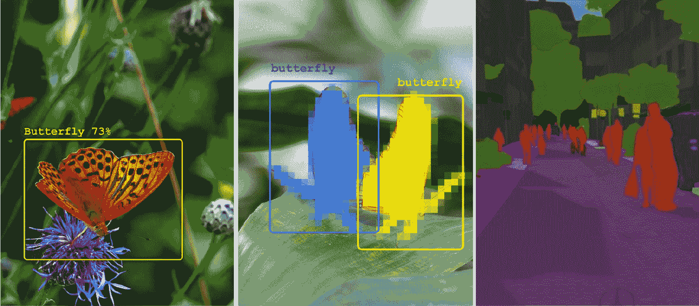
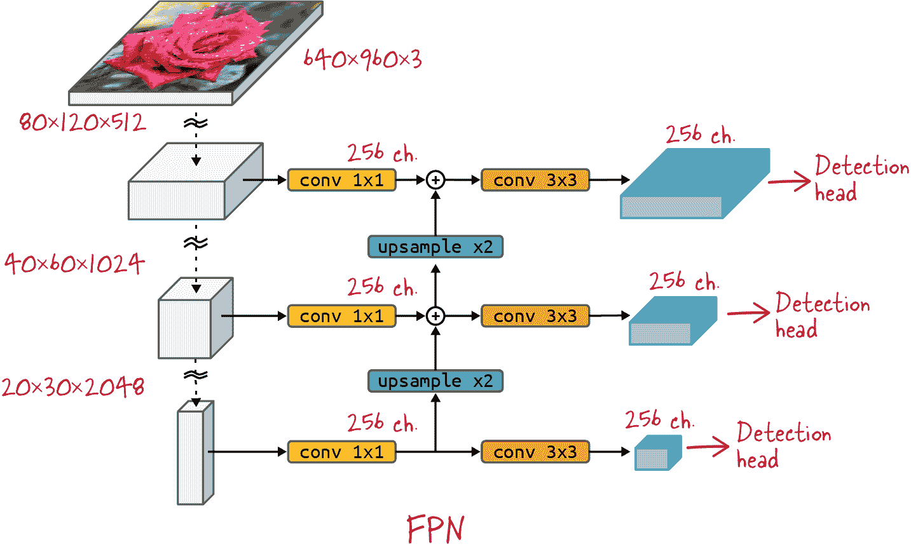

# 第四章：目标检测与图像分割

到目前为止，在本书中，我们已经看过各种机器学习架构，但仅用于解决一种类型的问题——整个图像的分类（或回归）。在本章中，我们讨论三个新的视觉问题：目标检测、实例分割和整场景语义分割（图 4-1）。其他更高级的视觉问题，如图像生成、计数、姿态估计和生成模型，将在第十一章和第十二章中涵盖。



###### 图 4-1\. 从左至右：目标检测、实例分割和整场景语义分割。图像来自[节肢动物](https://oreil.ly/sRrvU)和[城市街景](https://oreil.ly/rs9zf)数据集。

###### 提示

本章的代码位于书籍的[*04_detect_segment*](https://github.com/GoogleCloudPlatform/practical-ml-vision-book)文件夹中的 GitHub 仓库中。我们会在适当的地方提供代码示例和笔记本的文件名。

# 目标检测

对于大多数人来说，看是如此轻松，以至于当我们从眼角瞥见一只蝴蝶并转过头来欣赏它的美丽时，我们甚至不会考虑到数百万的视觉细胞和神经元在起作用，捕捉光线、解码信号，并将它们处理成越来越高级的抽象。

我们在第三章中看到了机器学习中图像识别的工作原理。然而，在该章中介绍的模型是为了将整个图像分类而构建的，它们不能告诉我们花朵在图像中的具体位置。在本节中，我们将探讨构建能够提供位置信息的机器学习模型的方法。这个任务被称为*目标检测*（图 4-2）。


###### 图 4-2\. 一个目标检测任务。来自[节肢动物数据集](https://oreil.ly/sRrvU)的图像。

实际上，卷积层确实可以识别和定位它们检测到的事物。来自第三章的卷积主干已经提取了一些位置信息。但在分类问题中，网络不利用这些信息。它们是在一个位置不重要的目标上训练的。蝴蝶的图片会在图片中的任何位置被分类为蝴蝶。相反，在目标检测中，我们将在卷积堆栈中添加元素来提取和精炼位置信息，并训练网络以达到最大精度。

最简单的方法是在卷积主干结构的末端添加一些内容，以预测检测到的对象周围的边界框。这就是 YOLO（You Only Look Once）的方法，我们将从这里开始。然而，在卷积主干结构的中间层也包含了许多重要信息。为了提取这些信息，我们将构建更复杂的架构，称为特征金字塔网络（FPNs），并使用 RetinaNet 进行说明。

在这一节中，我们将使用[节肢动物分类目标检测数据集](https://oreil.ly/sRrvU)（简称为节肢动物），该数据集在[Kaggle.com](http://kaggle.com)上免费提供。该数据集包含七个类别——鞘翅目（甲壳虫）、蛛形目（蜘蛛）、半翅目（真虫）、双翅目（飞蝇）、鳞翅目（蝴蝶）、膜翅目（蜜蜂、胡蜂和蚂蚁）和蜻蜓目（蜻蜓）——以及边界框。一些示例显示在图 4-3 中。


###### 图 4-3\. 节肢动物数据集中的一些目标检测示例。

除了 YOLO，本章还将讨论 RetinaNet 和 Mask R-CNN 架构。它们的实现可以在[TensorFlow Model Garden 官方视觉存储库](https://oreil.ly/FYKgH)中找到，我们将使用存储库中“beta”文件夹内的最新实现。

展示如何在诸如节肢动物之类的自定义数据集上应用这些检测模型的示例代码可以在[*04_detect_segment* on GitHub](https://github.com/GoogleCloudPlatform/practical-ml-vision-book/tree/master/04_detect_segment)中找到，对应于第四章。

除了 TensorFlow Model Garden，还可以在[keras.io](http://keras.io)网站上找到关于 RetinaNet 的优秀的[逐步实现](https://oreil.ly/LWG3c)。

## YOLO

[YOLO（你只看一次）](https://arxiv.org/abs/1506.02640)是最简单的物体检测架构之一。它并非最精确，但在预测时间方面是最快的之一，因此被广泛应用于诸如安全摄像头之类的实时系统中。该架构可以基于第三章中的任何卷积主干结构进行构建。图像通过卷积堆栈处理，如同图像分类情况一样，但分类头被替换为物体检测和分类头。

YOLO 的更多最新变体架构存在（[YOLOv2](https://arxiv.org/abs/1612.08242)、[YOLOv3](https://arxiv.org/abs/1804.02767)、[YOLOv4](https://arxiv.org/abs/2004.10934)），但我们这里不会涵盖它们。我们将使用 YOLOv1 作为进入物体检测架构的第一步，因为它是最简单的。

### YOLO 网格

YOLOv1（以下简称为“YOLO”）将图像划分为一个 *N*x*M* 的网格单元格，例如 7x5（详见 图 4-4）。对于每个单元格，它尝试预测一个包围框，其中心位于该单元格中。预测的边界框可以比其起源的单元格更大；唯一的约束是框的中心必须位于单元格内的某处。

预测边界框意味着什么？让我们来看看。


###### 图 4-4\. YOLO 网格。每个网格单元预测一个包围框，其中心位于该单元格的某处。来自 [节肢动物数据集](https://oreil.ly/sRrvU) 的图像。

### 目标检测头

预测边界框涉及预测六个数值：边界框的四个坐标（例如，中心的 *x* 和 *y* 坐标，以及宽度和高度），一个置信度因子，告诉我们是否检测到了对象，最后是对象的类别（例如，“蝴蝶”）。YOLO 架构直接在它正在使用的卷积主干生成的最后特征图上执行此操作。

在 图 4-5 中，*x* 和 *y* 坐标的计算使用双曲正切（tanh）激活函数，以确保坐标落在 [–1, 1] 范围内。这些坐标将是检测框的中心相对于其所属的网格单元中心的位置。


###### 图 4-5\. YOLO 检测头为每个网格单元预测一个边界框 (x, y, w, h)，此处的置信度 C 表示在该位置检测到对象的可能性，以及对象的类别。

宽度和高度 (*w*, *h*) 的计算使用 sigmoid 激活函数，以确保落在 [0, 1] 范围内。它们表示检测框相对于整个图像的大小。这样可以使检测框大于其起源网格单元的尺寸。置信度因子 *C* 也在 [0, 1] 范围内。最后，使用 softmax 激活函数预测检测到的对象的类别。图中展示了 tanh 和 sigmoid 函数，详见 图 4-6。


###### 图 4-6\. 双曲正切和 sigmoid 激活函数。双曲正切输出在 [–1, 1] 范围内，而 sigmoid 函数输出在 [0, 1] 范围内。

一个有趣的实际问题是如何获得完全正确尺寸的特征映射。在 图 4-4 的示例中，它必须包含确切的 7 * 5 * (5 + 7) 个值。其中的 7 * 5 是因为我们选择了一个 7x5 的 YOLO 网格。然后，对于每个网格单元，需要五个值来预测一个框 (*x*, *y*, *w*, *h*, *C*)，再加上七个额外的值，因为在这个示例中，我们想将节肢动物分类为七类（鞘翅目、蜘蛛目、半翅目、双翅目、鳞翅目、膜翅目、蜻蜓目）。

如果您控制卷积堆栈，可以尝试调整它，确保最终输出正好是 7 * 5 * 12（420）个。但是，还有一种更简单的方法：将卷积主干返回的任何特征映射展平，并通过具有正好这些输出数量的全连接层进行馈送。然后，您可以将这 420 个值重塑为一个 7x5x12 的网格，并像图 4-5 中那样应用适当的激活函数。 YOLO 论文的作者认为，全连接层实际上提高了系统的准确性。

### 损失函数

在目标检测中，与任何监督学习环境一样，训练数据提供了正确答案：地面真实框及其类别。在训练期间，网络预测检测框，必须考虑框的位置和尺寸错误以及误分类错误，并惩罚未检测到任何对象的情况。然而，第一步是正确地将地面真实框与预测框配对，以便进行比较。在 YOLO 架构中，如果每个网格单元预测一个单一框，这是直接的。只要地面真实框和预测框位于同一个网格单元的中心（参见图 4-4 以便更容易理解）。

然而，在 YOLO 架构中，每个网格单元的检测框数是一个参数。它可以多于一个。如果您回顾图 4-5，您会看到每个网格单元预测 10 或 15 个（*x*，*y*，*w*，*h*，*C*）坐标而不是 5，并生成 2 或 3 个检测框而不是 1。但是，将这些预测与地面真实框配对需要更多注意。这是通过计算网格单元内所有地面真实框与所有预测框之间的交并比（IOU；参见图 4-7）来完成，并选择 IOU 最高的配对。


###### 图 4-7. IOU 指标。

总结一下，地面真实框是通过它们的中心分配给网格单元，并通过 IOU 将预测框分配给这些网格单元内的预测框。有了这些配对关系，我们现在可以计算损失的不同部分：

对象存在损失

每个具有地面真实框的网格单元计算：

<math><mrow><mrow><msub><mrow><mi>L</mi></mrow><mrow><mi>o</mi><mi>b</mi><mi>j</mi></mrow></msub><mo>=</mo><mrow><mo>(</mo><mn>1</mn><mo>−</mo><mi>C</mi><msup><mrow><mo>)</mo></mrow><mrow><mn>2</mn></mrow></msup></mrow></mrow></mrow></math>

对象缺失损失

每个不具有地面真实框的网格单元计算：

<math><mrow><mrow><msub><mrow><mi>L</mi></mrow><mrow><mi>n</mi><mi>o</mi><mi>o</mi><mi>b</mi><mi>j</mi></mrow></msub><mo>=</mo><mrow><mo>(</mo><mn>0</mn><mo>−</mo><mi>C</mi><msup><mrow><mo>)</mo></mrow><mrow><mn>2</mn></mrow></msup><mo>=</mo><msup><mrow><mi>C</mi></mrow><mrow><mn>2</mn></mrow></msup></mrow></mrow></mrow></math>

对象分类损失

每个有真实框的网格单元格计算：

<math><mrow><mrow><msub><mrow><mi>L</mi></mrow><mrow><mi>c</mi><mi>l</mi><mi>a</mi><mi>s</mi><mi>s</mi></mrow></msub><mo>=</mo><mrow><mi>c</mi><mi>r</mi><mi>o</mi><mi>s</mi><msub><mrow><mi>s</mi></mrow><mrow><mo>−</mo></mrow></msub><mi>e</mi><mi>n</mi><mi>t</mi><mi>r</mi><mi>o</mi><mi>p</mi><mi>y</mi><mrow><mo>(</mo><mi>p</mi><mo>,</mo><mover><mrow><mi>p</mi></mrow><mrow><mo>^</mo></mrow></mover><mo>)</mo></mrow></mrow></mrow></mrow></math>

其中*p̂*是预测类别概率的向量，*p*是独热编码的目标类别。

边界框损失

每个预测框和真实框的配对都会产生贡献（预测坐标标有帽子，另一个坐标是真实的）：

<math><mrow><mrow><msub><mrow><mi>L</mi></mrow><mrow><mi>b</mi><mi>o</mi><mi>x</mi></mrow></msub><mo>=</mo><mrow><mo>(</mo><mi>x</mi><mo>−</mo><mover><mrow><mi>x</mi></mrow><mrow><mo>^</mo></mrow></mover><msup><mrow><mo>)</mo></mrow><mrow><mn>2</mn></mrow></msup></mrow><mrow><mo>+</mo><mrow><mrow><mo>(</mo><mi>y</mi><mo>−</mo><mover><mrow><mi>y</mi></mrow><mrow><mo>^</mo></mrow></mover><msup><mrow><mo>)</mo></mrow><mrow><mn>2</mn></mrow></msup></mrow><mo>+</mo><msup><mrow><mo>(</mo><msqrt><mrow><mi>w</mi></mrow></msqrt><mo>−</mo><msqrt><mrow><mover><mrow><mi>w</mi></mrow><mrow><mo>^</mo></mrow></mover></mrow></msqrt><mo>)</mo></mrow><mrow><mn>2</mn></mrow></msup><mo>+</mo><mrow><mo>(</mo><msqrt><mrow><mi>h</mi></mrow></msqrt><mo>−</mo><msqrt><mrow><mover><mrow><mi>h</mi></mrow><mrow><mo>^</mo></mrow></mover></mrow></msqrt><msup><mrow><mo>)</mo></mrow><mrow><mn>2</mn></mrow></msup></mrow></mrow></mrow></mrow></mrow></math>

注意这里，盒子大小的差异是在维度的平方根上计算的。这是为了减轻大盒子的影响，大盒子往往会压倒损失。

最后，所有网格单元格的损失贡献加在一起，并带有加权因子。目标检测损失中常见的问题是，大量没有物体的单元格中的小损失最终会压倒预测有用框的孤立单元格的损失。加权损失的不同部分可以缓解这个问题。论文的作者使用了以下经验权重：

<math><mrow><mrow><mtable><mtr><mtd><msub><mrow><mi>λ</mi></mrow><mrow><mi>o</mi><mi>b</mi><mi>j</mi></mrow></msub><mo>=</mo><mn>1</mn></mtd><mtd><msub><mrow><mi>λ</mi></mrow><mrow><mi>n</mi><mi>o</mi><mi>o</mi><mi>b</mi><mi>j</mi></mrow></msub><mo>=</mo><mn>0.5</mn></mtd><mtd><msub><mrow><mi>λ</mi></mrow><mrow><mi>c</mi><mi>l</mi><mi>a</mi><mi>s</mi><mi>s</mi></mrow></msub><mo>=</mo><mn>1</mn></mtd><mtd><msub><mrow><mi>λ</mi></mrow><mrow><mi>b</mi><mi>o</mi><mi>x</mi></mrow></msub><mo>=</mo><mn>5</mn></mtd></mtr></mtable></mrow></mrow></math>

### YOLO 的限制

最大的限制是，YOLO 每个网格单元预测一个单一类别，在同一个单元中存在多种不同类型对象时效果不佳。

第二个限制是网格本身：固定的网格分辨率对模型能够执行的任务施加了强烈的空间约束。对于小物体的集合（例如一群鸟），要使 YOLO 模型表现良好，需要仔细调整网格以适应数据集。

此外，YOLO 倾向于以相对较低的精度定位对象。主要原因在于它工作在卷积堆栈的最后一个特征图上，通常这个特征图具有最低的空间分辨率，并且仅包含粗略的位置信号。

尽管存在这些限制，YOLO 架构非常简单易实现，特别是每个网格单元仅有一个检测框，这使得它成为你想要使用自己的代码进行实验时的一个不错的选择。

注意，并不是每个对象都是通过查看单个网格单元中的信息来检测的。在足够深的卷积神经网络（CNN）中，从中计算检测框的最后一个特征图中的每个值都依赖于原始图像的所有像素。

如果需要更高的准确性，可以升级到更高级别的 RetinaNet。它融合了多项改进基于基本的 YOLO 架构，并且被认为是所谓的*单阶段检测器*的技术最先进。

## RetinaNet

[RetinaNet](https://arxiv.org/abs/1708.02002)，相较于 YOLOv1，在其架构和损失设计上有多项创新。神经网络设计包括特征金字塔网络，结合了多尺度提取的信息。检测头从*锚框*开始预测框，改变边界框表示以便于训练。最后，损失创新包括焦点损失，专门为检测问题设计的损失，平滑的 L1 损失用于框回归，以及非极大值抑制。让我们依次看看这些创新。

### 特征金字塔网络

当图像经过 CNN 处理时，初始卷积层捕捉低级细节，如边缘和纹理。进一步的层将它们组合成具有更多语义价值的特征。同时，网络中的池化层降低特征图的空间分辨率（见 图 4-8）。


###### 图 4-8\. CNN 不同阶段的特征图。随着信息在神经网络中传播，其空间分辨率减少，但语义内容从低级细节到高级对象逐渐增加。

YOLO 架构仅使用最后一个特征图进行检测。它能正确识别物体，但其定位精度有限。另一种思路是尝试在每个阶段添加检测头。然而，在这种方法中，从早期特征图开始工作的检测头可能定位物体相当好，但标签化却困难重重。在这个早期阶段，图像只经过了几个卷积层，这还不足以对其进行分类。像“这是一朵玫瑰”的更高级语义信息需要数十个卷积层才能显现出来。

仍然有一种流行的检测架构叫做单次检测器（SSD），它基于这个思想。[SSD 论文的作者](https://arxiv.org/abs/1512.02325)通过将多个检测头连接到多个特征图使其成功运行，这些特征图都位于卷积堆栈的末端。

如果我们能以一种方式结合所有特征图，使其在所有尺度上都能提供良好的空间信息和语义信息，那会怎样？这可以通过添加几个附加层形成 [特征金字塔网络](https://arxiv.org/pdf/1612.03144.pdf) 来实现。图 4-9 提供了 FPN 与 YOLO 和 SSD 方法的示意图对比，而 图 4-10 则呈现了详细设计。


###### Figure 4-9\. Y   图 4-9\. YOLO、SSD 和 FPN 架构的比较，以及它们在卷积堆栈中连接检测头的位置。



###### 图 4-10\. 特征特征金字塔网络详细信息。特征图从卷积主干的各个阶段提取，并且 1x1 卷积将每个特征图压缩到相同数量的通道。上采样（最近邻）然后使它们的空间尺寸兼容，以便可以相加。最后的 3x3 卷积平滑了上采样的伪影。通常在 FPN 层中不使用激活函数。

在图 4-10 中，FPN 中发生的情况如下：在向下路径（卷积主干）中，卷积层逐渐优化特征图中的语义信息，而池化层缩小特征图的空间尺寸（图像的 *x* 和 *y* 尺寸）。在向上路径中，来自底层的包含良好高级语义信息的特征图被上采样（使用简单的最近邻算法），以便它们可以逐元素添加到堆栈中更高的特征图中。1x1 卷积用于侧向连接，将所有特征图带到相同的通道深度，并使添加成为可能。例如，[FPN 论文](https://arxiv.org/pdf/1612.03144.pdf)中在所有地方使用 256 个通道。现在生成的特征图包含所有尺度的语义信息，这是最初的目标。它们通过 3x3 卷积进一步处理，主要是为了平滑上采样的效果。

FPN 层通常没有非线性。FPN 论文的作者发现它们影响不大。

现在检测头可以获取每个分辨率的特征图，并生成框检测和分类。检测头本身可以具有多种设计，我们将在接下来的两节中进行介绍。然而，它将在不同尺度的所有特征图之间共享。这就是为什么将所有特征图带到相同的通道深度是重要的。

FPN 设计的好处在于它独立于底层卷积主干。只要您可以从中提取中间特征图，来自第三章的任何卷积堆栈都可以使用，通常在各种尺度上为四到六个。您甚至可以使用预训练的主干。典型选择是 ResNet 或 EfficientNet，它们的预训练版本可以在[TensorFlow Hub](https://tfhub.dev/)中找到。

在卷积堆栈中有多个层次，可以从中提取特征并输入到 FPN 中。对于每个期望的尺度，许多层输出相同尺寸的特征图（见前一章的图 3-26）。最佳选择是给定层块的最后一个特征图，在池化层再次减半分辨率之前输出的特征大小相似的层块。这个特征图可能包含最强的语义特征。

也可以通过额外的池化和卷积层扩展现有的预训练骨干网络，唯一目的是用于提供 FPN 的输入。这些额外的特征图通常很小，因此处理速度快。它们对应于最低的空间分辨率（参见图 4-8），因此可以改善大物体的检测。[SSD 论文](https://arxiv.org/abs/1512.02325)和[RetinaNet](https://arxiv.org/abs/1708.02002)都使用了这个技巧，稍后您将在架构图中看到（参见图 4-15)。

### 锚点

在 YOLO 架构中，检测框是相对于一组基础框计算的增量（Δ*x* = *x* - *x*[0]，Δ*y* = *y* - *y*[0]，Δ*w* = *w* - *w*[0]，Δ*h* = *h* - *h*[0]，通常被称为“增量”相对于一些基础框 *x*[0]， *y*[0]， *w*[0]， *h*[0]，因为希腊字母Δ，通常用来表示“差异”）。在这种情况下，基础框是覆盖在图像上的一个简单网格（参见图 4-4）。

较新的架构通过明确定义一组所谓的“锚点框”，具有各种长宽比和尺度（例如图 4-11 中的示例）。预测再次是关于锚点位置和尺寸的小变化。目标是帮助神经网络预测接近零的小值而不是大值。事实上，神经网络能够解决复杂的非线性问题，因为它们在各层之间使用非线性激活函数。然而，大多数激活函数（sigmoid、ReLU）只在接近零时表现出非线性行为。这就是为什么神经网络在预测接近零的小值时表现最佳的原因，也是为什么相对于锚点框预测检测框作为小增量是有帮助的。当然，这仅在有足够多的各种尺寸和长宽比的锚点框时才有效，这些锚点框能够与任何物体检测框（通过最大 IOU）配对得非常接近其位置和尺寸。


###### 图 4-11\. 展示了用于预测检测框的各种大小和长宽比的锚框示例。图片来自[节肢动物数据集](https://oreil.ly/sRrvU)。

我们将详细描述 RetinaNet 架构中采用的方法，以此为例。RetinaNet 使用了九种不同类型的锚点：

+   三种不同的长宽比：2:1, 1:1, 1:2

+   三种不同尺寸：2⁰, 2^⅓, 2^⅔ (≃ 1, 1.3, 1.6)

它们在图 4-12 中展示。


###### 图 4-12\. RetinaNet 使用的九种不同锚点类型。三种长宽比和三种不同尺寸。

锚点连同由 FPN 计算的特征图，是 RetinaNet 中计算检测的输入。操作顺序如下：

+   FPN 将输入图像减少到五个特征图（参见 图 4-10）。

+   每个特征图用于相对于图像中均匀分布的位置的锚点预测边界框。例如，大小为 4x6 且具有 256 通道的特征图将使用图像中的 24（4 * 6）个锚点位置（参见 图 4-13）。

+   检测头使用多个卷积层将 256 通道特征图转换为确切的 9 * 4 = 36 个通道，从而每个位置产生 9 个检测框。每个检测框的四个数字表示相对于锚点的中心 (*x*, *y*)、宽度和高度的增量。计算从特征图到检测的层序列如 图 4-15 所示。

+   最后，每个 FPN 的特征图由于对应于图像中的不同尺度，将使用不同尺度的锚框。


###### 图 4-13\. RetinaNet 检测头的概念视图。特征图中的每个空间位置对应于图像中相同点处的一系列锚点。为了清晰起见，图示仅显示了三个这样的锚点，但 RetinaNet 每个位置会有九个。

锚点本身在输入图像上均匀分布，并且针对特征金字塔的每个级别进行了适当的尺寸设置。例如，在 RetinaNet 中，使用以下参数：

+   特征金字塔有五个级别，对应于骨干网中的 P[3]、P[4]、P[5]、P[6] 和 P[7] 尺度。尺度 P*[n]* 表示特征图比输入图像缩小了 2*^n* 倍（参见 图 4-15 的完整 RetinaNet 视图）。

+   锚框基准尺寸分别为 32x32、64x64、128x128、256x256 和 512x512 像素，在每个特征金字塔级别上分别为 (= 4 * 2*^n*, 若 *n* 是尺度级别)。

+   在特征金字塔的每个特征图中的每个空间位置都考虑了锚框，这意味着在每个特征金字塔级别上，锚框在输入图像上每 8、16、32、64 或 128 像素之间均匀分布（= 2*^n*, 若 *n* 是尺度级别）。

因此，最小的锚框为 32x32 像素，而最大的为 812x1,624 像素。

###### 注意

锚框设置必须针对每个数据集进行调整，以便与训练数据中实际发现的检测框特征相对应。通常通过调整输入图像的大小而不是改变锚框生成参数来完成这一点。然而，在具有许多小检测或者相反大部分为大对象的特定数据集上，可能需要直接调整锚框生成参数。

最后一步是计算检测损失。为此，必须将预测的检测框与地面真实框配对，以便评估检测错误。

地面真实框分配给锚框基于计算出的每个输入图像中每组框之间的 IOU 度量。所有成对的 IOU 都计算并排列成一个*N*行和*M*列的矩阵，其中*N*是地面真实框的数量，*M*是锚框的数量。然后按列分析该矩阵（见图 4-14）：

+   如果一个锚框的列中最大 IOU 大于 0.5，则该锚框被分配给其列中具有最大 IOU 的地面真实框。

+   一个锚框如果其列中没有大于 0.4 的 IOU 值，则被分配为不检测任何东西（即图像的背景）。

+   此时任何未分配的锚框都标记为在训练期间忽略。这些是具有中间区域 IOU 在 0.4 和 0.5 之间的锚框。

现在每个地面真实框都与一个锚框精确配对，可以计算框预测、分类以及相应的损失。


###### 图 4-14\. 计算所有地面真实框和所有锚框之间的成对 IOU 度量，以确定它们的配对关系。没有与地面真实框有意义交集的锚框被称为“背景”，并且被训练以不检测任何东西。

### 架构

检测和分类头部将 FPN 中的特征图转换为类别预测和边界框变化量。特征图是三维的。它们的两个维度对应于图像的*x*和*y*维度，称为*空间维度*；第三个维度是它们的通道数。

在 RetinaNet 中，对于每个特征图中的每个空间位置，预测以下参数（其中*K*为类别数量，*B*为锚框类型数量，因此在我们的情况下*B*=9）：

+   类别预测头部预测*B* * *K*个概率，每种锚框类型预测一组概率。实际上，这为每个锚框预测一个类别。

+   检测头部预测*B* * 4 = 36 个框变量 Δ*x*, Δ*y*, Δ*w*, Δ*h*。边界框仍然通过它们的中心(*x*, *y*)以及宽度和高度(*w*, *h*)参数化。

虽然两个头部具有类似的设计，但权重不同，并且这些权重在特征金字塔的所有尺度中都是共享的。

图 4-15 展示了 RetinaNet 架构的完整视图。它使用 ResNet50（或其他）骨干网络。FPN 从骨干网络的 P[3]到 P[7,]级别提取特征，其中 P*[n]*是特征图相对于原始图像宽度和高度缩小了 2*^n*倍的级别。FPN 部分在图 4-10 中有详细描述。FPN 的每个特征图都通过分类和框回归头部。


###### 图 4-15\. RetinaNet 架构的完整视图。K 是目标类别的数量。B 是每个位置的锚框数量，在 RetinaNet 中为 9 个。

RetinaNet FPN 利用来自骨干网络的最后三个尺度级别。骨干网络通过步幅为 2 增加了 2 个额外的层次，以提供 FPN 的两个额外尺度级别。这种架构选择使 RetinaNet 避免处理非常大的特征图，这将是耗时的。增加最后两个粗糙尺度级别还改善了非常大物体的检测。

分类和框回归头部本身由一系列简单的 3x3 卷积组成。分类头部设计用于预测每个锚点的*K*个二进制分类，这也是为什么它以 sigmoid 激活结束。看起来我们允许多个标签预测每个锚点，但实际上的目标是允许分类头部输出全零，代表“背景类”，即没有检测到的情况。分类的更典型的激活函数可能是 softmax，但 softmax 函数不能输出全零。

框回归不使用激活函数结束。它计算锚框和检测框的中心坐标（*x*、*y*）、宽度和高度之间的差异。在特征金字塔的所有级别上，必须小心地允许回归器在[-1, 1]范围内工作。以下公式用于实现这一点：

+   X[pixels] = X × U × W[A] + X[A]

+   Y[pixels] = Y × U × H[A] + Y[A]

+   W[pixels] = W[A] × e^(W × V)

+   H[pixels] = H[A] × e^(H × V)

在这些公式中，X[A]、Y[A]、W[A]和 H[A]是锚框的坐标（中心坐标、宽度、高度），而 X、Y、W 和 H 是相对于锚框的预测坐标（增量）。X[pixels]、Y[pixels]、W[pixels]和 H[pixels]是预测框的实际像素坐标（中心和大小）。U 和 V 是调制因子，对应于增量相对于锚框的预期方差。预测值在[-1, 1]范围内会导致预测框的位置在锚点位置的±10%范围内，大小在其±20%范围内。

### 焦点损失（用于分类）

对于一个输入图像考虑多少个锚框？回顾图 4-15 中的例子输入图像为 640x960 像素，特征金字塔中的五个不同特征图代表了输入图像中的 12,785 个位置。每个位置有 9 个锚框，总计略超过 100K 个锚框。

这意味着每个输入图像将生成 100K 个预测框。相比之下，典型应用中每个图像通常有 0 到 20 个地面实况框。这在检测模型中造成的问题是，与实际检测的损失相比，分配给背景框（分配为检测无内容的框）的损失可能会压倒总损失。即使背景检测已经训练良好并产生了很小的损失，这个小值乘以 100K 仍可能比实际检测的检测损失大几个数量级。最终的结果是无法训练的模型。

[RetinaNet 论文](https://arxiv.org/abs/1708.02002)提出了这个问题的一个优雅解决方案：作者们调整了损失函数，使空背景的损失值大幅降低。他们称之为*焦点损失*。以下是详细信息。

我们已经看到 RetinaNet 使用 sigmoid 激活来生成类别概率。输出是一系列二元分类，每个类别一个。每个类别的概率为 0 意味着“背景”；即，在这里没有什么可以检测的。使用的分类损失是二元交叉熵。对于每个类别，它根据实际的二元类别标签 *y*（0 或 1）和预测的类别概率 *p* 使用以下公式计算：

<math><mrow><mrow><mi>C</mi><mi>E</mi><mrow><mo>(</mo><mi>y</mi><mo>,</mo><mi>p</mi><mo>)</mo><mo>=</mo><mo>−</mo><mi>y</mi><mo>⋅</mo><mi>log</mi><mo>⁡</mo><mrow><mo>(</mo><mi>p</mi><mo>)</mo><mo>−</mo><mrow><mo>(</mo><mn>1</mn><mo>−</mo><mi>y</mi><mo>)</mo><mo>⋅</mo><mi>log</mi><mo>⁡</mo><mrow><mo>(</mo><mn>1</mn><mo>−</mo><mi>p</mi><mo>)</mo></mrow></mrow></mrow></mrow></mrow></mrow></mrow></math>

焦点损失（focal loss）是稍作修改后的同一公式：

<math><mrow><mrow><mi>F</mi><mi>L</mi><mrow><mrow><mo>(</mo><mi>y</mi><mo>,</mo><mi>p</mi><mo>)</mo></mrow><mo>=</mo><mo>−</mo><mi>y</mi><mo>⋅</mo><mrow><mrow><mo>(</mo><mn>1</mn><mo>−</mo><mi>p</mi><msup><mrow><mo>)</mo></mrow><mrow><mi>γ</mi></mrow></msup></mrow><mo>⋅</mo><mi>log</mi><mo>⁡</mo><mrow><mrow><mo>(</mo><mi>p</mi><mo>)</mo></mrow><mo>−</mo><mrow><mrow><mo>(</mo><mn>1</mn><mo>−</mo><mi>y</mi><mo>)</mo></mrow><mo>⋅</mo><msup><mrow><mi>p</mi></mrow><mrow><mi>γ</mi></mrow></msup><mo>⋅</mo><mi>log</mi><mo>⁡</mo><mrow><mo>(</mo><mn>1</mn><mo>−</mo><mi>p</mi><mo>)</mo></mrow></mrow></mrow></mrow></mrow></mrow></mrow></math>

对于 *γ*=0，这就是二元交叉熵，但对于更高的 *γ* 值，行为略有不同。为简化起见，让我们只考虑不属于任何类别的背景框（即对于所有类别 *y*=0 的情况）：

<math><mrow><mrow><mi>F</mi><msub><mrow><mi>L</mi></mrow><mrow><mi>b</mi><mi>k</mi><mi>g</mi></mrow></msub><mrow><mrow><mo>(</mo><mi>p</mi><mo>)</mo></mrow><mo>=</mo><mo>−</mo><msup><mrow><mi>p</mi></mrow><mrow><mi>γ</mi></mrow></msup></mrow><mo>⋅</mo><mi>log</mi><mo>⁡</mo><mrow><mo>(</mo><mn>1</mn><mo>−</mo><mi>p</mi><mo>)</mo></mrow></mrow></mrow></math>

让我们来绘制各种*p*和*γ*值下的聚焦损失的数值（图 4-16）。

正如您在图中所见，当*γ*=2 时（发现这是一个合适的值），聚焦损失远小于常规的交叉熵损失，特别是对于*p*接近于 0 的情况。对于背景框，网络会迅速学习在所有类别上产生小的类别概率*p*。使用交叉熵损失，即使像*p*=0.1 这样明显分类为“背景”的框，仍会贡献相当数量的损失：CE(0.1) = 0.05。聚焦损失则小 100 倍：FL(0.1) = 0.0005。

使用聚焦损失函数，可以将所有锚框的损失相加，不必担心来自易于分类的背景框的成千上万个小损失会压倒总损失。


###### 图 4-16\. 各种*γ*值下的聚焦损失。当*γ*=0 时，即为交叉熵损失。对于*γ*较大的值，聚焦损失会大幅弱化易于分类的背景区域，即对于每个类别*p*接近于 0 的情况。

### 平滑 L1 损失（用于框回归）

检测框通过回归计算。对于回归，最常见的损失函数是 L1 和 L2，也称为*绝对损失*和*平方损失*。它们的公式是（计算目标值*a*和预测值*â*之间的）：

<math><mrow><mrow><mtable columnalign="left"><mtr><mtd><mi>L</mi><mn>1</mn><mrow><mo>(</mo><mi>a</mi><mo>,</mo><mover><mrow><mi>a</mi></mrow><mrow><mo>^</mo></mrow></mover><mo>)</mo></mrow><mo>=</mo><mrow><mo>|</mo><mi>a</mi><mo>−</mo><mover><mrow><mi>a</mi></mrow><mrow><mo>^</mo></mrow></mover><mo>|</mo></mrow></mtd></mtr><mtr><mtd><mi>L</mi><mn>2</mn><mrow><mo>(</mo><mi>a</mi><mo>,</mo><mover><mrow><mi>a</mi></mrow><mrow><mo>^</mo></mrow></mover><mo>)</mo><mo>=</mo><mrow><mo>(</mo><mi>a</mi><mo>−</mo><mover><mrow><mi>a</mi></mrow><mrow><mo>^</mo></mrow></mover><msup><mrow><mo>)</mo></mrow><mrow><mn>2</mn></mrow></msup></mrow></mrow></mtd></mtr></mtable></mrow></mrow></math>

L1 损失的问题在于，其梯度处处相同，这对学习并不理想。因此，对于回归任务，更倾向于使用 L2 损失，但它也存在不同的问题。在 L2 损失中，预测值和目标值之间的差异被平方，这意味着随着预测值和目标值的偏离增大，损失会变得非常大。如果数据中存在异常值，比如一些错误的数据点（例如，目标框大小错误），这将带来问题。结果是网络会试图拟合这些错误的数据点，而忽视其他一切，这也是不理想的。

两者之间的一个良好折中方案是*Huber 损失*或*平滑 L1 损失*（参见图 4-17）。它在小值处的行为类似于 L2 损失，在大值处的行为类似于 L1 损失。接近零时，其梯度特性良好，差异越大时梯度越大，因此它推动网络在犯最大错误的地方学习更多。对于大值，它变为线性而非二次，并避免被一些错误的目标值所扰乱。其公式如下：

<math><mrow><mrow><mtable><mtr><mtd columnalign="right"><msub><mrow><mi>L</mi></mrow><mrow><mi>δ</mi></mrow></msub><mrow><mrow><mo>(</mo><mi>a</mi><mo>−</mo><mover><mrow><mi>a</mi></mrow><mrow><mo>^</mo></mrow></mover><mo>)</mo></mrow><mo>=</mo><mstyle displaystyle="true" scriptlevel="0"><mrow><mfrac><mrow><mn>1</mn></mrow><mrow><mn>2</mn></mrow></mfrac></mrow></mstyle><mrow><mo>(</mo><mi>a</mi><mo>−</mo><mover><mrow><mi>a</mi></mrow><mrow><mo>^</mo></mrow></mover><msup><mrow><mo>)</mo></mrow><mrow><mn>2</mn></mrow></msup></mrow></mrow></mtd><mtd><mtext>对于</mtext><mrow><mo>|</mo><mi>a</mi><mo>−</mo><mover><mrow><mi>a</mi></mrow><mrow><mo>^</mo></mrow></mover><mo>|</mo><mo>≤</mo><mi>δ</mi></mrow></mtd></mtr><mtr><mtd columnalign="right"><mrow><mtable><mtr><mtd><msub><mrow><mi>L</mi></mrow><mrow><mi>δ</mi></mrow></msub><mo>=</mo><mi>δ</mi><mrow><mo>(</mo><mrow><mo>|</mo><mi>a</mi><mo>−</mo><mover><mrow><mi>a</mi></mrow><mrow><mo>^</mo></mrow></mover><mo>|</mo><mo>−</mo><mstyle displaystyle="true" scriptlevel="0"><mrow><mfrac><mrow><mn>1</mn></mrow><mrow><mn>2</mn></mrow></mfrac></mrow></mstyle><mi>δ</mi></mrow><mo>)</mo></mrow></mtd></mtr></mtable></mrow></mtd><mtd><mtext>否则</mtext></mtd></mtr></mtable></mrow></mrow></math>

其中 *δ* 是可调参数。*δ* 是行为从二次转线性的临界点。还有另一个公式可以避免分段定义：

<math><mrow><mrow><msub><mrow><mi>L</mi></mrow><mrow><mi>δ</mi></mrow></msub><mrow><mrow><mo>(</mo><mi>a</mi><mo>−</mo><mover><mrow><mi>a</mi></mrow><mrow><mo>^</mo></mrow></mover><mo>)</mo></mrow><mo>=</mo><msup><mrow><mi>δ</mi></mrow><mrow><mn>2</mn></mrow></msup><mrow><mo>(</mo><mrow><msqrt><mrow><mn>1</mn><mo>+</mo><mrow><mo>(</mo><mstyle displaystyle="true" scriptlevel="0"><mrow><mfrac><mrow><mi>a</mi><mo>−</mo><mover><mrow><mi>a</mi></mrow><mrow><mo>^</mo></mrow></mover></mrow><mrow><mi>δ</mi></mrow></mfrac></mrow></mstyle><msup><mrow><mo>)</mo></mrow><mrow><mn>2</mn></mrow></msup><mo>−</mo><mn>1</mn></mrow></mrow></msqrt></mrow><mo>)</mo></mrow></mrow></mrow></mrow></math>

这种备选形式与标准的 Huber 损失并不完全相同，但行为相似：对于小值是二次的，对于大值是线性的。在实践中，RetinaNet 中任一形式都能很好地运作，*δ*=1。


###### 图 4-17\. 用于回归的 L1、L2 和 Huber 损失。对于小值，期望的行为是二次的，对于大值则是线性的。Huber 损失同时具有这两种特性。

### 非最大抑制

使用大量锚框的检测网络（如 RetinaNet），通常会为每个目标框生成多个候选检测结果。我们需要一种算法为每个检测到的对象选择一个单一的检测框。

*非最大抑制*（NMS）考虑框重叠（IOU）和类别置信度，选择给定对象的最具代表性的框（图 4-18）。


###### 图 4-18\. 左侧：同一对象的多个检测结果。右侧：经过非最大抑制后，剩余的单一框。图像来源于[节肢动物数据集](https://oreil.ly/sRrvU)。

该算法采用简单的“贪婪”方法：对于每一类别，它考虑所有预测框之间的重叠（IOU）。如果两个框的重叠大于给定值*A*（IOU > *A*），则保留具有最高类别置信度的框。在类似 Python 的伪代码中，对于一给定类别：

```
def NMS(boxes, class_confidence):
    result_boxes = []
    for b1 in boxes:
        discard = False
        for b2 in boxes:
            if IOU(b1, b2) > A:
                if class_confidence[b2] > class_confidence[b1]:
                    discard = True
        if not discard:
            result_boxes.append(b1)
    return result_boxes
```

在实践中，NMS 效果非常好，但可能会有一些意外的副作用。请注意，该算法依赖于单一阈值值（*A*）。更改此值会改变框过滤，尤其是对于原始图像中相邻或重叠的对象。看一看图 4-19 中的示例。如果将阈值设为*A*=0.4，则图中检测到的两个框将被视为“重叠”，属于同一类别，且类别置信度较低的那个（左侧的那个）将被丢弃。这显然是错误的。在此图像中有两只蝴蝶需要检测，在进行 NMS 之前，两者都以高置信度被检测到。


###### 图 4-19\. 彼此接近的对象对非最大抑制算法构成问题。如果 NMS 阈值为 0.4，左侧检测到的框将被丢弃，这是错误的。图片来自[节肢动物数据集](https://oreil.ly/sRrvU)。

将阈值设置得更高会有所帮助，但如果太高，算法将无法合并对应于同一对象的框。此阈值的通常值为*A*=0.5，但仍会导致彼此接近的对象被检测为一个。

基本 NMS 算法的轻微变体称为[*Soft-NMS*](https://arxiv.org/abs/1704.04503)。它不完全移除非最大重叠框，而是通过因子降低它们的置信度分数：

<math><mrow><mrow><mi mathvariant="italic">exp</mi><mo>⁡</mo><mrow><mrow><mo>(</mo><mo>−</mo><mstyle displaystyle="true" scriptlevel="0"><mrow><mfrac><mrow><mi>I</mi><mi>O</mi><msup><mrow><mi>U</mi></mrow><mrow><mn>2</mn></mrow></msup></mrow><mrow><mi>σ</mi></mrow></mfrac></mrow></mstyle><mo>)</mo></mrow></mrow></mrow></mrow></math>

*σ*是调整 Soft-NMS 算法强度的调整因子。典型值为*σ*=0.5\. 该算法通过考虑给定类别的置信度得分最高的框（*max box*），并将所有其他框的分数减少该因子来应用。然后将最大框放在一边，并在剩余的框上重复操作，直到没有框剩余。

对于不重叠的框（IOU=0），此因子为 1\. 不重叠最大框的置信度因子因此不受影响。随着框与最大框的重叠程度增加，这个因子会逐渐但连续地减小。高度重叠的框（IOU=0.9）其置信度因子会大幅度减少（×0.2），这是预期的行为，因为它们与最大框重叠，我们希望摆脱它们。

由于 Soft-NMS 算法不丢弃任何框，因此基于类别置信度使用第二个阈值来实际修剪检测列表。

Soft-NMS 对来自图 4-19 的例子的影响显示在图 4-20 中。


###### 图 4-20\. Soft-NMS 处理的彼此接近的对象。左侧的检测框未被删除，但其置信度因子从 78%降低到 55%。图片来自[节肢动物数据集](https://oreil.ly/sRrvU)。

###### 注意

在 TensorFlow 中，有两种非最大抑制的风格可用。标准 NMS 称为`tf.image.non_max_suppression`，而 Soft-NMS 称为`tf.image.non_max_suppression_with_scores`。

### 其他考虑事项

为了减少所需的数据量，通常使用预训练的主干网络。

分类数据集比目标检测数据集更容易组合。这就是为什么现成的分类数据集通常比目标检测数据集大得多。使用来自分类器的预训练骨干允许您将通用的大型分类数据集与特定任务的目标检测数据集结合起来，并获得更好的目标检测器。

预训练是在分类任务上完成的。然后，移除分类头，并添加随机初始化的 FPN 和检测头。实际的目标检测训练是通过训练所有权重来完成的，这意味着骨干将进行微调，而 FPN 和检测头则从头开始训练。

由于检测数据集往往较小，数据增强（我们将在第六章中详细介绍）在训练中起着重要作用。基本的数据增强技术是从训练图像中随机裁剪固定大小的区域，并使用随机的缩放因子（见图 4-21）。通过适当调整目标边界框，这使您可以训练网络，使同一对象在图像中的不同位置、不同尺度和不同背景部分可见。


###### 图 4-21\. 目标检测训练的数据增强。从每个训练图像中随机裁剪固定大小的图像，可能具有不同的缩放因子。目标框坐标相对于新边界重新计算。这提供了更多的训练图像和来自相同初始训练数据的更多对象位置。图像来自[节肢动物数据集](https://oreil.ly/sRrvU)。

这种技术的一个实际优势是它还为神经网络提供了固定大小的训练图像。您可以直接在由不同大小和长宽比图像组成的训练数据集上进行训练。数据增强会处理将所有图像调整到相同大小的工作。

最终，推动训练和超参数调整的是指标。目标检测问题已经成为多个大规模竞赛的主题，其中检测指标已经得到了精心标准化；这个主题在“目标检测的指标”中有详细介绍，位于第八章。

现在我们已经看过目标检测，让我们转向另一类问题：图像分割。

# 分割

目标检测找到物体周围的边界框并对其进行分类。*实例分割* 对于每个检测到的对象，添加一个像素掩码，显示对象的形状。*语义分割* 则不检测特定的对象实例，而是将图像的每个像素分类为“道路”、“天空”或“人”等类别。

## Mask R-CNN 和实例分割

YOLO 和 RetinaNet 是我们在前一节中介绍的单次检测器的示例。一张图像只需经过它们一次即可生成检测结果。另一种方法是使用第一个神经网络提出对象可能的位置进行检测，然后使用第二个网络对这些提议的位置进行分类和微调。这些架构被称为*区域提议网络*（RPNs）。

它们往往比单次检测器更复杂，因此速度较慢，但也更准确。基于原始“带有 CNN 特征的区域”理念，有一长串的 RPN 变种：[R-CNN](https://arxiv.org/abs/1311.2524), [Fast R-CNN](https://arxiv.org/abs/1504.08083), [Faster R-CNN](https://arxiv.org/abs/1506.01497)，等等。截至撰写本文时，最先进的是[Mask R-CNN](https://arxiv.org/abs/1703.06870)，这也是我们接下来要深入探讨的架构。

了解 Mask R-CNN 等架构的重要性主要不在于它们略微优越的准确性，而在于它们可以扩展到执行实例分割任务。除了预测围绕检测到的对象的边界框外，它们还可以训练以预测它们的轮廓——即找到每个检测到的对象所属的每个像素（图 4-22）。当然，训练它们仍然是一个监督训练任务，训练数据将必须包含所有对象的地面真实分割掩码。不幸的是，与简单的目标检测数据集相比，生成掩码需要更多时间，因此实例分割数据集更难找到。


###### 图 4-22\. 实例分割涉及检测物体并找到属于每个物体的所有像素。图像中的物体被着色以形成像素掩码。图片来自[节肢动物数据集](https://oreil.ly/sRrvU)。

让我们详细看看 RPNs，首先分析它们如何执行经典目标检测，然后如何扩展它们进行实例分割。

### 区域提议网络

RPN 是一个简化的单次检测网络，只关心两类：对象和背景。在数据集中标记为“对象”的是任何被标记为该类的东西（任何类），而“背景”是不包含对象的框的指定类别。

一个 RPN 可以使用类似于我们之前查看的 RetinaNet 设置的架构：一个卷积主干网络，一个特征金字塔网络，一组锚定框和两个头部。一个头部用于预测框，另一个用于对其进行分类，作为对象或背景（我们尚未预测分割掩码）。

RPN 有其自己的损失函数，从稍微修改的训练数据集中计算：任何地面真实对象的类别都被替换为单一类别“对象”。与 RetinaNet 类似，用于盒子的损失函数是 Huber 损失。对于类别，由于这是二元分类，二元交叉熵是最佳选择。

RPN 预测的框然后经过非极大值抑制。按照它们被视为框提议或感兴趣区域（ROIs）的“对象”概率排序的前 *N* 个框。*N* 通常约为一千，但如果快速推断很重要，则可以少至 50。ROIs 也可以通过最小“对象”分数或最小尺寸进行过滤。在 TensorFlow 模型园的实现中，即使默认设置为零，这些阈值也是可用的。坏的 ROIs 仍然可以被分类为“背景”并在下一阶段被拒绝，所以在 RPN 级别放行它们不是一个大问题。

一个重要的实际考虑是，如果需要的话，RPN 可以简单快速（参见图 4-23 的示例）。它可以直接使用主干网络的输出，而不是使用 FPN，并且其分类和检测头可以使用较少的卷积层。其目标仅是计算可能对象周围的近似 ROIs。它们将在下一步中进行细化和分类。


###### 图 4-23\. 简单的区域提议网络。从卷积主干网络输出的数据通过一个两类分类头（对象或背景）和一个盒子回归头进行处理。B 是每个位置的锚框数量（通常是三个）。也可以使用 FPN。

例如，在 TensorFlow 模型园的 Mask R-CNN 实现中，在其 RPN 中使用了 FPN，但每个位置只使用了三个锚点，纵横比分别为 0.5、1.0 和 2.0，而不是 RetinaNet 使用的每个位置九个锚点。

### R-CNN

现在我们有了一组提议的感兴趣区域。接下来呢？

在概念上，R-CNN 的想法（图 4-24）是沿着 ROIs 裁剪图像并再次通过主干网路运行裁剪后的图像，这次附带一个完整的分类头来对对象进行分类（在我们的例子中，可以是“蝴蝶”，“蜘蛛”等）。


###### 图 4-24\. R-CNN 的概念视图。图像通过主干网路（backbone）两次传递：第一次生成感兴趣区域（ROIs），第二次对这些 ROIs 中的内容进行分类。图片来自 [节肢动物数据集](https://oreil.ly/sRrvU)。

在实践中，这种方法太慢了。RPN 可以生成大约 50 到 2,000 个建议的 ROIs，如果再次全部通过骨干网络运行将是一项繁重的工作。与其裁剪图像，更明智的做法是直接裁剪特征图，然后在结果上运行预测头部，如图 4-25 所示。


###### 图 4-25\. 更快的 R-CNN 或 Mask R-CNN 设计。如前所述，骨干网络生成一个特征图，RPN 从中预测感兴趣的区域（仅显示结果）。然后将 ROIs 映射回特征图，并从中提取特征发送到预测头部进行分类等。图片来源于 [Arthropods 数据集](https://oreil.ly/sRrvU)。

当使用 FPN 时，这会稍微复杂些。特征提取仍然在给定的特征图上执行，但在 FPN 中有几个特征图可供选择。因此，ROI 必须首先分配给最相关的 FPN 级别。分配通常使用以下公式进行：

<math><mrow><mrow><mi>n</mi><mo>=</mo><mi>f</mi><mi>l</mi><mi>o</mi><mi>o</mi><mi>r</mi><mrow><mo>(</mo><msub><mrow><mi>n</mi></mrow><mrow><mn>0</mn></mrow></msub><mo>+</mo><msub><mrow><mi mathvariant="italic">log</mi><mo>⁡</mo></mrow><mrow><mn>2</mn></mrow></msub><mrow><mo>(</mo><msqrt><mrow><mi>w</mi><mi>h</mi></mrow></msqrt><mo>/</mo><mn>224</mn><mo>)</mo></mrow><mo>)</mo></mrow></mrow></mrow></math>

这里的 *w* 和 *h* 分别是 ROI 的宽度和高度，*n*[0] 是 FPN 级别，典型的锚框大小最接近于 224\. 这里，*floor* 表示向最负数方向取整。例如，以下是典型的 Mask R-CNN 设置：

+   五个 FPN 级别，P[2]、P[3]、P[4]、P[5] 和 P[6]（提醒：级别 P*[n]* 表示比输入图像宽度和高度小 2*^n* 倍的特征图）

+   在它们各自的级别上的锚框大小为 32x32、64x64、128x128、256x256 和 512x512（与 RetinaNet 中相同）

+   *n*[0] = 4

通过这些设置，我们可以验证，例如 80x160 像素的 ROI 将被分配到 P[3] 级别，而 200x300 的 ROI 将被分配到 P[4] 级别，这是合理的。

### ROI 重采样（ROI alignment）

在提取对应于 ROIs 的特征图时需要特别小心。必须正确地提取和重采样特征图。Mask R-CNN 论文的作者们发现，在此过程中的任何舍入误差都会对检测性能产生不利影响。他们称其精确的重采样方法为 *ROI alignment*。

例如，假设一个 200x300 像素的 ROI。它将被分配到 FPN 级别 P[4]，其相对于 P[4] 特征图的大小为 (200 / 2⁴, 300 / 2⁴) = (12.5, 18.75)。这些坐标不应该被舍入。其位置也是如此。

P[4] 特征图中的这个 12.5x18.75 区域包含的特征然后必须被采样和聚合（使用最大池化或平均池化）成一个新的特征图，通常大小为 7x7。这是一个众所周知的数学操作，称为*双线性插值*，我们在这里不详细讨论它。重要的是要记住，在这里马虎会降低性能。

### 类别和边界框预测

模型的其余部分非常标准。提取的特征通过多个预测头并行处理——在这种情况下：

+   一个分类头，为由 RPN 提出的每个对象分配一个类别，或将其分类为背景

+   进一步调整边界框的框修正头

为了计算检测和分类损失，使用与 RetinaNet 中描述的相同目标框分配算法。框损失也相同（Huber 损失）。分类头使用 softmax 激活，并添加一个特殊的“背景”类。在 RetinaNet 中，这是一系列二元分类。两者都有效，这个实现细节并不重要。总训练损失是最终框和分类损失的总和，以及 RPN 的框和分类损失。

类别和检测头的确切设计稍后给出，在图 4-30 中。它们与 RetinaNet 中使用的非常相似：一系列直接的层，在 FPN 的所有级别之间共享。

Mask R-CNN 添加了第三个预测头部，用于对对象的每个像素进行分类。其结果是一个像素掩模，描绘了对象的轮廓（见图 4-19）。如果训练数据集包含相应的目标掩模，则可以使用它。然而，在我们解释它的工作原理之前，我们需要介绍一种新的卷积类型，它能够创建图像而不是仅仅过滤和提炼它们：转置卷积。

### 转置卷积

*转置卷积*，有时也称为*反卷积*，执行可学习的上采样操作。常规的上采样算法如最近邻上采样或双线性插值是固定操作。而转置卷积则涉及可学习的权重。

###### 注意

名称“转置卷积”来源于卷积层的矩阵表示中的事实，我们在本书中未涵盖，即使用与普通卷积相同的卷积矩阵进行转置卷积。

图 4-26 中描绘的转置卷积具有单个输入和单个输出通道。理解它的最佳方法是想象它在输出画布上用刷子绘画。刷子是一个 3x3 的滤波器。输入图像的每个值都通过滤波器投射到输出上。数学上，3x3 滤波器的每个元素都与输入值相乘，结果加到输出画布上已有的内容上。然后在下一个位置重复操作：在输入中移动 1，输出中使用可配置步长（本例中为 2）。大于 1 的步长会导致上采样操作。最常见的设置是步长为 2，使用 2x2 滤波器，或步长为 3，使用 3x3 滤波器。

如果输入是具有多个通道的特征图，则对每个通道独立应用相同的操作，每次使用一个新的滤波器；然后将所有输出元素逐元素相加，生成单个输出通道。

当然，可以在同一特征图上多次重复此操作，每次使用新的滤波器集，从而生成具有多个通道的特征图。

对于多通道输入和多通道输出，转置卷积的权重矩阵形状如图 4-27 所示。顺便说一句，这与常规卷积层的形状相同。


###### 图 4-26\. 转置卷积。原始图像的每个像素（顶部）都乘以一个 3x3 的滤波器，并将结果加到输出上。在步长为 2 的转置卷积中，输出窗口对每个输入像素移动 2 步，从而创建一个更大的图像（移动的输出窗口用虚线轮廓描绘）。


###### 图 4-27\. 转置卷积层的权重矩阵，有时也称为“反卷积”。底部是本章模型将使用的反卷积层的示意符号。

### 实例分割

让我们回到 Mask R-CNN 及其第三个预测头，用于对对象的各个像素进行分类。输出是描绘对象轮廓的像素掩码（参见图 4-22）。

Mask R-CNN 和其他 RPN 一次处理一个 ROI，相当有可能该 ROI 确实有趣，因此可以对每个 ROI 执行更多工作并提高精度。实例分割就是这样一个任务。

实例分割头部使用转置卷积层将特征图上采样为一个训练成与检测到的对象轮廓相匹配的黑白图像。

图 4-30 展示了完整的 Mask R-CNN 架构。


###### 图 4-30\. Mask R-CNN 架构。N 是由 RPN 提出的 ROIs 数量，K 是类别数；“deconv” 表示转置卷积层，用于上采样特征图以预测目标掩膜。

注意，掩膜头为每个类别生成一个掩膜。这似乎有些冗余，因为还有一个单独的分类头。为什么为一个对象预测 *K* 个掩膜？事实上，这种设计选择增加了分割精度，因为它允许分割头部学习有关对象的类别特定提示。

另一个实施细节是特征图对 ROIs 的重新采样和对齐实际上执行了两次：一次是用于分类和检测头部的 7x7x256 输出，再次是使用不同设置（重新采样为 14x14x256），专门用于掩膜头以提供更多详细信息。

分割损失是简单的逐像素二元交叉熵损失，应用于预测的掩膜在重新缩放和上采样到与地面实况掩膜相同坐标后。请注意，在损失计算中仅考虑预测类别的预测掩膜。计算其他错误类别的掩膜将被忽略。

现在我们完全理解了 Mask R-CNN 的工作原理。需要注意的一点是，尽管 R-CNN 家族的检测器都进行了改进，但 Mask R-CNN 现在在名义上只是一个“双通道”检测器。输入图像实际上只通过系统一次。该架构仍然比 RetinaNet 慢，但实现了稍微更高的检测精度，并增加了实例分割。

还存在一种扩展自 RetinaNet 的模型，称为 [RetinaMask](https://arxiv.org/abs/1901.03353)，但其性能不如 Mask R-CNN。有趣的是，论文指出，添加掩膜头和相关损失实际上提高了边界框检测的准确性（另一个头部）。类似的效果可能也解释了 Mask R-CNN 的一些改进精度。

Mask R-CNN 方法的一个局限性是预测的对象掩膜分辨率相对较低：28x28 像素。类似但不完全等效的语义分割问题已经通过高分辨率方法解决。我们将在下一节中探讨这个问题。

## U-Net 和语义分割

在语义分割中，目标是将图像中的每个像素分类到全局类别，如“道路”、“天空”、“植被”或“人”（见 图 4-31）。对象的个别实例，如个别人，未分隔。整个图像中所有“人”像素都属于同一“段”。


###### 图 4-31\. 在语义图像分割中，图像中的每个像素都被分配一个类别（如“道路”、“天空”、“植被”或“建筑”）。请注意，例如，“人”是整个图像中的一个单一类别。来自 [Cityscapes](https://www.cityscapes-dataset.com) 的图像。

对于语义图像分割，一个简单且通常足够的方法称为 [U-Net](https://oreil.ly/yrwBW)。U-Net 是一个卷积网络架构，专为生物医学图像分割设计（见 图 4-32），并在 2015 年的细胞跟踪竞赛中获胜。


###### 图 4-32\. U-Net 架构旨在分割生物医学图像，例如这些显微镜细胞图像。来自 [Ronneberger et al., 2015](https://oreil.ly/yrwBW) 的图像。

U-Net 架构在 图 4-33 中表示。U-Net 包括一个编码器，将图像降采样为编码（架构的左侧），以及一个镜像的解码器，将编码上采样回所需的掩模（架构的右侧）。解码器块具有多个跳过连接（在中心显示的水平箭头），直接连接从编码器块复制特征。这些跳过连接将特定分辨率的特征从编码器直接传递到解码器，并按通道将它们串联在一起。这样做可以将编码器各级别的语义信息直接引入解码器。 （注意：由于编码器和解码器相应级别的特征图大小可能略有不对齐，因此可能需要在跳过连接上进行裁剪。实际上，U-Net 使用所有卷积操作时没有填充，这意味着每一层的边界像素都会丢失。不过，这种设计选择并非必须，也可以使用填充。）


###### 图 4-33\. U-Net 架构由镜像编码器和解码器块组成，当如此展示时呈现出 U 形。跳过连接沿深度轴（通道）串联特征图。K 是目标类别数量。

### 图像和标签

为了说明 U-Net 图像分割，我们将使用 [Oxford 宠物数据集](https://oreil.ly/GNyKx)，其中每个输入图像都包含标签掩模，如 图 4-34 所示。该标签是一个图像，其中像素根据它们是背景、对象轮廓还是对象内部而被分配为三个整数值之一。


###### 图 4-34\. Oxford 宠物数据集的训练图像（顶部行）和标签（底部行）。

我们将这三个像素值视为类标签的索引，并训练网络进行多类分类：

```
model = ...
model.compile(optimizer='adam',
    loss=tf.keras.losses.SparseCategoricalCrossentropy(from_logits=True),
    metrics=['accuracy'])
model.fit(...)
```

完整的代码可以在 GitHub 上的[*04b_unet_segmentation.ipynb*](https://github.com/GoogleCloudPlatform/practical-ml-vision-book/blob/master/04_detect_segment/04b_unet_segmentation.ipynb)中找到。

### 架构

从头开始训练 U-Net 架构需要大量可训练参数。如“其他考虑”中讨论的那样，对于对象检测和分割等任务，标记数据集很困难。因此，为了有效使用标记数据，最好使用预训练的主干网络，并为编码器块使用迁移学习。正如第三章中所述，我们可以使用预训练的 MobileNetV2 来创建编码器：

```
 base_model = tf.keras.applications.MobileNetV2(
    input_shape=[128, 128, 3], include_top=False)
```

解码器侧将包括上采样层，以恢复到所需的掩模形状。解码器还需要来自编码器特定层的特征图（跳跃连接）。我们需要的 MobileNetV2 模型的层可以按名称获取如下：

```
layer_names = [
    'block_1_expand_relu',   # 64x64
    'block_3_expand_relu',   # 32x32
    'block_6_expand_relu',   # 16x16
    'block_13_expand_relu',  # 8x8
    'block_16_project',      # 4x4
]
base_model_outputs = [base_model.get_layer(name).output for name in layer_names]
```

U-Net 架构的“下堆栈”或左侧包括图像作为输入，以及这些层作为输出。我们正在进行迁移学习，因此整个左侧不需要调整权重：

```
down_stack = tf.keras.Model(inputs=base_model.input,
                            outputs=base_model_outputs,
                            name='pretrained_mobilenet')
down_stack.trainable = False
```

在 Keras 中，可以使用`Conv2DTranspose`层来实现上采样。我们还在每个上采样步骤中添加批量归一化和非线性：

```
def upsample(filters, size, name):
  return tf.keras.Sequential([
     tf.keras.layers.Conv2DTranspose(filters, size,
                                     strides=2, padding='same'),
     tf.keras.layers.BatchNormalization(),
     tf.keras.layers.ReLU()
  ], name=name)

up_stack = [
    upsample(512, 3, 'upsample_4x4_to_8x8'),
    upsample(256, 3, 'upsample_8x8_to_16x16'),
    upsample(128, 3, 'upsample_16x16_to_32x32'),
    upsample(64, 3,  'upsample_32x32_to_64x64')
]
```

解码器的每个上堆栈阶段都与编码器的相应层连接起来：

```
for up, skip in zip(up_stack, skips):
    x = up(x)
    concat = tf.keras.layers.Concatenate()
    x = concat([x, skip])
```

### 训练

我们可以使用 Keras 回调在几个选定的图像上显示预测：

```
class DisplayCallback(tf.keras.callbacks.Callback):
  def on_epoch_end(self, epoch, logs=None):
      show_predictions(train_dataset, 1)

model.fit(train_dataset, ...,
          callbacks=[DisplayCallback()])
```

这样做在牛津宠物数据集上的结果显示在图 4-35 中。请注意，模型从垃圾（顶部行）开始，正如人们所预期的那样，但然后学会了哪些像素对应于动物，哪些像素对应于背景。


###### 图 4-35\. 在模型训练时，输入图像上的预测掩模逐步改善。

然而，由于模型训练为独立预测每个像素为背景、轮廓或内部，我们看到诸如未闭合区域和不连通像素等伪影。模型没有意识到与猫对应的区域应该是封闭的。这就是为什么这种方法主要用于不需要连续性的图像上，例如图 4-31 中的示例，其中“道路”、“天空”和“植被”段经常有不连续性。

应用示例包括自动驾驶算法，用于检测道路。另一个是卫星图像，其中使用 U-Net 架构解决了区分云与雪的难题；两者都是白色的，但雪覆盖是有用的地面信息，而云的遮挡意味着需要重新拍摄图像。

# 概要

在本章中，我们探讨了目标检测和图像分割方法。我们从 YOLO 开始，考虑了其局限性，然后讨论了 RetinaNet，它在架构和使用的损失方面对 YOLO 进行了创新。我们还讨论了 Mask R-CNN 用于实例分割和 U-Net 用于语义分割。

在接下来的章节中，我们将更深入地研究计算机视觉流程的不同部分，使用简单的迁移学习图像分类架构作为我们的核心模型，该架构源自第三章。无论是骨干架构还是解决的问题，流程步骤都保持不变。
