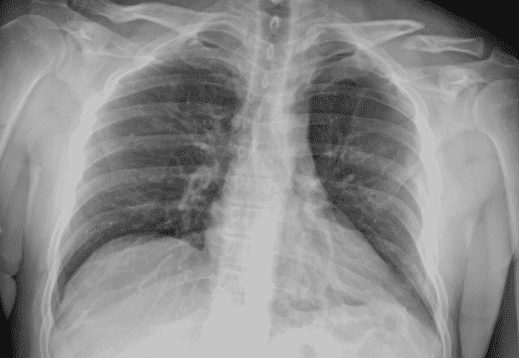
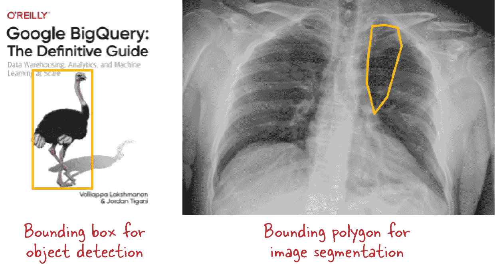

# 第五章：创建视觉数据集

要对图像进行机器学习，我们需要图像。在我们在第四章中查看的使用案例中，绝大多数是用于监督式机器学习。对于这样的模型，我们还需要正确的答案，或者*标签*，以训练 ML 模型。如果您打算训练无监督 ML 模型或类似 GAN 或自编码器的自监督模型，则可以省略标签。在本章中，我们将探讨如何创建由图像和标签组成的机器学习数据集。

###### 提示

本章的代码位于书籍的 *05_create_dataset* 文件夹中的[GitHub 存储库](https://github.com/GoogleCloudPlatform/practical-ml-vision-book)。我们将在适当的情况下提供代码示例和笔记本的文件名。

# 收集图像

在大多数 ML 项目中，第一阶段是收集数据。数据收集可以通过多种方式进行：在交通路口安装摄像机、连接到数字目录以获取汽车零部件的照片、购买卫星图像档案等。它可以是后勤活动（安装交通摄像机）、技术活动（构建与目录数据库的软件连接器）或商业活动（购买图像档案）。

## 照片

照片是图像数据的最常见来源之一。这些可以包括来自社交媒体和其他来源的照片，以及由永久安装的摄像机在受控条件下拍摄的照片。

在收集图像时我们需要做出的第一个选择是摄像机的放置位置以及图像的大小和分辨率。显然，图像必须框住我们感兴趣的内容——例如，安装在交通路口拍摄的摄像机需要能够无障碍地看到整个路口。

直觉上，似乎通过在最高分辨率图像上训练可以得到最高准确率的模型，因此我们应该尽力以最高分辨率收集数据。然而，高分辨率图像也伴随着一些缺点：

+   更大的图像将需要更大的模型——卷积模型每一层中的权重数量与输入图像的尺寸成比例。因此，对 256x256 图像训练模型所需的参数数量是对 128x128 图像的四倍，因此训练时间更长，需要更多的计算能力和额外的内存。

+   我们训练 ML 模型的机器具有有限的内存（RAM），因此图像尺寸越大，批处理中可以包含的图像数量就越少。通常情况下，更大的批处理大小会导致更平滑的训练曲线。因此，大图像在准确性方面可能适得其反。

+   更高分辨率的图像，特别是在室外和低光环境下拍摄的图像，可能会有更多噪音。将图像平滑处理到较低分辨率可能会导致更快的训练和更高的准确性。

+   收集和保存高分辨率图像所需的时间比收集和保存低分辨率图像所需的时间长。因此，为了捕捉高速动作，可能需要使用较低分辨率的图像。

+   更高分辨率的图像传输时间更长。因此，如果您在边缘收集图像并将其发送到云端进行推断，可以通过使用更小、低分辨率的图像来加快推断速度。

因此建议使用最高分辨率，该分辨率由图像的噪声特性和机器学习基础设施预算决定。不要降低分辨率，以至于无法解析感兴趣的对象。

通常情况下，值得使用预算允许的最高质量相机（例如镜头、灵敏度等），这样可以简化许多计算机视觉问题，例如预测时使用的图像始终保持清晰，白平衡保持一致，图像噪声的影响最小。一些问题可以通过图像预处理来解决（图像预处理技术将在第六章中介绍），但最好的方法是拥有没有这些问题的图像，而不是在数据采集后进行修正。

相机通常可以以压缩（例如 JPEG）或未压缩（例如 RAW）格式保存照片。在保存 JPEG 照片时，通常可以选择质量。较低质量和较低分辨率的 JPEG 文件压缩效果更好，因此存储成本更低。如前所述，低分辨率图像还将减少计算成本。由于存储费用相对于计算来说较低，我们建议选择高质量的 JPEG（95%以上）并以较低分辨率存储它们。

###### 注意

您可以使用的最低分辨率取决于问题的性质。如果您试图分类景观照片以确定其是水域还是陆地，则可能可以使用 12x16 像素的图像。如果您的目标是识别这些景观照片中的树木类型，则可能需要像素足够小，能够清晰地捕捉叶子的形状，因此可能需要 768x1024 像素的图像。

仅在您的图像由人类生成的内容（例如 CAD 图纸，其中 JPEG 压缩的模糊边缘可能导致识别问题）时才使用未压缩图像。

## 图像

许多仪器（X 射线、MRI、光谱仪、雷达、激光雷达等）创建空间的 2D 或 3D 图像。X 射线是三维物体的投影，可以视为灰度图像（见图 5-1）。而典型的照片包含三个通道（红、绿、蓝），这些图像只有一个通道。



###### 图 5-1. 胸部 X 射线可以视为灰度图像。图像由[Google AI Blog](https://oreil.ly/RoyB0)提供。

如果仪器测量多个量，则可以将不同波长的反射率、多普勒速度和其他测量量视为图像的独立通道。在层析成像中，投影是薄的三维切片，因此创建多个横截面图像；这些横截面可以视为单一图像的通道。

根据传感器几何特性，影像数据存在一些特殊的考虑因素。

### 极坐标网格

雷达和超声波在极坐标系统中执行（参见图 5-2）。您可以将极坐标 2D 数据本身作为输入图像，或在将其用作机器学习模型输入之前将其转换为笛卡尔坐标系统。任何方法都有权衡：在极坐标系统中，没有插值或重复像素，但是像素大小在整个图像中变化，而在笛卡尔坐标系统中，像素大小一致，但在重新映射时，很多数据可能会丢失、插值或聚合。例如，在图 5-2 中，左下角的许多像素将丢失，并且必须为 ML 目的分配一些数值。与此同时，右下角的像素将涉及从像素网格中聚合许多值，而顶部的像素将涉及在像素值之间进行插值。笛卡尔图像中的这三种情况的存在极大地复杂化了学习任务。


###### 图 5-2。直接使用极坐标网格与将数据重新映射到笛卡尔网格的比较。

我们建议使用极坐标网格作为 ML 模型的输入图像，并将每个像素到中心的距离（或像素的大小）作为 ML 模型的额外输入。因为每个像素的大小不同，将像素大小视为额外通道的最简单方法。这样，我们可以利用所有图像数据，而不通过坐标变换丢失信息。

### 卫星频道

在处理卫星图像时，与其将图像重新映射到地球坐标，不如在原始卫星视图或经过视差校正的网格上工作。如果使用投影地图数据，请尝试在数据的原始投影中进行机器学习。处理在大致相同时间但不同波长下拍摄的相同位置图像时，请将其视为通道（参见图 5-3）。请注意，预训练模型通常是在三通道图像（RGB）上进行训练的，因此迁移学习和微调将无法使用，但如果从头开始训练，底层架构可以处理任意数量的通道。


###### 图 5-3。在 2020 年 12 月 21 日大约同一时间由 GOES-16 天气卫星上的仪器收集的图像。将这些彩色图像的原始标量值视为输入到模型的六通道图像。图像由[美国国家气象局](https://oreil.ly/VTOBi)提供。

### 地理空间图层

如果您有多个地图图层（例如土地所有权、地形、人口密度；参见图 5-4），这些图层是在不同投影下收集的，则必须将它们重新映射到相同的投影中，对齐像素，并将这些不同的图层视为图像的通道。在这种情况下，将像素的纬度作为模型的附加输入通道可能是有用的，以便可以考虑像素大小的变化。

分类层（如土地覆盖类型）可能需要进行独热编码，以便土地覆盖类型成为五个通道，如果有五种可能的土地覆盖类型。


###### 图 5-4。地理空间图层可以视为图像通道。图像由[USGS](https://oreil.ly/mmi41)提供。

## 概念验证

在许多情况下，您可能没有现成的数据，并且收集概念验证所需的数据会花费太长时间。您可以考虑购买类似的数据来了解项目的可行性，然后再投资于例行数据收集。在购买图像时，请记住要获取与最终可以在实际项目中使用的图像类似质量、分辨率等的图像。

例如，许多用于美国 GOES-16 卫星的机器学习算法必须在卫星发射之前开发。自然而然地，当时还没有可用的数据！为了确定将在 GOES-16 数据上构建的机器学习模型列表，使用了欧洲 SEVIRI 卫星已经收集的类似质量的数据来进行概念验证测试。

进行概念验证的另一种方法是模拟图像。我们将在第十一章中看到一个例子，该例子通过模拟图像展示了数西红柿的能力。在模拟图像时，修改现有图像可能比从头开始创建更有帮助。例如，如果照片中已有绿色藤蔓，然后添加不同大小的红番茄，那么模拟的西红柿藤图像可能更容易生成。

###### 注意

不要在完美数据上训练模型，然后尝试将其应用于不完美的图像。例如，如果您需要一个模型能够从远足者在小径上拍摄的照片中识别花朵，那么不应该在由专业摄影师拍摄并经过修饰的照片上训练模型。

# 数据类型

到目前为止，我们只处理了照片。如前一节讨论的那样，还有其他类型的图像，如地理空间图层、MRI 扫描或声音的频谱图，可以应用机器学习。从数学上讲，所有这些 ML 技术都需要一个 4D 张量（批次 x 高度 x 宽度 x 通道）作为输入。只要我们的数据可以放入这种形式，就可以应用计算机视觉方法。

当然，你必须牢记那些使某些技术成功的基本概念。例如，你可能无法成功地将卷积滤波器应用于寻找[缺陷像素](https://oreil.ly/OIygm)的问题上，因为卷积滤波器仅在相邻像素之间存在空间相关性时才有效。

## 通道

典型的照片以 24 位 RGB 图像存储，具有三个通道（红、绿和蓝），每个通道由 0–255 范围内的 8 位数表示。一些计算机生成的图像还有第四个*α*通道，用于捕获像素的透明度。α通道主要用于叠加或合成图像。

### 缩放

机器学习框架和预训练模型通常期望像素值从[0,255]缩放到[0,1]。ML 模型通常忽略α通道。在 TensorFlow 中，可以通过以下方式实现：

```
# Read compressed data from file into a string.
img = tf.io.read_file(filename)
# Convert the compressed string to a 3D uint8 tensor.
img = tf.image.decode_jpeg(img, channels=3)
# Convert to floats in the [0,1] range.
img = tf.image.convert_image_dtype(img, tf.float32)
```

### 通道顺序

典型图像输入的形状是[高度，宽度，通道]，其中通道数通常是 RGB 图像的 3 个和灰度图像的 1 个。这称为*channels-last*表示，并且是 TensorFlow 的默认设置。早期的 ML 包如 Theano 和 Google 的 Tensor Processing Unit (TPU) v1.0 使用*channels-first*排序。从计算效率的角度来看，channels-first 顺序更高效，因为它减少了内存中的来回查找。² 然而，大多数图像格式将数据按像素存储，所以 channels-last 是更自然的数据摄入和输出格式。从 channels-first 到 channels-last 的转变是在计算硬件变得更加强大的背景下，将易用性置于效率之上的一个例子。

因为通道顺序可能有所不同，Keras 允许你在全局*$HOME/.keras/keras.json*配置文件中指定顺序：

```
{
    "image_data_format": "channels_last",
    "backend": "tensorflow",
    "epsilon": 1e-07,
    "floatx": "float32"
}
```

默认情况下，使用 TensorFlow 作为 Keras 后端，因此图像格式默认为`channels_last`。这是本书中我们将要做的。因为这是一个全局设置，会影响系统上运行的每个模型，我们强烈建议你不要调整这个文件。

如果你有一个通道优先的图像，并且需要将其改为通道最后的格式，可以使用`tf.einsum()`：

```
image = tf.einsum('chw->hwc', channels_first_image)
```

或者简单地转置，提供适当的轴：

```
image = tf.transpose(channels_first_image, perm=(1, 2, 0))
```

### 灰度

如果你有一张灰度图像，或者一个简单的 2D 数字数组，你可能需要扩展维度，将形状从[高度，宽度]改变为[高度，宽度，1]：

```
image = tf.expand_dims(arr2d, axis=-1)
```

通过指定`axis=-1`，我们要求将通道维度附加到现有形状，并将新的通道维度设置为 1。

## 地理空间数据

地理空间数据可以通过地图图层生成，也可以通过从无人机、卫星、雷达等进行遥感获得。

### 光栅数据

从地图中产生的地理空间数据通常具有可视为通道的*光栅波段*（像素值的二维数组）。例如，您可能有几个覆盖土地区域的光栅波段：人口密度、土地覆盖类型、易受洪水影响程度等。为了将计算机视觉技术应用于这种光栅数据，只需读取各个波段并将它们堆叠在一起形成图像：

```
image = tf.stack([read_into_2darray(b) for b in raster_bands], axis=-1)
```

除了光栅数据之外，您可能还有矢量数据，例如道路、河流、州或城市的位置。在这种情况下，您必须在将其用于基于图像的机器学习模型之前将数据栅格化。例如，您可以将道路或河流绘制为一组一像素宽的线段（参见图 5-5 的顶部面板）。如果矢量数据由多边形组成，例如州界限，您将通过填充落入边界内的像素来栅格化数据。如果有 15 个州，则最终将得到 15 个光栅图像，每个图像中包含 1 表示对应州界限内的像素—这相当于图像中的一位有效编码类别值（参见图 5-5 的底部面板）。如果矢量数据由城市边界组成，您需要决定是否将其视为布尔值（如果是农村，则像素值为 0，城市则为 1）或分类变量（在这种情况下，您将为数据集中的*N*个城市生成*N*个光栅波段）。


###### 图 5-5\. 矢量数据栅格化。在栅格化图像中，1 表示的区域已经高亮显示。地图来源：OpenStreetMap（顶部）和维基百科（底部）。

光栅数据通常采用地理投影。某些投影（如兰伯特等角投影）保留面积，其他投影（如墨卡托投影）保留方向，还有一些投影（如等距圆柱投影）由于简便而被选择。根据我们的经验，任何投影对机器学习都很有效，但您应确保所有光栅波段采用相同的投影。如果像素的大小随纬度变化，将纬度添加为额外输入通道也可能有助于。

### 遥感

遥感数据由成像仪器收集。如果涉及的仪器是相机（例如大多数无人机图像），则结果将是一个具有三个通道的图像。另一方面，如果卫星上有多个仪器捕捉图像，或者仪器可以在多个频率上运行，结果将是一个具有大量通道的图像。

###### 提示

远程传感器图像通常会进行彩色处理以便于可视化。最好回到获取仪器传感的原始数字，而不是使用这些彩色图像。

确保像处理照片那样读取并标准化图像。例如，将每个图像中找到的值缩放从 0 到 1。有时数据会包含异常值。例如，由于海洋波浪和潮汐，测深图像可能具有异常值。在这种情况下，可能需要在缩放之前将数据剪切到合理范围内。

遥感图像通常会包含缺失数据（例如卫星视野外的图像部分或雷达图像中的杂波区域）。如果可能的话，可以裁剪掉缺失的区域。如果缺失区域很小，则通过插值来填补缺失值。如果缺失值包含大面积区域或占据了大部分像素，则创建一个单独的光栅带，指示像素是否缺少真实值或已被替换为零。

在将遥感和地理空间数据输入 ML 模型之前，这些数据需要进行大量处理。因此，最好有一个脚本化/自动化的数据准备步骤或管道，将原始图像处理为光栅带，堆叠它们，并将其写入诸如 TensorFlow Records 之类的高效格式。

## 音频和视频

音频是一个 1D 信号，而视频是 3D 信号。最好使用专门为音频和视频设计的 ML 技术，但简单的首选解决方案可能涉及将图像 ML 技术应用于音频和视频数据。在本节中，我们将讨论这种方法。音频和视频 ML 框架超出了本书的范围。

### 谱图

要在音频上进行机器学习，必须将音频分割成块，然后将 ML 应用于这些时间窗口。时间窗口的大小取决于要检测的内容——识别单词需要几秒钟，而识别乐器则需要几分之一秒。

结果是一个 1D 信号，因此可以使用`Conv1D`而不是`Conv2D`层来处理音频数据。从技术上讲，这将是时间空间的信号处理。然而，如果将音频信号表示为频谱图——音频信号频率在时间上的堆叠视图，则结果往往更好。在频谱图中，图像的 x 轴表示时间，y 轴表示频率。像素值表示谱密度，即特定频率处音频信号的响度（见图 5-6）。通常，谱密度以分贝表示，因此最好使用谱图的对数作为图像输入。

要读取并将音频信号转换为谱图的对数，使用`scipy`包：

```
from scipy import signal
from scipy.io import wavfile
sample_rate, samples = wavfile.read(filename)
_, _, spectro = signal.spectrogram(samples, sample_rate)
img = np.log(spectro)
```


###### 图 5-6\. 两种乐器的音频信号（左）和频谱图（右）。

### 逐帧

视频由*帧*组成，每帧都是一幅图像。处理视频的明显方法是对单独的帧进行图像处理，然后将结果后处理成对整个视频的分析。我们可以使用 OpenCV（`cv2`）包来读取一个标准格式的视频文件并获取一帧：

```
cap = cv2.VideoCapture(filename)
num_frames = int(cap.get(cv2.CAP_PROP_FRAME_COUNT))
for i in range(num_frames):
    readok, frame = cap.read()
    if readok:
        img = tf.convert_to_tensor(frame)
```

例如，我们可能对图像帧进行分类，并将视频分类问题的结果视为所有帧中找到的所有类别的集合。问题在于这种方法忽视了视频中相邻帧高度相关的事实，就像图像中相邻像素高度相关一样。

### Conv3D

我们可以计算视频帧的滚动平均值，然后应用计算机视觉算法，而不是逐帧处理视频。当视频存在颗粒状时，这种方法特别有用。与逐帧处理方法不同，滚动平均利用帧相关性来去噪图像。

更复杂的方法是使用 3D 卷积。我们将视频剪辑读入一个形状为[批次，时间，高度，宽度，通道]的 5D 张量中，必要时将电影分成短片：

```
def read_video(filename):
    cap = cv2.VideoCapture(filename)
    num_frames = int(cap.get(cv2.CAP_PROP_FRAME_COUNT))
    frames = []
    for i in range(num_frames):
        readok, frame = cap.read()
        if readok:
            frames.append(frame)
    return tf.expand_dims(tf.convert_to_tensor(frames), -1)
```

然后，在我们的图像处理管道中，我们应用`Conv3D`而不是`Conv2D`。这类似于滚动平均，其中每个时间步的权重是从数据中学习的，然后是非线性激活函数。

另一种方法是使用递归神经网络（RNNs）和其他适合时间序列数据的序列方法。然而，由于视频序列的 RNNs 很难训练，3D 卷积方法往往更实用。另一种选择是使用卷积从时间信号中提取特征，然后将卷积滤波器的结果传递给一个较简单的 RNN。

# 手动标记

在许多机器学习项目中，数据科学团队参与的第一步是对图像数据进行标记。即使标记将被自动化，概念验证的前几幅图像几乎总是手动标记的。表格的形式和组织将根据问题类型（图像分类或物体检测）以及图像是否可以具有多个标签而有所不同。

要手动标记图像，*评分员*查看图像，确定标签并记录标签。有两种典型的记录方法：使用文件夹结构和元数据表。

在文件夹组织中，评分员根据标签将图像简单地移动到不同的文件夹中。例如，所有雏菊花都存储在名为*daisy*的文件夹中。评分员可以快速完成此操作，因为大多数操作系统提供图像预览和方便的方式选择并移动图像到文件夹中（参见图 5-8）。

使用文件夹方法的问题在于，如果图像可以具有多个标签，则会导致重复，例如，如果图像同时包含玫瑰和雏菊。


###### 图 5-8\. 预览图像并快速将其移动到适当的文件夹。

另一种推荐的方法是将标签记录在元数据表中（例如电子表格或 CSV 文件），该表至少有两列：一列是图像文件的 URL，另一列是适用于该图像的标签列表。

```
$ `gsutil` `cat` `gs``:``/``/``cloud``-``ml``-``data``/``img``/``flower_photos``/``all_data``.``csv` `|` `head` `-``5`
gs://cloud-ml-data/img/flower_photos/daisy/100080576_f52e8ee070_n.jpg,daisy
gs://cloud-ml-data/img/flower_photos/daisy/10140303196_b88d3d6cec.jpg,daisy
gs://cloud-ml-data/img/flower_photos/daisy/10172379554_b296050f82_n.jpg,daisy
gs://cloud-ml-data/img/flower_photos/daisy/10172567486_2748826a8b.jpg,daisy
gs://cloud-ml-data/img/flower_photos/daisy/10172636503_21bededa75_n.jpg,daisy
```

将文件夹方法的高效性与元数据表方法的通用性结合的一个好方法是将图像组织到文件夹中，然后使用脚本遍历图像并创建元数据表。

## 多标签

如果一幅图像可以关联多个标签（例如，如果图像既可以包含雏菊又可以包含向日葵），一种方法是简单地将图像复制到两个文件夹中，并分别创建两行数据：

```
gs://.../sunflower/100080576_f52e8ee070_n.jpg,sunflower
gs://.../daisy/100080576_f52e8ee070_n.jpg,daisy
```

然而，像这样具有重复的方法会使得训练真正的多标签多类问题更加困难。更好的方法是使标签列包含所有匹配的类别：

```
gs://.../multi/100080576_f52e8ee070_n.jpg,sunflower daisy
```

摄入管道将需要解析标签字符串，以提取使用 `tf.strings.split` 匹配的类别列表。

## 物体检测

对于物体检测，元数据文件需要包括图像中物体的边界框。可以通过在预定义顺序中的第三列包含边界框顶点来实现此目的（例如从左上角逆时针开始）。对于分割问题，此列将包含一个多边形而不是边界框（参见图 5-9）。



###### 图 5-9\. 物体检测和分割问题中的元数据文件需要包含边界框或多边形。

由于环形对象（中心不是对象的一部分）可以用一对多边形表示，其中内多边形的顶点顺序相反。为了避免这种复杂性，有时分割边界仅表示为一组像素而不是多边形。

# 大规模标记

手动标记成千上万张图像既繁琐又容易出错。我们如何能够更高效和准确地完成呢？一种方法是使用能够高效手动标记成千上万张图像的工具。另一种方法是使用方法来捕捉和纠正标记错误。

## 标记用户界面

标记工具应具备显示图像并允许评分者快速选择有效类别并将评分保存到数据库的功能。

为支持对象识别和图像分割用例，该工具应具有注释能力，并能将绘制的边界框或多边形转换为图像像素坐标。[计算机视觉标注工具](https://oreil.ly/Mpmdq)（见图 5-10）是一个免费的基于 Web 的视频和图像注释工具，可在线使用并可在本地安装。它支持各种注释格式。


###### 图 5-10\. 一个用于高效标注图像的工具。

## 多个任务

我们经常需要为多个任务标注图像。例如，我们可能需要按照花的类型（雏菊，郁金香，...）、颜色（黄色，红色，...）、位置（室内，室外，...）、种植风格（盆栽，地栽，...）等分类相同的图像。在这种情况下，使用 Jupyter 笔记本的交互功能进行标注是一种高效的方法（见图 5-11）。


###### 图 5-11\. 在 Jupyter 笔记本中为多任务高效标注图像。

这个功能由 Python 包[`multi-label-pigeon`](https://oreil.ly/NLwqJ)提供：

```
annotations = multi_label_annotate(
    filenames,
    options={'flower':['daisy','tulip', 'rose'],
             'color':['yellow','red', 'other'],
             'location':['indoors','outdoors']},
    display_fn=lambda filename: display(Image(filename))
)
with open('label.json', 'w') as ofp:
    json.dump(annotations, ofp, indent=2)
```

详细代码在 GitHub 上的[*05_label_images.ipynb*](https://github.com/GoogleCloudPlatform/practical-ml-vision-book/blob/master/05_create_dataset/05_label_images.ipynb)中。输出是包含所有图像所有任务注释的 JSON 文件：

```
{
    "flower_images/10172379554_b296050f82_n.jpg": {
        "flower": [
            "daisy"
        ],
        "color": [
            "red"
        ],
        "location": [
            "outdoors"
        ]
    },
```

## 投票和众包

手动标注面临两个挑战：人为错误和固有不确定性。评分者可能因疲劳而错误地识别图像。分类可能也存在歧义。例如，考虑 X 光图像：放射科医生可能对于某物是否骨折存在分歧。

在这两种情况下，实施投票系统可能会有所帮助。例如，一个图像可能会展示给两个评分者。如果评分者达成一致，他们的标签将分配给该图像。如果评分者意见不一，我们可以选择采取以下几种措施之一：

+   如果不希望使用歧义数据进行训练，则丢弃该图像。

+   将图像视为属于中立类别。

+   最终标签由第三个标签者决定，实际上是三个标签者的多数投票。当然，可以将投票池增加到任何奇数个。

投票也适用于多标签问题。我们只需要将每个类别的发生视为二元分类问题，然后将评分者大多数同意的标签分配给图像。

即使是对象识别和分割边界也可以通过投票确定。这样的系统示例显示在图 5-12 中——CAPTCHA 系统的主要目的是识别用户是机器人还是人类，但第二个目的是[众包](https://oreil.ly/9Ww3Y)图像的标记。通过减少瓦片的大小，可以得到更精细的标记。通过偶尔添加图像或瓦片，并在许多用户中收集结果，可以成功地获得标记图像。


###### 图 5-12。众包对象检测或分割多边形。

## 标签服务

即使进行了高效的标记，也可能需要数天或数月来标记所有需要训练先进图像模型的图像。这不是数据科学家时间的有效利用。因此，出现了许多*标签服务*。这些是将标记图像的工作分配给低成本地区的几十名员工的企业。通常，我们必须提供几个示例图像和需要使用的标记技术的描述。

标签服务比众包稍微复杂一些。这些服务不仅适用于知名对象（停止标志、人行横道等），还适用于可以教会普通人快速做出正确决策的任务（例如 X 射线图像中的骨折与划痕）。尽管如此，您可能不会将标签服务用于识别需要显著领域专业知识的病毒分子结构等任务。

标签服务的例子包括[AI 平台数据标记服务](https://oreil.ly/V8vfu)，[Clarifai](https://oreil.ly/U4ylE)，和[Lionbridge](https://oreil.ly/NR5Z0)。您通常会与您组织的采购部门合作使用此类服务。您还应该验证这些服务如何处理敏感或个人身份信息数据。

# 自动标记

在许多情况下，可以自动获取标签。即使这些方法不是 100%准确，它们也很有用，因为评分员更有效地纠正自动获取的标签，而不是逐个为图像分配标签。

## 相关数据的标签

例如，您可以通过查看图像出现的产品目录部分或通过从描述图像的单词中进行实体提取来获得图像的标签。

在某些情况下，仅查看图像少量像素即可获得地面真相。例如，可以通过查看挖掘井和提取核心样本的位置来标记地震图像。雷达图像可以使用安装地面雨量计的地点处的读数来标记。这些点标签可以用于标记原始图像的瓦片。或者，可以对点标签进行空间插值，并将空间插值数据用作分割等任务的标签。

## Noisy Student

可以使用[Noisy Student](https://arxiv.org/abs/1911.04252)模型来延展图像的标注。这种方法的运作方式如下：

+   手动标记，比如说，10,000 张图像。

+   使用这些图像来训练一个小型机器学习模型。这个模型就是*教师模型*。

+   使用训练好的机器学习模型来预测，比如说，一百万张未标记图像的标签。

+   在标记和伪标记图像的组合上训练一个更大的机器学习模型，称为*学生模型*。在学生模型的学习过程中，使用 dropout 和随机数据增强（在第六章中介绍），以使该模型比教师模型更好地泛化。

+   通过将学生模型重新放回教师位置来迭代。

可以通过选择机器学习模型不自信的图像来手动校正伪标签。这可以在将学生重新放回新的教师模型之前并入到 Noisy Student 范例中。

## 自监督学习

在某些情况下，机器学习方法本身可以提供标签。例如，为了创建图像的嵌入，我们可以训练一个自编码器，正如我们在第十章中所描述的那样。在自编码器中，图像本身作为其标签。

另一种自监督学习的方式是，标签将在一段时间后才能确定。例如，可以基于患者最终的结果来标记医学图像。例如，如果患者随后患有肺气肿，那么可以将此标签应用于在诊断前几个月拍摄的患者肺部图像。这种标注方法适用于许多未来活动的预测：卫星天气图像可以基于地面网络检测到的云到地闪电的后续发生情况来标记，预测用户是否将放弃购物车或取消订阅的数据集可以基于用户的最终行动来标记。因此，即使我们的图像在拍摄时没有立即标签，也可以值得保留它们，直到最终为它们获得标签。

许多数据质量问题可以用自监督的方式来解决。例如，如果任务是在云层遮挡视野时填充地面图像，则模型可以通过人工移除晴空图像的部分并使用实际像素值作为标签进行训练。

# 偏见

理想的机器学习数据集是一个允许我们训练一个在投入生产时表现完美的模型的数据集。如果某些示例在数据集中被低估或高估，以至于当它们在生产环境中遇到时会导致低精度，则我们会面临问题。此时，数据集被称为*有偏*。

在本节中，我们将讨论数据集偏见的来源，如何以无偏的方式收集训练数据集，并如何检测数据集中的偏见。

## 偏见的来源

数据集中的偏见是指数据集的特性，在模型投入生产时会导致不希望的行为。

我们发现许多人混淆了两个相关但不同的概念：偏见和不平衡。偏见不同于不平衡——自动野生动物摄像机拍摄的照片中不到 1%可能是美洲虎。预期野生动物图片数据集中美洲虎比例很小是可以预期的：它是不平衡的，但这并不是偏见的证据。我们可以对常见动物进行降采样和罕见动物进行过采样，以帮助机器学习模型更好地识别不同类型的野生动物，但这种过采样并不会使数据集产生偏见。相反，数据集偏见是指数据集的任何方面导致模型产生不希望的行为。

有三种偏见的来源。*选择偏见*发生在模型训练时倾斜的情况下。*测量偏见*发生在图像收集方式在训练和生产中的变化。*确认偏见*发生在现实生活中数值分布导致模型强化不希望的行为。让我们更详细地看看每个偏见为何可能发生；然后我们将快速向您展示如何检测数据集中的偏见。

## 选择偏见

选择偏见通常发生在数据收集的不完善上——我们错误地限制了数据来源，使得某些类别被排除或采样不足。例如，假设我们正在训练一个模型来识别我们销售的物品。我们可能已经在产品目录中的图像上训练了模型，但这可能导致我们合作伙伴的产品没有被包括进来。因此，模型将无法识别我们销售但不在产品目录中的合作伙伴物品。同样地，如果一个房屋图片模型是基于县记录中的房屋照片进行训练的，那么如果未完成的房屋不受县税的影响，因此不在记录中，那么该模型在施工中的房屋可能表现不佳。

选择偏差的常见原因是某些类型的数据比其他数据更容易收集。例如，收集法国和意大利艺术品的图像可能比收集牙买加或斐济艺术品的图像更容易。艺术品数据集因此可能低估了某些国家或时间段。同样，以前几年的产品目录可能很容易找到，但今年竞争对手的目录可能尚未提供，因此我们的数据集对我们的产品可能是最新的，但对竞争对手的产品却不是。

有时选择偏差发生是因为训练数据集在固定时间段内收集，而生产时间段则变化更大。例如，训练数据集可能是在晴天收集的，但系统预期在昼夜、晴雨中都能工作。

选择偏差也可能由于异常值修剪和数据集清理而发生。如果我们丢弃了船屋、谷仓和移动房屋的图像，模型将无法识别这些建筑物。如果我们正在创建海贝数据集，并且丢弃了任何带有动物残留的贝壳图像，则如果展示一个有生活甲壳动物的图像，模型的性能将较差。

要解决选择偏差，需要从生产系统反向工作。需要识别哪些类型的房屋？数据集中是否有足够的这类房屋的示例？如果没有，解决方案是积极收集这样的图像。

## 测量偏差

测量偏差是由于在训练和生产过程中收集图像的方式不同而导致的结果差异。这些变化导致系统性差异——也许我们在训练图像中使用了高质量的相机，但我们的生产系统却使用了一个光圈更低、白平衡和/或分辨率更低的现成相机。

测量偏差也可能因为训练和生产数据提供者的差异而发生。例如，我们可能希望建立一个工具来帮助远足者识别野花。如果训练数据集由专业摄影师提供，这些照片将包含像背景虚化这样的复杂效果，而这些效果在普通远足者提供的用于识别的照片中则不会出现。

测量偏差也会发生在由一组人标记图像时。不同的评分者可能有不同的标准，标签的不一致性可能导致较差的机器学习模型。

测量偏差也可能非常微妙。也许所有狐狸的照片都是在雪地中拍摄的，而所有狗的照片都是在草地上拍摄的。机器学习模型可能会学习区分雪和草，并比实际学习狐狸和狗特征的模型实现更高的准确性。因此，我们需要注意我们的图像中还有哪些其他因素（并检查模型的解释），以确保我们的模型学习我们希望它们学习的内容。

## 确认偏见

还记得我们说过很多人混淆偏见和不平衡吗？两者之间的差异和相互关系在讨论确认偏见时尤为重要。即使数据集准确地代表了不平衡的现实世界分布，数据集可能也存在偏见——这是你在阅读本节时应该牢记的事情。请记住，数据集中的偏见包括导致机器学习模型在该数据集上训练时产生不良行为的任何内容。

唐纳德·拉姆斯菲尔德（Donald Rumsfeld）是 2002 年的美国国防部长，他著名列出了[三类知识](https://oreil.ly/gmbxl)：

> 我们知道已知的事物；我们知道我们知道的事物。我们也知道有已知的未知；也就是说，我们知道有一些我们不知道的事物。但也有未知的未知——那些我们不知道我们不知道的事物。如果人们回顾我们国家和其他自由国家的历史，往往是后一种情况更为困难。

确认偏见是我们在收集数据时不知道的偏见，但这些偏见可能会对训练在数据集上的模型造成严重影响。人们不愿意审视某些不平衡存在的原因，可能会导致机器学习模型延续现有的偏见。

在“野外”收集数据可能会导致确认偏见。例如，在撰写本文时，消防员往往以男性为主。如果我们随机收集消防员的图像样本，很可能所有的图像都是男性消防员的图像。一个在这样的数据集上训练过的机器学习模型，在看到一位女性消防员的图像时，可能会生成这是一位女性在万圣节派对上穿着的图像的说明。这会相当冒犯，对吧？这是一个虚构的例子，但它说明了当数据集反映现实世界时，社会中现有偏见如何被放大。搜索关于有偏见的人工智能的最新新闻标题，你会发现许多核心都是类似的现实世界灾难，因为它们反映了现实世界的分布。

小镇报纸往往报道发生在镇上的事件，由于这些数据“在野外”，大多数音乐会、市集和户外用餐的照片中会包含大多数社区的图像。另一方面，报纸中出现的少数社区青少年的大多数照片可能是被捕的照片。报纸上也会出现大多数社区青少年的被捕照片，但这些照片在户外环境中的照片将大大超过它们。有了这样的数据集，机器学习模型将会学会将少数社区成员与监狱联系起来，将大多数社区成员与良性活动联系起来。这再次是一个模型确认和延续报纸编辑偏见的例子，因为报纸报道的内容倾向于涵盖这些内容。

确认偏见也可能放大标签方面的现有偏见。如果一家公司训练一个模型来筛选收到的工作申请，并根据最终被聘用的人对其进行分类，那么模型将学习公司当前面试官所具有的任何偏见（无论是支持精英学院还是反对少数族裔候选人）。如果公司倾向于很少聘请黑人候选人或非常青睐常春藤盟校候选人，模型将学习并复制这一点。这种“无偏见”的模型实际上已经变得极度偏见。

要解决确认偏见问题，我们必须意识到我们的这个盲点，并有意识地将未知未知领域移动到另外两个类别中的一个。我们必须意识到我们公司、行业或社会中存在的偏见，并仔细验证我们的数据集是否收集方式不会放大这种偏见。推荐的方法涉及意识（潜在偏见）和积极的数据收集（以减少这种偏见）。

## 检测偏见

要检测偏见，您可以进行*分段评估*——基本上是计算您模型的客观函数，但仅针对群体成员。将此与非群体成员的指标值进行比较。然后调查任何群体，其分段指标与整体数据集非常不同。您还可以应用贝叶斯方法，并计算诸如“如果样本来自少数民族，那么视网膜扫描是否会被分类为疾病的机会有多大？”等措施。

[Aequitas 公平树方法](https://oreil.ly/eE64O)建议根据机器学习模型是惩罚性还是辅助性地使用，来决定监测哪些指标。

# 创建数据集

一旦我们收集了一组图像并对其进行了标记，我们就可以使用这些图像训练一个机器学习模型。然而，我们必须将数据集分为三部分：训练集、验证集和测试集。我们还希望利用这个机会以更高效的格式存储图像数据供机器学习使用。让我们来看看这两个步骤以及我们的训练程序如何读取这种格式的文件。

## 数据分割

图像和标签的数据集将必须分为三个部分，用于训练、验证和测试。实际比例由我们决定，但类似 80:10:10 的比例是常见的。

训练数据集是提供给模型的示例集。优化器利用这些示例调整模型的权重，以减少在训练数据集上的误差或*损失*。然而，在训练结束时的训练数据集上的损失并不是模型性能的可靠衡量标准。为了估计模型性能，我们必须使用一个在模型训练过程中未曾展示过给模型的示例集，这就是验证数据集的目的。

如果我们只训练一个模型，并且只训练一次，那么我们只需要训练和验证数据集（在这种情况下，通常是 80:20 的划分）。然而，很可能我们会使用不同的超参数重新尝试训练——也许我们会改变学习率，或者减少 dropout，或者向模型添加更多层。我们优化的超参数越多，验证数据集上的模型技能就越多地融入到模型结构本身中。因此，验证数据集不再是模型在给定新数据时表现的可靠估计。

我们最终对训练数据集上模型的适配进行评估，并使用在验证数据集上优化的参数。这一评估是在测试数据集上进行的。

在每次训练运行开始时拆分数据集并不是一个好主意。如果这样做，每个实验将具有不同的训练和验证数据集，这违背了保留真正独立测试数据集的目的。相反，我们应该只拆分一次，然后在所有超参数调整实验中继续使用相同的训练和验证数据集。因此，我们应该保存训练、验证和测试 CSV 文件，并在整个模型生命周期中始终使用它们。

有时，我们可能希望在数据集上进行交叉验证。为此，我们多次使用不同划分的前 90% 数据来训练模型（测试数据集保持相同的 10%）。在这种情况下，我们会生成多个训练和验证文件。在小数据集上，交叉验证很常见，但在像图像模型中使用的大数据集上则不太常见。

## TensorFlow Records

前面章节提到的 CSV 文件格式并不推荐用于大规模机器学习，因为它依赖于将图像数据存储为单独的 JPEG 文件，这种方法效率不高。更高效的数据格式是 TensorFlow Records（TFRecords）。我们可以使用 Apache Beam 将 JPEG 图像文件转换为 TFRecords。

首先，我们定义一个方法来创建 TFRecord，给定图像文件名和图像的标签：

```
def create_tfrecord(filename, label, label_int):
    img = read_and_decode(filename)
    dims = img.shape
    img = tf.reshape(img, [-1])  # flatten to 1D array
    return tf.train.Example(features=tf.train.Features(feature={
        `'``image``'`: _float_feature(img),
        'shape': _int64_feature([dims[0], dims[1], dims[2]]),
        `'``label``'`: _string_feature([label]),
        'label_int': _int64_feature([label_int])
    })).SerializeToString()
```

TFRecord 是一个字典，有两个主要键：`image` 和 `label`。由于不同的图像可能具有不同的大小，我们还要注意存储原始图像的形状。为了在训练过程中节省查找标签索引的时间，我们也将标签存储为整数。

###### 小贴士

除了效率外，TFRecords 还能让我们将图像元数据（如标签、边界框甚至额外的 ML 输入，如图像的位置和时间戳）作为数据的一部分嵌入其中。这样，我们就不需要依赖文件/目录名称或外部文件来编码元数据了。

图像本身是一个浮点数的扁平数组 —— 为了效率，在写入 TFRecords 之前，我们进行了 JPEG 解码和缩放。这样做的好处是，在迭代训练数据集时不需要重新执行这些操作：

```
def read_and_decode(filename):
    img = tf.io.read_file(filename)
    img = tf.image.decode_jpeg(img, channels=IMG_CHANNELS)
    img = tf.image.convert_image_dtype(img, tf.float32)
    return img
```

解码图像并将其值缩放到 [0, 1] 范围内，然后写入 TFRecords 不仅更高效，还有两个额外优势。首先，这样做将数据放入 TensorFlow Hub 中图像模型所需的确切格式（参见第三章）。其次，它允许读取代码使用数据，而无需知道文件是 JPEG、PNG 还是其他图像格式。

###### 小贴士

另一种同样有效的方法是将数据存储在 TFRecord 中作为 JPEG 字节，依赖于 TensorFlow 的 `decode_image()` 函数来读取数据，并在模型的预处理层中将图像值缩放到 [0, 1] 范围内。由于使用了专为图像优化的算法对 JPEG 字节进行了压缩，因此生成的文件可能比由原始像素值组成的 gzip TFRecord 文件更小。如果带宽比解码时间更重要，则使用此方法。此方法的另一个好处是，解码操作通常在 CPU 上进行流水线处理，而模型在 GPU 上训练，因此解码操作可能基本上是免费的。

Apache Beam 管道包括获取训练、验证和测试的 CSV 文件，创建 TFRecords，并使用适当的前缀写入这三个数据集。例如，使用以下方式创建训练 TFRecord 文件：

```
with beam.Pipeline() as p:
    (p
     | 'input_df' >> beam.Create(`train`.values)
     | 'create_tfr' >> beam.Map(lambda x: create_tfrecord(
             x[0], x[1], LABELS.index(x[1])))
     | 'write' >> beam.io.tfrecordio.WriteToTFRecord(
             'output/`train``'``,` file_name_suffix='.gz')
    )
```

尽管在将像素值解码并写入 TFRecords 之前解码和缩放有多个优点，但是浮点像素数据往往比原始字节流占用更多空间。在前面的代码中，通过压缩 TFRecord 文件来解决这个缺点。当我们指定文件名后缀应为 *.gz* 时，TFRecord 写入程序将自动压缩输出文件。

### 规模运行

上述代码用于转换少量图像是可以的，但是当你有成千上百万的图像时，你需要一个更可扩展、更具韧性的解决方案。解决方案需要具有容错性，能够分布到多台机器上，并能够使用标准的 DevOps 工具进行监控。通常情况下，我们还希望在新图像流入时将输出管道传输到成本效益的 Blob 存储中。理想情况下，我们希望以无服务器方式完成这些操作，这样我们就不必自己管理和调整基础架构的规模。

满足这些生产需求（容错性、监控、流式处理和自动扩展）的一个解决方案是，在 Google Cloud Dataflow 上运行我们的 Apache Beam 代码，而不是在 Jupyter 笔记本中运行：

```
with beam.Pipeline(`'``DataflowRunner``'`, options=opts) as p:
```

可以使用标准 Python 结构（如 `argparse`）从命令行获取选项，通常包括要计费的 Cloud 项目和要运行管道的 Cloud 区域。除了 Cloud Dataflow，Apache Beam 的其他运行程序包括 Apache Spark 和 Apache Flink。

只要我们像这样创建管道，捕获工作流程的所有步骤（包括数据集分割的步骤）就会很有帮助。我们可以按以下方式执行此操作（完整代码位于 [*jpeg_to_tfrecord.py* GitHub](https://github.com/GoogleCloudPlatform/practical-ml-vision-book/blob/master/05_create_dataset/jpeg_to_tfrecord.py) 中）：

```
with beam.Pipeline(RUNNER, options=opts) as p:
    splits = (p
              | 'read_csv' >> beam.io.ReadFromText(arguments['all_data'])
              | 'parse_csv' >> beam.Map(lambda line: line.split(','))
              | 'create_tfr' >> beam.Map(lambda x: create_tfrecord(
                      x[0], x[1], LABELS.index(x[1])))
              | 'assign_ds' >> beam.Map(assign_record_to_split)
             )
```

其中 `assign_record_to_split()` 函数将每个记录分配给三个 splits 中的一个：

```
def assign_record_to_split(rec):
    rnd = np.random.rand()
    if rnd < 0.8:
        return ('train', rec)
    if rnd < 0.9:
        return ('valid', rec)
    return ('test', rec)
```

在这一点上，splits 由如下元组组成：

```
('valid', 'serialized-tfrecord...')
```

然后，可以将这些分成三组具有适当前缀的分片文件：

```
for s in ['train', 'valid', 'test']:
    _ = (splits
         | 'only_{}'.format(s) >> beam.Filter(lambda x: x[0] == s)
         | '{}_records'.format(s) >> beam.Map(lambda x: x[1])
         | 'write_{}'.format(s) >> beam.io.tfrecordio.WriteToTFRecord(
                 os.path.join(OUTPUT_DIR, s), file_name_suffix='.gz')
        )
```

运行此程序时，作业将提交给 Cloud Dataflow 服务，后者将执行整个管道（参见 图 5-13），并创建对应于所有三个 splits 的 TFRecord 文件，名称类似于 *valid-00000-of-00005.gz*。


###### 图 5-13\. 在 Cloud Dataflow 中运行数据集创建管道。

将输入从 CSV 文件更改为 Cloud pub/sub 将此管道从批处理管道转换为流式管道。所有中间步骤保持不变，生成的分片 TFRecords（适合机器学习的格式）可以作为我们的 ML *数据湖*。

### TensorFlow Recorder

在前面的章节中，我们看了如何手动创建 TFRecord 文件，在此过程中执行了一些提取、转换、加载（ETL）操作。如果您已经有 Pandas 或 CSV 文件中的数据，可能更方便使用 [TFRecorder Python 包](https://oreil.ly/w7f80)，它将 `tensorflow.to_tfr()` 方法添加到 Pandas dataframe 中：

```
import pandas as pd
import tfrecorder
csv_file = './all_data_split.csv'
df = pd.read_csv(csv_file, names=['split', 'image_uri', 'label'])
`df``.``tensorflow``.``to_tfr`(output_dir='gs://BUCKET/data/output/path')
```

本示例中的 CSV 文件假定具有如下形式的行：

```
valid,gs://BUCKET/img/abc123.jpg,daisy
train,gs://BUCKET/img/def123.jpg,tulip
```

TFRecorder 将图像序列化为 TensorFlow Records。

在 Cloud Dataflow 中以规模运行 TFRecorder 涉及向调用添加几个参数：

```
df.tensorflow.to_tfr(
    output_dir='gs://my/bucket',
    runner='DataflowRunner',
    project='my-project',
    region='us-central1',
    tfrecorder_wheel='/path/to/my/tfrecorder.whl')
```

有关如何创建和加载用于使用的轮子的详细信息，请查看 [TFRecorder 文档](https://oreil.ly/1osx7)。

## 读取 TensorFlow Records

要读取 TensorFlow Records，请使用 `tf.data.TFRecordDataset`。要将所有训练文件读入 TensorFlow dataset，我们可以进行模式匹配，然后将结果文件传递给 `TFRecordDataset()`：

```
train_dataset = tf.data.TFRecordDataset(
    tf.data.Dataset.list_files(
        'gs://practical-ml-vision-book/flowers_tfr/train-*')
    )
```

完整的代码位于 [*06a_resizing.ipynb* GitHub](https://github.com/GoogleCloudPlatform/practical-ml-vision-book/blob/master/06_preprocessing/06a_resizing.ipynb) 中的笔记本中，但在 第六章 的文件夹中，因为那时我们实际上需要读取这些文件。

到目前为止，数据集包含 protobufs。我们需要根据写入文件的记录的模式来解析 protobufs。我们将该模式指定如下：

```
feature_description = {
    'image': tf.io.VarLenFeature(tf.float32),
    'shape': tf.io.VarLenFeature(tf.int64),
    'label': tf.io.FixedLenFeature([], tf.string,
default_value=''),
        'label_int': tf.io.FixedLenFeature([], tf.int64, default_value=0),
}
```

将此与用于创建 TensorFlow Record 的代码进行比较：

```
return tf.train.Example(features=tf.train.Features(feature={
    'image': _float_feature(img),
    'shape': _int64_feature([dims[0], dims[1], dims[2]]),
    'label': _string_feature(label),
    'label_int': _int64_feature([label_int])
}))
```

`label` 和 `label_int` 具有固定长度（1），但 `image` 及其 `shape` 长度可变（因为它们是数组）。

给定 proto 和特征描述（或模式），我们可以使用函数 `parse_single_example()` 读取数据：

```
rec = tf.io.parse_single_example(proto, feature_description)
```

为了存储效率，变长数组被存储为稀疏张量（参见“什么是稀疏张量？”）。我们可以将它们转换为密集张量，并将扁平化的图像数组重塑为 3D 张量，从而得到完整的解析函数：

```
def parse_tfr(proto):
    feature_description = ...
    rec = tf.io.parse_single_example(proto, feature_description)
    shape = tf.sparse.to_dense(rec['shape'])
    img = tf.reshape(tf.sparse.to_dense(rec['image']), shape)
    return img, rec['label_int']
```

现在，我们可以将解析函数应用于使用 `map()` 读取的每个 proto：

```
train_dataset = tf.data.TFRecordDataset(
    [filename for filename in tf.io.gfile.glob(
        'gs://practical-ml-vision-book/flowers_tfr/train-*')
    ])`.``map``(``parse_tfr``)`
```

到此为止，训练数据集为我们提供了图像及其标签，我们可以像在第二章中从 CSV 数据集中获得的图像和标签一样使用它们。

# 总结

在本章中，我们看了如何创建由图像和这些图像相关标签组成的视觉数据集。这些图像可以是照片，也可以是由创建 2D 或 3D 投影的传感器生成的图像。可以通过将各个图像的值视为通道来将多个这样的图像对齐到单个图像中。

图像标注通常需要手动完成，至少在项目初期是这样。我们研究了不同类型问题的标签、如何组织标签、如何高效标注图像以及如何使用投票减少标签错误。标签有时可以从最终结果中自动提取，或从辅助数据集中提取。还可以设置迭代的 Noisy Student 过程来创建伪标签。

我们还讨论了数据集偏差、偏差的原因以及如何降低数据集中偏差的机会。在第八章中，我们将学习如何诊断数据集中的偏差。

最后，我们学习了如何为数据创建训练、验证和测试分割，并将这三个图像数据集高效地存储在数据湖中。在接下来的两章中，您将学习如何在为此目的创建的数据集上训练 ML 模型。在第六章中，我们将探讨如何为机器学习预处理图像，在第七章中，我们将讨论如何在预处理后的图像上训练 ML 模型。

¹ 这在物联网（IoT）应用中很常见；请参阅[“雾计算”](https://oreil.ly/Txyj8)的维基百科条目。

² 参见[“理解内存格式”](https://oreil.ly/HPmsI)，关于 oneAPI 深度神经网络库。
