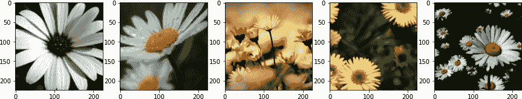
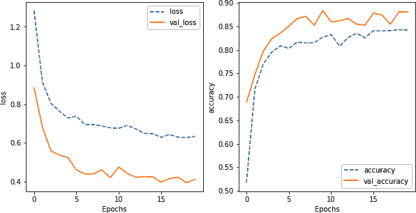

# 第六章：预处理

在第五章中，我们看到了如何为机器学习创建训练数据集。这是标准图像处理流程的第一步（参见图 6-1）。下一个阶段是预处理原始图像，以便将其输入模型进行训练或推理。在本章中，我们将讨论为何需要对图像进行预处理，如何设置预处理以确保在生产环境中的可复现性，以及如何在 Keras/TensorFlow 中实现各种预处理操作。


###### 图 6-1. 在将原始图像输入模型之前，它们必须经过预处理，无论是在训练（顶部）还是预测（底部）期间。

###### 小贴士

本章的代码位于该书的[GitHub 仓库](https://github.com/GoogleCloudPlatform/practical-ml-vision-book)的*06_preprocessing*文件夹中。我们将在适当的情况下提供代码样本和笔记本的文件名。

# 预处理的原因

在原始图像可以输入图像模型之前，它们通常需要经过预处理。此类预处理具有几个重叠的目标：形状转换、数据质量和模型质量。

## 形状转换

输入图像通常必须转换为一致的大小。例如，考虑一个简单的 DNN 模型：

```
model = tf.keras.Sequential([
    tf.keras.layers.Flatten(`input_shape``=``(``512``,` `256``,` `3``)`),
    tf.keras.layers.Dense(128,
                          activation=tf.keras.activations.relu),
    tf.keras.layers.Dense(len(CLASS_NAMES), activation='softmax')
])
```

此模型要求输入的图像必须是 4D 张量，并推断出批处理大小、512 列、256 行和 3 个通道。迄今为止，在本书中考虑的每一层都需要在构建时指定形状。有时可以从前面的层推断出规格，不必显式指定：第一个`Dense`层接收`Flatten`层的输出，因此在网络架构中建立为具有 512 * 256 * 3 = 393,216 个输入节点。如果原始图像数据不是这个大小，则无法将每个输入值映射到网络节点。因此，大小不正确的图像必须转换为具有此确切形状的张量。任何此类转换将在预处理阶段执行。

## 数据质量转换

另一个预处理的原因是确保数据质量。例如，许多卫星图像由于太阳照射或地球曲率的原因有终止线（见图 6-2）。

太阳照明会导致图像不同部分的光照水平不同。由于地球上的终结线在一天中移动，并且其位置可以从时间戳精确确定，因此考虑到地球上对应点接收的太阳照明，规范化每个像素值可能是有帮助的。或者，由于地球的曲率和卫星的视角，可能有些图像部分未被卫星感测到。这些像素可能会被屏蔽或分配一个`–inf`的值。在预处理步骤中，有必要以某种方式处理这些，因为神经网络期望看到有限的浮点值；一种选项是用图像中的平均值替换这些像素。


###### 图 6-2\. 太阳照明的影响（左）和地球的曲率（右）。图像来源：NASA © Living Earth 和 NOAA GOES-16 卫星。

即使您的数据集不包含卫星图像，也要意识到数据质量问题（如卫星数据中描述的问题）在许多情况下都会出现。例如，如果您的一些图像比其他图像暗，您可能希望在图像内部转换像素值以保持一致的白平衡。

## 改善模型质量

预处理的第三个目标是进行转换，以帮助提高在数据上训练的模型的准确性。例如，机器学习优化器在数据值较小时效果最佳。因此，在预处理阶段，将像素值缩放到[0, 1]或[-1, 1]范围内可能会有所帮助。

一些转换可以通过增加模型训练的数据的有效大小来帮助提高模型的质量。例如，如果您正在训练一个用于识别不同动物类型的模型，一个简单的方法是通过添加图像的翻转版本来加倍您的数据集。此外，向图像添加随机扰动可以增强训练的稳健性，限制模型过拟合的程度。

当然，在应用从左到右的转换时，我们必须小心。如果我们正在训练一个包含大量文本的图像模型（例如路标图像），通过左右翻转图像来增强数据可能会降低模型识别文本的能力。此外，有时候翻转图像可能会破坏我们需要的信息。例如，如果我们试图在服装店中识别产品，将扣子衬衫的图像左右翻转可能会破坏信息。男士的衬衫的扣子在穿着者的右侧，扣眼在左侧，而女士的则相反。随机翻转图像将使模型无法利用扣子的位置来确定服装设计的性别。

# 尺寸和分辨率

如前文所述，图像预处理的一个关键原因是确保图像张量具有 ML 模型输入层期望的形状。为了做到这一点，通常我们需要改变正在读取的图像的大小和/或分辨率。

考虑在第五章中将花卉图像写入 TensorFlow Records。正如在那一章中解释的那样，我们可以使用以下方式读取这些图像：

```
train_dataset = tf.data.TFRecordDataset(
    [filename for filename in tf.io.gfile.glob(
        'gs://practical-ml-vision-book/flowers_tfr/train-*')
    ]).map(parse_tfr)
```

让我们显示其中的五张图像：

```
for idx, (img, label_int) in enumerate(train_dataset.take(5)):
    print(img.shape)
    ax[idx].imshow((img.numpy()));
```

如图 6-3 所示，这些图像的尺寸各不相同。例如，第二幅图像（240x160）是竖直模式，而第三幅图像（281x500）是水平拉伸的。


###### 图 6-3\. 5-花训练数据集中的五幅图像。请注意，它们的尺寸各不相同（标在图像顶部）。

## 使用 Keras 预处理层

当输入的图像尺寸各不相同时，我们需要对它们进行预处理，以符合 ML 模型输入层期望的形状。我们在第二章中使用了 TensorFlow 函数来读取图像时指定了所需的高度和宽度：

```
img = tf.image.resize(img, [IMG_HEIGHT, IMG_WIDTH])
```

Keras 有一个名为`Resizing`的预处理层，提供相同的功能。通常我们会有多个预处理操作，因此我们可以创建一个包含所有这些操作的 Sequential 模型：

```
preproc_layers = tf.keras.Sequential([
    tf.keras.layers.experimental.preprocessing.Resizing(
        height=IMG_HEIGHT, width=IMG_WIDTH,
        input_shape=(None, None, 3))
    ])
```

要将预处理层应用到我们的图像上，我们可以这样做：

```
train_dataset.map(lambda img: preproc_layers(img))
```

然而，这种方法行不通，因为`train_dataset`提供的是一个元组（img, label），其中图像是一个 3D 张量（高度、宽度、通道），而 Keras Sequential 模型期望的是一个 4D 张量（批次大小、高度、宽度、通道）。

最简单的解决方案是编写一个函数，使用`expand_dims()`在图像的第一个轴上添加额外的维度，并使用`squeeze()`从结果中去除批次维度：

```
def apply_preproc(img, label):
    # add to a batch, call preproc, remove from batch
    x = tf.expand_dims(img, 0)
    x = preproc_layers(x)
    x = tf.squeeze(x, 0)
    return x, label
```

定义了这个函数后，我们可以使用以下方式将预处理层应用到我们的元组中：

```
train_dataset.map(apply_preproc)
```

###### 注意

通常情况下，我们不需要在预处理函数中调用`expand_dims()`和`squeeze()`，因为我们会在`batch()`调用之后应用预处理函数。例如，我们通常会这样做：

```
train_dataset`.``batch``(``32``)`.map(apply_preproc)
```

然而，在这里，我们不能这样做，因为`train_dataset`中的图像尺寸都不同。为了解决这个问题，我们可以如上所示添加一个额外的维度，或者使用[ragged batches](https://oreil.ly/LbavM)。

结果显示在图 6-4 中。请注意，现在所有的图像都是相同的大小，因为我们传入了 224 作为`IMG_HEIGHT`和`IMG_WIDTH`，这些图像都是正方形的。与图 6-3 进行比较，我们注意到第二幅图像在垂直方向被压扁，而第三幅图像在水平方向被压扁并在垂直方向上被拉伸。


###### 图 6-4。将图像调整为形状为(224, 224, 3)的效果。直觉上，拉伸和压缩花朵会使它们更难识别，因此我们希望保留输入图像的长宽比（高度与宽度的比率）。本章后面，我们将看看其他能够做到这一点的预处理选项。

Keras 的[`Resizing`层](https://oreil.ly/pUrsF)在进行压缩和拉伸时提供了几种插值选项：`bilinear`、`nearest`、`bicubic`、`lanczos3`、`gaussian`等等。默认的插值方案(`bilinear`)保留了局部结构，而`gaussian`插值方案对噪声更宽容。然而，在实践中，不同插值方法之间的差异非常小。

Keras 预处理层有一个优势，我们将在本章后面深入探讨—因为它们是模型的一部分，在预测时会自动应用。因此，选择在 Keras 或 TensorFlow 中进行预处理往往取决于效率和灵活性之间的权衡；我们将在本章后面扩展讨论这一点。

## 使用 TensorFlow 图像模块

除了我们在第二章中使用的`resize()`函数外，TensorFlow 的[`tf.image`模块](https://oreil.ly/K8r7W)还提供了大量图像处理函数。我们在第五章中使用了这个模块的`decode_jpeg()`，但 TensorFlow 还可以解码 PNG、GIF 和 BMP，并在彩色和灰度图像之间转换。有关工作于边界框和调整对比度、亮度等的方法也是如此。

在调整大小的领域，TensorFlow 允许我们在调整大小时保持长宽比，通过裁剪图像到期望的长宽比并拉伸它：

```
img = tf.image.resize(img, [IMG_HEIGHT, IMG_WIDTH],
                      preserve_aspect_ratio=True)
```

或者用零填充边缘：

```
img = tf.image.resize_with_pad(img, [IMG_HEIGHT, IMG_WIDTH])
```

我们可以将此函数直接应用于数据集中的每个（img，label）元组，如下所示：

```
def apply_preproc(img, label):
    return (tf.image.resize_with_pad(img, 2*IMG_HEIGHT, 2*IMG_WIDTH),
            label)
train_dataset.map(apply_preproc)
```

结果显示在图 6-5 中。注意填充效果，以避免拉伸或压缩输入图像同时提供所需的输出大小。


###### 图 6-5。将图像调整为(448, 448)，并进行填充。

你们中的鹰眼可能已经注意到，我们将图像调整为比期望的高度和宽度大（实际上是两倍）。这样做是为了迎接下一步的挑战。

虽然我们通过指定填充方式保留了长宽比，但现在我们的图像被黑边填充了。这也是不理想的。如果现在我们进行“中心裁剪”—即在图像中心裁剪这些比我们想要的大的图像呢？

## 混合使用 Keras 和 TensorFlow

TensorFlow 中有一个中心裁剪功能，但为了增加趣味性，让我们混合使用 TensorFlow 的`resize_with_pad()`和 Keras 的`CenterCrop`功能。

为了将任意一组 TensorFlow 函数作为 Keras 模型的一部分调用，我们将函数包装在 Keras 的 `Lambda` 层中：

```
tf.keras.layers.Lambda(lambda img:
                       tf.image.resize_with_pad(
                           img, 2*IMG_HEIGHT, 2*IMG_WIDTH))
```

这里，因为我们希望先进行 resize，然后进行 center crop，我们的预处理层如下所示：

```
preproc_layers = tf.keras.Sequential([
    tf.keras.layers.Lambda(lambda img:
                           tf.image.resize_with_pad(
                               img, 2*IMG_HEIGHT, 2*IMG_WIDTH),
                           `input_shape``=``(``None``,` `None``,` `3``)`),
    tf.keras.layers.experimental.preprocessing.CenterCrop(
        height=IMG_HEIGHT, width=IMG_WIDTH)
    ])
```

注意第一层 (`Lambda`) 带有 `input_shape` 参数。因为输入图像的大小会不同，我们将高度和宽度指定为 `None`，这样它们将在运行时确定。不过，我们确保始终有三个通道。

应用此预处理的结果显示在 Figure 6-6 中。请注意花朵的长宽比得到保留，并且所有图像都是 224x224。



###### 图 6-6\. 应用两个处理操作的效果：resize with pad 后跟 center crop。

到目前为止，你已经看到三种不同的预处理方法：在 Keras 中，作为预处理层；在 TensorFlow 中，作为 `tf.data` 流水线的一部分；以及在 Keras 中，作为模型本身的一部分。正如前面提到的，选择其中之一取决于效率和灵活性之间的权衡；我们将在本章后面更详细地探讨这个问题。

## 模型训练：

如果输入图像都是相同大小，我们可以将预处理层合并到模型本身中。但是，由于输入图像大小不同，它们不容易成批处理。因此，我们将在进食流水线中进行批处理之前应用预处理：

```
train_dataset = tf.data.TFRecordDataset(
    [filename for filename in tf.io.gfile.glob(
        'gs://practical-ml-vision-book/flowers_tfr/train-*')
    ])`.``map``(``parse_tfr``)``.``map``(``apply_preproc``)``.``batch``(``batch_size``)`
```

模型本身是相同的 MobileNet 迁移学习模型，我们在 Chapter 3 中使用过（完整代码在 GitHub 上的 [*06a_resizing.ipynb*](https://github.com/GoogleCloudPlatform/practical-ml-vision-book/blob/master/06_preprocessing/06a_resizing.ipynb) 中）。

```
layers = [
    hub.KerasLayer(
        "https://tfhub.dev/.../mobilenet_v2/...",
        input_shape=(IMG_HEIGHT, IMG_WIDTH, IMG_CHANNELS),
        trainable=False,
        name='mobilenet_embedding'),
    tf.keras.layers.Dense(num_hidden,
                          activation=tf.keras.activations.relu,
                          name='dense_hidden'),
    tf.keras.layers.Dense(len(CLASS_NAMES),
                          activation='softmax',
                          name='flower_prob')
]
model = tf.keras.Sequential(layers, name='flower_classification')
model.compile(optimizer=tf.keras.optimizers.Adam(learning_rate=lrate),
              loss=tf.keras.losses.SparseCategoricalCrossentropy(
                  from_logits=False),
              metrics=['accuracy'])
history = model.fit(train_dataset, validation_data=eval_dataset, epochs=10)
```

模型训练收敛并且验证准确率在 0.85 时平稳（见 Figure 6-7）。


###### 图 6-7\. MobileNet 迁移学习模型的损失和准确率曲线，以预处理层作为输入。

将 Figure 6-7 与 Figure 3-3 进行比较，似乎我们在填充和中心裁剪方面的效果不如在 Chapter 3 中简单的 resize 操作（0.85 与 0.9 的准确率）。尽管验证数据集在两种情况下不同，因此准确性数字不直接可比，但准确性差异足够大，很可能 Chapter 6 模型比 Chapter 3 中的模型更差。机器学习是一门实验性学科，除非尝试，否则我们不会知道这一点。在不同的数据集上，更复杂的预处理操作可能会改善最终结果；你需要尝试多种选择来找出哪种方法最适合你的数据集。

一些预测结果显示在 Figure 6-8 中。请注意，输入图像都具有自然的纵横比，并且中心裁剪。


###### 图 6-8\. 将图像作为模型的输入，并对这些图像进行预测。

# 训练-服务偏差

在推理期间，我们需要对图像执行与训练期间完全相同的操作（参见 Figure 6-1）。回想一下，我们在三个地方进行了预处理：

1.  创建文件时。当我们在第五章中写出 TensorFlow Records 时，我们解码了 JPEG 文件并将输入值缩放到 [0, 1]。

1.  在读取文件时。我们对训练数据集应用了函数 `parse_tfr()`。该函数唯一的预处理是将图像张量重塑为 [height, width, 3]，其中 height 和 width 是图像的原始尺寸。

1.  在 Keras 模型中。然后我们对图像应用了 `preproc_layers()`。在此方法的最后版本中，我们将图像调整大小并填充至 448x448，然后中心裁剪为 224x224。

在推理流程中，我们必须对客户端提供的图像执行所有这些操作（解码、缩放、重塑、调整大小、中心裁剪）¹。如果在训练和推理之间遗漏或者稍微不同地执行某个操作，可能会导致潜在的错误结果。训练和推理流程分歧的情况（因此在推理期间出现未预料或不正确的行为，而在训练期间未见）被称为*训练-服务偏差*。为了防止训练-服务偏差，最理想的情况是我们可以在训练和推理中重复使用完全相同的代码。

广义上说，我们可以通过以下三种方式设置所有在训练期间进行的图像预处理也会在推理期间完成：

+   将预处理步骤放入函数中，这些函数会从训练和推理流程中调用。

+   将预处理整合到模型本身。

+   使用 `tf.transform` 创建和重用工件。

让我们看看每种方法。在每种情况下，我们都希望重构训练流程，以便在推理期间更轻松地重用所有预处理代码。代码在训练和推理之间重用得越容易，微小差异导致的问题就越少，从而避免训练-服务偏差的可能性就越大。

## 重复使用函数

在我们的情况下，训练管道读取由已解码和缩放的 JPEG 文件组成的 TensorFlow Records，而预测管道需要依赖于*单个*图像文件的路径。因此，预处理代码不会完全相同，但我们仍然可以将所有预处理收集到可重用的函数中，并将它们放在一个我们称之为`_Preprocessor`的类中。² 完整代码可以在[*GitHub 上的 06b_reuse_functions.ipynb*](https://github.com/GoogleCloudPlatform/practical-ml-vision-book/blob/master/06_preprocessing/06b_reuse_functions.ipynb)找到。

预处理类的方法将从两个函数中调用，一个用于从 TensorFlow Records 创建数据集，另一个用于从 JPEG 文件创建一个单独的图像。创建预处理数据集的函数是：

```
def create_preproc_dataset(pattern):
    preproc = `_Preprocessor``(``)`
    trainds = tf.data.TFRecordDataset(
        [filename for filename in tf.io.gfile.glob(pattern)]
    ).map(preproc.`read_from_tfr`).map(
        lambda img, label: (preproc.`preprocess`(img), label))
    return trainds
```

正在调用预处理器的三个函数：构造函数、将 TensorFlow Records 读入图像的方法以及预处理图像的方法。创建单个预处理图像的函数是：

```
def create_preproc_image(filename):
    preproc = `_Preprocessor``(``)`
    img = preproc.`read_from_jpegfile`(filename)
    return preproc.`preprocess`(img)
```

在这里，我们正在使用构造函数和预处理方法，但我们正在使用一种不同的方式来读取数据。因此，预处理器将需要四种方法。

Python 中的构造函数由名为`__init__()`的方法组成：

```
class _Preprocessor:
    def __init__(self):
        self.preproc_layers = tf.keras.Sequential([
            tf.keras.layers.experimental.preprocessing.CenterCrop(
                height=IMG_HEIGHT, width=IMG_WIDTH),
                input_shape=(2*IMG_HEIGHT, 2*IMG_WIDTH, 3)
        ])
```

在`__init__()`方法中，我们设置了预处理层。

要从 TFRecord 中读取，我们使用来自第五章的`parse_tfr()`函数，现在是我们类的方法：

```
def read_from_tfr(self, proto):
    feature_description = ... # schema
    rec = tf.io.parse_single_example(
        proto, feature_description
    )
    shape = tf.sparse.to_dense(rec['shape'])
    img = tf.reshape(tf.sparse.to_dense(rec['image']), shape)
    label_int = rec['label_int']
    return img, label_int
```

预处理包括获取图像，将其大小调整一致，放入批处理中，调用预处理层，并取消批处理结果：

```
def preprocess(self, img):
    x = tf.image.resize_with_pad(img, 2*IMG_HEIGHT, 2*IMG_WIDTH)
    # add to a batch, call preproc, remove from batch
    x = tf.expand_dims(x, 0)
    x = self.preproc_layers(x)
    x = tf.squeeze(x, 0)
    return x
```

当从 JPEG 文件读取时，我们务必执行所有在 TFRecord 文件写出时执行的步骤：

```
def read_from_jpegfile(self, filename):
    # same code as in 05_create_dataset/jpeg_to_tfrecord.py
    img = tf.io.read_file(filename)
    img = tf.image.decode_jpeg(img, channels=IMG_CHANNELS)
    img = tf.image.convert_image_dtype(img, tf.float32)
    return img
```

现在，训练管道可以使用我们定义的`create_preproc_dataset()`函数创建训练和验证数据集：

```
train_dataset = create_preproc_dataset(
    'gs://practical-ml-vision-book/flowers_tfr/train-*'
).batch(batch_size)
```

预测代码（将进入一个服务函数，在第九章中进行覆盖）将利用`create_preproc_image()`函数来读取单个 JPEG 文件，然后调用`model.predict()`。

## 模型内的预处理

请注意，我们不必采取任何特殊措施来重新使用模型本身进行预测。例如，我们不必编写不同版本的层：表示 MobileNet 的 Hub 层和密集层在训练和预测之间都是透明可重用的。

我们将任何放入 Keras 模型的预处理代码自动应用于预测中。因此，让我们将中心裁剪功能从`_Preprocessor`类中取出，并将其移入模型本身（请参阅[*GitHub 上的 06b_reuse_functions.ipynb*](https://github.com/GoogleCloudPlatform/practical-ml-vision-book/blob/master/06_preprocessing/06b_reuse_functions.ipynb)获取代码）：

```
class _Preprocessor:
    def __init__(self):
        # nothing to initialize
        pass

    def read_from_tfr(self, proto):
        # same as before

    def read_from_jpegfile(self, filename):
        # same as before

    def preprocess(self, img):
        return tf.image.resize_with_pad(img, 2*IMG_HEIGHT, 2*IMG_WIDTH)
```

`CenterCrop`层移入 Keras 模型，现在变成了：

```
layers = [
    tf.keras.layers.experimental.preprocessing.`CenterCrop`(
        height=IMG_HEIGHT, width=IMG_WIDTH,
        `input_shape``=``(``2``*``IMG_HEIGHT``,` `2``*``IMG_WIDTH``,` `IMG_CHANNELS``)``,`
    ),
    hub.KerasLayer(...),
    tf.keras.layers.Dense(...),
    tf.keras.layers.Dense(...)
]
```

回想一下 Sequential 模型的第一层是带有 `input_shape` 参数的层。因此，我们已从 Hub 层中删除了此参数，并将其添加到 `CenterCrop` 层中。此层的输入是图像的所需大小的两倍，因此我们指定了这个大小。

模型现在包括 `CenterCrop` 层，其输出形状为 224x224，即我们期望的输出形状：

```
Model: "flower_classification"
_________________________________________________________________
Layer (type)                 Output Shape              Param #
=================================================================
center_crop (CenterCrop)     (None, 224, 224, 3)       0
_________________________________________________________________
mobilenet_embedding (KerasLa (None, 1280)              2257984
_________________________________________________________________
dense_hidden (Dense)         (None, 16)                20496
_________________________________________________________________
flower_prob (Dense)          (None, 5)                 85
```

当然，如果训练和预测流水线都读取相同的数据格式，我们完全可以摆脱预处理器。

## 使用 tf.transform

在上一节中所做的事情——编写 `_Preprocessor` 类，并期望保持 `read_from_tfr()` 和 `read_from_jpegfile()` 在预处理方面的一致性——这很难强制执行。这将成为 ML 流水线中常见的错误源，因为 ML 工程团队倾向于不断调整预处理和数据清理例程。

例如，假设我们已经将已裁剪的图像写入 TFRecords 以提高效率。在推断期间如何确保进行裁剪？为了减少训练-服务偏差，最好将所有预处理操作保存在工件注册表中，并自动将这些操作作为服务流水线的一部分应用。

进行此操作的 TensorFlow 库是 [TensorFlow Transform](https://oreil.ly/25SxU) (`tf.transform`)。要使用 `tf.transform`，我们需要：

+   编写 Apache Beam 流水线以分析训练数据，预计算预处理所需的任何统计信息（例如用于归一化的平均值/方差），并应用预处理。

+   将训练代码更改为读取预处理后的文件。

+   更改训练代码以保存转换函数及其模型。

+   更改推断代码以应用保存的转换函数。

让我们简要看一下每一个（完整代码可以在 GitHub 上的 [*06h_tftransform.ipynb*](https://github.com/GoogleCloudPlatform/practical-ml-vision-book/blob/master/06_preprocessing/06h_tftransform.ipynb) 中找到）。

### 编写 Beam 流水线

进行预处理的 Beam 流水线类似于我们在 第五章 中用于将 JPEG 文件转换为 TensorFlow 记录的流水线。不同之处在于，我们使用 TensorFlow Extended（TFX）的内置功能来创建 CSV 读取器：

```
RAW_DATA_SCHEMA = schema_utils.schema_from_feature_spec({
    'filename': tf.io.FixedLenFeature([], tf.string),
    'label': tf.io.FixedLenFeature([], tf.string),
})
csv_tfxio = tfxio.CsvTFXIO(file_pattern='gs://.../all_data.csv'],
                           column_names=['filename', 'label'],
                           schema=RAW_DATA_SCHEMA)
And we use this class to read the CSV file:
img_records = (p
               | 'read_csv' >> csv_tfxio.BeamSource(batch_size=1)
               | 'img_record' >> beam.Map(
                   lambda x: create_input_record(x[0], x[1]))
              )
```

此时的输入记录包含读取的 JPEG 数据和标签索引，因此我们将其指定为模式（参见 [*jpeg_to_tfrecord_tft.py*](https://github.com/GoogleCloudPlatform/practical-ml-vision-book/blob/master/06_preprocessing/jpeg_to_tfrecord_tft.py)），以创建将进行转换的数据集：

```
IMG_BYTES_METADATA = tft.tf_metadata.dataset_metadata.DatasetMetadata(
    schema_utils.schema_from_feature_spec({
        'img_bytes': tf.io.FixedLenFeature([], tf.string),
        'label': tf.io.FixedLenFeature([], tf.string),
        'label_int': tf.io.FixedLenFeature([], tf.int64)
    })
)
```

### 转换数据

要转换数据，我们将原始数据和元数据传递给我们称之为 `tft_preprocess()` 的函数：

```
raw_dataset = (img_records, IMG_BYTES_METADATA)
transformed_dataset, transform_fn = (
    `raw_dataset` `|` 'tft_img' >>
    tft_beam.AnalyzeAndTransformDataset(`tft_preprocess`)
)
```

预处理函数使用 TensorFlow 函数执行调整大小操作：

```
def tft_preprocess(img_record):
    img = tf.map_fn(decode_image, img_record['img_bytes'],
                    fn_output_signature=tf.uint8)
    img = tf.image.convert_image_dtype(img, tf.float32)
    img = tf.image.resize_with_pad(img, IMG_HEIGHT, IMG_WIDTH)
    return {
        'image': img,
        'label': img_record['label'],
        'label_int': img_record['label_int']
    }
```

### 保存转换

生成的转换数据如前所述写出。此外，转换函数也会写出：

```
transform_fn | 'write_tft' >> tft_beam.WriteTransformFn(
    os.path.join(OUTPUT_DIR, 'tft'))
```

这样就创建了一个包含在原始数据集上执行的所有预处理操作的 SavedModel。

### 读取预处理数据

在训练期间，可以如下读取转换后的记录：

```
def create_dataset(pattern, batch_size):
    return tf.data.experimental.make_batched_features_dataset(
        pattern,
        batch_size=batch_size,
        features = {
            'image': tf.io.FixedLenFeature(
                [IMG_HEIGHT, IMG_WIDTH, IMG_CHANNELS], tf.float32),
            'label': tf.io.FixedLenFeature([], tf.string),
            'label_int': tf.io.FixedLenFeature([], tf.int64)
        }
    ).map(
        lambda x: (x['image'], x['label_int'])
    )
```

这些图像已经被缩放和调整大小，因此可以直接在训练代码中使用。

### 服务期间的转换

我们需要使转换函数工件（使用`WriteTransformFn()`保存的工件）可用于预测系统。我们可以通过确保`WriteTransformFn()`将转换工件写入对服务系统可访问的 Cloud Storage 位置来实现这一点。或者，训练管道可以复制转换工件，以便它们与导出的模型一起可用。

在预测时，所有缩放和预处理操作都将加载并应用于从客户端发送的图像字节：

```
preproc = tf.keras.models.load_model(
    '.../tft/transform_fn').signatures['transform_signature']
preprocessed = preproc(img_bytes=tf.convert_to_tensor(img_bytes)...)
```

然后我们对预处理数据调用`model.predict()`：

```
pred_label_index = tf.math.argmax(model.predict(preprocessed))
```

在第七章中，我们将看到如何编写一个代表客户端执行这些操作的服务函数。

### tf.transform 的好处

请注意，使用`tf.transform`，我们避免了在`tf.data`管道中放置预处理代码或将其包含为模型的内在折衷。现在我们可以兼顾两种方法的优势——高效的训练和透明的重复使用以防止训练-服务偏差：

+   预处理（对输入图像进行缩放和调整大小）只会发生一次。

+   训练管道读取已经预处理的图像，因此速度很快。

+   预处理函数被存储为模型工件。

+   服务函数可以加载模型工件，并在调用模型之前应用预处理（如何实现将在稍后介绍）。

服务函数不需要了解转换的细节，只需知道转换后的工件存储在哪里。一种常见做法是在训练程序的一部分中将这些工件复制到模型输出目录中，以便它们与模型本身一起可用。如果我们更改预处理代码，只需再次运行预处理管道；包含预处理代码的模型工件将得到更新，因此正确的预处理会自动应用。

使用`tf.transform`除了防止训练-服务偏差之外，还有其他优点。例如，因为`tf.transform`在训练开始之前甚至可以全局统计数据集（例如平均值），所以可以使用数据集的全局统计信息来缩放值。

# 数据增强

预处理不仅仅是将图像重新格式化为模型所需的大小和形状。预处理还可以通过*数据增强*来提高模型质量。

数据增强是解决数据不足问题的一种数据空间解决方案（或缺乏正确类型数据问题），它是一组技术，旨在增强训练数据集的规模和质量，以创建更准确、泛化能力更强的机器学习模型。

深度学习模型具有大量的权重，权重越多，训练模型所需的数据就越多。如果我们的数据集相对于机器学习模型的大小太小，模型可以利用其参数来记忆输入数据，导致过拟合（模型在训练数据上表现良好，但在推断时对未见数据产生较差结果）。

作为一种思维实验，考虑一个具有一百万个权重的机器学习模型。如果我们只有一万张训练图像，那么模型可能会为每张图像分配一百个权重，这些权重可能会聚焦于使每张图像在某种方面独特的某些特征上，例如，这可能是唯一一张图像，在其中有一个围绕特定像素中心的明亮区域。问题在于，这样一个过度拟合的模型在投入生产后性能不会很好。模型需要预测的图像将与训练图像不同，并且它学到的嘈杂信息将毫无帮助。我们需要机器学习模型从训练数据集中*泛化*。为了实现这一点，我们需要大量的数据，而我们希望的模型越大，我们需要的数据就越多。

数据增强技术涉及对训练数据集中的图像进行变换，以创建新的训练样本。现有的数据增强方法可分为三类：

+   空间变换，如随机缩放、裁剪、翻转、旋转等

+   色彩失真以改变亮度、色调等。

+   信息丢失，例如随机遮罩或擦除图像的不同部分

让我们依次看看每一个。

## 空间变换

在许多情况下，我们可以翻转或旋转图像而不改变其本质。例如，如果我们试图检测农场设备的类型，水平翻转图像（从左到右，如图 6-9 中顶部行所示）将简单地模拟从另一侧看到的设备。通过使用这种图像变换来增加数据集，我们为模型提供了更多的多样性——意味着以不同大小、空间位置、方向等展示所需图像对象或类的更多示例。这将有助于创建一个能够处理真实数据中这些变化的更健壮模型。


###### 图 6-9\. 一幅田野中拖拉机图像的几何变换。照片作者拍摄。

然而，垂直翻转图像（如 Figure 6-9 左侧所示）并不是一个好主意，原因有几点。首先，在生产中不会预期模型正确分类倒置的图像，因此将此类图像添加到训练数据集中没有意义。其次，垂直翻转的拖拉机图像使得 ML 模型更难识别像驾驶室这样的非垂直对称特征。因此，垂直翻转图像不仅添加了模型无需正确分类的图像类型，还使得学习问题更加困难。

###### 小贴士

确保数据增强使训练数据集变大，但不会使问题更加困难。一般来说，只有当增强图像典型于模型预期预测的图像时，才会出现这种情况，而如果增强造成了偏斜的、不自然的图像，则不会。不过，稍后讨论的信息丢弃方法是这一规则的一个例外。

Keras 支持多种[数据增强层](https://oreil.ly/8r8Z6)，包括`RandomTranslation`、`RandomRotation`、`RandomZoom`、`RandomCrop`、`RandomFlip`等等。它们的工作原理都类似。

`RandomFlip`层将在训练期间随机翻转图像或保持其原始方向。在推理期间，图像将保持不变。Keras 会自动完成这一过程；我们只需将其添加为模型的一层即可：

```
tf.keras.layers.experimental.preprocessing.RandomFlip(
    mode='horizontal',
    name='random_lr_flip/none'
)
```

`mode`参数控制允许的翻转类型，其中`horizontal`翻转将图像从左到右翻转。其他模式包括`vertical`和`horizontal_and_vertical`。

在前面的章节中，我们对图像进行了中心裁剪。当我们进行中心裁剪时，会丢失图像的相当部分。为了提高我们的训练性能，我们可以考虑通过从输入图像中随机裁剪出所需大小的随机裁剪数据。在 Keras 中，`RandomCrop`层会在训练期间进行随机裁剪（使模型在每个 epoch 中看到图像的不同部分，尽管其中一些现在包括填充边缘，甚至可能不包括感兴趣的图像部分），并在推理期间表现得像`CenterCrop`。

此示例的完整代码在[*06d_augmentation.ipynb* on GitHub](https://github.com/GoogleCloudPlatform/practical-ml-vision-book/blob/master/06_preprocessing/06d_augmentation.ipynb)中。结合这两个操作，我们的模型层现在变为：

```
layers = [
    tf.keras.layers.experimental.preprocessing.RandomCrop(
        height=IMG_HEIGHT//2, width=IMG_WIDTH//2,
        input_shape=(IMG_HEIGHT, IMG_WIDTH, IMG_CHANNELS),
        name='random/center_crop'
    ),
    tf.keras.layers.experimental.preprocessing.RandomFlip(
        mode='horizontal',
        name='random_lr_flip/none'
    ),
    hub.KerasLayer(
        "https://tfhub.dev/.../mobilenet_v2/...",
        trainable=False,
        name='mobilenet_embedding'),
    tf.keras.layers.Dense(
        num_hidden,
        kernel_regularizer=regularizer,
        activation=tf.keras.activations.relu,
        name='dense_hidden'),
    tf.keras.layers.Dense(
        len(CLASS_NAMES),
        kernel_regularizer=regularizer,
        activation='softmax',
        name='flower_prob')
]
```

而模型本身变成：

```
Model: "flower_classification"
_________________________________________________________________
Layer (type)                 Output Shape              Param #
=================================================================
random/center_crop (RandomCr (None, 224, 224, 3)       0
_________________________________________________________________
random_lr_flip/none (RandomF (None, 224, 224, 3)       0
_________________________________________________________________
mobilenet_embedding (KerasLa (None, 1280)              2257984
_________________________________________________________________
dense_hidden (Dense)         (None, 16)                20496
_________________________________________________________________
flower_prob (Dense)          (None, 5)                 85
```

训练这个模型类似于没有进行数据增强的训练。然而，每当我们进行数据增强时，需要更长时间地训练模型——直观上说，我们需要训练两倍的 epoch 以使模型看到图像的两种翻转。结果显示在 Figure 6-10 中。


###### 图 6-10\. MobileNet 迁移学习模型的损失和准确率曲线。与图 6-7 进行比较。

将图 6-10 与图 6-7 进行比较，我们可以注意到增加数据增强后模型训练的更具鲁棒性。请注意，训练和验证损失几乎同步，训练和验证精度也如此。精度为 0.86，略高于之前的 0.85；重要的是，由于训练曲线表现更好，我们对这个精度更有信心。

通过添加数据增强，我们显著降低了过拟合的程度。

## 色彩失真

不要仅限于现有的增强层集合。相反，考虑模型在生产中可能遇到的图像变化类型。例如，提供给 ML 模型的照片（特别是来自业余摄影师的照片）在光照方面可能会有很大的差异。因此，如果我们通过随机改变训练图像的亮度、对比度、饱和度等来增强数据，我们可以增加训练数据集的有效大小，使 ML 模型更具鲁棒性。虽然 Keras 提供了几个内置的数据增强层（如[`RandomFlip`](https://oreil.ly/818dT)），但目前不支持更改对比度³和亮度。因此，让我们自己来实现这一功能。

我们将从头开始创建一个数据增强层，随机改变图像的对比度和亮度。该类将继承自 Keras 的`Layer`类，并接受两个参数，即调整对比度和亮度的范围（完整代码在[*06e_colordistortion.ipynb* on GitHub](https://github.com/GoogleCloudPlatform/practical-ml-vision-book/blob/master/06_preprocessing/06e_colordistortion.ipynb)中）：

```
class RandomColorDistortion(tf.keras.layers.Layer):
    def __init__(self, contrast_range=[0.5, 1.5],
                 brightness_delta=[-0.2, 0.2], **kwargs):
        super(RandomColorDistortion, self).__init__(**kwargs)
        self.contrast_range = contrast_range
        self.brightness_delta = brightness_delta
```

调用此层时，其行为将根据是否处于训练模式而有所不同。如果不处于训练模式，则该层将简单返回原始图像。如果处于训练模式，则将生成两个随机数，一个用于调整图像内的对比度，另一个用于调整亮度。实际的调整操作是使用`tf.image`模块中可用的方法进行的：

```
    def call(self, images, training=False):
        if not training:
            return images

        contrast = np.random.uniform(
            self.contrast_range[0], self.contrast_range[1])
        brightness = np.random.uniform(
            self.brightness_delta[0], self.brightness_delta[1])

        images = tf.image.adjust_contrast(images, contrast)
        images = tf.image.adjust_brightness(images, brightness)
        images = tf.clip_by_value(images, 0, 1)
        return images
```

###### 提示

实施自定义增强层时很重要的一点是使用 TensorFlow 函数，这样这些函数可以在 GPU 上高效实现。参见第七章，了解编写高效数据管道的建议。

这一层对几个训练图像的效果显示在图 6-11 中。请注意，图像具有不同的对比度和亮度级别。通过在每个输入图像上每个周期调用此层多次，我们确保模型能够看到原始训练图像的许多颜色变化。


###### 图 6-11。对三个训练图像进行随机对比度和亮度调整。每行的第一个面板显示原始图像，其他面板显示生成的四幅图像。如果您查看的是灰度图像，请参考 GitHub 上的[*06e_colordistortion.ipynb*](https://github.com/GoogleCloudPlatform/practical-ml-vision-book/blob/master/06_preprocessing/06e_colordistortion.ipynb)来查看颜色失真的效果。

层本身可以在`RandomFlip`层之后插入模型：

```
layers = [
    ...
    tf.keras.layers.experimental.preprocessing.`RandomFlip`(
        mode='horizontal',
        name='random_lr_flip/none'
    ),
    `RandomColorDistortion``(``name``=``'``random_contrast_brightness/none``'``)`,
    hub.KerasLayer ...
]
```

然后整个模型将具有这种结构：

```
Model: "flower_classification"
_________________________________________________________________
Layer (type)                 Output Shape              Param #
=================================================================
random/center_crop (RandomCr (None, 224, 224, 3)       0
_________________________________________________________________
random_lr_flip/none (RandomF (None, 224, 224, 3)       0
_________________________________________________________________
`random_contrast_brightness``/``n` `(``None``,` `224``,` `224``,` `3``)`       `0`
_________________________________________________________________
mobilenet_embedding (KerasLa (None, 1280)              2257984
_________________________________________________________________
dense_hidden (Dense)         (None, 16)                20496
_________________________________________________________________
flower_prob (Dense)          (None, 5)                 85
=================================================================
Total params: 2,278,565
Trainable params: 20,581
Non-trainable params: 2,257,984
```

模型的训练保持不变。结果显示在图 6-12 中。我们比仅使用几何增强获得更好的准确性（0.88 而不是 0.86），训练和验证曲线保持完全同步，表明过拟合得到控制。


###### 图 6-12。MobileNet 迁移学习模型的损失和准确率曲线，带有几何和颜色增强。与图 6-7 和 6-10 进行比较。

## 信息丢弃

最近的研究突出了一些数据增强中的新想法，涉及对图像进行更激烈的更改。这些技术*丢弃*图像中的信息，以使训练过程更具韧性，并帮助模型关注图像的重要特征。它们包括：

[Cutout](https://arxiv.org/abs/1708.04552)

在训练过程中随机遮罩输入的方形区域。这有助于模型学习忽略图像中无信息的部分（如天空），并注意区分性的部分（如花瓣）。

[Mixup](https://arxiv.org/abs/1710.09412)

线性插值一对训练图像，并将相应的插值标签值分配为它们的标签。

[CutMix](https://arxiv.org/abs/1905.04899)

一个 cutout 和 mixup 的组合。从不同的训练图像中剪切补丁，并且按照补丁区域的面积比例混合地真实标签。

[GridMask](https://arxiv.org/pdf/2001.04086.pdf)

在控制删除区域的密度和大小的同时删除均匀分布的方形区域。其基本假设是故意收集的图像——均匀分布的方形区域往往是背景。

Cutout 和 GridMask 是对单个图像进行的预处理操作，可以类似于我们实现的颜色失真。开源代码可以在 GitHub 上找到 [cutout](https://oreil.ly/fGHK6) 和 [GridMask](https://oreil.ly/3tzFk)。

然而，Mixup 和 CutMix 使用来自多个训练图像的信息创建合成图像，这些图像可能与现实没有任何相似之处。在本节中，我们将看看如何实现 mixup，因为它更简单。完整的代码在 [*GitHub 上的 06f_mixup.ipynb*](https://github.com/GoogleCloudPlatform/practical-ml-vision-book/blob/master/06_preprocessing/06f_mixup.ipynb) 中。

mixup 的背后思想是线性插值一对训练图像及其标签。我们无法在 Keras 自定义层中实现这一点，因为该层只接收图像，而不接收标签。因此，让我们实现一个函数，接收一个图像和标签的批次，并执行 mixup：

```
def augment_mixup(img, label):
    # parameters
    fracn = np.rint(MIXUP_FRAC * len(img)).astype(np.int32)
    wt = np.random.uniform(0.5, 0.8)
```

在这段代码中，我们定义了两个参数：`fracn` 和 `wt`。我们不会将批次中所有图像混合在一起，而是将其中一部分图像混合在一起（默认情况下为 0.4），并保留其余图像（和标签）。参数 `fracn` 是我们必须混合的批次中的图像数量。在函数中，我们还会选择一个权重因子 `wt`，介于 0.1 和 0.4 之间，来插值图像对。

要进行插值，我们需要图像对。第一组图像将是批次中的前 `fracn` 个图像：

```
img1, label1 = img[:fracn], label[:fracn]
```

那么每对中的第二张图像呢？我们将做一些非常简单的事情：我们将选择下一张图像，这样第一张图像就与第二张图像插值，第二张图像与第三张图像插值，依此类推。现在我们有了图像/标签对，插值可以按以下方式完成：

```
def _interpolate(b1, b2, wt):
    return wt*b1 + (1-wt)*b2
interp_img = _interpolate(img1, img2, wt)
interp_label = _interpolate(label1, label2, wt)
```

结果显示在 Figure 6-13 中。顶部行是五个图像的原始批次。底部行是 mixup 的结果：5 的 40% 是 2，因此混合的是前两个图像，剩下的三个图像保持不变。第一个混合图像是通过对前两个原始图像进行插值得到的，第一个图像权重为 0.63，第二个图像权重为 0.37。第二个混合图像是通过混合顶部行中的第二个和第三个图像得到的。请注意，标签（每个图像上方的数组）显示了 mixup 的影响。

```
img2, label2 = img[1:fracn+1], label[1:fracn+1] # offset by one
```


###### 图 6-13\. 五个图像及其标签的 mixup 结果。顶部行是原始批次中的图像。底部行是 mixup 的结果，40% 的批次是第一二个图像被混合。

到目前为止，我们从前 `fracn+1` 个图像中生成了 `fracn` 对插值图像（我们需要 `fracn+1` 个图像来获取 `fracn` 对，因为第 `fracn` 个图像是与第 `fracn+1` 个图像插值的）。然后，我们堆叠插值图像和剩余的未改变图像，以重新获得一个 `batch_size` 的图像：

```
img = tf.concat([interp_img, img[fracn:]], axis=0)
label = tf.concat([interp_label, label[fracn:]], axis=0)
```

`augment_mixup()` 方法可以传递到用于创建训练数据集的 `tf.data` 管道中：

```
train_dataset = create_preproc_dataset(...) \
    .shuffle(8 * batch_size) \
    .batch(batch_size, drop_remainder=True) \
    .map(augment_mixup)
```

在这段代码中，有几点需要注意。首先，我们添加了一个 `shuffle()` 步骤，以确保每个 epoch 的批次是不同的（否则，我们在 mixup 中将得不到任何变化）。我们要求 `tf.data` 丢弃最后一个批次中的任何剩余项目，因为在非常小的批次上计算参数 `n` 可能会遇到问题。由于洗牌，每次我们都会丢弃不同的项目，所以我们对此并不过于担心。

###### 提示

`shuffle()` 函数的工作原理是将记录读入缓冲区，对缓冲区中的记录进行洗牌，然后将记录提供给数据管道的下一步。因为我们希望每个 epoch 中的批次中的记录是不同的，所以我们需要的洗牌缓冲区大小要远远大于批次大小——在批次内部洗牌是不够的。因此，我们使用：

```
.shuffle(`8` `*` `batch_size`)
```

如果我们保持标签为稀疏整数（例如，郁金香的标签为 4），则无法进行插值标签。相反，我们必须对标签进行独热编码（参见 图 6-13）。因此，我们对训练程序进行了两个更改。首先，我们的 `read_from_tfr()` 方法执行独热编码，而不是简单地返回 `label_int`：

```
def read_from_tfr(self, proto):
    ...
    rec = tf.io.parse_single_example(
        proto, feature_description
    )
    shape = tf.sparse.to_dense(rec['shape'])
    img = tf.reshape(tf.sparse.to_dense(rec['image']), shape)
    label_int = rec['label_int']
    return img, `tf``.``one_hot``(``label_int``,` `len``(``CLASS_NAMES``)``)`
```

其次，我们将损失函数从 `SparseCategoricalCrossentropy()` 更改为 `CategoricalCrossentropy()`，因为标签现在是独热编码：

```
model.compile(optimizer=tf.keras.optimizers.Adam(learning_rate=lrate),
              loss=tf.keras.losses.`CategoricalCrossentropy`(
                  from_logits=False),
              metrics=['accuracy'])
```

在 5-花数据集上，mixup 并未改善模型的性能——使用 mixup 的准确率（0.88，见 图 6-14）与未使用时相同。然而，在其他情况下可能有所帮助。回想一下，信息丢弃帮助模型学会忽略图像中无用的部分，而 mixup 通过线性插值训练图像对工作。因此，在仅有图像的一小部分信息有用且像素强度信息有用的情况下，信息丢弃通过 mixup 将起到良好的作用——例如，遥感图像中我们试图识别的破坏林地。



###### 图 6-14。MobileNet 转移学习模型与 mixup 的损失和准确率曲线。与 图 6-12 进行比较。

有趣的是，验证的准确率和损失现在比训练的更好。当我们意识到训练数据集比验证数据集“更难”时，这是合理的——验证集中没有混合图像。

# 形成输入图像

到目前为止，我们看过的预处理操作是一对一的，即它们仅修改输入图像，并为每个输入图像提供一个单独的图像给模型。 然而，这并非必须如此。 有时，使用预处理管道将每个输入拆分为多个图像并将其馈送到模型进行训练和推断可能是有帮助的（见图 6-15）。


###### 图 6-15\. 将单个输入拆分为用于训练模型的组成图像。 在训练期间用于将输入拆分为其组成图像的操作也必须在推断期间重复执行。

形成输入模型的图像的一种方法是*平铺*。 在我们需要处理极大图像并且可以对大图像的部分进行预测并进行组合的任何领域中，平铺都是非常有用的。 这通常适用于地理空间图像（识别被砍伐的区域）、医学图像（识别癌组织）和监控（识别工厂地板上的液体泄漏）。

假设我们有一幅地球的遥感图像，并希望识别森林火灾（参见图 6-16）。 为此，机器学习模型需要预测单个像素是否包含森林火灾。 这样的模型的输入将是一个*平铺*，即原始图像周围即将预测的像素部分。 我们可以对地理空间图像进行预处理，以生成用于训练 ML 模型和获取其预测的相同大小的平铺。


###### 图 6-16\. 加利福尼亚野火的遥感图像。 图像由美国国家海洋和大气管理局提供。

对于每个平铺，我们需要一个标签来表示平铺内是否有火灾。 要创建这些标签，我们可以利用火灾观察塔检测到的火灾位置，并将其映射到与遥感图像相同大小的图像中（完整代码在 GitHub 上的[*06g_tiling.ipynb*](https://github.com/GoogleCloudPlatform/practical-ml-vision-book/blob/master/06_preprocessing/06g_tiling.ipynb)中）：

```
fire_label = np.zeros((338, 600))
for loc in fire_locations:
    fire_label[loc[0]][loc[1]] = 1.0
```

要生成平铺，我们将提取所需平铺尺寸的补丁，并通过平铺高度和宽度的一半前进（使平铺重叠）：

```
tiles = tf.image.extract_patches(
    images=images,
    sizes=[1, TILE_HT, TILE_WD, 1],
    strides=[1, TILE_HT//2, TILE_WD//2, 1],
    rates=[1, 1, 1, 1],
    padding='VALID')
```

在进行几次重塑操作后的结果如图 6-17 所示。 在这个图中，我们还通过其标签注释每个平铺。 图像平铺的标签通过查找相应标签平铺内的最大值来获取（如果平铺包含`fire_location`点，则该值将为 1.0）：

```
labels = tile_image(labels)
labels = tf.reduce_max(labels, axis=[1, 2, 3])
```


###### 图 6-17\. 加利福尼亚野火遥感图像生成的平铺。 带有火灾的平铺标记为“Fire”。 图像由美国国家海洋和大气管理局提供。

这些瓦片及其标签现在可以用来训练图像分类模型。通过减少生成瓦片的步幅，我们可以增强训练数据集。

# 总结

本章中，我们探讨了图像预处理的各种必要性。可能是为了将输入数据重新格式化和重塑为模型所需的数据类型和形状，或者通过诸如缩放和裁剪等操作来提高数据质量。进行预处理的另一个原因是执行数据增强，这是一组技术，通过从现有训练数据集生成新的训练样本，以提高模型的准确性和鲁棒性。我们还讨论了如何实现每种类型的预处理，既作为 Keras 层，也通过将 TensorFlow 操作封装为 Keras 层。

在下一章中，我们将深入讨论训练循环本身。

¹ 现实更为复杂。可能存在数据预处理（例如，数据增强，在下一节中讨论）仅在训练期间才希望应用的情况。并非所有数据预处理都需要在训练和推理之间保持一致。

² 理想情况下，该类中所有的函数都应该是私有的，只有`create_preproc_dataset()`和`create_preproc_image()`这两个函数是公开的。不幸的是，在撰写本文时，`tf.data`的映射功能无法处理私有方法作为 lambda 函数所需的名称处理。类名中的下划线提醒我们其方法本应是私有的。

³ [`RandomContrast`](https://oreil.ly/ZX7QN) 在撰写本节时和书稿付印之间进行了添加。
