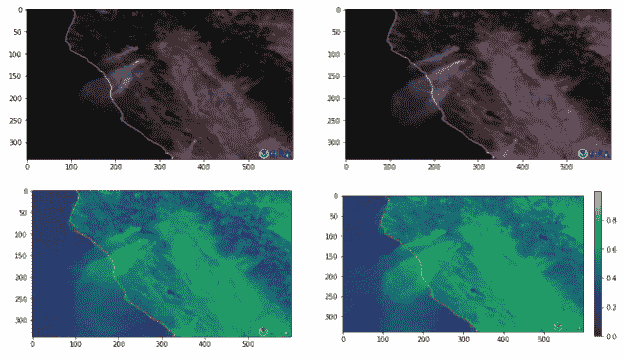
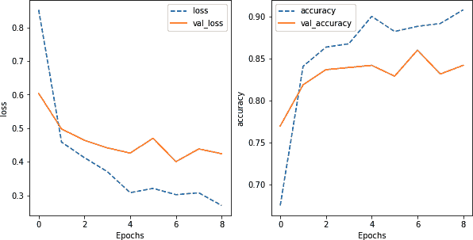

# 第七章：训练管道

预处理后的阶段是模型训练，在此期间，机器学习模型将读取训练数据，并使用该数据调整其权重（参见 图 7-1）。训练后，将保存或导出模型以便部署。


###### 图 7-1\. 在模型训练过程中，ML 模型在预处理数据上进行训练，然后导出用于部署。导出的模型用于进行预测。

在本章中，我们将探讨如何使训练（和验证）数据的摄取过程更加高效。我们将利用我们可以使用的不同计算设备（CPU 和 GPU）之间的时间切片，并研究如何使整个过程更具韧性和可重现性。

###### 小贴士

本章的代码位于书籍的 *07_training* 文件夹中的 [GitHub 代码库](https://github.com/GoogleCloudPlatform/practical-ml-vision-book) 中。适用时，我们将提供代码示例和笔记本的文件名。

# 高效摄取

训练机器学习模型所花费的时间中，有很大一部分用于摄取数据——读取并将其转换为模型可用的形式。我们可以通过以下方式来简化和加快训练管道的这个阶段，从而提高效率：

高效存储数据

我们应尽可能多地预处理输入图像，并以便于读取的方式存储预处理值。

并行化数据读取

在摄取数据时，存储设备的速度往往是瓶颈。不同文件可以存储在不同的磁盘上，也可以通过不同的网络连接读取，因此通常可以并行读取数据。

与训练并行准备图像

如果我们可以在 GPU 训练的同时在 CPU 上并行预处理图像，我们应该这样做。

最大化 GPU 利用率

尽可能多地在 GPU 上进行矩阵和数学运算，因为它比 CPU 快几个数量级。如果我们的任何预处理操作涉及这些操作，我们应该将它们推送到 GPU 上。

让我们更详细地看看这些想法。

## 高效存储数据

将图像存储为单独的 JPEG 文件从机器学习的角度来看效率不高。在 第五章 中，我们讨论了如何将 JPEG 图像转换为 TensorFlow Records。在本节中，我们将解释为什么 TFRecords 是一种高效的存储机制，并考虑在将数据写出之前进行的预处理量在灵活性和效率之间的权衡。

### TensorFlow Records

为什么将图像存储为 TensorFlow Records？让我们考虑一下文件格式中我们寻找的内容。

我们知道我们将批量读取这些图像，因此最好能够使用单个网络连接读取整个图像批次，而不是为每个文件打开一个连接。一次性读取一个批次也将为我们的机器学习管道提供更大的吞吐量，并最小化 GPU 等待下一批图像的时间。

理想情况下，我们希望文件的大小在 10 到 100 MB 之间。这样可以在多个工作节点（每个 GPU 一个）中平衡读取图像的能力，并确保每个文件打开的时间足够长，以便在许多批次中分摊读取第一个字节的延迟。

此外，我们希望文件格式能够使从文件中读取的字节能够立即映射到内存结构，而无需解析文件或处理不同类型机器（如字节序）之间的存储布局差异。

符合所有这些标准的文件格式是 TensorFlow Records。我们可以将用于训练、验证和测试的图像数据存储到单独的 TFRecord 文件中，并在每个文件约 100 MB 的范围内进行分片。Apache Beam 提供了一个方便的 TFRecord 写入器，我们在第五章中使用过。

### 存储预处理数据

如果我们在训练循环中不需要进行预处理，可以提升训练管道的性能。我们可以在 JPEG 图像上执行所需的预处理，然后将预处理后的数据而不是原始数据写入。

在实践中，我们必须在创建 TensorFlow Records 的 ETL 管道和模型代码本身之间分割预处理操作。为什么不全部在 ETL 管道中完成或全部在模型代码中完成？原因是应用于 ETL 管道中的预处理操作仅在模型训练的每个周期中执行一次。然而，总会有预处理操作是特定于我们正在训练的模型或者需要在每个周期中有所不同的。这些不能在 ETL 管道中完成，必须在训练代码中完成。

在第五章中，我们解码了 JPEG 文件，将其缩放到 [0, 1] 之间，展开数组，并将展开的数组写入 TensorFlow Records 中：

```
def create_tfrecord(filename, label, label_int):
    img = tf.io.read_file(filename)
    img = tf.image.decode_jpeg(img, channels=IMG_CHANNELS)
    img = tf.image.convert_image_dtype(img, tf.float32)
    img = tf.reshape(img, [-1]) # flatten to 1D array
    return tf.train.Example(features=tf.train.Features(feature={
        `'``image``'`: _float_feature(img),
        ...
    })).SerializeToString()
```

在编写 TensorFlow Records 之前选择的操作是明确选择的。

如果愿意的话，我们可以做得更少——我们可以简单地读取 JPEG 文件，将每个文件的内容作为字符串写入 TensorFlow Records 中：

```
def create_tfrecord(filename, label, label_int):
    img = tf.io.read_file(filename)
    return tf.train.Example(features=tf.train.Features(feature={
        `'``image``'`: `_bytes_feature`(img),
        ...
    })).SerializeToString()
```

如果我们担心可能存在不同的文件格式（JPEG、PNG 等）或 TensorFlow 不理解的图像格式，我们可以解码每个图像，将像素值转换为公共格式，并将压缩的 JPEG 写成字符串存储起来。

我们也可以做得更多。例如，我们可以创建图像的嵌入并不是写入图像数据，而只是嵌入数据：

```
embedding_encoder = tf.keras.Sequential([
    hub.KerasLayer(
        "https://tfhub.dev/.../mobilenet_v2/...",
        trainable=False,
        input_shape=(256, 256, IMG_CHANNELS),
        name='mobilenet_embedding'),
])

def create_tfrecord(filename, label, label_int):
    img = tf.io.read_file(filename)
    img = tf.image.decode_jpeg(img, channels=IMG_CHANNELS)
    img = tf.image.convert_image_dtype(img, tf.float32)
    img = tf.resize(img, [256, 256, 3])
    embed = embedding_encoder(filename)
    embed = tf.reshape(embed, [-1]) # flatten to 1D array
    return tf.train.Example(features=tf.train.Features(feature={
        `'``image_embedding``'`: _float_feature(embed),
        ...
    })).SerializeToString()
```

选择执行哪些操作涉及效率和可重用性之间的权衡。这也受到我们所设想的可重用性类型的影响。请记住，ML 模型训练是一个高度迭代的实验过程。每次训练实验都会多次（由 epochs 数量指定）遍历训练数据集。因此，每个训练数据集中的 TFRecord 都必须被多次处理。我们能在写入 TFRecords 之前执行的处理越多，训练流水线本身就要进行的处理就越少。这将导致更快速、更高效的训练和更高的数据吞吐量。这个优势会倍增，因为通常我们不仅仅会训练一次模型；我们会使用多个超参数运行多次实验。另一方面，我们必须确保我们正在进行的预处理对我们希望使用这个数据集训练的所有 ML 模型都是有益的——我们进行的预处理越多，数据集的可重用性可能就越低。我们还不应该陷入微小优化的领域，这些微小优化可能会微幅提高速度，但会使代码变得不够清晰或可重用。

如果我们将图像嵌入（而不是像素值）写入 TensorFlow Records，训练流水线将会非常高效，因为嵌入计算通常涉及将图像通过一百多个神经网络层。效率提升是相当可观的。然而，这假定我们将进行迁移学习。我们不能使用这个数据集从头开始训练图像模型。当然，存储比计算便宜得多，我们可能还会发现创建两个数据集（一个是嵌入数据，另一个是像素值）是有利的。

因为 TensorFlow Records 可能在预处理方面有所不同，因此在元数据的形式中记录这一点是一个好的做法。解释记录中存在的数据以及数据生成方式。像[Google Cloud 数据目录](https://oreil.ly/T2W2N)、[Collibra](https://oreil.ly/MZNaZ)和[Informatica](https://oreil.ly/MsFaX)等通用工具可以帮助这一点，还有像[Feast 特征存储](https://oreil.ly/t3Rh2)这样的自定义 ML 框架。

## 并行读取数据

提高将数据导入训练流水线效率的另一种方法是并行读取记录。在第六章中，我们读取已写入的 TFRecords，并使用以下方法进行预处理：

```
preproc = _Preprocessor()
trainds = tf.data.TFRecordDataset(pattern)
            .map(preproc.read_from_tfr)
            .map(_preproc_img_label)
```

在这段代码中，我们正在做三件事：

1.  从模式中创建`TFRecordDataset`

1.  将每个文件中的记录传递给`read_from_tfr()`，该函数返回一个(img, label)元组。

1.  使用`_preproc_img_label()`预处理元组

### 并行化

我们可以对我们的代码进行一些改进，假设我们在一台具有多个虚拟 CPU 的机器上运行（大多数现代机器至少有两个 vCPU，通常更多）。首先，我们可以在创建数据集时要求 TensorFlow 自动交错读取：

```
tf.data.TFRecordDataset(pattern, num_parallel_reads=AUTO)
```

其次，两个 `map()` 操作可以使用并行化：

```
.map(preproc.read_from_tfr, num_parallel_calls=AUTOTUNE)
```

### 测量性能

为了衡量这些变化的性能影响，我们需要遍历数据集并执行一些数学运算。让我们计算所有图像的平均值。为了防止 TensorFlow 优化掉任何计算（见下面的侧边栏），我们只计算每次迭代中高于某个随机阈值的像素的平均值：

```
def loop_through_dataset(ds, nepochs):
    lowest_mean = tf.constant(1.)
    for epoch in range(nepochs):
        thresh = np.random.uniform(0.3, 0.7)  # random threshold
        ...
        for (img, label) in ds:
            ...
            mean = tf.reduce_mean(tf.where(img > thresh, img, 0))
            ...
```

表 7-1 显示了在使用不同机制时，测量前述循环性能的结果。显然，虽然额外的并行化增加了整体 CPU 时间，但实际的挂钟时间随着每次并行化减少。通过使映射并行化并交错两个数据集，我们减少了 35%的时间。

表 7-1\. 使用不同方式处理小数据集时循环所需的时间

| 方法 | CPU 时间 | 墙上时间 |
| --- | --- | --- |
| 普通 | 7.53 s | 7.99 s |
| 并行映射 | 8.30 s | 5.94 s |
| 交错 | 8.60 s | 5.47 s |
| 交错 + 并行映射 | 8.44 s | 5.23 s |

这种性能提升是否会延续到机器学习模型？为了测试这一点，我们可以尝试训练一个简单的线性分类模型，而不是使用 `loop_through_dataset()` 函数：

```
def train_simple_model(ds, nepochs):
    model = tf.keras.Sequential([
        tf.keras.layers.Flatten(
            input_shape=(IMG_HEIGHT, IMG_WIDTH, IMG_CHANNELS)),
        tf.keras.layers.Dense(len(CLASS_NAMES), activation='softmax')
    ])
    model.compile(optimizer=tf.keras.optimizers.Adam(),
                  loss=tf.keras.losses.SparseCategoricalCrossentropy(
                      from_logits=False),
                  metrics=['accuracy'])
    model.fit(ds, epochs=nepochs)
```

结果显示在表 7-2 中，说明性能提升是可持续的——我们在第一行和最后一行之间获得了 25%的加速。随着模型复杂度的增加，I/O 在整体时间中的作用越来越小，因此改进的效果也就相应减少。

表 7-2\. 使用不同方式处理小数据集时训练线性 ML 模型所需的时间

| 方法 | CPU 时间 | 墙上时间 |
| --- | --- | --- |
| 普通 | 9.91 s | 9.39 s |
| 并行映射 | 10.7 s | 8.17 s |
| 交错 | 10.5 s | 7.54 s |
| 交错 + 并行映射 | 10.3 s | 7.17 s |

循环遍历数据集比在完整训练数据集上训练实际的 ML 模型更快。用它作为一种轻量级方式来运行您的摄取代码，以调整 I/O 部分的性能。

## 最大化 GPU 利用率

由于 GPU 在执行机器学习模型操作时更有效率，我们的目标应该是最大化它们的利用率。如果我们按小时租用 GPU（就像在公共云中那样），最大化 GPU 利用率将使我们能够利用它们的增强效率，从而比在 CPU 上训练时获得更低的总体训练成本。

有三个因素会影响我们模型的性能：

1.  每次在 CPU 和 GPU 之间传输数据时，该传输都需要时间。

1.  GPU 在矩阵数学上非常高效。我们对单个项目执行的操作越多，就越少利用 GPU 提供的性能加速。

1.  GPU 具有有限的内存。

这些因素在优化中起到了作用，可以改善我们训练循环的性能。在本节中，我们将探讨最大化 GPU 利用率的三个核心思想：高效数据处理、向量化和保持在图中。

### 高效数据处理

当我们在 GPU 上训练模型时，CPU 会处于空闲状态，而 GPU 则在计算梯度和进行权重更新。

为了让 CPU 有事可做，我们可以要求它*预取*数据，这样下一批数据就准备好传递给 GPU：

```
ds = create_preproc_dataset(
    'gs://practical-ml-vision-book/flowers_tfr/train' + PATTERN_SUFFIX
)`.``prefetch``(``AUTOTUNE``)`
```

如果我们有一个小数据集，特别是图像或 TensorFlow 记录必须通过网络读取的数据集，将它们缓存在本地也可能会有所帮助：

```
ds = create_preproc_dataset(
    'gs://practical-ml-vision-book/flowers_tfr/train' + PATTERN_SUFFIX
).cache()
```

表格 7-3 展示了预取和缓存对模型训练时间的影响。

表格 7-3\. 在小数据集上训练线性 ML 模型时，当输入记录被预取和/或缓存时所花费的时间

| 方法 | CPU 时间 | 墙时间 |
| --- | --- | --- |
| 交错 + 并行 | 9.68 s | 6.37 s |
| 缓存 | 6.16 s | 4.36 s |
| 预取 + 缓存 | 5.76 s | 4.04 s |

###### 注意

根据我们的经验，缓存通常只适用于小（玩具）数据集。对于大数据集，您可能会耗尽本地存储空间。

### 向量化

因为 GPU 擅长矩阵操作，我们应该尽量给 GPU 提供它可以处理的最大数据量。而不是一次传递一个图像，我们应该传递一个图像批次——这称为*向量化*。

要对记录进行批处理，我们可以这样做：

```
ds = create_preproc_dataset(
    'gs://practical-ml-vision-book/flowers_tfr/train' + PATTERN_SUFFIX
).prefetch(AUTOTUNE).`batch``(``32``)`
```

重要的是要意识到整个 Keras 模型是批处理操作。因此，我们添加的`RandomFlip`和`RandomColorDistortion`预处理层不是逐个图像处理，而是处理图像批次。

批量大小越大，训练循环通过一个时期的速度就越快。但是，增加批量大小会带来递减的回报。此外，还受到 GPU 内存限制的限制。值得对使用更大、更昂贵的机器（具有更多 GPU 内存）进行更短时间训练的成本效益进行分析，与使用较小、更便宜的机器进行更长时间训练进行比较。

###### 提示

在 Google 的 Vertex AI 上训练时，GPU 内存使用情况和利用率会自动报告每个作业。Azure 允许您为 GPU 监控[配置容器](https://oreil.ly/J2dhk)。Amazon CloudWatch 在 AWS 上提供 GPU 监控。如果您管理自己的基础设施，请使用类似 [`nvidia-smi`](https://oreil.ly/bSEhN) 或 [AMD 系统监视器](https://oreil.ly/PIaLQ) 的 GPU 工具。您可以使用这些工具诊断 GPU 的使用效果以及 GPU 内存是否有余地来增加批量大小。

在表 7-4 中，我们展示了改变批量大小对线性模型的影响。更大的批量更快，但有递减回报，并且在某一点之后我们将耗尽板载 GPU 内存。增加批量大小后的更快性能是 TPU 成本效益如此高的原因之一，因为它们具有大容量的板载内存和共享内存的互联核心。

表 7-4\. 在不同批量大小下训练线性 ML 模型所需时间

| 方法 | CPU 时间 | 墙时间 |
| --- | --- | --- |
| 批量大小 1 | 11.4 s | 8.09 s |
| 批量大小 8 | 9.56 s | 6.90 s |
| 批量大小 16 | 9.90 s | 6.70 s |
| 批量大小 32 | 9.68 s | 6.37 s |

我们将随机翻转、颜色失真和其他预处理以及数据增强步骤作为 Keras 层在第六章中实现的一个关键原因与批处理有关。我们本可以使用 `map()` 来进行颜色失真，如下所示：

```
trainds = tf.data.TFRecordDataset(
        [filename for filename in tf.io.gfile.glob(pattern)]
    ).map(preproc.read_from_tfr).map(_preproc_img_label
    )`.``map``(``color_distort``)`.batch(32)
```

其中 `color_distort()` 是：

```
def color_distort(image, label):
    contrast = np.random.uniform(0.5, 1.5)
    brightness = np.random.uniform(-0.2, 0.2)
    image = tf.image.adjust_contrast(image, contrast)
    image = tf.image.adjust_brightness(image, brightness)
    image = tf.clip_by_value(image, 0, 1)
    return image, label
```

但这样做效率低下，因为训练流水线将不得不逐个图像进行颜色失真。如果我们在 Keras 层中执行预处理操作，则效率要高得多。这样，预处理就可以在一个步骤中对整个批次进行。另一种选择是通过编写以下代码对颜色失真操作进行向量化：

```
    ).batch(32).map(color_distort)
```

这也会导致颜色失真发生在一批数据上。然而，最佳实践是在 Keras 层中编写遵循 `batch()` 操作的预处理代码。有两个原因支持这样做。首先，如果我们始终将对 `batch()` 的调用作为硬边界，则摄入代码与模型代码之间的分离更清晰且更易维护。其次，将预处理保持在 Keras 层中（见第六章）使得在推断流水线中复现预处理功能更容易，因为所有模型层都会自动导出。

### 留在图中

因为在 GPU 上执行数学函数比在 CPU 上高效得多，TensorFlow 使用 CPU 读取数据，将数据传输到 GPU，然后在 GPU 上运行属于 `tf.data` 管道的所有代码（例如 `map()` 调用中的代码）。它还在 GPU 上运行 Keras 模型层中的所有代码。由于我们直接将数据从 `tf.data` 管道发送到 Keras 输入层，因此无需传输数据——数据保留在 TensorFlow 图中。数据和模型权重都保留在 GPU 内存中。

这意味着我们必须非常小心，确保在 CPU 将数据传送到 GPU 后，不要做任何可能涉及移动数据出 TensorFlow 图的操作。数据传输会带来额外的开销，而且在 CPU 上执行的任何代码都会变慢。

#### 迭代

例如，假设我们正在读取加利福尼亚野火的卫星图像，并希望根据光度测定来应用特定的公式将 RGB 像素值转换为单一的“灰度”图像（见图 7-2），完整的代码在 GitHub 上的 [*07b_gpumax.ipynb*](https://github.com/GoogleCloudPlatform/practical-ml-vision-book/blob/master/07_training/07b_gpumax.ipynb) 中：

```
def to_grayscale(img):
    rows, cols, _ = img.shape
    result = np.zeros([rows, cols], dtype=np.float32)
    for row in range(rows):
        for col in range(cols):
            red = img[row][col][0]
            green = img[row][col][1]
            blue = img[row][col][2]
            c_linear = 0.2126 * red + 0.7152 * green + 0.0722 * blue
            if c_linear > 0.0031308:
                result[row][col] = 1.055 * pow(c_linear, 1/2.4) - 0.055
            else:
                result[row][col] = 12.92 * c_linear
    return result
```

这个函数存在三个问题：

+   它需要遍历图像像素：

    ```
    rows, cols, _ = img.shape
        for row in range(rows):
        for col in range(cols):
    ```

+   它需要读取单个像素值：

    ```
    green = img[row][col][1]
    ```

+   它需要更改输出像素值：

    ```
    result[row][col] = 12.92 * c_linear
    ```



###### 图 7-2\. 顶部：具有三个通道的原始图像。底部：只有一个通道的转换后的图像。加利福尼亚野火图像由 NOAA 提供。

这些操作无法在 TensorFlow 图中执行。因此，为了调用该函数，我们需要使用 `.numpy()` 将其从图中提取出来，进行转换，然后将结果作为张量推回图中（`gray` 被转换为张量以进行 `reduce_mean()` 操作）。

#### 切片和条件语句

我们可以通过使用 TensorFlow 的切片功能避免显式迭代和像素级读写：

```
def to_grayscale(img):
    # TensorFlow slicing functionality
    red = `img``[``:``,` `:``,` `0``]`
    green = img[:, :, 1]
    blue = img[:, :, 2]
    c_linear = 0.2126 * red + 0.7152 * green + 0.0722 * blue
```

请注意，此代码片段的最后一行实际上是在张量上操作的（`red` 是一个张量，不是标量），并使用操作符重载（`+` 实际上是 `tf.add()`）来调用 TensorFlow 函数。

但是我们如何在原始代码中执行 `if` 语句？

```
if c_linear > 0.0031308:
    result[row][col] = 1.055 * pow(c_linear, 1 / 2.4) - 0.055
else:
    result[row][col] = 12.92 * c_linear
```

`if` 语句假定 `c_linear` 是一个单一的浮点值，而现在 `c_linear` 是一个二维张量。

为了将条件语句推入图中并避免逐个设置像素值，我们可以使用 `tf.cond()` 和/或 `tf.where()`：

```
gray = tf.where(c_linear > 0.0031308,
                1.055 * tf.pow(c_linear, 1 / 2.4) - 0.055,
                12.92 * c_linear)
```

有一点需要注意的是，此示例中 `tf.where()` 的所有三个参数实际上都是二维张量。还要注意使用 `tf.pow()` 而不是 `pow()`。在 `tf.cond()` 和 `tf.where()` 之间的选择时，应优先使用 `tf.where()`，因为它更快。

这将导致超过 10 倍的速度提升。

#### 矩阵运算

可以进一步优化 `c_linear` 的计算。这是我们的代码：

```
red = img[:, :, 0]
green = img[:, :, 1]
blue = img[:, :, 2]
c_linear = 0.2126 * red + 0.7152 * green + 0.0722 * blue
```

如果我们仔细观察这个计算，我们会发现我们不需要切片。相反，如果我们将常数放入一个 3x1 张量中，我们可以将计算写成矩阵乘法：

```
def to_grayscale(img):
    wt = tf.constant([[0.2126], [0.7152], [0.0722]]) # 3x1 matrix
    `c_linear` `=` `tf``.``matmul``(``img``,` `wt``)`  # (ht,wd,3) x (3x1) -> (ht, wd)
    gray = tf.where(c_linear > 0.0031308,
                    1.055 * tf.pow(c_linear, 1 / 2.4) - 0.055,
                    12.92 * c_linear)
    return gray
```

通过这种优化，我们额外获得 4 倍的加速。

#### 批处理

一旦我们用矩阵数学写下了`c_linear`的计算，我们还意识到我们不需要逐个图像地处理数据。我们可以一次处理一批图像。我们可以使用自定义 Keras 层或`Lambda`层在一批图像上进行计算。

让我们将灰度计算封装到一个自定义 Keras 层的`call()`语句中：

```
class Grayscale(tf.keras.layers.Layer):
    def __init__(self, **kwargs):
        super(Grayscale, self).__init__(kwargs)

    def call(self, img):
        wt = tf.constant([[0.2126], [0.7152], [0.0722]]) # 3x1 matrix
        c_linear = tf.matmul(img, wt)  #(N, ht,wd,3)x(3x1)->(N, ht, wd)
        gray = tf.where(c_linear > 0.0031308,
                        1.055 * tf.pow(c_linear, 1 / 2.4) - 0.055,
                        12.92 * c_linear)
        return gray # (N, ht, wd)
```

一个重要的注意事项是，输入矩阵现在是一个 4D 张量，第一个维度是批量大小。因此，结果是一个 3D 张量。

调用此代码的客户端可以计算每个图像的平均值以获取一个 1D 张量的平均值：

```
tf.keras.layers.Lambda(lambda gray: tf.reduce_mean(gray, axis=[1, 2]))
```

我们可以将这两层组合成一个 Keras 模型，或者将它们放在现有模型的前面：

```
preproc_model = tf.keras.Sequential([
    Grayscale(input_shape=(336, 600, 3)),
    tf.keras.layers.Lambda(lambda gray: tf.reduce_mean(
                              gray, axis=[1, 2]))  # note axis change
])
```

所有讨论过的方法在本节中的时间显示在表 7-5 中。

表 7-5\. 不同方式进行灰度计算时所需的时间

| 方法 | CPU 时间 | 墙上时间 |
| --- | --- | --- |
| 迭代 | 39.6 s | 41.1 s |
| Pyfunc | 39.7 s | 41.1 s |
| 切片 | 4.44 s | 3.07 s |
| Matmul | 1.22 s | 2.29 s |
| 批处理 | 1.11 s | 2.13 s |

# 保存模型状态

在本书中，我们一直在训练一个模型，然后立即使用训练好的模型进行一些预测。这是非常不现实的——我们将希望训练我们的模型，并保留训练好的模型以便随时进行预测。我们需要保存模型的状态，以便在需要时快速读取训练好的模型（其结构和最终权重）。

我们不仅要保存模型以便预测，还要恢复训练。想象一下，我们已经在百万张图片上训练了一个模型，并用该模型进行预测。一个月后，我们收到一千张新图片，那么用新图片继续训练原始模型几步将是不错的选择，而不是从头开始训练。这被称为微调（在第三章中讨论过）。

因此，有两个原因可以保存模型状态：

+   从模型中进行推理

+   恢复训练

这两种用例需要的是非常不同的。如果我们考虑我们模型中的`RandomColorDistortion`数据增强层，最容易理解这两种用例之间的区别。为了推断，这一层可以完全移除。然而，为了恢复训练，我们可能需要知道层的完整状态（例如，随着训练时间的增加，我们降低了扭曲的程度）。

为了进行推断而保存模型称为*导出*模型。为了恢复训练而保存模型称为*检查点*。检查点的大小比导出大得多，因为它们包含了更多的内部状态。

## 导出模型

要导出一个训练好的 Keras 模型，请使用`save()`方法：

```
os.mkdir('export')
model.save('export/flowers_model')
```

输出目录将包含一个名为*saved_model.pb*的 protobuf 文件（这也是为什么这种格式经常被称为 TensorFlow SavedModel 格式）、变量权重以及模型预测所需的任何资源，比如词汇文件。

###### 提示

SavedModel 的一个替代方案是 Open Neural Network Exchange (ONNX)，这是一个由 Microsoft 和 Facebook 引入的开源、与框架无关的 ML 模型格式。您可以使用[`tf2onnx`工具](https://oreil.ly/ZXkFo)将 TensorFlow 模型转换为 ONNX 格式。

### 调用模型

我们可以使用随 TensorFlow 一起提供的命令行工具`saved_model_cli`来查询 SavedModel 的内容：

```
saved_model_cli show --tag_set all --dir export/flowers_model
```

这显示了预测签名（见下面的侧边栏）是：

```
inputs['random/center_crop_input'] tensor_info:
    dtype: DT_FLOAT
    shape: (-1, 448, 448, 3)
    name: serving_default_random/center_crop_input:0
```

给定的 SavedModel `SignatureDef`包含以下输出：

```
outputs['flower_prob'] tensor_info:
    dtype: DT_FLOAT
    shape: (-1, 5)
    name: StatefulPartitionedCall:0
Method name is: tensorflow/serving/predict
```

因此，要调用这个模型，我们可以加载它并调用`predict()`方法，传入一个形状为`[num_examples, 448, 448, 3]`的 4D 张量，其中 num_examples 是我们希望一次性进行预测的示例数：

```
serving_model = tf.keras.models.load_model('export/flowers_model')
img = create_preproc_image('../dandelion/9818247_e2eac18894.jpg')
batch_image = tf.reshape(img, [1, IMG_HEIGHT, IMG_WIDTH, IMG_CHANNELS])
batch_pred = serving_model.predict(batch_image)
```

结果是一个形状为[num_examples, 5]的 2D 张量，表示每种花卉的概率。我们可以查找这些概率中的最大值来获取预测结果：

```
pred = batch_pred[0]
pred_label_index = tf.math.argmax(pred).numpy()
pred_label = CLASS_NAMES[pred_label_index]
prob = pred[pred_label_index]
```

然而，所有这些仍然非常不现实。我们真的期望一个需要对图像进行预测的客户端会知道如何执行`reshape()`、`argmax()`等操作吗？我们需要为我们的模型提供一个更简单的签名。

### 可用签名

对于我们的模型来说，更易用的签名是那种不暴露训练中所有内部细节的（例如模型训练时使用的图像大小）。

对于客户端使用起来最方便的签名是什么？与其要求他们发送一个包含图像内容的张量，我们可以简单地要求他们发送一个 JPEG 文件。而不是返回一个 logits 张量，我们可以发送从 logits 中提取的易于理解的信息（完整代码在 GitHub 上的[*07c_export.ipynb*](https://github.com/GoogleCloudPlatform/practical-ml-vision-book/blob/master/07_training/07c_export.ipynb)中）：

```
@tf.function(input_signature=[tf.TensorSpec([None,], dtype=tf.string)])
def predict_flower_type(filenames):
    ...
    return {
        'probability': top_prob,
        'flower_type_int': pred_label_index,
        'flower_type_str': pred_label
    }
```

注意，顺便说一下，我们可以使函数更加高效——我们可以获取一批文件名，并一次性对所有图像进行预测。向量化不仅在训练时带来效率增益，在预测时也同样如此！

给定一个文件名列表，我们可以使用以下方式获取输入图像：

```
input_images = [create_preproc_image(f) for f in filenames]
```

然而，这涉及遍历文件名列表，并在加速的 TensorFlow 代码与非加速的 Python 代码之间来回传递数据。如果我们有一个文件名的张量，可以通过使用`tf.map_fn()`在保持所有数据在 TensorFlow 图中的同时实现迭代的效果。有了这个，我们的预测函数变成了：

```
input_images = tf.map_fn(
    create_preproc_image,
    filenames,
    fn_output_signature=tf.float32
)
```

接下来，我们调用模型以获取完整的概率矩阵：

```
batch_pred = model(input_images)
```

然后我们找到最大概率及其索引：

```
top_prob = tf.math.reduce_max(batch_pred, axis=1)
pred_label_index = tf.math.argmax(batch_pred, axis=1)
```

注意，在找到最大概率和 argmax 时我们小心指定了`axis`为 1（`axis=0` 是批处理维度）。最后，在 Python 中我们可以简单地执行：

```
pred_label = CLASS_NAMES[pred_label_index]
```

TensorFlow 中图形内版本的使用是使用`tf.gather()`：

```
pred_label = tf.gather(params=tf.convert_to_tensor(CLASS_NAMES),
                       indices=pred_label_index)
```

此代码将`CLASS_NAMES`数组转换为张量，然后使用`pred_label_index`张量对其进行索引。结果值存储在`pred_label`张量中。

###### 提示

你可以经常用`tf.map_fn()`代替 Python 迭代，并使用`tf.gather()`来解引用数组（读取数组的第*n*个元素），正如我们在这里所做的那样。使用 [:, :, 0] 语法进行切片非常有用。`tf.gather()`与切片的区别在于，`tf.gather()`可以接受张量作为索引，而切片是常量。在非常复杂的情况下，`tf.dynamic_stitch()`会非常有用。

### 使用签名

定义了签名后，我们可以将我们的新签名指定为服务的默认签名：

```
model.save('export/flowers_model',
           signatures={
               'serving_default': predict_flower_type
           })
```

注意，API 允许我们在模型中有多个签名——如果我们想要为签名添加版本控制，或者为不同的客户端支持不同的签名，这将非常有用。我们将在第 9 章进一步探讨这一点。

导出模型后，客户端代码进行预测现在变得非常简单：

```
serving_fn = tf.keras.models.load_model('export/flowers_model'
                                       ).signatures['serving_default']
filenames = [
    'gs://.../9818247_e2eac18894.jpg',
     ...
    'gs://.../8713397358_0505cc0176_n.jpg'
]
`pred` `=` `serving_fn``(``tf``.``convert_to_tensor``(``filenames``)``)`
```

结果是一个字典，可以按以下方式使用：

```
print(`pred``[``'``flower_type_str``'``]`.numpy().decode('utf-8'))
```

展示了一些输入图像及其预测结果，见图 7-3。要注意的是，这些图像都是不同尺寸的。客户端在调用模型时不需要了解任何模型的内部细节。值得注意的是，在 TensorFlow 中，“string”类型只是一个字节数组。我们必须将这些字节传递到 UTF-8 解码器中，以获取正确的字符串。


###### 图 7-3。在几幅图像上的模型预测。

## 检查点

到目前为止，我们专注于如何导出模型以进行推理。现在，让我们看看如何保存模型以便恢复训练。检查点通常不仅在训练结束时完成，还会在训练中间完成。这样做有两个原因：

+   在验证准确度最高的点重新选择模型可能会有所帮助。请记住，随着训练时间的延长，训练损失会持续减少，但在某个时期，由于过拟合，验证损失开始上升。当我们观察到这一点时，我们必须选择前一个时期的检查点，因为它具有最低的验证错误。

+   在生产数据集上进行机器学习可能需要几个小时到几天的时间。在这么长的时间段内，机器崩溃的可能性相当高。因此，定期备份是个好主意，这样我们就可以从中间点恢复训练，而不是从头开始。

Keras 通过*回调*实现检查点功能——这些功能在训练循环中被调用，通过将其作为参数传递给`model.fit()`函数来实现：

```
model_checkpoint_cb = tf.keras.callbacks.ModelCheckpoint(
    filepath='./chkpts',
    monitor='val_accuracy', mode='max',
    `save_best_only``=``True`)
history = model.fit(train_dataset,
                    validation_data=eval_dataset,
                    epochs=NUM_EPOCHS,
                    `callbacks``=``[``model_checkpoint_cb``]``)`
```

在这里，我们正在设置回调函数，如果当前验证准确度更高，则覆盖先前的检查点。

在我们进行此操作的同时，我们可以设置早停策略——即使最初我们认为需要训练 20 个时期，一旦验证误差连续 2 个时期没有改进（由`patience`参数指定），我们就可以停止训练：

```
early_stopping_cb = tf.keras.callbacks.EarlyStopping(
    monitor='val_accuracy', mode='max',
    patience=2)
```

现在回调列表如下：

```
callbacks=[model_checkpoint_cb, early_stopping_cb]
```

当我们使用这些回调进行训练时，训练在八个时期后停止，如图 7-4 所示。



###### 图 7-4。在早停策略下，模型训练在验证准确度不再提高时停止。

要从输出目录中的最后一个检查点开始，请调用：

```
model.load_weights(checkpoint_path)
```

完整的故障恢复由[`BackupAndRestore`](https://oreil.ly/JD3a1)回调提供，此时它还处于试验阶段。

# 分发策略

要将处理分布到多个线程、加速器或机器中，我们需要并行化处理。我们已经看过如何并行化摄入。但是，我们的 Keras 模型并没有并行化；它只在一个处理器上运行。我们如何在多个处理器上运行我们的模型代码？

要分发模型训练，我们需要设置*分发策略*。有几种可用的策略，但它们的使用方式都相似——您首先使用其构造函数创建一个策略，然后在该策略的范围内创建 Keras 模型（这里我们使用`MirroredStrategy`）：

```
strategy = tf.distribute.MirroredStrategy()
with strategy.scope():
    layers = [
        ...
    ]
    model = tf.keras.Sequential(layers)
model.compile(...)
history = model.fit(...)
```

`MirroredStrategy`是什么？还有哪些其他策略可用，我们该如何在它们之间进行选择？我们将在接下来的章节中回答这些问题。

###### 提示

代码运行在哪个设备上？所有创建可训练变量的 TensorFlow 指令（如 Keras 模型或层）必须在`strategy.scope()`内创建，除了`model.compile()`。您可以在任何地方调用`compile()`方法。尽管这个方法在技术上创建变量（例如优化器槽位），但它已实现为使用与模型相同的策略。此外，您可以在任何地方创建您的摄取（`tf.data`）管道。它将始终在 CPU 上运行，并始终适当地分发数据给工作节点。

## 选择策略

图像 ML 模型往往很深，输入数据很密集。对于这样的模型，有三种竞争的分发策略：

`MirroredStrategy`

在每个可用的 GPU 上创建模型结构的镜像。模型中的每个权重都在所有副本之间进行镜像，并通过在每个批次结束时发生的相同更新保持同步。无论该机器具有一个 GPU 还是多个 GPU，都可以使用`MirroredStrategy`。这样，当您连接第二个 GPU 时，您的代码将无需更改。

`MultiWorkerMirroredStrategy`

将`MirroredStrategy`的思想扩展到分布在多台机器上的 GPU。为了使多个工作节点进行通信，您需要正确设置[TF_CONFIG 变量](https://oreil.ly/m2U4N)，我们建议使用公共云服务（例如 Vertex Training），这样可以为您自动完成设置。

`TPUStrategy`

在 TPU 上运行训练作业，TPU 是专门为机器学习工作负载定制的专用应用特定集成电路（ASIC），通过自定义矩阵乘法单元、高速板上网络连接高达数千个 TPU 核心和大型共享内存获得加速。它们仅在 Google Cloud Platform 上商业可用。Colab 提供了带有一些限制的免费 TPU，并且 Google Research 通过[TensorFlow 研究云计划](https://oreil.ly/qdEOw)为学术研究人员提供访问 TPU 的权限。

这三种策略都是*数据并行*的形式，每个批次都在工作节点之间分割，然后进行[全局归约操作](https://oreil.ly/0Zhcg)。其他可用的分发策略，如`CentralStorage`和`ParameterServer`，设计用于稀疏/大型示例，不适合像个别图像密集小的图像模型。

###### 提示

我们建议在单台机器上最大化 GPU 数量，使用`MirroredStrategy`，然后再转向使用多个工作节点的`MultiWorkerMirroredStrategy`（更多详细信息请参见后续章节）。特别是当您转向更大的批处理大小时，TPU 通常比 GPU 更具成本效益。目前 GPU（如 16xA100）的趋势是在单台机器上提供多个强大的 GPU，以便使这种策略适用于更多模型。

## 创建策略

在本节中，我们将介绍用于分发图像模型训练的三种常用策略的具体细节。

### MirroredStrategy

要创建`MirroredStrategy`实例，我们可以简单地调用其构造函数（完整代码在[*07d_distribute.ipynb* on GitHub](https://github.com/GoogleCloudPlatform/practical-ml-vision-book/blob/master/07_training/07d_distribute.ipynb)中）：

```
def create_strategy():
    return tf.distribute.MirroredStrategy()
```

要验证我们是否在配置了 GPU 的机器上运行，我们可以使用：

```
if (tf.test.is_built_with_cuda() and
    len(tf.config.experimental.list_physical_devices("GPU")) > 1)
```

这不是必须要求；`MirroredStrategy` 在只有 CPU 的机器上也能工作。

在具有两个 GPU 的机器上启动 Jupyter 笔记本，并使用`MirroredStrategy`，我们看到了显著的加速。在 CPU 上处理一个时代大约需要 100 秒，而在单个 GPU 上需要 55 秒，而在拥有两个 GPU 时，仅需 29 秒。

在分布式训练中，必须确保增加批次大小。这是因为一个批次被分割在多个 GPU 之间，因此如果单个 GPU 有资源处理批次大小为 32，那么两个 GPU 将能够轻松处理 64。这里，64 是全局批次大小，每个 GPU 的本地批次大小为 32。更大的批次大小通常与更好的训练曲线行为相关联。我们将在“超参数调整”中尝试不同的批次大小。

###### 注意

有时，即使不分发训练代码或使用 GPU，为了一致性和调试目的，拥有一种策略也是有帮助的。在这种情况下，请使用`OneDeviceStrategy`：

```
tf.distribute.OneDeviceStrategy('/cpu:0')
```

### MultiWorkerMirroredStrategy

要创建`MultiWorkerMirroredStrategy`实例，我们可以再次简单地调用其构造函数：

```
def create_strategy():
    return tf.distribute.MultiWorkerMirroredStrategy()
```

要验证`TF_CONFIG`环境变量是否正确设置，我们可以使用：

```
tf_config = json.loads(os.environ["TF_CONFIG"])
```

并检查结果配置。

如果使用类似 Google 的 Vertex AI 或 Amazon SageMaker 的托管 ML 训练系统，这些基础设施细节将被照顾。

在使用多个工作进程时，有两个细节需要注意：洗牌和虚拟周期。

#### Shuffling

当所有设备（CPU、GPU）都在同一台机器上时，每个训练样本批次都会分配给不同的设备工作进程，并且产生的梯度更新是*同步*的 —— 每个设备工作进程返回其梯度，这些梯度在设备工作进程之间进行平均，计算出的权重更新发送回设备工作进程用于下一步。

当设备分布在多台机器上时，让中心循环等待每台机器上的所有工作进程完成一个批次将导致计算资源的显著浪费，因为所有工作进程都必须等待最慢的一个。相反，思路是让工作进程并行处理数据，并且如果可用，平均梯度更新 —— 迟到的梯度更新从计算中简单丢弃。每个工作进程接收到当前时刻的权重更新。

当我们像这样异步地应用梯度更新时，我们不能将一批数据跨越不同的工作器进行分割，因为这样我们的批次将是不完整的，而我们的模型将希望等大小的批次。因此，我们必须让每个工作器读取完整的数据批次，计算梯度，并为每个完整的批次发送梯度更新。如果我们这样做，那么所有工作器读取相同数据就毫无意义了——我们希望每个工作器的批次包含不同的示例。通过对数据集进行洗牌，我们可以确保工作器在任何时候都在处理不同的训练示例。

即使我们不进行分布式训练，随机读取 `tf.data` 流水线中的数据顺序也是一个好主意。这将有助于减少一批数据中全是雏菊，下一批数据中全是郁金香等情况发生的可能性。这样的糟糕批次可能会对梯度下降优化器造成严重影响。

我们可以在两个地方随机读取数据：

+   当我们获得与模式匹配的文件时，我们会对这些文件进行洗牌：

    ```
    files = [filename for filename
        # shuffle so that workers see different orders
        in `tf``.``random``.``shuffle`(tf.io.gfile.glob(pattern))
    ]
    ```

+   在我们预处理数据之后，在批处理之前，我们将记录在比批量大小大的缓冲区内进行洗牌：

    ```
    trainds = (trainds
        `.``shuffle``(``8` `*` `batch_size``)`  # Shuffle for distribution ...
        .map(preproc.read_from_tfr, num_parallel_calls=AUTOTUNE)
        .map(_preproc_img_label, num_parallel_calls=AUTOTUNE)
        .prefetch(AUTOTUNE)
    )
    ```

+   您的数据集越有序，您的洗牌缓冲区就需要越大。如果您的数据集最初按标签排序，那么只有涵盖整个数据集的缓冲区大小才能工作。在这种情况下，最好是在准备训练数据集时提前洗牌数据。

#### 虚拟时代

我们通常希望对固定数量的训练示例进行训练，而不是对固定数量的时代进行训练。由于一个时代中的训练步骤数量取决于批量大小，因此更容易依据数据集中的总训练示例数计算每个时代的步数应该是多少：

```
num_steps_per_epoch = None
if (num_training_examples > 0):
    num_steps_per_epoch = (num_training_examples // batch_size)
```

我们称这个步数的训练周期为 *虚拟时代* 并且与以前一样训练相同数量的时代。

我们将虚拟时代的步数指定为 `model.fit()` 的参数：

```
history = model.fit(train_dataset,
                    validation_data=eval_dataset,
                    epochs=num_epochs,
                    `steps_per_epoch``=``num_steps_per_epoch`)                      )
```

如果我们对数据集中的训练示例数量估计错误会发生什么？假设我们将数字指定为 4,000，但实际上有 3,500 个示例？我们将遇到问题，因为数据集会在遇到 4,000 个示例之前完成。我们可以通过使训练数据集无限重复来防止这种情况发生：

```
if (num_training_examples > 0):
    train_dataset = train_dataset`.``repeat``(``)`
```

当我们低估数据集中的训练示例数量时，这也适用——下一组示例将简单地转移到下一个时代。Keras 知道当数据集是无限的时候，应该使用每个时代的步数来决定下一个时代何时开始。

### TPUStrategy

虽然 `MirroredStrategy` 适用于单台机器上的一个或多个 GPU，而 `MultiWorkerMirroredStrategy` 适用于多台机器上的 GPU，`TPUStrategy` 则允许我们分布到名为 TPU 的自定义 ASIC 芯片上，如 图 7-5 所示。


###### 图 7-5\. 张量处理单元。

要创建一个`TPUStrategy`实例，我们可以调用它的构造函数，但必须向该构造函数传递一个参数：

```
tpu = tf.distribute.cluster_resolver.TPUClusterResolver().connect()
return tf.distribute.TPUStrategy(tpu)
```

因为 TPU 是多用户机器，初始化将擦除 TPU 上的现有内存，因此在程序中进行任何工作之前，我们必须确保初始化 TPU 系统。

此外，我们在`model.compile()`中添加了额外的参数：

```
model.compile(steps_per_execution=32)
```

此参数指示 Keras 一次向 TPU 发送多个批次。除了降低通信开销外，这还使得编译器有机会在多个批次间优化 TPU 硬件利用率。有了这个选项，不再需要将批次大小推到非常高的值以优化 TPU 性能。

值得注意的是，在 TensorFlow/Keras 中，分发数据的复杂代码会自动由`strategy.distribute_dataset()`处理，用户无需担心。在撰写本文时，这是在 PyTorch 中需要手动编写的代码。

然而，仅仅编写软件还不够；我们还需要设置硬件。例如，要使用`MultiWorkerMirroredStrategy`，我们还需要启动一个协调训练 ML 模型任务的机器集群。

要使用`TPUStrategy`，我们需要启动一台附有 TPU 的机器。我们可以通过以下方式实现：

```
gcloud compute tpus execution-groups create \
    --accelerator-type v3-32 --no-forward-ports --tf-version 2.4.1 \
    --name somevmname --zone europe-west4-a \
    --metadata proxy-mode=project_editors
```

如果我们使用管理硬件基础设施的服务，那么实施分发策略会更加容易。我们将把硬件设置延迟到下一节。

# 无服务器 ML

虽然 Jupyter 笔记本适用于实验和培训，但如果将代码组织成 Python 包，则在生产中维护代码对于 ML 工程师来说更加简单。可以使用类似[Papermill](https://oreil.ly/AL4I9)的工具直接执行笔记本。但我们建议您将笔记本视为可消耗的，并将生产就绪的代码保留在带有相关单元测试的独立 Python 文件中。

通过将代码组织成 Python 包，我们还可以轻松地将代码提交到完全托管的 ML 服务，例如 Google 的 Vertex AI、Azure ML 或 Amazon SageMaker。在这里，我们将演示 Vertex AI，但其他服务的概念类似。

## 创建 Python 包

要创建一个 Python 包，我们必须在文件夹结构中组织文件，其中每个级别都由一个*__init__.py*文件标记。*__init__.py*文件用于运行包需要的任何初始化代码，虽然可以是空的。最简单的结构是：

```
trainer/
       __init__.py
       07b_distribute.py
```

### 可重复使用的模块

如何将笔记本中的代码导入到文件*07b_distribute.py*中？在 Jupyter 笔记本和 Python 包之间重复使用代码的简单方法是将 Jupyter 笔记本导出为*.py*文件，然后删除仅用于在笔记本中显示图形和其他输出的代码。另一种可能性是在独立文件中进行所有代码开发，然后根据需要从笔记本单元格中`import`所需的模块。

我们创建 Python 包的原因是包使我们的代码更易于重复使用。然而，我们不太可能只训练这一个模型。出于可维护性的考虑，建议您有以下这种组织结构（完整代码在 GitHub 上的 [*serverlessml*](https://github.com/GoogleCloudPlatform/practical-ml-vision-book/tree/master/07_training/serverlessml) 中）：

```
flowers/                     Top-level package
      __init__.py            Initialize the flowers package
      classifier/            Subpackage for the classification model
              __init__.py
              model.py       Most of the code in the Jupyter notebook
              train.py       argparse and then launches model training
              ...
      ingest/                Subpackage for reading data
              __init__.py
              tfrecords.py   Code to read from TensorFlow Records
              ...
      utils/                 Subpackage for code reusable across models
              __init__.py
              augment.py     Custom layers for data augmentation
              plots.py       Various plotting functions
              ...
```

使用 Jupyter notebooks 进行实验，但最终将代码移至一个 Python 包中并维护该包。从那时起，如果需要进行实验，可以从 Jupyter notebook 调用 Python 包。

### 调用 Python 模块

在前一节中概述的结构中给定文件，我们可以使用以下命令调用培训程序：

```
python3 -m flowers.classifier.train --job-dir /tmp/flowers
```

这也是使模块的所有超参数可设置为命令行参数的好时机。例如，我们将想要尝试不同的批处理大小，因此将批处理大小作为命令行参数：

```
python3 -m flowers.classifier.train --job-dir /tmp/flowers \
        --batch_size 32 --num_hidden 16 --lrate 0.0001 ...
```

在入口 Python 文件中，我们将使用 Python 的 `argparse` 库将命令行参数传递给 `create_model()` 函数。

最好尝试使模型的每个方面都可配置。除了 L1 和 L2 正则化外，使数据增强层也成为可选项是个好主意。

由于代码已分布在多个文件中，您会发现自己需要调用现在位于不同文件中的函数。因此，您将不得不向调用者添加此形式的导入语句：

```
from flowers.utils.augment import *
from flowers.utils.util import *
from flowers.ingest.tfrecords import *
```

### 安装依赖项

虽然我们展示的包结构足以创建和运行一个模块，但很可能您需要训练服务 `pip install` 您需要的 Python 包。指定的方法是在与包相同的目录中创建一个 *setup.py* 文件，以便整体结构变为：

```
serverlessml/                Top-level directory
      `setup``.``py`               File to specify dependencies
      flowers/               Top-level package
            __init__.py
```

*setup.py* 文件如下所示：

```
from setuptools import setup, find_packages
setup(
    name='flowers',
    version='1.0',
    packages=find_packages(),
    author='Practical ML Vision Book',
    author_email='abc@nosuchdomain.com',
    `install_requires``=``[``'``python-package-example``'``]`
)
```

###### 注意

确保在顶层目录（包含 *setup.py* 的目录）内执行两件事来验证包装和导入是否正确：

```
python3 ./setup.py dist
python3 -m flowers.classifier.train \
        --job-dir /tmp/flowers \
        --pattern '-00000-*'--num_epochs 1
```

还需查看生成的 *MANIFEST.txt* 文件，确保所有所需文件都在那里。如果需要辅助文件（文本文件、脚本等），可以在 *setup.py* 中指定它们。

## 提交培训作业

一旦我们有一个可以本地调用的模块，我们可以将模块源代码放入 Cloud Storage（例如，`gs://${BUCKET}/flowers-1.0.tar.gz`），然后提交作业给 Vertex Training，让它在我们选择的云硬件上为我们运行代码。

例如，要在单 CPU 的机器上运行，我们将创建一个配置文件（称为 *cpu.yaml*）指定 CustomJobSpec：

```
workerPoolSpecs:
  machineSpec:
    machineType: n1-standard-4
  replicaCount: 1
  pythonPackageSpec:
    executorImageUri: us-docker.pkg.dev/vertex-ai/training/tf-cpu.2-4:latest
    packageUris: gs://{BUCKET}/flowers-1.0.tar.gz
    pythonModule: flowers.classifier.train
    args: 
    - --pattern="-*"
    - --num_epochs=20
    - --distribute="cpu"
```

然后在启动训练程序时提供该配置文件：

```
gcloud ai custom-jobs create \
  --region=${REGION} \
  --project=${PROJECT} \
  --python-package-uris=gs://${BUCKET}/flowers-1.0.tar.gz \
  --config=cpu.yaml \
  --display-name=${JOB_NAME}
```

一个关键考虑因素是，如果我们使用 Python 3.7 和 TensorFlow 2.4 开发代码，需要确保 Vertex Training 使用相同版本的 Python 和 TensorFlow 来运行我们的训练作业。我们使用`executorImageUri`设置来实现这一点。[不支持](https://oreil.ly/PyqU2)所有运行时和 Python 版本的组合，因为某些 TensorFlow 版本可能存在问题，后来已修复。如果您在 Vertex Notebooks 上开发，将在 Vertex Training 和 Vertex Prediction 上有相应的运行时（或升级路径以达到一致状态）。如果您在异构环境中开发，值得验证您的开发、训练和部署环境是否支持相同的环境，以防止后续出现问题。

在训练代码中，应创建一个`OneDeviceStrategy`：

```
strategy = tf.distribute.OneDeviceStrategy('/cpu:0')
```

使用`gcloud`命令启动训练作业可以轻松将模型训练整合到脚本中，从 Cloud Functions 调用训练作业，或使用 Cloud Scheduler 安排训练作业。

接下来，让我们详细介绍与我们目前涵盖的不同分发方案对应的硬件设置。这里的每个场景对应于一个不同的分发策略。

### 在多个 GPU 上运行

要在单机上使用一、两、四个或更多 GPU 运行，可以将以下片段添加到 YAML 配置文件中：

```
workerPoolSpecs:
  machineSpec:
    machineType: n1-standard-4
    `acceleratorType``:` `NVIDIA_TESLA_T4`
    `acceleratorCount``:` `2`
  replicaCount: 1
```

并像以前一样启动`gcloud`命令，确保在`--config`中指定此配置文件。

在训练代码中，应创建一个`MirroredStrategy`实例。

### 分配到多个 GPU

要在多个工作节点上运行，每个节点都有几个 GPU，配置 YAML 文件应包含类似以下的行：

```
workerPoolSpecs:
  - machineSpec:
      machineType: n1-standard-4
      acceleratorType: NVIDIA_TESLA_T4
      acceleratorCount: 1
  - machineSpec:
      machineType: n1-standard-4
      acceleratorType: NVIDIA_TESLA_T4
      acceleratorCount: 1
  replicaCount: 1
```

请记住，如果使用多个工作机器，应通过声明将作为一个 epoch 的训练示例数来使用虚拟 epoch。还需要进行洗牌。[GitHub 上的*serverlessml*代码示例](https://github.com/GoogleCloudPlatform/practical-ml-vision-book/tree/master/07_training/serverlessml)同时执行这两个操作。

在训练代码中，应创建一个`MultiWorkerMirroredStrategy`实例。

### 分配到 TPU

要在 Cloud TPU 上运行，配置文件 YAML 看起来像这样（选择在阅读时最合适的[TPU 版本](https://oreil.ly/vHMhx)，请参考此链接中[最适当的](https://oreil.ly/mVeTS)版本）：

```
workerPoolSpecs:
	- machineSpec:
		machineType: n1-standard-4
		acceleratorType:TPU_V2
		acceleratorCount: 8
```

在训练代码中，应创建一个 TPUStrategy 实例。

您可以利用 Python 的错误处理机制来创建适合硬件配置的分发策略的样板方法：

```
def create_strategy():
	try:
	    # detect TPUs
	    tpu = tf.distribute.cluster_resolver.TPUClusterResolver().connect()
	    return tf.distribute.experimental.TPUStrategy(tpu)
	except ValueError:
	    # detect GPUs
	    return tf.distribute.MirroredStrategy()
```

现在我们已经看过如何训练单个模型，让我们考虑如何训练一组模型并选择最佳模型。

## 超参数调整

在创建我们的 ML 模型的过程中，我们已经做出了许多任意选择：隐藏节点的数量，批量大小，学习率，L1/L2 正则化量等等。总的可能组合数非常庞大，因此最好采取一种优化方法，我们指定一个预算（例如，“尝试 30 个组合”），而后请求超参数优化技术选择最佳设置。

在第二章中，我们看过内置的 Keras 调谐器。然而，仅当您的模型和数据集足够小，整个训练过程可以在调谐器内部进行时，才能正常工作。对于更实际的 ML 数据集，最好使用完全托管的服务。

完全托管的超参数训练服务向训练程序提供参数值的组合，然后训练模型并报告性能指标（准确率、损失等）。因此，超参数调整服务要求我们：

+   指定要调整的参数集、搜索空间（每个参数可以取值的范围，例如学习率必须在 0.0001 和 0.1 之间）、以及搜索预算。

+   将给定的参数组合纳入训练程序。

+   报告模型使用该参数组合时的表现如何。

在本节中，我们将以 Vertex AI 上的超参数调整为例，说明其工作原理。

### 指定搜索空间

我们在提供给 Vertex AI 的 YAML 配置中指定搜索空间。例如，我们可能有：

```
displayName: "FlowersHpTuningJob"
maxTrialCount: 50
parallelTrialCount: 2
studySpec:
  metrics:
  - metricId: accuracy
    goal: MAXIMIZE
  parameters:
  - parameterId: l2
    scaleType: UNIT_LINEAR_SCALE
    doubleValueSpec:
      minValue: 0
      maxValue: 0.2
  - parameterId: batch_size
    scaleType: SCALE_TYPE_UNSPECIFIED
    discreteValueSpec:
      values:
      - 16
      - 32
      - 64
  algorithm: ALGORITHM_UNSPECIFIED
```

在这个 YAML 列表中，我们正在指定（看看您能否找到相应的行）：

+   目标是最大化由训练程序报告的准确性

+   预算，即一共 50 次试验，每次进行 2 次

+   如果看起来不太可能比我们已经看到的表现更好，我们希望尽早停止试验

+   两个参数，`l2`和`batch_size`：

    +   可能的 L2 正则化强度（介于 0 和 0.2 之间）

    +   批量大小，可以是 16、32 或 64 之一

+   算法类型，如果未指定，则使用贝叶斯优化

### 使用参数值

Vertex AI 将调用我们的训练器，将具体的`l2`和`batch_size`值作为命令行参数传递。因此，我们确保在`argparse`中列出它们：

```
parser.add_argument(
    '--l2',
    help='L2 regularization', default=0., type=float)
parser.add_argument(
    '--batch_size',
    help='Number of records in a batch', default=32, type=int)
```

我们必须将这些值纳入训练程序中。例如，我们将使用批量大小作为：

```
train_dataset = create_preproc_dataset(
    'gs://...' + opts['pattern'],
    IMG_HEIGHT, IMG_WIDTH, IMG_CHANNELS
).`batch``(``opts``[``'``batch_size``'``]``)`
```

此时，仔细思考我们在模型中做出的所有隐含选择是有帮助的。例如，我们的`CenterCrop`增强层是：

```
tf.keras.layers.experimental.preprocessing.RandomCrop(
    height=IMG_HEIGHT // 2, width=IMG_WIDTH // 2,
    input_shape=(IMG_HEIGHT, IMG_WIDTH, IMG_CHANNELS),
    name='random/center_crop'
)
```

数字 2 是固定的，但真正固定的是 MobileNet 模型所需的图像大小（224x224x3）。值得尝试的是，我们是否应该将图像居中裁剪到原始大小的 50%，或者使用其他比例。因此，我们将`crop_ratio`作为超参数之一：

```
- parameterName: crop_ratio
  type: DOUBLE
  minValue: 0.5
  maxValue: 0.8
  scaleType: UNIT_LINEAR_SCALE
```

并按以下方式使用它：

```
IMG_HEIGHT = IMG_WIDTH = round(MODEL_IMG_SIZE / opts['crop_ratio'])
tf.keras.layers.experimental.preprocessing.RandomCrop(
    height=MODEL_IMG_SIZE, width=MODEL_IMG_SIZE,
    input_shape=(IMG_HEIGHT, IMG_WIDTH, IMG_CHANNELS),
    name='random/center_crop'
)
```

### 报告准确性

在我们使用在命令行上提供给训练器的超参数训练模型之后，我们需要向超参数调优服务报告。我们报告的内容是在 YAML 文件中指定的`hyperparameterMetricTag`：

```
hpt = hypertune.HyperTune()
accuracy = ...
hpt.report_hyperparameter_tuning_metric(
    hyperparameter_metric_tag=`'``accuracy``'`,
    metric_value=accuracy,
    global_step=nepochs)
```

### 结果

在提交作业时，启动超参数调优并进行 50 次试验，每次 2 个。这些试验的超参数是使用贝叶斯优化方法选择的，因为我们指定了两个并行试验，优化器从两个随机初始点开始。每当一个试验完成时，优化器确定需要进一步探索输入空间的哪一部分，并启动新的试验。

作业的成本由用于训练模型的基础设施资源决定，这需要训练模型 50 次。同时运行 50 次试验，每次 2 个，使得作业完成的速度是如果我们一次只运行一个试验的两倍。如果我们一次运行 50 次试验，每次 10 个，作业将完成的速度是原来的 10 倍，但成本相同——然而，前 10 次试验将无法充分利用先前完成的试验的信息，未来的试验平均来看也无法利用已经启动的 9 次试验的信息。我们建议根据预算尽可能多地使用总试验数，并根据耐心允许的程度尽量少地进行并行试验！您还可以恢复已完成的超参数作业（在 YAML 中指定`resumePreviousJobId`），这样如果您找到更多预算或更多耐心，可以继续搜索。

结果显示在 Web 控制台中（见图 7-6）。


###### 图 7-6\. 超参数调优结果。

根据调优，使用以下设置可以获得最高的准确率（0.89）：`l2=0`，`batch_size=64`，`num_hidden=24`，`with_color_distort=0`，`crop_ratio=0.70706`。

### 继续调整

观察这些结果，显然`num_hidden`和`batch_size`的最佳值是我们尝试的最高值。鉴于此，继续进行超参数调优过程并探索更高的值可能是个好主意。同时，我们可以通过将`crop_ratio`设为一组离散值（0.70706 可能仅需设为 0.7）来减少其搜索空间。

这一次，我们不需要贝叶斯优化。我们只希望超参数服务执行 45 种可能组合的网格搜索（这也是预算）：

```
  - parameterId: batch_size
    scaleType: SCALE_TYPE_UNSPECIFIED
    discreteValueSpec:
      values:
      - 48
      - 64
      - 96
  - parameterId: num_hidden
    scaleType: SCALE_TYPE_UNSPECIFIED
    discreteValueSpec:
      values:
      - 16
      - 24
      - 32
  - parameterId: crop_ratio
    scaleType: SCALE_TYPE_UNSPECIFIED
    discreteValueSpec:
      values:
      - 0.65
      - 0.70
      - 0.75
      - 0.80
      - 0.85
```

在这次新的训练运行后，我们得到了与之前相同的报告，并可以选择最佳的参数集。当我们这样做时，结果表明`batch_size=64`，`num_hidden=24`确实是最佳的选择——比选择批量大小为 96 或隐藏节点数为 32 更好——但`crop_ratio=0.8`。

## 部署模型

现在我们已经有了一个训练好的模型，让我们为在线预测部署它。TensorFlow SavedModel 格式受到名为 TensorFlow Serving 的服务系统支持。您可以在诸如 Google Kubernetes Engine、Google Cloud Run、Amazon Elastic Kubernetes Service、AWS Lambda、Azure Kubernetes Service 或使用 Kubernetes 的本地系统中部署此服务的[Docker 容器](https://oreil.ly/nS7ZA)。TensorFlow Serving 的托管版本在所有主要云中都有提供。在这里，我们将展示如何将 SavedModel 部署到 Google 的 Vertex AI。

Vertex AI 还提供模型管理和版本控制功能。为了使用这些功能，我们将创建一个名为*flowers*的端点，用于部署多个模型版本：

```
gcloud ai endpoints create --region=us-central1 --display-name=flowers
```

例如，假设超参数调优试验#33 是最佳的，并包含我们想要部署的模型。此命令将创建一个名为`txf`（用于迁移学习）的模型，并将其部署到 flowers 端点：

```
MODEL_LOCATION="gs://...}/`33`/flowers_model"
gcloud ai models upload ---display-name=txf \
           --container-image-uri=".../tf2-cpu.2-1:latest" -artifact-uri=$MODEL_LOCATION
gcloud ai endpoints deploy-model $ENDPOINT_ID  --model=$MODEL_ID \
            ... --region=us-central1  --traffic-split=
```

模型部署后，我们可以对模型进行 HTTP POST 请求，以获取预测的 JSON 请求。例如，发布：

```
{"instances": [
    {"filenames": "gs://cloud-ml-data/.../9853885425_4a82356f1d_m.jpg"},
    {"filenames": "gs://cloud-ml-data/../8713397358_0505cc0176_n.jpg"}
]}
```

返回：

```
{
    "predictions": [
        {
            "probability": 0.9999885559082031,
            "flower_type_int": 1,
            "flower_type_str": "dandelion"
        },
        {
            "probability": 0.9505964517593384,
            "flower_type_int": 4,
            "flower_type_str": "tulips"
        }
    ]
}
```

当然，我们可以从任何能够发送 HTTP POST 请求的程序中发布此请求（参见图 7-7）。


###### 图 7-7\. 左侧：在 Google Cloud Platform 控制台中尝试部署的模型。右侧：在 Python 中复制示例代码。

某人如何使用这个模型？他们必须将图像文件上传到云端，并将文件路径发送到模型以获取预测结果。这个过程有点繁琐。模型不能直接接受图像文件的内容吗？我们将看看如何在第九章中改进服务体验。

# 总结

在本章中，我们涵盖了构建训练流水线的各个方面。我们从考虑在 TFRecords 文件中进行高效存储开始，以及如何通过`tf.data`流水线高效读取数据。这包括映射函数的并行执行，数据集的交错读取以及向量化。优化思路延伸到模型本身，我们看了如何在多个 GPU、多个工作节点以及 TPUs 上并行执行模型。

接着我们转向运营化考虑。我们不再管理基础设施，而是看了如何通过向 Vertex AI 提交训练作业以无服务器方式进行训练，并如何使用这种范式进行分布式训练。我们还研究了如何使用 Vertex AI 的超参数调优服务来提升模型性能。对于预测，我们需要自动扩展基础设施，因此我们看了如何将 SavedModel 部署到 Vertex AI。在此过程中，您了解了签名的使用方法，如何自定义它们以及如何从部署的模型获取预测结果。

在下一章中，我们将看看如何监控部署的模型。
