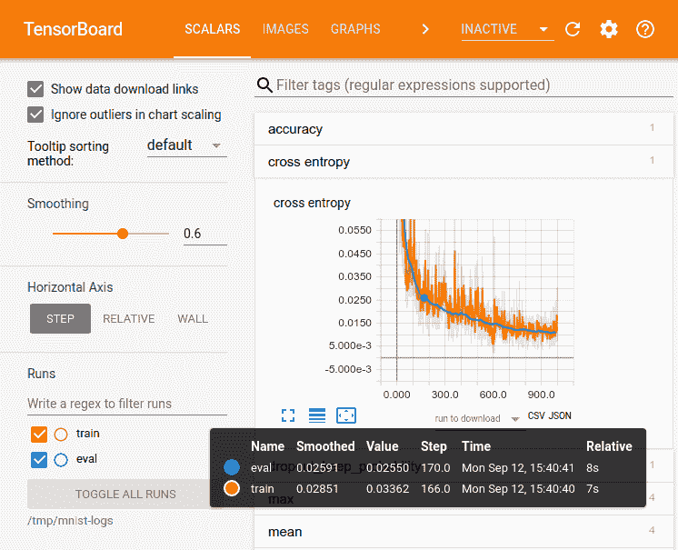

# 第八章：模型质量和持续评估

到目前为止，本书涵盖了视觉模型的设计和实现。在本章中，我们将深入讨论监控和评估这一重要主题。除了从高质量模型开始，我们还希望保持该质量。为了确保最佳运行，通过监控获得洞察力、计算指标、理解模型的质量以及持续评估其性能非常重要。

# 监控

因此，我们可能已经在数百万图像上训练了我们的模型，并且对其质量非常满意。我们已经将其部署到了云端，现在我们可以坐下来放松，让它永远为未来做出优秀的预测…… 对吗？错！正如我们不会让小孩子独自管理自己一样，我们也不希望把我们的模型单独留在野外。重要的是，我们要不断监控其质量（使用准确性等指标）和计算性能（每秒查询、延迟等）。特别是当我们不断使用新数据对模型进行重新训练时，可能会出现分布变化、错误和其他问题，我们需要注意这些问题。

## TensorBoard

通常，机器学习从业者在训练模型时并未充分考虑所有细节。他们提交一个训练任务，然后不时检查，直到任务完成。然后，他们使用训练好的模型进行预测，查看其性能如何。如果训练任务只需几分钟，这可能看起来无关紧要。然而，许多计算机视觉项目，特别是包含数百万图像的数据集，其训练任务需要花费数天甚至数周的时间。如果在训练早期出现问题而我们没有注意到，或者直到训练完成或尝试使用模型进行预测时才注意到，那将是非常糟糕的。

有一个名为 TensorBoard 的优秀监控工具，它与 TensorFlow 一起分发，可以用来避免这种情况。TensorBoard 是一个交互式仪表板（参见图 8-1），显示了模型训练和评估期间保存的摘要信息。您可以将其用作实验运行的历史记录，用于比较您模型或代码的不同版本，并用于分析训练任务。



###### 图 8-1\. TensorBoard 标量摘要 UI。

TensorBoard 允许我们监控损失曲线，以确保模型训练仍在进行中，并且没有停止改进。我们还可以显示和与模型中的任何其他评估指标交互，例如准确性、精度或 AUC——例如，我们可以跨多个系列执行过滤、平滑和异常值移除，并且能够放大和缩小。

## 权重直方图

我们还可以在 TensorBoard 中探索直方图，如图 8-2 所示。我们可以用它们来监视权重、梯度和其他数量过多的标量。


###### 图 8-2\. TensorBoard 直方图用户界面。模型权重位于水平轴上，训练步骤编号位于垂直轴上。

## 设备放置

我们可以将 TensorFlow 模型图输出到 TensorBoard 以进行可视化和探索，如图 8-3 所示。


###### 图 8-3\. TensorBoard 模型图可视化：结构视图（左）和设备视图（右）。

默认的结构视图显示哪些节点共享相同的结构，设备视图显示哪些节点位于哪些设备上，每个设备用不同的颜色表示。我们还可以看到 TPU 的兼容性等信息。这可以帮助我们确保我们的模型代码得到适当的加速。

## 数据可视化

TensorBoard 可以显示特定类型的数据示例，例如图像（在图像选项卡上，如图 8-4 所示在左侧）或音频（在音频选项卡上）。这样，我们可以在训练过程中得到反馈；例如，在图像生成方面，我们可以实时查看生成图像的外观。对于分类问题，TensorBoard 还可以显示混淆矩阵，如图 8-4 右侧所示，这样我们可以监控每个类别在整个训练过程中的指标（更多详细信息请参见“分类的度量”）。


###### 图 8-4\. TensorBoard 图像选项卡允许您可视化训练图像（左）并查看混淆矩阵（右），以了解分类器大部分错误发生的位置。

## 训练事件

我们可以使用以下代码为我们的模型添加 TensorBoard 回调：

```
tensorboard_callback = tf.keras.callbacks.TensorBoard(
    log_dir='logs', histogram_freq=0, write_graph=True,
    write_images=False, update_freq='epoch', profile_batch=2,
    embeddings_freq=0, embeddings_metadata=None, **kwargs
)
```

我们通过`log_dir`参数指定 TensorBoard 事件日志将写入磁盘的目录路径。`histogram_freq`和`embeddings_freq`控制两种摘要类型在多少个 epochs 后写入一次；如果指定为零，则不会计算或显示。请注意，当拟合模型以显示直方图时，需要指定验证数据，或者至少需要拆分。此外，对于嵌入，我们可以通过`embeddings_metadata`参数传递一个映射层名称到嵌入元数据将保存的文件名的字典。

如果我们想在 TensorBoard 中查看图表，我们可以将`write_graph`参数设置为`True`；然而，如果我们的模型很大，事件日志文件可能会非常大。更新频率通过`update_freq`参数指定。在这里，它被设置为每个 epoch 或批次更新一次，但我们可以将其设置为整数值，以便在那些批次数之后更新。我们可以使用布尔参数`write_images`在 TensorBoard 中将模型权重可视化为图像。最后，如果我们想分析计算特性的性能，例如对步骤时间的贡献，我们可以将`profile_batch`设置为整数或整数元组，并将分析应用于那个批次或一系列批次。将该值设置为零将禁用分析。

一旦定义，我们可以将 TensorBoard 回调添加到`model.fit()`的回调列表中，如下所示：

```
history = model.fit(
    train_dataset,
    epochs=10,
    batch_size=1,
    validation_data=validation_dataset,
    callbacks=[tensorboard_callback]
)
```

运行 TensorBoard 的最简单方法是打开终端并运行以下 bash 命令：

```
tensorboard --logdir=*`<``path_to_your_logs``>`*
```

您可以提供其他参数，例如更改 TensorBoard 使用的默认端口，但要快速启动它，您只需指定`logdir`即可。

摘要通常包括损失和评估指标曲线。然而，根据我们的用例，我们可以使用回调来生成其他潜在有用的摘要，比如图像和权重直方图。我们还可以在训练过程中打印和/或记录损失和评估指标，以及定期评估生成的图像或其他模型输出，然后检查改进的递减回报。最后，如果使用`model.fit()`在本地训练，我们可以检查历史输出，并查看损失和评估指标随时间的变化。

# 模型质量指标

即使您正在使用验证集，查看验证损失并不能真正清楚地展示模型的表现如何。进入评估指标！这些指标是基于模型对未见数据的预测计算的，它们允许我们评估模型在与用例相关的方面的表现。

## 分类指标

正如您在前几章学到的那样，图像分类涉及将标签分配给指示它们所属类别的图像。标签可以是相互排斥的，每个图像只适用一个标签，或者可能有多个标签描述一个图像。在单标签和多标签的情况下，我们通常对图像的每个类别预测一个概率。由于我们的预测是概率，而我们的标签通常是二进制的（如果图像不是该类，则为 0，如果是，则为 1），因此我们需要一些方法将预测转换为二进制表示，以便与实际标签进行比较。为此，我们通常设置一个阈值：任何低于阈值的预测概率变为 0，而任何高于阈值的预测概率变为 1。在二元分类中，默认阈值通常为 0.5，使两种选择有平等的机会。

### 二元分类

在实践中，有许多用于单标签分类的指标，但最佳选择取决于我们的用例。特别是，不同的评估指标适用于二元分类和多类分类。让我们从二元分类开始。

最常见的评估指标是准确率。这是衡量模型正确预测的百分比的指标。为了弄清楚这一点，计算四个其他指标也很有用：真正例、真反例、假正例和假反例。真正例是标签为 1，表示示例属于某个类别，并且预测也为 1。类似地，真反例是标签为 0，表示示例不属于该类别，并且预测也为 0。相反，假正例是标签为 0 但预测为 1，假反例是标签为 1 但预测为 0。总之，这些指标构成了一种称为*混淆矩阵*的预测集合，这是一个 2x2 的网格，统计了这四个指标的数量，如图 8-5 所示。


###### 图 8-5. 一个二元分类混淆矩阵。

我们可以将这四个指标添加到我们的 Keras 模型中，如下所示：

```
model.compile(
    optimizer="sgd",
    loss="mse",
    metrics=[
        `tf``.``keras``.``metrics``.``TruePositives``(``)``,`
        `tf``.``keras``.``metrics``.``TrueNegatives``(``)``,`
        `tf``.``keras``.``metrics``.``FalsePositives``(``)``,`
        `tf``.``keras``.``metrics``.``FalseNegatives``(``)``,`
    ]
)
```

分类准确率是正确预测的百分比，因此通过将模型正确预测的数量除以其总预测数量来计算。使用四个混淆矩阵指标，可以表示为：

<math><mrow><mrow><mi>a</mi><mi>c</mi><mi>c</mi><mi>u</mi><mi>r</mi><mi>a</mi><mi>c</mi><mi>y</mi><mo>=</mo><mstyle displaystyle="true" scriptlevel="0"><mrow><mfrac><mrow><mi>T</mi><mi>P</mi><mo>+</mo><mi>T</mi><mi>N</mi></mrow><mrow><mi>T</mi><mi>P</mi><mo>+</mo><mi>T</mi><mi>N</mi><mo>+</mo><mi>F</mi><mi>P</mi><mo>+</mo><mi>F</mi><mi>N</mi></mrow></mfrac></mrow></mstyle></mrow></mrow></math>

在 TensorFlow 中，我们可以像这样向 Keras 模型添加一个准确率指标：

```
model.compile(optimizer="sgd", loss="mse",
    metrics=[`tf``.``keras``.``metrics``.``Accuracy``(``)`]
)
```

这会计算与标签匹配的预测数量，然后除以总预测数量。

如果我们的预测和标签都是 0 或 1，例如在二分类的情况下，我们可以添加以下 TensorFlow 代码：

```
model.compile(optimizer="sgd", loss="mse",
    metrics=[`tf``.``keras``.``metrics``.``BinaryAccuracy``(``)`]
)
```

在这种情况下，预测通常是经过阈值化为 0 或 1 的概率，然后与实际标签比较，以确定匹配的百分比。

如果我们的标签是分类的、独热编码的，那么我们可以添加以下 TensorFlow 代码：

```
model.compile(optimizer="sgd", loss="mse",
    metrics=[`tf``.``keras``.``metrics``.``CategoricalAccuracy``(``)`]
)
```

这对于多类情况更为常见，通常涉及将每个样本的预测概率向量与每个类别的独热编码标签向量进行比较。

然而，准确率的一个问题是它仅在类别平衡时表现良好。例如，假设我们的用例是预测视网膜图像是否显示眼部疾病。假设我们已经筛选了一千名患者，只有两名患者实际患有眼部疾病。一个有偏向的模型，预测每张图像都显示健康眼睛，将会在 998 次中正确，仅错过两次，因此达到 99.8%的准确率。虽然听起来令人印象深刻，但这个模型对我们来说实际上是无用的，因为它完全无法检测到我们实际寻找的病例。对于这个特定问题，准确率并不是一个有用的评估指标。幸运的是，混淆矩阵值的其他组合对于不平衡数据集（以及平衡数据集）可能更有意义。

相反，如果我们对模型正确预测的正预测百分比感兴趣，那么我们将测量*预测精度*。换句话说，在所有模型预测为患有眼部疾病的人中，真正患有眼部疾病的有多少？精度计算如下：

<math><mrow><mrow><mi>p</mi><mi>r</mi><mi>e</mi><mi>c</mi><mi>i</mi><mi>s</mi><mi>i</mi><mi>o</mi><mi>n</mi><mo>=</mo><mstyle displaystyle="true" scriptlevel="0"><mrow><mfrac><mrow><mi>T</mi><mi>P</mi></mrow><mrow><mi>T</mi><mi>P</mi><mo>+</mo><mi>F</mi><mi>P</mi></mrow></mfrac></mrow></mstyle></mrow></mrow></math>

同样地，如果我们想知道我们的模型能够正确识别的正样本百分比，那么我们将测量*预测召回率*。换句话说，实际患有眼部疾病的患者中，模型能找到多少人？召回率计算如下：

<math><mrow><mrow><mi>r</mi><mi>e</mi><mi>c</mi><mi>a</mi><mi>l</mi><mi>l</mi><mo>=</mo><mstyle displaystyle="true" scriptlevel="0"><mrow><mfrac><mrow><mi>T</mi><mi>P</mi></mrow><mrow><mi>T</mi><mi>P</mi><mo>+</mo><mi>F</mi><mi>N</mi></mrow></mfrac></mrow></mstyle></mrow></mrow></math>

在 TensorFlow 中，我们可以通过以下方式将这两个指标添加到我们的 Keras 模型中：

```
model.compile(optimizer="sgd", loss="mse",
    metrics=[`tf``.``keras``.``metrics``.``Precision``(``)``,` `tf``.``keras``.``metrics``.``Recall``(``)`]
)
```

如果我们希望在 0.5 以外的阈值处计算指标，我们还可以添加`thresholds`参数，可以是范围为[0, 1]的浮点数，或者是浮点数值的列表或元组。

正如你所见，精确率和召回率的分子相同，只有在包括假阳性或假阴性时分母有所不同。因此，通常当一个增加时，另一个减少。那么我们如何找到两者之间的一个良好平衡点呢？我们可以引入另一个度量标准，即 F1 分数：

<math><mrow><mrow><msub><mrow><mi>F</mi></mrow><mrow><mn>1</mn></mrow></msub><mo>=</mo><mn>2</mn><mo>*</mo><mstyle displaystyle="true" scriptlevel="0"><mrow><mfrac><mrow><mi>p</mi><mi>r</mi><mi>e</mi><mi>c</mi><mi>i</mi><mi>s</mi><mi>i</mi><mi>o</mi><mi>n</mi><mo>*</mo><mi>r</mi><mi>e</mi><mi>c</mi><mi>a</mi><mi>l</mi><mi>l</mi></mrow><mrow><mi>p</mi><mi>r</mi><mi>e</mi><mi>c</mi><mi>i</mi><mi>s</mi><mi>i</mi><mi>o</mi><mi>n</mi><mo>+</mo><mi>r</mi><mi>e</mi><mi>c</mi><mi>a</mi><mi>l</mi><mi>l</mi></mrow></mfrac></mrow></mstyle></mrow></mrow></math>

F1 分数简单地是精确率和召回率之间的调和平均数。与准确率、精确率和召回率一样，它的范围在 0 到 1 之间。F1 分数为 1 表示模型具有完美的精确率和召回率，因此准确率也是完美的。F1 分数为 0 意味着精确率或召回率中的一个为 0，这意味着没有真正的正例。这表明我们要么有一个糟糕的模型，要么我们的评估数据集根本没有正例，导致我们的模型无法学习如何有效预测正例。

一个更一般的度量标准称为 F[β] 分数，其中添加一个实值常数 β（在 0 到 1 之间），允许我们在 F-分数方程中缩放精确率或召回率的重要性：

<math><mrow><mrow><msub><mrow><mi>F</mi></mrow><mrow><mi>β</mi></mrow></msub><mo>=</mo><mrow><mrow><mo>(</mo><mn>1</mn><mo>+</mo><msup><mrow><mi>β</mi></mrow><mrow><mn>2</mn></mrow></msup><mo>)</mo></mrow></mrow><mo>*</mo><mstyle displaystyle="true" scriptlevel="0"><mrow><mfrac><mrow><mi>p</mi><mi>r</mi><mi>e</mi><mi>c</mi><mi>i</mi><mi>s</mi><mi>i</mi><mi>o</mi><mi>n</mi><mo>*</mo><mi>r</mi><mi>e</mi><mi>c</mi><mi>a</mi><mi>l</mi><mi>l</mi></mrow><mrow><msup><mrow><mi>β</mi></mrow><mrow><mn>2</mn></mrow></msup><mo>*</mo><mi>p</mi><mi>r</mi><mi>e</mi><mi>c</mi><mi>i</mi><mi>s</mi><mi>i</mi><mi>o</mi><mi>n</mi><mo>+</mo><mi>r</mi><mi>e</mi><mi>c</mi><mi>a</mi><mi>l</mi><mi>l</mi></mrow></mfrac></mrow></mstyle></mrow></mrow></math>

如果我们想要使用比单独的精确率或召回率更综合的度量，但与假阳性和假阴性相关的成本不同，这将允许我们优化我们最关心的一个方面。

到目前为止，我们看过的所有评估指标都要求我们选择一个分类阈值，以确定概率是否足够高，使其成为正类预测还是不是。但是我们如何知道在哪里设置阈值呢？当然，我们可以尝试许多可能的阈值值，然后选择优化我们最关心的指标的那个值。

然而，如果我们使用多个阈值，还有另一种比较模型的方法。首先，通过在阈值网格上构建度量的曲线来进行比较。最流行的两种曲线是*接收者操作特征*（ROC）曲线和*精确率-召回率*曲线。ROC 曲线将真阳性率（也称为灵敏度或召回率）放在 y 轴上，将假阳性率（也称为 1-特异性或真阴性率）放在 x 轴上。假阳性率定义为：

<math><mrow><mrow><mi>F</mi><mi>P</mi><mi>R</mi><mo>=</mo><mstyle displaystyle="true" scriptlevel="0"><mrow><mfrac><mrow><mi>F</mi><mi>P</mi></mrow><mrow><mi>F</mi><mi>P</mi><mo>+</mo><mi>T</mi><mi>N</mi></mrow></mfrac></mrow></mstyle></mrow></mrow></math>

精确率-召回率曲线的精确率在 y 轴上，召回率在 x 轴上。

假设我们选择了两百个等间距阈值的网格，并计算了水平和垂直轴的阈值评估度量。当然，绘制这些点将创建一条延伸至所有两百个阈值的线。

生成这样的曲线可以帮助我们进行阈值选择。我们希望选择一个优化感兴趣度量的阈值。它可以是这些统计度量之一，或者更好的是与当前业务或用例相关的度量，比如错过有眼病患者的经济成本与对没有眼病患者进行额外不必要的筛查。

我们可以通过计算*曲线下面积*（AUC）来总结这些信息。正如我们在图 8-6 左侧看到的，完美的分类器 AUC 为 1，因为会有 100%的真阳性率和 0%的假阳性率。随机分类器的 AUC 为 0.5，因为 ROC 曲线将沿 y = x 轴下降，显示真阳性和假阳性以相等速率增长。如果计算出的 AUC 小于 0.5，则意味着我们的模型表现比随机分类器*更差*；AUC 为 0 表示模型在每个预测上都完全错误。其他条件相同，较高的 AUC 通常更好，可能的范围在 0 到 1 之间。

精确率-召回率（PR）曲线与我们在图 8-6 右侧看到的类似；然而，并非每个 PR 空间的点都可以获取，因此范围小于[0, 1]。实际范围取决于数据类分布的偏斜程度。


###### 图 8-6\. 左侧：ROC 曲线。右侧：精确率-召回率曲线。

那么，在比较分类模型时，我们应该使用哪种曲线？如果类别被很好地抽样和平衡，那么推荐计算 AUC-ROC。否则，如果类别不平衡或倾斜，那么推荐使用 AUC-PR。以下是用于添加 AUC 评估指标的 TensorFlow 代码：

```
tf.keras.metrics.AUC(
    num_thresholds=200, curve="ROC",
    summation_method="interpolation",
    thresholds=None, multi_label=False
)
```

我们可以通过`num_thresholds`参数设置要计算四个混淆度量的阈值数，它将在 0 到 1 之间创建那些数量的均匀间隔的阈值。或者，我们可以提供一个浮点阈值列表，该列表在范围[0, 1]内，`tf.keras.metrics.AUC()`将使用它来计算 AUC。

我们还可以通过`curve`参数将曲线类型设置为`"ROC"`或`"PR"`，分别使用 ROC 曲线或精确率-召回率曲线。

最后，由于我们正在进行二元分类，我们将`multi_label`设为`False`。否则，它会计算每个类别的 AUC，然后求平均值。

### 多类别，单标签分类

如果我们有一个多类别分类问题，比如三个类别（狗、猫和鸟），那么混淆矩阵将看起来像 Figure 8-7。请注意，现在我们不再有一个 2x2 的矩阵，而是一个 3x3 的矩阵；因此，一般来说，它将是一个*n*x*n*的矩阵，其中*n*是类别数。二元分类问题和多类别分类问题之间的一个关键区别是，我们不再有真负例，因为那些现在是其他类别的“真正例”。


###### 图 8-7\. 一个具有三个类别的多类别混淆矩阵。

请记住，对于多类别、单标签分类，即使我们有多个类别，每个实例仍然属于一个且仅一个类别。标签是互斥的。它可以是一张狗的图片、一张猫的图片或一张鸟的图片，不会同时是这些中的多个。

我们如何将我们的二元分类混淆矩阵指标适配到我们的多类别版本？让我们通过一个例子来详细说明。如果我们有一张被标记为狗的图片，并且我们预测它是狗，那么矩阵中狗-狗单元格的计数将增加一。这就是我们在二元分类版本中称之为真正例的情况。但是如果我们的模型预测“猫”呢？显然是一个假的某种东西，但它并不真正适合于假阳性或假阴性的阵营。它只是…错误。

幸运的是，我们不必跨越太远来使我们的多类别混淆矩阵为我们工作。让我们再次看一下填入值的混淆矩阵（Figure 8-8）。


###### 图 8-8\. 一个狗、猫、鸟多类别分类混淆矩阵示例。

我们可以看到这是一个平衡的数据集，因为每个类别都有两百个例子。然而，这不是一个完美的模型，因为它不是一个纯对角矩阵；它在许多例子中犯了错误，正如非对角线计数所示。如果我们想要计算精确率、召回率和其他指标，那么我们必须逐个类别地查看。

仅仅看狗类别，我们的混淆矩阵缩小到我们在图 8-9 中看到的情况。我们可以在这个图中看到，我们的真正例子是那些实际上是狗并且我们预测为狗的图像，这种情况发生了 150 次。假正例是我们预测图像是狗但实际上不是的情况（例如猫或鸟）。因此，为了得到这个计数，我们将狗-猫单元格中的 50 个示例和狗-鸟单元格中的 50 个示例相加。为了找到假负例的数量，我们做相反的操作：这些是我们应该预测为狗但没有预测的情况，所以我们将猫-狗单元格中的 30 个示例和鸟-狗单元格中的 20 个示例相加。最后，真负例的计数是其余单元格的总和，这些单元格中我们正确地说这些图像不是狗。请记住，即使模型在某些情况下可能将猫和鸟混淆在一起，因为我们现在只看狗类别，这些值都会被合并到真负例计数中。


###### 图 8-9\. 狗类别分类混淆矩阵。

一旦我们对每个类别都完成了这个过程，我们可以计算每个类别的复合指标（精确率、召回率、F1 分数等）。然后，我们可以取这些指标的未加权平均值来获得这些指标的宏版本，例如，对所有类别的精确率进行平均会得到宏精确率。还有一个微观版本，其中我们将每个单独类别混淆矩阵中的所有真正例子相加到一个全局真正例子计数中，并对其他三个混淆指标做同样处理。然而，由于这是全局完成的，微观精确率、微观召回率和微观 F1 分数将都是相同的。最后，与我们在宏版本中所做的未加权平均值不同，我们可以通过每个类别的样本总数加权每个类别的个别指标。这将为我们提供加权精确率、加权召回率等。如果我们有不平衡的类别，这可能是有用的。

由于这些仍然使用阈值将预测的类别概率转换为获胜类别的 1 或 0，我们可以使用这些组合指标来生成不同阈值的 ROC 曲线或精确率-召回率曲线，以找到比较无阈值模型性能的 AUC。

### 多类别、多标签分类

在二进制（单类别，单标签）分类中，概率是互斥的，每个示例要么是正类要么不是。在多类别单标签分类中，概率再次是互斥的，因此每个示例只能属于一个类别，但没有正面和负面类别。第三种分类问题是多类别多标签分类，其中概率不再是互斥的。一幅图像不一定只能是狗或只能是猫。如果图像中同时存在狗和猫，那么狗和猫的标签可以都是 1，因此一个好的模型应该为每个类别预测一个接近 1 的值，对于其他类别则预测接近 0 的值。

用于多标签情况的评估指标有哪些？我们有几个选项，但首先让我们定义一些符号。我们将定义*Y*为实际标签集，*Z*为预测标签集，并定义函数*I*为指示函数。

一个严格且具有挑战性的最大化指标是*精确匹配比*（EMR），也称为*子集精度*：

<math><mrow><mrow><mi>E</mi><mi>M</mi><mi>R</mi><mo>=</mo><mstyle displaystyle="true" scriptlevel="0"><mrow><mfrac><mrow><mn>1</mn></mrow><mrow><mi>n</mi></mrow></mfrac></mrow></mstyle><munderover><mrow><mi mathvariant="normal">Σ</mi></mrow><mrow><mi>i</mi><mo>=</mo><mn>1</mn></mrow><mrow><mi>n</mi></mrow></munderover><mi>I</mi><mrow><mo>(</mo><msub><mrow><mi>Y</mi></mrow><mrow><mi>i</mi></mrow></msub><mo>=</mo><msub><mrow><mi>Z</mi></mrow><mrow><mi>i</mi></mrow></msub><mo>)</mo></mrow></mrow></mrow></math>

这个指标衡量了我们完全正确预测所有标签的例子的百分比。请注意，这不会给予部分分。如果我们应该预测一幅图像中有一百个类别，但我们只预测了其中的 99 个，则这个示例不会被视为精确匹配。模型越好，EMR 应该越高。

一个较少严格的指标是*Hamming 分数*，它实际上是多标签精度的衡量：

<math><mrow><mrow><mi>H</mi><mi>S</mi><mo>=</mo><mstyle displaystyle="true" scriptlevel="0"><mrow><mfrac><mrow><mn>1</mn></mrow><mrow><mi>n</mi></mrow></mfrac></mrow></mstyle><munderover><mrow><mi mathvariant="normal">Σ</mi></mrow><mrow><mi>i</mi><mo>=</mo><mn>1</mn></mrow><mrow><mi>n</mi></mrow></munderover><mstyle displaystyle="true" scriptlevel="0"><mrow><mfrac><mrow><mrow><mo>|</mo><msub><mrow><mi>Y</mi></mrow><mrow><mi>i</mi></mrow></msub><mo>∩</mo><msub><mrow><mi>Z</mi></mrow><mrow><mi>i</mi></mrow></msub><mo>|</mo></mrow></mrow><mrow><mrow><mo>|</mo><msub><mrow><mi>Y</mi></mrow><mrow><mi>i</mi></mrow></msub><mo>∪</mo><msub><mrow><mi>Z</mi></mrow><mrow><mi>i</mi></mrow></msub><mo>|</mo></mrow></mrow></mfrac></mrow></mstyle></mrow></mrow></math>

在这里，我们正在测量每个示例预测正确标签与总标签数之比，包括预测和实际标签，然后对所有示例进行平均。我们希望最大化这个量。这类似于 Jaccard 指数或交并比（IOU），我们在第四章中已经看过了。

还有一个*汉明损失*可以使用，其范围为[0, 1]：

<math><mrow><mrow><mrow><mi>H</mi><mi>L</mi><mo>=</mo><mstyle displaystyle="true" scriptlevel="0"><mrow><mfrac><mrow><mn>1</mn></mrow><mrow><mi>k</mi><mi>n</mi></mrow></mfrac></mrow></mstyle><munderover><mrow><mi mathvariant="normal">Σ</mi></mrow><mrow><mi>i</mi><mo>=</mo><mn>1</mn></mrow><mrow><mi>n</mi></mrow></munderover><munderover><mrow><mi mathvariant="normal">Σ</mi></mrow><mrow><mi>l</mi><mo>=</mo><mn>1</mn></mrow><mrow><mi>k</mi></mrow></munderover></mrow><mrow><mo>[</mo><mi>I</mi><mrow><mo>(</mo><mi>l</mi><mo>∈</mo><msub><mrow><mi>Z</mi></mrow><mrow><mi>i</mi></mrow></msub><mo>∧</mo><mi>l</mi><mo>∉</mo><msub><mrow><mi>Y</mi></mrow><mrow><mi>i</mi></mrow></msub><mo>)</mo><mo>+</mo><mi>I</mi><mrow><mo>(</mo><mi>l</mi><mo>∉</mo><msub><mrow><mi>Z</mi></mrow><mrow><mi>i</mi></mrow></msub><mo>∧</mo><mi>l</mi><mo>∈</mo><msub><mrow><mi>Y</mi></mrow><mrow><mi>i</mi></mrow></msub><mo>)</mo></mrow></mrow><mo>]</mo></mrow></mrow></mrow></math>

不同于汉明分数，汉明损失度量了一个示例与错误预测的类标签的相关性，然后对该度量进行平均。因此，我们能够捕捉两种类型的错误：在和的第一项中，我们测量了预测错误的标签，而对于第二项，我们测量了未能预测到的相关标签的错误。这类似于排他或（XOR）操作。我们对示例数 *n* 和类数 *k* 进行求和，并通过这两个数字对双重求和进行归一化。如果我们只有一个类，这将简化为二元分类中的 1 - 精度。由于这是一种损失函数，数值越小越好。

我们还有精确度、召回率和 F1 分数的多标签形式。对于精确度，我们平均预测正确标签与实际标签总数的比率。

<math><mrow><mrow><mi>p</mi><mi>r</mi><mi>e</mi><mi>c</mi><mi>i</mi><mi>s</mi><mi>i</mi><mi>o</mi><mi>n</mi><mo>=</mo><mstyle displaystyle="true" scriptlevel="0"><mrow><mfrac><mrow><mn>1</mn></mrow><mrow><mi>n</mi></mrow></mfrac></mrow></mstyle><munderover><mrow><mi mathvariant="normal">Σ</mi></mrow><mrow><mi>i</mi><mo>=</mo><mn>1</mn></mrow><mrow><mi>n</mi></mrow></munderover><mstyle displaystyle="true" scriptlevel="0"><mrow><mfrac><mrow><mrow><mo>|</mo><msub><mrow><mi>Y</mi></mrow><mrow><mi>i</mi></mrow></msub><mo>∩</mo><msub><mrow><mi>Z</mi></mrow><mrow><mi>i</mi></mrow></msub><mo>|</mo></mrow></mrow><mrow><mrow><mo>|</mo><msub><mrow><mi>Z</mi></mrow><mrow><mi>i</mi></mrow></msub><mo>|</mo></mrow></mrow></mfrac></mrow></mstyle></mrow></mrow></math>

同样地，对于召回率，我们平均预测正确标签与预测标签总数的比率：

<math><mrow><mrow><mi>r</mi><mi>e</mi><mi>c</mi><mi>a</mi><mi>l</mi><mi>l</mi><mo>=</mo><mstyle displaystyle="true" scriptlevel="0"><mrow><mfrac><mrow><mn>1</mn></mrow><mrow><mi>n</mi></mrow></mfrac></mrow></mstyle><munderover><mrow><mi mathvariant="normal">Σ</mi></mrow><mrow><mi>i</mi><mo>=</mo><mn>1</mn></mrow><mrow><mi>n</mi></mrow></munderover><mstyle displaystyle="true" scriptlevel="0"><mrow><mfrac><mrow><mrow><mo>|</mo><msub><mrow><mi>Y</mi></mrow><mrow><mi>i</mi></mrow></msub><mo>∩</mo><msub><mrow><mi>Z</mi></mrow><mrow><mi>i</mi></mrow></msub><mo>|</mo></mrow></mrow><mrow><mrow><mo>|</mo><msub><mrow><mi>Z</mi></mrow><mrow><mi>i</mi></mrow></msub><mo>|</mo></mrow></mrow></mfrac></mrow></mstyle></mrow></mrow></math>

对于 F1 分数，与以往类似，它是精确率和召回率的调和平均：

<math><mrow><mrow><msub><mrow><mi>F</mi></mrow><mrow><mn>1</mn></mrow></msub><mo>=</mo><mstyle displaystyle="true" scriptlevel="0"><mrow><mfrac><mrow><mn>1</mn></mrow><mrow><mi>n</mi></mrow></mfrac></mrow></mstyle><munderover><mrow><mi mathvariant="normal">Σ</mi></mrow><mrow><mi>i</mi><mo>=</mo><mn>1</mn></mrow><mrow><mi>n</mi></mrow></munderover><mstyle displaystyle="true" scriptlevel="0"><mrow><mfrac><mrow><mn>2</mn><mrow><mo>|</mo><msub><mrow><mi>Y</mi></mrow><mrow><mi>i</mi></mrow></msub><mo>∩</mo><msub><mrow><mi>Z</mi></mrow><mrow><mi>i</mi></mrow></msub><mo>|</mo></mrow></mrow><mrow><mrow><mo>|</mo><msub><mrow><mi>Y</mi></mrow><mrow><mi>i</mi></mrow></msub><mo>|</mo><mo>+</mo></mrow><mrow><mo>|</mo><msub><mrow><mi>Z</mi></mrow><mrow><mi>i</mi></mrow></msub><mo>|</mo></mrow></mrow></mfrac></mrow></mstyle></mrow></mrow></math>

当然，我们也可以使用宏版本计算 ROC 曲线或精确率-召回率曲线的 AUC，其中我们按类计算 AUC，然后求平均。

## 回归指标

对于图像回归问题，还有一些评估指标可用于查看我们的模型在训练之外的数据上表现如何。对于以下所有回归指标，我们的目标是尽量将它们最小化。

最著名和标准的度量方法是*均方误差*（MSE）：

<math><mrow><mrow><mi>M</mi><mi>S</mi><mi>E</mi><mo>=</mo><mstyle displaystyle="true" scriptlevel="0"><mrow><mfrac><mrow><mn>1</mn></mrow><mrow><mi>n</mi></mrow></mfrac><munderover><mrow><mi mathvariant="normal">Σ</mi></mrow><mrow><mi>i</mi><mo>=</mo><mn>1</mn></mrow><mrow><mi>n</mi></mrow></munderover><mrow><mo>(</mo><msub><mrow><mi>Y</mi></mrow><mrow><mi>i</mi></mrow></msub><mo>−</mo><msub><mrow><mover><mrow><mi>Y</mi></mrow><mrow><mo>^</mo></mrow></mover></mrow><mrow><mi>i</mi></mrow></msub><msup><mrow><mo>)</mo></mrow><mrow><mn>2</mn></mrow></msup></mrow></mrow></mstyle></mrow></mrow></math>

均方误差（MSE）顾名思义，是预测值与实际连续标签之间的平方误差的平均值。这是一个均值无偏估计量，由于二次项的存在，具有很高的敏感性，但这种敏感性意味着少数离群值可能会对其产生不适当的影响。

*均方根误差*（RMSE），它只是均方误差的平方根，也被广泛使用：

<math><mrow><mrow><mi>R</mi><mi>M</mi><mi>S</mi><mi>E</mi><mo>=</mo><msqrt><mrow><mstyle displaystyle="true" scriptlevel="0"><mrow><mfrac><mrow><mn>1</mn></mrow><mrow><mi>n</mi></mrow></mfrac></mrow></mstyle><munderover><mrow><mi mathvariant="normal">Σ</mi></mrow><mrow><mi>i</mi><mo>=</mo><mn>1</mn></mrow><mrow><mi>n</mi></mrow></munderover></mrow></msqrt><mrow><mo>(</mo><msub><mrow><mi>Y</mi></mrow><mrow><mi>i</mi></mrow></msub><mo>−</mo><msub><mrow><mover><mrow><mi>Y</mi></mrow><mrow><mo>^</mo></mrow></mover></mrow><mrow><mi>i</mi></mrow></msub><msup><mrow><mo>)</mo></mrow><mrow><mn>2</mn></mrow></msup></mrow></mrow></mrow></math>

更简单和更易解释的度量方法是*平均绝对误差*（MAE）：

<math><mrow><mrow><mi>M</mi><mi>A</mi><mi>E</mi><mo>=</mo><mstyle displaystyle="true" scriptlevel="0"><mrow><mfrac><mrow><mn>1</mn></mrow><mrow><mi>n</mi></mrow></mfrac></mrow></mstyle><munderover><mrow><mi mathvariant="normal">Σ</mi></mrow><mrow><mi>i</mi><mo>=</mo><mn>1</mn></mrow><mrow><mi>n</mi></mrow></munderover><mrow><mrow><mo>|</mo><msub><mrow><mi>Y</mi></mrow><mrow><mi>i</mi></mrow></msub><mo>−</mo><msub><mrow><mover><mrow><mi>Y</mi></mrow><mrow><mo>^</mo></mrow></mover></mrow><mrow><mi>i</mi></mrow></msub><mo>|</mo></mrow></mrow></mrow></mrow></math>

MAE 只是连续预测和标签之间的绝对差异。与 MSE/RMSE 使用的平方指数相比，MAE 不太容易因为少数离群值而偏斜。此外，与 MSE 不同，后者是均值无偏估计，其中估计量的样本均值与分布均值相同，而 MAE 是中位数无偏估计，估计量高估和低估的频率相同。

为了使回归更加稳健，我们也可以尝试使用 Huber 损失度量。这比使用平方误差损失更不容易受到离群值的影响：

<math><mrow><mrow><mi>H</mi><msub><mrow><mi>L</mi></mrow><mrow><mi>δ</mi></mrow></msub><mrow><mrow><mo>(</mo><mi>Y</mi><mo>,</mo><mover><mrow><mi>Y</mi></mrow><mrow><mo>^</mo></mrow></mover><mo>)</mo></mrow><mo>=</mo><mstyle displaystyle="true" scriptlevel="0"><mrow><mfrac><mrow><mn>1</mn></mrow><mrow><mi>n</mi></mrow></mfrac></mrow></mstyle><munderover><mrow><mi mathvariant="normal">Σ</mi></mrow><mrow><mi>i</mi><mo>=</mo><mn>1</mn></mrow><mrow><mi>n</mi></mrow></munderover><mrow><mo>{</mo><mtable columnalign="left"><mtr><mtd><mfrac><mrow><mn>1</mn></mrow><mrow><mn>2</mn></mrow></mfrac><mrow><mo>(</mo><msub><mrow><mi>Y</mi></mrow><mrow><mi>i</mi></mrow></msub><mo>−</mo><msub><mrow><mover><mrow><mi>Y</mi></mrow><mrow><mo>^</mo></mrow></mover></mrow><mrow><mi>i</mi></mrow></msub><msup><mrow><mo>)</mo></mrow><mrow><mn>2</mn></mrow></msup></mrow></mtd><mtd><mi>f</mi><mi>o</mi><mi>r</mi><mrow><mo>|</mo><msub><mrow><mi>Y</mi></mrow><mrow><mi>i</mi></mrow></msub><mo>−</mo><msub><mrow><mover><mrow><mi>Y</mi></mrow><mrow><mo>^</mo></mrow></mover></mrow><mrow><mi>i</mi></mrow></msub><mo>|</mo><mo>≤</mo><mi>δ</mi></mrow></mtd></mtr><mtr><mtd><mi>δ</mi><mrow><mo>|</mo><msub><mrow><mi>Y</mi></mrow><mrow><mi>i</mi></mrow></msub><mo>−</mo><msub><mrow><mover><mrow><mi>Y</mi></mrow><mrow><mo>^</mo></mrow></mover></mrow><mrow><mi>i</mi></mrow></msub><mo>|</mo></mrow><mo>−</mo><mstyle displaystyle="true" scriptlevel="0"><mrow><mfrac><mrow><mn>1</mn></mrow><mrow><mn>2</mn></mrow></mfrac></mrow></mstyle><msup><mrow><mi>δ</mi></mrow><mrow><mn>2</mn></mrow></msup></mtd><mtd><mi>o</mi><mi>t</mi><mi>h</mi><mi>e</mi><mi>r</mi><mi>w</mi><mi>i</mi><mi>s</mi><mi>e</mi></mtd></mtr></mtable></mrow></mrow></mrow></mrow></math>

我们可以看到，这个度量标准集两全其美。我们声明一个常数阈值，*δ*；如果绝对残差小于该值，我们使用平方项，否则使用线性项。这样，我们既可以从靠近零的值的平方均值无偏估计的敏感性中获益，也可以从远离零的值的线性项的中位数无偏估计的稳健性中获益。

## 物体检测度量标准

实际上，大多数常见的物体检测评估度量与分类度量相同。但是，我们不是比较整个图像的预测和实际标签，而是使用边界框比较检测到的对象与实际存在的对象，正如我们在第四章中所看到的。

最常见的物体检测度量标准之一是交并比：

<math><mrow><mrow><mi>I</mi><mi>O</mi><mi>U</mi><mo>=</mo><mstyle displaystyle="true" scriptlevel="0"><mrow><mfrac><mrow><mi>a</mi><mi>r</mi><mi>e</mi><mi>a</mi><mrow><mo>(</mo><mover><mrow><mi>B</mi></mrow><mrow><mo>^</mo></mrow></mover><mo>∩</mo><mi>B</mi><mo>)</mo></mrow></mrow><mrow><mi>a</mi><mi>r</mi><mi>e</mi><mi>a</mi><mrow><mo>(</mo><mover><mrow><mi>B</mi></mrow><mrow><mo>^</mo></mrow></mover><mo>∪</mo><mi>B</mi><mo>)</mo></mrow></mrow></mfrac></mrow></mstyle></mrow></mrow></math>

分子是我们预测的边界框和实际边界框的交集面积。分母是我们预测的边界框和实际边界框的并集面积。我们可以在图 8-10 中以图形方式看到这一点。


###### 图 8-10。交并比是重叠区域与并集区域的比值。

在完美重叠的情况下，两个区域将相等，因此 IOU 将为 1。在没有重叠的情况下，分子中将为 0，因此 IOU 将为 0。因此，IOU 的界限为[0, 1]。

我们还可以使用一种形式的分类混淆指标，例如真正例。与分类一样，计算这些需要一个阈值，但我们不是对预测概率进行阈值处理，而是对 IOU 进行阈值处理。换句话说，如果边界框的 IOU 超过某个值，则声明检测到了该对象。阈值通常为 50%，75%或 95%。

在这种情况下，真正例被视为正确的检测。当预测的边界框和实际边界框的 IOU 大于或等于阈值时发生。另一方面，假正例被视为错误的检测。当预测的边界框和实际边界框的 IOU 小于阈值时发生。假负例被视为漏检，即根本没有检测到实际边界框。

最后，真负例不适用于物体检测。真负例是正确的未检测到。如果我们记得我们的每类多类混淆矩阵，真负例是其他三个混淆指标中未使用的所有其他单元格的总和。在这里，真负例将是我们可以放置在图像上并且未触发其他三个混淆指标之一的所有边界框。即使对于小图像，这种未放置边界框的排列方式的数量也会非常庞大，因此使用这种混淆指标是没有意义的。

在这种情况下，精度等于真正例数除以所有检测数。这衡量了模型识别图像中相关对象的能力：

<math><mrow><mrow><mi>p</mi><mi>r</mi><mi>e</mi><mi>c</mi><mi>i</mi><mi>s</mi><mi>i</mi><mi>o</mi><mi>n</mi><mo>=</mo><mstyle displaystyle="true" scriptlevel="0"><mrow><mfrac><mrow><mi>T</mi><mi>P</mi></mrow><mrow><mi>a</mi><mi>l</mi><mi>l</mi><mi mathvariant="italic">d</mi><mi>e</mi><mi>t</mi><mi>e</mi><mi>c</mi><mi>t</mi><mi>i</mi><mi>o</mi><mi>n</mi><mi>s</mi></mrow></mfrac></mrow></mstyle></mrow></mrow></math>

在目标检测中，召回率衡量了模型在图像中查找所有相关对象的能力。因此，它等于真正例的数量除以所有实际边界框的数量：

<math><mrow><mrow><mi>r</mi><mi>e</mi><mi>c</mi><mi>a</mi><mi>l</mi><mi>l</mi><mo>=</mo><mstyle displaystyle="true" scriptlevel="0"><mrow><mfrac><mrow><mi>T</mi><mi>P</mi></mrow><mrow><mi>a</mi><mi>l</mi><mi>l</mi><mi>a</mi><mi>c</mi><mi>t</mi><mi>u</mi><mi>a</mi><mi>l</mi><mi>b</mi><mi>o</mi><mi>u</mi><mi>n</mi><mi>d</mi><mi>i</mi><mi>n</mi><mi>g</mi><mi>b</mi><mi>o</mi><mi>x</mi><mi>e</mi><mi>s</mi></mrow></mfrac></mrow></mstyle></mrow></mrow></math>

就像分类一样，这些复合度量可以用来使用不同的阈值创建曲线。其中一些最常见的是精确率-召回率曲线（就像我们之前见过的那些）和召回-IOU 曲线，通常绘制 IOU 在范围[0.5, 1.0]之间。

我们还可以使用精确率-召回率和召回-IOU 曲线来计算平均精确率和平均召回率。为了平滑曲线中的任何波动，在执行实际平均精确率计算之前，我们通常在多个召回水平处插值精确率，如在图 8-11 中所示。


###### 图 8-11\. 一个插值精确率-召回率曲线。

我们对平均召回率也采取类似的方法。在公式中，选择的召回水平*r*处的插值精确率是找到的任何大于或等于*r*的召回水平*r'*的精确率*p*的最大值：

<math><mrow><mrow><mi mathvariant="italic">p</mi><mo mathvariant="italic">⁢</mo><mi mathvariant="italic">i</mi><mi mathvariant="italic">n</mi><mi mathvariant="italic">t</mi><mi mathvariant="italic">e</mi><mi mathvariant="italic">r</mi><mi mathvariant="italic">p</mi><mi mathvariant="italic">o</mi><mi mathvariant="italic">l</mi><mi mathvariant="italic">a</mi><mi mathvariant="italic">t</mi><mi mathvariant="italic">e</mi><mi mathvariant="italic">d</mi><mo>=</mo><msub><mrow><mi mathvariant="italic">m</mi><mi mathvariant="italic">a</mi><mi mathvariant="italic">x</mi></mrow><mrow><msup><mrow><mi>r</mi></mrow><mrow><mo>′</mo></mrow></msup><mo>≥</mo><mi>r</mi></mrow></msub><mrow><mrow><mo>[</mo><mi>p</mi><mo>(</mo><msup><mrow><mi>r</mi></mrow><mrow><mo>′</mo></mrow></msup><mo>)</mo><mo>]</mo></mrow></mrow></mrow></mrow></math>

传统的插值方法是选择 11 个等间距的召回水平；然而，最近的实践者们开始尝试选择所有唯一的召回水平进行插值。因此，平均精度就是插值精度-召回曲线下的面积：

<math><mrow><mrow><mi>A</mi><mi>P</mi><mo>=</mo><mstyle displaystyle="true" scriptlevel="0"><mrow><mfrac><mrow><mn>1</mn></mrow><mrow><mi>n</mi></mrow></mfrac></mrow></mstyle><munderover><mrow><mi mathvariant="normal">Σ</mi></mrow><mrow><mi>i</mi><mo>=</mo><mn>1</mn></mrow><mrow><mi>n</mi><mo>−</mo><mn>1</mn></mrow></munderover><mrow><mo>(</mo><msub><mrow><mi>r</mi></mrow><mrow><mi>i</mi><mo>+</mo><mn>1</mn></mrow></msub><mo>−</mo><msub><mrow><mi>r</mi></mrow><mrow><mi>i</mi></mrow></msub><mo>)</mo><mi mathvariant="italic">p</mi><mo mathvariant="italic">⁢</mo><mi mathvariant="italic">int</mi><mi mathvariant="italic">e</mi><mi mathvariant="italic">r</mi><mi mathvariant="italic">p</mi><mi mathvariant="italic">o</mi><mi mathvariant="italic">l</mi><mi mathvariant="italic">a</mi><mi mathvariant="italic">t</mi><mi mathvariant="italic">e</mi><mi mathvariant="italic">d</mi><mrow><mo>(</mo><msub><mrow><mi>r</mi></mrow><mrow><mi>i</mi><mo>+</mo><mn>1</mn></mrow></msub><mo>)</mo></mrow></mrow></mrow></mrow></math>

如果我们只有一个类别，这就是精度的结尾，但通常在目标检测中，我们有许多不同的类别，它们都有不同的检测性能。因此，计算*平均平均精度*（mAP）可能很有用，这只是每个类别平均精度的平均值：

<math><mrow><mrow><mi>m</mi><mi>A</mi><mi>P</mi><mo>=</mo><mstyle displaystyle="true" scriptlevel="0"><mrow><mfrac><mrow><mn>1</mn></mrow><mrow><mi>k</mi></mrow></mfrac></mrow></mstyle><munderover><mrow><mi mathvariant="normal">Σ</mi></mrow><mrow><mi>l</mi><mo>=</mo><mn>1</mn></mrow><mrow><mi>k</mi></mrow></munderover><mi>A</mi><msub><mrow><mi>P</mi></mrow><mrow><mi>l</mi></mrow></msub></mrow></mrow></math>

如前所述，为了计算平均召回率，我们使用召回-IOU 曲线而不是用于平均精度的精度-召回曲线。它实质上是所有 IOU（特别是至少为 50% 的 IOU）上的平均召回率，因此成为召回-IOU 曲线下的两倍面积：

<math><mrow><mrow><mi>A</mi><mi>R</mi><mo>=</mo><mn>2</mn><mrow><msubsup><mo>∫</mo><mrow><mn>0.5</mn></mrow><mrow><mn>1</mn></mrow></msubsup><mrow><mi>r</mi><mi>e</mi><mi>c</mi><mi>a</mi><mi>l</mi><mi>l</mi></mrow><mrow><mrow><mo>(</mo><mi>u</mi><mo>)</mo></mrow></mrow><mi>d</mi><mi>u</mi></mrow></mrow></mrow></math>

如我们对于多类别目标检测情况的平均精度所做的，我们可以通过对所有类别的平均召回率进行平均来找到*平均平均召回率*（mAR）：

<math><mrow><mrow><mi>m</mi><mi>A</mi><mi>R</mi><mo>=</mo><mstyle displaystyle="true" scriptlevel="0"><mrow><mfrac><mrow><mn>1</mn></mrow><mrow><mi>k</mi></mrow></mfrac></mrow></mstyle><munderover><mrow><mi mathvariant="normal">Σ</mi></mrow><mrow><mi>l</mi><mo>=</mo><mn>1</mn></mrow><mrow><mi>k</mi></mrow></munderover><mi>A</mi><msub><mrow><mi>R</mi></mrow><mrow><mi>l</mi></mrow></msub></mrow></mrow></math>

例如，分割任务中的指标与检测任务完全相同。IOU 同样适用于框或掩码。

现在我们已经探讨了模型的可用评估指标，让我们看看如何使用它们来理解模型偏差和进行持续评估。

# 质量评估

在训练期间验证数据集上计算的评估指标是聚合计算的。这样的聚合指标忽略了一些需要真正衡量模型质量的微妙之处。让我们看看切片评估，一种捕捉这些微妙之处的技术，以及如何使用切片评估来识别模型中的偏见。

## 切片评估

评估指标通常基于类似于训练数据集分布的保留数据集进行计算。这通常给我们一个关于模型健康和质量的总体良好视角。然而，模型在某些数据片段上的表现可能比其他片段要差得多，这些缺陷可能会在整个数据集计算的海洋中被忽视。

因此，通常建议更细粒度地分析模型质量可能是一个好主意。我们可以通过基于类别或其他分离特征的数据切片，并在每个子集上计算常规评估指标来实现这一点。当然，我们仍然应该使用所有数据计算评估指标，以便看到各个子集与超集的差异。您可以在图 8-12 中看到这些切片评估指标的示例。


###### 图 8-12\. 两个不同数据段的切片 ROC 曲线与总体 ROC 曲线进行比较。

一些用例对数据的某些段位特别重视，因此这些是应用切片评估指标以密切关注的主要目标。

然而，这不仅仅是一种被动的监控练习！一旦我们知道了切片评估指标，我们可以对我们的数据或模型进行调整，使每个切片的指标符合我们的预期。这可能只需为特定类别增加数据或为了更好地理解这些问题片段而增加模型的复杂性。

接下来，我们将看一个可能需要进行切片评估的特定段的具体示例。

## 公平性监控

图像 ML 模型在某些人群中表现不佳。例如，2018 年的一项研究显示，商用面部分析程序在识别深肤色女性的性别时错误率显著高于较浅肤色的男性。2020 年，许多 Twitter 用户报告称，Twitter 的照片预览功能似乎更偏向白种人面孔而不是黑种人面孔。与此同时，Zoom 的面部识别在使用虚拟背景时似乎会删除黑种人面孔。而 2015 年，Google Photos 错误地将一对黑人夫妇的自拍标记为猩猩的图像。

考虑到这些由高效工程团队发生的高调和令人不安的错误，很明显，如果我们的计算机视觉问题涉及到人类主体，我们应该尝试通过进行切片评估来防范这些错误，其中各个段落包括属于不同种族和性别的个体。这将帮助我们诊断是否存在问题。

在不同性别和种族主题上模型表现不佳，不能简单通过确保所有种族和性别在训练和评估数据集中都有代表来解决。可能存在更深层次的问题。摄影滤镜和处理技术过去是针对更轻肤色最佳化的，这导致在较深色调的个体上会出现照明效果问题。因此，我们的模型训练流程中可能需要包含预处理和数据增强方法来纠正这种影响。此外，ML 模型训练最初侧重于常见情况，后来才转向更罕见的例子。这意味着技术如早停止、修剪和量化可能会对少数群体产生偏见。换句话说，这不仅仅是一个数据问题。解决公平性问题需要审视整个机器学习流程。

切片评估是诊断我们训练的模型中是否存在这些偏见的宝贵工具。这意味着我们应该针对我们担心可能会被不公平对待的人群段进行这些评估。

## 连续评估

我们应该多久进行一次切片评估？即使在部署后，不断评估我们的模型也很重要。这可以帮助我们早期发现可能出现问题的情况。例如，我们可能会因为推理输入分布随时间缓慢变化而出现预测漂移。还可能会有突发事件导致数据发生重大变化，从而导致模型行为改变。

连续评估通常包括七个步骤：

1.  随机采样并保存发送到模型预测的数据。例如，我们可能选择保存所有发送到部署模型的图像中的 1%。

1.  像往常一样使用模型进行预测并将其发送回客户端，但务必保存每个采样图像的模型预测结果。

1.  发送样本进行标记。我们可以使用与训练数据相同的标记方法，例如可以使用标记服务，或者根据最终结果几天后标记数据。

1.  计算采样数据上的评估指标，包括切片评估指标。

1.  绘制评估指标的移动平均线。例如，我们可以绘制过去七天的平均 Hubert 损失。

1.  搜索随时间变化的平均评估指标或超过特定阈值的情况。例如，如果任何监测段的准确率低于 95%，或者本周的准确率比上周低 1%以上，我们可能会选择发送警报。

1.  我们还可以选择在添加采样并随后标记的数据到训练数据集后，定期重新训练或微调模型。

何时重新训练是我们需要做出的决定。一些常见选择包括当评估指标低于某个阈值时重新训练，每隔*X*天重新训练，或者一旦有*X*个新的标记样本时重新训练。

是否从头开始训练还是仅进行微调是我们需要做出的另一个决定。如果新样本只是原始训练数据的一小部分，通常的选择是微调模型；一旦采样数据接近原始数据集的大约 10%，则选择从头开始训练。

# 摘要

在本章中，我们讨论了在训练过程中监控模型的重要性。我们可以使用 TensorBoard 的出色图形用户界面来观察我们的损失和其他指标的变化，并验证模型是否随着时间的推移收敛并变得更好。此外，由于我们不希望过度训练我们的模型，通过创建检查点并启用早期停止，我们可以在最佳时机停止训练。

我们还讨论了许多质量评估指标，可用于在未知数据上评估我们的模型，以更好地衡量它们的表现。对于图像分类、图像回归和目标检测，有不同的指标，尽管其中一些在各种问题类型中以稍有不同的形式重新出现。事实上，图像分类有三种不同的分类指标子系列，这取决于类别数量和每张图像的标签数量。

最后，我们研究了对数据子集进行切片评估，不仅了解我们模型的缺陷，还帮助我们构思修复这些缺陷的方法。这种做法可以帮助我们监控偏见，确保我们尽可能公平，并了解使用我们模型的固有风险。
