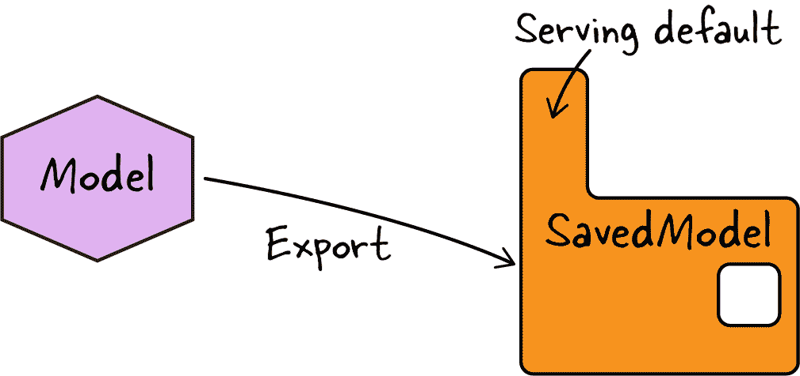
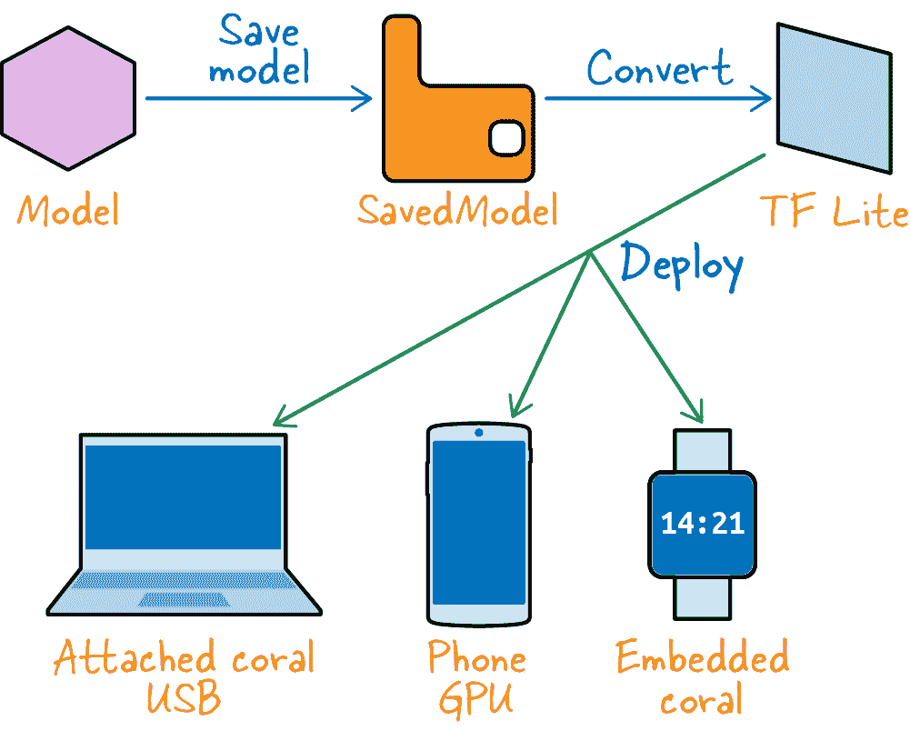

# 第九章：模型预测

训练机器学习模型的主要目的是能够使用它们进行预测。在本章中，我们将深入探讨部署训练过的 ML 模型并使用它们进行预测涉及的多个考虑因素和设计选择。

###### 提示

本章的代码位于书的 [GitHub 代码库](https://github.com/GoogleCloudPlatform/practical-ml-vision-book) 的 *09_deploying* 文件夹中。适用时，我们将为代码示例和笔记本提供文件名。

# 预测

要 *调用* 训练过的模型——即使用它进行预测——我们必须从导出到的目录中加载模型，并调用服务签名。在本节中，我们将看看如何实现这一点。我们还将探讨如何改进被调用模型的可维护性和性能。

## 导出模型

要获得调用的服务签名，我们必须导出我们训练过的模型。让我们快速回顾一下这两个主题——导出和模型签名——在 “保存模型状态” 中有更详细的讨论，该主题在 第七章 中有所涵盖。回想一下，可以使用类似下面这样的代码导出 Keras 模型（请参阅 GitHub 上的笔记本 [*07c_export.ipynb*](https://github.com/GoogleCloudPlatform/practical-ml-vision-book/blob/master/07_training/07c_export.ipynb)）：

```
model.save('gs://practical-ml-vision-book/flowers_5_trained')
```

这将以 TensorFlow SavedModel 格式保存模型。我们讨论了如何使用命令行工具 `saved_model_cli` 检查预测函数的签名。默认情况下，签名与保存的 Keras 模型的输入层匹配，但可以通过显式指定不同的函数来导出模型（参见 图 9-1）：

```
model.save('export/flowers_model',
           signatures={
               `'``serving_default``'``:` `predict_flower_type`
           })
```



###### 图 9-1\. 导出模型会创建一个 SavedModel，其中包含用于服务预测的默认签名。在这种情况下，左侧的模型是内存中的 Python 对象，而 SavedModel 是持久化到磁盘上的内容。

`predict_flower_type()` 函数带有 `@tf.function` 注解，详细信息请参阅 “TensorFlow 函数的签名” 在 第七章 中：

```
`@tf.function``(`input_signature=[tf.TensorSpec([None,], dtype=tf.`string`)])
def `predict_flower_type``(``filenames``)`:
    ...
```

假设，在本章第一部分的示例中，我们已经导出了具有 `predict_flower_type()` 函数作为默认服务函数的模型。

## 使用内存中的模型

假设我们正在编写一个需要调用此模型并获取其预测的客户端程序。客户端可以是我们希望从中调用模型的 Python 程序。然后，我们将模型加载到我们的程序中，并获取默认的服务函数如下（完整代码见 GitHub 上的 [*09a_inmemory.ipynb*](https://github.com/GoogleCloudPlatform/practical-ml-vision-book/blob/master/09_deploying/09a_inmemory.ipynb)）：

```
serving_fn = tf.keras.models.`load_model`(MODEL_LOCATION
                                       )`.``signatures``[``'``serving_default``'``]`
```

如果我们向服务函数传递一组文件名，我们将获得相应的预测结果：

```
filenames = [
    'gs://.../9818247_e2eac18894.jpg',
     ...
    'gs://.../8713397358_0505cc0176_n.jpg'
]
`pred` `=` `serving_fn``(``tf``.``convert_to_tensor``(`filenames`)``)`
```

结果是一个字典。可以通过查找字典中特定键并调用 `.numpy()` 来从张量中获取最大似然预测：

```
pred['flower_type_str'].numpy()
```

在这种预测情况下，模型是直接在客户端程序中加载和调用的（请参见 Figure 9-2）。模型的输入必须是张量，因此客户端程序必须将文件名字符串创建为张量。因为模型的输出也是张量，所以客户端程序必须使用 `.numpy()` 获取正常的 Python 对象。


###### 图 9-2\. 一个用 Python 编写的客户端程序将 SavedModel 加载到内存中，将包含文件名的张量发送到内存中的模型，并接收包含预测标签的张量。

在 Figure 9-3 中展示了一些输入图像及其预测结果。请注意，由于我们在第五章和第七章中复制了预处理操作以在服务函数中进行操作，客户端可以发送任何大小的图像给我们——服务器将会将图像调整为模型所需的大小。


###### 图 9-3\. 一组图像及其对应的预测结果。

然而，这种内存中方法存在两个关键问题：抽象和性能。让我们看看这些问题是什么以及如何解决它们。

## 改进抽象

通常情况下，开发 ML 模型的机器学习工程师和数据科学家拥有的工具和技能与将 ML 预测集成到用户界面应用程序中的应用程序开发人员不同。您希望 ML 预测 API 能够被那些不了解 TensorFlow 或 React、Swift 或 Kotlin 编程的人使用。这就是为什么抽象是必要的。

我们在某种程度上抽象了模型的细节——客户端不需要知道图像的必需大小（确实，请注意 Figure 9-3 中图像大小都不同）或用于分类的 ML 模型的架构。但这种抽象并不完全。我们确实对客户端程序员有一些要求：

+   客户端机器需要安装 TensorFlow 库。

+   在撰写本文时，TensorFlow API 仅能从 Python、[C](https://oreil.ly/H4zVq)、[Java](https://oreil.ly/WOP0O)、[Go](https://oreil.ly/bRhdh) 和 [JavaScript](https://oreil.ly/vvODq) 中调用。因此，客户端必须使用其中一种语言编写。

+   因为客户端程序员必须调用像 `tf.convert_to_tensor()` 和 `.numpy()` 这样的函数，所以他们必须理解张量形状和即时执行等概念。

为了提高抽象性，最好能够使用诸如 HTTPS 之类的协议调用模型，这样可以从多种语言和环境中使用。此外，最好能够以 JSON 等通用格式提供输入，并以相同的格式获取结果。

## 提高效率

在内存中的方法中，模型直接加载并在客户端程序中调用。因此，客户端需要：

+   考虑到板载内存，因为图像模型往往非常庞大

+   加速器如 GPU 或 TPU，否则计算速度将会非常慢

只要确保在具有足够内存和加速器的机器上运行客户端代码，我们就可以了吗？并不完全是。

性能问题通常会在以下四种场景中显现：

在线预测

我们可能有许多并发客户端需要几乎实时的预测结果。这种情况出现在我们构建交互工具时，比如一个允许将产品照片加载到电子商务网站上的工具。由于可能存在成千上万的同时用户，我们需要确保所有这些并发用户的预测结果以低延迟完成。

批量预测

我们可能需要在一个大型图像数据集上进行推理。如果每张图像处理需要 300 毫秒，那么对 10000 张图像的推理将花费将近一个小时。我们可能需要更快的结果。

流式预测

我们可能需要在图像流进入系统时进行推理。如果我们每秒接收大约 10 张图像，并且每张图像处理需要 100 毫秒，我们几乎无法跟上传入流量，因此任何流量突增都会导致系统开始落后。

边缘预测

低连通性客户端可能需要几乎实时的预测结果。例如，我们可能需要在工厂传送带上的零件中识别缺陷，即使它在移动。为了实现这一点，我们需要尽快处理传送带的图像。我们可能没有网络带宽将该图像发送到云中强大的机器并在移动传送带所规定的时间预算内获取结果。在手机应用程序根据手机摄像头所对准的物体做出决策时也是如此。因为工厂或手机位于网络边缘，网络带宽不如云数据中心中两台机器之间的高，这称为*边缘预测*。

在接下来的几节中，我们将深入探讨每种场景，并探讨处理它们的技术。

# 在线预测

对于在线预测，我们需要一个微服务架构——模型推断需要在配备加速器的强大服务器上进行。客户端将通过发送 HTTP 请求并接收 HTTP 响应来请求模型推断。使用加速器和自动扩展基础设施解决了性能问题，而使用 HTTP 请求和响应解决了抽象问题。

## TensorFlow Serving

在线预测的推荐方法是使用 TensorFlow Serving 部署模型作为响应 POST 请求的 Web 微服务。请求和响应将不是张量，而是抽象为诸如 JSON 之类的 Web 原生消息格式。

### 部署模型

TensorFlow Serving 只是软件，因此我们还需要一些基础设施。用户请求将动态路由到不同的服务器，并且需要自动扩展以处理流量峰值。您可以在像 Google Cloud 的 Vertex AI、Amazon SageMaker 或 Azure ML 这样的托管服务上运行 TensorFlow Serving，这些平台通过 GPU 和 AWS Inferentia、Azure FPGA 等自定义加速器提供加速。尽管您可以将 TensorFlow Serving 模块或 Docker 容器安装到您喜欢的 Web 应用程序框架中，但我们不建议此方法，因为您将无法获得云提供商 ML 平台优化的 ML 服务系统和基础设施管理的好处。

要在 Google Cloud 上将 SavedModel 部署为 Web 服务，我们需要指向模型导出到的 Google Cloud 存储位置，并将生成的模型部署到 Vertex AI 端点。详情请参阅 GitHub 上的代码。

在部署模型时，我们还可以指定机器类型、加速器类型以及最小和最大副本数。


###### 图 9-4\. 通过 REST API 提供的在线模型预测。

### 进行预测

可以从任何能够向部署模型的服务器发出 HTTPS 调用的计算机获取预测结果（参见 图 9-4）。数据来回传递为 JSON 消息，并且 TensorFlow Serving 将 JSON 转换为张量以发送到 SavedModel。

我们可以通过创建一个 JSON 请求来测试部署的模型：

```
{
    "`instances`": [
        {
            "`filenames`": "gs://.../9818247_e2eac18894.jpg"
        },
        {
            "filenames": "gs://.../9853885425_4a82356f1d_m.jpg"
        },
     ]
}
```

并使用 `gcloud` 将其发送到服务器：

```
gcloud ai endpoints predict ${ENDPOINT_ID} \
    --region=${REGION} \
    --json-request=request.json
```

一个关键的注意事项是，JSON 请求由一组实例组成，每个实例都是一个字典。字典中的项目对应于模型签名中指定的输入。我们可以通过在 SavedModel 上运行命令行工具 `saved_model_cli` 来查看模型签名：

```
saved_model_cli show --tag_set serve \
    --signature_def serving_default --dir ${MODEL_LOCATION}
```

对于花卉模型，返回如下：

```
inputs[`'``filenames``'`] tensor_info:
    dtype: `DT_STRING`
    shape: (-1)
    name: serving_default_filenames:0
```

这就是我们知道 JSON 中每个实例需要一个名为 `filenames` 的字符串元素的方式。

因为这只是一个 REST API，可以从任何能发送 HTTPS POST 请求的编程语言中调用它。以下是在 Python 中的操作方法：

```
`api` = ('https://{}-aiplatform.googleapis.com/v1/projects/' +
       '{}/locations/{}/endpoints/{}:predict'.format(
       REGION, PROJECT, REGION, ENDPOINT_ID))
```

标头包含客户端的身份验证令牌。可以使用以下方法以编程方式检索：

```
token = (GoogleCredentials.get_application_default()
         .get_access_token().access_token)
```

我们已经看到如何部署模型并从中获取预测结果，但 API 是与模型导出时的签名一致的。接下来，让我们看看如何更改这一点。

## 修改服务函数

目前，flowers 模型已经导出，以便它接受文件名作为输入，并返回由最可能的类（例如 daisy）、这个类的索引（例如 2）以及与这个类相关的概率（例如 0.3）组成的字典。假设我们希望更改签名，以便我们还返回与预测相关联的文件名。

这种情况非常常见，因为在导出模型时，我们无法预料到在生产中会需要确切的签名。在这种情况下，我们希望将客户端的输入参数传递到响应中。这种*透传参数*的需求非常普遍，不同的客户端将想要传递不同的内容。

虽然可以返回，更改训练程序，重新训练模型，并重新导出具有所需签名的模型，但简单地更改导出模型的签名更为便捷。

### 更改默认签名

要更改签名，首先我们加载导出的模型：

```
model = tf.keras.models.load_model(MODEL_LOCATION)
```

然后，我们定义一个带有所需新签名的函数，确保在新函数内部调用模型的旧签名：

```
@tf.function(input_signature=[tf.TensorSpec([None,], dtype=tf.string)])
def pass_through_input(filenames):
    old_fn = model.signatures['serving_default']
    result = `old_fn``(``filenames``)` # has flower_type_int etc.
    `result``[``'``filename``'``]` = filenames # pass through
    return result
```

如果客户端希望提供一个序列号，并要求我们在响应中透传此序列号，我们可以按以下方式操作：

```
@tf.function(input_signature=[tf.TensorSpec([None,], dtype=tf.string),
                              tf.TensorSpec([], dtype=`tf``.``int64`)])
def pass_through_input(filenames, `sequenceNumber`):
    old_fn = model.signatures['serving_default']
    result = old_fn(filenames) # has flower_type_int etc.
    result['filename'] = filenames # pass through
    `result``[``'``sequenceNumber``'``]` `=` `sequenceNumber` # pass through
    return result
```

最后，我们将带有新函数的模型导出为服务默认：

```
model.save(NEW_MODEL_LOCATION,
           signatures={
               'serving_default': pass_through_input
           })
```

我们可以使用`saved_model_cli`验证生成的签名，并确保文件名包含在输出中：

```
outputs['filename'] tensor_info:
      dtype: DT_STRING
      shape: (-1)
      name: StatefulPartitionedCall:0
```

### 多个签名

如果你有多个客户，并且每个客户都想要不同的签名？TensorFlow Serving 允许在模型中拥有多个签名（尽管其中只有一个将成为服务默认）。

例如，假设我们想支持原始签名和透传版本。在这种情况下，我们可以导出带有两个签名的模型（见图 9-5）：

```
model.save('export/flowers_model2',
           signatures={
               `'``serving_default``'``:` `old_fn``,`
               `'``input_pass_through``'``:` `pass_through_input`
           })
```

其中`old_fn`是通过以下方式获取的原始服务签名：

```
model = tf.keras.models.load_model(MODEL_LOCATION)
old_fn = model.signatures['serving_default']
```


###### 图 9-5\. 导出带有多个签名的模型。

客户希望调用非默认服务签名的，需要在他们的请求中明确包含一个签名名称：

```
{
    `"``signature_name``"``:` `"``input_pass_through``"``,`
    "instances": [
        {
            "filenames": "gs://.../9818247_e2eac18894.jpg"
        },
        ...
}
```

其他人将获得对应于默认服务函数的响应。

## 处理图像字节

到目前为止，我们一直在向服务发送文件名，并请求分类结果。这对已经上传到云中的图像效果很好，但如果情况不是这样，可能会增加摩擦。如果图像尚未在云中，客户端代码最好将 JPEG 字节发送给我们，而不是文件内容。这样，我们可以避免在调用预测模型之前上传图像数据到云的中间步骤。

### 加载模型

在这种情况下改变模型，我们可以加载导出的模型，并更改输入签名为：

```
@tf.function(input_signature=[tf.TensorSpec([None,], dtype=tf.string)])
def predict_bytes(img_bytes):
```

但是这种实现会做什么呢？为了调用现有的模型签名，我们需要用户的文件能够在服务器上可用。因此，我们需要获取传入的图像字节，将其写入临时的云存储位置，然后发送到模型。然后模型将再次读取这个临时文件到内存中。这是相当浪费的 —— 我们如何让模型直接使用我们发送的字节呢？

为此，我们需要解码 JPEG 字节，以与模型训练期间相同的方式预处理它们，然后调用 `model.predict()`。为此，我们需要加载在模型训练期间保存的最后（或最佳）检查点：

```
CHECK_POINT_DIR='gs://.../chkpts'
model = tf.keras.models.load_model(CHECK_POINT_DIR)
```

我们也可以使用相同的 API 加载导出的模型：

```
EXPORT_DIR='gs://.../export'
model = tf.keras.models.load_model(EXPORT_DIR)
```

### 添加预测签名

加载模型后，我们使用此模型来实现预测函数：

```
@tf.function(input_signature=[tf.TensorSpec([None,], dtype=tf.string)])
def predict_bytes(img_bytes):
    input_images = tf.map_fn(
        `preprocess`, # preprocessing function used in training
        img_bytes,
        fn_output_signature=tf.float32
    )
    batch_pred = `model``(``input_images``)` # same as model.predict()
    top_prob = tf.math.reduce_max(batch_pred, axis=[1])
    pred_label_index = tf.math.argmax(batch_pred, axis=1)
    pred_label = tf.gather(tf.convert_to_tensor(CLASS_NAMES),
                           pred_label_index)
    return {
        'probability': top_prob,
        'flower_type_int': pred_label_index,
        'flower_type_str': pred_label
    }
```

在那段代码片段中，请注意我们需要获取训练中使用的预处理函数的访问权，可能通过导入一个 Python 模块。预处理函数必须与训练时使用的相同：

```
def preprocess(img_bytes):
    img = tf.image.decode_jpeg(img_bytes, channels=IMG_CHANNELS)
    img = tf.image.convert_image_dtype(img, tf.float32)
    return tf.image.resize_with_pad(img, IMG_HEIGHT, IMG_WIDTH)
```

我们可能也要实现另一种方法来根据文件名预测：

```
@tf.function(input_signature=[tf.TensorSpec([None,], dtype=tf.string)])
def predict_filename(filenames):
    img_bytes = tf.map_fn(
        `tf``.``io``.``read_file``,`
        filenames
    )
    result = `predict_bytes``(``img_bytes``)`
    result['filename'] = filenames
    return result
```

此函数简单地读取文件（使用 `tf.io.read_file()`），然后调用另一个预测方法。

### 导出签名

这两个函数都可以导出，以便客户可以选择提供文件名或字节内容：

```
model.save('export/flowers_model3',
           signatures={
               'serving_default': predict_filename,
               'from_bytes': predict_bytes
           })
```

### Base64 编码

为了将本地图像文件的内容提供给 Web 服务，我们将文件内容读入内存，并通过网络发送。因为 JPEG 文件很可能包含会混淆服务器端 JSON 解析器的特殊字符，所以在发送之前有必要对文件内容进行 base64 编码（完整代码在 GitHub 上的 [*09d_bytes.ipynb*](https://github.com/GoogleCloudPlatform/practical-ml-vision-book/blob/master/09_deploying/09d_bytes.ipynb) 可以找到）：

```
def b64encode(filename):
    with open(filename, 'rb') as ifp:
        img_bytes = ifp.read()
        return base64.b64encode(img_bytes)
```

将 base64 编码的数据包含在以下发送的 JSON 消息中：

```
data = {
    `"``signature_name``"``:` `"``from_bytes``"``,`
    "instances": [
        {
            "img_bytes": `{``"``b64``"``:` `b64encode``(``'``/tmp/test1.jpg``'``)``}`
        },
        {
            "img_bytes": {"b64": b64encode('/tmp/test2.jpg')}
        },
    ]
}
```

注意使用特殊的 `b64` 元素来表示 base64 编码。TensorFlow Serving 理解这一点，并在另一端解码数据。

# 批处理和流式预测

逐个图像进行批量预测速度太慢了。更好的解决方案是并行进行预测。批量预测是一个尴尬的并行问题 —— 两个图像的预测可以完全并行执行，因为两个预测过程之间没有数据传输。然而，尝试在单机上使用多个 GPU 并行化批量预测代码通常会遇到内存问题，因为每个线程都需要拥有模型的独立副本。使用 Apache Beam、Apache Spark 或任何其他允许我们跨多台机器分布数据处理的大数据处理技术是提高批量预测性能的好方法。

对于流式预测同样需要多台机器（例如响应通过 Apache Kafka、Amazon Kinesis 或 Google Cloud Pub/Sub 的点击流事件），原因与批量预测相同 —— 在图像到达时并行执行推断而不引起内存问题。然而，由于流式工作负载往往是突发的，我们还需要这种基础设施能够自动扩展 —— 在流量高峰时提供更多机器，在流量低谷时缩减到最少机器数量。Apache Beam 在 Cloud Dataflow 上提供了这种能力。因此，我们建议使用 Beam 来提高流式预测的性能。令人高兴的是，Beam 中用于批量预测的相同代码也能够无需修改地用于流式预测。

## Apache Beam 管道

批量和流式预测的解决方案都涉及 Apache Beam。我们可以编写一个 Beam 转换来作为管道的一部分执行推断：

```
| 'pred' >> beam.Map(ModelPredict(MODEL_LOCATION))
```

我们可以通过加载从导出模型中导入的服务函数来重用内存预测中使用的模型预测代码：

```
class ModelPredict:
    def __init__(self, model_location):
        self._model_location = model_location

    `def` `__call__``(``self``,` `filename``)``:`
        `serving_fn` `=` `(``tf``.``keras``.``models``.``load_model``(``self``.``_model_location``)`
                    `.``signatures``[``'``serving_default``'``]``)`
        `result` `=` `serving_fn``(``tf``.``convert_to_tensor``(``[``filename``]``)``)`
        return {
            'filenames': filename,
            'probability': result['probability'].numpy()[0],
            'pred_label': result['flower_type_str'].numpy()[0]
        }
```

然而，这段代码存在两个问题。首先，我们是逐个处理文件。如果能够批量处理文件，TensorFlow 图操作将更快，因此我们希望能够批量处理文件名。其次，我们为每个元素加载模型。理想情况下，我们只需加载模型一次并重复使用。然而，由于 Beam 是一个分布式系统，实际上我们必须在每个工作器上加载模型 *一次*（参见 图 9-6）。为此，我们必须通过弱引用获取一个共享 *句柄*（实质上是与服务的共享连接）。这个句柄必须通过弱引用获取，以便在工作器由于低流量而下线后重新激活（由于流量峰值）时，Beam 能够执行正确的操作并重新加载该工作器上的模型。


###### 图 9-6\. 批量预测使用分布式工作器并行处理输入数据。这种架构也适用于流式预测。

要使用共享句柄，我们需要修改模型预测代码如下：

```
class ModelPredict:
    def __init__(self, shared_handle, model_location):
        `self``.``_shared_handle` `=` `shared_handle`
        self._model_location = model_location

    def __call__(self, filenames):
        `def` `initialize_model``(``)``:`
            logging.info('Loading Keras model from ' +
                         self._model_location)
            return (tf.keras.models.load_model(self._model_location)
                    .signatures['serving_default'])

        `serving_fn` `=` `self``.``_shared_handle``.``acquire``(``initialize_model``)`
        result = serving_fn(tf.convert_to_tensor(filenames))
        return {
            'filenames': filenames,
            'probability': result['probability'].numpy(),
            'pred_label': result['flower_type_str'].numpy()
        }
```

由 Apache Beam 提供的共享句柄确保在工作器内重复使用连接，并在休眠后重新获取。在管道中，我们创建共享句柄，并确保在调用模型预测之前对元素进行批处理（你可以在 GitHub 上的 [*09a_inmemory.ipynb*](https://github.com/GoogleCloudPlatform/practical-ml-vision-book/blob/master/09_deploying/09a_inmemory.ipynb) 中查看完整代码）：

```
with beam.Pipeline() as p:

    `shared_handle` `=` `Shared``(``)`

    (p
     | ...
     | 'batch' >> `beam``.``BatchElements``(`
                     min_batch_size=1, max_batch_size=32)
     | 'addpred' >> beam.Map(
                     ModelPredict(shared_handle, MODEL_LOCATION) )
    )
```

相同的代码适用于批处理和流式预测。

###### 注意

如果正在对图像进行分组，则这些组已经是图像的批处理，因此无需显式对它们进行批处理：

```
| 'groupbykey' >> beam.GroupByKey()  # (usr, [files])
| 'addpred' >> beam.Map(`lambda` `x``:`
                ModelPredict(shared_handle,
                             MODEL_LOCATION)`(``x``[``1``]``)`)
```

我们可以使用 Cloud Dataflow 对 Apache Beam 代码进行大规模运行。

## 批量预测的托管服务

如果我们已将模型部署为支持在线预测的 Web 服务，那么除了使用 Dataflow 批处理管道中的 Beam 外，还可以使用 Vertex AI 进行批量预测：

```
gcloud ai custom-jobs create \
    --display_name=flowers_batchpred_$(date -u +%y%m%d_%H%M%S) \
    --region ${REGION} \
    --project=${PROJECT} \

--worker-pool-spec=machine-type='n1-highmem-2',container-image-uri=${IMAGE}

```

在性能方面，最佳方法取决于在线预测基础设施中可用的加速器与大数据基础设施中可用的加速器。由于在线预测基础设施可以使用自定义 ML 芯片，这种方法往往更好。此外，Vertex AI 批量预测更易于使用，因为我们不必编写处理批处理请求的代码。

## 调用在线预测

在 Apache Beam 中编写自己的批量预测管道更加灵活，因为我们可以在管道中进行额外的转换。如果我们能够将 Beam 和 REST API 方法结合起来，那将是非常好的事情。

我们可以通过从 Beam 管道中调用部署的 REST 端点而不是调用内存中的模型来实现这一点（完整代码在 GitHub 上的 [*09b_rest.ipynb*](https://github.com/GoogleCloudPlatform/practical-ml-vision-book/blob/master/09_deploying/09b_rest.ipynb) 中）：

```
class ModelPredict:
    def __init__(self, project, model_name, model_version):
        self._api = ('https://ml.googleapis.com/...:predict'
            .format(project, model_name, model_version))

    def __call__(self, filenames):
        token = (GoogleCredentials.get_application_default()
                 .get_access_token().access_token)
        data = {
            "instances": []
        }
        for f in filenames:
            data['instances'].append({
                "filenames" : f
            })
        headers = {'Authorization': 'Bearer ' + token }
        response = `requests``.``post``(``self``.``_api``,` `json``=``data``,` `headers``=``headers``)`
        response = json.loads(response.content.decode('utf-8'))
        for (a,b) in zip(filenames, response['predictions']):
            result = b
            result['filename'] = a
            yield result
```

如果按照这里显示的方法将 Beam 方法与 REST API 方法结合起来，我们将能够支持流式预测（这是托管服务不支持的）。我们还能获得一些性能优势：

+   部署的在线模型可以根据模型的计算需求进行扩展。同时，Beam 管道可以根据数据速率进行扩展。这种独立扩展两个部分的能力可以节省成本。

+   部署的在线模型可以更有效地利用 GPU，因为整个模型代码都在 TensorFlow 图上。虽然可以在 GPU 上运行 Dataflow 管道，但 GPU 使用效果较低，因为 Dataflow 管道执行许多其他任务（如读取数据、分组键等），这些任务并不受 GPU 加速的益处。

然而，这两个性能优点必须与增加的网络开销平衡——使用在线模型会从 Beam 管道向部署的模型发起网络调用。通过测量性能来确定内存模型对您的需求是否比 REST 模型更好。实际上，我们观察到，模型越大，批次中的实例越多，使用 Beam 从在线模型调用而不是在内存中托管模型的性能优势就越大。

# Edge ML

Edge ML 因为近年来具有计算能力的设备数量急剧增长而变得越来越重要。这些设备包括智能手机、家庭和工厂中的连接设备，以及户外放置的仪器。如果这些边缘设备有摄像头，那么它们就是图像机器学习用例的候选者。

## 约束与优化

边缘设备往往有一些限制：

+   它们可能没有连接到互联网，即使有连接，连接也可能不稳定且带宽较低。因此，有必要在设备上执行 ML 模型推理，这样我们就不必等待云端的往返时间。

+   可能存在隐私约束，并且可能希望图像数据永远不离开设备。

+   边缘设备往往具有有限的内存、存储和计算能力（至少与典型的台式机或云计算机相比）。因此，模型推理必须以高效的方式完成。

+   在使用案例中，设备通常需要低成本、小尺寸、极低功耗，并且不会过热。

因此，对于边缘预测，我们需要一种低成本、高效的设备内 ML 加速器。在某些情况下，加速器已经内置。例如，现代手机通常有内置 GPU。在其他情况下，我们将不得不在仪器的设计中集成加速器。我们可以购买边缘加速器，将其附加或集成到正在构建的仪器（如摄像头和 X 射线扫描仪）中。

与选择快速硬件一起，我们还需要确保不过度使用设备。我们可以利用减少图像模型计算要求的方法，以便它们在边缘上高效运行。

## TensorFlow Lite

TensorFlow Lite 是一个在边缘设备上执行 TensorFlow 模型推理的软件框架。请注意，TensorFlow Lite 不是 TensorFlow 的一个版本——我们不能使用 TensorFlow Lite 训练模型。相反，我们使用常规 TensorFlow 训练模型，然后将 SavedModel 转换为适用于边缘设备的高效形式（参见图 9-7）。



###### 图 9-7 创建一个可在边缘运行的 ML 模型。

要将一个 SavedModel 文件转换成 TensorFlow Lite 文件，我们需要使用`tf.lite`转换器工具。我们可以在 Python 中这样做：

```
converter = tf.lite.TFLiteConverter.from_saved_model(MODEL_LOCATION)
tflite_model = converter.convert()
with open('export/model.tflite', 'wb') as ofp:
    ofp.write(tflite_model)
```

为了获得高效的边缘预测，我们需要做两件事。首先，我们应该确保使用类似 MobileNet 这样的[边缘优化](https://oreil.ly/0GYY0)模型。由于在训练期间修剪连接并使用分段线性逼近激活函数等优化措施，MobileNet 的速度大约是 Inception 等模型的 40 倍。

其次，我们应仔细选择如何量化模型权重。量化的适当选择取决于我们部署模型的设备。例如，Coral Edge TPU 在将模型权重量化为整数时效果最佳。我们可以通过在转换器上指定一些选项来进行整数量化：

```
converter = tf.lite.TFLiteConverter.from_saved_model(saved_model_dir)
converter.`optimizations` = [tf.lite.Optimize.DEFAULT]
converter.`representative_dataset` `=` `training_dataset``.``take``(``100``)`
converter.target_spec.supported_ops = [tf.lite.OpsSet.TFLITE_BUILTINS_INT8]
converter.`inference_input_type` `=` `tf``.``int8`  # or tf.uint8
converter.inference_output_type = tf.int8  # or tf.uint8
tflite_model = converter.convert()
```

在此代码中，我们要求优化器查看我们训练数据集中的一百个代表性图像（或者模型输入是什么），以确定如何最佳地量化权重而不损失模型的预测能力。我们还要求转换过程仅使用 int8 算术，并指定模型的输入和输出类型将是 int8。

将模型权重从 float32 量化为 int8，使 Edge TPU 能够使用四分之一的内存，并通过在整数上执行算术加速运算，比使用浮点数快一个数量级。量化通常会导致精度损失约为 0.2% 到 0.5%，尽管这取决于模型和数据集。

一旦我们拥有了 TensorFlow Lite 模型文件，我们将文件下载到边缘设备上，或者将模型文件打包到安装在设备上的应用程序中。

## 运行 TensorFlow Lite

要从模型获取预测结果，边缘设备需要运行 TensorFlow Lite 解释器。Android 自带一个用 Java 编写的解释器。要从 Android 程序中进行推断，我们可以：

```
try (Interpreter tflite = new Interpreter(tf_lite_file)) {
    tflite.run(inputImageBuffer.getBuffer(), output);
}
```

iOS 上类似的解释器可用 Swift 和 Objective-C 编写。

###### 提示

[ML Kit 框架](https://oreil.ly/9c3xb)支持许多常见的边缘用途，如文本识别、条形码扫描、人脸检测和物体检测。ML Kit 与 Firebase（一种流行的移动应用程序软件开发工具包（SDK））集成良好。在自己开发 ML 解决方案之前，请检查 ML Kit 中是否已经提供了相应功能。

对于非手机设备，请使用 Coral Edge TPU。在撰写本文时，Coral Edge TPU 有三种形式可用：

+   一种可以通过 USB3 连接到边缘设备（如 Raspberry Pi）的插件

+   带有 Linux 和蓝牙的基板

+   可以焊接到现有板上的小型独立芯片

Edge TPU 较 CPU 提供的加速大约为 30–50 倍。

使用 TensorFlow Lite 解释器在 Coral 上涉及设置和检索解释器状态：

```
interpreter = make_interpreter(path_to_tflite_model)
interpreter.allocate_tensors()
common.set_input(interpreter, imageBuffer)
interpreter.invoke()
result = classify.get_classes(interpreter)
```

###### 注意

要在像 Arduino 这样的微控制器上运行模型，请使用[TinyML](https://learning.oreilly.com/library/view/tinyml/9781492052036/)，¹而不是 TensorFlow Lite。微控制器是一种在单一电路板上的小型计算机，不需要任何操作系统。TinyML 提供了一个[定制的 TensorFlow 库](https://oreil.ly/lppxk)，旨在在嵌入式设备上运行，这些设备没有操作系统，只有几十千字节的内存。另一方面，TensorFlow Lite 是一组工具，用于优化在具有操作系统的边缘设备上运行的 ML 模型。

## 处理图像缓冲区

在边缘设备上，我们将直接在摄像头缓冲区中处理图像，因此我们一次只处理一张图片。让我们适当地更改服务签名（完整代码在[*09e_tflite.ipynb* on GitHub](https://github.com/GoogleCloudPlatform/practical-ml-vision-book/blob/master/09_deploying/09e_tflite.ipynb)）：

```
@tf.function(input_signature=[
       tf.TensorSpec(`[``None``,` `None``,` `3``]`, dtype=tf.float32)])
def predict_flower_type(img):
    img = tf.image.resize_with_pad(img, IMG_HEIGHT, IMG_WIDTH)
    ...
    return {
        'probability': tf.squeeze(top_prob, axis=0),
        'flower_type': tf.squeeze(pred_label, axis=0)
    }
```

然后我们将其导出：

```
model.save(MODEL_LOCATION,
          signatures={
              'serving_default': predict_flower_type
          })
```

并将此模型转换为 TensorFlow Lite 格式。

## 联邦学习

使用 TensorFlow Lite，我们在云上训练了模型并将云训练的模型转换为适合复制到边缘设备的文件格式。一旦模型位于边缘设备上，它就不再被重新训练。然而，在边缘 ML 模型上，数据漂移和模型漂移会发生，就像在云模型上一样。因此，我们需要计划将至少一部分图像样本保存到设备上的磁盘，并定期将这些图像检索到集中位置。

请记住，进行边缘推理的一个原因是支持涉及隐私的用例。如果我们不希望图像数据离开设备怎么办？

解决这一隐私问题的一种解决方案是*联邦学习*。在联邦学习中，设备共同学习一个共享的预测模型，而每个设备都将其训练数据保留在设备上。实质上，每个设备计算一个梯度更新，并仅与其邻居共享梯度（而不是原始图像）或*联邦化*。联邦中的一个或多个成员对多个设备的梯度更新进行平均，并且只有聚合结果发送到云端。设备也可以基于在设备上发生的交互进一步微调共享的预测模型（参见图 9-8）。这允许在每个设备上进行隐私敏感的个性化。


###### 图 9-8。在联邦学习中，设备上的模型（A）基于其自身的互动和来自许多其他设备的数据进行改进，但数据永远不会离开设备。许多用户的更新被聚合（B）以形成对共享模型的共识变更（C），之后该过程被重复。图像由[Google AI Blog](https://oreil.ly/tBoB0)提供。

即使采用这种方法，模型攻击仍然可能从训练好的模型中提取出一些敏感信息。为了进一步增强隐私保护，可以将联邦学习与[*差分隐私*](https://arxiv.org/abs/1412.7584)结合起来。在[TensorFlow 代码库](https://oreil.ly/D5UQC)中提供了一个开源框架来实现联邦学习。

# 摘要

在本章中，我们看了如何调用一个训练好的模型。我们改进了预测 API 提供的抽象层，并讨论了如何提高推理性能。对于批量预测，我们建议使用像 Apache Beam 这样的大数据工具，并在多台机器上分发预测任务。

对于大规模并发的实时预测，我们建议将模型部署为一个使用 TensorFlow Serving 的微服务。我们还讨论了如何更改模型的签名以支持多种需求，并接受直接通过网络发送的图像字节数据。我们还演示了如何使用 TensorFlow Lite 使模型更有效地部署到边缘设备。

到目前为止，我们已经涵盖了典型机器学习流水线的所有步骤，从数据集创建到部署用于预测。在下一章中，我们将探讨如何将它们整合成一个流水线的方法。

¹ Pete Warden 和 Daniel Situnayake，《TinyML》（O’Reilly，2019）。
