# 第十章：生产 ML 的趋势

在本书中，我们将计算机视觉视为数据科学家要解决的问题。然而，由于机器学习用于解决实际业务问题，因此有其他角色与数据科学家进行接口，以执行机器学习，例如：

ML 工程师

数据科学家构建的 ML 模型由 ML 工程师投入生产，他们将典型的机器学习工作流程的所有步骤，从数据集创建到部署以进行预测，串联成一个机器学习管道。你经常会听到这被描述为*MLOps*。

终端用户

基于 ML 模型做出决策的人往往不信任黑匣子 AI 方法。这在医学等领域尤为明显，终端用户是高度训练有素的专家。他们通常要求你的 AI 模型是*可解释*的——可解释性被广泛认为是负责任地进行 AI 的先决条件。

领域专家

领域专家可以使用无代码框架开发 ML 模型。因此，他们经常帮助进行数据收集、验证和问题可行性评估。你可能听到这被描述为通过*无代码*或*低代码*工具使 ML“民主化”。

在本章中，我们将探讨这些相邻角色的需求和技能如何越来越影响生产设置中的 ML 工作流程。

###### 提示

本章的代码位于该书的[GitHub 存储库](https://github.com/GoogleCloudPlatform/practical-ml-vision-book)的*10_mlops*文件夹中。我们将在适用时提供代码示例和笔记本的文件名。

# 机器学习管道

图 10-1 展示了机器学习管道的高层视图。为了创建一个接受图像文件并识别其中花朵的网络服务，正如我们在本书中所描述的，我们需要执行以下步骤：

+   通过将我们的 JPEG 图像转换为 TensorFlow Records 来创建我们的数据集，并将数据分为训练、验证和测试数据集。

+   训练一个 ML 模型来分类花朵（我们进行了超参数调整以选择最佳模型，但假设我们可以预先确定参数）。

+   部署模型用于服务。

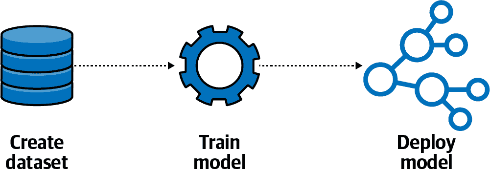

###### 图 10-1。端到端 ML 管道。

正如您在本节中所看到的，为了完成 ML 管道中的这些步骤，我们必须：

+   在其上设置一个集群来执行管道。

+   封装我们的代码库，因为管道执行容器。

+   编写与管道的每个步骤对应的管道组件。

+   连接管道组件，以便一次性运行管道。

+   自动化管道以响应诸如新数据到达之类的事件而运行。

首先，让我们讨论为什么我们首先需要 ML 管道。

## 管道的需求

在我们对原始数据集进行训练模型之后，如果我们获得了更多文件进行训练，会发生什么？我们需要执行相同的操作来处理这些文件，将它们添加到我们的数据集中，并重新训练我们的模型。在一个依赖于有新鲜数据的模型中（例如用于产品识别而不是花卉分类的模型），我们可能需要每天执行这些步骤。

当模型需要对新数据进行预测时，由于*数据漂移*的存在，模型的性能开始下降是相当常见的——也就是说，新数据可能与其训练的数据不同。也许新图像的分辨率更高，或者来自我们训练数据集中没有的季节或地点。我们还可以预期，一个月后，我们会有几个新想法想要尝试。也许我们的同事会设计出更好的数据增强滤波器，我们希望将其纳入，或者 MobileNet 的新版本（我们正在进行迁移学习的架构）可能已发布。改变模型代码的实验将是相当常见的，并且必须进行计划。

理想情况下，我们希望有一个框架可以帮助我们安排和操作我们的 ML 流水线，并允许进行持续的实验。Kubeflow Pipelines 提供了一个软件框架，可以用其领域特定语言（DSL）表示我们选择的任何 ML 流水线。它在 Kubeflow 上运行，这是一个针对运行 TensorFlow 模型优化的 Kubernetes 框架（见图 10-2）。Google Cloud 上的托管 Kubeflow Pipelines 执行器称为 Vertex Pipelines。流水线本身可以在 Kubernetes 集群上执行步骤（用于本地工作），或者在 Google Cloud 上调用 Vertex Training、Vertex Prediction 和 Cloud Dataflow。有关实验和步骤的元数据可以存储在集群本身中，也可以存储在 Cloud Storage 和 Cloud SQL 中。

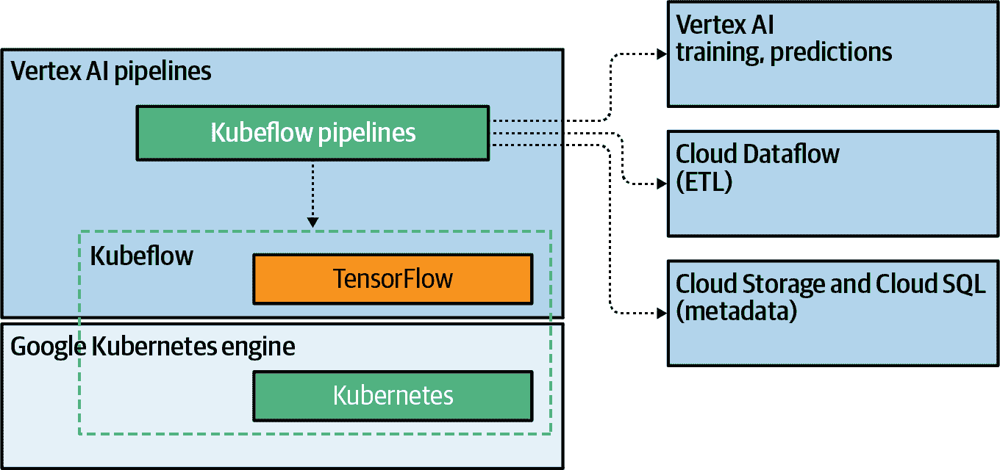

###### 图 10-2\. Kubeflow Pipelines API 在 TensorFlow 和 Kubernetes 上运行。

###### 小贴士

大多数 ML 流水线遵循一套相当标准的步骤：数据验证、数据转换、模型训练、模型评估、模型部署和模型监控。如果您的流水线遵循这些步骤，您可以利用 TensorFlow Extended（TFX）提供的高级抽象形式的 Python API。这样，您就不需要在 DSL 和容器化步骤的级别上工作。[TFX](https://oreil.ly/1AOvG)超出了本书的范围。

## Kubeflow Pipelines 集群

要执行 Kubeflow 流水线，我们需要一个集群。我们可以通过转到[AI Platform Pipelines 控制台](https://oreil.ly/SYUlx)并创建一个新实例在 Google Cloud 上设置一个。一旦启动，我们将获得一个链接来打开 Pipelines 仪表板和一个提供主机 URL 的设置图标（见图 10-3）。

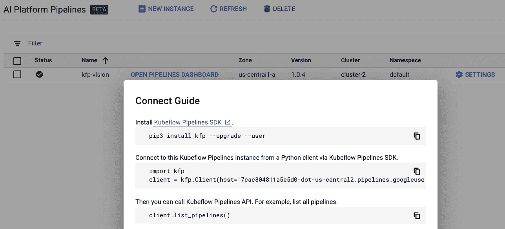

###### 图 10-3\. AI 平台管道为 Kubeflow 管道提供了托管的执行环境。

我们可以在 Jupyter 笔记本中开发流水线，然后将其部署到集群中。请在[GitHub 上的*07e_mlpipeline.ipynb*](https://github.com/GoogleCloudPlatform/practical-ml-vision-book/blob/master/07_training/07e_mlpipeline.ipynb)中查看完整的代码。

## 将代码库容器化

一旦我们有了集群，我们流水线的第一步需要将 JPEG 文件转换为 TensorFlow 记录。回想一下，我们在第五章编写了一个名为[*jpeg_to_tfrecord.py*](https://github.com/GoogleCloudPlatform/practical-ml-vision-book/blob/master/05_create_dataset/jpeg_to_tfrecord.py)的 Apache Beam 程序来处理这个任务。为了使其可重复执行，我们需要将其制作成一个容器，其中捕获了所有依赖关系。

我们在 Jupyter 笔记本中开发了它，幸运的是，Vertex AI 上的笔记本服务为每种笔记本实例类型发布了相应的容器映像。因此，要构建一个能够执行该程序的容器，我们需要执行以下操作：

+   获取与笔记本实例对应的容器映像。

+   安装任何额外的软件依赖项。浏览所有我们的笔记本，我们看到我们需要安装两个额外的 Python 包：`apache-beam[gcp]` 和 `cloudml-hypertune`。

+   复制脚本。因为我们可能还需要仓库中的其他代码来完成其他任务，最好将整个仓库复制过来。

这个 Dockerfile（完整代码在[GitHub 上的*Dockerfile*](https://github.com/GoogleCloudPlatform/practical-ml-vision-book/blob/master/Dockerfile)中）执行了这三个步骤：

```
FROM gcr.io/deeplearning-platform-release/tf2-gpu
RUN python3 -m pip install --upgrade apache-beam[gcp] cloudml-hypertune
RUN mkdir -p /src/practical-ml-vision-book
COPY . /src/practical-ml-vision-book/
```

###### 注意

熟悉 Dockerfile 的人会注意到这个文件中没有`ENTRYPOINT`。这是因为我们将在 Kubeflow 组件中设置入口点——我们流水线中的所有组件都将使用相同的 Docker 镜像。

我们可以使用标准的 Docker 功能将 Docker 镜像推送到容器注册表中：

```
full_image_name=gcr.io/${PROJECT_ID}/practical-ml-vision-book:latest
docker build -t "${full_image_name}" .
docker push "$full_image_name"
```

## 编写组件

对于我们需要的每个组件，我们首先会从一个 YAML 文件中加载其定义，然后使用它来创建实际的组件。

我们需要创建的第一个组件是数据集（参见图 10-1）。从第五章我们知道，这一步涉及运行*jpeg_to_tfrecord.py*。我们在名为*create_dataset.yaml*的文件中定义了该组件。它指定了这些输入参数：

```
inputs:
- {name: runner, type: str, default: 'DirectRunner', description: 'DirectRunner…'}
- {name: project_id, type: str, description: 'Project to bill Dataflow job to'}
- {name: region, type: str, description: 'Region to run Dataflow job in'}
- {name: input_csv, type: GCSPath, description: 'Path to CSV file'}
- {name: output_dir, type: GCSPath, description: 'Top-level directory…'}
- {name: labels_dict, type: GCSPath, description: 'Dictionary file…'}
```

它还指定了实现方式，即调用名为*create_dataset.sh*的脚本，在[GitHub 上的*create_dataset.sh*](https://github.com/GoogleCloudPlatform/practical-ml-vision-book/blob/master/10_mlops/components/create_dataset.sh)中可以找到。脚本的参数是从组件输入构建的：

```
implementation:
    container:
        image: gcr.io/[PROJECT-ID]/practical-ml-vision-book:latest
        command: [
            "bash",
            "/src/practical-ml-vision-book/.../create_dataset.sh"
        ]
        args: [
            {inputValue: output_dir},
            {outputPath: tfrecords_topdir},
            "--all_data", {inputValue: input_csv},
            "--labels_file", {inputValue: labels_dict},
            "--project_id", {inputValue: project_id},
            "--output_dir", {inputValue: output_dir},
            "--runner", {inputValue: runner},
            "--region", {inputValue: region},
        ]
```

*create_dataset.sh*脚本简单地将所有内容转发给 Python 程序：

```
cd /src/practical-ml-vision-book/05_create_dataset
python3 -m jpeg_to_tfrecord $@
```

在这里为什么需要额外的间接层？为什么不简单地将`python3`指定为命令（而不是调用 shell 脚本的 bash 命令）？这是因为除了调用转换程序外，我们还需要执行其他功能，如创建文件夹、向 Kubeflow 流水线的后续步骤传递消息、清理中间文件等。与其更新 Python 代码以添加与 Kubeflow Pipelines 功能无关的功能，我们将在一个 bash 脚本中包装 Python 代码来完成设置、消息传递和清理工作。稍后将详细介绍这些内容。

我们将按以下方式从流水线调用组件：

```
create_dataset_op = kfp.components.load_component_from_file(
    'components/create_dataset.yaml'
)
create_dataset = create_dataset_op(
    runner='DataflowRunner',
    project_id=project_id,
    region=region,
    input_csv='gs://cloud-ml-data/img/flower_photos/all_data.csv',
    output_dir='gs://{}/data/flower_tfrecords'.format(bucket),
    labels_dict='gs://cloud-ml-data/img/flower_photos/dict.txt'
)
```

###### 提示

如果我们传入`DirectRunner`而不是`DataflowRunner`，Apache Beam 流水线将在 Kubeflow 集群本身上执行（虽然速度慢，并且在单台机器上执行）。这对于在本地执行非常有用。

给定我们刚刚创建的`create_dataset_op`组件，我们可以创建一个流水线来运行这个组件：

```
create_dataset_op = kfp.components.load_component_from_file(
    'components/create_dataset.yaml'
)

`@dsl.pipeline``(`
    `name``=``'``Flowers Transfer Learning Pipeline``'``,`
    `description``=``'``End-to-end pipeline``'`
`)`
`def` `flowerstxf_pipeline``(`
    `project_id``=``PROJECT``,`
    `bucket``=``BUCKET``,`
    `region``=``REGION`
`)``:`
    # Step 1: Create dataset
    create_dataset = create_dataset_op(
        runner='DataflowRunner',
        project_id=project_id,
        region=region,
        input_csv='gs://cloud-ml-data/img/flower_photos/all_data.csv',
        output_dir='gs://{}/data/flower_tfrecords'.format(bucket),
        labels_dict='gs://cloud-ml-data/img/flower_photos/dict.txt'
    )
```

然后，我们将此流水线编译成一个*.zip*文件：

```
pipeline_func = flowerstxf_pipeline
pipeline_filename = pipeline_func.__name__ + '.zip'
import kfp.compiler as compiler
compiler.Compiler().compile(pipeline_func, pipeline_filename)
```

并将该文件提交为一个实验：

```
import kfp
client = kfp.Client(host=KFPHOST)
experiment = client.create_experiment('from_notebook')
run_name = pipeline_func.__name__ + ' run'
run_result = client.run_pipeline(
    experiment.id,
    run_name,
    pipeline_filename,
    {
        'project_id': PROJECT,
        'bucket': BUCKET,
        'region': REGION
    }
)
```

我们还可以上传*.zip*文件，提交流水线，并在 Pipelines 仪表板上进行实验和运行。

## 连接组件

现在我们有了流水线的第一步。下一步（参见图 10-1）是在第一步创建的 TensorFlow Records 上训练 ML 模型。

`create_dataset`步骤和`train_model`步骤之间的依赖关系表达如下：

```
create_dataset = create_dataset_op(...)
train_model = train_model_op(
    `input_topdir``=``create_dataset``.``outputs``[``'``tfrecords_topdir``'``]``,`
    region=region,
    job_dir='gs://{}/trained_model'.format(bucket)
)
```

在此代码中，请注意`train_model_op()`的一个输入依赖于`create_dataset`的输出。以这种方式连接两个组件使得 Kubeflow Pipelines 在启动`train_model`步骤之前等待`create_dataset`步骤完成。

底层实现涉及`create_dataset`步骤将`tfrecords_topdir`的值写入本地临时文件，其名称将由 Kubeflow Pipelines 自动生成。因此，我们的`create_dataset`步骤必须接受此额外输入并填充文件。以下是在*create_dataset.sh*中如何将输出目录名称写入文件（Kubeflow 提供给此脚本的参数在 YAML 文件中指定）的方法：

```
#!/bin/bash -x
OUTPUT_DIR=$1
`shift`
COMPONENT_OUT=$1
shift

# run the Dataflow pipeline
cd /src/practical-ml-vision-book/05_create_dataset
python3 -m jpeg_to_tfrecord `$``@`

# for subsequent components
`mkdir` `-``p` `$``(``dirname` `$``COMPONENT_OUT``)`
`echo` `"``$OUTPUT_DIR``"` `>` `$``COMPONENT_OUT`
```

该脚本将输出目录名称写入组件输出文件，从命令行参数中移除两个参数（这就是 bash 中`shift`的作用），并将其余的命令行参数传递给`jpeg_to_tfrecord`。

`train_model`步骤类似于`create_dataset`步骤，它使用代码库容器并调用一个脚本来训练模型：

```
name: train_model_caip
...
implementation:
    container:
        image: gcr.io/[PROJECT-ID]/practical-ml-vision-book:latest
        command: [
            "bash",
            "/src/practical-ml-vision-book/.../train_model_caip.sh",
        ]
        args: [
            {inputValue: input_topdir},
            {inputValue: region},
            {inputValue: job_dir},
            {outputPath: trained_model},
        ]
```

###### 提示

我们可以通过将对 Vertex AI 训练的调用替换为对`gcloud ai-platform local`的调用来在集群上进行本地训练运行。有关详细信息，请参阅书籍的 GitHub 仓库中的[*train_model_kfp.sh*](https://github.com/GoogleCloudPlatform/practical-ml-vision-book/blob/master/07_training/components/train_model_kfp.sh)。

脚本将写出存储训练模型的目录：

```
echo "${JOB_DIR}/flowers_model" > $COMPONENT_OUT
```

部署步骤不需要任何自定义代码。要部署模型，我们可以使用 Kubeflow Pipelines 提供的部署运算符：

```
deploy_op = kfp.components.load_component_from_url(
    'https://.../kubeflow/pipelines/.../deploy/component.yaml')
deploy_model = deploy_op(
    model_uri=train_model.outputs['trained_model'],
    model_id='flowers',
    version_id='txf',
    ...)
```

当管道运行时，日志、步骤和在步骤之间传递的工件会显示在控制台上（参见图 10-4）。

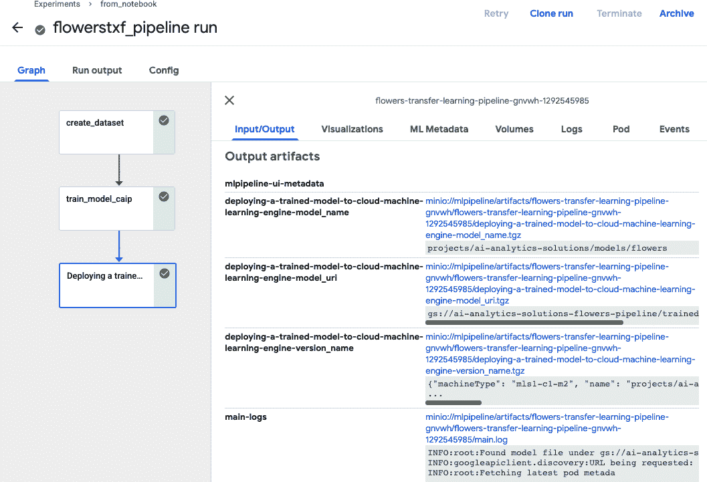

###### 图 10-4\. 展示已运行的管道信息在 Vertex Pipelines 控制台中显示。

## 自动化运行

因为我们有一个 Python API 来提交一个实验的新运行，将这段 Python 代码整合到 Cloud Function 或 Cloud Run 容器中非常简单。然后，该函数将在响应 Cloud Scheduler 触发器或在新文件添加到存储桶时调用。

实验启动代码也可以在响应持续集成（CI）触发器（如 GitHub/GitLab Actions）时调用，以便在提交新代码时进行重新训练。必要的持续集成、持续部署（CD）、权限管理、基础设施授权和认证共同构成*MLOps*领域。MLOps 超出了本书的范围，但[Google Cloud 平台上的 ML 工程](https://oreil.ly/Vy94n)、[Azure 上的 MLOps](https://oreil.ly/lf6ea)和[Amazon SageMaker MLOps Workshop](https://oreil.ly/9Cym0) GitHub 仓库包含了帮助您在各自平台上入门的说明。

我们已经看到管道如何满足机器学习工程师将典型的机器学习工作流程的所有步骤连接到 ML 管道的需求。接下来，让我们看看可解释性如何满足决策者的需求。

# 可解释性

当我们向模型展示一幅图像时，我们会得到一个预测。但是为什么会得到那个预测？模型用什么来决定一朵花是雏菊还是郁金香？解释 AI 模型如何工作对多个原因都是有用的：

信任

人类用户可能不会信任一个不解释其行为的模型。如果一个图像分类模型说一张 X 光显示有骨折，但没有指出它用于做出决定的确切像素，很少有医生会信任该模型。

故障排除

知道图像的哪些部分对于做出决定是重要的，可以帮助诊断模型为何出错。例如，如果将一只狗误认为狐狸，而最相关的像素恰好是雪的一部分，那么模型可能错误地学习将背景（雪）与狐狸关联起来。为了纠正这个错误，我们需要收集其他季节的狐狸示例或在雪中的狗示例，或通过将狐狸和狗粘贴到彼此的场景中来增加数据集。

偏见消除

如果我们将图像元数据作为模型的输入，那么检查与敏感数据相关联的特征的重要性对于确定偏差来源可能非常重要。例如，如果模型将道路上的坑洞作为重要特征来识别交通违规行为，这可能是因为模型在训练数据集中学习到了偏差（也许在较贫穷或维护不良的地区发出的罚单比富裕地区多）。

有两种解释方法：全局和实例级。这里的术语*全局*突出显示这些解释是模型训练后的整体属性，而不是推断时的每个单独预测。这些方法按照它们解释预测变异性的程度对模型的输入进行排名。例如，我们可以说`feature1`解释了 36%的变异性，`feature2`解释了 23%，依此类推。因为全局特征重要性是基于不同特征对变异性的贡献程度，所以这些方法是在包含许多示例的数据集上计算的，例如训练或验证数据集。然而，在计算机视觉中全局特征重要性方法并不那么有用，因为当图像直接用作模型的输入时，没有明确的、可读的人工特征。因此，我们将不再考虑全局解释。

第二种解释方法是度量*实例级*特征重要性。这些解释试图解释每个单独的预测，在促进用户信任和故障排除方面非常宝贵。这些方法在图像模型中更为常见，接下来将进行介绍。

## 技术

有四种常用的方法用于解释或说明图像模型的预测。按复杂程度递增的顺序，它们是：

+   [局部可解释的模型无关解释（LIME）](https://arxiv.org/abs/1602.04938)

+   [核 Shapley 可加解释（KernelSHAP）](https://arxiv.org/abs/1705.07874)

+   [整合梯度（IG）](https://arxiv.org/abs/1703.01365)

+   [通过人工智能实现可解释表示（xRAI）](https://arxiv.org/abs/2012.06006)

让我们依次看看每一种。

### LIME

LIME 通过首先识别图像中由连续相似像素组成的补丁（参见图 10-5），然后用统一值替换其中的一些补丁来扰动输入图像。它然后要求模型对扰动后的图像进行预测。对于每个扰动后的图像，我们得到一个分类概率。这些概率根据扰动图像与原始图像的相似程度进行空间加权。最后，LIME 将具有最高正权重的补丁呈现为解释。

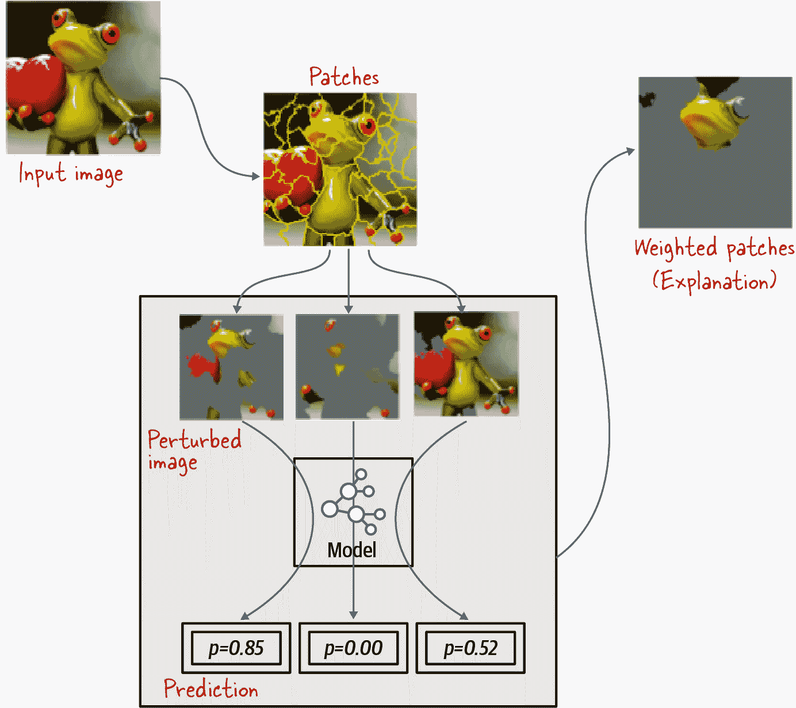

###### 图 10-5\. LIME 工作原理图，改编自[Ruberio 等人，2016](https://oreil.ly/xMFO7)。在底部面板中，p 代表图像预测为青蛙的概率。

### KernelSHAP

KernelSHAP 类似于 LIME，但是它对扰动实例进行了不同的加权。LIME 将与原始图像相似的实例权重设定得非常低，理论上认为它们包含的额外信息非常少。另一方面，KernelSHAP 根据从博弈论导出的分布对实例进行加权。如果在扰动图像中包含更多的补丁，则该实例的权重较低，因为理论上这些补丁中的任何一个都可能是重要的。在实践中，与 LIME 相比，KernelSHAP 的计算成本通常要高得多，但提供的结果略好一些。

### 集成梯度

IG 使用模型的梯度来识别哪些像素是重要的。深度学习的一个特性是，在训练初始阶段，训练主要集中在最重要的像素上，因为利用它们的信息可以最大程度地减少错误率。因此，高梯度与训练开始时的重要像素相关联。不幸的是，神经网络在训练过程中会*收敛*，在收敛过程中，网络会保持与重要像素对应的权重不变，并集中于更少见的情况。这意味着在训练结束时，与最重要像素对应的梯度实际上接近于零！因此，IG 需要整个训练过程中的梯度，而不是在训练结束时的梯度。然而，SavedModel 文件中只包含最终的权重。那么，IG 如何利用梯度来识别重要像素呢？

IG 基于这样的直觉：如果给定一个基线图像，该图像由全部为 0、全部为 1 或在范围[0, 1]内的随机值组成，模型将输出先验类概率。通过逐步改变每个像素值从基线值到实际输入，并计算每种改变的梯度，来数值化计算整体梯度变化。然后，在原始图像上显示积分过基线值到实际像素值的最大梯度的像素（见图 10-6）。

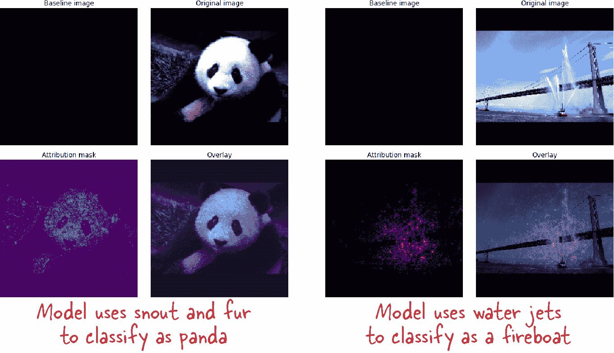

###### 图 10-6\. 集成梯度应用于熊猫图像（左）和消防艇图像（右）。图片来自[IG TensorFlow 教程](https://oreil.ly/vPhBi)。

###### 小贴士

在使用 IG 时选择适当的基线图像非常关键。解释是相对于基线的，因此如果您的训练数据包含许多传达图像中意义的黑色（或白色）区域，您不应该使用全白色或全黑色的图像作为基线。例如，X 射线中的黑色区域对应组织。在这种情况下，您应该使用随机像素的基线。另一方面，如果您的训练数据包含许多传达图像中意义的高方差补丁，您可能不希望使用随机像素作为基线。尝试不同的基线是值得的，因为这可能会显著影响归因的质量。

IG 对两幅图像的输出显示在图 10-6 中。在第一幅图像中，IG 确定熊猫面部的鼻子和毛皮纹理是决定该图像是熊猫的最重要部分的像素。第二幅图像是消防船，显示了 IG 如何用于故障排除。这里，消防船被正确地识别为消防船，但该方法使用船上喷射水柱作为关键特征。这表明我们可能需要收集没有主动向空中喷水的消防船的图像。

然而，在实际操作中（我们很快会看到），IG 往往会捕捉到图像中的高信息区域，无论该信息是否被模型用于分类特定图像。

### xRAI

在 xRAI 中，使用训练有素的神经网络的权重和偏差来训练解释网络。解释网络输出一组在代数表达式家族中选择的选择（例如布尔表达式和低阶多项式），这些表达式是被很好理解的。因此，xRAI 旨在从简单函数家族中找到对原始训练模型的近似，而不是原始模型本身。然后解释这种近似。

xRAI 方法结合了 LIME 和 KernelSHAP 的预处理方法的优点，以及 IG 提供的基于像素级归因的基线图像中的补丁查找（见图 10-7）。像素级归因在形成补丁的所有像素之间进行集成，然后根据具有相似集成梯度水平的区域将这些补丁组合成区域。然后从输入图像中删除这些区域，并调用模型以确定每个区域的重要性，并根据它们对给定预测的重要性对这些区域进行排序。

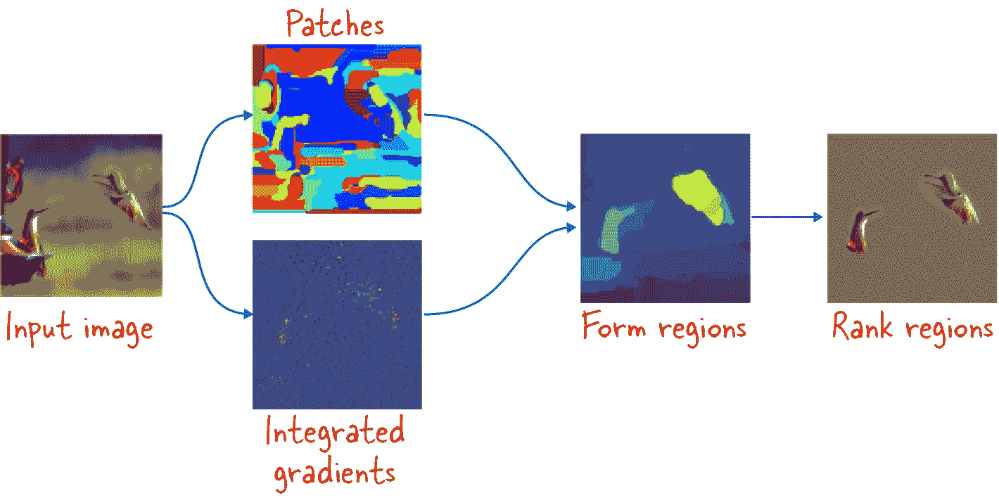

###### 图 10-7\. xRAI 结合了 LIME 和 KernelSHAP 的基于补丁的预处理以及 IG 的像素级归因，并根据其对预测的影响对区域进行排名。 图片来自[Google Cloud 文档](https://oreil.ly/RvZrG)。

IG 提供像素级归因。xRAI 提供基于区域的归因。两者都有其用途。例如，在诊断眼部疾病区域（糖尿病性视网膜病变用例）的模型中，了解导致诊断的具体像素非常有用，因此使用 IG。IG 在低对比度图像（如 X 光片或实验室中拍摄的科学图像）中效果最好。

在自然图像中，例如检测所描绘动物的类型时，优先选择基于区域的归因，因此使用 xRAI。我们不建议在自然图像上使用 IG，例如在自然环境中或房子周围拍摄的照片。

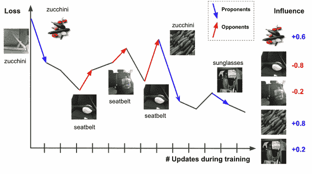

###### 图 10-8\. Tracin 通过识别影响选择的训练示例的训练损失的关键支持者和反对者来工作。支持者与损失减少相关联。图像由[Google AI Blog](https://oreil.ly/OtbBf)提供。

现在让我们看看如何使用这些技术获取我们花卉模型预测的解释。

## 添加可解释性

因为图像可解释性与个别预测相关联，我们建议您使用能够为其呈现的每个预测执行前述可解释性技术之一或全部的 ML 部署平台。可解释性方法计算开销大，而能够分发和扩展计算的部署平台可以帮助您更有效地进行预测分析。

在本节中，我们将展示如何使用集成梯度和 xRAI 从部署在 Google Cloud Vertex AI 上的模型获取解释。

###### 提示

在撰写本文时，[Azure ML 支持 SHAP](https://oreil.ly/wx2D0)，[Amazon SageMaker Clarify 也支持](https://oreil.ly/MSqhJ)。尽管语法略有不同，但这些服务的概念上的使用方式相似。具体详情请查阅链接的文档。

### 可解释性签名

所有的可解释性方法都需要用原始图像的扰动版本来调用模型。比如说，我们的花卉模型有以下导出签名：

```
@tf.function(input_signature=[tf.TensorSpec([None,], dtype=tf.string)])
def predict_filename(filenames):
    ...
```

它接受一个文件名，并返回该文件中的图像数据的预测结果。

为了使可解释人工智能（XAI）模块能够创建原始图像的扰动版本并对其进行预测，我们需要添加两个签名：

+   一个预处理签名，用于获取输入到模型的图像。该方法将接受一个或多个文件名作为输入（如原始导出签名），并生成模型所需形状的 4D 张量（完整代码在 GitHub 上的[*09f_explain.ipynb*](https://github.com/GoogleCloudPlatform/practical-ml-vision-book/blob/master/09_deploying/09f_explain.ipynb)中）：

    ```
    @tf.function(input_signature=[
                 tf.TensorSpec([None,], dtype=tf.string)])
    def xai_preprocess(`filenames`):
        input_images = tf.map_fn(
            preprocess, # preprocessing function from Ch 6
            filenames,
            fn_output_signature=tf.float32
        )
        return {
            `'``input_images``'`: input_images
        }
    ```

    请注意，返回值是一个字典。字典的键值（这里是`input_images`）必须与接下来描述的第二个签名中的参数名匹配，以便后面可以调用这两种方法，并在我们稍后讨论的第三个模型签名中一起调用。

+   一个模型签名，用于发送 4D 图像张量（XAI 将发送扰动图像）并获取预测：

    ```
    @tf.function(input_signature=[
         tf.TensorSpec(`[``None``,` `IMG_HEIGHT``,` `IMG_WIDTH``,` `IMG_CHANNELS``]`,
                       dtype=tf.float32)])
    def xai_model(`input_images`):
        batch_pred = model(input_images) # same as model.predict()
        top_prob = tf.math.reduce_max(batch_pred, axis=[1])
        pred_label_index = tf.math.argmax(batch_pred, axis=1)
        pred_label = tf.gather(tf.convert_to_tensor(CLASS_NAMES),
                               pred_label_index)
        return {
            'probability': top_prob,
            'flower_type_int': pred_label_index,
            'flower_type_str': pred_label
       }
    ```

    此代码调用模型，然后提取出得分最高的标签及其概率。

鉴于预处理和模型签名，最初的签名（大多数客户将使用）可以重构为：

```
@tf.function(input_signature=[tf.TensorSpec([None,], dtype=tf.string)])
def predict_filename(filenames):
    preproc_output = xai_preprocess(filenames)
    return xai_model(preproc_output['input_images'])
```

现在，我们保存具有所有三个导出签名的模型：

```
model.save(MODEL_LOCATION,
           signatures={
               'serving_default': predict_filename,
               'xai_preprocess': xai_preprocess, # input to image
               'xai_model': xai_model # image to output
           })
```

此时，模型已经具备应用 XAI 所需的签名，但是需要一些额外的元数据来计算解释。

### 解释元数据

除了模型之外，我们还需要提供 XAI 一个基线图像和一些其他元数据。这些以一个 JSON 文件的形式呈现，我们可以使用 Google Cloud 开源的 Explainability SDK 程序化地创建。

我们首先要指定哪个导出签名是接受扰动图像作为输入的签名，并指定需要解释的输出键（`probability`、`flower_type_int`或`flower_type_str`）：

```
from explainable_ai_sdk.metadata.tf.v2 import SavedModelMetadataBuilder
builder = SavedModelMetadataBuilder(
    MODEL_LOCATION,
    signature_name=`'``xai_model``'`,
    outputs_to_explain=[`'``probability``'`])
```

然后，我们创建基线图像，它将作为梯度起始点。通常选择是全零（`np.zeros`）、全一（`np.ones`）或随机噪声。我们选择第三个选项：

```
random_baseline = np.random.rand(IMG_HEIGHT, IMG_WIDTH, 3)
builder.set_image_metadata(
    'input_images',
    input_baselines=[random_baseline.tolist()])
```

请注意，我们在`xai_model()`函数的输入参数名为`input_images`。

最后，我们保存元数据文件：

```
builder.save_metadata(MODEL_LOCATION)
```

这将创建一个名为*explanation_metadata.json*的文件，与 SavedModel 文件一起存在。

### 部署模型

与之前一样，将 SavedModel 和相关解释元数据部署到 Vertex AI，但需要一些额外的参数来处理可解释性。要部署一个提供 IG 解释的模型版本，我们会这样做：

```
gcloud beta ai-platform versions create \
    --origin=$MODEL_LOCATION --model=flowers ig ... \
    `-``-``explanation``-``method` `integrated``-``gradients` --num-integral-steps 25
```

而要获得 xRAI 解释，我们会这样做：

```
gcloud beta ai-platform versions create \
    --origin=$MODEL_LOCATION --model=flowers xrai ... \
    `-``-``explanation``-``method` `xrai` --num-integral-steps 25
```

`--num-integral-steps`参数指定基线图像和输入图像之间的步骤数，用于数值积分的目的。步数越多，梯度计算越准确（但计算量也越大）。典型值为 25。

###### 提示

解释响应包含每个预测的近似误差。检查代表性输入的近似误差，如果误差过高，则增加步数。

对于这个例子，让我们同时使用两种图像可解释性方法——我们将部署一个版本，它提供名为`ig`的 IG 解释和一个提供名为`xrai`的 xRAI 解释的版本。

无论部署的版本是哪个，都可以像正常调用一样，请求的负载看起来像这样：

```
{
    "instances": [
        {
            "filenames": "gs://.../9818247_e2eac18894.jpg"
        },
        {
            "filenames": "gs://.../9853885425_4a82356f1d_m.jpg"
        },
        ...
    ]
}
```

它返回每个输入图像的标签和相关概率：

```
FLOWER_TYPE_INT  FLOWER_TYPE_STR  PROBABILITY
1                dandelion        0.398337
1                dandelion        0.999961
0                daisy            0.994719
4                tulips           0.959007
4                tulips           0.941772
```

XAI 版本可以用于正常服务而无需性能影响。

### 获取解释

获取解释的三种方式。第一种是通过`gcloud`，第二种是通过可解释 AI SDK。这两种方式最终会调用第三种方式——一个 REST API，我们也可以直接使用它。

我们将研究`gcloud`方法，因为它是最简单和最灵活的。我们可以发送 JSON 请求，并使用以下方法获取 JSON 响应：

```
gcloud beta ai-platform `explain` --region=$REGION \
    --model=flowers `-``-``version``=``ig` \
    `-``-``json``-``request``=``request``.``json` `>` `response``.``json`
```

要使用 IG 获取解释，我们将使用以下选项部署此版本（`ig`）：

```
--explanation-method integrated-gradients
```

JSON 响应以 base64 编码形式包含归因图像。我们可以使用以下方法对其进行解码：

```
with open('response.json') as ifp:
    explanations = json.load(ifp)['explanations']
    for expln in explanations:
        `b64bytes` = (expln['attributions_by_label'][0]
                    ['attributions']['input_images']['b64_jpeg'])
        img_bytes = base64.`b64decode`(b64bytes)
        img = tf.image.`decode_jpeg`(img_bytes, channels=3)
        `attribution` = tf.image.convert_image_dtype(img, tf.float32)
```

五张图像的 IG 结果显示在图 10-9 中。[*GitHub 上的 10b_explain.ipynb 笔记本*](https://github.com/GoogleCloudPlatform/practical-ml-vision-book/blob/master/10_mlops/10b_explain.ipynb)具有必要的绘图代码。

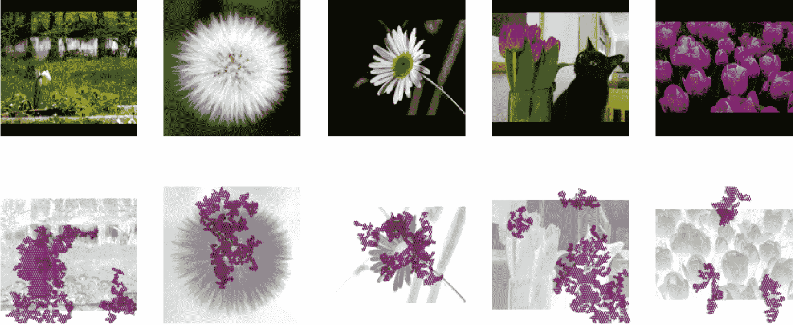

###### 图 10-9\. 花朵模型的集成梯度解释。输入图像在顶行，XAI 程序返回的归因在第二行。

对于第一张图像，模型似乎使用了高大的白色花朵，以及背景中的部分白色像素，来确定图像是雏菊。在第二张图像中，黄色中心和白色花瓣是模型依赖的部分。令人担忧的是，在第四张图像中，猫似乎是决策的重要部分。有趣的是，郁金香的决策似乎更多地受到绿色茎的驱动，而不是鳞茎状的花朵。再次，正如我们很快会看到的那样，这种归因是误导性的，这种误导性归因展示了 IG 方法的局限性。

要获取 xRAI 解释，我们在部署的模型端点上调用`gcloud explain`，使用名为`xrai`的版本。同一花卉图像的 xRAI 归因显示在图 10-10 中。

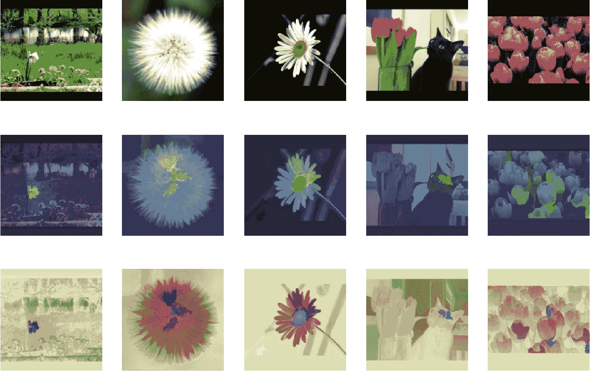

###### 图 10-10\. 花朵模型的 xRAI 解释。输入图像在顶行，XAI 程序返回的归因在第二行。底行包含与第二行相同的信息，但归因图像已经重新上色，以便在本书页面上更容易进行可视化。

请记住，xRAI 使用 IG 方法识别显著区域，然后调用模型以确定图像各个区域的重要性。显然，xRAI 在图 10-10 中的归因比在图 10-9 中使用 IG 方法得到的归因更为精确。

对于第一幅花卉图像，模型专注于高大的白色花朵，只有这朵花。很明显，模型已学会忽略背景中较小的花朵。而 IG 看似表明背景很重要，xRAI 结果显示，模型放弃了背景信息，而选择了图像中最显著的花卉。在第二幅图像中，模型依据的是黄色中心和白色花瓣（IG 也正确）。xRAI 方法的精度对于第三幅图像也很明显——模型关注的是花瓣与中心相连的明亮黄色窄带。这是雏菊独有的特征，有助于将其与色彩相似的蒲公英区分开来。在第四幅图像中，我们可以看到郁金香的球茎是模型用于分类的特征，尽管猫会分散它的注意力。最终的郁金香分类似乎受到了花朵众多的影响。IG 方法误导了我们——茎很显眼，但是球茎驱动了预测概率。

IG 在某些情况下很有用。如果我们考虑了像素级别的辐射图像，像素级别的归因（而不是区域）很重要，那么 IG 的表现会更好。然而，在描绘对象的图像中，xRAI 的表现往往更好。

在本节中，我们研究了如何向我们的预测服务添加可解释性，以满足决策者理解机器学习模型依赖的需求。接下来，让我们看看无代码工具如何帮助民主化机器学习。

# 无代码计算机视觉

我们在本书中迄今考虑过的计算机视觉问题——图像分类、物体检测和图像分割——都受到低代码和无代码机器学习系统的支持。例如，图 10-11 显示了 Google Cloud AutoML Vision 的起始控制台。

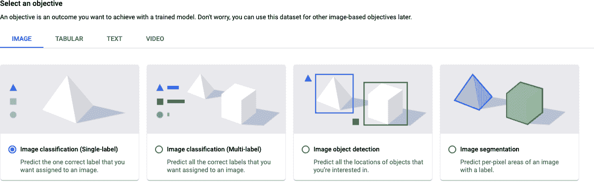

###### 图 10-11\. Google Cloud AutoML Vision 支持的基本计算机视觉问题，这是一个可以使用的机器学习工具，无需编写任何代码。

其他适用于图像的无代码和低代码工具包括 [Create ML](https://oreil.ly/Ft1We)（由 Apple 提供）、[DataRobot](https://oreil.ly/7xXOw) 和 [H2O](https://oreil.ly/DHKiK)。

## 为什么使用无代码？

在本书中，我们专注于使用代码实现机器学习模型。然而，将无代码工具纳入整体工作流程是值得的。

在进行计算机视觉项目时，无代码工具有几个优点，包括：

问题的可行性

诸如 AutoML 之类的工具充当了您可以期待的准确性的健全性检查。如果达到的准确性远低于上下文中可以接受的水平，这可以避免浪费时间在无效的机器学习项目上。例如，如果在识别伪造身份证时仅达到 98%的精度以达到期望的召回率，您就知道出现了问题——错误拒绝 2%的客户可能是一个不能接受的结果。

数据质量和数量

无代码工具可以检查数据集的质量。在数据收集之后，在许多机器学习项目中，正确的下一步是出去收集更多/更好的数据，而不是训练一个机器学习模型；AutoML 之类的工具提供的准确性可以帮助您做出这样的决定。例如，如果工具生成的混淆矩阵表明模型经常将水中的所有花卉分类为百合花，这可能表明您需要更多水景照片。

基准测试

使用类似 AutoML 的工具起始可以为您提供一个基准，用以比较您构建的模型。

许多机器学习组织向其领域专家提供无代码工具，以便他们可以检查问题的可行性，并在将问题带给数据科学团队之前帮助收集高质量的数据。

在本节的其余部分中，我们将快速介绍如何在 5 花数据集上使用 AutoML，从加载数据开始。

## 数据加载

第一步是将数据加载到系统中。我们通过指向云存储桶中的*all_data.csv*文件来完成这一步（参见图 10-12）。

数据加载后，我们发现有 3,667 张图像，其中包括 633 朵雏菊、898 朵蒲公英等（参见图 10-13）。我们可以验证所有图像都已经标记，并在必要时更正标签。如果我们加载的数据集没有标签，我们可以在用户界面中自行标记图像，或者将任务委托给标注服务（标注服务在第五章中有介绍）。

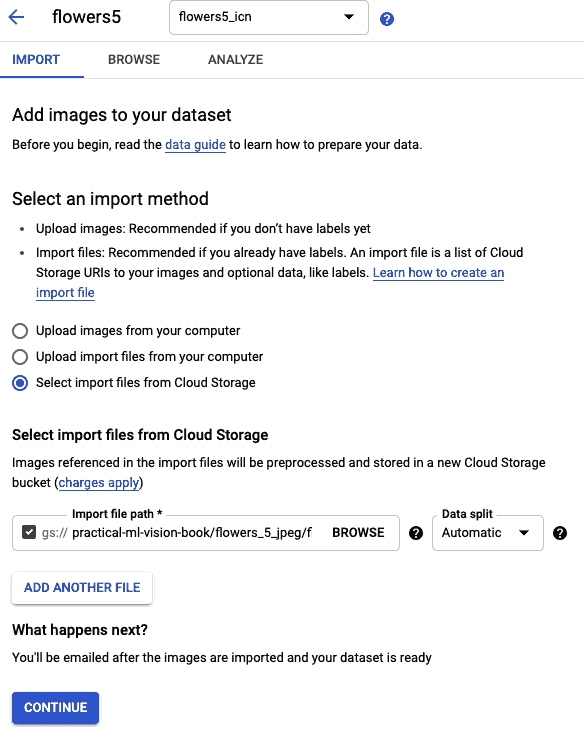

###### 图 10-12\. 通过从云存储中导入文件来创建数据集。

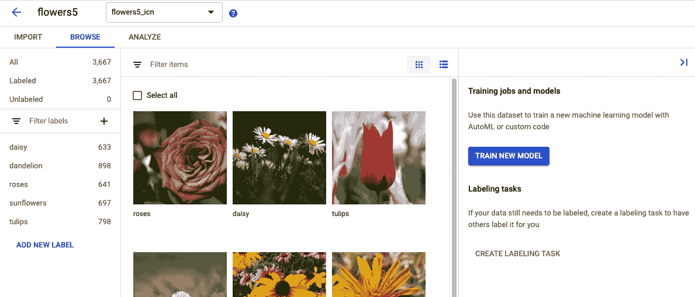

###### 图 10-13\. 加载数据集后，我们可以查看图像及其标签。这也是在必要时添加或更正标签的机会。

## 训练

当我们对标签感到满意时，可以点击“训练新模型”按钮来训练一个新模型。这将引导我们通过图 10-14 所示的一系列屏幕（参见图 10-14），选择模型类型、数据集拆分方式和训练预算。在撰写本文时，我们指定的 8 小时训练预算大约需要花费 25 美元。

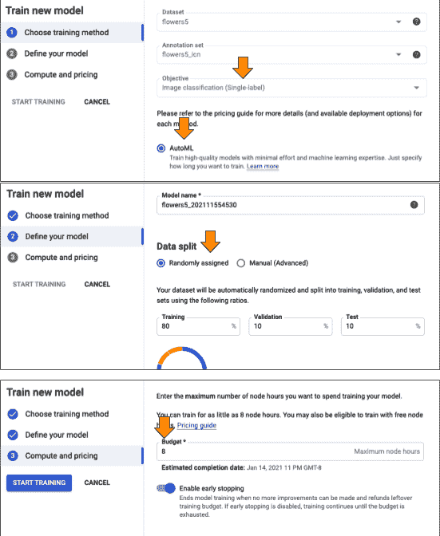

###### 图 10-14\. 启动训练作业的用户界面屏幕。

请注意，在最后一个屏幕中，我们启用了早停功能，因此如果 AutoML 在验证指标上看不到进一步的改善，它可以决定提前停止。选择这个选项后，训练在不到 30 分钟内完成（见图 10-15），这意味着整个机器学习训练过程花费了我们约 3 美元。结果是 96.4% 的准确率，与我们在第三章中经过大量调整和实验得到的最复杂模型的准确率相当。

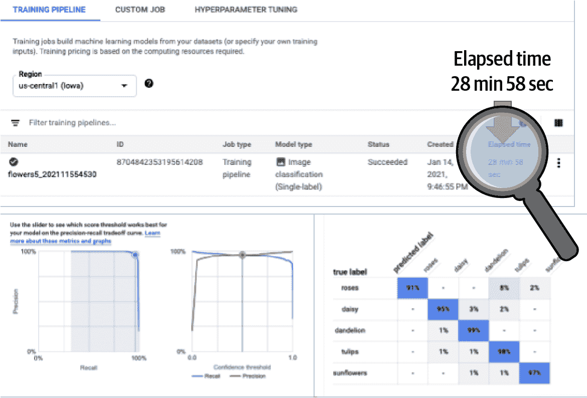

###### 图 10-15\. AutoML 在不到一个小时内完成训练，成本不到 3 美元，并在 5-花数据集上达到了 96.4% 的准确率。

###### 注

我们应该警告您，并非所有的无代码系统都相同——我们在本节中使用的 [Google Cloud AutoML](https://oreil.ly/GvLwR) 系统进行数据预处理和增强，采用最先进的模型，并进行超参数调整以构建非常精确的模型。其他无代码系统可能没有那么复杂：有些只训练一个模型（例如 ResNet50），有些训练单一模型但进行超参数调整，还有一些在一系列模型中进行搜索（ResNet18、ResNet50 和 EfficientNet）。查看文档，以了解您将获得什么。

## 评估

评估结果表明，最多的误分类是将玫瑰错误地识别为郁金香。如果我们继续我们的实验，我们将检查一些错误（见图 10-16）并尝试收集更多图像以减少假阳性和假阴性。

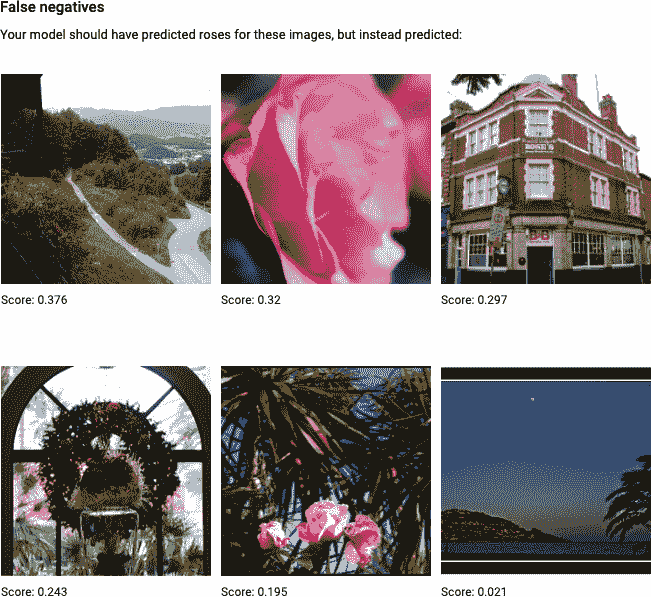

###### 图 10-16\. 检查假阳性和假阴性，以确定需要收集更多的哪些类型的示例。这也可以是一个机会，从数据集中移除不具代表性的图像。

一旦我们对模型的性能感到满意，我们可以将其部署到一个端点，从而创建一个 Web 服务，客户可以通过该服务要求模型进行预测。然后，我们可以向模型发送样本请求并从中获得预测结果。

对于基本的计算机视觉问题，无代码系统的易用性、低成本和高准确性非常具有吸引力。我们建议您在计算机视觉项目中作为第一步引入这些工具。

# 摘要

在这一章中，我们看到了如何使整个机器学习过程操作化。我们使用 Kubeflow Pipelines 来实现这一目的，并快速浏览了 SDK，创建了 Docker 容器和 Kubernetes 组件，并使用数据依赖关系将它们串联成一个流水线。

我们探讨了几种技术，使我们能够理解模型在进行预测时依赖的信号。我们还看了一下无代码计算机视觉框架的能力，使用 Google Cloud 的 AutoML 来说明典型的步骤。

领域专家使用无代码工具来验证问题的可行性，而机器学习工程师在部署中使用机器学习管道，解释性则用于促进决策者对机器学习模型的采纳。因此，这些通常构成许多计算机视觉项目的两端，并且是数据科学家与其他团队接口的重要点。

这标志着本书的主要部分的结束，我们已经从头到尾构建并部署了一个图像分类模型。在本书的其余部分，我们将专注于高级架构和使用案例。
