# 第十一章：高级视觉问题

到目前为止，本书主要关注整个图像分类的问题。在第二章中，我们提到了图像回归，在第四章中讨论了目标检测和图像分割。在本章中，我们将探讨可以使用计算机视觉解决的更高级别的问题：测量、计数、姿态估计和图像搜索。

###### 提示

本章的代码位于书籍的[GitHub 仓库](https://github.com/GoogleCloudPlatform/practical-ml-vision-book)的*11_adv_problems*文件夹中。我们将在适当的地方提供代码样本和笔记本的文件名。

# 对象测量

有时我们想知道图像中对象的尺寸（例如，沙发长 180 厘米）。尽管我们可以简单地使用像素回归来测量像云层覆盖的空中图像中地面降水这样的东西，但是我们需要为对象测量场景做一些更复杂的事情。我们不能简单地数像素的数量并从中推断尺寸，因为同一对象可能由于其在图像中的位置、旋转、长宽比等而用不同数量的像素表示。让我们按照[Imaginea Labs](https://oreil.ly/FEaPn)建议的方法，步骤步骤地测量对象的照片。

## 参考对象

假设我们是一家在线鞋店，我们想通过客户上传的脚印照片来帮助他们找到最合适的鞋码。我们要求顾客把脚弄湿，踏在纸上，然后上传像图 11-1 中展示的脚印照片。然后我们可以使用机器学习模型从脚印中获取适当的鞋码（基于长度和宽度）和脚弓类型。

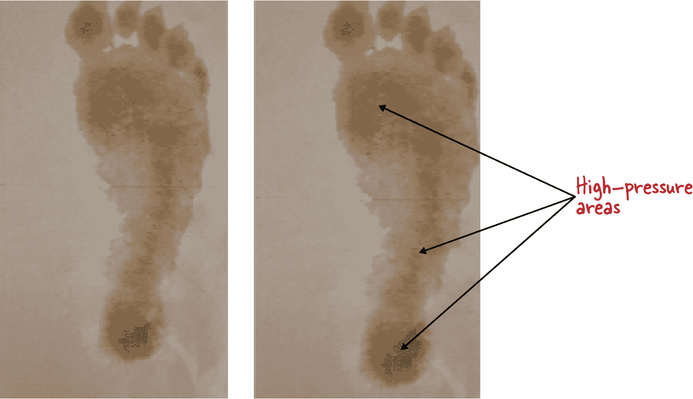

###### 图 11-1. 左：纸上湿脚印的照片。右：与纸稍微靠近几英寸的相同脚印的照片。识别高压区域有助于识别人的脚型。本节中的照片由作者提供。

机器学习模型应该使用不同的纸张类型、不同的光照、旋转、翻转等来训练，以预测脚印图像在推断时可能接收到的所有可能变化。但是，仅仅通过脚印图像本身是不足以创建有效的测量解决方案的，因为（正如您在图 11-1 中所见）图像中的脚的大小将取决于诸如摄像机与纸之间距离等因素。

解决尺度问题的一个简单方法是包含几乎所有客户都会有的参考对象。大多数客户都有标准尺寸的信用卡，因此可以将其用作参考或校准对象，以帮助模型确定图像中脚的相对大小。如图 Figure 11-2 所示，我们只需要求每位客户在拍照前将信用卡放在其脚印旁边。有一个参考对象可以将测量任务简化为与该对象进行比较。

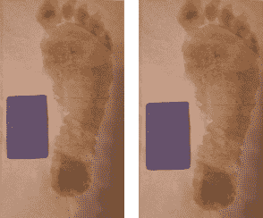

###### 图 11-2\. 左：信用卡旁边湿脚印的照片。右：同一物体的照片，相机离纸稍近了几英寸。

建立我们的训练数据集，包含各种背景上的不同脚印，当然可能需要一些清理，如旋转图像使所有脚印都朝向相同方向。否则，对于某些图像，我们将测量投影长度而不是真实长度。至于参考信用卡，在训练之前我们不会进行任何修正，并在预测时对齐生成的脚印和参考面具。

在训练开始时，我们可以执行数据增强，如旋转、模糊、改变亮度、缩放和对比度，如 Figure 11-3 所示。这可以帮助我们增加训练数据集的大小，同时教导模型足够灵活以接收许多不同的真实世界数据变化。

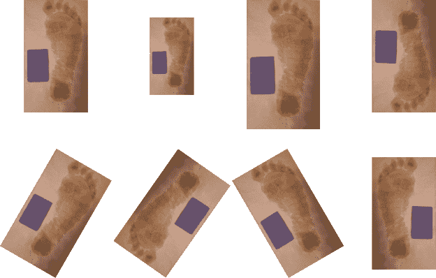

###### 图 11-3\. 在训练开始时执行的脚印图像数据增强。

## 分割

机器学习模型首先需要在图像中分割出脚印和信用卡，并将它们识别为两个正确提取的对象。为此，我们将使用 Mask R-CNN 图像分割模型，如 第四章 中讨论的，并在 Figure 11-4 中描述。

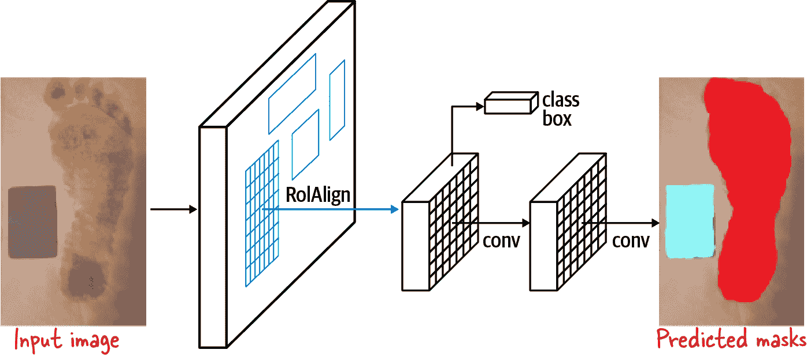

###### 图 11-4\. Mask R-CNN 架构。图片取自 [He et al., 2017](https://arxiv.org/abs/1703.06870)。

通过架构的面具分支，我们将预测脚印的面具和信用卡的面具，获得类似于 Figure 11-4 右侧的结果。

请记住我们面具分支的输出有两个通道：一个用于每个对象，脚印和信用卡。因此，我们可以单独查看每个面具，如图 Figure 11-5 所示。

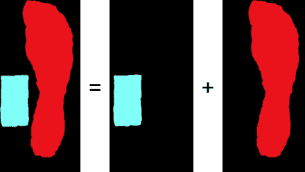

###### 图 11-5\. 脚印和信用卡的单独面具。

接下来，我们必须对齐面具，以便获得正确的测量结果。

## 旋转校正

一旦我们获得了脚印和信用卡的掩模，它们必须根据可能在拍摄照片时以略微不同的方向放置信用卡的用户进行归一化处理。

要纠正旋转，我们可以对每个掩模应用主成分分析（PCA），以获取*特征向量* ——例如，物体在最大特征向量方向上的大小是物体的长度（见图 11-6）。从 PCA 获得的特征向量彼此正交，每个后续分量的特征向量对方差的贡献越来越小。

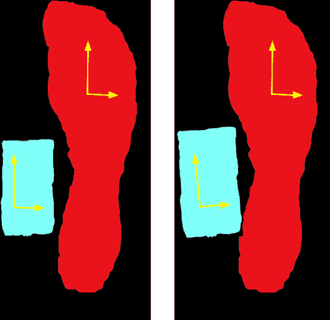

###### 图 11-6\. 信用卡可能相对于脚放置在稍有不同的方向上。每个对象中两个最大特征向量的方向由轴标记。

在 PCA 之前，掩模的尺寸位于一个向量空间中，该空间的维度轴是相对于原始图像的，如图 11-6 左侧所示。利用事实，即在 PCA 之后特征向量位于不同的向量空间基础上，现在的轴沿着最大方差的方向（如图 11-6 右侧所示），我们可以利用原始坐标轴与第一个特征向量之间的角度来确定需要进行多少旋转校正。

## 比率和测量

有了我们校正旋转后的掩模，现在可以计算脚印的测量值。我们首先将我们的掩模投影到二维空间，并沿 x 和 y 轴观察。长度通过测量最小和最大*y*坐标值之间的像素距离来确定，宽度则类似于*x*维度。请记住，脚印和信用卡的测量单位均为像素，而不是厘米或英寸。

接下来，通过了解信用卡的精确尺寸，我们可以找到像素尺寸与卡片实际尺寸之间的比率。然后，可以将此比率应用于脚印的像素尺寸，以确定其真实尺寸。

确定拱型类型略微更复杂，但仍需要在找到高压区域后进行像素计数（见[苏等人，2015](https://oreil.ly/AlUIu)，以及图 11-1）。通过正确的测量值，如图 11-7 所示，我们的商店将能够为每位顾客找到最适合的鞋子。

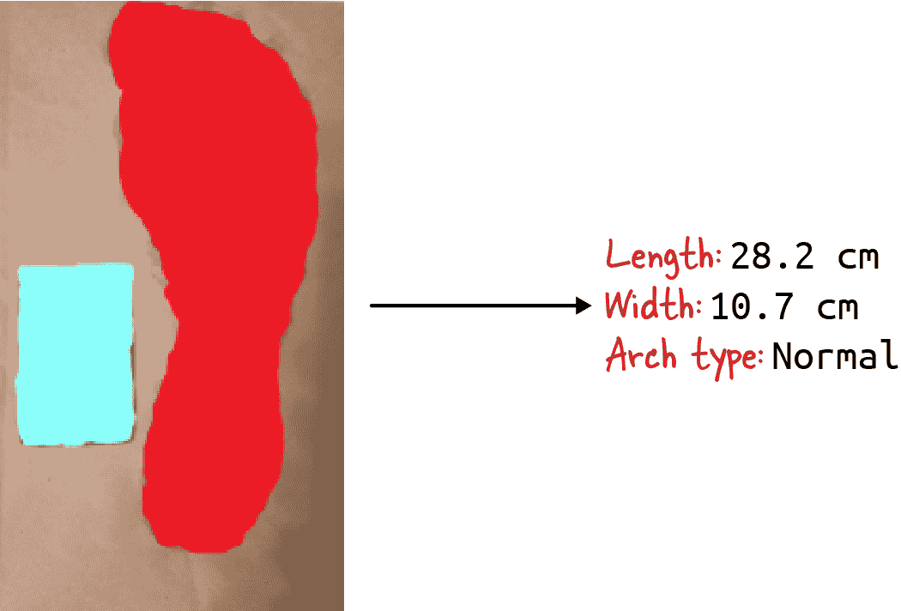

###### 图 11-7\. 我们可以使用参考像素/厘米比率来获得经过 PCA 校正的掩模的最终测量。

# 计数

计算图像中物体的数量是一个具有广泛应用的问题，从估计人群规模到从无人机图像中识别作物潜在产量。请问图 11-8 中的照片中有多少浆果？


###### 图 11-8\. 植物上的浆果。照片作者提供。

基于我们目前所涵盖的技术，您可以选择以下的方法之一：

1.  训练一个物体检测分类器来检测浆果，并计算边界框的数量。然而，浆果往往会彼此重叠，检测方法可能会错过或结合浆果。

1.  把这视为分割问题。找出包含浆果的各个分段，然后根据每个群集的特性（例如大小），确定每个浆果的数量。这种方法的问题在于它不具有尺度不变性，如果我们的浆果比典型的更小或更大，则会失败。与前一节讨论的脚尺寸测量场景不同，难以将参考物体整合到这个问题中。

1.  把这看作一个回归问题，从整个图像估计浆果的数量。这种方法与分割方法一样存在尺度问题，难以找到足够的标记图像，尽管过去已成功用于计数[人群](https://arxiv.org/abs/1703.09393)和[野生动物](https://oreil.ly/1qdvm)。

这些方法还存在其他缺点。例如，前两种方法要求我们正确分类浆果，而回归方法忽略了位置信息，而我们知道位置信息是图像内容的重要信息来源。

更好的方法是在模拟图像上使用密度估计。在本节中，我们将讨论这种技术并逐步介绍该方法。

## 密度估计

对于像这样物体小且重叠的情况下的计数，有一种替代方法，由 Victor Lempitsky 和 Andrew Zisserman 在 2010 年的[论文](https://oreil.ly/EW2J4)中介绍，避免了需要进行物体检测或分割，并且不会丢失位置信息。其想法是教会网络估计图像区域（这里是浆果）的密度¹。

为了进行密度估计，我们需要具有指示密度的标签。因此，我们将原始图像分解为较小的非重叠块，并且我们通过浆果中心点的数量标记每个块，如图 11-9 所示。正是这个值，网络将学会估计。为了确保块中的浆果总数等于图像中的浆果数量，我们确保只有浆果中心点在块中才算浆果在块中。因为某些浆果可能只部分在块中，所以模型的网格输入必须比块大。输入由虚线表示。显然，这使得图像的边界问题变得棘手，但是我们可以像图 11-9 右侧所示一样简单地填充图像来处理这个问题。

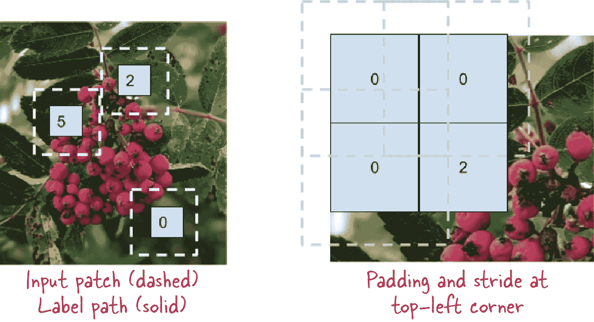

###### 图 11-9。模型是在原始图像的块上进行训练：左侧面板显示了三个这样的块的输入和标签。标签包含那些中心点位于每个块内部正方形内的浆果数量。输入块需要在所有边上进行“same”填充，而标签块只包含有效像素。

当然，这种方法不仅适用于浆果计数——它在估计人群规模、计算生物图像中的细胞数量以及其他一些应用中通常比替代方法效果更好。这与图像回归类似，只是通过使用块增加了数据集大小，并教会模型关注密度。

## 提取块

给定一个包含浆果图像和一个标签图像的问题，其中每个浆果的中心点对应于 1s，生成所需的输入和标签块的最简单方法是使用 TensorFlow 函数 `tf.image.extract_patches()`。这个函数要求我们传入一个图像批次。如果我们只有一张图像，那么我们可以通过使用 `tf.expand_dims()` 添加一个批次大小为 1 的维度。由于标签图像只有一个通道，因为它是布尔型的，所以我们还必须添加深度维度为 1（完整的代码在 [*11a_counting.ipynb* on GitHub](https://github.com/GoogleCloudPlatform/practical-ml-vision-book/blob/master/11_adv_problems/11a_counting.ipynb) 中）：

```
def get_patches(img, label, verbose=False):
    img = tf.expand_dims(img, axis=0)
    label = tf.expand_dims(tf.expand_dims(label, axis=0), axis=-1)
```

现在我们可以在输入图像上调用 `tf.image.extract_patches()`。请注意下面的代码中，我们要求获取大小为虚线框 (`INPUT_WIDTH`) 的块，但是步长是较小的标签块 (`PATCH_WIDTH`) 的大小。如果虚线框是 64x64 像素，那么每个框将有 64 * 64 * 3 像素值。这些值将是 4D 的，但我们可以将块值重新整形为平坦数组以便于使用：

```
num_patches = (FULL_IMG_HEIGHT // PATCH_HEIGHT)**2
patches = tf.image.extract_patches(img,
    `=``[``1``,` `INPUT_WIDTH``,` `INPUT_HEIGHT``,` `1``]``,`
    =[1, PATCH_WIDTH, PATCH_HEIGHT, 1],
    =[1, 1, 1, 1],
    `=``'``SAME``'``,`
    ='get_patches')
patches = tf.reshape(patches, [num_patches, -1])
```

接下来，我们在标签图像上重复相同的操作：

```
labels = tf.image.extract_patches(label,
    `=``[``1``,` `PATCH_WIDTH``,` `PATCH_HEIGHT``,` `1``]``,`
    =[1, PATCH_WIDTH, PATCH_HEIGHT, 1],
    =[1, 1, 1, 1],
    `=``'``VALID``'``,`
    ='get_labels')
labels = tf.reshape(labels, [num_patches, -1])
```

标签补丁的代码与图像补丁的代码有两个关键差异。首先，标签补丁的大小仅为内部框的大小。还要注意填充规格的差异。对于输入图像，我们指定`padding=SAME`，要求 TensorFlow 用零填充输入图像，然后从中提取所有较大框大小的补丁（见图 11-9）。对于标签图像，我们只要求完全有效的框，因此不会进行填充。这确保我们对于每个有效的标签补丁都得到相应的外框图像。

标签图像现在将 1 对应于我们要计数的所有对象的中心。我们可以通过对标签补丁的像素值求和找到这些对象的总数，我们将其称为密度：

```
 # the "density" is the number of points in the label patch
 patch_labels = tf.math.reduce_sum(labels, axis=[1], name='calc_density')
```

## 模拟输入图像

在他们 2017 年的[论文](https://oreil.ly/CTRLA)中，Maryam Rahnemoor 和 Clay Sheppard 表明，甚至不需要真实的标记照片就可以训练神经网络进行计数。为了训练他们的神经网络在藤上计数番茄，作者们简单地输入了由红色圆圈组成的模拟图像，背景为棕色和绿色。由于这种方法只需要模拟数据，因此可以快速创建大型数据集。结果训练好的神经网络在实际的番茄植物上表现良好。接下来，我们将展示这种称为*深度模拟学习*的方法。当然，如果您确实有标记数据，其中每个浆果（或人群中的人，或样本中的抗体）都被标记，那么您可以使用那些数据。

我们将生成一个模糊的绿色背景，模拟 25 到 75 个“浆果”，并将它们添加到图像中（见图 11-10）。

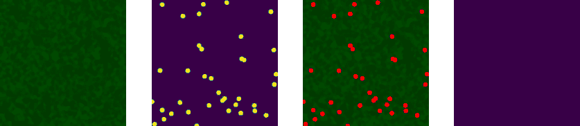

###### 图 11-10\. 在绿色背景上模拟用于计数“浆果”的输入图像。第一幅图是背景，第二幅是模拟的浆果，第三幅是实际输入图像。

关键代码部分是随机放置几个浆果：

```
num_berries = np.random.randint(25, 75)
berry_cx = np.random.randint(0, FULL_IMG_WIDTH, size=num_berries)
berry_cy = np.random.randint(0, FULL_IMG_HEIGHT, size=num_berries)
label = np.zeros([FULL_IMG_WIDTH, FULL_IMG_HEIGHT])
label[berry_cx, berry_cy] = 1
```

在标签图像的每个浆果位置上，画一个红色圆圈：

```
berries = np.zeros([FULL_IMG_WIDTH, FULL_IMG_HEIGHT])
for idx in range(len(berry_cx)):
    rr, cc = draw.circle(berry_cx[idx], berry_cy[idx],
                         radius=10,
                         shape=berries.shape)
    berries[rr, cc] = 1
```

然后将浆果添加到绿色背景中：

```
img = np.copy(backgr)
img[berries > 0] = [1, 0, 0] # red
```

一旦我们有了图像，我们可以从中生成图像补丁，并通过将落入标签补丁内的浆果中心相加来获得密度。一些示例补丁及其相应的密度显示在图 11-11 中。

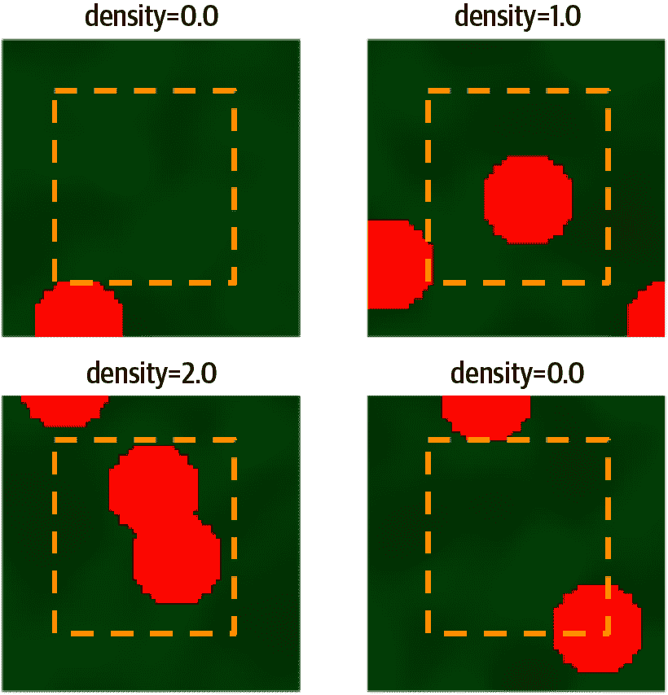

###### 图 11-11\. 几个补丁和相应的密度。请注意，标签补丁仅包含输入补丁的中心 50%，并且只有其中心位于标签补丁内的红色圆圈才会被计入密度计算。

## 回归

一旦我们开始创建补丁，我们就可以在补丁上训练回归模型来预测密度。首先，通过生成模拟图像来设置我们的训练和评估数据集：

```
def create_dataset(num_full_images):
    def generate_patches():
        for i in range(num_full_images):
            img, label = generate_image()
            patches, patch_labels = get_patches(img, label)
        for patch, patch_label in zip(patches, patch_labels):
            yield patch, patch_label

    return tf.data.Dataset.from_generator(
            generate_patches,
            (tf.float32, tf.float32), # patch, patch_label
            (tf.TensorShape([INPUT_HEIGHT*INPUT_WIDTH*IMG_CHANNELS]),
             tf.TensorShape([]))
    )
```

我们可以使用我们在第三章讨论过的任何模型。为了说明，让我们使用一个简单的 ConvNet（完整的代码可以在[*GitHub 上的 11a_counting.ipynb*](https://github.com/GoogleCloudPlatform/practical-ml-vision-book/blob/master/11_adv_problems/11a_counting.ipynb)中找到）：

```
Model: "sequential"
_________________________________________________________________
Layer (type)                 Output Shape              Param #
=================================================================
reshape (Reshape)            (None, 64, 64, 3)         0
_________________________________________________________________
conv2d (Conv2D)              (None, 62, 62, 32)        896
_________________________________________________________________
max_pooling2d (MaxPooling2D) (None, 31, 31, 32)        0
_________________________________________________________________
conv2d_1 (Conv2D)            (None, 29, 29, 64)        18496
_________________________________________________________________
max_pooling2d_1 (MaxPooling2 (None, 14, 14, 64)        0
_________________________________________________________________
conv2d_2 (Conv2D)            (None, 12, 12, 64)        36928
_________________________________________________________________
flatten (Flatten)            (None, 9216)              0
_________________________________________________________________
dense (Dense)                (None, 64)                589888
_________________________________________________________________
dense_1 (Dense)              (None, 1)                 65
=================================================================
Total params: 646,273
Trainable params: 646,273
Non-trainable params: 0
```

这里展示的架构的关键方面有：

+   输出是一个单一的数值（密度）。

+   输出节点是一个线性层（因此密度可以取任何数值）。

+   损失是均方误差。

这些方面使得该模型成为能够预测密度的回归模型。

## 预测

记住，模型接受一个补丁，并预测补丁中的浆果密度。给定输入图像，我们必须像在训练期间那样将其分成补丁，并对所有补丁进行模型预测，然后总结预测的密度，如下所示：

```
def count_berries(model, img):
    num_patches = (FULL_IMG_HEIGHT // PATCH_HEIGHT)**2
    img = tf.expand_dims(img, axis=0)
    patches = tf.image.extract_patches(img,
        sizes=[1, INPUT_WIDTH, INPUT_HEIGHT, 1],
        strides=[1, PATCH_WIDTH, PATCH_HEIGHT, 1],
        rates=[1, 1, 1, 1],
        padding='SAME',
        name='get_patches')
    patches = tf.reshape(patches, [num_patches, -1])
    densities = model.predict(patches)
    return tf.reduce_sum(densities)
```

一些独立图像的预测结果显示在图 11-12 中。如您所见，预测值与实际数值相差不超过 10%。

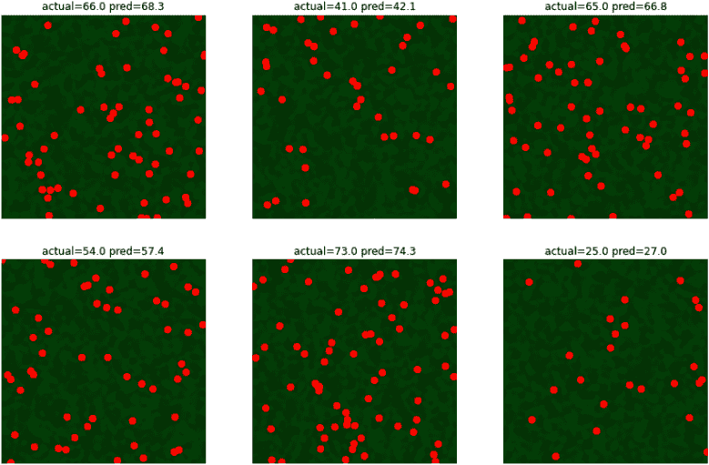

###### 图 11-12\. 模型预测值与每个图像中实际对象数量的比较。

然而，当我们在实际的浆果图像上尝试时，估计结果相差很大。解决这个问题可能需要模拟不同大小的浆果，而不仅仅是在随机位置放置大小相同的浆果。

# 姿势估计

有多种情况我们可能希望识别物体的关键部位。非常常见的情况是识别肘部、膝盖、面部等，以便识别人物的姿势。因此，这个问题被称为*姿势估计*或*姿势检测*。姿势检测可以用于识别被拍摄主体是坐着、站着、跳舞、躺下或者为运动和医疗环境提供姿势建议。

针对像 Figure 11-13 中的照片，我们如何识别图像中的脚、膝盖、肘部和手部？

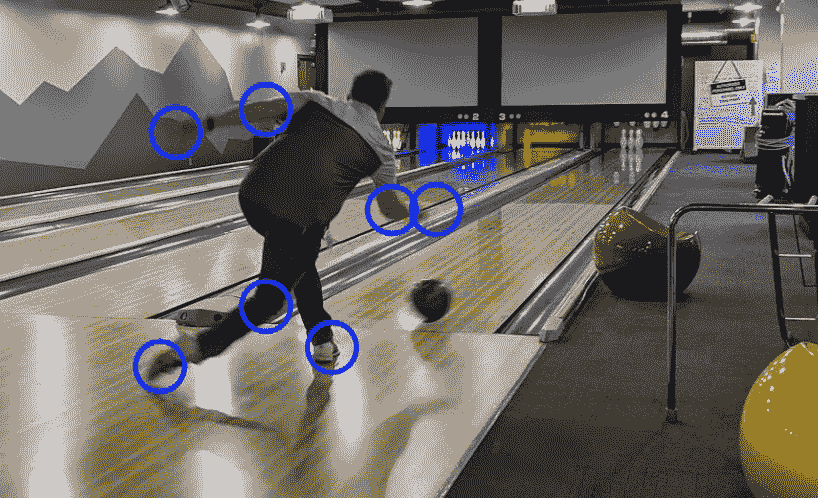

###### 图 11-13\. 识别关键身体部位的相对位置对提供关于改进球员姿态建议是有用的。照片由作者拍摄。

在本节中，我们将讨论该技术，并指向一个已经训练好的实现。几乎不需要从头开始训练姿势估计模型——相反，您将使用已经训练好的姿势估计模型的输出来确定图像中的主体正在做什么。

## PersonLab

这种最先进的方法是由 George Papandreou 等人在 2018 年提出的[论文](https://arxiv.org/pdf/1803.08225.pdf)中建议的。他们称之为 PersonLab，但现在实施他们方法的模型被称为*PoseNet*。从概念上讲，PoseNet 包括在 Figure 11-14 中描述的步骤：

1.  使用对象检测模型来识别骨架中所有感兴趣点的热图。这些通常包括膝盖、肘部、肩部、眼睛、鼻子等。为简单起见，我们将这些称为*关节*。热图是对象检测模型分类头部输出的分数（即阈值化之前）。

1.  锚定在每个检测到的关节处，识别附近关节最可能的位置。图中显示了检测到手腕时肘部的偏移位置。

1.  使用投票机制来检测基于步骤 1 和 2 选择的人体姿势的关节。

实际上，步骤 1 和 2 是通过对象检测模型（可以使用第四章讨论的任何模型）同时进行的，该模型预测一个关节及其位置以及与附近关节的偏移。

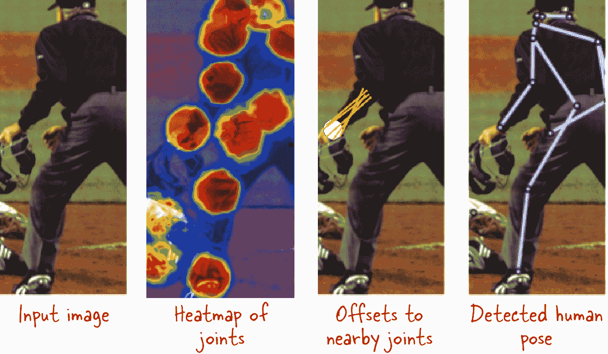

###### 图 11-14\. 识别关键关节的相对位置有助于识别人体姿势。图片修改自[Papandreou et al., 2018](https://arxiv.org/pdf/1803.08225.pdf)。

我们需要步骤 2 和 3 是因为仅仅运行对象检测模型来检测各种关节是不够的—模型可能会漏掉一些关节并识别虚假的关节。这就是为什么 PoseNet 模型还预测从检测到的关节到附近关节的偏移。例如，如果模型检测到手腕，手腕检测会带有肘部关节位置的偏移预测。这有助于在某些情况下，例如肘部未被检测到的情况下。如果检测到了肘部，我们现在可能有三个该关节的候选位置—来自热图的肘部位置和手腕和肩部偏移预测的肘部位置。考虑到所有这些候选位置，使用称为霍夫变换的加权投票机制确定关节的最终位置。

## PoseNet 模型

PoseNet 实现可用于[Android 上的 TensorFlow](https://oreil.ly/rGzZh)和 Web 浏览器。[TensorFlow JS 实现](https://oreil.ly/X1RVj)在 Web 浏览器中运行，并使用 MobileNet 或 ResNet 作为底层架构，但继续称其为 PoseNet。[OpenPose](https://oreil.ly/EHSMY)提供了另一种实现方式。

TensorFlow JS PoseNet 模型经过训练，可以识别包括面部特征（鼻子、左眼、右眼、左耳、右耳）和关键肢体关节（肩部、肘部、手腕、臀部、膝盖和踝部）在内的 17 个身体部位，分别位于左侧和右侧。

要尝试它，您需要运行一个本地网络服务器—[*GitHub 仓库中的 11b_posenet.html*](https://github.com/GoogleCloudPlatform/practical-ml-vision-book/blob/master/11_adv_problems/11b_posenet.html) 提供了详细信息。加载`posenet`包并要求它估算单个姿势（而不是一张图中的多个人）：

```
posenet.load().then(function(net) {
    const pose = net.estimateSinglePose(imageElement, {
        flipHorizontal: false
    });
    return pose;
})
```

请注意，我们要求图像不要翻转。但是，如果您处理自拍图像，您可能希望水平翻转它们以匹配用户体验的镜像图像。

我们可以使用以下方法直接显示返回的 JSON 元素：

```
document.getElementById('output_json').innerHTML =
    "<pre>" + JSON.stringify(pose, null, 2) + "</pre>";
```

JSON 中标识的关键点及其在图像中的位置：

```
{
    "score": 0.5220872163772583,
    "part": "leftEar",
    "position": {
        "x": 342.9179292671411,
        "y": 91.27406275411522
    }
},
```

我们可以像在图 11-15 中展示的那样，直接注释图像。

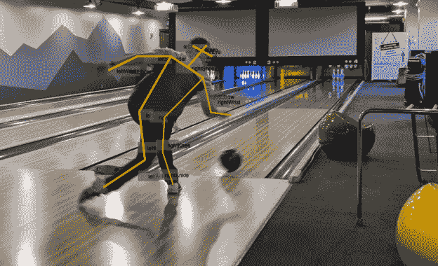

###### 图 11-15\. 一个带注释的图像，注释来自 PoseNet 的输出。每个浅灰色框中包含一个标记（例如，rightWrist），它们由骨架连接。

PoseNet 的准确性由底层分类模型的准确性（例如，相比于 MobileNet，ResNet 往往更大且速度更慢但更准确）和输出步幅的大小决定——步幅越大，补丁越大，因此输出位置的精度受到影响。

当 PoseNet 被加载时，这些因素可以被改变：

```
posenet.load({
    architecture: 'ResNet50',
    outputStride: 32, # default 257
    inputResolution: { width: 500, height: 900 },
    quantBytes: 2
});
```

较小的输出步幅会导致更精确的模型，但速度会降低。输入分辨率指定图像在输入 PoseNet 模型之前调整大小和填充的大小。该值越大，准确性越高，但速度越慢。

MobileNet 架构有一个称为`multiplier`的参数，用于指定卷积操作的深度乘数。乘数越大，模型的准确性就越高，但速度更慢。ResNet 中的`quantBytes`参数指定了用于权重量化的字节数。使用`4`会比使用`1`得到更高的准确性和更大的模型。

## 识别多个姿势

为了估计单个图像中多人的姿势，我们使用与前一节中概述的相同技术，并添加了一些额外的步骤：

1.  使用图像分割模型识别在图像中对应于人物的所有像素。

1.  使用关节的组合，识别特定身体部位（例如鼻子）最可能的位置。

1.  使用步骤 1 中找到的分割蒙版中的像素以及步骤 2 中确定的可能连接，将人物像素分配给各自的人物。

例如，在图 11-16 中显示了一个示例。同样，可以在第四章讨论的任何图像分割模型中使用。

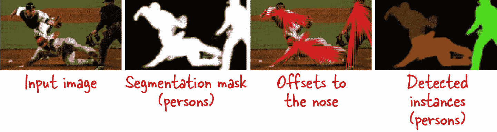

###### 图 11-16\. 在图像中识别多人的姿势。改编自[Papandreou 等人，2018](https://arxiv.org/pdf/1803.08225.pdf)。

运行 PoseNet 时，您可以要求它使用以下方法估计多个姿势：

```
net.estimateMultiplePoses(image, {
    flipHorizontal: false,
    maxDetections: 5,
    scoreThreshold: 0.5,
    nmsRadius: 20
});
```

这里的关键参数包括图像中的最大人数(`maxDetections`)、人物检测的置信度阈值(`scoreThreshold`)，以及两个检测之间应该抑制的距离(`nmsRadius`，以像素为单位)。

接下来，让我们看一下支持图像搜索的问题。

# 图像搜索

[eBay 使用图像搜索](https://oreil.ly/JVE2J)来改善购物体验（例如，找到特定名人所穿眼镜的款式）和列表体验（例如，这是你正在尝试出售的小工具的所有相关技术规格）。

在这两种情况下的关键问题是找到数据集中与新上传图像最相似的图像。为了提供这种能力，我们可以使用嵌入。其核心思想是两张相似的图像会有接近的嵌入。因此，要搜索类似的图像，我们可以简单地搜索相似的嵌入。

## 分布式搜索

为了使搜索相似嵌入成为可能，我们将不得不在数据集中创建嵌入的搜索索引。假设我们将此嵌入索引存储在像 Google BigQuery 这样的大规模分布式数据仓库中。

如果我们在数据仓库中有天气图像的嵌入，那么就能够轻松地搜索与当前某些场景类似的“相似”天气情况。这里是可以执行的[SQL 查询](https://oreil.ly/IxTn1)：

```
WITH ref1 AS (
    SELECT time AS ref1_time, ref1_value, ref1_offset
    FROM `ai-analytics-solutions.advdata.wxembed`,
        UNNEST(ref) AS ref1_value WITH OFFSET AS ref1_offset
    WHERE time = '2019-09-20 05:00:00 UTC'
)
SELECT
    time,
    SUM( (ref1_value - ref[OFFSET(ref1_offset)])
        * (ref1_value - ref[OFFSET(ref1_offset)]) ) AS sqdist
FROM ref1, `ai-analytics-solutions.advdata.wxembed`
GROUP BY 1
ORDER By sqdist ASC
LIMIT 5
```

我们正在计算在指定时间戳（`refl1`）处的嵌入与其他每个嵌入之间的欧氏距离，并显示最接近的匹配项。结果如下所示：

| <0xa0> | time | sqdist |
| --- | --- | --- |
| 0 | 2019-09-20 05:00:00+00:00 | 0.000000 |
| 1 | 2019-09-20 06:00:00+00:00 | 0.519979 |
| 2 | 2019-09-20 04:00:00+00:00 | 0.546595 |
| 3 | 2019-09-20 07:00:00+00:00 | 1.001852 |
| 4 | 2019-09-20 03:00:00+00:00 | 1.387520 |

这样做非常有道理。从前/后一小时的图像最相似，然后是+/– 2 小时的图像，依此类推。

## 快速搜索

在前一节的 SQL 示例中，我们搜索了整个数据集，我们之所以能够高效地完成，是因为 BigQuery 是一个大规模扩展的云数据仓库。然而，数据仓库的一个缺点是它们往往具有高延迟。我们将无法获得毫秒级的响应时间。

对于实时服务，我们需要更聪明地搜索相似嵌入。[可扩展最近邻居（ScaNN）](https://oreil.ly/1A1t4)，我们在下一个示例中使用它，可以对搜索空间进行修剪，并提供了一种高效查找相似向量的方法。

让我们构建我们的 5 种花卉数据集的前 100 张图像的搜索索引（当然，通常情况下，我们会构建一个更大的数据集，但这只是一个示例）。我们可以通过创建一个 Keras 模型来创建 MobileNet 嵌入：

```
layers = [
    hub.KerasLayer(
        "https://.../mobilenet_v2/...",
        input_shape=(IMG_WIDTH, IMG_HEIGHT, IMG_CHANNELS),
        trainable=False,
        name='mobilenet_embedding'),
    tf.keras.layers.Flatten()
]
model = tf.keras.Sequential(layers, name='flowers_embedding')
```

要创建一个嵌入数据集，我们循环遍历花卉图像数据集，并调用模型的`predict()`函数（完整代码在 GitHub 上的[*11c_scann_search.ipynb*](https://github.com/GoogleCloudPlatform/practical-ml-vision-book/blob/master/11_adv_problems/11c_scann_search.ipynb)中）：

```
def create_embeddings_dataset(csvfilename):
    ds = (tf.data.TextLineDataset(csvfilename).
          map(decode_csv).batch(BATCH_SIZE))
    dataset_filenames = []
    `dataset_embeddings` `=` `[``]`
    for filenames, images in ds:
        embeddings = `model``.``predict``(``images``)`
        dataset_filenames.extend(
            [f.numpy().decode('utf-8') for f in filenames])
        `dataset_embeddings``.``extend``(``embeddings``)`
    dataset_embeddings = tf.convert_to_tensor(dataset_embeddings)
    return dataset_filenames, dataset_embeddings
```

一旦我们有了训练数据集，我们可以初始化[ScaNN 搜索器](https://oreil.ly/zJm5f)，指定要使用的距离函数为余弦距离（我们也可以使用欧氏距离）：

```
searcher = scann.scann_ops.builder(
    dataset_embeddings,
    NUM_NEIGH, "dot_product").score_ah(2).build()
```

这将构建一个用于快速搜索的树。

要搜索某些图像的邻居，我们获取它们的嵌入并调用搜索器：

```
_, query_embeddings = create_embeddings_dataset(
    "gs://cloud-ml-data/img/flower_photos/eval_set.csv"
)
neighbors, distances = searcher.search_batched(query_embeddings)
```

如果只有一张图片，调用`searcher.search()`。

在图 11-17 中显示了一些结果。我们正在寻找与每行第一张图片相似的图像；其他面板显示了三个最接近的邻居。结果并不太令人印象深刻。如果我们使用更好的方法来创建嵌入，而不是使用用于迁移学习的 MobileNet 嵌入，会怎样？

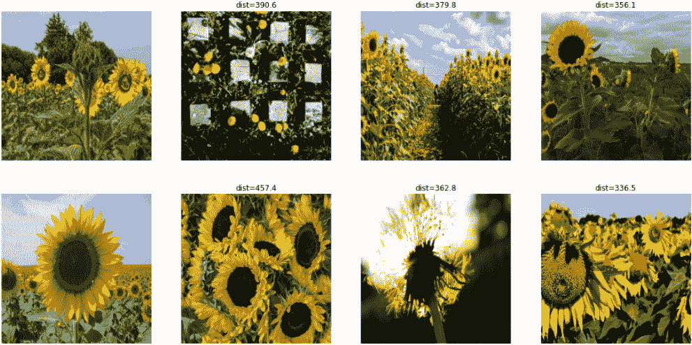

###### 图 11-17。搜索与每行第一张图片相似的图像。

## 更好的嵌入

在前面的部分中，我们使用了 MobileNet 的嵌入，这些嵌入是通过训练大型图像分类模型获得的中间瓶颈层得到的。可以使用更定制的嵌入。例如，在搜索面部相似性时，来自训练用于识别和验证面部的模型的嵌入将比通用嵌入表现更好。

为了优化面部搜索的嵌入，一个名为[FaceNet](https://arxiv.org/abs/1503.03832)的系统使用匹配/非匹配面部块的三元组，这些块基于面部特征对齐。三元组由两个匹配和一个非匹配的面部缩略图组成。使用*三元损失*函数，旨在通过最大可能距离将正对组与负对组分开。缩略图本身是面部区域的紧凑裁剪图。网络训练时，显示给网络的三元组的难度会增加。

###### 注意

由于围绕面部搜索和验证的道德敏感性，我们没有在我们的存储库中演示面部搜索的实现或进一步讨论此主题。实现[FaceNet 技术的代码在线上已经很容易获得](https://oreil.ly/rRZ9Q)。请确保您负责任地使用 AI，并遵守不违反政府、行业或公司政策的方式。

三元损失可以用来创建通过标签聚类在一起的嵌入，使得具有相同标签的两个图像的嵌入彼此靠近，而具有不同标签的两个图像的嵌入彼此远离。

三元损失的正式定义使用三个图像：锚定图像，另一个具有相同标签的图像（使得第二个图像和锚定图像形成正对组），以及具有不同标签的第三个图像（使得第三个图像和锚定图像形成负对组）。给定三个图像，三元组(*a*, *p*, *n*)的损失定义为距离*d*(*a, p*)朝零推进，并且距离*d*(*a, n*)至少比*d*(*a, p*)大一些边距：

<math><mrow><mrow><mi>L</mi><mo>−</mo><mi mathvariant="italic">max</mi><mo>⁡</mo><mrow><mo>(</mo><mi>d</mi><mrow><mo>(</mo><mi>a</mi><mo>,</mo><mi>p</mi><mo>)</mo><mo>−</mo><mi>d</mi><mrow><mo>(</mo><mi>a</mi><mo>,</mo><mi>n</mi><mo>)</mo><mo>+</mo><mi mathvariant="italic">m</mi><mo mathvariant="italic">⁢</mo><mi mathvariant="italic">arg</mi><mi mathvariant="italic">i</mi><mi mathvariant="italic">n</mi><mo>,</mo><mn>0</mn></mrow></mrow><mo>)</mo></mrow></mrow></mrow></math>

根据这个损失，负样本分为三类：

+   硬负样本，即比锚点更接近正样本的负样本。

+   简单负样本，即距离锚点非常远的负样本。

+   半硬负样本，比正样本更远，但在边距距离之内。

在 FaceNet 论文中，Schroff 等人发现专注于半硬负样本可以产生嵌入，其中具有相同标签的图像聚集在一起，并且与具有不同标签的图像不同。

我们可以通过添加线性层来改进我们的花卉图像的嵌入，然后训练模型以最小化这些图像上的三元损失，重点放在半硬负样本上：

```
layers = [
    hub.KerasLayer(
        "https://tfhub.dev/.../mobilenet_v2/feature_vector/4",
        input_shape=(IMG_HEIGHT, IMG_WIDTH, IMG_CHANNELS),
        trainable=False,
        name='mobilenet_embedding'),
    `tf``.``keras``.``layers``.``Dense``(``5``,` `activation``=``None``,` name='dense_5'),
    tf.keras.layers.Lambda(lambda x: `tf``.``math``.``l2_normalize``(``x``,` `axis``=``1``)``,`
                           name='normalize_embeddings')
]
model = tf.keras.Sequential(layers, name='flowers_embedding')
model.compile(optimizer=tf.keras.optimizers.Adam(0.001),
              `loss``=``tfa``.``losses``.``TripletSemiHardLoss``(``)`)
```

在上述代码中，架构确保生成的嵌入维度为 5，并且嵌入值已归一化。

注意，损失的定义意味着我们必须确保每个批次至少包含一个正对。洗牌和使用足够大的批次大小通常有效。在我们的 5 花示例中，我们使用了批次大小为 32，但这是您需要进行实验的数字。假设*k*个类均匀分布，批次大小为*B*包含至少一个正对的概率为：

<math><mrow><mrow><mn>1</mn><mo>−</mo><mstyle displaystyle="true" scriptlevel="0"><mrow><mfrac><mrow><mi>k</mi><mo>−</mo><msup><mrow><mn>1</mn></mrow><mrow><mi>B</mi></mrow></msup></mrow><mrow><mi>k</mi></mrow></mfrac></mrow></mstyle></mrow></mrow></math>

对于 5 个类和批次大小为 32，这相当于 99.9%。然而，0.1%并不为零，因此在摄入管道中，我们必须丢弃不符合此标准的批次。

在训练此模型并在测试数据集上绘制嵌入（完整代码在[GitHub 上的*11c_scann_search.ipynb*](https://github.com/GoogleCloudPlatform/practical-ml-vision-book/blob/master/11_adv_problems/11c_scann_search.ipynb)中），我们看到生成的嵌入与相似标签聚集（见图 11-18）。

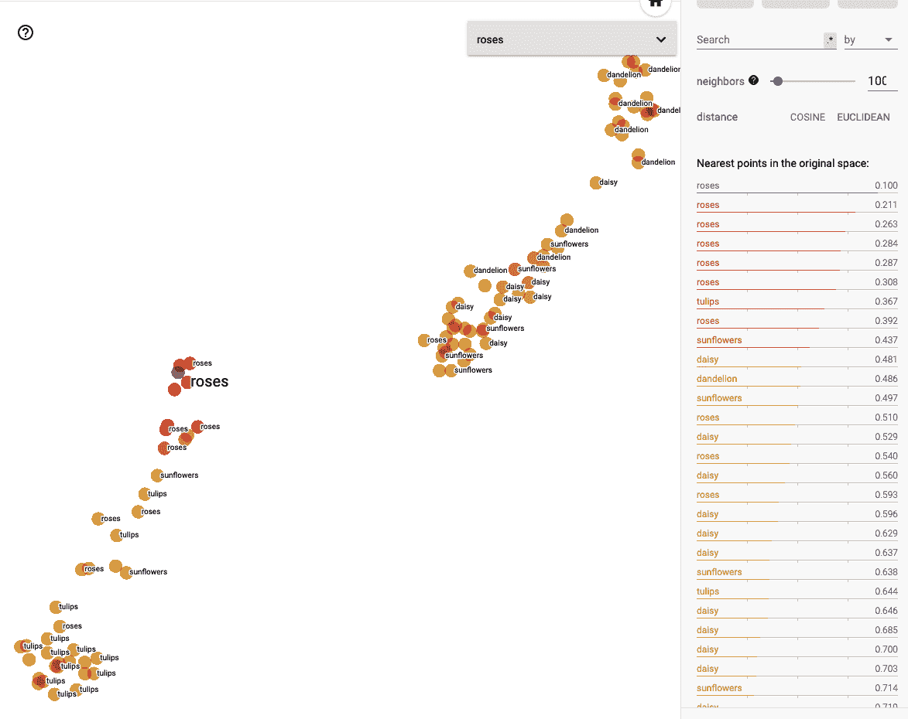

###### 图 11-18。在使用三元损失训练模型时，我们发现具有相同标签的图像在嵌入空间中聚集在一起。

当我们搜索相似图像时，结果表明这一点是显而易见的（参见图 11-19）—距离更小，图像看起来比图 11-17 中的图像更相似。

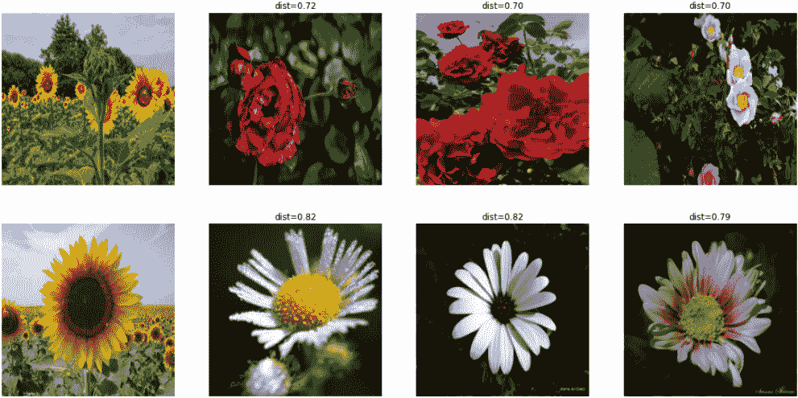

###### 图 11-19\. 在使用三元损失训练嵌入时，距离变小，附近的图像确实更相似。与图 11-17 进行比较。

# 概要

在本章中，我们探讨了多种基于基础计算机视觉技术的用例。可以使用参考对象、蒙版和一些图像校正来进行物体测量。通过对物体检测的后处理可以进行计数。然而，在某些情况下，密度估算更为合适。姿态估计是通过预测图像内粗粒度块中不同关节的可能性来完成的。通过使用三元损失训练嵌入并使用快速搜索方法（如 ScaNN）可以改进图像搜索。

在下一章中，我们将探讨如何生成图像，而不仅仅是处理它们。

¹ Lempitsky 和 Zisserman 提出了一种称为 MESA 距离的自定义损失函数，但该技术使用传统的均方误差效果也很好，这就是我们展示的内容。
