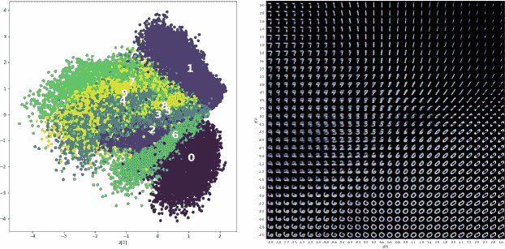

# 第十二章：图像与文本生成

到目前为止，在本书中，我们专注于处理图像的计算机视觉方法。在本章中，我们将研究能够生成图像的视觉方法。不过，在讨论图像生成之前，我们必须学习如何训练模型以理解图像中发生的事情，以便知道该生成什么。我们还将讨论基于图像内容生成文本（标题）的问题。

###### 小贴士

本章的代码位于书籍的 *12_generation* 文件夹中的 [GitHub 仓库](https://github.com/GoogleCloudPlatform/practical-ml-vision-book) 中。我们将在适当的地方提供代码示例和笔记本文件名。

# 图像理解

知道图像中有哪些组件是一回事，但实际理解图像中发生了什么并利用该信息进行其他任务是完全不同的。在本节中，我们将快速回顾嵌入，然后看看各种方法（自编码器和变分自编码器）来对图像进行编码并了解其属性。

## 嵌入

深度学习用例的一个常见问题是缺乏足够的数据或高质量的数据。在第三章中，我们讨论了迁移学习，它提供了一种方法来提取从一个训练在更大数据集上的模型中学到的嵌入，并将这些知识应用到在较小数据集上训练有效模型的过程中。

使用迁移学习时，我们使用的嵌入是通过在相同任务上训练模型创建的，例如图像分类。例如，假设我们有一个在 ImageNet 数据集上训练的 ResNet50 模型，如图 12-1 所示。


###### 图 12-1\. 训练 ResNet 模型以分类图像。

要提取学到的图像嵌入，我们会选择模型的一个中间层——通常是最后一个隐藏层——作为输入图像的数值表示（见图 12-2）。


###### 图 12-2\. 从训练好的 ResNet 模型中进行特征提取以获取图像嵌入。

使用训练分类模型并使用其倒数第二层创建嵌入的方法存在两个问题：

+   要创建这些嵌入，我们需要一个大型的、带标签的图像数据集。在这个例子中，我们在 ImageNet 上训练了一个 ResNet50 以获取图像嵌入。然而，这些嵌入只对 ImageNet 中的图像类型（例如互联网上的照片）有效。如果您有不同类型的图像（例如机器部件的图表、扫描书页、建筑图纸或卫星图像），那么从 ImageNet 数据集中学到的嵌入可能效果不佳。

+   这些嵌入反映了确定图像标签相关信息。因此，许多与特定分类任务无关的输入图像细节可能不会在嵌入中被捕捉到。

如果您希望获得一个对于非照片类图像效果良好的嵌入，并且没有大规模标记的此类图像数据集，并且希望尽可能捕捉图像中的信息内容，该怎么办？

## 辅助学习任务

另一种创建嵌入的方法是使用*辅助学习任务*。辅助任务是指除了我们试图解决的实际监督学习问题之外的任务。这个任务应该是有大量数据可用的。例如，在文本分类的情况下，我们可以使用一个无关的问题，比如预测句子中的下一个单词，来创建文本嵌入，因为这种问题已经有大量且易于获取的训练数据。然后可以从辅助模型中提取某些中间层的权重值，并用于表示各种其他无关任务的文本。图 12-3 展示了这种文本或单词嵌入的例子，其中模型被训练用于预测句子中的下一个单词。使用“the cat sat”作为输入词语，这样的模型将被训练来预测“on”这个单词。输入词语首先进行了独热编码，但是如果预测模型的倒数第二层有四个节点，它将学会将输入词语表示为一个四维嵌入。


###### 图 12-3\. 通过训练模型预测句子中的下一个单词创建的词嵌入，可以用于无关任务，例如文本分类。图示显示了辅助任务之前（左）和之后（右）的单词编码。

*自编码器*利用了图像的辅助学习任务，类似于文本中的预测下一个单词模型。我们接下来将介绍这些内容。

## 自编码器

用于学习图像嵌入的一个很好的辅助学习任务是使用自编码器。通过自编码器，我们将图像数据传入一个网络，将其压缩成一个更小的内部向量，然后再扩展回到原始图像的维度。当我们训练自编码器时，输入图像本身就充当其自身的标签。这样，我们基本上是在学习*有损压缩*，即通过一个受限制的网络恢复原始图像的能力。希望通过这种方式，我们能够将数据中的噪音挤压出去，并学习到信号的有效映射。

通过受监督任务训练的嵌入，输入中与标签无关或无用的信息通常会随着噪声被剪除。另一方面，对于自编码器而言，由于“标签”是整个输入图像，输入的每个部分都与输出相关，因此希望从输入中保留更多的信息。因为自编码器是自监督的（我们不需要单独的步骤来标记图像），我们可以在更多的数据上训练，并获得大大改进的编码。

通常情况下，编码器和解码器形成一个沙漏形状，因为编码器中的每个渐进层的维度缩小，解码器中的每个渐进层的维度扩展，如图 12-4 所示。随着编码器中维度的缩小和解码器中维度的扩展，某个时刻维度达到最小值，在编码器末端和解码器开头，由图 12-4 中中间的两个像素单通道块表示。这个潜在向量是输入的简明表示，数据被迫通过一个瓶颈。


###### 图 12-4\. 自编码器将图像作为输入并生成重建的图像作为输出。

那么，潜在维度应该有多大呢？与其他类型的嵌入一样，存在压缩和表达能力之间的权衡。如果潜在空间的维度太小，将没有足够的表达力来完全表示原始数据，部分信号将会丢失。当这种表示被解压缩回原始大小时，将会丢失太多信息，无法获得所需的输出。相反，如果潜在空间的维度太大，尽管有充足的空间来存储所有所需的信息，但也会有空间来编码一些不需要的信息（即噪声）。因此，潜在维度的理想大小是通过实验调整的。典型的值是 128、256 或 512，当然这取决于编码器和解码器层的大小。

接下来，我们将看一下实现自编码器的过程，从其架构开始。

### 架构

为了简化我们对自编码器架构的讨论和分析，我们将选择一个名为[MNIST](https://oreil.ly/nia0l)的简单手写数字数据集应用自编码器（完整代码在 GitHub 上的[*12a_autoencoder.ipynb*](https://github.com/GoogleCloudPlatform/practical-ml-vision-book/blob/master/12_generation/12a_autoencoder.ipynb)中）。输入图像大小为 28x28，包含单通道灰度。

编码器从这些 28x28 的输入开始，然后通过卷积层逐步将信息压缩到越来越少的维度，最终达到大小为 2 的潜在维度：

```
encoder = tf.keras.Sequential([
    `keras``.``Input``(``shape``=``(``28``,` `28``,` `1``)`, name="image_input"),
    layers.Conv2D(32, 3, activation="relu", strides=2, padding="same"),
    layers.Conv2D(64, 3, activation="relu", strides=2, padding="same"),
    layers.Flatten(),
    `layers``.``Dense``(``2``)` # latent dim
], name="encoder")
```

解码器将不得不使用`Conv2DTranspose`层（也称为反卷积层，在第四章中讨论过）反转编码器具有`Conv2D`（卷积）层的步骤：

```
decoder = tf.keras.Sequential([
    keras.Input(shape=(latent_dim,), name="d_input"),
    layers.Dense(7 * 7 * 64, activation="relu"),
    layers.Reshape((7, 7, 64)),
    layers.Conv2DTranspose(32, 3, activation="relu",
                           strides=2, padding="same"),
    layers.Conv2DTranspose(1, 3, activation="sigmoid",
                           strides=2, padding="same")
], name="decoder")
```

一旦我们有了编码器和解码器模块，我们可以将它们结合在一起形成一个可以训练的模型。

### 训练

要训练的模型由编码器和解码器模块连接在一起构成：

```
encoder_inputs = keras.Input(shape=(28, 28, 1))
x = encoder(encoder_inputs)
decoder_output = decoder(x)
autoencoder = keras.Model(encoder_inputs, decoder_output)
```

模型必须经过训练，以最小化输入和输出图像之间的重建误差。例如，我们可以计算输入和输出图像之间的均方误差，并将其用作损失函数。这种损失函数可以在反向传播中使用，以计算梯度并更新编码器和解码器子网络的权重：

```
autoencoder.compile(optimizer=keras.optimizers.Adam(), loss='mse')
history = autoencoder.fit(mnist_digits, mnist_digits,
                          epochs=30, batch_size=128)
```

### 潜在向量

一旦模型训练完成，我们可以舍弃解码器，使用编码器将图像转换为潜在向量：

```
z = encoder.predict(img)
```

如果自编码器成功学会了如何重建图像，相似图像的潜在向量将倾向于聚类，如图 12-5 所示。请注意，1、2 和 0 占据潜在向量空间的不同部分。


###### 图 12-5\. 编码器将输入图像压缩为潜在表示。特定数字的潜在表示聚集在一起。我们能够将潜在表示呈现为 2D 图中的点，因为每个潜在表示是两个数字（x，y）。

因为整个输入图像的信息内容必须通过瓶颈层流动，所以训练后的瓶颈层将保留足够的信息，使得解码器能够重建接近输入图像的复制品。因此，我们可以训练自编码器进行降维。其思想，如图 12-5 中所示，是舍弃解码器，使用编码器将图像转换为潜在向量。这些潜在向量随后可以用于分类和聚类等下游任务，并且其结果可能优于像主成分分析（PCA）这样的传统降维技术。如果自编码器使用非线性激活函数，则编码可以捕捉输入特征之间的非线性关系，这与 PCA 不同，后者仅是一种线性方法。

另一种应用可能是使用解码器将用户提供的潜在向量转换成生成的图像，如图 12-6 所示。


###### 图 12-6\. 解码器将潜在表示解压缩回图像。

尽管这对于非常简单的 MNIST 数据集效果尚可，但在实践中对更复杂的图像并不适用。实际上，在图 12-7 中，我们可以看到即使在 MNIST 手写数字中也存在一些缺陷——尽管在潜在空间的某些部分数字看起来逼真，但在其他地方却不像我们知道的任何数字。例如，看一下图像左侧中心，2 和 8 已经插入到不存在的东西中。重建的图像完全毫无意义。还要注意，0 和 2 的数量明显较多，但 1 的数量却没有像在图 12-5 中看到的重叠聚类那样多。虽然生成 0 和 2 相对容易，但生成 1 却非常困难——我们必须精确地调整潜在向量才能得到一个看起来不像 2 或 5 的 1！


###### 图 12-7\. 潜在空间在[–2,-3]和[3,3]之间的重建图像。

到底是怎么回事呢？潜在空间有广泛的区域（注意图 12-5 中的空白区域）不对应有效的数字。训练任务根本不关心这些空白区域，也没有减少它们的动机。当使用编码器和解码器一起时，经过训练的模型表现出色，这也是我们最初要求自编码器学习的原始任务。我们将图像传入编码器子网络，该子网络将数据压缩成向量（这些图像的学习潜在表示）。然后我们使用解码器子网络解压这些表示以重建原始图像。编码器已经学会使用可能包含数百万参数权重的高度非线性组合从图像到潜在空间的映射。如果我们尝试简单地创建自己的潜在向量，它不太可能符合编码器创建的更加微妙的潜在空间。因此，没有编码器，我们随机选择的潜在向量很可能不能生成解码器用于生成高质量图像的良好编码。

现在我们已经看到，我们可以使用自编码器通过其两个子网络：编码器和解码器来重建图像。此外，通过丢弃解码器仅使用编码器，我们可以将图像非线性地编码成潜在向量，然后在不同的任务中使用它们作为嵌入。然而，我们也看到，简单地尝试相反的操作——丢弃编码器并使用解码器从用户提供的潜在向量生成图像并不奏效。

如果我们真的想要使用自编码器类型结构的解码器来生成图像，那么我们需要开发一种方法来组织或规范潜空间。这可以通过将在潜空间中接近的点映射到在图像空间中接近的点，并填充潜空间地图以使所有点都变得有意义，而不是在未映射的噪声海洋中创建合理输出的小岛。这样我们就可以生成自己的潜向量，解码器将能够使用这些向量生成高质量的图像。这迫使我们离开经典的自编码器，走向下一个进化阶段：变分自编码器。

## 变分自编码器

如果没有适当组织的潜空间，使用自编码器类型架构进行图像生成通常会出现两个主要问题。首先，如果我们在潜空间中生成两个接近的点，我们期望经过解码器后，这些点对应的输出应该相似。例如，正如图 12-8 所示，如果我们训练我们的自编码器来处理几何形状如圆、正方形和三角形，如果我们创建两个在潜空间中接近的点，我们假设它们应该是圆形、正方形或者它们之间的某种插值的潜在表示。然而，由于潜空间没有明确规范，其中一个潜在点可能生成一个三角形，而另一个潜在点可能生成一个圆形。


###### 图 12-8\. 在 3D 潜空间中接近的两个点可能被解码为非常不同的图像。

其次，在训练自编码器长时间并观察到良好重建之后，我们期望编码器已经学会了每个图像原型（例如形状数据集中的圆形或正方形）在潜空间中最佳位置，为每个原型创建了一个*n*维子域，这些子域可以与其他子域重叠。例如，可能存在一个潜空间区域，其中主要是方形类型的图像，以及另一个潜空间区域，其中类似圆形的图像已经被组织起来。此外，在它们重叠的地方，我们将得到某种在方形-圆形光谱上介于两者之间的形状。

然而，由于自编码器中的潜空间没有明确的组织，潜空间中的随机点经过解码器后可能会返回完全毫无意义、不可识别的图像，如图 12-9 所示。与想象中的广阔重叠影响球相反，形成了小而孤立的岛屿。


###### 图 12-9\. 在潜空间中的随机点解码为一个毫无意义的、荒谬的图像。

现在，我们不能责怪自编码器太多。它们正在做它们被设计来做的事情，即通过最小化重构损失函数来重构它们的输入。如果通过拥有小的孤立岛来实现这一目标，那么它们将学会做到这一点。

*变分自编码器*（VAEs）是响应经典自编码器无法使用其解码器从用户生成的潜在向量生成高质量图像而开发的。

VAEs 是生成模型，可以用于当我们不仅仅想要区分类别时使用，例如在分类任务中我们在潜在空间创建决策边界（可能仅满足于简单地分离类别），我们希望创建*n*维的气泡，这些气泡包含类似的训练样本。这一区别在图 12-10 中得到了可视化。


###### 图 12-10。判别模型条件概率与生成模型联合概率分布对比。

判别模型，包括用于分类和物体检测等任务的流行图像机器学习模型，学习一个条件概率分布，该分布建模类之间的决策边界。而生成模型则学习一个联合概率分布，明确地建模每个类的分布。条件概率分布并没有丢失——我们仍然可以使用贝叶斯定理进行分类，例如。

幸运的是，变分自编码器的大部分架构与经典自编码器相同：沙漏形状、重构损失等。然而，少数额外的复杂性使得 VAEs 能够做到自编码器无法做到的事情：图像生成。

这在图 12-11 中有所展示，显示出我们的潜在空间正则性问题已经解决。第一个问题是接近的潜在点生成非常不同的解码图像已经被修复，现在我们能够创建通过潜在空间平滑插值的类似图像。第二个问题是在潜在空间中的点生成毫无意义、无意义的图像也已经被解决，现在我们可以生成可信的图像。请记住，这些图像实际上可能并不完全像模型训练的图像，但可能处于一些主要原型之间，因为在学习的有序潜在空间内存在平滑重叠的区域。


###### 图 12-11。这两个问题都已经在一个有组织的、正则化的潜在空间中得到解决。

不再只是在编码器和解码器网络之间有一个潜在向量，这本质上是潜在空间中的一个点，变分自编码器训练编码器产生概率分布的参数，并使解码器随机地使用这些参数进行采样。编码器不再输出描述潜在空间内点的向量，而是概率分布的参数。然后我们可以从该分布中采样，并将这些采样点传递给解码器，以将它们解压缩回图像。

在实践中，概率分布是一个标准正态分布。这是因为接近零的均值有助于防止编码分布之间距离过大，看起来像是孤立的岛屿。此外，接近单位矩阵的协方差有助于防止编码分布太窄。图 12-12 左侧展示了我们试图避免的情况，即被毫无意义的空白所包围的小而孤立的分布。


###### 图 12-12\. 我们试图避免的情况（左）和我们试图实现的情况（右）。我们不希望被毫无意义的空白所包围的小而孤立的岛屿分布；我们希望整个空间被 n 维泡泡覆盖，如右侧所示。目标是具有平滑重叠的分布而没有大的间隙。

右侧的图像在图 12-12 中展示了平滑重叠的分布，没有大的间隙，这正是我们在优秀图像生成中所追求的。请注意两个分布相交处的插值。事实上，潜在空间中编码了一个平滑的梯度。例如，我们可以从三角分布的深处直接移向圆形分布。我们将从一个完美的三角形开始，随着每一步朝向圆形分布，我们的三角形会变得越来越圆，直到达到圆形分布的深处，那时我们将拥有一个完美的圆。

要能够从这些分布中进行采样，我们需要均值向量和协方差矩阵。因此，编码器网络将输出分布的均值向量和协方差向量。为了简化问题，我们假设这些是独立的。因此，协方差矩阵是对角线的，我们可以简单地使用它，而不是一个*n*²长的大部分为零的向量。

现在让我们看看如何实现 VAE，从其架构开始。

### 架构

在 TensorFlow 中，VAE 编码器的结构与经典自编码器相同，唯一的区别是我们不再只有一个潜在向量，而是一个具有两个分量（均值和方差）的向量（完整的代码在[*12b_vae.ipynb* on GitHub](https://github.com/GoogleCloudPlatform/practical-ml-vision-book/blob/master/12_generation/12b_vae.ipynb)中）。

```
encoder_inputs = keras.Input(shape=(28, 28, 1))
x = layers.Conv2D(
    32, 3, activation="relu", strides=2, padding="same")(encoder_inputs)
x = layers.Conv2D(
    64, 3, activation="relu", strides=2, padding="same")(x)
x = layers.Flatten(name="e_flatten")(x)
z_mean = layers.Dense(latent_dim, name="z_mean")(x) # same as autoencoder
```

然而，除了 `z_mean` 外，我们还需要从编码器中得到两个额外的输出。由于我们的模型现在具有多个输出，我们不能再使用 Keras 顺序 API；而是必须使用功能 API。Keras 功能 API 更像标准的 TensorFlow，其中输入被传递到一层，层的输出被传递到另一层作为其输入。可以使用 Keras 功能 API 制作任意复杂的有向无环图：

```
z_log_var = layers.Dense(latent_dim, name="z_log_var")(x)
z = Sampling()(z_mean, z_log_var)
encoder = keras.Model(encoder_inputs, [z_mean, z_log_var, z], name="encoder")
```

采样层需要从由编码器层的输出参数化的正态分布中采样，而不是像非变分自编码器中那样使用来自最终编码器层的向量。TensorFlow 中采样层的代码如下：

```
class Sampling(tf.keras.layers.Layer):
    """Uses (z_mean, z_log_var) to sample z, the vector encoding a digit.
 """
    def call(self, inputs):
        z_mean, z_log_var = inputs
        batch = tf.shape(input=z_mean)[0]
        dim = tf.shape(input=z_mean)[1]
        epsilon = tf.random.normal(shape=(batch, dim))
        return z_mean + tf.math.exp(x=0.5 * z_log_var) * epsilon
```

VAE 解码器与非变分自编码器中的解码器完全相同——它接收由编码器产生的潜变量 `z`，并将其解码为图像（具体来说，是原始图像输入的重构）：

```
z_mean, z_log_var, z = encoder(encoder_inputs) # 3 outputs now
decoder_output = decoder(z)
vae = keras.Model(encoder_inputs, decoder_output, name="vae")
```

### 损失

变分自编码器的损失函数包含图像重构项，但我们不能仅仅使用均方误差（MSE）。除了重构误差外，损失函数还包含了称为 Kullback–Leibler 散度的正则化项，它实质上是对编码器的正态分布（由均值 μ 和标准差 σ 参数化）不是完美标准正态分布（均值为 0，标准差为单位矩阵）的一种惩罚：

<math><mrow><mrow><mi>L</mi><mo>=</mo><mrow><mo>‖</mo><mi>x</mi><mo>−</mo><mover><mrow><mi>x</mi></mrow><mrow><mo>^</mo></mrow></mover><msup><mrow><mo>‖</mo></mrow><mrow><mn>2</mn></mrow></msup><mo>+</mo><mi>K</mi><mi>L</mi><mrow><mo>(</mo><mi>N</mi><mrow><mo>(</mo><msub><mrow><mi>μ</mi></mrow><mrow><mi>x</mi></mrow></msub><mo>,</mo><msub><mrow><mi>σ</mi></mrow><mrow><mi>x</mi></mrow></msub><mo>)</mo><mo>,</mo><mi>N</mi><mrow><mo>(</mo><mn>0</mn><mo>,</mo><mi>I</mi><mo>)</mo></mrow></mrow><mo>)</mo></mrow></mrow></mrow></mrow></math>

因此，我们修改编码器的损失函数如下：

```
def kl_divergence(z_mean, z_log_var):
    kl_loss = -0.5 * (1 + z_log_var - tf.square(z_mean) -
                      tf.exp(z_log_var))
    return tf.reduce_mean(tf.reduce_sum(kl_loss, axis=1))
encoder.add_loss(kl_divergence(z_mean, z_log_var))
```

总体重构损失是每像素损失的总和：

```
def reconstruction_loss(real, reconstruction):
    return tf.reduce_mean(
        tf.reduce_sum(
            keras.losses.binary_crossentropy(real, reconstruction),
            axis=(1, 2)
        )
    )
vae.compile(optimizer=keras.optimizers.Adam(),
            loss=reconstruction_loss, metrics=["mse"])
```

然后，我们使用 MNIST 图像来训练编码器/解码器组合，这些图像既是输入特征也是标签：

```
history = vae.fit(mnist_digits, mnist_digits, epochs=30,
                  batch_size=128)
```

由于变分编码器已经训练包括二元交叉熵在其损失函数中，它考虑了图像中不同类别的可分离性。由此产生的潜变量更易分离，占据整个潜空间，并且更适合生成（见图 12-13）。



###### 图 12-13\. 从 MNIST 上训练的 VAE 中的聚类（左）和生成的图像（右）。

变分自编码器能够创建看起来与其输入完全相同的图像。但是，如果我们想要生成全新的图像呢？我们接下来来看一下图像生成。

# 图像生成

图像生成是一个重要且迅速发展的领域，远远超出了仅仅为了娱乐生成数字和面孔；它对个人和企业都有许多重要的用例，如图像恢复、图像翻译、超分辨率和异常检测。

我们之前看到 VAE 如何重新创建它们的输入；然而，它们在创建与输入数据集中的图像相似但又不同的全新图像方面并不特别成功。如果生成的图像需要在感知上真实，例如，如果我们给定一个工具图像数据集，希望模型生成具有与训练图像中不同特征的新工具图片，这一点尤为重要。在本节中，我们将讨论在这类情况下生成图像的方法（如 GAN、cGAN 等），以及图像生成可应用的一些用途（如翻译、超分辨率等）。

## 生成对抗网络

用于图像生成的模型类型通常是*生成对抗网络*（GAN）。GAN 从博弈论中借鉴，通过使两个网络相互对抗直到达到均衡状态。其理念是，一个网络，生成器，将不断尝试创建更好的真实图像复制品，而另一个网络，判别器，将尝试越来越善于检测复制品与真实图像之间的区别。理想情况下，生成器和判别器将建立纳什均衡，以便任何一个网络都不能完全主导另一个。如果其中一个网络开始主导另一个，不仅没有办法让“失败”的网络恢复，而且这种不平等竞争将阻止网络相互改进。

训练在两个网络之间交替进行，每个网络通过与另一个网络的挑战变得更加擅长于其所做的事情。这种过程持续到收敛，当生成器变得非常擅长于创建逼真的假图像时，判别器只是随机猜测哪些图像是真实的（来自数据集），哪些图像是假的（来自生成器）。

生成器和判别器都是神经网络。[图 12-14](https://example.org/the_standard_gan_architecturecomma_consi)显示了整体训练架构。


###### 图 12-14\. 标准 GAN 架构，由生成器和判别器组成。

例如，想象一下，一个犯罪组织想要制造看起来真实的钱来存入银行。在这种情况下，犯罪分子将是生成器，因为他们试图制造逼真的假钞。银行家将是判别器，检查钞票并试图确保银行不接受任何假币。

典型的 GAN 训练将以生成器和鉴别器使用随机权重初始化开始。在我们的场景中，这意味着伪造者不知道如何生成逼真的货币：开始时生成的输出看起来只是随机噪声。同样，银行家开始时也不知道真假币之间的区别，因此他们会对真假进行非常不明智的随机猜测。

鉴别器（银行家组）被呈现第一组合法和生成的帐单，并且必须将它们分类为真实或伪造。因为鉴别器从随机权重开始，最初它不能轻易地“看到”一个帐单是随机噪声，另一个是好帐单。它会根据其表现的好坏来更新，因此在许多迭代中，鉴别器将开始更好地预测哪些帐单是真实的，哪些是生成的。在训练鉴别器权重时，生成器的权重被冻结。然而，在其轮次内，生成器（伪造者组）也在改进，因此它对鉴别任务的难度逐渐增加。根据它的帐单如何成功（或失败），它在每次迭代中进行更新，而在其训练期间，鉴别器的权重被冻结。

经过多次迭代后，生成器开始创造类似真实货币的东西，因为鉴别器在分辨真实和生成帐单方面做得很好。这进一步推动了鉴别器在其训练时更好地分辨现在看起来像样的生成帐单和真实帐单。

最终，在许多次训练迭代后，算法收敛。这是指鉴别器已经失去了分辨生成帐单和真实帐单的能力，基本上是随机猜测。

要查看 GAN 训练算法的一些细节，我们可以参考 Figure 12-15 中的伪代码。


###### 图 12-15\. 一个基本 GAN 训练算法。图片来自 [Goodfellow et al., 2014](https://arxiv.org/pdf/1406.2661.pdf)。

正如我们在伪代码的第一行中所看到的，外层有一个 `for` 循环，循环次数为交替的鉴别器/生成器训练迭代次数。我们将依次查看每个更新阶段，但首先需要设置我们的生成器和鉴别器。

### 创建网络

在进行任何训练之前，我们需要为生成器和鉴别器创建网络。在一个基本的 GAN 中，通常这只是由 `Dense` 层组成的神经网络。

生成器网络以某些潜在维度的随机向量作为输入，并通过一些（可能是几个）`Dense`层来生成图像。对于这个示例，我们将使用 MNIST 手写数字数据集，因此我们的输入是 28x28 的图像。`LeakyReLU`激活函数通常非常适合 GAN 训练，因为它们具有非线性特性，不会出现梯度消失问题，同时也不会因为任何负输入而丢失信息，也不会遇到可怕的 ReLU 死亡问题。Alpha 是我们希望通过的负信号量，在这里，值为 0 与 ReLU 激活相同，值为 1 则是线性激活。我们可以在下面的 TensorFlow 代码中看到这一点：

```
latent_dim = 512
vanilla_generator = tf.keras.Sequential(
    [
        tf.keras.Input(shape=(latent_dim,)),
        tf.keras.layers.Dense(units=256),
        tf.keras.layers.LeakyReLU(alpha=0.2),
        tf.keras.layers.Dense(units=512),
        tf.keras.layers.LeakyReLU(alpha=0.2),
        tf.keras.layers.Dense(units=1024),
        tf.keras.layers.LeakyReLU(alpha=0.2),
        tf.keras.layers.Dense(units=28 * 28 * 1, activation="tanh"),
        tf.keras.layers.Reshape(target_shape=(28, 28, 1))
    ],
    name="vanilla_generator"
)
```

在普通 GAN 中的鉴别器网络也由`Dense`层组成，但不是生成图像，而是以图像作为输入，如此处所示。输出是 logits 向量：

```
vanilla_discriminator = tf.keras.Sequential(
    [
        tf.keras.Input(shape=(28, 28, 1)),
        tf.keras.layers.Flatten(),
        tf.keras.layers.Dense(units=1024),
        tf.keras.layers.LeakyReLU(alpha=0.2),
        tf.keras.layers.Dense(units=512),
        tf.keras.layers.LeakyReLU(alpha=0.2),
        tf.keras.layers.Dense(units=256),
        tf.keras.layers.LeakyReLU(alpha=0.2),
        tf.keras.layers.Dense(units=1),
    ],
    name="vanilla_discriminator"
)
```

### 鉴别器训练

在外循环内是更新鉴别器的内循环。首先，我们抽样一个小批量的噪声，通常是从标准正态分布中随机抽样的样本。随机噪声潜在向量通过生成器生成生成（假）图像，如图 12-16 所示。


###### 图 12-16\. 生成器通过从潜在空间抽样创建其第一批生成图像，并将其传递给鉴别器。

在 TensorFlow 中，例如，我们可以使用以下代码来抽样一批随机正态分布的随机数：

```
# Sample random points in the latent space.
random_latent_vectors = tf.random.normal(shape=(batch_size, self.latent_dim))
```

我们还从数据集中抽样一小批示例，即我们的情况下的真实图像，如图 12-17 所示。


###### 图 12-17\. 我们还从训练数据集中提取了一批真实图像，并将其传递给鉴别器。

生成器生成的图像和数据集中的真实图像分别通过鉴别器，鉴别器进行预测。然后计算真实图像和生成图像的损失项，如图 12-18 所示。损失可以采用许多不同形式：二元交叉熵（BCE）、最终激活映射的平均值、二阶导数项、其他惩罚等。在示例代码中，我们将使用 BCE：真实图像损失越大，鉴别器认为真实图像是假的；生成图像损失越大，鉴别器认为生成图像是真的。


###### 图 12-18\. 真实样本和生成样本通过鉴别器以计算损失。

我们在以下的 TensorFlow 代码中执行这个操作（通常情况下，完整代码在 GitHub 上的[*12c_gan.ipynb*](https://github.com/GoogleCloudPlatform/practical-ml-vision-book/blob/master/12_generation/12c_gan.ipynb)）。我们可以将我们生成的和真实的图像连接在一起，并用相应的标签做同样的事情，以便我们可以通过鉴别器进行一次传递：

```
# Generate images from noise.
generated_images = self.generator(inputs=random_latent_vectors)

# Combine generated images with real images.
combined_images = tf.concat(
    values=[generated_images, real_images], axis=0
)

# Create fake and real labels.
fake_labels = tf.zeros(shape=(batch_size, 1))
real_labels = tf.ones(shape=(batch_size, 1))

# Smooth real labels to help with training.
real_labels *= self.one_sided_label_smoothing

# Combine labels to be inline with combined images.
labels = tf.concat(
    values=[fake_labels, real_labels], axis=0
)

# Calculate discriminator loss.
self.loss_fn = tf.keras.losses.BinaryCrossentropy(from_logits=True)
predictions = self.discriminator(inputs=combined_images)
discriminator_loss = self.loss_fn(y_true=labels, y_pred=predictions)
```

我们首先将随机的潜在向量通过生成器生成一批生成的图像。这些图像与我们的真实图像批次连接起来，以便在一个张量中同时包含两组图像。

然后我们生成我们的标签。对于生成的图像，我们制作一个由 0 组成的向量，对于真实图像，是由 1 组成的向量。这是因为在我们的二元交叉熵（BCE）损失中，我们实质上只是进行二元图像分类（其中正类是真实图像），因此我们得到的是图像是真实的概率。将真实图像标记为 1，虚假图像标记为 0，鼓励鉴别器模型输出尽可能接近 1 的概率，以及尽可能接近 0 的概率。

有时向我们的真实标签添加单侧标签平滑可能会有所帮助，这涉及将它们乘以一个在范围[0.0, 1.0]内的浮点常数。这有助于鉴别器避免基于图像中仅有的少量特征而过于自信的预测，这可能会被生成器利用（导致它擅长欺骗鉴别器但不擅长生成图像）。

由于这是鉴别器的训练步骤，我们使用这些损失的组合来计算相对于鉴别器权重的梯度，然后根据图 12-19 中所示更新前述的权重。请记住，在鉴别器训练阶段，生成器的权重是冻结的。这样每个网络都有机会独立学习，与其他网络无关。


###### 图 12-19\. 相对于损失更新鉴别器权重。

在下面的代码中，我们可以看到这种鉴别器更新的执行过程：

```
# Train ONLY the discriminator.
with tf.GradientTape() as tape:
    predictions = self.discriminator(inputs=combined_images)
    discriminator_loss = self.loss_fn(
        y_true=labels, y_pred=predictions
    )

grads = tape.gradient(
    target=discriminator_loss,
    sources=self.discriminator.trainable_weights
)

self.discriminator_optimizer.apply_gradients(
    grads_and_vars=zip(grads, self.discriminator.trainable_weights)
)
```

### 生成器训练

经过几步应用于鉴别器的梯度更新之后，是时候更新生成器了（这次需要冻结鉴别器的权重）。我们也可以在内部循环中执行这个过程。这是一个简单的过程，我们再次从我们的标准正态分布中抽取一个小批量的随机样本，并将它们通过生成器生成以获得虚假图像。

在 TensorFlow 中，代码看起来像这样：

```
# Sample random points in the latent space.
random_latent_vectors = tf.random.normal(shape=(batch_size, self.latent_dim))

# Create labels as if they're real images.
labels = tf.ones(shape=(batch_size, 1))
```

请注意，尽管这些将是生成的图像，我们会将它们标记为真实。请记住，我们想要欺骗鉴别器，让它认为我们生成的图像是真实的。我们可以提供给生成器由鉴别器在它没有被欺骗的图像上产生的梯度。生成器可以利用这些梯度更新其权重，以便下次能更好地欺骗鉴别器。

随机输入像以前一样通过生成器生成生成的图像； 然而，生成器训练不需要真实图像，正如您在图 12-20 中所看到的那样。


###### 图 12-20\. 我们仅使用生成的图像进行生成器训练。

然后像以前一样，生成的图像通过鉴别器并计算生成器损失，正如图 12-21 中所示。


###### 图 12-21\. 只有生成的样本通过鉴别器以计算损失。

请注意，此阶段不使用数据集中的实际图像。 损失仅用于更新生成器的权重，如图 12-22 所示；尽管鉴别器在生成器的前向传递中被使用，但其权重在此阶段被冻结，因此它不会从此过程中学到任何东西。


###### 图 12-22\. 生成器的权重根据损失进行更新。

这是执行生成器更新的代码：

```
# Train ONLY the generator.
with tf.GradientTape() as tape:
    predictions = self.discriminator(
        inputs=self.generator(inputs=random_latent_vectors)
    )
    generator_loss = self.loss_fn(y_true=labels, y_pred=predictions)

grads = tape.gradient(
    target=generator_loss, sources=self.generator.trainable_weights
)

self.generator_optimizer.apply_gradients(
    grads_and_vars=zip(grads, self.generator.trainable_weights)
)
```

一旦完成，我们会回到鉴别器的内部循环，依此类推，直到收敛。

我们可以从我们的香草 GAN 生成器 TensorFlow 模型中调用以下代码，以查看一些生成的图像：

```
gan.generator(
    inputs=tf.random.normal(shape=(num_images, latent_dim))
)
```

当然，如果模型尚未经过训练，输出的图像将是随机噪声（由输入随机噪声并通过多层随机权重传递而产生）。 图 12-23 展示了我们的 GAN 在完成对 MNIST 手写数字数据集训练后学到的内容。


###### 图 12-23\. 香草 GAN 生成器生成的 MNIST 数字。

### 分布变化

与更传统的机器学习模型相比，GAN 确实具有有趣的训练过程。 从数学上来说，它们如何工作可能显得有些神秘，试图更深入地理解它们的一种方式是观察生成器和鉴别器学习的分布动态，它们各自努力超越对方。 图 12-24 展示了在 GAN 训练过程中生成器和鉴别器学习的分布如何变化。


###### 图 12-24\. GAN 训练期间学习分布的演变。虚线是鉴别器分布，实线是生成器分布，点线是数据生成（真实数据）分布。下方的水平线是从中采样潜在空间 z 的域，上方的水平线是图像空间 x 的一部分域。箭头显示了 z 如何通过 x = G(z)映射到 x。生成器分布在 z 到 x 映射的低密度区域收缩并在高密度区域扩展。图片来源于[Goodfellow et al., 2014](https://arxiv.org/abs/1406.2661)。

在图 12-24(a)中，我们可以看到生成器表现并不惊艳，但在生成部分数据分布方面做得相当不错。实线生成器分布与点线真实数据分布（我们试图生成的内容）有所重叠。同样地，鉴别器在分类真实与伪造样本方面表现相当不错：当与点线数据分布重叠及生成器分布峰值左侧时，显示出强信号（虚线）。在生成器分布峰值区域，鉴别信号显著减小。

鉴别器然后在内部鉴别器训练循环中的固定生成器的另一批真实和生成图像上进行训练，持续若干次迭代。在图 12-24(b)中，我们可以看到虚线鉴别器分布变得平滑，在右侧跟随实线生成器分布下的点线数据分布。在左侧，分布较高，并接近数据分布。请注意，由于尚未更新生成器，实线生成器分布在这一步骤中不会改变。

图 12-24(c)展示了生成器训练若干次迭代后的结果。新更新的鉴别器表现有助于引导其调整网络权重，并填补其在数据分布中缺失的一些部分，从而使其在生成伪样本方面变得更加优秀。我们可以看到，实线生成器分布现在与数据分布的点线曲线更加接近。

图 12-24(d) 显示了在多次交替训练鉴别器和生成器之后的结果。如果两个网络具有足够的容量，生成器将会收敛：其分布将与数据分布非常接近，并且生成的样本看起来非常好。鉴别器也已经收敛，因为它已经无法区分真实样本来自数据分布还是生成样本来自生成器分布。因此，鉴别器的分布会平坦到随机猜测的 50/50 几率，并且 GAN 系统的训练完成。

## GAN 改进

纸上看起来很棒，GAN 对于图像生成非常强大，但是在实践中，由于对超参数的高度敏感、训练不稳定以及许多失败模式，它们可能非常难以训练。

如果任何一个网络在其工作中进展得太快，那么另一个网络将无法跟上，生成的图像将永远无法看起来非常真实。另一个问题是模式崩溃，生成器在创建图像时失去了大部分多样性，只生成了同样的几个输出。当生成器偶然生成了一个非常擅长困惑鉴别器的图像时，这种情况会持续相当长的时间。在训练过程中，直到鉴别器最终能够检测到这些少数图像是生成的而不是真实的。

在 GAN 中，第一个网络（生成器）从其输入层到其输出层具有扩展的层大小。第二个网络（鉴别器）从其输入层到其输出层具有缩小的层大小。我们的香草 GAN 架构使用了密集层，类似于自动编码器。然而，在涉及图像的任务中，卷积层往往表现更好。

*深度卷积 GAN*（DCGAN）基本上只是将香草 GAN 中的密集层替换为卷积层。在以下 TensorFlow 代码中，我们定义了一个 DCGAN 生成器：

```
def create_dcgan_generator(latent_dim):
    dcgan_generator = [
        tf.keras.Input(shape=(latent_dim,)),
        tf.keras.layers.Dense(units=7 * 7 * 256),
        tf.keras.layers.LeakyReLU(alpha=0.2),
        tf.keras.layers.Reshape(target_shape=(7, 7, 256)),
    ] + create_generator_block(
        filters=128, kernel_size=4, strides=2, padding="same", alpha=0.2
    ) + create_generator_block(
        filters=128, kernel_size=4, strides=2, padding="same", alpha=0.2
    ) + [
        tf.keras.layers.Conv2DTranspose(
            filters=1,
            kernel_size=3,
            strides=1,
            padding="same",
            activation="tanh"
        )
    ]

    return tf.keras.Sequential(
        layers=dcgan_generator, name="dcgan_generator"
    )
```

我们的模板化生成器块如下所示：

```
def create_generator_block(filters, kernel_size, strides, padding, alpha):
    return [
        tf.keras.layers.Conv2DTranspose(
            filters=filters,
            kernel_size=kernel_size,
            strides=strides,
            padding=padding
        ),
        tf.keras.layers.BatchNormalization(),
        tf.keras.layers.LeakyReLU(alpha=alpha)
    ]
```

同样地，我们可以像这样定义一个 DCGAN 鉴别器：

```
def create_dcgan_discriminator(input_shape):
    dcgan_discriminator = [
        tf.keras.Input(shape=input_shape),
        tf.keras.layers.Conv2D(
            filters=64, kernel_size=3, strides=1, padding="same"
        ),
        tf.keras.layers.LeakyReLU(alpha=0.2)
    ] + create_discriminator_block(
        filters=128, kernel_size=3, strides=2, padding="same", alpha=0.2
    ) + create_discriminator_block(
        filters=128, kernel_size=3, strides=2, padding="same", alpha=0.2
    ) + create_discriminator_block(
        filters=256, kernel_size=3, strides=2, padding="same", alpha=0.2
    ) + [
        tf.keras.layers.Flatten(),
        tf.keras.layers.Dense(units=1)
    ]

    return tf.keras.Sequential(
        layers=dcgan_discriminator, name="dcgan_discriminator"
    )
```

这是我们的模板化鉴别器块：

```
def create_discriminator_block(filters, kernel_size, strides, padding, alpha):
    return [
        tf.keras.layers.Conv2D(
            filters=filters,
            kernel_size=kernel_size,
            strides=strides,
            padding=padding
        ),
        tf.keras.layers.BatchNormalization(),
        tf.keras.layers.LeakyReLU(alpha=alpha)
    ]
```

正如你所看到的，生成器使用`Conv2DTranspose`层对图像进行上采样，而鉴别器使用`Conv2D`层对图像进行下采样。

然后，我们可以调用训练好的 DCGAN 生成器来看看它学到了什么：

```
dcgan.generator(
    inputs=tf.random.normal(shape=(num_images, latent_dim))
)
```

结果显示在图 12-25 中。


###### 图 12-25\. DCGAN 生成器生成的生成的 MNIST 数字。

可以对香草 GAN 进行许多其他改进，例如使用不同的损失项、梯度和惩罚项。由于这是一个活跃的研究领域，这些超出了本书的范围。

### 有条件的 GAN

我们之前讨论过的基本 GAN 完全无监督地训练在我们想要生成的图像上。例如，随机噪声向量等潜在表示用于探索和采样学习的图像空间。一个简单的增强方法是在我们的输入中添加一个外部标志和一个标签。例如，考虑 MNIST 数据集，它包含从 0 到 9 的手写数字。通常，GAN 只学习数字的分布，当生成器被给定随机噪声向量时，它生成不同的数字，如图 12-26 所示。然而，生成的是哪些数字无法控制。


###### 图 12-26\. 无条件 GAN 输出。

在训练过程中，就像 MNIST 一样，我们可能知道每个图像的实际标签或类别。这些额外的信息可以作为我们的 GAN 训练中的特征，然后在推理时使用。通过 *条件 GANs*（cGANs），图像生成可以依赖于标签，因此我们能够聚焦于特定感兴趣的数字分布。然后，在推理时，我们可以通过传入期望的标签而不是接收随机数字，创建特定数字的图像，如图 12-27 所示。


###### 图 12-27\. 有条件的 GAN 输出。

#### cGAN 生成器

我们需要对之前的香草 GAN 生成器代码进行一些更改，以便我们可以整合标签。基本上，我们将把我们的潜在向量与标签的向量表示连接起来，正如您可以在以下代码中看到的那样：

```
# Create the generator.
def create_label_vectors(labels, num_classes, embedding_dim, dense_units):
    embedded_labels = tf.keras.layers.Embedding(
        input_dim=num_classes, output_dim=embedding_dim
    )(inputs=labels)
    label_vectors = tf.keras.layers.Dense(
        units=dense_units
    )(inputs=embedded_labels)

    return label_vectors
```

在这里，我们使用一个`Embedding`层将我们的整数标签转换为密集表示。稍后，我们将结合标签的嵌入和我们典型的随机噪声向量创建一个新的潜在向量，这是输入潜在空间和类标签的混合。然后，我们使用一个`Dense`层进一步混合组件。

接下来，我们利用之前的标准香草 GAN 生成器。但是，这次我们使用 Keras 的功能性 API，就像我们之前对变分自编码器所做的那样，因为现在我们的生成器模型有多个输入（潜在向量和标签）：

```
def standard_vanilla_generator(inputs, output_shape):
    x = tf.keras.layers.Dense(units=64)(inputs=inputs)
    x = tf.keras.layers.LeakyReLU(alpha=0.2)(inputs=x)
    x = tf.keras.layers.Dense(units=128)(inputs=x)
    x = tf.keras.layers.LeakyReLU(alpha=0.2)(inputs=x)
    x = tf.keras.layers.Dense(units=256)(inputs=x)
    x = tf.keras.layers.LeakyReLU(alpha=0.2)(inputs=x)
    x = tf.keras.layers.Dense(
        units=output_shape[0] * output_shape[1] * output_shape[2],
        activation="tanh"
    )(inputs=x)

    outputs = tf.keras.layers.Reshape(target_shape=output_shape)(inputs=x)

    return outputs
```

现在我们有了一种将整数标签嵌入的方法，我们可以将其与我们原来的标准生成器结合起来，创建一个香草 cGAN 生成器：

```
def create_vanilla_generator(latent_dim, num_classes, output_shape):
    latent_vector = tf.keras.Input(shape=(latent_dim,))

    labels = tf.keras.Input(shape=())
    label_vectors = create_label_vectors(
        labels, num_classes, embedding_dim=50, dense_units=50
    )

    concatenated_inputs = tf.keras.layers.Concatenate(
        axis=-1
    )(inputs=[latent_vector, label_vectors])

    outputs = standard_vanilla_generator(
        inputs=concatenated_inputs, output_shape=output_shape
    )

    return tf.keras.Model(
        inputs=[latent_vector, labels],
        outputs=outputs,
        name="vanilla_generator"
    )
```

现在我们使用 Keras 的`Input`层有两组输入。记住，这是我们使用 Keras Functional API 而不是 Sequential API 的主要原因：它允许我们拥有任意数量的输入和输出，并在其间实现任意类型的网络连接。我们的第一个输入是标准的潜在向量，即我们生成的随机正态噪声。我们的第二个输入是整数标签，稍后我们将根据这些标签进行条件控制，因此我们可以通过推理时提供的标签来定位生成图像的特定类别。由于在此示例中，我们使用的是 MNIST 手写数字，标签将是 0 到 9 之间的整数。

一旦我们创建了我们的密集标签向量，我们使用 Keras 的`Concatenate`层将它们与我们的潜在向量结合起来。现在我们有一个向量的单个张量，每个的形状为`latent_dim` + `dense_units`。这是我们的新“潜在向量”，它被发送到标准的香草 GAN 生成器中。这不是我们原始向量空间中原始潜在向量的原始潜在向量，我们从中随机采样了随机点，但是现在由于编码标签向量的串联而成为一个新的更高维度的向量空间。

这个新的潜在向量帮助我们定位特定的类别进行生成。类标签现在嵌入在潜在向量中，因此将映射到图像空间中的不同点，而不是原始潜在向量中的随机点。此外，给定相同的潜在向量，每个标签配对将映射到图像空间中的不同点，因为它使用不同的学习映射，这是由于不同的连接的潜在-标签向量。因此，当 GAN 被训练时，它学会将每个潜在点映射到图像空间中的一个属于 10 个类别之一的图像。

如我们所见，在函数的最后，我们简单地使用我们的两个输入张量和输出张量实例化了一个 Keras `Model`。查看有条件的 GAN 生成器架构图，显示在 图 12-28 中，应该清楚地说明了我们如何使用两组输入，即潜在向量和标签，来生成图像。


###### 图 12-28\. 有条件的 GAN 生成器架构。

现在我们已经看过生成器了，让我们来看看有条件的 GAN 判别器的代码。

#### cGAN 判别器

对于生成器，我们创建了与潜在向量连接的标签向量。对于具有图像输入的判别器，我们将标签转换为图像，并将从标签创建的图像与输入图像结合起来。这样可以将标签信息嵌入到我们的图像中，帮助判别器区分真实图像和生成图像。标签将帮助扭曲从潜在空间到图像空间的映射，以便每个输入都与其标签的图像空间内的泡泡相关联。例如，在 MNIST 中，如果模型给出数字 2，判别器将在学习的图像空间中生成 2 的泡泡内的某些内容。

为了完成判别器的条件映射，我们再次通过`Embedding`层和`Dense`层传递我们的整数标签。然而，批次中的每个示例现在只是一个长度为 `num_pixels` 的向量。因此，我们使用`Reshape`层将向量转换为具有一个通道的图像。可以将其视为我们标签的灰度图像表示。在下面的代码中，我们可以看到标签被嵌入到图像中：

```
def create_label_images(labels, num_classes, embedding_dim, image_shape):
    embedded_labels = `tf``.``keras``.``layers``.``Embedding`(
        input_dim=num_classes, output_dim=embedding_dim)`(``inputs``=``labels``)`
    num_pixels = image_shape[0] * image_shape[1]
    dense_labels = tf.keras.layers.Dense(
        units=num_pixels)(inputs=embedded_labels)
    label_image = tf.keras.layers.Reshape(
        target_shape=(image_shape[0], image_shape[1], 1))(inputs=dense_labels)

    return label_image
```

就像我们为生成器所做的那样，我们将重用我们在前一节中使用的标准的普通 GAN 判别器，该判别器将图像映射到用于与二元交叉熵损失计算的对数向量中。以下是使用 Keras Functional API 的标准判别器的代码：

```
def standard_vanilla_discriminator(inputs):
    """Returns output of standard vanilla discriminator layers.

 Args:
 inputs: tensor, rank 4 tensor of shape (batch_size, y, x, channels).

 Returns:
 outputs: tensor, rank 4 tensor of shape
 (batch_size, height, width, depth).
 """
    x = tf.keras.layers.Flatten()(inputs=inputs)
    x = tf.keras.layers.Dense(units=256)(inputs=x)
    x = tf.keras.layers.LeakyReLU(alpha=0.2)(inputs=x)
    x = tf.keras.layers.Dense(units=128)(inputs=x)
    x = tf.keras.layers.LeakyReLU(alpha=0.2)(inputs=x)
    x = tf.keras.layers.Dense(units=64)(inputs=x)
    x = tf.keras.layers.LeakyReLU(alpha=0.2)(inputs=x)

    outputs = tf.keras.layers.Dense(units=1)(inputs=x)

    return outputs
```

现在我们将创建我们的条件 GAN 判别器。它有两个输入：第一个是标准的图像输入，第二个是图像将被条件化的类标签。就像生成器一样，我们将标签转换为可用于与图像配合使用的表示形式——即转换为灰度图像——并使用`Concatenate`层将输入图像与标签图像结合起来。我们将这些组合图像发送到我们标准的普通 GAN 判别器中，然后使用我们的两个输入、输出以及判别器`Model`的名称实例化一个 Keras `Model`：

```
def create_vanilla_discriminator(image_shape, num_classes):
    """Creates vanilla conditional GAN discriminator model.

 Args:
 image_shape: tuple, the shape of the image without batch dimension.
 num_classes: int, the number of image classes.

 Returns:
 Keras Functional Model.
 """
    images = tf.keras.Input(shape=image_shape)

    labels = tf.keras.Input(shape=())
    label_image = create_label_images(
        labels, num_classes, embedding_dim=50, image_shape=image_shape
    )

    concatenated_inputs = tf.keras.layers.Concatenate(
        axis=-1
    )(inputs=[images, label_image])

    outputs = standard_vanilla_discriminator(inputs=concatenated_inputs)

    return tf.keras.Model(
        inputs=[images, labels],
        outputs=outputs,
        name="vanilla_discriminator"
    )
```

图 12-29 展示了完整的条件 GAN 判别器架构。


###### 图 12-29\. 条件 GAN 判别器架构。

条件 GAN 训练过程的其余部分与非条件 GAN 训练过程基本相同，只是现在我们将数据集中的标签传递给生成器和判别器使用。

使用 `latent_dim` 为 512 并训练 30 个 epochs 后，我们可以使用我们的生成器生成像图 12-30 中的图像那样的图像。请注意，对于每一行，推理时使用的标签是相同的，因此第一行全为零，第二行全为一，依此类推。这很棒！我们不仅可以生成手写数字，还可以专门生成我们想要的数字。


###### 图 12-30\. 在 MNIST 数据集训练后，条件普通 GAN 生成的数字。

如果我们使用之前展示过的 DCGAN 生成器和判别器而不是标准的普通 GAN 生成器和判别器，我们可以得到更干净的结果。图 12-31 展示了在使用 512 的`latent_dim`和 50 个 epochs 训练条件 DCGAN 模型后生成的一些图片。


###### 图 12-31\. 在 MNIST 数据集训练后，条件 DCGAN 生成的数字。

GAN 是生成数据的强大工具。我们在这里关注了图像生成，但 GAN 也可以生成其他类型的数据（如表格、时间序列和音频数据）。然而，GAN 有点挑剔，通常需要我们在这里介绍的技巧和更多技巧来改善它们的质量和稳定性。既然你已经把 GAN 作为工具箱中的另一个工具添加进去了，让我们来看看一些使用它们的高级应用。

## 图像到图像的翻译

图像生成是 GAN 擅长的较简单的应用之一。我们还可以结合和操纵 GAN 的基本组件，将它们用于其他许多最前沿的用途。

图像到图像的翻译是指将一张图片从一个（源）域翻译到另一个（目标）域。例如，在图 12-32 中，一张马的图片被翻译成看起来像斑马的图片。当然，由于找到配对的图片（例如，同一个场景的冬季和夏季）可能非常困难，我们可以创建一个能够使用不配对图片进行图像到图像翻译的模型架构。这可能不像使用配对图片的模型那样表现良好，但可以非常接近。在本节中，我们将探讨如何在有不配对图片时执行图像翻译，这是更常见的情况，然后是如何在有配对图片时执行图像翻译。


###### 图 12-32\. 使用 CycleGAN 将马的图像翻译成斑马的图像的结果。图片来自[Zhu et al., 2020](https://arxiv.org/abs/1703.10593v7)。

在图 12-32 中用于执行翻译的 CycleGAN 架构进一步发展，具有两个生成器和两个判别器之间的循环，如图 12-33 所示。继续之前的例子，假设马的图像属于图像域 X，斑马的图像属于图像域 Y。请记住，这些是不配对的图像；因此，每张马的图像都没有与之匹配的斑马图像，反之亦然。


###### 图 12-33\. CycleGAN 训练图解。图片来自[Zhu et al., 2020](https://arxiv.org/abs/1703.10593v7)。

在图 12-33(a)中，生成器 G 将图像域 X（马）映射到图像域 Y（斑马），而另一个生成器 F 则反向映射，即 Y（斑马）到 X（马）。这意味着生成器 G 学习权重，将马的图像（在本例中）映射到斑马的图像，反之亦然对生成器 F。鉴别器 D[X]导致生成器 F 在 Y（斑马）到 X（马）的映射上有很好的表现，而鉴别器 D[Y]导致生成器 G 在 X（马）到 Y（斑马）的映射上有很好的表现。然后，我们执行循环，以在学习的映射中增加一些正则化，如下一部分所述。

在图 12-33(b)中，前向循环一致性损失——X（马）到 Y（斑马）到 X（马）——来自于 X（马）域图像与使用生成器 G 将其映射到 Y（斑马），然后使用生成器 F 将其映射回 X（马）的比较，与原始的 X（马）图像。

类似地，在图 12-33(c)中，反向循环一致性损失——Y（斑马）到 X（马）到 Y（斑马）——来自于 Y（斑马）域图像与使用生成器 F 将其映射到 X（马），然后使用生成器 G 将其映射回 Y（斑马）的比较，与原始的 Y（斑马）图像。

前向和后向循环一致性损失都会比较原始图像与该域的循环图像，以便网络能够学习减少它们之间的差异。

通过拥有这些多个网络并确保循环一致性，我们能够获得令人印象深刻的结果，尽管图像未配对，例如在马和斑马之间或夏季图像和冬季图像之间进行转换，如图 12-34 所示。


###### 图 12-34\. 使用 CycleGAN 将夏季图像转换为冬季图像的结果。图片来源于[Zhu et al., 2020](https://arxiv.org/abs/1703.10593v7)。

现在，如果我们确实有配对示例，那么我们可以利用监督学习来获得更令人印象深刻的图像到图像转换结果。例如，如图 12-35 所示，城市的俯视地图可以转换为卫星视图，反之亦然。


###### 图 12-35\. 使用 Pix2Pix 将地图视图转换为卫星视图及其反向的结果。图片来源于[Isola et al., 2018](https://arxiv.org/abs/1611.07004)。

Pix2Pix 架构使用配对图像来创建两个域之间的前向和反向映射。我们不再需要循环来执行图像到图像的转换，而是使用具有跳跃连接的 U-Net（在第四章中已经见过）作为生成器，以及 PatchGAN 作为鉴别器，我们接下来会进一步讨论这些。

U-Net 生成器接收源图像并尝试创建目标图像版本，如图 12-36 所示。生成的图像通过 L1 损失或 MAE 与实际配对的目标图像进行比较，然后乘以 lambda 来加权损失项。生成的图像（源到目标域）和输入源图像然后传递给判别器，标签为全部为 1，使用二元/ sigmoid 交叉熵损失。这些损失的加权和用于生成器的梯度计算，以鼓励生成器改进其用于域转换的权重，以欺骗判别器。对于另一个生成器/判别器设置，源和目标域颠倒进行反向转换。


###### 图 12-36\. Pix2Pix 生成器训练图表。图像来源于[Isola et al., 2018](https://arxiv.org/abs/1611.07004)。

PatchGAN 判别器使用较小分辨率的补丁对输入图像进行分类。这样每个补丁使用本地信息而不是整个图像，被分类为真实或虚假。判别器接收两组输入对，通过通道连接，如图 12-37 所示。


###### 图 12-37\. Pix2Pix 判别器训练图表。图像来源于[Isola et al., 2018](https://arxiv.org/abs/1611.07004)。

第一对由输入源图像和生成的“源到目标”图像组成，判别器应将其标记为假，全部标签为 0。第二对由输入源图像与目标图像连接而非生成图像组成。这是真实分支，因此此对标记为全部为 1。如果回想简单的图像生成，这遵循相同的判别器训练模式，其中生成的图像在假的、全部标签为 0 的分支中，我们想要生成的真实图像在真实的、全部标签为 1 的分支中。因此，与图像生成相比唯一的变化是，我们本质上是使用源域输入图像来调节判别器，类似于我们在条件 GAN 中所做的。

这可能导致惊人的应用案例，例如图 12-38，手绘物体可以被填充成具有摄影质量的真实物体。


###### 图 12-38\. 使用 Pix2Pix 将绘图转换为具有摄影质量的图像的结果。图像来源于[Isola et al., 2018](https://arxiv.org/abs/1611.07004)。

就像我们可以在不同语言之间翻译文本和语音一样，我们也可以在不同领域之间翻译图像。我们可以使用 CycleGAN 等架构和（更常见的）无配对图像数据集，或者更专门的架构如 Pix2Pix，可以充分利用配对图像数据集。这仍然是一个非常活跃的研究领域，发现了许多改进方法。

## 超分辨率

到目前为止，我们看到的大多数用例中，我们都是用原始图像进行训练和预测。然而，实际情况中图像往往存在许多缺陷，如模糊或分辨率过低。幸运的是，我们可以修改一些已学习的技术来修复其中一些图像问题。

*超分辨率*是将降质或低分辨率图像进行放大处理，转换为修正后的高分辨率图像的过程。超分辨率作为一种普遍的图像处理技术已经存在很长时间，然而直到最近，深度学习模型才能够利用这一技术产生最先进的结果。

最简单且最古老的超分辨率方法使用各种像素插值技术，如最近邻插值或双三次插值。请记住，我们从低分辨率图像开始，放大后的像素数比原始图像更多。这些像素需要通过某种方式填充，并以一种在视觉上正确且不仅仅产生平滑模糊的大图像的方式。

图 12-39 展示了 Christian Ledig 等人在 2017 年的一篇[论文](https://arxiv.org/abs/1609.04802)的部分结果样本。最右边是原始高分辨率图像。从该图像创建了一个用于训练过程的低分辨率版本。最左边是双三次插值图像——它是从原始较小、低分辨率版本的起始图像重新创建的平滑模糊版本。对于大多数应用程序来说，这种质量不够高。

图 12-39 中从左边数第二幅图是由 SRResNet 创建的图像，它是一个残差卷积块网络。在这里，由于高斯噪声和降采样而导致的原始图像的低分辨率版本经过了 16 个残差卷积块。输出是一个相当接近原始图像的不错的超分辨率图像，然而仍然存在一些错误和伪影。在 SRResNet 中使用的损失函数是超分辨率输出图像中每个像素与原始高分辨率图像之间的均方误差。虽然该模型仅使用 MSE 损失能够获得相当不错的结果，但这还不足以鼓励模型生成真正逼真和在视觉上相似的图像。


###### 图 12-39\. 超分辨率图像。图片来自[Ledig et al., 2017](https://arxiv.org/abs/1609.04802)。

在图 12-39 的左侧第三幅图显示了最佳（在感知质量方面）结果，使用了一种称为 SRGAN 的模型。利用 GAN 的想法来自于 SRResNet 图像的缺失：高感知质量，我们可以通过观察图像来快速判断。这是由于 MSE 重建损失，它旨在最小化像素的平均误差，但不试图确保单个像素组合成为感知上令人信服的图像。

正如我们之前看到的那样，GAN 通常既有用于创建图像的生成器，也有用于辨别传递给它的图像是真实还是生成的鉴别器。与尝试缓慢而痛苦地手动调整模型以创建令人信服的图像不同，我们可以使用 GAN 自动进行这种调整。图 12-40 显示了 SRGAN 的生成器和鉴别器网络架构。


###### 图 12-40\. SRGAN 生成器和鉴别器架构。图片来自[Ledig et al., 2017](https://arxiv.org/abs/1609.04802)。

在 SRGAN 生成器架构中，我们首先使用高分辨率（HR）图像并对其应用高斯滤波器，然后通过某些因子对图像进行下采样。这创建了图像的低分辨率（LR）版本，然后将其卷积并通过多个残差块传递，就像我们在第四章中使用 ResNet 看到的那样。在路径上对图像进行了上采样，因为我们需要恢复到其原始大小。网络还包括跳跃连接，以便更多来自早期层的细节能够影响后续层，并在向后传播期间实现更好的梯度反向传播。经过几个卷积层后，生成了超分辨率（SR）图像。

鉴别器将图像作为输入，并确定它们是 SR 还是 HR。输入通过几个卷积块传递，最后通过一个密集层将中间图像展平，然后再通过另一个密集层生成 logits。就像普通的 GAN 一样，这些 logits 在二元交叉熵上进行优化，因此结果是图像是 HR 还是 SR 的概率，这是对抗损失项。

使用 SRGAN 时，还有另一个损失项与对抗损失一起加权以训练生成器。这是*上下文损失*，即原始内容在图像中保留的程度。最小化上下文损失将确保输出图像看起来与原始图像相似。通常这是像素级均方误差（MSE），但由于它是一种平均化形式，可能会创建过于平滑的纹理，看起来不真实。因此，SRGAN 使用其开发人员称为*VGG 损失*，使用预训练的 19 层 VGG 网络的每个层的激活特征图（在每个激活后，位于相应的最大池化层之前）。他们计算 VGG 损失为原始 HR 图像的特征图与生成的 SR 图像的特征图之间的欧几里得距离的总和，跨所有 VGG 层对这些值进行归一化，并通过图像的高度和宽度。这两个损失项的平衡将创建不仅外观与输入图像相似的图像，而且在感知上看起来像真实图像的图像。

## 修改图片（修复）

还有其他修复图像的原因，例如照片上的撕裂或缺失或遮挡的部分，如图 12-41(a)所示。这种填补空白区域的操作称为*修复*，我们希望在空白处确实填充应该存在的像素。通常情况下，艺术家需要花费数小时或数天手工修复这样的问题，如图 12-41(b)所示，这是一个费力的过程，无法扩展。幸运的是，基于 GAN 的深度学习可以实现可扩展地修复这样的图像——图 12-41(c)和(d)展示了一些样本结果。


###### 图 12-41\. 上下文编码器修复结果。图片来源于[Pathak et al., 2016](https://arxiv.org/abs/1604.07379)。

这里，与 SRGAN 不同的是，我们并不是为了训练而给高分辨率图像添加噪音或滤镜并降采样，而是提取像素区域并将该区域设置为一边。然后，我们通过一个简单的编码器/解码器网络处理剩余的图像，如图 12-42 所示。这形成了 GAN 的生成器，我们希望它能生成与我们提取的像素区域相似的内容。


###### 图 12-42\. 上下文编码器生成器和判别器架构。图片来源于[Pathak et al., 2016](https://arxiv.org/abs/1604.07379)。

然后，判别器将生成的像素区域与我们从原始图像中提取的区域进行比较，并试图确定图像是生成的还是来自真实数据集。

与 SRGAN 类似，出于同样的原因，损失函数包括两项：重建损失和对抗损失。重建损失不是提取图像补丁与生成图像补丁之间的典型 L2 距离，而是归一化的掩码 L2 距离。损失函数对整体图像应用掩码，因此我们只聚合重建的补丁距离，而不是周围的边界像素。最终损失是通过区域中像素数归一化的聚合距离。通常情况下，这样可以粗略地创建图像补丁的轮廓；然而，由于像素平均误差，重建的补丁通常缺乏高频细节，因此变得模糊。

生成器的对抗损失来自鉴别器，这有助于生成的图像补丁看起来来自自然图像的流形，因此看起来真实。这两个损失函数可以结合成加权和的联合损失。

提取的图像补丁不仅仅需要来自中心区域，就像图 12-43(a)中所示的那样——事实上，这种方法可能会因为学习到的低级别图像特征无法推广到没有提取补丁的图像而导致训练效果不佳。相反，像图 12-43(b)中那样随机选取块，或者像图 12-43(c)中那样随机选择像素区域，会产生更通用的特征，并且明显优于使用中心区域掩码的方法。


###### 图 12-43\. 不同提取的补丁区域掩码。图片来自[Pathak 等人，2016](https://arxiv.org/abs/1604.07379)。

## 异常检测

异常检测是另一个可以从 GAN 的使用中受益的应用领域——可以将图像传递给修改后的 GAN 模型，并标记为异常或非异常。这对于任务如检测伪钞或在医学扫描中寻找肿瘤非常有用。

深度学习用例中通常会有更多的未标记数据可用，而标记过程通常非常费时，可能需要深入的学科专业知识。这使得监督方法不可行，因此我们需要一种无监督方法。

要执行异常检测，我们需要学习“正常”是什么样子。如果我们知道正常是什么，那么当图像不符合该分布时，它可能包含异常。因此，在训练异常检测模型时，重要的是仅对正常数据进行训练。否则，如果正常数据中混有异常，那么模型会学习到这些异常是正常的。在推断时，这将导致实际的异常图像无法正确标记，从而产生比可接受范围更多的假阴性。

异常检测的标准方法是首先学习如何重构正常图像，然后学习正常图像重构误差的分布，并最终学习一个距离阈值，其中超过该阈值的任何内容都被标记为异常。我们可以使用许多不同类型的模型来最小化输入图像与其重构之间的重构误差。例如，使用自编码器，我们可以将正常图像通过编码器（将图像压缩为更紧凑的表示），可能通过瓶颈层或两层，然后通过解码器（将图像扩展回其原始表示）生成一个应该是原始图像重构的图像。重构永远不会完美；总会有一些误差。在大量的正常图像集合中，重构误差将形成一个“正常误差”的分布。现在，如果网络给出一个异常图像——在训练期间没有见过类似的图像——它将无法正确地压缩和重构它。重构误差将远远超出正常误差分布。因此，该图像可以被标记为异常图像。

将异常检测用例推进一步，我们可以执行*异常定位*，在这种情况下，我们标记单个像素为异常。这类似于一个无监督的分割任务，而不是无监督的分类任务。每个像素都有一个误差，这可以形成一个误差分布。在异常图像中，许多像素将表现出较大的误差。从原始版本的某个距离阈值以上的重建像素可以被标记为异常，如图 12-44 所示。


###### 图 12-44\. 异常定位标记单个像素作为异常。图片来源于[Schlegl et al., 2019](https://oreil.ly/bsOpV)。

然而，对于许多使用情况和数据集来说，事情并没有就此结束。仅有自编码器和重构损失，模型可能学会如何将任何图像映射到其自身，而不是学习正常的外观。基本上，重构主导了组合损失方程，因此模型学习了压缩*任何*图像的最佳方式，而不是学习“正常”图像流形。对于异常检测来说，这是非常不利的，因为正常和异常图像的重构损失将是相似的。因此，与超分辨率和修复一样，使用 GAN 可以提供帮助。

这是一个活跃的研究领域，因此有许多竞争的模型架构、损失函数、训练过程等，但它们都有一些共同的组成部分，如图 12-45 所示。通常它们包括一个生成器和鉴别器，有时还包括额外的编码器和解码器网络，这取决于使用情况。


###### 图 12-45\. Skip-GANomaly 架构，使用 U-Net 生成器（编码器/解码器）与跳跃连接，鉴别器和多个损失项。图像来自 [Akçay et al., 2019](https://arxiv.org/abs/1901.08954)。

如果生成器的输入和输出是图像，如 图 12-45 的 *G*，生成器可以是自编码器或 U-Net，或者生成器可以只是一个解码器，其输入是用户提供的随机潜在向量。这种图像自编码器，因为它是 GAN 的一部分，有时也称为对抗性自编码器。

鉴别器，如 图 12-45 的 *D*，用于对生成器进行对抗训练。这通常是一种编码器类型的网络，将图像压缩成一个逻辑向量，然后用于损失计算。

如前所述，有时会有额外的编码器或多个生成器/鉴别器对。如果生成器是自编码器，则额外的编码器可以用于正则化生成器的中间瓶颈向量。如果生成器只是一个解码器，那么编码器可以将生成器生成的图像编码成特征向量，以重建噪声先验，从本质上来说，它充当了生成器的反函数。

与 SRGAN 和 inpainting 相同，通常存在多个损失项：例如重建损失如 L[con] 和对抗损失如 L[adv]，在示例架构中如 图 12-45 中所示。此外，还可能有其他损失项，如 图 12-45 的 L[lat]，这是一个潜在损失，它计算了鉴别器中一个中间层的两个特征图之间的欧几里得距离之和。这些损失的加权和旨在促进所需的推断行为。对抗损失确保生成器已经学会了正常图像的流形。

图像重建的三阶段训练过程，计算正常预测误差分布，并应用距离阈值，将根据经过训练的生成器传递的是正常还是异常图像而产生不同的结果。正常图像将与原始图像非常相似，因此它们的重建误差将很低；因此，与学习的参数化误差分布相比，它们将具有低于学习阈值的距离。然而，当生成器传递异常图像时，重建将不再仅仅稍差。因此，应该将异常点标记出来，生成模型认为没有异常时的图像样子。生成器基本上会根据其学习的正常图像流形来幻想应该在那里的内容。显然，与原始异常图像相比，这应该会产生非常大的误差，从而使我们能够正确地标记异常图像或像素，用于异常检测或定位，分别。

## 深度伪造

最近爆炸性增长到主流的一种流行技术是所谓的*深度伪造*。深度伪造用不同的对象或人物替换现有图像或视频中的对象或人物。用于创建这些深度伪造图像或视频的典型模型是自编码器，或者性能更好的是 GAN。

创建深度伪造的一种方法是创建一个编码器和两个解码器，A 和 B。假设我们试图用人物 X 的面孔与人物 Y 的面孔交换。首先，我们扭曲人物 X 面孔的图像，通过编码器获取嵌入，然后通过解码器 A 传递。这鼓励这两个网络学习如何从嘈杂版本中重建出人物 X 的面孔。接下来，我们通过同样的编码器传递人物 Y 面孔的扭曲版本，并通过解码器 B 传递。这鼓励这两个网络学习如何从嘈杂版本中重建出人物 Y 的面孔。我们一遍又一遍地重复这个过程，直到解码器 A 能够产生人物 X 的清晰图像，解码器 B 能够产生人物 Y 的清晰图像。这三个网络已经学会了这两张面孔的本质。

推断时，如果我们现在通过编码器将人物 X 的图像传递，然后通过训练在人物 Y 而不是人物 X 上的解码器 B，网络将认为输入是嘈杂的，并将图像“去噪”为人物 Y 的面孔。添加一个对抗损失的鉴别器可以帮助改善图像质量。

在深度伪造的创建中已经有许多其他进展，例如只需要单个源图像（通常通过在*蒙娜丽莎*等艺术作品上运行深度伪造来演示）。不过，请记住，为了取得良好的结果，需要大量的数据来充分训练网络。

深度假像是我们需要密切关注的东西，因为它们可能被滥用于政治或财务上的利益，例如让政客看起来说了他们从未说过的话。目前有大量积极的研究致力于探索检测深度假像的方法。

# 图像标题生成

到目前为止，在本章中，我们已经看到如何表示图像（使用编码器）以及如何从这些表示生成图像（使用解码器）。然而，图像并不是唯一值得从图像表示生成的东西，我们可能想基于图像内容生成文本，这是一个被称为*图像标题生成*的问题。

图像标题生成是一个非对称转换问题。这里的编码器操作于图像，而解码器需要生成文本。一个典型的方法是使用标准模型来完成这两个任务，如图 12-46 所示。例如，我们可以使用 Inception 卷积模型将图像编码为图像嵌入，并使用语言模型（在灰色框内）进行序列生成。


###### 图 12-46。高级图像标题生成架构。

有两个重要的概念是理解语言模型中发生的事情的必要条件：注意力和门控循环单元（GRUs）。

*注意力* 对于模型学习图像中特定部分与标题中特定词语之间的关系非常重要。通过训练网络，使其学会专注于图像的特定部分以预测输出序列中特定词语的方式来实现这一点（参见图 12-47）。因此，解码器包含一个机制，通过*注意*图像来预测下一个词语。


###### 图 12-47。模型通过关注输入图像的相关部分来学习预测序列中的下一个词。在预测“飞盘”这个词时，网络的注意力如图所示。图像来自[Xu et al., 2016](https://arxiv.org/abs/1502.03044v3)。

*GRU 单元* 是序列模型的基本构建块。与本书中看到的图像模型不同，语言模型需要记住它们已经预测过的词语。为了让语言模型能够将英文输入句子（“I love you”）翻译成法文（“Je t’aime”），仅仅逐词翻译是不够的。相反，模型需要一些记忆能力。这通过 GRU 单元完成，它具有输入、输出、输入状态和输出状态。为了预测下一个词语，状态在步骤之间传递，并且一个步骤的输出成为下一个步骤的输入。

在本节中，我们将构建一个端到端的字幕模型，从创建数据集和预处理字幕开始，然后构建字幕模型，训练它，并使用它进行预测。

## 数据集

要训练一个模型来预测标题，我们需要一个包含这些图像和标题的训练数据集。[COCO 字幕数据集](https://oreil.ly/t4xr6)是这样一组带字幕图像的大型语料库。我们将使用 TensorFlow 数据集的 COCO 数据集版本——这个版本包含了来自 COCO 2014 的图像、边界框、标签和字幕，按照 Karpathy 和 Li（2015）定义的子集划分，并解决了原始数据集中的一些数据质量问题（例如，原始数据集中的一些图像没有字幕）。

我们可以使用以下代码创建一个训练数据集（完整代码在 GitHub 的*02e_image_captioning.ipynb*中查看）：

```
def get_image_label(example):
    captions = example['captions']['text'] # all the captions
    img_id = example['image/id']
    img = example['image']
    img = tf.image.resize(img, (IMG_WIDTH, IMG_HEIGHT))
    img = tf.keras.applications.inception_v3.preprocess_input(img)
    return {
        'image_tensor': img,
        'image_id': img_id,
        'captions': captions
    }

    trainds = load_dataset(...).map(get_image_label)
```

此代码将`get_image_label()`函数应用于读取的每个示例。此方法提取标题和图像张量。这些图像大小不同，但我们需要它们的形状为（299，299，3）以便使用预训练的 Inception 模型。因此，我们将每个图像调整为所需的大小。

每个图像都有多个标题。下面显示了一些示例图像和每个图像的第一个标题：图 12-48。


###### 图 12-48。来自 COCO 数据集的几个示例图像和这些图像的第一个标题。

## 标题分词

给定一个标题，如：

```
A toilet and sink in a tiled bathroom.
```

我们需要删除标点符号，转换为小写，拆分为单词，删除不常见的单词，添加特殊的起始和停止标记，并将其填充到一致的长度：

```
['<start>', 'a', 'toilet', 'and', 'sink', 'in', 'a', 'tiled', 'bathroom', '<end>'
, '<pad>', '<pad>', '<pad>', '<pad>', '<pad>', '<pad>', '<pad>', '<pad>', '<pad>'
, '<pad>', '<pad>', '<pad>', '<pad>', '<pad>', '<pad>', '<pad>', '<pad>', '<pad>'
, '<pad>', '<pad>', '<pad>', '<pad>', '<pad>', '<pad>', '<pad>', '<pad>', '<pad>'
, '<pad>', '<pad>', '<pad>', '<pad>', '<pad>', '<pad>', '<pad>', '<pad>', '<pad>'
, '<pad>', '<pad>', '<pad>']
```

首先，我们在每个标题字符串中添加 `<start>` 和 `<end>` 标记：

```
train_captions = []
for data in trainds:
    str_captions = ["<start> {} <end>".format(
        t.decode('utf-8')) for t in data['captions'].numpy()]
    train_captions.extend(str_captions)
```

然后，我们使用 Keras 的标记器创建单词到索引的查找表：

```
tokenizer = tf.keras.layers.experimental.preprocessing.TextVectorization(
    max_tokens=VOCAB_SIZE, output_sequence_length=MAX_CAPTION_LEN)
tokenizer.adapt(train_captions)
```

现在标记器可以用来在两个方向上进行查找：

```
padded = tokenizer(str_captions)
predicted_word = tokenizer.get_vocabulary()[predicted_id]
```

## 批处理

COCO 数据集中的每个图像最多可以有五个标题。因此，对于给定的图像，我们实际上可以生成高达五个特征/标签对（图像是特征，标题是标签）。由于这个原因，创建一批训练特征并不像这么容易：

```
trainds.batch(32)
```

由于这些 32 个示例将扩展到 32 到 32 * 5 个潜在示例。我们需要批次具有一致的大小，因此我们将使用训练数据集生成必要的示例，然后对它们进行批处理：

```
def create_batched_ds(trainds, batchsize):
    # generator that does tokenization, padding on the caption strings
    # and yields img, caption
    def generate_image_captions():
        for data in trainds:
            captions = data['captions']
            img_tensor = data['image_tensor']
            str_captions = ["starttoken {} endtoken".format(
                t.decode('utf-8')) for t in captions.numpy()]
            # Pad each vector to the max_length of the captions
            padded = tokenizer(str_captions)
            for caption in padded:
                yield img_tensor, caption # repeat image
        return tf.data.Dataset.from_generator(
            generate_image_captions,
            (tf.float32, tf.int32)).batch(batchsize)
```

请注意，我们正在阅读字幕字符串，并对这些字符串应用与前一节相同的处理。这是为了创建单词到索引查找表，并计算整个数据集上的最大字幕长度，以便字幕可以填充到相同的长度。在这里，我们简单地应用查找表，并根据在整个数据集上计算的内容填充字幕。

然后，我们可以通过以下方式创建 193 个图像/字幕对的批次：

```
create_batched_ds(trainds, 193)
```

## 字幕模型

该模型由图像编码器和字幕解码器组成（见图 12-46）。字幕解码器包含一个注意机制，专注于输入图像的不同部分。

### 图像编码器

图像编码器由预训练的 Inception 模型和一个`Dense`层组成：

```
class ImageEncoder(tf.keras.Model):
    def __init__(self, embedding_dim):
    inception = tf.keras.applications.InceptionV3(
        include_top=False,
        weights='imagenet'
    )
    self.model = tf.keras.Model(inception.input,
                                inception.layers[-1].output)
    self.fc = tf.keras.layers.Dense(embedding_dim)
```

调用图像编码器应用 Inception 模型，将 Inception 返回的[batch, 8, 8, 2048]扁平化为[batch, 64, 2048]，并通过`Dense`层传递：

```
def call(self, x):
    x = self.model(x)
    x = tf.reshape(x, (x.shape[0], -1, x.shape[3]))
    x = self.fc(x)
    x = tf.nn.relu(x)
    return x
```

### 注意机制

注意组件很复杂——结合图 12-46 的以下描述以及[*02e_image_captioning.ipynb*在 GitHub 上的完整代码](https://github.com/GoogleCloudPlatform/practical-ml-vision-book/blob/master/12_generation/02e_image_captioning.ipynb)。

请回想一下，注意力是模型学习图像中特定部分与字幕中特定单词之间关系的方式。注意机制包括两组权重——`W1`是用于空间组件（特征，图像中要关注的位置）的密集层，`W2`是“时间”组件的密集层（指示输入序列中要关注的单词）：

```
attention_hidden_layer = (tf.nn.tanh(self.W1(features) +
                          self.W2(hidden_with_time_axis)))
```

加权注意机制应用于递归神经网络的隐藏状态，以计算分数：

```
score = self.V(attention_hidden_layer)
attention_weights = tf.nn.softmax(score, axis=1)
```

`V`在这里是一个密集层，具有一个输出节点，通过 softmax 层传递以获得最终的组合权重，该权重在所有单词上加起来等于 1。这些特征通过此值加权，这是解码器的输入：

```
context_vector = attention_weights * features
```

这个注意机制是解码器的一部分，我们将在下一部分中讨论。

### 字幕解码器

请记住，解码器需要记住它过去预测过的内容，因此状态会从一个步骤传递到下一个步骤，一个步骤的输出成为下一个步骤的输入。同时，在训练过程中，字幕单词逐个输入解码器。

解码器逐个获取字幕单词（在下面的列表中为 x），并将每个单词转换为其词嵌入。然后将嵌入与注意机制的上下文输出（指定注意机制当前关注的图像部分）连接起来，并传递到递归神经网络单元（此处使用 GRU 单元）：

```
x = self.embedding(x)
x = tf.concat([tf.expand_dims(context_vector, 1), x], axis=-1)
output, state = self.gru(x)
```

然后，GRU 单元的输出通过一组密集层传递，以获得解码器的输出。这里的输出通常会是 softmax，因为解码器是一个多标签分类器——我们需要解码器告诉下一个单词是五千个单词中的哪一个。然而，出于在预测部分变得明显的原因，保持输出为 logits 是有帮助的。

把这些片段放在一起，我们有：

```
encoder = ImageEncoder(EMBED_DIM)
decoder = CaptionDecoder(EMBED_DIM, ATTN_UNITS, VOCAB_SIZE)
optimizer = tf.keras.optimizers.Adam()
loss_object = tf.keras.losses.SparseCategoricalCrossentropy(
    from_logits=True, reduction='none')
```

字幕模型的损失函数有点棘手。它不仅仅是整个输出的平均交叉熵，因为我们需要忽略填充的单词。因此，在计算平均值之前，我们定义了一个可以屏蔽填充单词（即全零）的损失函数：

```
def loss_function(real, pred):
    mask = tf.math.logical_not(tf.math.equal(real, 0))
    loss_ = loss_object(real, pred)
    mask = tf.cast(mask, dtype=loss_.dtype)
    loss_ *= mask
    return tf.reduce_mean(loss_)
```

## 训练循环

现在我们的模型已经创建，我们可以开始训练它了。您可能已经注意到，我们不只有一个 Keras 模型——我们有一个编码器和一个解码器。这是因为仅仅在整个图像和字幕上调用`model.fit()`是不够的——我们需要逐个传递字幕单词给解码器，因为解码器需要学习如何预测序列中的下一个单词。

给定一张图像和一个目标字幕，我们初始化损失并重置解码器状态（以防解码器继续使用前一个字幕的单词）：

```
def train_step(img_tensor, target):
    loss = 0
    hidden = decoder.reset_state(batch_size=target.shape[0])
```

解码器输入以特殊的起始标记开始：

```
dec_input = ... tokenizer(['starttoken'])...
```

我们调用解码器，并通过比较解码器输出与字幕中的下一个单词来计算损失：

```
for i in range(1, target.shape[1]):
    predictions, hidden, _ = decoder(dec_input, features, hidden)
    loss += loss_function(target[:, i], predictions)
```

我们每次将第 i 个单词添加到解码器输入中，这样模型学习时基于正确的字幕，而不是基于预测的单词是什么：

```
dec_input = tf.expand_dims(target[:, i], 1)
```

这被称为*教师强制*。教师强制将输入中的目标词与上一步预测的词交换。

刚刚描述的整套操作必须被捕捉以计算梯度更新，因此我们在`GradientTape`中包裹它：

```
with tf.GradientTape() as tape:
    features = encoder(img_tensor)
    for i in range(1, MAX_CAPTION_LENGTH):
        predictions, hidden, _ = decoder(dec_input, features, hidden)
        loss += loss_function(target[:, i], predictions)
        dec_input = tf.expand_dims(target[:, i], 1)
```

然后我们可以更新损失并应用梯度：

```
    total_loss = (loss / MAX_CAPTION_LENGTH)
    trainable_variables = \
        encoder.trainable_variables + decoder.trainable_variables
    gradients = tape.gradient(loss, trainable_variables)
    optimizer.apply_gradients(zip(gradients, trainable_variables))
```

现在我们已经定义了单个训练步骤中发生的事情，我们可以循环执行所需数量的时期：

```
batched_ds = create_batched_ds(trainds, BATCH_SIZE)
for epoch in range(EPOCHS):
    total_loss = 0
    num_steps = 0
    for batch, (img_tensor, target) in enumerate(batched_ds):
        batch_loss, t_loss = train_step(img_tensor, target)
        total_loss += t_loss
        num_steps += 1
    # storing the epoch end loss value to plot later
    loss_plot.append(total_loss / num_steps)
```

## 预测

为了预测的目的，我们得到一张图像，需要生成一个字幕。我们用标记`<start>`开始字幕字符串，并将图像和初始标记馈送给解码器。解码器返回一组 logits，每个词汇表中的一个。

现在我们需要使用 logits 来获取下一个单词。我们可以采取几种方法：

+   贪婪方法是我们选择具有最大对数似然的单词。这本质上意味着我们在 logits 上进行`tf.argmax()`。这很快，但往往会过度强调像“a”和“the”这样的不太信息丰富的单词。

+   *光束搜索*方法会选择前三或五个候选词。然后我们会强制解码器使用这些词中的每一个，并选择序列中的下一个词。这样就创建了一个输出序列的树，从中选择概率最高的序列。由于这种优化是针对序列而不是单个词的概率，因此往往会产生最佳结果，但计算成本相当高，可能导致较高的延迟。

+   一种概率方法是根据其可能性选择词语——在 TensorFlow 中，可以通过`tf.random.categorical()`实现。例如，如果“crowd”后面的词“people”的可能性为 70%，“watching”的可能性为 30%，那么模型以 70%的概率选择“people”，30%的概率选择“watching”，以便探索可能性较低的短语。这是一种在新颖性和速度之间进行合理权衡的方法，但代价是不可重现性。

让我们试试第三种方法。

我们首先对图像应用所有预处理步骤，然后将其发送到图像编码器：

```
def predict_caption(filename):
    attention_plot = np.zeros((max_caption_length, ATTN_FEATURES_SHAPE))
    hidden = decoder.reset_state(batch_size=1)
    img = tf.image.decode_jpeg(tf.io.read_file(filename),
                               channels=IMG_CHANNELS)
    img = tf.image.resize(img, (IMG_WIDTH, IMG_HEIGHT)) # inception size
    img_tensor_val = tf.keras.applications.inception_v3.preprocess_input(img)

    features = encoder(tf.expand_dims(img_tensor_val, axis=0))
```

然后，我们用标记`<start>`初始化解码器输入，并重复调用解码器，直到收到`<end>`标题或达到最大标题长度：

```
dec_input = tf.expand_dims([tokenizer(['starttoken'])], 0)
result = []
for i in range(max_caption_length):
    predictions, hidden = decoder(dec_input, features, hidden)
    # draws from log distribution given by predictions
    predicted_id = `tf``.``random``.``categorical`(predictions, 1)[0][0].numpy()
    result.append(tokenizer.vocabulary()[predicted_id])
    if tokenizer.vocabulary()[predicted_id] == 'endtoken':
        return result
    dec_input = tf.expand_dims([predicted_id], 0)

return img, result, attention_plot
```

一个示例图像及其生成的标题显示在图 12-49 中。模型似乎捕捉到这是一群在球场上打棒球的人群。然而，该模型认为中间的白线可能是街道的分隔线，这场比赛可能是在街上进行的。模型不会生成停用词（*of*, *in*, *and*, *a* 等），因为我们在训练数据集中已将其移除。如果我们有更大的数据集，我们可以尝试保留这些停用词以生成更合适的句子。


###### 图 12-49\. 一个示例图像，由作者提供，并模型生成的部分标题。

到此为止，我们现在有了一个端到端的图像字幕模型。图像字幕是理解大量图像的重要方式，开始在许多应用中找到用途，例如为视觉障碍者生成图像描述，满足社交媒体的可访问性要求，生成博物馆中使用的音频导览，以及执行图像的跨语言注释。

# 摘要

在本章中，我们看了如何生成图像和文本。要生成图像，我们首先使用自编码器（或变分自编码器）创建图像的潜在表示。通过经过训练的解码器传递的潜在向量充当图像生成器。然而，在实践中，生成的图像显然过于假造。为了提高生成图像的逼真度，我们可以使用生成对抗网络（GANs），这种方法使用博弈论方法训练一对神经网络。最后，我们看了如何通过训练图像编码器和文本解码器以及注意机制来实现图像字幕生成。
