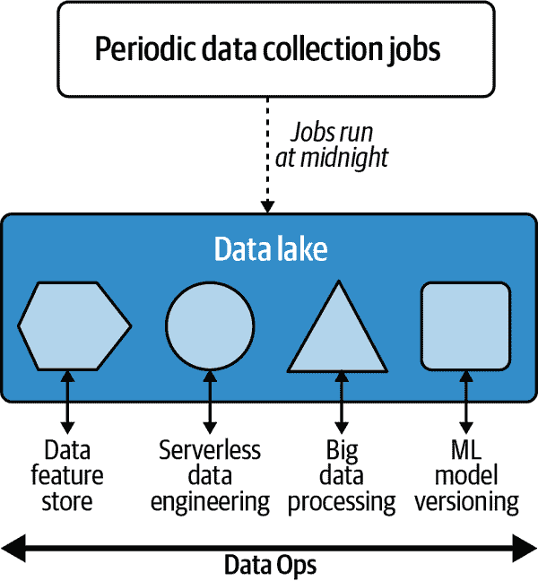
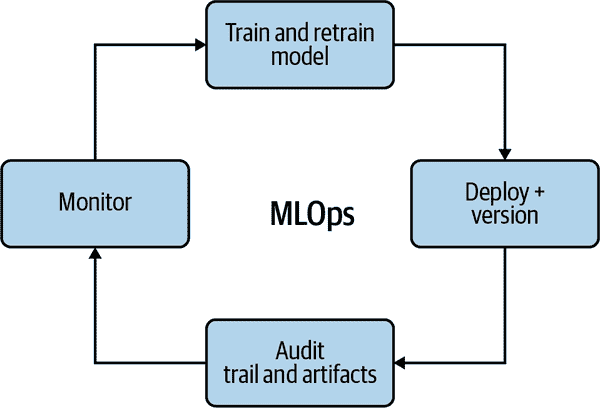
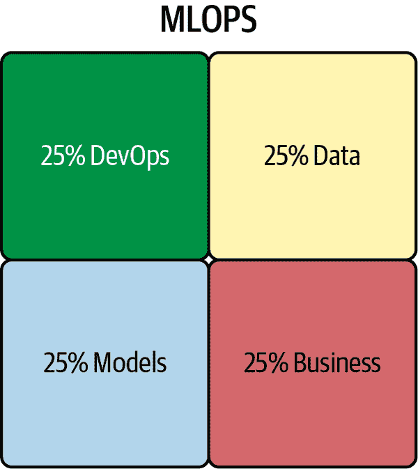

# 第一章：介绍 MLOps

By Noah Gift

> 自 1986 年以来，我经历了更多的死亡，其中一些是由于注意力不足，但主要是因为故意在各个方向上推限度，冒险盆景有点像冒险恋爱；最好的结果需要冒险接触受伤并且没有成功的保证。
> 
> Dr. Joseph Bogen

科幻小说的一个强大之处在于它能够想象一个没有约束的未来。有史以来最具影响力的科幻节目之一是 60 年前左右首次播出的电视剧*星际迷航*。这种文化影响激发了像 Palm Pilot 和手持式手机的技术设计者。此外，*星际迷航*还影响了苹果计算机的联合创始人史蒂夫·沃兹尼亚克，促使他创建了苹果计算机。

在这个机器学习创新时代，原始系列中的许多重要思想与即将到来的 MLOps（或机器学习运营）工业革命相关。例如，*星际迷航*手持三角仪可以使用预训练的多类别分类模型即时对物体进行分类。但最终，在这个未来的科幻世界中，像科学官员、医疗官员或者飞船船长这样的领域专家们，并不花几个月时间来训练机器学习模型。同样，他们的科学船员，*企业号*的船员，也不被称为数据科学家。相反，他们的工作经常涉及使用数据科学。

在 2020 年代，*星际迷航*科幻未来的许多机器学习方面已不再是科幻。本章引导读者进入使这一切成为可能的基础理论。让我们开始吧。

# 机器学习工程师和 MLOps 的兴起

机器学习（ML）以其在全球范围内的广泛应用，引发了对构建 ML 系统的系统化和高效方法的需求，从而导致对 ML 工程师的需求迅速增长。这些 ML 工程师又将已建立的 DevOps 最佳实践应用于新兴的机器学习技术。主要的云供应商都有针对这些从业者的认证。我在 AWS、Azure 和 GCP 作为机器学习的专家与之直接合作的经验。在某些情况下，这包括帮助创建机器学习认证和官方培训材料。此外，我在杜克大学和西北大学的一些顶尖数据科学项目中教授机器学习工程和云计算。亲身经历中，我看到了机器学习工程师的兴起，许多以前的学生成为了机器学习工程师。

Google 有一个 [专业机器学习工程师认证](https://oreil.ly/83skz)。它描述 ML 工程师是“设计、构建和将 ML 模型投入生产以解决业务挑战的人…” Azure 有一个 [Microsoft Certified: Azure 数据科学家关联](https://oreil.ly/mtczl)。它描述这种从业者是“应用他们在数据科学和机器学习方面的知识来实现和运行机器学习工作负载的人…” 最后，AWS 描述了一个 [AWS Certified 机器学习专家](https://oreil.ly/O0cLK)。他们具备“设计、实施、部署和维护解决特定业务问题的机器学习解决方案的能力。”

一种看待数据科学与机器学习工程的方式是考虑科学与工程本身的区别。科学倾向于研究，而工程则倾向于生产。随着机器学习超越仅仅是研究的一面，公司迫切希望在围绕 AI 和 ML 的雇佣中获得投资回报。根据 payscale.com 和 glassdoor.com 的数据，2020 年底，数据科学家、数据工程师和机器学习工程师的中位薪资相似。根据 LinkedIn 在 2020 年第四季度的数据显示，191K 个工作提及云计算，有 70K 个数据工程工作列表，55K 个机器学习工程工作列表和 20K 个数据科学工作列表，如图 Figure 1-1 所示。

另一种看待这些工作趋势的方式是它们是技术炒作周期的自然组成部分。组织意识到，要产生投资回报（ROI），他们需要具备硬技能的员工：云计算、数据工程和机器学习。他们还需要比数据科学家更多。因此，2020 年代可能会显示出将数据科学视为一种行为而非职称的加速趋势。DevOps 是一种行为，就像数据科学一样。考虑到 DevOps 和数据科学的原则。在这两种情况下，DevOps 和数据科学都是评估世界的方法论，不一定是唯一的职称。


###### 图 1-1\. 机器学习工作

让我们来看一下组织中机器学习工程倡议的成功衡量选项。首先，您可以统计进入生产的机器学习模型数量。其次，您可以衡量 ML 模型对业务 ROI 的影响。这些指标汇总为模型的运行效率。维护它所需的成本、正常运行时间和人员是预测机器学习工程项目成功或失败的信号。

先进技术组织知道他们需要利用能降低机器学习项目失败风险的方法和工具。那么，机器学习工程中使用的这些工具和流程是什么呢？以下是部分列表：

云原生 ML 平台

AWS SageMaker，Azure ML Studio 和 GCP AI Platform

容器化工作流

Docker 格式容器、Kubernetes 和私有以及公共容器注册表

无服务器技术

AWS Lambda, AWS Athena, Google Cloud Functions, Azure Functions

用于机器学习的专用硬件

GPU、Google TPU（TensorFlow 处理单元）、Apple A14、AWS Inferentia 弹性推断

大数据平台和工具

Databricks、Hadoop/Spark、Snowflake、Amazon EMR（弹性 Map Reduce）、Google Big Query

有关机器学习的一个明显模式是它与云计算的紧密联系。这是因为机器学习的原始成分需要大量计算、广泛的数据和专门的硬件。因此，与云平台的深度集成具有自然的协同效应，与机器学习工程相结合。进一步支持这一点的是，云平台正在构建专门的平台来增强机器学习的操作能力。因此，如果您从事机器学习工程，您很可能是在云中进行。接下来，让我们讨论 DevOps 在其中的作用。

# 什么是 MLOps？

为什么机器学习不是快 10 倍？大多数构建机器学习系统的问题涉及机器学习建模周围的一切：数据工程、数据处理、问题可行性和业务对齐。其中一个问题是过于关注“代码”和技术细节，而不是用机器学习解决业务问题。还存在自动化不足和最高薪水者的观点（HiPPO）文化问题。最后，许多机器学习并非云原生，使用学术数据集和学术软件包，无法解决大规模问题。

反馈循环越快（见 Kaizen），就越有时间专注于像快速检测 Covid 最新问题，检测现实世界中的口罩与非口罩计算机视觉解决方案以及更快的药物发现等业务问题。这些问题存在解决技术，但这些解决方案为何在现实世界中无法使用？为什么呢？

###### 注意

什么是 Kaizen？在日语中，它意味着改善。Kaizen 作为一种软件管理哲学起源于二战后的日本汽车工业。它支撑许多其他技术：看板、根本原因分析和五个为什么、以及六西格玛。要实践 Kaizen，需要对世界状态进行准确而现实的评估，并追求卓越的日常、渐进改进。

模型没有进入生产的原因促使 MLOps 作为关键的行业标准出现。MLOps 与 DevOps 有着相同的历史渊源，因为 DevOps 在哲学上要求自动化。一个常见的说法是*如果不自动化，就是有问题的*。同样，在 MLOps 中，系统中不应该有人为杠杆的组件。自动化的历史表明，人类在重复任务中的价值最低，但在利用技术作为架构师和实践者时最有价值。同样地，开发者、模型和运维之间的协调必须通过透明的团队合作和健康的协作来实现。把 MLOps 看作是使用 DevOps 方法自动化机器学习的过程。

###### 注意

什么是 DevOps？它结合了包括微服务、持续集成和持续交付在内的最佳实践，消除了运维与开发之间以及团队之间的障碍。你可以在我们的书籍 [*Python for DevOps*](https://learning.oreilly.com/library/view/python-for-devops/9781492057680/)（O’Reilly）中详细了解 DevOps。Python 是脚本、DevOps 和机器学习的主要语言。因此，这本 MLOps 书籍着重于 Python，就像 DevOps 书籍着重于 Python 一样。

对于 MLOps 来说，不仅需要对软件工程过程进行全面自动化，还需要对数据和建模进行自动化。模型训练和部署是传统 DevOps 生命周期中新增的问题。最后，额外的监控和仪表必须考虑到可能出现故障的新因素，例如数据漂移——即数据自上次模型训练以来的变化量。

将机器学习模型投入生产的一个基本问题是数据科学行业的不成熟。软件行业已经采用 DevOps 来解决类似的问题；现在，机器学习社区也在推广 MLOps。让我们深入了解如何做到这一点。

# DevOps 和 MLOps

DevOps 是一组旨在提高组织发布高质量软件速度的技术和管理实践。DevOps 的一些好处包括速度、可靠性、规模和安全性。这些好处通过遵循以下最佳实践实现：

持续集成（CI）

CI 是持续测试软件项目并基于这些测试结果改进质量的过程。它是使用开源和 SaaS 构建服务器（如 GitHub Actions、Jenkins、GitLab、CircleCI 或云原生构建系统如 AWS Code Build）进行自动化测试。

持续交付（CD）

这种方法在没有人为干预的情况下将代码交付到新环境。CD 是通过基础设施即代码自动部署代码的过程。

微服务

微服务是具有独特功能且几乎没有依赖性的软件服务。最流行的基于 Python 的微服务框架之一是 Flask。例如，机器学习预测端点非常适合作为微服务。这些微服务可以使用各种技术，包括 FaaS（函数即服务）。云函数的一个完美示例是 AWS Lambda。微服务可以准备好容器，并使用 CaaS（容器即服务）将具有 Dockerfile 的 Flask 应用程序部署到 AWS Fargate、Google Cloud Run 或 Azure 应用服务。

基础设施即代码

基础设施即代码（IaC）是将基础设施检入源代码存储库并“部署”到该存储库以推送更改的过程。IaC 允许幂等行为，并确保基础设施不需要人类来构建它。在代码中定义的云环境并检入源代码存储库是一个很好的示例用例。流行的技术包括云特定的 IaC，如 AWS Cloud Formation 或 [AWS SAM（无服务器应用程序模型）](https://oreil.ly/4Q3XE)。多云选项包括 [Pulumi](https://pulumi.com) 和 [Terraform](https://terraform.io)。

监控与仪表

监控与仪表是用于允许组织对软件系统的性能和可靠性做出决策的过程和技术。通过记录和其他工具，如 New Relic、Data Dog 或 Stackdriver 等应用程序性能监控工具，监控和仪表本质上是收集有关生产或数据科学中部署的软件系统的应用行为的数据。这个过程是 Kaizen 起作用的地方；数据驱动的组织使用这些仪表来每天或每周使事情变得更好。

有效的技术沟通

这种技能涉及创建有效、可重复和高效的沟通方法的能力。一个很好的有效技术沟通的例子可以是采用自动机器学习（AutoML）来进行系统的初步原型设计。当然，最终，AutoML 模型可能会被保留或丢弃。然而，自动化可以作为一个信息工具，以防止在一个棘手的问题上工作。

有效的技术项目管理

这个过程可以有效地利用人类和技术解决方案，如票务系统和电子表格，来管理项目。此外，适当的技术项目管理需要将问题分解为小的、离散的工作块，以便进行增量进展。在机器学习中的反模式通常是团队致力于解决问题“完美”的一个生产机器模型。相反，每天或每周交付较小的成功案例是建立模型的更可扩展和谨慎的方法。

持续集成和持续交付是 DevOps 的两个最关键支柱之一。持续集成涉及将代码合并到源代码控制库中，并通过测试自动检查代码质量。持续交付是指代码更改在自动测试后自动部署到预备环境或生产环境。这两种技术都是持续改进精神下的自动化形式。

一个好问题是，团队中谁应该实施 CI/CD？这个问题类似于在民主国家中谁负责纳税。在民主国家，税款用于修建道路、桥梁、执法、紧急服务、学校及其他基础设施，所以所有人都必须为建设更好的社会贡献力量。同样，所有 MLOps 团队成员都应该帮助开发和维护 CI/CD 系统。一个良好维护的 CI/CD 系统是对团队和公司未来的一种投资。

ML 系统同样也是一个软件系统，但它包含一个独特的组件：机器学习模型。DevOps 的同样好处可以适用于 ML 系统。自动化的采纳是为什么新的方法如数据版本控制和自动机器学习在捕捉 DevOps 思维方式方面充满了许多希望。

# MLOps 需求层次

一种思考机器学习系统的方法是考虑马斯洛的需求层次理论，如图 1-2 所示。金字塔的底层反映了“生存”，而真正的人类潜力在满足基本生存和情感需求后才会显现。


###### 图 1-2\. 马斯洛需求层次理论

这个概念同样适用于机器学习。一个 ML 系统是一个软件系统，而当 DevOps 和数据工程的最佳实践到位时，软件系统才能高效可靠地运行。因此，如果没有 DevOps 的基本基础规则或者数据工程没有完全自动化，那么如何将机器学习的真正潜力带给一个组织呢？图 1-3 中展示的 ML 需求层次不是一个确定的指南，但却是开始讨论的绝佳起点。


###### 图 1-3\. ML 工程需求层次

阻碍机器学习项目的主要因素之一是 DevOps 的这种必要基础。在这个基础建立完成后，接下来是数据自动化，然后是平台自动化，最后才是真正的 ML 自动化或者 MLOps。MLOps 的顶峰是一个能够运行的机器学习系统。负责运营和构建机器学习应用的人是机器学习工程师和/或数据工程师。让我们深入探讨 ML 需求层次的每一步，并确保您能够牢固地实施它们，从 DevOps 开始。

## 实施 DevOps

DevOps 的基础是持续集成。没有自动化测试，DevOps 无法前进。对于现代工具可用的 Python 项目来说，持续集成相对来说不太痛苦。第一步是为 Python 项目建立一个“脚手架”，如 图 1-4 所示。


###### 图 1-4\. Python 项目脚手架

Python 机器学习项目的运行时几乎可以保证在 Linux 操作系统上。因此，以下是为 ML 项目实现简单的 Python 项目结构。你可以访问 GitHub 上的这个例子的源代码 [链接](https://oreil.ly/4dei0) 作为阅读本节内容的参考。这些组件如下：

Makefile

*Makefile* 通过 `make` 系统运行“recipes”，这是 Unix 操作系统自带的。因此，Makefile 是简化连续集成步骤的理想选择，例如以下内容。请注意，Makefile 是项目的良好起点，通常会随着需要自动化的新组件而发展。

###### 注意

如果你的项目使用 Python 虚拟环境，在使用 Makefile 之前需要激活它，因为 Makefile 只是运行命令。对于 Python 的新手来说，将 Makefile 与虚拟环境混淆是一个常见的错误。同样，如果你使用像 Microsoft Visual Studio Code 这样的编辑器，你需要告诉编辑器你的 Python 虚拟环境，以便它可以准确地提供语法高亮、linting 和其他可用库。

执行安装

这一步通过 `make install` 命令安装软件

执行 lint

这一步通过 `make lint` 命令检查语法错误

执行测试

这一步通过 `make test` 命令运行测试：

```
install:
	pip install --upgrade pip &&\
		pip install -r requirements.txt
lint:
	pylint --disable=R,C hello.py

test:
	python -m pytest -vv --cov=hello test_hello.py
```

*requirements.txt*

*requirements.txt* 文件是 `pip` 安装工具的一种约定，这是 Python 的默认安装工具。如果需要在不同的环境中安装不同的包，一个项目可以包含一个或多个这样的文件。

源代码和测试

Python 脚手架的最后一部分是添加一个源代码文件和一个测试文件，如下所示。这个脚本存在于一个名为 *hello.py* 的文件中：

```
def add(x, y):
    """This is an add function"""

    return x + y

print(add(1, 1))
```

接下来，通过 `pytest` 框架创建测试文件非常简单。这个脚本会在一个名为 *test_hello.py* 的文件中，与 *hello.py* 放在同一个文件夹中，这样 `from hello import add` 就可以工作：

```
from hello import add

def test_add():
    assert 2 == add(1, 1)
```

这四个文件：*Makefile*、*requirements.txt*、*hello.py* 和 *test_hello.py* 就足以启动连续集成之旅，除了创建本地 Python 虚拟环境外。要做到这一点，首先创建它：

```
python3 -m venv ~/.your-repo-name
```

另外，需要注意一般有两种方法创建虚拟环境。首先，许多 Linux 发行版将包含命令行工具 `virtualenv`，它与 `python3 -m venv` 的功能相同。

接下来，需要激活它来“激活”它：

```
source ~/.your-repo-name/bin/activate
```

###### 注意

为什么要创建和使用 Python 虚拟环境？对于 Python 新手来说，这个问题无处不在，但答案很简单。因为 Python 是一种解释型语言，它可以从操作系统的任何地方“获取”库。Python 虚拟环境将第三方包隔离到一个特定的目录中。还有其他解决此问题的方案和许多开发工具。它们有效地解决了同样的问题：Python 库和解释器被隔离到特定的项目中。

一旦设置了这个框架，你可以在本地执行以下持续集成步骤：

1.  使用 `make install` 安装你项目所需的库。

    输出将类似于 图 1-5（此示例显示在 [GitHub Codespaces](https://oreil.ly/xmqlm) 中运行）。

    ```
    $ make install
    pip install --upgrade pip &&\
            pip install -r requirements.txt
    Collecting pip
      Using cached pip-20.2.4-py2.py3-none-any.whl (1.5 MB)
    [.....more output suppressed here......]
    ```

    

    ###### 图 1-5\. GitHub Codespaces

1.  运行 `make lint` 来对你的项目进行代码风格检查：

    ```
    $ make lint
    pylint --disable=R,C hello.py

    ------------------------------------
    Your code has been rated at 10.00/10
    ```

1.  运行 `make test` 来测试你的项目：

    ```
    $ make test
    python -m pytest -vv --cov=hello test_hello.py
    ===== test session starts ====
    platform linux -- Python 3.8.3, pytest-6.1.2,\
    /home/codespace/.venv/bin/python
    cachedir: .pytest_cache
    rootdir: /home/codespace/workspace/github-actions-demo
    plugins: cov-2.10.1
    collected 1 item

    test_hello.py::test_add PASSED                                                                                                 [100%]

    ----------- coverage: platform linux, python 3.8.3-final-0 -----------
    Name       Stmts   Miss  Cover
    ------------------------------
    hello.py       3      0   100%
    ```

一旦在本地工作正常，将这个相同的过程集成到远程 SaaS 构建服务器中就很简单了。选项包括 GitHub Actions、像 AWS Code Build 这样的云原生构建服务器、GCP CloudBuild、Azure DevOps Pipelines，或者像 Jenkins 这样的开源、自托管构建服务器。

## 使用 GitHub Actions 配置持续集成

对于这个 Python 框架项目实施持续集成最简单的方法之一是使用 GitHub Actions。要做到这一点，你可以在 GitHub UI 中选择“Actions”并创建一个新的操作，或者在你创建的这些目录中创建一个文件，如下所示：

```
.github/workflows/<yourfilename>.yml
```

GitHub Actions 文件本身很容易创建，以下是一个示例。注意，Python 的确切版本设置为项目所需的任何解释。在此示例中，我想检查在 Azure 上运行的特定版本的 Python。由于之前创建 Makefile 的辛勤工作，持续集成步骤实施起来非常简单：

```
name: Azure Python 3.5
on: [push]
jobs:
  build:
    runs-on: ubuntu-latest
    steps:
    - uses: actions/checkout@v2
    - name: Set up Python 3.5.10
      uses: actions/setup-python@v1
      with:
        python-version: 3.5.10
    - name: Install dependencies
      run: |
        make install
    - name: Lint
      run: |
        make lint
    - name: Test
      run: |
        make test
```

从 GitHub 仓库的“push”事件运行时，GitHub Actions 的概览如 图 1-6 所示。


###### 图 1-6\. GitHub Actions

这一步完成了设置持续集成的最后部分。接下来的逻辑步骤是持续部署，即将机器学习项目自动推送到生产环境。这一步涉及使用持续交付流程和 IaC（基础设施即代码）将代码部署到特定位置。此过程如 图 1-7 所示。


###### 图 1-7\. 持续交付

## DataOps 和数据工程

在 ML 需求层次结构中的下一步是自动化数据流。例如，想象一个只有井作为唯一水源的城镇。由于需要为水安排旅行，日常生活变得复杂，而我们认为理所当然的事情可能无法正常工作，比如按需热水淋浴、按需洗碗或自动灌溉。类似地，一个没有数据自动流的组织无法可靠地进行 MLOps。

许多商业工具正在演变成 DataOps。一个例子包括由 Airbnb 设计，后来开源的[Apache Airflow](https://oreil.ly/p55kD)，用于调度和监控其数据处理作业。AWS 工具包括 AWS 数据管道和 AWS Glue。AWS Glue 是一个无服务器的 ETL（抽取、加载、转换）工具，它检测数据源的架构，然后存储数据源的元数据。其他工具如 AWS Athena 和 AWS QuickSight 可以查询和可视化数据。

在这里需要考虑的一些问题是数据的大小，信息更改的频率以及数据的清洁程度。许多组织使用集中式数据湖作为围绕数据工程的所有活动的中心枢纽。数据湖之所以有助于建立围绕其周围的自动化，包括机器学习，是因为它在 I/O 方面提供了“接近无限”的规模，并具有高耐用性和可用性。

###### 注意

数据湖通常与云对象存储系统（例如 Amazon S3）等同。数据湖允许在原地进行数据处理，无需移动数据。数据湖通过接近无限的容量和计算特性实现此目标。

当我在电影行业工作时，比如[*Avatar*](https://oreil.ly/MSh29)，数据是巨大的；确实需要通过一个非常复杂的系统进行移动。现在有了云，这个问题解决了。

图 1-8 展示了基于云数据湖的工作流程。请注意，在同一位置执行许多任务的能力，无需移动数据。

专门的职称，比如数据工程师，可以全天候建造处理这些多样化用例的系统：

+   定期收集数据和运行作业

+   处理流数据

+   无服务器和事件驱动数据

+   大数据作业

+   用于 ML 工程任务的数据和模型版本控制



###### 图 1-8。云数据湖的数据工程

就像一个没有自来水的村庄不能使用自动洗碗机一样，一个没有数据自动化的组织也不能使用先进的机器学习方法。因此，数据处理需要自动化和运营化。这一步骤使得更下游的 ML 任务能够实现运营化和自动化。

## 平台自动化

一旦数据自动流动起来，评估组织如何利用高级平台构建机器学习解决方案就成为清单上的下一个项目。例如，如果组织已将数据收集到云平台的数据湖中，如 Amazon S3，将机器学习工作流程与 Amazon Sagemaker 结合是很自然的选择。同样，如果组织使用 Google，它可以使用 Google AI 平台或 Azure 来使用 Azure Machine Learning Studio。类似地，对于使用 Kubernetes 而不是公共云的组织，[Kubeflow](https://kubeflow.org)将是合适的选择。

解决这些问题的一个优秀平台示例见图 1-9。请注意，AWS SageMaker 为真实的机器学习问题编排了复杂的 MLOps 序列，包括启动虚拟机、读写 S3 以及配置生产终端点。在生产场景中，执行这些基础设施步骤而不进行自动化至少是愚蠢的。


###### 图 1-9\. Sagemaker MLOps 管道

一个 ML 平台解决了真实世界中可重复性、规模化和操作化问题。

## MLOps

假设所有其他层次（DevOps、数据自动化和平台自动化）都已完成，MLOps 就可能实现。请记住，使用 DevOps 方法自动化机器学习的过程称为 MLOps。构建机器学习的方法是机器学习工程。

因此，MLOps 是一种行为，就像 DevOps 是一种行为一样。虽然有些人作为 DevOps 工程师工作，但软件工程师更频繁地使用 DevOps 最佳实践执行任务。同样，机器学习工程师应使用 MLOps 最佳实践创建机器学习系统。

### DevOps 和 MLOps 结合的最佳实践？

还记得本章前面描述的 DevOps 实践吗？MLOps 基于这些实践，并将特定项目扩展到直接针对机器学习系统。

表达这些最佳实践的一种方式是考虑它们通过创建可复制的模型，具有强大的模型打包、验证和部署来增强解释和观察模型性能的能力。图 1-10 更详细展示了这一点。



###### 图 1-10\. MLOps 反馈循环

反馈循环包括以下内容：

使用可重用的 ML 管道创建和重新训练模型

仅仅创建一次模型是不够的。数据可能会发生变化，客户可能会发生变化，制定模型的人可能会发生变化。解决方案是使用版本化的可重用 ML 管道。

ML 模型的持续交付

ML 模型的持续交付类似于软件的持续交付。当所有步骤都包括基础设施在内自动化，使用 IaC 时，模型可以随时部署到新环境，包括生产环境。

MLOps 管道的审计跟踪

对于机器学习模型进行审计至关重要。机器学习中存在许多问题，包括安全性、偏见和准确性。因此，拥有一个有用的审计追踪系统是无价的，就像在生产软件工程项目中拥有足够的日志记录一样关键。此外，审计追踪系统是反馈循环的一部分，您可以不断改进解决问题和实际问题的方法。

观察模型数据漂移的使用以改进未来的模型

机器学习的一个独特方面是数据可以在模型下方实际“转移”。因此，两年前适用于客户的模型今天很可能不会起同样的作用。通过监控数据漂移，即从上次进行模型训练以来的变化量，可以在引起生产问题之前防止准确性问题。

# 结论

本章讨论了在机器学习背景下使用 DevOps 原则的重要性。除了软件本身外，机器学习还增加了管理数据和模型的新复杂性。解决这种复杂性的方法是像软件工程社区在 DevOps 中所做的那样接受自动化。

建造书架与种植树木不同。书架需要初步设计，然后一次性建造。涉及机器学习的复杂软件系统更像是种植树木。一个成功生长的树木需要多个动态输入，包括土壤、水、风和阳光。

同样，理解 MLOps 的一种方法是 25%法则。在图 1-13 中，软件工程、数据工程、建模和业务问题同样重要。MLOps 的跨学科特性使其难以处理。然而，有许多公司在遵循这个 25%法则的 MLOps 方面有很好的例子。



###### 图 1-13。25%法则

特斯拉汽车是一个很好的例子；它们通过半自动驾驶汽车形式提供客户所需的功能。它们还在软件工程实践中做了很好的更新。同时，汽车系统还不断训练模型，以根据接收到的新数据进行改进。符合 25%法则的产品的另一个例子是亚马逊的 Alexa 设备。

下一章将讨论 MLOps 所需的基础技能。这些包括程序员的数学、数据科学项目示例以及完整的端到端 MLOps 流程。通过在本章末推荐的练习，您将使自己处于吸收后续内容的绝佳位置。

# 练习

+   使用`Makefile`创建一个新的 GitHub 存储库，并生成必要的 Python 支架结构，包括 linting 和测试。然后，在您的 Makefile 中执行额外的步骤，如代码格式化。

+   使用[GitHub Actions](https://oreil.ly/csmNI)来测试一个 GitHub 项目，使用两个或更多 Python 版本。

+   使用云原生构建服务器（如 AWS Code Build、GCP CloudBuild 或 Azure DevOps Pipelines），为您的项目执行持续集成。

+   通过集成 Dockerfile 将 GitHub 项目容器化，并自动将新容器注册到容器注册表。

+   使用负载测试框架如[locust](https://locust.io)或[loader io](https://loader.io)为您的应用程序创建一个简单的负载测试，并在将更改推送到预备分支时自动运行此测试。

# 批判性思维讨论问题

+   连续集成（CI）系统解决了哪些问题？

+   为什么 CI 系统是 SaaS 软件产品和 ML 系统的重要组成部分？

+   为什么云平台是分析应用程序的理想目标？数据工程和 DataOps 如何帮助构建基于云的分析应用程序？

+   深度学习如何从云计算中受益？深度学习在没有云计算的情况下可行吗？

+   解释 MLOps 是什么以及它如何增强机器学习工程项目。
