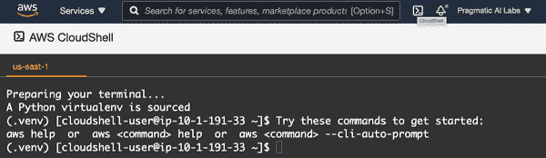
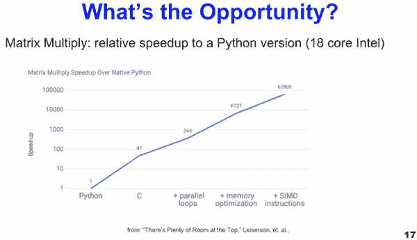
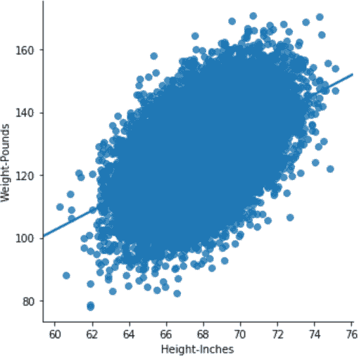

# 第二章：MLOps 基础

作者：诺亚·吉夫

> 医学院是一次悲惨的经历，是一长串事实，其起源很少被解释，其有用性很少被证明。我对死记硬背的厌恶和质疑态度并不被 96 名学生中的大多数人所分享。在一次生物化学讲师声称正在推导涅恩斯特方程时，这一点尤为明显。班上的学生们忠实地抄写他在黑板上写的东西。一年前，我在加州大学洛杉矶分校为化学专业的 Pchem 课程只上了一年，我以为他在吹牛。
> 
> “你从哪里得到那个 k 值的？”我问道。
> 
> 班上的学生们把我打住了：“让他结束！只是复制它。”
> 
> 约瑟夫·博根博士

有一个坚实的基础是任何技术努力的关键。在本章中，几个关键的基础模块为本书的其余部分奠定了基础。在与新接触数据科学和机器学习的学生打交道时，我经常遇到关于本章涵盖内容的误解。本章旨在为使用 MLOps 方法学建立坚实的基础。

# Bash 和 Linux 命令行

大多数机器学习都发生在云端，大多数云平台假定您会在某种程度上与终端进行交互。因此，了解 Linux 命令行的基础知识对于执行 MLOps 至关重要。本节旨在为您提供足够的知识，以确保您在进行 MLOps 时取得成功。

当我让学生接触终端时，他们常常震惊且恐惧。在大多数现代计算领域，由于像 MacOS 操作系统或 Windows 这样的 GUI 界面的强大功能，初始反应是合理的。然而，更好的方法是把终端看作是你正在工作的环境的“高级设置”：云端、机器学习或编程。如果需要进行高级任务，这就是执行它们的方式。因此，掌握 Linux 终端的能力可以极大地增强任何技能集。此外，在大多数情况下，开发云 shell 环境是一个更好的主意，这需要熟悉 Bash 和 Linux。

大多数服务器现在运行 Linux；许多新的部署选项使用容器，这些容器也运行 Linux。MacOS 操作系统的终端与 Linux 非常接近，特别是如果您安装了像[Homebrew](https://brew.sh)这样的第三方工具。您应该了解 Bash 终端，本节将为您提供足够的知识，以使您能够胜任它。

终端学习的关键和最小组件是什么？这些组件包括使用基于云的 shell 开发环境、Bash shell 和命令、文件和导航、输入/输出、配置和编写脚本。所以让我们深入研究每一个主题。

# 云端 shell 开发环境

无论你是刚接触云计算还是有数十年经验，从个人工作站转向基于 Web 的云 Shell 开发环境都是值得的。一个很好的类比是想每天在海滩冲浪的冲浪者。理论上，他们可以每天往返 50 英里去海滩，但这样做会非常不方便、低效和昂贵。如果可能的话，更好的策略是住在海滩上，每天早上起床，走到海滩上冲浪。

同样，云开发环境解决了多个问题：它更安全，因为您无需传递开发人员密钥。许多问题在本地机器上难以解决，因为您可能需要频繁地在本地机器和云之间传输大量数据。云开发环境提供的工具包括深度集成，这使工作更高效。与搬到海滩不同，云开发环境是免费的。所有主要云服务提供商都在免费层上提供其云开发环境。如果您对这些环境不熟悉，我建议从 AWS Cloud 平台开始。在 AWS 上开始的两个选项。第一个选项是 AWS CloudShell，如图 2-1 所示。

AWS CloudShell 是一个带有独特 AWS 命令完成功能的 Bash Shell。如果您经常使用 AWS CloudShell，建议编辑`~/.bashrc`以自定义您的体验。为此，您可以使用内置的`vim`编辑器。许多人推迟学习`vim`，但在云 Shell 时代，他们必须精通它。您可以参考[官方 vim FAQ](https://oreil.ly/wNXdm)了解如何完成任务。



###### 图 2-1\. AWS CloudShell

AWS 的第二个选项是 AWS Cloud9 开发环境。AWS CloudShell 和 AWS Cloud9 环境之间的一个关键区别是它是开发软件解决方案的更全面的方式。例如，您可以在图 2-2 中看到一个 Shell 和一个 GUI 编辑器，用于多种语言的语法高亮，包括 Python、Go 和 Node。


###### 图 2-2\. AWS Cloud9 开发环境

特别是在开发机器学习微服务时，Cloud9 环境非常理想，因为它允许您从控制台向部署的服务发起 Web 请求，并与 AWS Lambda 深度集成。另一方面，如果您使用其他平台，如 Microsoft Azure 或 Google Cloud，同样的概念适用，即基于云的开发环境是构建机器学习服务的理想场所。

###### Note

我创建了一个名为“云计算的 Bash 基础知识”的可选视频资源，可以带您了解基础知识。您可以在[O’Reilly 平台](https://oreil.ly/jEWr2)或[Pragmatic AI Labs YouTube 频道](https://oreil.ly/shtb9)上观看。

# Bash Shell 和 Commands

Shell 是一个交互式环境，包含一个提示符和运行命令的能力。大多数 shell 今天运行的是 Bash 或 ZSH。

在你通常用于开发的环境中，有几件立即有价值的事情是安装 ZSH 和`vim`配置。对于`vim`，一个推荐的设置是[awesome vim](https://oreil.ly/HChFQ)，而对于 ZSH，则有[ohmyzsh](https://ohmyz.sh)。

什么是“shell”？最终它是一个像 MacOS Finder 一样控制计算机的用户界面。作为 MLOps 从业者，了解如何使用最强大的用户界面——命令行对于处理数据的人来说是值得的。以下是你可以做的一些事情。

## 列出文件

使用 shell，你可以通过`ls`命令列出文件。标志`-l`添加额外的列表信息：

```
bash-3.2$ ls -l
total 11
drwxrwxr-x 130 root admin 4160 Jan 20 22:00 Applications
drwxr-xr-x  75 root wheel 2400 Dec 14 23:13 Library
drwxr-xr-x@  9 root wheel  288 Jan 1 2020 System
drwxr-xr-x  6 root admin  192 Jan 1 2020 Users
```

## 运行命令

在 GUI 中，你点击一个按钮或打开一个应用程序来工作。在 shell 中，你运行一个命令。在 shell 中有许多有用的内置命令，它们通常可以很好地配合使用。例如，找出 shell 可执行文件的位置的一个绝佳方法是使用`which`。这里是一个示例：

```
bash-3.2$ which ls
/bin/ls
```

注意，`ls`命令在*/bin*目录中。这个“提示”表明我可以在这个目录中找到其他可执行文件。这里是*/bin/*中可执行文件的计数（管道操作符`|`稍后将会解释，但简言之，它接受来自另一个命令的输入）：

```
bash-3.2$ ls -l /bin/ | wc -l
37
```

## 文件和导航

在 GUI 中，你打开一个文件夹或文件；在 shell 中，你使用命令来完成相同的事情。

`pwd`显示了你所在位置的完整路径：

```
bash-3.2$ pwd
/Users/noahgift
```

`cd`切换到一个新目录：

```
bash-3.2$ cd /tmp
```

## 输入/输出

在前面的示例中，`ls`的输出重定向到另一个命令。管道是输入和输出操作的一个示例，用于完成更复杂的任务。通常使用 shell 将一个命令的输出传递到另一个命令中。

这里有一个示例，显示了一个具有重定向和管道的工作流程。首先，单词“foo bar baz”被重定向到一个名为*out.txt*的文件。接下来，这个文件的内容通过`cat`打印出来，然后它们被管道到命令`wc`中，它可以通过`-w`计算单词数或通过`-c`计算字符数：

```
bash-3.2$ cd /tmp
bash-3.2$ echo "foo bar baz" > out.txt
bash-3.2$ cat out.txt | wc -c
   12
bash-3.2$ cat out.txt | wc -w
    3
```

这里有另一个示例，将`shuf`命令的输出定向到一个新文件。你可以从我的[GitHub 仓库](https://oreil.ly/CDudc)下载该文件。`shuf`可执行文件可以在限制行数的情况下对文件进行“洗牌”。在这种情况下，它获取一个接近 1GB 的文件，并且获取其前 10 万行，然后使用`>`运算符输出一个新文件。

```
bash-3.2$ time shuf -n 100000 en.openfoodfacts.org.products.tsv >\
10k.sample.en.openfoodfacts.org.products.tsv
1.89s user 0.80s system 97% cpu 2.748 total
```

使用像这样的 shell 技术可以在处理笔记本电脑上太大而无法处理数据科学库的 CSV 文件时派上用场。

## 配置

Shell 配置文件（ZSH 和 Bash）存储的设置会在每次打开终端时调用。正如我之前提到的，推荐在基于云的开发环境中定制你的 Bash 环境。对于 ZSH 来说，一个绝佳的起点是*.zshrc*，而对于 Bash 来说，则是*.bashrc*。下面是我在 MacOS 笔记本上存储在*.zshrc*配置中的一个示例。首先是一个别名，允许我一键输入命令`flask-azure-ml`，`cd`到一个目录，并启动一个 Python 虚拟环境。第二部分是我导出 AWS 命令行工具变量的地方，这样我就能够进行 API 调用：

```
## Flask ML Azure
alias flask-azure-ml="/Users/noahgift/src/flask-ml-azure-serverless &&\
source ~/.flask-ml-azure/bin/activate"

## AWS CLI
export AWS_SECRET_ACCESS_KEY="<key>"
export AWS_ACCESS_KEY_ID="<key>"
export AWS_DEFAULT_REGION="us-east-1"
```

总结一下，我建议为你的笔记本和基于云的开发环境定制你的 shell 配置文件。这样的小投入在你构建自动化到常规工作流程中时会带来巨大的回报。

## 写一个脚本

想要写你的第一个 shell 脚本可能会有点令人望而却步。其语法比 Python 复杂得多，有一些奇怪的字符。幸运的是，在许多方面，它更容易上手。写 shell 脚本的最佳方式是将一个命令放入文件中，然后运行它。这里有一个很好的“hello world”脚本示例。

第一行被称为“shebang”行，告诉脚本使用 Bash。第二行是一个 Bash 命令，`echo`。Bash 脚本的好处在于你可以在其中粘贴任何你想要的命令。这一点使得即使对编程了解不多，也能轻松地实现小任务的自动化：

```
#!/usr/bin/env bash

echo "hello world"
```

接下来，你可以使用`chmod`命令设置可执行标志，使得这个脚本可以执行。最后，通过追加`./`来运行它：

```
bash-3.2$ chmod +x hello.sh
bash-3.2$ ./hello.sh
Hello World
```

Shell 的主要要点是你必须至少具备一些基本的技能来进行 MLOps。然而，入门是相对容易的，在你意识到之前，通过 shell 脚本的自动化和 Linux 命令行的使用，你可以显著改善你每天的工作。接下来，让我们开始概述云计算的基本要素。

# 云计算基础和构建模块

可以肯定地说，几乎所有形式的机器学习都在某种形式上需要云计算。云计算中的一个关键概念是接近无限的资源，正如[《云上之云：加州大学伯克利关于云计算的视角》](https://oreil.ly/Ug8kx)中所描述的那样。没有云计算，许多机器学习模型根本无法实现。例如，《无穷力量：微积分如何揭示宇宙的秘密》（Mariner Books）的作者斯蒂芬·斯特罗格茨（Stephen Strogatz）提到，“通过恰到好处地运用无穷大，微积分可以揭示宇宙的秘密。”几个世纪以来，像求解圆形的形状这样的具体问题，如果没有微积分处理无限大的数字是不可能的。云计算也是如此；在机器学习中，特别是模型的操作化方面，许多问题如果没有云计算是无法解决的。正如图 2-3 所示，云计算提供接近无限的计算和存储，且在数据不移动的情况下处理数据。


###### 图 2-3. 云计算利用接近无限的计算和数据资源

现在我们知道，利用计算机能力在不移动数据的情况下，通过像 AWS SageMaker 或 Azure ML Studio 这样的机器学习平台，使用接近无限的资源，是云计算的杀手级特性，这是无法在没有云计算的情况下复制的。伴随这一杀手级特性的是我所说的“自动化定律”。一旦公众开始讨论某个行业的自动化——如自动驾驶汽车、IT、工厂、机器学习——最终这种自动化都会发生。

这个概念并不意味着会有一只神奇的独角兽出现，撒上仙女们的魔尘，然后项目变得更加容易管理；而是人类集体很擅长发现趋势。例如，当我还是个十几岁的电视行业工作者时，只有“线性”编辑的概念。这种工作流程意味着你需要三种不同的磁带才能实现到一个黑屏的溶解效果——源磁带、编辑主磁带以及一个包含黑色素材的第三个磁带。

我记得人们曾经谈论过如何不断更换新磁带是多么繁重的工作，以及如果这种工作流程能够自动化将会多么美妙。后来，通过非线性编辑的引入，这确实变得完全自动化了。这项技术允许你存储材料的数字副本，并对镜头进行数字处理，而不是像线性磁带那样插入新材料。在 1990 年代初，这些非线性编辑系统的成本高达数十万美元。现在，我在成千上万的磁带存储容量足够的千元笔记本电脑上进行更复杂的编辑工作。

在 2000 年代初期，云计算也出现了同样的情景。我在许多公司工作时，它们都使用由维护团队运营的自己的数据中心。当云计算的最初组成部分出现时，许多人说，“我打赌将来公司可以在他们的笔记本电脑上控制整个数据中心。”许多专家数据中心技术人员对自己的工作会受到自动化影响的想法不屑一顾，然而，自动化法则再次发挥了作用。到 2020 年以及以后，大多数公司都使用某种形式的云计算，而新的工作涉及利用这种力量。

同样地，通过 AutoML 自动化机器学习是一个非平凡的进步，它能够更快地创建模型，具有更高的准确性和更好的可解释性。因此，数据科学行业的工作将发生变化，就像编辑和数据中心操作员的工作发生了变化。

###### **注意**

AutoML 是机器学习建模方面的自动化。AutoML 的一个简单直观的例子是一个执行线性回归的 Excel 电子表格。您告诉 Excel 要预测的列是哪一列，然后哪一列是特征。

更复杂的 AutoML 系统工作方式类似。您选择要预测的值，例如图像分类、数值趋势、分类文本分类或者聚类。然后 AutoML 软件系统执行许多数据科学家会执行的相同技术，包括超参数调整、算法选择和模型可解释性。

所有主要的云平台都集成了 AutoML 工具到 MLOps 平台中。因此，AutoML 是所有基于云的机器学习项目的选择，并且越来越成为它们的另一种生产力提升。

Tyler Cowen 是一位经济学家、作家，是彭博社的专栏作家，并且从小就参与竞技棋类比赛。在他的书《平均水平是如何被打败的》（Plume）中，Cowen 提到，象棋软件最终击败了人类，也证明了自动化法则的实施。然而，令人惊讶的是，在 Cowen 书的结尾处，专家人类与象棋软件一起击败了单独的象棋软件。最终，这个故事可能会在机器学习和数据科学领域发生。自动化可能会取代简单的机器学习任务，并使领域专家人类控制的 ML 自动化命令效果提高数倍。

# **开始使用云计算**

推荐开始使用云计算的方法是建立一个多云开发环境，如在[O'Reilly 视频课程：使用 Python 进行云计算](https://oreil.ly/MGZfz)中所示。这段视频是本节的绝佳伴侣，但不需要跟随。一个多云环境的基本结构显示，云壳是所有这些云共同拥有的东西，如在#Figure-2-4 中所示。

使用 GitHub 或类似服务的源代码控制存储库是最初所有三个云环境通信的中心位置。AWS、Azure 和 GCP 每个都有通过云 Shell 进行基于云的开发环境。在第一章中，一个必要的 Python 脚手架展示了开发可重复和可测试结构的优势。通过 GitHub Actions 的 CI/CD（持续集成/持续交付）流程确保 Python 代码运行良好且质量高。


###### 图 2-4\. 启动云计算

###### 注意

测试和审查 Python 代码是验证软件项目质量的过程。开发人员会在本地运行测试和审查来帮助保持软件质量的高水平。这个过程类似于当你想要清洁房间时打开的机器人吸尘器（robovac）。Robovac 是一个有用的助手，可以保持你的房间处于良好状态，而运行代码审查和测试则可以保持你的代码处于良好状态。

CI/CD 流水线在发布到另一个生产环境之前在外部环境中运行这些质量控制检查，以确保应用程序正常工作。这条流水线允许软件部署变得可重复和可靠，是现代软件工程的最佳实践——另一个这些软件工程最佳实践的名称是 DevOps。

如果你正在学习云计算，同时使用三大云服务商是熟悉云计算的一个好方法。这种跨云工作流有助于巩固知识。毕竟，事物的名称可能不同，但概念是相同的。如果你需要帮助理解某些术语，请参考附录 A。

接下来我们深入研究 Python，这是 DevOps、云计算、数据科学和机器学习的事实上语言。

# Python Crash Course

Python 占主导地位的一个关键原因是该语言是为开发者而非计算机进行优化的。像 C 或 C++ 这样的语言因为是“低级”的，所以具有出色的性能，但开发者在解决问题时必须付出更多努力。例如，C 程序员必须分配内存、声明类型并编译程序。而 Python 程序员则可以输入一些命令并运行它们，通常在 Python 中的代码量明显较少。

尽管如此，Python 的性能比 C、C#、Java 和 Go 慢得多。此外，Python 本身存在一些语言限制，包括缺乏真正的线程，缺乏 JIT（即时编译器），以及缺乏像 C# 或 F# 中的类型推断。然而，随着云计算的发展，语言性能不再限制很多问题。因此，可以说 Python 的性能之所以出现了偶然的好运，是因为两个原因：云计算和容器。使用云计算，设计完全分布式，基于 AWS Lambda 和 AWS SQS（简单队列服务）等技术进行构建。类似地，像 Kubernetes 这样的容器技术也在构建分布式系统方面发挥着重要作用，因此 Python 线程突然变得无关紧要。

###### 注意

AWS Lambda 是一种函数即服务（FaaS）技术，运行在 AWS 平台上。它被称为 FaaS，因为 AWS Lambda 函数可以仅仅是几行代码——确实是一个函数。这些函数可以附加到像云排队系统 Amazon SQS 或上传到 Amazon S3 对象存储的图像等事件上。

把云看作一个操作系统的一种方式是合理的。上世纪 80 年代中期，Sun Computer 使用了营销口号“网络即计算机”。这个口号在 1980 年可能为时过早，但在 2021 年却非常准确。例如，与其在单台机器上创建线程，你可以在云中生成行为类似操作系统的 AWS Lambda 函数，它拥有无限可扩展的资源。

在我参加的一次谷歌演讲中，退休的伯克利计算机科学教授兼 TPU（TensorFlow Processing Unit）的共同创造者 Dr. Patterson 提到，Python 在图 2-5 中显示的等效矩阵操作方面比 C 慢了 64,000 倍。这个事实除了缺乏真正的线程外还有这个。



###### 图 2-5\. Python 性能比 C 中的矩阵操作慢 64,000 倍

同时，一篇研究论文[“跨编程语言的能效”](https://oreil.ly/4g5u2)显示，Python 中的许多操作比 C 中的等效操作消耗的能量多 50 倍。这项能效研究也将 Python 列为能源效率最差的语言之一，与其他语言相比执行任务时需要的能量，如图 2-6 所示。随着 Python 成为全球最流行的语言之一，这引发了对其是否更像煤炭发电厂而不是绿色能源太阳能系统的担忧。最终，Python 可能需要再次挽救能源消耗的解决方案可能是由一家主要的云供应商积极构建一个利用现代计算机科学技术的新运行时来利用 JIT 编译器。

数据科学编程的新手们常见的一个技术障碍是他们采用传统的计算机科学学习编码的方法。例如，云计算和机器学习与传统的软件工程项目（如通过 GUI 开发用户界面应用程序）截然不同。相反，大部分云计算和机器学习的世界都涉及编写小型函数。大部分时间，这些 Python 的其他部分是不需要的，即面向对象的代码，这些会让新手感到望而却步。


###### 图 2-6\. Python 语言在能源消耗方面是最严重的罪魁祸首之一

计算机科学的主题包括并发、面向对象编程、元编程和算法理论。不幸的是，学习这些主题与云计算和数据科学中大部分编程所需的编程风格正交。并不是这些主题没有价值；它们对于平台、库和工具的创建者是有益的。如果你最初不是“创建”库和框架而是“使用”库和框架，那么你可以安全地忽略这些高级主题，专注于函数的使用。

这种速成课程方法暂时忽略了他人使用的代码的创建者，而是更倾向于代码和库的使用者，即数据科学家或 MLOps 从业者。这个简短的速成课程是为使用者设计的，大多数人在数据科学领域的职业生涯中会花费时间。学完这些主题后，如果你感兴趣，你将拥有坚实的基础，可以进一步学习更复杂的以计算机科学为重点的主题。这些高级主题对于立即在 MLOps 中高效工作并不是必需的。

# 极简主义 Python 教程

如果你想学习开始使用最少量的 Python，你需要知道什么？Python 的两个最基本组成部分是语句和函数。所以让我们从 Python 语句开始。Python 语句是对计算机的一条指令；即类似于告诉一个人“你好”，你可以告诉计算机“打印 hello”。以下示例是 Python 解释器。请注意，示例中的“语句”是短语 `print("Hello World")`：

```
Python 3.9.0 (default, Nov 14 2020, 16:06:43)
[Clang 12.0.0 (clang-1200.0.32.27)] on darwin
Type "help", "copyright", "credits" or "license" for more information.
>>> print("Hello World")
Hello World
```

使用 Python，你也可以用分号将两个语句链接在一起。例如，我导入了 `os` 模块，其中有一个我想要使用的函数 `os.listdir`，然后我调用它来列出我所在目录的内容：

```
>>> import os;os.listdir(".")
['chapter11', 'README.md', 'chapter2', '.git', 'chapter3']
```

这种模式在数据科学笔记本中非常普遍，这是你开始使用 Python 所需知道的一切。我建议首先在 Python 或 IPython 中尝试一些东西，或者使用 Jupyter REPL 作为熟悉 Python 的第一步。

第二件要了解的事情是如何在 Python 中编写和使用函数。让我们在下面的示例中做到这一点。这个例子是一个将两个数字`x`和`y`相加的两行函数。Python 函数的整个目的是作为一个“工作单位”。例如，厨房里的烤面包机作为一个工作单位。它接受面包作为输入，加热面包，然后返回烤面包。同样，一旦我写了`add`函数，我可以用新的输入多次使用它：

```
>>> def add(x,y):
...   return x+y
...
>>> add(1,1)
2
>>> add(3,4)
7
>>>
```

让我们汇集我们的知识并构建一个 Python 脚本。在 Python 脚本的开头，有一行 shebang 行，就像在 Bash 中一样。接下来，导入`choices`库。稍后在“循环”中，该模块用于向`add`函数发送随机数：

```
#!/usr/bin/env python
from random import choices

def add(x,y):
    print(f"inside a function and adding {x}, {y}")
    return x+y

#Send random numbers from 1-10, ten times to the add function
numbers = range(1,10)
for num in numbers:
    xx = choices(numbers)[0]
    yy = choices(numbers)[0]
    print(add(xx,yy))
```

脚本需要通过运行`chmod +x add.py`来使其可执行，就像 Bash 脚本一样：

```
bash-3.2$ ./add.py
inside a function and adding 7, 5
12
inside a function and adding 9, 5
14
inside a function and adding 3, 1
4
inside a function and adding 7, 2
9
inside a function and adding 5, 8
13
inside a function and adding 6, 1
7
inside a function and adding 5, 5
10
inside a function and adding 8, 6
14
inside a function and adding 3, 3
6
```

你可以更深入地了解 Python，但像这里展示的例子一样“玩弄”是从“零到一”的最快方式。因此，让我们继续另一个话题，程序员的数学，并以一种极简的方式解决它。

# 程序员的数学速成课程

数学可能既令人畏惧又令人恼火，但理解基础知识对于使用机器学习至关重要。因此，让我们来解决一些有用且基本的概念。

## 描述统计和正态分布

世界上的许多事物都是“正态”分布的。一个很好的例子是身高和体重。如果你绘制世界上每个人的身高，你会得到一个“钟形”分布。这种分布直观地表明，你遇到的大多数人都是平均身高，见到七英尺高的篮球运动员是不寻常的。让我们浏览包含 25,000 条 19 岁儿童身高和体重记录的[Jupyter 笔记本](https://oreil.ly/i5NF3)：

```
In [0]:
import pandas as pd

In [7]:
df = pd.read_csv("https://raw.githubusercontent.com/noahgift/\
regression-concepts/master/height-weight-25k.csv")

Out[7]:
IndexHeight-InchesWeight-Pounds
01	65.78331	112.9925
12	71.51521	136.4873
23	69.39874	153.0269
34	68.21660	142.3354
45	67.78781	144.2971
```

接下来的一个图表，显示在#Figure-2-7 中，展示了身高和体重之间的线性关系，这是我们大多数人直觉上知道的。你越高，你就越重：

```
In [0]:
import seaborn as sns
import numpy as np

In [9]:
sns.lmplot("Height-Inches", "Weight-Pounds", data=df)
```



###### 图 2-7. 身高和体重

数据集中可视化数据的步骤称为“探索性数据分析”。总体思路是使用数学和可视化“四处看看”。下一步是查看这个“正态分布”的描述统计。

在 Pandas 中，可以通过使用 `df.describe()` 获得这些描述性统计数据。考虑描述性统计数据的一种方法是将其视为“数值上看到”的方式，就像眼睛所看到的视觉效果一样。例如，第 50 百分位数或中位数显示了代表确切中间身高的数字。此值约为 68 英寸。此数据集中的最大统计值为 75 英寸。最大值代表了极端观测或数据集中测量的最高个人。在正态分布的数据集中，最大观测是罕见的，就像最小观测一样。您可以在 图 2-8 中看到这一趋势。Pandas 中的 `DataFrame` 提供了一个 `describe` 方法，调用该方法将给出一整套描述性统计数据：

```
In [10]: df.describe()
```


###### 图 2-8\. 身高/体重描述性统计

要可视化身高和体重的正态钟形分布最好的方法之一是使用核密度图：

```
In [11]:
sns.jointplot("Height-Inches", "Weight-Pounds", data=df, kind="kde");
```

体重和身高都显示出“钟形分布”。极端值很少，大多数值位于中间，如 图 2-9 所示。


###### 图 2-9\. 身高和体重的核密度图

机器学习在很大程度上建立在正态分布的理念上，具备这种直觉对于构建和维护机器学习模型至关重要。然而，需要注意的是，其他分布超出了正态分布，这使得世界更难以建模。一个很好的例子是作者纳西姆·塔勒布所称的“大尾巴”，即难以预测且罕见的事件，这些事件显著影响世界。

###### 注意

对于过度自信地模拟世界的危险，还可以在史蒂文·库宁博士的书《不安定》（BenBella Books）中找到。我曾与库宁博士在加州理工学院管理层工作时合作过，发现他是一位充满热情的科学家，和他随意交谈是一种愉快的体验。以下是他书中关于建模的一句引用：

> 由于我们对控制物质和能量的物理定律有非常牢固的理解，很容易陷入这样的幻想，即我们只需将当前大气和海洋状态输入计算机，对未来的人为和自然影响进行一些假设，就能准确预测未来数十年的气候。不幸的是，这只是一个幻想，你可以从天气预报中推断出，它们只能准确预测出两周左右的时间。

## 优化

机器学习中一个基本问题是优化的概念。优化是找到问题的最佳或足够好的解决方案的能力。梯度下降是深度学习核心的优化算法。梯度下降的目标是转向全局最小值，即最优解，而不是陷入局部最小值。这个算法的直觉相对简单，如果你想象在黑暗中下山，全局最小值的解决方案意味着你安全地从山底下来。局部最小值意味着你意外地走进了山脚下 1,000 英尺处的湖中。

让我们通过优化问题的示例来详细说明。开始观察与优化相关的符号类型是一个很好的起点。创建模型时，你需要理解 Python 标记代数表达式的方法。在图 2-10 的快速总结中，比较了电子表格、代数和 Python 之间的术语。一个关键的要点是你可以在白板上、Excel 中或使用少量代码完成相同的工作。


###### 图 2-10\. 符号是相对的

现在，让我们看一下正确找零的解决方案。你可以在[GitHub 上找到这个解决方案的代码](https://oreil.ly/eIR26)。这个代码示例的一般思路是选择一种*贪婪*的方法来做找零。贪婪算法总是优先选择最好的选项。如果你不关心完美的解决方案，或者找到完美的解决方案是不可能的，但你可以接受一个“足够好”的解决方案，那么这种算法也会很有效。在这种情况下，它将是使用面值最高的硬币来进行找零，然后转向下一个最高面值的硬币：

```
python change.py --full 1.34

Quarters 5: , Remainder: 9
Dimes 0: , Remainder: 0
Nickles 1: , Remainder: 4
Pennies 4:
```

下面是核心部分的代码，用于进行贪婪匹配。注意，一个递归函数解决了每次迭代的问题，因为大面值的硬币最终用完了。接下来，算法找到了中面值的硬币，然后用完了；最后，它转向了最小面值的硬币：

```
    def recursive_change(self, rem):
        """Greedy Coin Match with Recursion
 >>> c = Change(.71)
 >>> c.recursive_change(c.convert)
 2 quarters
 2 dimes
 1 pennies
 [1, 0, 2, 2]

 """
        if len(self.coins) == 0:
            return []
        coin = self.coins.pop()
        num, new_rem = divmod(rem, coin)
        self.printer(num,coin)
        return self.recursive_change(new_rem) + [num]
```

尽管表达算法的方式有很多种，但基本思想是一样的。如果不知道如何找到“完美”的解决方案，那么当面对选择时，总是选择最佳的选项是合适的答案。直观地说，这就像走向城市的对角目的地，每次前方的信号灯变红时，你都选择直走或向右转。

这里是该算法的一系列测试。它们展示了算法的表现，这在测试涉及优化解决方案时通常是个好主意：

```
#!/usr/bin/env python2.5
#Noah Gift
#Greedy Coin Match Python

import unittest
import change

class TestChange(unittest.TestCase):
    def test_get_quarter(self):
        c = change.Change(.25)
        quarter, qrem, dime, drem, nickel, nrem, penny =\
            c.make_change_conditional()
        self.assertEqual(quarter,1)  #quarters
        self.assertEqual(qrem, 0)   #quarter remainder
    def test_get_dime(self):
        c = change.Change(.20)
        quarter, qrem, dime, drem, nickel, nrem, penny =\
            c.make_change_conditional()
        self.assertEqual(quarter,0)  #quarters
        self.assertEqual(qrem, 20)   #quarter remainder
        self.assertEqual(dime, 2)    #dime
        self.assertEqual(drem, 0)    #dime remainder
    def test_get_nickel(self):
        c = change.Change(.05)
        quarter, qrem, dime, drem, nickel, nrem, penny =\
            c.make_change_conditional()
        self.assertEqual(dime, 0)    #dime
        self.assertEqual(drem, 0)    #dime remainder
        self.assertEqual(nickel, 1)  #nickel
        self.assertEqual(nrem, 0)    #nickel remainder
    def test_get_penny(self):
        c = change.Change(.04)
        quarter, qrem, dime, drem, nickel, nrem, penny =\
            c.make_change_conditional()
        self.assertEqual(penny, 4)  #nickel
    def test_small_number(self):
        c = change.Change(.0001)
        quarter, qrem, dime, drem, nickel, nrem, penny =\
            c.make_change_conditional()
        self.assertEqual(quarter,0)  #quarters
        self.assertEqual(qrem, 0)   #quarter remainder
        self.assertEqual(dime, 0)    #dime
        self.assertEqual(drem, 0)    #dime remainder
        self.assertEqual(nickel, 0)  #nickel
        self.assertEqual(nrem, 0)    #nickel remainder
        self.assertEqual(penny, 0)    #penny
    def test_large_number(self):
        c = change.Change(2.20)
        quarter, qrem, dime, drem, nickel, nrem, penny =\
            c.make_change_conditional()
        self.assertEqual(quarter, 8)  #nickel
        self.assertEqual(qrem, 20)  #nickel
        self.assertEqual(dime, 2)  #nickel
        self.assertEqual(drem, 0)  #nickel
    def test_get_quarter_dime_penny(self):
        c = change.Change(.86)
        quarter, qrem, dime, drem, nickel, nrem, penny =\
            c.make_change_conditional()
        self.assertEqual(quarter,3)  #quarters
        self.assertEqual(qrem, 11)   #quarter remainder
        self.assertEqual(dime, 1)    #dime
        self.assertEqual(drem, 1)    #dime remainder
        self.assertEqual(penny, 1)   #penny
    def test_get_quarter_dime_nickel_penny(self):
        c = change.Change(.91)
        quarter, qrem, dime, drem, nickel, nrem, penny =\
            c.make_change_conditional()
        self.assertEqual(quarter,3)  #quarters
        self.assertEqual(qrem, 16)   #quarter remainder
        self.assertEqual(dime, 1)    #dime
        self.assertEqual(drem, 6)    #dime remainder
        self.assertEqual(nickel, 1)  #nickel
        self.assertEqual(nrem, 1)    #nickel remainder
        self.assertEqual(penny, 1)    #penny

if __name__ == "__main__":
    unittest.main()
```

接下来，让我们在以下问题中进一步探讨贪婪算法。优化中最为研究的问题之一是旅行推销员问题。你可以在[GitHub 上找到源代码](https://oreil.ly/3u5Hd)。这个例子是一个*routes.py*文件中路线的列表，显示了旧金山湾区不同公司之间的距离。

这是一个没有完美解决方案的极好示例，但是存在一个足够好的解决方案。一般性问题问的是：“如何能够旅行到一系列城市并且最小化距离？”

一种方法是使用“贪婪”算法。它在每个选择时都选择正确的解决方案。通常这可能导致足够好的答案。在这个特定的例子中，每次随机选择一个城市作为起点。该示例添加了模拟选择最短距离的能力。模拟的使用者可以模拟尽可能多次数。最小的总长度是最佳答案。以下是在进入 TSP 算法处理之前输入看起来像的样本：

```
values = [
("AAPL", "CSCO", 14),
("AAPL", "CVX", 44),
("AAPL", "EBAY", 14),
("AAPL", "GOOG", 14),
("AAPL", "GPS", 59),
("AAPL", "HPQ", 14),
("AAPL", "INTC", 8),
("AAPL", "MCK", 60),
("AAPL", "ORCL", 26),
("AAPL", "PCG", 59),
("AAPL", "SFO", 46),
("AAPL", "SWY", 37),
("AAPL", "URS", 60),
("AAPL", "WFC", 60),

```

让我们运行脚本。首先，请注意它作为输入的完整模拟运行：

```
#!/usr/bin/env python
"""
Traveling salesman solution with random start and greedy path selection
You can select how many iterations to run by doing the following:

python greedy_random_start.py 20 #runs 20 times

"""

import sys
from random import choice
import numpy as np
from routes import values

dt = np.dtype([("city_start", "S10"), ("city_end", "S10"), ("distance", int)])
data_set = np.array(values, dtype=dt)

def all_cities():
    """Finds unique cities

 array([["A", "A"],
 ["A", "B"]])

 """
    cities = {}
    city_set = set(data_set["city_end"])
    for city in city_set:
        cities[city] = ""
    return cities

def randomize_city_start(cities):
    """Returns a randomized city to start trip"""

    return choice(cities)

def get_shortest_route(routes):
    """Sort the list by distance and return shortest distance route"""

    route = sorted(routes, key=lambda dist: dist[2]).pop(0)
    return route

def greedy_path():
    """Select the next path to travel based on the shortest, nearest path"""

    itinerary = []
    cities = all_cities()
    starting_city = randomize_city_start(list(cities.keys()))
    # print "starting_city: %s" % starting_city
    cities_visited = {}
    # we want to iterate through all cities once
    count = 1
    while True:
        possible_routes = []
        # print "starting city: %s" % starting_city
        for path in data_set:
            if starting_city in path["city_start"]:
                # we can't go to cities we have already visited
                if path["city_end"] in cities_visited:
                    continue
                else:
                    # print "path: ", path
                    possible_routes.append(path)

        if not possible_routes:
            break
        # append this to itinerary
        route = get_shortest_route(possible_routes)
        # print "Route(%s): %s " % (count, route)
        count += 1
        itinerary.append(route)
        # add this city to the visited city list
        cities_visited[route[0]] = count
        # print "cities_visited: %s " % cities_visited
        # reset the starting_city to the next city
        starting_city = route[1]
        # print "itinerary: %s" % itinerary

    return itinerary

def get_total_distance(complete_itinerary):

    distance = sum(z for x, y, z in complete_itinerary)
    return distance

def lowest_simulation(num):

    routes = {}
    for _ in range(num):
        itinerary = greedy_path()
        distance = get_total_distance(itinerary)
        routes[distance] = itinerary
    shortest_distance = min(routes.keys())
    route = routes[shortest_distance]
    return shortest_distance, route

def main():
    """runs everything"""

    if len(sys.argv) == 2:
        iterations = int(sys.argv[1])
        print("Running simulation %s times" % iterations)
        distance, route = lowest_simulation(iterations)
        print("Shortest Distance: %s" % distance)
        print("Optimal Route: %s" % route)
    else:
        # print "All Routes: %s" % data_set
        itinerary = greedy_path()
        print("itinerary: %s" % itinerary)
        print("Distance: %s" % get_total_distance(itinerary))

if __name__ == "__main__":
    main()
```

让我们运行这个“贪婪”算法 25 次。请注意，它找到了一个“好”的解决方案为 129。在更广泛的坐标集中，这个版本可能是最优解决方案，但它已足够作为我们的路线规划起点：

```
> ./greedy-random-tsp.py 25
Running simulation 25 times
Shortest Distance: 129
Optimal Route: [(b'WFC', b'URS', 0), (b'URS', b'GPS', 1),\
(b'GPS', b'PCG', 1), (b'PCG', b'MCK', 3), (b'MCK', b'SFO', 16),\
(b'SFO', b'ORCL', 20), (b'ORCL', b'HPQ', 12), (b'HPQ', b'GOOG', 6),\
(b'GOOG', b'AAPL', 11), (b'AAPL', b'INTC', 8), (b'INTC', b'CSCO', 6),\
(b'CSCO', b'EBAY', 0), (b'EBAY', b'SWY', 32), (b'SWY', b'CVX', 13)]
```

请注意，如果我只运行一次模拟，它随机选择了一个较差的距离为 143：

```
> ./greedy-random-tsp.py 1
Running simulation 1 times
Shortest Distance: 143
Optimal Route: [(b'CSCO', b'EBAY', 0), (b'EBAY', b'INTC', 6),\
(b'INTC', b'AAPL', 8), (b'AAPL', b'GOOG', 14), (b'GOOG', b'HPQ', 6),\
(b'HPQ', b'ORCL', 12), (b'ORCL', b'SFO', 20), (b'SFO', b'MCK', 16),\
 (b'MCK', b'WFC', 2), (b'WFC', b'URS', 0), (b'URS', b'GPS', 1),\
 (b'GPS', b'PCG', 1), (b'PCG', b'CVX', 44), (b'CVX', b'SWY', 13)]
```

请注意在图 2-11 中，我如何在真实场景中运行代码的多次迭代来“尝试想法”。如果数据集非常庞大而且我很匆忙，我可能只进行几次模拟，但如果我要离开一整天，我可能会让它运行 1,000 次，并在第二天早上回来时完成。在地理坐标数据集中可能存在许多局部最小值，即问题的解决方案并没有完全达到全局最小值或最优解。


###### 图 2-11\. TSP 模拟

优化是我们生活的一部分，我们使用贪婪算法来解决日常问题，因为它们直观。优化也是机器学习如何使用梯度下降算法的核心。机器学习问题通过梯度下降算法迭代地朝向局部或全局最小值，如图 2-12 所示。


###### 图 2-12\. 优化

接下来，让我们深入了解机器学习的核心概念。

# 机器学习关键概念

机器学习是计算机在没有显式编程的情况下执行任务的能力。它们通过从数据中“学习”来实现这一点。正如之前讨论的，一个好的直觉是基于身高来预测体重的机器学习模型。它可以从 25,000 次观察中“学习”，然后进行预测。

机器学习涉及三个类别：监督学习、无监督学习和强化学习。监督学习是指“标签”已知，模型从历史数据中学习。在前面的例子中，身高和体重就是标签。另外，这 25,000 条观测数据是历史数据的一个例子。需要注意的是，所有的机器学习都要求数据以数值形式存在，并且需要进行缩放。想象一下，如果朋友吹嘘他跑了 50。他是指 50 英里还是 50 英尺？幅度是在处理预测之前缩放数据的原因。

无监督机器学习致力于“发现”标签。理解这如何运作的一个好直觉是考虑 NBA 赛季。在显示在图 2-15 中的可视化中，计算机“学会”了如何将不同的 NBA 球员分组。在这种情况下，由领域专家（也就是我）选择适当的标签。该算法能够对群组进行聚类，其中一个我标记为“最佳”球员。

###### 注意

作为篮球领域的专家，我随后增加了一个称为“最佳”的标签。然而，另一位领域专家可能会持不同意见，将这些球员称为“精英全能”或其他标签。聚类既是一门艺术也是一门科学。对于如何为聚类数据集进行标记，有一个理解权衡的领域专家可能是决定无监督机器学习预测是否有用的关键。


###### 图 2-15\. NBA 球员的聚类和分面 K 均值聚类

计算机根据四个属性的比较（得分、篮板、盖帽和助攻）对数据进行了分组。然后，在多维空间中，距离彼此最近的球员被分组形成一个标签。这种聚类算法就是为什么勒布朗·詹姆斯和凯文·杜兰特被分在一起的原因；他们有相似的指标。此外，斯蒂芬·库里和克里斯·保罗也很像，因为他们得分很高并且助攻很多。

###### 注意

K 均值聚类的一个常见难题是如何选择正确的聚类数。这个问题的解决既是艺术也是科学，因为没有一个完美的答案。一种解决方案是使用一个框架为你创建肘部图，比如[Yellowbrick](https://oreil.ly/wwu35)用于 sklearn。

另一种 MLOps 风格的解决方案是让 MLOps 平台，比如 AWS Sagemaker，通过[自动超参数调整](https://oreil.ly/XKJc2)来执行 K 均值聚类分配。

最后，通过强化学习，一个“代理人”探索环境以学习如何执行任务。例如，考虑一只宠物或一个小孩子。他们通过探索他们的环境来学会如何与世界互动。一个更具体的例子是 AWS DeepRacer 系统，它允许你训练一个模型车在赛道上行驶，如图 2-16 所示。


###### 图 2-16\. AWS DeepRacer

代理（即汽车）与赛道（即环境）进行交互。车辆通过赛道的每个部分移动，平台记录其在赛道上的位置数据。奖励函数决定了代理在每次通过赛道时的交互方式。随机性在训练这种类型的模型中起着重要作用，因此不同的奖励函数策略可能会产生不同的结果。

下面是为 AWS DeepRacer 编写的奖励函数示例，奖励车辆保持在中心线上：

```
def reward_function(params):
    '''
 Example of rewarding the agent for following the centerline
 '''

    # Read input parameters
    track_width = params['track_width']
    distance_from_center = params['distance_from_center']

    # Calculate 3 markers that are at varying distances away from the centerline
    marker_1 = 0.1 * track_width
    marker_2 = 0.25 * track_width
    marker_3 = 0.5 * track_width

    # Give higher reward if the car is closer to centerline and vice versa
    if distance_from_center <= marker_1:
        reward = 1.0
    elif distance_from_center <= marker_2:
        reward = 0.5
    elif distance_from_center <= marker_3:
        reward = 0.1
    else:
        reward = 1e-3  # likely crashed/ close to off track

    return float(reward)
```

这是另一个奖励函数，用于奖励代理车辆保持在赛道的两个边界内。这种方法与前一个奖励函数类似，但可能产生截然不同的结果：

```
def reward_function(params):
    '''
 Example of rewarding the agent for staying inside the two borders of the
 track
 '''

    # Read input parameters
    all_wheels_on_track = params['all_wheels_on_track']
    distance_from_center = params['distance_from_center']
    track_width = params['track_width']

    # Give a very low reward by default
    reward = 1e-3

    # Give a high reward if no wheels go off the track and
    # the agent is somewhere in between the track borders
    if all_wheels_on_track and (0.5*track_width - distance_from_center) >= 0.05:
        reward = 1.0

    # Always return a float value
    return float(reward)
```

在生产环境中进行机器学习需要本章介绍的基础知识，即了解使用哪种方法。例如，通过无监督机器学习发现标签对确定最佳付费客户非常有价值。同样，预测下个季度销售的单位数量可以通过监督机器学习方法完成，该方法使用历史数据创建预测。接下来，让我们深入探讨数据科学的基础知识。

# 进行数据科学

另一个需要掌握的基础技能是“数据科学方法”。我建议在教学中创建以下公式化结构的笔记本类：*Ingest*、*EDA*、*Modeling* 和 *Conclusion*。这种结构允许团队中的任何人快速切换到不同的项目部分，以便对其有所了解。此外，对于部署到生产环境的模型，旁边检查笔记本作为项目背后思考的*README*也是有益的。你可以在图 2-17 中看到这种示例。


###### 图 2-17\. Colab 笔记本

你可以在[Colab 笔记本 Covid 数据科学](https://oreil.ly/1iQps)中看到这种结构的示例。

这份笔记本各部分的清晰分解意味着每个部分都可以作为写数据科学书籍的“章节”。Ingest 部分受益于通过网页请求加载的数据源，即直接提供给 Pandas。其他人可以通过这种方法复制笔记本数据源，如图 2-18 所示。


###### 图 2-18\. Colab 笔记本结构

EDA 部分用于探索想法。数据出现了什么情况？这是找出答案的机会，正如使用 Plotly 在图 2-19 中显示的顶级 Covid 州所示。


###### 图 2-19\. Colab 笔记本 EDA

建模部分是模型所在的地方。随后，这种可重复性可能至关重要，因为 MLOps 流水线可能需要引用模型创建的方式。例如，您可以在这个[Boston Housing Pickle Colab 笔记本](https://oreil.ly/9XhWC)中看到一个优秀的序列化 sklearn 模型的示例。请注意，我测试了这个模型最终将如何在 API 或基于云的系统中工作，就像这个[Flask ML 部署项目](https://oreil.ly/6glox)一样。

结论部分应为决策业务领导做出决定的总结。最后，将您的项目提交到 GitHub 以构建您的 MLOps 作品集。在 ML 项目成熟时，增加这些额外的文档是值得的。特别是运营团队可能会发现理解模型为何投入生产以及决定移除不再合适的模型的原始思考非常有价值。

接下来，让我们逐步讨论构建 MLOps 流水线。

# 从零开始构建 MLOps 流水线

让我们将本章中的所有内容整合在一起，并深入探讨如何在 Azure 应用服务上部署 Flask 机器学习应用程序。请注意，在 图 2-20 中，GitHub 事件触发 Azure Pipelines 构建过程的构建，然后将更改部署到无服务器平台。尽管在其他云平台上名称不同，但在概念上这些事情在 AWS 和 GCP 中非常相似。


###### 图 2-20\. MLOps 概述

若要在本地运行它，请按以下步骤操作：

1.  创建虚拟环境并激活：

    ```
    python3 -m venv ~/.flask-ml-azure
    source ~/.flask-ml-azure/bin/activate
    ```

1.  运行 `make install`。

1.  运行 `python app.py`。

1.  在另一个 Shell 中运行 `./make_prediction.sh`。

在 Azure Pipelines 中运行它（参考[Azure 官方文档指南](https://oreil.ly/OLM8d)）：

1.  启动 Azure Shell，如 图 2-21 所示。

    

    ###### 图 2-21\. 启动 Azure 云 Shell

1.  创建一个启用了 Azure Pipelines 的 GitHub 仓库（可以是此仓库的分支），如 图 2-22 所示。

    

    ###### 图 2-22\. 创建带有 Azure Pipelines 的 GitHub 仓库

1.  将仓库克隆到 Azure 云 Shell 中。

    ###### 注意：

    如果您需要关于如何设置 SSH 密钥的更多信息，请参阅 YouTube 视频指南，如[设置 SSH 密钥和配置云 Shell 环境](https://oreil.ly/RJaWz)。

1.  创建虚拟环境并激活：

    ```
    python3 -m venv ~/.flask-ml-azure
    source ~/.flask-ml-azure/bin/activate
    ```

1.  运行 `make install`。

1.  在 Cloud Shell 中创建一个应用服务，并首次部署您的应用，如 图 2-23 所示。

    ```
    az webapp up -n <your-appservice>
    ```

    

    ###### 图 2-23\. Flask ML 服务

1.  通过浏览部署的网址验证部署的应用程序是否正常工作：`https://<your-appservice>.azurewebsites.net/`。

    您将看到如 图 2-24 所示的输出。

    

    ###### 图 2-24\. Flask 部署应用

1.  验证机器学习预测的工作性能，如 图 2-25 所示。

    更改 `make_predict_azure_app.sh` 中的一行以匹配部署预测 `-X POST https://<yourappname>.azurewebsites.net:$PORT/predict`。

    

    ###### 图 2-25\. 成功的预测

1.  创建一个 Azure DevOps 项目，并连接到 Azure（正如[官方文档描述](https://oreil.ly/YmpSY)），如图 2-26 所示。

    

    ###### 图 2-26\. Azure DevOps 连接

1.  根据图 2-27，连接到 Azure 资源管理器。

    

    ###### 图 2-27\. 服务连接器

1.  根据图 2-29，配置连接到先前部署的资源组。

    

    ###### 图 2-28\. 新的服务连接

1.  使用 GitHub 集成创建一个新的 Python 流水线，如图 2-29 所示。

    

    ###### 图 2-29\. 新的流水线

    最后，按照图 2-30 设置 GitHub 集成。

    

    ###### 图 2-30\. GitHub 集成

    此过程将创建一个类似于以下代码所示的 YAML 文件。有关更多信息，请参阅[官方的 Azure Pipeline YAML 文档](https://oreil.ly/mU5rS)。这是机器生成文件的第一部分：

    ```
    # Python to Linux Web App on Azure
    # Build your Python project and deploy it to Azure as a Linux Web App.
    # Change python version to one thats appropriate for your application.
    # https://docs.microsoft.com/azure/devops/pipelines/languages/python

    trigger:
    - master

    variables:
      # Azure Resource Manager connection created during pipeline creation
      azureServiceConnectionId: 'df9170e4-12ed-498f-93e9-79c1e9b9bd59'

      # Web app name
      webAppName: 'flask-ml-service'

      # Agent VM image name
      vmImageName: 'ubuntu-latest'

      # Environment name
      environmentName: 'flask-ml-service'

      # Project root folder. Point to the folder containing manage.py file.
      projectRoot: $(System.DefaultWorkingDirectory)

      # Python version: 3.7
      pythonVersion: '3.7'

    stages:
    - stage: Build
      displayName: Build stage
      jobs:
      - job: BuildJob
        pool:
          vmImage: $(vmImageName)
        steps:
        - task: UsePythonVersion@0
          inputs:
            versionSpec: '$(pythonVersion)'
          displayName: 'Use Python $(pythonVersion)'

        - script: |
            python -m venv antenv
            source antenv/bin/activate
            python -m pip install --upgrade pip
            pip install setup
            pip install -r requirements.txt
          workingDirectory: $(projectRoot)
    ```

1.  通过更改 *app.py* 来验证 Azure Pipelines 的持续交付。

    您可以观看这个[过程的 YouTube 演示](https://oreil.ly/3Qczi)。

1.  添加一个 lint 步骤（这将阻止代码语法错误）：

    ```
        - script: |
            python -m venv antenv
            source antenv/bin/activate
            make install
            make lint
          workingDirectory: $(projectRoot)
          displayName: 'Run lint tests'
    ```

###### 注意

若要详细了解代码，请观看以下[YouTube 演示此 MLOps 部署过程的视频](https://oreil.ly/I3si7)。

# 结论

本章的目标是为您提供将机器学习部署到生产环境中所需的基础知识，即 MLOps。MLOps 的挑战之一是这个领域的多学科性。当处理 inherently 复杂的东西时，一个好的方法是从小处着手，先让最基本的解决方案运行起来，然后再逐步迭代。

如果组织希望进行 MLOps，则了解基础技能至关重要。具体来说，团队必须掌握云计算的基础知识，包括 Linux 终端及其导航方式。同样重要的是对 DevOps 的深入理解——即如何设置和使用 CI/CD——这是进行 MLOps 所必需的组成部分。这最后一个练习是在本书后续更复杂主题之前测试你的技能的绝佳机会，并将所有这些基础组件融合成一种极简的 MLOps 风格项目。

在下一章中，我们将深入探讨容器和边缘设备。这些是大多数 MLOps 平台（如 AWS SageMaker 或 Azure ML Studio）的重要组成部分，并且建立在本章涵盖的知识基础之上。

# 练习

+   运行一个简单的 hello world Python GitHub 项目，并在 AWS、Azure 和 GCP 的所有三个云上进行测试。

+   创建一个新的 Flask 应用程序，使用 AWS Elastic Beanstalk 提供一个“hello world”类型的路由，你认为其他人会发现有帮助，并将代码与服务请求的 GitHub *README.md* 截图放入 GitHub 存储库中。然后，创建一个持续交付过程，使用 AWS CodeBuild 部署 Flask 应用程序。

+   Fork [这个存储库](https://oreil.ly/IItEr)，其中包含一个 Flask 机器学习应用程序，并使用 Elastic Beanstalk 和 Code Pipeline 进行持续交付部署到 AWS。

+   Fork [这个存储库](https://oreil.ly/JSsEQ)，其中包含一个 Flask 机器学习应用程序，并使用 Google App Engine 和 Cloud Build 或 Cloud Run 和 Cloud Build 进行持续交付部署到 GCP。

+   Fork [这个存储库](https://oreil.ly/F2uBk)，其中包含一个 Flask 机器学习应用程序，并使用 Azure App Services 和 Azure DevOps Pipelines 进行持续交付部署到 Azure。

+   使用旅行推销员代码示例，并将其移植到从 API 中获取的坐标工作，例如一个城市中所有最好的餐馆。你再也不会以相同的方式考虑度假了。

+   使用 [TensorFlow Playground](https://oreil.ly/ojebX)，尝试在不同数据集和问题类型之间改变超参数。你能确定不同数据集的隐藏层、学习率和正则化率的最佳配置吗？

# 批判性思维讨论问题

+   一家专门从事 GPU 数据库的公司有一位关键技术成员主张停止使用云，因为购买自己的 GPU 硬件会更实际，因为他们全天候运行。这一步还将使他们比现有方式更快地获得专门的 GPU。另一方面，另一位拥有所有 AWS 认证的关键技术成员承诺如果他敢尝试就把他解雇。他声称他们已经在 AWS 上投入了太多。为或反对此建议进行论述。

+   一位“红帽认证工程师”为一家只有 100 名员工的公司在东南部建立了一个最成功的数据中心。尽管该公司是一家电子商务公司而不是云公司，但他声称这给公司带来了巨大优势。

    另一方面，一位“Google 认证架构师”和“杜克数据科学硕士”毕业生声称公司使用自己拥有的数据中心处于风险位置。他们指出，公司不断失去数据中心工程师给 Google，而且没有灾难恢复计划或容错能力。为或反对此建议进行论述。

+   AWS Lambda 和 AWS Elastic Beanstalk 之间的关键技术差异，包括每种解决方案的优缺点是什么？

+   为什么像 AWS 上的 EFS 或 Google Filestore 这样的托管文件服务在企业美国的实际 MLOps 工作流程中会有帮助？

+   Kaizen 始于一个简单的问题：我们能做得更好吗？如果可以，那么这周或今天我们应该做些什么来变得更好？最后，我们如何将 Kaizen 应用到我们的机器学习项目中呢？
