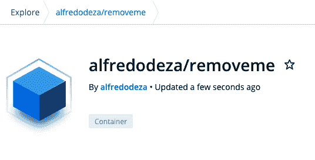
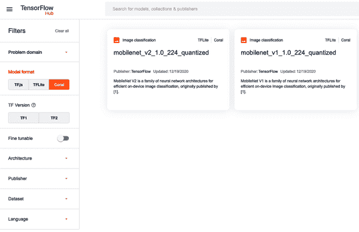
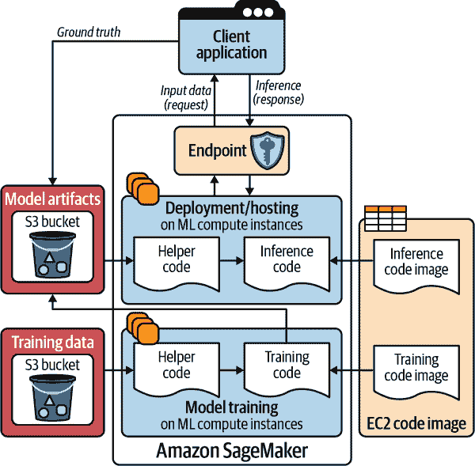
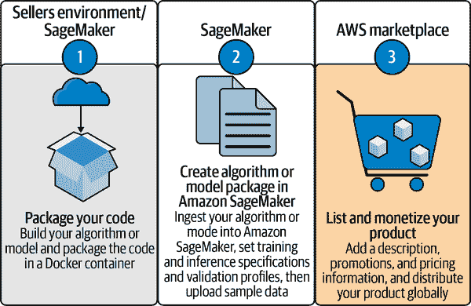
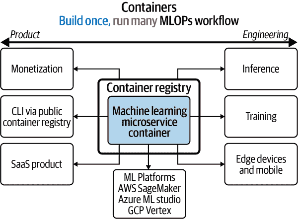

# 第三章：用于容器和边缘设备的 MLOps

作者：Alfredo Deza

> 分裂脑实验始于眼间转移问题。也就是说，如果一个人用一只眼睛学会了解决一个问题，然后用另一只眼睛遮盖住，并使用另一只眼睛，他就能轻松地解决这个问题，而无需进一步学习。这被称为“学习的眼间转移”。当然，学习并不是在眼睛中进行然后转移到另一只眼睛，但通常是这样描述的。转移发生的事实可能显而易见，但质疑显而易见的东西往往会产生发现。在这种情况下，问题是：一个眼睛学习后，如何在使用另一个眼睛时表现出来？放在可以实验测试的术语中，这两只眼睛在哪里连接？实验表明，转移实际上是通过大脑半球之间的胼胝体进行的。
> 
> 作者：Dr. Joseph Bogen

当我开始涉足技术领域时，虚拟机（托管在物理机器上的虚拟化服务器）处于非常有利且普遍的位置——无论是从托管提供商到在 IT 房间里拥有大型服务器的普通公司，到处都能找到它们。很多在线软件提供商都提供虚拟化托管服务。在工作中，我不断磨练技能，努力学习虚拟化技术的方方面面。能够在其他主机上运行虚拟机提供了很多（受欢迎的）灵活性。

每当新技术解决一个问题（或者任意数量的问题），就会带来一系列其他问题需要解决。对于虚拟机来说，其中一个问题是如何处理它们的移动。如果主机服务器*A*需要安装新操作系统，系统管理员需要将虚拟机迁移到主机服务器*B*。虚拟机的大小与初始配置时的数据大小一样大：一个 50 GB 的*虚拟驱动器*意味着存在一个大小为 50GB 的虚拟驱动器文件。将 50GB 从一个服务器移动到另一个服务器将花费时间。如果您正在移动运行虚拟机的关键服务，如何最小化停机时间？

大多数这些问题都有它们的策略来最小化停机时间并增加鲁棒性：快照、恢复、备份。像*Xen Project*和*VMWare*这样的软件项目专门解决这些问题，而云服务提供商则几乎消除了这些问题。

如今，虚拟机在云计算中仍然占据重要地位。例如，Google Cloud 将其称为*Compute Engine*，其他提供商也有类似的参考名称。许多这些虚拟机提供增强型 GPU，以提供针对机器学习操作的更好性能。

虚拟机虽然依然存在，但越来越重要的是掌握两种模型部署技术：容器和边缘设备。认为虚拟机适合在边缘设备（如手机）上运行或在开发过程中快速迭代并使用可重现文件集是不合理的。你不会总是需要选择其中一种，但对这些选择（以及它们的运作方式）有清晰的理解会使你成为更好的机器学习工程师。

# 容器

虽然虚拟机拥有强大和稳健的功能，但理解容器和容器化技术是至关重要的。我记得 2013 年在圣克拉拉的 PyCon 大会上，Docker 被宣布时的那种感觉！展示的*精简虚拟化*对于 Linux 并不新鲜。新颖和革命性的是工具链。Linux 早已有*LXC*（或*Linux 容器*），提供了今天我们认为理所当然的许多容器功能。但 LXC 的工具链令人沮丧，而 Docker 带来了一个成功的关键因素：通过注册表轻松的协作和分享。

注册表允许任何开发者*推送*他们的更改到一个中心位置，其他人可以*拉取*这些更改并在本地运行。使用与容器相关的同样工具支持注册表（一切无缝衔接），极大推动了技术的快速发展。

###### Tip

在这一节中，请确保已安装容器运行时。对于这一节中的示例，使用[Docker](https://oreil.ly/iEX4x)可能会更容易。安装完成后，请确保`docker`命令显示帮助输出，以验证安装是否成功。

有关容器与虚拟机对比的最重要[描述](https://oreil.ly/SQUjS)之一来自红帽。简而言之，容器专注于应用程序本身，只有应用程序本身（如源代码和其他支持文件），而不是运行所需的（如数据库）。传统上，工程师经常使用虚拟机作为一体化服务，其中安装、配置和运行数据库、Web 服务器和其他系统服务。这些类型的应用程序是*单块式*的，所有组件在一个机器上有紧密的互联依赖。

另一方面，*微服务*是一个与数据库等系统要求完全解耦的应用程序，可以独立运行。虽然你可以将虚拟机用作微服务，但通常容器更适合这个概念。

如果你已经熟悉创建和运行容器，在“用于机器学习模型持续交付的基础设施即代码”一章中，我详细介绍了如何使用预训练模型程序化地构建它们，这进一步将这些概念与自动化融合。

## 容器运行时

你可能已经注意到，我提到了容器、Docker 和容器运行时。当人们将它们混用时，这些术语可能会令人困惑。由于 Docker（公司）最初开发了用于创建、管理和运行容器的工具，因此将“Docker 容器”称为常见用语。运行时——也就是在系统中运行容器所需的软件——也是由 Docker 创建的。在新容器技术发布几年后，红帽（负责 RHEL 操作系统的公司）贡献了一种不同的容器运行方式，使用了新的（替代的）运行环境。这种新环境还引入了一套新的操作容器工具，与 Docker 提供的工具有一定的兼容性。如果你听说过容器运行时，你必须意识到不止一种存在。

这些新工具和运行时的一些好处意味着，你不再需要使用具有广泛权限的超级用户账户，这对许多不同的使用情况是合理的。尽管红帽和许多其他开源贡献者在这些工具上做得很好，但在非 Linux 操作系统上运行它们仍然有些复杂。另一方面，Docker 使工作无缝体验，无论你使用 Windows、MacOS 还是 Linux。让我们开始通过完成创建容器所需的所有步骤来开始。

## 创建容器

*Dockerfile* 是创建容器的核心。每次你创建一个容器时，必须在当前目录中有 Dockerfile 存在。这个特殊文件可以有几个部分和命令，允许创建容器镜像。打开一个新文件并命名为 *Dockerfile*，并将以下内容添加到其中：

```
FROM centos:8

RUN dnf install -y python38
```

文件有两个部分；每个部分都由唯一的关键字分隔。这些关键字被称为*指令*。文件的开头使用了`FROM`指令，它确定容器的基础是什么。*基础*（也称为*基础镜像*）是 CentOS 发行版的第 8 版。在这种情况下，版本是一个标签。在容器中，标签定义了一个时间点。当没有定义标签时，默认为*latest*标签。通常情况下，版本会被用作标签，就像这个例子中的情况一样。

容器的许多有用方面之一是它们可以由许多层组成，这些层可以在其他容器中使用或重复使用。这种分层工作流程防止了每个使用它的容器每次都需要下载一个 10 兆字节的基础层。实际操作中，你只需下载一次 10 兆字节的层，并且多次重复使用。这与虚拟机非常不同，在虚拟机中，即使所有这些虚拟机都具有相同的文件，你仍然需要将它们全部下载为整体。

接下来，`RUN` 指令运行一个系统命令。该系统命令安装 Python 3，而基本的 CentOS 8 镜像中并不包含它。注意 `dnf` 命令如何使用 `-y` 标志，这可以防止安装程序在构建容器时询问确认。避免运行命令时触发任何提示是至关重要的。

现在从存放 *Dockerfile* 的同一目录构建容器：

```
$ docker build .
[+] Building 11.2s (6/6) FINISHED
 => => transferring context: 2B
 => => transferring dockerfile: 83B
 => CACHED [1/2] FROM docker.io/library/centos:8
 => [2/2] RUN dnf install -y python38
 => exporting to image
 => => exporting layers
 => => writing
image sha256:3ca470de8dbd5cb865da679ff805a3bf17de9b34ac6a7236dbf0c367e1fb4610
```

输出报告说我已经拥有 CentOS 8 的初始层，因此无需再次拉取它。然后，它安装 Python 3.8 完成镜像的创建。确保启动构建时指向存放 *Dockerfile* 的位置。在这种情况下，我在同一目录中，因此使用点号让构建知道当前目录是构建的目录。

这种构建镜像的方式不是很健壮，存在一些问题。首先，很难后续识别这个镜像。我们只有 sha256 摘要来引用它，没有其他信息。要查看刚刚构建的镜像的一些信息，重新运行 `docker`：

```
$ docker images
docker images
REPOSITORY    TAG       IMAGE ID            CREATED             SIZE
<none>        <none>    3ca470de8dbd        15 minutes ago      294MB
```

没有与之关联的存储库或标签。镜像 ID 是摘要，缩短为仅 12 个字符。如果没有额外的元数据，处理这个镜像会很具挑战性。在构建镜像时给它打标签是一个好习惯。这是创建相同镜像并打标签的方法：

```
$ docker build -t localbuild:removeme .
[+] Building 0.3s (6/6) FINISHED
[...]
 => => writing
image sha256:4c5d79f448647e0ff234923d8f542eea6938e0199440dfc75b8d7d0d10d5ca9a                                                                                                                                                                               0.0s
 => => naming to docker.io/library/localbuild:removeme
```

关键区别在于现在 `localbuild` 有一个 `removeme` 的标签，并且在列出镜像时会显示出来：

```
$ docker images localbuild
REPOSITORY       TAG             IMAGE ID            CREATED             SIZE
localbuild       removeme        3ca470de8dbd        22 minutes ago      294MB
```

由于镜像根本没有变化，构建过程非常迅速，内部构建系统已经为已构建的镜像打了标签。命名和标记镜像在推送镜像到注册表时很有帮助。我需要拥有 *localbuild* 存储库才能推送到它。因为我没有，推送将被拒绝：

```
$ docker push localbuild:removeme
The push refers to repository [docker.io/library/localbuild]
denied: requested access to the resource is denied
```

但是，如果我将容器重新标记到注册表中的我的存储库，推送将会成功。要重新标记，我首先需要引用原始标签 (`localbuild:removeme`)，然后使用我的注册表账户和目的地 (`alfredodeza/removeme`)：

```
$ docker tag localbuild:removeme alfredodeza/removeme
$ docker push alfredodeza/removeme
The push refers to repository [docker.io/alfredodeza/removeme]
958488a3c11e: Pushed
291f6e44771a: Pushed
latest: digest: sha256:a022eea71ca955cafb4d38b12c28b9de59dbb3d9fcb54b size: 741
```

现在去 [注册表](https://hub.docker.com)（在本例中是 Docker Hub），可以看到最近推送的镜像已经可用（见 图 3-1）。

由于我的账户是开放的，注册表没有限制访问，任何人都可以通过运行 `docker pull alfredodeza/removeme` 来“拉取”容器镜像。如果你之前没有接触过容器或注册表，这应该感觉革命性。正如我在本章开头提到的，这是容器在开发者社区迅速流行的基础。对于“如何安装你的软件？”的答案现在几乎可以是“只需拉取容器”。



###### 图 3-1\. Docker Hub 镜像

## 运行容器

现在*Dockerfile*构建了容器，我们可以运行它了。在运行虚拟机时，通常会启用 SSH（也称为安全外壳）守护程序并公开一个端口进行远程访问，甚至可能添加默认的 SSH 密钥以防止密码提示。不习惯运行容器的人可能会要求 SSH 访问正在运行的容器实例。虽然可以启用 SSH 并使其工作，但这不是访问运行中容器的方法。

确保容器正在运行。在此示例中，我运行的是 CentOS 8：

```
$ docker run -ti -d --name centos-test --rm centos:8 /bin/bash
1bb9cc3112ed661511663517249898bfc9524fc02dedc3ce40b5c4cb982d7bcd
```

此命令中有几个新标志。它使用`-ti`来分配一个 TTY（模拟终端），并将`stdin`附加到其中，以便稍后在终端中与之交互。接下来，`-d`标志使容器在后台运行，以防止接管当前终端。我分配了一个名称（`centos-test`），然后使用`--rm`以便 Docker 在停止容器后移除它。执行命令后，会返回一个摘要，表示容器已启动。现在，验证它是否正在运行：

```
$ docker ps
CONTAINER ID        IMAGE               COMMAND             NAMES
1bb9cc3112ed        centos:8            "/bin/bash"         centos-test
```

有些容器使用了`ENTRYPOINT`（可选使用`CMD`）指令创建。这些指令旨在使容器能够为特定任务启动和运行。在我们刚刚为 CentOS 构建的示例容器中，必须指定`/bin/bash`可执行文件，否则容器将无法保持运行状态。这些指令意味着，如果需要一个长时间运行的容器，至少应该创建一个执行程序的`ENTRYPOINT`。更新*Dockerfile*，使其看起来像这样：

```
FROM centos:8

RUN dnf install -y python38

ENTRYPOINT ["/bin/bash"]
```

现在可以在后台运行容器，而无需指定`/bin/bash`命令：

```
$ docker build -t localbuild:removeme .
$ docker run --rm -it -d localbuild:removeme
023c8e67d91f3bb3998e7ac1b9b335fe20ca13f140b6728644fd45fb6ccb9132
$ docker ps
CONTAINER ID        IMAGE               COMMAND             NAMES
023c8e67d91f        removeme            "/bin/bash"         romantic_khayyam
```

我之前提到过，通常使用 SSH 访问虚拟机，而访问容器有些不同。虽然理论上可以为容器启用 SSH，但我不建议这样做。以下是使用容器 ID 和`exec`子命令访问运行中容器的方法：

```
$ docker exec -it 023c8e67d91f bash

[root@023c8e67d91f /]# whoami
root
```

在那种情况下，我必须使用我想要运行的命令。由于我想要与容器进行交互操作（就像我与虚拟机一样），我调用 Bash 程序的可执行文件。

或者，您可能不想使用交互式 Shell 环境访问，并且您只想运行一些命令。必须更改命令才能实现此目的。将先前示例中使用的 Shell 可执行文件替换为要使用的命令：

```
$ docker exec 023c8e67d91f tail /var/log/dnf.log

  python38-setuptools-wheel-41.6.0-4.module_el8.2.0+317+61fa6e7d.noarch

2020-12-02T13:00:04Z INFO Complete!
2020-12-02T13:00:04Z DDEBUG Cleaning up.
```

由于没有交互需求（我不通过 Shell 发送任何输入），我可以省略`-it`标志。

###### 注意

容器开发的一个常见方面是尽可能保持其大小尽可能小。这就是为什么 CentOS 容器会比新安装的 CentOS 虚拟机少得多的软件包。当您期望某个软件包存在时（例如像 Vim 这样的文本编辑器），但实际上不存在时，会带来惊讶的经历。

## 最佳实践

第一件事（也强烈推荐）在尝试新的语言或工具时，是找一个可以帮助导航约定和常见用法的代码检查工具。有几种用于使用 Dockerfile 创建容器的代码检查工具。其中一个是`hadolint`。它被方便地打包为一个容器。修改最后一个*Dockerfile*示例，使其看起来像这样：

```
FROM centos:8

RUN dnf install -y python38

RUN pip install pytest

ENTRYPOINT ["/bin/bash"]
```

现在运行代码检查工具，看看是否有好的建议：

```
$ docker run --rm -i hadolint/hadolint < Dockerfile
DL3013 Pin versions in pip.
  Instead of `pip install <package>` use `pip install <package>==<version>`
```

这是一个好建议。固定软件包版本总是一个好主意，因为这样可以确保依赖项的更新不会与您的应用程序需要的代码不兼容。请注意，固定依赖项并永远不更新它们并不是一个好主意。确保回到固定的依赖项，并查看是否有必要进行更新。

由于容器化工具的一个目标是尽可能保持其小巧，您可以在创建 Dockerfile 时实现几件事情。每次有`RUN`指令时，都会创建一个包含该执行的新层。容器由个别层组成，因此层数越少，容器的大小就越小。这意味着最好使用一行命令安装多个依赖项，而不是一个依赖项一个命令：

```
RUN apk add --no-cache python3 && python3 -m ensurepip && pip3 install pytest
```

在每个命令的末尾使用`&&`将所有内容链接在一起，创建一个单一的层。如果前面的示例为每个安装命令使用单独的`RUN`指令，那么容器的大小将更大。也许对于这个特定示例，大小不会有太大的区别；然而，在需要大量依赖项的容器中，这将是显著的。

代码检查提供了一个有用的选项：自动化代码检查的机会。留意自动化流程的机会，消除任何手动步骤，并让您集中精力在将模型部署到生产中的过程的核心部分（在这种情况下编写一个好的 Dockerfile）。

构建容器的另一个关键部分是确保安装的软件没有与之相关的漏洞。发现认为应用程序不太可能有漏洞，因为他们编写高质量代码的工程师并不罕见。问题在于容器带有预安装的库。它是一个完整的操作系统，在构建时将拉取额外的依赖项以满足您尝试交付的应用程序。如果您要使用像 Flask 这样的 Web 框架从容器中提供训练模型，您必须清楚地了解可能与 Flask 或其依赖项之一相关联的常见漏洞和曝光（CVEs）。

这些是 Flask（版本为`1.1.2`）带来的依赖项：

```
click==7.1.2
itsdangerous==1.1.0
Jinja2==2.11.2
MarkupSafe==1.1.1
Werkzeug==1.0.1
```

CVE 可能随时报告，并且用于警报漏洞的软件系统确保在报告时准确更新多次。像 Flask 这样的应用程序的关键部分今天可能不会对版本 1.1.2 有漏洞，但是明天早上发现并报告新 CVE 时就肯定会有。许多不同的解决方案专门用于扫描和报告容器中的漏洞以减轻这些漏洞。这些安全工具扫描应用程序安装的库和操作系统的软件包，提供详细和准确的漏洞报告。

一个非常快速且易于安装的解决方案是 Anchore 的`grype`命令行工具。要在 Macintosh 计算机上安装它：

```
$ brew tap anchore/grype
$ brew install grype
```

或在任何 Linux 机器上：

```
$ curl -sSfL \
 https://raw.githubusercontent.com/anchore/grype/main/install.sh | sh -s
```

使用`curl`这种方式可以将`grype`部署到几乎任何持续集成系统中以扫描漏洞。`curl`安装方法会将可执行文件放置在当前工作路径下的*bin/*目录中。安装完成后，运行它对一个容器进行扫描：

```
$ grype python:3.8
 ✔ Vulnerability DB     [no update available]
 ⠴ Loading image        ━━━━━━━━━━━━━━━━━━━━━ [requesting image from docker]
 ✔ Loaded image
 ✔ Parsed image
 ✔ Cataloged image      [433 packages]
 ✔ Scanned image        [1540 vulnerabilities]
```

一千多个漏洞看起来有些令人惊讶。输出太长无法在此捕获，因此过滤结果以检查*High*严重性的漏洞：

```
$ grype python:3.8 | grep High
[...]
python2.7      2.7.16-2+deb10u1      CVE-2020-8492      High
```

报告了几个漏洞，因此我将输出减少到只有一个。[CVE](https://oreil.ly/6Q1O2)令人担忧，因为如果攻击者利用漏洞，可能会导致系统崩溃。由于我知道应用程序使用 Python 3.8，所以这个容器不会有漏洞，因为 Python 2.7 未使用。虽然这是一个 Python 3.8 容器，但是为了方便起见，镜像包含一个较旧的版本。关键的区别在于现在您知道什么是有漏洞的，并且可以就最终将服务部署到生产环境做出执行决策。

一个有用的自动化增强功能是在特定漏洞级别（如`high`）上失败：

```
$ grype --fail-on=high centos:8
[...]
discovered vulnerabilities at or above the severity threshold!
```

这是您可以与 Linting 一起自动化的另一个检查，用于构建强大的容器。一个写得很好的*Dockerfile*，并且始终报告漏洞是提升容器化模型生产交付的极好方式。

## 在 HTTP 上为训练模型提供服务

现在核心概念中有几个已经清晰，让我们创建一个容器，该容器将使用 Flask Web 框架通过 HTTP API 提供训练模型的服务。正如您已经了解的，一切都始于 Dockerfile，所以现在创建一个，假设当前工作目录中有*requirements.txt*文件：

```
FROM python:3.7

ARG VERSION

LABEL org.label-schema.version=$VERSION

COPY ./requirements.txt /webapp/requirements.txt

WORKDIR /webapp

RUN pip install -r requirements.txt

COPY webapp/* /webapp

ENTRYPOINT [ "python" ]

CMD [ "app.py" ]
```

这个文件中有几个我以前没有涉及过的新东西。首先，我们定义了一个名为 `VERSION` 的参数，它作为 `LABEL` 的变量使用。我正在使用一个 [标签模式约定](https://oreil.ly/PtOSK)，有助于规范这些标签的命名。使用版本是一种有用的方式，用于添加有关容器本身的信息元数据。当容器未能从模型中产生预期的准确性时，添加标签有助于识别问题模型的版本。虽然此文件只使用一个标签，但可以想象使用更多带有描述性数据的标签会更好。

###### 注意

此构建使用的容器镜像略有不同。这个构建使用 Python 3.7，因为在撰写本文时，一些依赖项尚不支持 Python 3.8\. 您可以随意将 3.7 替换为 3.8 并检查它是否现在可以工作。

接下来，将 *requirements.txt* 文件复制到容器中。创建具有以下依赖项的 requirements 文件：

```
Flask==1.1.2
pandas==0.24.2
scikit-learn==0.20.3
```

现在，创建一个名为 *webapp* 的新目录，以便将 Web 文件放在一个地方，并添加 *app.py* 文件，使其看起来像这样：

```
from flask import Flask, request, jsonify

import pandas as pd
from sklearn.externals import joblib
from sklearn.preprocessing import StandardScaler

app = Flask(__name__)

def scale(payload):
    scaler = StandardScaler().fit(payload)
    return scaler.transform(payload)

@app.route("/")
def home():
    return "<h3>Sklearn Prediction Container</h3>"

@app.route("/predict", methods=['POST'])
def predict():
    """
 Input sample:

 {
 "CHAS": { "0": 0 }, "RM": { "0": 6.575 },
 "TAX": { "0": 296 }, "PTRATIO": { "0": 15.3 },
 "B": { "0": 396.9 }, "LSTAT": { "0": 4.98 }
 }

 Output sample:

 { "prediction": [ 20.35373177134412 ] }
 """

    clf = joblib.load("boston_housing_prediction.joblib")
    inference_payload = pd.DataFrame(request.json)
    scaled_payload = scale(inference_payload)
    prediction = list(clf.predict(scaled_payload))
    return jsonify({'prediction': prediction})

if __name__ == "__main__":
    app.run(host='0.0.0.0', port=5000, debug=True)
```

最后需要的文件是训练好的模型。如果正在训练波士顿房屋预测数据集，请确保将其放置在 *webapp* 目录中，与 *app.py* 文件一起，并将其命名为 *boston_housing_prediction.joblib*。您也可以在这个 [GitHub 仓库](https://oreil.ly/ibjG0) 中找到一个训练好的模型版本。

项目的最终结构应如下所示：

```
.
├── Dockerfile
└── webapp
    ├── app.py
    └── boston_housing_prediction.joblib

1 directory, 3 files
```

现在构建容器。在示例中，我将使用 Azure 在我训练模型时给出的运行 ID 作为版本，以便更容易识别模型的来源。如果不需要版本，请随意使用不同的版本（或根本不使用版本）：

```
$ docker build --build-arg VERSION=AutoML_287f444c -t flask-predict .
[+] Building 27.1s (10/10) FINISHED
 => => transferring dockerfile: 284B
 => [1/5] FROM docker.io/library/python:3.7
 => => resolve docker.io/library/python:3.7
 => [internal] load build context
 => => transferring context: 635B
 => [2/5] COPY ./requirements.txt /webapp/requirements.txt
 => [3/5] WORKDIR /webapp
 => [4/5] RUN pip install -r requirements.txt
 => [5/5] COPY webapp/* /webapp
 => exporting to image
 => => writing image sha256:5487a63442aae56d9ea30fa79b0c7eed1195824aad7ff4ab42b
 => => naming to docker.io/library/flask-predict
```

双重检查构建后镜像是否可用：

```
$ docker images flask-predict
REPOSITORY      TAG       IMAGE ID       CREATED         SIZE
flask-predict   latest    5487a63442aa   6 minutes ago   1.15GB
```

现在在后台运行容器，暴露端口 `5000`，并验证它是否在运行：

```
$ docker run -p 5000:5000 -d --name flask-predict flask-predict
d95ab6581429ea79495150bea507f009203f7bb117906b25ffd9489319219281
$docker ps
CONTAINER ID IMAGE         COMMAND         STATUS       PORTS
d95ab6581429 flask-predict "python app.py" Up 2 seconds 0.0.0.0:5000->5000/tcp
```

在你的浏览器中打开 *http://localhost:5000*，`home()` 函数返回的 HTML 应该欢迎您使用 Sklearn 预测应用程序。另一种验证方法是使用 `curl`：

```
$ curl 192.168.0.200:5000
<h3>Sklearn Prediction Container</h3>
```

您可以使用任何能够通过 HTTP 发送信息并处理返回响应的工具。本示例使用几行 Python 代码与 `requests` 库（确保在运行之前安装它）发送带有示例 JSON 数据的 POST 请求：

```
import requests
import json

url = "http://localhost:5000/predict"

data = {
    "CHAS": {"0": 0},
    "RM": {"0": 6.575},
    "TAX": {"0": 296.0},
    "PTRATIO": {"0": 15.3},
    "B": {"0": 396.9},
    "LSTAT": {"0": 4.98},
}

# Convert to JSON string
input_data = json.dumps(data)

# Set the content type
headers = {"Content-Type": "application/json"}

# Make the request and display the response
resp = requests.post(url, input_data, headers=headers)
print(resp.text)
```

将 Python 代码写入文件并命名为 *predict.py*。在终端上执行该脚本以获取一些预测结果：

```
$ python predict.py
{
  "prediction": [
    20.35373177134412
  ]
}
```

容器化部署是创建可由他人尝试的便携数据的绝佳方式。通过共享容器，减少了设置环境的摩擦，同时确保了一个可重复使用的系统进行交互。现在你知道如何为机器学习创建、运行、调试和部署容器，可以利用这一点来开始自动化非容器化环境，加快生产部署并增强整个流程的稳健性。除了容器之外，还有一个推动力，即使服务更接近用户，这就是我接下来要讨论的边缘设备和部署。

# 边缘设备

几年前，（快速）推理的计算成本是天文数字。今天可用的一些更先进的机器学习功能在不久前是成本禁止的。成本不仅降低了，而且更强大的芯片正在生产中。其中一些芯片专门为机器学习任务量身定制。这些芯片的所需功能的正确组合允许在诸如手机之类的设备上进行推理：快速、小巧且专为机器学习任务而设计。当技术中提到“部署到边缘”时，指的是不在数据中心内的计算设备，以及成千上万的其他服务器。手机、树莓派和智能家居设备是符合“边缘设备”描述的一些例子。在过去几年中，大型电信公司一直在推动边缘计算。这些边缘部署中的大多数都希望向用户提供更快的反馈，而不是将昂贵的计算请求路由到远程数据中心。

一般的想法是，计算资源距离用户越近，用户体验就会越快。有一条细微的界线，界定了什么可能在边缘落地，而不是完全回到数据中心。但正如我提到的，专用芯片变得更小、更快、更有效；可以预见未来意味着边缘计算中更多的机器学习。在这种情况下，边缘将意味着更多我们之前认为不能处理机器学习任务的设备。

居住在拥有大量数据中心托管应用数据的国家的大多数人几乎不会遇到延迟问题。对于那些不是这样的国家，问题会更加严重。例如，秘鲁有几条连接其与南美其他国家的海底电缆，但没有直接连接到美国的通路。这意味着，如果您从秘鲁上传图片到在美国数据中心托管应用的服务，速度将比像巴拿马这样的国家花费的时间长得多。这个上传图片的例子虽然微不足道，但在像 ML 预测这样的计算操作上则会更糟。本节探讨了边缘设备如何通过尽可能接近用户执行快速推理来帮助解决长距离问题。如果长距离是一个问题，想象一下当像远程农场这样没有（或者连接非常有限）的地方会发生什么。如果您需要在远程位置进行快速推理，选项有限，这就是 *部署到边缘* 比任何数据中心都有优势的地方。

记住，用户并不太关心勺子：他们对于能顺利尝试美味汤的无缝方式更感兴趣。

## Coral

[珊瑚项目](https://coral.ai) 是一个平台，帮助构建本地（设备上的）推理，捕捉边缘部署的本质：快速、靠近用户和离线。在本节中，我将介绍 [USB 加速器](https://oreil.ly/id47e)，这是一种支持所有主要操作系统并且与 TensorFlow Lite 模型兼容良好的边缘设备。您可以编译大多数 TensorFlow Lite 模型以在这种边缘 TPU（张量处理单元）上运行。ML 的运营化的一些方面意味着需要了解设备支持、安装方法和兼容性。这三个方面对于珊瑚边缘 TPU 是正确的：它适用于大多数操作系统，与 TensorFlow Lite 模型一起工作，只要能编译运行在 TPU 上即可。

如果您被委派在边缘的远程位置部署快速推理解决方案，您必须确保所有部署所需的组件能正常工作。这本书贯穿了 DevOps 的核心概念：可重复部署的方法创建可重现的环境至关重要。为了确保这一点，您必须了解兼容性。

首先，开始安装 TPU 运行时。对于我的机器，这意味着下载并解压文件以运行安装脚本：

```
$ curl -O https://dl.google.com/coral/edgetpu_api/edgetpu_runtime_20201204.zip
[...]
$ unzip edgetpu_runtime_20201204.zip
Archive:  edgetpu_runtime_20201204.zip
   creating: edgetpu_runtime/
  inflating: edgetpu_runtime/install.sh
[...]
$ cd edgetpu_runtime
$ sudo bash install.sh
Password:
[...]
Installing Edge TPU runtime library [/usr/local/lib]...
Installing Edge TPU runtime library symlink [/usr/local/lib]...
```

###### 注意

这些设置示例使用的是 Macintosh 计算机，因此安装方法和依赖项会与其他操作系统有所不同。[查看入门指南](https://oreil.ly/B16Za)，如果您需要支持不同计算机。

现在系统中安装了运行时依赖项，我们准备尝试使用边缘 TPU。Coral 团队有一个有用的 Python3 代码仓库，可以通过一个命令来运行图像分类。创建一个目录来克隆该仓库的内容，以设置图像分类的工作空间：

```
$ mkdir google-coral && cd google-coral
$ git clone https://github.com/google-coral/tflite --depth 1
[...]
Resolving deltas: 100% (4/4), done.
$ cd tflite/python/examples/classification
```

###### 注意

`git`命令使用`--depth 1`标志执行浅克隆。当不需要完整的仓库内容时，浅克隆是可取的。由于这个例子使用了仓库的最新更改，因此不需要执行包含完整仓库历史记录的完整克隆。

例如，在这个例子中，请不要运行*install_requirements.sh*脚本。首先确保你的系统中安装了 Python3，并使用它创建一个新的虚拟环境；确保在激活后，Python 解释器指向虚拟环境而不是系统 Python：

```
$ python3 -m venv venv
$ source venv/bin/activate
$ which python
~/google-coral/tflite/python/examples/classification/venv/bin/python
```

现在虚拟环境*virtualenv*已经激活，请安装两个库依赖项和 TensorFlow Lite 运行支持：

```
$ pip install numpy Pillow
$ pip install https://github.com/google-coral/pycoral/releases/download/\
release-frogfish/tflite_runtime-2.5.0-cp38-cp38-macosx_10_15_x86_64.whl
```

*numpy*和*Pillow*在大多数系统中安装都很简单。唯一的异常是接下来的非常长的链接。这个链接非常重要，必须与您的平台和架构匹配。如果没有这个库，将无法与 Coral 设备进行交互。[TensorFlow Lite 的 Python 安装指南](https://oreil.ly/VjFoS)是确认您需要使用哪个链接的正确来源。

现在一切都安装好并准备好执行图像分类，运行*classify_image.py*脚本以获取帮助菜单。在这种情况下，重新显示帮助菜单是验证所有依赖项都已安装且脚本正常工作的好方法：

```
usage:
  classify_image.py [-h] -m MODEL -i INPUT [-l LABELS] [-k TOP_K] [-c COUNT]
classify_image.py:
  error: the following arguments are required: -m/--model, -i/--input
```

因为在调用脚本时我没有定义任何标志，返回了一个错误，提醒我需要传递一些标志。在开始使用其他标志之前，我们需要检索一个 TensorFlow 模型，用于处理要测试的图像。

[Coral AI 网站](https://oreil.ly/VZAun)有一个模型部分，您可以浏览一些专门预训练的模型，用于进行图像分类。找到识别一千多种不同昆虫的*iNat 昆虫*模型。下载*tflite*模型和标签。

例如，在这个例子中，下载一个普通飞行图像的示例。[图像的原始来源在 Pixabay 上](https://oreil.ly/UFfxq)，但在[本书的 GitHub 存储库](https://oreil.ly/NHNIN)中也很方便地可以获取。

创建模型、标签和图像的目录。分别将所需文件放置在它们的目录中。尽管不一定需要按照这个顺序，但以后添加更多分类模型、标签和图像以进一步使用 TPU 设备时会更方便。

目录结构应该如下所示：

```
.
├── README.md
├── classify.py
├── classify_image.py
├── images
│   └── macro-1802322_640.jpg
├── install_requirements.sh
├── labels
│   └── inat_insect_labels.txt
└── models
    └── mobilenet_v2_1.0_224_inat_insect_quant_edgetpu.tflite

3 directories, 7 files
```

最后，我们可以尝试使用 Coral 设备进行分类操作。确保设备已插入 USB 电缆，否则您将得到一长串的追溯信息（不幸的是，这并不真正解释问题所在）：

```
Traceback (most recent call last):
  File "classify_image.py", line 122, in <module>
    main()
  File "classify_image.py", line 99, in main
    interpreter = make_interpreter(args.model)
  File "classify_image.py", line 72, in make_interpreter
    tflite.load_delegate(EDGETPU_SHARED_LIB,
  File "~/lib/python3.8/site-packages/tflite_runtime/interpreter.py",
    line 154, in load_delegate
        raise ValueError('Failed to load delegate from {}\n{}'.format(
ValueError: Failed to load delegate from libedgetpu.1.dylib
```

那个错误意味着设备未插入。请插入设备并运行分类命令：

```
$ python3 classify_image.py \
 --model models/mobilenet_v2_1.0_224_inat_insect_quant_edgetpu.tflite \
 --labels labels/inat_insect_labels.txt \
 --input images/macro-1802322_640.jpg
----INFERENCE TIME----
Note: The first inference on Edge TPU is slow because it includes loading
the model into Edge TPU memory.
11.9ms
2.6ms
2.5ms
2.5ms
2.4ms
-------RESULTS--------
Lucilia sericata (Common Green Bottle Fly): 0.43359
```

图像被正确分类，普通苍蝇被检测到！找一些其他昆虫图片，并重新运行命令检查模型在不同输入下的表现。

## Azure Percept

在书写本书时，微软宣布发布一个名为 Azure Percept 的平台和硬件。虽然我没有足够的时间去实际操作如何利用其功能的实例，但我觉得值得提到一些它的功能。

与前一节中 Coral 设备以及边缘一般相同的概念适用于 Percept 设备：它们允许在边缘进行无缝机器学习操作。

首先，重要的是要强调，尽管 Percept 产品大多作为硬件组件进行广告宣传，但 Azure Percept 是一个完整的边缘计算平台，从设备本身到在 Azure 中的部署、训练和管理。还支持主要的 AI 平台如 ONNX 和 TensorFlow，使得试用预建模型变得更加简单。

与 Coral 设备相比，Azure Percept 硬件的一个缺点是价格昂贵，这使得很难购买其捆绑产品来尝试新技术。正如以往一样，微软在[文档化并添加大量上下文和示例](https://oreil.ly/MFIKf)方面做得非常出色，如果您感兴趣，值得探索。

## TFHub

找到 TensorFlow 模型的一个很好的资源是[TensorFlow Hub](https://tfhub.dev)。该 hub 是一个存储库，其中包含数千个预训练模型可供使用。对于 Coral Edge TPU，并非所有模型都能正常工作。由于 TPU 具有针对设备的单独说明，模型需要专门为其编译。

现在您可以使用 Coral USB 设备运行分类操作，可以使用 TFHub 查找其他预训练模型进行工作。在 hub 上，有一个 Coral 模型格式；点击进入[用于 TPU 的可用模型](https://oreil.ly/mJv9N)，如图 3-2 所示。



###### 图 3-2\. TFHub Coral 模型

选择*MobileNet Quantized V2*模型进行下载。该模型可以从图像中检测超过一千个对象。之前使用 Coral 的示例需要标签和模型，因此请确保您也下载了这些。

###### 注意

当这些模型在 TFHub 网站上展示时，有多种不同的格式可用。确保仔细检查您获取的模型格式，并且（在本例中）它与 Coral 设备兼容。

## 移植非 TPU 模型

你可能会发现你需要的模型在某些情况下可用，但没有为你所拥有的 TPU 设备编译。Coral Edge TPU 确实有一个可用的编译器，但并非每个平台都可以安装运行时依赖项。当遇到这种情况时，你必须在解决方案上进行创意尝试，并始终尝试找到任何可能的解决方案中的自动化。编译器文档要求 Debian 或 Ubuntu Linux 发行版，并且设置编译器的说明与该特定发行版相关联。

在我的情况下，我是在一台 Apple 电脑上工作，并且没有其他运行 Linux 的计算机。我拥有的是本地安装的容器运行时，在这个运行时中，我可以用几个命令运行来自任何发行版的任何镜像。我们已经讨论过如何开始使用容器，如何运行它们以及如何创建它们。这是一个创建一个新的基于 Debian 的容器，并为编译器安装所有内容来解决这个问题的完美用例。

现在我们理解了问题，并且有了一个使用容器的解决方案，我们可以创建一个新的*Dockerfile*来构建一个容器镜像以供编译器使用。

```
FROM debian:stable

RUN apt-get update && apt install -yq curl build-essential gnupg

RUN curl https://packages.cloud.google.com/apt/doc/apt-key.gpg | \
    apt-key add -

RUN \
 echo "deb https://packages.cloud.google.com/apt coral-edgetpu-stable main" | \
 tee /etc/apt/sources.list.d/coral-edgetpu.list

RUN apt-get update && apt-get install -yq edgetpu-compiler

CMD ["/bin/bash"]
```

利用新创建的*Dockerfile*，创建一个新的镜像来运行编译器：

```
$ docker build -t tpu-compiler .
[+] Building 15.5s (10/10) FINISHED
 => => transferring dockerfile: 408B
[...]
 => [5/5] RUN apt update && apt install -yq edgetpu-compiler
 => exporting to image
 => => exporting layers
 => => writing image
    sha256:08078f8d7f7dd9002bd5a1377f24ad0d9dbf8f7b45c961232cf2cbf8f9f946e4
 => => naming to docker.io/library/tpu-compiler
```

我已经找到了一个我想要与 TPU 编译器一起使用但没有为其编译的[模型](https://oreil.ly/b7o64)。

###### 注意

只有为 TensorFlow Lite 预编译且量化的模型才能与编译器一起工作。确保模型同时是*tflite*和*quantized*，然后再将其下载以便用编译器转换。

在本地下载模型。在这种情况下，我使用命令行将其保存在当前工作目录中：

```
$ wget -O mobilenet_v1_50_160_quantized.tflite \
 https://tfhub.dev/tensorflow/lite-model/\
 mobilenet_v1_0.50_160_quantized/1/default/1?lite-format=tflite

Resolving tfhub.dev (tfhub.dev)... 108.177.122.101, 108.177.122.113, ...
Connecting to tfhub.dev (tfhub.dev)|108.177.122.101|:443... connected.
HTTP request sent, awaiting response... 200 OK
Length: 1364512 (1.3M) [application/octet-stream]
Saving to: ‘mobilenet_v1_50_160_quantized.tflite’

(31.8 MB/s) - ‘mobilenet_v1_50_160_quantized.tflite’ saved [1364512/1364512]

$ ls
mobilenet_v1_50_160_quantized.tflite
```

虽然我已经使用了命令行，但你也可以通过访问[网站上的模型](https://oreil.ly/NeI87)来下载模型。确保将文件移动到当前工作目录以进行下一步操作。

我们需要将下载的模型放入容器中，然后将文件本地复制回来。通过*bind mount*，Docker 可以使这个任务变得更加可管理。这种挂载操作将把我的机器上的路径链接到容器中，有效地共享我拥有的任何东西到容器中。这对于在容器中创建的文件也非常有效，因为我需要它们回到本地环境中。这些在容器中创建的文件将自动出现在我的本地环境中。

通过绑定挂载启动容器：

```
$ docker run -it -v ${PWD}:/models tpu-compiler
root@5125dcd1da4b:/# cd models
root@5125dcd1da4b:/models# ls
mobilenet_v1_50_160_quantized.tflite
```

在前一个命令中有几件事情在发生。首先，我使用`PWD`来指示当前工作目录，在这个目录中，*mobilenet_v1_50_160_quantized.tflite*文件存在于容器中的目标路径是*/models*。最后，我使用了带有标签`tpu-compiler`的构建容器来指定我需要的容器。如果你在构建镜像时使用了不同的标签，你需要更新命令中的这部分。启动容器后，我切换到*/models*目录，列出目录内容，并在本地机器上找到了下载的模型。环境现在已准备好使用编译器。

通过调用其帮助菜单来验证编译器是否工作：

```
$ edgetpu_compiler --help
Edge TPU Compiler version 15.0.340273435

Usage:
edgetpu_compiler [options] model...
```

接下来，对量化模型运行编译器：

```
$ edgetpu_compiler mobilenet_v1_50_160_quantized.tflite
Edge TPU Compiler version 15.0.340273435

Model compiled successfully in 787 ms.

Input model: mobilenet_v1_50_160_quantized.tflite
Input size: 1.30MiB
Output model: mobilenet_v1_50_160_quantized_edgetpu.tflite
Output size: 1.54MiB
Number of Edge TPU subgraphs: 1
Total number of operations: 31
Operation log: mobilenet_v1_50_160_quantized_edgetpu.log
See the operation log file for individual operation details.
```

这个操作少于一秒就运行完毕，并生成了一些文件，包括新编译的模型（*mobilenet_v1_50_160_quantized_edgetpu.tflite*），你现在可以用在边缘设备上。

最后，退出容器，返回本地机器，并列出目录的内容：

```
$ ls
mobilenet_v1_50_160_quantized.tflite
mobilenet_v1_50_160_quantized_edgetpu.log
mobilenet_v1_50_160_quantized_edgetpu.tflite
```

这是绕过工具操作系统需求的一个方便的解决方法。现在这个容器可以为边缘设备编译模型，可以通过脚本中的几行代码进一步自动化移植你所需的模型。记住，在这个过程中做了一些假设，你必须确保这些假设在编译时都是准确的。否则，你将会从编译器那里得到错误。这个过程是试图使用非量化模型与编译器配合的一个示例：

```
$ edgetpu_compiler vision_classifier_fungi_mobile_v1.tflite
Edge TPU Compiler version 15.0.340273435
Invalid model: vision_classifier_fungi_mobile_v1.tflite
Model not quantized
```

# 管理型 ML 系统的容器

在高级下一代 MLOps 工作流的核心是像 AWS SageMaker、Azure ML Studio 和 Google 的 Vertex AI 这样的管理型 ML 系统。所有这些系统都基于容器构建。容器是 MLOps 的一个秘密武器。没有容器化，开发和使用 AWS SageMaker 等技术就会更具挑战性。在图 3-3 中，请注意 EC2 容器注册表是推断代码镜像和训练代码的位置。



###### 图 3-3\. SageMaker 容器

这个过程至关重要，因为它允许 DevOps 最佳实践融入到创建这些镜像中——其中最重要的是持续集成和持续交付。容器通过减少复杂性来提高整个 ML 架构的质量，因为镜像已经“烘焙”好了。智力资源可以转移到其他问题，比如数据漂移，分析特征存储以寻找适合新模型的候选人，或评估新模型是否解决了客户需求。

## 在商业化 MLOps 中的容器

对于初创公司和大公司来说，Monetizing MLOps 是另一个关键问题。容器再次发挥了作用！在 SageMaker 的情况下，可以使用在 AWS Marketplace 中展示的算法或模型，如图 3-4 所示。它们是产品销售的交付方式。



###### 图 3-4\. SageMaker 卖家工作流程

作为产品，容器的优势在于其销售方式类似于在实体店销售的其他产品，比如花生酱、面粉或牛奶。在公司决定生产高质量有机花生酱的情况下，可能希望专注于生产花生酱，而不是建立销售花生酱的店铺网络。

同样地，在希望从机器学习中获利的公司中，容器是向客户交付模型和算法的理想封装。接下来，让我们看看如何通过容器一次构建多次运行。

## 一次构建，多次运行的 MLOps 工作流程

最终，MLOps 的容器化过程为产品和工程师提供了许多丰富的选择。在图 3-5 中，您可以看到从产品角度看，容器是实现知识产权商业化的理想封装。同样地，从工程角度看，容器可以用于提供预测结果、进行训练，或者部署到像 Coral TPU 或 Apple iPhone 这样的边缘设备上。



###### 图 3-5\. 一次构建，多次运行的 MLOps 容器

MLOps 和容器技术是互补的，因为容器帮助您交付业务价值。然后，MLOps 方法直接建立在这项技术之上，以优化生产效率并增加价值。接下来，让我们结束本章，总结容器在 MLOps 中的重要方面。

# 结论

在操作化 ML 模型时，您经常会遇到许多不同的部署可能性。越来越普遍地看到模型部署在手机和其他（小型）设备上，您可以将其插入任何带有 USB 端口的计算机。边缘推理提供的问题（如离线、远程和快速访问）可能会产生转型效应，特别是对于没有可靠电源和网络访问的偏远地区。与边缘设备类似，容器化使环境的再现更快速、更可靠。几年前，可再现的机器环境是一个具有挑战性的问题。在这种情况下，容器化尤为重要。通过容器，资源的快速扩展和从云提供商转换部署环境，甚至将工作负载从本地部署到云中，都变得更加容易。

接下来，我们的下一章将深入探讨机器学习模型的持续交付流程。

# 练习

+   重新编译模型以适应 TFHub 的 Coral Edge TPU。

+   使用 MobileNet V2 模型对其他对象进行推理，获得准确的结果。

+   创建一个新的容器镜像，基于 Flask 示例，用于服务一个模型，并在 `GET` 请求中提供与模型交互的示例。创建另一个端点，提供关于模型的有用元数据。

+   将新创建的镜像发布到像 [Docker Hub](https://hub.docker.com) 这样的容器注册表。

# 批判性思维讨论问题

+   是否可以使用容器来使用类似 Coral 的边缘 TPU 设备进行在线预测？如何？或为什么不？

+   容器运行时是什么，它与 Docker 有什么关系？

+   创建 Dockerfile 时的三个良好实践方法是什么？

+   本章提到的 DevOps 的两个关键概念是什么？它们为什么有用？

+   创建一个定义，用你自己的话来描述“边缘”是什么。给出一些可以应用的机器学习示例。
