# 第四章：机器学习模型的持续交付

作者：Alfredo Deza

> 自然哲学（我们现在称为科学）真的已经远离其起源了吗？它只留下了纸质学家——那些接受纸质信息、输出纸质信息的人，他们在阅读和写作时刻苦心避免与现实接触？他们是否认为直接接触数据是有害的？他们是否像小说《烟草之路》中的某些乡巴佬一样，对自己的无知感到自豪？
> 
> Dr. Joseph Bogen

作为一名职业运动员，我经常面对受伤问题。受伤有各种严重程度。有时可能只是一些轻微的问题，比如剧烈跨栏训练后左腿肌肉轻微紧缩。其他时候可能更严重，比如难以忍受的下背痛。高水平运动员在赛季中间不能有休息日。如果计划是每周七天锻炼，那么坚持这七天是至关重要的。错过一天会带来严重后果，可能会使直到那时的训练成果减弱（甚至完全消失）。锻炼就像推着一辆上坡的手推车，错过一次锻炼就意味着让手推车沿着山下滑行。这样做的后果是你需要回去重新推上山。你不能错过锻炼。

如果你受伤了，无法进行锻炼，那么尽快以最佳状态恢复上场是首要任务，就像找到替代锻炼一样重要。这意味着如果你的腿筋受伤了，无法跑步，那么看看是否可以去游泳池，保持有氧计划。明天无法进行上坡训练，因为你的脚趾头受伤了？那就试试骑自行车去应对同样的坡道。受伤需要战略规划；放弃不是选项，但如果必须撤退，那么首先考虑的是尽量减少撤退的可能性。如果我们不能开炮，那就派骑兵。总会有办法，创造力和完全康复同样重要。

恢复需要策略，但更重要的是持续评估。由于你在受伤的情况下尽可能多地进行锻炼，评估伤势是否加重是至关重要的。如果你因为无法跑步而骑自行车，你必须非常警觉，看看自行车是否加重了伤势。对于受伤的持续评估是一个相当简单的算法：

1.  每天第一件事，评估伤势是否比前一天更糟，还是更好。

1.  如果情况变得更糟，那么要进行调整以避免之前的锻炼或者改变它们。这些可能会妨碍恢复。

1.  如果情况没有改变，将伤势与上周或上个月进行比较。问自己：“我是否感觉比上周更糟、更好还是一样？”

1.  最后，如果你感觉好些了，那将极大地强化当前策略正在起作用的事实，并且你应该继续，直到完全康复。

对于某些受伤，我不得不更频繁地评估（而不是等到第二天早上）。持续评估的结果是恢复的关键。在某些情况下，我不得不评估特定行动是否对我有害。有一次我摔断了脚趾（撞在书架的角落上），我立即制定了策略：我能走路吗？如果跑步会感到疼痛吗？对于所有这些问题，答案都是肯定的。那天下午我试着去游泳。接下来的几周，我不断检查是否能够在没有疼痛的情况下行走。疼痛不是敌人。它是帮助你决定是继续做你正在做的事情，还是停下来重新思考当前策略的指示器。

不断评估、做出改变并根据反馈进行调整，以及应用新策略以实现成功，这正是持续集成（CI）和持续交付（CD）的核心内容。即使在如今，强大的部署策略信息易得，仍然经常遇到没有测试或测试策略薄弱的企业，以确保产品能够在新版本发布时准备就绪，甚至发布需要数周（甚至数月）的情况。我还记得，尝试发布一个重要的开源项目新版本时，有时需要接近一周的时间。更糟糕的是，质量保证（QA）负责人会给每位团队负责人发送电子邮件，询问他们是否准备好发布或者是否需要进行更多改动。

发送电子邮件并等待不同回复并不是发布软件的简单方法。它容易出错且高度不一致。CI/CD 平台和步骤赋予你和你的团队的反馈循环是无价的。如果发现问题，你必须自动化解决，并确保在下一次发布中不再成为问题。持续评估，就像高水平运动员受伤一样，是 DevOps 的核心支柱，对于成功的机器学习运营至关重要。

我喜欢将持续描述为一个过程的持久性或再现性的描述。在谈论构建、验证和部署工件的系统时，通常会一起提到 CI/CD。在本章中，我将详细介绍一个强大流程的外观，以及如何实施（或改进）流水线来将模型投入生产。

# 机器学习模型的打包

不久前，我第一次听说打包 ML 模型的事情。如果你以前从未听说过打包模型，没关系——这都是最近的事情，这里的*打包*并不意味着一些特殊类型的操作系统包，比如带有用于捆绑和分发的特殊指令的 RPM（Red Hat Package Manager）或 DEB（Debian Package）文件。这一切意味着将模型放入容器中，以利用容器化进程来帮助共享、分发和轻松部署。我已经在“容器”中详细描述了容器化，并解释了为什么在操作化机器学习时使用它们比使用其他策略如虚拟机更有意义，但值得重申的是，能够快速从容器中尝试模型，而不受操作系统影响，是一个梦想般的场景。

将 ML 模型打包到容器中有三个重要的特性需要讨论：

+   只要安装了容器运行时，本地运行容器就很简单。

+   有很多选项可以在云中部署容器，根据需要进行横向或纵向扩展。

+   其他人可以轻松尝试并与容器进行交互。

这些特性的好处在于维护变得不那么复杂，即使在本地或云服务中调试性能不佳的模型，也只需在终端输入几个命令即可。部署策略越复杂，故障排除和问题调查就会越困难。

对于本节，我将使用一个 ONNX 模型，并将其打包到一个容器中，用于提供执行预测的 Flask 应用。我将使用[RoBERTa-SequenceClassification](https://oreil.ly/DbzOM) ONNX 模型，该模型有很好的文档支持。创建新的 Git 仓库后，第一步是确定所需的依赖项。创建 Git 仓库后，首先添加以下*requirements.txt*文件：

```
simpletransformers==0.4.0
tensorboardX==1.9
transformers==2.1.0
flask==1.1.2
torch==1.7.1
onnxruntime==1.6.0
```

接下来，创建一个 Dockerfile，在容器中安装所有内容：

```
FROM python:3.8

COPY ./requirements.txt /webapp/requirements.txt

WORKDIR /webapp

RUN pip install -r requirements.txt

COPY webapp/* /webapp

ENTRYPOINT [ "python" ]

CMD [ "app.py" ]
```

Dockerfile 复制了要求文件，创建了一个*webapp*目录，并将应用程序代码复制到一个名为*app.py*的文件中。创建*webapp/app.py*文件来执行情感分析。首先添加导入和创建 ONNX 运行时会话所需的所有内容：

```
from flask import Flask, request, jsonify
import torch
import numpy as np
from transformers import RobertaTokenizer
import onnxruntime

app = Flask(__name__)
tokenizer = RobertaTokenizer.from_pretrained("roberta-base")
session = onnxruntime.InferenceSession(
  "roberta-sequence-classification-9.onnx")
```

文件的第一部分创建了 Flask 应用程序，定义了与模型一起使用的分词器，最后初始化了一个需要传递模型路径的 ONNX 运行时会话。有几个未使用的导入将在添加 Flask 路由以启用实时推理时使用：

```
@app.route("/predict", methods=["POST"])
def predict():
    input_ids = torch.tensor(
        tokenizer.encode(request.json[0], add_special_tokens=True)
    ).unsqueeze(0)

    if input_ids.requires_grad:
        numpy_func = input_ids.detach().cpu().numpy()
    else:
        numpy_func = input_ids.cpu().numpy()

    inputs = {session.get_inputs()[0].name: numpy_func(input_ids)}
    out = session.run(None, inputs)

    result = np.argmax(out)

    return jsonify({"positive": bool(result)})

if __name__ == "__main__":
    app.run(host="0.0.0.0", port=5000, debug=True)
```

`predict()` 函数是 Flask 路由，当应用程序运行时，启用 */predict* URL。该函数仅允许 `POST` HTTP 方法。尚未描述样本输入和输出，因为应用程序的一个关键部分尚未完成：ONNX 模型尚不存在。本地下载 [RoBERTa-SequenceClassification](https://oreil.ly/Pjvit) ONNX 模型，并将其放置在项目的根目录。这是最终项目结构的样子：

```
.
├── Dockerfile
├── requirements.txt
├── roberta-sequence-classification-9.onnx
└── webapp
    └── app.py

1 directory, 4 files
```

在构建容器之前，最后一件事情是没有指令将模型复制到容器中。*app.py* 文件要求模型 *roberta-sequence-classification-9.onnx* 存在于 */webapp* 目录中。更新 *Dockerfile* 反映这一点：

```
COPY roberta-sequence-classification-9.onnx /webapp
```

现在项目已经具备一切所需，因此可以构建容器并运行应用程序。在构建容器之前，让我们再次检查一切是否正常工作。创建一个新的虚拟环境，激活它，并安装所有依赖项：

```
$ python3 -m venv venv
$ source venv/bin/activate
$ pip install -r requirements.txt
```

ONNX 模型存在于项目的根目录，但应用程序希望它位于 */webapp* 目录中，因此将其移动到该目录中，以避免 Flask 应用程序抱怨（当容器运行时不需要此额外步骤）：

```
$ mv roberta-sequence-classification-9.onnx webapp/
```

现在通过使用 Python 调用 *app.py* 文件在本地运行应用程序：

```
$ cd webapp
$ python app.py
* Serving Flask app "app" (lazy loading)
 * Environment: production
   WARNING: This is a development server.
   Use a production WSGI server instead.
 * Debug mode: on
 * Running on http://0.0.0.0:5000/ (Press CTRL+C to quit)
```

接下来，应用程序已准备好接收 HTTP 请求。到目前为止，我还没有展示预期的输入是什么。这些将是 JSON 格式的请求和 JSON 格式的响应。使用 *curl* 程序发送一个示例负载以检测情感：

```
$ curl -X POST  -H "Content-Type: application/JSON" \
  --data '["Containers are more or less interesting"]' \
  http://0.0.0.0:5000/predict

{
  "positive": false
}

$ curl -X POST  -H "Content-Type: application/json" \
  --data '["MLOps is critical for robustness"]' \
  http://0.0.0.0:5000/predict

{
  "positive": true
}
```

JSON 请求是一个包含单个字符串的数组，响应是一个具有指示句子情感的“positive”键的 JSON 对象。现在您已经验证应用程序正在运行，并且实时预测功能正常工作，是时候在本地创建容器以验证所有工作情况了。创建容器，并标记它为有意义的东西：

```
$ docker build -t alfredodeza/roberta .
[+] Building 185.3s (11/11) FINISHED
 => [internal] load metadata for docker.io/library/python:3.8
 => CACHED [1/6] FROM docker.io/library/python:3.8
 => [2/6] COPY ./requirements.txt /webapp/requirements.txt
 => [3/6] WORKDIR /webapp
 => [4/6] RUN pip install -r requirements.txt
 => [5/6] COPY webapp/* /webapp
 => [6/6] COPY roberta-sequence-classification-9.onnx /webapp
 => exporting to image
 => => naming to docker.io/alfredodeza/roberta
```

现在在本地运行容器，以与直接使用 Python 运行应用程序时相同的方式进行交互。记得将容器的端口映射到本地主机：

```
$ docker run -it -p 5000:5000 --rm alfredodeza/roberta
 * Serving Flask app "app" (lazy loading)
 * Environment: production
   WARNING: This is a development server.
   Use a production WSGI server instead.
 * Debug mode: on
 * Running on http://0.0.0.0:5000/ (Press CTRL+C to quit)
```

以与之前相同的方式发送 HTTP 请求。您可以再次使用 *curl* 程序：

```
$ curl -X POST  -H "Content-Type: application/json" \
  --data '["espresso is too strong"]' \
  http://0.0.0.0:5000/predict

{
  "positive": false
}
```

我们经历了许多步骤来打包模型并将其放入容器中。其中一些步骤可能显得令人不知所措，但具有挑战性的过程正是自动化和利用持续交付模式的绝佳机会。在下一节中，我将使用持续交付来自动化所有这些，并将此容器发布到任何人都可以消费的容器注册表中。

# 用于 ML 模型持续交付的基础设施即代码

最近在工作中，我发现公共仓库中存在一些测试容器映像，这些映像被测试基础设施广泛使用。在容器注册表（如 Docker Hub）中托管映像已经是朝着可重复构建和可靠测试的正确方向迈出了一大步。我遇到了一个问题，其中一个测试容器中使用的库需要更新，因此我搜索用于创建这些测试容器的文件。但我找不到它们。某个工程师曾在本地构建这些映像并上传到注册表中。这带来了一个大问题，因为我无法简单地更改映像，因为用于构建映像的文件已丢失。

经验丰富的容器开发者可以找到一种方法，获取大多数（如果不是全部）文件以重建容器，但这并不是重点。在这种问题情境中迈出的一步是创建能够自动从已知源文件（包括*Dockerfile*）构建这些容器的自动化。重新构建或解决更新容器并重新上传到注册表的问题，就像在停电时找到蜡烛和手电筒，而不是拥有在电力中断时自动启动的发电机一样。当发生类似我刚描述的情况时，请保持高度分析性。与其互相指责和责怪他人，不如将其视为提升过程中自动化的机会。

机器学习中也存在同样的问题。我们往往很容易习惯于手动操作（和复杂的！），但始终存在自动化的机会。本节不会再重复所有容器化所需的步骤（已在“容器”中涵盖），但我将详细介绍自动化所需的细节。让我们假设我们处于与我刚描述的类似情况，并且有人已经创建了一个包含在 Docker Hub 中的模型的容器。没有人知道训练模型是如何进入容器的；没有文档，需要更新。让我们增加一些复杂性：模型不在任何可找到的仓库中，而是作为注册模型存在于 Azure 中。让我们进行一些自动化操作来解决这个问题。

###### 警告

可能会有诱惑将模型添加到 GitHub 仓库中。尽管这确实是可能的，但 GitHub（截至本文写作时）有着 100 MB 的硬文件大小限制。如果您尝试打包的模型接近这个大小，可能无法将其添加到仓库中。此外，Git（版本控制系统）并不适合处理二进制文件的版本控制，这会导致仓库因此而变得庞大。

在当前的问题场景中，模型在 Azure ML 平台上是可用的并且先前已注册。我之前没有一个，因此我迅速使用 Azure ML Studio 注册了 [RoBERTa-SequenceClassification](https://oreil.ly/oNgCD)。点击“模型”部分，然后如 图 4-1 所示，“注册模型”。

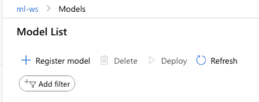

###### 图 4-1\. Azure 模型注册菜单

填写 图 4-2 中显示的表单，并附上必要的细节。在我的情况下，我将模型下载到本地，需要使用“上传文件”字段上传它。

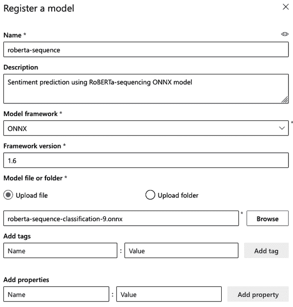

###### 图 4-2\. Azure 模型注册表单

###### 注意

如果想了解如何在 Azure 中注册模型的更多信息，我在 “注册模型” 中使用 Python SDK 讲解了如何做。

现在预训练模型已经在 Azure 中，让我们重用 “打包 ML 模型” 中相同的项目。所有执行（本地）实时推理的重活都已完成，因此创建一个新的 GitHub 仓库并添加项目内容，*除了* ONNX 模型。请记住，GitHub 中的文件有大小限制，因此无法将 ONNX 模型添加到 GitHub 仓库中。创建一个 *.gitignore* 文件来忽略模型，防止误添加：

```
*onnx
```

在将不包含 ONNX 模型的 Git 仓库内容推送后，我们已准备好开始自动化模型的创建和交付。为此，我们将使用 GitHub Actions，在触发满足可配置条件的情况下，从 Azure 获取已注册的模型，创建容器，最后将其推送到容器注册表。首先，在项目的根目录下创建一个 *.github/workflows/* 目录，然后添加一个 *main.yml* 文件，内容如下：

```
name: Build and package RoBERTa-sequencing to Dockerhub

on:
  # Triggers the workflow on push or pull request events for the main branch
  push:
    branches: [ main ]

  # Allows you to run this workflow manually from the Actions tab
  workflow_dispatch:
```

到目前为止的配置除了定义操作外什么也没做。您可以定义任意数量的作业，在这种情况下，我们定义一个 *build* 作业来整合所有内容。将以下内容附加到您之前创建的 *main.yml* 文件中：

```
jobs:
  build:
    runs-on: ubuntu-latest
    steps:

    - uses: actions/checkout@v2

    - name: Authenticate with Azure
      uses: azure/login@v1
      with:
        creds: ${{secrets.AZURE_CREDENTIALS}}

    - name: set auto-install of extensions
      run: az config set extension.use_dynamic_install=yes_without_prompt

    - name: attach workspace
      run: az ml folder attach -w "ml-ws" -g "practical-mlops"

    - name: retrieve the model
      run: az ml model download -t "." --model-id "roberta-sequence:1"

    - name: build flask-app container
      uses: docker/build-push-action@v2
      with:
        context: ./
        file: ./Dockerfile
        push: false
        tags: alfredodeza/flask-roberta:latest
```

构建作业有许多步骤。在这种情况下，每个步骤都有一个明确的任务，这是分离失败域的一个很好方法。如果所有内容都在单个脚本中，那么找出潜在问题将更加困难。第一步是当操作触发时检出仓库。接下来，由于 ONNX 模型在本地不存在，我们需要从 Azure 检索它，因此必须使用 Azure 动作进行身份验证。身份验证后，*az* 工具就可用了，您必须附加工作区和组的文件夹。最后，作业可以通过其 ID 检索模型。

###### 注意

YAML 文件中的某些步骤具有 `uses` 指令，该指令标识了外部操作（例如 `actions/checkout`）及其版本。版本可以是存储库的分支或发布的标签。对于 `checkout` 来说，是 `v2` 标签。

一旦所有这些步骤完成，RoBERTa-Sequence 模型应该位于项目的根目录，从而使下一步能够正确构建容器。

工作流文件使用 `AZURE_CREDENTIALS`。这些与一个特殊语法一起使用，允许工作流检索为存储库配置的密钥。这些凭据是服务主体信息。如果您对服务主体不熟悉，可以在 “认证” 中找到相关信息。您需要配置有权访问模型所在的工作区和组的服务主体配置。通过转到设置，然后选择“秘密”，最后点击“新存储库秘密”链接，在 GitHub 存储库上添加密钥。图 4-3 显示了您在添加新密钥时会看到的表单。

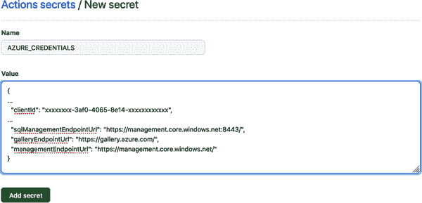

###### 图 4-3\. 添加密钥

将更改提交并推送到您的存储库，然后转到操作选项卡。新的运行会立即计划，并应在几秒钟内开始运行。几分钟后，所有事情应该已经完成。在我的情况下，图 4-4 显示需要接近四分钟。

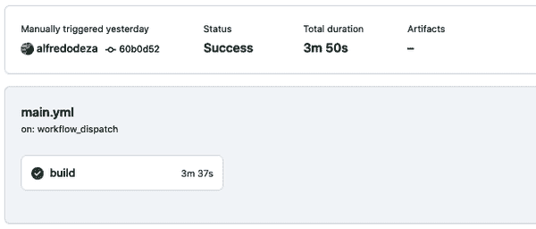

###### 图 4-4\. GitHub 动作成功

现在，完成一个成功的作业运行需要考虑多个移动部件。在设计一组新步骤（或管道，如我将在下一节中介绍的），一个好主意是列出这些步骤并确定贪婪步骤。这些 *贪婪步骤* 尝试做得太多，并且有很多责任。乍一看，很难识别可能存在问题的任何步骤。维护 CI/CD 作业的过程包括精细化步骤的责任并相应地调整它们。

一旦确定了步骤，您可以将它们分解为更小的步骤，这将帮助您更快地理解每个部分的责任。更快的理解意味着更容易调试，尽管这并不立即明显，但养成这种习惯会给您带来好处。

这些是我们打包 RoBERTa-Sequence 模型的步骤：

1.  检出存储库的当前分支。

1.  身份验证到 Azure 云。

1.  配置自动安装 Azure CLI 扩展。

1.  将文件夹附加到与工作区交互。

1.  下载 ONNX 模型。

1.  构建当前存储库的容器。

不过，还有一个最后缺少的项目，那就是在构建后发布容器。不同的容器注册表在此处需要不同的选项，但大多数都支持 GitHub Actions，这是令人耳目一新的。Docker Hub 非常简单，只需要创建一个令牌，然后将其保存为 GitHub 项目密钥，以及您的 Docker Hub 用户名。一旦设置完成，调整工作流文件以包括在构建之前的身份验证步骤：

```
      - name: Authenticate to Docker hub
        uses: docker/login-action@v1
        with:
          username: ${{ secrets.DOCKER_HUB_USERNAME }}
          password: ${{ secrets.DOCKER_HUB_ACCESS_TOKEN }}
```

最后，更新构建步骤以使用`push: true`。

最近，GitHub 也发布了一个容器注册表提供，并且它与 GitHub Actions 的集成非常直接。相同的 Docker 步骤可以在进行轻微更改并创建 PAT（个人访问令牌）后使用。首先，通过转到您的 GitHub 账户设置，点击“开发者设置”，最后点击“个人访问”令牌来创建 PAT。一旦页面加载完成，点击“生成新的令牌”。在备注部分给它一个有意义的描述，并确保该令牌具有适当的权限，如我在图 4-5 中所做的那样。

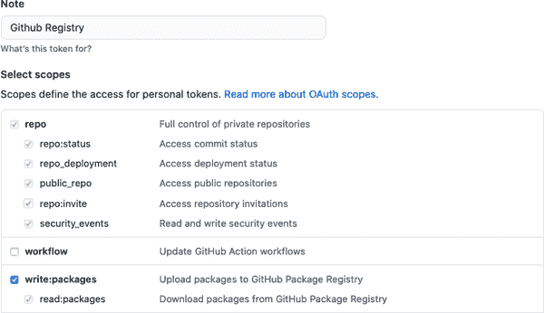

###### 图 4-5\. GitHub 个人访问令牌

完成后，会显示一个新页面，并呈现实际的令牌。这是您在明文中看到令牌的唯一时刻，因此确保现在复制它。接下来，转到包含容器代码的存储库，并创建一个新的存储库密钥，就像您在 Azure 服务主体凭据中所做的那样。将新密钥命名为*GH_REGISTRY*，并粘贴在前一步骤中创建的 PAT 的内容。现在，您已准备好更新 Docker 步骤，以使用新令牌和 GitHub 的容器注册表发布包：

```
    - name: Login to GitHub Container Registry
      uses: docker/login-action@v1
      with:
        registry: ghcr.io
        username: ${{ github.repository_owner }}
        password: ${{ secrets.GH_REGISTRY }}

    - name: build flask-app and push to registry
      uses: docker/build-push-action@v2
      with:
        context: ./
        tags: ghcr.io/alfredodeza/flask-roberta:latest
        push: true
```

在我的情况下，*alfredodeza* 是我的 GitHub 账号，所以我可以标记它以及*flask-roberta*仓库的名称。这些需要与您的账号和仓库相匹配。将更改推送到主分支（或合并拉取请求后），作业将被触发。模型应从 Azure 中拉取，打包到容器中，并最终作为 GitHub 包发布到其容器注册表中，看起来类似于图 4-6。

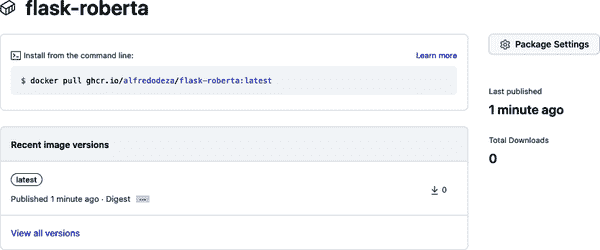

###### 图 4-6\. GitHub 包容器

现在，容器正在通过利用 GitHub 的 CI/CD 提供和容器注册表以完全自动化的方式打包和分发 ONNX 模型，我们解决了本章开始时我假设的问题情景：模型需要打包到容器中，但容器文件不可用。通过这种方式，您为其他人和过程本身提供了清晰度。它被分成了小步骤，允许对容器进行任何更新。最后，这些步骤将容器发布到选择的注册表中。

除了打包和发布容器外，CI/CD 环境还可以完成很多其他任务。CI/CD 平台是自动化和可靠结果的基础。在下一节中，我将介绍一些在任何平台上都适用的好的想法。通过了解其他平台中可用的一般模式，你可以利用这些功能，而不必担心实现细节。

# 使用云流水线

第一次听说流水线时，我认为它们比典型的脚本模式（代表构建的一组过程化指令）更高级。但事实上，流水线并不是什么高级概念。如果你在任何持续集成平台中处理过 shell 脚本，那么使用流水线将会非常直观。流水线只不过是一组步骤（或指令），可以在运行时实现特定目标，例如，在生产环境中发布模型。例如，一个包含三个步骤来训练模型的流水线可以像图 4-7 中所示那样简单。

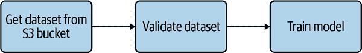

###### 图 4-7\. 简单流水线

可以将同样的流水线表示为一个 shell 脚本，它可以同时执行所有三个操作。使用流水线将关注点分离有多个好处。当每个步骤都有特定的责任（或关注点）时，更容易理解。如果一个单步流水线用于获取数据、验证数据并训练模型失败了，那么失败的原因并不明显。确实，你可以深入细节，查看日志，并检查实际错误。如果你将流水线分成三个步骤，并且“训练模型”步骤失败了，你可以缩小失败范围，并更快地找到可能的解决方案。

###### 提示

一个通用的建议是，你可以将其应用到机器学习的多个方面中，考虑让任何操作在未来失败的情况下更加简单化。避免急于快速部署和运行一个流水线（就像在这种情况下一样），因为这样做更容易。花些时间思考，什么会让你（和其他人）更容易构建机器学习基础设施。当失败发生时，如果你识别出问题的方面，回到实现并进行改进。你可以应用 CI/CD 的概念来进行改进：持续评估和改进流程是一个健全的策略，适用于稳健的环境。

云流水线与任何其他持续集成平台并无不同，只是它们由云提供商托管或管理。

有些 CI/CD 流水线的定义可能会试图严格定义流水线的元素或部分。实际上，我认为流水线的部分应该松散定义，不受定义的限制。RedHat 在[这里](https://oreil.ly/rlJUx)有一个很好的解释，描述了五个常见元素：构建、测试、发布、部署和验证。这些元素主要用于混合和匹配，而不是严格包含在流水线中。例如，如果您正在构建的模型不需要部署，那么根本不需要执行部署步骤。同样地，如果您的工作流程需要提取和预处理数据，您需要将其实现为另一个步骤。

现在您已经了解到流水线基本上与具有多个步骤的 CI/CD 平台相同，将机器学习操作应用于可操作的流水线应该是直接的。图 4-8 显示了一个相当简单的假定流水线，但这也可以涉及其他几个步骤，正如我提到的那样，这些元素可以混合和匹配以执行任意数量的操作和步骤。

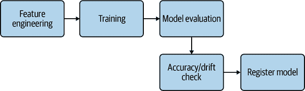

###### 图 4-8\. 涉及的流水线

AWS SageMaker 出色地提供了准备好使用的示例，用于创建涉及的流水线，其中包括运行多个步骤所需的所有内容。SageMaker 是一个专门的机器学习平台，不仅提供流水线中的步骤来完成发布模型等目标。由于它专门用于机器学习，您可以接触到对于将模型投入生产非常重要的功能。这些功能在其他常见平台如 GitHub Actions 中并不存在，或者如果存在的话，它们的考虑可能不如此周到，因为 GitHub Actions 或 Jenkins 等平台的主要目标不是训练机器学习模型，而是尽可能通用，以适应大多数常见用例。

另一个相当难以解决的关键问题是，专门用于训练的机器（例如，GPU 密集型任务）在通用流水线提供中要么根本不可用，要么难以配置。

打开 SageMaker Studio 并转到左侧边栏的“组件和注册表”部分，然后选择“项目”。显示多个 SageMaker 项目模板供您选择，如图 4-9 所示。

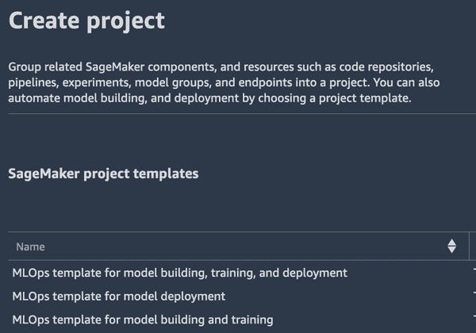

###### 图 4-9\. SageMaker 模板

###### 注意

虽然这些示例旨在帮助您入门，并提供了 Jupyter Notebooks，但它们非常适合了解涉及的步骤以及如何更改和适应它们以满足您的特定需求。在 SageMaker 中创建流水线实例后，训练并最终注册模型，您可以浏览流水线的参数，就像在图 4-10 中展示的那样。

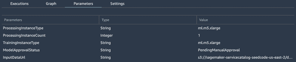

###### 图 4-10\. 流水线参数

另一个展示所有步骤的流水线的关键部分也是可用的，如 图 4-11 所示。

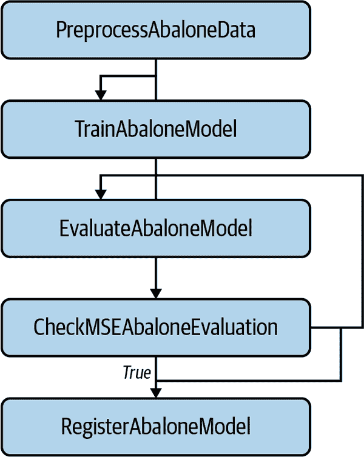

###### 图 4-11\. SageMaker 流水线

正如您所见，准备数据、训练、评估和注册模型都是流水线的一部分。主要目标是注册模型，以便稍后在打包后进行实时推断部署。并非所有步骤都需要在这个特定的流水线中捕获。您可以创建其他流水线，每当有新注册的模型可用时运行。这样，该流水线就不是针对特定模型的，而是可以重复使用于任何成功训练和注册的模型。在应用于 MLOps 时，组件的可重用性和自动化是 DevOps 的另一个关键组成部分。

现在流水线被揭秘，我们可以看到一些增强可以使它们更加健壮，通过手动控制模型的逐步部署，甚至切换推断从一个模型到另一个模型。

## 模型的控制性逐步部署

有一些从 Web 服务部署中映射到将模型部署到生产环境中的策略的概念，例如为可扩展性创建几个实例的实时推断应用程序，并逐步从旧模型切换到新模型。在深入讨论涵盖部署模型控制部分的细节之前，值得描述一下这些概念可以发挥作用的策略。

我将在本节详细讨论这两种策略。虽然这些策略相似，但它们有特定的行为，您在部署时可以利用：

+   蓝绿部署

+   金丝雀部署

蓝绿部署是一种策略，将新版本部署到与生产环境完全相同的暂存环境中。有时，此暂存环境与生产环境相同，但流量路由不同（或分开）。不详细介绍，Kubernetes 是一个允许进行这种类型部署的平台，因为您可以在同一个 Kubernetes 集群中拥有两个版本，但将流量路由到新版本的不同地址（“蓝色”），同时生产流量仍然进入较旧版本（“绿色”）。分离的原因在于它允许进一步测试和确保新模型按预期工作。一旦验证完成并且满足某些条件，您可以修改配置以将流量从当前模型切换到新模型。

蓝绿部署存在一些问题，主要与复制生产环境的复杂性有关。再次强调，这是 Kubernetes 完美适配的情况之一，因为集群可以轻松容纳同一应用的不同版本。

金丝雀部署策略稍微复杂，并且有一定的风险性。根据你的信心水平和根据约束逐步改变配置的能力，这是将模型发送到生产的合理方式。在这种情况下，流量逐步路由到新模型，*同时之前的模型正在提供预测*。因此，两个版本都是活动的并且同时处理请求，但是以不同的比例进行。选择百分比增长的原因是你可以启用指标和其他检查来实时捕捉问题，如果条件不利，可以立即回滚。

例如，假设一个新的精度更高且没有漂移的模型准备投入生产。在几个新版本实例可用以开始接收流量之后，进行配置更改以将所有流量的 10%发送到新版本。当流量开始路由时，你会注意到响应中存在大量的错误。HTTP 500 错误表明应用程序存在内部错误。经过一些调查，发现进行推理的一个 Python 依赖项尝试导入已移动的模块，导致异常。如果应用程序每分钟接收一百个请求，则只有十个请求会遇到错误条件。在注意到错误后，你迅速将配置更改为将所有流量发送到当前部署的旧版本。这个操作也被称为*回滚*。

大多数云提供商都可以针对这些策略进行受控发布模型的能力。虽然这不是一个完全功能的示例，但 Azure Python SDK 在部署时可以定义新版本的流量百分比：

```
from azureml.core.webservice import AksEndpoint

endpoint.create_version(version_name = "2",
                       inference_config=inference_config,
                       models=[model],
                       traffic_percentile = 10)
endpoint.wait_for_deployment(True)
```

难点在于金丝雀部署的目标是逐步增加，直到`traffic_percentile`达到 100%。增加必须同时满足应用程序健康和最小（或零）错误率的约束条件。

生产模型的监控、日志记录和详细指标（除了模型性能）对于强大的部署策略至关重要。我认为它们对部署至关重要，但它们是覆盖在第六章中的强大 DevOps 实践的核心支柱。除了拥有自己章节的监控、日志记录和指标外，还有其他有趣的内容可以用来进行持续交付的检查。在接下来的部分中，我们将看到一些有意义的内容，并增加将模型部署到生产环境的信心。

## 模型部署的测试技术

到目前为止，在本章构建的容器工作得非常好，确切地做了我们需要的事情：从一些带有精心制作的消息的 HTTP 请求中，JSON 响应预测了情感。一位经验丰富的机器学习工程师可能在进入模型打包阶段之前就已经放置了准确性和漂移检测（在第六章中详细讨论）。让我们假设已经这样，并集中精力在部署模型到生产之前可以执行的其他有用测试上。

当您向容器发送 HTTP 请求以生成预测时，从开始到结束需要通过几个软件层。在高层次上，这些是关键的：

1.  客户端发送 HTTP 请求，带有 JSON 体，格式为单个字符串数组。

1.  必须存在特定的 HTTP 端口（*5000*）和端点（*predict*），并进行路由。

1.  Python Flask 应用程序必须接收 JSON 负载并将其加载到本机 Python 中。

1.  ONNX 运行时需要消耗字符串并生成预测。

1.  一个带有 HTTP 200 响应的 JSON 响应需要包含预测的布尔值。

每一个这些高级步骤都可以（而且应该）进行测试。

### 自动化检查

在为本章组装容器时，我遇到了*onnxruntime* Python 模块的一些问题：文档没有固定（确切的版本号），导致安装了最新版本，需要不同的输入参数。模型的准确性很好，但我无法检测到显著的漂移。然而，一旦请求被消耗，我部署的模型就完全破损了。

随着时间的推移，应用程序变得更加优秀和更加弹性。另一位工程师可能会添加错误处理以在检测到无效输入时响应错误消息，并可能使用适当的 HTTP 错误代码以及客户端可以理解的漂亮错误消息的 HTTP 响应。在允许模型进入生产之前，您必须测试这些类型的增加和行为。

有时不会出现 HTTP 错误条件，也不会出现 Python 的回溯。如果我对 JSON 响应进行如下更改会发生什么：

```
{
  "positive": "false"
}
```

在不回顾之前章节的情况下，你能分辨出差异吗？这种变化将不会被注意到。金丝雀部署策略将达到 100%而没有检测到任何错误。机器学习工程师将对高准确率和无漂移感到满意。然而，这种变化完全破坏了模型的效果。如果你没有察觉到差异，那没关系。我经常遇到这些类型的问题，有时候可能需要花几个小时来检测问题：它使用的不是`false`（布尔值），而是`"false"`（字符串）。

这些检查任何时候都不应该是手动的；手动验证应该尽量减少。自动化应该是一个高优先级的任务，到目前为止我提出的建议都可以作为流水线的一部分添加进去。这些检查可以泛化到其他模型以供重复使用，但在高层次上，它们可以像图 4-12 所示的方式并行运行。

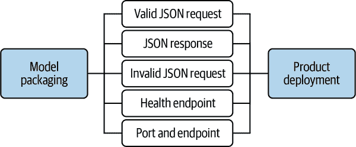

###### 图 4-12\. 自动化检查

### 代码检查

除了我提到的一些功能性检查，比如发送 HTTP 请求，还有更接近 Flask 应用程序中代码的其他检查，比如使用一个代码检查工具（[我推荐 Python 使用 Flake8](https://oreil.ly/MMs0C)）。最好自动化所有这些检查，以避免在生产发布时陷入麻烦。无论你处于什么样的开发环境，我*强烈*建议启用代码的代码检查工具。在创建 Flask 应用程序时，我在适应 HTTP 请求时发现了错误。这里是代码检查工具输出的一个简短示例：

```
$ flake8 webapp/app.py
webapp/app.py:9:13: F821 undefined name 'RobertaTokenizer'
```

未定义的名称会破坏应用程序。在这种情况下，我忘记从`transformers`模块导入`RobertaTokenizer`。当我意识到这一点后，我添加了导入并修复了它。这不会花费我超过几秒钟的时间。

实际上，你能越早发现这些问题，效果越好。谈到软件安全时，通常会听到“软件供应链”，其中*链*就是从开发到将代码发布到生产的所有步骤。在这一系列事件中，有一个持续不断的推动向*左移*的趋势。如果你把这些步骤看作一个大链条，最左边的链接是开发者创建和更新软件，而链条的末端（最右边的）是已发布的产品，最终用户可以与之交互。

尽早左移错误检测，效果越好。这是因为这比等待到生产阶段再进行回滚更便宜和更快。

### 持续改进

几年前，我曾是一个大型开源软件的发布经理。这个软件的发布过程非常复杂，发布的时间从两天到整整一周不等。由于我还负责其他系统，所以很难做出改进。有一次，在试图发布时，按照发布包的许多不同步骤，一个核心开发者要求我最后再加一个改动。我没有立刻说*“不行”*，而是问道：*“这个改动已经测试过了吗？”*

回应完全出乎意料：*“别荒谬，阿尔弗雷多，这只是一个一行的改动，而且是一个函数的文档注释。我们真的需要这个改动成为发布的一部分。”* 推动这个改动来自最高层，我不得不让步。我添加了这个临时改动并发布了版本。

第二天早晨回来后，用户（尤其是客户）都抱怨最新版本完全不可用。虽然它安装了，但根本无法运行。罪魁祸首是一行代码的变更，尽管它只是一个函数内的注释，却被其他代码解析了。该注释中有一个意外的语法，导致应用程序无法启动。这个故事并不是要责备开发者。他并不知道更好的方法。整个过程对所有参与者来说都是一个学习时刻，现在大家都清楚这个一行代码变更有多昂贵。

随后出现了一系列破坏性事件。除了重新启动发布流程外，对一个变更的测试阶段又花费了额外的一天时间。最后，我不得不*废弃*已发布的包，并重新设置存储库，以便新用户获取先前的版本。

这是一个极为昂贵的事情。参与其中的人数和高影响力使得这是一个绝佳的机会，以明确表示这种情况不应再次发生——即使只是一行代码的更改。越早检测到，影响就越小，修复的成本也更低。

# 结论

持续交付和不断反馈的实践对于强大的工作流至关重要。正如本章所证明的那样，自动化和持续改进反馈循环的价值巨大。打包容器以及流水线和 CI/CD 平台的一般功能，旨在使添加更多检查和验证变得更加容易，这些都旨在增加模型交付到生产环境的信心。

将模型发布到生产环境是首要目标，但要在非常高的信心水平下完成这一过程，以及保证步骤的韧性，是您应该努力达到的。当流程一旦建立，您的任务并未结束。您必须不断寻找方法，通过问自己这样一个问题来感谢自己：今天我能添加什么来让生活更轻松，如果这个流程失败了？最后，我强烈建议以一种易于添加更多检查和验证的方式创建这些工作流程。如果难以实现，没有人会愿意碰它，从而打败了将模型交付到生产环境的强大流水线的初衷。

现在您已经很好地掌握了模型交付及其自动化的情况，我们将在下一章深入探讨 AutoML 和 Kaizen。

# 练习

+   在容器中创建您自己的 Flask 应用程序，将其发布到 GitHub 存储库，并进行详细文档化，同时添加 GitHub Actions 以确保其正确构建。

+   修改 ONNX 容器以便将其推送至 Docker Hub 而不是 GitHub Packages。

+   修改 SageMaker 流水线，使其在训练后在注册模型之前提示您。

+   使用 Azure SDK，创建一个 Jupyter 笔记本，以增加流量流向容器的百分位。

# 批判性思维讨论问题

+   至少命名四项关键检查，以验证容器中打包的模型是否正确构建。

+   金丝雀部署（canary deployment）和蓝绿部署（blue-green deployment）之间有什么区别？你更喜欢哪一种？为什么？

+   为什么与使用 GitHub Actions 相比，云管道（cloud pipelines）更有用？至少列举三个不同之处。

+   *打包容器* 的意思是什么？为什么这很有用？

+   机器学习模型打包的三个特征是什么？
