# 第五章：自动机器学习（AutoML）与改善机器学习（KaizenML）

作者：Noah Gift

> 过于受规则束缚，部分想法无法绽放。没有思想的规则是监狱，没有规则的思想是混乱。盆景教给我们平衡。在生活的各个方面，平衡规则与创新是一个普遍存在的问题。我曾经看过一出名为《人生游戏》的戏剧。它传达的信息是，在任何人解释规则之前，人们常常被要求为高风险玩游戏。此外，要判断自己是否赢得了比赛也不是那么容易。通常情况下，初学者（尤其是年轻人）需要规则或广泛的理论作为指导。然后，随着经验的积累，许多例外和变化逐渐使规则失效，同时规则的需求也减少了。盆景相比于人生的一大优势在于人们可以从致命的错误中学习。
> 
> Joseph Bogen 博士

现在是参与构建机器学习系统的一个激动人心的时刻。机器学习，即从数据中学习，对解决从自动驾驶车辆到更有效的癌症筛查和治疗等问题具有明确的价值。与此同时，自动化在推动这一领域的进展中扮演了关键角色，包括模型创建的自动化、AutoML 和机器学习周围其他任务的自动化，我称之为 KaizenML。

虽然 AutoML 严格专注于从干净数据中创建模型，但 KaizenML 则致力于自动化*机器学习*过程中的一切并对其进行改进。让我们深入讨论这两个主题，从 AutoML 为何如此重要开始。

###### 注意

像安德鲁·吴（Andrew Ng）这样的机器学习专家现在承认，数据中心的方法比模型中心的过程更有优势。另一种表述是，改善，即从数据到软件再到模型，再到来自客户的反馈循环的整个系统的持续改进，是至关重要的。在我看来，KaizenML 意味着你正在改善机器学习系统的所有方面：数据质量、软件质量和模型质量。

# AutoML

作者厄普顿·辛克莱尔（Upton Sinclair）曾经著名地说过：“当一个人的薪水依赖于他不理解某事时，要让他理解某事是困难的。” 厄普顿·辛克莱尔的这句话在 Netflix 的纪录片《社交迷局》中所记录的社交媒体误导中得到了很好的体现。假设你在一家大规模传播误导信息并因此获得丰厚报酬的公司工作。在这种情况下，几乎不可能接受你是这一过程中的参与者，而且你的公司实际上从误导信息中获得了丰厚的利润。这为你提供了优厚的薪水和生活方式的贡献。

类似地，我想出了一些我称之为“自动化定律”的东西。一旦开始讨论自动化任务，最终自动化就会发生。一些例子包括用云计算取代数据中心和用机器取代电话总机操作员。许多公司紧紧抓住他们的数据中心，说云是世界上所有邪恶的根源。然而，最终，他们要么转向云，要么正在过渡到云中。

从大约 1880 年到 1980 年左右，完全自动化手动切换电话通话花了近 100 年时间，使一台机器可以完成这些任务，但这确实发生了。机器非常擅长自动化劳动密集型的手动任务。如果你的工作在 1970 年涉及切换电话通话，你可能会嘲笑自动化你所做的事情的想法，因为你理解这个任务有多么困难。今天，通过数据科学，可能我们正在像狂热地将超参数值推入 Python 函数并在 Kaggle 上分享结果的电话总机操作员一样，不知道所有这一切正在被自动化地进行中。

在书中，《我们如何知道什么不是真的》，托马斯·吉洛维奇指出了自我限制策略：

> 实际上有两类自我限制策略，真实和假装的。 “真实”自我限制涉及将可见的成功障碍放置在自己的道路上。这些障碍使成功的可能性较小，但它们为失败提供了一个现成的借口。在考试前不学习的学生或在试镜前饮酒的有抱负的演员都是很好的例子。有时候失败几乎是必然的，但至少不会被认为缺乏相关能力（或者至少希望如此）。
> 
> “假”自我限制，另一方面，从某些方面来说，是一种风险较小的策略，这种策略仅仅是声称在成功的道路上存在困难障碍。这种自我限制仅仅是为可能的糟糕表现找借口，无论是事前还是事后。

当数据科学计划失败时，很容易陷入其中任何一种自我限制策略。在数据科学中的一个例子可能是在项目的某些方面不使用 AutoML；这对项目的成功来说是一个“真正”的障碍。然而，软件工程的一个黄金法则是在手头任务中使用最好的工具。使用可用的最佳工具的原因是它们减少了开发的软件的复杂性。一个减少复杂性的“最佳类”工具的绝佳例子是 GitHub Actions，因为它可以简化自动化测试的创建。另一个例子是像 Visual Studio Code 这样的编辑器，因为它能够进行代码完成、语法高亮和最小配置的 linting。这两种工具通过简化软件创建的过程显著提高了开发人员的生产力。

在数据科学中，“使用最佳可用工具”的口号需要宣传。或者，如果一个数据科学项目失败（通常情况下会失败），自我限制的策略可能是说问题太具挑战性了。在任何情况下，当适用时，自动化的采纳是自我限制的解决方案。

让我们比较食物与机器学习在 图 5-1 中。请注意，食物有多种形式，从你在商店购买的面粉制作披萨到送货上门的披萨。即使其中一种比另一种复杂得多（例如，从头开始制作披萨与订购现成的热披萨），也并不意味着送货上门的选择就不算是食物。难度与否并不等同于完整性或真实性。

同样，不接受现实并不意味着事情并未发生。形容否认现实的另一种方式是称之为“魔幻思维”。许多魔幻思想家在 COVID-19 疫情初期说：“这只是流感”，试图安抚自己（及他人），认为危险并没有看起来那么严重。然而，2021 年的数据完全说明了不同的情况。在美国，COVID-19 的死亡人数接近所有形式心脏病的死亡人数的 75%，而心脏病目前是美国的主要死因。同样，贾斯汀·福克斯在一篇使用 CDC 数据的[彭博新闻文章](https://oreil.ly/0sXwI)中指出，对大多数年龄段来说，这场大流行比流感致命多次。见 图 5-2。

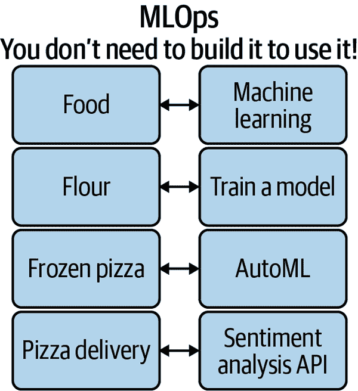

###### 图 5-1\. 食物与 ML 的比较

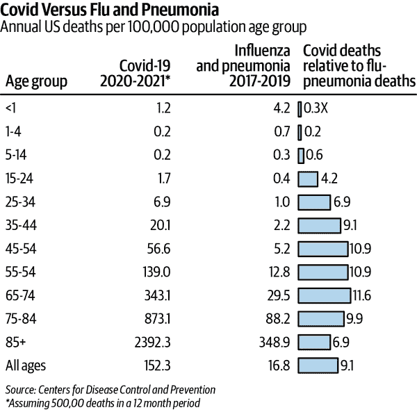

###### 图 5-2\. COVID-19 与流感和肺炎的比较（来源：[彭博新闻](https://oreil.ly/pUEFc)）

AutoML 对数据科学家来说是一个拐点，因为它与其他历史趋势（自动化和魔幻思维）类似。任何能自动化的都将自动化。接受这一趋势而不是与之抗争将会在机器学习的工作流程中大大提升生产力。特别是，AutoML 可能是全面实施 MLOps 理念中最关键的技术之一。

在 COVID-19 爆发之前，加州大学伯克利分校的研究科学家珍妮弗·道德纳博士与合作者埃玛纽埃尔·夏朋提尔博士致力于研究基因编辑的艰巨任务。当 COVID-19 疫情开始时，道德纳博士意识到她需要迅速将这项研究转化为一种开创性的方法，以加速疫苗的研发。因此，她开始了“拯救世界”的工作。

###### 注

COVID-19 药物发现与 MLOps 有何关联？数据科学中的一个关键问题是将研究解决方案投入生产。同样，医学研究的一个基本问题是将发现带到从中受益的患者手中。

在《*破译者：詹妮弗·道德纳、基因编辑与人类未来*》（Simon & Schuster Australia）中，沃尔特·艾萨克森描述了道德纳博士现在“…现在强烈认为基础研究应与转化研究结合，将发现从实验室推广到床边…” 现在，诺贝尔奖获得者詹妮弗·道德纳博士与埃曼纽尔·夏朋蒂埃博士共同创造了导致基因编辑和 CRISPR 机制商业应用的研究。

她的竞争对手之一，最终参与竞争疫苗现代纳公司的冯·张博士提到，加州大学伯克利分校实验室并未致力于将其应用于人类细胞。他批评说，他的实验室正在利用 CRISPR 研究来针对人类细胞，而道德纳博士则专注于研究本身。

这种批评是关于谁应该声称这些发现的专利争议的核心，即多少工作是研究，多少是研究应用？这听起来有点像数据科学与软件工程的争论，不是吗？最终，道德纳博士确实“将其投入生产”形式化为辉瑞疫苗。我最近接种了这种疫苗，像许多人一样，我为其投入生产感到高兴。

如果我们像“运作”COVID-19 疫苗的科学家们一样急迫地解决问题，我们还能共同完成什么？当我在初创企业担任工程经理时，我喜欢问人们假设性问题。一些变体问题是“如果你必须在截止日期前拯救世界呢”？我喜欢这个问题，因为它能迅速切中要害。它迅速切入问题的本质，因为如果时钟在倒计时拯救数百万生命，你只会解决问题的基本要素。

Netflix 有一部令人难以置信的纪录片名为《*第二次世界大战的彩色影像*》。关于这部纪录片令人印象深刻的地方在于，它展示了那些历史悲剧事件的真实修复和上色的影像。这真的帮助你想象当时亲历那些事件是什么感觉。在这些线索中，想象一下自己身处一个需要解决能拯救世界的技术问题的情境。当然，如果你搞错了，你所知道的每个人都将遭受可怕的命运。然而，自动机器学习或任何形式的自动化结合问题的紧急性，只解决问题的必要组成部分，可以导致全球更好的结果：例如，药物发现和癌症检测。

这种情境思维方式为决定如何解决问题增加了一个澄清的组成部分。无论你在做什么，都很重要，否则就无关紧要。这与工作在 COVID-19 疫苗上的科学家们的方式非常相似。要么科学家们所做的导致了更快的 COVID-19 疫苗，要么没有。因此，每天的浪费都是更多全球人口被病毒夺去的一天。

同样，我记得在 2016 年左右去过旧金山湾区的一个时髦初创公司，并评论说他们从许多顶级风险投资公司获得了 3000 万美元的资金。首席运营官私下告诉我，他非常担心他们没有实际产品或赚钱的途径。多年后，他们甚至获得了更多的资金，但我仍然不确定他们的实际产品是什么。

因为这家公司无法创造收入，所以进行筹款。如果你无法筹款，那么你必须创造收入。同样，如果你无法将你的机器学习模型投入生产，你就会继续做“ML 研究”，即在 Kaggle 项目上不断调整超参数。因此，Kaggle 从业者应该问的一个好问题是，“我们确定我们不只是通过训练谷歌的 AutoML 技术来自动化调整超参数的工作吗？”

我们倾向于擅长的事情。专注于自己擅长的事情有许多美好之处，比如会带来成功的职业生涯。然而，有时候也需要挑战自己，暂时从解决问题的最紧急方式出发，就像 Doudna 博士和 Zhang 博士在 COVID-19 方面所做的那样。这会改变你的方法吗？例如，如果我有四个小时来训练一个模型并将其投入生产以拯救世界，我会尽量少写代码，并使用 Azure AutoML、Apple Create ML、Google AutoML、H20 或 Ludwig 等现成的自动化工具。在这种情况下，后续问题就变成了，为什么我要写*任何*代码，或者至少为所有机器学习工程项目写尽可能少的代码？

世界需要高质量的机器学习模型投入生产，特别是因为有许多紧急问题需要解决：寻找治愈癌症的方法，优化清洁能源，改进药物发现和创造更安全的交通。社会可以通过现在可以自动化的事物来集体做到这一点，并致力于找到今天无法自动化的事物的自动化方法。

AutoML 是与在干净数据上训练模型相关的任务自动化。然而，在现实世界中，并非所有问题都那么简单，因此与机器学习相关的*所有*事物都需要自动化。这就是 KaizenML 介入的地方。Kaizen 在日语中意味着持续改进。有了 KazienML，您可以持续改进和自动化作为开发机器学习系统的核心方式。接下来让我们深入探讨这个概念。

## MLOps 工业革命

许多机器学习的学生和从业者认为 AutoML 是一个极具争议的话题。数据科学是一种行为，而 AutoML 是一种技术——它们只是构建 ML 系统的一小部分，它们是互补的。AutoML 之所以具有争议，是因为数据科学家们认为它会取代他们的工作，然而事实上，AutoML 只是自动化和持续改进的一个极小部分，即 MLOps/ML 工程/KaizenML，如图 5-3 所述。

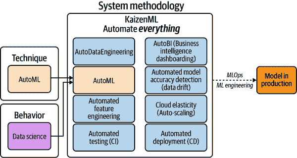

###### 图 5-3\. AutoML 是 KaizenML 的一个微小部分

从 1760 年到 1840 年的工业革命是人类任务由蒸汽和煤炭机器驱动的自动化过程中的一段充满戏剧性的时期。这种自动化导致人口增长、国内生产总值和生活质量的提高。后来，大约在 1870 年，第二次工业革命发生了，允许大规模生产和新的电网系统。

在 Disney+ 上有一部名为 [*Made in a Day*](https://oreil.ly/nLA7Y) 的优秀系列。第一集展示了特斯拉如何使用机器人进行汽车开发阶段。机器人会螺丝紧东西、将东西螺栓在一起并焊接零件。当看到这个工厂时，我想到人类是如何协助机器人的。基本上，他们把那些他们自己尚不能完全自动化的工作交给了机器人。

同样，当观察到充满独特雪花配置的传统数据科学工作流程，并且人类“紧固”超参数时，让我想到第二次工业革命中早期的福特装配厂。最终，手动的人类任务被自动化，而第一件被自动化的事情是最容易自动化的。

人们还问的另一个问题是，机器学习技术的许多方面是否真的必要，比如手动调整超参数，即选择聚类数。想象一下去到一个充满先进机器人技术的特斯拉工厂，并告诉自动化工程师人类也可以焊接零件。这种说法是不合逻辑的。当然，我们人类可以执行比我们更好的机器任务，但我们应该吗？同样地，对于许多繁琐和手动的机器学习方面，机器表现得更好。

在机器学习和人工智能领域可能很快发生的事情是，技术本质上会成为商品化。相反，自动化本身及其执行能力才是关键。关于物理制造的电视节目名称为“Made in a Day”，因为汽车或吉他只需一天制造！许多从事机器学习的公司在整整一年内都无法建立一个基于软件的模型，尽管这可能是未来的过程。

我看到可能很快发生的一个场景是，至少 80%的数据科学手动训练模型将被商品化的开源 AutoML 工具或下载的预构建模型所取代。这一未来可能会因开源项目（如 Ludwig）或商业项目（如 Apple CreateML）的发展而实现。用于训练机器学习模型的软件可能会变成像 Linux 内核那样自由和无处不在。

如果按照现有形式进行，数据科学可能会呈双峰分布；要么你年薪百万美元，要么你是初级人员。大部分竞争优势都来自传统软件工程的最佳实践：数据/用户、自动化、执行力，以及坚实的产品管理和业务实践。数据科学家可能会成为一种标准技能，就像会计、写作或其他情况下的批判性思维一样，而不仅仅是一个职业头衔。你可以称之为 MLOps 工业革命。

图 5-4 是这一实践的一个例子。想象一下 Kaggle 就像一个反馈环路，谷歌利用它来改进其 AutoML 工具。为什么他们不利用人类数据科学家训练模型来提升他们的 AutoML 服务呢？在数据科学 1.0 中，人类手动“点击按钮”，就像过去的电话接线员一样。与此同时，如果他们愿意，谷歌可以利用这些人类来训练他们的 AutoML 系统来执行这些手动数据科学任务。在许多情况下已经出现的数据科学 2.0 中，自动化工具彻底训练了之前在 Kaggle 上训练过的模型。

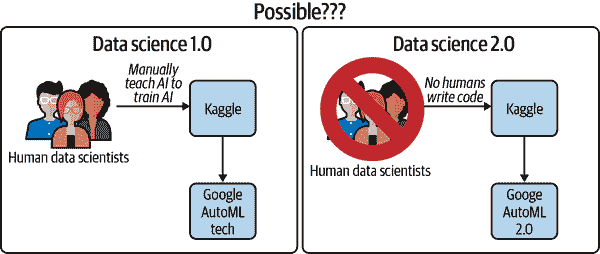

###### 图 5-4\. Kaggle 自动化

在机器学习和数据科学中，随着机器在其中的角色日益增加，MLOps 工业革命正在我们眼前发生。如果这些变化正在进行中，你应该投资于哪些技能呢？无论从技术还是业务的角度来看，都要在自动化和执行方面达到世界级水平。此外，要结合坚实的领域专业知识。在《创新如何运作：为何在自由中蓬勃发展》（Harper）一书中，作者马特·里德利清楚地解释了创新并不是构想的基础，而是将构想结合到执行中的过程。本质上是，它是否有效，是否会有人为此付费？

## Kaizen 与 KaizenML

谈论数据科学、AutoML 和 MLOps（KaizenML）存在一个问题，那就是人们经常误解它们各自的含义。数据科学不再是解决方案，就像统计学不是解决问题的方案一样；它是一种行为。AutoML 只是一种技术，就像持续集成（CI）一样；它自动化了琐碎的任务。因此，AutoML 并不直接与数据科学竞争；而像巡航控制或半自动驾驶这样的技术，也不会与司机竞争。司机仍然必须控制车辆，并充当发生事件的中央仲裁者。同样地，即使在机器学习中有了广泛的自动化，人类仍然必须就更大的局面做出执行决策。

KaizenML/MLOps 是一种系统方法论，导致模型投入生产。在图 5-5 中，您可以看到未来可能发生的假设的 MLOps 工业革命。数据及其有效处理的专业知识因为是一种稀缺资源而成为竞争优势。随着 AutoML 技术的进步，今天许多数据科学家做的事情可能会消失。现代车辆很少不配备某种形式的巡航控制或手动变速器。同样，将来数据科学家很少需要调整超参数也可能会不常见。那么当前的数据科学家可能会转变为 ML 工程师或领域专家，他们作为工作的一部分“从事数据科学”。

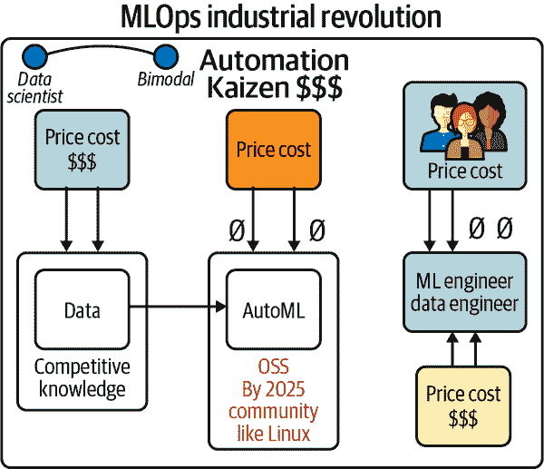

###### 图 5-5\. MLOps 工业革命

仅仅谈论 AutoML 与数据科学的问题在于，它淡化了更重要的自动化和持续改进问题。机器学习技术的自动化如此极化，以至于核心问题被忽视：一切都应该自动化，不仅仅是像超参数调优这样单调乏味的部分。通过持续改进的自动化使数据科学家、机器学习工程师和整个组织能够专注于重要的事情，即执行。正如您可以在图 5-6 中看到的那样，改善是日本的一个术语，意为持续改进。二战后，日本围绕这一概念建立了其汽车工业。本质上，如果发现了问题或未经优化的地方，就应该修复它。同样，通过 KaizenML，从特征工程到 AutoML，机器学习的每个方面都在不断改进。

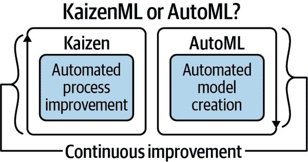

###### 图 5-6\. Kaizen 或 AutoML

地球上的每个人都应该做数据科学和编程，因为这些都是批判性思维的形式。最近的大流行病是一个关于理解数据科学对个人生活至关重要的重要警示。许多人死于他们没有理解到显示 COVID-19 并不像流感那样仅仅是因为它更加致命的数据；同样，关于人们因错误计算疫苗对他们自己或其社区脆弱成员的风险相对于 COVID-19 对他们自己的风险的故事也充斥着。理解数据科学可以拯救你的生命，因此，任何人都应该有数据科学家所拥有的工具。

这些工具是“人权”，不应该只属于精英僧侣的手中。暗示“精英”人士才能写简单程序、理解机器学习或从事数据科学是不合逻辑的。自动化将使数据科学和编程变得足够简单，以至于每个人都可以做到，而且在许多情况下，他们甚至可以利用现有的自动化来做到。

KaizenML/MLOps 专注于通过机器学习和受 DevOps 影响的软件工程解决问题，以实现业务价值或改善人类条件，例如治愈癌症。

## 特征存储

所有复杂的软件系统都需要自动化和简化关键组件。DevOps 是关于自动化软件测试和部署。MLOps 不仅仅是这样，还要提高数据和机器学习模型的质量。我之前称这些对数据和机器学习模型的持续改进为 KaizenML。一种思考方式是，DevOps + KaizenML = MLOps。KaizenML 包括构建特征存储，即高质量机器学习输入的注册以及监测数据漂移、注册和服务化 ML 模型。

在图 5-7 中，请注意在手动数据科学中，一切都是定制的。因此，数据质量较低，甚至很难使工作模型进入生产并解决问题。然而，随着从数据到特征再到实际在生产中服务模型的自动化增加，这导致了更好的结果。

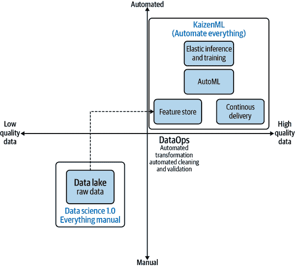

###### 图 5-7\. 特征存储作为 KaizenML 的一部分

与 KaizenML 密切相关的是特征存储的概念，即持续改进的机器学习。Uber 工程博客对[特征存储解决的问题](https://oreil.ly/ej36j)有很好的详细解释。根据 Uber 的说法，它解决了两个问题：

+   允许用户将构建的特征添加到共享的特征存储中。

+   一旦特征存储中有了特征，它们就很容易在训练和预测中使用。

在图 5-8 中，你可以看到数据科学是一种行为，但 AutoML 是一种技术。AutoML 可能只解决了自动化问题的 5%。数据本身需要通过 ETL 作业管理进行自动化。特征存储需要自动化以改进 ML 输入。最后，部署需要通过自动部署（CD）和云弹性使用的本地化使用进行自动化。所有复杂软件系统都需要自动化，特征存储只是许多 MLOps 组件中需要持续改进的一个，即 KaizenML。

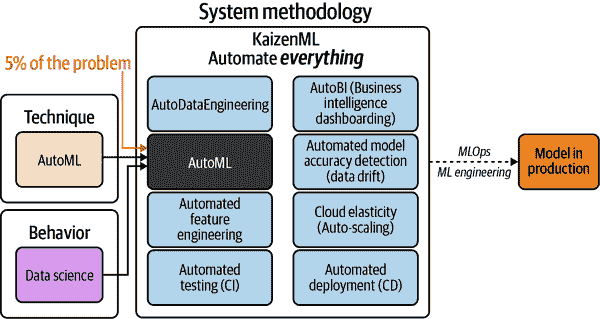

###### 图 5-8\. 特征存储是系统方法论自动化的一部分

Feature Store 有许多实际用例。例如，Uber 解释称它 [在 Feature Store 中使用了 10,000 个特征](https://oreil.ly/iuDeG)，以加速机器学习项目并构建 AutoML 解决方案。此外，像 [Databricks](https://oreil.ly/aqFju) 这样的平台已将 Feature Store 集成到其大数据系统中。例如，在 Figure 5-9 中，您可以看到原始数据是输入，经过转换后形成更精细和专业的特征注册表，能够解决批处理和在线问题。

在 Figure 5-10 中，请注意传统数据仓库与 MLOps 特征存储之间的相似性和差异。数据仓库主要用于高层的商业智能系统，而特征存储则为 ML 系统提供输入。机器学习数据处理包括数据归一化、数据清洗以及寻找能够改进 ML 模型的适当特征。创建特征存储系统是完全采用从构思到生产的机器学习自动化过程的又一种方式。

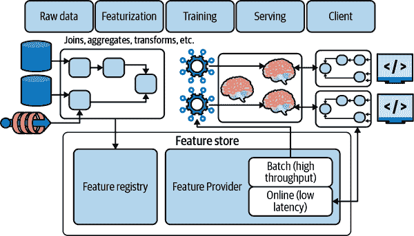

###### Figure 5-9\. Databricks 特征存储

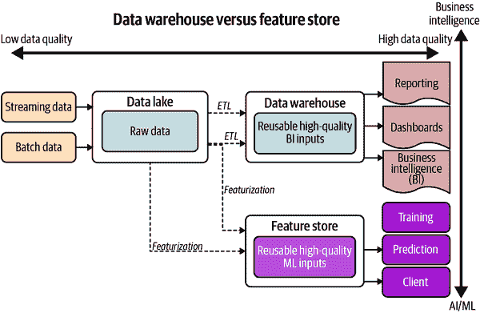

###### Figure 5-10\. 数据仓库与特征存储

接下来，让我们离开理论，实践使用苹果 ML 生态系统构建机器学习模型的技术。我们将使用其高级 AutoML 框架 CreateML 进行操作。

# 苹果生态系统

苹果可能看起来不太可能进入机器学习工具领域，直到您深入了解。苹果在移动开发周围有着丰富的生态系统。根据 [Statista](https://oreil.ly/SEnIY) 的数据，2019 年至 2020 年，苹果应用商店的全球总收入从 555 亿美元增长到了 723 亿美元。苹果受益于开发者在其应用商店中创建销售产品。

我记得曾经和一个相当轻视的教授讨论过“构建机器学习应用程序”的话题，可能是因为他偏向于复杂性和在研究中的发现。从某种意义上说，软件行业的思维方式与大学里的研究人员相反。撰写机器学习学术论文与将机器学习操作化为“构建应用程序”是两种截然不同的方向。这种“思想”与“执行”的分歧正如之前讨论的那样。

Apple 希望你在其应用商店中构建应用程序，因为它从每笔交易中抽取 15% 至 30% 的费用。苹果使开发者工具越好，应用程序在应用商店中生存的可能性就越大。在商学院有一句话：“在哪里建立汉堡王？在麦当劳旁边。”这句话的意思是说，你不需要花钱研究扩展到哪里，因为顶级竞争对手已经做了这项工作。你可以依赖他们的专业知识——同样，机器学习的从业者可以依赖苹果的研究。他们看到未来是高级自动化机器学习在专用硬件上运行。

类似地，为什么许多风险投资公司只投资已由顶级风投公司投资的公司？因为他们不需要做任何工作；他们可以从更有经验的公司的专业知识中获利。同样，苹果在设备上的机器学习领域有着巨大的投资。特别是苹果自己开发芯片，如 A 系列：A12-A14，如 Figure 5-11 所示，包括 CPU、GPU 和专用神经网络硬件。


###### Figure 5-11\. Apple 的 A14 芯片。

此外，新的芯片包括 Apple M1 架构，苹果在移动设备、笔记本电脑和台式机上使用，如 Figure 5-12 所示。


###### Figure 5-12\. Apple 的 M1 芯片。

开发环境通过 Apple 的模型格式 [Core ML](https://oreil.ly/jyoxD) 使用此技术。还有一个 Python 包可以将从 TensorFlow 和 Keras 等第三方训练库训练的模型转换为 Core ML。

Core ML 针对设备性能进行了优化，并与苹果硬件协同工作。有几种不明显的工作流程需要考虑：

+   使用 Apple 的 Create ML 框架来制作 AutoML 解决方案。

+   下载预训练模型并可选择转换为 Core ML 格式。可以从 [tfhub](https://oreil.ly/ouuNI) 下载模型的位置之一。

+   通过其他框架编写代码自己训练模型，然后使用 [coremltools](https://oreil.ly/vYGcE) 转换为 Core ML。

让我们深入了解 Apple 的 AutoML。

## Apple 的 AutoML：Create ML。

Apple 的 ML 平台的核心创新之一是，它将封装在直观 GUI 中的强大 AutoML 技术暴露给用户。Apple Create ML 让你可以做以下事情：

+   创建 Core ML 模型。

+   预览模型性能。

+   在 Mac 上训练模型（利用其 M1 芯片堆栈）。

+   使用训练控制：即暂停、保存和恢复训练。

+   使用外置 GPU（eGPU）。

此外，它处理各种领域，包括图像、视频、动作、声音、文本和表格。让我们通过 Apple 的 CreateML 深入探讨 AutoML。注意 Figure 5-13 中许多自动化机器学习形式的完整列表，以及它们最终如何收敛到在 iOS 上运行的同一 Core ML 模型。

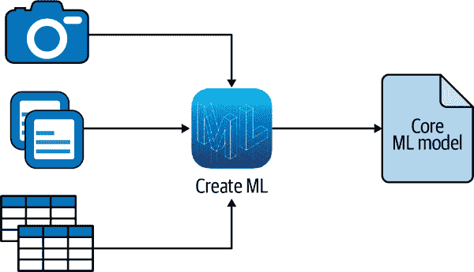

###### Figure 5-13\. Create ML。

要开始使用 Create ML，请执行以下操作：

1.  下载 [XCode](https://oreil.ly/dOCQj)。

1.  打开 XCode 并右键点击图标以启动 Create ML（参见 Figure 5-14）。

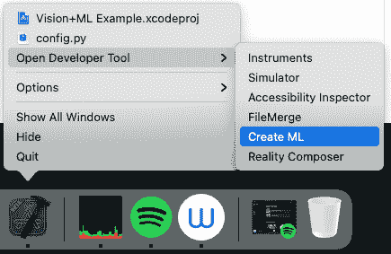

###### Figure 5-14\. 打开 Create ML

接下来，使用图像分类器模板（见 Figure 5-15）。

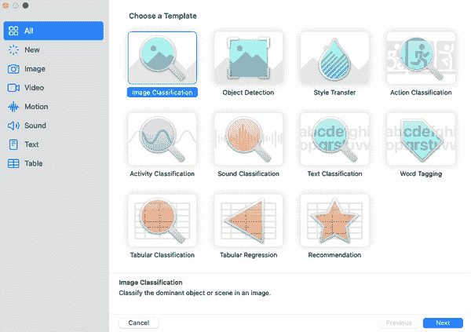

###### Figure 5-15\. 图像分类器模板

您可以在 [书籍的 GitHub 存储库](https://oreil.ly/XMB82) 中获取“猫和狗”的较小版本的 Kaggle 数据集。将 `cats-dogs-small` 数据集拖放到 Create ML 的 UI 中（参见 Figure 5-16）。

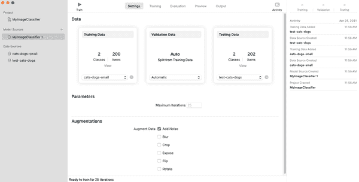

###### Figure 5-16\. 上传数据

还有，[将测试数据](https://oreil.ly/JRNmt) 拖放到 Create ML 的测试部分。

接下来，通过点击训练图标来训练模型。请注意，您可以通过右键单击模型来源多次训练模型。您可能希望尝试这样做，因为它允许您使用“增强”（如噪声、模糊、裁剪、曝光、翻转和旋转）测试，这些将使您能够创建更具一般适用性的更健壮模型（见 Figure 5-17）。

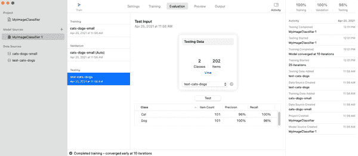

###### Figure 5-17\. 训练后的模型

这个小数据集只需几秒钟就可以训练模型（尤其是如果您有更新的 Apple M1 硬件）。您可以通过查找互联网上的猫和狗图片、下载并将它们拖到预览图标中进行测试（见 Figure 5-18）。

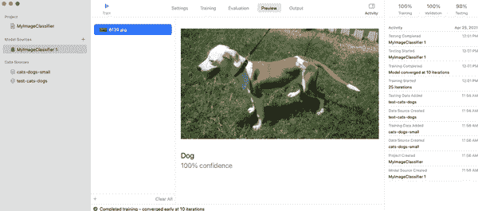

###### Figure 5-18\. 预览

最后一步是下载模型并在 iOS 应用程序中使用。请注意，在 Figure 5-19 中，我使用 OS X Finder 菜单命名模型并保存到我的桌面。这一最终步骤可能是那些希望构建仅在其手机上运行的定制 iOS 应用程序的业余爱好者的终端步骤。保存模型后，您可以选择将其转换为另一种格式，例如 [ONNX](https://onnx.ai)，然后在诸如 Microsoft Azure 的云平台上运行它。

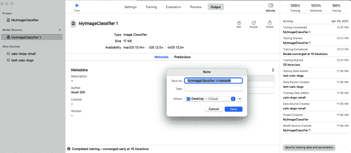

###### Figure 5-19\. 创建 ML 模型

很棒！您已经训练了您的第一个不需要任何代码的模型。随着更多这些工具的演进并进入消费者手中，未来将会非常美好。

可选的下一步骤：

+   您可以通过 [下载更大的 Kaggle 数据集](https://oreil.ly/uzj4c) 来训练更复杂的模型

+   您可以尝试其他类型的 AutoML

+   您可以尝试使用增强技术

现在您已经了解如何使用 Create ML 训练模型，让我们深入了解如何进一步利用 Apple 的 Core ML 工具。

## Apple 的 Core ML 工具

Apple 生态系统中更令人兴奋的工作流之一是通过 Python 库下载模型并将其转换为 Core ML 工具。有许多地方可以获取预训练模型，包括 TensorFlow Hub。

在本例中，让我们演示在 [此 Colab 笔记本](https://oreil.ly/BBs71) 中的代码。

首先，安装 `coremltools` 库：

```
!pip install coremltools
import coremltools
```

接下来，下载模型（基于 [官方快速入门指南](https://oreil.ly/Z5vpq)）。

导入 tensorflow 库：

```
# Download MobileNetv2 (using tf.keras)
keras_model = tf.keras.applications.MobileNetV2(
    weights="imagenet",
    input_shape=(224, 224, 3,),
    classes=1000,
)
# Download class labels (from a separate file)
import urllib
label_url = 'https://storage.googleapis.com/download.tensorflow.org/\
 data/ImageNetLabels.txt'
class_labels = urllib.request.urlopen(label_url).read().splitlines()
class_labels = class_labels[1:] # remove the first class which is background
assert len(class_labels) == 1000

# make sure entries of class_labels are strings
for i, label in enumerate(class_labels):
  if isinstance(label, bytes):
    class_labels[i] = label.decode("utf8")
```

转换模型并设置模型的元数据为正确的参数：

```
import coremltools as ct

# Define the input type as image,
# set preprocessing parameters to normalize the image
# to have its values in the interval [-1,1]
# as expected by the mobilenet model
image_input = ct.ImageType(shape=(1, 224, 224, 3,),
                           bias=[-1,-1,-1], scale=1/127)

# set class labels
classifier_config = ct.ClassifierConfig(class_labels)

# Convert the model using the Unified Conversion API
model = ct.convert(
    keras_model, inputs=[image_input], classifier_config=classifier_config,
)
```

现在更新模型的元数据：

```
# Set feature descriptions (these show up as comments in XCode)
model.input_description["input_1"] = "Input image to be classified"
model.output_description["classLabel"] = "Most likely image category"

# Set model author name
model.author = "" # Set the license of the model

# Set the license of the model
model.license = ""# Set a short description for the Xcode UI

# Set a short description for the Xcode UI
model.short_description = "" # Set a version for the model

# Set a version for the model
model.version = "2.0"
```

最后，保存模型，在 Colab 下载并在 XCode 中打开进行预测（参见 图 5-20）。

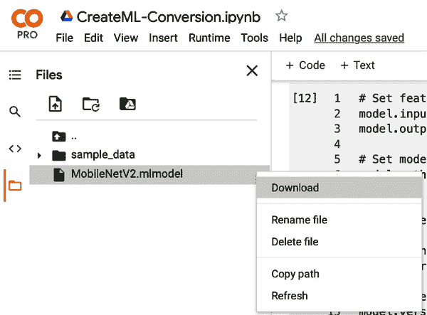

###### Figure 5-20\. 下载模型

```
# Save model
model.save("MobileNetV2.mlmodel")

# Load a saved model
loaded_model = ct.models.MLModel("MobileNetV2.mlmodel")
```

图 5-21 展示了一个预测示例。

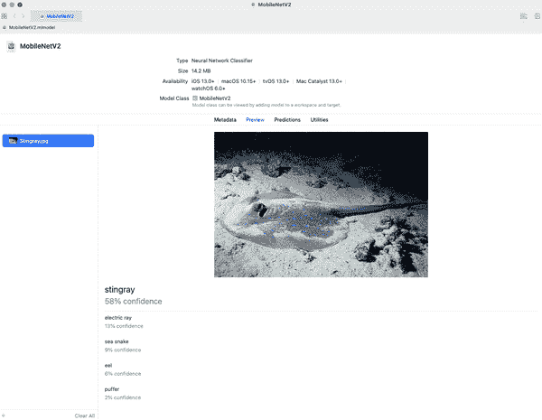

###### Figure 5-21\. 鳐鱼预测

这个过程的重要一点是，它比使用 AutoML 还要简单。因此，在许多情况下，下载由专家创建的模型（这些专家可以访问昂贵的计算集群）可能比自己训练模型更有意义。Apple 的 Core ML 框架允许使用定制的 AutoML 或预训练模型。

# 谷歌的 AutoML 和边缘计算机视觉

在过去几年里，我在顶尖数据科学大学教授了数百名学生一门名为“应用计算机视觉”的课程。课程的前提是使用最高级的工具快速构建解决方案，包括 Google AutoML 和边缘硬件，如包含 TPU 的 Coral.AI 芯片或 Intel Movidius。

图 5-22 展示了两个小型边缘机器学习解决方案的示例。

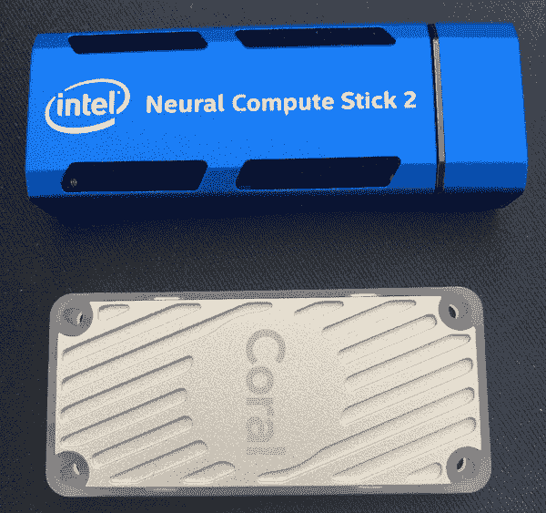

###### Figure 5-22\. 边缘硬件

教授这门课程时，令人惊讶的是学生们多快能够采用“现成的”解决方案，将它们组合起来，并提出解决问题的方案。我见过在移动设备上运行的项目，包括口罩检测、车牌检测和垃圾分类应用，几乎没有编写代码。我们正处于一个新时代，MLOps 时代，将代码投入到工作应用程序中变得更加容易。

像苹果和谷歌一样，许多公司构建了一个垂直集成的堆栈，提供了机器学习框架、操作系统和专用硬件，如 ASIC（专用集成电路），用于执行特定的机器学习任务。例如，TPU 或 TensorFlow 处理单元正在积极开发中，定期更新芯片设计。边缘版本是一个专门设计的 ASIC，用于运行 ML 模型。这种紧密集成对于寻求快速创建真实世界机器学习解决方案的组织至关重要。

GCP 平台上有几种关键的计算机视觉方法（与其他云平台类似，服务名称不同）。这些选项按难度排序如下：

+   编写训练模型的机器学习代码

+   使用 Google AutoML Vision

+   从 [TensorFlow Hub](https://tfhub.dev) 或其他位置下载预训练模型

+   使用 [Vision AI API](https://oreil.ly/7pX3S)

让我们检查一个 Google AutoML Vision 工作流程，该流程以部署到 iOS 设备的计算机视觉模型结束。无论您使用 Google 提供的样本数据集还是自己的数据集，该工作流程基本相同：

1.  启动 Google Cloud 控制台并打开云 Shell。

1.  启用 Google AutoML Vision API，并为项目授予权限；您需要设置 `PROJECT_ID` 和 `USERNAME`：

    ```
    gcloud projects add-iam-policy-binding $PROJECT_ID \
    --member="user:$USERNAME" \
    --role="roles/automl.admin"
    ```

1.  通过 CSV 文件将训练数据和标签上传到 Google Cloud Storage。

    如果您设置了 `${BUCKET}` 变量 `export BUCKET=$FOOBAR`，那么只需三个命令就能复制 Google 的样本数据。这里以云分类（卷积云、积云、层云）为例。您可以在 Google Qwiklabs 中找到有关“使用 AutoML Vision 在云中对云图像进行分类”的详细步骤。在这个示例中，数据位于 `gs://spls/gsp223/images/` 位置，`sed` 命令替换了具体路径：

    ```
    gsutil -m cp -r gs://spls/gsp223/images/* gs://${BUCKET}
    gsutil cp gs://spls/gsp223/data.csv .
    sed -i -e "s/placeholder/${BUCKET}/g" ./data.csv
    ```

    # 适用于 Google AutoML 的额外数据集

    您可能还想尝试的其他两个数据集是 [tf_flowers 数据](https://oreil.ly/nknp3) 和 [猫狗数据](https://oreil.ly/nEJOd)。另一个想法是上传您的数据。

1.  视觉检查数据。

    Google Cloud AutoML 系统的一个有价值的方面是使用高级工具检查数据，添加新标签或修复数据质量控制问题。请注意，在 图 5-23 中，您可以在不同的分类类别之间切换，这些分类类别恰好是花卉。

    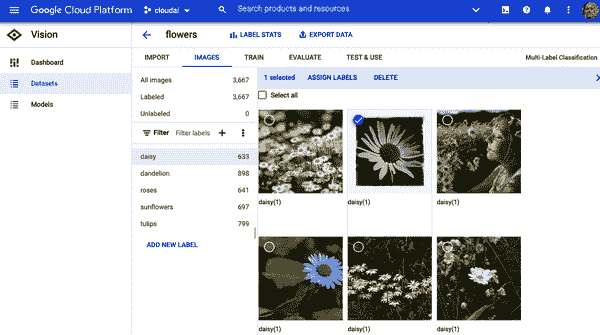

    ###### 图 5-23\. 检查数据

1.  训练模型并评估。

    在控制台中点击按钮即可训练模型。Google 将这些选项汇集到其产品 [Google Vertex AI](https://oreil.ly/P5m7Y) 中。请注意，在 图 5-24 中，左侧面板上有一系列操作，从笔记本到批量预测。创建新的训练作业时，AutoML 和 AutoML Edge 都是选项。

    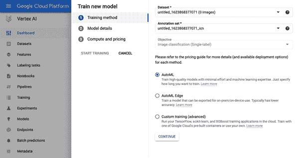

    ###### 图 5-24\. Google Vertex AI

1.  之后，使用内置工具评估训练好的模型（见 图 5-25）。

    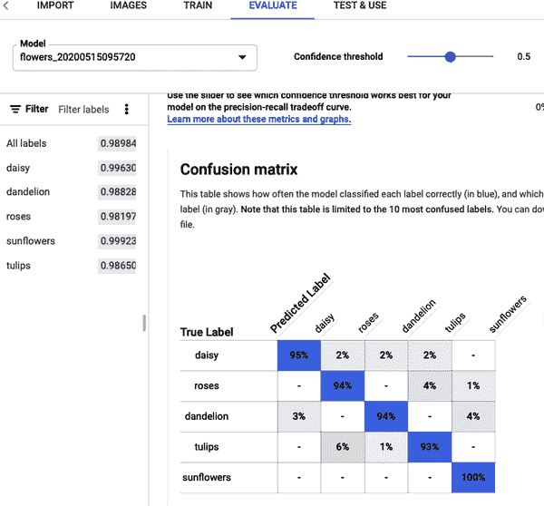

    ###### 图 5-25\. 评估数据

1.  处理模型：在线预测或下载。

    使用 Google AutoML Vision，可以创建在线托管的端点或下载模型，并在边缘设备上进行预测：iOS、Android、Javascript、Coral 硬件或容器（见 图 5-26）。

    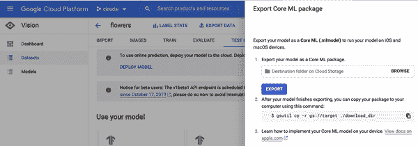

    ###### 图 5-26\. 下载模型

主要的要点是，Google Cloud 提供了一个经过验证的路径，从上传训练数据到无需或最小编码进行机器学习解决方案构建，可部署到边缘设备。这些选项都集成在 Google 的托管机器学习平台 Vertex AI 中。

接下来，让我们深入了解 Azure 的 AutoML 解决方案，与 Google 类似，有关于管理 MLOps 生命周期的完整故事。

# Azure 的 AutoML

访问 Azure 自动机器学习有两种主要方法。一种是通过控制台，另一种是通过 AutoML 的 [Python SDK](https://oreil.ly/EKA0b) 进行编程访问。让我们先看看控制台。

要在 Azure 上开始使用 AutoML，你需要启动一个 Azure ML Studio 实例，并选择自动化 ML 选项（见 图 5-27）。

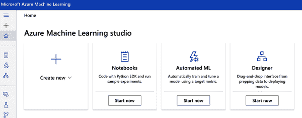

###### 图 5-27\. Azure 自动机器学习

接下来，创建一个数据集，可以是上传的数据或使用公开数据集。在这个例子中，我使用了来自 [Kaggle 社交力量 NBA 项目](https://oreil.ly/Bsjly) 的数据（见 图 5-28）。

然后，我启动了一个分类作业，预测基于数据集中的特征一个球员可能打哪个位置。请注意，有许多不同类型的机器学习预测可用，包括数值回归和时间序列预测。如果你还没有设置存储和集群，你需要设置它们（见 图 5-29）。

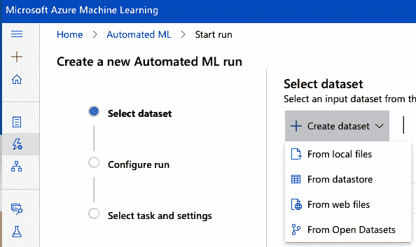

###### 图 5-28\. Azure 自动机器学习创建数据集

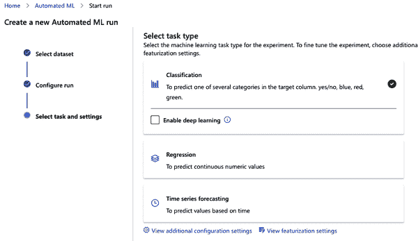

###### 图 5-29\. Azure 自动机器学习分类

作业完成后，你也可以要求 Azure ML Studio “解释”它是如何得出预测的。机器学习系统通过“可解释性”来解释模型生成预测的过程，这是自动机器学习系统中一个关键的即将推出的能力。你可以在 图 5-30 中看到这些解释能力。注意，这个平台技术通过与 ML Studio 解决方案的深度集成提供了广泛的感觉。

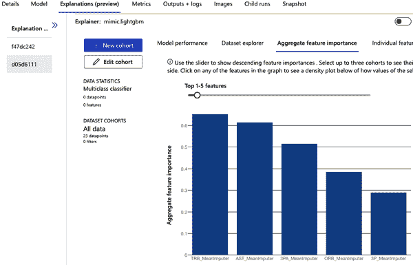

###### 图 5-30\. Azure 自动机器学习解释

让我们看看另一种方法。你可以使用 Python 调用 Azure ML Studio 控制台中可用的相同 API。这个官方的 [Microsoft 教程](https://oreil.ly/io66Z) 详细解释了它，但关键部分在这里展示：

```
from azureml.train.automl import AutoMLConfig

automl_config = AutoMLConfig(task='regression',
                             debug_log='automated_ml_errors.log',
                             training_data=x_train,
                             label_column_name="totalAmount",
                             **automl_settings)
```

# AWS 自动机器学习

作为最大的云服务提供商，AWS 也提供了许多自动机器学习解决方案。最早的解决方案之一包括一个名字不太好听的工具，“机器学习”，虽然现在已经不再广泛使用，但它曾是一个自动机器学习解决方案。现在推荐的解决方案是 SageMaker AutoPilot（见 图 5-31）。你可以从[官方文档](https://oreil.ly/fDJiE)中查看许多 SageMaker Autopilot 的示例。

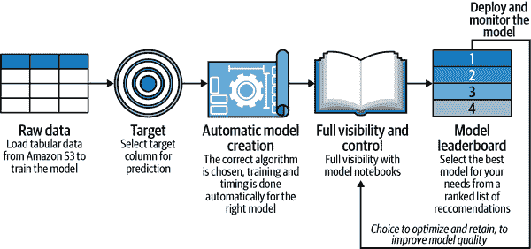

###### 图 5-31\. SageMaker Autopilot

让我们一起来看看如何使用 AWS SageMaker 进行 Autopilot 实验。首先，如 图 5-32 所示，打开 SageMaker Autopilot 并选择一个新任务。

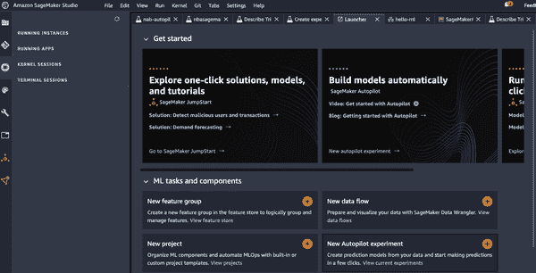

###### 图 5-32\. SageMaker Autopilot 任务

接下来，我将[“NBA 球员数据 Kaggle 项目”](https://oreil.ly/G1TIi)上传到 Amazon S3。现在我有了可以使用的数据，我根据图 5-33 中显示的方式创建一个实验。注意，我选择的目标是选秀位置。这种分类是因为我想创建一个预测模型，显示 NBA 球员根据他们的表现应该获得的选秀位置。

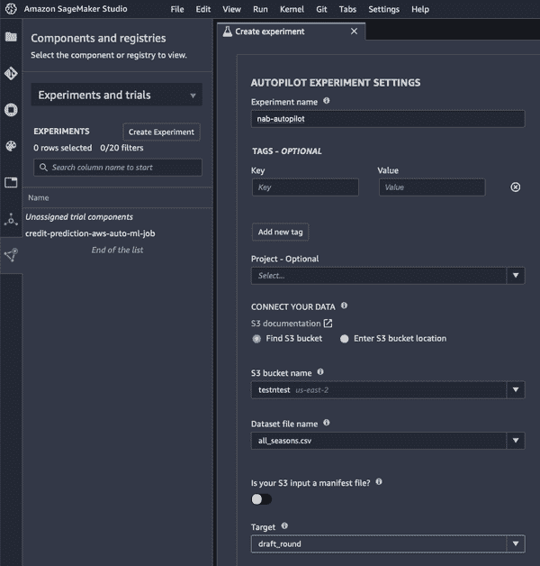

###### 图 5-33\. 创建 Autopilot 实验

一旦我提交实验，SageMaker Autopilot 将经历一个预处理阶段，通过模型调优，如图 5-34 所示。

现在 AutoML 流水线正在运行，您可以在资源选项卡中看到它使用的资源，如图 5-35 所示。

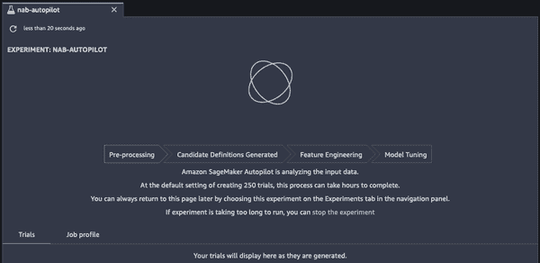

###### 图 5-34\. 运行 Autopilot 实验

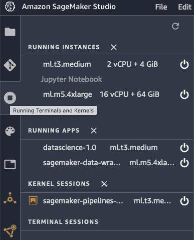

###### 图 5-35\. Autopilot 实例

当训练完成时，您可以看到一个模型列表及其准确度，如图 5-36 所示。请注意，SageMaker 能够创建一个准确率达到 .999945 的高精度分类模型。

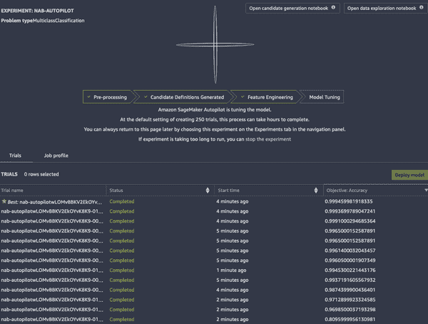

###### 图 5-36\. 完成的 Autopilot 运行

最后，如图 5-37 所示，一旦任务完成，您可以右键点击要控制的模型，要么部署到生产环境，要么在详细模式中打开以检查可解释性和/或度量或图表。

SageMaker Autopilot 是一种完整的 AutoML 和 MLOps 解决方案，如果您的组织已经在使用 AWS，那么将这个平台集成到现有工作流中似乎是直接的。特别是在处理更大数据集和需要重现性关键的问题时，它显得特别有用。

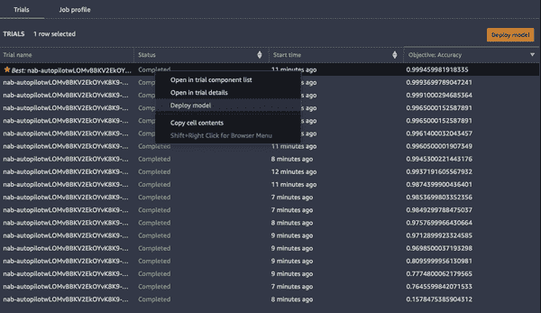

###### 图 5-37\. Autopilot 模型

接下来，让我们讨论一些新兴的开源 AutoML 解决方案。

# 开源 AutoML 解决方案

我依然怀念在 2000 年在 Caltech 工作时使用 Unix 集群的日子。那个时候 Unix 正在过渡，尽管在许多情况下 Solaris 优于 Linux，但它无法与免费的 Linux 操作系统的价格竞争。

我看到开源 AutoML 解决方案也在发生类似的事情。使用高级工具训练和运行模型的能力似乎正在向商品化方向发展。因此，让我们看看一些开源选项。

## Ludwig

开源 AutoML 中更有前途的方法之一是[Ludwig AutoML](https://oreil.ly/wIFo4)。在图 5-38 中，从 Ludwig 运行的输出显示了评估模型强度有用的指标。开源的优势在于没有公司控制它！这里有一个示例项目，展示了使用[Ludwig 通过 Colab 笔记本进行文本分类](https://oreil.ly/tb88B)。

首先，安装 Ludwig 并设置下载：

```
!pip install -q ludwig
!wget https://raw.githubusercontent.com/paiml/practical-mlops-book/main/chap05/\
    config.yaml
!wget https://raw.githubusercontent.com/paiml/practical-mlops-book/main/chap05/\
    reuters-allcats.csv
```

接下来，模型只是一个命令行调用。然后训练模型：

```
!ludwig experiment \
 --dataset reuters-allcats.csv \
 --config_file config.yaml
```

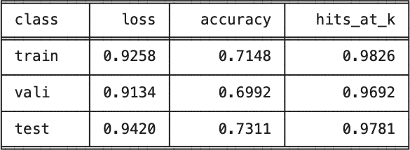

###### 图 5-38\. Ludwig

你可以在官方文档中找到 Ludwig 的许多优秀示例：[official documentation](https://oreil.ly/SMNqY)。

Ludwig 更令人兴奋的一个方面是它正在积极开发中。作为 Linux Foundation 的一部分，他们最近发布了版本 4，你可以在 Figure 5-39 中看到。它添加了许多额外功能，如与远程文件系统和分布式内存工具（如 Dask 和 Ray）的深度集成。最后，Ludwig 与 MLflow 有深入的集成。Ludwig 的路线图显示它将继续支持和增强这一集成。

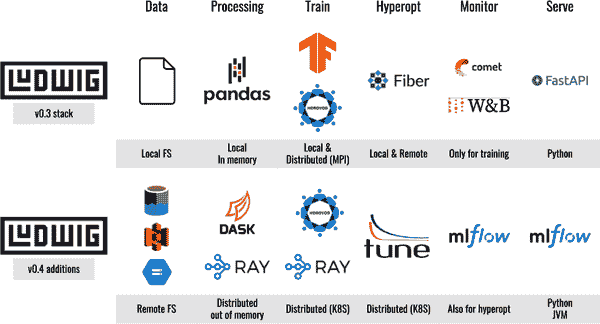

###### 图 5-39\. Ludwig 版本 4

## FLAML

另一个开源 AutoML 的新进入者是 [FLAML](https://oreil.ly/TxRe0)。它的设计考虑了成本效益的超参数优化。你可以在 Figure 5-30_2 中看到 FLAML 的标志。

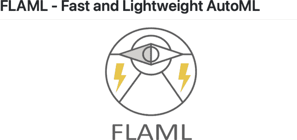

###### 图 5-40\. FLAML 来自微软研究

FLAML 的主要用例之一是仅用三行代码自动化整个建模过程。你可以在以下示例中看到：

```
from flaml import AutoML
automl = AutoML()
automl.fit(X_train, y_train, task="classification")
```

更详细的示例显示在 Jupyter 笔记本中，首先安装库 `!pip install -q flaml`，然后配置 AutoML 配置。然后启动训练作业以选择优化的分类模型：

```
!pip install -q flaml

from flaml import AutoML
from sklearn.datasets import load_iris
# Initialize an AutoML instance
automl = AutoML()
# Specify automl goal and constraint
automl_settings = {
    "time_budget": 10,  # in seconds
    "metric": 'accuracy',
    "task": 'classification',
}
X_train, y_train = load_iris(return_X_y=True)
# Train with labeled input data
automl.fit(X_train=X_train, y_train=y_train,
           **automl_settings)
# Predict
print(automl.predict_proba(X_train))
# Export the best model
print(automl.model)
```

如你可以在 Figure 5-31 中看到，在多次迭代后，它选择了一个带有一组优化超参数的 XGBClassifier。

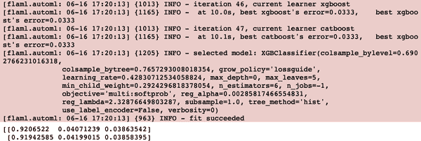

###### 图 5-41\. FLAML 模型选择的输出

这些开源框架的令人兴奋之处在于它们能够实现复杂的事情并自动化简单的事情。接下来，让我们看看模型解释在项目演示中是如何工作的。

###### 注

开源 AutoML 框架不计其数。以下是一些用于 AutoML 的额外框架：

+   自动机器学习

    +   [H2O AutoML](https://oreil.ly/OanPd)

    +   [Auto-sklearn](https://oreil.ly/wrchl)

    +   [tpot](https://oreil.ly/lZz6k)

    +   [PyCaret](https://pycaret.org)

    +   [AutoKeras](https://autokeras.com)

# 模型解释能力

自动化机器学习中的一个重要方面是自动化模型解释能力。MLOps 平台可以使用这一能力作为团队工作期间的另一个仪表板。例如，一个 MLOps 团队在早晨开始工作时可能会查看服务器的 CPU 和内存使用情况以及他们昨晚训练的模型的解释性报告。

像 AWS SageMaker、Azure ML Studio 和 Google Vertex AI 等基于云的 MLOps 框架具有内置的模型可解释性，但您也可以使用开源软件自行实现。让我们通过一个模型可解释性 GitHub 项目来详细介绍这个工作流程：[model explainability GitHub 项目](https://oreil.ly/lQpBT)。

###### 注意

ELI5 和 SHAP 是两个流行的开源模型可解释性框架。以下是关于每个框架的更多信息。

ELI5

[ELI5](https://oreil.ly/7yDZb) 代表“像我五岁那样解释”。它允许您可视化和调试机器学习模型，并支持包括 sklearn 在内的多个框架。

SHAP

[SHAP](https://oreil.ly/LgjDL) 是解释机器学习模型输出的“博弈论”方法。特别是它具有出色的可视化和解释能力。

首先，使用[Jupyter notebook](https://oreil.ly/Fddra)，让我们导入 2016-2017 赛季的 NBA 数据，并使用`head`命令打印出前几行。此数据包含年龄、位置、场均命中率（FG）以及 Twitter 转发等社交媒体数据：

```
import pandas as pd

player_data = "https://raw.githubusercontent.com/noahgift/socialpowernba/\
master/data/nba_2017_players_with_salary_wiki_twitter.csv"
df = pd.read_csv(player_data)
df.head()
```

接下来，让我们创建一个名为`winning_season`的新特征，这使得我们可以预测球员是否会成为赛季胜利球队的一部分。例如，在图 5-42 中，您可以看到绘制 NBA 球员年龄与胜利次数的图表，以发现潜在的基于年龄的模式。

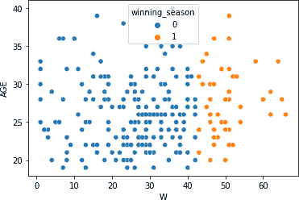

###### 图 5-42\. 赢球季节特征

现在，让我们继续建模并预测胜利。但首先，让我们稍微清理一下数据，并丢弃不必要的列和丢失的值：

```
df2 = df[["AGE", "POINTS", "SALARY_MILLIONS", "PAGEVIEWS",
 "TWITTER_FAVORITE_COUNT","winning_season", "TOV"]]
df = df2.dropna()
target = df["winning_season"]
features = df[["AGE", "POINTS","SALARY_MILLIONS", "PAGEVIEWS",
 "TWITTER_FAVORITE_COUNT", "TOV"]]
classes = ["winning", "losing"]
```

完成此清理后，`shape`命令打印出行数 239 和列数 7：

```
df2.shape
(239, 7)
```

接下来，让我们通过首先分割数据，然后使用逻辑回归来训练模型：

```
from sklearn.model_selection import train_test_split
x_train, x_test, y_train, y_test = train_test_split(features, target,
 test_size=0.25,
 random_state=0)
from sklearn.linear_model import LogisticRegression
model = LogisticRegression(solver='lbfgs', max_iter=1000)
model.fit(x_train, y_train)
```

您应该看到类似以下结果的输出，显示模型训练成功：

```
LogisticRegression(C=1.0, class_weight=None, dual=False, fit_intercept=True,
                   intercept_scaling=1, l1_ratio=None, max_iter=1000,
                   multi_class='auto', n_jobs=None, penalty='l2',
                   random_state=None, solver='lbfgs', tol=0.0001, verbose=0,
                   warm_start=False)
```

现在，让我们继续解释模型如何提出其 SHAP 框架预测的有趣部分。但是，首先需要安装 SHAP：

```
!pip install -q shap
```

接下来，让我们使用`xgboost`，另一种分类算法，来解释模型，因为 SHAP 对它有出色的支持：

```
import xgboost
import shap
model_xgboost = xgboost.train({"learning_rate": 0.01},
                              xgboost.DMatrix(x_train, label=y_train), 100)
# load JS visualization code to notebook
shap.initjs()
# explain the model's predictions using SHAP values
# (same syntax works for LightGBM, CatBoost, and scikit-learn models)
explainer = shap.TreeExplainer(model_xgboost)
shap_values = explainer.shap_values(features)
# visualize the first prediction's explanation
shap.force_plot(explainer.expected_value, shap_values[0,:], features.iloc[0,:])
```

在图 5-43 中，您可以看到 SHAP 的力量图，显示红色特征推高预测值，而蓝色特征推低预测值。


###### 图 5-43\. SHAP 输出 xgboost

```
shap.summary_plot(shap_values, features, plot_type="bar")
```

在图 5-44 中，汇总图显示了驱动模型的特征绝对平均值。因此，例如，您可以看到“场外”指标如 Twitter 和薪水是为何模型以其方式预测胜利的重要因素。

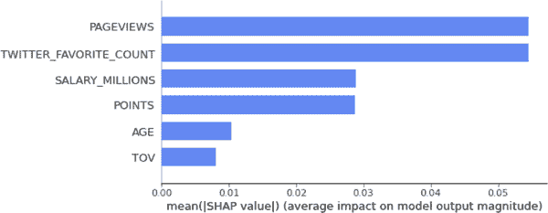

###### 图 5-44\. SHAP 特征重要性

让我们看看另一个开源工具是如何工作的；这次，让我们使用 ELI5。首先，使用`pip`安装它：

```
!pip install -q eli5
```

接下来，排列重要性对先前创建的原始逻辑回归模型执行。这个过程通过测量去除特征后准确度的降低来工作：

```
import eli5
from eli5.sklearn import PermutationImportance

perm = PermutationImportance(model, random_state=1).fit(x_train, y_train)
eli5.show_weights(perm, feature_names = features.columns.tolist())
```

您可以在 图 5-45 中看到，原始的逻辑回归模型与 XGBoost 模型具有不同的特征重要性。特别要注意的是，球员的年龄与胜利之间存在负相关。


###### 图 5-45\. ELI5 排列重要性

可解释性是 MLOps 的一个重要方面。正如我们为软件系统拥有仪表板和指标一样，AI/ML 系统如何进行预测也应该有可解释性。这种可解释性可以导致业务利益相关者和业务本身的更健康的结果。

接下来，让我们总结本章涵盖的所有内容。

# 结论

AutoML 是任何进行 MLOps 的团队的重要新能力。AutoML 提高了团队将模型推向生产、处理复杂问题以及最终处理重要事务的能力。需要指出的是，自动建模，即 AutoML，并不是 KaizenML 或持续改进的唯一组成部分。在经常引用的论文 [“Hidden Technical Debt in Machine Learning Systems”](https://oreil.ly/ZZfjY) 中，作者提到建模在真实世界的 ML 系统中只是很少一部分工作量。同样，自动建模，即对建模的自动化，只是需要自动化的一小部分。从数据摄取到特征存储再到建模再到训练再到部署再到在生产环境中评估模型的所有工作都有可能进行全面自动化。KaizenML 意味着您正在不断改进机器学习系统的每一个部分。

就像自动变速器和巡航控制系统帮助专家驾驶员一样，生产机器学习系统的子组件的自动化使负责 ML 决策的人类变得更好。事情可以也应该自动化，包括建模方面、软件工程最佳实践、测试、数据工程以及其他重要组件。持续改进是一种文化变革，没有结束日期，适用于任何希望通过 AI 和机器学习进行有重大影响变革的组织。

最后的收获是，有许多免费或几乎免费的 AutoML 解决方案。正如全球开发人员使用免费或大致免费的高级工具（如构建服务器和代码编辑器）来改善软件一样，ML 从业者应该使用各种类型的自动化工具来提高他们的生产力。

接下来是关于监控和日志记录的章节。我称之为“运维中的数据科学”。在深入讨论这个主题之前，请看以下练习和关键思考问题。

# 练习

+   下载 XCode 并使用 Apple 的 Create ML 来从在 Kaggle 或其他开放数据集位置找到的样本数据集训练模型。

+   使用 Google 的 AutoML 计算机视觉平台来训练模型，并部署到[Coral.AI 设备](https://coral.ai)。

+   使用 Azure ML Studio 训练模型，并探索 Azure ML Studio 的可解释性功能。

+   使用[ELI5](https://oreil.ly/Nwrck)来解释机器学习模型。

+   使用[Ludwig](https://oreil.ly/GRjgG)来训练机器学习模型。

+   从[官方 SageMaker 示例](https://oreil.ly/fe71a)中选择一个 SageMaker 自动模型调优的示例，并在您的 AWS 账户上运行它。

# 批判性思维讨论问题

+   为什么 AutoML 只是现代机器学习自动化故事的一部分？

+   [国立卫生研究院（NIH）](https://nih.gov)如何利用特征存储来加快医学发现的速度？

+   到 2025 年，机器学习的哪些部分将完全自动化，哪些方面不会？到 2035 年，机器学习的哪些部分将完全自动化，哪些因素不会？

+   垂直集成的 AI 平台（芯片、框架、数据等）如何给特定公司带来竞争优势？

+   如何运用国际象棋软件行业的见解，深化 AI 和人类合作，以改善 AutoML 问题解决的结果？

+   数据中心的方法与模型中心的方法在机器学习中有何不同？对于 KaizenML 方法，其中数据、软件和建模都被同等重视，有何不同？
