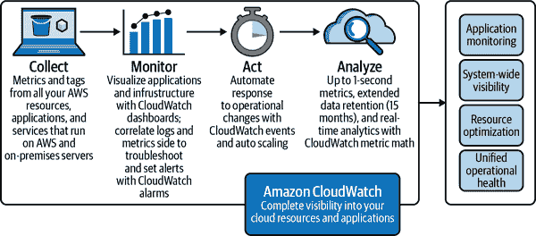
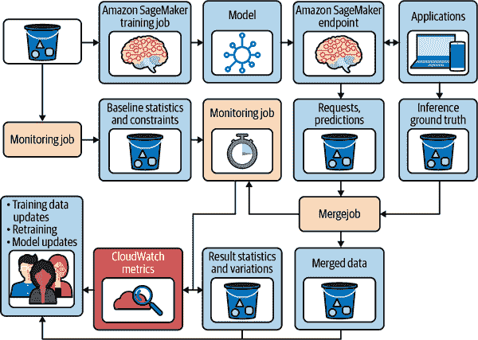
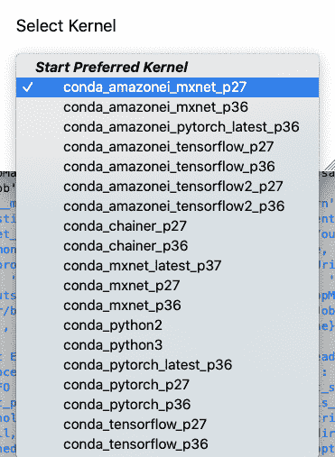
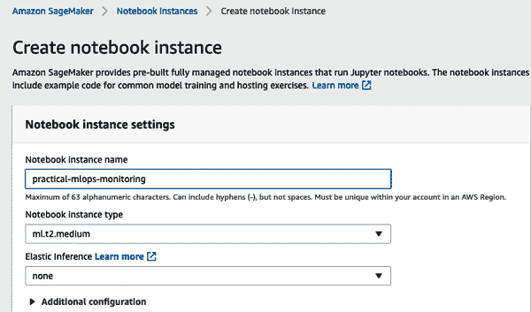
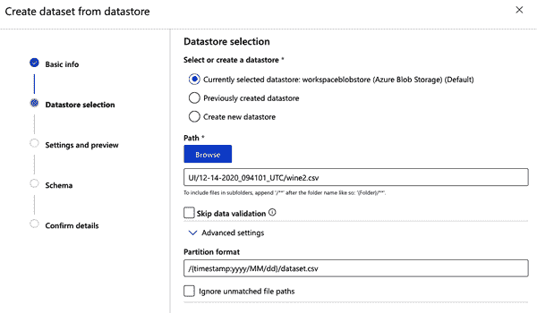

# 第六章：监控与日志记录

阿尔弗雷多·德扎

> 不仅大脑解剖学是双重的，而且不仅仅是一个半球足以形成意识；更重要的是，在隔离大脑半球后，已经显示出两个半球可以同时和独立地具有意识。正如纳格尔所说的分脑：“右半球独自完成的工作太复杂、太有意图性和太心理可理解，无法简单地看作是无意识的自动反应的集合。”
> 
> 约瑟夫·博根博士

日志记录和监控都是 DevOps 原则的核心支柱，对健壮的机器学习实践至关重要。有效的日志记录和监控很难做到，尽管您可以利用云服务来处理繁重的工作，但决策和制定一个合理的策略仍然取决于您自己。大多数软件工程师倾向于编写代码，忽略测试、文档编写以及往往也忽略日志记录和监控等其他任务。

不要对能够“解决日志问题”的自动化解决方案的建议感到惊讶。通过深思熟虑地思考手头的问题，可以建立一个坚实的基础，使得产生的信息可用。我所描述的辛勤工作和坚实基础的理念在面对无用信息（它无法帮助叙述一个故事）或晦涩难懂（太难理解）时变得非常清晰。这种情况的一个完美例子是我在 2014 年提出的一个软件问题，从一个在线聊天关于产品的问题中捕捉到以下问题：

“有人能帮我解释一下这句话吗：

```
7fede0763700  0 -- :/1040921 >> 172.16.17.55:6789/0 pipe(0x7feddc022470 \
sd=3 :0 s=1 pgs=0 cs=0 l=1 c=0x7feddc0226e0).fault
```

当时我已经使用这款软件产品将近两年时间，对那意味着什么毫无概念。你能想出一个可能的答案吗？一位富有经验的工程师给出了完美的翻译：“您所在的机器无法与 172.16.17.55 的监视器联系。”我对日志声明的含义感到困惑。为什么我们不能做出改变来明确表达呢？截至本文撰写时，2014 年捕捉到此问题的工单仍然未解决。更令人不安的是，工程部门在该工单中回复：“日志消息没有问题。”

日志记录和监控是艰苦的工作，因为需要努力产生有意义的输出，帮助我们理解程序的状态。

我提到，拥有帮助我们叙述故事的信息至关重要。这对监控和日志记录都是如此。几年前，我曾在一个大型工程团队工作，该团队提供了全球最大的基于 Python 的 CMS（内容管理系统）之一。在提议将指标添加到应用程序后，普遍的感觉是 CMS 并不需要它。监控已经就位，运维团队已经有各种与警报阈值相关的实用工具。工程经理通过给工程师时间来奖励卓越表现（不仅仅是像某些著名科技公司那样的 20% 时间）。在开始相关项目之前，必须向整个管理团队提出理念以获得支持。轮到我时，我当然选择了向应用程序添加指标功能。

“Alfredo，我们已经有了指标，我们知道磁盘使用情况，并且我们有每台服务器的内存警报。我们不明白通过这个举措我们能得到什么。” 站在一个大型高级管理团队面前，并试图说服他们相信一些他们不相信的事情是很困难的。我的解释从网站上最重要的按钮开始：订阅按钮。那个订阅按钮负责生成付费用户并对业务至关重要。我解释说，“如果我们部署了一个新版本，其中有一个 JavaScript 问题使得这个按钮无法使用，哪个指标或警报可以告诉我们这是一个问题？” 当然，磁盘使用情况将保持不变，而内存使用可能根本不会改变。然而，应用程序中最重要的按钮将在无法使用的状态下被忽视。在这种特殊情况下，指标可以捕获该按钮的每小时、每天和每周的点击率。最重要的是，它可以帮助讲述今天网站如何比去年同月份产生更多（或者更少！）收入的故事。服务器的磁盘使用情况和内存消耗值得关注，但这不是最终目标。

这些故事并没有明确与机器学习或将训练模型交付到生产环境有关。然而，正如您将在本章中看到的那样，它将帮助您和您的公司讲述一个故事，并通过揭示重要问题和指出模型可能需要更好数据之前的原因来增强您的过程的信心。在 ML 运营中，随着时间的推移识别数据漂移和准确性至关重要。在生产环境中部署一个准确性显著变化的模型绝不能发生，并需要进行预防。一旦检测到这些问题，早期解决将更加经济。在生产中存在不准确的模型的后果可能是灾难性的。

# 观测性能用于云 MLOps

可以肯定地说，大多数机器学习是在云环境中进行的。因此，云提供商提供了特殊的服务来实现可观测性。例如，在 AWS 上，他们有[Amazon CloudWatch](https://oreil.ly/43bvM)，在 GCP 上有[Google Cloud operations suite](https://oreil.ly/3YVn1)，在 Azure 上有[Azure Monitor](https://oreil.ly/gDIud)。

在图 6-1 中，Amazon CloudWatch 是展示这些监控服务如何工作的一个很好的例子。在高层次上，云系统的每个组件都将指标和日志发送到 CloudWatch。这些任务包括服务器、应用程序日志、用于机器学习作业的训练元数据以及生产机器学习端点的结果。



###### 图 6-1\. AWS CloudWatch

接下来，这些信息将成为许多不同工具的一部分，从仪表板到自动扩展。例如，在 AWS SageMaker 中，这意味着如果个别端点的 CPU 或内存超过其总量的 75%，生产 ML 服务将自动扩展。最后，所有这些可观测性都允许人类和机器分析生产 ML 系统的运行情况并采取行动。

经验丰富的云软件工程师已经知道，云可观测工具是云软件部署中不可选的组件。然而，在云中的 MLOps 独特之处在于新组件也需要精细的监控。例如，在图 6-2 中，ML 模型部署中发生了一系列全新的操作。请注意，CloudWatch 再次收集了这些新的指标。



###### 图 6-2\. AWS SageMaker 模型监控

随着本章的进展，请记住，在像 CloudWatch 这样的主系统上，在高层次上，它收集数据，路由警报，并与弹性扩展等云计算的动态组件进行交互。接下来，让我们深入了解更精细的可观测性成员：日志记录。

# 日志记录简介

大多数日志记录设施在其工作方式上具有共同的特征。系统定义了它们可以操作的日志级别，然后用户可以选择这些语句应出现在何种级别。例如，Nginx web 服务器默认配置为将访问日志保存在*/var/log/nginx/access.log*，错误日志保存在*/var/log/nginx/error.log*。作为 Nginx 用户，如果您在解决 Web 服务器问题，首先要做的事情就是进入这些文件并查看输出。

我在 Ubuntu 服务器上使用默认配置安装了 Nginx，并发送了一些 HTTP 请求。立即，访问日志开始获取一些信息：

```
172.17.0.1 [22/Jan/2021:14:53:35 +0000] "GET / HTTP/1.1" \
    "Mozilla/5.0 (Macintosh; Intel Mac OS X 10.15; rv:84.0) Firefox/84.0" "-"
172.17.0.1 [22/Jan/2021:14:53:38 +0000] "GET / HTTP/1.1" \
    "Mozilla/5.0 (Macintosh; Intel Mac OS X 10.15; rv:84.0) Firefox/84.0" "-"
```

长长的日志行包含了大量有用（可配置的）信息，包括服务器的 IP 地址、时间和请求类型，以及用户代理信息。在我的情况下，用户代理是运行在 Macintosh 计算机上的浏览器。然而，这些并不是错误。这些行显示的是对服务器的访问。为了强制 Nginx 进入错误条件，我改变了一个文件的权限，使其对服务器不可读。接下来，我发送了新的 HTTP 请求：

```
2021/01/22 14:59:12 [error] open() "/usr/share/nginx/html/index.html" failed \
  (13: Permission denied), client: 172.17.0.1, server: localhost, \
   request: "GET / HTTP/1.1", host: "192.168.0.200"
```

日志条目明确显示信息级别为*“error”*。这使得像我这样的消费者能够识别出 Web 服务器生成的信息的严重性。当我是系统管理员时，刚开始进行配置和部署生产环境等必要任务时，我并不清楚为什么这些级别很有用。对我来说，主要的一点是我可以从日志的信息内容中识别出错误。

虽然让消费者更容易识别错误是否有效的想法是有效的，但日志级别并不仅限于此。如果你以前尝试过调试程序，可能已经使用过`print()`语句来帮助获取运行程序的有用信息。有许多其他调试程序的方法，但使用`print()`仍然是有价值的。一个缺点是，一旦问题解决，你必须清理和删除所有`print()`语句。下次再需要调试同一个程序时，你又需要添加所有这些语句。这不是一个好策略，也是日志记录可以帮助解决的许多情况之一。

现在基本的日志记录原理已经清楚了，接下来我将讨论如何在应用程序中配置日志记录，这往往是复杂的，因为有很多不同的选项和决策需要做。

# Python 中的日志记录

我将在 Python 中进行工作，但本节中的大多数概念应该可以干净地应用到其他语言和框架中。日志级别、输出重定向和其他功能在其他应用程序中通常也是可用的。为了开始应用日志记录，我将创建一个简短的 Python 脚本来处理一个 CSV 文件。没有函数或模块；示例脚本尽可能接近 Jupyter Notebook 单元格。

创建一个名为*describe.py*的新文件，看看日志记录如何帮助基本脚本：

```
import sys
import pandas as pd

argument = sys.argv[-1]

df = pd.read_csv(argument)
print(df.describe())
```

该脚本将从命令行上的最后一个参数中获取输入，并告诉 Pandas 库读取并描述它。这个想法是产生一个 CSV 文件的描述，但当你没有参数运行时并不会发生这种情况：

```
$ python derscribe.py
         from os import path
count                      5
unique                     5
top     print(df.describe())
freq                       1
```

这里发生的是，示例中的最后一个参数是脚本本身，因此 Pandas 正在描述脚本的内容。这对于那些没有创建过脚本的人来说并不是非常有用，结果至少会让人感到震惊。让我们将这个脆弱的脚本向前推进一步，并传递一个不存在的路径作为参数：

```
$ python describe.py /bogus/path.csv
Traceback (most recent call last):
  File "describe.py", line 7, in <module>
    df = pd.read_csv(argument)
  File "/../site-packages/pandas/io/parsers.py", line 605, in read_csv
    return _read(filepath_or_buffer, kwds)
  ...
  File "/../site-packages/pandas/io/common.py", line 639, in get_handle
    handle = open(
FileNotFoundError: [Errno 2] No such file or directory: '/bogus/path.csv'
```

没有错误检查告诉我们输入是否有效以及脚本期望的内容。如果正在等待管道运行或某些远程数据处理作业的完成，并且出现这些类型的错误，问题会更加严重。一些开发人员试图通过捕获所有异常并掩盖实际错误来防范这些问题，使得无法了解正在发生的情况。脚本的稍作修改版本更突显了问题：

```
import sys
import pandas as pd

argument = sys.argv[-1]

try:
    df = pd.read_csv(argument)
    print(df.describe())
except Exception:
    print("Had a problem trying to read the CSV file")
```

运行它会产生一个错误，在生产代码中看到这种情况会让我非常沮丧：

```
$ python describe.py /bogus/path.csv
Had a problem trying to read the CSV file
```

这个例子很琐碎，因为脚本只有几行长，你知道它的内容，所以指出问题并不那么困难。但如果这是在一个远程的自动化流水线中运行，你没有任何上下文信息，理解问题就变得更具挑战性。让我们使用 Python 日志模块来提供更多关于这个数据处理脚本正在发生的事情的信息。

首先要做的是配置日志记录。在这里我们不需要太复杂的东西，添加几行就足够了。修改*describe.py*文件以包括这些行，然后重新运行脚本：

```
import logging

logging.basicConfig()
logger = logging.getLogger("describe")
logger.setLevel(logging.DEBUG)

argument = sys.argv[-1]
logger.debug("processing input file: %s", argument)
```

重新运行它应该看起来类似于这样：

```
$ python describe.py /bogus/path.csv
DEBUG:describe:processing input file: /bogus/path.csv
Had a problem trying to read the CSV file
```

尽管目前还不是非常有用，但已经包含了信息。对于一些简单的`print()`语句也能达到的效果，可能会感觉有点冗长。当构建消息时，日志模块对于失败是具有弹性的。例如，打开 Python 解释器并尝试使用更少的参数来调用`print`：

```
>>> print("%s should break because: %s" % "statement")
Traceback (most recent call last):
  File "<stdin>", line 1, in <module>
TypeError: not enough arguments for format string
```

现在让我们使用日志模块进行相同的操作：

```
>>> import logging
>>> logging.warning("%s should break because: %s", "statement")
--- Logging error ---
Traceback (most recent call last):
  ...
  File "/.../python3.8/logging/__init__.py", line 369, in getMessage
    msg = msg % self.args
TypeError: not enough arguments for format string
Call stack:
  File "<stdin>", line 1, in <module>
Message: '%s should break because: %s'
Arguments: ('statement',)
```

最后一个例子不会破坏生产应用程序。记录日志在任何运行时都不应该破坏任何应用程序。在这种情况下，日志模块试图在字符串中进行变量替换并失败，但它并没有导致程序崩溃，而是通告了问题然后继续执行。`print`语句无法做到这一点。事实上，我认为在 Python 中使用`print()`很像在 shell 脚本中使用`echo`。它没有控制性，很容易破坏生产应用程序，并且很难控制详细程度。

在日志记录时详细程度非常重要，除了 Nginx 示例中的错误级别外，它还具有多种设施来使日志消费者能够精细调节所需的信息。在深入探讨日志级别的细粒度和详细程度控制之前，给脚本的日志格式升级，使其看起来更加美观。Python 日志模块非常强大，允许大量配置。更新发生日志配置的*describe.py*脚本：

```
log_format = "[%(name)s][%(levelname)-6s] %(message)s"
logging.basicConfig(format=log_format)
logger = logging.getLogger("describe")
logger.setLevel(logging.DEBUG)
```

`log_format`是一个模板，其中包含构建日志行时使用的一些关键字。请注意，我以前没有时间戳，尽管我现在仍然没有它，但配置确实允许我包括它。目前，记录器的名称（在本例中为`describe`）、日志级别和消息都在那里，并使用方括号进行分隔，以便更好地阅读。再次运行脚本以检查输出如何变化：

```
$ python describe.py
[describe][DEBUG ] processing input file: describe.py
Had a problem trying to read the CSV file
```

日志的另一个超级功能是在错误信息中提供追溯信息。有时捕获（并显示）追溯信息是有用的，而不需要陷入错误条件。为了实现这一点，在`except`块中更新*describe.py*脚本：

```
try:
    df = pd.read_csv(argument)
    print(df.describe())
except Exception:
    logger.exception("Had a problem trying to read the CSV file")
```

它看起来与之前的`print()`语句非常相似。重新运行脚本并检查结果：

```
$ python logging_describe.py
[describe][DEBUG ] processing input file: logging_describe.py
[describe][ERROR ] Had a problem trying to read the CSV file
Traceback (most recent call last):
  File "logging_describe.py", line 15, in <module>
    df = pd.read_csv(argument)
  File "/.../site-packages/pandas/io/parsers.py", line 605, in read_csv
    return _read(filepath_or_buffer, kwds)
  ...
  File "pandas/_libs/parsers.pyx", line 1951, in pandas._libs.parsers.raise
ParserError: Error tokenizing data. C error: Expected 1 field in line 12, saw 2
```

追溯是错误的字符串表示，而不是错误本身。为了验证这一点，在`except`块后添加另一行日志：

```
try:
    df = pd.read_csv(argument)
    print(df.describe())
except Exception:
    logger.exception("Had a problem trying to read the CSV file")

logger.info("the program continues, without issue")
```

重新运行以验证结果：

```
[describe][DEBUG ] processing input file: logging_describe.py
[describe][ERROR ] Had a problem trying to read the CSV file
Traceback (most recent call last):
[...]
ParserError: Error tokenizing data. C error: Expected 1 field in line 12, saw 2

[describe][INFO  ] the program continues, without issue
```

## 修改日志级别

日志提供的这些信息设施与`print()`语句并不直接。如果你在编写一个 Shell 脚本，这几乎是不可能的。在这个例子中，我们现在有三个日志级别：debug、error 和 info。日志允许的另一件事情是选择性地设置我们感兴趣的级别。在更改之前，这些级别有与之相关联的*权重*，理解它们以便更改能够反映出优先级是很重要的。从最详细到最少详细，顺序如下：

1.  `debug`

1.  `info`

1.  `warning`

1.  `error`

1.  `critical`

尽管这是 Python 的日志模块，但你应该期待其他系统中类似的加权优先级。`debug`日志级别将包含所有其他级别，以及`debug`级别本身。`critical`日志级别仅包含`critical`级别的消息。再次更新脚本将日志级别设置为`error`：

```
log_format = "[%(name)s][%(levelname)-6s] %(message)s"
logging.basicConfig(format=log_format)
logger = logging.getLogger("describe")
logger.setLevel(logging.ERROR)
```

```
$ python logging_describe.py
[describe][ERROR ] Had a problem trying to read the CSV file
Traceback (most recent call last):
  File "logging_describe.py", line 15, in <module>
    df = pd.read_csv(argument)
  File "/.../site-packages/pandas/io/parsers.py", line 605, in read_csv
    return _read(filepath_or_buffer, kwds)
  ...
  File "pandas/_libs/parsers.pyx", line 1951, in pandas._libs.parsers.raise
ParserError: Error tokenizing data. C error: Expected 1 field in line 12, saw 2
```

此更改导致仅显示错误日志消息。当试图减少日志量以关注感兴趣的内容时，这是非常有用的。调试包含大多数（如果不是所有）消息，而错误和关键情况则要少得多且通常不会经常出现。我建议为新的生产代码设置调试日志级别，以便更容易捕捉潜在问题。在生成和部署新代码时，你应该预期会出现问题。当应用程序已经被证明是稳定的，并且没有太多令人惊讶的问题时，过于冗长的输出在长期内并不那么有用。逐步将级别调整为仅`info`或`error`是你可以做的事情。

## 记录不同的应用程序

到目前为止，我们已经看到一个试图加载 CSV 文件的脚本的日志级别。我还没有详细说明为什么记录器的名称（在过去的示例中为“describe”）很重要。在 Python 中，您导入模块和包，许多这些包都带有自己的记录器。日志记录设施允许您独立于应用程序为这些记录器设置特定选项。还有一个记录器的层次结构，其中 *“root”* 记录器是所有记录器的父记录器，并且可以修改所有应用程序和记录器的设置。

更改日志级别是您可以配置的众多功能之一。在一个生产应用程序中，我为同一应用程序创建了两个记录器：一个将消息输出到终端，而另一个将消息写入日志文件。这允许将用户友好的消息发送到终端，省略大型回溯和错误污染输出。同时，内部面向开发人员的日志记录将写入文件。这是另一个使用 `print()` 语句或 shell 脚本中的 `echo` 指令非常难以实现和复杂的示例。您拥有的灵活性越大，您就可以更好地构建应用程序和服务。

创建一个名为 *http-app.py* 的新文件，并保存以下内容：

```
import requests
import logging

logging.basicConfig()

# new logger for this script
logger = logging.getLogger('http-app')

logger.info("About to send a request to example.com")
requests.get('http://example.com')
```

脚本使用基本配置配置日志记录设施，默认情况下将消息输出到终端。然后尝试使用 *requests* 库发出请求。运行它并检查输出。执行脚本后在终端中什么也不显示可能会让人感到意外。在详细解释发生这种情况的确切原因之前，更新脚本：

```
import requests
import logging

logging.basicConfig()
root_logger = logging.getLogger()

# Sets logging level for every single app, the "parent" logger
root_logger.setLevel(logging.DEBUG)

# new logger for this script
logger = logging.getLogger('http-app')

logger.info("About to send a request to example.com")
requests.get('http://example.com')
```

重新运行脚本并注意输出：

```
$ python http-app.py
INFO:http-app:About to send a request to example.com
DEBUG:urllib3.connectionpool:Starting new HTTP connection (1): example.com:80
DEBUG:urllib3.connectionpool:http://example.com:80 "GET / HTTP/1.1" 200 648
```

Python 日志模块可以全局设置每个包和模块中的每个记录器的配置设置。这个 *parent* 记录器称为 *root* 记录器。有输出的原因是更改了根记录器级别为 debug。但是输出不止是单行 *http-app* 记录器。这是因为 *urllib3* 包也有自己的记录器。由于根记录器将全局日志级别更改为 debug，因此 *urllib3* 包现在正在发出这些消息。

可以配置多个不同的记录器，并调整级别的细粒度和详细程度（以及任何其他日志记录配置）。为了演示这一点，在 *http-app.py* 脚本的末尾添加以下行来更改 *urllib3* 包的日志级别：

```
# fine tune the urllib logger:
urllib_logger = logging.getLogger('urllib3')
urllib_logger.setLevel(logging.ERROR)

logger.info("About to send another request to example.com")
requests.get('http://example.com')
```

更新版本检索 *urllib3* 的日志记录器，并将其日志级别更改为错误。在调用 `requests.get()` 之前，脚本的日志记录器发出了一条新消息，而 `requests.get()` 又使用了 *urllib3* 包。再次运行脚本以检查输出：

```
INFO:http-app:About to send a request to example.com
DEBUG:urllib3.connectionpool:Starting new HTTP connection (1): example.com:80
DEBUG:urllib3.connectionpool:http://example.com:80 "GET / HTTP/1.1" 200 648
INFO:http-app:About to send another request to example.com
```

由于在上次请求之前更改了*urllib3*的日志级别，不再显示调试消息。信息级别的消息确实显示，因为该记录器仍然配置为调试级别。这些日志配置的组合非常强大，因为它允许您选择从其他可能导致输出“噪音”的信息中选择感兴趣的内容。

想象一下使用与云存储解决方案互动的库。您正在开发的应用程序通过下载、列出和上传内容到存储服务器来执行成千上万次的交互。假设应用程序的主要关注点是管理数据集并将其卸载到云提供商。您认为看到一条信息性消息，说一个请求即将发送到云提供商，会有趣吗？在大多数情况下，我会说这远非有用之处。相反，当应用程序未能执行与存储相关的特定操作时发出警报至关重要。此外，可能出现请求存储时超时的情况，此时改变日志级别以指示请求发生的时间差至关重要。

这一切都是关于灵活性和适应您应用程序生命周期需求的能力。今天有用的东西明天可能成为信息过载。日志记录与监控（在下一节中介绍）密切相关，谈论到可观察性也并非不寻常。这些是 DevOps 的基础，应该成为 ML 生命周期的一部分。

# 监控与可观察性

我曾是一名职业运动员，我的父亲，也是我的教练，为我增加了一项特别讨厌的任务：每天在日记中写关于刚刚完成的训练内容。日记条目需要包括以下内容：

+   计划的训练内容。例如，如果是以 42 秒的速度进行 10 次 300 米的重复训练。

+   训练结果。对于 300 米的距离，需要记录每次重复的实际完成时间。

+   在训练过程中和之后的感受。

+   其他相关信息，比如感觉生病或因伤痛感到疼痛等。

我 11 岁开始专业训练。作为一个十几岁的少年，这项写日记的任务比最糟糕的训练还要糟糕。我不明白为什么写日记如此重要，为什么必须详细记录训练内容。我有勇气告诉父亲，这似乎是他的工作，而不是我的。毕竟，我已经在做训练了。这个论点对我来说并不是一个很好的答复。问题在于我没有理解。这似乎是一项毫无用处的任务，没有任何好处。我无法看到或感受到其中的好处。

到了一天结束时，感觉更像是一个纪律性的任务，而不是一个关键的训练环节。在每天都记录日志几年后（我平均每周锻炼 14 次）并且在我身后有一个很棒的赛季后，我和父亲坐下来计划下一个赛季。而不是听我爸爸谈论接下来赛季要做什么几个小时，他启发了我，展示了记日志的强大之处。*“好的，阿尔弗雷多，让我查看最近的两本期刊，看看我们做了什么以及你的感受，以便调整、增加并再次度过一个伟大的赛季。”*

这些期刊中包含了我们计划所需的每一条信息。他用了一句话让我印象深刻多年，我希望这能说明为什么在任何情况下监控和指标都至关重要：*“如果我们能够衡量，那么我们就能比较。而如果我们能比较，那么我们才能改进。”*

机器学习运营也不例外。当一个模型的新迭代被送到生产中时，你必须知道它的表现是好还是差。不仅如此，信息必须是易于获取和简单明了的。流程可能会制造摩擦，使一切比应该慢。自动化可以消除愚蠢的流程，并轻松创建信息的可用性。

几年前，我在一家初创公司工作，销售主管会把一个 CSV 文件发送给我，让我“处理一些数据”，然后把结果以 PDF 格式发回给他。这太糟糕了，不具备可扩展性。也不会通过“巴士测试”。

巴士测试是如果今天我被公共汽车撞了，一切都应该还能正常运行，与我共事的每个人都能够接管我的工作。自动化和生成指标的所有努力对于将健壮的模型交付到生产中至关重要。

## 模型监控的基础

在机器学习运营中，监控意味着任何与将模型投入生产有关的一切——从捕获系统和服务信息到模型本身的性能。没有一种单一的灵丹妙药可以实施监控以使一切正常。监控和捕获指标有些类似于在确定要使用哪些特征和算法来训练模型之前了解数据。你了解的数据越多，你在训练模型时做出的决策就越好。

同样，你了解将模型投入生产所涉及的步骤越多，当捕获指标和设置监控警报时，你做出的选择就越好。对于“在训练模型时应该捕获什么指标？”的答案我并不喜欢，但在这种情况下确实如此准确：这取决于情况。

尽管度量和设置警报类型之间存在差异，但有一些有用的基础模式可以作为默认选择。这些模式将帮助您澄清要收集的数据，收集频率以及如何最佳可视化它们。最后，根据生成模型的步骤不同，关键的度量标准也会有所不同。例如，在收集数据并清理数据时，检测每列的空值数量以及处理数据时的完成时间可能非常重要。

上个星期我在处理系统漏洞数据。我不得不对负责读取 JSON 文件并将信息保存到数据库的应用程序进行一些更改。在一些更改之后，数据库的大小从几个千兆字节减小到了只有 100 兆字节。代码更改本意并不是为了减小大小，所以我立刻意识到自己犯了一个需要修正的错误。遇到这些情况是确定何时以及如何捕获这些度量的绝佳机会。

大多数度量捕获系统中可以找到的度量类型有几种：

计数器

正如其名称所示，这种类型的度量在计数任何类型的项时非常有用。在迭代项时尤为有用。例如，这可能对于计算每列的空单元格值非常有用。

计时器

当尝试确定某些动作需要多长时间时，计时器是非常好的选择。这对性能监控至关重要，因为其核心功能是测量动作期间所花费的时间。通常在托管 HTTP API 的监控图表中可以看到时间花费。如果您有托管模型，计时器将帮助捕获模型通过 HTTP 生成预测所需的时间。

值

当计数器和计时器不适合捕获度量时，值变得很有用。我倾向于将值视为代数方程的一部分：即使我不知道 *X* 是什么，我也希望捕获其值并持久化。重复利用在工作中处理 JSON 文件并将信息保存到数据库时，这种度量的合理用途可能是生成的数据库大小（以千兆字节为单位）。

有两种常见的与 ML 相关的操作，云服务提供商需要监视和捕获有用的度量。第一种是目标数据集。这可以是您用来训练模型的同一数据集，尽管需要特别注意确保特征的数量（和顺序）不变。第二种是基线。基线确定了在训练模型时可能（或可能不）接受的差异。将基线视为确定模型在生产环境中适用程度的可接受阈值。

现在基础知识已经清楚，并且理解了带有基线的目标数据集，让我们在训练模型时使用它们来捕获有用的度量。

## 使用 AWS SageMaker 监控漂移

正如我之前提到的，云提供商通常需要一个目标数据集和一个基线。AWS 也不例外。在本节中，我们将生成指标并从已部署的模型中捕获数据违规。SageMaker 是检查数据集、训练模型并将模型提供到生产环境的不可思议工具。由于 SageMaker 与其他 AWS 提供的服务（如 S3 存储）紧密集成，您可以利用保存目标信息，以便在其他地方快速处理并具有访问权限。

SageMaker 一个我特别喜欢的地方是它的 Jupyter Notebook 提供。界面不像 Google 的 Colab 那样精致，但它装备了 AWS SDK 预安装和大量的内核类型可供选择——从（现已弃用的）Python 2.7 到运行 Python 3.6 的 Conda 环境，如 图 6-3 所示。

###### 注意

本节不涵盖部署模型的具体细节。如果您想深入了解 AWS 中的模型部署，请参阅 第 7 章。



###### 图 6-3\. SageMaker 内核

使用 SageMaker 笔记本完成本节内容。登录 AWS 控制台，并找到 SageMaker 服务。加载后，在左侧列找到“笔记本实例”链接并点击。创建一个具有有意义名称的新实例。无需更改任何默认设置，包括机器类型。我将笔记本命名为 *practical-mlops-monitoring*（见 图 6-4）。

在部署模型时，启用数据捕获非常重要。因此，请确保使用 `DataCaptureConfig` 类来执行此操作。以下是一个快速示例，将其保存到 S3 存储桶中：

```
from sagemaker.model_monitor import DataCaptureConfig

s3_capture_path = "s3://monitoring/xgb-churn-data"

data_capture_config = DataCaptureConfig(
    enable_capture=True,
    sampling_percentage=100,
    destination_s3_uri=s3_capture_path
)
```



###### 图 6-4\. SageMaker 笔记本实例

在调用 `model.deploy()` 时，请使用 `data_capture_config`。在此示例中，我已经使用 `Model()` 类创建了一个 `model` 对象，并将数据捕获配置分配给它，因此当模型被执行时，数据将保存到 S3 存储桶中。

```
from sagemaker.deserializers import CSVDeserializer

predictor = model.deploy(
    initial_instance_count=1,
    instance_type="ml.m4.large",
    endpoint_name="xgb-churn-monitor",
    data_capture_config=data_capture_config,
    deserializer=CSVDeserializer(),
)
```

模型部署并可用后，发送一些请求以开始进行预测。通过向模型发送请求，您会导致捕获配置保存必要的数据，以创建基线所需的关键数据。您可以以任何方式向模型发送预测请求。在本例中，我使用 SDK 使用来自文件的示例 CSV 数据发送一些请求。每行数据代表模型可以用来开始预测的数据。由于输入是数据，这就是我使用 CSV 反序列化程序的原因，以便端点了解如何处理该输入：

```
from sagemaker.predictor import Predictor
from sagemaker.serializers import CSVDeserializer, CSVSerializer
import time

predictor = Predictor(
    endpoint_name=endpoint_name,
    deserializer=CSVDeserializer(),
    serializer=CSVSerializer(),
)

# About one hundred requests should be enough from test_data.csv
with open("test_data.csv") as f:
    for row in f:
        payload = row.rstrip("\n")
        response = predictor.predict(data=payload)
        time.sleep(0.5)
```

运行后，请仔细检查 S3 存储桶中是否有输出被捕获。您可以列出该存储桶的内容以确保实际存在数据。在本例中，我将使用 AWS 命令行工具，但您也可以使用 Web 界面或 SDK（在这种情况下，方法并不重要）：

```
$ aws s3 ls \
  s3://monitoring/xgb-churn-data/datacapture/AllTraffic/2021/02/03/13/
2021-02-03 08:13:33  61355 12-26-957-d5938b7b-fbd8-4e3c-9dbd-741f71b.jsonl
2021-02-03 08:14:33   1566 13-27-365-a59180ea-591d-4562-925b-6472d55.jsonl
2021-02-03 08:33:33  31548 32-24-577-20217dd9-8bfa-4ba2-a7f1-d9717ef.jsonl
2021-02-03 08:34:33  31373 33-25-476-0b843e95-5fe0-4b79-8369-b099d0e.jsonl
[...]
```

存储桶列出约 30 个项目，确认了预测请求成功并且数据已经被捕获并保存到 S3 存储桶中。每个文件都有一个包含一些信息的 JSON 条目。每个条目的具体内容很难理解。一个条目看起来像这样：

```
{
  "captureData": {
    "endpointInput": {
      "observedContentType": "text/csv",
      "mode": "INPUT",
      "data": "92,0,176.3,85,93.4,125,207.2,107,9.6,1,2,0,1,00,0,0,1,1,0,1,0",
      "encoding": "CSV"
    },
  [...]
}

```

再次，条目在整个过程中引用 CSV 内容类型。这对其他数据消费者正确消费信息至关重要。到目前为止，我们已经配置模型来捕获数据并将其保存到 S3 存储桶中。这都是在使用测试数据生成一些预测之后发生的。然而，还没有基线。在之前的步骤中捕获的数据需要用于创建基线。下一步需要一个目标训练数据集。如我之前提到的，训练数据集可以是用于训练模型的相同数据集。如果生成的模型没有发生很大变化，则可能接受数据集的子集。这个*目标数据集*必须具有与用于训练生产模型的数据集相同的特征（并且顺序相同）。

###### 注意

在在线文档中经常会发现将*基准数据集*与*目标数据集*互换使用，因为它们最初可能相同。这在试图理解这些概念时可能会令人困惑。将基线数据集视为用于创建基准（基线）的数据，将任何更新的数据视为*目标*是很有用的。

SageMaker 通过依赖 S3 轻松保存和检索数据。我已经在 SDK 示例中定义了各个位置，对于基线设定，我也会这样做。首先创建一个监视器对象；这个对象能够生成一个基线并将其保存到 S3：

```
from sagemaker.model_monitor import DefaultModelMonitor

role = get_execution_role()

monitor = DefaultModelMonitor(
    role=role,
    instance_count=1,
    instance_type="ml.m5.xlarge",
    volume_size_in_gb=20,
    max_runtime_in_seconds=3600,
)
```

现在监视器可用，使用 `suggest_baseline()` 方法为模型生成一个默认基线：

```
from sagemaker.model_monitor.dataset_format import DatasetFormat
from sagemaker import get_execution_role

s3_path = "s3://monitoring/xgb-churn-data"

monitor.suggest_baseline(
    baseline_dataset=s3_path + "/training-dataset.csv",
    dataset_format=DatasetFormat.csv(header=True),
    output_s3_uri=s3_path + "/baseline/",
    wait=True,
)
```

运行完成后，会产生大量输出。输出的开头应该类似于这样：

```
Job Name:  baseline-suggestion-job-2021-02-03-13-26-09-164
Inputs:  [{'InputName': 'baseline_dataset_input', 'AppManaged': False, ...}]
Outputs:  [{'OutputName': 'monitoring_output', 'AppManaged': False, ...}]
```

在配置的 S3 存储桶中应该保存有两个文件：*constraints.json* 和 *statistics.json*。你可以使用 Pandas 库可视化约束：

```
import pandas as pd

baseline_job = monitor.latest_baselining_job
constraints = pd.json_normalize(
    baseline_job.baseline_statistics().body_dict["features"]
)
schema_df.head(10)
```

这是 Pandas 生成的约束表的一个简短子集：

```
name          inferred_type   completeness  num_constraints.is_non_negative
Churn           Integral  1.0           True
Account Length  Integral  1.0           True
Day Mins  Fractional  1.0           True
[...]
```

现在，我们已经使用与训练生产模型相似的数据集制作了一个基线，并捕获了相关约束，现在是分析和监控数据漂移的时候了。到目前为止，已经涉及到几个步骤，但大多数这些步骤不会从这些示例到其他更复杂的示例进行很大变化，这意味着在这里有许多机会自动化和抽象化很多内容。首次收集数据发生在设置基线时，然后除非需要更改基准数据，否则不应更改。这种更改可能不经常发生，所以设置基线的繁重工作不应该感觉像负担。

要分析收集的数据，我们需要一个监控计划。示例计划将每小时运行一次，使用在前面步骤中创建的基线与流量进行比较：

```
from sagemaker.model_monitor import CronExpressionGenerator

schedule_name = "xgb-churn-monitor-schedule"
s3_report_path = "s3://monitoring/xgb-churn-data/report"

monitor.create_monitoring_schedule(
    monitor_schedule_name=schedule_name,
    endpoint_input=predictor.endpoint_name,
    output_s3_uri=s3_report_path,
    statistics=monitor.baseline_statistics(),
    constraints=monitor.suggested_constraints(),
    schedule_cron_expression=CronExpressionGenerator.hourly(),
    enable_cloudwatch_metrics=True,
)
```

创建计划后，需要流量生成报告。如果模型已经在生产环境中，我们可以假设（并重复使用）现有流量。如果您像我在这些示例中做的那样，在测试模型上测试基线，则需要通过调用请求来生成流量到部署的模型。生成流量的一种简单方法是重用训练数据集以调用端点。

我部署的模型运行了几个小时。我使用这个脚本从之前部署的模型生成了一些预测：

```
import boto3
import time

runtime_client = boto3.client("runtime.sagemaker")

with open("training-dataset.csv") as f:
    for row in f:
        payload = row.rstrip("\n")
        response = runtime_client.invoke_endpoint(
            EndpointName=predictor.endpoint_name,
            ContentType="text/csv",
            Body=payload
        )
        time.sleep(0.5)
```

由于我配置了每小时运行一次的监控计划，SageMaker 不会立即将报告生成到 S3 存储桶中。两小时后，可以列出 S3 存储桶并检查是否有报告出现。

###### 注意

尽管模型监控将每小时运行，但 AWS 有一个 20 分钟的缓冲区，可能会在整点后延迟高达 20 分钟。如果您看到其他调度系统，这种缓冲区可能会令人惊讶。这是因为在幕后，AWS 正在为调度平衡资源。

报告包括三个 JSON 文件：

+   *contraint_violations.json*

+   *contraint.json*

+   *statistics.json*

与监控和捕获漂移相关的有趣信息在*constraint_violations.json*文件中。在我的情况下，大多数违规看起来像这个条目：

```
feature_name:   State_MI
constraint_check_type:  data_type_check
description:
Data type match requirement is not met. Expected data type: Integral,
Expected match: 100.0%.  Observed: Only 99.71751412429379% of data is Integral.
```

推荐的基准要求数据完整性达到 100%，而我们看到模型接近 99.7%。由于约束是达到 100%，所以会生成并报告违规情况。在我的情况下，这些数字大多数是相似的，除了一行：

```
feature_name:   Churn
constraint_check_type:  data_type_check
description:
Data type match requirement is not met. Expected data type: Integral,
Expected match: 100.0%. Observed: Only 0.0% of data is Integral.
```

在这里，0%是一个关键情况，这就是设置系统捕捉和报告这些预测变化的所有辛苦工作的地方。我想强调的是，尽管需要几个步骤和 AWS Python SDK 的样板代码，但自动化和开始为目标数据集生成这些报告并不复杂。我使用自动化建议创建了基线，这主要需要进行微调，以定义可接受的值，以防止生成没有用处的违规。

## 使用 Azure ML 监控漂移

MLOps 在云提供商中发挥着重要作用。监控和警报（DevOps 的核心支柱）被精心设计的服务所提供并不奇怪。Azure 可以分析数据漂移，并设置警报以捕获模型进入生产前的潜在问题。了解不同云提供商如何解决像数据漂移这样的问题总是有益的——视角是一种宝贵的资产，将使您成为更好的工程师。Azure 平台中的思考量、文档和示例数量使得入职过程更加顺利。找到学习资源并快速了解 Azure 的各种提供不需要花费太多的精力。

###### 注意

在撰写本文时，Azure ML 上的数据漂移检测仍处于预览阶段，还有一些小问题需要解决，这些问题阻碍了提供可靠的代码示例来尝试。

在 Azure 中，数据漂移检测的工作方式类似于使用 AWS SageMaker。其目标是在训练数据集和服务数据集之间发生漂移时发出警报。与大多数机器学习操作一样，深入了解数据（因此也是数据集）至关重要。一个过于简单化的例子是一个捕捉了一年内泳衣销售的数据集：如果每周的销售量降至零，这是否意味着数据集已经漂移，并且不应在生产中使用？还是说这可能是冬季的中间，没有人购买任何东西？当数据的细节被充分理解时，这些问题很容易回答。

数据漂移有几个原因，其中许多原因可能是完全不可接受的。例如，值类型的变化（例如，华氏度到摄氏度），空值或空值，或者在泳衣销售的例子中，*自然漂移*，其中季节性变化可能会影响预测。

在 Azure 上设置和分析漂移的模式需要一个基线数据集、一个目标数据集和一个监视器。这三个要求共同作用以生成度量并在检测到漂移时创建警报。监控和分析工作流程允许您在数据集中有新数据时检测和警报数据漂移，同时允许随时间对新数据进行分析。与使用历史数据分析漂移检测相比，您可能不会经常使用历史分析，因为与检查几个月前相比，使用最新的比较点更为常见。然而，与上一年的表现相比较比与上个月相比更有意义，特别是对于受季节性事件影响的数据集。比较圣诞树销售与八月的指标并没有太多的用处。

要在 Azure 中设置数据漂移工作流程，您必须首先创建一个目标数据集。目标数据集需要设置一个*时间序列*，可以使用时间戳列或*虚拟列*。虚拟列是一个很好的功能，因为它可以从存储数据集的路径中推断出时间戳。这个配置属性称为*分区格式*。如果您正在配置一个数据集以使用虚拟列，您将在 Azure ML Studio 和 Python SDK 中看到引用的分区格式（参见图 6-5）。



###### 图 6-5\. Azure 分区格式

在这种情况下，我正在使用分区格式助手，以便 Azure 可以使用路径推断时间戳。这很好，因为它告诉 Azure 采用的惯例是设置标准的。例如路径 */2021/10/14/dataset.csv* 意味着数据集将以虚拟列的形式得到 2021 年 10 月 14 日的日期。按照惯例进行配置是自动化的一大优势。每当您看到可以通过惯例来推断（或完全删除）配置（如本例中的路径）的机会时，您都应该利用它。较少的配置意味着较少的开销，这有助于加快工作流程。

一旦您拥有时间序列数据集，您可以通过创建数据集监视器来进行后续操作。为了使一切正常运行，您将需要一个目标数据集（在本例中是时间序列数据集）、基准数据集以及监视器设置。

基准数据集必须具有与目标数据集相同（或尽可能相似）的特性。一个令人兴奋的特性是选择一个时间范围，以便切片数据集中与监控任务相关的数据。监视器的配置是将所有数据集整合在一起的关键。它允许您创建一个运行计划，其中包含一组令人兴奋的特性，并设置可容忍的数据漂移百分比的阈值。

数据漂移结果将在 Azure ML Studio 的“资产”部分中的“数据集监视器”选项卡中显示。所有配置的监视器都会显示漂移的度量值以及漂移前几名特征的排序列表。我喜欢 Azure ML Studio 展示数据漂移的简单性，因为它可以快速呈现对决策有用的关键信息。

如果有必要深入了解指标的详细信息，您可以使用 Application Insights 查询与监视器相关的日志和指标。启用和设置 Application Insights 的步骤详见“应用洞察”。

# 结论

日志记录、监控和度量如此关键，以至于任何投入生产的模型在风险硬性恢复灾难性失败之前**必须实施它们**。对于可复现结果的稳健过程有高度信心需要所有这些组件。正如我在本章中多次提到的，您必须根据准确的数据做出决策，这些数据可以告诉您准确率是否一直如此高，或者错误数量是否显著增加。

许多示例可能难以理解，但它们都可以自动化和抽象化。在本书中，您将持续阅读 DevOps 的核心支柱及其如何与机器学习运作相关。自动化是将像日志记录和监控这样的支柱绑在一起的关键。设置日志记录和监控通常不是令人兴奋的工作，特别是如果想要最先进的预测模型进行出色工作的话。但是，如果基础不稳固，卓越的结果无法保持一致。

当我开始接受专业运动员训练时，我总是怀疑我的教练，他不允许我每天跳高。*“在成为跳高运动员之前，你必须成为一个运动员。”* 强大的基础支持强大的结果，在 DevOps 和 MLOps 中也是如此。

在接下来的章节中，您将有机会深入了解三大主要云服务提供商及其概念和机器学习产品。

# 练习

+   使用不同的数据集，在 AWS SageMaker 上创建一个违规漂移报告。

+   在脚本中添加 Python 日志记录，将错误记录到`STDERR`，将信息语句记录到`STDOUT`，并将所有级别记录到文件中。

+   在 Azure ML Studio 上创建一个时间序列数据集。

+   在 Azure ML Studio 中配置数据集监视器，当检测到超出可接受阈值的漂移时发送电子邮件。

# 批判性思维讨论问题

+   为什么同时记录到多个源可能是可取的？

+   监视数据漂移为何至关重要？

+   列举使用日志记录设施与`print()`或`echo`语句的三个优势。

+   列出最常见的五个日志级别，从最少详细到最详细。

+   在度量捕获系统中找到的三种常见度量类型是什么？
