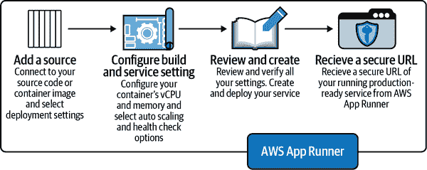

# 第七章：AWS 上的 MLOps

作者：Noah Gift

> 每个人都害怕他 [Dr. Abbott（因为他对每个人大喊大叫）]。当我在那里时，有一个叫做哈里斯的新住院医生。尽管哈里斯已经是主治医师并在那里工作了 5 年，但他仍然害怕他 [Dr. Abbott]。后来 [Dr. Abbott] 发生了心脏病发作，然后心脏停止跳动。一位护士大声喊道，“快，他刚发生了心脏骤停，快进来！” 于是哈里斯走进去……靠在胸骨上，打断了肋骨等。于是哈里斯开始给 Abbott 做心肺复苏，他醒了过来。他醒了过来！他抬头看着哈里斯说，“你！停下！” 于是哈里斯停了下来。这就是有关 Abbott 的最后一个故事。
> 
> Dr. Joseph Bogen

我经常从学生那里得到一个最常见的问题：“我应该选择哪个云服务？” 我告诉他们，安全的选择是亚马逊。它拥有最广泛的技术选择和最大的市场份额。一旦掌握了 AWS 云，就更容易掌握其他云服务，因为它们也假设你可能已经了解 AWS。本章介绍了 AWS 在 MLOps 中的基础，并探讨了实用的 MLOps 模式。

我有着与 AWS 合作的悠久而丰富的历史。在我担任 CTO 和总经理的体育社交网络上，AWS 是一个秘密武器，使我们能够扩展到全球数百万用户。我还在过去几年中从头开始参与了 AWS 机器学习认证的专家（SME）。我被认定为 [AWS ML Hero](https://oreil.ly/JbWXC)，我还是 [AWS Faculty Cloud Ambassador program](https://oreil.ly/WsPtx) 的一员，并在加州大学戴维斯分校、西北大学、杜克大学和田纳西大学教授了数千名学生的云计算证书。所以你可以说我是 AWS 的粉丝！

由于 AWS 平台的庞大规模，不可能涵盖 MLOps 的每一个方面。如果您想要更详尽地了解所有可用的 AWS 平台选项，您也可以查看 Chris Fregly 和 Antje Barth（O’Reilly）的 [*Data Science on AWS*](https://oreil.ly/0kHOI)，我是其中的技术编辑之一。

相反，本章侧重于像 AWS Lambda 和 AWS App Runner 这样的高级服务。像 AWS SageMaker 这样的更复杂系统在本书的其他章节中有详细介绍。接下来，让我们开始构建 AWS MLOps 解决方案。

# AWS 简介

AWS 之所以成为云计算领导者，原因包括其早期的启动和企业文化。2005 年和 2006 年，亚马逊推出了亚马逊网络服务，包括 MTurk（机械土耳其人）、Amazon S3、Amazon EC2 和 Amazon SQS。

直到今天，这些核心产品不仅仍然存在，而且每个季度和年度都有所改进。AWS 持续改进其产品的原因在于其文化。他们说在亚马逊，永远是“第一天”，这意味着每天都应该保持同样的能量和热情。他们还将客户置于他们所做的一切的“核心”。我已经使用这些基础组件构建了能够处理机器学习、计算机视觉和人工智能任务的成千上万个节点的系统。图 7-1 是在旧金山市中心共享工作空间展示的 AWS 云技术架构的实际白板绘图。


###### 图 7-1\. AWS 云架构在白板上的图示

这种文化类型与谷歌非常不同，后者在云计算方面遇到了困难。谷歌文化以研究为导向，重视学术招聘。这种文化的好处是开源项目，如 Kubernetes 和 TensorFlow。两者都是复杂的工程奇迹。缺点是在文化中客户不是第一位，这在云计算市场份额上伤害了谷歌。许多组织对于不购买专业服务并支持像云计算这样关键的事物感到犹豫不决。

接下来，让我们看看如何开始使用 AWS 服务。

## 开始使用 AWS 服务

要开始使用 AWS，最初只需要一个[免费层账户](https://oreil.ly/8hBjG)。如果你在大学，你也可以使用[AWS 学院](https://oreil.ly/W079B)和[AWS Educate](https://oreil.ly/6ZFNh)。AWS 学院提供实践认证材料和实验室。AWS Educate 为课堂提供沙盒环境。

一旦你有了账户，下一步是尝试各种服务。思考 AWS 的一种方式是将其与批量批发店进行比较。例如，根据[statista](https://oreil.ly/m6lgS)，Costco 在全球有 795 个分店，遍布多个国家，大约五分之一的美国人在那里购物。同样，根据 2020 年的[亚马逊网络服务白皮书](https://oreil.ly/w8Jft)，AWS 提供了一个基础设施，支持“全球 190 个国家数十万家企业”。

在 Costco，有三种方法被认为与 AWS 类比相关：

+   在第一种情况下，顾客可以走进去订购一份非常便宜但质量合理的批量披萨。

+   在第二种情况下，一位新来的 Costco 顾客需要找出所有的散装商品，以便调查最佳的 Costco 使用方式。他们需要走过整个商店，看看像糖这样的散装商品，看看他们可以用这些原料建造什么。

+   在第三种情况下，当 Costco 的客户了解到已准备好的餐点（如旋转烤鸡、比萨等）并知道他们可以购买的所有原材料时，他们可以理论上利用自己对 Costco 及其提供的服务的了解开办一个餐饮公司、当地熟食店或餐厅。

Costco 这样规模的大型零售商对已经准备好的食品收费更多，对生的食材收费更少。Costco 的客户可以根据他们组织的成熟度和他们想要解决的问题来选择不同的食品准备水平。图 7-2 说明了这些 Costco 选项与 AWS 选项的比较。


###### 图 7-2\. Costco 与 AWS

让我们以夏威夷著名海滩附近的一家当地鱼生碗摊位为例。店主可以批量购买 Costco 的现成鱼生并以大约两倍成本的价格出售。但相反，夏威夷的另一个成熟的烧烤餐厅，有能力烹饪和准备食物的员工，Costco 销售未加工的食品的价格低于已经准备好的鱼生。

像 Costco 一样，AWS 提供不同级别的产品，客户可以自行决定他们要利用多少。让我们深入了解这些选项。

### 使用“No Code/Low Code” AWS Comprehend 解决方案

最后一个例子展示了如何利用 Costco 可以使不同的餐厅业务受益，从没有员工的快餐摊位到更大规模的餐厅。Costco 在准备食物方面做的工作越多，购买它的顾客的收益就越高，食物的成本也越高。AWS 也适用同样的概念；AWS 为您做的工作越多，您就需要支付的费用就越高，并且您需要维护服务的人员就越少。

###### 注：

在经济学中，比较优势理论认为你不应该直接比较某个东西的成本，而是应该比较自己做的机会成本。所有云服务提供商都将这种假设内在化，因为运行数据中心并在该数据中心上构建服务是他们的专长。进行 MLOps 的组织应该专注于为客户创造产生收入的产品，而不是重新创建云服务提供商做得很糟糕的事情。

对于 AWS，一个很好的起点是像 Costco 的客户那样批量订购 Costco 比萨。同样，一家财富 500 强公司可能有必要将自然语言处理（NLP）添加到其客户服务产品中，可以花费九个月到一年时间招聘团队并构建这些能力，也可以开始使用宝贵的高级别服务，比如[AWS Comprehend for Natural Language Processing](https://oreil.ly/z6vIs)。AWS Comprehend 还使用户可以利用亚马逊 API 执行许多 NLP 操作，包括以下内容：

+   实体检测

+   关键词检测

+   PII

+   语言检测

+   情绪

例如，您可以将文本剪切并粘贴到亚马逊理解控制台中，AWS Comprehend 将找到所有文本的实体。在 图 7-3 的示例中，我抓取了勒布朗·詹姆斯维基百科传记的第一段，粘贴到控制台，点击分析，它会为我突出显示实体。


###### 图 7-3\. AWS Comprehend

其他用例，如审查医疗记录或确定客户服务响应的情绪，同样可以通过 AWS Comprehend 和 boto3 Python SDK 简单实现。接下来，让我们来介绍一个关于在 AWS 上进行 DevOps 的“hello world”项目，使用 Amazon S3 部署静态网站。

### 使用 Hugo 静态 S3 网站

在以下场景中，探索 AWS 的一个很好的方法是像第一次参观 Costco 时一样“四处走走”控制台。您可以首先查看 AWS 的基础组件，即 IaaS（基础设施即代码）。这些核心服务包括 AWS S3 对象存储和 AWS EC2 虚拟机。

在这里，我将向您介绍如何使用“hello world”示例，在 [AWS S3 静态网站托管](https://oreil.ly/FyHWG) 上部署 [Hugo 网站](https://gohugo.io)。选择使用 Hugo 进行 hello world 的原因是它相对简单设置，并且将帮助您更好地理解使用核心基础设施进行主机服务。这些技能在您学习使用持续交付部署机器学习应用程序时将非常有用。

###### 注意

值得注意的是，亚马逊 S3 具有低成本和高可靠性。 S3 的定价接近每 GB 一分钱。这种低成本且高可靠性的基础设施是云计算如此引人注目的原因之一。

您可以在 [GitHub 仓库](https://oreil.ly/mYjqN) 中查看整个项目。请注意，GitHub 是网站的真实来源，因为整个项目由文本文件组成：Markdown 文件，Hugo 模板和 AWS Code 构建服务器的构建命令。此外，您还可以在那里通过连续部署的屏幕录像来了解。图 7-4 显示了该项目的高级架构。


###### 图 7-4\. Hugo

该项目的工作原理简而言之是通过 *buildspec.yml* 文件的魔力。让我们来看看以下示例中的工作原理。首先，注意 `hugo` 二进制文件安装，然后运行 `hugo` 命令以从检出的存储库生成 HTML 文件。最后，由于 S3 存储桶托管的强大功能，`aws` 命令 `aws s3 sync --delete public s3://dukefeb1` 就是整个部署过程：

```
version: 0.1

environment_variables:
  plaintext:
    HUGO_VERSION: "0.79.1"

phases:
  install:
    commands:
      - cd /tmp
      - wget https://github.com/gohugoio/hugo/releases/download/v0.80.0/\
 hugo_extended_0.80.0_Linux-64bit.tar.gz
      - tar -xzf hugo_extended_0.80.0_Linux-64bit.tar.gz
      - mv hugo /usr/bin/hugo
      - cd
      - rm -rf /tmp/*
  build:
    commands:
      - rm -rf public
      - hugo
  post_build:
    commands:
      - aws s3 sync --delete public s3://dukefeb1
      - echo Build completed on `date`
```

描述构建系统文件的另一种方式是它是一个配方。构建配置文件中的信息是在 AWS Cloud9 开发环境中执行相同操作的“如何”。

如第二章所述，AWS Cloud9 在解决特定问题方面具有特殊意义。基于云的开发环境使您能够在发生所有活动的确切位置进行开发。示例展示了这一概念的强大之处。查看代码，在云中进行测试，并验证相同工具的部署。在图 7-5 中，AWS Cloud9 环境调用了一个 Python 微服务。


###### 图 7-5\. Cloud9

###### 注意

您可以在[O'Reilly 平台上观看 Hugo 在 AWS 上的部署演示](https://oreil.ly/nSiVH)，并参考[Pragmatic AI Labs 网站上的更详细指南](https://oreil.ly/0AmNU)。

有了持续交付的基础，让我们深入了解 AWS 平台上的无服务器。

### 无服务器烹饪书

无服务器是 MLOps 中至关重要的方法。在第二章中，我提到了 Python 函数的重要性。Python 函数是一个可以接收输入并可选择返回输出的工作单元。如果把 Python 函数比作是烤面包机，您放入面包，它加热面包，并弹出烤好的面包，那么无服务器就是电的源泉。

Python 函数需要在某处运行，就像烤面包机需要插电才能工作一样。这就是无服务器的概念；它使代码能够在云中运行。无服务器的最通用定义是无需服务器即可运行的代码。服务器本身被抽象化以便开发人员专注于编写函数。这些函数执行特定任务，可以将这些任务链接在一起构建更复杂的系统，例如响应事件的服务器。

在云计算中，函数是宇宙的中心。实际上，这意味着任何函数都可以映射到解决问题的技术中：容器、Kubernetes、GPU 或 AWS Lambda。正如您在图 7-6 中看到的，Python 中有一个丰富的解决方案生态系统直接映射到函数。

在 AWS 平台上执行无服务器的最低级别服务是 AWS Lambda。让我们来看看[这个仓库中的几个例子](https://oreil.ly/TR4E2)。

首先，AWS 上编写的较为简单的 Lambda 函数之一是马可·波罗函数。马可·波罗函数接收一个包含名称的事件。例如，如果事件名称是“Marco”，它返回“Polo”。如果事件名称是其他内容，则返回“No!”。


###### 图 7-6\. Python 函数

###### 注意

在 1980 年代和 1990 年代成长为青少年时，Marco Polo 是夏季游泳池中的一种典型游戏。当我在家附近的一个游泳池担任营地顾问时，这是我监督的孩子们最喜欢的游戏。游戏的方式是每个人都进入游泳池，有一个人闭上眼睛喊“Marco”，其他游泳者必须回答“Polo”。闭眼的人通过声音找到要标记的人。一旦有人被标记，他们就成了“它”。

这是 AWS Lambda 的 Marco Polo 代码；请注意 `event` 传递到 `lambda_handler`：

```
def lambda_handler(event, context):
    print(f"This was the raw event: {event}")
    if event["name"] == "Marco":
        print(f"This event was 'Marco'")
        return "Polo"
    print(f"This event was not 'Marco'")
    return "No!"
```

在无服务器云计算中，想象一下车库中的灯泡。灯泡可以通过手动开关或自动通过车库门打开事件等多种方式打开。同样，AWS Lambda 也会响应多种信号。

让我们列举灯泡和 Lambda 可以触发的方式：

+   灯泡

    +   手动打开开关。

    +   通过车库门开启器。

    +   每晚安全定时器在午夜到上午 6 点之间打开灯光。

+   AWS Lambda

    +   可以通过控制台、AWS 命令行或 AWS Boto3 SDK 手动调用。

    +   响应 S3 事件，比如上传文件到一个存储桶中。

    +   定时器每晚调用以下载数据。

还有更复杂的例子吗？使用 AWS Lambda，您可以简单地在所有新图像放入文件夹时集成 S3 触发器与计算机视觉标签。代码量微不足道：

```
import boto3
from urllib.parse import unquote_plus

def label_function(bucket, name):
    """This takes an S3 bucket and a image name!"""
    print(f"This is the bucketname {bucket} !")
    print(f"This is the imagename {name} !")
    rekognition = boto3.client("rekognition")
    response = rekognition.detect_labels(
        Image={"S3Object": {"Bucket": bucket, "Name": name,}},
    )
    labels = response["Labels"]
    print(f"I found these labels {labels}")
    return labels

def lambda_handler(event, context):
    """This is a computer vision lambda handler"""

    print(f"This is my S3 event {event}")
    for record in event['Records']:
        bucket = record['s3']['bucket']['name']
        print(f"This is my bucket {bucket}")
        key = unquote_plus(record['s3']['object']['key'])
        print(f"This is my key {key}")

    my_labels = label_function(bucket=bucket,
        name=key)
    return my_labels
```

最后，您可以通过 AWS Step Functions 将多个 AWS Lambda 函数串联起来：

```
{
  "Comment": "This is Marco Polo",
  "StartAt": "Marco",
  "States": {
    "Marco": {
      "Type": "Task",
      "Resource": "arn:aws:lambda:us-east-1:561744971673:function:marco20",
      "Next": "Polo"
    },
    "Polo": {
      "Type": "Task",
      "Resource": "arn:aws:lambda:us-east-1:561744971673:function:polo",
      "Next": "Finish"
    },
    "Finish": {
      "Type": "Pass",
      "Result": "Finished",
      "End": true
    }
  }
}
```

您可以在 Figure 7-7 中看到此工作流程的实际操作。


###### 图 7-7\. 步骤函数

更有趣的是，您可以通过 CLI 调用 AWS Lambda 函数。这里是一个例子：

```
aws lambda invoke \
   --cli-binary-format raw-in-base64-out \
  --function-name marcopython \
  --payload '{"name": "Marco"}' \
  response.json
```

###### 注意

重要的是始终参考最新的 AWS CLI 文档，因为它是一个活跃的目标。截至本书写作时，当前的 CLI 版本是 V2，但您可能需要根据未来的变化调整命令行示例。您可以在[AWS CLI 命令参考网站](https://oreil.ly/c7zU5)找到最新的文档。

负载的响应如下：

```
{
    "StatusCode": 200,
    "ExecutedVersion": "$LATEST"
}
(.venv) [cloudshell-user@ip-10-1-14-160 ~]$ cat response.json
"Polo"(.venv) [cloudshell-user@ip-10-1-14-160 ~]$
```

###### 注意

欲了解更高级的 AWS Lambda 演练，请查看[Pragmatic AI Labs YouTube 频道](https://oreil.ly/Zy2Ga)或[O’Reilly 学习平台](https://oreil.ly/DsL1k)上的小型 Wikipedia 微服务演练。

AWS Lambda 可能是您用来为机器学习流水线提供预测或在 MLOps 进程中处理事件的最有价值和灵活的计算类型。这是因为开发和测试的速度。接下来，让我们谈谈一些 CaaS（容器即服务）的提供。

### AWS CaaS

Fargate 是 AWS 提供的一种容器即服务（CaaS），允许开发人员专注于构建容器化的微服务。例如，在图 7-8 中，当此微服务在容器中工作时，整个运行时，包括部署所需的包，都将在一个新环境中工作。云平台处理其余的部署工作。


###### 图 7-8\. MLOps for CaaS

###### 注意

容器解决了困扰软件行业的许多问题。因此，作为一个一般规则，对于 MLOps 项目来说，使用它们是个好主意。以下是容器在项目中的一些优点的部分列表：

+   允许开发人员在本地桌面上模拟生产服务

+   允许通过公共容器注册表（如 Docker Hub、GitHub Container Registry 和 Amazon Elastic Container Registry）轻松地将软件运行时分发给客户。

+   允许 GitHub 或源代码存储库成为“事实上的真实来源”，并包含微服务的所有方面：模型、代码、IaC 和运行时

+   允许通过 CaaS 服务轻松进行生产部署

让我们看看如何使用 Flask 构建一个返回正确找零的微服务。图 7-9 展示了在 AWS Cloud9 上的开发工作流程。Cloud9 是开发环境；一个容器被构建并推送到 ECR。稍后，该容器在 ECS 中运行。


###### 图 7-9\. ECS 工作流

以下是*app.py*的 Python 代码：

```
from flask import Flask
from flask import jsonify
app = Flask(__name__)

def change(amount):
    # calculate the resultant change and store the result (res)
    res = []
    coins = [1,5,10,25] # value of pennies, nickels, dimes, quarters
    coin_lookup = {25: "quarters", 10: "dimes", 5: "nickels", 1: "pennies"}

    # divide the amount*100 (the amount in cents) by a coin value
    # record the number of coins that evenly divide and the remainder
    coin = coins.pop()
    num, rem  = divmod(int(amount*100), coin)
    # append the coin type and number of coins that had no remainder
    res.append({num:coin_lookup[coin]})

    # while there is still some remainder, continue adding coins to the result
    while rem > 0:
        coin = coins.pop()
        num, rem = divmod(rem, coin)
        if num:
            if coin in coin_lookup:
                res.append({num:coin_lookup[coin]})
    return res

@app.route('/')
def hello():
    """Return a friendly HTTP greeting."""
    print("I am inside hello world")
    return 'Hello World! I can make change at route: /change'

@app.route('/change/<dollar>/<cents>')
def changeroute(dollar, cents):
    print(f"Make Change for {dollar}.{cents}")
    amount = f"{dollar}.{cents}"
    result = change(float(amount))
    return jsonify(result)

if __name__ == '__main__':
    app.run(host='0.0.0.0', port=8080, debug=True)
```

注意，Flask Web 微服务通过网址模式`/change/<dollar>/<cents>`响应更改请求。您可以查看这个[Fargate 示例在 GitHub 存储库中的完整源代码](https://oreil.ly/3qPHM)。以下是步骤：

1.  设置应用程序：virtualenv + `make all`

1.  在本地测试应用程序：`python app.py`

1.  使用 curl 进行测试：`curl localhost:8080/change/1/34`

1.  创建 ECR（Amazon 容器注册表）

    在图 7-10，一个 ECR 存储库使后续的 Fargate 部署成为可能。

    

    ###### 图 7-10\. ECR

1.  构建容器

1.  推送容器

1.  在本地运行 docker：`docker run -p 8080:8080 changemachine`

1.  部署到 Fargate

1.  测试公共服务

###### 注意

任何云服务都会在功能上迅速变化，因此最好阅读当前的文档。当前的[Fargate 文档](https://oreil.ly/G8tPV)是了解部署到该服务的最新方式的好地方。

你也可以选择在[O’Reilly 平台](https://oreil.ly/2IpFs)观看完整的 Fargate 部署演示。

另一个 CaaS 选项是 AWS App Runner，它进一步简化了事务。例如，您可以直接从源代码部署或指向一个容器。在图 7-11，AWS App Runner 创建了一个流线型工作流，连接源代码存储库、部署环境和最终的安全 URL。



###### 图 7-11\. AWS App Runner

此存储库可以轻松地转换为 AWS App Runner 方法，只需按照以下步骤在 AWS 向导中操作：

1.  要构建该项目，请使用命令：`pip install -r requirements.txt`。

1.  要运行该项目，请使用：`python app.py`。

1.  最后，配置端口使用：`8080`。

一个关键的创新，如图 7-12 所示，是能够将许多不同的 AWS 服务连接起来，即核心基础设施，如 AWS CloudWatch、负载均衡器、容器服务和 API 网关，形成一个完整的解决方案。


###### 图 7-12\. AWS App Runner 服务已创建

最终部署的服务在图 7-13 中显示了一个安全的 URL，并且能够调用端点并返回正确的更改。


###### 图 7-13\. AWS App Runner 部署完成

这种方法有何神奇之处？简言之，所有的逻辑，包括可能的机器学习模型，都在一个代码库中。因此，这是构建 MLOps 友好产品的一种引人注目的方式。此外，将机器学习应用程序交付到生产中的一个更复杂的方面是微服务部署。AWS App Runner 让大部分复杂性消失，为 MLOps 问题的其他部分节省时间。接下来，让我们讨论 AWS 如何处理计算机视觉。

### 计算机视觉

我在[北西大学的研究生数据科学课程](https://oreil.ly/Q6uRI)中教授应用计算机视觉课程。这门课非常有趣，因为我们做以下事情：

+   每周视频演示

+   焦点放在解决问题上，而不是编码或建模

+   使用高级工具如 AWS DeepLens，一个支持深度学习的视频摄像机

实际上，这允许一个快速的反馈循环，专注于解决问题而不是解决问题的技术。在使用的技术中，AWS Deep Lens 设备是一个例子，如图 7-14 所示。该设备是一个完整的计算机视觉硬件开发工具包，包含一个 1080p 摄像头、操作系统和无线功能。特别是，这解决了计算机视觉原型设计的问题。


###### 图 7-14\. DeepLens

一旦 AWS DeepLens 开始捕获视频，它将视频分成两个流。在图 7-15 中显示的项目流将实时注释添加到视频并将数据包发送到 MQTT（消息队列遥测传输）服务，这是一种发布-订阅网络协议。


###### 图 7-15\. 检测

在图 7-16 中，随着对象在流中被检测到，MQTT 数据包实时到达。

DeepLens 是一种“即插即用”的技术，因为它解决了构建实时计算机视觉原型系统中可能最具挑战性的问题——捕获数据并将其发送到某个地方。这种技术的“乐趣”在于使用 AWS DeepLens 轻松从零构建解决方案。接下来，让我们更具体地进入，超越仅构建微服务，进入构建部署机器学习代码的微服务。


###### 图 7-16\. MQTT

## AWS 上的 MLOps

在 AWS 上开始 MLOps 的一种方法是考虑以下问题。当面临一个机器学习问题时，有三个约束条件——预测准确性、可解释性和操作性，你会侧重于哪两个以取得成功，并且顺序是什么？

许多以学术为重点的数据科学家立即跳到预测准确性。构建越来越好的预测模型是一种有趣的挑战，就像玩俄罗斯方块一样。此外，建模是一项光荣的工作方面，也是工作中令人向往的一部分。数据科学家喜欢展示他们能够使用日益复杂的技术训练学术模型的准确性。

Kaggle 平台的整体工作是提高预测准确性，并为精确模型提供经济奖励。另一种方法是专注于模型的运行化。这种方法的优势在于，随着软件系统的改进，模型的准确性也能得到提高。就像日本汽车工业专注于改善（Kaizen）或持续改进一样，一个机器学习系统可以专注于合理的初始预测准确性，并快速改进。

AWS 的文化支持“行动偏见”和“交付结果”这一概念。所谓“行动偏见”是指默认选择速度和交付结果，专注于业务的关键输入，并快速交付结果。因此，AWS 围绕机器学习的产品，如 AWS SageMaker，展现了这种行动和结果导向文化的精神。

持续交付（CD）是 MLOps 中的核心组成部分。在可以为机器学习自动化交付之前，微服务本身需要自动化。具体细节会根据涉及的 AWS 服务类型而变化。让我们从一个端到端的示例开始。

在以下示例中，一个 Elastic Beanstalk Flask 应用程序使用 AWS CodeBuild 到 AWS Elastic Beanstalk 实现持续部署。这种“堆栈”也非常适合部署 ML 模型。Elastic Beanstalk 是 AWS 提供的平台即服务技术，可以简化应用程序部署的大部分工作。

在 图 7-17 中，注意 AWS Cloud9 是开发的推荐起点。接下来，一个 GitHub 仓库保存项目的源代码，并在发生变更事件时触发云原生构建服务器 AWS CodeBuild。最后，AWS CodeBuild 进程运行持续集成，为 AWS Elastic Beanstalk 提供持续交付。


###### 图 7-17\. 弹性 Beanstalk

###### 注意

以下链接包含源代码和此示例的详细步骤：

+   [源代码](https://oreil.ly/L8ltB)

+   [O’Reilly 平台视频演示](https://oreil.ly/JUuLO)

要复制此项目，请执行以下步骤：

1.  如果你具备强大的命令行技能，可以在 AWS Cloud9 或 AWS CloudShell 中查看仓库。

1.  创建 Python 虚拟环境并激活它，然后运行 `make all`：

    ```
    python3 -m venv ~/.eb
    source ~/.eb/bin/activate
    make all
    ```

    请注意，`awsebcli` 通过 requirements 安装，并且此工具从 CLI 控制 Elastic Beanstalk。

1.  初始化新的 `eb` 应用程序：

    ```
    eb init -p python-3.7 flask-continuous-delivery --region us-east-1
    ```

    可选择使用 `eb init` 创建 SSH 密钥以登录运行实例。

1.  创建远程 eb 实例：

    ```
    eb create flask-continuous-delivery-env
    ```

1.  设置 AWS Code Build 项目。请注意，您的 Makefile 需要反映您的项目名称：

    ```
    version: 0.2

    phases:
      install:
        runtime-versions:
          python: 3.7
      pre_build:
        commands:
          - python3.7 -m venv ~/.venv
          - source ~/.venv/bin/activate
          - make install
          - make lint

      build:
        commands:
          - make deploy
    ```

当您使用持续部署成功运行项目后，您已准备好进入下一步，部署机器学习模型。我强烈建议您先完成像这样的“Hello World”类型的项目，再深入学习复杂的机器学习项目。接下来，让我们看一个刻意简单的 MLOps Cookbook，它是许多新 AWS 服务部署的基础。

# AWS 上的 MLOps Cookbook

基础组件准备好后，让我们看一个基本的机器学习示例，并将其应用于多种场景。注意，这个核心示例可部署到 AWS 和许多其他云环境的多个服务上。此后的 MLOps Cookbook 项目刻意简洁，重点是部署机器学习。例如，此项目根据体重输入预测美国职业棒球大联盟球员的身高。

在 图 7-18 中，GitHub 是信息源并包含项目脚手架。接下来，构建服务是 GitHub Actions，容器服务是 GitHub Container Registry。这两项服务都可以轻松替代云中的类似服务。特别是在 AWS 云上，你可以使用 AWS CodeBuild 进行 CI/CD 和 AWS ECR（Elastic Container Registry）。最后，一旦项目被“容器化”，它将面向多个部署目标开放。在 AWS 上，这些包括 AWS Lambda、AWS 弹性 Beanstalk 和 AWS App Runner。


###### 图 7-18\. MLOps Cookbook

以下文件在多个不同的方案中构建解决方案时都非常有用：

Makefile

Makefile 既是一系列配方的列表，也是调用这些配方的方法。查看 [示例 GitHub 项目中的 Makefile](https://oreil.ly/paYV6)。

requirements.txt

requirements 文件包含项目所需的 Python 包列表。通常这些包会固定版本号，以限制意外的包依赖。查看 [示例 GitHub 项目中的 requirements.txt](https://oreil.ly/7p6QH)。

cli.py

这个命令行显示了如何从 CLI 调用 ML 库，而不仅仅是通过 Web 应用程序。查看[example GitHub 项目中的 cli.py](https://oreil.ly/iyI44)。

utilscli.py

utilscli.py 是一个实用工具，允许用户调用不同的端点，即 AWS、GCP、Azure 或任何生产环境。大多数机器学习算法需要数据进行缩放。这个工具简化了输入的缩放和输出的恢复。查看[example GitHub 项目中的 utilscli.py](https://oreil.ly/6tjps)。

app.py

应用程序文件是 Flask Web 微服务，通过`/predict` URL 端点接受并返回 JSON 预测结果。查看[example GitHub 项目中的 app.py](https://oreil.ly/6LTMs)。

mlib.py

模型处理库在一个集中位置完成了大部分的繁重工作。这个库意在非常基础，不解决像缓存加载模型或其他生产环境独特的更复杂问题。查看[example GitHub 项目中的 mlib.py](https://oreil.ly/wgGPC)。

htwtmlb.csv

CSV 文件对于输入缩放非常有帮助。查看[example GitHub 项目中的 htwtmlb.csv](https://oreil.ly/cn8ul)。

model.joblib

这个模型是从 sklearn 导出的，但也可以很容易地转换为其他格式，比如 ONNX 或 TensorFlow。其他真实世界的生产考虑可能包括将这个模型保存在不同的位置，比如 Amazon S3、一个容器中，或者甚至由 AWS SageMaker 托管。查看[example GitHub 项目中的 model.joblib](https://oreil.ly/Y4VV9)。

Dockerfile

该文件使项目容器化，从而在 AWS 平台以及其他云上开放了许多新的部署选项。查看[example GitHub 项目中的 Dockerfile](https://oreil.ly/QIEAu)。

Baseball_Predictions_Export_Model.ipynb

Jupyter 笔记本是机器学习项目中包括的关键工件。它展示了创建模型背后的思路，并为在生产中维护项目提供了宝贵的背景信息。查看[example GitHub 项目中的 Baseball_Predictions_Export_Model.ipynb](https://oreil.ly/jvs0O)。

这些项目工件对于解释 MLOps 作为教育工具非常有帮助，但在独特的生产场景中可能会有所不同或更加复杂。接下来，让我们讨论 CLI（命令行界面）工具如何帮助操作化机器学习项目。

## CLI 工具

在这个项目中有两个 CLI 工具。首先，主要的*cli.py*是服务预测输出的端点。例如，要预测 MLB 球员的身高，您可以使用以下命令创建一个预测：`./cli.py --weight 180`。请注意，在图 7-19 中，`--weight`命令行选项允许用户快速测试许多新的预测输入。


###### 图 7-19\. CLI 预测

所以这是如何工作的？大部分的“魔法”是通过一个库来完成的，该库负责扩展数据、进行预测，然后再进行逆转换：

```
"""MLOps Library"""

import numpy as np
import pandas as pd
from sklearn.linear_model import Ridge
import joblib
from sklearn.preprocessing import StandardScaler
from sklearn.model_selection import train_test_split
import logging

logging.basicConfig(level=logging.INFO)

import warnings

warnings.filterwarnings("ignore", category=UserWarning)

def load_model(model="model.joblib"):
    """Grabs model from disk"""

    clf = joblib.load(model)
    return clf

def data():
    df = pd.read_csv("htwtmlb.csv")
    return df

def retrain(tsize=0.1, model_name="model.joblib"):
    """Retrains the model

 See this notebook: Baseball_Predictions_Export_Model.ipynb
 """
    df = data()
    y = df["Height"].values  # Target
    y = y.reshape(-1, 1)
    X = df["Weight"].values  # Feature(s)
    X = X.reshape(-1, 1)
    scaler = StandardScaler()
    X_scaler = scaler.fit(X)
    X = X_scaler.transform(X)
    y_scaler = scaler.fit(y)
    y = y_scaler.transform(y)
    X_train, X_test, y_train, y_test = train_test_split(
        X, y, test_size=tsize, random_state=3
    )
    clf = Ridge()
    model = clf.fit(X_train, y_train)
    accuracy = model.score(X_test, y_test)
    logging.debug(f"Model Accuracy: {accuracy}")
    joblib.dump(model, model_name)
    return accuracy, model_name

def format_input(x):
    """Takes int and converts to numpy array"""

    val = np.array(x)
    feature = val.reshape(-1, 1)
    return feature

def scale_input(val):
    """Scales input to training feature values"""

    df = data()
    features = df["Weight"].values
    features = features.reshape(-1, 1)
    input_scaler = StandardScaler().fit(features)
    scaled_input = input_scaler.transform(val)
    return scaled_input

def scale_target(target):
    """Scales Target 'y' Value"""

    df = data()
    y = df["Height"].values  # Target
    y = y.reshape(-1, 1)  # Reshape
    scaler = StandardScaler()
    y_scaler = scaler.fit(y)
    scaled_target = y_scaler.inverse_transform(target)
    return scaled_target

def height_human(float_inches):
    """Takes float inches and converts to human height in ft/inches"""

    feet = int(round(float_inches / 12, 2))  # round down
    inches_left = round(float_inches - feet * 12)
    result = f"{feet} foot, {inches_left} inches"
    return result

def human_readable_payload(predict_value):
    """Takes numpy array and returns back human readable dictionary"""

    height_inches = float(np.round(predict_value, 2))
    result = {
        "height_inches": height_inches,
        "height_human_readable": height_human(height_inches),
    }
    return result

def predict(weight):
    """Takes weight and predicts height"""

    clf = load_model()  # loadmodel
    np_array_weight = format_input(weight)
    scaled_input_result = scale_input(np_array_weight)
    scaled_height_prediction = clf.predict(scaled_input_result)
    height_predict = scale_target(scaled_height_prediction)
    payload = human_readable_payload(height_predict)
    predict_log_data = {
        "weight": weight,
        "scaled_input_result": scaled_input_result,
        "scaled_height_prediction": scaled_height_prediction,
        "height_predict": height_predict,
        "human_readable_payload": payload,
    }
    logging.debug(f"Prediction: {predict_log_data}")
    return payload
```

接下来，Click 框架包装了对 *mlib.py* 的库调用，并提供了一个清晰的界面来提供预测服务。使用命令行工具与机器学习模型进行交互的主要优势有很多。快速开发和部署命令行机器学习工具的速度可能是最重要的：

```
#!/usr/bin/env python
import click
from mlib import predict

@click.command()
@click.option(
    "--weight",
    prompt="MLB Player Weight",
    help="Pass in the weight of a MLB player to predict the height",
)
def predictcli(weight):
    """Predicts Height of an MLB player based on weight"""

    result = predict(weight)
    inches = result["height_inches"]
    human_readable = result["height_human_readable"]
    if int(inches) > 72:
        click.echo(click.style(human_readable, bg="green", fg="white"))
    else:
        click.echo(click.style(human_readable, bg="red", fg="white"))

if __name__ == "__main__":
    # pylint: disable=no-value-for-parameter
    predictcli()
```

第二个 CLI 工具是 *utilscli.py*，它执行模型重新训练，并可以作为执行更多任务的入口点。例如，这个版本不会更改默认的 `model_name`，但你可以通过 [forking this repo](https://oreil.ly/dcVf1) 添加该选项：

```
./utilscli.py retrain --tsize 0.4
```

注意，*mlib.py* 再次承担了大部分的重活，但 CLI 提供了一个便捷的方式来快速原型化一个 ML 模型：

```
#!/usr/bin/env python
import click
import mlib
import requests

@click.group()
@click.version_option("1.0")
def cli():
    """Machine Learning Utility Belt"""

@cli.command("retrain")
@click.option("--tsize", default=0.1, help="Test Size")
def retrain(tsize):
    """Retrain Model
 You may want to extend this with more options, such as setting model_name
 """

    click.echo(click.style("Retraining Model", bg="green", fg="white"))
    accuracy, model_name = mlib.retrain(tsize=tsize)
    click.echo(
        click.style(f"Retrained Model Accuracy: {accuracy}", bg="blue",
                    fg="white")
    )
    click.echo(click.style(f"Retrained Model Name: {model_name}", bg="red",
                           fg="white"))

@cli.command("predict")
@click.option("--weight", default=225, help="Weight to Pass In")
@click.option("--host", default="http://localhost:8080/predict",
              help="Host to query")
def mkrequest(weight, host):
    """Sends prediction to ML Endpoint"""

    click.echo(click.style(f"Querying host {host} with weight: {weight}",
        bg="green", fg="white"))
    payload = {"Weight":weight}
    result = requests.post(url=host, json=payload)
    click.echo(click.style(f"result: {result.text}", bg="red", fg="white"))

if __name__ == "__main__":
    cli()
```

图 7-20 是重新训练模型的一个示例。


###### 图 7-20\. 模型重新训练

你还可以查询已部署的 API，这很快会处理 CLI，允许你更改主机和传递到 API 的值。这一步骤使用 `requests` 库。它可以帮助构建一个“纯” Python 示例，用于预测工具，而不仅仅是通过 `curl` 命令进行预测。你可以在 图 7-21 中看到输出的一个示例：

```
./utilscli.py predict --weight 400
```


###### 图 7-21\. 预测请求

也许你已经被 CLI 工具作为快速部署 ML 模型的理想方式所吸引，因此成为真正的 MLOps 导向组织。还能做什么？这里有两个更多的想法。

首先，你可以构建一个更复杂的客户端，使其可以对部署的 Web 服务进行异步 HTTP 请求。这个功能是在纯 Python 中构建实用工具的一个优点之一。一个可以考虑用于异步 HTTPS 的库是 [Fast API](https://oreil.ly/ohpZg)。

其次，你可以持续部署 CLI 本身。对于许多 SaaS 公司、大学实验室等场景，这可能是适应速度和敏捷性的理想工作流程。在这个示例 GitHub 项目中，有一个关于 [如何将命令行工具容器化的简单示例](https://oreil.ly/bLC6F)。关键文件包括 Makefile、*cli.py* 和 Dockerfile。

注意，Makefile 使用 `hadolint` 轻松“lint” Dockerfile 的语法：

```
install:
  pip install --upgrade pip &&\
    pip install -r requirements.txt

lint:
  docker run --rm -i hadolint/hadolint < Dockerfile
```

CLI 本身非常简洁，这是 Click 框架的一个宝贵特性之一：

```
#!/usr/bin/env python
import click

@click.command()
@click.option("--name")
def hello(name):
    click.echo(f'Hello {name}!')

if __name__ == '__main__':
    #pylint: disable=no-value-for-parameter
    hello()
```

最后，Dockerfile 构建了容器：

```
FROM python:3.7.3-stretch

# Working Directory
WORKDIR /app

# Copy source code to working directory
COPY . app.py /app/

# Install packages from requirements.txt
# hadolint ignore=DL3013
RUN pip install --no-cache-dir --upgrade pip &&\
    pip install --no-cache-dir --trusted-host pypi.python.org -r requirements.txt
```

要运行这个确切的容器，你可以执行以下步骤：

```
docker run -it noahgift/cloudapp python app.py --name "Big John"
```

输出如下：

```
Hello Big John!
```

这个工作流程非常适合基于 ML 的 CLI 工具！例如，要自己构建这个容器并推送它，你可以按照以下工作流程进行：

```
docker build --tag=<tagname> .
docker push <repo>/<name>:<tagname>
```

本节涵盖了如何构建机器学习项目的思路。特别是，有三个主要想法值得考虑：使用容器、构建 Web 微服务以及使用命令行工具。接下来，让我们更详细地讨论 Flask 微服务。

## Flask 微服务

在处理 MLOps 工作流时，值得注意的是，Flask ML 微服务可以以多种方式运行。本节涵盖了许多这些示例。

让我们首先看一下下面示例中 Flask 机器学习微服务应用程序的核心。请注意，大部分繁重的工作是通过 *mlib.py* 库完成的。唯一的“真实”代码是 Flask 路由，执行以下 `@app.route("/predict", methods=['POST'])` 的 POST 请求。它接受一个类似 `{"Weight": 200}` 的 JSON 负载，然后返回一个 JSON 结果：

```
from flask import Flask, request, jsonify
from flask.logging import create_logger
import logging

from flask import Flask, request, jsonify
from flask.logging import create_logger
import logging

import mlib

app = Flask(__name__)
LOG = create_logger(app)
LOG.setLevel(logging.INFO)

@app.route("/")
def home():
    html = f"<h3>Predict the Height From Weight of MLB Players</h3>"
    return html.format(format)

@app.route("/predict", methods=['POST'])
def predict():
    """Predicts the Height of MLB Players"""

    json_payload = request.json
    LOG.info(f"JSON payload: {json_payload}")
    prediction = mlib.predict(json_payload['Weight'])
    return jsonify({'prediction': prediction})

if __name__ == "__main__":
    app.run(host='0.0.0.0', port=8080, debug=True)
```

这个 Flask Web 服务使用 `python app.py` 运行非常简单。例如，您可以使用 `python app.py` 命令来运行 Flask 微服务：

```
(.venv) ec2-user:~/environment/Python-MLOps-Cookbook (main) $ python app.py
* Serving Flask app "app" (lazy loading)
* Environment: production
WARNING: This is a development server. Do not use it in a production...
Use a production WSGI server instead.
* Debug mode: on
INFO:werkzeug: * Running on http://127.0.0.1:8080/ (Press CTRL+C to quit)
INFO:werkzeug: * Restarting with stat
WARNING:werkzeug: * Debugger is active!
INFO:werkzeug: * Debugger PIN: 251-481-511
```

要对应用程序进行预测服务，请运行 `predict.sh`。请注意，一个小的 `bash` 脚本可以帮助您调试应用程序，而无需输入所有 `curl` 的术语，这可能会导致语法错误：

```
#!/usr/bin/env bash

PORT=8080
echo "Port: $PORT"

# POST method predict
curl -d '{
 "Weight":200
}'\
     -H "Content-Type: application/json" \
     -X POST http://localhost:$PORT/predict
```

预测结果显示，Flask 端点返回一个 JSON 负载：

```
(.venv) ec2-user:~/environment/Python-MLOps-Cookbook (main) $ ./predict.sh
Port: 8080
{
  "prediction": {
    "height_human_readable": "6 foot, 2 inches",
    "height_inches": 73.61
  }
}
```

请注意，早期的 *utilscli.py* 工具也可以向此端点发出 web 请求。您还可以使用 [httpie](https://httpie.io) 或者 [postman](https://postman.com) 工具。接下来，让我们讨论容器化策略在这个微服务中的应用。

### 容器化的 Flask 微服务

下面是构建容器并在本地运行的示例。（您可以在 GitHub 上找到 [*predict.sh* 的内容](https://oreil.ly/XhRfL)。）

```
#!/usr/bin/env bash

# Build image
#change tag for new container registery, gcr.io/bob
docker build --tag=noahgift/mlops-cookbook .

# List docker images
docker image ls

# Run flask app
docker run -p 127.0.0.1:8080:8080 noahgift/mlops-cookbook
```

添加容器工作流程非常简单，并且它能够支持更简单的开发方法，因为您可以与团队中的其他人共享容器。它还打开了将您的机器学习应用程序部署到更多平台的选项。接下来，让我们谈谈如何自动构建和部署容器。

### 通过 GitHub Actions 自动构建容器并推送到 GitHub 容器注册表

正如本书前面所述，GitHub Actions 的容器工作流对于许多场景都是一种有价值的成分。通过 GitHub Actions 自动构建容器并推送到 GitHub 容器注册表是有意义的。这一步骤可以同时作为容器构建过程和部署目标的测试，比如您要部署前面讨论过的 CLI 工具。下面是实际的代码示例。请注意，您需要更改 `tags` 来匹配您的容器注册表（如 图 7-22 所示）：

```
  build-container:
    runs-on: ubuntu-latest
    steps:
    - uses: actions/checkout@v2
    - name: Loging to GitHub registry
      uses: docker/login-action@v1
      with:
        registry: ghcr.io
        username: ${{ github.repository_owner }}
        password: ${{ secrets.BUILDCONTAINERS }}
    - name: build flask app
      uses: docker/build-push-action@v2
      with:
        context: ./
        #tags: alfredodeza/flask-roberta:latest
        tags: ghcr.io/noahgift/python-mlops-cookbook:latest
        push: true
```


###### 图 7-22\. GitHub 容器注册表

SaaS（即服务软件）构建系统和 SaaS 容器注册表不仅仅在核心云环境之外也很有帮助。它们向开发人员验证，无论是内部还是外部的开发人员，容器工作流程都是有效的。接下来，让我们将本章的许多概念联系起来，使用一个高级 PaaS 提供。

### AWS App Runner Flask 微服务

AWS App Runner 是一个高级服务，大大简化了 MLOps。例如，之前的 Python MLOps cookbook 配方只需几次 AWS App Runner 服务点击即可轻松集成。此外，如图 7-23 所示，AWS App Runner 指向一个源代码库，并且它会在每次 GitHub 更改时自动部署。

一旦部署完成，您可以打开 AWS Cloud9 或 AWS CloudShell，克隆 Python MLOps Cookbook 存储库，然后使用 *utilscli.py* 查询来自 App Runner 服务的端点。在 AWS CloudShell 中成功查询显示在图 7-24 中。


###### 图 7-23\. AWS App Runner


###### 图 7-24\. AWS App Runner 预测结果

简而言之，高级 AWS 服务使您能够更高效地进行 MLOps，因为较少的工作量用于 DevOps 构建流程。接下来，让我们转向 AWS 的另一个计算机选项，AWS Lambda。

# AWS Lambda 配方

安装[SAM（AWS 无服务器应用程序模型）如 AWS 文档所示](https://oreil.ly/94HDD)。AWS Cloud9 已经安装了它。您可以在 GitHub 上[找到配方](https://oreil.ly/AM38b)。AWS Lambda 是重要的，因为它与 AWS 的深度集成。让我们探讨如何使用现代最佳实践部署无服务器 ML 模型。

一种有效且推荐的将软件部署到生产环境的方法是通过[SAM](https://oreil.ly/uhBSr)。这种方法的创新结合了 Lambda 函数、事件源和其他资源作为部署过程和开发工具包。

特别是，根据 AWS 的说法，SAM 的关键优势包括单一部署配置、AWS CloudFormation 的扩展、内置最佳实践、本地调试和测试，以及与开发工具（包括我喜欢的 Cloud9）的深度集成。

要开始，首先应该[安装 AWS SAM CLI](https://oreil.ly/qPVNh)。之后，可以参考官方指南获取最佳结果。

## AWS Lambda-SAM Local

要开始使用 SAM Local，您可以尝试以下新项目的工作流程：

+   安装 SAM（如前所示）

+   `sam init`

+   `sam local invoke`

###### 注意

如果在 Cloud9 上构建，使用[utils/resize.sh](https://oreil.ly/Tony1)调整大小可能是个好主意：

```
utils/resize.sh 30
```

这个技巧可以为您提供更大的磁盘大小，以构建多个容器，使用 SAM local 或任何其他 AWS 容器工作流程。

这是一个典型的 SAM 初始化布局，对于 ML 项目来说稍有不同：

```
├── sam-app/
│   ├── README.md
│   ├── app.py
│   ├── requirements.txt
│   ├── template.yaml
│   └── tests
│       └── unit
│           ├── __init__.py
│           └── test_handler.py
```

有了这些基础知识，让我们继续深入了解如何使用 AWS Lambda 和 SAM。

## AWS Lambda-SAM 容器化部署

现在让我们深入了解 SAM 的容器化工作流程，因为它支持注册 AWS Lambda 使用的容器。您可以在以下存储库中查看 [容器化 SAM-Lambda 部署项目](https://oreil.ly/3ALrA)。首先，让我们介绍关键组件。部署到 SAM 的关键步骤包括以下文件：

+   *App.py*（AWS Lambda 入口点）

+   Dockerfile（用于构建并发送到 Amazon ECR 的内容）

+   *Template.yaml*（SAM 用于部署应用程序的模板）

Lambda 处理程序几乎没有做什么，因为所有的工作仍然在 *mlib.py* 库中进行。在使用 AWS Lambda 时需要注意的一个“陷阱”是，根据调用方式，Lambda 函数需要使用不同的逻辑处理。例如，如果 Lambda 通过控制台或 Python 调用，则没有 Web 请求体，但在与 API 网关集成的情况下，需要从事件的 `body` 中提取负载：

```
import json
import mlib

def lambda_handler(event, context):
    """Sample pure Lambda function"""

    #Toggle Between Lambda function calls and API Gateway Requests
    print(f"RAW LAMBDA EVENT BODY: {event}")
    if 'body' in event:
        event = json.loads(event["body"])
        print("API Gateway Request event")
    else:
        print("Function Request")

    #If the payload is correct predict it
    if event and "Weight" in event:
        weight = event["Weight"]
        prediction = mlib.predict(weight)
        print(f"Prediction: {prediction}")
        return {
            "statusCode": 200,
            "body": json.dumps(prediction),
        }
    else:
        payload = {"Message": "Incorrect or Empty Payload"}
        return {
            "statusCode": 200,
            "body": json.dumps(payload),
        }
```

项目包含一个 Dockerfile，用于构建位于 ECR 位置的 Lambda。注意，在较小的 ML 模型的情况下，它可以打包进 Docker 容器中，甚至可以通过 AWS CodeBuild 进行程序化的重新训练和打包：

```
FROM public.ecr.aws/lambda/python:3.8

COPY model.joblib mlib.py htwtmlb.csv app.py requirements.txt ./

RUN python3.8 -m pip install -r requirements.txt -t .

# Command can be overwritten by providing a different command
CMD ["app.lambda_handler"]
```

SAM 模板控制 IaC（基础设施即代码）层，使部署过程变得简单：

```
AWSTemplateFormatVersion: '2010-09-09'
Transform: AWS::Serverless-2016-10-31
Description: >
  python3.8

  Sample SAM Template for sam-ml-predict

Globals:
  Function:
    Timeout: 3

Resources:
  HelloWorldMLFunction:
    Type: AWS::Serverless::Function
    Properties:
      PackageType: Image
      Events:
        HelloWorld:
          Type: Api
          Properties:
            Path: /predict
            Method: post
    Metadata:
      Dockerfile: Dockerfile
      DockerContext: ./ml_hello_world
      DockerTag: python3.8-v1

Outputs:
  HelloWorldMLApi:
    Description: "API Gateway endpoint URL for Prod stage for Hello World ML
    function"
    Value: !Sub "https://${ServerlessRestApi}.execute-api.${AWS::Region}.\
      amazonaws.com/Prod/predict/"
  HelloWorldMLFunction:
    Description: "Hello World ML Predict Lambda Function ARN"
    Value: !GetAtt HelloWorldMLFunction.Arn
  HelloWorldMLFunctionIamRole:
    Description: "Implicit IAM Role created for Hello World ML function"
    Value: !GetAtt HelloWorldMLFunctionRole.Arn
```

剩下要做的步骤就是运行两个命令：`sam build` 和 `sam deploy --guided`，这允许您通过部署过程。例如，在 图 7-25 中，`sam build` 通知构建容器，然后提示您要么通过 `sam local invoke` 进行本地测试，要么执行引导部署。


###### 图 7-25\. SAM 构建

您可以使用以下命令 `sam local invoke -e payload.json` 调用本地测试：

```
{
    "Weight": 200
}
```

注意，容器启动并发送负载返回。在将应用程序部署到 ECR 之前，这个测试过程非常有价值：

```
(.venv) ec2-user:~/environment/Python-MLOps-Cookbook/recipes/aws-lambda-sam/
sam-ml-predict
Building image.................
Skip pulling image and use local one: helloworldmlfunction:rapid-1.20.0.
START RequestId: d104cf8a-ce6b-4f50-9f2b-c82e99b8016f Version: $LATEST
RAW LAMBDA EVENT BODY: {'Weight': 200}
Function Request
Prediction: {'height_inches': 73.61, 'height_human_readable': '6 foot, 2 inches'}
END RequestId: d104cf8a-ce6b-4f50-9f2b-c82e99b8016f
REPORT RequestId: d104cf8a-ce6b-4f50-9f2b-c82e99b8016f Init
Duration: 0.08 ms Duration: 2187.82
{"statusCode": 200, "body": "{\"height_inches\": 73.61,\
\"height_human_readable\": \"6 foot, 2 inches\"}"}
```

在完成测试后，您可以进行引导式部署，如 图 7-26 所示。特别注意，如果选择此选项，提示将引导每个部署步骤。


###### 图 7-26\. SAM 引导部署

一旦部署了 Lambda，有多种方式可以使用和测试它。其中一种最简单的方式是通过 AWS Lambda 控制台验证图像（参见 图 7-27）。


###### 图 7-27\. 在控制台中测试 AWS Lambda

测试实际 API 的两种方法包括 AWS Cloud9 控制台和 Postman 工具。图示分别展示了 图 7-29 和 图 7-30 的示例。


###### 图 7-28\. 调用 Lambda Cloud9


###### 图 7-29\. 使用 Postman 测试 AWS Lambda

其他部署目标，考虑部署这个基础机器学习配方的包括 Flask Elastic Beanstalk 和 AWS Fargate。对这个配方的不同变体包括其他 HTTP 服务，如[fastapi](https://oreil.ly/YVz0t)，或者使用通过 AWS Boto3 API 可用的预训练模型而不是训练您自己的模型。

AWS Lambda 是构建集成数据工程和机器学习工程的分布式系统中最激动人心的技术之一。接下来让我们谈一个真实案例研究。

# 将 AWS 机器学习应用于现实世界

让我们深入探讨如何在现实世界中使用 AWS 机器学习资源的示例。在本节中，几个 MLOps 负责实际公司进行机器学习的部分。

###### 注意

有很多方法可以在 MLOps 中使用 AWS，以及几乎无数种服务的实际组合。以下是 AWS 上推荐的部分机器学习工程模式列表：

容器即服务（CaaS）

对于那些难以推动某些事情的组织来说，CaaS 是开始 MLOps 旅程的一个好地方。推荐的服务是 AWS App Runner。

SageMaker

对于拥有不同团队和大数据的大型组织，SageMaker 是一个出色的平台，因为它允许进行细粒度安全和企业级部署和训练。

使用 AI API 的无服务器方案

对于需要迅速推进的小型初创公司，一个极好的初始方法是使用预训练模型通过 API 以及像 AWS Lambda 这样的无服务器技术进行 MLOps。

# 结论

本章涵盖了 AWS 的熟悉领域和独特角落。一个关键的经验教训是 AWS 是最大的云平台。使用 AWS 技术解决问题的方法有很多，从像案例研究讨论的那样构建一家全面从事机器学习的公司，到使用高级计算机视觉 API。

特别是对于业务和技术领导者，我建议采用以下最佳实践，尽快启动 MLOps 能力：

+   与 AWS 企业支持互动。

+   让您的团队从 AWS 解决方案架构师或云从业者考试以及 AWS 认证机器学习专业人士开始认证。

+   通过使用像 AWS Comprehend、AWS Rekognition 这样的 AI API 以及像 AWS App Runner 或 AWS Lambda 这样的高级 PaaS 产品，获得快速成功。

+   专注于自动化，并确保您能自动化的所有内容，从数据摄入和特征存储到建模和 ML 模型的部署。

+   开始将 SageMaker 作为 MLOps 的长期投资，并将其用于更长期或更复杂的项目以及更易访问的解决方案。

最后，如果你想在个人层面认真使用 AWS，并希望作为 AWS 机器学习专家开始职业生涯，获得认证可能非常有益和有利可图。附录 B 为你提供了如何准备 AWS 认证考试的快速入门指南。最后推荐的任务是通过一些练习和批判性思维问题进一步练习 AWS 技能。

我们的下一章不再涉及 AWS，而是深入研究 Azure。

# 练习

+   使用 Elastic Beanstalk 为 Flask Web 服务构建一个机器学习持续交付管道。你可以参考这个[GitHub 仓库](https://oreil.ly/J5Btz)作为起点。

+   启动一个 Amazon SageMaker 实例，并构建和部署[美国人口普查数据用于人口分割示例](https://oreil.ly/yKrhb)。

+   使用 AWS Fargate 构建一个 CaaS 机器学习预测服务。你可以使用这个[GitHub 仓库](https://oreil.ly/opQJh)作为起点。

+   使用这个[GitHub 仓库](https://oreil.ly/3klFK)作为起点，构建一个无服务器数据工程原型。

+   使用这个[GitHub 仓库](https://oreil.ly/xKv0p)作为起点，构建一个检测标签的计算机视觉触发器。

+   使用 MLOps Cookbook 基础项目，并部署到尽可能多的不同目标：容器化 CLI、EKS、Elastic Beanstalk、Spot 实例，以及你能想到的其他任何目标。

# 批判性思维讨论问题

+   为什么从事机器学习的组织会使用数据湖？它们解决了什么核心问题？

+   使用预构建模型如 AWS Comprehend 与训练自己的情感分析模型相比，有什么使用案例？

+   为什么组织会选择 AWS SageMaker 而不是 Pandas、sklearn、Flask 和 Elastic Beanstalk？它们各自的使用案例是什么？

+   什么是容器化机器学习模型部署流程的优势？

+   一位同事说他们对如何开始 AWS 上的机器学习感到困惑，因为提供了多种服务。你会如何推荐他们开始搜索？
