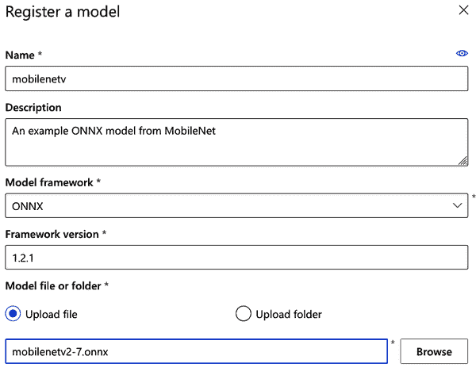
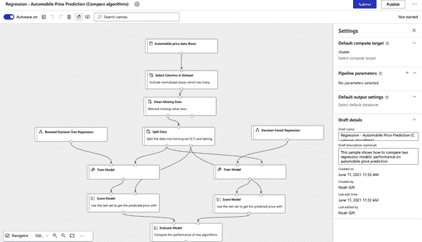

# 第八章：MLOps for Azure

阿尔弗雷多·德萨

> 我们一家搬迁的第三个原因是，自从 1933 年大萧条期间我们被剥夺家园以来，我们从未有过一个合适的家。直到多年以后，我才明白我 6 岁时所喜爱的乡村天堂是如何消失的。我的父母无法偿还贷款。我的母亲放弃了她苦苦挣扎的诊所工作，找到了一份作为接待医生的工作，提供了一些钱和一个对我们所有人来说都太拥挤的公寓，所以我和我哥哥被送进了后来我们称之为“流亡”的地方。
> 
> 约瑟夫·博根博士

Microsoft 在 Azure 中为机器学习持续投资正在取得成效。今天提供的功能数量使整个平台成为一个很好的选择。几年前，甚至还不清楚 Azure 是否会获得如此多高级工程和对其服务日益增长的兴趣。

如果你还没有尝试过 Azure，或者在 Microsoft 的云服务中还没有看到与机器学习相关的内容，我强烈建议你给它一个机会。像大多数云服务提供商一样，提供了试用期，具有足够的信用额度，可以自行尝试并作出判断。

我通常提到的一个例子是使用 Kubernetes。安装、配置和部署 Kubernetes 集群根本*不是一件简单的任务*。如果考虑将机器学习模型与潜在消费者的互动进行关联和扩展，情况会更加复杂。这是一个需要正确解决的具有挑战性的问题。如果你有机会查看一个训练模型的部署设置，将 Kubernetes 集群作为模型的目标，最终可以通过从下拉菜单中选择集群来完成。

除了像将模型部署到生产环境这样的复杂问题的所有功能和抽象之外，看到大量详细的文档是*非常令人耳目一新*的。尽管这一章集中讨论在 Azure 中进行机器学习操作，但它不可能涵盖所有令人兴奋的细节。[主要文档资源](https://oreil.ly/EV9wX)是一个很好的地方，可以加为书签，深入了解这里未涵盖的更多信息。

在本章中，我介绍了 Azure 中一些有趣的选项，从训练模型到将其部署在容器或 Kubernetes 集群中。随着它们在机器学习服务中变得越来越普遍，我将深入研究管道。管道可以进一步增强自动化，即使自动化起源于 Azure 云之外。

在平台内执行机器学习任务有许多方法：Azure ML Studio 设计器、Jupyter Notebooks 和 AutoML，您可以上传 CSV 并立即开始训练模型。最后，大多数（如果不是全部）功能在 SDK 中都有相应的支持（在下一节中讨论）。这种灵活性非常重要，因为它允许您选择最适合您的解决方案。因此，没有必要遵循一种偏见的方式来使模型运作。

最后，我将涵盖一些实用建议，如使用 Azure 机器学习的核心原则，例如监控和日志记录。

###### 注意

尽管本章讨论的是 Azure 机器学习，但不涉及创建和设置新帐户等基础知识。如果您尚未尝试过该服务，[可以从这里开始](https://oreil.ly/LcSb2)。

# Azure CLI 和 Python SDK

本章中的各种示例和代码片段假定您已经安装并在环境中可用 Azure 命令行工具和 Python SDK（软件开发工具包）。请确保[安装 CLI 的最新版本](https://oreil.ly/EPTdV)，并在安装后确保机器学习扩展可用：

```
$ az extension add -n azure-cli-ml
```

大多数情况下，您需要从本地系统返回到 Azure 进行身份验证。此工作流程类似于其他云提供商。要将 Azure 帐户与当前环境关联起来，请运行以下命令：

```
$ az login
```

使用 Azure 的 Python SDK 的大多数 Python 示例都需要一个 Azure 帐户以及本地下载的与您的工作区关联的 *config.json* 文件。此文件包含将 Python 代码与工作区关联所需的所有信息。所有与 Python SDK 的交互应使用此文件配置运行时：

```
import azureml.core
from azureml.core import Workspace

ws = Workspace.from_config()
```

要检索 *config.json* 文件，请[登录 Azure 的 ML Studio](https://ml.azure.com) 并点击右上角的菜单（标记为更改订阅）。子菜单中将包含一个链接以下载 *config.json* 文件（参见图 8-1）。


###### 图 8-1\. Azure JSON 配置

如果当前工作目录中不存在 *config.json* 文件，则使用 SDK 将导致回溯：

```
In [2]: ws = Workspace.from_config()
~~~~~~~~~~~~~~~~~~~~~~~~~~~~~~~~~~~~~~~~~~~~~~~~~~~~~~~~~~~~~~~~~~~~~~~~~~~
UserErrorException                        Traceback (most recent call last)
<ipython-input-2-e469111f639c> in <module>
----> 1 ws = Workspace.from_config()

~/.python3.8/site-packages/azureml/core/workspace.py in from_config
    269
    270 if not found_path:
--> 271   raise UserErrorException(
    272    'We could not find config.json in: {} or in its parent directories.'
    273     'Please provide the full path to the config file or ensure that '
```

现在我已经介绍了使用 Azure CLI 和 SDK 的一些基础知识，接下来将深入探讨更多身份验证细节以及您在 Azure 中可以使用的一些变体。

# 身份验证

在处理服务时，身份验证应该是自动化的核心部分之一。Azure 具有用于资源访问（和访问控制）的*服务主体*。在自动化服务和工作流程时，人们往往忽视甚至尝试简化一般的身份验证。很常见听到建议像：“只需使用 root 用户”或“只需更改文件权限以便任何人都能写入和执行”。经验丰富的工程师会最了解，但这是因为他们在接受这些松散的安全性和部署约束建议后经历了痛苦。我非常理解试图解决类似这种情况的问题。

在媒体机构担任系统管理员时，工程主管直接登录生产环境以使文件对任何人可读（PHP 应用程序所需）。最终我们发现了这一点。更改的结果意味着任何 HTTP 请求（以及任何互联网上的任何人）都可以读取、写入和执行该文件。有时，简单的修复可能很诱人，感觉是前进的最佳方式，但并非总是如此。特别是在安全性（以及身份验证在这种情况下）方面，您必须对移除安全约束的简单修复方法持怀疑态度。

始终确保正确进行身份验证，不要试图跳过或绕过这些限制，即使这是一种选择。

## 服务主体

在 Azure 中，创建服务主体涉及多个步骤。根据您需要的帐户和资源访问约束，这将因示例而异。适应以下内容以适应特定场景。首先，在使用 CLI 登录后，运行以下命令：

```
$ az ad sp create-for-rbac --sdk-auth --name ml-auth
```

该命令使用`ml-auth`名称创建服务主体。您可以选择任何名称，但最好有一些约定来记住这些名称所关联的内容。接下来，注意输出并检查`"clientId"`值，后续步骤将需要它：

```
[...]
Changing "ml-auth" to a valid URI of "http://ml-auth", which is the required
format used for service principal names
Creating a role assignment under the scope of:
     "/subscriptions/xxxxxxxx-2cb7-4cc5-90b4-xxxxxxxx24c6"
  Retrying role assignment creation: 1/36
  Retrying role assignment creation: 2/36
{
[...]
  "clientId": "xxxxxxxx-3af0-4065-8e14-xxxxxxxxxxxx",
[...]
  "sqlManagementEndpointUrl": "https://management.core.windows.net:8443/",
  "galleryEndpointUrl": "https://gallery.azure.com/",
  "managementEndpointUrl": "https://management.core.windows.net/"
}
```

现在使用`"clientId"`从新创建的服务主体中检索元数据：

```
$ az ad sp show --id xxxxxxxx-3af0-4065-8e14-xxxxxxxxxxxx
{
    "accountEnabled": "True",
    "appDisplayName": "ml-auth",
    ...
    ...
    ...
    "objectId": "4386304e-3af1-4066-8e14-475091b01502",
    "objectType": "ServicePrincipal"
}
```

要允许服务主体访问您的 Azure 机器学习工作区，您需要将其与工作区和资源组关联：

```
$ az ml workspace share -w example-workspace \
  -g alfredodeza_rg_linux_centralus \
  --user 4386304e-3af1-4066-8e14-475091b01502 --role owner
```

该命令是完成创建服务主体并将其与使用`owner`角色的机器学习帐户关联的最后一个命令。`example-workspace`是我在 Azure 中使用的工作区的名称，`alfredodeza_rg_linux_centralus`是该工作区中的资源组。非常不幸的是，在成功调用后运行该命令不会有任何输出。

一旦创建此帐户，您可以使用它启用具有身份验证的自动化，从而避免提示和持续验证。请确保将访问权限和角色限制为所需权限的最少数量。

###### 注意

这些示例使用了服务主体的角色值 `"owner"`，其权限广泛。`--role` 标志的默认值是 `"contributor,"`，权限较为受限。根据你的环境（和使用情况），调整此值以适应更合适的设置。

## API 服务的认证

根据手头的工作流程，其他环境可能不会从服务主体账户中受益。这些服务可以通过 HTTP 请求与部署的模型进行交互并向其提供服务。在这些情况下，你需要决定启用何种类型的认证。

在部署模型或甚至配置任何生产模型所需的设置之前，你需要对可用的不同安全功能有一个清晰的了解。

Azure 提供了与你需要交互的服务相关的不同认证方式。这些服务的默认设置也会根据部署类型而改变。基本上支持两种类型：密钥和令牌。Azure Kubernetes 服务（AKS）和 Azure 容器实例（ACI）对这些认证类型的支持有所不同。

基于密钥的认证：

+   AKS 默认启用基于密钥的认证。

+   ACI 默认禁用基于密钥的认证（但可以启用）。默认情况下未启用任何认证。

基于令牌的认证：

+   AKS 默认禁用基于令牌的认证。

+   ACI 不支持基于令牌的认证。

在将模型部署到生产环境之前，了解这些部署类型对于测试环境来说非常重要。即使是测试环境，也始终要启用认证以防止开发和生产之间的不匹配。

# 计算实例

Azure 对计算实例有一个定义，将其描述为科学家的 *托管云工作站*。基本上，它允许你快速启动所有在云中进行机器学习操作所需的内容。在开发概念验证或从教程尝试新事物时，你可以利用对 [Jupyter 笔记本](https://jupyter.org) 的出色支持，预先安装并准备好大量依赖项。虽然你可以上传自己的笔记本，但我建议首先浏览现有的详尽示例，如 图 8-2 所示。


###### 图 8-2\. Azure 笔记本示例

当你试图启动笔记本并尝试调整模型时，最让人头疼的问题之一是设置环境。通过提供一些现成且专门为机器学习预配置的东西，你可以快速完成任务，从笔记本中的想法转向生产。

一旦你准备好从计算实例部署训练好的模型，你可以将计算实例用作训练集群，因为它支持作业队列、并行多个作业和多 GPU 分布式训练。这是调试和测试的理想组合，因为环境是可复制的。

你以前听过*“但在我的机器上可以运行！”*这样的说法吗？我肯定听过！即使是在测试或探索新想法时，可重现的环境也是规范开发的一种重要方式，可以减少意外情况，使其他工程师之间的协作更加顺畅。使用可重现的环境是 DevOps 中不可或缺的一部分，也适用于 ML。一致性和规范化需要大量的努力来正确实施，每当你发现有立即可用的工具或服务时，应立即利用它们。

作为系统管理员，我在规范化开发的生产环境方面投入了大量精力，这是一个难题。尽可能使用 Azure 计算实例！

你可以通过 Azure ML Studio 中的各种工作流之一创建计算实例，例如创建 Jupyter Notebook 时。在“管理”部分中更容易找到“计算”链接并在那里创建一个计算实例。加载后，会呈现多个选择（参见图 8-3）。一个经验法则是选择一个低成本的虚拟机来开始使用，这样可以避免因为可能不需要仅仅为了运行笔记本而产生的更高成本。


###### 图 8-3\. Azure 创建计算实例

在本例中，我选择了一个`Standard_D2_v3`。由于提供的各种机器名称经常变化，你得到的选择可能会有所不同。

# 部署

在 Azure 中有几种与模型交互的部署方式。如果你处理的数据量非常大，超出内存处理的合理范围，批量推断是更合适的选择。Azure 确实提供了大量有用的工具（此服务的普遍可用性在 2020 年宣布），帮助用户处理结构化和非结构化的 TB 级数据，并从中获取推断结果。

另一种部署方式是在线推断（有时称为*即时*推断）。当处理较小的数据集（而不是几 TB 的数据！）时，快速部署模型并通过 Azure 为你编程创建的 HTTP API 进行访问是非常有用的。为训练模型自动创建的 HTTP API 是你应该利用的另一项功能。

手工创建 HTTP API 并不麻烦，但是将这项工作外包给一个服务意味着你（以及你的团队）有更多时间处理数据质量或部署流程的稳健性等更重要的部分。

## 注册模型

Azure 文档将注册描述为可选项。的确，在部署模型时你并不需要它。但是随着你习惯于部署模型并将其发布到生产环境中，你会意识到省略诸如认证（或者在这种情况下是模型注册）等功能和约束会使事情起初更加容易，但后续可能会引发问题。

我*强烈*建议您注册您的模型并遵循相应的流程，如果这个过程是完全自动化的话会更好。当然，您可能不需要为每一个您使用的模型都进行注册，但是对于进入生产环境的选择模型，您绝对应该这样做。如果您熟悉[Git（版本控制系统）](https://oreil.ly/Ttyl0)，那么对模型进行版本控制会感觉像是一种自然的方式来理解生产级模型的变更和修改。

模型版本控制的几个关键方面使其成为一个引人注目的功能：

+   您可以识别您正在使用的模型版本

+   您可以快速从各种版本中进行选择，并从描述中清晰了解。

+   您可以轻松进行回滚并选择不同的模型

有几种注册模型的方法。如果您在 Azure 内训练模型，那么您可以使用[Python SDK](https://oreil.ly/6CN0h)与`Run`类的结果对象：

```
description = "AutoML trained model"
model = run.register_model(description=description)

# A model ID is now accessible
print(run.model_id)
```

但是您并非必须使用 Azure 来训练模型。也许您已经训练了几个模型，并且正在考虑迁移到 Azure 以将它们投入生产。Python SDK 还允许您注册这些模型。以下是如何使用在您系统中本地可用的[ONNX](https://onnx.ai)模型的示例：

```
import os
from azureml.core.model import Model

# assumes `models/` is a relative directory that contains uncompressed
# ONNX models
model = Model.register(
    workspace=ws,
    model_path ="models/world_wines.onnx",
    model_name = "world_wines",
    tags = {"onnx": "world-wines"},
    description = "Image classification of world-wide wine labels"
)
```

Azure 令人振奋的一点是其灵活性。Python SDK 并非注册模型的唯一方式。以下是使用 Azure CLI 的方法：

```
$ az ml model register --name world_wines --model-path mnist/model.onnx
```

您可以通过对前面示例进行一些修改，快速迭代并将多个模型注册到 Azure。如果您的模型通过 HTTP 可用，您可以通过编程方式下载它们并发送过去。使用额外的元数据填写标签和描述；良好的描述使得以后更容易识别。过程自动化程度越高，效果越好！在图 8-4 中，我使用 Azure ML Studio 直接上传和注册 ONNX 模型，这对处理单个模型也非常有用。



###### 图 8-4\. 在 Azure 中注册模型

## 数据集版本控制

与注册模型类似，版本化数据集的能力解决了当今 ML 中最大的问题之一：稍有不同的巨大数据集很难（甚至直到最近都是不可能的）进行良好的版本控制。像 Git 这样的版本控制系统不适合这项任务，尽管版本控制系统应该帮助解决问题。版本控制系统专注于源代码变更，而在处理巨大数据集时存在不匹配问题，这一直是生产可靠和可重现的模型的一个障碍。

云提供商如 Azure 通过功能（例如数据集版本控制）改进工作流程的另一个示例。数据是构建 ML 流水线时最重要的组成部分之一，因为数据可能经历多轮转换和清理，从原始数据到干净数据的每一步都至关重要。

首先检索数据集。在这个例子中，数据集是通过 HTTP 托管的：

```
from azureml.core import Dataset

csv_url = ("https://automlsamplenotebookdata.blob.core.windows.net"
       "/automl-sample-notebook-data/bankmarketing_train.csv")
dataset = Dataset.Tabular.from_delimited_files(path=csv_url)
```

接下来，使用 `dataset` 对象进行注册：

```
dataset = dataset.register(
    workspace=workspace,
    name="bankmarketing_dataset",
    description="Bankmarketing training data",
    create_new_version=True)
```

`create_new_version` 将增量设置一个较新的数据版本，即使没有之前的版本（版本从 `1` 开始）。注册并创建数据集的新版本后，按名称和版本检索它：

```
from azureml.core import Dataset

# Get a dataset by name and version number
bankmarketing_dataset = Dataset.get_by_name(
    workspace=workspace,
    name="bankmarketing_dataset",
    version=1)
```

###### 注意

尽管看起来似乎是这样，但创建新的数据集版本 *并不意味着* Azure 在工作区中复制整个数据集。数据集使用存储服务中数据的引用。

# 将模型部署到计算集群

在本节中，您将配置并部署模型到一个计算集群。虽然涉及几个步骤，但反复执行这个过程几次会很有用。

转到 [Azure ML Studio](https://ml.azure.com) 并通过在自动 ML 部分点击“新自动化 ML 运行”或者直接从主页点击“创建新”框并选择下拉菜单中的选项来创建一个新的自动化 ML 运行。在此过程的这一部分中，您将需要一个可用的数据集。如果您尚未注册数据集，可以下载一个，然后选择“从本地文件”注册它。按照步骤上传并在 Azure 中使其可用。

## 配置集群

回到“自动化 ML 运行”部分，选择可用的数据集来配置一个新的运行。配置的一部分需要一个有意义的名称和描述。到此时为止，您已经配置并使数据集可用，并确定了它应该如何使用和存储。但是，强大部署策略的关键组成部分之一是确保集群足够稳固以训练模型（参见 图 8-5）。


###### 图 8-5\. 配置自动 ML 运行

此时，帐户中不应该有任何集群可用。从表单底部选择“创建新的计算”。可以在配置运行以训练模型时创建新的集群，或者直接在“管理”部分的“计算”链接下进行。最终目标是创建一个强大的集群来训练您的模型。

值得强调的是，在 Azure ML 中的许多功能和产品中尽可能使用有意义的名称和描述。添加这些信息片段对于捕获（以及后来识别）底层特征非常关键。解决这个问题的一个有用方法是将这些视为字段，就像写电子邮件时一样：*电子邮件主题*应该捕捉有关主体将包含什么的一般想法。当您处理数百个模型（或更多）时，描述非常强大。在命名约定和描述中组织和清晰地表达非常重要。

有两种重要的集群类型：*推断集群*和*计算集群*。在了解底层系统之前，易于感到困惑：推断集群在幕后使用 [Kubernetes](https://kubernetes.io) 并使用虚拟机的计算集群。在 Azure ML Studio 中创建两者都是直接的。您所需要做的就是填写一个表单，然后就可以运行一个集群，准备训练一些模型。创建完成后，无论类型如何，它们都可用作训练模型的选项。

尽管 Kubernetes 集群（推断）可以用于测试目的，我倾向于使用计算集群来尝试不同的策略。无论选择的后端如何，将工作量匹配到执行工作的机器的大小（和数量）是*至关重要*的。例如，在计算集群中，您*必须*确定节点的最小数量以及节点的最大数量。在并行化模型的训练时，平行运行的数量不能超过节点的最大数量。正确确定节点数量、RAM 大小和足够数量的 CPU 核心更多地是一个反复试验的工作流程。对于测试运行，最好从少量开始，并根据需要创建更强大的集群（参见 图 8-6）。


###### 图 8-6\. 创建计算集群

在这个图中，我选择将节点的最小数量设为`0`，因为这样可以避免因空闲节点而产生费用。这将允许系统在集群闲置时缩减到`0`。我选择的机器类型性能并不是很好，但由于我正在测试运行，这并不是很重要；我随时可以回去创建一个更新的集群。

###### 注意

用于*训练*模型的集群并非用于部署实时（或批量）推断的集群。这可能会让人感到困惑，因为训练和推断两种策略都使用“集群”术语来指代执行工作的节点组。

## 部署模型

与训练模型非常类似，当部署模型到生产环境时，您必须了解可用的集群选择。虽然有几种方法可以完成此操作，但部署的两种关键方法是必须的。根据部署使用情况（生产或测试），您必须选择最合适的方法。以下是关于这些资源及其最佳工作方式的一个很好的思路：

Azure 容器实例（ACI）

最适合测试和一般测试环境，特别是模型较小（大小不超过 1 GB）的情况。

Azure Kubernetes 服务（AKS）

所有 Kubernetes 的优点（特别是扩展性），适用于大于 1 GB 大小的模型。

这两种选择对于部署而言都相对直接。在 Azure ML Studio 中，转到资产部分内的模型，并选择先前训练过的模型。在 图 8-7 中，我选择了一个已注册的 ONNX 模型。

在表单中有几个关键部分；我选择了*ACS*作为计算类型，并启用了身份验证。这一点非常重要，因为一旦部署完成，如果不使用密钥进行身份验证的 HTTP 请求，将无法与容器进行交互。虽然启用身份验证不是必需的，但强烈建议以保持生产和测试环境之间的一致性。

在完成表单并提交后，模型部署的过程开始。在我的示例中，我启用了身份验证并使用了 ACS。这些选项并不会对与模型的交互产生太大影响，因此一旦部署完成，我就可以通过 HTTP 与模型进行交互，确保请求使用了密钥。


###### 图 8-7\. 部署模型

在 Endpoints 部分可以找到部署模型的所有详细信息。列出了用于部署的名称，该名称链接到部署详细信息的仪表板。该仪表板包含三个选项卡：详细信息、消耗和部署日志。所有这些都充满了有用的信息。如果部署成功完成，那么日志可能不会那么有趣。在详细信息选项卡中，一个部分将显示 HTTP API（显示为“REST 端点”）。由于我启用了身份验证，页面将显示“基于密钥的身份验证”的值为`true`，如图 8-8 所示。


###### 图 8-8\. REST 端点

任何可以与启用身份验证的 HTTP 服务进行通信的东西都可以使用。这是一个使用 Python 的示例（不需要 Azure SDK）；输入是使用[JSON](https://oreil.ly/Ugp7i)（JavaScript 对象表示），而针对此特定模型的输入遵循一个严格的模式，这将取决于您要交互的模型。这个示例使用了[Requests](https://oreil.ly/k3YqL) Python 库：

```
import requests
import json

# URL for the web service
scoring_uri = 'http://676fac5d-5232-adc2-3032c3.eastus.azurecontainer.io/score'

# If the service is authenticated, set the key or token
key = 'q8szMDoNlxCpiGI8tnqax1yDiy'

# Sample data to score, strictly tied to the input of the trained model
data = {"data":
    [
      {
        "age": 47,
        "campaign": 3,
        "contact": "home",
        "day_of_week": "fri",
        "default": "yes",
        "duration": 95,
        "education": "high.school",
        "nr.employed": 4.967,
        "poutcome": "failure",
        "previous": 1
      }
   ]
}

# Convert to JSON
input_data = json.dumps(data)

# Set the content type
headers = {'Content-Type': 'application/json'}

# Authentication is enabled, so set the authorization header
headers['Authorization'] = f'Bearer {key}'

# Make the request and display the response
resp = requests.post(scoring_uri, input_data, headers=headers)
print(resp.json())
```

因为服务使用 HTTP 公开，这使得我可以以任何我选择的方式与 API 进行交互（就像在前面的 Python 示例中使用 Python 一样）。通过与模型交互的 HTTP API 是非常吸引人的，因为它提供了极大的灵活性，并且由于它是实时推理服务，所以可以立即得到结果。在我的情况下，创建部署并从 API 获取响应并不需要太长时间。这意味着我正在利用云基础设施和服务快速尝试一个可能最终进入生产的概念验证。使用样本数据尝试模型并在类似生产环境的环境中与其交互，是为后续稳健自动化铺平道路的关键。

一切顺利时，将返回一个 JSON 响应，其中包含来自预测的有用数据。但是当事情出错时会发生什么呢？了解可能出现问题的不同方式及其含义非常有用。在这个例子中，我使用了 ONNX 模型意外的输入：

```
{
  "error_code": 500,
  "error_message": "ONNX Runtime Status Code: 6\. Non-zero status code returned
 while running Conv node. Name:'mobilenetv20_features_conv0_fwd'
 Missing Input: data\nStacktrace:\n"
}
```

HTTP 状态码 500 表示服务由于无效输入而发生错误。确保使用正确的密钥和身份验证方法。大多数来自 Azure 的错误都很容易理解和修复；这里列举了几个示例：

`请求中缺少或未知的 *Content-Type* 头字段`

确保请求中使用和声明了正确的内容类型（例如 JSON）。

`Method Not Allowed. 对于 HTTP 方法：GET 和请求路径：/score`

当您尝试进行 `GET` 请求时，可能需要发送数据的 `POST` 请求。

`Authorization` 头部格式错误。头部应该是这种形式：“Authorization: Bearer <token>”

确保头部正确构造并包含有效的令牌。

# 故障排除部署问题

有效的 MLOps 的众多关键因素之一（当然继承自 DevOps 最佳实践，详见“DevOps 和 MLOps”）是良好的故障排除技能。调试或故障排除并非天生的技能，需要练习和坚持。我解释这种技能的一种方式是将其比作在新城市中四处走动并找到自己的路。有些人会说，如果我能轻松找到自己的方向，那么我一定具备某种天赋。但实际上并非如此。注意细节，定期复习这些心理细节，并质疑一切。不要假设。

在找到自己的方向时，我立即确定太阳的位置或者大海（这是东边？还是西边？），并在心里记下地标或显著建筑物。然后，我从头到尾地回顾每一步：我在酒店左转，直到大教堂右转，穿过美丽的公园，现在我在广场上。夜幕降临，那时太阳不再存在，我记不清该去哪里了。是在这里左转？还是右转？我询问朋友，他们都告诉我左转，但我不敢肯定他们是对的。信任，但要验证。*“如果他们告诉我左转，那意味着我不会到达公园，我会走他们的路，走几个街区，如果没有公园，我会掉头走另一条路。”*

绝不要假设事情。质疑一切。注意细节。信任，但要验证。如果您遵循这些建议，您的调试技能将在同行中显得自然。在本节中，我将深入探讨 Azure 中容器及容器化部署的若干细节，并介绍一些可能出现问题时会遇到的情况。但是，这些核心概念可以应用到任何地方。

## 检索日志

部署容器后，您有几种方法可以检索日志。这些方法在 Azure ML Studio 中以及命令行和 Python SDK 中都是可用的。使用 Python SDK 仅需几行代码初始化工作区后：

```
from azureml.core import Workspace
from azureml.core.webservice import Webservice

# requires `config.json` in the current directory
ws = Workspace.from_config()

service = Webservice(ws, "mobelinetv-deploy")
logs = service.get_logs()

for line in logs.split('\n'):
    print(line)
```

运行该示例代码，使用先前部署的服务名称，会生成大量信息。有时日志并不那么有用，大部分都是重复的。您必须摆脱噪声并捕捉有用信息的亮点。在成功部署中，大多数输出并不会有太多意义。

这些是部署 ONNX 模型时的一些日志（为简洁起见删除了时间戳）：

```
WARNING - Warning: Falling back to use azure cli login credentials.
Version: local_build
Commit ID: default

[info] Model path: /var/azureml-models/mobilenetv/1/mobilenetv2-7.onnx
[info][onnxruntime inference_session.cc:545 Initialize]: Initializing session.
[onnxruntime inference_session Initialize]: Session successfully initialized.
GRPC Listening at: 0.0.0.0:50051
Listening at: http://0.0.0.0:8001
```

## 应用洞察

另一个检索日志和调试的方面是有价值的是使用可观察性工具。可观察性指的是在任何给定时间点捕获系统（或系统）的状态的手段。听起来有些复杂，但简而言之，这意味着您依赖像仪表板、日志聚合、图形和警报机制这样的工具来整体可视化系统。因为可观察性的整体主题充满了工具和流程，通常很难将这样的东西投入到生产中。

可观察性至关重要，因为它不仅仅关乎应用程序日志；它是在问题出现时讲述应用程序故事的关键。当然，在日志中找到了 Python 的回溯，但这并不一定意味着 Python 代码需要修复。如果预期的输入是来自另一个系统的 JSON 负载，但外部系统却发送了一个空文件，怎么会发生这种情况？可观察性为看似混乱的系统带来了清晰度。在处理分布式系统时，问题变得非常复杂。

为将数据输入到涉及多个不同步骤的模型的管道系统并不少见。获取数据源，清理数据，删除垃圾列，归一化数据，并对这些新数据集进行版本控制。假设所有这些都是使用 Python SDK 进行，并利用 Azure 的触发器。例如，新数据进入存储系统，触发一个[Azure Function](https://oreil.ly/zxv74)执行一些 Python 代码。在这一系列事件中，如果没有工具支持，讲述一个故事将变得困难。

Azure 在 SDK 中提供了最简单的调用即可提供所需的工具支持。它被称为[应用洞察](https://oreil.ly/CnZxv)，并在启用后立即提供所有有用的图形和仪表板。然而，它不仅仅是日志或漂亮的图形。一个高度可视化界面下提供了一整套关键数据。响应时间、失败率和异常情况——所有这些都会被聚合、时间戳记录和绘制。

这是如何在先前部署的服务中启用应用洞察的：

```
from azureml.core.webservice import Webservice

# requires `ws` previously created with `config.json`
service = Webservice(ws, "mobelinetv-deploy")

service.update(enable_app_insights=True)
```

当启用应用洞察时，ML Studio 中的 API 端点部分将显示如图 8-9 所示。


###### 图 8-9\. 已启用应用洞察

点击提供的链接进入服务仪表板。提供了大量各种图表和信息来源。此图像捕捉了部署模型在容器中接收的请求的一小部分图表，如图 8-10 所示。


###### 图 8-10\. 应用洞察

## 本地调试

在调试时遵循 DevOps 原则，您必须质疑一切，绝不能假设任何事情。一种有用于调试问题的技术是在不同环境中运行生产服务，或者在本例中，是在不同环境中运行训练好的模型。容器化部署及容器一般都提供了这种灵活性，可以在本地运行在 Azure 生产环境中运行的东西。在本地运行容器时，可以做很多事情，除了查看日志外。本地调试（可能在您的计算机上）是一种非常有价值的资产，可以利用，同时避免服务中断或灾难性服务中断。我曾经遇到过几种情况，唯一的选择是“登录到生产 Web 服务器查看发生了什么”。这是危险且极其棘手的。

对问题和困难持怀疑态度，尝试复制问题至关重要。复制问题是解决问题的关键。有时，为了复制客户面向的产品，我会从头开始重新安装操作系统，并在不同的环境中进行部署。开发人员开玩笑地使用“它在我的机器上运行”的说法，我敢打赌，几乎总是正确的——但实际上，这并不意味着什么。在这里可以应用“质疑一切”的建议：多次部署，在不同的环境中，包括本地环境，并尝试复制。

尽管希望你在本地运行 Azure 的 Kubernetes 提供的服务是不合理的，Python SDK 提供了一些功能，可以在本地暴露一个（本地）Web 服务，您可以在其中部署相同的生产级别模型，作为容器运行。这种方法有几个优点我已经提到过。但还有另一个至关重要的优点：大多数 Python SDK API 不仅可用于这种本地部署，*而且*还可以运行针对容器的所有工具命令来在运行时操作容器。诸如检索容器日志或进入容器检查环境等操作都是可能且无缝的。

###### 注意

由于这些操作涉及容器化部署，因此需要在您的环境中安装并运行[Docker](https://docker.com)。

在本地运行服务需要几个步骤。首先，您必须将模型注册到当前目录中：

```
from azureml.core.model import Model

model = Model.register(
  model_path="roberta-base-11.onnx",
  model_name="roberta-base",
  description="Transformer-based language model for text generation.",
  workspace=ws)
```

接下来，创建一个环境，安装所有必需的依赖项，使模型能够在容器内运行。例如，如果需要 ONNX 运行时，必须定义它：

```
from azureml.core.environment import Environment

environment = Environment("LocalDeploy")
environment.python.conda_dependencies.add_pip_package("onnx")
```

部署模型需要一个评分文件（通常命名为 *score.py*）。这个脚本负责加载模型，为该模型定义输入并对数据进行评分。评分脚本始终特定于模型，并且没有通用的方法为任何模型编写评分脚本。该脚本需要两个函数：`init()` 和 `run()`。现在，创建一个 *推理配置*，它将评分脚本和环境组合在一起：

```
from azureml.core.model import InferenceConfig

inference_config = InferenceConfig(
    entry_script="score.py",
   environment=environment)
```

现在，将所有内容放在一起需要使用 Python SDK 中的 `LocalWebservice` 类来将模型部署到本地容器：

```
from azureml.core.model import InferenceConfig, Model
from azureml.core.webservice import LocalWebservice

# inference with previously created environment
inference_config = InferenceConfig(entry_script="score.py", environment=myenv)

# Create the config, assigning port 9000 for the HTTP API
deployment_config = LocalWebservice.deploy_configuration(port=9000)

# Deploy the service
service = Model.deploy(
  ws, "roberta-base",
  [model], inference_config,
  deployment_config)

service.wait_for_deployment(True)
```

启动模型将使用后台的容器，该容器将在端口 `9000` 上运行公开的 HTTP API。您不仅可以直接向 `localhost:9000` 发送 HTTP 请求，还可以在运行时访问容器。我的容器运行时在系统中没有准备好容器，但运行代码在本地部署时从 Azure 拉取了所有内容。

```
Downloading model roberta-base:1 to /var/folders/pz/T/azureml5b/roberta-base/1
Generating Docker build context.
[...]
Successfully built 0e8ee154c006
Successfully tagged mymodel:latest
Container (name:determined_ardinghelli,
id:d298d569f2e06d10c7a3df505e5f30afc21710a87b39bdd6f54761) cannot be killed.
Container has been successfully cleaned up.
Image sha256:95682dcea5527a045bb283cf4de9d8b4e64deaf60120 successfully removed.
Starting Docker container...
Docker container running.
Checking container health...
Local webservice is running at http://localhost:9000
9000
```

现在部署完成了，我可以通过运行 `docker` 来验证它：

```
$ docker ps
CONTAINER ID        IMAGE               COMMAND
2b2176d66877        mymodel             "runsvdir /var/runit"

PORTS
8888/tcp, 127.0.0.1:9000->5001/tcp, 127.0.0.1:32770->8883/tcp
```

进入容器后，我可以确认我的 *score.py* 脚本和模型都在那里：

```
root@2b2176d66877:/var/azureml-app# find /var/azureml-app
/var/azureml-app/
/var/azureml-app/score.py
/var/azureml-app/azureml-models
/var/azureml-app/azureml-models/roberta-base
/var/azureml-app/azureml-models/roberta-base/1
/var/azureml-app/azureml-models/roberta-base/1/roberta-base-11.onnx
/var/azureml-app/main.py
/var/azureml-app/model_config_map.json
```

在尝试部署时，我在 *score.py* 脚本上遇到了一些问题。部署过程立即引发了错误，并提出了一些建议：

```
Encountered Exception Traceback (most recent call last):
  File "/var/azureml-server/aml_blueprint.py", line 163, in register
    main.init()
AttributeError: module 'main' has no attribute 'init'

Worker exiting (pid: 41)
Shutting down: Master
Reason: Worker failed to boot.
2020-11-19T23:58:11,811467402+00:00 - gunicorn/finish 3 0
2020-11-19T23:58:11,812968539+00:00 - Exit code 3 is not normal. Killing image.

ERROR - Error: Container has crashed. Did your init method fail?
```

在这种情况下，`init()` 函数需要接受一个参数，而我的示例不需要它。在本地调试并与部署在本地容器中的模型进行调试是非常有用的，也是在尝试在 Azure 中实施之前快速迭代不同设置和模型更改的绝佳方式。

# Azure ML 管道

管道只不过是为实现所需目标而采取的各种步骤。如果您曾经使用过像 [Jenkins](https://jenkins.io) 这样的持续集成（CI）或持续交付（CD）平台，那么“管道”工作流将会很熟悉。Azure 将其 ML 管道描述为适合三种不同场景：机器学习、数据准备和应用编排。它们具有类似的设置和配置，同时处理不同的信息来源和目标以完成任务。

与大多数 Azure 提供的服务一样，您可以使用 Python SDK 或 Azure ML Studio 创建管道。如我之前提到的，管道是实现目标的 *步骤*，您可以决定如何为最终结果排序这些步骤。例如，一个管道可能需要处理数据；我们在本章中已经涵盖了数据集，所以检索现有数据集以便管道步骤可以被创建。在这个例子中，数据集成为 Python 脚本的输入，形成一个独立的 *管道步骤*：

```
from azureml.pipeline.steps import PythonScriptStep
from azureml.pipeline.core import PipelineData
from azureml.core import Datastore

# bankmarketing_dataset already retrieved with `get_by_name()`
# make it an input to the script step
dataset_input = bankmarketing_dataset.as_named_input("input")

# set the output for the pipeline
output = PipelineData(
    "output",
    datastore=Datastore(ws, "workspaceblobstore"),
    output_name="output")

prep_step = PythonScriptStep(
    script_name="prep.py",
    source_directory="./src",
    arguments=["--input", dataset_input.as_download(), "--output", output],
    inputs=[dataset_input],
    outputs=[output],
    allow_reuse=True
)
```

###### 注意

Azure SDK 可能会经常更改，因此请务必查看官方的 [Microsoft AzureML 文档](https://oreil.ly/28JXz)。

示例使用的是`PythonScriptStep`，这是作为管道步骤可用的众多不同步骤之一。请记住：管道是为实现目标而工作的步骤，Azure 在 SDK 和 Azure ML Studio 中提供了不同的步骤来支持不同类型的工作。然而，这一步骤缺少一个关键部分：计算目标。但它已经包含了几乎完成数据准备所需的所有内容。首先，它使用数据集对象并调用`as_named_input`，这是`PythonScriptStep`用作参数的方法。脚本步骤是一个 Python 类，但它试图表示一个命令行工具，因此参数使用破折号，这些参数的值作为列表中的项目传递。这是如何使用 SDK 检索之前创建的计算目标的方法：

```
from azureml.core.compute import ComputeTarget, AmlCompute
from azureml.core import Workspace

ws = Workspace.from_config()

# retrieve the compute target by its name, here a previously created target
# is called "mlops-target"
compute_target = ws.compute_targets["mlops-target"]
```

除了我们在本章已经介绍过的计算目标外，您还可以选择提供一个*运行时配置*，允许设置环境变量来告诉 Azure 如何管理环境。例如，如果您想自己管理依赖项而不是让 Azure 来处理，那么运行时配置将是实现这一目标的方式。以下是设置特定选项的简化方法：

```
from azureml.core.runconfig import RunConfiguration

run_config = RunConfiguration()

# a compute target should be defined already, set it in the config:
run_config.target = compute_target

# Disable managed dependencies
run_config.environment.python.user_managed_dependencies = False
```

## 发布管道

我之前曾将像 Jenkins 这样的持续集成系统与管道进行比较：许多步骤协调工作以完成一个目标。但尽管其他 CI/CD 系统像 Jenkins 有这个能力，有一件非常棘手的事情很难实现，那就是将这些作业暴露在环境之外。Azure 有一种简单的方法来实现这一点，无论是通过 Azure ML Studio 还是使用 SDK。本质上，管道变得通过 HTTP 可用，以便世界上任何地方的任何系统都可以访问管道并触发它。

随后的可能性是无限的。您不再局限于在 Azure 中使用服务、管道和触发器。您的管道步骤可以从其他地方开始，也许是在公司的内部环境或像 GitHub 这样的公共源代码服务中。这是一个有趣的灵活性，因为它提供了更多的选择，云提供商的约束消失了。您不需要每次想要发布它时都创建新的管道。在尝试找出如何发布管道的过程中，您可能会在文档中遇到这种情况。在这个例子中，之前的实验和运行被检索出来以发布管道：

```
from azureml.core.experiment import Experiment
from azureml.pipeline.core import PipelineRun

experiment = Experiment(ws, "practical-ml-experiment-1")

# run IDs are unique, this one already exists
run_id = "78e729c3-4746-417f-ad9a-abe970f4966f"
pipeline_run = PipelineRun(experiment, run_id)

published_pipeline = pipeline_run.publish_pipeline(
    name="ONNX example Pipeline",
    description="ONNX Public pipeline", version="1.0")
```

现在您知道如何发布它，可以通过 HTTP 与其交互。这些 API 端点需要身份验证，但 SDK 提供了您需要获取身份验证标头以进行请求的一切内容：

```
from azureml.core.authentication import InteractiveLoginAuthentication
import requests

interactive_auth = InteractiveLoginAuthentication()
auth_header = interactive_auth.get_authentication_header()

rest_endpoint = published_pipeline.endpoint
response = requests.post(
    rest_endpoint,
    headers=auth_header,
    json={"ExperimentName": "practical-ml-experiment-1"}
)

run_id = response.json().get('Id')
print(f"Pipeline run submitted with ID: {run_id}")
```

## Azure Machine Learning 设计师

对于图形化倾向的人来说，Azure Machine Learning 设计师是在 Azure 上构建机器学习项目时抽象化复杂性的好选择。训练模型的过程如下所示：

1.  登录 Azure ML Studio。

1.  如 Figure 8-11 所示，选择设计师界面。

    

    ###### Figure 8-11\. Azure ML 设计师

1.  选择一个样本项目进行探索，比如 Figure 8-12 中的汽车回归项目。请注意，有许多样本项目可供探索，或者您可以从头开始构建自己的 ML 项目。研究 ML 设计师样本项目的绝佳资源是官方的 [Microsoft Azure 机器学习设计师文档](https://oreil.ly/NJrfK)。

    

    ###### Figure 8-12\. Azure ML 设计师汽车回归项目

1.  要运行项目，请提交一个如 Figure 8-13 所示的管道作业。

    

    ###### Figure 8-13\. Azure ML 设计师提交

Azure ML 设计师可能看起来有点花哨，但在理解 Azure ML Studio 生态系统如何运作方面，它可以发挥关键作用。通过对样本项目进行“试水”，您将接触到 Azure ML Studio 的所有关键方面，包括 AutoML、存储、计算集群和报告。接下来，让我们讨论所有这些与 Azure 上的 ML 生命周期的关系。

# ML 生命周期

最后，Azure 中的所有工具和服务都旨在帮助模型生命周期。这种方法论并非完全特定于 Azure，但理解这些服务如何帮助您将模型投入生产是很有用的，正如 Figure 8-14 所示，您可以从笔记本、AutoML 或 SDK 进行训练。然后，您可以使用 Azure Designer 或 Azure ML Studio 进行验证。在生产部署中，可以利用 Kubernetes 进行扩展，同时注意应用洞察中的问题。

Figure 8-14 试图清楚地表明这不是一个线性过程，并且在整个生产过程中的持续反馈循环可能需要返回到先前的步骤来解决模型中观察到的数据问题和其他常见问题。然而，反馈循环和持续调整对于健康的环境至关重要；仅仅勾选一个启用监控或者 Kubernetes 处理扩展的复选框是不够的。没有持续的评估，无论云提供商如何，成功都是不可能的。


###### Figure 8-14\. ML 生命周期

# 结论

毫无疑问，Azure 已经在解决与操作机器学习相关的复杂问题，从注册和版本化数据集到促进监视和在可扩展集群上部署实时推断模型。这一切都感觉相对较新，整个 Azure 平台在功能上仍在努力赶超其他云服务提供商，但这并不重要。选择的平台（即使不是 Azure）必须能够轻松地支持工作流程；你必须利用现有资源。在本书中，关于利用技术和避免用不成熟的解决方案解决挑战的想法会反复强调。技术的复用将推动任何事业。记住，作为 MLOps 工程师最重要的是将模型部署到生产环境中，而不是重新发明云功能。

下一章将深入讨论 Google Cloud Platform。

# 练习

+   从公共来源检索一个 ONNX 模型，并使用 Python SDK 在 Azure 中注册它。

+   部署模型到 ACI，并创建一个 Python 脚本，从 HTTP API 返回模型的响应。

+   使用 Azure 的 Python SDK 在本地部署一个容器，并为实时推理生成一些 HTTP 请求。

+   发布一个新的流水线，然后触发它。触发应该在成功请求后显示`run_id`的输出。

+   使用 Azure Python SDK 从 Kaggle 获取数据集，并使用 Azure AutoML 训练模型。

# 批判性思维讨论问题

+   在 Azure 平台上有许多训练模型的方式：Azure ML Studio Designer、Azure Python SDK、Azure Notebooks 和 Azure AutoML。各自的优缺点是什么？

+   为什么启用认证是个好主意？

+   可复现的环境如何帮助交付模型？

+   描述两个好的调试技术方面及其有用之处。

+   模型版本控制的一些好处是什么？

+   为什么数据集的版本控制很重要？
