# 第九章：MLOps 适用于 GCP

作者：诺亚·吉夫

> 最优秀的盆景教师既精通现实，又能够不仅解释而且激发。约翰曾经说过，“把这部分用线缠绕，这样它就会干得漂亮。” “什么形状？”我问。 “你决定吧，”他回答，“我不是为你唱歌！”
> 
> 约瑟夫·博根博士

谷歌云平台（GCP）与其竞争对手相比具有独特性。一方面，它在某种程度上专注于企业；另一方面，它拥有世界一流的研发，已经创建了领先类别的技术，包括 Kubernetes 和 TensorFlow 等产品。然而，谷歌云的另一个独特之处是通过 [*https://edu.google.com*](https://edu.google.com) 提供给学生和职业人士丰富的教育资源。

让我们深入研究谷歌云，重点是如何利用它来进行 MLOps。

# 谷歌云平台概述

每个云平台都有其利弊，因此让我们从覆盖谷歌云平台的三个主要缺点开始。首先，由于谷歌落后于 AWS 和微软 Azure，使用谷歌的一个缺点是其拥有较少的认证从业者。在 图 9-1 中，您可以看到在 2020 年，AWS 和 Azure 控制了超过 50% 的市场份额，而谷歌云不到 9%。因此，招聘谷歌云平台的人才更具挑战性。

第二个缺点是谷歌是哈佛大学教授 [Shoshana Zuboff](https://oreil.ly/le2OC) 所称的监控资本主义的一部分，其中“硅谷和其他公司正在挖掘用户信息以预测和塑造他们的行为”。因此，技术监管理论上可能会影响未来的市场份额。

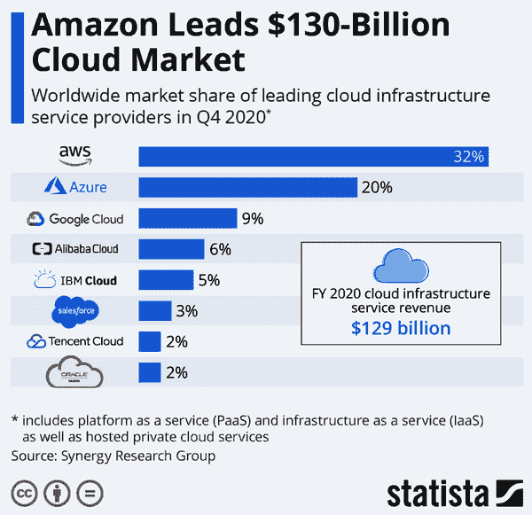

###### 图 9-1\. GCP 云市场份额

最后，谷歌因用户和客户体验差而声名狼藉，并频繁放弃产品，如 Google Hangouts 和 Google Plus 社交网络。如果在未来五年内仍然是第三选择，它会继续停止 Google Cloud 吗？

尽管这些是重大挑战，而且谷歌应该迅速解决导致这些问题的文化问题，但由于其文化，谷歌平台有许多独特的优势。例如，虽然 AWS 和微软是以客户服务为导向的文化，具有丰富的企业客户支持历史，但谷歌因其大多数产品没有电话支持而闻名。相反，它的文化侧重于紧张的“leet code”风格面试，只聘用“最优秀的”人才。此外，研发能够在“全球范围”内运行的令人惊叹复杂解决方案是其擅长的。特别是，谷歌的三个最成功的开源项目展示了这种文化优势：Kubernetes、Go 语言和深度学习框架 TensorFlow。

最终，使用 Google Cloud 的头号优势可能在于其技术非常适合多云战略。像 Kubernetes 和 TensorFlow 这样的技术在任何云上表现良好，并得到广泛采用。因此，使用 Google Cloud 对于希望检查其与 AWS 或 Azure 供应商关系实力的大公司来说可能是一个避险措施。此外，这些技术具有广泛的采用，因此相对容易为需要 TensorFlow 专业知识的职位招聘人才。

让我们看看 Google Cloud 的核心服务。这些服务分为四个主要类别：计算、存储、大数据和机器学习，如图 9-2 所示。

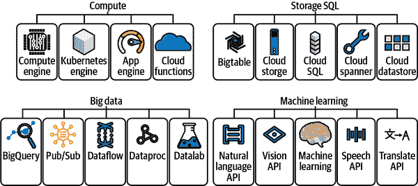

###### 图 9-2\. GCP 云服务

接下来，让我们定义 Google Cloud 的主要组件，从计算开始：

计算引擎

与其他云供应商（特别是 AWS 和 Azure）类似，GCP 提供虚拟机作为服务。Compute Engine 是一个服务，允许您在 Google 基础设施上创建和运行虚拟机。也许最重要的一点是，有许多不同类型的虚拟机，包括计算密集型、内存密集型、加速器优化和通用型。此外，还有可中断的 VM，可供使用长达 24 小时，适用于批处理作业，可以节省高达 80%的存储成本。

作为 MLOps 从业者，使用适合当前任务的适当类型的机器非常关键。在实际世界中，成本确实很重要，准确预测成本的能力可能会成就或毁掉一家进行机器学习的公司。例如，在深度学习中，使用加速器优化实例可能是最佳选择，因为它们可以利用 NVIDIA GPU 的额外大规模并行能力。另一方面，对于不能利用 GPU 的机器学习训练来说，使用这些实例将非常浪费。类似地，通过围绕用于批处理机器学习的可中断 VM 进行架构设计，组织可以节省高达 80%的成本。

Kubernetes 引擎和 Cloud Run

由于 Google 创建并维护 Kubernetes，通过其 GKE（Google Kubernetes Engine）执行 Kubernetes 上的工作的支持非常出色。另外，Cloud Run 是一个高级服务，抽象了运行容器的许多复杂性。对于希望以简单方式部署容器化机器学习应用程序的组织来说，Cloud Run 是 Google Cloud Platform 的一个很好的起点。

App Engine

Google App Engine 是一个完全托管的 PaaS。您可以使用多种语言编写代码，包括 Node.js、Java、Ruby、C#、Go、Python 或 PHP。MLOps 工作流可以使用 App Engine 作为完全自动化持续交付管道的 API 端点，使用 GCP Cloud Build 部署更改。

云函数

Google Cloud Functions 充当 FaaS（函数即服务）。FaaS 与事件驱动架构很搭配。例如，Cloud Functions 可以触发批量机器学习训练作业或者在事件响应中提供 ML 预测。

接下来，让我们谈谈 Google Cloud 上的存储。在 MLOps 方面，讨论的主要选项是其 Cloud Storage 产品。它提供无限存储、全球访问性、低延迟、地理冗余和高耐久性。这些事实意味着对于 MLOps 工作流程来说，数据湖是非结构化和结构化数据的存储位置，用于批处理机器学习训练作业。

与此服务密切相关的是 GCP 提供的大数据工具。许多服务可以帮助移动、查询和计算大数据。其中最受欢迎的是 Google BigQuery，因为它提供 SQL 接口、无服务器范式，并且可以在平台内进行机器学习。Google BigQuery 是在 GCP 上进行机器学习的绝佳起点，因为你可以从这个工具解决整个 MLOps 的价值链。

最后，机器学习和 AI 能力在一个名为 Vertex AI 的产品中协同工作。谷歌的一个优势是它从一开始就旨在成为 MLOps 解决方案。Vertex AI 的工作流程允许以结构化的方式进行 ML，包括以下内容：

+   数据集的创建和存储

+   训练一个 ML 模型

+   将模型存储在 Vertex AI 中

+   将模型部署到端点以进行预测

+   测试和创建预测请求

+   使用流量分割进行端点处理

+   管理 ML 模型和端点的生命周期

根据谷歌的说法，这些能力对 Vertex AI 如何实现 MLOps 起到了作用，如图 9-3 所示。这七个组件的中心是数据和模型管理，这是 MLOps 的核心元素。

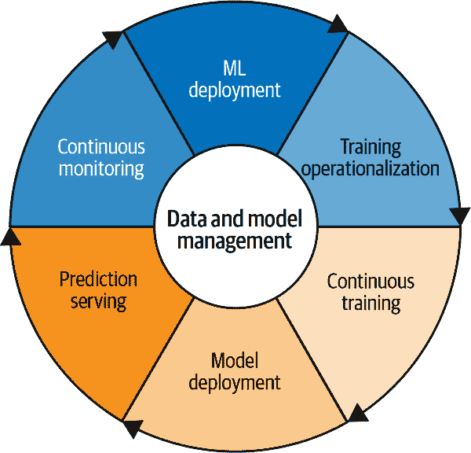

###### 图 9-3\. Google 的 MLOps 七大组件

这种思维过程最终体现在谷歌对端到端 MLOps 的理念中，如图 9-4 所述。像 Vertex AI 这样的全面平台能够全面管理 MLOps。

简而言之，Google 云平台上的 MLOps 因 Vertex AI 和其系统的子组件（如 Google BigQuery）而变得简单明了。接下来，让我们更详细地探讨在 GCP 上的 CI/CD，这是 MLOps 的一个不可或缺的基础组件。

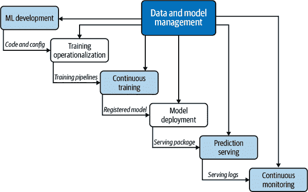

###### 图 9-4\. GCP 上的端到端 MLOps

## 持续集成和持续交付

项目中最重要但被忽视的一个领域是持续集成。测试是 DevOps 和 MLOps 的基本组成部分。对于 GCP，有两种主要的持续集成选项：使用 GitHub Actions 这样的 SaaS 解决方案，或者使用云原生解决方案[Cloud Build](https://oreil.ly/oTafJ)。让我们看看这两个选项。您可以在这个[gcp-from-zero GitHub 存储库](https://oreil.ly/34TQt)中查看整个初始项目脚手架。

首先，让我们看看 Google Cloud Build。这是 Google Cloud Build 的配置文件示例，[*cloudbuild.yaml*](https://oreil.ly/wWbRS)：

```
steps:
- name: python:3.7
  id: INSTALL
  entrypoint: python3
  args:
  - '-m'
  - 'pip'
  - 'install'
  - '-t'
  - '.'
  - '-r'
  - 'requirements.txt'
- name: python:3.7
  entrypoint: ./pylint_runner
  id: LINT
  waitFor:
  - INSTALL
- name: "gcr.io/cloud-builders/gcloud"
  args: ["app", "deploy"]
timeout: "1600s"
images: ['gcr.io/$PROJECT_ID/pylint']
```

与 Google Cloud 一起工作的推荐方式是使用内置编辑器和终端一起工作，如第 9-5 图所示。请注意，Python 虚拟环境已激活。

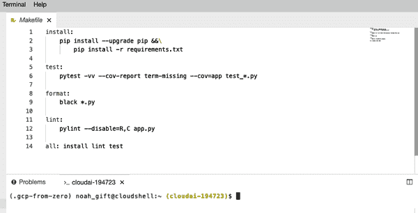

###### 第 9-5 图。GCP 编辑器

一个要点是，与 GitHub Actions 相比，Google Cloud Build 在测试和代码 linting 方面有些笨拙，但确实使像 Google App Engine 这样的服务部署变得容易。

现在让我们看看 GitHub Actions 的工作原理。您可以参考*python-publish.yml* [配置文件](https://oreil.ly/mJd0T)：

```
name: Python application test with GitHub Actions

on: [push]

jobs:
  build:

    runs-on: ubuntu-latest

    steps:
    - uses: actions/checkout@v2
    - name: Set up Python 3.8
      uses: actions/setup-python@v1
      with:
        python-version: 3.8
    - name: Install dependencies
      run: |
        make install
    - name: Lint with pylint
      run: |
        make lint
    - name: Test with pytest
      run: |
        make test
    - name: Format code
      run: |
        make format
```

两种方法之间的一个关键区别在于，GitHub 侧重于提供出色的开发者体验，而 GCP 侧重于云体验。一种策略是使用 GitHub Actions 进行开发者反馈，即代码的 linting 和测试，并使用 Google Cloud Build 进行部署。

在 GCP 上处理 CI/CD 系统后，让我们探讨一个核心 Google 计算技术，Kubernetes。

## Kubernetes Hello World

关于 Kubernetes 的一种思考方式是将其视为一个“迷你云”或“盒中云”。Kubernetes 允许创建几乎无限的应用程序复杂性。使其成为 MLOps 理想选择的一些功能包括：

+   高可用架构

+   自动缩放

+   丰富的生态系统

+   服务发现

+   容器健康管理

+   Secrets 和配置管理

+   Kubeflow（用于 Kubernetes 的端到端 ML 平台）

第 9-6 图表明，从 TensorFlow 到 scikit-learn 的 ML 框架在核心 Kubernetes 架构之上进行协调。最后，正如前文所述，Kubernetes 可以在许多云端或您自己的数据中心中运行。

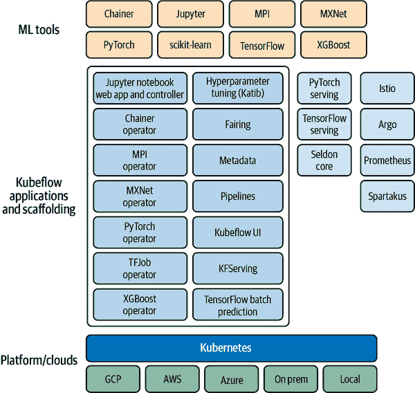

###### 第 9-6 图。Kubeflow 架构

第 9-7 图中 Kubernetes 架构的基础显示了 Kubernetes 中涉及的核心操作包括以下内容：

+   创建一个 Kubernetes 集群。

+   部署应用程序到集群中。

+   暴露应用程序端口。

+   扩展应用程序。

+   更新应用程序。

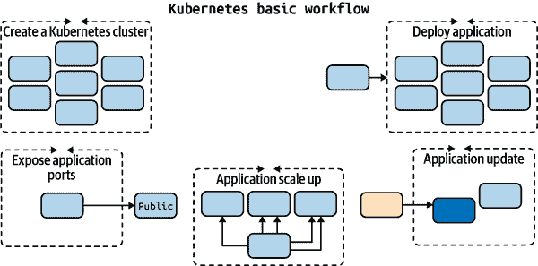

###### 第 9-7 图。Kubernetes 基础知识

第 9-8 图显示了一个 Kubernetes 控制节点，管理包含一个或多个容器的其他节点内的 pod。

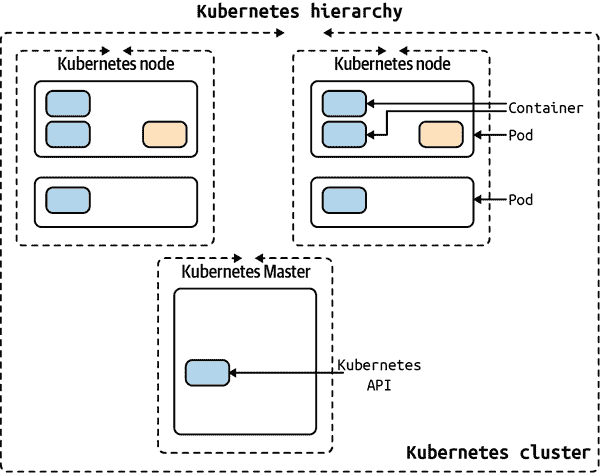

###### 第 9-8 图。Kubernetes 层级结构

###### 注意

有两种主要方法：设置本地集群（最好使用 Docker Desktop）或提供云集群：通过 Amazon EKS 的 Amazon、通过 Google Kubernetes Engine GKE 的 Google 和通过 Azure Kubernetes Service (AKS) 的 Microsoft。

Kubernetes 的“杀手级”特性之一是通过水平 Pod 自动缩放器（HPA）设置自动缩放功能。Kubernetes HPA 将自动调整副本控制器、部署或副本集中的 Pod 数量（记住它们可以包含多个容器）。缩放使用 CPU 利用率、内存或在 Kubernetes Metrics Server 中定义的自定义指标。

在 图 9-9 中，Kubernetes 使用控制循环监视集群的度量，并根据收到的度量执行操作。

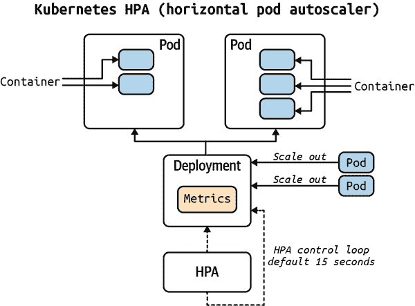

###### 图 9-9\. Kubernetes 自动缩放器

由于 Kubernetes 是 Google 平台的核心优势，以及 MLOps 多大部分运行在该平台上，让我们直接进入一个“你好世界” Kubernetes 示例。该项目使用一个简单的 Flask 应用程序作为基础项目（它返回正确的更改），并将其转换为 Kubernetes。您可以在 GitHub 上的[完整源代码库中找到](https://oreil.ly/ISgrh)。

在 图 9-10 中，Kubernetes 节点连接到负载均衡器。

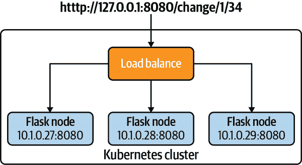

###### 图 9-10\. Kubernetes 你好世界

让我们看看存储库中的资产。

+   [*Makefile*](https://oreil.ly/HSX9G)：构建项目

+   [*Dockerfile*](https://oreil.ly/2Znkk)：容器配置

+   [*app.py*](https://oreil.ly/G2Tjt)：Flask 应用程序

+   [*kube-hello-change.yaml*](https://oreil.ly/BCARa)：Kubernetes YAML 配置

要开始，请执行以下步骤：

1.  创建 Python 虚拟环境：

    ```
    python3 -m venv ~/.kube-hello && source ~/.kube-hello/bin/activate
    ```

1.  运行 `make all` 执行多个构建步骤，包括安装库、linting 项目和运行测试。

接下来，构建并运行一个 Docker 容器：

1.  安装 [Docker Desktop](https://oreil.ly/oUB0E)

1.  要在本地构建镜像，请执行以下操作：

    ```
    docker build -t flask-change:latest .
    ```

    或者运行 `make build`，该命令具有相同的效果。

1.  要验证容器运行，请运行 `docker image ls`

1.  要运行容器，请执行以下操作：

    ```
    docker run -p 8080:8080 flask-change
    ```

    或者运行 `make run`，该命令具有相同的效果。

1.  在单独的终端中，通过 `curl` 调用 Web 服务，或者运行 `make invoke` 具有相同的命令：

    ```
    curl http://127.0.0.1:8080/change/1/34
    ```

    这里是输出：

    ```
    $ kubectl get nodes
    [
      {
        "5": "quarters"
      },
      {
        "1": "nickels"
      },
      {
        "4": "pennies"
      }
    ]
    ```

1.  使用 Ctrl+C 命令停止正在运行的 Docker 容器

接下来，在本地运行 Kubernetes：

1.  通过 docker-desktop 上下文验证 Kubernetes 是否工作：

    ```
    (.kube-hello) ➜  kubernetes-hello-world-python-flask git:(main) kubectl \
    get nodes

    NAME             STATUS   ROLES    AGE   VERSION
    docker-desktop   Ready    master   30d   v1.19.3
    ```

1.  使用以下命令在 Kubernetes 中运行应用程序，该命令告诉 Kubernetes 设置负载平衡服务并运行它：

    ```
    kubectl apply -f kube-hello-change.yaml
    ```

    或者运行 `make run-kube`，该命令具有相同的效果。

    您可以从配置文件中看到，负载均衡器和三个节点是配置的应用程序：

    ```
    apiVersion: v1
    kind: Service
    metadata:
      name: hello-flask-change-service
    spec:
      selector:
        app: hello-python
      ports:
      - protocol: "TCP"
        port: 8080
        targetPort: 8080
      type: LoadBalancer

    ---
    apiVersion: apps/v1
    kind: Deployment
    metadata:
      name: hello-python
    spec:
      selector:
        matchLabels:
          app: hello-python
      replicas: 3
      template:
        metadata:
          labels:
            app: hello-python
        spec:
          containers:
          - name: flask-change
            image: flask-change:latest
            imagePullPolicy: Never
            ports:
            - containerPort: 8080
    ```

1.  验证容器是否正在运行：

    ```
    kubectl get pods
    ```

    这里是输出：

    ```
    NAME                            READY   STATUS    RESTARTS   AGE
    flask-change-7b7d7f467b-26htf   1/1     Running   0          8s
    flask-change-7b7d7f467b-fh6df   1/1     Running   0          7s
    flask-change-7b7d7f467b-fpsxr   1/1     Running   0          6s
    ```

1.  描述负载平衡服务：

    ```
    kubectl describe services hello-python-service
    ```

    您应该看到类似于此的输出：

    ```
    Name:                     hello-python-service
    Namespace:                default
    Labels:                   <none>
    Annotations:              <none>
    Selector:                 app=hello-python
    Type:                     LoadBalancer
    IP Families:              <none>
    IP:                       10.101.140.123
    IPs:                      <none>
    LoadBalancer Ingress:     localhost
    Port:                     <unset>  8080/TCP
    TargetPort:               8080/TCP
    NodePort:                 <unset>  30301/TCP
    Endpoints:                10.1.0.27:8080,10.1.0.28:8080,10.1.0.29:8080
    Session Affinity:         None
    External Traffic Policy:  Cluster
    Events:                   <none>
    ```

1.  调用 `curl` 来访问端点：

    ```
    make invoke
    ```

    在接下来的部分，运行命令 `make invoke` 查询微服务。该操作的输出如下所示：

    ```
    curl http://127.0.0.1:8080/change/1/34
    [
      {
        "5": "quarters"
      },
      {
        "1": "nickels"
      },
      {
        "4": "pennies"
      }
    ]
    ```

要清理部署，请运行 `kubectl delete deployment hello-python` 命令。

超越基本教程的下一步是使用 GKE（Google Kubernetes Engine）、Google Cloud Run（容器即服务）或 Vertex AI 部署机器学习端点。您可以使用 [Python MLOps Cookbook 仓库](https://oreil.ly/EYAvj) 作为基础来完成这些操作。Kubernetes 技术是构建支持 ML API 的优秀基础，结合 GCP，如果从一开始就使用 Docker 格式的容器，可以选择多种选项。

通过 GCP 的基本计算方式，让我们讨论云原生数据库如 Google BigQuery 在采用 MLOps 过程中的长远发展。

## 云原生数据库选择与设计

Google Cloud 平台的一颗明珠是 Google BigQuery，原因有几个。其中之一是它的易用性，另一个是广泛可用的公共数据库。您可以在 [这个 Reddit 页面](https://oreil.ly/2FdDK) 找到一份不错的 Google BigQuery 开放数据集列表。从 MLOps 的角度来看，Google BigQuery 的一个杀手级功能是能够在其平台内训练和托管 ML 模型。

在查看图 9-12 时，请注意 Google BigQuery 是一个 MLOps 管道的核心，可以将产品导出到商业智能和机器学习工程中，包括 Vertex AI。这种 MLOps 工作流是由于 DataOps（数据运营）输入（如公共数据集、流式 API 和 Google Dataflow 产品）的支持。Google BigQuery 在线进行机器学习，从而简化了大数据集的处理过程。

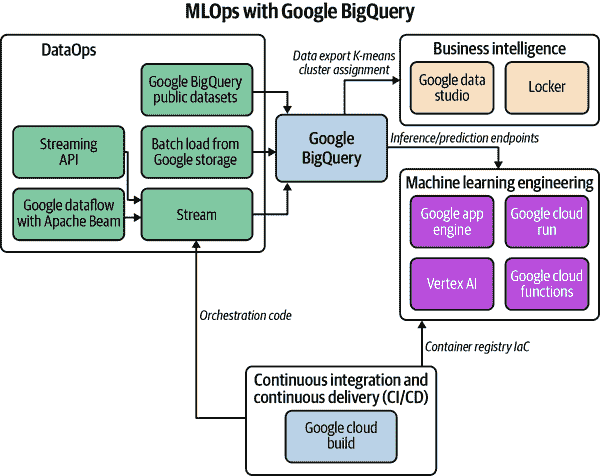

###### 图 9-12\. Google BigQuery MLOps 工作流程

此工作流的一个示例显示在图 9-13 中，其中在 Google BigQuery 中进行了 ML 建模后，结果导出到 Google Data Studio。从 BigQuery 创建的工件是 K-means 聚类分析，[显示在此可共享报告中](https://oreil.ly/JcpbT)。

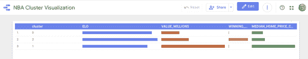

###### 图 9-13\. Google Data Studio K-means 聚类

作为在 GCP 平台上进行 MLOps 的起点，BigQuery 是一个优选的选择，因为该平台具有灵活性。接下来，让我们讨论在 GCP 平台上的 DataOps 和应用数据工程。

# GCP 上的 DataOps：应用数据工程

数据是在规模上构建机器学习所需的输入，因此它是 MLOps 的关键组成部分。从某种意义上说，GCP 几乎可以通过各种方式自动化数据流。这一事实归功于可用的各种计算和存储选项，包括高级工具如 Dataflow。

为了简单起见，让我们使用无服务器方法来进行数据工程，使用 Cloud Functions。为此，让我们看看 Google Cloud Functions 如何工作，以及它们如何通过 AI API 调用作为 ML 解决方案或通过与[Google Pub/Sub](https://oreil.ly/DKj58)交流的 MLOps 管道服务。

让我们从一个故意简单的 Google Cloud Function 开始，返回正确的更改。您可以在[这里找到完整示例](https://oreil.ly/MFmyg)。

要开始，请打开 Google Cloud 控制台，创建一个新的 Cloud Function，并将以下代码粘贴到内部，如图 9-14 所示。您还可以“取消”“要求身份验证”以“允许未经身份验证的调用”。

```
import json

def hello_world(request):

    request_json = request.get_json()
    print(f"This is my payload: {request_json}")
    if request_json and "amount" in request_json:
        raw_amount = request_json["amount"]
        print(f"This is my amount: {raw_amount}")
        amount = float(raw_amount)
        print(f"This is my float amount: {amount}")
    res = []
    coins = [1, 5, 10, 25]
    coin_lookup = {25: "quarters", 10: "dimes", 5: "nickels", 1: "pennies"}
    coin = coins.pop()
    num, rem = divmod(int(amount * 100), coin)
    res.append({num: coin_lookup[coin]})
    while rem > 0:
        coin = coins.pop()
        num, rem = divmod(rem, coin)
        if num:
            if coin in coin_lookup:
                res.append({num: coin_lookup[coin]})
    result = f"This is the res: {res}"
    return result
```

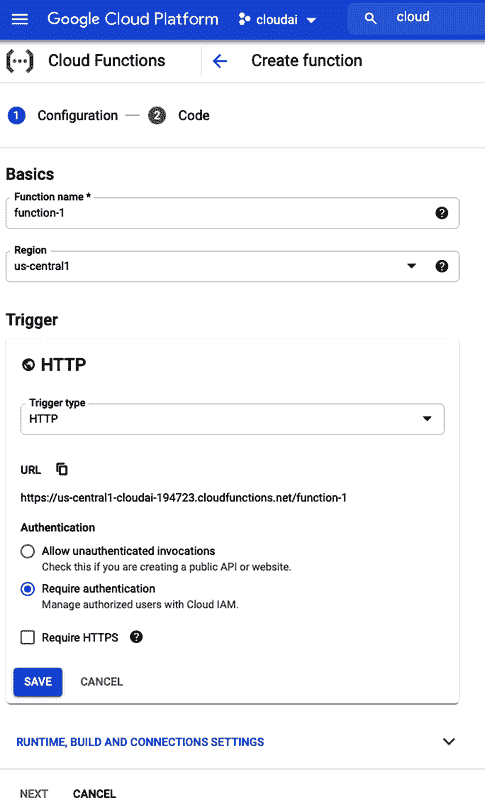

###### 图 9-14\. Google Cloud Function

要通过`gcloud`命令行调用，请执行以下操作：

```
gcloud functions call changemachine --data '{"amount":"1.34"}'
```

要通过`curl`命令调用，请使用以下命令。

```
curl -d '{
 "amount":"1.34"
}'     -H "Content-Type: application/json" -X POST <trigger>/function-3
```

另一种方法是构建一个命令行工具来调用您的端点：

```
#!/usr/bin/env python
import click
import requests

@click.group()
@click.version_option("1.0")
def cli():
    """Invoker"""

@cli.command("http")
@click.option("--amount", default=1.34, help="Change to Make")
@click.option(
    "--host",
    default="https://us-central1-cloudai-194723.cloudfunctions.net/change722",
    help="Host to invoke",
)
def mkrequest(amount, host):
    """Asks a web service to make change"""

    click.echo(
        click.style(
            f"Querying host {host} with amount: {amount}", bg="green", fg="white"
        )
    )
    payload = {"amount": amount}
    result = requests.post(url=host, json=payload)
    click.echo(click.style(f"result: {result.text}", bg="red", fg="white"))

if __name__ == "__main__":
    cli()
```

最后，另一种方法是将您的 ML 模型上传到 Vertex AI 或调用执行计算机视觉、NLP 或其他与 ML 相关任务的现有 API 端点。您可以在 GitHub 上找到[完整示例](https://oreil.ly/P7JsE)。在下面的示例中，让我们使用一个预先存在的 NLP API。您还需要通过编辑包含在 Google Cloud 脚手架中的*requirements.txt*文件来添加两个第三方库（见图 9-15）。

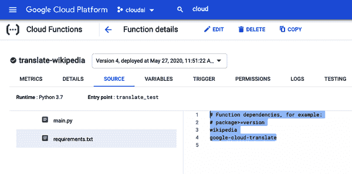

###### 图 9-15\. 添加需求

将此代码粘贴到 Google Cloud Shell 控制台中的*main.py*函数中：

```
import wikipedia

from google.cloud import translate

def sample_translate_text(
    text="YOUR_TEXT_TO_TRANSLATE", project_id="YOUR_PROJECT_ID", language="fr"
):
    """Translating Text."""

    client = translate.TranslationServiceClient()

    parent = client.location_path(project_id, "global")

    # Detail on supported types can be found here:
    # https://cloud.google.com/translate/docs/supported-formats
    response = client.translate_text(
        parent=parent,
        contents=[text],
        mime_type="text/plain",  # mime types: text/plain, text/html
        source_language_code="en-US",
        target_language_code=language,
    )
    print(f"You passed in this language {language}")
    # Display the translation for each input text provided
    for translation in response.translations:
        print("Translated text: {}".format(translation.translated_text))
    return "Translated text: {}".format(translation.translated_text)

def translate_test(request):
    """Takes JSON Payload {"entity": "google"}"""
    request_json = request.get_json()
    print(f"This is my payload: {request_json}")
    if request_json and "entity" in request_json:
        entity = request_json["entity"]
        language = request_json["language"]
        sentences = request_json["sentences"]
        print(entity)
        res = wikipedia.summary(entity, sentences=sentences)
        trans = sample_translate_text(
            text=res, project_id="cloudai-194723", language=language
        )
        return trans
    else:
        return f"No Payload"
```

要调用该函数，您可以从 Google Cloud Shell 调用它：

```
gcloud functions call translate-wikipedia --data\
 '{"entity":"facebook", "sentences": "20", "language":"ru"}'
```

您可以在 Google Cloud Shell 终端中看到俄语翻译的输出，如图 9-16 所示。

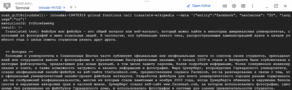

###### 图 9-16\. 翻译

对于原型化数据工程工作流程，没有比 Google Cloud Functions 等无服务器技术更快的方法了。我的建议是，使用无服务器技术解决初始数据工程工作流，如果需要，再转向更复杂的工具。

重要说明是 Vertex AI 平台添加了许多额外的数据工程和 ML 工程组件，以增强更大型项目。特别是使用可解释 AI、跟踪模型质量和使用特征存储是全面 MLOps 解决方案中的有价值组件。接下来让我们深入探讨这些选项。

# 运营 ML 模型

每个主要的云平台现在都有一个 MLOps 平台。在 GCP 上，该平台是 Vertex AI，并整合了多年来开发的许多个别服务，包括 AutoML 技术。特别是，MLOps 平台的一些基本组件包括特征存储、可解释 AI 和跟踪模型质量。如果在较大公司启动 MLOps 项目，首选在 GCP 上的地方将是其 Vertex AI 平台，就像在 AWS 上的 SageMaker 或 Azure 上的 Azure ML Studio 一样。

另一个选项是将组件作为独立的解决方案在 GCP 平台上操作 ML 模型。其中一个可用的服务是[prediction service](https://oreil.ly/7cWEV)，用于部署模型并接收请求。

例如，您可以使用类似以下命令来测试本地的 sklearn 模型：

```
gcloud ai-platform local predict --model-dir\
  LOCAL_OR_CLOUD_STORAGE_PATH_TO_MODEL_DIRECTORY/ \
--json-instances LOCAL_PATH_TO_PREDICTION_INPUT.JSON \
--framework NAME_OF_FRAMEWORK
```

随后，您可以创建一个端点，然后从本章前面显示的示例中调用此端点，例如 Google Cloud Functions、Google Cloud Run 或 Google App Engine。

让我们通过一个示例来了解 Google App Engine 项目在 GCP 云上的外观，使用[此存储库作为起点](https://oreil.ly/2vC8t)。首先，请注意在 GCP 上的持续交付的核心架构。要开始，请按照“轻量级”MLOps 工作流程在图 9-17 中所示的方式创建一个新的 Google App Engine 项目。

###### 注意

请注意，这种轻量级工作流程允许透明且简单地部署 ML 模型，但如果需要像可解释 AI 这样的功能，则“重量级”流程可能会增加巨大的价值。

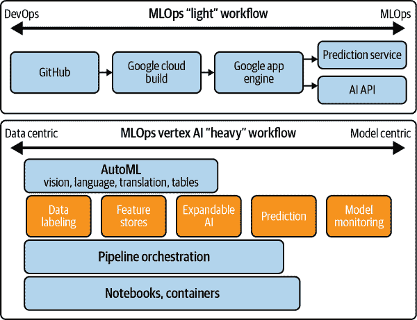

###### 图 9-17\. MLOps 轻量与重量工作流程

接下来，请按照图 9-18 中所示启用 Cloud Build API。

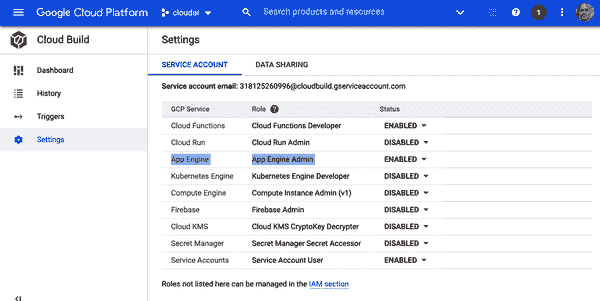

###### 图 9-18\. 云构建

*cloudbuild.yml* 文件只需一个部署命令：

```
steps:
- name: "gcr.io/cloud-builders/gcloud"
  args: ["app", "deploy"]
timeout: "1600s"
```

唯一的其他要求是*app.yaml*、*requirements.txt*和*main.py*，这些文件都可以在[此示例仓库](https://oreil.ly/YAy6c)中找到。使此应用程序执行任何形式的机器学习的最后一步是调用 ML/AI API 或使用 AI 平台端点托管。

简单方法的优势在于，最多只需一两个小时就能设置整个 MLOps 流水线。您还可以从 AI API、预测服务和 AutoML 端点中挑选和选择。

在 GCP 上进行 MLOps 有“轻量级”和“重量级”两种方法。本示例探讨了“轻量级”方法，但使用 Vertex AI 平台技术也有其优点，因为它包含许多企业所需的高级功能。

让我们结束本章，并讨论在 MLOps 中使用 GCP 的下一步。

# 结论

关于像 Vertex AI 这样的 MLOps 技术的最后一点体会是，它们比大多数组织自己解决复杂问题更有效。我记得曾与研究实验室的某人交谈，他们吹嘘云计算被高估了，因为他们拥有大量 GPU。然而，大量 GPU 并不会给您这些平台服务。这种说法基本上是对企业软件和初创公司工作方式的根本误解。在早期阶段的初创公司和财富 500 强公司中，比较优势至关重要。不要为了一些微不足道的成本而构建比您可以购买的更差的东西。

我建议将本章的所有内容应用到一个最终的机器学习项目中，该项目包括在 GCP 上构建一个云原生 ML 应用程序。这个项目应该使您能够使用现代技术创建实际可行的解决方案。

在开始之前，请确保阅读 Sculley 等人（2015）的论文，考虑[机器学习系统中的技术债务](https://oreil.ly/d8jrl)。您的项目可能会受益于使用 Google BigQuery 数据集的公共数据。或者，如果使用 AutoML，数据可以是教程数据或自定义数据。

主要思想是创建一个展示您在 Google Cloud 上进行 ML 工程能力的组合项目。以下是建议的项目要求需要深入考虑：

+   源代码存储在 GitHub 中

+   从 CircleCI 进行持续部署

+   数据存储在 GCP（BigQuery、Google Cloud Storage 等）

+   创建和提供 ML 预测（AutoML、BigQuery、AI Platform 等。）

+   云原生监控

+   Google App Engine 通过 REST API 提供 HTTP 请求，并附带一个 JSON 负载

+   使用 Google Cloud Build 在 GCP 环境中部署

这里是添加到最终项目要求清单的一些项目：

+   应用程序是否进行了 ML 推断？

+   是否存在独立的环境？

+   是否有全面的监控和警报？

+   是否使用了正确的数据存储？

+   是否适用最少安全原则？

+   数据在传输过程中是否加密？

您可以在[官方代码库](https://oreil.ly/hJkDx)中查看一些最近的学生和顶级数据科学项目。这些项目为您可以构建的内容提供了一个参考框架，欢迎您将来提交拉取请求以将您的项目添加进来。

+   [Jason Adams: 使用 Kubernetes 进行快速 API 情感分析](https://oreil.ly/5Omf3)

+   [James Salafatinos: Tensorflow.js 实时图像分类](https://oreil.ly/rs4QQ)

+   [Nikhil Bhargava: 鞋类价格预测](https://oreil.ly/MjU7H)

+   [Covid 预测器](https://oreil.ly/Wm8UF)

+   [工作缺席](https://oreil.ly/Rrh6S)

下一章讨论了机器学习的互操作性以及它如何通过不同平台、技术和模型格式解决 MLOps 问题的独特性。

# 练习

+   使用 Google Cloud Shell Editor，在 GitHub 上创建一个新的存储库，使用 Makefile、linting 和测试来构建必要的 Python 脚手架。在您的 Makefile 中添加代码格式化步骤。

+   创建一个“Hello World”管道到 Google Cloud，调用基于 Python 的 Google App Engine (GAE) 项目，并返回一个 JavaScript Object Notation (JSON) 响应中的“hello world”。

+   使用 CSV 文件和 Google BigQuery 创建一个摄取到 ETL 管道。安排一个定期的 cron 作业批量更新数据。

+   在 Google AutoML Vision 上训练一个多类别分类模型，并部署到边缘设备。

+   创建一个生产和开发环境，并使用 Google Cloud Build 在这两个环境中部署项目。

# 批判性思维讨论问题

+   CI 系统解决了哪些问题，以及为什么 CI 系统是 SaaS 软件的重要组成部分？

+   为什么云平台是分析应用的理想目标，以及深度学习如何从云计算中受益？

+   像 Google BigQuery 这样的托管服务有哪些优势，以及 Google BigQuery 如何与传统 SQL 不同？

+   从 BigQuery 直接进行 ML 预测如何为 Google 平台增加价值，以及这对分析应用工程可能带来的优势是什么？

+   AutoML 为何具有较低的总体拥有成本（TCO），以及如何可能有较高的 TCO？
