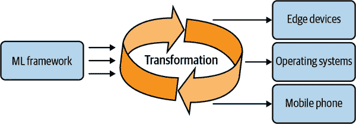
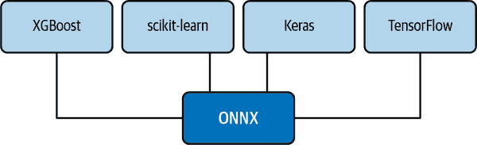
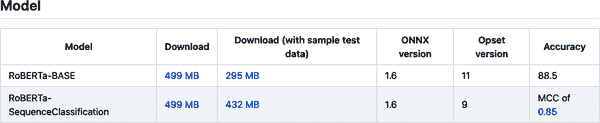
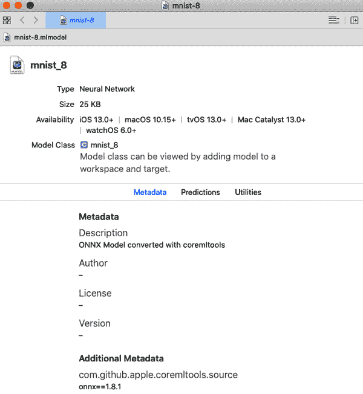
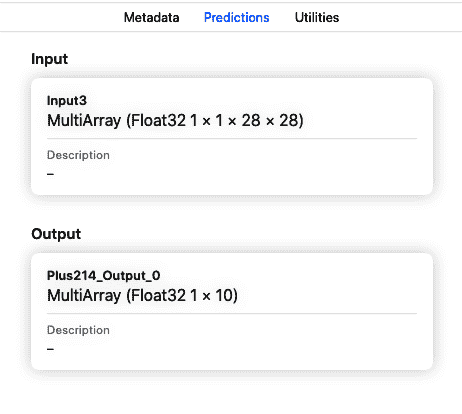
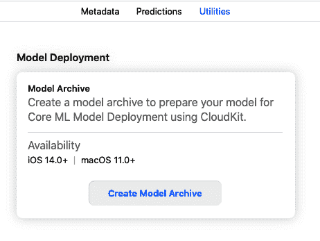

# 第十章：机器学习的互操作性

By Alfredo Deza

> 哺乳动物的大脑具有广泛的计算能力，但是某些特殊功能（例如主观性）通常需要专门的结构。这种假设的结构已经被马塞尔·金斯本戏称为“主观性泵”。对于我们中的一些人来说，这确实是我们正在寻找的。而主观性的机制是双重的，如解剖学的二重性所示，通过半球切除术的成功以及分裂脑的结果（在猫和猴子以及人类身上）。
> 
> Dr. Joseph Bogen

秘鲁有*数千*种土豆品种。作为一个在秘鲁长大的人，我发现这听起来令人惊讶。很容易假设大多数土豆的味道都有些类似，但事实并非如此。不同的菜肴需要不同的土豆品种。如果食谱要求使用*Huayro*土豆，而你想使用大多数美国超市都能找到的常见*烘烤*土豆，你可能会不想与秘鲁厨师争论。如果你有机会去南美（特别是秘鲁），尝试走进街头市场的经历。那里新鲜蔬菜的数量，包括几十种土豆品种，可能会让你眩晕。

我不再生活在秘鲁，我错过那里的土豆品种。我真的无法用本地超市购买的普通烘烤土豆来做出相同口感的一些菜肴。这完全不一样。我认为这种谦逊蔬菜所提供的多样性和不同口味对秘鲁的美食身份至关重要。你可能认为用常见的烘烤土豆烹饪还可以，但归根结底，这是关于选择和挑选。

在多样性和挑选适合自己的东西的能力中有一种赋权感。当涉及到最终产品——训练好的模型时，这种赋权感在机器学习中同样适用。

训练过的机器学习模型也有其独特的限制，大多数模型无法在未经专门定制支持的环境中工作。模型互操作性的主要概念是能够将模型从一个平台转换到另一个平台，从而提供了选择。本章论述的观点是，虽然使用云供应商提供的即用即得模型并不用过多担心供应商锁定是有道理的，但理解如何将模型导出为其他可以在具有不同约束的平台上工作的格式是非常重要的。就像容器只要有底层容器运行时就可以在大多数系统中无缝运行一样（正如我在“容器”章节中解释的那样），模型互操作性或将模型导出为不同格式对灵活性和增强至关重要。图 10-1 通过训练任何机器学习框架，在导出结果模型*一次*后，几乎可以在任何地方部署：从边缘设备到手机和其他操作系统。



###### 图 10-1\. 互操作性概述

这种情况就像制造可以与任何螺丝刀配合使用的螺钉，而不是只能与单一家装修店的螺丝刀配合使用的螺钉。在“边缘设备”章节中，我们已经遇到了一个模型无法与 Edge TPU 配合工作的问题，最终需要进行转换。目前有一些令人兴奋的选择，我对 ONNX 特别惊讶，这是一个由社区驱动的、采用开放标准的项目，旨在通过简化工具链减少与模型交互的复杂性。本章将深入探讨使 ONNX 成为引人注目的机器学习选择的一些细节，以及大多数云平台已经支持该格式的原因。

# 为何互操作性至关重要

在软件工程中，抽象复杂的过程和交互是一种典型模式。有时，这些抽象可能会变得非常复杂，导致抽象本身与其试图抽象的底层软件一样复杂。一个很好的例子是 Openstack（一个开源的基础设施即服务平台）及其安装程序。安装和配置基础设施平台可能非常复杂。不同的机器类型和网络拓扑创建了一个棘手的组合，需要用一个通用的安装程序解决。

创建了一个新的安装程序，以使安装 TripleO（Openstack On Openstack）变得更加容易。TripleO 生成了一个临时实例，进而安装 Openstack。该项目解决了许多与安装和配置相关的问题，但有人认为它仍然很复杂，并且需要进一步的抽象。这就是 QuintupleO（Openstack On Openstack On Openstack）的诞生。不参与 Openstack 的活动，我可以告诉你，部署它是很困难的，工程团队正在试图通用地解决这些问题。但我怀疑增加另一层是解决方案。

很容易被说服认为增加另一层会使事情变得更容易，但实际上，这很难做到既满足大家又做得好。我经常用来设计系统的一个开放性问题是：*系统可以非常简单且专断，也可以灵活且复杂。你会选择哪个？* 没有人喜欢这些选项，每个人都推崇*简单且灵活*。虽然可以创建这样的系统，但要达到这一点是具有挑战性的。

在机器学习中，多个平台和云服务提供商以不同和特定的方式训练模型。如果仅在平台内部保持并与模型交互，这并不重要，但如果您需要在其他地方运行训练好的模型，则可能会引起挫败感。

最近在 Azure 上使用 AutoML 训练数据集时，我在尝试本地推理时遇到了几个问题。Azure 具有 AutoML 的“无代码”部署，并且多种类型的训练模型支持这种部署方式。这意味着无需编写任何代码即可创建推理并提供响应。Azure 处理 API 文档，说明输入和预期输出是什么。我找不到训练模型的*评分脚本*，也找不到任何有助于在本地运行它的评分脚本的提示。没有明显的方法来理解如何加载和与模型交互。

模型的后缀暗示它使用 Python 的`pickle`模块，因此在尝试了几种不同方法后，我设法加载了它，但无法进行任何推理。接下来我得处理依赖关系。Azure 中的 AutoML 并不公布用于训练模型的确切版本和库。我目前正在使用 Python 3.8，但无法在系统中安装 Azure SDK，因为 SDK 仅支持 3.7 版本。我不得不安装 Python 3.7，然后创建一个虚拟环境，并在那里安装 SDK。

其中一个库（*xgboost*）在其最新版本中存在非向后兼容性（模块被移动或重命名），因此我不得不猜测一个允许特定导入的版本。结果证明是 2019 年的 0.90 版本。最后，在 Azure 的 AutoML 中训练模型时，似乎使用了当时最新版本的 Azure SDK。但这也没有进行宣传。也就是说，如果一个模型在一月份训练，而您在之后的一个月尝试使用它，并且 SDK 有几个版本更新，您无法使用最新的 SDK 版本。您必须回到 Azure 训练模型时的最新 SDK 版本。

这种情况绝不意味着对 Azure 的 AutoML 过度批评。这个平台使用起来非常出色，并且通过更好地宣传所使用的版本及如何与本地模型交互可以进一步改进。主要问题在于在过程中失去了控制粒度：低代码或无代码对速度来说很好，但在可移植性方面可能会变得复杂。我通过尝试进行本地推理时遇到了所有这些问题，但如果您的公司一般使用 AWS 进行机器学习，但使用 Azure 进行托管，则可能会出现相同情况。

经常出现的另一个问题是，科学家在一个平台上创建模型时不得不做一些假设，比如底层环境，包括计算能力、存储和内存。如果一个在 AWS 上表现良好的模型需要部署到完全不兼容的边缘 TPU 设备，会发生什么？假设你的公司已经解决了这种情况，并且为不同平台生成相同的模型。但是，边缘设备的结果模型达到了五千兆字节，超出了加速器的最大存储容量。

模型互操作性通过公开描述约束条件来解决这些问题，使得可以在享受所有主要云提供商支持的同时，轻松地将模型从一种格式转换为另一种格式。在下一节中，我将详细介绍 ONNX 作为更强大的互操作性项目的细节，以及如何构建自动化来轻松转换模型。

# **ONNX: 开放神经网络交换**

正如我之前提到的，ONNX 不仅是模型互操作性的一个很好选择，也是朝着允许轻松切换框架的系统的第一个倡议。这个项目始于 2017 年，当时 Facebook 和 Microsoft 将 ONNX 作为人工智能模型互操作的开放生态系统，并共同开发了该项目和工具以推动其采纳。此后，该项目作为一个大型开源项目成长和成熟，具有包括特别兴趣组（SIGs）和工作组（working groups）在内的完整结构，涵盖不同领域如发布和培训。

除了互操作性之外，框架的普遍性允许硬件供应商针对 ONNX 并同时影响多个其他框架。通过利用 ONNX 表示，优化不再需要单独集成到每个框架中（这是一个耗时的过程）。尽管 ONNX 相对较新，但令人振奋的是它在各个云提供商中得到了良好的支持。不足为奇的是，Azure 甚至在其机器学习 SDK 中为 ONNX 模型提供了原生支持。

主要思想是在您喜欢的框架中进行一次训练，然后在任何地方运行：从云端到边缘设备。一旦模型以 ONNX 格式存在，您可以将其部署到各种设备和平台上。这包括不同的操作系统。实现这一点的努力是巨大的。不多的软件示例能够在多个不同的操作系统、边缘设备和云端上使用相同的格式运行。

尽管有几种支持的机器学习框架（随时添加更多），图 10-2 展示了最常见的转换模式。



###### 图 10-2\. 转换为 ONNX

您可以利用您最喜欢的框架的知识和功能，然后转换为 ONNX。然而，正如我在“苹果 Core ML”中所演示的，也可以（虽然不太常见）将 ONNX 模型转换为不同的运行时。这些转换也并非“免费”：当新功能尚不支持时（ONNX 转换器总是在赶上），或者旧模型不受新版本支持时，可能会遇到问题。我仍然相信普遍性和“随处运行”的想法是稳固的，并且在可能时利用它是有帮助的。

接下来，让我们看看您可以在哪里找到预训练的 ONNX 模型，以尝试其中一些。

## ONNX 模型动物园

*模型动物园* 在讨论 ONNX 模型时经常被提及。尽管它通常被描述为一个准备好使用的 ONNX 模型注册表，但它主要是一个[GitHub 上的信息库](https://oreil.ly/gX2PB)，其中包含社区贡献并在库中策划的几个预训练模型的链接。这些模型分为三类：视觉、语言和其他。如果您想要开始使用 ONNX 并进行一些推理，模型动物园是您可以前往的地方。

在“ML 模型打包”中，我使用了模型动物园中的*RoBERTa-SequenceClassification*模型。因为我想要在 Azure 中注册，所以我需要添加一些信息，比如 ONNX 运行时版本。图 10-3 显示了针对该特定模型在[模型动物园](https://oreil.ly/ptOGC)中的所有内容。



###### 图 10-3\. 模型动物园

除了版本和大小信息外，页面通常还会提供一些关于如何与模型交互的示例，这对于快速创建概念验证至关重要。关于这些文档页面，我认为值得注意的另一点是获取*来源*（模型的真实来源）。在*RoBERTa-SequenceClassification*模型的情况下，它起源于*PyTorch RoBERTa*，然后转换为 ONNX 格式，并最终在模型动物园中提供。

弄清楚模型的来源和工作源头的重要性并不是显而易见的。每当需要进行更改或发现需要解决的问题时，最好准备好准确指出真相源头，以便可以放心地进行任何需要修改的操作。在我担任大型开源项目的发布经理时，我负责为不同的 Linux 发行版构建 RPM 和其他类型的软件包。有一天，生产库损坏了，我被要求重建这些软件包。在重建过程中，我找不到哪个脚本、流水线或 CI 平台生成了几十个这些软件包中包含的一个软件包。

在追踪找到那个软件包来源的各种步骤之后，我发现一个脚本正在从开发者的家目录（该开发者早已离开公司）中下载它，而这台服务器与构建软件包毫无关系。一个单独的文件坐落在一个与构建系统无关的服务器的家目录中是一个定时炸弹。我无法确定软件包的来源，如何对其进行任何更新，或者它以这种方式需要被包含的原因。这些情况并不少见。您必须准备好使一切井井有条，并且在确定生产管道中所有元素的真实来源时有一个坚实的答案。

当您从像模型动物园这样的地方采集模型时，请确保尽可能多地捕获信息，并将其包含在这些模型的目的地中。Azure 提供了几个字段供您在注册模型时使用此目的。正如您将在以下章节中看到的那样，一些模型转换器允许添加元数据。利用这看似不重要的任务可能对调试生产问题至关重要。两个有益的实践已经减少了调试时间，并加快了入职和维护的便利性，即使用有意义的名称和尽可能多的元数据。使用有意义的名称对于识别和提供清晰度至关重要。注册为“production-model-1”的模型并不告诉我它是什么或它是关于什么的。如果您配对此名称没有额外的元数据或信息，这将导致在弄清楚生产问题时引起沮丧和延迟。

## 将 PyTorch 转换为 ONNX

从不同框架开始始终令人生畏，即使底层任务是从数据集中训练模型。PyTorch 在包含可以快速帮助您入门的预训练模型方面表现出色，因为您可以尝试框架的不同方面，而无需处理数据集的策划和训练方法。许多其他框架（如 TensorFlow 和 scikit-learn）也在做同样的事情，这是一个很好的学习起步方式。在本节中，我使用 PyTorch 的预训练视觉模型，然后将其导出到 ONNX。

创建一个新的虚拟环境和一个类似下面的*requirements.txt*文件：

```
numpy==1.20.1
onnx==1.8.1
Pillow==8.1.2
protobuf==3.15.6
six==1.15.0
torch==1.8.0
torchvision==0.9.0
typing-extensions==3.7.4.3
```

安装依赖项，然后创建一个*convert.py*文件来首先生成 PyTorch 模型：

```
import torch
import torchvision

dummy_tensor = torch.randn(8, 3, 200, 200)

model = torchvision.models.resnet18(pretrained=True)

input_names = [ "input_%d" % i for i in range(12) ]
output_names = [ "output_1" ]

torch.onnx.export(
    model,
    dummy_tensor,
    "resnet18.onnx",
    input_names=input_names,
    output_names=output_names,
    opset_version=7,
    verbose=True,
)
```

让我们逐步了解 Python 脚本执行的一些步骤，以生成一个 ONNX 模型。它创建一个使用三个通道填充随机数的张量（对于预训练模型至关重要）。接下来，我们使用*torchvision*库检索*resnet18*预训练模型。我定义了一些输入和输出，最后使用所有这些信息导出模型。

示例用例过于简单，只是为了证明一个观点。导出的模型一点也不健壮，充满了毫无意义的虚拟值。它的目的是展示 PyTorch 如何以一种简单的方式将模型导出到 ONNX。转换器作为框架的一部分确实让人放心，因为它负责确保这一过程完美无缺。尽管存在单独的转换器库和项目，我更喜欢像 PyTorch 这样提供转换功能的框架。

###### 注意

`export()`函数中的`opset_version`参数至关重要。PyTorch 的张量索引可能会导致不支持的 ONNX opset 版本问题。某些索引器类型仅支持版本 12（最新版本）。始终双重检查版本是否符合您需要的支持功能。

运行*convert.py*脚本，它将创建一个*resnet18.onnx*文件。您应该看到类似于此的输出：

```
$ python convert.py
graph(%learned_0 : Float(8, 3, 200, 200, strides=[120000, 40000, 200, 1],
  requires_grad=0, device=cpu),
  %fc.weight : Float(1000, 512, strides=[512, 1], requires_grad=1, device=cpu),
  %fc.bias : Float(1000, strides=[1], requires_grad=1, device=cpu),
  %193 : Float(64, 3, 7, 7, strides=[147, 49, 7, 1], requires_grad=0,
```

现在，通过使用 PyTorch 脚本生成的 ONNX 模型，让我们使用 ONNX 框架验证生成的模型是否兼容。创建一个名为*check.py*的新脚本：

```
import onnx

# Load the previously created ONNX model
model = onnx.load("resnet18.onnx")

onnx.checker.check_model(model)

print(onnx.helper.printable_graph(model.graph))
```

从包含*resnet18.onnx*的同一目录中运行*check.py*脚本，并验证输出与此类似：

```
$ python check.py
graph torch-jit-export (
  %learned_0[FLOAT, 8x3x200x200]
) optional inputs with matching initializers (
  %fc.weight[FLOAT, 1000x512]
[...]
  %189 = GlobalAveragePool(%188)
  %190 = Flattenaxis = 1
  %output_1 = Gemmalpha = 1, beta = 1, transB = 1
  return %output_1
}
```

从对`check_model()`函数的调用的验证不应产生任何错误，证明了转换具有一定程度的正确性。为了确保转换模型的正确性，需要评估推理过程，捕捉任何可能的漂移。如果您不确定使用哪些指标或如何创建稳固的比较策略，请查看“模型监控基础”。接下来，让我们看看如何在命令行工具中使用相同的检查模式。

## 创建一个通用的 ONNX 检查器

现在我已经详细介绍了从 PyTorch 导出模型到 ONNX 并进行验证的细节，让我们创建一个简单且通用的工具，可以验证任何 ONNX 模型，而不仅仅是特定的模型。虽然我们会在下一章节中专门讨论构建强大的命令行工具（尤其是见“命令行工具”），但我们仍然可以尝试构建一个适用于此用例的工具。另一个概念来自 DevOps 和我作为系统管理员的经验，就是尽可能地自动化，并从最简单的问题开始。例如，我不会使用任何命令行工具框架或高级解析器。

首先，创建一个名为*onnx-checker.py*的新文件，其中包含一个名为`main()`的函数：

```
def main():
    help_menu = """
 A command line tool to quickly verify ONNX models using
 check_model()
 """
    print(help_menu)

if __name__ == '__main__':
    main()
```

运行脚本，输出应该显示帮助菜单：

```
$ python onnx-checker.py

    A command line tool to quickly verify ONNX models using
    check_model()
```

脚本目前还没有做任何特殊操作。它使用`main()`函数生成帮助菜单，并且在 Python 终端执行脚本时，还使用 Python 中广泛使用的方法来调用特定函数。接下来，我们需要处理任意输入。命令行工具框架可以帮助解决这个问题，毫无疑问，但我们仍然可以通过最小的努力获得有价值的东西。为了检查脚本的参数（我们需要这些参数来知道要检查哪个模型），我们需要使用`sys.argv`模块。更新脚本，使其导入该模块并将其传递给函数：

```
import sys

def main(arguments):
    help_menu = """
 A command line tool to quickly verify ONNX models using
 check_model()
 """

    if "--help" in arguments:
        print(help_menu)

if __name__ == '__main__':
    main(sys.argv)
```

这一变化将导致脚本仅在使用`--help`标志时输出帮助菜单。脚本目前还没有执行任何有用的操作，所以让我们再次更新`main()`函数，以包括 ONNX 检查功能：

```
import sys
import onnx

def main(arguments):
    help_menu = """
 A command line tool to quickly verify ONNX models using
 check_model()
 """

    if "--help" in arguments:
        print(help_menu)
        sys.exit(0)

    model = onnx.load(arguments[-1])
    onnx.checker.check_model(model)
    print(onnx.helper.printable_graph(model.graph))
```

函数有两个关键的变化。首先，在检查帮助菜单后现在调用`sys.exit(0)`以防止执行下一块代码。接下来，如果未满足帮助条件，则使用最后一个参数（无论是什么）作为要检查的模型路径。最后，使用来自 ONNX 框架的相同函数对模型进行检查。请注意，完全没有对输入进行清理或验证。这是一个非常脆弱的脚本，但如果你运行它，它仍然会证明是有用的：

```
$ python onnx-checker.py ~/Downloads/roberta-base-11.onnx
graph torch-jit-export (
 %input_ids[INT64, batch_sizexseq_len]
) initializers (
 %1621[FLOAT, 768x768]
 %1622[FLOAT, 768x768]
 %1623[FLOAT, 768x768]
[...]
 %output_2 = Tanh(%1619)
 return %output_1, %output_2
}
```

我使用的路径是 RoBERTa 基础模型，它在我*Downloads*目录中的一个单独路径下。这种自动化是一个构建模块：尽可能简单地进行快速检查，以便稍后在其他自动化中使用，比如 CI/CD 系统或云提供商工作流中的流水线。现在我们已经尝试了一些模型，让我们看看如何将在其他流行框架中创建的模型转换为 ONNX。

## 将 TensorFlow 转换为 ONNX

有一个专门从 TensorFlow 转换模型到 ONNX 的项目，存放在 ONNX GitHub 仓库中。它支持广泛的 ONNX 和 TensorFlow 版本。再次强调，确保选择的工具包含你的模型所需的版本，以确保成功转换为 ONNX。

找到适合进行转换的正确项目、库或工具可能会变得棘手。特别是对于 TensorFlow，您可以使用[onnxmltools](https://oreil.ly/BvLxv)，它具有`onnxmltools.convert_tensorflow()`函数，或者[tensorflow-onnx](https://oreil.ly/E6RDE)项目，它有两种转换方式：使用命令行工具或使用库。

本节使用*tensorflow-onnx*项目与一个可以用作命令行工具的 Python 模块。该项目允许您从 TensorFlow 主要版本（1 和 2）、*tflite* 和 *tf.keras* 进行模型转换。由于它允许在规划转换策略时使用更灵活的 ONNX opset 支持（从版本 7 到 13），因此其广泛的支持非常出色。

在进行实际转换之前，值得探讨如何调用转换器。*tf2onnx*项目使用了一个 Python 快捷方式，从一个文件中公开命令行工具，而不是将命令行工具与项目一起打包。这意味着调用需要您使用 Python 可执行文件和特殊标志。首先，在新的虚拟环境中安装库。创建一个*requirements.txt*文件，以确保所有适合本示例的版本都能正常工作：

```
certifi==2020.12.5
chardet==4.0.0
flatbuffers==1.12
idna==2.10
numpy==1.20.1
onnx==1.8.1
protobuf==3.15.6
requests==2.25.1
six==1.15.0
tf2onnx==1.8.4
typing-extensions==3.7.4.3
urllib3==1.26.4
tensorflow==2.4.1
```

现在使用`pip`安装所有依赖项的固定版本：

```
$ pip install -r requirements.txt
Collecting tf2onnx
[...]
Installing collected packages: six, protobuf, numpy, typing-extensions,
onnx, certifi, chardet, idna, urllib3, requests, flatbuffers, tf2onnx
Successfully installed numpy-1.20.1 onnx-1.8.1 tf2onnx-1.8.4 ...
```

###### 注意

如果您安装*tf2onnx*项目时没有*requirements.txt*文件，工具将无法工作，因为它未将`tensorflow`列为依赖项。在本节的示例中，我使用的是版本为 2.4.1 的`tensorflow`。确保安装它以防止依赖问题。

运行帮助菜单以查看可用内容。请记住，调用看起来有些不寻常，因为它需要 Python 可执行文件来使用它：

```
$ python -m tf2onnx.convert --help
usage: convert.py [...]

Convert tensorflow graphs to ONNX.

[...]

Usage Examples:

python -m tf2onnx.convert --saved-model saved_model_dir --output model.onnx
python -m tf2onnx.convert --input frozen_graph.pb  --inputs X:0 \
  --outputs output:0 --output model.onnx
python -m tf2onnx.convert --checkpoint checkpoint.meta  --inputs X:0 \
  --outputs output:0 --output model.onnx
```

出于简洁起见，我省略了帮助菜单的几个部分。调用帮助菜单是确保库在安装后可以加载的可靠方法。例如，如果未安装`tensorflow`，则这是不可能的。我留下了帮助菜单中的三个示例，因为根据您执行的转换类型，您将需要这些示例。除非您对您尝试转换的模型的内部结构有很好的理解，否则这些转换都不会直截了当。让我们从不需要模型知识的转换开始，使转换能够即插即用。

首先，从*tfhub*下载[ssd_mobilenet_v2](https://oreil.ly/ytJk8)模型（压缩成*tar.gz*文件）。然后创建一个目录并在那里解压：

```
$ mkdir ssd
$ cd ssd
$ mv ~/Downloads/ssd_mobilenet_v2_2.tar.gz .
$ tar xzvf ssd_mobilenet_v2_2.tar.gz
x ./
x ./saved_model.pb
x ./variables/
x ./variables/variables.data-00000-of-00001
x ./variables/variables.index
```

现在模型已解压到一个目录中，请使用*tf2onnx*转换工具将*ssd_mobilenet*转换到 ONNX。确保您使用 opset 13，以防止模型的不兼容特性。这是一个缩短的异常回溯，您可能会在指定不支持的 opset 时遇到：

```
File "/.../.../tf2onnx/tfonnx.py", line 294, in tensorflow_onnx_mapping
  func(g, node, **kwargs, initialized_tables=initialized_tables, ...)
File "/.../.../tf2onnx/onnx_opset/tensor.py", line 1130, in version_1
  k = node.inputs[1].get_tensor_value()
File "/.../.../tf2onnx/graph.py", line 317, in get_tensor_value
  raise ValueError("get tensor value: '{}' must be Const".format(self.name))
ValueError: get tensor value:
  'StatefulPartitionedCall/.../SortByField/strided_slice__1738' must be Const
```

使用`--saved-model`标志与模型提取路径，最终使转换工作。在这种情况下，我正在使用 opset 13：

```
$ python -m tf2onnx.convert --opset 13 \
  --saved-model /Users/alfredo/models/ssd --output ssd.onnx
2021-03-24 - WARNING - '--tag' not specified for saved_model. Using --tag serve
2021-03-24 - INFO - Signatures found in model: [serving_default].
2021-03-24 - INFO - Using tensorflow=2.4.1, onnx=1.8.1, tf2onnx=1.8.4/cd55bf
2021-03-24 - INFO - Using opset <onnx, 13>
2021-03-24 - INFO - Computed 2 values for constant folding
2021-03-24 - INFO - folding node using tf type=Select,
  name=StatefulPartitionedCall/Postprocessor/.../Select_1
2021-03-24 - INFO - folding node using tf type=Select,
  name=StatefulPartitionedCall/Postprocessor/.../Select_8
2021-03-24 - INFO - Optimizing ONNX model
2021-03-24 - INFO - After optimization: BatchNormalization -53 (60->7), ...
  Successfully converted TensorFlow model /Users/alfredo/models/ssd to ONNX
2021-03-24 - INFO - Model inputs: ['input_tensor:0']
2021-03-24 - INFO - Model outputs: ['detection_anchor_indices', ...]
2021-03-24 - INFO - ONNX model is saved at ssd.onnx
```

这些示例可能看起来过于简单，但这里的想法是，这些是构建模块，以便您可以通过了解在转换中可能发生的情况进一步探索自动化。现在我已经演示了转换 TensorFlow 模型所需的内容，让我们看看转换*tflite*模型所需的内容，这是*tf2onnx*支持的另一种类型之一。

从[tfhub](https://oreil.ly/qNqml)下载*mobilenet*模型的*量化*版本。*tf2onnx*中的*tflite*支持使调用略有不同。这是一个工具创建的案例，遵循一种标准（将 TensorFlow 模型转换为 ONNX），然后不得不支持其他不完全符合相同模式的东西。在这种情况下，您必须使用`--tflite`标志，该标志应指向已下载的文件：

```
$ python -m tf2onnx.convert \
  --tflite ~/Downloads/mobilenet_v2_1.0_224_quant.tflite \
  --output mobilenet_v2_1.0_224_quant.onnx
```

我再次运行命令时很快就遇到了麻烦，因为支持的操作集与默认设置不匹配。此外，这个模型是量化的，这是转换器必须解决的另一层。以下是尝试过程中的另一个简短的回溯摘录：

```
  File "/.../.../tf2onnx/tfonnx.py", line 294, in tensorflow_onnx_mapping
    func(g, node, **kwargs, initialized_tables=initialized_tables, dequantize)
  File "/.../.../tf2onnx/tflite_handlers/tfl_math.py", line 96, in version_1
    raise ValueError
ValueError: \
  Opset 10 is required for quantization.
  Consider using the --dequantize flag or --opset 10.
```

至少这次错误提示表明模型已量化，并且我应考虑使用不同的操作集（与默认操作集相比，显然不起作用）。

###### 提示

不同的 TensorFlow 操作对 ONNX 的支持有所不同，如果使用不正确的版本可能会造成问题。在尝试确定使用的正确版本时，[tf2onnx 支持状态页面](https://oreil.ly/IJwxB)可能非常有用。

当书籍或演示始终表现完美时，我通常会非常怀疑。回溯、错误以及陷入麻烦都有很大的价值——这在我试图使*tf2onnx*正常工作时发生。如果本章的示例向您展示一切“毫不费力”，您无疑会认为存在重大的知识差距，或者工具失灵，没有机会理解为什么事情没有完全按计划进行。我添加这些回溯和错误，因为*tf2onnx*具有更高的复杂度，使我可以轻易陷入破碎状态。

让我们修复调用，并为其设置一个操作集为 13（目前支持的最高偏移量），然后再试一次：

```
$ python -m tf2onnx.convert --opset 13 \
  --tflite ~/Downloads/mobilenet_v2_1.0_224_quant.tflite \
  --output mobilenet_v2_1.0_224_quant.onnx

2021-03-23 INFO - Using tensorflow=2.4.1, onnx=1.8.1, tf2onnx=1.8.4/cd55bf
2021-03-23 INFO - Using opset <onnx, 13>
2021-03-23 INFO - Optimizing ONNX model
2021-03-23 INFO - After optimization: Cast -1 (1->0), Const -307 (596->289)...
2021-03-23 INFO - Successfully converted TensorFlow model \
                  ~/Downloads/mobilenet_v2_1.0_224_quant.tflite to ONNX
2021-03-23 INFO - Model inputs: ['input']
2021-03-23 INFO - Model outputs: ['output']
2021-03-23 INFO - ONNX model is saved at mobilenet_v2_1.0_224_quant.onnx
```

最后，量化的*tflite*模型被转换为 ONNX。还有改进的空间，就像我们在本节的先前步骤中看到的那样，深入了解模型的输入和输出以及模型的创建方式至关重要。在转换时，这种知识是至关重要的，您可以尽可能为工具提供更多信息，以确保成功的结果。现在我已经将一些模型转换为 ONNX，让我们看看如何在 Azure 上部署它们。

## 部署 ONNX 到 Azure

Azure 在其平台上具有非常好的 ONNX 集成，直接在其 Python SDK 中提供支持。您可以创建一个实验来训练一个使用 PyTorch 的模型，然后将其导出为 ONNX。正如我将在本节中展示的，您可以将该 ONNX 模型部署到集群以进行实时推理。本节不涵盖如何执行模型的实际训练；然而，我将解释如何简单地使用在 Azure 中注册的训练好的 ONNX 模型，并将其部署到集群。

在“打包 ML 模型”中，我详细介绍了将模型导入 Azure 并将其打包到容器中所需的所有细节。让我们重用一些容器代码来创建*评分文件*，这是 Azure 部署为 Web 服务所需的。本质上，它是相同的：脚本接收请求，知道如何转换输入以使用加载的模型进行预测，然后返回值。

###### 注意

这些示例使用 Azure 的*工作空间*，定义为`ws`对象。在开始之前必须对其进行配置。详细内容请参见“Azure CLI 和 Python SDK”。

创建评分文件，称为*score.py*，并添加一个`init()`函数来加载模型：

```
import torch
import os
import numpy as np
from transformers import RobertaTokenizer
import onnxruntime

def init():
    global session
    model = os.path.join(
       os.getenv("AZUREML_MODEL_DIR"), "roberta-sequence-classification-9.onnx"
    )
    session = onnxruntime.InferenceSession(model)
```

现在基本的评分脚本已经处理完毕，在 Azure 中运行时需要一个`run()`函数。通过创建`run()`函数来更新*score.py*脚本，使其能够与 RoBERTa 分类模型进行交互：

```
def run(input_data_json):
    try:
        tokenizer = RobertaTokenizer.from_pretrained("roberta-base")
        input_ids = torch.tensor(
            tokenizer.encode(input_data_json[0], add_special_tokens=True)
        ).unsqueeze(0)

        if input_ids.requires_grad:
            numpy_func = input_ids.detach().cpu().numpy()
        else:
            numpy_func = input_ids.cpu().numpy()

        inputs = {session.get_inputs()[0].name: numpy_func(input_ids)}
        out = session.run(None, inputs)

        return {"result": np.argmax(out)}
    except Exception as err:
        result = str(err)
        return {"error": result}
```

接下来，创建执行推理的配置。由于这些示例使用 Python SDK，您可以在 Jupyter Notebook 中使用它们，或者直接在 Python shell 中使用。首先创建一个描述您环境的 YAML 文件：

```
from azureml.core.conda_dependencies import CondaDependencies

environ = CondaDependencies.create(
  pip_packages=[
    "numpy","onnxruntime","azureml-core", "azureml-defaults",
    "torch", "transformers"]
)

with open("environ.yml","w") as f:
    f.write(environ.serialize_to_string())
```

YAML 文件完成后，设置配置如下：

```
from azureml.core.model import InferenceConfig
from azureml.core.environment import Environment

environ = Environment.from_conda_specification(
    name="environ", file_path="environ.yml"
)
inference_config = InferenceConfig(
    entry_script="score.py", environment=environ
)
```

最后，使用 SDK 部署模型。首先创建 Azure 容器实例 (ACI) 配置：

```
from azureml.core.webservice import AciWebservice

aci_config = AciWebservice.deploy_configuration(
    cpu_cores=1,
    memory_gb=1,
    tags={"model": "onnx", "type": "language"},
    description="Container service for the RoBERTa ONNX model",
)
```

使用 `aci_config` 部署服务：

```
from azureml.core.model import Model

# retrieve the model
model = Model(ws, 'roberta-sequence', version=1)

aci_service_name = "onnx-roberta-demo"
aci_service = Model.deploy(
    ws, aci_service_name,
    [model],
    inference_config,
    aci_config
)

aci_service.wait_for_deployment(True)
```

为了使部署工作，需要完成几件事情。首先，您定义了环境及所需的推理依赖项。然后配置了 Azure 容器实例，最后检索并使用 SDK 中的`Model.deploy()`方法部署了*roberta_sequence* ONNX 模型的版本 1。再次强调，本文未涉及模型的具体训练细节。在 Azure 中，您可以训练任何模型，导出为 ONNX，注册后可以继续使用本节进行部署过程。这些示例只需进行少量修改即可取得进展。可能需要使用不同的库，肯定需要不同的方式与模型交互。然而，这个工作流程使您能够从 PyTorch 自动化地将模型部署到 Azure 中的容器实例中，使用 ONNX（或直接使用先前注册的 ONNX 模型）。

在某些其他情况下，您将希望使用 ONNX 部署到其他非云环境，如移动设备。我在下一节中介绍了一些涉及苹果机器学习框架的详细信息。

# Apple Core ML

苹果的机器学习框架在某种程度上是独特的，因为它支持将 Core ML 模型转换为 ONNX，*同时也支持* 将它们从 ONNX 转换为 Core ML。正如我在本章中已经提到的，您必须非常小心，并确保模型转换和版本获取的支持。目前，*coremltools* 支持 ONNX opset 版本 10 及更新版本。很容易陷入不支持模型和断裂发生的情况。除了 ONNX 支持之外，您必须了解目标转换环境以及该环境是否支持 iOS 和 macOS 发布版。

###### 提示

参见[“不同环境中支持的最低目标”](https://oreil.ly/aKJOK)，在 *Core ML* 文档中有支持。

除了在像 iOS 这样的目标环境中的支持之外，还有一个已知良好工作的 ONNX 测试模型的良好列表。从这个列表中，我将挑选 MNIST 模型尝试转换。去模型动物园找到 MNIST 部分。[下载](https://oreil.ly/Q005Q) 最新版本（在我这里是 1.3）。现在创建一个新的虚拟环境和包含以下库的 *requirements.txt*，其中包括 *coremltools*：

```
attr==0.3.1
attrs==20.3.0
coremltools==4.1
mpmath==1.2.1
numpy==1.19.5
onnx==1.8.1
packaging==20.9
protobuf==3.15.6
pyparsing==2.4.7
scipy==1.6.1
six==1.15.0
sympy==1.7.1
tqdm==4.59.0
typing-extensions==3.7.4.3
```

安装依赖项，以便我们可以创建工具来进行转换。让我们创建尽可能简单的工具，就像在“创建通用 ONNX 检查器” 中一样，没有参数解析器或任何花哨的帮助菜单。从创建 `main()` 函数和文件末尾所需的特殊 Python 魔法开始，这样你就可以将其作为脚本在终端中调用：

```
import sys
from coremltools.converters.onnx import convert

def main(arguments):
    pass

if __name__ == '__main__':
    main(sys.argv)
```

在这种情况下，脚本尚未执行任何有用的操作，我还跳过了实现帮助菜单。您应始终在脚本中包含帮助菜单，以便他人在需要与程序交互时了解输入和输出。更新 `main()` 函数以尝试转换。我假设接收到的最后一个参数将代表需要转换的 ONNX 模型的路径：

```
def main(arguments):
    model_path = arguments[-1]
    basename = model_path.split('.onnx')[0]
    model = convert(model_path,  minimum_ios_deployment_target='13')
    model.short_description = "ONNX Model converted with coremltools"
    model.save(f"{basename}.mlmodel")
```

首先，该函数捕获最后一个参数作为 ONNX 模型的路径，然后通过去除 *.onnx* 后缀来计算基本名称。最后，它通过转换（使用最低 iOS 版本目标为 13）进行转换，包括描述，并保存输出。尝试使用先前下载的 MNIST 模型更新脚本：

```
$ python converter.py mnist-8.onnx
1/11: Converting Node Type Conv
2/11: Converting Node Type Add
3/11: Converting Node Type Relu
4/11: Converting Node Type MaxPool
5/11: Converting Node Type Conv
6/11: Converting Node Type Add
7/11: Converting Node Type Relu
8/11: Converting Node Type MaxPool
9/11: Converting Node Type Reshape
10/11: Converting Node Type MatMul
11/11: Converting Node Type Add
Translation to CoreML spec completed. Now compiling the CoreML model.
Model Compilation done.
```

最终操作应生成一个 *mnist-8.mlmodel* 文件，这是一个 Core ML 模型，您现在可以在安装了 XCode 的 macOS 计算机上加载。在您的 Apple 计算机上使用 Finder，双击新生成的 *coreml* 模型，然后再次双击。MNIST 模型应立即加载，并包含在转换器脚本中描述的内容，如 图 10-4 所示。



###### 图 10-4\. ONNX 到 Core ML

确认可用性部分显示的最低 iOS 目标为 13，就像转换器脚本设定的那样。预测部分提供了有关模型接受的输入和输出的有用信息，如 图 10-5 所示。



###### 图 10-5\. ONNX 到 CoreML 预测

最后，Utilities 部分提供了一些辅助工具，以使用模型存档部署该模型，该存档与 CloudKit（Apple 的 iOS 应用资源环境）集成，如 图 10-6 所示。



###### 图 10-6\. ONNX 转 Core ML 模型存档

看到 ONNX 在这种情况下对 OSX 以及其他框架和操作系统的广泛支持是令人兴奋的。如果您对 iOS 开发和部署模型感兴趣，您仍然可以使用您习惯的框架。然后，您可以将其转换为目标 iOS 环境进行部署。这个过程使得使用 ONNX 具有了强有力的理由，因为它允许您利用成熟的框架，并将其转换为目标环境。接下来，让我们看看一些其他边缘集成，进一步强调 ONNX 框架和工具的实用性。

# 边缘集成

最近，ONNX 宣布了一种名为 ORT 的新内部模型格式，它最小化了模型的构建大小，以便在嵌入式或边缘设备上进行最佳部署。模型的较小占用空间具有几个方面，有助于边缘设备。边缘设备的存储容量有限，并且大多数情况下，存储速度并不快。对小存储设备进行读写操作可能很快变得困难。此外，总体上，ONNX 继续努力支持更多和不同的硬件配置，包括各种 CPU 和 GPU；这不是一个容易解决的问题，但确实是一种受欢迎的努力。支持越广泛和更好，就越容易将机器学习模型部署到以前不可能部署的环境中。由于我已经在 “边缘设备” 中涵盖了大部分边缘的利益和关键方面，本节将集中讨论将 ONNX 模型转换为 ORT 格式的操作。

首先创建一个新的虚拟环境，激活它，然后按照 *requirements.txt* 文件中显示的步骤安装依赖项：

```
flatbuffers==1.12
numpy==1.20.1
onnxruntime==1.7.0
protobuf==3.15.6
six==1.15.0
```

目前没有可用于安装的单独工具，因此需要克隆整个*onnxruntime*存储库来尝试将其转换为 ORT。克隆后，您将使用*tools/python*目录中的*convert_onnx_models_to_ort.py*文件：

```
$ git clone https://github.com/microsoft/onnxruntime.git
$ python onnxruntime/tools/python/convert_onnx_models_to_ort.py --help
usage: convert_onnx_models_to_ort.py [-h]
[...]
Convert the ONNX format model/s in the provided directory to ORT format models.
All files with a `.onnx` extension will be processed. For each one, an ORT
format model will be created in the same directory. A configuration file will
also be created called `required_operators.config`, and will contain the list
of required operators for all converted models. This configuration file should
be used as input to the minimal build via the `--include_ops_by_config`
parameter.
[...]
```

ORT 转换器会从 ONNX 模型生成配置文件以及 ORT 模型文件。您可以将优化后的模型与独特的 ONNX 运行时构建一起部署。首先，尝试使用一个 ONNX 模型进行转换。在此示例中，我下载了[mobilenet_v2-1.0](https://oreil.ly/c7hBm) ONNX 模型到*models/*目录，并将其作为转换脚本的参数使用：

```
$ python onnxruntime/tools/python/convert_onnx_models_to_ort.py \
         models/mobilenetv2-7.onnx
Converting optimized ONNX model to ORT format model models/mobilenetv2-7.ort
Processed models/mobilenetv2-7.ort
Created config in models/mobilenetv2-7.required_operators.config
```

在这里配置至关重要，因为它列出了模型所需的运算符。这样可以创建一个只包含这些运算符的 ONNX 运行时。对于转换后的模型，该文件看起来像这样：

```
ai.onnx;1;Conv,GlobalAveragePool
ai.onnx;5;Reshape
ai.onnx;7;Add
com.microsoft;1;FusedConv
```

您可以通过仅指定模型需求来减少运行时的二进制大小。我不会详细介绍如何从源代码构建 ONNX 运行时的所有具体内容，但是您可以将[构建指南](https://oreil.ly/AWP5r)作为下一步的参考，因为我们将探索二进制减少中有用的标志和选项。

首先，您必须使用`--include_ops_by_config`标志。在本例中，此标志的值是从上一步生成的配置文件路径。在我的情况下，该路径是*models/mobilenetv2-7.required_operators.config*。我还建议您尝试使用`--minimal_build`，该选项仅支持加载和执行 ORT 模型（放弃对普通 ONNX 格式的支持）。最后，如果您的目标是 Android 设备，则使用`--android_cpp_shared`标志将通过使用共享的*libc++*库生成更小的二进制文件，而不是默认的静态库。

# 结论

像 ONNX 这样的框架（和一组工具）提供的共性有助于整个机器学习生态系统。本书的一个理念是提供*实际*的例子，以便以可重复和可靠的方式将模型投入生产。对于机器学习模型的支持越全面，工程师们尝试和利用机器学习所提供的一切就越容易。我特别对边缘应用感兴趣，尤其是对于无法连接到互联网或没有任何网络连接的远程环境。ONNX 正在降低在这些环境中部署的摩擦。我希望通过更多的工具和更好的支持持续努力，继续从集体知识和贡献中受益。虽然我们简要尝试了命令行工具，但在下一章中，我会更详细地介绍如何制作具有错误处理和定义良好标志的健壮命令行工具。此外，我还涵盖了 Python 打包和使用微服务，这将使您在解决机器学习挑战时可以尝试不同的方法。

# 练习

+   更新所有脚本，使用“创建一个通用 ONNX 检查器”中的脚本验证生成的 ONNX 模型。

+   修改 Core ML 转换器脚本，使用 Click 框架以更好地解析选项并提供帮助菜单。

+   将三个转换器分组到一个单一的命令行工具中，以便可以使用不同的输入进行转换。

+   改进*tf2onnx*转换器，使其包装在一个新脚本中，可以捕捉常见错误并用更用户友好的消息报告它们。

+   使用不同的 ONNX 模型进行 Azure 部署。

# 批判性思维讨论问题

+   ONNX 为何重要？至少给出三个理由。

+   创建一个没有命令行工具框架的脚本有什么用？使用框架的优点是什么？

+   ORT 格式有什么用处？在什么情况下可以使用它？

+   如果不存在可移植性，可能会遇到哪些问题？列出三个改善这些问题将如何改进机器学习的原因。
