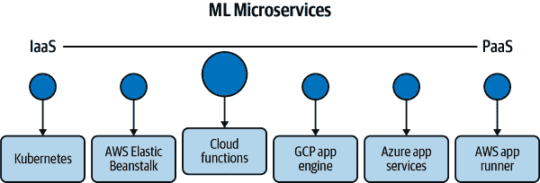

# 第十一章：构建 MLOps 命令行工具和微服务

Alfredo Deza

> 1941 年 12 月 7 日，日本轰炸了珍珠港，立即导致购买轮胎变得不可能，显然需要长途驾驶去加利福尼亚州。我父亲在全国四处寻找旧轮胎给福特车和我们小型房车使用，我们曾多次用它进行短途家庭旅行。1942 年 2 月，我们离开辛辛那提，车顶和房车顶上绑着 22 个轮胎，在抵达加利福尼亚之前，我们都用光了这些轮胎。
> 
> Joseph Bogen 博士

多年前，我开始使用 Python 时是通过构建命令行工具，我认为这是软件开发和机器学习的完美交集。我记得多年前，我作为系统管理员努力学习新的 Python 概念时感到非常陌生：函数、类、日志记录和测试。作为系统管理员，我主要接触到使用 Bash 编写从上到下的指令来完成任务。

使用 shell 脚本尝试解决问题存在几个困难。处理错误并进行直接报告、记录和调试，这些特性在像 Python 这样的其他语言中并不需要花费太多精力。其他几种语言如 Go 和 Rust 也提供了类似的功能，这就暗示了为什么使用非命令语言如 Bash 是个好主意。我倾向于推荐在几行代码就能完成任务时使用 shell 脚本语言。例如，这个 shell 函数会将我的公共 SSH 密钥复制到远程机器的授权密钥中，从而允许我的账号无需密码即可访问该远程服务器：

```
ssh-copy-key() {
  if [ $2 ]; then
      key=$2
  else
      key="$HOME/.ssh/id_rsa.pub"
  fi
  cat "$key" | ssh ${1} \
      'umask 0077; mkdir -p .ssh; cat >> .ssh/authorized_keys'
}
```

###### 注意

这个示例 Bash 函数可能在你的环境中表现不佳。如果你想尝试，路径和配置文件需要匹配。

使用 Python 等语言做同样的事情可能没有多大意义，因为它可能需要更多的代码行和可能还要安装一些额外的依赖。这个函数很简单，只做一件事，而且非常易于移植。我建议，当解决方案超过十几行时，不要仅限于使用 shell 脚本语言。

###### 提示

如果你经常创建小的 shell 命令片段，建议创建一个存储库来收集它们。[这个存储库](https://oreil.ly/NQTfW)的别名、函数和配置应该能为你提供一个很好的参考起点。

我学习 Python 的方法是通过使用命令行工具自动化繁琐重复的任务，从创建客户网站使用模板到在公司服务器上添加和删除用户。我建议你投入学习的方法是找到一个有直接利益的有趣问题。这种学习方式与我们在学校学习的方式完全不同，它并不一定适用于任何情况，但非常适合本章内容。

根据您创建命令行工具的方式，它们可以很容易地安装。例如，一个应该在任何 Unix 环境中轻松运行的 shell 命令的示例，它与容器和微服务具有相似性。因为容器将依赖项捆绑在一起，所以在启用适当运行时的任何系统中都可以正常工作。我们已经介绍了一些“容器”中的微服务组件，描述了与单片应用程序的一些关键区别。

但是微服务不仅限于容器，几乎所有云提供商都提供了*无服务器*解决方案。无服务器允许开发者专注于编写小型应用程序，而不必担心底层操作系统、其依赖项或运行时。尽管这种提供可能显得过于简单，但你可以利用这个解决方案来创建完整的 HTTP API 或类似管道的工作流。你可以将所有这些组件和技术与命令行以及云提供商的某些 ML 特性联系起来。这些技术的混合搭配意味着工程师可以用很少的代码为棘手的问题创造出创新的解决方案。每当你能自动化任务并增强生产力时，你都在应用扎实的运营技能来帮助你稳健地将模型投入到生产中。

# Python 打包

许多有用的 Python 命令行工具最初都是一个单独的脚本文件，然后随着时间推移，它们往往会发展成更复杂的场景，涉及其他文件和可能的依赖项。直到脚本需要额外的库才不再将脚本保持不打包成为不可行的情况。Python 的打包并不是很好。这让我痛苦地说，经过十多年的 Python 经验之后，但是打包仍然是语言生态系统中充满棘手（未解决）问题的一个方面。

如果你正在尝试一些自动化且*没有外部依赖*的操作，那么一个单独的 Python 脚本就可以了，无需打包。然而，如果你的脚本需要其他依赖项并且可能由多个文件组成，那么无疑应该考虑打包。一个正确打包的 Python 应用程序的另一个有用特性是它可以发布到[Python 软件包索引](https://pypi.org)，这样其他人就可以使用像*pip*（Python 的软件包安装器）这样的工具安装它。

几年前，在系统上安装 Python 包是一个问题：它们是无法移除的。这在今天听起来难以置信，但这是“虚拟环境”火起来的许多原因之一。有了虚拟环境，修复依赖关系就像删除一个目录一样容易——同时保持系统包的完整性。如今，卸载 Python 包更加容易（并且可能！），但依赖关系解决仍然缺乏鲁棒性。因此，虚拟环境被建议作为工作在 Python 项目上的方式，因此环境是完全隔离的，你可以通过创建一个新环境来解决依赖问题。

这本书（以及 Python 生态系统的其他地方）推荐使用*virtualenv*模块，这并不奇怪。自从 Python 3 开始，创建和激活虚拟环境的常用方法是直接使用*Python*可执行文件：

```
$ python -m venv venv
$ source venv/bin/activate
```

要验证虚拟环境是否已激活，Python 可执行文件现在应与系统 Python 不同：

```
$ which python
/tmp/venv/bin/python
```

我建议使用适当的 Python 打包技术，这样当需要时你就做好了充分的准备。一旦你的命令行工具需要一个依赖，它就已经准备好被声明为一个要求。你的工具的使用者也将解决这些依赖关系，使得其他人更容易使用你的创作。

# Requirements 文件

正如你将在本章后面的部分看到的，定义依赖关系的两种流行方式之一是使用*requirements.txt*文件。安装程序工具可以使用这个文件像*pip*一样从包索引安装依赖项。在这个文件中，依赖关系在单独的行上声明，并且可选地带有一些版本约束。在这个例子中，Click 框架没有约束，因此安装程序（`pip`）将使用最新版本。Pytest 框架被*固定*到一个特定版本，所以`pip`将始终尝试在安装时找到该特定版本：

```
# requirements.txt
click
pytest==5.1.0
```

要从*requirements.txt*文件安装依赖项，你需要使用`pip`：

```
$ pip install -r requirements.txt
```

虽然没有严格的命名规则，但你通常可以在名为*requirements.txt*的纯文本文件中找到依赖项。项目维护者也可以定义多个包含依赖项的文本文件。例如，当开发依赖项与生产中的依赖项不同时，这种情况更为普遍。正如你将在下一节看到的那样，还有一个可以安装依赖项的*setup.py*文件。这是 Python 打包和依赖管理状态的一个不幸副作用。这两个文件都可以实现为 Python 项目安装依赖项的目标，但只有*setup.py*可以打包 Python 项目以进行分发。由于*setup.py*文件在 Python 安装时执行，它允许除安装任务以外的任何操作。我不建议扩展*setup.py*以执行除打包任务以外的任何操作，以避免在分发应用程序时出现问题。

一些项目更喜欢在*requirements.txt*文件中定义它们的依赖项，然后重复使用该文件的内容到*setup.py*文件中。你可以通过读取*requirements.txt*并使用`dependencies`变量来实现这一点：

```
with open("requirements.txt", "r") as _f:
    dependencies = _f.readlines()
```

区分这些打包文件并了解它们的背景对于防止混淆和误用是有用的。现在，你应该更容易分辨出一个项目是用于分发（*setup.py*）还是一个不需要安装的服务或项目。

# 命令行工具

Python 语言的一个特性是能够快速创建几乎包括任何你可以想象的应用程序，从发送 HTTP 请求到处理文件和文本，再到对数据流进行排序。可用的库生态系统非常庞大。科学界已将 Python 视为解决包括机器学习在内的工作负载的顶级语言之一，这似乎并不令人意外。

开发命令行工具的一个优秀方法是识别需要解决的特定情况。下次遇到稍微重复的任务时，试着构建一个命令行工具来自动化生成结果的步骤。自动化是 DevOps 的另一个核心原则，你应该尽可能（并且在合理的情况下）将其应用于 ML 中的任务。虽然你可以创建一个单独的 Python 文件并将其用作命令行工具，但本节的示例将使用适当的打包技术，使你能够定义所需的依赖关系，并使用像`pip`这样的 Python 安装程序安装工具。在第一个示例工具中，我将详细展示这些 Python 模式，以便理解可以应用于本章其余部分的命令行工具背后的思想。

## 创建数据集检查器

在创建本书时，我决定组合一个葡萄酒评分和描述的数据集。我找不到类似的数据，所以开始收集这个数据集的信息。一旦数据集有了足够多的条目，下一步就是可视化信息并确定数据的健壮性。与初始数据状态一样，这个数据集呈现了几个需要正确识别的异常情况。

一个问题是，在将数据加载为 Pandas 数据帧之后，很明显其中一列是无法使用的：几乎所有条目都是 `NaN`（也称为空条目）。另一个可能是最糟糕的问题是，我将数据集加载到 Azure ML Studio 中执行一些自动 ML 任务时，结果开始出现一些令人惊讶的结果。尽管数据集有六列，但 Azure 报告大约有四十列。

最后，*pandas* 在保存处理后的数据时添加了未命名的列，而我并不知情。该数据集可用于演示问题。首先将 CSV（逗号分隔值）文件加载为 *pandas* 数据框：

```
import pandas as pd
csv_url = (
  "https://raw.githubusercontent.com/paiml/wine-ratings/main/wine-ratings.csv"
)
# set index_col to 0 to tell pandas that the first column is the index
df = pd.read_csv(csv_url, index_col=0)
df.head(-10)
```

*pandas* 的表格输出看起来很棒，但暗示着可能有一列是空的：

```
                 name  grape          region     variety  rating  notes
...               ...    ...             ...         ...     ...  ...
32765  Lewis Cella...    NaN  Napa Valley...  White Wine    92.0  Neil Young'..
32766  Lewis Cella...    NaN  Napa Valley...  White Wine    93.0  From the lo..
32767  Lewis Cella...    NaN  Napa Valley...  White Wine    93.0  Think of ou..
32768  Lewis Cella...    NaN  Napa Valley...    Red Wine    92.0  When asked ..
32769  Lewis Cella...    NaN  Napa Valley...  White Wine    90.0  The warm, v..

[32770 rows x 6 columns]
```

在描述数据集时，其中一个问题显而易见：*grape* 列中没有任何项目：

```
In [13]: df.describe()
Out[13]:
       grape        rating
count    0.0  32780.000000
mean     NaN     91.186608
std      NaN      2.190391
min      NaN     85.000000
25%      NaN     90.000000
50%      NaN     91.000000
75%      NaN     92.000000
max      NaN     99.000000
```

删除有问题的列，并将数据集保存到新的 CSV 文件中，这样您就可以在无需每次下载内容的情况下操作数据：

```
df.drop(['grape'], axis=1, inplace=True)
df.to_csv("wine.csv")
```

重新读取文件显示了 *pandas* 添加的额外列。为了重现这个问题，重新读取本地的 CSV 文件，将其另存为新文件，然后查看新创建文件的第一行：

```
df = pd.read_csv('wine.csv')
df.to_csv('wine2.csv')
```

查看 *wine2.csv* 文件的第一行以发现新列：

```
$ head -1 wine2.csv
,Unnamed: 0,name,region,variety,rating,notes
```

Azure 的问题更为复杂，而且很难检测：Azure ML 将其中一个列中的换行符和回车符解释为新列。要找到这些特殊字符，我不得不配置我的编辑器以显示它们（通常情况下它们是看不见的）。在这个例子中，回车符显示为 `^M`：

```
"Concentrated aromas of dark stone fruits and toast burst^M
from the glass. Classic Cabernet Sauvignon flavors of^M
black cherries with subtle hints of baking spice dance^M
across the palate, bolstered by fine, round tannins. This^M
medium bodied wine is soft in mouth feel, yet long on^M
fruit character and finish."^M
```

在删除没有项目的列、删除未命名列并消除回车符后，数据现在处于更健康的状态。现在我已经尽到了清理的责任，我希望能自动捕捉这些问题。也许一年后我会忘记处理 Azure 中的额外列或者一个带有无用值的列。让我们创建一个命令行工具来导入 CSV 文件并生成一些警告。

创建一个名为 *csv-linter* 的新目录，并添加一个像这样的 *setup.py* 文件：

```
from setuptools import setup, find_packages

setup(
    name = 'csv-linter',
    description = 'lint csv files',
    packages = find_packages(),
    author = 'Alfredo Deza',
    entry_points="""
 [console_scripts]
 csv-linter=csv_linter:main
 """,
    install_requires = ['click==7.1.2', 'pandas==1.2.0'],
    version = '0.0.1',
    url = 'https://github.com/paiml/practical-mlops-book',
)
```

此文件允许 Python 安装程序捕获 Python 包的所有详细信息，如依赖关系以及在本例中名为*csv-linter*的新命令行工具的可用性。`setup` 调用中的大多数字段都很简单，但值得注意的是 `entry_points` 的细节。这是 *setuptools* 库的一个特性，允许在 Python 文件中定义一个函数，将其映射回命令行工具名称。在这种情况下，我命名了命令行工具为*csv-linter*，并将其映射到稍后我将在名为 *csv_linter.py* 的文件中创建的一个名为 `main` 的函数。虽然我选择了*csv-linter*作为工具的名称，但它可以用任何名称命名。在幕后，*setuptools* 库将使用此处声明的任何内容创建可执行文件。命名与 Python 文件相同并无限制。

打开一个名为 *csv_linter.py* 的新文件，并添加一个使用 Click 框架的单个函数：

```
import click

@click.command()
def main():
    return
```

###### 注意

即使示例中没有明确提到使用 Python 的虚拟环境，创建一个总是一个好主意。拥有虚拟环境是隔离依赖项和可能与系统中安装的其他库存在问题的强大方式。

这两个文件几乎是创建一个命令行工具所需的全部内容（目前）仅提供在 shell 路径中可用的可执行文件。接下来，创建一个虚拟环境并激活它以安装新创建的工具：

```
$ python3 -m venv venv
$ source venv/bin/activate
$ python setup.py develop
running develop
running egg_info
...
csv-linter 0.0.1 is already the active version in easy-install.pth
...
Using /Users/alfredo/.virtualenvs/practical-mlops/lib/python3.8/site-packages
Finished processing dependencies for csv-linter==0.0.1
```

*setup.py* 脚本有许多不同的方式可以调用，但您主要将使用我在示例中使用的 `install` 参数或 `develop` 参数之一。使用 `develop` 允许您对脚本源代码进行更改，并使这些更改自动在脚本中可用，而 `install` 则会创建一个独立的（或独立的）脚本，与源代码没有关联。在开发命令行工具时，我建议使用 `develop` 快速测试进展中的更改。调用 *setup.py* 脚本后，通过传递 `--help` 标志来测试新可用的工具：

```
$ csv-linter --help
Usage: csv-linter [OPTIONS]

Options:
  --help  Show this message and exit.
```

在不必编写帮助菜单的情况下获得一个是非常棒的功能，而这是其他几个命令行工具框架提供的特性。现在，该工具作为终端中的脚本可用，是时候添加一些有用的功能了。为了保持简单，此脚本将接受一个 CSV 文件作为单个参数。Click 框架具有内置的帮助程序，用于接受文件作为参数，确保文件存在，否则会产生有用的错误。更新 *csv_linter.py* 文件以使用此帮助程序：

```
import click

@click.command()
@click.argument('filename', type=click.Path(exists=True))
def main():
    return
```

虽然脚本尚未使用文件做任何事情，但帮助菜单已更新以反映选项：

```
$ csv-linter --help
Usage: csv-linter [OPTIONS] FILENAME
```

仍然，没有做什么有用的事情。检查如果传递一个不存在的 CSV 文件会发生什么：

```
$ csv-linter bogus-dataset.csv
Usage: csv-linter [OPTIONS] FILENAME
Try 'csv-linter --help' for help.

Error: Invalid value for 'FILENAME': Path 'bogus-dataset.csv' does not exist.
```

通过使用传递给 `main()` 函数的 `filename` 参数进一步使用 Pandas 描述数据集的工具：

```
import click
import pandas as pd

@click.command()
@click.argument('filename', type=click.Path(exists=True))
def main(filename):
    df = pd.read_csv(filename)
    click.echo(df.describe())
```

脚本使用了 Pandas，以及另一个名为*echo*的 Click 助手，它允许我们轻松地将输出打印回终端。使用在处理数据集时保存的*wine.csv*文件作为输入：

```
$ csv-linter wine.csv
         Unnamed: 0  grape        rating
count  32780.000000    0.0  32780.000000
mean   16389.500000    NaN     91.186608
std     9462.915248    NaN      2.190391
min        0.000000    NaN     85.000000
25%     8194.750000    NaN     90.000000
50%    16389.500000    NaN     91.000000
75%    24584.250000    NaN     92.000000
max    32779.000000    NaN     99.000000
```

尽管如此，这并不是*太有帮助*，即使现在可以轻松地使用 Pandas 描述任何 CSV 文件。我们需要解决的问题是警告我们三个潜在问题：

+   检测零计数列

+   当存在`Unnamed`列时发出警告

+   检查字段中是否有换行符

让我们从检测零计数列开始。Pandas 允许我们迭代其列，并有一个我们可以利用的`count()`方法来实现这个目的：

```
In [10]: for key in df.keys():
    ...:     print(df[key].count())
    ...:
    ...:
32780
0
32777
32422
32780
32780
```

将循环调整为一个单独的函数，与*csv_linter.py*文件中的`main()`函数隔离开，以保持代码的可读性：

```
def zero_count_columns(df):
    bad_columns = []
    for key in df.keys():
        if df[key].count() == 0:
            bad_columns.append(key)
    return bad_columns
```

`zero_count_columns()`函数接受来自 Pandas 的数据框作为输入，捕获所有零计数的列，并在最后返回它们。它是隔离的，并且尚未与`main()`函数协调输出。因为它返回列名的列表，所以在`main()`函数中遍历结果的内容：

```
@click.command()
@click.argument('filename', type=click.Path(exists=True))
def main(filename):
    df = pd.read_csv(filename)
    # check for zero count columns
    for column in zero_count_columns(df):
        click.echo(f"Warning: Column '{column}' has no items in it")
```

对相同的 CSV 文件运行脚本（请注意，我已经删除了`.describe()`调用）：

```
$ csv-linter wine-ratings.csv
Warning: Column 'grape' has no items in it
```

在 19 行时，如果在将数据发送到 ML 平台之前使用了这个脚本，它已经为我节省了大量时间。接下来，创建另一个函数，循环遍历列以检查`Unnamed`列：

```
def unnamed_columns(df):
    bad_columns = []
    for key in df.keys():
        if "Unnamed" in key:
            bad_columns.append(key)
    return len(bad_columns)
```

在这种情况下，该函数检查名称中是否存在字符串`"Unnamed"`，但不返回名称（因为我们假设它们都是相似的甚至相同的），而是返回总计数。有了这些信息，扩展`main()`函数以包含计数：

```
@click.command()
@click.argument('filename', type=click.Path(exists=True))
def main(filename):
    df = pd.read_csv(filename)
    # check for zero count columns
    for column in zero_count_columns(df):
        click.echo(f"Warning: Column '{column}' has no items in it")
    unnamed = unnamed_columns(df)
    if unnamed:
        click.echo(f"Warning: found {unnamed} columns that are Unnamed")
```

再次运行工具，针对相同的 CSV 文件检查结果：

```
$ csv-linter wine.csv
Warning: Column 'grape' has no items in it
Warning: found 1 column that is Unnamed
```

最后，也许最难检测的是在大文本字段内查找换行符。这个操作可能会很昂贵，具体取决于数据集的大小。虽然有更高效的方法来完成迭代，但下一个示例将尝试使用最直接的方法。创建另一个函数，在 Pandas 数据框上执行这项工作：

```
def carriage_returns(df):
    for index, row in df.iterrows():
        for column, field in row.iteritems():
            try:
                if "\r\n" in field:
                    return index, column, field
            except TypeError:
                continue
```

这个循环防止了`TypeError`的产生。如果函数对不同类型（如整数）进行字符串检查，那么将会引发`TypeError`。由于该操作可能代价高昂，函数在第一个换行符的迹象出现时跳出循环。最后，循环返回索引、列和整个字段，以供`main()`函数报告。现在更新脚本，包括对换行符的报告：

```
@click.command()
@click.argument('filename', type=click.Path(exists=True))
def main(filename):
    df = pd.read_csv(filename)
    for column in zero_count_columns(df):
        click.echo(f"Warning: Column '{column}' has no items in it")
    unnamed = unnamed_columns(df)
    if unnamed:
        click.echo(f"Warning: found {unnamed} columns that are Unnamed")

    carriage_field = carriage_returns(df)
    if carriage_field:
        index, column, field = carriage_field
        click.echo((
           f"Warning: found carriage returns at index {index}"
           f" of column '{column}':")
        )
        click.echo(f"         '{field[:50]}'")
```

测试这个最后一个检查是棘手的，因为数据集不再有换行符了。[本章的存储库](https://oreil.ly/aaevY)包含一个带有换行符的示例 CSV 文件。将该文件下载到本地，并将*csv-linter*工具指向该文件：

```
$ csv-linter carriage.csv
Warning: found carriage returns at index 0 of column 'notes':
         'Aged in French, Hungarian, and American Oak barrel'
```

为了防止在输出中打印出一个极长的字段，警告消息只显示前 50 个字符。这个命令行工具利用了 Click 框架进行命令行工具功能和 Pandas 进行 CSV 检查。尽管它只进行了三次检查且性能不是很好，但它对我来说防止使用数据集时出现问题是非常宝贵的。确保数据集处于可接受状态还有多种其他方法，但这是一个很好的示例，展示了如何自动化（和预防）您遇到的问题。自动化是 DevOps 的基础，命令行工具是开始自动化路径的一个很好的方式。

## 将命令行工具模块化

之前的命令行工具展示了如何使用 Python 的内部库从单个 Python 文件创建脚本。但是完全可以使用包含多个文件的目录来创建一个命令行工具。当单个脚本的内容开始变得难以阅读时，这种方法更为可取。在什么情况下应该将一个长文件分割为多个文件没有明确的硬性限制；我建议在代码共享通用职责的情况下进行分组和分离，尤其是在需要代码重用时。在某些情况下，可能没有代码重用的用例，但是分割一些代码片段仍然有助于提高可读性和维护性。

让我们重复使用 *csv-linter* 工具的示例，将单文件脚本调整为目录中的多个文件。第一步是创建一个带有 *__init__.py* 文件的目录，并将 *csv_linter.py* 文件移动到其中。使用 *__init__.py* 文件告诉 Python 将该目录视为一个模块。现在的结构应该如下所示：

```
$ tree .
.
├── csv_linter
│   ├── __init__.py
│   └── csv_linter.py
├── requirements.txt
└── setup.py

1 directory, 4 files
```

到目前为止，在 Python 文件中不再需要重复工具的名称，因此将其重命名为更模块化且不那么与工具名称相关的内容是没有必要的。我通常建议使用 *main.py*，因此请将文件重命名为：

```
$ mv csv_linter.py main.py
$ ls
__init__.py main.py
```

再次尝试使用 `csv_linter` 命令。由于文件被移动了，工具现在应该处于一个破碎的状态：

```
$ csv-linter
Traceback (most recent call last):
  File ".../site-packages/pkg_resources/__init__.py", line 2451, in resolve
    return functools.reduce(getattr, self.attrs, module)
AttributeError: module 'csv_linter' has no attribute 'main'
```

这是因为 *setup.py* 文件指向一个不再存在的模块。更新该文件，使其在 *main.py* 文件中找到 `main()` 函数：

```
from setuptools import setup, find_packages

setup(
    name = 'csv-linter',
    description = 'lint csv files',
    packages = find_packages(),
    author = 'Alfredo Deza',
    entry_points="""
 [console_scripts]
 csv-linter=csv_linter.main:main
 """,
    install_requires = ['click==7.1.2', 'pandas==1.2.0'],
    version = '0.0.1',
    url = 'https://github.com/paiml/practical-mlops-book',
)
```

更改可能很难发现，但是 `csv-linter` 的入口现在是 `csv_linter.main:main`。这个变化意味着 *setuptools* 应该查找一个包含 `main()` 函数的 *main* 模块的 *csv_linter* 包。语法有点棘手（我总是不得不查一下），但掌握变化的细节有助于可视化事物是如何联系在一起的。安装过程仍然保留了所有旧的引用，因此您必须再次运行 *setup.py* 才能使其正常运行：

```
$ python setup.py develop
running develop
Installing csv-linter script to /Users/alfredo/.virtualenvs/practical-mlops/bin
...
Finished processing dependencies for csv-linter==0.0.1
```

现在*csv-linter*工具已经恢复正常，让我们将*main.py*模块拆分为两个文件，一个用于检查，另一个仅用于命令行工具工作。创建一个名为*checks.py*的新文件，并将从*main.py*移动到此新文件的检查函数：

```
# in checks.py

def carriage_returns(df):
    for index, row in df.iterrows():
        for column, field in row.iteritems():
            try:
                if "\r\n" in field:
                    return index, column, field
            except TypeError:
                continue

def unnamed_columns(df):
    bad_columns = []
    for key in df.keys():
        if "Unnamed" in key:
            bad_columns.append(key)
    return len(bad_columns)

def zero_count_columns(df):
    bad_columns = []
    for key in df.keys():
        if df[key].count() == 0:
            bad_columns.append(key)
    return bad_columns
```

现在更新*main.py*，从*checks.py*文件中导入检查函数。新更新的主模块现在应该像这样：

```
import click
import pandas as pd
from csv_linter.checks import
     carriage_returns,
     unnamed_columns,
     zero_count_columns

@click.command()
@click.argument('filename', type=click.Path(exists=True))
def main(filename):
    df = pd.read_csv(filename)
    for column in zero_count_columns(df):
        click.echo(f"Warning: Column '{column}' has no items in it")
    unnamed = unnamed_columns(df)
    if unnamed:
        click.echo(f"Warning: found {unnamed} columns that are Unnamed")
    carriage_field = carriage_returns(df)
    if carriage_field:
        index, column, field = carriage_field
        click.echo((
           f"Warning: found carriage returns at index {index}"
           f" of column '{column}':")
        )
        click.echo(f"         '{field[:50]}'")
```

模块化是保持代码简短和可读性的好方法。当工具以这种方式分离关注点时，更容易进行维护和推理。有许多次我不得不处理那些没有任何好理由长达*数千*行的旧脚本。现在脚本状态良好后，我们可以进一步探索微服务并深入了解这些概念。

# 微服务

正如我在本章开头提到的，微服务是一种与旧式单体应用完全对立的新型应用范式。特别是对于 ML 操作，尽可能地从将模型投入生产的过程中隔离责任非常关键。隔离组件可以为在其他地方的可重用性铺平道路，不仅限于单一模型的特定流程。

我倾向于将微服务和可重用组件视为俄罗斯方块拼图的一部分。一个单体应用就像是一个非常高的俄罗斯方块塔，许多部件一起工作以使其稳固，但存在一个主要缺陷：不要试图触及可能导致整体崩溃的任何东西。另一方面，如果这些部件被尽可能牢固地组合在一起（就像拼图游戏的开始），那么移除部件并将其重新用于不同位置就会变得简单。

软件工程师通常会快速创建与手头任务紧密耦合的实用工具。例如，一些逻辑从字符串中删除某些值，然后可以将其持久化到数据库中。一旦少数行代码证明其价值，思考如何为其他代码基础组件实现重用就变得非常有用。我倾向于在我的项目中有一个实用模块，其中包含常见的实用程序，以便应用程序中需要相同设施的其他部分可以导入和重用它们。

与容器化类似，微服务允许更多地集中精力解决问题本身（代码），而不是环境（例如操作系统）。创建微服务的一个优秀解决方案是使用无服务器技术。云提供商的无服务器产品有许多不同的名称（例如 lambda 和云函数），但它们都指的是同一件事情：创建一个带有一些代码的单个文件，并立即部署到云上——不需要担心底层操作系统或其依赖关系。只需从下拉菜单中选择一个运行时，比如 Python 3.8，并点击一个按钮。事实上，大多数云提供商允许您直接在浏览器中创建函数。这种类型的开发和供应方式是相当革命性的，并且它已经使得之前非常复杂的应用程序模式变得可行。

无服务器的另一个关键方面是，您可以轻松访问大多数云提供商的提供。对于 ML 来说，这是至关重要的：您需要执行一些计算机视觉操作吗？无服务器部署可以在不到十几行代码的情况下完成。这种在云中利用 ML 操作的方式为您提供了速度、稳健性和可重现性：这些都是 DevOps 原则的重要组成部分。大多数公司不需要从头开始创建自己的计算机视觉模型。短语“站在巨人的肩膀上”完美地描述了这些可能性。多年前，我曾在一个数字媒体机构工作过，与一个拥有十几名 IT 人员的团队一起决定自行运行他们的电子邮件服务器。运行电子邮件服务器（正确地）需要大量的知识和持续的努力。电子邮件是一个*具有挑战性的问题*。我可以告诉你，邮件经常会停止工作——事实上，这几乎是每月一次的事件。

最后，让我们看看在云提供商上构建基于 ML 的微服务有多少选择。它们通常从更多的 IaaS（基础设施即服务）到更多的 PaaS（平台即服务）范围不等。例如，在图 11-1 中，Kubernetes 是一个部署微服务的较低级和复杂技术。在其他场景中，像本书前面介绍的 AWS App Runner，您可以将您的 GitHub 存储库指向该服务，并点击几个按钮即可获得完全部署的持续交付平台。在中间某处是云函数。



###### 图 11-1\. 云 ML 微服务

您公司的核心竞争力是什么？如果不是最先进的计算机视觉模型，那就不要自己创建。同样，要聪明工作，而不是努力工作，并建立在像 AWS App Runner 或 Google Cloud Run 这样的高级系统之上。最后，抵制重复发明轮子的冲动，利用云微服务。

## 创建无服务器函数

大多数云提供商在其无服务器环境中公开其 ML 服务。计算机视觉、自然语言处理和推荐服务只是其中的几个。在本节中，您将使用翻译 API 利用全球最强大的语言处理服务之一。

###### 注意

对于这个无服务器应用程序，我将使用[谷歌云平台](https://oreil.ly/IO8oP)（GCP）。如果您之前没有注册过它，您可能会获得一些免费的信用额度来尝试本节的示例，尽管根据当前的限制，您仍然可以部署云函数而不会产生任何费用。

登录 GCP 后，从左侧边栏的“计算”部分下选择“云函数”，如图 11-2 所示。


###### 图 11-2\. 云函数侧边栏

如果您之前没有创建过函数，会显示一个欢迎消息，指引您创建一个链接。如果您已经部署了一个函数，否则将可用一个“创建函数”按钮。通过 UI 创建和部署函数仅涉及几个步骤。图 11-3 是您可以期待填写的表单。


###### 图 11-3\. 创建一个云函数

Basics 部分的默认值已足够。在这种情况下，表单预填了 *function-1* 作为名称，并使用 *us-central1* 作为区域。确保将触发器类型设置为 HTTP，并且需要进行身份验证。单击“保存”，然后单击页面底部的“下一步”按钮。

###### 警告

虽然允许对函数进行未经身份验证的调用（并且只需在 Web 表单中选择该选项就可以），但我强烈建议您永远不要在未启用身份验证的情况下部署云函数。未经身份验证的公开服务可能会被滥用，这对于您的帐户和预算都会产生重大的财务影响。由于云函数的使用直接与您的帐户和预算相关，未经授权的使用可能会带来重大的财务影响。

进入“代码”部分后，您可以选择一个运行时和一个入口点。选择 Python 3.8，将入口点更改为使用 *main*，并更新函数名称以使用 `main()` 而不是 `hello_world()`，如图 11-4 所示。


###### 图 11-4\. 云函数代码

选择应用程序入口点的能力，打开了创建其他辅助主函数或确定与代码交互的其他命名约定的可能性。灵活性很好，但具有默认值和使用约定更有价值。完成必要的更改后，单击“部署”按钮将此功能部署到生产环境。一旦完成，该函数应显示在云函数仪表板上。

部署后，让我们通过发送 HTTP 请求与之交互。有许多方法可以实现这一点。要开始，请点击所选函数的“操作”，然后选择“测试函数”。加载新页面，尽管一开始可能很难看到，但“触发事件”部分是您添加要发送的请求主体的地方。由于函数正在寻找`"message"`键，因此请更新主体以包含像图 11-5 所示的消息，然后点击“测试函数”按钮。


###### 图 11-5\. 云函数代码—触发事件

应该仅需几秒钟即可获得输出，该输出应为`"message"`键的值。除了该输出外，还会显示一些日志，这使得与函数交互变得非常直接。唯一不需要的是进行任何身份验证步骤，尽管函数是启用了身份验证创建的。每当您进行调试并希望快速测试部署的函数时，这无疑是最简单的方式。

此函数接受 JSON（JavaScript 对象表示法）作为输入。尽管在测试时尚不清楚云函数是否使用 HTTP，但这是将输入传递给函数的方式。JSON 有时被称为 Web 开发的*通用语言*，因为编程语言和其他服务和实现可以将 JSON 转换为它们理解的本地结构。

虽然 HTTP API 可以限制请求的类型和主体格式，但通常使用 JSON 进行通信。在 Python 中，您可以将 JSON 加载到像列表和字典这样的本地数据结构中，这些结构易于使用。

在探索与函数交互的其他方法（包括身份验证）之前，让我们利用 Google 的 ML 服务，通过使用其翻译服务。默认情况下，所有来自 Google 云平台的 API 都是禁用的。如果您需要与诸如语言翻译之类的云服务进行交互，则必须在使用之前启用该 API。如果您创建了一个云函数（如本例）并且忘记这样做，这并不是什么大问题。结果会在日志中记录错误，并作为错误响应返回给发出请求的客户端，HTTP 500。

```
google.api_core.exceptions.PermissionDenied: 403 Cloud Translation API has not
   been used in project 555212177956 before or it is disabled.
Enable it by visiting:
  https://console.developers.google.com/apis/api/translate.googleapis.com/
then retry. If you enabled this API recently, wait a few minutes for the
action to propagate to our systems and retry."
```

在进一步修改函数之前，请启用[Cloud Translation API](https://oreil.ly/6SFRs)。GCP 提供的大多数 API 都需要通过[访问 API 和服务链接](https://oreil.ly/eV8sr)并在库页面中找到所需的 API 来启用。

###### 注意

如果您不是 GCP 帐户上的管理员并且看不到可用的 API，则可能缺少启用 API 所需的权限。需要帐户管理员授予您适当的权限。

启用 API 后，点击函数名称返回其仪表板加载页面。在仪表板中，找到页面顶部的编辑按钮以更改源代码。编辑部分首先提供配置函数本身的选项，然后是代码。无需更改部署配置，请点击“下一步”最终进入源代码。点击 *requirements.txt* 链接打开该文件，添加与翻译服务交互所需的 API 库：

```
google-cloud-translate==3.0.2
```

现在点击 *main.py* 编辑内容。添加导入语句以引入翻译服务，并添加一个负责进行翻译的新函数：

```
from google.cloud import translate

def translator(text="YOUR_TEXT_TO_TRANSLATE",
    project_id="YOUR_PROJECT_ID", language="fr"):

    client = translate.TranslationServiceClient()
    parent = f"projects/{project_id}/locations/global"

    response = client.translate_text(
        request={
            "parent": parent,
            "contents": [text],
            "mime_type": "text/plain",
            "source_language_code":"en-US",
            "target_language_code":language,
        }
    )
    # Display the translation for each input text provided
    for translation in response.translations:
        print(u"Translated text: {}".format(translation.translated_text))
    return u"Translated text: {}".format(translation.translated_text)
```

这个新函数需要三个参数来与翻译 API 进行交互：输入文本、项目 ID 和翻译的目标语言（默认为法语）。输入文本默认为英语，但函数可以适应其他语言（例如西班牙语）作为输入和英语作为输出。只要支持该语言，函数就可以使用任意组合的输入和输出。

翻译请求的响应是可迭代的，因此在翻译完成后需要一个循环。

现在修改 `main()` 函数，将 `"message"` 的值传递给 `translator()` 函数。我正在使用自己的项目 ID（*“gcp-book-1”*），所以请确保在尝试下一个示例时更新自己的项目 ID：

```
def main(request):
    request_json = request.get_json()
    if request_json and 'message' in request_json:
        return translator(
            text=request_json['message'],
            project_id="gcp-book-1"
        )
    else:
        return f'No message was provided to translate'
```

`main()` 函数仍然需要在传入的 JSON 请求中分配一个 `"message"` 值，但现在会对其进行有用的操作。在控制台上使用示例 JSON 输入进行测试：

```
{"message": "a message that has been translated!"}
```

测试页面的输出（如 图 11-6 所示）应该几乎是即时的。


###### 图 11-6\. 翻译测试

## 认证 Cloud Functions

我将 HTTP 访问看作是访问民主主义：其他系统和语言都能通过其实现从远程位置的独立服务中使用 HTTP 规范进行交互，具有极大的灵活性。所有主要编程语言都可以构建 HTTP 请求并处理来自服务器的响应。利用 HTTP 将服务整合在一起可以使这些服务以新的方式工作，潜在地可以实现最初没有考虑到的功能。将 HTTP API 视为可插入任何连接到互联网的内容的可扩展功能。但是通过互联网连接存在安全影响，如使用经过身份验证的请求来防止未经授权的访问。

有几种远程与云函数交互的方式。我将从命令行开始，使用*curl*程序。虽然我倾向于不使用*curl*来进行身份验证请求的交互，但它确实提供了一个直接的方式来记录您需要成功提交请求的所有组件。为您的系统[安装 Google Cloud SDK](https://oreil.ly/2l7tA)，然后确定您之前部署的项目 ID 和函数名称。以下示例使用 SDK 和*curl*进行身份验证：

```
$ curl -X POST --data '{"message": "from the terminal!"}' \
  -H "Content-Type: application/json" \
  -H "Authorization: bearer $(gcloud auth print-identity-token)" \
  https://us-central1-gcp-book-1.cloudfunctions.net/function-1
```

在我的系统上，使用*function-1* URL，我得到以下响应：

```
Translated text: du terminal!
```

这个命令看起来非常复杂，但它提供了一个更好的图像，说明了需要成功提交请求的所有组件。首先，它声明请求使用 POST 方法。当请求与负载相关联时，通常会使用此方法。在本例中，`curl`从参数向`--data`标志发送 JSON。接下来，命令添加了两个请求头，一个用于指示发送的内容类型（JSON），另一个用于指示请求提供令牌。令牌是 SDK 发挥作用的地方，因为它为请求创建了一个令牌，云函数服务需要验证请求是否经过身份验证。最后，云函数的 URL 被用作这个经过身份验证的 POST 请求的目标，发送 JSON。

尝试单独运行 SDK 命令，看看它的效果：

```
$ gcloud auth print-identity-token
aIWQo6IClq5fNylHWPHJRtoMu4IG0QmP84tnzY5Ats_4XQvClne-A9coqEciMu_WI4Tjnias3fJjali
[...]
```

现在您了解了请求所需的组件，请直接使用 SDK 来发出请求，以便您能够访问部署的云函数：

```
$ gcloud --project=gcp-book-1 functions call function-1 \
  --data '{"message":"I like coffee shops in Paris"}'
executionId: 1jgd75feo29o
result: "Translated text: J'aime les cafés à Paris"
```

我认为像 Google 这样的云服务提供商包含其他与其服务交互的便利设施是一个很好的主意，就像这里的云函数一样。如果您只是知道 SDK 命令来与云函数交互，使用编程语言例如 Python 构造请求将会变得困难。这些选择提供了灵活性，环境越灵活，就越有可能以最合理的方式进行适应，以满足环境的需求。

现在让我们使用 Python 与翻译器函数进行交互。

###### 注意

以下示例将直接调用 Python 使用`gcloud`命令，快速演示如何创建 Python 代码与云函数进行交互。然而，这并不是处理身份验证的稳健方式。您需要[创建服务账号](https://oreil.ly/qNtoc)并使用*google-api-python-client*来正确地保护身份验证过程。

创建一个名为*trigger.py*的 Python 文件，并添加以下代码以从`gcloud`命令中检索令牌：

```
import subprocess

def token():
    proc = subprocess.Popen(
        ["gcloud",  "auth", "print-identity-token"],
        stdout=subprocess.PIPE)
    out, err = proc.communicate()
    return out.decode('utf-8').strip('\n')
```

`token()`函数将调用`gcloud`命令并处理输出以发出请求。值得重申的是，这是一种快速演示从 Python 触发函数的方法。如果希望在生产环境中实现这一点，则应考虑从*google-api-python-client*创建服务帐户和 OAuth2。

现在使用该令牌创建请求，以与云函数通信：

```
import subprocess
import requests

url = 'https://us-central1-gcp-book-1.cloudfunctions.net/function-1'

def token():
    proc = subprocess.Popen(
        ["gcloud",  "auth", "print-identity-token"],
        stdout=subprocess.PIPE)
    out, err = proc.communicate()
    return out.decode('utf-8').strip('\n')

resp = requests.post(
    url,
    json={"message": "hello from a programming language"},
    headers={"Authorization": f"Bearer {token()}"}
)

print(resp.text)
```

请注意，我已经在脚本中添加了*requests*库（在我的情况下是版本 2.25.1），因此在继续之前，您需要安装它。现在运行*trigger.py*文件来测试它，确保您已经使用您的项目 ID 更新了脚本：

```
$ python trigger.py
Translated text: bonjour d'un langage de programmation
```

## 构建基于云的命令行界面（CLI）

现在您理解了构建命令行工具、打包和分发它以及利用云提供的 ML 服务的概念，很有意思看到这些内容如何结合在一起。在本节中，我将重复使用所有不同的部分来创建一个。创建一个新目录，并将以下内容添加到*setup.py*文件中，以便立即解决打包问题：

```
from setuptools import setup, find_packages

setup(
    name = 'cloud-translate',
    description = "translate text with Google's cloud",
    packages = find_packages(),
    author = 'Alfredo Deza',
    entry_points="""
 [console_scripts]
 cloud-translate=trigger:main
 """,
    install_requires = ['click==7.1.2', 'requests==2.25.1'],
    version = '0.0.1',
    url = 'https://github.com/paiml/practical-mlops-book',
)
```

*setup.py*文件将创建一个*cloud-translate*可执行文件，映射到*trigger.py*文件中的一个`main()`函数。我们还没有创建那个函数，因此请添加在上一节中创建的*trigger.py*文件，并添加该函数：

```
import subprocess
import requests
import click

url = 'https://us-central1-gcp-book-1.cloudfunctions.net/function-2'

def token():
    proc = subprocess.Popen(
        ["gcloud",  "auth", "print-identity-token"],
        stdout=subprocess.PIPE)
    out, err = proc.communicate()
    return out.decode('utf-8').strip('\n')

@click.command()
@click.argument('text', type=click.STRING)
def main(text):
    resp = requests.post(
            url,
            json={"message": text},
            headers={"Authorization": f"Bearer {token()}"})

    click.echo(f"{resp.text}")
```

该文件与最初的*trigger.py*并没有太大的区别，它直接使用 Python 运行。Click 框架允许我们定义一个*text*输入，然后在完成时将输出打印到终端。运行`python setup.py develop`以确保所有东西都被连接在一起，包括依赖项。正如预期的那样，该框架为我们提供了帮助菜单：

```
$ cloud-translate --help
Usage: cloud-translate [OPTIONS] TEXT

Options:
  --help  Show this message and exit.
$ cloud-translate "today is a wonderful day"
Translated text: aujourd'hui est un jour merveilleux
```

# 机器学习 CLI 工作流程

两点之间的最短距离是直线。同样地，命令行工具通常是使用机器学习的最直接方法。在图 11-7 中，您可以看到有许多不同的 ML 技术风格。在无监督机器学习的情况下，您可以“即时训练”；在其他情况下，您可能希望使用每晚训练过的模型，并将其放置在对象存储中。然而，在其他情况下，您可能希望使用 AutoML、AI API 或第三方创建的模型等高级工具。

请注意，有许多不同的问题领域，在这些领域中，通过添加 ML 来增强 CLI 或使 CLI 的整个目的。这些领域包括文本、计算机视觉、行为分析和客户分析。

强调有许多部署命令行工具的目标，其中包括机器学习。像 Amazon EFS、GCP Filestore 或 Red Hat Ceph 这样的文件系统具有作为集中 Unix 挂载点的优势。*bin*目录可以包含通过挂载同一卷的 Jenkins 服务器传递的 ML CLI 工具。

其他交付目标包括 Python Package Repository（PyPI）和像 Docker、GitHub 和 Amazon 这样的公共容器注册表。还有更多的目标包括像 Debian 和 RPM 这样的 Linux 包。一个打包机器学习的命令行工具拥有比微服务甚至更广泛的部署目标收藏，因为一个命令行工具就是一个完整的应用程序。


###### 图 11-7\. 机器学习 CLI 工作流程

适合使用 CLI 进行机器学习的几个好例子包括以下资源：

DevML

[DevML](https://oreil.ly/pMU53) 是一个分析 GitHub 组织的项目，允许机器学习实践者创建自己的“秘密 ML” 预测，可以通过连接到 [streamlit](https://streamlit.io) 或将开发者聚类报告包含在 Amazon QuickSight 中来实现。

Python MLOps Cookbook

[Python MLOps Cookbook GitHub 仓库](https://oreil.ly/4jAUL) 包含一组实用工具作为简单的 ML 模型。本项目在 第七章 中有详细介绍。

Spot 价格机器学习

另一个 ML CLI 示例是关于 Spot 价格机器学习聚类的项目。[在这个 GitHub 仓库中](https://oreil.ly/OiutZ)，使用 AWS Spot 实例的不同属性，包括内存、CPU 和价格，来创建类似的机器类型的聚类。

有了这些 CLI 工作流程，让我们继续总结本章。

# 结论

本章已经介绍了如何从头开始创建命令行工具，并使用框架快速进行自动化工具的创建。即使示例看起来可能很琐碎，但细节和各个部分如何协作是至关重要的方面。在学习新概念或通常让其他人望而却步的主题（如打包）时，很容易感到泄气并试图绕过它们。尽管 Python 在改进打包方面还有很长的路要走，但入门并不难，通过正确打包工具的繁重工作将使您在任何团队中都变得不可或缺。通过打包和命令行工具，您现在已经具备了将不同服务集成到自动化中的良好位置。

本章通过利用云及其众多机器学习服务，例如来自谷歌的强大翻译 API，来实现这一点。记住，没有必要从头开始创建所有模型，尽可能利用云服务提供者的服务，特别是当这不是你公司核心竞争力时。

最后，我想强调的是，能够为棘手的问题制定新解决方案是 MLOps 的超能力，这基于了解如何连接服务和应用程序。正如您现在所知，使用 HTTP、命令行工具和通过它们的 SDK 利用云服务提供者是在几乎任何生产环境中实现重大改进的坚实基础。

在下一章中，我们将深入探讨机器学习工程的其他细节，以及我最喜欢的主题之一：案例研究。案例研究是真实世界中的问题和情况，您可以从中提取有用的经验并今天应用它们。

# 练习

+   在 CLI 中添加一些使用云函数的选项，比如使 URL 可配置。

+   弄清楚服务帐户和 OAuth2 在 Google SDK 中的工作原理，并将其集成到*trigger.py*中，以避免使用*subprocess*模块。

+   通过翻译来自维基百科页面等其他来源来增强云函数。

+   创建一个新的云函数进行图像识别，并使其与命令行工具配合使用。

+   克隆[Python MLOps Cookbook repository](https://oreil.ly/fX1Uu)并构建一个稍微不同的容器化 CLI 工具，将其发布到像 DockerHub 或 GitHub Container Registry 这样的公共容器注册表中。

# 批判性思维讨论问题

+   未经身份验证的云函数可能会带来哪些可能的后果？

+   不使用虚拟环境的一些缺点是什么？

+   描述好的调试技术的两个方面及其有用性。

+   为什么了解打包很有用？打包的一些关键方面是什么？

+   使用云提供商现有模型是个好主意吗？为什么？

+   解释使用公共容器注册表部署由机器学习驱动的开源 CLI 工具与使用 Python 包仓库之间的权衡。
