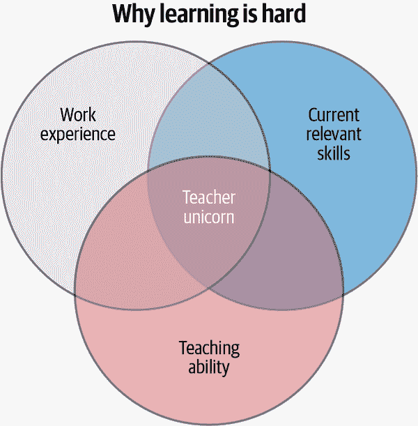
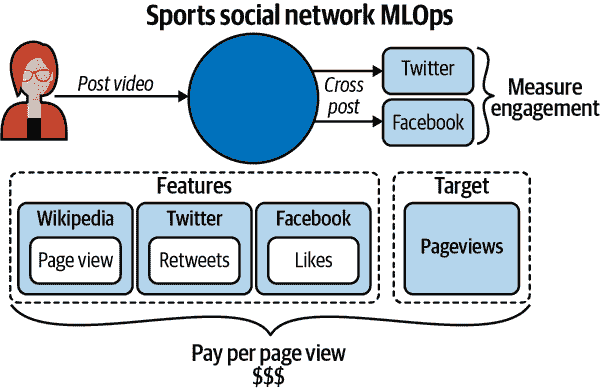
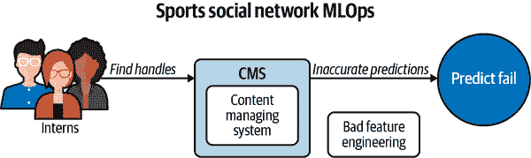
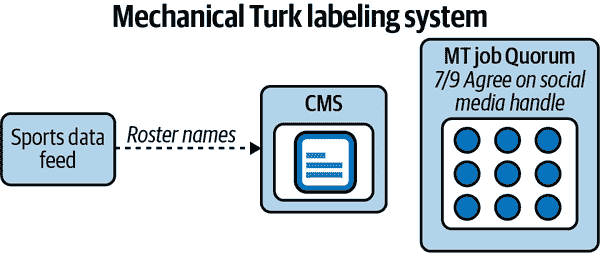
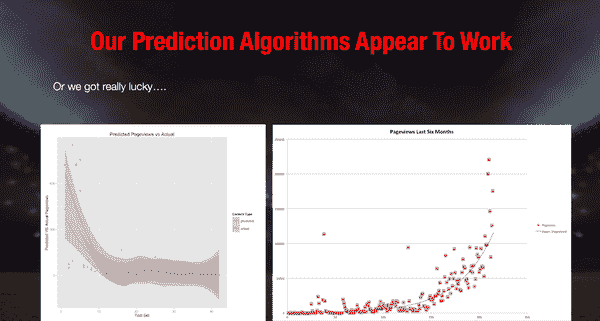
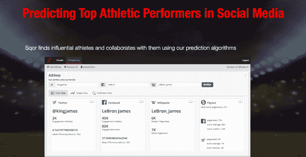
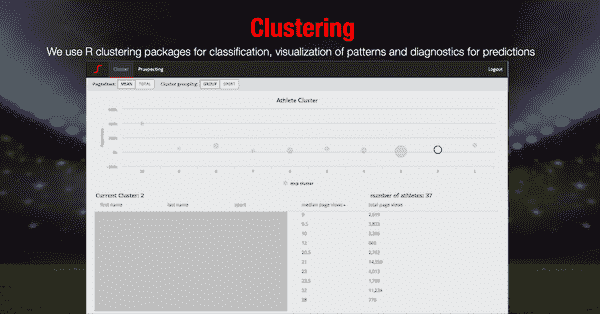
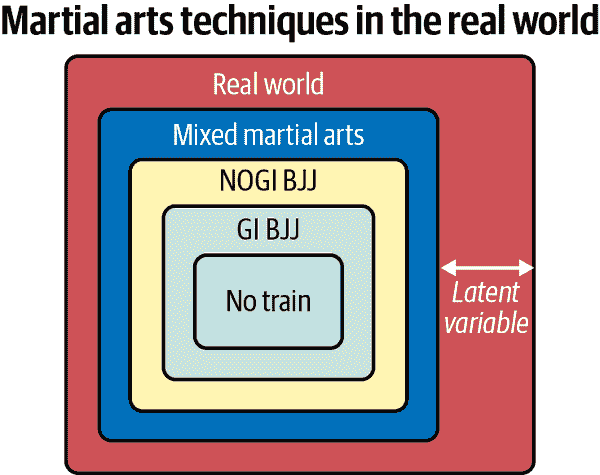

# 第十二章：机器学习工程和 MLOps 案例研究

Noah Gift

> 在陪同洛伊博士完成他的程序后，我在他的术后护理中花了更多时间。在那期间，他继续向我讲课。他在他的小 62 页书上签了我的副本，在他颤抖的手写的签名上面写着：“事实无理论是混乱，理论无事实是幻想。”
> 
> Dr. Joseph Bogen

现实世界中技术的一个基本问题是很难确定该听谁的建议。特别是像机器学习这样的多学科话题更是一个令人费解的挑战。你如何找到既有真实世界经验、又具备当前和相关技能、还能够有效解释的教学能力的正确结合？这种“独角兽”般的教学能力正是本章的目标。本章旨在从这些相关方面提炼出可操作的智慧，用于你的机器学习项目中，如图 12-1 所示。

其他领域也受到多学科领域带来的无限复杂性的困扰。例如营养科学、气候科学和混合武术。然而，一个共同的主题是开放系统与封闭系统的概念。一个主要封闭系统的玩具例子是隔热杯。在这个例子中，由于环境影响最小，所以更容易模拟冷液体的行为。但是如果同样的冷液体放在普通杯子外面，情况很快就变得混乱。外部的空气温度、湿度、风力和阳光照射单独就会在模拟这种冷液体行为中引起连锁复杂性。



###### 图 12-1 独角兽式教学

本章探讨了 MLOps 如何利用这些其他领域的经验教训。它还探讨了封闭系统与开放系统如何影响特定领域的行为，并最终如何将其应用于机器学习的运营。

# 在构建机器学习模型时无知的不太可能的好处

在无知中存在许多不太可能的好处。无知给了你尝试挑战性事物的勇气，如果你知道它有多难，你可能永远不会去做。自 2013 年以来，无知在我同时做的两件事情中起了至关重要的作用：创建了一个涉及数百万美元、包括一家有 100 人的公司在内的生产机器学习模型；并且学习、训练并参与巴西柔术，与排名靠前的职业搏击手和摔跤、柔道奥运选手竞争。在某种程度上，这两件事情是如此交织在一起，以至于在我的心中很难分开它们。从 2010 年到 2013 年，我在旧金山的初创公司全职工作的同时，在加州大学戴维斯分校的 MBA 项目中，我花了三年时间参加了所有可能的统计学、概率论和建模课程。自 2017 年以来，我还在加州大学戴维斯分校的管理研究生院教授机器学习和云计算。毕业后，我准备担任总经理或首席技术官，并成为一家体育社交网络的首批技术员工，担任首席技术官和总经理。

公司文化的一部分是员工们会在一家混合武术健身房一起锻炼，这家健身房也提供一般健身课程。我偶然开始参加巴西柔术训练，因为我对职业搏击手的格斗很好奇。最终，不知不觉中，我与职业搏击手并肩工作，并学会了降服技的基础。有几次，我甚至在练习中意外被使劲压制到昏迷。我记得有一次我想，“我应该轻轻地放弃这个头臂锁。”后来，我想知道我在哪里；看起来像是一个健身房，我不知道是什么年份。当血流回到我的大脑时，我意识到，啊，我被锁喉了，我在加利福尼亚州圣罗莎的武术馆里。

在我最初几年的训练中，我还参加了两次比赛，赢得了第一场“新手”类别的比赛，然后在几年后输掉了一个“中级”类别的比赛。事后来看，老实说，我并不理解当时在做什么，面临着严重受伤的真实风险。我看到很多人在比赛中受到严重伤害，包括头部撞击、肩膀骨折和膝关节韧带撕裂。在我作为 40 岁的人参加第二次比赛时，我在 220 磅级别的体重级别上与一名 20 岁的大学橄榄球运动员竞争。在他的最后一场比赛中，他卷入了一场真正的打斗，被头部撞击，鼻子流血，非常愤怒。我对他情绪状态进入我们的比赛感到担忧，心想，“我到底报了什么名？”

我也感到庆幸，当时对于在三四十岁参加格斗运动的实际危险我是无知的。我仍然喜欢训练和学习巴西柔术，但如果我当时知道今天的知识，我可能不会以当时如此有限的技能去冒险。无知使我有勇气，坦率地说，去冒险，但也更快地学习。

同样，在 2014 年，我在开始为公司构建机器学习基础设施的旅程时和我一样无知。今天这被称为 MLOps。当时关于如何运营机器学习的信息并不多。就像巴西柔术一样，我急于但却不知道真正会发生什么以及涉及的风险。后来，在独自从头开始构建预测模型并负责数百万美元的过程中，我感到的恐惧远不及我在巴西柔术中的恐惧。

在第一年，2013 年，我们公司建立了一个体育社交网络和移动应用程序。但是，像许多初创公司的员工一样，构建软件只是初创公司挑战的一部分；另外两个关键挑战是获取用户和创造收入。到 2014 年初，我们拥有了一个平台，但没有用户和收入。所以我们需要快速吸引用户，否则这个初创公司将会破产。

对于软件平台来说，通常有两种方式来增加流量。一种方式是通过口碑传播建立有机增长。第二种方式是购买广告。购买广告的问题在于它可能很快成为永久的成本分配。我们的梦想情景是让我们的公司不用购买广告就能吸引用户来到我们的平台。我们与一些体育明星有关系，包括前 NFL 四分卫布雷特·法夫尔。这位最初的“超级”社交媒体影响者为我们提供了大量关于如何利用有机的“增长黑客”来扩展我们平台的见解。

在某个时候，这个机器学习反馈循环让我们达到了数百万月活跃用户。然后，Facebook 的法律团队向我们发送了一封通信，形容他们将“取消我们的平台”的意图。我们的“罪行”是创建了与我们平台链接的独特原创体育内容。关于大科技公司潜在的垄断力量以及我们影响算法的增长黑客力量引起了 Facebook 的关注，这是我们的预测系统在现实世界中成功的又一个数据点。接下来我们深入探讨如何做到这一点。

# Sqor 体育社交网络的 MLOps 项目

从零开始建立一家初创公司——即零员工、零用户和零收入——是一项紧张的追求。从 2013 年到 2016 年，我在旧金山 Transamerica 大厦下面的公园里花了很多时间，直接在办公室下面策划这些事情。特别是认识论风险，即我未意识到的风险，即依靠机器学习预测投入数百万美元是令人恐惧的。但在很多方面，技术挑战比心理挑战更容易应对。

这里是系统运行方式的概述。简而言之，用户发布原创内容，然后我们将内容交叉发布到 Twitter 和 Facebook 等其他社交网络上。我们随后收集了为我们的网站生成的页面浏览量。这些页面浏览量成为我们 ML 预测系统的目标。图 12-2 展示了我们社交媒体公司的 MLOps 管道。



###### 图 12-2\. 运动社交网络的 MLOps 管道

后来，我们收集了这些用户的社交媒体信号，即他们的中位数转推数、中位数点赞数和维基百科页面浏览量。这些成为了特征，并帮助我们摆脱“假”粉丝等错误数据的干扰。然后，我们按照他们在我们网站上生成的参与度支付原创内容创作者，如康纳·麦格雷戈、布雷特·法弗尔、蒂姆·麦格劳和阿什林·哈里斯。结果证明，在这方面我们领先于游戏，并且[Snapchat 为用户在其平台上发布原创内容支付了数百万美元](https://oreil.ly/mPQq5)。

问题最具挑战性的部分是可靠地收集数据，然后基于预测决定支付数百万美元。这两者都比我最初想象的复杂得多。所以让我们接下来深入研究这些系统。

## 机械土耳其数据标注

最初发现社交媒体信号给了我们足够的预测能力来“增长黑客”我们的平台是一个巨大的突破。但不幸的是，最艰巨的挑战还在后面等着我们。

我们需要可靠地收集成千上万个“名人”社交媒体用户的账号。不幸的是，最初并不顺利，最终以彻底失败告终。我们的第一个流程看起来像图 12-3。



###### 图 12-3\. 糟糕的特征工程

虽然一些实习生本身是未来的 NFL 球员，但关键问题在于他们没有接受过可靠地输入社交媒体账号的培训。结果，很容易混淆 NFL 球员安东尼·戴维斯和 NBA 球员安东尼·戴维斯，并交换 Twitter 账号。这种特征工程可靠性问题将影响我们模型的准确性。我们通过引入亚马逊机械土耳其的自动化解决了这个问题。我们培训了一群“土耳其人”来查找运动员的社交媒体账号，如果 7/9 的人同意，我们发现这大约等于 99.9999%的准确性。图 12-4 展示了我们社交媒体公司的机械土耳其标签系统。

###### 注意

回到 2014 年，人们对数据工程和 MLOps 的了解较少。我们的标记系统项目涉及到了一位令人惊叹的运动员、程序员和前 UC 戴维斯大学毕业生[Purnell Davis](https://oreil.ly/yc14S)。Purnell 在与像 NFL 球员 Marshawn Lynch 或 300 磅级职业 MMA 格斗选手的公司一起午餐或黎明时分锻炼时，从零开始开发了这个系统。



###### 图 12-4\. 机械土耳其标签

## 影响力排名

一旦我们完成数据标记，我们就必须从社交媒体 API 收集数据。你可以在这个仓库中找到一个将其引入[ML 引擎所需的代码示例](https://oreil.ly/D6Wqb)。

例如，根据我们的数据收集 API，LeBron James 在 Twitter 上的统计数据如下：

```
Get status on Twitter

	df = stats_df(user="KingJames")
	In [34]: df.describe()
	Out[34]:
	 favorite_count retweet_count
	count 200.000000 200.000000
	mean 11680.670000 4970.585000
	std 20694.982228 9230.301069
	min 0.000000 39.000000
	25% 1589.500000 419.750000
	50% 4659.500000 1157.500000
	75% 13217.750000 4881.000000
	max 128614.000000 70601.000000

	In [35]: df.corr()
	Out[35]:
	 favorite_count retweet_count
	favorite_count 1.000000 0.904623
	retweet_count 0.904623 1.000000
```

###### 注意

如果你熟悉 HBO 的节目*The Shop*，你就会认识 Maverick Carter 和 LeBron James。我们“几乎”正式与他们合作过，但谈判并未成功。最终我们与拜仁慕尼黑建立了关键伙伴关系。

然后这些收集的数据输入到了一个预测模型中。我在 2014 年在[R 湾区的 meetup](https://oreil.ly/rI0Sw)上的演讲展示了我们的一些成果。最初的模型使用了 R 库[Caret](https://oreil.ly/MtN0Z)来预测页面浏览量。在图 12-5 中，用于找到影响力者的原始预测算法是用 R 完成的，这个基于 ggplot 的图表显示了预测的准确性。



###### 图 12-5\. 社交媒体影响者预测页面浏览量与实际页面浏览量

然后我们建立了一个以页面浏览量为目标指标的支付系统模型。最终，这导致了指数级的增长，推动了我们每月数百万的页面浏览量的快速扩展。但正如我之前提到的，令人害怕的是那些失眠的夜晚，担心我在帮助创建的预测上花费了数百万美元而导致公司破产。

## 运动员智能（AI 产品）

通过核心 MLOps 管道提供预测并推动我们的增长，而不是购买广告，我们开始将我们的产品发展成一个名为“Athlete Intelligence”的 AI 产品。我们有两位全职的 AI 产品经理负责管理这一产品。这一核心产品的一般理念是让“影响力者”了解他们可以期待的报酬，而品牌可以使用这个仪表板直接与运动员合作。在图 12-6 中，我们使用无监督机器学习来分类运动员的不同方面，包括他们的社交媒体影响力。



###### 图 12-6\. 运动员智能

额外功能包括无监督机器学习，“聚类”了类似的运动员社交资料。这一功能使我们能够将不同类型的运动员打包成影响力营销捆绑包（图 12-7）。



###### 图 12-7\. 运动员智能聚类仪表盘

最后，这种增长为我们的公司带来了两种新的收入产品。首先是基于 Shopify 构建的商品平台，发展成为年销售额 50 万美元的业务；第二是一个千万美元的影响力营销业务。我们直接联系品牌，并将他们与我们平台上的影响者联系起来。一个很好的例子是我们与[Machine Zone 和 Conor McGregor](https://oreil.ly/G6JrI)合作的《Game of War》广告。

简言之，拥有有效的 MLOps 管道使我们同时获得了用户和收入。没有预测模型，我们将没有用户；没有用户，我们将没有收入；没有收入，我们将没有业务。实用的 MLOps 带来丰厚的回报。

让我们在下一节更多地讨论开放与封闭系统。在像学术数据科学、柔道馆内穿着 GI 的环境或理论上的营养建议（比如热量摄入与消耗）这样的受控环境中，事情看起来很简单。然而，现实世界或开放系统有许多额外的影响因素，这些因素要难得多地控制和利用。

# 完美技术与现实世界的对比

巴西柔术黑带在 GI（柔道服）内使用的臂锁（通过超伸肘部断裂手臂的攻击方式）对于没有穿 GI 的对手是否同样有效？同样地，在机器学习中，什么最重要？是准确性、技术，还是能够为客户提供价值或在特定情况下提供知识？

###### 注意

如果你对在比赛中使用臂锁的场景感兴趣，可以搜索“Ronda Rousey armbar”，你将看到一个技术精湛的大师在工作。

在街头斗殴与角力比赛、UFC 比赛与角力比赛之间有什么区别？即使是非专家也会同意，在技术涉及的规则越多的环境中，它在没有或几乎没有规则的现实世界中成功的机会就越小。

我通过在商务出差期间游历美国的随机柔术馆来学到了一个教训。在多次情况下，一个精通穿着无 GI 进行巴西柔术的棕带或黑带专家会与我在无 GI 环境下切磋，并立即试图进行臂锁。我曾花费多年时间与专业的 NOGI 练习的职业选手们训练。在被这一技术收割数百次后，我学会了如何通过特定的方式轻松地摆脱它。我是如何理解这一点的呢？我只是模仿了职业选手们的做法和教导，并一遍又一遍地练习。

许多从黑带到棕带再到奥运奖牌得主的 GI 专家都说过类似的话。“你在 GI 中做不到这一点”，或者“我在 GI 中可以做到这一点”，或者“你不应该这样做”，等等，他们的表情既震惊又惊讶。他们的“完美模型”不起作用，他们的世界观受到了冲击。这是否意味着我和这些专家一样出色？不，这意味着他们在一个当前不适用的环境中拥有比我更好的技术，即不穿制服的摔跤。请注意在图 12-8 中如何通过关闭系统或添加规则来增加对外部世界的控制，却减少了现实感。



###### 图 12-8\. 现实世界中的武术技术

在《批判性思维》（MIT 出版社）一书中，乔纳森·哈伯提到埃隆大学的安·J·卡希尔和斯蒂芬·布洛克-舒尔曼如何将他们的高等教育课堂打造成武术馆：

> 在这样的[武术]课堂上，每个评估级别的学生还需要展示他们保持了在前几级黑带中获得的技能。重要的是，一位优秀的老师不会根据努力程度授予黑带：学生是否努力掌握某项动作并不重要。问题在于，学生能否成功打出这一拳？

###### 注

当我在西北大学数据科学项目中教授混合武术（MMA）和机器学习理论时，我发现我的一位学生在 NFL 效力了 14 年。他指出，他喜欢 MMA 的原因是最优秀的运动员没有技术上的偏好，而是等待事态发展，并根据情况选择正确的技术应对。

像雅各布一样，这位前 MMA 黑带选手，我在现实世界的机器学习中看到了类似的问题。作为教授，我在顶尖大学教授机器学习，并且也是行业从业者。像[sklearn](https://oreil.ly/sub5D)和[pandas](https://oreil.ly/uau1J)这样的学术工具和 Kaggle 上的教育数据集就是“形式”。“形式”是必需的，以“剥离”真实世界的复杂性来教授材料。关键的下一步是让学生意识到，机器学习形式并非真实世界。真实世界要复杂得多，更加危险。

# MLOps 的关键挑战

让我们讨论一些将机器学习引入生产中面临的具体挑战。三个主要挑战是伦理和意外后果、缺乏运营卓越以及专注于预测准确性而非大局观。在实施机器学习中，运营卓越比技术更重要。这一点在研究论文 ["机器学习系统中的隐藏技术债务"](https://oreil.ly/3RjTA) 中得到了清晰表达。该论文的作者们发现，“在现实世界的 ML 系统中，经常会产生巨大的持续维护成本。”接下来让我们讨论一些这些问题。

## 伦理和意外后果

对伦理问题进行“半吊子”或自以为是的讨论是很容易让人反感的事情。这并不意味着这个话题不需要讨论。许多处理社交媒体的公司已经创造了大规模误导武器。据 [Tristan Harris](https://oreil.ly/lIsEw) 表示，“64% 的极端组织的参与都是由于 Facebook 自己的推荐系统”，YouTube “推荐了亚历克斯·琼斯、InfoWars 和阴谋论视频达 150 亿次。这比华盛顿邮报、BBC、卫报和福克斯新闻的总和流量还要多”，而 YouTube 的 70% 观看时间来自推荐视频。

后果已不再是理论上的问题。许多社交网络和大型科技公司正在积极改变他们基于机器学习的系统的方法。这些更新包括暂停使用面部识别系统，更加密切地评估推荐引擎的结果。在现实世界中，伦理考量也必须成为 MLOps 解决方案的一部分，不仅仅是技术是否具有预测能力。

已经出现了一些解决信息茧房问题的方法，例如 *IEEE Spectrum* 文章 ["智能算法冲破社交网络的“过滤泡泡”"](https://oreil.ly/HD0w5) 中提到的。他们继续说，“芬兰和丹麦的一个研究团队对社交媒体平台的工作方式有了不同的愿景。他们开发了一种新算法，增加社交网络上的暴露多样性，同时确保内容广泛分享。”

这种情况涉及到伦理问题。如果一家公司或机器学习工程师完全专注于提高用户参与度和利润，他们可能不愿意因为“拯救世界”而损失 10%的利润。这种伦理困境是外部性的一个经典案例研究。核能发电设施可能提供巨大的能源利益，但如果他们将核废料倾倒进海洋，其他无辜的受害者将为此付出代价却无法获得任何回报。

## 缺乏运营卓越

另一个机器学习工程的反模式是无法有效地维护机器学习模型。理解这种情况的一个好方法是考虑建造木制书架与种植无花果树之间的区别。如果你制造一本书架，你可能永远不会再修改它；一旦设计完成，这个项目就结束了。另一方面，无花果树是开放系统的一部分。它需要水、阳光、土壤、营养物质、风、修剪树枝以及对抗昆虫和疾病的保护。无花果树随着时间适应环境，但需要有人进行监督，以便稍后享用果实。换句话说，无花果树需要维护才能产生高质量的果实。机器学习系统，如任何软件系统一样，永远不像书架那样完工。相反，它需要像养护无花果树一样持续养护。

接下来，让我们想象一家公司为每位新家具店顾客预测信用额度。假设初始模型是在 2019 年 1 月开发的。此后，发生了很多变化。使用于创建模型的特征可能存在显著的[数据漂移](https://oreil.ly/TvAng)。我们知道，2020 年至 2021 年间许多零售店关闭，购物中心的商业模式面临严重威胁。COVID-19 加速了实体零售的下滑趋势，此外，底层数据也发生了其他更新。因此，数据“漂移”，即 COVID-19 后的购买模式大相径庭，原始静态机器学习模型可能无法按预期工作。

一个机器学习工程师明智的做法是通过在数据发生变化时设定警报来持续重新训练模型（养护无花果树）。此外，业务指标监控可以在逾期付款超过阈值时发出警报。例如，假设一家销售家具的公司通常有 5%的客户在其信用上逾期 30 天。如果突然有 10%的客户逾期 30 天支付，则底层 ML 模型可能需要更新。

对于机器学习的警报和监控概念对传统软件工程师而言并不奇怪。例如，我们监控单个服务器的 CPU 负载，移动用户的延迟以及其他关键性能指标。在机器学习操作中，同样的概念适用。

## 焦点应放在预测准确性与整体大局之间。

正如本章前面讨论的那样，即使是世界一流的从业者有时也会因为关注大局而忽略技术细节。但就像“完美的肩臂锁”在不同情况下可能不起作用一样，模型也可能同样脆弱。一场很好的拉锯战的例子是纳特·西尔弗与纳西姆·塔勒布的辩论。[艾萨克·费伯在 Medium 文章中详细分析了关键要点](https://oreil.ly/0sQhq)。艾萨克指出，并非所有模型都是现实世界的完美复制品，因为它们无法剔除我们不知道的不确定性，即无法测量的风险。纳特·西尔弗与纳西姆·塔勒布之间的辩论归结为，是否可能对选举进行建模，或者认为我们可以对其进行建模是一种幻觉。2020 年的选举事件似乎支持纳西姆·塔勒布的观点。

黑带雅各布在指出 Kata 是实践技术的简化版本时也表达了同样的看法。现实世界的复杂性与训练练习之间存在固有的冲突。模型或技术可能是完美无缺的，但现实世界可能并不在乎。例如，在 2020 年总统选举中，即使是最好的建模者也没有预料到发生叛乱或州官员被迫作废选票的可能性。正如艾萨克描述的那样，这是随机和认识不确定性之间的差异。你可以测量随机风险，比如抛硬币的概率，但你无法测量认识风险，比如可能推翻总统选举的叛乱。

我在加州理工学院与之共事多年的史蒂文·库宁博士在他关于气候科学的书中也表达了类似的观点。就像选举预测、营养科学和其他复杂系统一样，气候科学的话题也是立即引起分歧的。在他的书《不稳定》（BenBella Books）中，库宁说，“我们不仅可能因为未能对气候长期大局进行全面的视角而受骗，还可能因为未能对地球进行全面的视角而受骗。”此外，他继续说，“未来气候和天气事件的预测依赖于明显不适合此目的的模型。”无论你是否相信他的说法，都值得考虑复杂系统现实建模以及可能出现的问题。

对于这个困境的一个很好的总结是要对预测或技术的信心保持谨慎。我曾与之一起训练过的一位最可怕和最有才华的擒拿手，戴夫·特雷尔，他曾为 UFC 冠军而战，告诉我，永远不要与多个对手交战。从业者拥有的技能越多，越能意识到认识风险的存在。即使你是世界一流的武术家，为什么要在街头与多人对抗中冒险生命？同样地，即使你预测选举、股票价格或自然系统，为什么要比你应有的更自信？

在实践中，解决生产中的这个问题的最佳方法是限制技术的复杂性，并假设对认知不确定性的了解较低。这个要点可能意味着传统的机器学习高可解释性比稍微准确率更高的复杂深度学习模型更好。

# 实施 MLOps 的最终建议

在我们结束之前，我们想带领您了解一些在组织中实施 MLOps 的技巧。首先，以下是一组最终的全球建议：

+   从小胜利开始。

+   使用云，不要与云对抗。

+   使您和您的团队在云平台和 ML 专业上获得认证。

+   从项目开始就自动化。优秀的初始自动化步骤是持续集成您的项目。另一种说法是，“如果不自动化，就是出了问题。”

+   实践改善，即通过您的流程进行持续改进。这种方法改善了软件质量、数据质量、模型质量和客户反馈。

+   在处理大团队或大数据时，专注于使用平台技术，如 AWS SageMaker、Databricks、Amazon EMR 或 Azure ML Studio。让平台为您的团队减轻负担。

+   不要只关注技术复杂性，即深度学习与使用任何有效工具解决问题的对比。

+   认真对待数据治理和网络安全。实现这一目标的一种方法是利用平台的企业支持，并定期审核您的架构和实践。

最后，在考虑 MLOps 时，有三个自动化法则需要考虑：

1.  如果任务是关于自动化的，最终都会被自动化。

1.  如果没有自动化，就会出问题。

1.  如果人类在做，机器最终会做得更好。

现在，让我们深入探讨一些处理安全问题的技巧。

## 数据治理和网络安全

MLOps 中存在两个看似矛盾的问题：增加的网络安全问题和生产中缺乏机器学习。一方面，规则太多，什么也做不了。另一方面，对关键基础设施的勒索攻击正在增加，组织应着眼于如何管理其数据资源。

同时解决这两个问题的一种方法是拥有最佳实践的清单。以下是改进 MLOps 生产力和网络安全性的数据治理的部分最佳实践清单：

+   使用最小特权原则（PLP）。

+   对数据进行静态和传输加密。

+   假设未自动化的系统是不安全的。

+   使用云平台，因为它们具有共享的安全模型。

+   使用企业支持并参与季度架构和安全审计。

+   培训员工使用的平台，并使他们获得认证。

+   公司参与季度和年度的新技术和最佳实践培训。

+   创建一个健康的公司文化，具备卓越标准、胜任的员工和有原则的领导。

接下来，让我们总结一些对您和您的组织可能有用的 MLOps 设计模式。

## MLOps 设计模式

以下示例展示了一部分推荐的 MLOps 设计模式列表：

CaaS

容器即服务（CaaS）对 MLOps 非常有帮助，因为它允许开发人员在他们的桌面或云编辑器上工作在 ML 微服务上，然后通过`docker pull`命令与其他开发人员或公众共享。此外，许多云平台提供高级 PaaS（平台即服务）解决方案来部署容器化项目。

MLOps 平台

所有云服务提供商都深度整合了 MLOps 平台。AWS 拥有 AWS SageMaker，Azure 拥有 Azure ML Studio，Google 拥有 Vertex AI。在团队庞大、项目庞大、大数据或以上因素同时存在的情况下，使用所用云端的 MLOps 平台将极大地节省构建、部署和维护 ML 应用程序的时间。

无服务器

AWS Lambda 等无服务器技术非常适合快速开发 ML 微服务。这些微服务可以调用云 AI API 来进行自然语言处理、计算机视觉或其他任务，或使用您自己开发的预训练模型或下载的模型。

以 Spark 为中心

许多处理大数据的组织已经具有使用 Spark 的经验。在这种情况下，使用由 Databricks 管理的 Spark 平台或通过云平台管理的 Spark，如 AWS EMR 的 MLOps 能力可能是有意义的。

Kubernetes 中心化

Kubernetes 是一个“云中的盒子”。如果您的组织已经在使用它，使用像 mlflow 这样的基于 Kubernetes 的 ML 技术可能是有意义的。

除了这些建议外，附录 B 中的许多额外资源讨论了从数据治理到云认证的主题。

# 结论

本书最初源于我在 Foo Camp 与 Tim O’Reilly 和 Mike Loukides 讨论如何使 ML 速度提升 10 倍的讨论。小组的共识是，是的，可以实现 10 倍速度提升！马特·里德利的书《How Innovation Works: And Why It Flourishes in Freedom》（Harper）阐明了一个非直观的答案，即创新是通过更好的执行重新组合想法。我的一位现任同事和前任教授安德鲁·哈加顿，在我在加州大学戴维斯分校攻读 MBA 期间首次向我介绍了这些想法。在他的书《How Breakthroughs Happen》（哈佛商业评论出版社）中，安德鲁提到，网络效应和想法的重新组合是至关重要的。

对于 MLOps 来说，这意味着现有想法的运营卓越是成功的秘诀。希望通过执行快速解决机器学习中的实际问题并迅速解决这些问题的公司可以通过执行创新。世界需要这种创新，以帮助我们通过预防医学如自动高准确率癌症筛查、自动驾驶汽车和适应环境的清洁能源系统来拯救更多生命。

什么也不应该“被排除在外”以提升运营卓越。如果自动机器学习（AutoML）加速了快速原型设计，那就使用它。如果云计算增加了机器学习模型部署的速度，那就实施它。正如最近的事件向我们展示的那样，通过 COVID-19 大流行及其带来的技术突破，比如 CRISPR 技术和 COVID-19 疫苗，我们可以在适当的紧迫感下做出不可思议的事情。MLOps 为这种紧迫感增添了严谨性，并允许我们逐个机器学习模型地帮助拯救世界。

# 练习

+   尽快构建一个连续训练和连续部署的机器学习应用程序。

+   使用 Kubernetes 堆栈部署一个机器学习模型。

+   使用 AWS、Azure 和 GCP 实现连续交付部署相同的机器学习模型。

+   使用云原生构建系统为机器学习项目创建自动化安全容器扫描。

+   使用基于云的 AutoML 系统和像 Create ML 或 Ludwig 这样的本地 AutoML 系统训练模型。

# 批判性思维讨论问题

+   您如何构建一个推荐引擎，其负面外部性不如当前社交媒体推荐引擎那么多？您会做出哪些改变，以及如何做？

+   有什么方法可以提高对于建模复杂系统（如营养、气候和选举）的准确性和可解释性？

+   运营卓越如何成为一家希望成为与机器学习相关的技术领导者的公司的秘密武器？

+   如果运营卓越对于 MLOps 至关重要，那么您的组织如何确定正确的人才的招聘标准？

+   解释在机器学习中企业对云计算的支持中运营卓越的角色？这是否重要，为什么？
